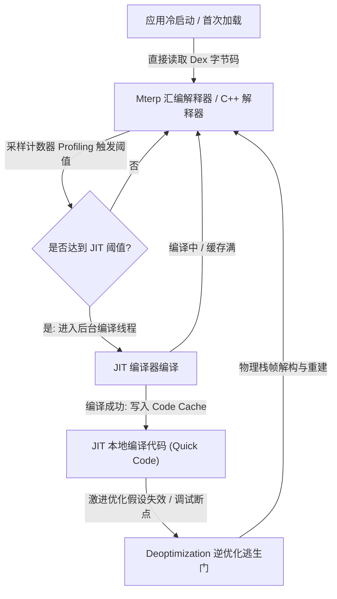
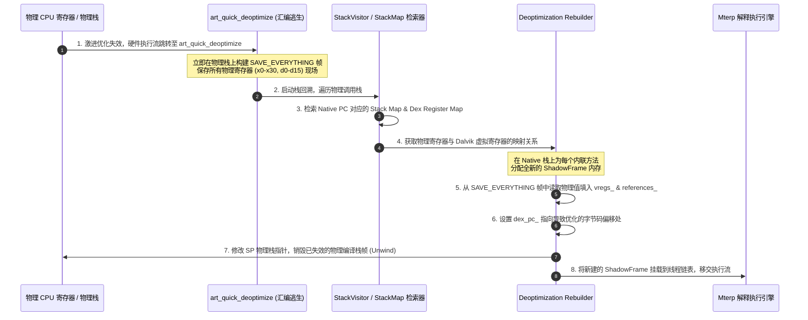
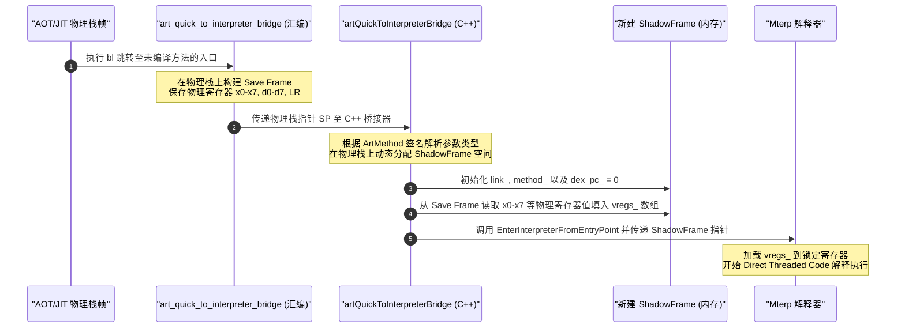
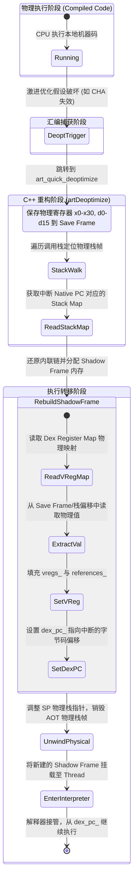

# 2.2.2.3 解释执行

在 Android 运行时代（Android Runtime, ART）中，尽管 AOT（Ahead-Of-Time）和 JIT（Just-In-Time）编译技术提供了接近原生的执行性能，但**解释器（Interpreter）**依然是虚拟机底层架构中最核心、最稳固的基石。它不仅负责应用的冷启动与无延迟执行，还在 JIT 缓存管理、运行时调试、异常处理以及高难度的“逆优化（Deoptimization）”逃生门机制中扮演着无可替代的角色。

本文将从物理与硬件执行层面，深度解构 ART 虚拟机的解释执行系统，剖析其双重执行引擎的底层设计、物理寄存器映射、Shadow Frame（阴影栈帧）的内存布局，以及解释执行与本地编译代码（Compiled Code）之间的双向跳板桥接与逆优化时的物理栈帧重构。

---

## 1. 解释执行在 JIT+AOT 混合编译背景下的持续定位与必要性

随着 Android 版本的演进，ART 虚拟机的编译策略经历了从单一的 AOT（Android 5.0 - 6.0 的全量 OAT 编译）向 **Interpreter + JIT + AOT 混合编译模式**（Android 7.0 及以后版本）的演进。在当前最新的 Android 14/15 体系中，解释执行不再是一个被逐步淘汰的“过渡期引擎”，而是整个运行时得以安全、高效运转的控制中心。



### 1.1 冷启动与“零延迟”执行的需求
当用户安装或更新一个应用时，若强行在安装阶段进行全量 AOT 编译，会导致极长的等待时间，并占用成倍的设备存储空间。
* **瞬时启动**：解释器允许应用在安装或系统升级完毕后“立即启动”。虚拟机可以直接读取 `.dex` 字节码文件，逐条指令地进行解释并执行，免去了漫长的编译过程。
* **能效与存储控制**：大部分应用中，只有 10% ~ 20% 的代码属于频繁被调用的“热点代码”。对于剩下 80% 以上的“冷代码”，使用解释器执行可以节省大量的物理存储空间（编译后的机器码体积通常是 Dex 的 2~3 倍）以及编译时的 CPU 功耗。

### 1.2 运行时 Profile 数据的唯一来源
JIT 与 AOT 编译器之所以能够进行高度优化的编译，完全依赖于在运行期收集到的真实 Profile 监控数据。
* **收集机制**：在解释器执行期间，ART 通过插入轻量级的 Profiling 计数器，记录方法的调用频次、循环回跳次数（Backedge Loop Counts），以及类型反馈（Type Feedback，例如某个虚方法调用处实际传入的类类型）。
* **落盘与复用**：这些数据在应用闲置且充电时，会被写入 `/data/misc/profiles/` 目录下的配置文件中。后续的后台 AOT 编译器（通过 `dex2oat`）会读取这些 Profile，将对应的热点方法编译为机器码，实现“常用常新”的渐进式优化。如果脱离了解释器的前导监控，编译器将失去所有优化依据。

### 1.3 JIT Code Cache 的内存限额与抖动兜底
JIT 编译生成的 Native 代码保存在 RAM 中的 `JIT Code Cache` 中。由于移动设备内存资源的敏感性，系统通常会将 Code Cache 限制在几十兆字节以内。
* 当缓存达到上限时，ART 会启动 JIT 垃圾回收（JIT GC），将不常运行或相对较冷的方法的本地机器码从内存中丢弃，将其执行入口（Entrypoint）重新指向解释器。
* 在 JIT 后台线程正在编译某个方法的间隙，如果该方法已经被高频调用，为了防止阻塞线程，执行流会立刻回到解释器执行。这种“软降级”机制确保了应用运行的流畅度。

### 1.4 调试器挂载与运行期监控（Instrumentation）
在 Java 调试协议（JDWP）中，断点（Breakpoint）、单步调试（Step Into/Over）以及字段修改监听（Watchpoint）要求虚拟机能够精确到字节码（Dex PC）级别进行控制。
* **指令重排难题**：被编译为 AOT/JIT 的机器码在优化阶段经历了死代码消除、寄存器重分配以及指令重排，使得物理 CPU 指令与 Dex 字节码之间失去了线性的物理对应关系。
* **插桩介入**：一旦开发者挂载了 DDMS/Android Studio 调试器，或者系统开启了全局监控，ART 会通过修改 `ArtMethod` 结构体中的 `entry_point_from_quick_compiled_code_`，将后续所有的方法调用强行导流向解释器。只有解释器才能以“一字节码一跳转”的节奏稳定运转，确保物理寄存器状态能精确反射回 Java 变量。

---

## 2. ART 解释器的双重物理引擎剖析

为了兼顾“执行速度”与“移植/调试便利性”，ART 虚拟机在底层实现了两套截然不同的解释执行引擎：基于手写平台汇编优化的 **Mterp (Mach-Interpreter)**，以及基于 C++ 语言实现的 **Switch-Interpreter (C++ 解释器)**。

---

### 2.1 汇编解释器（Mterp）

Mterp 是 ART 虚拟机的核心解释执行引擎。在支持的硬件架构（ARM, ARM64, x86, x86_64）上，Mterp 的每个 Dalvik 指令处理器（Handler）都是用汇编语言手工编写的。

#### 2.1.1 传统 Switch-Case 分派的分支预测灾难
在普通的虚拟机设计中，解释器通常是一个巨大的 `switch-case` 循环。每一个字节码在处理完毕后，都会通过 `continue` 返回到循环的头部，重新进行下一次分派。

在物理执行层面，这种结构会生成类似于如下的汇编：
```assembly
// 传统的 Switch-Case 分派汇编示意
loop_start:
    ldrb    w0, [x19]       // 从当前的 Dex PC (x19) 读取 1 字节的操作码 (Opcode)
    adrp    x1, jump_table  // 加载跳转表基地址
    add     x1, x1, w0, lsl #3
    ldr     x2, [x1]        // 查表获取对应 case 的 Handler 物理地址
    br      x2              // 间接分支跳转到对应的 case 处理逻辑
```
这种设计在现代流水线 CPU 上会引发严重的**分支预测器（Branch Predictor）**失效：
* **单跳转点污染**：由于所有指令的处理函数最后都要回到 `br x2` 这一条物理跳转指令上，CPU 的分支目标缓冲（Branch Target Buffer, BTB）只能记录一个跳转历史。
* **流水线清空**：当相邻执行的字节码发生变化时（如从 `OP_MOVE` 变成 `OP_ADD_INT`），BTB 几乎 100% 预测失败。流水线预测失败意味着 CPU 必须清空当前已加载的十几条指令流水线，造成高达 15 ~ 20 个物理时钟周期的延迟。

#### 2.1.2 Direct Threaded Code（直跳表）设计
Mterp 引入了 **Direct Threaded Code (直接线索化代码)** 机制，彻底消除了全局集中的 `switch` 跳转点。

在 Mterp 中，每一个 Dalvik 指令处理函数的尾部，都**自带**下一条指令的读取与分派逻辑。这样，间接跳转指令被分散到了 200 多个不同的 Handler 物理尾部。

```
[Mterp 局部 Handler 跳转机制]
+----------------------------------------------------------------------------+
|  OP_MOVE 汇编 Handler (首地址 0x1000)                                       |
|  - 执行具体的赋值物理动作                                                     |
|  - 加载下一条指令 Opcode                                                    |
|  - 查表计算目标地址                                                          |
|  - br xTRAMP (物理直接跳转到下一个 Handler，例如 OP_ADD_INT)                  |
+----------------------------------------------------------------------------+
                                     |
                                     v (直接跳转，无需返回全局分派器)
+----------------------------------------------------------------------------+
|  OP_ADD_INT 汇编 Handler (首地址 0x2000)                                    |
|  - 执行具体的加法物理动作                                                     |
|  - 加载下一条指令 Opcode                                                    |
|  - br xTRAMP (直接跳转到再下一条)                                            |
+----------------------------------------------------------------------------+
```

对于 CPU 分支预测器而言，它可以在每个 Handler 尾部的跳转指令上建立**局部的跳转关联**。例如，在实际的 Java 字节码中，`OP_MOVE` 指令后面高概率紧跟 `OP_INVOKE_*`。物理 CPU 的 BTB 会记录 `OP_MOVE` 的尾部跳转经常去往 `OP_INVOKE`，从而使分支预测成功率从不足 20% 提升到 90% 以上，极大地提高了执行效率。

#### 2.1.3 ARM64 物理寄存器锁定策略（Register Pinning）
为了避免在解释执行每条指令时都去物理内存中读写变量，Mterp 在 ARM64 架构下实施了严格的**物理寄存器锁定策略**。在 Mterp 引擎的执行周期内，ARM64 的部分核心寄存器被独占，禁止任何其他临时变量占用：

| 物理寄存器 | 锁定角色名称 | 具体物理含义与作用 |
| :--- | :--- | :--- |
| `x19` | `rSELF` | 指向当前线程的 `Thread*` 结构体。用于快速访问当前线程的 JNI 环境、异常状态及安全点（Safepoint） |
| `x20` | `rPC` | 指向当前正在执行的 Dalvik 字节码内存地址（Dex PC）。每次指令执行完毕，该寄存器会自增对应字节数 |
| `x21` | `rFP` | 指向当前正在运行的方法的阴影栈帧（Shadow Frame）中的 `vregs_` 虚拟寄存器变长数组首地址 |
| `x22` | `rREFS` | 指向当前栈帧的对象引用镜像数组首地址（`references_`），专门服务于 Exact GC |
| `x23` | `rIBASE` | 锁定 Mterp 跳转表（Jump Table）的基地址。用于在指令尾部进行快速查表偏置 |
| `w24` | `wINST` | 缓存当前指令的代码数据（包含 Opcode 及其相关的 A/B/C 操作数） |

#### 2.1.4 Mterp 汇编指令分派与执行走读
以下以 ARM64 架构下，一个典型的 Dalvik 寄存器相加指令 `add-int vA, vB, vC`（Opcode 为 `0x90`）在 Mterp 中的真实汇编实现为例，进行物理级分析：

```assembly
/*
 * Dalvik 字节码: add-int vA, vB, vC (格式 23x)
 * 物理作用: 读取 vB 和 vC 寄存器的 32 位整型值，相加后写入 vA 寄存器
 * 寄存器锁定状态:
 *   rFP  (x21): 指向 ShadowFrame 虚拟寄存器数组
 *   rPC  (x20): 指向当前 Dalvik 指令首地址
 *   rIBASE(x23): 跳转表基地址
 */

.global Mterp_op_add_int
.type Mterp_op_add_int, %function
Mterp_op_add_int:
    /* 1. 解包指令操作数 */
    ldrb    w1, [rPC, #1]              // 加载 A 操作数 (目标寄存器索引 vA)
    ldrb    w2, [rPC, #2]              // 加载 B 操作数 (源寄存器 1 索引 vB)
    ldrb    w3, [rPC, #3]              // 加载 C 操作数 (源寄存器 2 索引 vC)

    /* 2. 从物理内存（Shadow Frame 虚拟寄存器数组）中加载数据 */
    ldr     w2, [rFP, w2, uxtw #2]     // w2 = rFP[vB] (每个 vReg 占 4 字节，故左移 2 位)
    ldr     w3, [rFP, w3, uxtw #2]     // w3 = rFP[vC]

    /* 3. 执行物理 CPU 运算 */
    add     w0, w2, w3                 // w0 = w2 + w3

    /* 4. 将运算结果写回 Shadow Frame 物理内存，并清除对应的引用标记 */
    str     w0, [rFP, w1, uxtw #2]     // rFP[vA] = w0
    str     wzr, [rREFS, w1, uxtw #2]   // 将 references_[vA] 置为 0 (wzr 为零寄存器)，防止 GC 误识别其为对象引用

    /* 5. 提取并分派下一条指令 (Direct Threaded Code 核心) */
    ldrh    wINST, [rPC, #4]!          // rPC 前移 4 字节指向下一条指令，并读入 16 位新指令到 wINST
    and     w1, wINST, #0xFF           // 提取低 8 位作为下一个 Opcode
    add     x1, rIBASE, x1, lsl #7     // 每个 Handler 在跳转表中占用 128 字节 (2^7) 对齐，计算目标 Handler 地址
    br      x1                         // 物理跳转到下一个 Handler
```
从上述汇编可以看出，整个 `add-int` 的读取、解包、寻址、物理运算、写回以及向下一条指令的分派，仅仅耗费了 9 条 CPU 汇编指令，且不经过任何全局分派器，物理效率极高。

---

### 2.2 C++ 解释器（Switch-Interpreter）

尽管 Mterp 在速度上无可挑剔，但由于其完全使用汇编编写，维护成本极高，且无法在一些复杂的安全检查及调试状态下提供灵活的 C++ 级别控制。为此，ART 保留了基于纯 C++ 实现的 `Switch-Interpreter`（核心函数为 `ExecuteSwitchImpl`）。

#### 2.2.1 核心数据结构与控制流
C++ 解释器的核心是一个巨大的 `while(true)` 循环，在其中通过 `switch(inst->Opcode())` 进行分派。其逻辑大致如下：

```cpp
template<bool do_access_check, bool transaction_active>
JValue ExecuteSwitchImpl(Thread* self, const DexFile::CodeItem* code_item,
                         ShadowFrame& shadow_frame, JValue result_of_direct_of_virtual) {
  const Instruction* inst = Instruction::At(code_item->insns_ + shadow_frame.GetDexPC());
  
  while (true) {
    uint32_t dex_pc = shadow_frame.GetDexPC();
    inst = Instruction::At(code_item->insns_ + dex_pc);
    
    // 安全点检查 (Safepoint check)
    self->AllowThreadSuspension(); 

    switch (inst->Opcode()) {
      case Instruction::ADD_INT: {
        uint32_t vA = inst->VRegA_23x();
        uint32_t vB = inst->VRegB_23x();
        uint32_t vC = inst->VRegC_23x();
        shadow_frame.SetVReg(vA, shadow_frame.GetVReg(vB) + shadow_frame.GetVReg(vC));
        inst = inst->Next_23x();
        shadow_frame.SetDexPC(shadow_frame.GetDexPC() + 4);
        break;
      }
      case Instruction::MOVE: {
        // ... 赋值逻辑
        break;
      }
      // 200多个 Case
    }
  }
}
```

#### 2.2.2 C++ 解释器的物理劣势
1. **栈上读写开销**：由于没有物理寄存器锁定策略（`rFP`、`rPC` 等），C++ 编译器生成的机器码需要频繁从内存（物理栈）中读取 `shadow_frame` 结构体的成员地址，这会产生大量的 `ldr/str` 内存访问。
2. **严重的 BTB 污染**：每次 `break` 之后，CPU 都会跳转回 `while` 循环的头部进行下一次 `switch` 判断，这形成了物理上的“单跳转点”，彻底废掉了 CPU 的分支预测器。

#### 2.2.3 C++ 解释器的必要性与安全边界
尽管性能较差，但在以下场景中，ART 会强制从 Mterp 降级（Fallback）到 C++ 解释器执行：
* **事务模式（Transaction Mode）**：在 Android 系统编译（OTA/AOT 阶段）或类初始化阶段，有些代码需要在“事务”保护下执行（如果类初始化失败，需要回滚所有状态修改）。C++ 解释器通过模板参数 `transaction_active=true` 支持对每次内存修改进行记录与回滚，而汇编级别的 Mterp 无法承载如此复杂的软件状态监控。
* **访问权限检查（Access Check）**：当遇到未经过验证（Verification Failed）的 Dex 字节码或动态生成的类时，需要严格检查类/成员的访问权限（如 `private`/`protected`）。C++ 解释器通过 `do_access_check=true` 模板分支提供完善的运行时权限校验逻辑。
* **物理移植兜底**：当 ART 适配新的物理指令集（例如 RISC-V 架构早期）时，在手写汇编的 Mterp 尚未移植完毕前，纯 C++ 编写的 Switch-Interpreter 是保证系统能够拉起并运行的唯一桥梁。

---

## 3. 宿主执行栈帧：Shadow Frame（阴影栈帧）微观解剖

由于解释执行不能占用物理 CPU 的硬件栈帧（否则会破坏 Native 栈的完整性，且无法处理动态的虚拟寄存器映射），ART 在 Native 物理栈上划分出了一个个虚拟的执行单位——**Shadow Frame（阴影栈帧）**。

### 3.1 Shadow Frame 内存布局与物理开销

`ShadowFrame` 是一个非 C++ 标准的对象，其大小在运行时动态决定。为了消除在堆中分配内存带来的 GC 压力，`ShadowFrame` 通常直接使用当前线程的物理 C++ 栈（Native Stack）空间，通过变长数组分配（`alloca` 汇编指令）创建。

在 `art/runtime/stack.h` 中，其物理内存布局非常紧凑，具体字段如下：

```cpp
class ShadowFrame {
 private:
  // 头部元数据 (固定大小)
  const uint32_t number_of_vregs_; // 逻辑虚拟寄存器个数 (4 Bytes)
  ShadowFrame* link_;              // 链表指针，指向前一个调用者的阴影栈帧 (8 Bytes)
  ArtMethod* method_;              // 指向当前方法元数据的指针 (8 Bytes)
  uint32_t dex_pc_;                // 缓存当前的字节码偏移量 (4 Bytes)

  // 变长数组部分 (紧随结构体尾部)
  // uint32_t vregs_[number_of_vregs_];          // 存储基本数据类型和对象地址的低 32 位
  // mirror::Object* references_[number_of_vregs_]; // 同步存储对象引用指针 (GC 扫描目标)
};
```

这种双数组（`vregs_` 和 `references_`）同步的物理结构虽然会多消耗一倍的栈内存，但换取了极高的物理存取性能：
* **基本类型存取**：`GetVReg(i)` 直接计算物理地址 `vregs_ + i` 进行读取。
* **引用类型存取**：`GetVRegReference(i)` 直接读取 `references_ + i`。

---

### 3.2 引用精确型垃圾回收（Exact GC）在解释器中的物理支撑

在 Java 垃圾回收中，准确地区分“一个 64 位的值究竟是一个普通的整型，还是一个指向堆内存的 Java 对象地址”至关重要。

* **保守型 GC 的缺陷**：如果无法区分，GC 只能将所有长得像指针的数据都当作活跃对象处理，从而导致大量垃圾对象无法被回收。
* **ART 引用精确型 GC 方案**：
  * 当 GC 触发时，GC 线程会挂起所有工作线程，并对工作线程的物理栈进行回溯（Stack Walking）。
  * 遍历到当前线程正在解释执行的方法时，GC 能够从 `Thread` 的 `tlsPtr_.managed_stack` 中读出最顶层的 `ShadowFrame` 物理地址，并通过 `link_` 指针遍历整条调用链。
  * GC 不需要去猜测 `vregs_` 里的数据，它只扫描 `references_` 数组。如果 `references_[i]` 中的指针非空，则说明该虚拟寄存器中存放的是一个活跃的 Java 对象引用。GC 会将其加入标记队列，并在必要时更新该指针以应对“对象移动型 GC”（如 Semi-Space 或 Mark-Compact）。
  * 在 Mterp 执行 `add-int` 等涉及非引用赋值的操作时，必须将对应的 `references_` 槽位清零（如上面汇编中的 `str wzr, [rREFS, w1, uxtw #2]`），以避免残留的旧对象指针引起 GC 误判。

---

## 4. 解释器与本地编译代码（JIT/AOT）的桥接与无缝调用机制

在 ART 混合编译运行期，由于 AOT/JIT 机器码运行在**物理 CPU 寄存器和物理栈**上，而解释器运行在 **Shadow Frame 和虚拟寄存器**上，两者在进行相互调用时，必须通过被称为 **Trampoline（跳板）** 的汇编转换层进行过渡。

```
                       +----------------------------------+
                       |           解释器环境              |
                       |       (Shadow Frame 栈帧)        |
                       +----------------+-----------------+
                                        |
                 (1) 解释器调本地码      | (2) 本地码调解释器
                 通过 Interpreter Bridge| 通过 Quick Bridge
                                        v
                       +----------------------------------+
                       |          物理 CPU 环境            |
                       |       (AOT/JIT 物理编译栈帧)      |
                       +----------------------------------+
```

---

### 4.1 解释执行方法调用本地编译代码（Interpreter -> Compiled Code）

当解释器在执行过程中遇到一条 `OP_INVOKE_VIRTUAL` 等方法调用指令，且检测到目标 `ArtMethod` 已经存在编译好的本地机器码（Quick Code）时，控制流必须切换到机器码执行。

#### 4.1.1 传参约定的物理转换
解释器当前的参数都放在 `ShadowFrame::vregs_` 中，而目标机器码符合标准 ARM64 ABI 调用约定（例如参数 1 占 `x0`，参数 2 占 `x1` 等）。

#### 4.1.2 物理桥接流程与汇编动作
1. **定位跳板**：解释器查看目标 `ArtMethod` 的 `entry_point_from_interpreter_` 字段。若该方法已被编译，则该指针默认指向 `art_interpreter_to_compiled_code_bridge`。
2. **物理跳板参数装载**：跳转到该桥接函数后，这是一段高度平台相关的汇编代码，它会做如下物理动作：
   * 遍历目标方法的签名描述符，计算出参数的类型与个数。
   * 读取当前 `ShadowFrame::vregs_` 数组。
   * 按照 AArch64 调用约定，将第 1 个参数拷贝到 `x0`/`d0` 中，第 2 个拷贝到 `x1`/`d1` 中，以此类推。
   * 若参数超过 8 个，通过汇编指令 `sub sp, sp, #Offset` 抬高物理栈指针，将多余参数依次拷贝到物理栈的内存空间中。
3. **环境切换并跳转**：
   * 清除 Mterp 的寄存器锁定状态（因为即将进入的 Compiled Code 并不需要锁定这些寄存器）。
   * 从 `ArtMethod` 结构体中读取真正的本地代码入口 `entry_point_from_quick_compiled_code_`。
   * 执行汇编跳转：`br xSELF`（在此处 `xSELF` 寄存器存放了目标机器码的首地址），正式进入物理机器指令流。

---

### 4.2 本地编译代码调用解释执行方法（Compiled Code -> Interpreter）

这种情况发生在本地编译代码（AOT/JIT）在物理 CPU 上执行时，调用了一个**尚未被编译**（即需要解释执行）的方法。此时，物理机器码不可能自己去构建一个 `ShadowFrame`，它只会按照物理 ABI 约定将参数塞进寄存器（`x0`-`x7`）并跳转。

#### 4.2.1 触发桥接：`art_quick_to_interpreter_bridge`
未编译方法的 `entry_point_from_quick_compiled_code_` 默认指向统一的解释跳板：`art_quick_to_interpreter_bridge`（用纯汇编编写）。

在 ARM64 架构下，该跳板的物理处理流程如下：

```assembly
/*
 * 位于 art/runtime/arch/arm64/quick_entrypoints_arm64.S
 * 物理作用: 接收物理寄存器中的参数，在物理栈上构建临时保存区，然后切入 C++ 桥接逻辑
 */
.global art_quick_to_interpreter_bridge
.type art_quick_to_interpreter_bridge, %function
art_quick_to_interpreter_bridge:
    // 1. 在物理栈上构建一个 Callee-Save 栈帧，保存所有可能传递参数的寄存器
    // 包括整型寄存器 x0-x7, 浮点寄存器 d0-d7, 以及返回地址寄存器 LR (x30)
    SETUP_SAVE_REFS_AND_ARGS_FRAME

    // 2. 准备调用 C++ 桥接函数 artQuickToInterpreterBridge
    // 参数 1: Thread* self (x0)
    mov     x0, xSELF
    // 参数 2: ArtMethod* (由调用者传入，存放在 x0 寄存器中，在 SETUP_SAVE... 中已被移入栈中)
    // 参数 3: CalleeSaveFrame* (sp，即刚才保存了全部寄存器的物理栈首地址)
    mov     x1, sp

    // 3. 调用 C++ 层的桥接分配器
    bl      artQuickToInterpreterBridge

    // 4. C++ 桥接器返回后，说明解释执行的方法已执行结束
    // 恢复先前保存的物理寄存器现场，并将 C++ 返回的返回值(放入 x0/d0) 准备返回给调用者
    RESTORE_SAVE_REFS_AND_ARGS_FRAME
    ret
```

#### 4.2.2 物理级重建阴影栈帧的微观流程
当汇编跳板调用 C++ 层的 `artQuickToInterpreterBridge` 时，虚拟机需要在当前的 C++ 栈上“无中生有”地重建一个 `ShadowFrame`，其微观物理动作如下：

```
物理栈帧状态转换示意：

+-------------------------------+
|   调用者 AOT 方法的物理栈帧    | (物理 CPU 直接访问)
+-------------------------------+
|  Save Refs and Args Frame     | (汇编压栈，保存了调用时的 x0-x7, d0-d7)
+-------------------------------+ <--- 传入 C++ 桥接器的 SP 地址
               |
               v [物理参数解包与重构]
+-------------------------------+
|  新建的逻辑 Shadow Frame      | (在 Native 栈上分配)
|  - link_ 指向伪 AOT 栈帧       |
|  - method_ = 目标 ArtMethod*  |
|  - dex_pc_ = 0                |
|  - vregs_[0] <- 读自 Save Frame 中的 x0 (this 引用)
|  - vregs_[1] <- 读自 Save Frame 中的 x1
|  - vregs_[2] <- 读自 Save Frame 中的 d0
+-------------------------------+
```

具体重建步骤与实现细节：
1. **参数分析**：C++ 桥接代码首先读取被调用方法的参数签名。
2. **分配内存**：通过 `alloca` 或在当前 Native 栈上动态分配一块连续内存，大小为 `sizeof(ShadowFrame) + (num_vregs * 8)`（每个 vReg 的数据和引用各占 4 字节）。
3. **填充头部元数据**：
   * 将新 `ShadowFrame` 的 `link_` 指针指向 Thread 当前活跃的栈顶，构建逻辑调用链。
   * 将 `dex_pc_` 设为 0。
   * 将 `method_` 设为目标未编译方法的 `ArtMethod` 指针。
4. **参数解包（Unpacking）**：
   * 启动 `QuickArgumentVisitor` 迭代器，该迭代器知道物理 ABI 是如何将参数分配到物理寄存器和物理栈上的。
   * 从 `Save Refs and Args Frame` 的内存镜像中，依次提取出原始的参数数值。
   * 将提取出的数值写入新 `ShadowFrame` 的 `vregs_` 数组中；如果是对象类型，则将其写入 `references_` 中。
5. **进入解释器**：调用 `interpreter::EnterInterpreterFromEntryPoint`，将 CPU 执行流导向 Mterp 汇编 Handler（第一条指令处），正式开始解释执行。

---

## 5. 逆优化（Deoptimization）时本地栈帧向阴影栈帧（Shadow Frame）重构的物理动作

**逆优化（Deoptimization）**是整个虚拟机架构中技术难度最高的底层动作之一。当本地机器码在物理 CPU 上高速运行时，如果因为激进优化的“先验假设”破灭，机器码无法继续往下走，虚拟机必须在**当前执行的那一条指令**上，将当前的物理 CPU 执行现场（寄存器和物理栈帧）解构，并重建成解释器所需的 `ShadowFrame`，然后将执行控制权移交给解释器。



---

### 5.1 激进优化假设失效的典型场景
AOT/JIT 编译器在编译机器码时，会使用极具冒险性的假设以追求极致的编译优化：
* **分支偏向假设（Branch Bias）**：根据 Profile 数据，某个 `if` 分支有 99.9% 的概率不成立。编译器将不成立的分支直接编译为线性物理指令，而将成立的分支移出主流程，甚至不为其生成机器码，转而生成一个“逆优化存根”（Deopt Stub）。如果运行期该分支真的成立了，必须发生逆优化。
* **类层次分析（CHA）失效**：某个多态虚方法在编译时只有一个已加载的子类实现。编译器直接将虚方法调用（Virtual Call）去虚拟化（Devirtualization），优化成了静态直接调用甚至内联（Inline）。当运行期动态加载了该接口的第二个实现类时，内联的机器码立刻失效，必须就地逆优化。
* **边界检查消除（BCE）优化失效**：编译器证明了某个循环内数组访问不会越界，从而去掉了物理的 `cmp` 指令。如果运行期外部输入导致了越界，物理 CPU 触发信号中断，系统捕获后被迫发起逆优化进行安全处理。

---

### 5.2 逆优化触发入口：`art_quick_deoptimize`
当优化失效的分支被执行时，机器码会通过 `bl` 指令跳转到逆优化的全局汇编入口：

```assembly
/*
 * 位于 art/runtime/arch/arm64/quick_entrypoints_arm64.S
 * 物理作用: 保护发生逆优化那一刻的所有 CPU 物理寄存器，调用 C++ 层的栈重构逻辑
 */
.global art_quick_deoptimize
.type art_quick_deoptimize, %function
art_quick_deoptimize:
    // 1. 保护所有物理寄存器 (x0-x30, d0-d15) 到物理栈上，构建 SaveEverythingFrame
    SETUP_SAVE_EVERYTHING_FRAME

    // 2. 传递当前物理栈指针 SP 给 C++ 逆优化处理器
    mov     x0, xSELF        // 参数 1: Thread* self
    mov     x1, sp           // 参数 2: ArtMethod** (物理栈首地址)
    bl      artDeoptimize    // 调用 C++ 实现

    // 3. 正常情况下，artDeoptimize 不会直接返回，它会直接跳转到解释器入口
    // 如果返回，说明发生严重错误
    brk     0
```

---

### 5.3 核心算法：基于 Stack Map 的物理栈解构与重建

C++ 层的 `artDeoptimize`（位于 `art/runtime/entrypoints/quick/quick_deoptimize_entrypoint.cc`）接收到物理栈指针 `sp` 后，启动极其复杂的物理重构流程。

#### 5.3.1 Stack Map（栈映射表）与 Dex Register Map 的检索
为了在机器码中找到 Java 变量的投影，ART 编译器在编译时会输出 **Stack Map** 结构。
* 当 CPU 运行到 Native 地址 `PC_target` 时，`artDeoptimize` 会通过二进制检索，找到与 `PC_target` 匹配的 `StackMap` 节点。
* 该节点包含的 `DexRegisterMap` 详细编码了在当前 Native 地址处，Dalvik 虚拟寄存器 `v_i` 与物理载体之间的映射：

```cpp
enum DexRegisterLocation::Kind {
  kInStack,           // 存放在物理栈帧的某个偏移位置 (Stack Slot)
  kInRegister,        // 存放在某个物理寄存器中 (e.g. w2)
  kInFpuRegister,     // 存放在 FPU 寄存器中 (e.g. s0)
  kConstant,          // 该值是一个编译期常数 (直接编码在 Stack Map 中)
  kNone               // 当前寄存器未存活，无值
};
```

#### 5.3.2 物理栈重构的三步法

##### 第一步：栈回溯与内联链展开（Inline Chain Unrolling）
由于编译器可能将方法 `A` 内联了 `B`，`B` 内联了 `C`，但在物理栈上只有一个 `A` 的栈帧。
1. `StackVisitor` 在回溯时，利用 `StackMap` 中的 `InlineInfo` 元数据，得知当前 Native PC 实际上代表了三层嵌套调用。
2. 逆优化引擎将从最内层（C）开始，向上到 B，再到 A，依次为这三个被内联的方法规划构建三个独立的 `ShadowFrame`。

##### 第二步：提取物理寄存器与栈槽数据
针对每一个待构建的 `ShadowFrame`，依次执行：
1. **分配栈空间**：在 C++ 栈上动态分配变长内存作为临时的 `ShadowFrame` 载体。
2. **状态还原迭代**：
   * 遍历该方法声明的全部 `number_of_vregs_` 个 Dalvik 寄存器。
   * 查询 `DexRegisterMap` 得到虚拟寄存器 `v_i` 的物理位置。
   * **若为 `kInRegister`**：读取 `SAVE_EVERYTHING_FRAME` 中保存的对应物理寄存器（如 `x5`）的数值，写入新 `ShadowFrame` 的 `vregs_[i]`。
   * **若为 `kInStack`**：计算物理栈槽地址 `sp + Offset`，读取该内存的 32 位值，写入 `vregs_[i]`。
   * **若为 `kConstant`**：直接读取 `StackMap` 中的常量，写入 `vregs_[i]`。
   * **若为对象引用**：必须同步更新 `references_[i]` 的值，保证 GC 的精确追踪。
3. **指令偏移对齐（Dex PC Alignment）**：从 `StackMap` 中读取当前机器指令对应的 `Dex PC` 偏移（即发生逆优化的那一条 Dalvik 指令位置），写入 `ShadowFrame::dex_pc_`。

##### 第三步：栈销毁（Stack Unwinding）与控制流跳转
1. **栈指针调整（Unwinding）**：将当前线程的 `Thread::tlsPtr_.managed_stack` 中的物理栈帧节点卸载，并将新建的 `ShadowFrame` 链表挂载到线程的逻辑栈顶。
2. **释放物理栈空间**：通过汇编指令直接修改物理 CPU 的栈指针 `SP`，将其重置为**调用者**的物理栈帧顶端。这意味着刚才执行机器码的那一个物理编译栈帧被“物理销毁”。
3. **物理跳转**：获取最内层 `ShadowFrame` 的 `dex_pc_` 以及方法指针，计算出对应的 Mterp 汇编 Handler 地址，通过汇编直接跳转（`br`）到该 Handler 头部执行。

至此，原先处于物理 CPU 运行状态的机器码，在中途被完美地解构并降级为了逻辑栈帧，解释执行无缝地在安全状态下继续运行。

---

## 6. 双向栈帧转换与逆优化流程图解

为了更直观地展现上述复杂的物理栈帧转换，以下分别给出**本地编译代码调用解释执行方法**与**发生逆优化时物理栈帧向 Shadow Frame 重构**的时序与空间布局变化。

### 6.1 本地编译代码调用解释器（Compiled Code -> Interpreter）



### 6.2 逆优化栈帧物理重构（Deoptimization Frame Rebuild）



---

## 7. 总结与设计取舍

ART 虚拟机解释执行系统的设计，是计算机体系结构中**“软件抽象”与“硬件物理特性”**深度融合与博弈的产物。

| 特性维度 | Mterp 汇编解释器 | C++ 解释器 (Switch-Interpreter) | 本地编译机器码 (JIT/AOT) |
| :--- | :--- | :--- | :--- |
| **执行载体** | 平台汇编 (手写) | 纯 C++ 编译器生成机器码 | 编译器直接生成的物理 CPU 机器码 |
| **分派机制** | Direct Threaded Code (直跳表) | 全局大 Switch-Case 循环 | 无分派开销 (硬件 PC 自增/跳转) |
| **栈帧结构** | Shadow Frame (阴影栈帧) | Shadow Frame (阴影栈帧) | 物理 CPU 栈帧 (Stack Frame) |
| **寄存器利用** | 物理寄存器锁定策略 | 依赖 C++ 编译器分配 | 完全自由分配与硬件优化 |
| **启动延迟** | 零延迟 (无需等待编译) | 零延迟 (无需等待编译) | 存在编译开销 (JIT 编译/AOT 预编译) |
| **典型应用场景** | 混合编译下的冷启动、热点探测前导 | 运行时调试、插桩监控、安全边界兜底 | 热点方法高频执行、核心计算逻辑 |

通过 **Mterp** 极其精妙的汇编直跳表设计，ART 很大程度上克服了传统解释器在现代流水线 CPU 上的分支预测开销。通过 **Trampoline** 与 **Stack Map** 建立起的双向栈帧转换与逆优化逃生机制，则让 ART 虚拟机能够放心地在本地编译代码中实施极为激进的性能优化，一旦遇到运行期异常，又能安全无缝地降级回解释器。

正是这种高度复杂但天衣无缝的物理协作，才使得 Android 系统在有限的内存与功耗约束下，既能实现应用的“秒开”，又能提供极为流畅的运行期体验。
