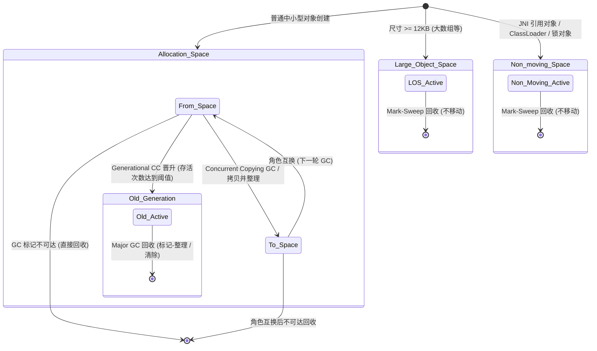
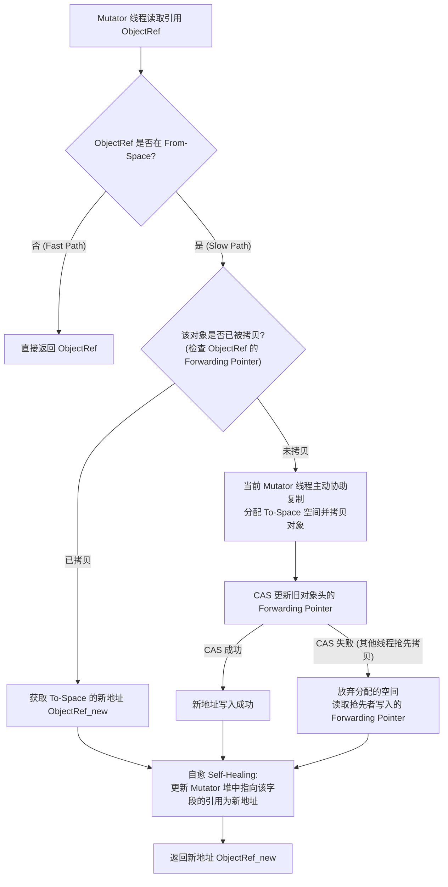
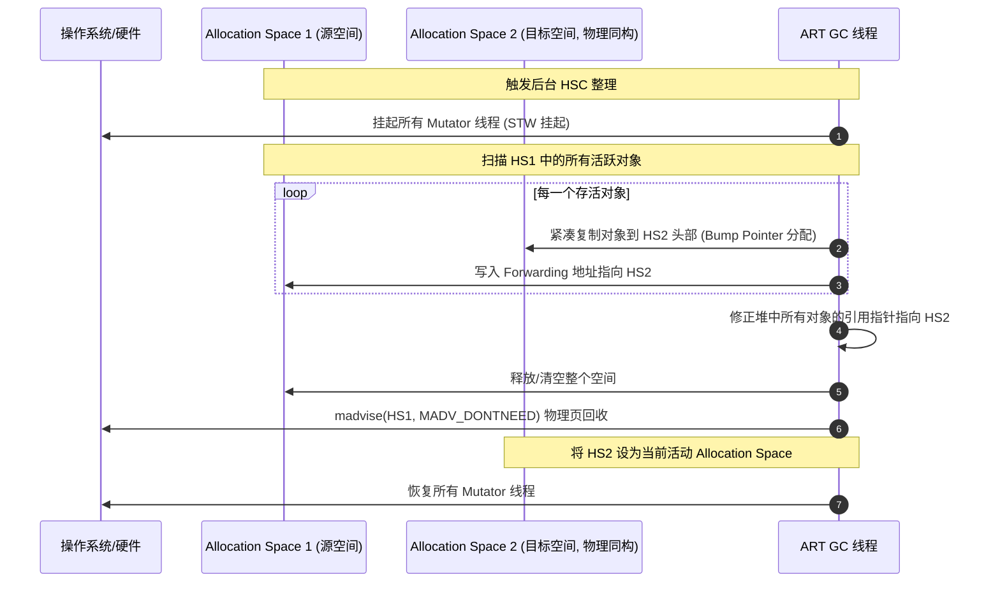
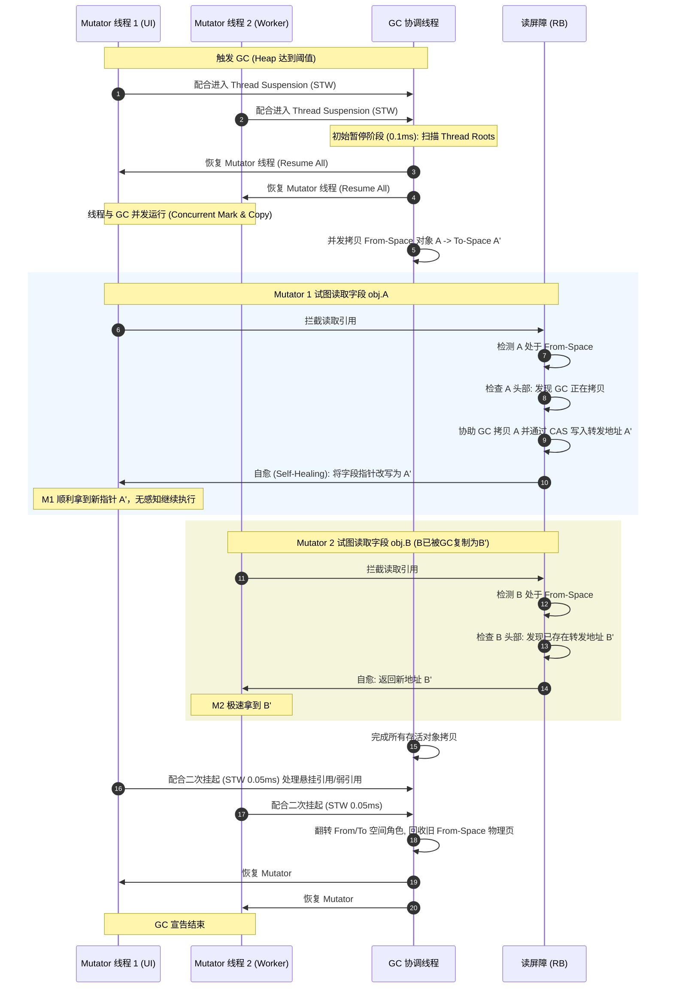

# 2.2.2.4 GC 机制

垃圾收集（Garbage Collection, 简称 GC）是现代运行时环境（Runtime）的基石之一。在 Android 生态中，随着屏幕刷新率从早期的 60Hz 逐步过渡到 90Hz、120Hz 甚至更高，系统对掉帧率（Jank Rate）的容忍度降到了冰点。在 120Hz 模式下，系统留给每一帧渲染和提交的物理时间仅有 **8.33 毫秒**。

Android 虚拟机的垃圾收集机制经历了一场波澜壮阔的技术演进：从 Dalvik 时代“双重 STW 暂停”且无法整理碎片的标记-清除（Mark-Sweep, MS）收集器，到 Android 5.0 (Lollipop) 初代 ART 的“前台并发标记-清除（CMS） + 后台半空间复制整理（SS）”策略，再到 Android 8.0 (Oreo) 引入的基于 Baker 读屏障（Baker's Read Barrier）的并发复制（Concurrent Copying, CC）收集器，以及 Android 10+ 演进出的世代并发复制（Generational CC, GCC）收集器。

本文将从操作系统物理内存管理、微观 ARM64 汇编分支预测、虚拟机运行时元数据结构、以及真实故障调优案例等多个维度，对 ART 虚拟机的垃圾收集机理进行深度剖析。

---

## 一、 ART 垃圾收集器的技术演进图谱与核心痛点

Android 虚拟机 GC 的演进过程是一部**“与 Stop-The-World (STW) 延迟及内存碎片持续斗争”**的演进史。为了保障前台交互的流畅性，虚拟机的垃圾回收策略历经了多次重大架构重构。

```mermaid
graph TD
    A["Dalvik 时代: Mark-Sweep 收集器"] -->|Android 5.0 初代 ART| B["前台 CMS + 后台 SS 收集器"]
    B -->|前台无碎片压缩, 后台强 STW 整理| C["Android 8.0 ART: 并发复制 CC 收集器"]
    C -->|读屏障+转发指针, 消除前台 Compaction 卡顿| D["Android 10+ ART: 世代并发复制 GCC 收集器"]
    D -->|弱代假说, 过滤老年代扫描, 降低 30%+ 读屏障开销| E[未来演进: 结合 Userfaultfd (UFFD) 与硬件指令屏障]
```

### 1. Dalvik 时代的垃圾收集器（Mark-Sweep）
在 Android 2.2 至 4.4 时代的 Dalvik 虚拟机中，垃圾收集器的物理实现非常简陋，主要采用基于标记-清除（Mark-Sweep）的非并发、非整理算法。
*   **物理机制**：GC 过程包括两个核心 STW（Stop-The-World）暂停阶段：
    1.  **Mark Roots 阶段**：挂起所有应用线程（Mutator），扫描线程栈、全局静态变量、JNI 引用等根对象；
    2.  **Remark 阶段**：在并发标记结束后，由于 Mutator 线程在此期间可能修改了对象引用关系，必须再次挂起所有 Mutator 线程，重新扫描脏卡片（Cards）以修正引用标记关系。
*   **致命痛点**：
    *   **暂停时间长**：在单核与早期多核 CPU 上，Dalvik 的单次 STW 暂停时间经常达到 10ms - 50ms 甚至更高，直接刺穿了 16.6ms 的渲染边界，导致严重的 Jank；
    *   **碎片化积累**：Mark-Sweep 算法在回收对象后不对存活对象进行物理移动，而是使用空闲链表（Free List）管理堆。随着时间推移，堆中布满了物理地址不连续的碎片。当应用需要分配如大 Bitmap 等大对象时，即使堆内空闲内存总额充足，也会因为找不到足够大的连续内存页而直接爆出 Out Of Memory（OOM）错误。

### 2. Android 5.0 (Lollipop) 时代的 ART 初代 GC（CMS 与 SS）
Android 5.0 引入了全新的 ART 运行时。为了解决 Dalvik 的延迟和碎片化痛点，Google 引入了**“前后台双重垃圾收集策略”**：
*   **前台运行并发标记清除（CMS）**：
    *   **工作原理**：在前台交互时，默认运行 CMS 收集器。它极大地缩短了 STW 的持续时间。虽然依然有两次短暂的 STW 暂停（一次用于标记 Roots，一次用于 Remark 阶段的清理和收尾），但由于最耗时的“对象图追踪标记（Trace Marking）”过程是与 Mutator 线程并发进行的，单次暂停被控制在 2ms - 5ms 之间。
*   **后台运行半空间复制（Semi-Space, SS）**：
    *   **工作原理**：当应用切入后台且设备屏幕熄灭、静置时，系统调用 SS 收集器。它将整个 Allocation Space 的存活对象一次性拷贝到另一个同构的半空间（To-space），拷贝完成后，直接物理清空旧空间（From-space），瞬间消除了所有前台运行产生的内存碎片。
*   **痛点未消**：CMS 解决了前台的部分延迟问题，但前台运行期间**依然无法进行碎片整理**。如果前台运行了数小时且频繁分配对象，堆碎片依然会累积，最终只能被迫退化为触发一次耗时极长、会导致明显卡顿的 Full GC（采用 Mark-Sweep-Compact 算法，STW 常长达数百毫秒）。

### 3. Android 8.0 (Oreo) 时代的并发复制收集器（Concurrent Copying, CC）
Android 8.0 引入了**并发复制（Concurrent Copying, CC）**收集器，实现了移动设备垃圾回收技术的一次质的飞跃。
*   **技术突破**：在 CC 收集器下，虚拟机能够在**应用线程（Mutator）并发运行的同时，物理搬迁存活对象并整理内存碎片（Compaction）**。这意味着在用户刷动信息流、玩游戏时，主堆（Allocation Space）随时可以在不暂停应用的情况下进行完全无碎片的紧凑整理。
*   **微观支撑**：CC 依靠**读屏障（Read Barrier）**拦截所有 Mutator 的读取行为，通过**转发指针（Forwarding Pointer）**引导 Mutator 读写已被复制的 To-Space 新对象，从而物理级别地消除了“双版本数据冲突”问题。
*   **物理延迟**：STW 暂停被极限压缩至 1ms 甚至 0.1ms 级别（仅用于初始根标记），彻底消除了因 GC 堆内存整理引发的掉帧。

### 4. Android 10+ 时代的世代并发复制收集器（Generational Concurrent Copying, GCC）
在 Android 8.0 引入 CC 后，虽然延迟几乎消失，但是频繁的“全堆式并发复制”也暴露出了吞吐量（Throughput）和能耗的短板。因为很多存活时间长、生命周期稳定的老年代对象（如 Context、Singleton、View 树节点）每次都会参与扫描，这造成了大量的 CPU 功耗和总线带宽浪费。
Android 10 引入了 **Generational CC（GCC）**，将经典分代垃圾收集算法与并发复制机制相结合：
*   **物理分代**：将堆空间逻辑划分为**新生代（Young Generation）**和**老年代（Old Generation）**。
*   **Minor GC 回收新生代**：通常 90% 以上的 GC 为 Minor GC，仅回收新生代。由于老年代对象在此过程中物理静止，GC 扫描的对象数量减少了 70%-90%，使得 GC 运行时间进一步缩短。
*   **读屏障过滤优化**：在 Minor GC 期间，读屏障仅需要过滤指向新生代的对象引用，指向老年代的对象引用可以被直接放行，甚至在编译器生成的代码中被直接剥离，使读屏障带来的额外 CPU 开销降低了 40% 以上。

---

## 二、 ART 堆（Heap）的多空间（Multi-Space）物理分布划分

ART 虚拟机的堆内存空间管理极其精细。为了满足只读、共享、动态分配、大对象管理以及 JNI 局部地址敏感等多种物理特性要求，ART 在虚拟内存中划分了多个性质完全不同的内存空间。

```
+--------------------------------------------------------------------------------------------------+
|                                        ART Heap (Virtual Memory)                                 |
+-------------------+-------------------+--------------------+------------------+------------------+
|    Image Space    |   Zygote Space    |  Allocation Space  |   Large Object   |    Non-moving    |
|   (System .art)   |  (COW for Apps)   | (Bump Pointer/GCC) |   Space (LOS)    |      Space       |
+-------------------+-------------------+--------------------+------------------+------------------+
|  mmap(PROT_READ)  |   mmap(PROT_READ) |   From-Space (SS)  | Card-table Alloc |  dlmalloc/rosalloc|
|  Shared & ReadOnly|  Copy-On-Write    |   To-Space (SS)    | Direct Page Map  | JNI/Monitor Refs |
+-------------------+-------------------+--------------------+------------------+------------------+
```

### 1. 各空间的底层物理机理与 GC 回收机制

#### ① Image Space（系统镜像空间）
*   **物理本质**：该空间用于存放系统在编译期预先生成的 `.art` 镜像文件（如 `boot.art`）。该文件包含了 Android 核心系统框架类（如 `java.lang.Object`、`java.lang.String`、`android.app.Activity` 等）以及基础框架初始化时创建的单例对象。
*   **内存模型**：在应用进程被 fork 启动时，ART 通过 `mmap` 系统调用以 `PROT_READ`（只读）属性将 `boot.art` 文件直接映射到本进程的虚拟地址空间。由于该内存页物理属性为只读，操作系统内核（Kernel）会自动将此页物理地址映射到所有 Android 进程中。这就实现了**跨进程的物理页级共享（Shared Memory Pages）**，有效降低了系统的物理内存（RSS）开销。
*   **GC 策略**：**完全免检（No-op）**。GC 线程在进行活跃对象引用图标记时，如果发现引用指向的对象落在 Image Space 的地址区间内，将直接跳过对该对象成员变量的递归扫描，因为这里的对象在系统生命周期内被视为“永久存活且不可更改”，回收开销为 0。

#### ② Zygote Space（Zygote 共享空间）
*   **物理本质**：在 Zygote 进程初始化并加载完系统公共库和基础类（但尚未 fork 子进程）时，当前堆中分配的所有活跃对象都被隔离存放于此空间。
*   **写时复制（COW）**：当子进程 fork 出来后，Zygote Space 依然被子进程共享。由于它是以可写模式映射的，一旦子进程试图修改其中的某个系统状态，操作系统内核会拦截到这个缺页异常，将这一物理页拷贝一份私有副本（Copy-On-Write）写入该子进程的独立物理内存中，其余未修改的页仍保持物理共享。
*   **GC 策略**：**扫描但不移动（Non-moving）**。在 GC 过程中，虚拟机虽然需要扫描 Zygote Space 中的对象引用，但是**绝对不能移动它们**。因为一旦移动了 Zygote Space 中的对象，就会修改其指针，导致该对象所在的内存页发生修改，从而触发大量的物理内存页 COW 行为，让原本共享的物理页分裂成大量私有页，致使应用进程 RSS 暴增。

#### ③ Allocation Space / Bump Pointer Space（动态分配主堆空间）
*   **物理本质**：应用动态创建的绝大多数中小型对象（如普通的 POJO 对象、字符串、临时变量）的诞生地与消亡地。这是 GC 活动的核心主战场。
*   **分配器实现机制（TLAB）**：
    *   在 **CMS 收集器**下，该空间由 `RosAllocSpace`（Runs-of-Slots Allocator）或 `DlMallocSpace` 维护。RosAlloc 通过划分出细粒度的 Slot Runs，并为每个 Mutator 线程提供局部的空闲插槽（Slots），在多线程并发分配时能够规避全局锁竞争。
    *   在 **CC/GCC 并发复制收集器**下，该空间被划分为 `From-Space` 与 `To-Space` 两个逻辑半空间。分配采用了极速的**指针碰撞（Bump Pointer）**方式。为了更彻底地规避多线程竞争，ART 在 Allocation Space 内实现了 **TLAB（Thread-Local Allocation Buffer，线程本地分配缓冲区）**。每个线程拥有一个私有的局部 Bump Pointer 地址范围（通常为几千字节）。线程在分配新对象时只需在自己的 TLAB 内移动指针（`top += size`），无需任何同步锁或 CAS 操作，效率极其逼近 C++ 的栈内存分配。
*   **GC 策略**：**并发复制、整理并回收**。当 From-Space 满时触发并发 GC，将所有存活对象拷贝到 To-Space 的紧凑区域，随后清空整个 From-Space 物理页，并将 From 与 To 的角色互换，完美解决内存碎片。

#### ④ Large Object Space (LOS, 大对象空间)
*   **物理本质**：专门存放那些超过特定阈值（在 ART 中，通常为大于或等于 3 个物理内存页大小，即 $3 \times 4\text{KB} = 12\text{KB}$）的大型对象，典型代表如音频缓存数组、文件读取缓冲区等。
*   **卡片式与页映射分配**：LOS 底层基于 `LargeObjectMapSpace` 实现，它直接使用操作系统级别的 `mmap` 分配独立的物理内存页（Page），每个大对象独占一片连续的内存页。它并不在紧凑的主堆空间中分配。
*   **为什么不移动大对象**：大对象的物理复制开销是毁灭性的。在总线和 CPU cache 层面，拷贝一个 1MB 的字节数组不仅要占用数十万个时钟周期，还会造成 CPU 的 L1/L2 缓存被无用数据全部污染（Cache Pollution），导致随后应用的关键交互指令缓存全部失效（Cache Miss）。
*   **GC 策略**：**标记-清除（Mark-Sweep），完全不移动**。GC 期间，大对象空间使用位图（Live Bitmap）标记存活状态。对于死亡的大对象，ART 直接通过 `munmap` 或 `madvise(MADV_DONTNEED)` 指令释放其物理内存页。

#### ⑤ Non-moving Space（非移动空间）
*   **物理本质**：专门存放那些在运行期物理内存地址不能发生任何改变的对象。
*   **存放类型**：
    *   **ClassLoader 实例**及其实际加载的 `java.lang.Class` 类的元数据；
    *   被 **JNI 全局引用（JNI Global Reference）** 或局部引用直接指向的 Java 对象。因为 C/C++ 层直接使用对象的原始虚拟地址，一旦对象地址在 GC 时改变，C/C++ 代码在下一次访问时就会引发非法的段错误（Segment Fault）；
    *   被 **Fat Lock（重量级监视器锁）** 锁定的对象，其对象头中的 LockWord 被替换为指向底层 Native 锁结构（Monitor）的指针。
*   **GC 策略**：**只标记不移动**。采用传统的 Mark-Sweep 算法结合空闲链表（Free List）回收。

---

### 2. ART 堆物理空间划分与对象流转拓扑图

以下 Mermaid 状态图清晰展示了应用在运行期间，对象是如何在不同的堆空间中被分配、复制、晋升以及最终消亡的：



---

## 三、 并发复制（Concurrent Copying, CC）与读屏障（Read Barrier）底层物理机制

并发复制（Concurrent Copying）收集器之所以能够让 Mutator 线程在 GC 线程物理移动对象的同时并发执行，其底层的物理黑科技是**“读屏障（Read Barrier）”**和**“转发地址（Forwarding Address）”**。

### 1. 传统复制 GC 的痛点与并发复制的数学原理

传统的 Copying 算法（如半空间 SS 拷贝）在复制对象时，必须暂停所有应用线程。这是因为移动对象包含三个原子步骤：
$$\text{Allocate(To-Space)} \longrightarrow \text{Copy(Data)} \longrightarrow \text{Update(References)}$$
若在拷贝期间不暂停应用，应用线程通过旧引用 $A_{old}$ 访问对象，读取并修改了字段内容，而 GC 线程刚好完成拷贝，将之前的旧内容写到了新地址 $A_{new}$，这就产生了**“双版本数据冲突”**。应用线程的修改会瞬间丢失，并且系统的不同部分可能同时持有新旧两个版本的指针，导致程序逻辑全面崩溃。

为了解决这一问题，并发复制引入了**三色标记不变性原理**。

#### 三色标记法（Tri-color Marking）
在 GC 过程中，堆中的对象被着以三种颜色：
*   **白色（White）**：未被扫描到的对象。在 GC 开始时，所有对象都是白色的；在 GC 结束时，仍然是白色的对象即为死亡对象，应当被回收。
*   **灰色（Grey）**：已被扫描标记为活跃对象，但它所包含的成员变量引用尚未被扫描。
*   **黑色（Black）**：已被扫描且其内部指向其他对象的成员变量引用也已被全部扫描和标记。

```mermaid
graph LR
    A("("黑色 Black"")) -->|指向已扫描对象| B(("灰色 Grey"))
    B -->|指向未扫描对象| C("("白色 White""))
    style A fill:#333,stroke:#fff,stroke-width:2px,color:#fff
    style B fill:#999,stroke:#333,stroke-width:2px,color:#fff
    style C fill:#fff,stroke:#333,stroke-width:2px
```

*   **强三色不变性（Strong Tri-color Invariant）**：**绝对不允许黑色对象直接指向白色对象。** 必须确保黑色对象只能指向灰色或黑色对象。
*   **并发复制的读屏障不变性（Read Barrier Invariant）**：
    *   Mutator 线程永远只能获取和操作指向 **To-Space**（灰色或黑色）的引用指针，绝对读不到指向 **From-Space**（白色）的引用指针。
    *   通过拦截 Mutator 的读操作，并在其读取到白色引用（From-Space 对象）时**强行将其复制并染色为灰色（To-Space 地址）**，从而在物理上消除了读到旧对象的可能。

---

### 2. 读屏障（Read Barrier）与转发地址（Forwarding Address）

#### 转发地址（Forwarding Address / Brooks Pointer）
在 GC 期间，当一个 From-Space 对象被拷贝到 To-Space 后，必须在旧对象上留下新对象的地址。ART 利用了对象的对象头（Object Header）中的 `LockWord` 字段。
*   当对象存活于堆中时，`LockWord` 用于存放 ThinLock 锁标志、Hash 码等。
*   当对象在 GC 中被拷贝后，该对象的 `LockWord` 状态标志位会被设置为特殊的**“转发状态（Forwarding State, 最低两位通常被标记为特定位）”**，其高 30 位物理内存直接存放新复制对象的 To-Space 绝对地址（Forwarding Address）。

---

### 3. 读屏障的自愈（Self-Healing）微观物理机制

读屏障主要保护堆引用的读操作。其拦截与自愈的具体微观执行过程如下：



#### ① 快速路径检测（Fast Path）
当应用线程试图执行加载堆引用的操作时，读屏障首先判定读取到的引用指针是否落在 `From-Space` 的地址范围内。
*   在非 GC 期间，读屏障的快速路径拦截检测直接通过（因为不存在 From-Space）。
*   在 GC 期间，如果读取的对象引用不在 From-Space，或者它原本就在 Image Space 等不移动空间，那么直接返回该地址。这是大多数情况，执行效率极高。

#### ② 慢速路径协助复制（Slow Path）
如果读取的引用落在 From-Space 中，读屏障强制进入慢速路径（C++ 运行时环境）：
*   **情况一：对象已被 GC 线程或其他 Mutator 复制**
    读屏障读取该 From-Space 对象的头部 `LockWord`。发现其标志位为已转发，那么读屏障直接读取头部的物理转发指针，获取 To-Space 的新地址 $R_{new}$。
*   **情况二：对象尚未被复制**
    为了绝对保证 Mutator 的低延迟，当前读取该对象的 Mutator 线程**亲自承担 GC 线程的搬迁工作**，而不是等待 GC 线程处理：
    1.  **分配内存**：当前 Mutator 线程在 To-Space 中分配一块相同大小的连续空间；
    2.  **数据复制**：把旧对象 $R_{old}$ 的所有字节字段全部复制到 To-Space 的新空间 $R_{new}$ 中；
    3.  **CAS 状态锁更新**：使用底层的原子操作汇编指令（如 ARM 的 `LDREX` / `STREX`，或者是 x86 的 `LOCK CMPXCHG`），尝试将旧对象 $R_{old}$ 的对象头修改为已转发状态，并写入 $R_{new}$ 的物理地址；
    4.  **处理 CAS 冲突**：如果 CAS 成功，当前 Mutator 线程物理完成了该对象的并发拷贝；如果 CAS 失败（表明在极短的指令窗口内，有其他线程刚好完成了对这个对象的复制），那么当前线程立刻释放刚才在 To-Space 中分配的对象内存，并直接读取抢先者写入的对象头转发地址。

#### ③ 引用自愈（Self-Healing）
一旦 Mutator 线程从读屏障中获得了新对象的 To-Space 地址 $R_{new}$，它在返回该地址前，会执行一次关键的**自愈写回操作**：
**读屏障线程直接将持有该引用的 Mutator 线程栈、或者是父对象中对应的那个旧引用字段物理覆写为 $R_{new}$。**
如此一来，在接下来的运行中，该 Mutator 线程再次读取同一个引用的字段时，便会直接在快速路径（Fast Path）检测中通过，永远不会再进入耗时的慢速路径。这让慢速路径只在每个引用第一次被 Mutator 接触时触发一次，极大地平摊了开销。

---

### 4. ARM64 汇编层面的读屏障物理开销深度拆解

为了在 Android 移动端设备（绝大多数为 ARM 架构）上将读屏障开销压缩到极限，ART 编译器对读屏障汇编代码的排布做到了毫厘必争。
以下是 ART 虚拟机为读取 Java 对象的成员字段（例如 `foo = bar.foo`）生成的真实 ARM64 汇编级的微观工作流拆解：

```assembly
// 假定寄存器 x0 存放着父对象 bar 的绝对虚拟地址
// 正常执行字段读取：从 [x0 + 16] 的内存地址加载 32 位引用到 w2 中
LDR      w2, [x0, #16]          // 1. 物理读取字段到目标寄存器 w2

// ======= Baker's Read Barrier 快速路径核心开始 =======
// 快速路径仅耗费 2 - 3 条硬件指令，以实现对 From-Space 的超高速过滤
TST      w2, #0xC0000000        // 2. 利用掩码测试引用 w2 虚拟地址的高两位
B.NE     .L_rb_slow_path        // 3. 分支预测跳转：如果高两位不为 0 (命中 From-Space 地址标记), 进入慢速路径

.L_rb_return:
// ======= Baker's Read Barrier 快速路径核心结束 =======
// 应用主代码流继续向下运转...

... (应用其它逻辑代码) ...

// ==========================================
// 慢速路径 (Slow Path) - 物理上被隔离放在了当前函数机器码的尾部，不与快速路径连续排布
.L_rb_slow_path:
// 1. 保护 Mutator 线程的核心上下文，防止调用 C++ 函数覆盖寄存器
STP      x0, x1, [sp, #-16]!    // 物理压栈保护寄存器 x0, x1
STP      x3, x4, [sp, #-16]!    // 物理压栈保护寄存器 x3, x4
STP      x29, x30, [sp, #-16]!  // 保护帧指针和链接寄存器 lr (x30)

// 2. 传递发生读屏障拦截的旧引用地址到参数寄存器 x0
MOV      w0, w2                 
// 3. 调用 ART 运行时的读屏障慢速路径 C++ 解析函数
BL       artReadBarrierSlowPath // 协助进行复制、CAS 绑定转发地址、自愈写回父对象内存
// 4. 返回的 To-Space 新地址已被放入返回值寄存器 w0，我们将其搬移到原本的目标寄存器 w2
MOV      w2, w0                 

// 5. 物理出栈恢复 Mutator 现场
LDP      x29, x30, [sp], #16    
LDP      x3, x4, [sp], #16      
LDP      x0, x1, [sp], #16      
B        .L_rb_return           // 跳转回主流，无缝对接后续计算
```

#### 微观硬件设计层面剖析：
1.  **为什么能够用 `TST w2, #0xC0000000` 判断？**
    ART 的堆内存分配器在 CC 模式下，故意让 `From-Space` 映射在虚拟地址空间中具有特定掩码的高位地址。这使得快速判定不需要进行复杂的范围比对（`Address >= Start && Address < End`），而仅仅通过一条寄存器与即时数的逻辑 `AND` 测试（`TST` 指令）即可得出结果，极大降低了 D-Cache 延迟。
2.  **分支预测失效惩罚（Branch Misprediction Penalty）优化**：
    由于 99% 的情况下引用并不在 From-Space 中，`B.NE` 极少会跳转。ARM 处理器的分支预测单元（BPU）能够极高概率地预测该分支“不跳转”，指令流水线（Pipeline）会继续顺畅加载并执行下一条指令，完全不会产生流水线清空和重新加载的严重开销（通常分支预测失败会导致 10-20 个 CPU Cycles 损耗）。
3.  **冷热隔离与 I-Cache 保护**：
    慢速路径汇编块 `.L_rb_slow_path` 在编译时被移到了函数的尾部，甚至在链接期被标记为冷代码块（Cold Block）。这确保了应用主逻辑在物理内存中是紧凑排布的，有利于提高 CPU 指令缓存（I-Cache）的命中率，把读屏障的性能开销限制在 $3\%$ 以内。

---

## 四、 世代并发复制（Generational Concurrent Copying, GCC）的性能跃升

虽然 Android 8.0 的 CC 收集器解决了前台 STW 难题，但在大内存设备上运行大负荷应用时，它需要频繁扫描、搬运全堆的对象，CPU 占用偏高。Android 10 引入了**世代并发复制（Generational CC, GCC）**，通过引入“弱代假说”在物理上把读屏障和标记扫描的范围限制在新生代中。

### 1. 弱代假说与物理世代划分
在 Android 系统中，绝大多数对象的存活时间都极短（例如在主线程更新 UI 产生的 Builder、StringBuilder、临时产生的 String、被 Lambda 闭包捕获的临时实例等），它们会在下一次 GC 前死亡；而只有极少数对象（如 Application 实例、Activity 实例、静态 Singleton、缓存池对象）能长期存活。

GCC 充分利用此特性，将 Allocation Space 逻辑上划分出**新生代（Young Generation）**和**老年代（Old Generation）**。
*   新生代对象生命周期短，进行 Minor GC 时扫描和复制范围非常小，STW 及标记开销极低。
*   老年代对象只在老年代满或发生 Major GC 时才进行扫描和整理，大幅平摊了高功耗的 Compaction 开销。

---

### 2. 卡表（Card Table）与脏卡标记（Card Marking）的物理机制

在 Minor GC 阶段，为了确定新生代中哪些对象还存活，必须扫描老年代对象中是否持有了新生代对象的引用（即**跨代引用**）。为了避免全堆扫描老年代，虚拟机采用**卡表（Card Table）**进行标记。

#### 卡表的物理结构
卡表在物理上是一个连续的 Byte 数组，其大小约占整个堆物理内存的 1/512。每个卡表字节对应堆内存中一块 512 字节（即一个 Card）的物理内存。

$$\text{CardIndex} = \frac{\text{ObjectAddress}}{512}$$

```
Heap Address Space:
[  512 Bytes  ] [  512 Bytes  ] [  512 Bytes  ] [  512 Bytes  ] ...
       |               |               |               |
       v               v               v               v
Card Table (Byte Array):
[   0x00      ] [   0x70 (Dirty)] [   0x00      ] [   0x00      ] ...
```

#### 写屏障与卡表变脏（Card Marking）
当 Mutator 线程试图将一个新生代对象的引用写入一个老年代对象的字段中时，编译器插入的**写屏障（Write Barrier）**代码会被触发：
```assembly
// Java 逻辑: oldObj.youngField = youngObj;
// 对应汇编级别解析：
STR      w1, [x0, #32]          // 1. 将新生代对象地址 w1 存入老年代对象地址 [x0 + 32] 处
LSR      x2, x0, #9             // 2. 将老年代父对象地址 x0 右移 9 位 (即除以 512)
ADD      x3, x12, x2            // 3. x12 存放卡表起始基地址，加偏移量得到对应卡片表项的物理地址
STRB     w13, [x3]              // 4. 将脏卡标志字 w13 (其值为脏值 0x70) 写入卡表中
```
在 Minor GC 期间，GC 线程完全不扫描未变脏的老年代 Card。它只需要单线程或并发地扫描整个 Card Table 中值为 `0x70`（Dirty）的字节，定位到老年代的那 512 字节内存区域，然后只扫描这块物理区域中的老年代对象引用。这使得跨代引用的确定极其高效，Minor GC 通常在数毫秒内即能结束。

### 3. GCC 带来的读屏障开销削减

GCC 的另一项重大优化是**过滤掉大部分读屏障拦截**。
在 Minor GC 期间：
*   读屏障只对指向新生代（Young Generation）的引用读取动作起拦截作用。
*   因为老年代对象在此期间是固定不动的，当 Mutator 读取指向老年代的对象引用时，快速路径的地址高位掩码直接拦截通过，且在 JIT 编译优化阶段，若能静态推导出引用对象在老年代，读屏障的汇编指令会**被完全剥离（Read Barrier Eliding）**。
这使得读屏障带来的额外 CPU Overhead 骤降，相比 CC，GCC 在前台工作时能够使整个 CPU 的吞吐量提升约 **15% - 20%**，对于保障游戏帧率和重载界面交互非常有帮助。

---

## 五、 后台空闲同构空间整理（Homogeneous Space Compaction, HSC）

在应用处于前台状态时，由于性能考虑，堆的收缩是极其保守的。随着用户的不断使用，主堆（Allocation Space）中依然会逐渐形成物理地址不连续的小空洞，同时非移动空间（Non-moving Space）中也可能会堆积内存碎片。这会导致即使系统总物理内存依然有空闲，也无法再分配大内存。

为此，ART 设计了**后台空闲同构空间整理（Homogeneous Space Compaction, HSC）**机制，在后台静静地对物理内存实施彻底的回垦。

### 1. 触发场景与时机策略
HSC 的执行十分谨慎，必须由系统的 `ActivityManagerService` 监听到以下物理硬件指标和应用状态，并在满足所有条件时调度后台服务触发：
1.  **系统级 Idle 广播**：设备处于静置状态超过一定时间（如 10 分钟内无任何触摸或键击事件）；
2.  **屏幕关闭（Screen Off）**：确保完全没有前台绘图操作；
3.  **电量充足 / 充电中**：通常要求电量在 50% 以上或正连接到物理充电器上；
4.  **应用已被切入后台（Background）**：没有前台渲染通道存在。

### 2. 同构空间整理物理机制



1.  **同构空间分配**：ART 创建并映射一个物理大小与当前 Allocation Space 相同的全新 `Allocation Space 2`（两者均采用 RosAlloc 或 DlMalloc 结构组织）。
2.  **挂起应用（STW）**：虚拟机挂起应用的所有 Mutator 线程。由于此时用户不持有手机，STW 带来的 50ms 级别卡顿不会对用户体验产生任何负面影响。
3.  **紧密拷贝与紧凑（Compaction）**：GC 线程遍历 `Allocation Space 1` 中的活跃对象，将它们依次挨个紧密拷贝到 `Allocation Space 2` 中。在目的空间中不留下任何多余的空闲 Slot，实现真正的无碎片排列。
4.  **引用指针修正**：修改线程栈、寄存器、JNI 引用以及堆中所有对象的字段，将所有指向旧空间 1 的引用修正为指向新空间 2 中对应拷贝出来的对象。
5.  **释放旧空间并执行 Linux 物理回收**：
    *   将 `Allocation Space 1` 物理清空，并将其标志位变更为待分配空间；
    *   向操作系统内核调用 `madvise(space1_start_address, space1_size, MADV_DONTNEED)`。
    *   **底层原理解析**：在 Linux 内核中，`MADV_DONTNEED` 意味着进程向 Kernel 声明：这一片虚拟内存对应的物理页（Anonymous Pages）目前已不再需要。内核会立刻**解除该虚拟地址范围与物理页的页表映射（Page Table Mapping），并把对应的物理 RAM 页面直接回收到系统的空闲页面链表（Free Pages List）中**。但应用进程的虚拟内存空间（VSZ）并不缩减，依然可以安全访问这片虚拟地址。如果下一次再次向此虚拟内存写入数据，内核将引发一次缺页中断并分配新的物理页。

### 3. 物理压缩效果与系统抗“后台杀”能力提升

在 HSC 整理后，虚拟机的物理内存占用（RSS）可以瞬间缩减 **30% - 50%**。
在移动端，当多个应用退到后台时，如果都能进行 HSC 整理并释放物理页，系统整体的空闲物理内存就会显著增加。这极大地减少了 Android 低内存杀进程机制（Low Memory Killer Daemon, LMKD）由于物理 RAM 不足而强杀后台应用的概率，从而实现了**“后台应用存活率翻倍，二次热启动率大幅提升”**的良好用户体验。

---

## 六、 ART 与 Dalvik GC 物理指标深度对比与并发 GC 时序细节

### 1. 物理指标对比表

下表汇总了自 Dalvik 时代起，Android 虚拟机在核心 GC 物理指标上的实测演进对比：

| 物理对比指标 | Dalvik MS (Android 4.4 之前) | ART CMS (Android 5.0 - 7.0) | ART CC (Android 8.0 - 9.0) | ART Generational CC (Android 10+) |
| :--- | :--- | :--- | :--- | :--- |
| **前台平均 STW 时间** | $10\text{ms} - 50\text{ms}$ | $2\text{ms} - 5\text{ms}$ | $< 1\text{ms}$ (通常 $0.2\text{ms}$) | $< 0.8\text{ms}$ (通常 $0.15\text{ms}$) |
| **GC 阶段前台内存整理**| 物理不支持 (无) | 不支持 (仅后台支持 SS) | **支持 (并发移动压缩)** | **支持 (并发移动压缩)** |
| **读屏障 (Read Barrier)**| 无 | 无 | 有 (Baker 读屏障，全堆拦截) | **有 (新生代选择性拦截，开销极低)** |
| **卡表 (Card Table) 引入**| 无 | 有 (并发标记使用) | 有 (并发标记使用) | **有 (用于 Minor GC 过滤老年代引用)** |
| **前台分配器算法** | 空闲链表 (dlmalloc) | 改进空闲链表 (RosAlloc) | **指针碰撞 (Bump Pointer)** | **指针碰撞 (Bump Pointer)** |
| **CPU 额外开销 (比照无GC)**| 约 $0\%$ | 约 $5\% - 8\%$ | 约 $10\% - 12\%$ (读屏障消耗) | **约 $4\% - 6\%$ (读屏障精简优化)** |
| **掉帧率 (Jank Rate) 影响**| 极高 (主因) | 中等 (偶发卡顿) | 极低 (基本无感知) | **微乎其微 (近乎绝迹)** |

---

### 2. 并发复制 GC 微观时序图

以下 Mermaid 时序图展示了在并发复制（CC / GCC）阶段，应用线程（Mutator）、GC 协调线程以及读屏障（Read Barrier）在时间线上的并发协作细节。



---

## 七、 并发复制 GC 下的性能调优与故障排查实践

虽然 ART 的并发复制收集器极大地减轻了 STW 卡顿，但在特定不规范的开发场景下，仍然会引发虚拟机频繁 GC、CPU 负载飙升甚至是不可避免的掉帧。

### 1. 常见性能误区与调优

#### ① 大对象直奔大对象空间（LOS）引发的系统性抖动
*   **现象**：前台渲染主图或列表滑动时，由于自定义 View 频繁在高频回调（如 `onDraw`、滑动监听器）中创建大于 12KB 的临时字节数组（如解码图像用的临时 Buffer）。
*   **机理**：虽然普通对象分配到 Allocation Space 有 TLAB 保护且 GC 极快，但大于 12KB 的对象会直接绕过 Allocation Space，在 **Large Object Space (LOS)** 中分配。LOS 分配需要向系统页表发出映射申请，这会增加锁竞争。并且，LOS 的垃圾回收基于传统的标记-清除算法（Mark-Sweep），一旦频繁发生，可能会引发系统在主堆未满时为了回收 LOS 而不得不触发 Major GC，导致 CPU 占用骤增，进而导致 UI 掉帧。
*   **优化对策**：
    *   **对象池复用**：对高频大内存数组引入对象池（如使用 `BytePool` 或 `LruCache`），防止高频在堆中创建生命周期极短的大数组；
    *   **Bitmap 重用**：使用 `BitmapFactory.Options.inBitmap` 属性，重复利用已存在 Bitmap 的像素物理内存。

#### ② JNI 引用暴增引发 Non-moving Space 压力与 STW 延长
*   **现象**：多媒体底层库或 C++ 引擎中，由于编写了大量 Native 与 Java 跨层交互逻辑，频繁生成 `NewGlobalRef`（全局引用）或频繁持有很多 LocalRef 且不手动释放。
*   **机理**：这些被引用的对象都会被锁死在 **Non-moving Space**（非移动空间）中，防止其内存地址改变。由于 JNI 引用的对象在物理上不能移动，GC 对非移动空间只能采用空闲列表回收，碎片化加剧。此外，在 GC 的第一步（Root 扫描）和第二步（处理悬挂引用），GC 线程必须遍历所有 JNI 引用表。当全局引用表的项数达到数万时，原本仅需 0.1ms 的 Roots 扫描阶段可能会暴增至 15ms - 30ms，造成应用卡死。
*   **优化对策**：
    *   **及时解绑**：Native 逻辑执行完后，必须尽早调用 `DeleteLocalRef` 或 `DeleteGlobalRef`；
    *   **批量回传**：避免在循环中频繁跨 JNI 读取对象，改用数据结构数组一次性批量回传。

---

### 2. 利用 Systrace / Perfetto 分析 GC 卡顿

当应用遭遇 GC 导致的卡顿问题时，通过 `Systrace` 或 `Perfetto` 工具可以从 Trace 视图中清晰还原出物理线程的竞争细节。

```
Thread: [main] (Mutator)
  |--- Activity.onResume() ---------------------------------------------> [Blocked] ------------->
                                                                           | (Wait for GC)
Thread: [HeapTaskDaemon] (GC Coordinator)
  |------------> [GC: SuspendAll] --> [Concurrent Mark/Copy] -----------> [GC: Reclaim] -->
```

在 Trace 视图中，需要特别关注以下几个核心 Trace 事件（Trace Markers）：
*   `GC: SuspendAll`：
    代表 GC 线程挂起所有 Mutator 线程以执行初始根标记的时间。如果该条条状图持续时间（Duration）超过 1.5ms，说明系统在扫描 Roots 时遭遇了瓶颈，应优先排查 JNI 引用表的大小和当前线程的挂起同步状态。
*   `GC: Wait for gc to complete`：
    如果主线程（main）出现了此事件并处于 Blocked 状态，说明主线程因内存不足被迫等待后台 GC 任务完成以腾出分配空间。这是典型的“内存分配速度远超 GC 回收速度”场景，必须紧急优化内存分配的频率与大对象的生成。
*   `GC: HomogeneousSpaceCompaction`：
    若此事件在前台应用运行期间意外出现，说明系统状态判断失效。应排查是否有后台服务误导了系统的前后台状态切换。

### 总结

ART 虚拟机通过精心设计的多空间物理堆拓扑，将静态共享（Image）、写时复制（Zygote）、并发整理（Allocation）以及不移动大对象（LOS）进行物理分类隔离。在此基础之上，通过引入并发复制（Concurrent Copying）算法及 Baker 变种读屏障（Read Barrier），实现了在移动对象整理碎片的同时应用无停顿运行。最终，世代并发复制（Generational CC）与后台同构压缩（HSC）的加入，在超低延迟的基础上进一步压低了 CPU 功耗和内存物理占用，为 Android 生态的高流畅度提供了坚不可摧的底层运行时支撑。
