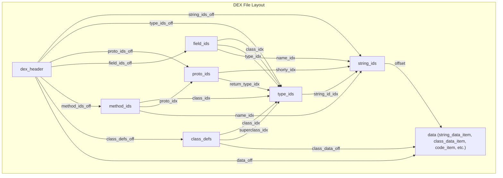
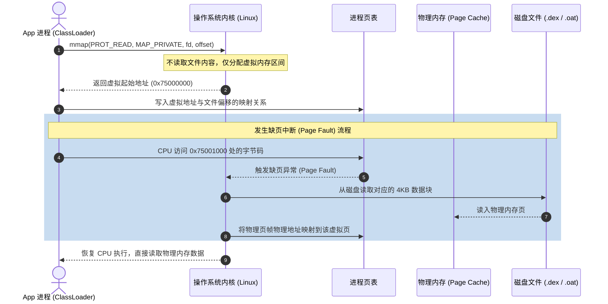
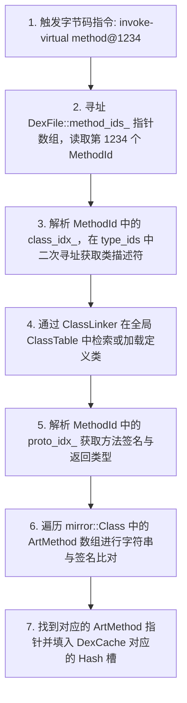
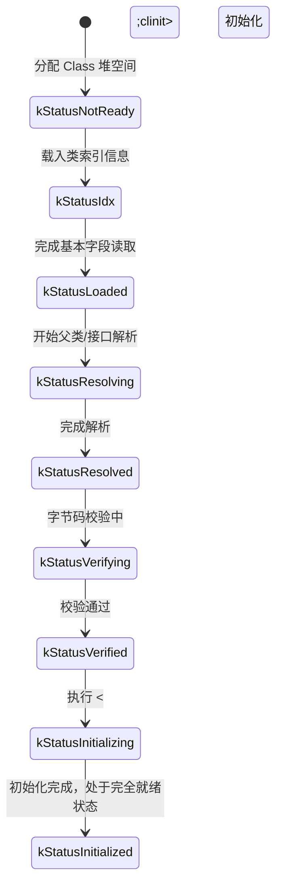

# 2.2.3.1 DEX 结构

在 Android 虚拟机（Dalvik & ART）的演进历程中，DEX（Dalvik Executable）文件始终是其运行的核心载体。相较于标准 Java 虚拟机（JVM）所采用的 `.class` 文件结构，DEX 文件通过将整个工程中所有类的数据进行物理重排与去重合并，设计了一套高度紧凑、硬件友好且极具内存效率的二进制格式。

本文将打破传统的静态格式罗列，深入 Android ART 虚拟机的运行时底层，从磁盘上的静态物理 DEX 布局出发，跨越 Linux 操作系统的 `mmap` 内存映像映射机制，深度解析 C++ 层的 `art::DexFile` 结构体物理建模，剖析运行期常量池缓存 `art::mirror::DexCache` 的无锁 CAS 并发机理与哈希槽设计，并以 `art::ClassLinker` 为核心，物理追踪类加载（DefineClass）与类链接阶段（LinkClass，包括 vtable/itable 物理填充及多层继承下的字段 Gap Filling 偏移计算）的微观物理过程。

---

## 1. DEX 静态文件格式与物理布局深度解析

DEX 文件的核心设计理念是**“多对一的去重与合并”**。在标准 JVM 中，每个 `.class` 文件都拥有自己独立的常量池。如果一个 Java 项目包含数千个类，这些类之间会存在海量的重复数据（如类名、方法名、描述符等），造成严重的物理存储浪费。DEX 将整个工程中所有类的常量、类型、方法和字段声明全部打碎，提取出一个全局唯一的、去重后的公共常量区，进而通过索引表的形式重构成一个扁平的类关系网。

### 1.1 DEX 文件的整体骨架与 Header 物理字节分布

DEX 文件在物理磁盘上是一个连续的二进制流。其文件头部（Header）规定了整个文件的物理元数据，是虚拟机解析并映射 DEX 的起点。

标准的 DEX 头部占 **112 字节（`0x70` 字节）**。下面列出其每一个成员的物理大小与对应的字节偏移位置：

| 字节偏移 (Offset) | 数据类型 (Type) | 成员变量名 | 物理含义与解析逻辑 |
| :--- | :--- | :--- | :--- |
| `0x00 - 0x07` | `uint8_t[8]` | `magic_` | 魔数。例如 `"dex\n035\0"` 或 `"dex\n039\0"`，用于标识合法 DEX 格式及版本。 |
| `0x08 - 0x0B` | `uint32_t` | `checksum_` | Alder-32 校验和。对除 `magic_` 和 `checksum_` 外的整个文件进行校验，防损坏。 |
| `0x0C - 0x1F` | `uint8_t[20]` | `signature_` | SHA-1 签名。对除 `magic_`、`checksum_` 和 `signature_` 外的整个文件做散列。 |
| `0x20 - 0x23` | `uint32_t` | `file_size_` | 整个 DEX 文件的物理大小（以字节为单位）。 |
| `0x24 - 0x27` | `uint32_t` | `header_size_` | 头部结构体的大小，通常固定为 `0x70`（112 字节）。 |
| `0x28 - 0x2B` | `uint32_t` | `endian_tag_` | 字节序标记。固定为 `0x12345678`（小端）或 `0x78563412`（大端）。 |
| `0x2C - 0x2F` | `uint32_t` | `link_size_` | 链接数据段的大小。 |
| `0x30 - 0x33` | `uint32_t` | `link_off_` | 链接数据段的文件物理偏移量。 |
| `0x34 - 0x37` | `uint32_t` | `map_off_` | `MapList` 结构的文件偏移量（描述了所有段的类型和物理位置）。 |
| `0x38 - 0x3B` | `uint32_t` | `string_ids_size_` | 字符串索引表（`string_ids`）项的个数。 |
| `0x3C - 0x3F` | `uint32_t` | `string_ids_off_` | 字符串索引表的物理文件偏移量。 |
| `0x40 - 0x43` | `uint32_t` | `type_ids_size_` | 类型索引表（`type_ids`）项的个数。 |
| `0x44 - 0x47` | `uint32_t` | `type_ids_off_` | 类型索引表的物理文件偏移量。 |
| `0x48 - 0x4B` | `uint32_t` | `proto_ids_size_` | 方法原型索引表（`proto_ids`）项的个数。 |
| `0x4C - 0x4F` | `uint32_t` | `proto_ids_off_` | 方法原型索引表的物理文件偏移量。 |
| `0x50 - 0x53` | `uint32_t` | `field_ids_size_` | 字段索引表（`field_ids`）项的个数。 |
| `0x54 - 0x57` | `uint32_t` | `field_ids_off_` | 字段索引表的物理文件偏移量。 |
| `0x58 - 0x5B` | `uint32_t` | `method_ids_size_` | 方法索引表（`method_ids`）项的个数。 |
| `0x5C - 0x5F` | `uint32_t` | `method_ids_off_` | 方法索引表的物理文件偏移量。 |
| `0x60 - 0x63` | `uint32_t` | `class_defs_size_` | 类定义区（`class_defs`）项的个数。 |
| `0x64 - 0x67` | `uint32_t` | `class_defs_off_` | 类定义区的物理文件偏移量。 |
| `0x68 - 0x6B` | `uint32_t` | `data_size_` | 数据段（`data`）的大小。 |
| `0x6C - 0x6F` | `uint32_t` | `data_off_` | 数据段的物理文件偏移量。 |

#### 字节序标记（Endian Tag）的物理处理
在运行期读取 DEX 时，虚拟机最先加载 `endian_tag_`。如果当前主机的物理字节序（如 ARM/x86 通常是 Little Endian）与该 Tag 标记冲突，说明文件在此类架构下需要进行字节反转。ART 虚拟机在解析阶段会动态调用字节交换函数（Byte Swap），对文件中所有大于 1 字节的整数执行高低位对调，从而统一内部计算视图。

---

### 1.2 五大索引区（Ids Sections）的级联引用机制

Header 之后紧跟着五大核心索引区。这些索引区本质上是连续的、固定大小的结构体数组。通过级联指针关系，它们将类声明、方法签名和字段定义与底层的实际数据进行关联。



1. **`string_ids`**：
   每个表项仅包含一个 `uint32_t string_data_off`，指向 `data` 区中的 `string_data_item`。该 item 的首字节为 ULEB128 编码的字符串长度，其后紧跟着以 `\0` 结尾的 MUTF-8（Modified UTF-8）字节数组。
2. **`type_ids`**：
   每个表项包含一个 `uint32_t descriptor_idx`，它是一个索引值，直接指向 `string_ids` 数组。由此，类型（如描述符 `"Ljava/lang/String;"`）被抽象为了对全局字符串池的引用。
3. **`proto_ids`**（方法原型，Method Prototype）：
   用于描述方法的签名信息（返回类型与参数列表）。每个表项包含：
   - `shorty_idx`：指向 `string_ids` 的索引，简短地用单字符描述签名（如 `"III"` 代表返回 int，参数为两个 int）。
   - `return_type_idx`：指向 `type_ids` 的索引，描述返回值类型。
   - `parameters_off`：指向 `type_list` 的物理偏移。`type_list` 包含了参数个数以及每个参数在 `type_ids` 中的索引数组。
4. **`field_ids`**：
   每个表项描述了一个字段。包含：
   - `class_idx`：指向 `type_ids`，指示该字段属于哪个类。
   - `type_idx`：指向 `type_ids`，指示该字段是什么类型。
   - `name_idx`：指向 `string_ids`，指示该字段的名称。
5. **`method_ids`**：
   每个表项描述了一个方法。包含：
   - `class_idx`：指向 `type_ids`，声明该方法的类。
   - `proto_idx`：指向 `proto_ids`，该方法的参数与返回类型签名。
   - `name_idx`：指向 `string_ids`，方法的名称。

这种高度集中的“全局常量池与多级扁平索引”设计，避免了每个方法和字段重复携带完整类名和类型的冗余信息。

---

### 1.3 数据区与变长编码（ULEB128 / SLEB128）的物理压缩机理

在 DEX 格式中，除了索引表采用固定大小以便于 $O(1)$ 数组随机寻址外，所有的实际数据内容（如字段值、方法字节码、调试行号信息）都存放在 `data` 区中，并大量使用 **`LEB128`（Little Endian Base 128）** 编码进行物理压缩。

#### ULEB128 编解码逻辑
传统的 `uint32_t` 占固定 4 字节（32 位）。但在实际代码中，绝大多数的索引号、常量值、长度值都非常小（例如小于 127）。若用 4 字节存储，高位的 3 个字节全部为 0，构成了极大的存储浪费。
`ULEB128`（无符号 LEB128）采用**变长字节**表示法。每个字节的低 7 位用于存放实际的数值，最高位（第 8 位）作为“连续位（Extension Bit）”：
- 若最高位为 `1`：代表下一个字节依然是该数值的一部分。
- 若最高位为 `0`：代表当前字节是该数值的最后一个字节。

以下是 ART 虚拟机内部的 ULEB128 解码 C++ 源码实现模拟：

```cpp
static inline uint32_t DecodeUnsignedLeb128(const uint8_t** data) {
  const uint8_t* ptr = *data;
  uint32_t result = *(ptr++);
  if (result > 0x7f) { // 说明最高位为 1，还有后续字节
    int cur = *(ptr++);
    result = (result & 0x7f) | ((cur & 0x7f) << 7);
    if (cur > 0x7f) {
      cur = *(ptr++);
      result |= (cur & 0x7f) << 14;
      if (cur > 0x7f) {
        cur = *(ptr++);
        result |= (cur & 0x7f) << 21;
        if (cur > 0x7f) {
          cur = *(ptr++);
          result |= cur << 28; // 第 5 字节，最多支持 32 位整数
        }
      }
    }
  }
  *data = ptr; // 移动指针到解码后的下一位置
  return result;
}
```

#### SLEB128 有符号编解码逻辑
对于包含负数的数据（例如 `debug_info_item` 中的行号变化偏移量，可能向前跳转），DEX 采用 `SLEB128`（有符号 LEB128）。其解码核心在于**符号扩展**。当解码到最后一个字节（最高位为 0）时，必须检查该字节的第 7 位（数值部分的最高位）是否为 1。如果为 1，则需要将解码后的 32 位整型的高位全部补 1，以保持其负数含义：

```cpp
static inline int32_t DecodeSignedLeb128(const uint8_t** data) {
  const uint8_t* ptr = *data;
  int32_t result = 0;
  int shift = 0;
  uint8_t byte;
  do {
    byte = *(ptr++);
    result |= (byte & 0x7f) << shift;
    shift += 7;
  } while (byte >= 0x80);
  // 符号扩展：若该字节的第 7 位（0x40）为 1，将高位全部拉高为 1
  if ((shift < 32) && ((byte & 0x40) != 0)) {
    result |= -(1 << shift);
  }
  *data = ptr;
  return result;
}
```

#### 连续差值编码（Delta Encoding）
在 `class_data_item` 的字段与方法列表中，为了最大限度利用 ULEB128 压缩，DEX 存储的不是绝对的索引 index，而是**相对于前一个索引的差值（Delta）**。
例如，若当前类的静态字段对应的全局 `field_ids` 索引分别为：$5, 12, 13$，则在 `class_data_item` 中会依次存储为：
- 第 1 个字段：`5`（原始值）
- 第 2 个字段：`7`（$12 - 5$）
- 第 3 个字段：`1`（$13 - 12$）

由于差值大多在十几以内，在 ULEB128 编码下仅占用 1 字节，这极大避免了大型 DEX 文件中多余索引号占用的空间。

---

## 2. DEX 文件在 ART 运行时中的内存映像与物理映射（mmap）

当一个 Android 应用启动，或者 ClassLoader 动态加载一个外部 DEX 文件时，系统是如何在物理内存中呈现这个庞大的二进制格式的？这里涉及到操作系统的内存管理精髓与 ART 虚拟机 C++ 层的物理表示。

### 2.1 mmap 物理映像机制与 COW 写时复制

ART 绝对不会通过 `read()` 系统调用将磁盘上的 `.dex` / `.odex` / `.oat` 文件一次性读取到用户态的堆内存中。因为一旦整个文件被读入堆内存，就会使得每个 App 进程都占用了几兆甚至几十兆的物理内存（RAM），且无法被多个应用进程共享。

为了解决这一问题，ART 类加载器在加载 DEX 时，采用的是操作系统层面的**虚拟内存物理映射（`mmap`）**机制。



#### mmap 系统调用的物理过程
当 ART 想要加载一个 DEX 文件时，它会执行如下系统调用：
```c
void* addr = mmap(nullptr, file_size, PROT_READ, MAP_PRIVATE, fd, offset);
```
1. **虚拟地址空间分配**：内核在调用进程的虚拟地址空间内，划出一块长度为 `file_size` 的连续区域，并将其起始地址 `addr` 返回给虚拟机。此时，**没有任何文件数据被读入物理内存（RAM）**。
2. **缺页中断（Page Fault）**：当 ART 虚拟机通过指针访问 `addr + offset` 处的字节码时，MMU（内存管理单元）在页表（Page Table）中发现该虚拟页面尚未映射到实际的物理页帧，随即触发 CPU 缺页中断。
3. **按需装载**：操作系统内核捕获中断，从磁盘读取该页面对应的 4KB 数据块到内核的 Page Cache 中，然后更新进程页表，建立虚拟地址到物理页帧的映射。此时，CPU 恢复运行，透明地完成了数据的读取。
4. **共享内存与 Zygote COW 机制**：
   在 Android 中，系统公共库（如 `framework.jar`）在 Zygote 进程启动时即通过 `mmap` 载入内存。因为设置了 `MAP_PRIVATE` 与 `PROT_READ`，当 Zygote 通过 `fork()` 创建子进程（App 进程）时，子进程直接复制父进程的页表。
   由于页表项指向的是同一批物理内存页，因此所有的 App 进程在物理内存中共享了同一套 framework DEX 字节码数据。只有在极个别情况下，若某个进程尝试修改这块内存（虽然 `PROT_READ` 限制了在普通逻辑下不可写，但在调试或热修复时通过 `mprotect` 修改权限），内核才会触发**写时复制（Copy-On-Write, COW）**，为该进程单独复制一份该物理页，最大化地压榨了系统的 RAM 空间。

#### 物理页面类型与 LMK（Low Memory Killer）的回收差异
- **文件备份页（File-backed Pages）**：
  mmap 映射的 DEX / OAT 属于只读的文件备份页。当系统内存紧张（发生 Low Memory）时，内核可以直接将这些只读的物理内存页释放（Drop），因为它们的物理数据完好保留在磁盘上，下次访问时只需重新触发 Page Fault 读回即可。这不需要写回磁盘，开销极小。
- **匿名页（Anonymous Pages）**：
  若类加载时分配的 `mirror::Class` 或解析缓存 `DexCache` 在 GC 堆中（位于匿名页），由于没有磁盘文件做备份，当内存紧张时，系统必须将其保留，或者如果开启了 ZRAM，需将其压缩写入 Swap 区。如果发生频繁的 COW，原本只读的共享页变成了脏匿名页，系统便无法直接 Drop，只能常驻物理内存或执行 Swap，这会极大加剧 LMK 杀死应用的概率。

---

### 2.2 C++ `art::DexFile` 结构体的数据模型与物理建模

在 ART 运行期，C++ 层的 `art::DexFile` 结构体是描述和操作 DEX 文件的核心载体。它不是 Java 堆对象，而是驻留在 Native 内存中，其本质是一个**只读的无状态（Stateless）数据视图指针集合**。

以下是 `art::DexFile` 核心成员变量与结构定义的剖析：

```cpp
namespace art {
class DexFile {
 protected:
  // 核心内存指引物理成员
  const uint8_t* const begin_;            // 映射到内存中的 DEX 文件起始物理地址（指向 Header）
  const size_t size_;                     // 映射区域的物理大小（字节）
  const std::string location_;            // DEX 文件的绝对路径名（如 /data/app/.../base.apk）
  const uint32_t location_checksum_;      // 路径校验和

  // 映射后的 Header 指针，直接通过 C++ 结构体映射内存数据
  const Header* const header_;

  // 级联引用的静态索引表指针，直接指向 mmap 映射区中的对应偏移地址
  const StringId* const string_ids_;      // 物理指向：begin_ + header_->string_ids_off_
  const TypeId* const type_ids_;          // 物理指向：begin_ + header_->type_ids_off_
  const ProtoId* const proto_ids_;        // 物理指向：begin_ + header_->proto_ids_off_
  const FieldId* const field_ids_;        // 物理指向：begin_ + header_->field_ids_off_
  const MethodId* const method_ids_;      // 物理指向：begin_ + header_->method_ids_off_
  const ClassDef* const class_defs_;      // 物理指向：begin_ + header_->class_defs_off_

  // 内存中查找用的辅助哈希表（OAT 文件中可选附带）
  const LookupTable* lookup_table_;
};
}  // namespace art
```

通过上述指针，ART 虚拟机可以在 native 态以 $O(1)$ 的复杂度直接访问 DEX 内的任意数据结构。
例如，若要获取第 `i` 个方法的名称字符串，在 C++ 代码中只需进行如下简单的指针偏移和读取：
```cpp
const DexFile::MethodId& method_id = dex_file->GetMethodId(i);
const DexFile::StringId& string_id = dex_file->GetStringId(method_id.name_idx_);
const char* method_name = dex_file->GetStringData(string_id);
```

### 2.3 物理内存对齐（Alignment）规范对 CPU 访存性能的决定性影响

DEX 文件在其规范中严格要求各个数据区和表项必须按照 **4 字节边界（4-byte Alignment）** 进行物理对齐。这由现代 CPU 的指令集架构与物理总线宽度决定。

#### CPU 对齐访问与非对齐访问（Misaligned Access）的对比
现代 64 位 CPU（如 ARMv8-A、ARMv9-A）通常以 64 位（8 字节）或 32 位（4 字节）为单位从内存总线中读取数据。

1. **对齐访问**：
   如果一个 `uint32_t` 类型的整数在内存中的地址是 4 的倍数（例如 `0x75000004`），它的四个字节完全落在一个物理的 32 位字宽度内。CPU 只需要发出一次内存读总线事务，即可在**单个时钟周期（Single-cycle）**内将数据装载进寄存器。
2. **非对齐访问**：
   如果该整数放在了 `0x75000003`，它将跨越两个物理 32 位字的边界（第一个字节属于 `0x75000000 ~ 0x75000003`，后三个字节属于 `0x75000004 ~ 0x75000007`）。
   - 此时，CPU 必须发起**两次**物理访存操作。
   - 读取后，CPU 的 ALUs 还必须通过额外的移位和拼接逻辑，将这两个物理字拼接成一个完整的 32 位整数。
   - 更严重的是，如果这个非对齐地址恰好跨越了 **Cache Line**（通常为 64 字节）或**内存页边界**，将引发两次 Cache Line 填充甚至引发二次缺页中断，这会导致访存延迟瞬间暴增数倍至数十倍。

| 内存物理地址排布 | 0x00 | 0x01 | 0x02 | 0x03 | 0x04 | 0x05 | 0x06 | 0x07 | 访存次数 | CPU 周期数 |
| :--- | :---: | :---: | :---: | :---: | :---: | :---: | :---: | :---: | :---: | :---: |
| **对齐数据 (At 0x04)** | | | | | Byte0 | Byte1 | Byte2 | Byte3 | **1次** | **1 周期** |
| **非对齐数据 (At 0x03)**| | | | Byte0 | Byte1 | Byte2 | Byte3 | | **2次** | **多周期+拼接** |

因此，DEX 文件在编译阶段（D8/R8），就会在非对齐的数据结构之间强制插入 `pad` 填充字节（如 `ClassDef` 结构体中的 `pad1_` 和 `pad2_`），以保证虚拟机在运行时，通过指针直接强转内存数据时，能够达到最高的访存性能。

---

## 3. 运行期类检索与常量池解析缓存 —— `art::mirror::DexCache` 的底层物理机理

在传统 JVM 中，类文件加载后，其常量池会被转化为运行时的动态符号引用，解析时直接修改内存中的 `.class` 对象。但前面提到，Android 虚拟机中的 DEX 数据是通过 `mmap` 以**只读**方式映射的，并且在多进程间共享。如果直接修改物理 DEX 映射区，会带来灾难性的共享内存脏化（COW 触发导致的内存膨胀）。

为了解决这一矛盾，ART 引入了运行期可写的常量池解析缓存结构 —— `art::mirror::DexCache`。

### 3.1 DexCache 作为运行时缓存的物理结构

`DexCache` 是分配在 **Java 堆（GC 堆）** 中的一个可读写元数据对象，它与 `art::DexFile` 是一对一的映射关系。它作为一个缓冲区，存放着当前 DEX 文件中所有已经被解析（Resolved）的方法、字段、类型和字符串的堆指针。

在 C++ 层面，`art::mirror::DexCache` 的结构声明模拟如下：

```cpp
namespace art {
namespace mirror {
class MANAGED DexCache : public Object {
 private:
  // 关联的 GC 堆中的 ClassLoader 对象
  HeapReference<Object> class_loader_;
  // 指向原只读 DEX 的内存映射定位
  HeapReference<String> location_;

  // 指向具体运行时缓存数组的 Native 指针（64位系统下占 8 字节）
  uint64_t resolved_fields_;          // 指向 ArtField 数组
  uint64_t resolved_methods_;         // 指向 ArtMethod 数组
  uint64_t resolved_types_;           // 指向 mirror::Class 数组（类型缓存）
  uint64_t strings_;                  // 指向 mirror::String 数组（字符串常量缓存）
  uint64_t resolved_method_types_;    // 指向 mirror::MethodType 数组

  // 数组的槽位大小
  uint32_t num_resolved_fields_;
  uint32_t num_resolved_methods_;
  uint32_t num_resolved_types_;
  uint32_t num_strings_;
};
} // namespace mirror
} // namespace art
```

#### 为什么是 `uint64_t` 指针？
因为 `mirror::DexCache` 是一个 GC 堆内的 Java 对象，但在 64 位虚拟机中，这些缓存数组（如 `ArtMethod*` 数组）是在 Native 内存（线性分配区 LinearAlloc）中分配的。为了让 Java 对象能够引用 Native 内存地址，这里使用了 `uint64_t` 来存放 Native 指针，这构成了 Java 世界与 C++ 世界的物理桥梁。

---

### 3.2 从 Android 8.0 开始的 Hash 槽（Single-slot Hash Cache）设计演进

在早期 Android 版本（如 Android 5.0 - 7.0）中，`resolved_types` 等数组的长度与原只读 DEX 索引的大小是**一对一映射**。这意味着，若一个大型 DEX 包含 3 万个类，虚拟机就需要为 `resolved_types` 分配一个包含 3 万个元素、大小为 240KB 的连续内存数组。然而，一个 App 在实际运行期，往往只用到其中的 10% ~ 20% 的类。这就造成了堆内存浪费。

为了优化这部分空间，并减少高并发下的锁竞争，Android 8.0 及以后的 ART 虚拟机将缓存数组重构为了 **无锁哈希槽设计（`DexCachePair`）**。

#### `DexCachePair` 物理结构
以类型缓存为例，`resolved_types_` 不再是指向 `mirror::Class*` 的简单数组，而是指向了一个 `TypeDexCachePair` 结构体数组：

```cpp
template <typename T>
struct DexCachePair {
  std::atomic<T*> object;   // 指向解析后的目标对象（例如 mirror::Class*）
  uint32_t index;           // 原 DEX 文件中的静态索引 ID
};
using TypeDexCachePair = DexCachePair<mirror::Class>;
```

#### 单槽散列与无锁乐观并发（Lock-Free Concurrent CAS）
1. **大小受限**：
   哈希槽数组的大小通常是固定的（例如固定为 1024 或者是 2048，或者是原 DEX 元素个数向上取最近的 2 的幂次，但有最大上限值）。
2. **Hash 定位算法**：
   当要检索原 DEX 中第 `idx` 个类型时，虚拟机直接使用模运算定位槽位：
   $$\text{slot\_index} = \text{idx} \pmod{\text{CacheSize}}$$
3. **乐观校验与覆盖**：
   - 虚拟机读取 `resolved_types_[slot_index]`。
   - **命中**：如果读取出来的 `pair.index == idx` 且 `pair.object` 不为空，则说明缓存命中，直接返回该对象。
   - **未命中（哈希冲突）**：如果读取出来的 `pair.index != idx`，说明该槽位被其他类占用（或者是空的）。此时虚拟机必须执行慢速的“类解析”逻辑，在解析完成后，调用 `std::atomic::store` 将新解析的类和对应的 `idx` 原子地写入该槽位，直接**覆盖**原有的缓存。

#### C++ 级无锁写入设计
下面是 ART 在向 `resolved_types_` 哈希槽中存入解析类时的源码更新逻辑：

```cpp
template <typename T>
void DexCache::SetResolvedType(dex::TypeIndex type_idx, T* new_class) {
  uint32_t slot_idx = type_idx.index_ % kTypeCacheSize;
  TypeDexCachePair pair;
  pair.object.store(new_class, std::memory_order_relaxed);
  pair.index = type_idx.index_;
  
  // 乐观 CAS 写入
  std::atomic<TypeDexCachePair>* target = &resolved_types_[slot_idx];
  target->store(pair, std::memory_order_release);
}
```

这种无锁哈希槽设计，虽然可能导致少量冲突情况下的二次解析，但是却将运行时 `DexCache` 的整体空间开销压缩了数倍。更重要的是，通过 `std::atomic` 的原子操作，使得多线程在类加载解析时无需使用昂贵的 Mutex 互斥锁，极大提升了多核 CPU 下的并发类加载效率。

---

### 3.3 消除跳转开销的物理机理与寻址对比

在运行期，如果我们要调用一个方法或访问一个字段，如果每次都要去原始的 DEX 中寻址，其开销是极其恐怖的。

#### 未缓存时的递归跳转寻址路径（递归式跳转）
假设执行字节码：`invoke-virtual {v0}, method@1234`（1234 是 method_idx）



该寻址过程由于需要频繁进行内存指针跳转和字符串对比（String Compare），每次调用都将耗费数百个 CPU 周期。

#### 缓存生效时的物理寻址路径（$O(1)$ 直接映射）
1. 提取指令中的 `method_idx = 1234`。
2. 计算槽位：`slot = 1234 & (num_resolved_methods - 1)`（利用位运算代替取模，进一步加快速度）。
3. 访存读取 `resolved_methods_[slot]`。
4. 校验 `pair.index == 1234`。
5. 取出 `ArtMethod*` 指针，直接跳转到其 `entry_point_from_quick_compiled_code_` 执行。

整个过程在命中时仅需 1 次简单的位运算与 2 次访存，时间复杂度降为绝对的 $O(1)$，消除了 99% 的运行期符号解析开销。

---

## 4. 类加载的微观物理步骤 —— ART `ClassLinker` 机制与 `mirror::Class` 构建

当运行期发现 `DexCache` 未命中，且类尚未载入内存时，ART 虚拟机的 `art::ClassLinker` 系统就会介入。`ClassLinker` 是整个虚拟机中最为核心的元数据编排器，而 `DefineClass` 则是其核心的分配与填充原点。

### 4.1 `DefineClass` 的微观物理流程

`art::ClassLinker::DefineClass` 负责将静态 DEX 中的类定义（`ClassDef`）在堆上物理转换为一个运行时的 `art::mirror::Class` 元数据对象。

#### 步骤一：分配 `mirror::Class` 堆内存
在 `DefineClass` 启动后，首先调用 `mirror::Class::AllocClass(self, ...)`。
- 该操作会在托管堆（GC Heap）上为该类本身申请空间。
- 分配的大小由虚拟机根据 `sizeof(mirror::Class)` 决定。
- 此时，该类对象在堆上的状态（`ClassStatus`）被初始化为 `kStatusNotReady`。

#### 步骤二：绑定类加载器与常驻缓存
新分配的类对象通过 `HeapReference` 物理写入两个指针：
1. `class_loader_`：指向触发本次加载的 Java 类加载器实例（如 `PathClassLoader`）。
2. `dex_cache_`：指向该类所在的 DEX 文件对应的 `mirror::DexCache` 对象。

#### 步骤三：初装静态元数据
读取只读映射区中的 `ClassDef` 结构：
- 将类名描述符转换为对应的运行时 hash 值。
- 读取 `access_flags_` 并直接填充到新类的对应字段。
- 从 `ClassDef` 中读取 `superclass_idx_`，在没有立即加载父类的情况下，先记录下该索引号。

#### 步骤四：在 Native 空间分配字段与方法数组
读取 `class_data_item` 中的字段与方法大小：
- **分配 `ArtField` 数组**：静态字段与实例字段转换为内存中的连续 `art::ArtField` 结构体数组。
- **分配 `ArtMethod` 数组**：直接方法与虚拟方法转换为 `art::ArtMethod` 结构体数组。
- **为什么分配在非 GC 堆（LinearAlloc）中？**
  `ArtMethod` 和 `ArtField` 是类的内部物理结构，如果作为独立的 Java 对象分配在 GC 堆上，会产生巨大的对象头开销，且在 GC 根扫描（Root Scanning）时产生数以万计的碎片指针。
  为了榨干性能，ART 将它们分配在名为 `LinearAlloc`（线性分配区）的 Native 物理内存中，其生命周期与所属的 `ClassLoader` 挂钩，只有当 `ClassLoader` 被整体回收时，这块物理内存才会被统一释放。

---

### 4.2 `mirror::Class` 在堆内存中的物理布局剖析

运行时的 `art::mirror::Class` 实例在 GC 堆中的物理布局是极其紧凑的，它承载了 Java 反射、多态派生以及 GC 标记所需的所有关键元数据：

```cpp
namespace art {
namespace mirror {
class MANAGED Class : public Object {
 private:
  // 1. 父类与类加载器引用（每个占 4 字节，HeapReference 采用压缩指针）
  HeapReference<Class> super_class_;
  HeapReference<ClassLoader> class_loader_;
  HeapReference<DexCache> dex_cache_;
  HeapReference<ObjectArray<ArtMethod>> vtable_;
  HeapReference<IfTable> iftable_;

  // 2. 类基本物理规格数据（各占 4 字节）
  uint32_t access_flags_;             // 访问修饰符
  uint32_t class_size_;                // 该 Class 对象本身在 GC 堆中的物理大小（字节）
  uint32_t object_size_;               // 该类实例化后的对象在 GC 堆中的基础物理大小（字节）
  uint32_t status_;                    // 类加载状态机（ClassStatus）
  uint32_t copiable_flags_;            // 可复制标记

  // 3. 字段与方法数组的物理首地址（64 位系统下占 8 字节）
  uint64_t fields_;                    // 物理指向 ArtField 连续数组首地址
  uint64_t methods_;                   // 物理指向 ArtMethod 连续数组首地址

  // 4. GC 相关元数据
  uint32_t reference_instance_offsets_;// 引用类型实例字段的物理偏移掩码（用于加速 GC Scan）
};
} // namespace mirror
} // namespace art
```

#### `object_size_` 的决定性作用
当我们在 Java 层执行 `new MyClass()` 时，虚拟机根本不需要去重新计算这个类有多少个字段、各个字段多大。它只需要执行三步物理操作：
1. 寻址到 `MyClass` 的 `mirror::Class` 内存对象。
2. 读取其 `object_size_`（例如 48 字节）。
3. 调用堆分配器（如 Thread-Local Allocation Buffer, TLAB）直接在 GC 堆中划出 48 字节的物理空间，将首地址强转为该对象指针。
这种设计极大地缩短了 Java 对象的实例化路径。

#### `ClassStatus` 的状态机迁移
`mirror::Class` 的 `status_` 字段是类加载生命周期的核心指示器：



---

## 5. 运行期类链接阶段（LinkClass）的物理填充与内存编排

当类元数据基本读取完成并分配空间后，类加载流程就进入了最复杂的**物理链接阶段（`LinkClass`）**。该阶段的核心目的是建立方法的多态分发路径（vtable/itable）并确定各个字段在对象堆空间中的精确物理偏移量（Offsets）。

### 5.1 虚方法表（vtable）的物理构建与重写算法

虚方法表（`vtable_`）是 Java 实现多态（Polymorphism）与动态分发（Dynamic Dispatch）的底层基石。在 `invoke-virtual` 指令执行时，虚拟机就是凭借 vtable 中的槽位索引来定位到具体子类实现的。

#### vtable 构建步骤的数学级推演
设当前类为 `Sub`，继承自 `Super`。

1. **完全继承父表**：
   `ClassLinker` 首先读取父类 `Super` 的 `vtable_`，获取其长度 $L_{\text{super}}$。子类首先在 Native 内存中申请一个大小为 $L_{\text{super}}$ 的指针数组，将父类 vtable 中的 `ArtMethod*` 指针原封不动地复制过来。
2. **遍历与特征对比**：
   遍历子类 `Sub` 自身声明的虚拟方法数组（Virtual Methods）。对于每一个方法 $M_{\text{sub}}$：
   - 遍历已经复制的虚方法表。如果发现某槽位 $i$ 上的方法 $M_{\text{parent}}$ 与 $M_{\text{sub}}$ 的**方法名**和**方法签名（ProtoId）**完全匹配，且符合 Java 语言的重写规则（非 `private`，且子类的访问权限不低于父类）。
   - **重写替换**：将槽位 $i$ 上的指针直接覆写为 $M_{\text{sub}}$ 的 `ArtMethod*` 指针。
   - 同时，更新子类方法 $M_{\text{sub}}$ 的 `method_index_` 成员为该槽位索引 $i$。
3. **追加新方法**：
   如果子类方法 $M_{\text{sub}}$ 在已有的虚方法表中找不到任何匹配项，说明这是子类新增的虚拟方法。
   - 在 vtable 指针数组的末尾新开辟一个槽位 $L_{\text{new}} = L_{\text{current}} + 1$。
   - 将 $M_{\text{sub}}$ 的指针填入该槽位，并将其 `method_index_` 设为 $L_{\text{current}}$。

通过这种物理重排算法，保证了**同一特征的方法在父类与子类的 vtable 中永远占用相同的索引槽位**。

```
父类 Super vtable:
[ 0: Super.toString() ] -> ArtMethod* (Super.toString)
[ 1: Super.test()     ] -> ArtMethod* (Super.test)

子类 Sub (重写了 test 方法，新增了 foo 方法) 物理构建过程：
步骤 1 (继承):
[ 0: Super.toString() ] -> ArtMethod* (Super.toString)
[ 1: Super.test()     ] -> ArtMethod* (Super.test)

步骤 2 (重写替换):
[ 0: Super.toString() ] -> ArtMethod* (Super.toString)
[ 1: Sub.test()       ] -> ArtMethod* (Sub.test)  <-- 替换为子类方法指针

步骤 3 (追加):
[ 0: Super.toString() ] -> ArtMethod* (Super.toString)
[ 1: Sub.test()       ] -> ArtMethod* (Sub.test)
[ 2: Sub.foo()        ] -> ArtMethod* (Sub.foo)   <-- 追加新槽位
```

在执行 `invoke-virtual` 时，编译器在静态期就已经算好了目标方法在 vtable 中的 index。运行时只需要执行：
```c
ArtMethod* method = receiver->klass_->vtable_[index];
```
没有任何查表或者遍历，直接一击即中。

---

### 5.2 接口方法表（itable）的物理编排与 IfTable 结构

接口方法调用（`invoke-interface`）的物理编排要比 vtable 复杂得多。因为 Java 支持单继承并支持多接口实现。
如果类 $A$ 实现了接口 $I_1$ 和 $I_2$，类 $B$ 实现了接口 $I_2$ 和 $I_3$。我们无法像 vtable 那样为接口方法分配一个全局统一固定的 index 槽位，否则会导致冲突。

为了解决这一问题，ART 在 `mirror::Class` 中引入了 `iftable_`（Interface Table，接口表）物理结构。

#### `IfTable` 内存布局
`IfTable` 本质上是一个扁平化的二维关联数组，其在堆内存中的连续分布结构如下：

| IfTable 槽位 | 关联成员 | 物理含义 |
| :--- | :--- | :--- |
| **Row 0** | `interface_class_` | 指向实现的第一个接口（如 `Runnable`）的 `mirror::Class*` |
| | `method_array_` | 指向一个 `PointerArray`，包含该类实现 `Runnable` 中所有方法的 `ArtMethod*` 指针 |
| **Row 1** | `interface_class_` | 指向实现的第二个接口（如 `Serializable`）的 `mirror::Class*` |
| | `method_array_` | 指向对应的方法具体实现指针数组 |

#### `invoke-interface` 的运行期检索逻辑
当执行 `invoke-interface {v0}, Interface.method` 时，虚拟机执行以下步骤：
1. 获取 `v0` 对象的实际类型 `mirror::Class* klass = v0->klass_`。
2. 线性遍历 `klass->iftable_` 的每一行，对比 `interface_class_` 是否等于正在调用的 `Interface`。
3. 匹配成功后，取出对应的 `method_array_`。
4. 根据静态期计算出的该方法在接口定义中的相对偏置（Method Index），在 `method_array_` 中获取到最终实现的 `ArtMethod*` 指针并跳转执行。

*(注：在较新版本的 ART 中，为了避免线性遍历的开销，引入了 IMT（Interface Method Table）哈希桶机制，将接口调用冲突缩减至固定大小的冲突槽内，原理与此类似，核心皆为建立接口到具体实现的物理映射数组。)*

---

### 5.3 字段物理偏移量（Field Offsets）的计算与 Gap Filling 算法

在虚拟机中，访问一个类实例的成员变量（例如 `obj.myField`）是通过**“基地址 + 相对物理偏移量（Offset）”**来直接进行内存寻址的。

在类链接的 `LinkFields` 阶段，ART 的任务就是为类中的每一个字段计算出这个精确的 `offset_`（字节偏移量），并写入 `ArtField` 结构体中。

#### 字段排布的三大基本物理法则
1. **继承性**：
   子类实例在物理内存中，必须完整包含父类的所有实例字段。为了保证向上转型（Upcasting）时的多态安全性，父类字段在子类实例中的相对偏移量必须与在父类实例中**完全一致**。因此，子类字段计算偏移的**起始基地址（Base Offset）**就是父类的 `object_size_`。
2. **类型降序重排（Reordering）**：
   为了防止由于不同大小的数据类型交错声明而导致的严重内存碎化与填充浪费，ART 在计算偏移前，会对子类声明的所有字段按照其数据类型的大小进行**降序排列**：
   - 8 字节类型：`long`、`double`
   - 4 字节原始类型：`int`、`float`
   - 4 字节引用类型：`HeapReference<Object>`
   - 2 字节类型：`short`、`char`
   - 1 字节类型：`byte`、`boolean`
3. **严格的内存对齐**：
   每个字段的起始偏移量必须是其自身类型大小的整数倍（如 8 字节类型的偏移量必须是 8 的倍数，4 字节类型必须是 4 的倍数）。

---

#### 物理空隙填充（Gap Filling）多层继承实例推演

由于内存对齐要求，父类的字段在排布完后，末尾往往会因为要对齐到 8 字节边界而留下一段无法利用的“物理空隙（Gap）”。
`Gap Filling` 算法就是要在子类字段分配时，优先将子类中较小的字段“塞进”父类的这些空隙中，以节省内存空间。

##### 【场景设定】
- **祖父类 `Grandparent` 声明**：
  - `byte gp_b;`（1 字节）
- **父类 `Parent` 声明（继承自 `Grandparent`）**：
  - `long p_l;`（8 字节）
  - `char p_c;`（2 字节）
- **子类 `Child` 声明（继承自 `Parent`）**：
  - `HeapReference<Object> c_ref;`（4 字节引用类型）
  - `boolean c_bool;`（1 字节）
  - `short c_s;`（2 字节）

我们假设在 64 位 ART 下，Java 对象头（Object Header）占用固定的 **8 字节**。下面手把手模拟虚拟机计算这三个类的字段排布与物理偏移量。

##### 【步骤一：计算祖父类 Grandparent 的字段排布】
1. 对象头占用 `0 ~ 7` 字节。
2. 分配 `gp_b`（1 字节），起始地址为 `8`。偏移量定为 **8**。
3. 此时字段已分配完毕，占用空间至地址 `9`。
4. 向上 8 字节对齐，`Grandparent` 的最终 `object_size_` 被确定为 **16 字节**。
5. **空隙检测**：在物理区间 `[9, 15]`（共 7 个字节）存在未使用的内存对齐空隙（Gap 1）。

```
Grandparent 物理布局 (16 字节):
[ 0 ~ 7 : Object Header ]
[ 8     : gp_b (1 byte) ]
[ 9 ~ 15: GAP 1 (7 bytes) ]
```

---

##### 【步骤二：计算父类 Parent 的字段排布】
1. 继承祖父类布局：`gp_b` 物理地址锁定在 **8**。
2. 带来新字段：`long p_l`（8 字节），`char p_c`（2 字节）。
3. 按照类型大小降序排列：`p_l`，然后是 `p_c`。
4. **尝试填充 `p_l`**：
   - 扫描 Gap 1 区间 `[9, 15]`。由于 `p_l` 是 8 字节类型，其起始物理地址必须是 8 的整数倍。在这个区间内没有 8 的整数倍（唯一的 8 已被占，下一个是 16）。
   - 无法塞入 Gap 1。
5. **尝试填充 `p_c`（2 字节）**：
   - 扫描 Gap 1 区间 `[9, 15]`。其对齐要求为 2 的整数倍。
   - 第一个可容纳它的满足对齐的偏移地址是 **10**。
   - **填充成功**：将 `p_c` 塞入偏移 `10 ~ 11` 字节。
   - 此时，Gap 1 碎化分裂为两部分：`[9, 9]`（1 字节空隙）与 `[12, 15]`（4 字节空隙）。
6. **常规排布 `p_l`**：
   - 剩余空隙中最大只有 4 字节，塞不下 8 字节的 `p_l`。
   - `p_l` 只能从 Parent 的 16 字节对齐起始点（偏移 16）开始分配。
   - **分配成功**：`p_l` 占用 `16 ~ 23` 字节。
7. **Parent 大小确定**：
   - 字段最大排布到 23。向上取 8 字节对齐，Parent 的 `object_size_` 确定为 **24 字节**。
   - 此时系统中留存的 Gaps：
     - `[9, 9]`（1 字节）
     - `[12, 15]`（4 字节，由于 `p_l` 刚好在 16 开始，这一段空隙被完整保留）

```
Parent 物理布局 (24 字节):
[ 0 ~ 7 : Object Header ]
[ 8     : gp_b (Grandparent) ]
[ 9     : GAP 1.1 (1 byte) ]
[ 10~ 11: p_c (Parent) ]
[ 12~ 15: GAP 1.2 (4 bytes)]
[ 16~ 23: p_l (Parent) ]
```

---

##### 【步骤三：计算子类 Child 的字段排布】
1. 继承父辈布局：
   - `gp_b` 处于 **8**
   - `p_c` 处于 **10**
   - `p_l` 处于 **16**
2. 带来新字段：`c_ref`（4 字节引用），`c_bool`（1 字节），`c_s`（2 字节）。
3. 按照类型大小降序重排：`c_ref`（4 字节），`c_s`（2 字节），`c_bool`（1 字节）。
4. 扫描已有空隙：
   - Gap A: `[9, 9]`（1 字节）
   - Gap B: `[12, 15]`（4 字节）
5. **尝试填充 `c_ref`（4 字节，4 字节对齐）**：
   - 扫描空隙。发现 Gap B 起始地址为 `12`（是 4 的整数倍），大小正好为 4 字节，完美符合对齐和空间大小。
   - **填充成功**：将 `c_ref` 分配在偏移量 **12**。Gap B 被完全填满。
6. **尝试填充 `c_s`（2 字节，2 字节对齐）**：
   - 剩余空隙仅剩 Gap A `[9, 9]`（1 字节），装不下 2 字节的 `c_s`。
   - `c_s` 必须放到末尾对齐起始点分配。由于父类分配到了偏移 23，下一个对齐的起始点是 **24**。
   - **分配成功**：`c_s` 分配在 `24 ~ 25` 字节。
   - 此时，由于当前分配到了 25，子类整体需要向上 8 字节对齐到 32 字节。因而产生了新的末尾空隙 Gap C：`[26, 31]`（6 字节）。
7. **尝试填充 `c_bool`（1 字节，无对齐要求）**：
   - 扫描可用空隙：Gap A `[9, 9]`（1 字节），以及 Gap C `[26, 31]`。
   - 按照**优先低地址填充**法则，将 `c_bool` 塞入 Gap A。
   - **填充成功**：将 `c_bool` 分配在偏移量 **9**。Gap A 被完全填满。
8. **Child 最终大小确定**：
   - 所有字段排布完毕。最大占用到了偏移 25。
   - 向上取 8 字节对齐，`Child` 的最终 `object_size_` 为 **32 字节**。

```
Child 最终物理布局 (32 字节):
[ 0 ~ 7 : Object Header ]
[ 8     : gp_b (Grandparent) ]
[ 9     : c_bool (Child)     ] <-- 成功塞入 Grandparent 遗留的 1 字节空隙 Gap A
[ 10~ 11: p_c (Parent)       ]
[ 12~ 15: c_ref (Child)      ] <-- 成功塞入 Parent 遗留的 4 字节空隙 Gap B
[ 16~ 23: p_l (Parent)       ]
[ 24~ 25: c_s (Child)        ]
[ 26~ 31: GAP C (6 bytes)    ] <-- 子类对齐到 32 字节产生的末尾空隙
```

通过这一物理对齐与空隙填充（Gap Filling）逻辑，子类 `Child` 相比于父类，在物理堆空间中以极其紧凑的结构进行排布，极大避免了由于不同数据类型交错排布所引发的空隙内存浪费，显著提升了运行时 GC 的扫描效率和整机的 RAM 利用效率。

---

## 6. 典型应用与物理调试深度探究

在了解了静态 DEX 与运行期元数据的物理机理后，我们可以反过来审视 Android 逆向安全对抗（如混淆与加固壳）的底层本质，并给出如何在运行时物理转储（Dump）DEX 的实战教程。

### 6.1 DEX 混淆与加固壳的运行时物理机能

#### 混淆（ProGuard / R8）的本质
混淆器在静态编译阶段，通过重构 DEX 文件的索引区来实现物理缩减与反编译干扰：
- 将原本冗长的方法名和类名（如 `com.example.activity.MainActivity`）替换为简短的无意义字符（如 `a.b.a`）。
- 该操作使得静态 `string_ids` 的平均长度从几十字节缩减至 1 ~ 2 字节，这直接在物理上压缩了静态 DEX 的体积。
- 在运行时，由于符号本身发生了物理替换，逆向工具反编译出来的代码逻辑变得极难阅读。

#### 动态加固壳（Packer）的底层防守机制
为了防止 DEX 被轻易反编译，商业加固壳会隐藏真实的 DEX 结构。其物理演进经历了以下阶段：
1. **动态解密与内存映射挂载（一代壳）**：
   在应用启动时，壳的 Native 代码在内存中解密出原始的 DEX 二进制流。然后，通过 Hook 拦截 `art::ClassLinker::DefineClass`，或者手动构建一个 C++ 层的 `art::DexFile` 结构体，将其指针强行注入到当前类加载器的 `dex_caches` 中。这种方式下，虽然磁盘上找不到真实的 DEX 文件，但内存映射区（mmap）中依然保留着一份完整的、物理连续的只读 DEX 视图。
2. **方法抽取与运行时动态回填（二代/三代壳）**：
   为了防止安全人员直接从内存转储连续的 DEX 视图，现代加固壳在动态加载 DEX 时，将其中的大部分 `code_item` 指令区全部物理置空（填充为 `nop` 指令或无效数据）。
   当且仅当某一个方法被触发调用，虚拟机通过 `ArtMethod` 的入口准备执行字节码的前一瞬间，壳的 Native 钩子程序（Hook）会截获调用，在内存中动态解密该方法的真实字节码，并回填到对应的 `ArtMethod` 或者是临时分配的物理指令区中，在执行完毕后立即再次抹除。

---

### 6.2 如何通过 LLDB 在运行时物理转储（Dump）内存中的 `art::DexFile`

面对上述加固技术，只要应用在运行，虚拟机就必须在 Native 层拥有一个可以读取的 `art::DexFile` 结构来维系类加载。我们可以利用 LLDB 调试器，深入物理内存层将这些映射的 DEX 数据直接 Dump 出来。

#### 实战操作步骤

##### 步骤一：使用 LLDB 挂载目标 App 进程
```bash
# 进入 LLDB 命令行
lldb
# 挂载到 Android 目标进程（需要 root 权限及 android-lldb 调试环境）
platform select remote-android
platform connect connect://localhost:5039
process attach -name com.target.app
```

##### 步骤二：寻找关键函数符号并设置断点
我们可以在 `art::ClassLinker::LoadClass` 或 `art::DexFile::DexFile` 构造函数上设置断点，以截获 `DexFile` 对象指针。
```lldb
(lldb) breakpoint set -n "art::ClassLinker::LoadClass"
Breakpoint 1: where = libart.so`art::ClassLinker::LoadClass...
```
当断点触发时，我们直接打印当前寄存器或局部变量中持有的 `DexFile` 引用：

```lldb
(lldb) frame variable dex_file
(const art::DexFile *) dex_file = 0x000075a12f3000
```

##### 步骤三：解析 `art::DexFile` 物理成员，获取首地址与大小
根据前面剖析的 `art::DexFile` 内存布局，我们可以直接读取其 `begin_`（物理映射首地址）和 `size_`（物理大小）成员变量值：

```lldb
(lldb) p/x dex_file->begin_
(const uint8_t *) $0 = 0x000075a12f3000   # 这就是 mmap 映射的起始地址，即 DEX Header 的魔数位置

(lldb) p/x dex_file->size_
(size_t) $1 = 0x00001a82f0                 # 文件的物理字节大小（十六进制）
```

##### 步骤四：执行物理内存转储（Memory Dump）
利用 LLDB 提供的 `memory read` 二进制转储命令，直接将这段物理上连续的、已被操作系统页表映射入 RAM 的 DEX 数据写入到我们主机的磁盘文件中：

```lldb
(lldb) memory read --outfile /tmp/dumped_classes.dex --binary --count 0x1a82f0 0x000075a12f3000
1737456 bytes written to '/tmp/dumped_classes.dex'
```

此时，写回本地的 `/tmp/dumped_classes.dex` 就是一个完全脱壳、可以直接放入 Jadx 等工具进行静态逆向的合法 DEX 文件。这一物理层面的对抗手段，再次彰显了“静态虽可隐蔽，动态必露锋芒”的物理规律。
