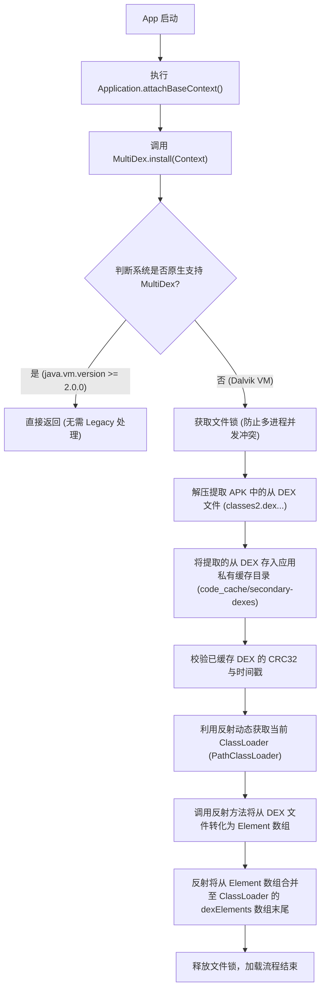
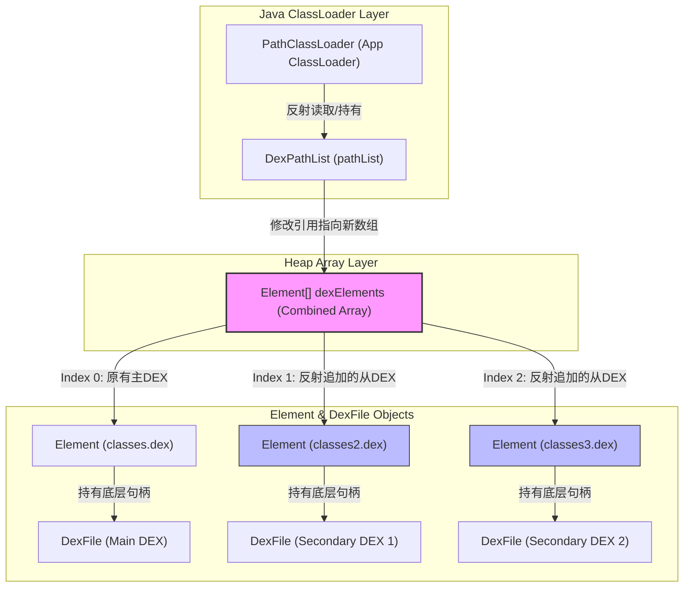
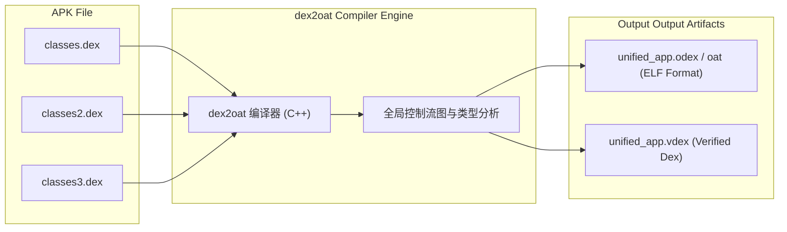
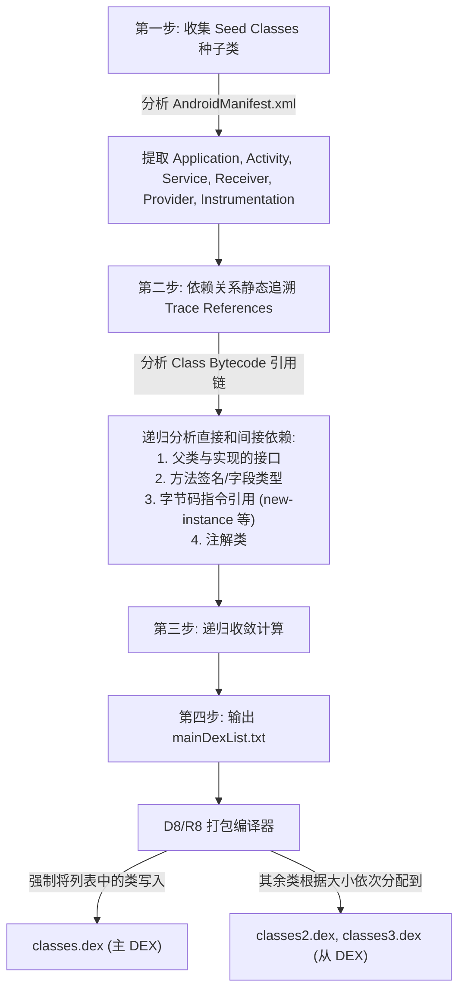
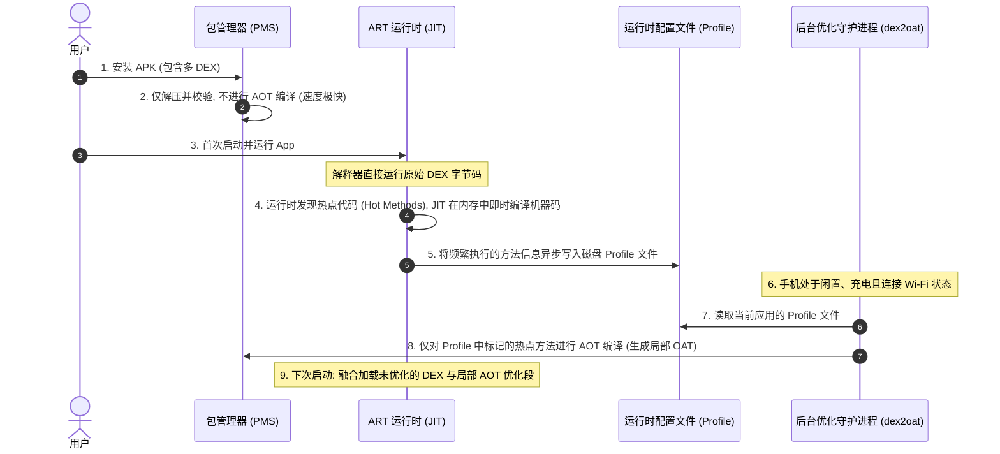

# 2.2.3.2 MultiDex 机制：演进、原理与物理级深度剖析

在 Android 系统的演进历程中，**MultiDex 机制**是解决应用体积爆炸式增长与虚拟机底层结构物理限制之间矛盾的里程碑式方案。本篇文档将从底层的 Dalvik/ART 运行时原理、编译器演进以及系统资源约束等维度，对 MultiDex 进行物理级的深度剖析。

---

## 一、 MultiDex 机制诞生的历史背景与核心动因

在探讨 MultiDex 的实现方案之前，必须首先从字节码指令与 DEX 文件格式的底层设计出发，剖析导致单 DEX 崩溃的“物理障壁”—— **65536 限制**。

### 1. 65536 限制（64K方法限制）的物理本质

Android 应用在编译时，Java/Kotlin 源代码首先被编译为 `.class` 文件，随后由编译器（早期为 `dx`，后期为 `D8`）重构并合并为 Dalvik Executable（即 `.dex`）文件。

在单个 `.dex` 文件中，所有的方法引用都被统一存放在一个全局的索引表 `method_ids` 中。65536（即 $64 \times 1024 = 64\text{K}$）限制的根本成因，在于 **DEX 文件格式的二进制结构设计** 以及 **Dalvik 虚拟机指令集的寻址空间限制**：

#### (1) DEX 二进制结构中的索引表限制
在 DEX 文件的头部（Header）结构中，定义了各个数据区的偏移量与大小：
```cpp
struct DexHeader {
    u1  magic[8];
    u4  checksum;
    u1  signature[20];
    u4  fileSize;
    u4  headerSize;
    u4  endianTag;
    u4  linkSize;
    u4  linkOff;
    u4  mapOff;
    u4  stringIdsSize;
    u4  stringIdsOff;
    u4  typeIdsSize;
    u4  typeIdsOff;
    u4  protoIdsSize;
    u4  protoIdsOff;
    u4  fieldIdsSize;    // 字段索引表大小
    u4  fieldIdsOff;
    u4  methodIdsSize;   // 方法索引表大小，这里虽然是用 32 位无符号整数定义
    u4  methodIdsOff;
    // ...
};
```
虽然在文件头的定义中，`methodIdsSize` 是一个 32 位的无符号整型（`u4`），理论上可以容纳 $2^{32}$ 个方法引用，但限制在于 Dalvik 字节码指令的编码设计。

#### (2) Dalvik 指令集寻址空间限制
在 Dalvik 虚拟机指令集中，所有用于方法调用的指令（`invoke-kind` 系列指令，如 `invoke-virtual`、`invoke-direct`、`invoke-static`、`invoke-super`、`invoke-interface`）在字节码中的操作数占用的位数是有限制的。

以下为 Dalvik 指令中用于方法调用的一般格式：
- 以最常见的 `invoke-virtual {vC, vD, vE, vF, vG}, meth@BBBB` 为例：
  - `BBBB` 代表方法索引值（Method Index），在指令编码中**仅仅占用了 16 位（2个字节）**的物理空间。
  - 16 位无符号数能表达的最大寻址范围是：
    $$0 \le \text{Index} \le 2^{16} - 1 \quad (\text{即 } 0 \le \text{Index} \le 65535)$$

这就意味着，Dalvik 虚拟机在执行任何方法调用指令时，其寻址目标方法在 `method_ids` 索引表中的下标最大只能是 `65535`。如果在编译期生成的 DEX 文件中，`method_ids` 数组的长度超出了 65536，虚拟机在链接执行这些调用指令时，将根本无法通过 16 位的操作数寻址到正确的方法。

为了避免在运行时发生寻址越界和指令解析失败，编译工具链（如 `dx`）在打包 DEX 时，会强制对引用的总方法数进行上限校验。一旦方法数达到或超过 65536，编译过程便会强行中断，并抛出著名的编译期灾难性异常：
```text
com.android.dex.DexIndexOverflowException: method ID not in [0, 0xffff]: 65536
```

### 2. “方法数”的精确定义与计算边界

需要强调的是，65536 限制中的“方法”并非指应用源码中编写的代码行数，甚至不仅仅指应用自身定义的函数。它的精确定义是**“引用的方法总数（Referenced Methods）”**，包括：
1. **应用自身定义的方法**：开发者编写的类、内部类以及匿名内部类中的所有方法（包含隐式生成的构造函数、Bridge 方法等）。
2. **第三方库导入的方法**：如 AndroidX、RxJava、Kotlin 标准库等所有引用的第三方 Dependency 中包含的方法。
3. **Android 框架层的方法引用**：虽然 Android 系统的 framework API 代码已经驻留在系统固件中，但应用代码调用这些 API 时（例如 `Activity.onCreate`、`View.setOnClickListener`），依然需要在应用自身的 DEX 文件中的 `method_ids` 索引表里建立一条对应的方法引用记录。

只要上述三者的方法引用求和超过 65536，即触碰物理红线。

除了方法数限制外，DEX 格式在字段索引表（`field_ids`，指令如 `iget`、`iput` 寻址字段）和类型索引表（`type_ids`）上也存在着相同的 16 位限制（即 64K 字段限制和 64K 类型限制）。但由于在实际的面向对象开发中，方法调用的频率和数量远超字段与类型的定义，因此方法数超限通常是触发编译失败的决定性物理屏障。

### 3. 单 DEX 到多 DEX 打包的物理必然性

随着移动互联网的爆发，应用承载的业务逻辑呈指数级增长，加之庞大的第三方 SDK 生态引入，单 DEX 所能提供的 64K容量迅速捉襟见肘。在不重构系统指令集的前提下，**将应用拆分为多个 DEX 文件（即 `classes.dex`、`classes2.dex`、`classes3.dex` ...）并打包进同一个 APK**，成为了唯一的解决方案。

---

## 二、 Android 5.0 之前的 Legacy MultiDex 实现机制

在 Android 5.0 之前，系统默认的虚拟机是 Dalvik。Dalvik 在设计之初只支持在启动时加载 APK 内的单个 `classes.dex` 文件。为了能在 Dalvik 环境下支持多 DEX，Google 推出了官方兼容库 `androidx.multidex`（早期为 `android.support.multidex`）。

### 1. Legacy MultiDex 的运行期工作流程

当应用启动时，由于 Dalvik 虚拟机只加载了主 DEX（`classes.dex`），从 DEX（`classes2.dex` 等）中的类处于未识别状态。此时，应用必须在最早期阶段（通常在 `Application.attachBaseContext(Context)` 中）同步调用 `MultiDex.install(Context)` 来手动将从 DEX 注入到类加载器中。

其核心工作流程可分为三个阶段：



#### (1) 环境校验
通过读取系统属性 `java.vm.version` 判定当前运行环境。如果版本号 $\ge 2.0.0$（代表 ART 虚拟机），说明系统原生支持多 DEX 加载，Legacy MultiDex 将不做任何操作，直接 return。若小于 $2.0.0$，则判定为 Dalvik 虚拟机，开启反射注入逻辑。

#### (2) 从 DEX 提取与缓存管理（`MultiDexExtractor`）
`MultiDex.install` 首先在应用的沙盒私有目录下创建一个名为 `code_cache/secondary-dexes` 的文件夹。
- 提取器会扫描 APK 文件，读取 ZIP 目录索引，寻找除 `classes.dex` 之外的 `classesN.dex` 文件。
- 将这些从 DEX 文件解压缩，并命名为临时文件或缓存文件（例如 `packagename-classes2.dex.zip`）。
- 为了避免每次启动都重复解压，`MultiDexExtractor` 会在本地持久化一份 XML 配置文件，记录 APK 的 `lastModified`（最后修改时间）以及 `CRC32` 校验值。只有在 APK 发生更新（如应用升级）时，才会重新解压从 DEX。

#### (3) ClassLoader 反射注入阶段
一旦从 DEX 解压并校验完成，MultiDex 将利用 Java 反射机制，强行破坏面向对象的封装边界，将从 DEX 动态注入到 `PathClassLoader` 的搜索路径中。

### 2. 运行时 ClassLoader 反射注入物理机制

要理解反射注入，首先需要理清 Android 系统中类加载器的物理结构。在 Android 中，加载 APK 中类文件的类加载器主要是 `dalvik.system.PathClassLoader`，它继承自 `dalvik.system.BaseDexClassLoader`。

其核心结构树及字段拓扑关系如下：
- `PathClassLoader` 继承自 `BaseDexClassLoader`。
- `BaseDexClassLoader` 内部持有一个 `dalvik.system.DexPathList` 类型的实例 `pathList`。
- `DexPathList` 内部持有一个 `Element[]` 类型的数组 `dexElements`。每个 `Element` 对象对应一个 DEX 文件或资源包。

当 ClassLoader 尝试加载一个类时，其底层的查找逻辑是：
```java
// BaseDexClassLoader.java 伪代码
@Override
protected Class<?> findClass(String name) throws ClassNotFoundException {
    List<Throwable> suppressedExceptions = new ArrayList<Throwable>();
    // 委托给 pathList 进行查找
    Class c = pathList.findClass(name, suppressedExceptions);
    if (c == null) {
        throw new ClassNotFoundException(name);
    }
    return c;
}
```
而在 `DexPathList` 内部，则是**顺序遍历** `dexElements` 数组：
```java
// DexPathList.java 伪代码
public Class<?> findClass(String name, List<Throwable> suppressed) {
    for (Element element : dexElements) {
        // 遍历数组，尝试从每个 Element (即对应的 DEX 文件) 中查找类
        Class<?> clazz = element.findClass(name, definingContext, suppressed);
        if (clazz != null) {
            return clazz;
        }
    }
    return null;
}
```
**Legacy MultiDex 的反射注入核心思想就是：**
通过反射获取 `BaseDexClassLoader` 中的 `pathList`，再通过反射调用 `DexPathList` 的内部方法，将解压后的从 DEX（`classes2.dex` ...）包装成 `Element` 对象，然后**拼接到 `dexElements` 数组的末尾**。

### 3. 反射修改的堆内存引用链变化

在反射注入完成后，Java 虚拟机堆内存中的引用拓扑发生了实质性改变。以下 Mermaid 结构图展现了反射修改前后，类加载器相关对象的堆内存引用关系：



### 4. Legacy MultiDex 核心源码与各版本兼容细节剖析

由于 Android 从 4.0 到 4.4 版本，`DexPathList` 的内部方法签名发生了频繁变动，且 4.0 以前甚至不存在 `DexPathList` 这个类。为了应对这些变迁，`androidx.multidex.MultiDex` 类内部设计了多个静态内部类实现分版本适配：`V19`、`V14` 和 `V4`。

以下是 `MultiDex` 进行反射注入的底层关键代码与各版本兼容实现剖析：

```java
// 核心入口
public static void install(Context context) {
    if (IS_VM_MULTIDEX_CAPABLE) {
        // 如果 java.vm.version >= 2.0.0，判定为 ART，直接返回
        return;
    }
    
    // 省略多进程安全锁及权限校验...
    
    try {
        ApplicationInfo applicationInfo = getApplicationInfo(context);
        File apkFile = new File(applicationInfo.sourceDir);
        File dataDir = new File(applicationInfo.dataDir);
        
        // 1. 获取当前应用的 PathClassLoader 实例
        ClassLoader loader = context.getClassLoader();
        
        // 2. 提取从 DEX 文件并写入私有目录
        File dexDir = new File(dataDir, "code_cache/secondary-dexes");
        List<? extends File> files = MultiDexExtractor.load(context, apkFile, dexDir, "", false);
        
        // 3. 执行反射注入
        installSecondaryDexes(loader, dexDir, files);
        
    } catch (Exception e) {
        throw new RuntimeException("MultiDex installation failed (" + e.getMessage() + ").");
    }
}
```

在 `installSecondaryDexes` 方法中，根据系统的 `Build.VERSION.SDK_INT` 属性分流处理：

```java
private static void installSecondaryDexes(ClassLoader loader, File dexDir, List<? extends File> files)
        throws IllegalArgumentException, IllegalAccessException, NoSuchFieldException,
               InvocationTargetException, NoSuchMethodException, IOException {
    if (!files.isEmpty()) {
        if (Build.VERSION.SDK_INT >= 19) {
            V19.install(loader, files, dexDir);
        } else if (Build.VERSION.SDK_INT >= 14) {
            V14.install(loader, files, dexDir);
        } else {
            V4.install(loader, files);
        }
    }
}
```

#### (1) Android 4.4+ (API 19+) 适配实现（`V19`）
在 Android 4.4 (KitKat) 系统中，`DexPathList` 内部提供了 `makeDexElements` 的静态方法，其参数列表除了输入文件列表外，还增加了一个用于搜集 JNI 异常的 `ArrayList<IOException>` 引用。

```java
private static final class V19 {
    static void install(ClassLoader loader, List<? extends File> additionalClassPathEntries,
            File optimizedDirectory) throws IllegalArgumentException, IllegalAccessException,
            NoSuchFieldException, InvocationTargetException, NoSuchMethodException {
        
        // a. 反射获取 BaseDexClassLoader 的 pathList 字段
        Field pathListField = findField(loader, "pathList");
        Object dexPathList = pathListField.get(loader);
        
        ArrayList<IOException> suppressedExceptions = new ArrayList<IOException>();
        
        // b. 反射调用 DexPathList.makeDexElements 方法，将解压后的从 DEX 转换为 Element[]
        // 注意：API 19 的 makeDexElements 接收 (ArrayList<File>, File, ArrayList<IOException>)
        Object[] newElements = makeDexElements(dexPathList,
                new ArrayList<File>(additionalClassPathEntries), optimizedDirectory,
                suppressedExceptions);
        
        // c. 反射修改并合并原有 Element[] 数组
        expandFieldArray(dexPathList, "dexElements", newElements);
        
        if (suppressedExceptions.size() > 0) {
            // 对 suppressedExceptions 进行记录或处理
        }
    }

    private static Object[] makeDexElements(Object dexPathList, ArrayList<File> files,
            File optimizedDirectory, ArrayList<IOException> suppressedExceptions)
            throws IllegalAccessException, InvocationTargetException, NoSuchMethodException {
        // 反射查找指定签名的 makeDexElements 方法
        Method makeDexElements = findMethod(dexPathList, "makeDexElements",
                ArrayList.class, File.class, ArrayList.class);
        return (Object[]) makeDexElements.invoke(dexPathList, files, optimizedDirectory, suppressedExceptions);
    }
}
```

#### (2) Android 4.0~4.3 (API 14~18) 适配实现（`V14`）
在 API 14 至 18 之间（即 ICS 与 JB 时代），`DexPathList` 同样存在，但其 `makeDexElements` 方法并未增加 `suppressedExceptions` 异常收集列表。

```java
private static final class V14 {
    static void install(ClassLoader loader, List<? extends File> additionalClassPathEntries,
            File optimizedDirectory) throws IllegalArgumentException, IllegalAccessException,
            NoSuchFieldException, InvocationTargetException, NoSuchMethodException {
        
        // a. 反射获取 BaseDexClassLoader 的 pathList 字段
        Field pathListField = findField(loader, "pathList");
        Object dexPathList = pathListField.get(loader);
        
        // b. 反射调用 makeDexElements 方法
        // 注意：API 14~18 的 makeDexElements 仅接收 (ArrayList<File>, File)
        Object[] newElements = makeDexElements(dexPathList,
                new ArrayList<File>(additionalClassPathEntries), optimizedDirectory);
        
        // c. 合并并替换原有数组
        expandFieldArray(dexPathList, "dexElements", newElements);
    }

    private static Object[] makeDexElements(Object dexPathList, ArrayList<File> files,
            File optimizedDirectory) throws IllegalAccessException, InvocationTargetException,
            NoSuchMethodException {
        Method makeDexElements = findMethod(dexPathList, "makeDexElements",
                ArrayList.class, File.class);
        return (Object[]) makeDexElements.invoke(dexPathList, files, optimizedDirectory);
    }
}
```

#### (3) 早期 Android 系统 (API < 14) 适配实现（`V4`）
在 Android 4.0 以前系统，由于类加载器的底层完全没有 `DexPathList` 这个中间结构，因此 `PathClassLoader` 会直接持有一些原生的物理路径和 `DexFile` 对象。`V4` 实现需要绕过所有的 `Element` 封装，直接将从 DEX 解压后的文件路径与原生的 `DexFile` 实例注入到类加载器的 `mPaths` 或 `mDexs` 字段中。

```java
private static final class V4 {
    static void install(ClassLoader loader, List<? extends File> additionalClassPathEntries)
            throws IllegalArgumentException, IllegalAccessException, NoSuchFieldException,
            IOException {
        int extraSize = additionalClassPathEntries.size();
        
        // 反射获取 PathClassLoader 中的原始 path 字符串字段 (例如以 ":" 隔开的物理路径)
        Field pathField = findField(loader, "path");
        StringBuilder path = new StringBuilder((String) pathField.get(loader));
        
        String[] extraPaths = new String[extraSize];
        File[] extraFiles = new File[extraSize];
        ZipFile[] extraZips = new ZipFile[extraSize];
        dalvik.system.DexFile[] extraDexs = new dalvik.system.DexFile[extraSize];
        
        ListIterator<? extends File> iterator = additionalClassPathEntries.listIterator();
        while (iterator.hasNext()) {
            File additionalEntry = iterator.next();
            String entryPath = additionalEntry.getAbsolutePath();
            path.append(':').append(entryPath); // 拼接到物理路径列表中
            
            int index = iterator.previousIndex();
            extraPaths[index] = entryPath;
            extraFiles[index] = additionalEntry;
            extraZips[index] = new ZipFile(additionalEntry);
            
            // 运行时通过静态方法 loadDex 直接为每个从 DEX 生成对应的 dalvik.system.DexFile 实例
            extraDexs[index] = dalvik.system.DexFile.loadDex(entryPath, entryPath + ".odex", 0);
        }
        
        // 反射写入原有的字段集合
        pathField.set(loader, path.toString());
        expandFieldArray(loader, "mPaths", extraPaths);
        expandFieldArray(loader, "mFiles", extraFiles);
        expandFieldArray(loader, "mZips", extraZips);
        expandFieldArray(loader, "mDexs", extraDexs);
    }
}
```

#### (4) 数组拼接的物理实现（`expandFieldArray`）
无论哪个版本，最终都需要将生成的从 DEX 数组 `newElements` 追加到 ClassLoader 原有的 `dexElements` 数组中。由于 Java 数组在内存中是连续分配且定长的，因此无法直接追加，必须开辟一块**长度为两者之和的新数组**，并复制两部分数据：

```java
private static void expandFieldArray(Object instance, String fieldName, Object[] extraElements)
        throws NoSuchFieldException, IllegalAccessException {
    Field jlrField = findField(instance, fieldName);
    Object[] original = (Object[]) jlrField.get(instance);
    
    // 创建一个合并后的新数组，类型与原数组一致
    Object[] combined = (Object[]) Array.newInstance(
            original.getClass().getComponentType(), original.length + extraElements.length);
    
    // 物理复制原主 DEX 的 Elements 到新数组的前部
    System.arraycopy(original, 0, combined, 0, original.length);
    
    // 物理复制从 DEX 的 Elements 到新数组的后部
    System.arraycopy(extraElements, 0, combined, original.length, extraElements.length);
    
    // 将原 pathList 字段的引用指向合并后的新数组，完成物理替换
    jlrField.set(instance, combined);
}
```

---

## 三、 Legacy MultiDex 导致的严重性能副作用 —— 启动 ANR 危机

虽然 Legacy MultiDex 成功解决了 65536 编译期屏障，但在实际运行期，它带来了严重的性能副作用，甚至直接演变为应用的“生死存亡危机”—— 启动 ANR。

### 1. Dalvik 下首次启动的 dexopt 物理开销

在 Dalvik 虚拟机中，类加载是以原始字节码形式载入的，但这会导致极低的运行效率。为此，Dalvik 引入了 **dexopt 机制**。在 APK 安装或者首次运行时，系统需要对 DEX 进行校验和代码重构，生成一个高度优化的包含平台特定机器码变体的扩展文件，称为 **ODEX（Optimized DEX）**。

对于主 DEX（`classes.dex`），系统在 APK 安装阶段，通过系统底层的 `installd` 守护进程同步调用了 `/system/bin/dexopt` 完成了优化。
但是，对于存放在 APK 内部的从 DEX（`classes2.dex` ...），系统在安装时并不知道它们的存在。

这就导致了一个致命的性能缺陷：
- 当应用首次启动（或者系统 OTA 升级、应用覆盖安装后首次启动），`MultiDex.install` 被调用。
- 主线程开始同步执行 `MultiDexExtractor.load`，强行将数个从 DEX 从 APK ZIP 文件中解压出来，这涉及到大量的**磁盘 I/O 读写**。
- 随后，当通过反射调用 `makeDexElements` 时，其底层通过 JNI 调用虚拟机的类加载接口。对于这些新引入的从 DEX，Dalvik 虚拟机在内存中加载它们之前，**必须在运行时同步调用底层的 `dexopt` 进程对每一个从 DEX 进行优化生成 ODEX 文件**。

#### 物理性能损耗推导：
- **CPU 算力阻塞**：`dexopt` 会对 DEX 文件中的所有类进行字节码安全验证（Bytecode Verification）、方法调用指令重写（如将 `invoke-virtual` 替换为内部高效的 `invoke-virtual-quick`）、符号解析等。这需要消耗极大的 CPU 算力。
- **磁盘 I/O 挂起**：主线程在解压和写入数百 K 甚至数 M 级的数据，同时 `dexopt` 还在高频地读取 DEX 并写入 ODEX，导致 Flash 存储器的 I/O 队列被瞬间占满，产生严重的 I/O Wait。
- **完全同步阻塞**：这一切操作都发生在 `MultiDex.install` 内部，运行在主线程上。只要 `dexopt` 没有全部执行完毕，`Application.attachBaseContext` 就会一直被挂起，无法返回。

在很多低端 Dalvik 手机（例如单核/双核，内存小于 1GB 的早期 Android 4.x 设备）上，优化一个 3MB 的从 DEX，耗时可达 **3~10 秒**。如果应用拆分了 3 个以上的从 DEX，启动耗时可轻易飙升至 **15 秒以上**。

### 2. 系统级 ANR 物理成因与阈值限制

Android 系统中用于监控应用主线程响应能力的机制是由 `ActivityManagerService` (AMS) 和系统的消息循环监控机制共同实现的。

在应用启动时，AMS 会为应用进程的启动设置一条“安全绳”（即启动超时监测）：
- **BroadcastReceiver 启动超时**：如果应用在静态广播接收器中初始化并触发启动，超时门槛一般是 10 秒。
- **Activity 启动超时**：应用从桌面图标启动时，主线程必须在极短时间内完成 `ActivityThread.handleBindApplication`（执行 Application 的生命周期）以及第一帧 Activity 的绘制渲染。
- 如果主线程被 `MultiDex.install` 中的 `dexopt` 同步阻塞，导致无法及时处理 AMS 发送过来的 `BIND_APPLICATION` 或者是后续的 `EXECUTE_TRANSACTION` 消息，或者由于主线程卡死无法消费 Looper 中的 Message，AMS 会在 5~10 秒内直接向应用进程判定 `ANR（Application Not Responding）`，弹出无响应对话框，强制用户关闭应用。

因此，Legacy MultiDex 的**“首次启动卡死/ANR 现象”**成为了制约大型 Android 应用生态发展的巨大技术黑洞。

### 3. LinearAlloc 限制（致命崩溃）

除了 ANR，Legacy MultiDex 在 Dalvik 虚拟机上还面临着物理内存溢出的硬限制—— **LinearAlloc 限制**。

#### (1) 什么是 LinearAlloc？
在 Dalvik 虚拟机中，类在被加载、链接和初始化时，其元数据（包括类的继承关系、方法表 `method table`、字段表 `field table`、接口映射、VTable 虚函数表等）需要存储在一块专用的物理内存区域，这块区域被称为 **LinearAlloc（线性内存分配器）**。

#### (2) Dalvik 中的大小限制
- 在 Android 2.2 和 2.3 版本中，Dalvik 的 LinearAlloc 被硬编码限制为 **5MB**。
- 在 Android 4.x 版本中，这一限制被微调为 **8MB**。

#### (3) 物理溢出机理
当 `MultiDex.install` 将从 DEX 反射拼接成功后，应用开始加载并运行从 DEX 中的类。如果一个应用包含极其庞大的方法树和复杂的类层次结构，那么随着大量类的加载，所有的 VTable 和元数据将疯狂填占 LinearAlloc 空间。

一旦加载的类元数据总量超出了 5MB 或 8MB 的物理红线，Dalvik 虚拟机将无法继续为新加载的类分配内存空间。此时，虚拟机会直接抛出崩溃：
```text
java.lang.InternalError: posterout of memory (linearAlloc)
```
或者在 dexopt 期间直接报错：
```text
D/dalvikvm( 1234): LinearAlloc exceed 8388608 bytes
E/dalvikvm( 1234): DexOpt: load all classes failed
```
这种崩溃是 Dalvik 底层 C++ 层面的物理内存超限导致的，在 Java 层根本无法通过 `try-catch` 捕获，应用将百分之百发生闪退。这使得 Legacy MultiDex 虽然突破了 64K 的方法引用限制，但依然要受到虚拟机底层 `LinearAlloc` 极小空间限制的约束，开发者必须通过混淆（ProGuard）或精简代码来极力压低方法元数据体积。

### 4. 早期业界针对 Legacy MultiDex 启动危机的黑科技调优方案

为了解决首次启动的秒级卡顿以及由此引起的 ANR 问题，在 Android 5.0 普及之前，业界知名技术团队采取了多种非常规的技术自救手段，主要包括**多进程异步初始化**和 **Native Hook 动态挂钩**。

#### (1) 多进程异步初始化方案（以美团为代表）
为了避免 `MultiDex.install` 阻塞主线程的 Looper，业界设计了在非主进程进行预初始化的方案：
1. 当应用安装或检测到需要重新进行 `install` 时，主进程（UI 进程）在 `attachBaseContext` 阶段**不执行**同步的 `MultiDex.install`。
2. 此时，主进程由于未加载从 DEX，运行逻辑无法执行任何复杂的业务类。主进程会立刻弹出一个简易的前台 UI（例如通过一个完全只依赖主 DEX 中类的 LoadingActivity 进程），用来告知用户“正在为您的手机进行首次运行速度优化，请稍候”。
3. 随后，主进程唤醒一个专门的子进程（例如 `:multidex` 进程）。该进程可以在后台毫无顾忌地同步执行 `MultiDex.install` 并触发虚拟机的 `dexopt` 优化。
4. 由于子进程不在前台与用户交互，它的同步卡顿不会触发 AMS 的 Input 事件 ANR。
5. 当子进程的 `dexopt` 完成并在私有目录下生成了合法的 ODEX 文件后，通过文件锁或跨进程通信（IPC）机制通知主进程。
6. 主进程此时由于已经有了预置优化好的 ODEX 文件，再次执行 `MultiDex.install` 时能够瞬间完成物理映射，直接进入主界面。

#### (2) Facebook 的 Redex / 运行时动态挂钩方案
Facebook 的解决方案更加硬核。他们为了在 Dalvik 上直接消灭 `dexopt` 的时间，采用了 **C++ Hook 技术**：
1. Facebook 在 Dalvik 运行时直接通过 Native Hook，干预了 Dalvik 虚拟机的内部 JNI 结构体 `DvmDex`。
2. 他们通过 Hook Dalvik 虚拟机内部未公开的 `dvmRawDexFileOpen` 或 `dvmOpenDexFileFromMinidex` 函数，绕过了 Dalvik 本身的字节码校验（Verification）阶段和指令替换优化。
3. 该技术强行诱骗 Dalvik 直接去读取未经过优化（未经过 dexopt）的原始 DEX 字节码流，这使得从 DEX 加载的耗时瞬间由数秒级别被压缩到几十毫秒，彻底从物理层消灭了首次启动 ANR 的前提。

---

## 四、 Android 5.0+ ART 原生 MultiDex（Native MultiDex）的物理革新

为了彻底根治 Dalvik 时代 Legacy MultiDex 在启动阶段造成的 ANR 黑洞与虚拟机内存崩溃，Google 在 Android 5.0 迎来了一次物理革新—— 引入了全新的 **ART（Android Runtime）** 虚拟机。

### 1. ART 架构与 Native MultiDex 的底层设计

与 Dalvik 虚拟机解释执行+JIT的运行方式不同，ART 采用了 **AOT（Ahead-of-Time，运行前编译）** 编译模式。
在系统级别，ART 具备了天然的多 DEX 感知和加载能力（即 Native MultiDex）。当应用安装在 Android 5.0 及以上系统时，系统能够感知 APK 中存在的所有 `classesN.dex` 文件，并实施统一的编译。

### 2. dex2oat 编译器的多 DEX 合并优化

在应用安装（Install-time）或者系统 OTA 升级时，系统的包管理服务（PMS）会启动位于 `/system/bin/dex2oat` 的编译器进程，替代 Dalvik 的 `dexopt`。

`dex2oat` 编译 MultiDex 的物理过程如下：



1. **统一输入读取**：`dex2oat` 接受 APK 路径作为输入，通过底层的 C++ 解压模块，将 APK 内部的所有的 `classes.dex`、`classes2.dex` 等文件作为同一个任务源并发读取。
2. **多 DEX 全局分析与去重**：`dex2oat` 在编译时会将这些 DEX 视为一个关联的整体，对它们的类型、方法和引用进行全局语义分析。对于在多个 DEX 之间存在的交叉方法调用，`dex2oat` 在进行机器码编译时会进行直接符号链接，避免了运行时的动态查找开销。
3. **输出 ELF 格式的 OAT 文件**：`dex2oat` 最终不会生成一堆零散的 `.odex` 文件，而是将所有的 `classesN.dex` 及其对应的 AOT 预编译本地机器码（Native Code）合并打包成一个统一的 **OAT 文件**（其物理格式为标准的 Linux **ELF** 共享库格式，即 `.oat` 或扩展名为 `.odex` 的 ELF 文件）。同时，生成一个 `.vdex` 文件用于存放经过校验的原始 DEX 数据。

### 3. 运行时 ClassLoader 的原生支持

进入 Android 5.0 之后，当 `PathClassLoader` 被初始化时：
- 其 C++ 底层实现直接将生成的 ELF 格式的 OAT 文件映射（`mmap`）进进程虚拟内存空间中。
- ART 运行时的类加载器可以直接通过 C++ 层的指针，快速在 ELF 镜像内的各个内部 DEX 数据段（DexFile Object）中寻址类，所有的从 DEX 在初始化时即被完整注册到类加载器中。

#### 物理级优势对比：
- **零运行时解压开销**：从 DEX 在应用安装阶段就已被处理完毕，运行时无任何文件提取、解压操作，零磁盘 I/O 挂起风险。
- **废除 Java 反射注入**：`dexElements` 数组在运行时初始化阶段，底层 C++ 代码就已经根据 OAT 文件中的 DEX 段将其一次性全部填充完毕，彻底告别了 Java 层的反射拼接，消除了反射因版本变动带来的兼容性 Bug。
- **根治首次启动 ANR**：由于复杂的字节码校验和向 Native 机器码的转换在应用安装期或后台已完成，首次启动时几乎只有纯粹的内存映射和常规初始化开销，启动速度提升数倍，彻底消灭了因安装多 DEX 导致的 ANR 危机。
- **突破 LinearAlloc 限制**：ART 运行时重新设计了类元数据的内存管理机制，废除了 Dalvik 时代的 LinearAlloc 线性缓冲限制。ART 采用动态分配的内存区域，只要进程的虚拟内存空间（32位系统通常有 3GB，64位更宽广）未满，就可以无限加载类，彻底根治了 `LinearAlloc out of memory` 导致的物理崩溃。

---

## 五、 主 DEX 列表（Main Dex List）的物理计算逻辑与分包策略

虽然 ART 完美解决了多 DEX 的加载性能，但由于市场上仍有海量低于 Android 5.0 的 Dalvik 设备，因此在编译打包 APK 时，依然必须采取分包策略，即把应用划分为主 DEX（`classes.dex`）和从 DEX（`classes2.dex` ...）。这就涉及到了 **Main Dex List（主 DEX 列表）** 的物理计算逻辑。

### 1. 为什么需要 Main Dex List？

在 Legacy MultiDex 系统中，应用启动的过程是：
1. 虚拟机初始化，加载 APK 的 `classes.dex`（主 DEX）。
2. 初始化 `Application` 实例，并调用 `Application.attachBaseContext(Context)`。
3. 在 `attachBaseContext` 中，开发者手动调用 `MultiDex.install(context)`。
4. 解压并反射加载从 DEX（`classes2.dex` ...）。

这产生了一个严重的“时间差”：
**在 `MultiDex.install()` 执行完成之前，只有主 DEX 内的类是可以被正常加载的。**

如果在第 1 步或第 2 步中，系统尝试加载某个类，而这个类不幸被编译器分到了 `classes2.dex`（从 DEX）中，由于此时从 DEX 还没有被 install，类加载器（ClassLoader）会在双亲委派查找链中返回 null，并在 JNI 层抛出致命的：
```text
java.lang.ClassNotFoundException: ComponentClass
```
紧接着，由于虚拟机在构建类关系时发现依赖缺失，会触发：
```text
java.lang.NoClassDefFoundError
```
导致应用在调用到 `MultiDex.install` 之前就发生了物理级闪退。

**因此，主 DEX 列表（Main Dex List）的根本作用是：**
计算出应用在**启动并成功调用 `MultiDex.install` 这一时间节点之前**，系统运行所**必须**用到的所有类的集合。这些类必须被强制打包进主 DEX （`classes.dex`）中，不得分流至从 DEX。

### 2. D8/R8 编译器如何计算 Main Dex List

在 Android 编译链中（从旧的 `dx` 到现在的 `D8`/`R8`），Main Dex List 的计算是一个极其严密的**静态代码引用依赖树溯源与收敛**的过程。主要包含以下四个物理步骤：



#### (1) 收集种子类（Seed Classes）
编译工具首先会强行解析项目的编译产物 `AndroidManifest.xml`。从中提取出应用启动阶段可能被系统调用的所有核心入口组件：
- 自定义的 `Application` 子类（如果有）。
- 所有声明的 `Activity`、`Service`、`Receiver`、`Provider`。
- 所有声明的 `Instrumentation` 和 `BackupAgent`。
- 其他可能被系统在早期直接加载的配置类。

这些类被定义为**种子类（Seed Classes）**。

#### (2) 依赖关系静态追溯（Trace References）
编译器的分析引擎（如 R8 的 `GenerateMainDexList` 引擎）开始对种子类进行深度的字节码反编译与静态扫描，追溯其所有的直接与间接引用关系：
- **继承与实现链**：种子类的所有直接与间接父类（如自定义 Application 继承的 `BaseApplication`、`Application`）、实现的接口。
- **方法签名与字段类型**：这些种子类中定义的所有成员变量的类型，所有方法的参数类型、返回值类型以及可能抛出的异常类型。
- **方法体内的指令级引用**：扫描种子类方法的指令码（Dalvik Bytecode / JVM Bytecode），提取出所有 `new-instance`（创建对象）、`check-cast`（类型转换）、`const-class`（类加载常量）等字节码指令所引用的目标类。
- **运行时注解**：声明在上述类、方法、字段上的所有保留到运行期的注解（`RetentionPolicy.RUNTIME`）。

#### (3) 递归收敛计算
由于被追溯出来的“第一层依赖类”内部还会引用其他的类，分析引擎会对所有新发现的类进行**递归追溯**。这一过程会持续迭代，直到依赖关系图（Dependency Graph）闭环且不再产生任何新的类引用为止。这一过程被称为“收敛”。

#### (4) 输出 Main Dex 列表
最终，编译器将所有收敛计算得到的类名列表，写入到一个临时文件 `mainDexList.txt` 中。

在最后的 DEX 打包阶段，D8/R8 编译器会读取该文本：
- **白名单强制分配**：优先将 `mainDexList.txt` 中的所有类全部打包进 `classes.dex`。
- **其余类分配**：在主 DEX 空间未满的前提下，可以将部分非启动必需类装入；一旦主 DEX 达到大小上限，或者方法数逼近 65536 限制，则将剩余的类按照顺序打入 `classes2.dex`、`classes3.dex` 等。

### 3. Gradle 编译期的底层干预参数

在实际的 Gradle 编译打包任务（例如 `transformClassesWithMultidexlistForDebug` 或 `collectDebugMultiDexClassList`）中，构建系统本质上是在调用 D8/R8 编译器并传入了底层的特定干预参数：
- `--main-dex-list <file>`：指定已经手动确定的主 DEX 包含类文件。
- `--main-dex-rules <file>`：向 D8/R8 编译引擎传递类似于 ProGuard 过滤语法的规则文件（如包含 `multiDexKeepProguard` 指定的规则），指示编译器在此规则下进行依赖收敛树分析。

#### (1) `multiDexKeepFile` 的 Gradle 配置方式
开发者可以创建一个文本文件（如 `multidex-keep.txt`），手动声明需要强制保留在主 DEX 中的类名：
```text
com/example/MyReflectedStartupClass.class
com/example/AnotherCriticalClass.class
```
然后在 Gradle 中配置：
```groovy
android {
    defaultConfig {
        multiDexEnabled true
        multiDexKeepFile file('multidex-keep.txt')
    }
}
```

#### (2) `multiDexKeepProguard` 的规则干预方式
允许开发者使用 ProGuard 语法的规则来指定哪些类以及其匹配关联类应保留在主 DEX 中，这比逐个列出类名更具扩展性：
```proguard
# 保留某个包下所有的类及其子类在主 DEX 中
-keep class com.example.startup.** { *; }
# 保留实现了特定接口的所有类
-keep class * implements com.example.CriticalInterface { *; }
```
在 Gradle 中应用：
```groovy
android {
    defaultConfig {
        multiDexEnabled true
        multiDexKeepProguard file('multidex-keep.pro')
    }
}
```

### 4. 主 DEX 超限危机（Main DEX Overflow）

随着项目规模的极度膨胀，往往会出现另一种极端的编译期崩溃：
**Main DEX Overflow（主 DEX 爆出 65536 限制）。**

#### (1) 产生原因：
- 在 `AndroidManifest.xml` 中注册的四大组件过多。
- 启动链路设计极其臃肿，`Application.onCreate` 阶段同步初始化了数十个 SDK，这些 SDK 的初始化逻辑与数千个类产生了直接/间接编译期依赖。
- D8/R8 通过收敛算法计算出来的 `mainDexList.txt` 中的方法数总和，本身就已经**超过了 65536 的物理限制**。
- 由于这些类都是启动必需类，必须塞入主 DEX，但主 DEX 物理上又装不下，导致编译器无处安放，直接抛出编译报错。

#### (2) 架构级消歧义方案：
1. **启动依赖图解耦（最根本方案）**：将非必须在最早期初始化的 SDK 改为延迟加载（Lazy Load）。通过局部利用**动态代理**、**反射调用**或**动态路由**，切断种子类与非核心业务代码在编译期的直接强引用链，使得这些类从 `mainDexList` 中被剔除。
2. **利用 Jetpack App Startup 框架**：规范化启动流，将初始化工作从 `Application.attachBaseContext` 转移到 `ContentProvider`（即使 ContentProvider 也是早期启动，但可以通过机制优化）或更晚的异步任务中。
3. **主类按需精简**：避免在 Application 类中直接声明大型匿名内部类或静态大对象引用。

---

## 六、 Android 7.0+ 混合编译与后续优化对 MultiDex 的物理优化变迁

随着 Android 系统的演进，ART 虚拟机的编译策略经历了一场波澜壮阔的变革，也物理性地重塑了 MultiDex 的加载与运行效率。

### 1. 全量 AOT 编译的物理痛点（Android 5.0 - 6.0）

在 Android 5.0 和 6.0 系统中，ART 默认在安装阶段执行**全量 AOT（Ahead-of-Time）编译**（即 `dex2oat` 将 APK 中的所有 DEX 编译为全量本地机器码）。

这一机制虽然获得了极佳的运行速度，但也带来了严重的物理副作用：
- **安装时间漫长**：由于需要对所有的 DEX 进行翻译和机器码编译，大型应用安装时经常需要耗费 3~5 分钟。
- **OTA 开机卡死**：系统进行大版本 OTA 升级后，系统首次重启会显示“正在优化应用”（Android is upgrading...）。此时，系统需要对全量应用重新执行 `dex2oat`。对于装有数十个多 DEX 应用的手机，用户需要被迫等待数十分钟甚至上小时。
- **空间膨胀**：生成的机器码 OAT 文件体积通常是原始 DEX 的 1.5 到 3 倍，极大地占用并压缩了设备珍贵的 Flash 存储空间。

### 2. Android 7.0 引入的 JIT + AOT 混合编译模式

为了解决上述痛点，Android 7.0 引入了**混合编译模式（Hybrid Compilation）**，其物理核心是结合了 **JIT 编译器**、**AOT 编译器（dex2oat）** 以及 **Profile 引导机制（Profile-Guided Compilation）**。

其物理变迁过程如下：



#### (1) 安装与首次启动阶段
当 APK 安装时，系统**完全不进行** `dex2oat` AOT 编译，直接跳过。这意味着多 DEX 文件以原始字节码的形式保留在应用的 `.vdex` 中。
- 应用的安装过程缩短至数秒内即可完成。
- 首次启动时，ART 运行时通过内部的**解释器**直接解释执行原始 DEX 字节码。
- 在解释执行的同时，**JIT（Just-In-Time）编译器**在后台默默运行，监控并收集经常执行的“热点方法”（Hot Methods）。

#### (2) 运行时配置生成（Profile-Guided）
一旦某个方法被判定为热点方法，JIT 就会在内存中直接将其编译为本地机器指令供当前运行使用。同时，ART 会将这些热点方法的签名信息异步持久化到应用沙盒的 Profile 配置文件中（路径一般在 `/data/misc/profiles/cur/0/[packageName]/primary.prof`）。

#### (3) 后台空闲编译（AOT Optimization）
当手机进入空闲状态（通常是夜间充电、屏幕熄灭且连接 Wi-Fi 时），系统后台的优化守护进程（`background dexopt service`）会被唤醒。
- 该服务读取各个应用的 `primary.prof` 配置文件。
- 针对 Profile 文件中记录的“热点方法”，调用 `dex2oat` 编译器执行定向 AOT 编译。
- 编译生成的**局部优化 OAT 文件**将替代原有的全部优化，仅包含那些高频使用的方法的机器指令。

### 3. Android 8.0 引入的 `vdex` 文件物理革新

为了进一步加快混合编译和常规编译的运行性能，Android 8.0 引入了全新的文件类型—— **`.vdex`**。

#### (1) 物理解决痛点：
即使在 Android 7.0 混合编译下，对于不需要编译为 OAT 的普通 DEX 文件，虚拟机加载它们时仍要对其所有的类和方法进行**合法性验证（ClassLoader Verification）**，以防恶意字节码注入。这每次运行都会耗费大量 CPU 周期。

#### (2) vdex 的物理作用：
- 在 `dex2oat` 首次对 APK 中的所有 DEX 文件进行分析时，它会提取出其中被验证合法的原始 DEX，并在外部生成一个 `.vdex` 文件。
- 这个 `.vdex` 文件除了保留校验过的 DEX 数据外，还附带了**类验证结果缓存**（Verification Dependencies）。
- 当系统或虚拟机在后续重新编译（如在 JIT 升级为 AOT）或直接加载类时，可以直接读取 `.vdex` 里的校验缓存，**完全跳过复杂的字节码合法性校验阶段**。
- 这项革新使得 `dex2oat` 的后台运行速度大幅度飙升，也物理性地消除了运行时类加载因安全校验引发的 CPU 负载抖动。

### 4. Android 9.0+ Cloud Profiles（云端黄金配置文件）

虽然 7.0+ 混合编译解决了应用冷启动和安装速度问题，但它依赖用户运行应用几天后才能产生 Profile。这就意味着在新机安装的头几天里，应用的多 DEX 加载仍然处于未优化状态。

为了消除这个冷启动延迟的盲区，Android 9.0 引入了 **Cloud Profiles（云端黄金 Profile）** 机制：
1. 当一个应用的 APK 在广大早期用户的设备上运行时，每个人的设备都会在后台生成 Profile 配置文件。
2. 这些 Profile 文件中的热点方法信息会被安全地收集，并异步上传到 Google Play 服务器。
3. 谷歌云端服务器将成百上千个用户的 Profile 进行全局统计学合并，过滤噪声，形成一个最优的热点方法合集——**黄金 Profile（Golden Profile）**。
4. 当新用户从 Play Store 下载该多 DEX 应用时，Play Store 服务会在下载 APK 的同时，把黄金 Profile 文件作为附加数据一并分发并预置到用户设备中。
5. 系统在应用安装的瞬间，可以直接利用这块“黄金 Profile”通过 `dex2oat` 完成针对多 DEX 中绝大部分核心热点方法的 AOT 编译。
6. 这项技术确保了应用即便是首次开箱使用，也能达到如全量预编译般的流畅体验，是目前业界针对 MultiDex 终极阶段的物理级顶配支撑。

---

## 七、 总结：Dalvik 与 ART 下 MultiDex 核心差异对比

为了便于全面掌握，我们将 Dalvik 时代的 Legacy MultiDex 与 ART 时代的 Native MultiDex 的底层物理特性进行了结构化对比：

| 物理评估指标 | Dalvik VM 时代 (Android < 5.0) | ART VM 时代 (Android >= 5.0) |
| :--- | :--- | :--- |
| **底层核心编译器** | `/system/bin/dexopt` | `/system/bin/dex2oat` |
| **多 DEX 原生感知** | 不支持（默认只加载单一 `classes.dex`） | 原生支持（一并解析并载入所有 `classesN.dex`） |
| **类加载器修改方式** | 运行时 Java 反射，动态拼接替换 `dexElements` | 编译期统一生成单一 ELF 镜像，运行时直接内存映射，无需反射 |
| **启动性能损耗** | 极高（主线程解压从 DEX 并同步调用 `dexopt` 导致 CPU 负载高与 I/O 阻塞） | 极低（运行时无解压，Android 7.0+ 采用混合编译，无同步等待开销） |
| **ANR 发生概率** | 高（主线程被 `dexopt` 卡死，易触发系统级 ANR 监视越界） | 零（无运行时耗时编译，启动流程为纯内存级映射） |
| **类元数据内存限制** | 严格受限于 `LinearAlloc` 缓冲上限 (5MB/8MB)，超限直接物理闪退 | 突破限制（采用动态分配，只要物理虚拟内存可用即可） |
| **分包计算策略** | 强制依赖 `mainDexList`。核心类必须置于主 DEX 中以防找不到类 | 编译时自动依赖分析，多 DEX 在 ELF 中统一存储与寻址 |
| **Android 7.0+ 优化** | 无支持 | 支持 JIT + Profile-guided AOT 混合编译，安装超快，越用越流畅 |
| **文件校验加速** | 无支持 | Android 8.0+ 引入 `.vdex`，免除运行时二次校验，类加载大幅提速 |
| **冷启动优化演进** | 无支持 | Android 9.0+ 支持 Cloud Profiles，开箱即享受黄金热点 AOT 优化 |

通过上述剖析，可以看出 MultiDex 的演进过程不仅是 Android 解决 65536 限制的技术进化史，更是 Android 虚拟机从 Dalvik 向 ART 物理重构的缩影。理解其底层的物理执行路径与内存变化，对于大型项目的启动优化、编译优化以及排障具备决定性的技术指导价值。
