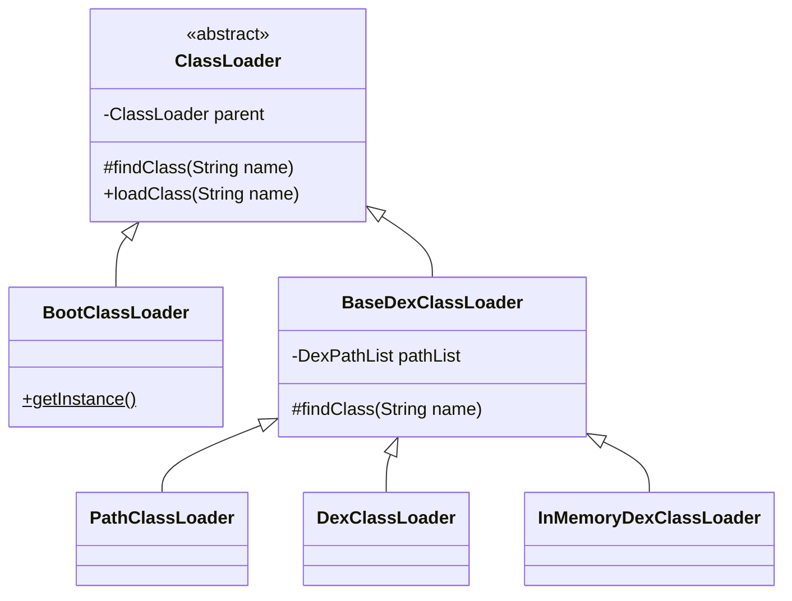
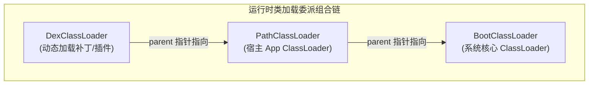
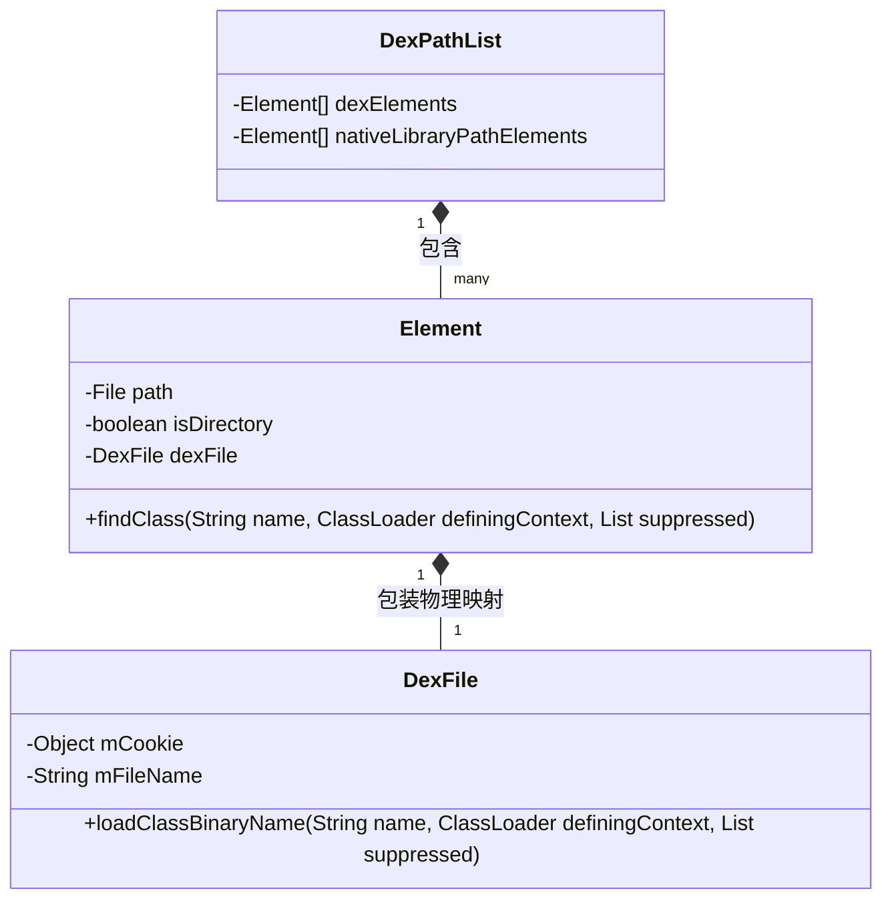
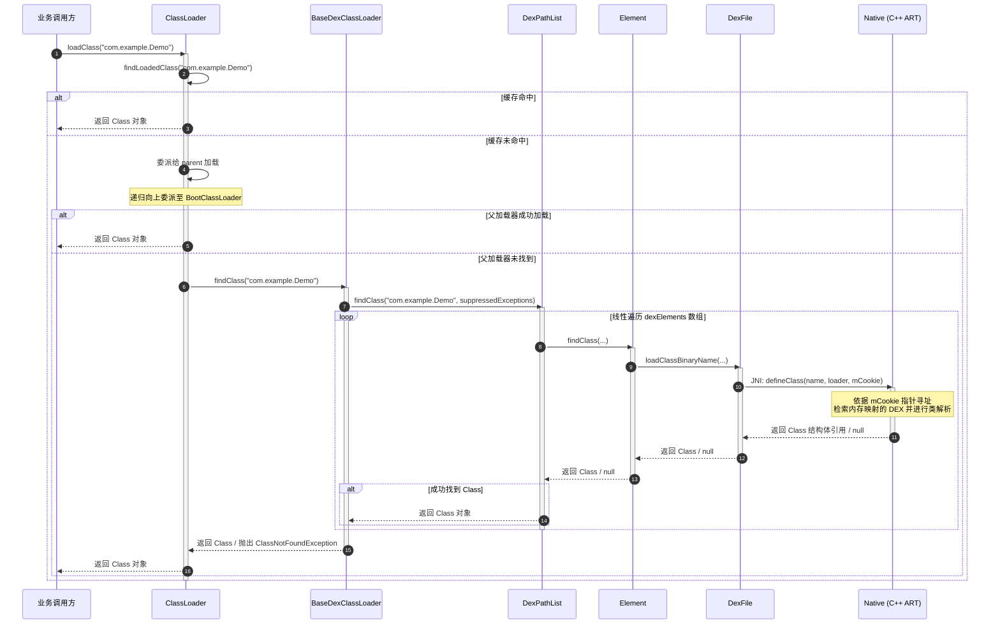
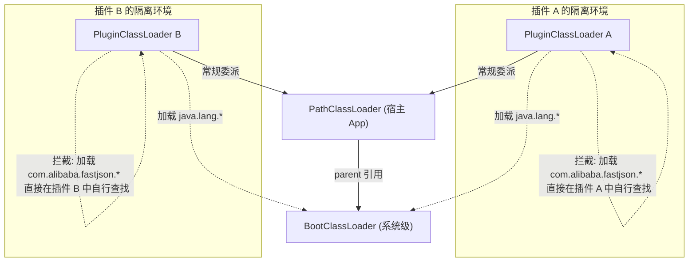

# 2.2.3.3 ClassLoader

在 Android 虚拟机（Dalvik/ART）生态中，`ClassLoader`（类加载器）不仅承担着将类文件装载进内存的职责，更是 Android 平台实现**插件化（Plugin）**、**热修复（HotFix）**、**动态部署**等黑科技技术的物理底座。

与标准 Java 虚拟机（JVM）相比，Android 虚拟机的类加载机制在双亲委派的具体实现、类的物理载体结构、以及加载器的层级拓扑上进行了大量的本地化定制。本文将从底层物理结构与源码级追踪出发，深度剖析 Android ClassLoader 的工作机制及其在业界前沿动态化技术中的物理应用。

---

## 一、 Android 专属类加载器体系与双亲委派机制的物理架构

### 1.1 JVM 与 Android ART/Dalvik 类加载机制的本质差异

JVM 与 Android 虚拟机在类加载机制上的根本分歧，源自于**类文件的物理承载格式**与**运行环境约束**的不同：

| 维度 | Java 虚拟机 (JVM) | Android 虚拟机 (Dalvik/ART) |
| :--- | :--- | :--- |
| **物理载体** | 单类单文件的 `.class` 字节码文件，或打包为 `.jar`。 | 合并类信息、共享常量池的 `.dex` (Dalvik Executable) 文件，或优化后的 `.odex`/`.oat`。 |
| **内存与存储效率** | 独立常量池，存在大量的字符串及类信息冗余。 | 所有类共享一个大常量池，极大地降低了物理存储和内存开销。 |
| **类定义方式** | 主要是从文件流或网络流中读取 `byte[]` 字节数组，再通过 Native 层的 `defineClass` 转化为 Class 对象。 | 必须通过 Native 层将整个 `.dex` 文件映射到虚拟地址空间，借助指针句柄（`mCookie`）定位并解析 Class 结构体。 |
| **顶级加载器** | **Bootstrap ClassLoader（启动类加载器）**，由 C++ 编写，在 Java 层无对应对象，获取其引用时返回 `null`。 | **BootClassLoader**，完全由 Java 语言实现，是一个可见的、可被引用的顶级类加载器。 |

### 1.2 Android 专属类加载器的物理角色定位

在 Android 系统中，类加载器家族有着清晰的派生关系与角色分工。



#### 1. BootClassLoader
`BootClassLoader` 是 Android 虚拟机启动时创建的顶级类加载器。
* **物理本质**：它与 JVM 的 Bootstrap ClassLoader 截然不同。JVM 的启动类加载器是用 C++ 实现的，而 Android 的 `BootClassLoader` 是一个**纯 Java 实现**的类（继承自 `ClassLoader`），且在全局是单例的。
* **职责范围**：负责加载 Android 系统核心框架层（Framework）的类，例如 `java.lang.*`、`android.app.*`、`android.view.*` 等。
* **初始化时机**：在 Zygote 进程启动时（`ZygoteInit.main`），由虚拟机前置创建并初始化，用于预加载常用的系统类（Preloaded Classes），以提升所有子 App 进程的启动速度。

#### 2. BaseDexClassLoader
`BaseDexClassLoader` 是 Android 专属类加载器的基石，继承自 `ClassLoader`。它自身不直接进行具体的类检索，而是将所有的加载、查找、优化操作封装并委托给其内部的物理结构——`DexPathList`。

#### 3. PathClassLoader
* **物理本质**：继承自 `BaseDexClassLoader`。它是 Android 系统中 App 的默认类加载器。
* **职责范围**：用于加载系统预装的应用和已安装的普通应用的类与资源。
* **优化机制**：在 Android 8.0 之前，其构造函数不需要传入 `optimizedDirectory`，因为 `PathClassLoader` 设计之初就默认用来加载已安装的应用。这些应用的 `.dex` 文件已经在安装时被系统的守护进程 `installd` 进行了预编译优化（AOT），生成的 `.odex` 或 `.oat` 文件存放在系统固定的物理路径中（如 `/data/dalvik-cache` 或 `/data/app/~~.../oat/`）。

#### 4. DexClassLoader
* **物理本质**：继承自 `BaseDexClassLoader`。
* **职责范围**：专门用于加载**外部未安装**的 JAR、APK 或 DEX 文件。
* **物理演进**：
  * **在 Android 8.0 之前**，其实例化必须传入一个可写的 `optimizedDirectory`（通常是应用的私有沙盒目录，如 `cache` 或 `files` 目录）。类加载器会在此目录中释放由 Dalvik/ART 优化或编译后的 `.odex` 文件。
  - **自 Android 8.0 (API 26) 开始**，`DexClassLoader` 的该参数被标记为废弃（Deprecated）。底层合并了 `PathClassLoader` 与 `DexClassLoader` 的逻辑，优化的机器码或 DEX 统一存放在应用私有的 `code_cache` 路径下。这意味着在 Android 8.0 之后，两者的物理功能已完全等价。

#### 5. InMemoryDexClassLoader
* **物理本质**：Android 8.0 引入的专用加载器，同样继承自 `BaseDexClassLoader`。
* **职责范围**：支持直接从内存的 `ByteBuffer` 中加载 DEX。
* **应用场景**：避免了将解密后的 `.dex` 文件写入闪存（Flash ROM）的物理磁盘，保障了敏感代码的安全性，通常用于加壳加固应用的动态脱壳与内存解密运行。

### 1.3 运行时委派拓扑结构

虽然继承关系上 `PathClassLoader` 和 `DexClassLoader` 均继承自 `BaseDexClassLoader`，但它们在运行时的**委派组合（Parent-Child）**拓扑表现为一条链式结构：



这种拓扑结构确保了：即使是通过 `DexClassLoader` 动态引入的外部类，在加载时也会首先穿透到 `BootClassLoader` 去验证是否为系统核心类，随后穿透到 `PathClassLoader` 检查宿主是否已经加载，最后才会由 `DexClassLoader` 自身尝试加载。这完美契合了双亲委派的安全与去重初衷。

---

## 二、 BaseDexClassLoader 与 DexPathList / dexElements 核心物理数据结构深度解剖

为了实现高效的 `.dex` 检索，Android 并没有在 `BaseDexClassLoader` 中直接维护路径列表，而是设计了一套精妙的物理数据结构，将“类路径解析”与“内存映射句柄”完全剥离。

### 2.1 BaseDexClassLoader 的骨架结构

以下是 `BaseDexClassLoader` 核心源码字段定义：

```java
public class BaseDexClassLoader extends ClassLoader {
    // 所有的类与资源检索工作均委托给此对象
    private final DexPathList pathList;

    public BaseDexClassLoader(String dexPath, File optimizedDirectory,
            String librarySearchPath, ClassLoader parent) {
        super(parent);
        // 物理构造 DexPathList，将路径字符串解析为内存中的 Element 数组
        this.pathList = new DexPathList(this, dexPath, librarySearchPath, optimizedDirectory);
    }
    
    // ...
}
```

### 2.2 DexPathList 内部物理布局

`DexPathList` 的主要物理职责是将传入的 `dexPath`（包含多个由 `:` 分隔的物理文件路径）解析并构建成一个有序的元素阵列。

```java
/* package */ final class DexPathList {
    private static final String DEX_SUFFIX = ".dex";
    private static final String jar_SUFFIX = ".jar";
    private static final String zip_SUFFIX = ".zip";
    private static final String apk_SUFFIX = ".apk";

    // 宿主加载器上下文
    private final ClassLoader definingContext;

    // 极其关键的 DEX 物理映射元素数组
    private Element[] dexElements;

    // 本地 C/C++ 共享库（.so）搜索目录列表
    private final List<File> nativeLibraryDirectories;
    
    // 本地共享库的 Element 数组，用于 System.loadLibrary 的物理查找
    private final Element[] nativeLibraryPathElements;

    public DexPathList(ClassLoader definingContext, String dexPath,
            String librarySearchPath, File optimizedDirectory) {
        // ... 过滤并初始化 nativeLibraryDirectories
        
        // 核心：调用 makeDexElements 将物理路径解析为 Element[]
        this.dexElements = makeDexElements(splitDexPath(dexPath), optimizedDirectory,
                                           suppressedExceptions, definingContext);
    }
}
```

### 2.3 物理映射节点：`Element` 与 `DexFile`

`dexElements` 数组中的每一个 `Element` 对象，在物理上都对应着一个磁盘上的文件（如 `.apk`、`.jar`、`.dex`）以及一个加载到虚拟机内存中的 DEX 文件对象（`DexFile`）。



#### 1. Element 类的定义与物理封装
```java
/* package */ static class Element {
    // 物理文件路径（如 /data/app/~~.../base.apk）
    private final File path;
    // 是否为目录（通常用于 native 库搜索）
    private final boolean isDirectory;
    // 核心：指向 Java 层的 DexFile 对象
    private final DexFile dexFile;

    public Element(File path, boolean isDirectory, File zip, DexFile dexFile) {
        this.path = path;
        this.isDirectory = isDirectory;
        this.dexFile = dexFile;
    }

    public Class<?> findClass(String name, ClassLoader definingContext,
            List<Throwable> suppressed) {
        // 委托给内部的 DexFile 进行检索
        return dexFile != null ? dexFile.loadClassBinaryName(name, definingContext, suppressed) : null;
    }
}
```

#### 2. DexFile 与 Native 层的内存映射句柄 `mCookie`
`DexFile` 在 Java 层并不是一个包含字节码数据的巨大对象，而是一个**虚拟句柄**。它的核心字段是 `mCookie`（在早期版本中为 `int`，后期版本中演进为 `Object` 或 `long` 数组）：

* **`mCookie` 的物理意义**：当虚拟机调用 `DexFile.openDexFile`（或在 Native 层调用 `ArtDexFileLoader::Open`）时，系统会在 C++ 堆内存中创建一个或多个 `art::DexFile` 结构体，并将这些 C++ 对象的内存首地址转换成一个 long 值。由于一个 APK 中可能包含多个 DEX（如 Multidex 机制），这个 long 值通常被封装在一个数组中，并以 `mCookie` 形式传回 Java 层持有。
* **物理映射图景**：
  当 Java 层需要加载某个类时，会将 `mCookie` 作为上下文凭证传入 Native 层。Native 编译器通过 `mCookie` 寻址到 C++ 层的 `art::DexFile` 实例，直接在内存映射区（通过 `mmap` 分配的只读虚拟内存区）内检索该类的 `class_def_item` 结构体，免去了频繁的 I/O 读写。

---

## 三、 源码级追踪 Android 类加载与检索流

当我们在代码中调用 `Class.forName("com.example.Demo")` 或直接通过类加载器加载类时，系统会启动一次严密的自上而下委派、自前向后检索的物理查询流。

### 3.1 `ClassLoader.loadClass` 委派机制

双亲委派机制的核心实现位于 Java 层的基类 `ClassLoader.java` 中：

```java
protected Class<?> loadClass(String name, boolean resolve)
    throws ClassNotFoundException
{
    // 1. 物理检查：该类是否已经被当前类加载器加载过并记录在虚拟机的已加载类列表中（Native 缓存）
    Class<?> c = findLoadedClass(name);
    if (c == null) {
        try {
            if (parent != null) {
                // 2. 向上委派：优先让父加载器进行加载
                c = parent.loadClass(name, false);
            } else {
                // 3. 顶级穿透：如果 parent 为 null，说明已触及顶级，委托给 BootClassLoader
                c = findBootstrapClassOrNull(name);
            }
        } catch (ClassNotFoundException e) {
            // 父类加载器抛出 ClassNotFoundException 说明其检索范围内无此类
        }

        if (c == null) {
            // 4. 自行检索：若父类加载器无法加载，调用自身的 findClass
            c = findClass(name);
        }
    }
    return c;
}
```

> [!NOTE]
> **Android 特殊处理**：`BootClassLoader` 重写了 `loadClass` 方法。因为它的 `parent` 始终为 `null`，且它是类委派链的终点。为了防止死循环，它会直接调用本身的 `findClass`（或直接在 Native 系统的核心类表中寻找），而不再走上面的双亲委派判断分支。

### 3.2 源码级检索流分析

当委派链回退到 `BaseDexClassLoader` 时，开始执行其重写的 `findClass` 方法：

#### 步骤一：`BaseDexClassLoader.findClass`
```java
@Override
protected Class<?> findClass(String name) throws ClassNotFoundException {
    // 声明一个抑制异常列表，用于搜集在多个 DEX 中查找时抛出的非致命异常
    List<Throwable> suppressedExceptions = new ArrayList<Throwable>();
    // 将任务彻底委托给 DexPathList 实例
    Class c = pathList.findClass(name, suppressedExceptions);
    if (c == null) {
        ClassNotFoundException cnfe = new ClassNotFoundException(
                "Didn't find class \"" + name + "\" on path: " + pathList);
        for (Throwable t : suppressedExceptions) {
            cnfe.addSuppressed(t);
        }
        throw cnfe;
    }
    return c;
}
```

#### 步骤二：`DexPathList.findClass`
这是 Android 类检索最关键的**物理循环体**。它在此处实现对 `dexElements` 数组的**线性遍历**：

```java
public Class<?> findClass(String name, List<Throwable> suppressed) {
    // 自前向后（从索引 0 开始）线性遍历整个 Element 数组
    for (Element element : dexElements) {
        // 调用 Element 的 findClass
        Class<?> clazz = element.findClass(name, definingContext, suppressed);
        // 一旦在某个 Element（DEX文件）中成功加载了该类，立即中止遍历并返回 Class 对象
        if (clazz != null) {
            return clazz;
        }
    }
    // 检索完毕仍未找到，返回 null，由外层抛出 ClassNotFoundException
    if (dexElementsSuppressedExceptions != null) {
        suppressed.addAll(Arrays.asList(dexElementsSuppressedExceptions));
    }
    return null;
}
```

#### 步骤三：`DexFile.loadClassBinaryName`
```java
public Class loadClassBinaryName(String name, ClassLoader loader, List<Throwable> suppressed) {
    // 转换为 JNI 友好的类名格式（例如将 '.' 替换为 '/'）
    return defineClass(name, loader, mCookie, this, suppressed);
}

// 核心 Native 方法
private static native Class defineClass(String name, ClassLoader loader, Object cookie,
                                        DexFile dexFile, List<Throwable> suppressed);
```

当程序运行到 Native 层的 `defineClass` 时，ART 虚拟机会通过 `cookie` 指针寻址到内存中的底层 DEX 文件数据，解析出该类的 class 字节码数据结构，并将其注册到当前 ClassLoader 的已加载类表中，最终在 Java 层生成并返回对应的 `Class` 实例。

### 3.3 源码级调用栈时序图



---

## 四、 实践：Android 类加载特性在热修复（HotFix）中的物理应用

基于 `DexPathList.findClass` 中**自前向后遍历 `dexElements` 数组，且一经发现同名类即返回**的物理特性，催生了 Android 历史上著名的**“dexElements 数组前置插桩（Element Injection）”**热修复技术。

### 4.1 元素插桩（Element Injection）物理原理

假设宿主 App 的 `classes.dex` 中存在一个类 `com.example.BugClass`，该类的方法 `doSomething()` 中存在导致崩溃的 Bug。

1. **补丁制作**：我们在开发阶段修复此 Bug，并将修复后的 `com.example.BugClass` 单独编译成一个全新的 `patch.dex` 文件。
2. **数组合并与插桩**：
   通过反射手段，我们在运行时获取到 `PathClassLoader` 的 `DexPathList` 实例，并将 `patch.dex` 转化为一个包含该补丁的 `Element` 元素。随后，将该补丁的 `Element` 放入原有 `dexElements` 数组的最前端（索引 0 处），生成一个合并后的新 `dexElements` 数组。
3. **物理覆盖效果**：

```
插桩前 (有 Bug)：
dexElements = [ Element(classes.dex) ]
检索顺序: com.example.BugClass ──> 从 classes.dex 中加载 ──> 运行崩溃！

插桩后 (热修复生效)：
dexElements = [ Element(patch.dex), Element(classes.dex) ]
检索顺序: com.example.BugClass ──> 从 patch.dex 中成功加载并返回！
(classes.dex 中的原 BugClass 虽存在于物理文件，但在遍历中被永远截断屏蔽)
```

#### 元素插桩核心反射实现
```java
public static void installPatch(Context context, File patchFile) {
    try {
        // 1. 获取宿主的 PathClassLoader
        PathClassLoader pathClassLoader = (PathClassLoader) context.getClassLoader();
        
        // 2. 反射获取 BaseDexClassLoader 的 pathList 字段
        Field pathListField = findField(pathClassLoader, "pathList");
        Object hostPathList = pathListField.get(pathClassLoader);
        
        // 3. 反射获取宿主 DexPathList 内部的 dexElements 数组
        Field dexElementsField = findField(hostPathList, "dexElements");
        Object[] hostElements = (Object[]) dexElementsField.get(hostPathList);
        
        // 4. 将补丁文件封装为 Element 数组
        // 在 Android 6.0+ 系统中，可以使用 DexPathList.makePathElements 方法进行物理生成
        Object[] patchElements;
        if (Build.VERSION.SDK_INT >= Build.VERSION_CODES.M) {
            Method makePathElements = findMethod(hostPathList, "makePathElements",
                    List.class, File.class, List.class);
            List<File> files = Collections.singletonList(patchFile);
            ArrayList<IOException> suppressedExceptions = new ArrayList<>();
            patchElements = (Object[]) makePathElements.invoke(null, files, null, suppressedExceptions);
        } else {
            // 早期版本兼容处理，可以借助一个临时的 DexClassLoader 来提取 Element[]
            DexClassLoader tempClassLoader = new DexClassLoader(patchFile.getAbsolutePath(),
                    context.getCacheDir().getAbsolutePath(), null, pathClassLoader);
            Object tempPathList = pathListField.get(tempClassLoader);
            patchElements = (Object[]) dexElementsField.get(tempPathList);
        }
        
        // 5. 合并数组，将补丁 Elements 置于最前端
        Object[] newElements = (Object[]) Array.newInstance(
                hostElements.getClass().getComponentType(), 
                hostElements.length + patchElements.length
        );
        System.arraycopy(patchElements, 0, newElements, 0, patchElements.length);
        System.arraycopy(hostElements, 0, newElements, patchElements.length, hostElements.length);
        
        // 6. 反射写回宿主的 PathClassLoader
        dexElementsField.set(hostPathList, newElements);
    } catch (Exception e) {
        e.printStackTrace();
    }
}
```

### 4.2 Dalvik 虚拟机下的 `CLASS_ISPREVERIFIED` 问题与物理根源

在 Dalvik 虚拟机（Android 5.0 之前）上，上述插桩方案一旦在发布版 App 中运行，就会引发灾难性的虚拟机抛错：
`java.lang.IllegalAccessError: Class ref in pre-verified class resolved to unexpected implementation`。

这是 Dalvik 虚拟机的**静态编译类校验优化**导致的物理冲突。

#### 1. 类校验与 `CLASS_ISPREVERIFIED` 的产生
在 Dalvik 虚拟机执行 APK 安装（通过 `dexopt` 工具优化为 `.odex` 文件）时，会启动 `dvmVerifyClass` 校验步骤。其主要目的是做静态类型安全分析。
* **物理校验规则**：如果在 `dvmVerifyClass` 期间，发现一个类 `MainActivity` 的所有方法里直接引用到的所有其他类（如参数类型、字段类型、新建的类），在**同一个 DEX 文件内**都能够被找到。
* **物理标记**：Dalvik 就会认为这是一个“完全自治、自包含的类”，为了优化后续在运行时的类解析速度，Dalvik 会在其对应的 Class 数据结构上打上一个表示**预校验成功**的物理标志：`CLASS_ISPREVERIFIED`。
* **运行时优化**：运行时加载该类时，一旦遇到该标志，Dalvik 虚拟机将不再对该类的方法字节码进行逐行的安全完整性校验，大幅提升执行速度。

#### 2. 跨 DEX 引用的物理崩溃
当通过元素插桩实施热修复时：
1. `MainActivity` 存在于原 `classes.dex` 中，且由于静态编译时它所依赖的所有类都在同一个 DEX 里，它被打上了 `CLASS_ISPREVERIFIED` 标志。
2. 运行时，`MainActivity` 的某方法引用了被修复的 `BugClass`。而由于插桩，`BugClass` 的物理映射指向了 `patch.dex`（DEX B）。
3. 当 Dalvik 解析 `MainActivity` 中对 `BugClass` 的引用时，发现调用者 `MainActivity` 带有 `CLASS_ISPREVERIFIED` 标志，但解析出来的被调用者 `BugClass` 却来自另一个加载源（`patch.dex`）。
4. 虚拟机判定发生了类型引用劫持，抛出 `IllegalAccessError` 异常，导致 App 崩溃。

### 4.3 经典的“插桩规避”方案（QQ空间方案）

为了阻止 Dalvik 虚拟机在 `dexopt` 阶段给类打上 `CLASS_ISPREVERIFIED` 标记，必须破坏其预验证的先决条件。

* **物理设计**：
  在编译期间，利用 Gradle 插件拦截 `.class` 到 `.dex` 的编译流程。通过字节码操纵工具（如 ASM / Javassist），在**所有类**的构造函数中，强行插入一行对外部独立 DEX（例如 `hack.dex`）中某个类（例如 `AntilazyLoad`）的引用代码。

```java
// 字节码编译前
public class MainActivity {
    public MainActivity() {
        // 原始构造逻辑
    }
}

// Gradle 插件插桩后
public class MainActivity {
    public MainActivity() {
        // 强制引入外部 DEX 的类，破坏“同一个 DEX 内能找到全部依赖类”的先决条件
        System.out.println(AntilazyLoad.class); 
        // 原始构造逻辑
    }
}
```

在 App 启动时（例如在 `Application.attachBaseContext` 阶段），首先使用 ClassLoader 加载 `hack.dex`，然后再动态合并补丁 DEX。

* **物理副作用**：
  由于所有的类在其方法中都引用了外部的 `AntilazyLoad` 类，Dalvik 在安装期进行 `dexopt` 校验时，发现无法在当前 DEX 找到该引用类，因此**拒绝为所有类标记 `CLASS_ISPREVERIFIED`**。
  
  这虽然规避了 `IllegalAccessError`，但导致了严重的后遗症：**所有类在运行时被首次加载时，都必须在内存中强制进行完整的、实时的 `dvmVerifyClass` 校验**。对于包含成千上万个类的大型 App 而言，这会造成极大的 CPU 开销，使 App 的启动性能与冷启动耗时大幅度恶化。

### 4.4 ART 虚拟机下的方法内联（Inline）优化陷阱

在 Android 5.0+ 引入的 ART 虚拟机中，废弃了 Dalvik 时代的静态预校验异常机制，但引入了更强大的 **AOT（Ahead-Of-Time）** 预编译机制与**方法内联（Method Inline）**优化。

* **方法内联的物理本质**：
  当 ART 编译应用时（生成 `.oat`/`.odex` 的 ELF 机器码），如果发现某些方法极为简短（例如 Getter/Setter，或只有几行逻辑的方法），编译器会将这些方法的调用指令直接展开替换为方法体内部的指令。
* **热修复失效原因**：
  即使我们将 `patch.dex` 插入到 `dexElements` 数组的最前端，但由于在物理编译时，主 DEX 中调用该方法的地方已经被“内联展开”为旧的指令，运行时根本**不会再去通过类加载器寻找和解析该方法所在的类**。这使得任何对已被内联的方法的修复行为彻底宣告失败。

### 4.5 物理演进：Tinker 的 DEX 差分合并与替换方案

为了彻底放弃插桩方案对类加载性能的损耗，并彻底规避 ART 虚拟机下的方法内联优化壁垒，微信团队推出了全新的 **Tinker（差分合并）** 解决方案。

```mermaid
graph TD
    subgraph 编译期 (开发者侧)
        OldDex["旧宿主 DEX (含有 Bug)"]
        NewDex["新修复 DEX (修复 Bug)"]
        OldDex & NewDex -->|DexDiff 算法| PatchDex["生成差分补丁 DEX"]
    end

    subgraph 运行期 (用户手机侧)
        LocalOldDex["本地旧宿主 DEX"]
        LocalPatchDex["下载的差分补丁 DEX"]
        LocalOldDex & LocalPatchDex -->|:patch 独立进程 <br>" DexPatch 算法物理合并| CombinedDex["生成全新完整的 classes.dex""]
        CombinedDex -->|整体注入/替换| PathClassLoader["PathClassLoader.dexElements"]
    end
```

* **物理合并方案**：
  Tinker 放弃了“两套 DEX 并在数组中前置插桩”的思路。它通过自研的 DexDiff 算法计算出新旧 DEX 的二进制差异并下发到客户端；客户端在后台启动一个隔离的 `:patch` 进程，执行 DexPatch 算法，将旧 DEX 和差分补丁在物理空间上合并为**一个全新的完整 DEX**。
* **物理替换机制**：
  合并完成后，Tinker 直接将这个全新的完整 DEX 物理性地替换掉 `PathClassLoader` 的整个 `dexElements` 数组，或者在下次冷启动时完全用合并后的全新 DEX 代替旧 DEX。
* **技术优势**：
  * 所有类依然处于合并后的同一个单一 DEX 中，天然符合预校验条件，无需任何字节码插桩，完全保全了 Dalvik/ART 虚拟机的运行性能。
  * 所有的引用关系在新的物理 DEX 中重新链接，完美避开了 AOT 编译方法内联优化导致的热修复失效问题。

---

## 五、 插件化（Plugin）中的类隔离与打破双亲委派的物理设计

在大型 Android 宿主 App 中动态加载插件时，由于宿主和插件可能引用了同一个第三方库的不同版本（例如宿主依赖 `FastJson v1.1`，插件依赖 `FastJson v1.2`），如果完全遵循双亲委派机制，就会产生严重的类版本冲突。

### 5.1 类冲突机制解析

若插件与宿主共享同一个 `PathClassLoader`：
1. 宿主在使用过程中，首先通过 `PathClassLoader` 加载了 `com.alibaba.fastjson.JSON`（来自宿主 DEX，版本 1.1）。该类的 Class 对象被缓存在虚拟机的已加载类列表中。
2. 随后，插件被唤起，需要使用 `FastJson v1.2` 中的特有 API。
3. 插件在尝试加载 `com.alibaba.fastjson.JSON` 时，类加载器检测到该类名在缓存中已存在，直接返回宿主中已被加载的 `FastJson v1.1` 对应的 Class 实例。
4. 插件在调用 v1.2 的专有方法时，由于内存中的 Class 实例属于旧版本，直接抛出 `NoSuchMethodError` 或 `LinkageError` 导致插件运行崩溃。

### 5.2 自定义 ClassLoader 打破双亲委派的物理实现

为了解决同名类冲突问题，插件化架构必须为每一个插件分配一个**独立的 ClassLoader 实例**（通常称为 `PluginClassLoader`），并在其中重写 `loadClass` 方法，强行干预类的委派逻辑。

#### 1. 打破双亲委派的物理设计原则
* **系统类（Java/Android Framework 类）**：必须无条件委派给最顶级的 `BootClassLoader`，防止系统核心类被插件私自替换引发安全异常，并保证核心类型一致性。
* **插件内部私有类**：必须直接截断委派，优先由插件类加载器自身的 `findClass` 从插件的物理 DEX 文件中进行加载。
* **宿主与插件共享的公共类/宿主基础类**：在插件自身未能加载的情况下，再尝试委托给宿主的 `PathClassLoader` 去加载。

#### 2. 自定义 PluginClassLoader 的完整物理实现
以下是实现插件类隔离的核心代码实现：

```java
import java.io.File;
import java.net.URL;
import java.util.HashSet;
import java.util.Set;
import dalvik.system.DexClassLoader;

public class PluginClassLoader extends DexClassLoader {
    
    // 指向宿主 App 的类加载器
    private final ClassLoader hostClassLoader;
    
    // 插件内部专属类的包名白名单，符合此规则的类将打破双亲委派
    private final Set<String> pluginExclusivePackages = new HashSet<>();

    public PluginClassLoader(String dexPath, String optimizedDirectory, 
                             String librarySearchPath, ClassLoader parent) {
        super(dexPath, optimizedDirectory, librarySearchPath, parent);
        this.hostClassLoader = parent;
        
        // 初始化插件专属包名前缀（亦可通过读取插件 AndroidManifest 的 packageName 动态配置）
        pluginExclusivePackages.add("com.plugin.features.");
        pluginExclusivePackages.add("com.alibaba.fastjson."); // 独立加载自身的 FastJson 库
    }

    @Override
    protected Class<?> loadClass(String name, boolean resolve) throws ClassNotFoundException {
        // 1. 物理检查：该类是否已经被当前插件加载器加载过
        Class<?> clazz = findLoadedClass(name);
        if (clazz != null) {
            return clazz;
        }

        // 2. 物理拦截系统核心类：凡是 java.*, android.*, javax.* 等核心类，必须强制委派给 BootClassLoader
        if (isSystemPackage(name)) {
            try {
                // 委派给 BootClassLoader (即系统 ClassLoader)
                return getSystemClassLoader().getParent().loadClass(name);
            } catch (ClassNotFoundException ignored) {
                // 忽略异常，继续向下检索
            }
        }

        // 3. 打破双亲委派的核心拦截：如果是插件内专有的类，截断向父类加载器的委派，直接由自己加载
        if (shouldIsolate(name)) {
            try {
                // 跳过宿主 ClassLoader，直接从插件自身的物理 DEX 文件中查找并定义类
                clazz = findClass(name);
                if (clazz != null) {
                    if (resolve) {
                        resolveClass(clazz);
                    }
                    return clazz;
                }
            } catch (ClassNotFoundException ignored) {
                // 插件包名下若无此类，回退到普通逻辑，委托给宿主加载
            }
        }

        // 4. 回退机制：若非插件专属类，或自身未检索到，则正常委派给宿主类加载器去加载
        try {
            clazz = hostClassLoader.loadClass(name);
            if (clazz != null) {
                return clazz;
            }
        } catch (ClassNotFoundException ignored) {
            // 宿主亦未能加载
        }

        // 5. 终极失败：抛出类未找到异常
        throw new ClassNotFoundException(name);
    }

    private boolean isSystemPackage(String className) {
        return className.startsWith("java.") ||
               className.startsWith("javax.") ||
               className.startsWith("android.") ||
               className.startsWith("androidx.") ||
               className.startsWith("dalvik.system.") ||
               className.startsWith("sun.misc.");
    }

    private boolean shouldIsolate(String className) {
        for (String prefix : pluginExclusivePackages) {
            if (className.startsWith(prefix)) {
                return true;
            }
        }
        return false;
    }
}
```

#### 3. 隔离状态下的类加载流向图



### 5.3 插件化类加载拓扑架构对比：单 ClassLoader vs 多 ClassLoader

在实际插件化框架的物理架构设计中，宿主与插件类加载器的关系选择有着不同的技术侧重：

| 维度 | 单 ClassLoader 方案 (代表: VirtualApk) | 多 ClassLoader 方案 (代表: RePlugin) |
| :--- | :--- | :--- |
| **物理拓扑** | 插件的 `dexElements` 数组被直接合并到宿主 `PathClassLoader` 的 `dexElements` 尾部。 | 宿主与各个插件持有独立的 ClassLoader 实例，彼此形成网状或树状的自定义委托拓扑。 |
| **类隔离能力** | **无隔离**。同名类冲突时，先被合并的类具有绝对优先权，后被合并的类将被物理截断，无法运行。 | **完全隔离**。每个插件拥有独立的命名空间，插件之间及与宿主之间的同名类可以完全共存。 |
| **跨模块互调复杂度**| **极低**。由于处于同一个类加载器上下文内，宿主与插件、插件与插件之间可以直接进行强类型转换与直接方法调用。 | **较高**。由于 ClassLoader 不同，即使类名、包名完全一致的 Class 也不被视为同一个类，无法进行直接强转，必须通过反射、接口下沉或通用的 Binder/IPC 机制通信。 |
| **内存占用** | 相对较低。 | 较高。每个插件都要在内存中常驻一个 ClassLoader 实例及对应的 Native `cookie` 缓存。 |
| **动态卸载** | **不支持**。一旦合并到宿主的 Element 数组中，由于宿主类加载器生命周期与进程同步，插件类无法在运行时释放与卸载。 | **支持**。通过释放特定插件的 `PluginClassLoader` 强引用，在虚拟机触发垃圾回收时，可以完整地卸载该插件及其加载的全部类。 |

在当今的大型工程实践中，由于不同业务线的依赖库（如 `OkHttp`、`RxJava` 等）版本演进极快，**多 ClassLoader 隔离方案**通常是保障大型复杂 App 在多组件协同工作时，杜绝因三方库版本冲突导致物理崩溃的黄金准则。

---

## 六、 总结与最佳实践

1. **结构本质**：Android ClassLoader 体系是以 `BaseDexClassLoader` 为核心骨架，利用 `DexPathList` 中的 `dexElements` 数组作为物理索引容器，实现对内存映射 DEX 文件（通过 `mCookie` 连接 Java 层与 Native 层）的检索。
2. **检索流特性**：类检索是 `dexElements` 数组的**自前向后的线性遍历**。这个物理截断设计不仅是 Multidex 多包检索的基础，也是早期动态热修复“元素前置插桩”技术的底层基石。
3. **技术选型权衡**：
   * **热修复**：应优先选用以 Tinker 为代表的 **DEX 物理差分合并替换** 方案，从根本上规避 Dalvik 的 `CLASS_ISPREVERIFIED` 类校验冲突以及 ART 虚拟机下的方法内联编译优化缺陷，保全运行效率。
   * **插件化**：若有严格的业务模块拆分与独立迭代要求，需设计基于**多 ClassLoader 架构**的打破双亲委派机制，实现宿主与插件在类加载空间的彻底物理隔离，规避复杂的类版本冲突。
