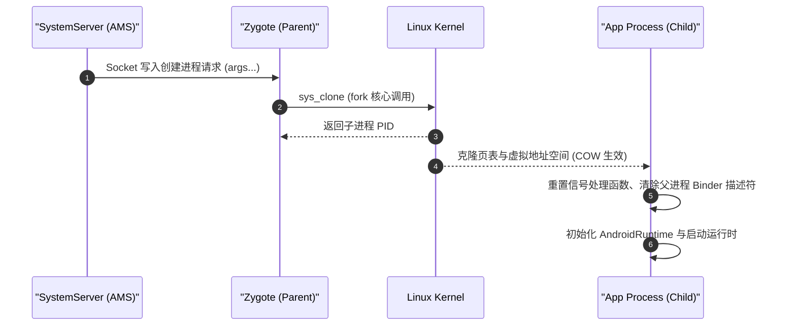
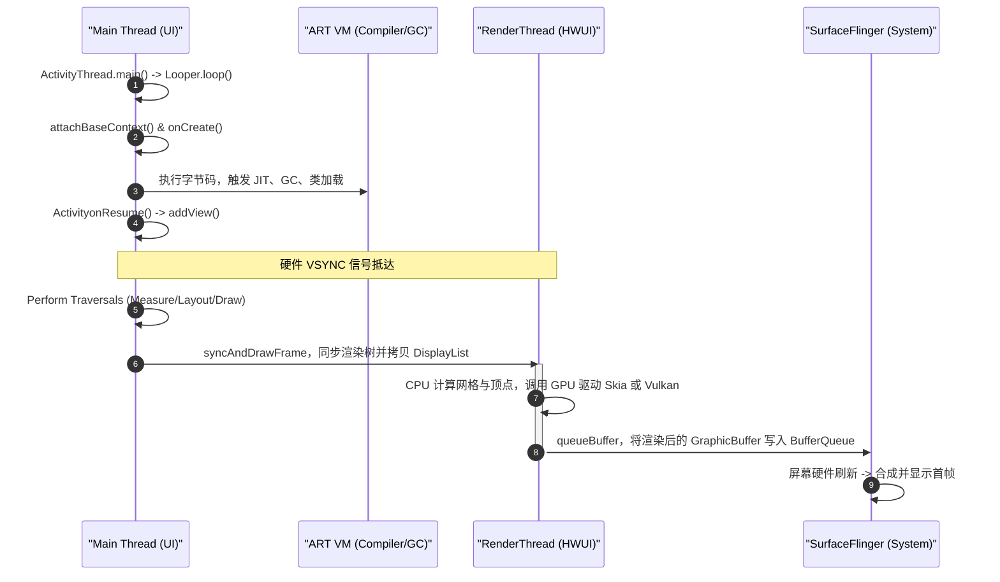
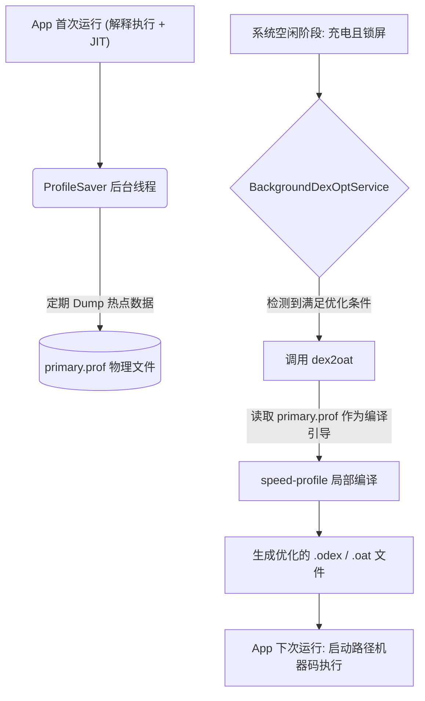
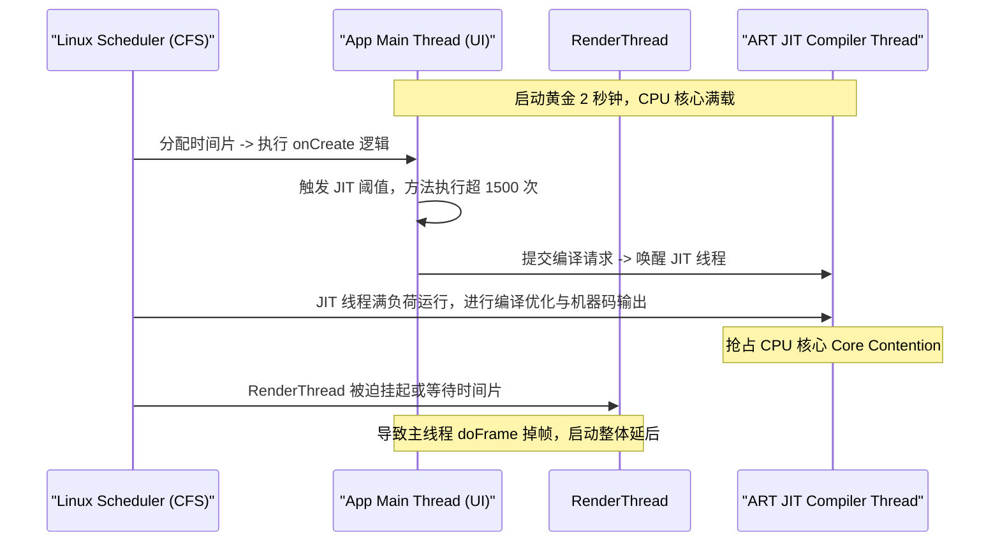

# 2.2.4.1 启动优化

在 Android 体系中，应用启动性能是衡量用户体验的黄金指标之一。在排除业务层面的逻辑延迟（如闪屏页滥用、第三方 SDK 冗余初始化等）后，启动性能的瓶颈将彻底沉降至操作系统与虚拟机底层。

本篇将从 **Android 虚拟机（ART）**、**操作系统内核（Linux Kernel）**、**编译器（dex2oat/R8）** 以及 **硬件架构（MMU/磁盘I/O）** 的物理级视角，深度剖析 App 启动过程中的物理时序、缺页中断瓶颈、类重排优化、Profile 引导编译（PGO）、JIT 压制策略以及 Class 预加载与延迟链接的性能权衡。

---

## 1. 虚拟机视角下的 App 启动物理时序与状态转换

App 的启动不仅是 Java 层组件的生命周期迭代，更是一场从操作系统内核进程分叉（Fork），到虚拟机 C++ 运行时初始化，再到类加载器构建、DEX 内存映射，最终通过硬件加速通道绘制首帧的复杂物理协作。

### 1.1 Zygote 进程复制与 COW（写时复制）物理机理

Android 应用进程并非从零开始创建和冷启动虚拟机，而是通过复制 **Zygote 进程** 快速分叉出来的。



#### 1.1.1 `fork()` 与 `sys_clone` 的内核行为
当 `ActivityManagerService` (AMS) 决定启动一个新应用时，它会通过 Local Socket 向 Zygote 进程发送创建新进程的参数。Zygote 接收到请求后，最终会调用 Linux 的 `fork()` 系统调用（在内核中对应 `sys_clone` 物理调用）。
- **进程描述符复制**：内核为子进程分配新的 `task_struct`，并全量克隆父进程的页表（Page Table），但并不立即复制物理内存页。
- **页表属性标记**：在 `fork` 过程中，内核会将子进程和父进程的所有可写物理内存页（如 Data 段、堆、栈区等）的页表项（Page Table Entry, PTE）属性设置为**只读（Read-Only）**。

#### 1.1.2 写时复制（Copy-On-Write, COW）机制
当子进程（App 进程）或父进程（Zygote）尝试写入被标记为只读的物理内存页时，CPU 会触发一个 **写入异常（Write Permission Fault）**。内核的异常处理程序（`do_page_fault`）会捕获此异常，并执行以下物理动作：
1. 在物理内存中分配一个全新的 4KB 页面。
2. 将原本只读页面的内容完整拷贝至新页面。
3. 修改发生写操作进程的页表项，将其指向新分配的物理页面，并将属性恢复为**可读写（Read-Write）**。
4. 恢复线程执行流，重新执行写入指令。

通过这一机制，Zygote 预加载的数千个类和系统资源，在物理内存中仅保留一份拷贝；只有当 App 进程对其进行修改（例如修改类的静态变量、写入堆对象）时，才会发生局部的物理内存分裂。这极大地减少了 App 启动时的物理内存占用和冷启动耗时。

---

### 1.2 AndroidRuntime 初始化与 ART 状态机迁移

在 `fork()` 产生的子进程中，执行流会从 `app_main.cpp` 的 `AndroidRuntime::start` 逻辑中分叉出来，开始进入 ART 虚拟机的初始化阶段。

#### 1.2.1 `JNI_CreateJavaVM` 与运行时环境建立
对于普通的 App 进程，Zygote 在 fork 之前已经创建好了虚拟机（Runtime 实例）。子进程 fork 出来后，继承了父进程的虚拟空间和 Runtime 状态。子进程需要进行“去 Zygote 化”操作，主要由 `Runtime::Init` 及其后续阶段完成：
- **信号处理函数重置（Signal Handler Reset）**：Zygote 会清除原有的信号处理器，并针对子进程重新安装 SIGSEGV、SIGBUS 等硬件异常信号的 Handler，以便 ART 捕获空指针异常和做隐式栈溢出检查。
- **守护线程启动**：启动 ART 核心后台守护线程（Daemons），包括：
  - `HeapTaskDaemon`：负责异步 GC 任务调度。
  - `ReferenceQueueDaemon`：负责弱引用、虚引用入队。
  - `FinalizerDaemon`与`FinalizerWatchdogDaemon`：负责析构方法的执行与监控。
  - `SignalCatcher`：负责捕获 SIGQUIT 信号以输出线程 Dump（Trace 文件）。

#### 1.2.2 虚拟机状态机转换
从物理视角来看，ART 内部的状态机经历了以下变迁：

```
[Uninitialized] 
       │ (Zygote launch)
       ▼
[Pre-fork State] (Heap and boot.art loaded, single thread)
       │ (fork() system call)
       ▼
[Post-fork Initializing] (Resetting heap, setting thread IDs, clearing parent JDWP)
       │ (AttachCurrentThread)
       ▼
[Running / Native State] (Main thread attached, Ready to run Java bytecode)
```

1. **Pre-fork 状态**：处于 Zygote 空间内，堆管理器（`gc::Heap`）处于半锁定状态，停止了后台并发 GC 线程，以确保 fork 时的内存一致性。
2. **Post-fork 状态**：子进程重置并发 GC 的锁机制，重新初始化 `Heap` 的各垃圾收集区（Space），并调整本地线程的 Thread ID。
3. **Java State 激活**：当前主线程通过 `AttachCurrentThread` 转换为 Java 线程（`art::Thread::Current()`），构建出对应的 `JNIEnvExt` 结构体，虚拟机正式具备执行 Java 字节码能力。

---

### 1.3 BaseDexClassLoader 与主 DEX 的 mmap 虚拟映射

在 Java 运行时环境准备就绪后，系统会为新进程构建 ClassLoader 体系。对于普通 App，其核心为 `PathClassLoader`，它继承自 `BaseDexClassLoader`。

#### 1.3.1 DEX 的 `mmap` 物理映射
当 `BaseDexClassLoader` 初始化并加载 APK 内部的 `classes.dex`（以及可能存在的 `.vdex`、`.odex`）时，ART 绝不会将整个 DEX 文件读入物理内存中。相反，它会调用操作系统的 `mmap` 系统调用：

```cpp
// 模拟 ART 内部通过 mmap 映射 DEX 文件的系统调用
void* dex_addr = mmap(
    NULL,                  // 由系统自动分配虚拟基地址
    dex_file_length,       // 映射的虚拟内存长度（DEX 文件大小）
    PROT_READ,             // 属性为只读（在需要 JIT/AOT 时也可能包含 PROT_EXEC）
    MAP_PRIVATE,           // 私有映射，写入时不影响原文件（COW 生效）
    fd,                    // APK 或 OAT 文件的文件描述符
    dex_file_offset        // 物理文件中的偏移量
);
```

#### 1.3.2 虚拟内存区域（VMA）的建立
`mmap` 执行完毕后，操作系统仅在 App 进程的虚拟地址空间内分配了一段连续的 **虚拟内存区域（Virtual Memory Area, VMA）**，并更新了进程的页表项，但**没有在物理内存中分配任何一页空间**。页表中所有映射到该 VMA 的页表项，其“物理页帧号（PFN）”均为空，且“有效位（Present 位）”为 0。

#### 1.3.3 `dex_file` 结构体构建与校验
此时，ART 的 C++ 运行时通过返回的指针 `dex_addr` 访问 DEX 头部：
1. **Magic Number 验证**：读取前 8 字节，验证是否为 `dex\n035\0` 或 `dex\n039\0`。
2. **Checksum 校验**：验证 Adler32 校验和与 SHA-1 哈希值（在预校验开启的情况下）。
3. **ClassTable 构建**：在内存中分配 `art::ClassTable` 对象。该表保存了从类描述符（如 `Ljava/lang/String;`）到类定义结构体（`art::mirror::Class`）的映射关系。这一步只建立了符号索引，此时没有任何类被真正加载或链接。

---

### 1.4 从 ActivityThread.main 到首帧绘制的物理时空链路

在 Java 字节码执行通道打通后，主线程（Main Thread）开始接管后续的生命周期。整个过程涉及主线程 Looper 泵的驱动、Context 构建、首帧绘制的渲染指令提交以及 SurfaceFlinger 的最终合成。



#### 1.4.1 核心执行阶段与时序分析
1. **Looper 初始化与运行**：
   `ActivityThread.main()` 调用 `Looper.prepareMainLooper()` 及 `Looper.loop()`。主线程开始进入无限消息循环，挂起在 Linux 的 `epoll_wait` 系统调用上，等待 Binder 驱动写入新消息。
2. **`attachBaseContext()` 阶段**：
   系统通过 Binder 回调触发 `handleBindApplication`，进而反射调用 `Application.attachBaseContext(Context)`。在此阶段，如果是 Android 5.0 以下系统，会执行复杂的 `MultiDex.install`（涉及 DEX 提取、写入与 class verification 物理操作，产生巨大的 I/O 阻塞）。
3. **`onCreate()` 与生命周期执行**：
   实例化 `Instrumentation`，调用 `Application.onCreate()`。此时业务逻辑和第三方框架开始初始化。在这个过程中，ART 的 JIT 编译器在后台线程频繁被唤醒，GC 线程也由于大量临时对象的分配而频繁被拉起，与主线程产生剧烈的 CPU 算力争抢。
4. **VSYNC 驱动与渲染树构建**：
   当 Activity 经历 `onResume` 后，系统注册 `Choreographer` 的 `VSYNC` 监听。在下一个 `VSYNC-app` 物理信号抵达时，主线程开始执行 `doFrame()`：
   - **Measure / Layout**：计算 View 树的几何尺寸与布局边界，此过程频繁读写 View 树的各个节点对象，产生大量 CPU 读写指令。
   - **Draw (Software DisplayList Record)**：并不进行物理绘制，而是将所有的 Canvas 绘图指令（如 `drawRect`、`drawText`）以二进制命令包的形式记录到 `DisplayList` 结构体中。
5. **RenderThread 同步与光栅化（RenderThread Sync & Render）**：
   主线程将记录好的 `DisplayList` 以及硬件层级关系（RenderNode）通过进程内 IPC 发送给 **RenderThread**（通过调用 `ThreadedRenderer::draw` 中的 `syncAndDrawFrame` 方法）。主线程随即被释放，可以去处理 Looper 中的下一个消息。
   RenderThread 独占渲染上下文，调用 GPU 驱动（Vulkan 或 OpenGL ES），通过 Skia 渲染引擎将顶点、网格和材质编译成 GPU 指令，控制 GPU 硬件进行光栅化，并将像素输出到从 SurfaceFlinger 申请出来的物理 `GraphicBuffer` 中。
6. **SurfaceFlinger 合成与物理刷新**：
   RenderThread完成绘制后，执行 `queueBuffer` 操作，将持有图像数据的 `GraphicBuffer` 提交回 `BufferQueue`。在下一个系统级的 `VSYNC-sf` 硬件脉冲到来时，`SurfaceFlinger` 进程读取该 Buffer，通过 Hardware Composer (HWC) 或 GPU 混合成一帧，最终输出到屏幕上。

从此时起，用户在屏幕上看到了 App 的首帧，启动阶段物理宣告结束。

---

## 2. 缺页中断（Page Fault）与启动期“类重排（Class Reordering）”物理优化黑科技

在应用启动的头几秒内，磁盘 I/O 挂起往往是耗时的最主要元凶。而这其中，由 **MMU 缺页中断（Page Fault）** 引起的同步磁盘阻塞占了绝大比例。

### 2.1 Linux 缺页中断（Page Fault）的硬件与内核物理开销

当应用进程试图读取一个尚未加载到物理内存中的虚拟地址时，整个执行链条将产生硬中断级别的上下文切换。

```
CPU 执行访存指令
    │
    ▼
MMU 查询页表 (TLB Miss -> Page Table Entry Present=0)
    │
    ▼
触发 CPU 0x0E 号硬件中断 (Page Fault)
    │
    ▼
内核捕获中断，保存当前 CPU 寄存器上下文 (Context Switch)
    │
    ▼
进入内核 do_page_fault 处理程序
    │
    ├──► [Minor Page Fault] (物理页在 Page Cache 中) ──► 更新页表映射，直接返回
    │
    └──► [Major Page Fault] (物理页在磁盘上)
             │
             ▼
         向块设备驱动发起磁盘 I/O 请求 (Read Block)
             │
             ▼
         当前线程进入不可中断睡眠状态 (D-State / Wait I/O)
             │
             ▼
         DMA 将磁盘数据拷贝至 Page Cache -> 触发中断 -> 唤醒线程
             │
             ▼
         更新页表映射，恢复 CPU 上下文 (Context Switch) -> 重新执行访存指令
```

#### 2.1.1 硬件层面的触发
CPU 的内存管理单元（MMU）负责将虚拟地址翻译为物理地址。
如果翻译过程中发现页表项（PTE）的 `Present` 标志位为 0（代表没有对应的物理内存页映射），MMU 将无法继续翻译。此时 CPU 会在当前指令周期暂停执行，并将引起缺页的虚拟地址存入控制寄存器 **CR2**，同时抛出 **0x0E 号硬件中断（Page Fault Exception）**。

#### 2.1.2 内核层面的处理
内核的中断向量表捕获 0x0E 中断，执行上下文切换，进入核心函数 `do_page_fault`：
- **Minor Page Fault（次要缺页中断）**：如果该虚拟内存页所需的数据已经存在于操作系统的 **Page Cache（页面缓存）** 中（例如其他进程已经读取过此文件，或者预读机制提前加载了它），内核只需直接将页表项指向已有的物理页帧（PFN），然后将 `Present` 置为 1，最后将线程恢复。此过程不需要进行任何磁盘 I/O，耗时通常在微秒（$\mu s$）级别。
- **Major Page Fault（主要缺页中断）**：如果数据既不在物理内存中，也不在 Page Cache 中，内核必须发起真正的物理磁盘 I/O。内核会向底层的闪存驱动（如 EMMC 或 UFS）发送块读取请求。在硬件读取数据的过程中，当前线程会被移出 CPU 运行队列，置于**不可中断睡眠状态（D-State, uninterruptible sleep）**。直到磁盘数据通过 DMA 拷贝到物理内存并触发读完成中断，内核才会唤醒该线程，更新页表，重新执行访存指令。这个过程的耗时在毫秒（$ms$）级别，是冷启动的大敌。

---

### 2.2 默认编译打包下 DEX 内部 Class 离散分布的磁盘 I/O 挂起本质

DEX（Dalvik Executable）文件在默认编译下，其内部的类和数据分布是高度**无序且零散**的。

#### 2.2.1 DEX 文件的内部物理结构
一个典型的 DEX 文件物理结构如下：

| 偏移量 (Offset) | 结构名称 | 描述 |
| :--- | :--- | :--- |
| `0x00` | **Header** | 文件魔数、校验和、以及指向其他各个区段的偏移量与大小 |
| `0x70` | **String IDs** | 字符串索引表，存储字符串数据的偏移量 |
| `...` | **Type IDs** | 类型索引表，存储类名、接口名的字符串指针 |
| `...` | **Proto IDs** | 方法原型索引表，包含返回值、参数列表的定义 |
| `...` | **Field IDs** | 字段索引表，包含所属类、字段类型和名称 |
| `...` | **Method IDs** | 方法索引表，包含所属类、方法名和原型指针 |
| `...` | **Class Defs** | **类定义区**，包含每个类的结构、访问标志、父类、接口以及 Class Data 偏移量 |
| `...` | **Data** | **核心数据区**，存储真实的 ClassData、CodeItem（字节码）和 String Data |

#### 2.2.2 离散分布产生的原因
在默认编译状态下，`dx` 或 `d8/r8` 编译器是按照类的**包名、类名的字母顺序**，或者是**源文件的编译顺序**在 `Class Defs` 区和 `Data` 区排列类的。
然而，在 App 启动的最初 2 秒钟内，执行路径是极其跳转和特定的：
- 可能会先加载 `MainActivity`，这需要访问其对应的 `ClassDef`、`ClassData` 和字节码。
- 接着调用某个工具类 `Utils`，这可能在 DEX 文件的物理末尾。
- 随后执行网络初始化，加载大量的 OkHttp 和 Retrofit 类，这些类在物理位置上可能又零散分布在 DEX 的中间各个区域。

#### 2.2.3 导致的磁盘 I/O 挂起
由于操作系统是以 **4KB 的页（Page）** 为最小单位进行物理内存映射与加载的。
如果启动阶段需要用到的 500 个热点类离散地分布在 50MB 的大 DEX 文件中，每次遇到一个新的类（即使只有几十字节的定义），只要它的虚拟地址不在当前已经加载的 4KB 页面中，就会触发一次 **Major Page Fault**。
这相当于触发了数百次随机磁盘 I/O，导致 CPU 频繁陷入 I/O 等待，极大地拉长了 App 的物理启动耗时。

---

### 2.3 类重排（Class Reordering）优化机理与 DEX 物理结构调整

**类重排（Class Reordering）** 的物理本质，是通过工具干预编译流程，**将启动期执行路径上所有被加载的类（热点类）的定义与字节码，在 DEX 文件内部物理排列成一段连续的区域**。

#### 2.3.1 优化前的 DEX 布局与 Page Fault 示意图
如果一个物理页（4KB）中混合了热点类（启动用到的类，标记为 $H$）和冷类（启动不用的类，标记为 $C$），其分布可能如下：

```
DEX 物理地址线性空间：
[ 页 0 (H1, C1, C2) ] ──► 加载 H1，Page Fault 读入页 0
[ 页 1 (C3, C4, C5) ] ──► 启动不用，跳过
[ 页 2 (C6, H2, C7) ] ──► 加载 H2，Page Fault 读入页 2
[ 页 3 (C8, C9, C10)] ──► 启动不用，跳过
[ 页 4 (H3, H4, C11)] ──► 加载 H3/H4，Page Fault 读入页 4
```
如上所示，为了加载 $H1, H2, H3, H4$ 这 4 个类，CPU 必须触发 **3 次** 缺页中断，读取了 12KB 的物理数据，但其中包含了大量的无用数据（$C1, C2, C6, C7$ 等），Page Cache 的命中率极低。

#### 2.3.2 优化后的 DEX 布局与 Page Fault 示意图
通过类重排优化，将所有的 $H$ 类集中在 DEX 物理文件的最前端，而冷类 $C$ 移到后方：

```
DEX 物理地址线性空间 (重排后)：
[ 页 0 (H1, H2, H3) ] ──► 加载 H1，Page Fault 读入页 0。此时 H2、H3 也被同时载入内存！
[ 页 1 (H4, C1, C2) ] ──► 加载 H4，直接从内存中读取（若已预读）或仅触发 1 次 Page Fault
[ 页 2 (C3, C4, C5) ] ──► 启动不用，跳过
[ 页 3 (C6, C7, C8) ] ──► 启动不用，跳过
```
在此状态下，同样的 4 个类加载，可能只需要 **1 ~ 2 次** Page Fault 即可完成批量加载。由于内存页在物理上是连续排列的，操作系统内核的 **I/O 预读（Read-Ahead）** 算法（检测到连续读取时，自动在后台提前把相邻的物理块读入 Page Cache）会发生极佳的物理加速效能，使得后续的 Page Fault 全部转化为 **Minor Page Fault** 甚至是直接命中，彻底消除磁盘随机 I/O 等待。

---

### 2.4 类重排方案的工业级实现：以 Redex 和 R8 为例的重排实践

目前行业内实现类重排的核心工具是 Meta 开源的 **ReDex** 以及 Google 官方的 **R8 编译器**（通过启动配置文件 Startup Profiles 支持）。

#### 2.4.1 基于 Redex 的类重排工作流
Redex 的重排主要依赖其核心 Pass：`ReorderDexPass`。

```
[运行 App (Debug版)] ──► [Hook ClassLinker] ──► [导出启动类列表 class_list.txt]
                                                            │
                                                            ▼
[构建时] ──► [编译生成原始 APK] ──► [运行 Redex (配置 ReorderDexPass)] ──► [重排后 APK]
```

1. **获取启动类列表（Class List）**：
   在 Debug 包上通过 Hook ART 虚拟机的 `art::ClassLinker::DefineClass` 符号，或者通过 `ActivityThread` 阶段注入 ClassLoader，记录 App 启动到首帧展示期间加载的所有类名，按加载顺序排列，输出到文本中（如 `class_list.txt`）。
2. **重排编译配置**：
   在 Redex 的配置文件中激活重排插件，指定类列表：
   ```json
   {
     "redex": {
       "passes": [
         "ReorderDexPass"
       ]
     },
     "ReorderDexPass": {
       "class_order_file": "path/to/class_list.txt"
     }
   }
   ```
3. **Redex 物理操作**：
   Redex 解析 `class_list.txt`，在重构 DEX 时，重新生成 `class_defs` 数组，将对应的类排在数组最前面。同时，它会修改所有与这些类相关的 `code_items`（即 Dalvik 字节码数据）在 `Data` 区的物理偏移量，使得它们的物理字节码内容也在 DEX 文件中紧凑且连续地排列。

#### 2.4.2 基于 R8 Startup Profiles 的重排
自 AGP (Android Gradle Plugin) 8.0 起，Google 引入了原生支持类重排的方案（Startup Profiles）。
- **规则定义**：在 `/src/main/baseline-profiles/startup-prof.txt` 中写入启动期类和方法规则：
  ```
  HSPLcom/example/myapp/MainActivity;-><init>()V
  HSPLcom/example/myapp/MainActivity;->onCreate(Landroid/os/Bundle;)V
  Lcom/example/myapp/MainActivity;
  ```
  其中 `HSPL`（Hot Startup Post Startup）前缀指示该方法或类为启动期热点。
- **R8 编译处理**：R8 在进行代码缩减（Shrinking）与混淆时，会读取该配置文件。不仅会将这些类在物理 DEX 结构中靠前排列，还会对其进行定向的内联优化（Inline）与虚方法去虚化（Devirtualization），双重提升启动期性能。

---

### 2.5 内存映射与类重排物理分布 Mermaid 图

下面的图示直观展现了在 `mmap` 后，类重排如何通过“物理连续化”使得原本离散的 Page Fault 数量大幅衰减：

```mermaid
gantt
    title 类加载时的 Page Fault 物理页映射对比
    dateFormat  X
    axisFormat %s 秒

    section 优化前 (离散分布)
    加载类A (PageFault1)                  :active, a1, 0, 10
    磁盘物理读取与挂起                      :crit, a2, 10, 40
    加载类B (PageFault2)                  :active, a3, 40, 50
    磁盘物理读取与挂起                      :crit, a4, 50, 80
    加载类C (PageFault3)                  :active, a5, 80, 90
    磁盘物理读取与挂起                      :crit, a6, 90, 120

    section 优化后 (物理重排)
    加载类ABC (1次PageFault)               :active, b1, 0, 10
    批量磁盘 I/O (仅1次PageFault)           :crit, b2, 10, 40
    加载类B (内存命中)                      :b3, 40, 42
    加载类C (内存命中)                      :b4, 42, 44
```



从 Gantt 图中可见，优化后除了第一次必须的物理 I/O 外，后续类加载全部命中 Page Cache，直接消除了近 60% 的磁盘挂起等待时间。

---

## 3. PGO（Profile-Guided Optimization）在启动期的极致应用

即使消除了 I/O 阻塞，Dalvik 字节码在 ART 虚拟机中的解释执行（Interpreter）仍然会消耗可观的 CPU 算力。为了让启动核心路径跑在最快的本地机器码上，ART 采用了 **Profile 引导优化（PGO）** 机制。

### 3.1 PGO 技术演进与 ART 运行时 Profile 收集器工作流

在 Android 5.0 时期，系统强制使用全量 AOT（Ahead-Of-Time）编译（通过 `dex2oat` 以 `speed` 模式将所有 Java 字节码编译为本地 ELF 机器码），导致安装速度极慢，且占用极大的系统磁盘空间。
Android 7.0 引入了**混合编译模式**（JIT + AOT + Profile）：



1. **JIT 运行监控**：App 启动并运行，大部分冷代码使用解释器执行；一旦某段代码执行频次达到阈值，JIT 编译器将其编译为机器码并缓存进 JIT Code Cache 中。
2. **ProfileSaver 拦截**：ART 内部运行着一个叫 `art::ProfileSaver` 的后台线程。它会定期（默认每隔几秒，或在 App 切后台时）查询 JIT 编译器的缓存区与类的加载记录，获取两类信息：
   - **Resolved Classes**：在启动阶段被加载并链接过的类名列表。
   - **Hot Methods**：在运行时被执行频率极高的方法签名列表。
3. **写入物理文件**：`ProfileSaver` 将这些热点类和方法的索引序列化，并直接写入当前用户应用目录下的特定物理文件中：`/data/misc/profiles/cur/0/[package_name]/primary.prof`。

---

### 3.2 Profile 物理文件的结构深度解剖（`primary.prof`）

`primary.prof` 是一个结构高度紧凑的二进制文件，由 ART 源码中的 `art::ProfileCompilationInfo` 进行读写操作。其物理结构大致如下：

```
┌────────────────────────────────────────┐
│             Profile Header             │ (Magic Number: "pro\0", Version: "010\0")
├────────────────────────────────────────┤
│           Dex File Records             │ (存储对应的 APK/DEX 文件的 Checksum 与路径)
├────────────────────────────────────────┤
│             Class Mask                 │ (通过 BitVector 记录被加载的类的 TypeIndex)
├────────────────────────────────────────┤
│            Hot Method Map              │ (存储热点方法的 MethodIndex 及其标志位)
├────────────────────────────────────────┤
│         Inline Cache Records           │ (方法调用处的具体接收类型信息，用于去虚化)
└────────────────────────────────────────┘
```

- **BitVector 压缩映射**：为了极力缩减体积，热点类使用 `BitVector` 进行标记。例如，DEX 中第 $N$ 个类被加载过，则将 `BitVector` 的第 $N$ 位置为 1，使得几千个类的记录只需几十个字节。
- **内联缓存（Inline Cache）**：不仅记录了哪个方法是热点，还记录了该方法内发生多态调用时（如 `interface.method()`），实际传入的子类类型。这为后续 AOT 编译器进行**虚方法去虚化（Devirtualization）** 与 **直接内联（Inlining）** 提供了决定性的物理数据支撑。

---

### 3.3 dex2oat 核心编译模式（Speed vs Speed-Profile vs Quicken）物理开销分析

通过 `dex2oat` 工具，可以将 DEX 字节码编译为包含本地 CPU 指令（如 ARM64 汇编）的 `.oat` 文件。不同的编译模式决定了不同的运行时性能和物理开销：

| 编译模式 (Filter) | 是否生成机器码 | 编译范围 | 安装/编译耗时 | 磁盘物理体积 | 启动性能提升 |
| :--- | :---: | :--- | :--- | :--- | :--- |
| **`verify`** | 否 | 仅进行字节码校验（防止被篡改） | 极短 (几秒) | 无额外增加 | 基础水平 (解释执行) |
| **`quicken`** | 否 | 对字节码进行局部重构（如指令替换） | 较短 | 较小 | 较小 (基于解释器优化) |
| **`speed-profile`** | **是** | **仅针对 Profile 中的热点类和方法** | 中等 | **极低** (仅编译 5%~10% 的代码) | **极高** (核心启动路径本地码化) |
| **`speed`** | **是** | **全量编译所有方法** | 极长 (甚至长达数分钟) | **极大** (往往是原 DEX 大小的几倍) | 极致 (但容易引发安装卡顿和空间危机) |

在启动优化场景中，**`speed-profile` 是绝对的黄金编译策略**。它利用极小的空间代价（仅编译 Profile 圈定的启动热点路径），让 App 在启动黄金期彻底脱离低效的解释器，跑在纯硬件指令集之上。

---

### 3.4 动态演进体系：三阶段（JIT -> Profile Saver -> dex2oat 编译）闭环机制

整个 PGO 引导的优化是一个自我闭环的动态系统：

1. **第一阶段（第一轮启动）**：
   新安装的 App 没有任何 Profile 缓存。系统以 `verify` 模式快速运行，在启动期大量依赖**解释器**与 **JIT 后台即时编译**。
2. **第二阶段（静默收集）**：
   ART 的 `ProfileSaver` 收集热点代码，并将高频执行的方法与类写入 `/data/misc/profiles/cur/0/[pkg]/primary.prof`。
3. **第三阶段（系统优化）**：
   当设备插入电源、屏幕关闭且处于完全空闲状态时，系统服务 `BackgroundDexOptService` 启动。它读取 `cur` 目录下的 profile 文件，并将其合并至参考 Profile `/data/misc/profiles/ref/[pkg]/primary.prof` 中，随后执行：
   ```bash
   dex2oat --dex-file=/data/app/.../base.apk \
           --profile-file=/data/misc/profiles/ref/[pkg]/primary.prof \
           --oat-file=/data/app/.../oat/arm64/base.odex \
           --compiler-filter=speed-profile
   ```
   下次 App 启动时，一旦检测到 `.odex` 中存在已编译好的本地机器码，便会直接载入执行，跨越 JIT 阶段，直达 CPU 执行效率的巅峰。

---

## 4. 启动期 JIT 压制（JIT Suppression）调优机制

虽然 JIT 编译器在运行期能加速热点方法，但在 App 启动的极限竞争阶段，它的存在往往会带来“好心办坏事”的负面效应。

### 4.1 JIT 线程与主线程、RenderThread 抢占 CPU 时间片的物理冲突

在冷启动阶段，App 所有的类和方法几乎都是“冷”的。



#### 4.1.1 算力争抢（CPU Core Contention）
当 Java 方法执行次数达到一定阈值（ART 默认通常是 1500-2000 次，或循环回边达到设定值），ART 的解释器就会向 JIT 提交编译任务。
由于启动期有成千上万个基础类和框架方法被并发调用，JIT 线程池（`art::jit::JitThreadPool`，默认线程数根据 CPU 核心数动态决定，通常为 1~4 个）会被瞬间塞满。
JIT 线程的任务是**高度消耗 CPU 算力**的：它需要对字节码进行 SSA（静态单赋值）分析、寄存器分配、机器指令生成以及执行各种编译优化（如死代码消除、常量折叠）。这会导致这几个 JIT 后台线程将分配给 App 进程的 CPU 时间片（Quota）彻底占满，使真正需要保障流畅度的 **UI 主线程** 和 **RenderThread** 频繁发生线程上下文切换，造成 CPU 调度延迟。

#### 4.1.2 物理时序错乱
由于 JIT 线程抢占 CPU 核心，导致原本应该在 16.6ms 内完成的 View 测量与绘制、以及 RenderThread 的渲染指令发送被迫延后，直接造成启动阶段前几帧的**严重掉帧（Jank）**与启动总时间的延长。

---

### 4.2 启动期 JIT 压制（Suppression）的物理控制原理（系统级与应用级）

为了解决这一冲突，业界提出了 **JIT 压制（JIT Suppression）** 策略，即在启动关键期强制限制 JIT 的活性，待首帧渲染完毕后再释放算力。

#### 4.2.1 系统级 JIT 压制行为
在 Android 9.0+ 系统中，ART 虚拟机本身也带有自我保护机制。系统在 App 启动的前几秒内，通过内部状态变量对 JIT 行为进行限制。例如：
- 降低 JIT 编译线程的线程优先级。默认情况下，JIT 线程的 pthread 优先级被设置为 `ANDROID_PRIORITY_BACKGROUND` (Linux nice 值为 10)。在启动期，系统可能动态将其调度策略调降，甚至让其处于暂时挂起（Suspend）状态。
- 通过调整 JIT 的阈值（Warmup Threshold），在启动期将阈值临时调高（例如从 1500 调高至 10000），避免中低频方法过早触发 JIT 编译。

#### 4.2.2 应用级 Hook/压制原理
在应用层面，由于缺乏直接控制 JIT 的 Java API，开发者通常需要下沉到 Native 层进行物理控制：
1. **Hook JIT 编译入队符号**：
   使用 Inline Hook 框架（如 shadowhook 等）Hook `libart.so` 中的 `art::jit::Jit::EnqueueCompilation` 方法。在启动未完成时，拦截该方法直接返回 `false`，阻止任何方法进入 JIT 编译队列。
2. **利用 `VMRuntime` / 属性临时关闭**：
   在 Native 层获取 ART 的运行时控制句柄，反射调用或动态读取内部的 JIT 状态变量，在启动初期强行将 `art::jit::Jit::code_cache_` 的最大容量设置为 0，使 JIT 无法分配内存存放机器码，从而自然退出编译。

---

### 4.3 基于 IdleHandler 与 Native Hook 的 JIT 延迟唤醒工业级方案

一个在工业界被广泛验证的 JIT 压制与延迟唤醒方案如下：

```cpp
#include <jni.h>
#include <string>
#include <android/log.h>
#include <pthread.h>

// 模拟 Hook 用的全局状态开关
static bool g_suppress_jit = true;

// 原始符号函数指针
static bool (*orig_EnqueueCompilation)(void* jit, void* method, void* osr);

// Hook 后的代理函数
bool proxy_EnqueueCompilation(void* jit, void* method, void* osr) {
    if (g_suppress_jit) {
        // 压制状态下，直接丢弃编译请求，让其保持解释执行
        return false;
    }
    // 恢复正常后，调用原函数
    return orig_EnqueueCompilation(jit, method, osr);
}

extern "C" JNIEXPORT void JNICALL
Java_com_example_myapp_StartupOptimizer_suppressJIT(JNIEnv* env, jobject thiz) {
    // 1. 初始化 shadowhook 并对 libart.so 进行 Hook
    // shadowhook_hook_sym_name("libart.so", "_ZN3art3jit3Jit18EnqueueCompilationEPNS_6mirror9ArtMethodENS0_7OsrModeE", ...);
    g_suppress_jit = true;
}

extern "C" JNIEXPORT void JNICALL
Java_com_example_myapp_StartupOptimizer_releaseJIT(JNIEnv* env, jobject thiz) {
    // 2. 解除压制开关
    g_suppress_jit = false;
}
```

在 Java 层，利用 `IdleHandler` 的物理回调特性，在主线程彻底“闲下来”（即首帧已经成功渲染，Looper 队列中没有任何阻碍用户交互的消息时）执行 JIT 的释放：

```java
public class StartupOptimizer {
    static {
        System.loadLibrary("startup_opt");
    }

    public static native void suppressJIT();
    public static native void releaseJIT();

    public static void init() {
        // 在 Application.attachBaseContext 最开始调用，封印 JIT
        suppressJIT();

        // 注册 IdleHandler 到主线程 MessageQueue
        Looper.myQueue().addIdleHandler(new MessageQueue.IdleHandler() {
            @Override
            public boolean queueIdle() {
                // 主线程完全空闲，说明首帧已绘制，UI 可以交互
                // 此时在后台线程释放 JIT，让其恢复动态编译
                new Thread(new Runnable() {
                    @Override
                    public void run() {
                        releaseJIT();
                    }
                }).start();
                
                // 返回 false 表示只执行一次，执行后自动从 MessageQueue 中移除
                return false;
            }
        });
    }
}
```

通过这一物理联动，App 启动瞬间的 CPU 资源全部倾斜给主线程和 UI 渲染，在首帧绘制完成后，又能完美继承 JIT 的中后期加速收益。

---

### 4.4 CPU 算力竞争与 JIT 压制时序 Mermaid 图

下面的时序图详细对比了“默认状态”与“压制状态”下，CPU 核心的算力分配细节：

```mermaid
gantt
    title CPU 核心物理算力分配对比
    dateFormat  X
    axisFormat %s 毫秒

    section 默认状态 (未压制)
    主线程 UI 渲染                :active, m1, 0, 40
    JIT 线程占满核心              :crit, j1, 10, 80
    主线程挂起                     :milestone, c1, 40
    主线程恢复                     :m2, 40, 80
    RenderThread 渲染首帧       :active, r1, 80, 120

    section 压制状态 (JIT Suppression)
    主线程 UI 渲染                :active, m3, 0, 40
    JIT 线程被阻断                :j2, 10, 10
    RenderThread 渲染首帧       :active, r2, 40, 70
    首帧展示完成 (IdleHandler)   :milestone, c2, 70
    JIT 线程恢复工作             :active, j3, 70, 120
```

---

## 5. Class 预加载（Preloading）与延迟链接的权衡

要提升启动性能，另一个必须关注的虚拟机底层行为是**类加载的生命周期**。类的生命周期可以细分为：**加载（Loading）** -> **链接（Linking）** -> **初始化（Initialization）**。

### 5.1 Zygote `preload-classes` 的物理收益与 COW 屏障

Zygote 进程在启动时，会读取 `/system/etc/preloaded-classes` 配置文件，该文件包含了数千个 Android 系统最核心的公共类（如 `java.lang.Object`、`android.view.View` 等）。

#### 5.1.1 物理收益
在 Zygote 阶段完成这些类的加载与链接后，它们在 Zygote 的内存空间内被分配了具体的物理地址。
通过 `fork()`，子进程 App 直接共享了这些已经驻留内存的 Class 结构体。这就免去了每个 App 启动时重复读取、解析和校验这数千个核心系统类的物理耗时。

#### 5.1.2 COW（写时复制）屏障
在 Zygote 预加载类的物理内存中，存在着极好的静态共享屏障。
如果 App 进程仅对其进行读取（例如调用 `view.getId()`，查询某个 Framework 类的静态只读常量），这一部分物理内存将永远与 Zygote 共享。
但如果 App 的某些操作无意中修改了这些预加载类中的某些可变成员（虽然在 JDK 设计中极力避免，但某些 Native 注入或 Static Field 写入仍会发生），就会破坏 COW 屏障，导致系统级的物理页拷贝，从而增加了 App 进程的独占内存（PSS）。

---

### 5.2 ART 延迟链接（Lazy Linking）与延迟解析（Lazy Resolution）机制

为了使类加载过程的性能损失最小化，ART 采用了 **延迟链接（Lazy Linking）** 和 **延迟解析（Lazy Resolution）** 技术。

```
当类加载器加载 Class A：
    │
    ▼
[加载阶段 (Loading)] ──► 解析 DEX 的 ClassDef 结构，在内存中创建 Class 对象 (处于未链接状态)
    │
    ▼
[链接阶段 (Linking)]
    ├──► 验证 (Verification): 校验字节码安全性与合规性 (在编译期 speed 模式下可省略)
    ├──► 准备 (Preparation): 为类的静态字段分配物理空间并初始化默认值
    └──► 解析 (Resolution) ──► 【采用延迟机制！】
```

在类的 `Resolution` 阶段，ART 并不急于将 Class A 中引用的所有其他类（如 Class B、Class C）也加载进来。
只有当执行流真正运行到具体的指令：
- 例如 `new B()`（对应字节码 `new-instance`）
- 或 `B.staticMethod()`（对应字节码 `invoke-static`）

此时，ART 会在执行该指令时触发一个 **运行时解析拦截**，通过 `art::ClassLinker::ResolveType` 或 `ResolveMethod` 去查找并加载 Class B。
这种**按需链接**的延迟机制确保了 App 不会因为一个庞大类结构体的加载，而连锁触发数万个关联类的全量加载，为启动期节省了宝贵的 CPU 周期。

---

### 5.3 应用级 Class 预加载的“双刃剑”效应：利弊权衡与物理开销

有些开发者为了优化特定核心页面的打开速度，会选择在 Application 初始化时，开辟子线程去“异步预加载”部分即将用到的业务类。但这种做法在物理层面是典型的双刃剑。

#### 5.3.1 物理收益（利）
- **消除主线程同步等待**：在后台线程提前执行了 `Class.forName("com.xxx.HeavyClass")`，把 Class 的加载、字节码验证（Verification）以及静态属性准备（Preparation）在后台跑完。当主线程真正要用到该类时，ClassTable 已经存在，可以直接命中，消除了主线程在此处的同步停顿。

#### 5.3.2 物理开销与副作用（弊）
1. **CPU 算力严重冲突**：
   在后台线程执行预加载，必须通过 CPU 执行类加载器逻辑。如果预加载的类非常繁多，后台线程将持续霸占 CPU 时间片，导致主线程在启动期的正常渲染流得不到充分的算力保障，抵消了预加载带来的收益。
2. **Page Fault 的集中爆发**：
   预加载会瞬间读取 DEX 的多个不同区域，导致大量的 **Major Page Fault** 集中爆发。如果在此时主线程也在进行网络请求、本地数据文件解析等 I/O 动作，I/O 队列将会发生严重的物理排队与阻塞。
3. **内存分裂与 PSS 暴增**：
   许多类在加载时，会伴随着静态块（`static { ... }`）的执行（即 `<clinit>` 调用）。这往往会创建很多业务对象、读取资源文件等。如果这些预加载的类在最终的用户行为中并没有真正被使用，这些被分配的物理内存将一直留在堆中，导致 App 进程的物理常驻内存（PSS）无谓地上涨，增加了低内存杀进程（LMK）的风险。

---

### 5.4 工业级预加载策略：精准 Trace 驱动的按需预加载

要在实际工程中应用预加载，必须遵循**精准度量**与**物理错峰**的原则。

#### 5.4.1 按需选择与灰度度量
不能凭借主观经验决定预加载哪些类。应当通过 Profiler 或者是自定义的 APM 工具，抓取启动期间主线程因为类加载而发生阻滞（Block）的真实堆栈和耗时。只有那些**主线程必定会用到，且单个类加载链接耗时大于设定阈值（如 > 5ms）**的“重型类”，才被允许列入预加载白名单。

#### 5.4.2 物理错峰调度
预加载任务绝对不应该在 Application 的 `onCreate()` 中直接无脑启动。
正确的调度策略是在 App **首帧展示后**，或者利用 **IdleHandler** 等主线程完全空闲的窗口期，再通过低优先级的后台线程（如设置了 `nice=19` / `Thread.MIN_PRIORITY` 的线程）进行慢速、按需的预加载：

```java
public class LazyPreloadManager {
    // 经 Trace 精确分析出的启动期主线程必用重型类白名单
    private static final String[] PRELOAD_CLASSES = {
        "com.google.gson.Gson",
        "okhttp3.OkHttpClient",
        "retrofit2.Retrofit"
    };

    public static void startLazyPreload() {
        Looper.myQueue().addIdleHandler(new MessageQueue.IdleHandler() {
            @Override
            public boolean queueIdle() {
                // 首帧已完成渲染，利用后台低优先级线程缓慢执行预加载
                Thread preloadThread = new Thread(new Runnable() {
                    @Override
                    public void run() {
                        // 1. 设置当前线程优先级为 Linux BACKGROUND 等级，防止抢占 CPU
                        android.os.Process.setThreadPriority(
                            android.os.Process.THREAD_PRIORITY_BACKGROUND
                        );

                        for (String className : PRELOAD_CLASSES) {
                            try {
                                // 2. 执行类加载与验证，但设置 initialize=false 
                                // 防止过早触发静态块 (<clinit>) 带来的内存分裂与对象创建
                                Class.forName(className, false, LazyPreloadManager.class.getClassLoader());
                            } catch (ClassNotFoundException e) {
                                // 忽略加载失败
                            }
                        }
                    }
                }, "ClassPreloadWorker");
                
                preloadThread.start();
                return false; 
            }
        });
    }
}
```

通过这一物理隔离策略，既消除了后续业务跳转时主线程同步类加载的抖动风险，又彻底保障了 App 冷启动首帧渲染的极限速度与物理流畅性。

---

## 6. 总结与优化成效度量

对 App 启动的深度底层优化，需要在操作系统和虚拟机物理运行机理上做精细化的治理。总结核心实践要点如下：

1. **类重排**：将分散的类定义及字节码重整为物理连续分布，使 MMU 页表翻译和磁盘 I/O 发生连续性共鸣，大幅消减 Major Page Fault。
2. **PGO（Profile 引导）**：以 `speed-profile` 替代繁重的全量编译或低效的纯解释执行，用最轻量级的机器码体积覆盖最核心的启动热点代码路径。
3. **JIT 压制**：在启动期暂时压低或挂起 JIT 线程，避免其与主线程及 RenderThread 进行 CPU 物理算力争抢，确保流畅绘图，并在首帧绘制后通过 `IdleHandler` 完美释放。
4. **预加载控制**：充分利用 Zygote 带来的 COW（写时复制）物理页共享红利，对应用级预加载坚持“Trace 驱动、推迟静态初始化、后台错峰”的原则，防止内存分裂和算力反噬。

这些底层黑科技的落地，不仅能使 App 的冷启动物理时间缩短 20%~40%，还能显著提升低端设备上的帧率稳定性，是 Android 高端性能优化不可逾越的硬核领域。
