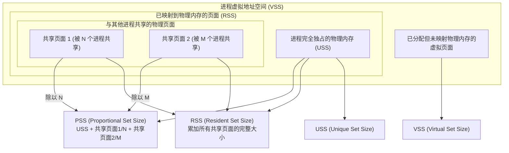
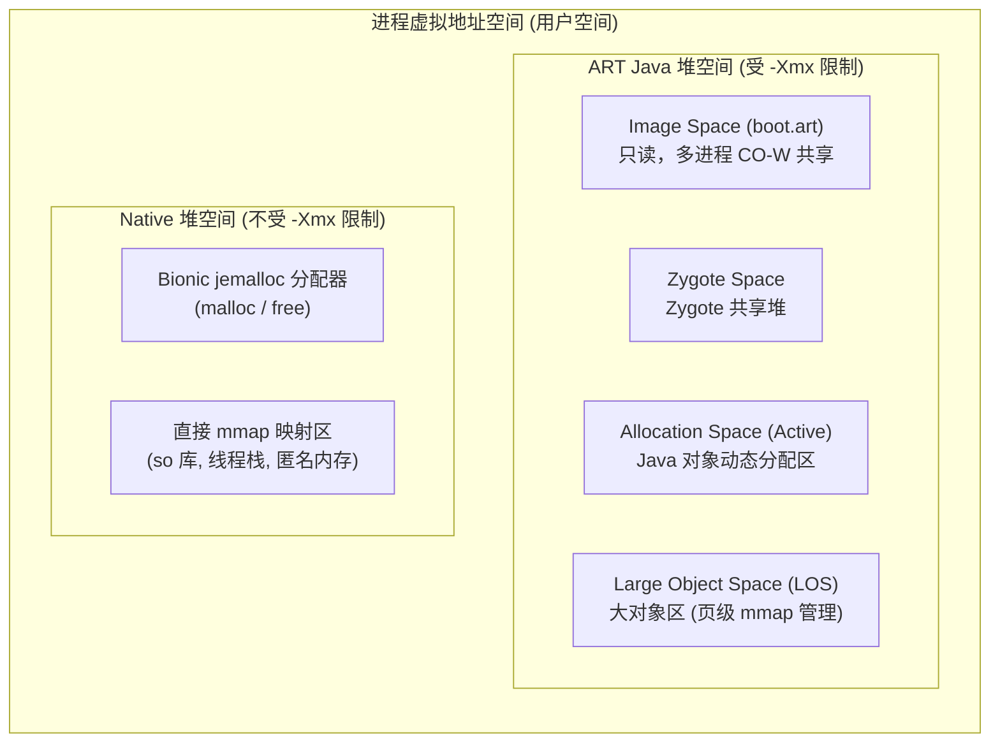
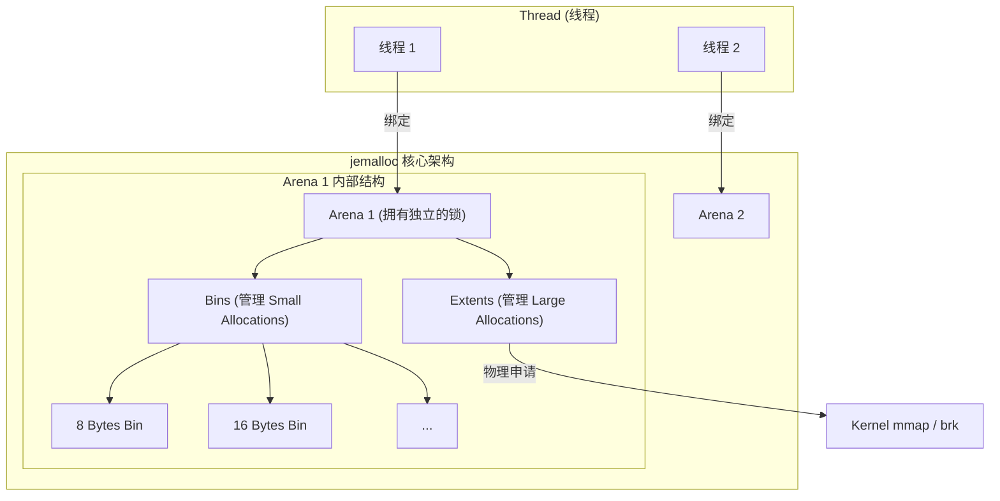
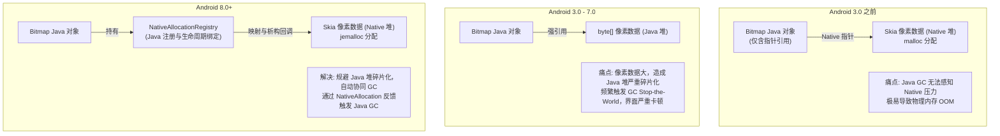
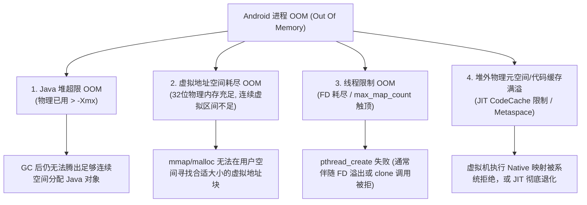
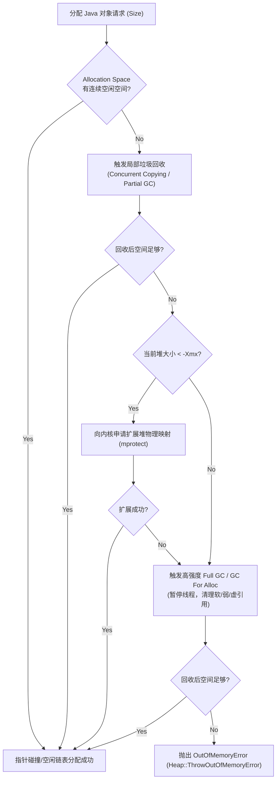

# 2.2.4.2 内存占用

在 Android 移动操作系统中，内存管理与优化历来是决定应用流畅度、稳定性和生命周期的核心战役。与传统的桌面操作系统或标准的 Java 虚拟机（JVM）不同，Android 的运行时环境（Dalvik/ART）构建于定制化的 Linux 内核之上，采用了一套独特的内存度量、分配与回收协同机制。

本篇将从操作系统内核与虚拟机底层的物理视角出发，深度解剖 Android 进程的内存占用机理。内容涵盖操作系统级内存度量指标的换算拓扑、ART Java 堆与 Native 堆的物理格局、Bitmap 像素内存的划时代演进历史、OOM（Out Of Memory）的四大物理本质成因，以及基于内核 smaps 与 `dumpsys meminfo` 的物理监控与诊断技术。

---

## 1. 操作系统级内存度量指标的底层本质与换算拓扑

在 Linux 内核与 Android 系统中，评估一个进程占用了多少内存并不是一个简单的单一数值问题。由于多进程共享内存机制、共享动态链接库以及内核按需分配（Lazy Allocation）策略的存在，同一个进程在不同的视角下会呈现出完全不同的内存占用数据。

### 1.1 虚拟内存与物理内存映射的硬件基础

在现代 CPU 架构（如 ARM64）中，进程无法直接访问物理内存（Physical Address, PA），而是运行在由内核与硬件共同构建的虚拟地址空间（Virtual Address Space, VA）中。这一机制的核心是 **MMU（Memory Management Unit，内存管理单元）** 与 **多级页表（Multi-level Page Table）**。

在 64 位 ARMv8-A 架构下，Android 系统通常配置为 39 位（512 GB）或 48 位（256 TB）的虚拟地址空间。虚拟地址被划分为固定大小的 **页（Page）**，在 Android 中通常为 4 KB（部分新设备支持 16 KB 页）。物理内存则被划分为对应的 **页帧（Page Frame）**。

```mermaid
graph TD
    subgraph "CPU 核心 (CPU Core)"
        VA["虚拟地址 (Virtual Address)"]
    end
    
    subgraph "硬件 MMU (Memory Management Unit)"
        PageTable["多级页表 (PGD -> PUD -> PMD -> PTE)"]
    end
    
    subgraph "物理内存 (RAM)"
        PA1["物理页帧 1 (Page Frame)"]
        PA2["物理页帧 2 (Page Frame)"]
        PA3["物理页帧 3 (Page Frame)"]
    end

    VA -->|发起内存访问| PageTable
    PageTable -->|翻译成功 (HIT)| PA1
    PageTable -.->|页表项为空 (MISS)| Fault["内核缺页中断 (Page Fault)"]
    Fault -->|分配物理页并填充页表| PA2
```

当程序访问一个虚拟地址时，硬件 MMU 会遍历多级页表（全局页目录 PGD -> 上级页目录 PUD -> 中间页目录 PMD -> 页表项 PTE），将虚拟地址翻译为物理地址：
*   **次缺页中断（Minor Page Fault）**：如果该虚拟地址已经通过 `malloc` 或 `mmap` 分配，但在物理内存中已经存在对应的物理页帧（例如，其他进程已经将共享库加载到了 RAM 中），内核只需在当前进程的页表项（PTE）中建立映射关系，无需进行磁盘 I/O。
*   **主缺页中断（Major Page Fault）**：如果请求的数据尚未加载到物理内存中（例如，需要从 Flash 中读取 dex 文件，或者从压缩的 zRAM 中解压数据），内核必须暂停当前线程，发起物理磁盘 I/O 或内存解压，将数据读入物理页帧后，再更新页表并恢复线程执行。

### 1.2 zRAM 与内存压缩机制的物理本质

为了在物理内存受限的移动设备上运行更多进程，Android 并不采用传统 PC 上的磁盘交换分区（Swap Space，因为移动设备的闪存 Flash 读写寿命有限且速度慢），而是采用了 **zRAM（压缩内存交换区）** 机制。

当系统物理内存紧张时，内核的垃圾回收守护进程（如 `kswapd`）会扫描进程的内存页。对于 **匿名页（Anonymous Pages，如堆内存中分配的数据）**，内核会使用 LZO、LZ4 或 ZSTD 等压缩算法进行压缩，然后将其写入物理内存中专门开辟的一块被模拟为块设备的内存区域——zRAM。
*   当进程重新访问已被换出到 zRAM 的内存时，会触发特殊的缺页中断，内核在后台将数据从 zRAM 解压回普通物理内存页中。
*   因此，进程占用的物理内存不仅包含驻留在 RAM 中的解压页，还包含被换出并压缩在 zRAM 中的页面（由于压缩率通常在 2:1 到 3:1 之间，zRAM 占用的物理空间会显著小于原始数据大小）。

### 1.3 VSS, RSS, PSS, USS 的定义与换算拓扑

基于上述机制，Linux 内核为进程定义了四个核心的内存度量指标：



#### 1.3.1 VSS (Virtual Set Size) - 虚拟耗用内存
VSS 是进程所能访问的全部虚拟地址空间的大小。
$$\text{VSS} = \sum \text{Virtual\_Pages\_Allocated}$$
包含：
*   所有通过 `malloc`、`mmap` 申请的虚拟内存（无论是否实际映射到物理内存）。
*   链接的所有动态共享库（如 `libc.so`、`libart.so`）所占用的虚拟地址空间。
*   分配但尚未读写的堆栈空间。

#### 1.3.2 RSS (Resident Set Size) - 实际驻留内存
RSS 是进程当前实际映射并驻留在物理内存（RAM）中的大小。
$$\text{RSS} = \text{USS} + \sum \text{Shared\_Pages}$$
包含：
*   进程独占的物理内存页。
*   所使用的共享库在物理内存中的全部大小（注意：无论该共享库被多少个其他进程共享，RSS 都会把该库的完整物理大小计入当前进程）。
*   已分配并建立映射的匿名物理页。

#### 1.3.3 PSS (Proportional Set Size) - 比例分配内存
PSS 是将多进程共享的物理内存页按共享进程的数量进行均摊后，加上进程独占物理内存计算得出的指标。
$$\text{PSS} = \text{USS} + \sum_{i=1}^{K} \frac{\text{Shared\_Page}_i}{N_i}$$
其中，$K$ 为当前进程映射的共享物理页总数，$N_i$ 为第 $i$ 个共享物理页同时被多少个进程所映射。
例如，若进程 A 独占 20 MB 物理内存，且与进程 B 共享一个 10 MB 的动态库（该库已完全加载到物理内存），则进程 A 的 PSS 值为：
$$\text{PSS}_A = 20\text{ MB} + \frac{10\text{ MB}}{2} = 25\text{ MB}$$

#### 1.3.4 USS (Unique Set Size) - 进程独占内存
USS 是当前进程完全独占的物理内存大小，即如果该进程被杀掉，系统能立刻无条件释放并收回的物理内存总量。
$$\text{USS} = \sum \text{Private\_Pages\_Dirty} + \sum \text{Private\_Pages\_Clean}$$
USS 不包含任何与其他进程共享的物理内存页。

### 1.4 四大指标对比矩阵与监控价值

| 指标 | 全称 | 计算公式 / 物理本质 | 包含共享库物理大小 | 受其他进程影响 | 内存泄漏监控价值 | 核心评估场景 |
| :--- | :--- | :--- | :--- | :--- | :--- | :--- |
| **VSS** | Virtual Set Size | 已分配的全部虚拟空间（物理已分配 + 物理未分配） | 是（包含虚拟地址段） | 否 | 极低（仅能用于排查 32位 VAS 耗尽） | 评估进程虚拟地址空间碎片化与地址映射上限。 |
| **RSS** | Resident Set Size | 独占物理页 + 共享物理页的完整大小（不考虑共享均摊） | 是（累加全部物理共享页） | 是（若其他进程加载了更多共享页，RSS 会波动） | 较低（共享库的存在会严重干扰泄漏判定） | 传统 Linux 工具（如 `ps`、`top`）的默认输出，粗略评估物理内存使用。 |
| **PSS** | Proportional Set Size | 独占物理页 + 按进程数比例均摊后的共享物理页 | 是（按比例均摊） | 是（若其他进程启动或退出，共享均摊数变动，PSS 会轻微波动） | **极高**（最能反映进程对系统物理内存的真实负载） | **系统级内存监控、Low Memory Killer (LMK) 判定进程优先级的核心依据。** |
| **USS** | Unique Set Size | 进程完全独占的物理内存（不含任何共享库或共享映射） | 否 | 否（完全独立于其他进程的生命周期） | **最高**（数值干净，增量部分即为最真实的内存泄漏量） | **应用层单进程排查内存泄漏的首要物理指标。** |

在 Android 平台的内存分析中，**VSS 与 RSS 会产生严重误导**：
1.  由于 Android 进程绝大多数都是从 Zygote 进程 fork 出来的，它们共享了大量的系统类、核心框架资源（`boot.art`、`boot.oat`）以及 Bionic C 库。如果使用 RSS 评估，每个进程都会被塞入这些共享库的完整大小，导致各进程 RSS 累加和远超设备总物理内存，无法反映真实的内存开销。
2.  **USS 是判断内存泄漏的黄金指标**。因为内存泄漏本质上是本进程持有的对象无法被回收，这部分对象占用的内存是进程私有的。如果反复执行某一业务流程后，在手动触发 Full GC 的前提下，USS 呈现单调递增趋势，即可断定存在物理内存泄漏。
3.  **PSS 是 LMK 机制的核心判定标准**。系统在决定杀掉哪个进程以释放物理内存时，会参考进程的 PSS。因为杀掉一个进程后，该进程对共享库的共享关系解除，其他进程均摊的 PSS 会上升，但系统整体能回收的物理空间是该进程的 USS 加上它所释放的共享占比，PSS 最贴近系统能获得的实际物理收益。

---

## 2. Android 运行期 Java 堆与 Native 堆的物理格局变化

在 Android 进程的地址空间中，内存主要划分为 **Java 虚拟机堆（ART Heap）** 与 **Native 堆（主要是 C/C++ 运行时堆，由系统分配器管理）**。这两者在分配机制、地址边界和物理限制上有着本质的不同。



### 2.1 Java 堆与 Native 堆的物理限制机制

#### 2.1.1 ART Java 堆的物理限制限制
ART 虚拟机的堆内存大小受到设备的硬性限制。这些限制在系统编译期或启动期由 `/system/build.prop` 配置文件决定：
*   `dalvik.vm.heapstartsize`：App 启动时 Java 堆的初始物理大小（`-Xms`）。
*   `dalvik.vm.heapgrowthlimit`：普通应用 Java 堆能增长的上限。一旦分配的 Java 对象总量触及此阈值，即使物理内存仍然极为富余，虚拟机也会直接抛出 Java OOM。
*   `dalvik.vm.heapsize`：若在 AndroidManifest 中声明了 `android:largeHeap="true"`，应用 Java 堆能达到的极限值（`-Xmx`）。

在 ART 初始化时，虚拟机会通过 `mmap` 系统调用预先保留一块连续的虚拟地址空间，其大小等于 `-Xmx`。这片空间被标记为 `PROT_NONE`（无读写权限，不占用物理内存页）。随着 Java 对象的不断分配，虚拟机在需要时通过 `mprotect` 修改相应地址范围的权限为可读写，并隐式触发内核缺页中断分配物理页。这种机制确保了 Java 堆在虚拟地址空间上的连续性。

#### 2.1.2 Native 堆的无限制性与物理边界
Native 堆是通过 C 语言标准库中的 `malloc` / `free` 或者 C++ 的 `new` / `delete` 进行管理的。在 Android 中，底层的 C 库是 **Bionic libc**，其内置的内存分配器为 **jemalloc**（在老版本 Android 中曾使用 dlmalloc）。
*   **无硬性 `-Xmx` 限制**：Native 堆的分配不经过 ART 虚拟机的堆管理器，因此完全不受 `dalvik.vm.heapgrowthlimit` 的制约。
*   **物理边界**：Native 堆的上限仅受限于：
    1.  **物理内存（RAM）加上 zRAM 的总和**。一旦系统物理内存耗尽，LMK 机制会介入杀死进程。
    2.  **进程的虚拟地址空间大小**。在 32 位系统下，用户空间虚拟地址仅有 3 GB（甚至 2 GB），Native 分配极易因虚拟地址空间耗尽而失败；而在 64 位系统下，虚拟地址空间不再是瓶颈。

### 2.2 ART Java 堆的多空间（Multi-Space）物理格局

为了优化垃圾回收效率并降低内存整理时的拷贝开销，ART 虚拟机将 Java 堆细分为多个不同的物理空间（Spaces）：

1.  **Image Space（映像空间）**：
    *   **本质**：存放系统预加载的类和常用对象（如 `/system/framework/boot.art`）。
    *   **物理映射**：在 Zygote 启动时通过 `mmap` 以只读/私有方式映射到内存中。由于它是只读的，在多个 fork 出来的 App 进程之间完全共享（Copy-On-Write 机制，在未修改前不占用进程私有物理内存），且永远不会被 GC 回收。
2.  **Zygote Space（Zygote 空间）**：
    *   **本质**：存放 Zygote 进程在初始化过程中创建的对象，包含 Android 系统框架层预加载的类与资源。
    *   **物理映射**：当 App 进程被 Zygote fork 出来时，这部分空间被继承。只有当 App 试图修改其中的对象时，内核才会复制该物理页（COW），产生私有物理内存占用。该空间也是只读的，GC 不会对其中的对象进行移动和整理。
3.  **Allocation Space（分配空间 / Active Space）**：
    *   **本质**：应用运行期动态创建的绝大多数普通 Java 对象的安放地。
    *   **分配与 GC 机制**：这是 GC 活动最频繁的区域。根据不同的运行时配置，它可能是一个 **RosAllocSpace**（针对小对象分配进行了锁优化）或者 **BumpPointerSpace**（在并发复制 GC 期间使用，以极快的指针碰撞方式分配）。此空间的对象在 GC 过程中会被频繁移动和压缩，以消除碎片。
4.  **Large Object Space (LOS，大对象空间)**：
    *   **本质**：专门用于存放生命周期长且体积极大的对象（如 `byte[]` 数组、字符数组、以及 Android 8.0 之前的 Bitmap 像素数据）。
    *   **分配机制**：LOS 并不在连续的虚拟机堆空间内分配，而是通过页级的 `mmap` 直接向内核申请独立的物理页内存。
    *   **物理考量**：在垃圾回收期间，如果移动一个 10 MB 的 byte 数组，会带来巨大的 CPU 缓存污染与内存拷贝耗时，造成严重的界面卡顿（Jank）。LOS 中的对象在垃圾回收时**绝不进行位置移动和整理**，回收时直接通过 `munmap` 或归还物理页的方式进行，从而规避了拷贝开销。

### 2.3 Native 堆分配器 jemalloc 的物理机制与内存碎片

Bionic C 库所采用的 jemalloc 分配器，其核心设计理念是通过将内存划分为不同粒度的级别，来减少多线程分配时的锁竞争与外部碎片。

#### 2.3.1 jemalloc 的分级分配格局
jemalloc 将内存分配分为三类尺寸级别（Size Classes）：
*   **Small Allocations（小分配）**：通常小于几 KB（如 8B 到 14KB）。这些分配在预先划分好的细粒度 **Bins** 中进行。
*   **Large Allocations（大分配）**：介于小分配和 Huge 分配之间（如 14KB 到 2MB）。
*   **Huge Allocations（超大分配）**：大于 2MB。直接通过 `mmap` 向内核映射独立的空间。

为了避免线程竞争，jemalloc 引入了 **Arena（分配竞技场）** 概念。多核 CPU 下会创建多个 Arena，每个线程通过哈希算法绑定到一个 Arena。每个 Arena 独立拥有自己的内存块（Extents），线程在分配 Native 内存时首先在自己的 Arena 局部缓存中检索，极大地提升了并发性能。



#### 2.3.2 Native 内存碎片化的物理本质
由于 jemalloc 的分级策略，Native 堆极易产生两种碎片：
1.  **内部碎片（Internal Fragmentation）**：当程序请求分配 9 字节时，jemalloc 会将其规整到 16 字节的 Bin 中，多出来的 7 字节即为内部碎片，无法被任何其他对象利用。
2.  **外部碎片（External Fragmentation）**：在频繁分配与释放不同大小的 Native 对象后，一个物理内存页（4 KB）上可能只剩下一个 16 字节的活跃对象，而其余对象已被释放。由于这一页上还有活跃数据，内核无法收回这一物理页。这导致应用释放了大部分 Native 对象，但进程的 RSS/PSS 指标却依然居高不下。

---

## 3. Bitmap 像素数据物理存放地址的划时代变迁

在 Android 的历史演进中，Bitmap（图像像素数据）的物理存储位置经历过三次重大变革。每一次变革都是为了解决当时硬件限制下的 OOM 痛点以及垃圾回收（GC）引起的卡顿问题。



### 3.1 三个阶段的物理架构深度对比

#### 3.1.1 Android 3.0 之前：Native 堆分配时代
*   **物理存储**：`android.graphics.Bitmap` 的 Java 对象存放在 Java 堆中，而底层的像素数据（Pixel Data）通过 Skia 图形库直接调用 `malloc` 分配在 Native 堆。
*   **GC 协同缺陷**：
    *   Java 虚拟机（Dalvik）只能感知到 Java 堆上的 Bitmap 对象本身的大小（通常仅有几十个字节的成员变量）。
    *   当应用频繁加载大图时，Java 堆的占用增长微乎其微，Dalvik 认为内存非常充裕，因此**不会主动触发垃圾回收**。
    *   然而此时，Native 堆中已经堆积了数百 MB 的像素数据。只有当 Java 层的 Bitmap 对象被 GC 判定为垃圾并执行 finalize 析构方法，或者应用手动调用 `Bitmap.recycle()` 时，才会通过 Native 指针调用 `free` 释放 Native 内存。
    *   **痛点**：由于 GC 无法及时触发，导致物理内存瞬间被 Native 像素撑满，触发系统的 OOM 异常或被 LMK 强行杀死。

#### 3.1.2 Android 3.0 到 Android 7.0：Java 堆分配时代
*   **物理存储**：为了让垃圾回收器能够精确掌控像素内存的生命周期，Google 进行了妥协：将像素数据存放在 Java 堆的一个 byte 数组（`byte[]`）中，即像素数据与 Bitmap 壳对象都在 Java 堆分配。
*   **GC 协同机制**：由于像素占用的数百 KB 或几 MB 空间直接计入 Java 堆，一旦内存吃紧，Dalvik/ART 会立刻触发 GC 进行回收。
*   **痛点**：
    1.  **GC 停顿（Stop-the-World）致命加剧**：Bitmap 属于短生命周期的临时大对象（特别是在列表中滑动加载图片时）。大量的大对象在 Java 堆上分配与回收，会导致垃圾回收器频繁进行内存移动和标记，造成严重的界面卡顿（Jank）。
    2.  **Java 堆 OOM 频发**：32 位设备上 Java 堆最大可能只有 192 MB。若加载几张 4K 原始分辨率的图片，极易直接突破 `dalvik.vm.heapgrowthlimit`，抛出 Java OOM。

#### 3.1.3 Android 8.0 及以上：NativeAllocationRegistry 重新放回 Native 堆
*   **物理存储**：像素数据重新回到了 Native 堆，但与 Android 3.0 之前的实现有着本质的不同。它借助了 Android 系统引入的 **`android.system.NativeAllocationRegistry`** 机制，实现了 Native 内存与 Java GC 的完美自动协同。

### 3.2 NativeAllocationRegistry 的自动协同回收与 GC 调步机制

`NativeAllocationRegistry` 的核心任务是：既要把像素数据放在不受 Java 堆大小限制的 Native 堆，又必须让 Java GC 能够精确感知到 Native 分配的物理压力，从而在合适的时候触发 Java 回收以释放 Native 内存。

#### 3.2.1 垃圾回收的绑定桥梁：Cleaner 与虚引用
在 Android 8.0+ 的 `Bitmap.java` 源码中，当在 Native 层创建完 Bitmap 后，会构建一个 `NativeAllocationRegistry` 实例：

```java
// 核心逻辑示意：Android 8.0+ Bitmap 创建过程
long nativePtr = nativeCreate(colors, width, height, ...); // Native 层分配像素内存
NativeAllocationRegistry registry = NativeAllocationRegistry.createMalloced(
        Bitmap.class.getClassLoader(), 
        nativeGetNativeFinalizer(), // 释放 Native 内存的函数指针 (free)
        pixelSize                   // 分配的 Native 像素字节数
);
registry.registerNativeAllocation(this, nativePtr); // 将当前 Java Bitmap 对象与 Native 指针绑定
```

在 `registerNativeAllocation` 内部，Java 虚拟机会利用 `java.lang.ref.Cleaner`（基于虚引用 `PhantomReference` 机制实现）注册该对象。
1.  当 Java 层的 `Bitmap` 壳对象失去所有强引用，被垃圾回收器判定为垃圾时，GC 会将对应的 `Cleaner` 对象加入到待挂起的引用队列中。
2.  虚拟机的守护线程（`ReferenceQueueDaemon`）会异步循环读取该队列，并执行注册的 Native 析构函数指针（即调用 Native 层的 `free` 或者 Skia 的释放函数）。
3.  这样，Java 对象一死，Native 像素内存就会被自动且安全地释放，不再强求开发者手动调用 `recycle()`。

#### 3.2.2 彻底解决 Native 内存失控的“GC 调步”（GC Pacing）机制
如果仅仅有异步的 `Cleaner`，当 Java 堆还有大量空闲，但 Native 堆因像素数据即将溢出时，GC 依然不会及时触发。为了解决这一物理同步问题，`NativeAllocationRegistry` 引入了虚拟机内部的反馈机制：
*   每次调用 `registerNativeAllocation` 注册 Native 内存时，都会调用 ART 内部的 **`Heap::RegisterNativeAllocation(uint256_t bytes)`**。
*   ART 虚拟机内部维护着一个 **`native_bytes_allocated_`（已分配 Native 字节计数器）**。这个计数器会累加所有通过该机制申请的 Native 内存。
*   同时，虚拟机内部有一个动态计算的阈值 **`native_watermark`（Native 触发阈值）**。该阈值通常与当前 Java 堆的空闲容量以及系统整体物理内存状态挂钩。
*   当 `native_bytes_allocated_` 超过 `native_watermark` 时，虚拟机会在分配内存的线程中或者通过垃圾回收守护进程，**主动发起一次 Java 虚拟机的 GC（通常是并发垃圾回收）**。
*   这次 GC 的目的就是扫描并回收那些已经失去引用的 Java `Bitmap` 壳对象。一旦壳对象被回收，对应的 `Cleaner` 就会被激活，从而在 Native 堆上释放相应的像素字节，拉回 `native_bytes_allocated_` 的数值。

通过这种“以 Native 内存分配量逆向驱动 Java 虚拟机 GC 步调”的机制，Android 8.0+ 彻底解决了 32 位地址空间下大图分配导致的 Java 堆 OOM，同时规避了 Java 堆的内存碎片化与 GC 停顿痛点。

---

## 4. Android 系统下 OOM（Out Of Memory）的四大物理本质与成因

许多开发者直觉上认为，OOM 就是“Java 堆内存不够用了”。但在 Android 操作系统中，OOM 的物理本质要复杂得多。根据触发时的硬件状态与内核接口返回码，OOM 可以精准地划分为以下四大物理类型。



### 4.1 Java 堆超限 OOM

#### 4.1.1 物理分配与 GC 递进判定机制
当 Java 代码执行 `new` 操作或者进行反射分配对象时，ART 虚拟机的堆管理器（Heap Allocator）会遵循以下极其严格的物理递进流程：



1.  **快速通道分配（Fast Path）**：尝试在 Allocation Space 中通过 Bump Pointer（指针碰撞）或 RosAlloc 的 Thread Local Run 直接分配。如果空间足够，分配完成。
2.  **慢速通道分配（Slow Path）**：若空间不足，进入慢速分配逻辑：
    *   **第一步：触发局部 GC**。虚拟机会执行一次并发的、局部的垃圾收集（如 Concurrent Copying 收集），尝试释放那些短命的临时对象。
    *   **第二步：尝试堆扩展**。若局部 GC 结束后空间仍不足，虚拟机检查当前 Java 堆的物理大小是否已经达到 `-Xmx`。若未达到，堆管理器会向操作系统申请扩大已映射的物理页范围，如果成功，则在此分配。
    *   **第三步：触发 Full GC**。若堆已无法扩展，虚拟机会发起一次高强度的、非并发的垃圾收集（`CollectGarbageInternal`，通常是 `kGcCauseForAlloc` 原因触发的 Stop-the-World 全局垃圾回收）。在此期间，虚拟机会强制回收所有的**弱引用（WeakReference）**、**软引用（SoftReference，只有在堆快满时才会被强制清理）**和虚拟引用。
    *   **第四步：终极判定**。如果 Full GC 结束后，堆中依然没有一块**足够大且连续**的内存空间能容纳当前要分配的对象，虚拟机将彻底放弃，调用 `Heap::ThrowOutOfMemoryError`。

#### 4.1.2 物理成因
*   **Java 堆物理泄露**：长生命周期的对象（如静态单例、后台常驻 Service、全局 Application 级上下文）持有了本该消亡的短生命周期对象（如 Activity），导致 Full GC 无法回收它们，堆的基线物理占用持续抬升，直到新分配对象时空间不足。
*   **内存抖动与大对象分配**：在短时间内大量创建高分辨率 Bitmap 或大 byte 数组（如视频帧数据缓冲），瞬间将 Java 堆空闲空间吞噬，且由于大对象需要连续的内存地址，容易因碎片化导致分配失败。

### 4.2 虚拟地址空间耗尽 OOM（VAS Exhaustion）

#### 4.2.1 32 位地址空间的物理瓶颈
虚拟地址空间耗尽是一个纯粹的地址线宽度物理限制问题。
在 32 位 ARMv7 处理器或以 32 位兼容模式运行的 64 位 CPU 上，进程的最大寻址范围为 $2^{32} = 4\text{ GB}$。
Linux 内核会划分为：
*   **内核空间（Kernel Space）**：通常占用高地址的 1 GB。
*   **用户空间（User Space）**：留下低地址的 3 GB。在部分定制的 Android 系统中，用户空间会被压缩到 2 GB。

在这宝贵的 2 GB - 3 GB 用户虚拟地址空间内，系统必须强行塞入以下所有内容：
1.  **ART Java 堆**：一旦分配，就会在虚拟空间中圈地占满 `-Xmx` 的虚拟大小（如 512 MB）。
2.  **所有动态链接库（.so 库）**：包括 `libart.so`、`libskia.so` 以及应用自带的几十个三方 Native `.so` 库的代码段和数据段（每一个 `.so` 加载时，都会在虚拟地址空间中映射数 MB 到数十 MB 的空间）。
3.  **线程栈空间**：默认情况下，每个线程被创建时，系统需要为其 `mmap` 一个 1 MB 的虚拟空间作为调用栈。
4.  **文件映射（mmap）**：包括加载的所有 `.dex`/`.odex` 文件、资源包 `resources.arsc` 以及通过 `mmap` 直接读取的大型数据文件。
5.  **Native 堆（jemalloc）**：分配的所有 C/C++ 对象。

#### 4.2.2 Native 内存碎片与 VAS 崩溃物理链
当 Native 堆发生严重的碎片化，或者加载了过多的动态链接库时，虚拟地址空间会被分割成无数个极小的、不连续的碎片。
*   **物理现象**：此时，应用的物理内存（USS/PSS）可能非常低（例如只有 150 MB 物理已用，系统物理内存总量 8 GB 极为充裕）。
*   **崩溃本质**：当 Native 库尝试通过 `malloc(10 MB)` 分配一块连续缓冲区，或者系统尝试 `mmap` 一个 5 MB 的资源文件时，分配器在虚拟地址空间中**找不到任何一块连续大于 10 MB/5 MB 的空白虚拟地址区间**。
*   **系统响应**：内核的 `mmap` 系统调用直接向进程返回 `ENOMEM` (Error No Memory)。Bionic libc 抛出分配失败，虚拟机随即崩溃并提示 `OOM`。
*   *注：在 64 位系统下，由于用户虚拟地址空间达到了 256 TB（48位地址线），VAS 耗尽引发的 OOM 几乎退出了历史舞台（除非发生极端的 Native 虚拟内存死循环泄漏）。*

### 4.3 线程限制 OOM（Thread Limit）

线程创建在 Android 层面表现为 `new Thread().start()`，但在物理底层是调用 **Bionic C 库的 `pthread_create`**，进而通过系统调用 `clone` 在 Linux 内核中注册一个轻量级进程（LWP）。
如果 `pthread_create` 或 `clone` 返回错误码，ART 虚拟机就会抛出 `OutOfMemoryError: pthread_create failed`。这通常由以下三个物理瓶颈导致：

#### 4.3.1 限制源 1：进程文件描述符（File Descriptor, FD）超限
Linux 系统中“一切皆文件”，每一个网络 Socket、每一个打开的文件、每一个 Pipes 管道、以及每一个进程间通信（Binder）的连接，都必须占用进程文件描述符表中的一个槽位（即一个整数 FD）。
*   **物理瓶颈**：在 Android 系统中，出于安全与稳定性考量，内核对单进程能打开的最大 FD 数量设置了硬性限制。通过 `ulimit -n` 可以查看。在很多 Android 版本中，单进程的 FD 软限制（Soft Limit）为 **1024**，硬限制（Hard Limit）为 **32768**。
*   **线程创建的 FD 消耗**：在 Linux 内核中，创建一个线程时，为了实现线程间的信号传递、事件通知以及 `/proc/self/task/` 目录下的信息维护，内核会自动为每个线程分配若干个底层的事件文件描述符（如 `eventfd`）和管道。
*   **OOM 物理链**：若应用发生 FD 泄漏（例如：网络请求后未关闭 Connection、输入输出流未 close、图片加载库未释放文件引用、HandlerThread 频繁创建未 quit），一旦当前进程持有的 FD 总数达到系统设置的阈值（如 1024），此时再次调用 `pthread_create` 时，内核尝试创建底层通信 FD 将直接失败，返回 `EMFILE`（Too many open files）或 `ENFILE`，虚拟机从而抛出 OOM。

#### 4.3.2 限制源 2：内核虚拟内存区域数量（`max_map_count`）超限
Linux 内核使用 `vm_area_struct`（简称 VMA，虚拟内存区域）结构体来管理进程的每一段虚拟内存映射。
*   **内核硬限制**：系统内核参数 `/proc/sys/vm/max_map_count` 规定了单个进程可以拥有的最大 VMA 数量限制，默认值通常为 **65530**。
*   **线程创建的 VMA 消耗**：为了防止线程栈溢出破坏其他相邻的内存地址，当使用 `pthread_create` 分配线程栈时，分配器不仅会 `mmap` 一块几百 KB 到 1 MB 的虚拟空间作为栈，还必须在该栈空间的底端和顶端分别 `mmap` 一个 **保护页（Guard Page / Guard Area）**。保护页的物理属性被设置为 `PROT_NONE`（不可读写访问，且不映射任何物理页）。
    因此，**创建一个线程在内核中至少会产生 3 个独立的 VMA**（栈空间 + 顶端保护页 + 底端保护页）。
*   **OOM 物理链**：如果应用创建了大量的线程（如几百个），或者通过大量的小文件 `mmap`、复杂的 Native 内存块映射，导致进程的 VMA 数量累加触及 65530 这一硬限制，系统将拒绝任何后续的 `mmap` 请求，导致 `pthread_create` 在试图映射新栈空间时失败，抛出 OOM。

#### 4.3.3 限制源 3：系统全局线程数上限 `threads-max` 触顶
*   **内核级全局限制**：内核文件 `/proc/sys/kernel/threads-max` 规定了整个操作系统能创建的最大线程总数（由物理内存大小和内核结构限制决定）。
*   **OOM 物理链**：当设备中运行了过多处于饥饿状态的后台进程，或者某些后台 Service 疯狂死循环创建线程，导致系统全局线程总数触碰此上限时，即使本应用 FD 和 VMA 都极度充裕，调用 `pthread_create` 发起 `clone` 系统调用也会被内核拒绝（返回 `EAGAIN`），抛出 OOM。

### 4.4 堆外物理元空间与代码缓存（Code Cache）满溢

#### 4.4.1 JIT Code Cache 的物理架构限制
ART 虚拟机采用了 JIT（即时编译）与 AOT（提前编译）混合运行模式。在应用运行期，虚拟机内的 JIT 编译器会监控热点方法，并将其字节码在线编译为高效的 Native 机器指令。
*   **物理存储**：编译生成的机器码存放在被称为 **JIT Code Cache** 的堆外物理空间中。这块空间是在虚拟机启动时通过 `mmap` 分配的一块双映射（Dual Mapping）虚拟内存（一段映射为只读可执行，供 CPU 执行；另一段映射为可读写，供 JIT 编译器写入指令）。
*   **硬限制上限**：为了防止 JIT 无节制编译吞噬内存，虚拟机为 Code Cache 设置了严格的硬性上限（在 ART 源码中，通常被限制在 16 MB 到 64 MB 之间）。
*   **OOM/崩溃本质**：一旦应用的代码规模极其庞大，或者在运行期利用动态代码生成技术（如大量的反射动态代理、反射调用、热修复补丁类加载）产生了大量的热点方法，会导致 Code Cache 满溢。满溢后，JIT 编译器将停止工作，虚拟机被迫退化为效率极低的纯解释执行模式，导致应用严重卡顿；在某些系统配置下，若虚拟机试图强行扩展已锁定的 Code Cache，会导致 Native 断言失败直接引发进程 Crash。

#### 4.4.2 元数据空间（Metadata Space）满溢
当虚拟机加载一个 Class 时，它需要在 Native 内存中为这个类、它的所有方法（`ArtMethod` 结构体）和成员变量（`ArtField` 结构体）分配物理存储空间。
如果应用中引入了过多的三方库，或者在运行期通过反射、动态字节码技术（如 ASM、CGLIB）无节制地动态生成并加载 Class，会导致 Native 元数据空间极度膨胀，挤压 Native 堆和系统的物理内存，成为诱发物理 OOM 的又一隐蔽杀手。

---

## 5. 物理监控与诊断技术

为了在生产环境和开发阶段精准捕获并诊断上述内存占用异常，必须掌握读取 Linux 内核底层内存映射报告（smaps）与 Android 系统聚合内存报告（dumpsys meminfo）的物理级分析技术。

### 5.1 `/proc/[pid]/smaps` 文件的物理结构与深度分析

`/proc/[pid]/smaps` 是 Linux 内核向用户空间提供的、能够精确展示该进程每一段虚拟内存区（VMA）物理映射细节的窗口。

#### 5.1.1 smaps 典型段落物理剖析
以下为 smaps 文件中映射了动态链接库 `libart.so` 的一个典型虚拟内存段的输出：

```text
7f84900000-7f84920000 r-xp 00000000 08:01 123456 /system/lib64/libart.so
Size:                128 kB
KernelPageSize:        4 kB
MMUPageSize:           4 kB
Rss:                  80 kB
Pss:                  40 kB
Shared_Clean:         80 kB
Shared_Dirty:          0 kB
Private_Clean:         0 kB
Private_Dirty:         0 kB
Referenced:           80 kB
Anonymous:             0 kB
LazyFree:              0 kB
AnonHugePages:         0 kB
ShmemPmdMapped:        0 kB
Shared_Hugetlb:        0 kB
Private_Hugetlb:       0 kB
Swap:                  0 kB
SwapPss:               0 kB
Locked:                0 kB
VmFlags: rd ex mr mw me sd
```

#### 5.1.2 核心字段的底层缺页中断与物理映射逻辑：
1.  **`7f84900000-7f84920000`**：该段 VMA 的起始和结束虚拟地址。
2.  **`r-xp`**：该虚拟内存区域的权限属性：`r` (Read 可读), `w` (Write 可写), `x` (Execute 可执行), `p` (Private 私有写时拷贝)。对于代码段，通常为只读可执行（`r-xp`）。
3.  **`Size`**：该段在虚拟地址空间（VSS）中的映射宽度：$7f84920000 - 7f84900000 = 128\text{ KB}$。
4.  **`Rss`**：当前段实际驻留在物理内存中的大小（$80\text{ KB}$），即该段中已有 20 个页面（$80\text{ KB} / 4\text{ KB}$）通过缺页中断载入了物理 RAM。
5.  **`Pss`**：均摊后的比例内存大小（$40\text{ KB}$）。因为此段是系统共享库 `libart.so`，说明除了当前进程外，还有另外一个进程（总共 2 个进程）同时加载并共享了这一段物理内存页，因此 $\text{Pss} = 80\text{ KB} / 2 = 40\text{ KB}$。
6.  **`Shared_Clean` 与 `Shared_Dirty`**：
    *   **Shared_Clean**：与其他进程共享的、且**没有被修改过**的物理页面（例如只读的代码段）。当系统物理内存告急时，内核可以无条件释放并丢弃这些页面，因为它们对应的磁盘文件还存在，下次访问时只需触发一次主缺页中断重新从磁盘中 `mmap` 读入即可。
    *   **Shared_Dirty**：与其他进程共享的、且**已经被修改过**的物理页面（如多进程共享的 ashmem 匿名共享内存写入了数据）。这些页面不能丢弃，必须保留在内存中，或者换出到 zRAM。
7.  **`Private_Clean` 与 `Private_Dirty`**（**核心诊断指标**）：
    *   **Private_Clean**：当前进程独占的、且**未被修改过**的映射文件页（例如当前应用独占加载的某些定制只读数据文件）。
    *   **Private_Dirty**：当前进程独占的、且**已经被修改过**的物理页面。
        > [!IMPORTANT]
        > **`Private_Dirty` 是整个 Linux 内存管理中最具破坏力、也是应用开发者最需要关注的指标。** Java 堆、Native 堆上分配的全部活跃对象，由于它们在内存中被频繁改写且没有对应的磁盘文件支撑，全部属于 `Private_Dirty`。这些物理内存无法被内核丢弃，只能在紧张时被压缩写入 zRAM，或者在进程退出时释放。**它是衡量应用真实物理内存压力、判断是否会导致 OOM 的决定性物理指标。**
8.  **`Anonymous`（匿名页）**：不与任何磁盘文件相关联的物理内存页。Java 堆、Native 堆以及线程栈分配的物理页都计入此处。
9.  **`Referenced`**：在最近的一个 CPU 寻址扫描周期内，被程序读写访问过的内存大小。内核的 `kswapd` 守护进程会根据该字段判断页面是否是活跃的“热页”。如果是冷页（`Referenced` 接近 0），它将被优先换出到 zRAM。
10. **`Swap` 与 `SwapPss`**：该 VMA 被换出并压缩在 zRAM 中的物理大小。

---

### 5.2 `adb shell dumpsys meminfo` 物理段的映射机制与逐行解读

`dumpsys meminfo` 是 Android 开发者最常使用的内存分析命令。其输出结果实际上是 Android 系统的 `ActivityManagerService` 在底层读取了 `/proc/[pid]/smaps`，并将数千行杂乱的 VMA 数据按照 Java 虚拟机运行格局和系统架构进行了物理分类汇总。

#### 5.2.1 典型 dumpsys meminfo 输出段落

```text
Applications Memory Usage (in Kilobytes):
Uptime: 1234567 Realtime: 1234567

** MEMINFO for pid 12345 [com.example.app] **
                   Pss      Private      Private         Swap      SwapPss      Heap      Heap      Heap
                 Total        Dirty        Clean        Dirty        Dirty      Size     Alloc      Free
                ------       ------       ------       ------       ------    ------    ------    ------
  Native Heap    35240        35120            0        12480         4120     48256     39120      9136
  Dalvik Heap    24120        24080            0         8240         2120     32120     24050      8070
 Dalvik Other     8120         8100            0            0            0
        Stack     1024         1024            0            0            0
       Ashmem      512          500            0            0            0
    Other dev     4120            0         4100            0            0
     .so mmap    18240         1240        12400         1200          400
    .apk mmap     4120            0         2100            0            0
    .ttf mmap      256            0          120            0            0
    .dex mmap    28120           40        24100            0            0
    .oat mmap     8120            0         4100            0            0
   art mmap     4120         1800         1200            0            0
   Other mmap     2048          128         1024            0            0
   EGL mtrack    25600        25600            0            0            0
    GL mtrack    18240        18240            0            0            0
  Unknown         4120         4050            0            0            0
        TOTAL   182140       119932        45144        23120         6760     80376     63170     17206
```

#### 5.2.2 各物理段在内核与虚拟机中的真实物理映射及诊断逻辑

##### 1. Native Heap（Native 堆）
*   **真实物理映射**：由 Bionic libc 的 **jemalloc 分配器** 占用的物理内存。
*   **smaps 归类来源**：smaps 中标记为 `[heap]` 的 VMA，以及那些不属于 Java 堆虚拟地址范围、但通过 `mmap` 分配给 jemalloc 内部 Extents 的匿名脏物理页（`Anonymous Dirty`）。
*   **诊断逻辑**：如果应用中执行了大量的 Native 图片解码（如 WebP）、使用了 C++ 层的高清音视频解码器（FFmpeg），或者存在 C++ 层的物理内存泄漏，此处的 `Pss Total` 和 `Private Dirty` 会急剧飙升。

##### 2. Dalvik Heap（Java 堆）
*   **真实物理映射**：ART 虚拟机中 Java 堆（包括 Allocation Space、Zygote Space、Large Object Space）所映射的物理内存。
*   **smaps 归类来源**：在 `/dev/ashmem/` 目录下以 `dalvik-heap` 命名的共享内存区，或者是虚拟机启动时通过 `mmap` 为 Java 堆保留的虚拟地址空间中所被物理映射的页面。
*   **诊断逻辑**：此处的 `Heap Size` 对应当前 Java 堆的虚拟容量限制（受 `-Xmx` 约束），`Heap Alloc` 是 Java 层活跃对象的实际占用，`Heap Free` 是已向系统申请但尚未分配给 Java 对象的空闲空间。如果 `Dalvik Heap` 的 `Private Dirty` 逼近应用的最大堆限制，说明发生了 Java 层的内存泄漏。

##### 3. Dalvik Other
*   **真实物理映射**：虚拟机除 Java 堆以外所消耗的元数据内存，包括类加载器的结构体、ART 内部的线程列表管理数据结构、JNI 局部与全局引用表等。
*   **smaps 归类来源**：在 `/dev/ashmem/` 目录下以 `dalvik-allocspace`、`dalvik-cardtable` 等命名的 VMA 段。

##### 4. Stack（栈）
*   **真实物理映射**：应用中所有线程的运行调用栈占用的物理内存。
*   **smaps 归类来源**：smaps 中所有标记为 `[stack]`、`[stack:12345]`（代表特定线程 ID）的 VMA。
*   **诊断逻辑**：Stack 的大小主要受**线程数量**的影响。如果 Stack 的 Pss 很大（例如达到了数十 MB），表明应用创建了数量失控的线程。由于每个线程分配栈后只有被调用的页面才映射物理内存，因此 `Private Dirty` 会随着线程深度和局部变量的增加而增大。

##### 5. .dex mmap / .oat mmap / .art mmap / .so mmap（代码段与文件映射）
*   **真实物理映射**：应用的代码资源被加载到物理内存中的部分。
    *   `.dex mmap`：原始 Dex 字节码文件的物理内存映射。
    *   `.oat mmap`：经过 ART 编译器编译后的 AOT 机器指令文件的物理映射。
    *   `.art mmap`：系统映像文件 `boot.art` 中类元数据的映射。
    *   `.so mmap`：所有加载的 Native 动态库文件映射。
*   **smaps 归类来源**：smaps 中映射了对应后缀名文件（如 `/data/app/.../base.apk`、`libart.so` 等）的 VMA。
*   **诊断逻辑**：这部分内存的最大特点是 **`Private Clean` 占比极高，而 `Private Dirty` 极低**。因为代码段是只读的，内核在内存紧张时可以直接丢弃它们（丢弃后变回虚拟占位，需要执行时重新触发主缺页中断从磁盘中读取）。因此，即使 `.dex mmap` 的 `Pss Total` 很大，对系统的物理内存压力也相对较小。

##### 6. Graphics（EGL mtrack / GL mtrack / Graphics 段）
> [!IMPORTANT]
> **Graphics 是 Android 内存分析中最危险、最容易被开发者忽略的物理黑洞。**
*   **真实物理映射**：由 GPU 驱动分配、用于图形渲染的显存或共享物理内存。包含：
    *   **显卡帧缓冲区（Frame Buffer）**
    *   **纹理数据（Textures）**：如加载到 GPU 中准备渲染的图片纹理。
    *   **图形缓冲区（GraphicBuffer / Surface）**：特别是多缓冲机制下排队的渲染层。
*   **smaps 归类来源与物理本质**：这部分内存并不直接映射在常规的进程 Anonymous 内存上，而是映射在特殊的设备驱动文件上（如高通平台的 `/dev/kgsl-3d0`，或者是系统通过 **ION 内存分配器 / DMA-BUF 共享显存** 分配的页面）。
*   **诊断逻辑**：许多开发者遇到过应用的 Java 堆和 Native 堆都处于安全水平，但 Pss Total 却莫名其妙高达 600 MB。此时，查看 `Graphics`（或 `EGL/GL mtrack`，`mtrack` 表示通过内核 HAL 层驱动上报的内存追踪指标）往往能看到几百 MB 的占用。
    *   **成因**：应用中渲染了过于复杂的视图、使用了高分辨率的 `SurfaceView` 或 `TextureView` 播放视频、或者在 Canvas 中绘制了庞大的矢量路径，导致 GPU 驱动被迫在内核层映射了巨大的共享显存。这部分显存直接消耗设备的物理 RAM，同样会诱发 LMK 杀死应用。

##### 7. System（系统占用）
*   **真实物理映射**：操作系统内核为了维持该进程运行所消耗的私有物理内存，应用层无法直接回收。
*   **smaps 归类来源**：
    *   **页表占用（Page Tables）**：存放该进程虚拟地址到物理地址映射关系的页表本身占用的物理内存。若进程的虚拟地址空间（VSS）非常碎片化，或者分配了大量的虚拟页面，页表本身就会消耗几 MB 到数十 MB 的物理内存。
    *   **内核栈（Kernel Stack）**：内核为进程中每个线程在内核态运行时分配的临时栈空间（通常每个线程 8 KB）。

---

## 6. 内存占用物理排查与优化方法论

掌握了上述物理本质后，排查 Android 内存占用异常应遵循一条自下而上的“物理过滤链”：

1.  **宏观判定**：通过 `adb shell dumpsys meminfo` 观察 `TOTAL` 行的 `Pss Total` 与 `Private Dirty`。如果 `TOTAL` 很高，先定位是大分类中的哪一项占大头：
    *   若 **Dalvik Heap** 大：使用 Memory Profiler 抓取 Java Heap Dump，分析 Java 对象强引用链。
    *   若 **Native Heap** 大：使用 Android Studio Profiler 的 Native Memory 采样，追踪 `malloc` 物理分配栈。
    *   若 **Graphics** 大：检查布局嵌套、减少不必要的硬件加速层（`setLayerType`）、优化 Bitmap 纹理的分辨率与通道属性（如将不含半透明通道的图转为 `RGB_565`）。
2.  **微观深挖**：通过读取 `/proc/[pid]/smaps`，按照 `Private_Dirty` 的大小对所有 VMA 段进行降序排列。
    *   找出异常庞大的匿名脏页 VMA，查看其虚拟地址区间。
    *   若该 VMA 属于 `/dev/ashmem/`，说明是系统共享内存分配泄漏。
    *   若该 VMA 属于某一特定 `.so` 文件，说明该 Native 动态库存在内存泄漏或过度加载。
3.  **防范线程限制**：监控 `/proc/[pid]/wchan` 与 `/proc/[pid]/status`（其中的 `Threads:` 字段），确保应用整体线程数在安全水位（通常建议控制在 150 个以内）。同时监控 `/proc/[pid]/fd/` 下的文件链接数，防止 FD 泄漏引发 `pthread_create failed` 的 OOM 灾难。
