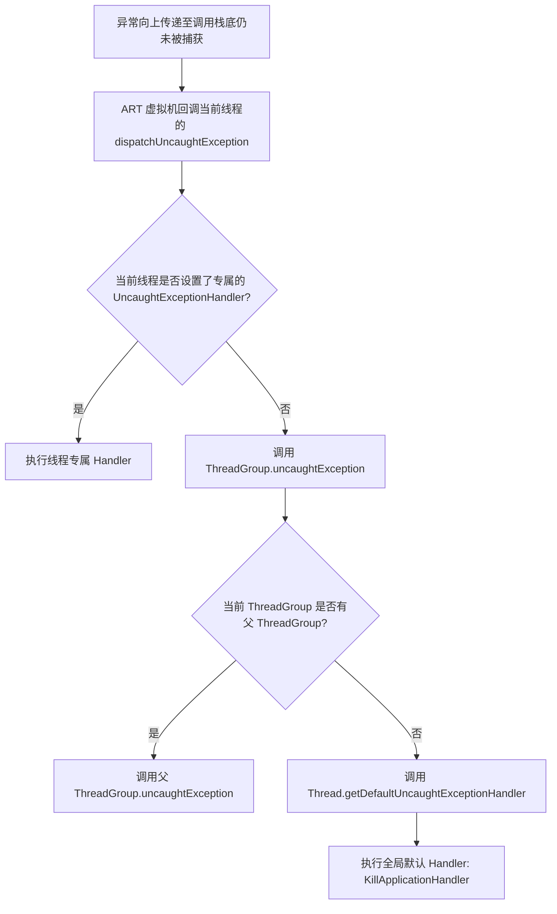
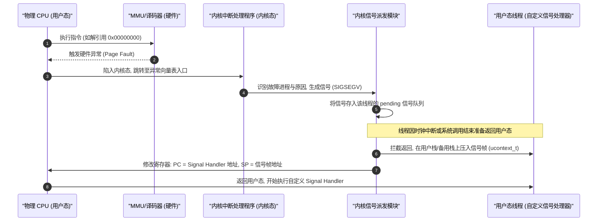
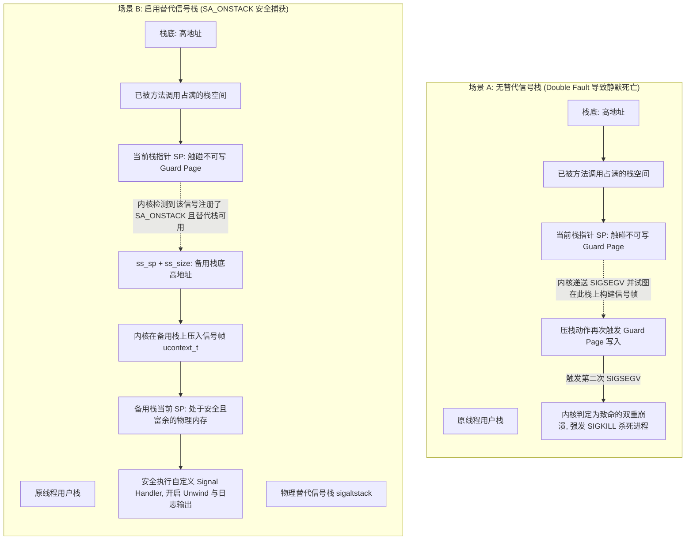
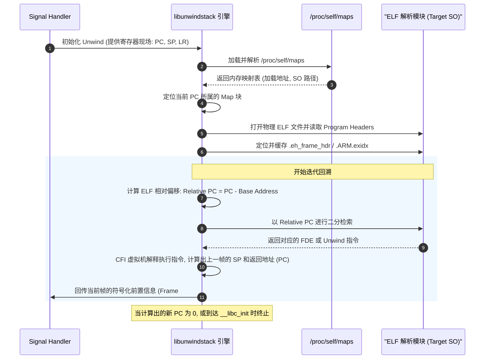
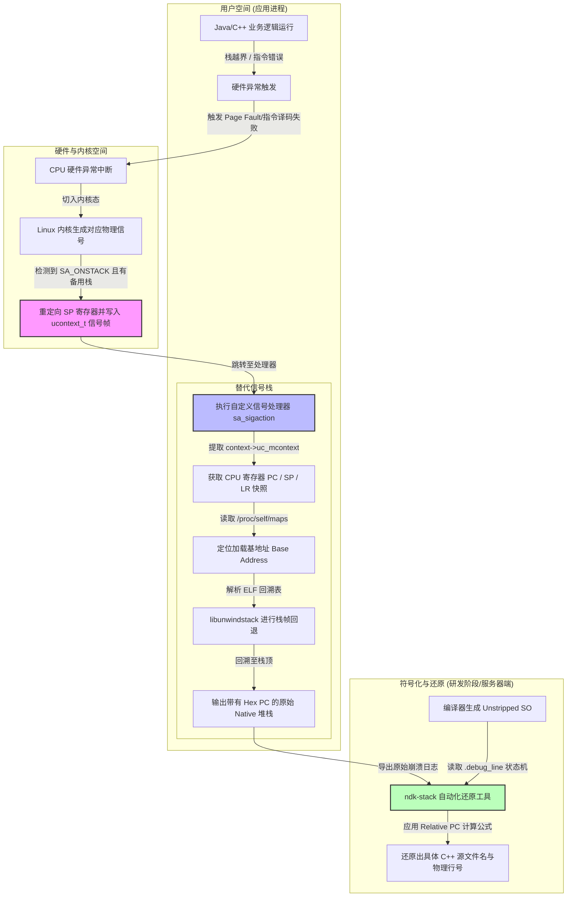

# 2.2.4.3 崩溃定位

在 Android 运行时架构中，无论是高层的 Java 业务代码异常，还是底层的 C++ Native 硬件保护错误，崩溃定位（Crash Positioning）都是运行时性能分析与稳定性治理的最底层物理防线。要实现精准、高效的崩溃捕获与还原，必须深度剖析 Android 虚拟机的异常派发机制、Linux 信号处理时序、替代信号栈物理设计、ELF `.eh_frame`/`.ARM.exidx` 栈帧回溯规范，以及 ASLR 架构下的符号化地址转换公式。

本文将从底层物理机理出发，系统性解析 Android 虚拟机及 Linux 操作系统在崩溃发生时的完整流转流程、微观内存布局与物理计算推导。

---

## 1. Java 层未捕获异常崩溃定位的物理机制

Java 层的崩溃本质上是 Java 虚拟机（ART）在执行字节码或本地方法时，由于检测到违反语言规范的行为，而沿着线程调用栈向上传递并最终未被捕获的异常（Uncaught Exception）。

### 1.1 异常抛出与传递的字节码物理本质

当 Java 代码中抛出异常时（例如显式调用 `throw new Exception()`，或隐式由于空指针解引用、数组越界而由虚拟机内部触发），在字节码层面，对应的指令为 `athrow`。

```
+------------------------------------------+
|          Java 线程操作数栈 (Operand Stack) |
+------------------------------------------+
|  [ Throwable Object Reference (Ref) ]     |  <-- 处于栈顶的异常对象引用
+------------------------------------------+
                     |
            执行 "athrow" 字节码
                     v
+------------------------------------------+
|        虚拟机查询当前方法的 Exception Table  |
+------------------------------------------+
```

`athrow` 指令执行时，其物理动作如下：
1. **弹出异常对象**：从当前方法栈帧的操作数栈（Operand Stack）弹出处于栈顶的异常对象引用（该对象必须是 `java.lang.Throwable` 或其子类，否则抛出 `NullPointerException` 或 `IllegalAccessError`）。
2. **检索异常表（Exception Table）**：
   在 Java Class 文件的二进制结构中，每个方法的 `Code` 属性内部都包含一张 `exception_table`。该表每一项包含以下 4 个物理字段：
   - `start_pc`：该 Catch 块监控的起始字节码偏移量（闭区间）。
   - `end_pc`：该 Catch 块监控的结束字节码偏移量（开区间）。
   - `handler_pc`：当发生异常匹配时，虚拟机即将跳转执行的异常处理器（Catch 块）字节码起始偏移量。
   - `catch_type`：常量池索引，指向要捕获的异常类（如 `java.lang.IOException`）。如果为 0，则代表匹配任意异常（即 `finally` 块）。

| 字段名 | 物理意义 |
| :--- | :--- |
| `start_pc` | 监控起始字节码偏移（含） |
| `end_pc` | 监控结束字节码偏移（不含） |
| `handler_pc` | 匹配成功后的跳转字节码偏移 |
| `catch_type` | 指向常量池中异常类型的索引（0 代表 `finally`） |

3. **虚拟机栈回退（Stack Unwinding）**：
   - 如果当前崩溃时的 PC（Program Counter，即字节码指针）处于 `[start_pc, end_pc)` 范围内，且抛出的异常对象是 `catch_type` 所指定类或其子类的实例，虚拟机将清空当前操作数栈，将异常对象引用压入操作数栈顶，并将 PC 寄存器重定向至 `handler_pc` 处继续执行。
   - 如果当前方法的异常表中未能匹配到合法的条目，虚拟机必须将当前方法栈帧（Stack Frame）弹出（销毁该帧的局部变量表与操作数栈），返回到调用者（Caller）的栈帧中。
   - **ART 运行时的 Walk Stack 过程**：
     在 Android ART 虚拟机中，由于存在解释执行（Interpreter）、JIT（Just-In-Time）以及 AOT（Ahead-Of-Time）混合编译，异常的向上传递由 ART 运行时 C++ 代码控制。ART 内部会调用 `art::Thread::Current()->QuickDeliverException()`。该方法会启动一个特殊的栈遍历器（Stack Visitor），沿着当前线程的物理调用栈帧向上一帧一帧回溯。
     在回溯过程中，ART 虚拟机不仅要清理 Java 对象的引用（涉及 GC 根的更新，防止内存泄漏），还需要通过 JIT/AOT 编译生成的 `Stack Map`（栈映射表，记录了特定编译指令 PC 与 Dex PC 的对应关系以及局部变量的物理寄存器映射）来精确重构每个物理帧在 Java 源代码层面的语义。

### 1.2 Thread.dispatchUncaughtException 的派发物理链路

如果异常一路上溯到调用栈的最顶层（即线程入口方法，主线程为 `ActivityThread.main`，子线程为 `Thread.run`），仍然没有任何 Catch 块能够匹配并捕获它，该异常就会升级为未捕获异常。此时，ART 虚拟机将控制权从 C++ 运行时移交给 Java 层，启动未捕获异常派发逻辑。



物理派发时序如下：
1. **回调 Java 入口**：ART 虚拟机定位到抛出异常的当前线程（`java.lang.Thread` 实例），通过 JNI 接口反射调用该线程的 `dispatchUncaughtException(Throwable e)` 方法。
2. **专属 Handler 校验**：
   线程首先检查其内部的成员变量 `uncaughtExceptionHandler`（通过 `Thread.setUncaughtExceptionHandler` 设置）。如果该值不为空，则直接调用该 Handler 的 `uncaughtException(Thread t, Throwable e)`。
3. **线程组传递**：
   如果线程专属 Handler 为空，则调用该线程所属的 `ThreadGroup` 实例的 `uncaughtException(Thread t, Throwable e)` 方法。
   - `ThreadGroup` 的处理逻辑是链式的：它首先试图调用其父线程组（Parent ThreadGroup）的 `uncaughtException`，层层上溯。
   - 如果所有的父线程组都未处理，它最终会回退调用全局默认的未捕获异常处理器，即通过静态方法 `Thread.getDefaultUncaughtExceptionHandler()` 获取的处理器。

### 1.3 Android 默认处理器 KillApplicationHandler 的深度工作流

在 Android 进程初始化阶段（由 `Zygote` fork 出子进程并进入应用初始化逻辑 `RuntimeInit.commonInit()` 时），系统会通过 `Thread.setDefaultUncaughtExceptionHandler` 注册一个全局的未捕获异常处理器 —— `RuntimeInit.KillApplicationHandler`。

该处理器的核心使命是：**在应用发生致命 Java 崩溃时，收集现场并确保进程彻底死亡，防止应用处于不可预测的半死不活（Zombie）状态。**

#### 1.3.1 重入保护与状态变量阻止二次崩溃

`KillApplicationHandler` 的第一道物理防线是重入保护。当异常处理逻辑执行时，如果处理代码自身由于内存不足、空指针等原因再次抛出未捕获异常，会导致 `dispatchUncaughtException` 被递归调用，引发死循环或二次崩溃。

为此，`KillApplicationHandler` 内部使用了一个静态的布尔变量 `mCrashing`：
```java
// RuntimeInit.java 物理伪代码
if (mCrashing) {
    // 发现已经处于 Crash 处理状态中，说明发生了二次重入崩溃
    // 立即通过底层系统调用终止进程，绝不尝试二次处理
    Process.killProcess(Process.myPid());
    System.exit(10);
}
mCrashing = true;
```

#### 1.3.2 与 AMS 的 Binder 跨进程通信物理过程

确认是首次崩溃后，`KillApplicationHandler` 需要向 ActivityManagerService (AMS) 报告灾情。这是一个典型的强同步 Binder IPC 过程：
1. 调用 `ActivityManager.getService().handleApplicationCrash(mApplicationObject, new ParcelableCrashInfo(e))`。
2. `mApplicationObject` 是当前应用 `ApplicationThread` 的 Binder 本地对象，AMS 用其在系统服务进程中精准查找并定位崩溃进程的 `ProcessRecord`。
3. `ParcelableCrashInfo` 包装了崩溃异常的完整堆栈（通过 `StringWriter` 转化为纯文本）以及异常的类名、描述信息。

#### 1.3.3 AMS 端的物理执行逻辑

AMS 在接收到 `handleApplicationCrash` 的 Binder 请求后，在其内部的系统工作线程中进行如下物理操作：
1. **进程标记**：在 `ProcessRecord` 中将该进程标记为崩溃状态（设置 `crashing = true`），并更新 `AppErrors` 状态机。
2. **界面交互决策**：
   - 如果该崩溃进程是当前处于前台（Foreground）的用户可见应用，AMS 会通知 `WindowManagerService` 弹出 Crash 对话框（“应用已停止运行”），由用户手动确认退出。
   - 如果是后台进程崩溃，AMS 则会跳过弹窗，直接执行清理。
3. **DropBox 物理落盘机制**：
   AMS 内部通过 `DropBoxManagerService` 将本次崩溃的元数据与堆栈内容持久化到磁盘。
   - **落盘路径**：`/data/system/dropbox/`
   - **文件名物理规则**：`data_app_crash@<timestamp>.txt`（第三方应用）或 `system_app_crash@<timestamp>.txt`（系统应用）。如果日志内容较大，DropBox 会调用 `GZIPOutputStream` 对数据进行物理压缩，生成以 `.gz` 结尾的压缩文件。
   - **日志结构**：
     ```text
     Process: com.example.crashdemo
     Flags: 0x30c8be44
     Package: com.example.crashdemo v1 (1.0)
     Foreground: Yes
     Build: Google/redfin/redfin:11/RQ3A.210605.005/7349178:user/release-keys
     
     java.lang.NullPointerException: Attempt to invoke virtual method 'void java.lang.String.hashCode()' on a null object reference
         at com.example.crashdemo.MainActivity.onCreate(MainActivity.java:18)
         ...
     ```

#### 1.3.4 物理终结进程

在 AMS 完成上述步骤或等待超时后，控制权返回至应用进程的 `KillApplicationHandler`。它将执行最后的物理清理动作：
1. **`Process.killProcess(Process.myPid())`**：
   在底层，该方法通过 Bionic libc 封装执行 `kill` 系统调用，向当前进程的所有线程发送 `SIGKILL`（信号 9）信号。内核接收到 `SIGKILL` 后，会无条件强行回收该进程占用的所有物理页、关闭所有文件描述符（FD）并释放虚拟地址空间。
2. **`System.exit(10)`**：
   这行代码作为双重保障。由于 `SIGKILL` 信号由内核异步处理，为了防止在内核清理完毕前的空档内，应用进程中的其他 C++ 守护线程或非守护线程继续执行垃圾指令，`System.exit` 会通过底层的 `_exit` 系统调用强制通知内核立即停止进程的 CPU 调度。

---

## 2. Native 层崩溃（Native Crash）的系统信号处理与机制

当崩溃发生在 C/C++ 本地层时（例如执行非法指令、内存越界访问、野指针解引用），其底层不再由虚拟机内部异常捕获机制主导，而是完全依赖 **Linux 操作系统的信号（Signal）控制机制**。

### 2.1 CPU 中断与内核异常物理触发原理

Native 崩溃的微观本质是 CPU 在执行机器指令时，遇到了无法通过硬件算术逻辑单元（ALU）或内存管理单元（MMU）正常完成的物理操作。



物理流转过程如下：
1. **硬件异常触发**：
   以空指针解引用为例。当 CPU 试图执行一条从地址 `0x00000000` 读取数据的汇编指令时，MMU（Memory Management Unit）在检索当前进程的页表时，发现该虚拟地址在物理内存中根本不存在映射页，或者该页的访问权限被标记为“禁止访问”。
2. **硬件中断响应**：
   MMU 立即触发一个硬件 Page Fault（缺页异常），导致 CPU 挂起当前的执行流，强制从用户态（ARM64 的 EL0）切换到内核态（ARM64 的 EL1），并跳转到内核预设的异常向量表（Exception Vector Table）地址。
3. **内核信号生成**：
   Linux 内核的异常处理函数（如 `do_page_fault`）被激活。它通过读取异常状态寄存器（如 ARM64 的 `FAR_EL1` 异常地址寄存器、`ESR_EL1` 异常原因寄存器），确定引发错误的物理地址是 `0x00`，且该地址超出了该进程的用户态合法映射区间。
   内核随后调用 `send_signal` 函数，向导致异常的当前线程的未决信号集（`pending` 信号队列）中写入一个 `SIGSEGV` 信号，并在信号信息结构体 `siginfo_t` 中填入出错的物理地址 `0x00` 及错误码 `SEGV_MAPERR`。
4. **内核态向用户态返回的信号截获**：
   内核不会在中断发生时当场在内核态执行信号处理程序。相反，内核会等待当前线程从内核态准备返回用户态的那一瞬间（例如时钟中断结束、系统调用返回、或者异常中断收尾）。
   在即将跨越内核边界前，内核会检查当前线程是否有待处理的信号。如果存在未屏蔽的信号（如 `SIGSEGV`），内核会强行拦截原定的返回地址。
5. **寄存器与用户栈物理篡改**：
   - 内核在当前线程的用户栈（或专门注册的备用栈）上强行开辟一段物理空间，写入一个信号帧（Signal Frame），其中完整备份了当前线程在崩溃那一瞬间的 CPU 寄存器现场（这个现场被称为 `ucontext_t`）。
   - 内核修改即将返回用户态时的 CPU 寄存器状态：将 PC（Program Counter，在 ARM64 上即为寄存器 `PC`）物理修改为应用进程中注册的自定义信号处理函数（Signal Handler）的内存入口地址；将 SP（Stack Pointer，栈指针）物理修改为刚刚在用户栈/备用栈上开辟的信号帧的起始地址。
   - 内核修改返回地址寄存器（ARM 中的 `LR`），使其指向内核的信号收尾代码段（Signal Trampoline，即系统调用 `sigreturn`）。
6. **跳转执行**：
   CPU 执行返回用户态的指令。由于寄存器已被篡改，CPU 不会回到崩溃指令处，而是直接跳转到自定义的信号处理函数中开始执行。

### 2.2 核心 Native 信号的物理成因与典型场景

在崩溃治理中，我们必须关注以下 5 类由硬件或运行时直接生成的致命信号：

#### 2.2.1 `SIGSEGV` (段错误，Signal 11)
- **物理成因**：进程试图访问未分配或无权限访问的虚拟内存地址。
- **典型场景**：
  - **空指针解引用**：访问地址低于系统保护边界（通常为 `0x1000`）的内存。
  - **野指针访问**：指针指向的内存已被 `free` 并被系统收回，或者指针包含垃圾数值，访问该非法的物理内存地址。
  - **写入只读区域**：尝试修改映射在 `.rodata` 段或 `.text` 段的代码与常量。
  - **DEP（数据执行保护）限制**：尝试跳转到只被标记了读写（`rw-`）但没有执行权限（`-xp`）的堆或栈内存空间去执行机器指令。

#### 2.2.2 `SIGBUS` (总线错误，Signal 7)
- **物理成因**：硬件总线物理访问错误，通常与不匹配的物理地址对齐或失效的物理映射相关。
- **典型场景**：
  - **非对齐内存访问（Alignment Fault）**：在某些严格要求对齐的 ARM CPU 架构上，执行了访问非对齐地址的指令（如使用 LDR 指令从一个奇数地址读取 4 字节整数）。
  - **被截断的 mmap 文件**：使用 `mmap` 系统调用将文件映射到内存，如果另一个进程或系统动作把这个文件的实际物理大小截断（Truncate）了，当本进程再次访问映射区间中超出文件新边界的虚拟内存时，由于物理磁盘上已不存在对应扇区，MMU 无法换入页面，产生硬件 I/O 错误，内核投递 `SIGBUS`。

#### 2.2.3 `SIGILL` (非法指令，Signal 4)
- **物理成因**：CPU 遇到无法解码的机器码操作数，或者在当前权限级别下禁止执行的机器指令。
- **典型场景**：
  - **代码段被破坏**：由于内存踩踏（Buffer Overflow）或者野指针误写，导致内存中的代码机器码被覆盖为垃圾数据，CPU 遇到乱码无法译码。
  - **执行特权指令**：在用户态下尝试执行只有内核态（EL1/EL2）才能运行的指令。
  - **指令集不匹配**：使用了编译了高级架构扩展指令（如 SVE/NEON 向量指令）的代码，但当前运行的物理 CPU 硬件属于不支持该扩展的旧款芯片。

#### 2.2.4 `SIGFPE` (算术异常，Signal 8)
- **物理成因**：发生严重的数学计算错误。
- **典型场景**：
  - **浮点数除零/溢出**：在开启了 IEEE 754 浮点异常控制寄存器对应中断位的 CPU 上，进行了浮点除零或溢出运算。
  - **整型除零的特殊性**：需要特别注意，在 ARM 架构上，整型除以零默认不会触发硬件 CPU 中断，而是直接返回结果 0。因此，ARM 上的整型除零默认**不产生** `SIGFPE`。

#### 2.2.5 `SIGABRT` (中止信号，Signal 6)
- **物理成因**：这是一个由进程主动触发的信号。通常是 C/C++ 代码运行时，检测到致命的系统状态损坏（例如 libc 的 `jemalloc` 在释放内存时，发现内存块头部的 Magic Number 损坏，判定发生了 Double Free 或堆内存溢出），便会主动调用 `abort()`。`abort()` 内部通过系统调用 `raise(SIGABRT)` 向自己发送该信号。

### 2.3 使用 `sigaction()` 注册自定义信号处理器的物理流程

为了捕获 Native 崩溃，我们需要在应用初始化时调用 `sigaction` 系统调用，覆盖默认的信号处理逻辑。

```c
int sigaction(int signum, const struct sigaction *act, struct sigaction *oldact);
```

#### 2.3.1 `struct sigaction` 结构体的关键字段深度解析

```c
struct sigaction {
    union {
        void     (*sa_handler)(int);
        void     (*sa_sigaction)(int, siginfo_t *, void *);
    } __sigaction_handler;
    sigset_t sa_mask;
    int      sa_flags;
    void     (*sa_restorer)(void);
};
```

1. **`sa_sigaction` 三参数回调**：
   如果我们要收集崩溃时的高级信息，必须在 `sa_flags` 中包含 `SA_SIGINFO`。此时，系统使用三参数原型 `sa_sigaction` 作为处理器。
2. **`sa_mask` 信号屏蔽字**：
   在信号处理函数运行期间，为了防止其他信号（如正在捕获 `SIGSEGV`时又来了 `SIGABRT`）打断当前处理流程，我们需要将不想重入的信号添加到 `sa_mask` 屏蔽集中。内核在执行处理器时，会自动阻塞这些信号，直到处理器返回。
3. **`sa_flags` 的物理标志**：
   - `SA_SIGINFO`：启用携带详细崩溃信息的 `sa_sigaction` 回调。
   - `SA_ONSTACK`：**关键防御标志**。告知内核，在递送该信号时，必须将当前栈切换到已注册的“替代信号栈”上运行，防止栈溢出导致二次崩溃（详见第 3 节）。
   - `SA_RESTART`：使被当前信号中断的系统调用在信号处理器执行完毕后自动重新调用，避免应用出现大量的 `EINTR` 错误。

#### 2.3.2 `sa_sigaction` 三参数回调的底层机制

自定义处理器的声明如下：
```c
void native_crash_handler(int sig, siginfo_t *info, void *context);
```

其物理参数包含极度丰富的现场信息：

- **`siginfo_t` 结构体物理结构**：
  ```c
  typedef struct {
      int      si_signo;  /* 信号数值 (如 11 代表 SIGSEGV) */
      int      si_code;   /* 信号子原因码 (如 SEGV_MAPERR) */
      void    *si_addr;   /* 引发崩溃的物理虚拟内存错误地址 */
      // ... 其他字段
  } siginfo_t;
  ```
  `si_addr` 保存了发生段错误时的物理地址。如果 `si_addr` 为 `0x00000000` 甚至小于 `0x1000`，说明是由于典型的空指针访问引起的；如果是随机的一个巨大十六进制值，说明是野指针。

- **`void *context` 参数的物理本质**：
  这个指针实际上指向一个当前 CPU 架构的 `ucontext_t` 结构体。在 ARM64 架构下，我们可以通过强转读取崩溃那一瞬间的所有 CPU 寄存器现场：
  ```c
  #include <ucontext.h>
  
  ucontext_t *uc = (ucontext_t *)context;
  // 提取崩溃瞬间的指令指针 (PC)
  uintptr_t target_pc = uc->uc_mcontext.pc;
  // 提取崩溃瞬间的栈指针 (SP)
  uintptr_t target_sp = uc->uc_mcontext.sp;
  // 提取崩溃瞬间的返回地址寄存器 (LR)
  uintptr_t target_lr = uc->uc_mcontext.regs[30];
  ```
  有了这三大核心寄存器数值，回溯库便可以以此为起点逆向推导出完整的调用栈。

#### 2.3.3 信号处理函数中的“异步信号安全（Async-Signal-Safety）”物理防线

在编写 Native 崩溃捕获器时，**绝对不能调用任何非异步信号安全的函数**。

> [!WARNING]
> 这是一个致命的设计隐患：如果进程崩溃时，原先被中断的线程正在执行 `malloc()`，它已经获取了堆管理器（如 `jemalloc`）的内部全局锁。此时，如果在 `native_crash_handler` 信号处理器中再次调用了 `malloc()`、`free()`、或者使用了 C++ 的 `std::string`、`std::vector`，信号处理器就会在尝试获取同一个堆锁时发生**自我死锁（Self-Deadlock）**。进程将无限卡死在信号处理中，永远无法输出崩溃日志。

同理，`printf`、`std::cout` 间接使用了缓冲区的锁，也是不安全的。

**物理防御方案**：
必须仅调用 Linux POSIX 规定的安全系统调用，或者使用裸系统调用 `syscall`。例如：
- 写入日志文件：使用裸 `open`、`write`（系统调用 `__NR_write`）、`close`。
- 格式化字符串：使用自己实现的、完全在栈上开辟缓冲区的无锁 `itoa`、`sprintf`，绝对禁止调用 libc 的 `sprintf`。

---

## 3. 崩溃定位的物理防线 —— 替代信号栈（Alternate Signal Stack）

当应用由于栈溢出（Stack Overflow）引发 Native 崩溃时，传统的信号捕获方案会直接失效，导致进程静默死亡。这是崩溃定位设计中最容易被忽略的物理盲区。

### 3.1 栈溢出与信号捕获的物理死锁（双重崩溃）

#### 3.1.1 栈空间物理布局
每个线程在创建时，操作系统都会为其分配一段连续的虚拟内存作为执行栈（例如 Android 主线程默认为 8MB，子线程通常为 1MB）。栈指针 SP（Stack Pointer）从高地址向低地址增长。为了防止栈溢出破坏其他内存区域，系统会在栈的最低端设置一个保护页（Guard Page），该物理页在 MMU 中被配置为不可读写（无 `PROT_READ` 和 `PROT_WRITE` 权限）。

#### 3.1.2 栈溢出的发生
当程序中发生无限递归或者在单帧函数内声明了过大的局部变量时，SP 寄存器的值被不断扣减（减小），直到 SP 越过了栈底的合法边界，触碰到了 Guard Page。CPU 执行写栈操作，引发硬件 Page Fault。由于 Guard Page 无写权限，内核被唤醒，生成一个 `SIGSEGV` 信号。

#### 3.1.3 双重崩溃（Double Fault）的死锁机制


在**场景 A（无替代信号栈）**中：
内核向用户态发送 `SIGSEGV` 时，其默认行为是直接在当前线程的用户栈上开辟信号帧。然而，此时该栈已经触碰到 Guard Page（即栈已经被物理填满，没有任何可用字节）。当内核试图将崩溃现场的 `ucontext_t` 及信号跳转收尾代码写入当前 SP 指向的内存时，会立即触发第二次 Page Fault（即在信号处理器执行前，系统自身触发了第二次 `SIGSEGV`）。
Linux 内核检测到这种处于“信号递送中”又引发的嵌套崩溃，为了防止内核数据结构损坏，会强制剥夺用户态的处理权限，直接向该进程发送不可屏蔽的 `SIGKILL`（信号 9），导致进程直接蒸发。崩溃捕获器中的代码连一字节都没有运行，没有产生任何日志。

### 3.2 替代信号栈 `sigaltstack` 的注册与运行机理

为了解决上述问题，必须建立替代信号栈防线，即在另一块独立的、未被破坏的物理内存中为信号处理程序开辟执行空间。

#### 3.2.1 物理结构体 `stack_t`

```c
typedef struct {
    void  *ss_sp;     /* 备用栈在用户空间的物理起始地址 */
    int    ss_flags;  /* 状态标志 (通常初始化为 0) */
    size_t ss_size;   /* 备用栈的物理空间大小 */
} stack_t;
```

#### 3.2.2 替代信号栈的物理部署步骤

1. **物理栈内存开辟**：
   在线程初始化或 Crash 库初始化阶段，使用 `mmap` 系统调用动态开辟一块独立的匿名内存区。为了确保安全，该内存大小通常指定为系统预定义的常量 `SIGSTKSZ`（在 Android 平台上通常为 8KB 或 16KB），并且在该内存的首尾同样可以通过配置保护页来防范备用栈自身的溢出。
   ```c
   stack_t ss;
   ss.ss_sp = mmap(NULL, SIGSTKSZ, PROT_READ | PROT_WRITE, MAP_PRIVATE | MAP_ANONYMOUS, -1, 0);
   ss.ss_size = SIGSTKSZ;
   ss.ss_flags = 0;
   ```
2. **注册替代栈**：
   调用 `sigaltstack` 系统调用，将配置好的 `ss` 注册到内核中：
   ```c
   if (sigaltstack(&ss, NULL) == -1) {
       // 注册失败处理
   }
   ```
   *注意：`sigaltstack` 是线程独占的。每个需要捕获崩溃的线程都必须有自己独立的备用信号栈。*
3. **关联处理器标志**：
   在调用 `sigaction` 注册信号处理器时，必须在其 `sa_flags` 中加上 `SA_ONSTACK` 标志：
   ```c
   struct sigaction sa;
   sa.sa_sigaction = native_crash_handler;
   sa.sa_flags = SA_SIGINFO | SA_ONSTACK; // 必须开启 SA_ONSTACK
   sigaction(SIGSEGV, &sa, NULL);
   ```

#### 3.2.3 内核递送信号的 SP 重定向动作

一旦上述三步完成，当该线程发生栈溢出引发 `SIGSEGV` 时（如**场景 B**所示）：
1. 内核截获异常，检查当前线程的状态，发现该线程已成功配置了 `stack_t`，且当前触发的 `SIGSEGV` 信号关联了 `SA_ONSTACK` 标志。
2. 内核修改寄存器重定向逻辑：内核不再使用当前溢出栈的 SP 指针，而是强行将 CPU 的 `SP` 寄存器值设置为备用栈的顶部地址（即 `ss_sp + ss_size` 处）。
3. 内核在此备用栈的干净内存中安全地压入信号帧，构建 `ucontext_t`。
4. 跳转至 `native_crash_handler` 执行。此时，自定义处理器在一块完全独立的 16KB 内存上运行，从而安全地绕过了栈溢出死锁，成功捕获并定位崩溃。

---

## 4. C++ 本地调用栈回溯（Unwinding the Call Stack）物理技术

进入信号处理器后，最核心的任务是还原调用链。栈回溯（Unwinding）的核心目的就是：给定当前的 `PC` 和 `SP`，逆向重构出一系列 Caller 的返回地址。

### 4.1 帧指针（Frame Pointer）回溯与 `-fomit-frame-pointer` 优化

在最理想的物理状态下，如果编译器在编译 Native 代码时没有省略帧指针，那么回溯过程极度简单。

```
高地址 (栈底)
   |
   v
+------------------+
|   Caller 栈帧    |
|  +------------+  |
|  | Caller FP  | <+----+
|  +------------+  |    | 沿着 FP 链条向上追溯
|  | Caller LR  |  |    |
|  +------------+  |    |
+------------------+    |
|   Current 栈帧   |    |
|  +------------+  |    |
|  |  Saved FP  |--+----+ (当前 FP 寄存器指向这里)
|  +------------+  |
|  |  Saved LR  |  | (保存着返回地址，即 Caller PC)
|  +------------+  |
+------------------+
   ^
   |
低地址 (栈顶, SP 指向)
```

#### 4.1.1 帧指针回溯物理机理
在不省略帧指针的情况下，编译器在每个 C++ 函数的入口都会插入固定的 Prologue 汇编代码：
1. 将当前帧指针寄存器（如 ARM64 的 `X29` 寄存器）以及返回地址寄存器（`X30`，即 `LR`）压入当前栈。
2. 将 `X29`（FP）更新为当前的 `SP`。

这在物理栈中形成了一个串联的单向链表。回溯时，只需执行以下微观动作：
- 读取当前 FP 寄存器指向的内存：得到上一级函数的 FP（即 `Saved FP`）。
- 读取 `FP + 8`（ARM64 架构下偏移 8 字节）的内存：得到上一级函数的返回地址（`Saved LR`）。
- 将 FP 更新为 `Saved FP`，循环此操作即可。

#### 4.1.2 `-fomit-frame-pointer` 编译优化的破坏
在现代 Android NDK 编译 Release 库时，Clang 编译器默认会开启 `-fomit-frame-pointer` 优化。
- **优化目的**：释放 `FP`（`X29`）寄存器，使其能作为通用寄存器参与局部变量分配，从而减轻寄存器压栈/出栈的物理开销，提升 CPU 执行效率（性能提升通常在 2% - 5%）。
- **带来的灾难**：栈内存中不再存在任何有规律的 FP 指针链条，`SP` 与 `PC` 之间没有固定的线性关联，传统的帧指针链表直接断裂，回溯引擎必须采用全新的异常处理表回溯技术。

### 4.2 DWARF 异常回溯表（`.eh_frame` / `.ARM.exidx`）物理剖析

为了在省略帧指针的情况下依然能还原调用栈，编译器在编译时必须在 ELF 二进制文件中额外生成一张“寄存器状态恢复指南表”。

#### 4.2.1 ARM 32位专属回溯段：`.ARM.exidx` 与 `.ARM.extab`

在 ARM 32位架构上，Android NDK 采用 ARM 特有的异常回溯规范。
- **`.ARM.exidx`（索引表段）**：
  这是一个由 8 字节结构体组成的连续数组。
  ```c
  struct exidx_entry {
      uint32_t addr_offset; /* 对应的函数起始地址相对于当前条目的偏移量 */
      uint32_t value;       /* 回溯指令描述控制字或指向 .ARM.extab 的指针 */
  };
  ```
  该数组按照函数地址从小到大严格排序。回溯时，我们以相对 PC 为 Key，在 `.ARM.exidx` 段中进行**二分查找**，即可秒级定位到该 PC 所属的函数条目。
- **`.ARM.extab`（指令表段）**：
  存储了实际用于恢复寄存器的虚拟机器字节码。例如：
  - `0x80 0x08`：代表将 `R4` 寄存器出栈恢复。
  - `0xB0`：代表结束回溯。
  - `0x97`：代表将 SP 更新为 `R7` 的值。

#### 4.2.2 ARM64 及主流架构的标准回溯段：`.eh_frame`

在 ARM64 和 x86_64 架构下，Android 采用更为通用的 DWARF 规范，使用 ELF 的 `.eh_frame`（Exception Handling Frame）和 `.eh_frame_hdr` 段。

`.eh_frame_hdr` 段包含了用于快速检索的二进制搜索表；`.eh_frame` 内部则包含两个物理结构：CIE 和 FDE。

```
+-------------------------------------------------------+
|  .eh_frame_hdr (二分检索索引表)                        |
+-------------------------------------------------------+
                           |
                           v (通过 PC 检索)
+-------------------------------------------------------+
|  FDE (Frame Description Entry)                        |
|  - PC 范围: [0x1040, 0x1120)                            |
|  - 指向对应 CIE 的指针                                  |
|  - CFI 虚拟指令流:                                     |
|    * DW_CFA_def_cfa (SP, 16)                          |
|    * DW_CFA_offset (X30, -8)                          |
|    * DW_CFA_advance_loc (4)                           |
+-------------------------------------------------------+
                           |
                           v (关联)
+-------------------------------------------------------+
|  CIE (Common Information Entry)                       |
|  - 代码对齐因子、数据对齐因子、返回地址寄存器号         |
+-------------------------------------------------------+
```

- **CIE（Common Information Entry，通用信息项）**：
  包含该 ELF 共享的所有基础参数，例如数据对齐因子（Data Alignment Factor，通常为 -8，用于计算栈偏移时乘上该因子）、代码对齐因子、返回地址寄存器号。
- **FDE（Frame Description Entry，帧描述项）**：
  每个 FDE 对应一个具体函数的代码区间（如 `[0x1040, 0x1120)`）。FDE 内部包含一串由编译器生成的 **CFI（Call Frame Information）虚拟指令字节码**。

#### 4.2.3 CFI 虚拟机与指令执行过程
Unwind 回溯引擎（如谷歌开源的 `libunwindstack`）在物理上实际上是一个解释执行 CFI 指令的微型虚拟机。

CFI 核心指令物理意义如下：
- `DW_CFA_def_cfa <register>, <offset>`：
  定义规范帧地址 CFA（Canonical Frame Address）的计算公式。例如 `CFA = SP + 16`。
- `DW_CFA_offset <register>, <offset>`：
  指示某个寄存器（如返回地址寄存器 `X30`）被保存在了相对于 CFA 偏移 `<offset> * Data_Alignment_Factor` 的内存位置。
- `DW_CFA_advance_loc <delta>`：
  将虚拟 PC 向后移动 `<delta>` 字节，使得状态机能够精确跟随函数内部不同汇编位置的栈物理变化（如在 Prologue 中入栈时，CFA 随之改变）。

当 Unwind 引擎执行回溯时，它将崩溃瞬间的寄存器状态输入状态机，从对应 FDE 的起点开始模拟执行 CFI 字节码，从而精准计算出上一帧的 SP（即 CFA）和上一帧的返回地址（PC），实现完美回溯。

### 4.3 Google `libunwindstack` 的物理回溯时序与实现

Android 系统底层崩溃定位（如 `debuggerd` 守护进程）首选 `libunwindstack` 库完成回溯。其微观时序如下：



1. **读取进程内存映射**：
   引擎打开并发解析 `/proc/self/maps` 文件。该文件包含了当前进程所有已加载的动态链接库、栈、堆的虚拟内存区间。例如：
   ```text
   7f80000000-7f80050000 r-xp 00000000 08:01 123456  /data/app/.../libnative.so
   ```
2. **定位 ELF 模块**：
   根据崩溃瞬间的 `PC` 地址，在映射表中二分检索，找到对应的 Map 条目。获取该 Map 对应的 SO 文件路径（如 `libnative.so`）及内存加载基地址（`Base Address = 0x7f80000000`）。
3. **定位回溯元数据**：
   解析目标 SO 文件头（ELF Header），寻找对应的回溯段。若是 ARM 32位，读取 `.ARM.exidx`；若是 64位，读取 `.eh_frame` 和 `.eh_frame_hdr`。
4. **二分查找 FDE**：
   计算出相对偏移地址（`Relative PC`），在 `.eh_frame_hdr` 维护的二分表中检索，定位到具体的 FDE 结构体。
5. **执行虚拟回退**：
   CFI 解释器以当前的寄存器为初始状态，解析 FDE 里的 CFI 指令，恢复上一帧的 SP 与 PC 值。
6. **循环往复**：
   将计算出的上一帧的返回地址作为新的 PC，上一帧的 SP 作为新的 SP，重新执行第 2 - 5 步，直到回溯深度达到限制（如 256 帧）、或者返回 PC 变为 0、或者遇到了线程的起点（如 `__libc_init` 或 `clone`），生成完整的 Native 物理调用链。

---

## 5. 被剥离符号库（Stripped SO）的符号解析（Symbolication）计算

当回溯引擎输出调用栈后，由于生产环境下的动态链接库（SO 文件）经过了符号剥离，我们获取的堆栈通常只包含一系列十六进制的内存偏置地址。要将其转化为可读的源码行号，必须通过物理基准偏移进行符号化计算。

### 5.1 符号剥离（Stripping）的物理动因与对诊断的破坏

在默认的 C++ Release 编译流中，编译器生成的 SO 包含以下物理段：
- `.debug_info` 和 `.debug_line`：庞大的 DWARF 调试信息段，记录了指令地址到源码文件名、行号、变量名的物理映射。
- `.symtab`（符号表）与 `.strtab`（字符串表）：包含所有非导出 C++ 函数的名称和内部位置。

为了压缩体积（通常能减少 80% 以上的文件大小）并保护核心代码不被反编译工具（如 IDA Pro）轻易逆向，Android 构建工具链会调用 `llvm-strip`。
- **Stripped 留下了什么**：仅保留了运行时动态链接所绝对必需的 `.dynsym`（动态符号表）和 `.dynstr`（动态字符串表），这些段仅包含 JNI 导出函数（如 `Java_com_...`）或被声明为 `extern "C"` 且可见性为 default 的函数名称。
- **带来的诊断难题**：崩溃发生时，调试日志只输出 `pc 0004e3c2` 这样毫无语义的静态偏置，无法获知具体在 C++ 源文件的哪一行。

### 5.2 符号解析的物理计算公式推导

要将崩溃现场中随机漂移的虚拟 PC 转化为可以查询的 ELF 文件内相对偏移，必须理解地址空间布局随机化（ASLR）与 ELF 段加载偏移（Load Bias）。

#### 5.2.1 物理地址与 ASLR
在 Android 运行时，为了防范内存溢出漏洞攻击，系统对进程的虚拟内存空间启用了 ASLR。这意味着：**每一次应用启动，动态链接器（linker）为同一个 SO 分配的虚拟加载基地址（Shared Library Base Address）都是完全不同的、随机的。**

#### 5.2.2 段加载偏移（Segment Load Bias）的物理本质
在 ELF 文件规范中，定义了多个可加载段（`PT_LOAD` Segment）。每个段在编译时都有一个预设的虚拟加载首地址（在 Program Header 中的 `p_vaddr`）。
- 如果 ELF 比较简单，其第一个可加载段的 `p_vaddr` 恰好为 `0x00000000`，那么加载基地址（Base Address）就是动态链接器映射该 SO 时的物理起点。
- 但有些复杂的 SO（或者经过特殊加固、重排的 SO），其第一个 `PT_LOAD` 段在编译时的预设 `p_vaddr` 并不是 0（例如是 `0x1000`）。在加载时，虽然 Linker 映射的连续虚拟内存首地址为 `Base Address`，但该段在进程虚拟空间中的实际映射地址实际上是 `Base Address + p_vaddr`。

因此，为了校正这一物理偏差，定义 **Load Bias（加载偏差值）** 为：
$$\text{Load Bias} = \text{First } \texttt{PT\_LOAD} \text{ Segment } \texttt{p\_vaddr} - \text{First } \texttt{PT\_LOAD} \text{ Segment } \texttt{p\_offset}$$

通常情况下，第一个可加载段的 `p_offset`（文件内偏移）为 0，所以：
$$\text{Load Bias} = \text{First } \texttt{PT\_LOAD} \text{ Segment } \texttt{p\_vaddr}$$

#### 5.2.3 核心相对 PC 计算公式
为了获得与 Unstripped SO（未剥离调试符号的库）中静态调试地址一致的检索键，符号解析的物理计算公式推导如下：

$$\text{Relative PC} = \text{Target PC} - \text{Shared Library Base Address} + \text{Load Bias}$$

##### 物理计算实例：
假设崩溃现场收集到以下物理参数：
1. 引发崩溃的绝对 PC：`Target PC = 0x7f8004f3c2`。
2. 从 `/proc/self/maps` 或回溯日志中提取的该 SO 加载基地址：`Shared Library Base Address = 0x7f80000000`。
3. 通过读取 ELF 文件的 Program Header，获知其第一个可加载段的 `p_vaddr = 0x1000`，即 `Load Bias = 0x1000`。

代入公式计算：
$$\text{Relative PC} = 0x7f8004f3c2 - 0x7f80000000 + 0x1000 = 0x4f3c2 + 0x1000 = 0x503c2$$

这就是我们需要用于还原的**静态相对地址（ELF Offset）**。

### 5.3 物理还原：从相对 PC 到源文件行号的微观过程

拥有了正确的静态 `Relative PC` 后，我们需要借助未剥离符号的原始库（Unstripped SO）以及符号解析工具进行行号反解。

#### 5.3.1 `.debug_line` 状态机还原机制
C++ 符号解析工具（如 `addr2line`）并不是通过简单的大 Map 表来查找地址。为了节省体积，DWARF 的 `.debug_line` 段存储了一套高度压缩的“行号指令（Line Number Program）”。

当 `addr2line` 加载 Unstripped SO 时，它会：
1. 初始化一个包含 `address`（当前指令虚拟地址）、`file`（当前文件名）、`line`（当前行号）等寄存器的虚拟状态机。
2. 顺序解析 `.debug_line` 中的字节码指令。例如：
   - 指令 A：`DW_LNS_advance_pc (0x10)` -> 状态机的 `address` 寄存器加上 `0x10`。
   - 指令 B：`DW_LNS_advance_line (5)` -> 状态机的 `line` 寄存器加上 5.
   - 指令 C：`DW_LNS_copy` -> 将当前状态机寄存器的状态写入内存中的临时映射表项。
3. 状态机重构出完整的 `Relative PC` 与文件名、行号映射表后，以我们计算出的相对地址 `0x503c2` 作为 Key 进行范围检索，找到最匹配的源码文件名、函数名及物理行号。

#### 5.3.2 使用 `addr2line` 手动反解

```bash
# -C: 反混淆 C++ 函数名 (Demangle)
# -f: 输出函数名
# -e: 指定未剥离符号的 unstripped so 路径
addr2line -C -f -e /path/to/unstripped/libnative.so 0x503c2
```

执行后，物理控制台输出：
```text
void crash_trigger_function()
/Users/developer/AndroidProject/app/src/main/cpp/native-lib.cpp:42
```
由此，神秘的十六进制内存地址被完美还原为可读的 C++ 源码物理行号。

#### 5.3.3 NDK 诊断防御线：`ndk-stack` 自动化机制
在实际生产运维中，手动提取基地址计算偏移极易出错。NDK 提供的 `ndk-stack` 命令行工具实现了这一计算的完全自动化：
1. **自动文本正则分析**：`ndk-stack` 实时扫描输入的 Crash 日志，定位所有符合 `#00 pc <Relative_PC> <SO_Path>` 模式的物理行。
2. **符号目录映射**：用户通过 `-sym` 参数指定本地存放所有 Unstripped SO 的物理目录。
3. **加载 Bias 自动读取**：`ndk-stack` 自动读取本地同名 unstripped SO 的 ELF 头部，解析其 `Load Bias`，并根据崩溃日志中的相对 PC 自动对齐。
4. **流式行号替换**：工具在底层调用符号解析逻辑，将原本干瘪的十六进制地址流式替换为带函数名与文件名行号的完整调用栈，极大地缩短了崩溃定位的分析链路。

---

## 6. Android 崩溃捕获完整物理流转拓扑图

以下 Mermaid 拓扑图总结了 Android 系统中从崩溃发生到最终完成符号反解的完整物理生命周期与边界交互关系：



---

## 7. 崩溃定位常见物理误区与排查路径

在实际物理调试与崩溃治理过程中，常常会遇到以下三个典型误区，导致无法还原或分析错误：

### 7.1 误区一：信号处理器内执行了非法操作（如 malloc）导致静默消失
* **现象**：当进程崩溃时，控制台仅输出 `Fatal signal 11 (SIGSEGV)`，但没有任何自定义的崩溃信息或 backtrace 打印。
* **原因**：信号处理器内部调用的日志函数（如某些自定义的 C++ Logger）隐式分配了内存，或者调用了 `localtime` 等包含内部锁的函数。由于崩溃瞬间原线程持有相同的锁，处理器发生自我死锁。
* **排查路径**：检查 Signal Handler 回调函数，剔除所有高级数据结构与库函数。所有磁盘写入和格式化操作必须使用 `write()`、`syscall()` 和局部栈缓冲区。

### 7.2 误区二：加载基地址（Base Address）计算错误导致符号化偏差
* **现象**：使用 `addr2line` 还原出来的代码行号在一行莫名其妙的空白行、大括号或完全不相关的函数内。
* **原因**：没有考虑到 SO 的第一个 `PT_LOAD` 段虚拟地址不为 0（即忽略了 `Load Bias`），直接使用 `Relative PC = Target PC - Base Address` 进行计算，导致计算出的相对 PC 发生了物理偏移（通常偏移了 `0x1000` 或 `0x2000` 字节）。
* **排查路径**：使用 `readelf -l <lib.so>` 查看可加载段的 `VirtAddr` 字段，获取真实的 `Load Bias`，并校正计算公式。

### 7.3 误区三：回溯时发生中断导致堆栈截断（Stack Truncation）
* **现象**：崩溃回溯只输出了一两帧（如仅有 `#00` 和 `#01`），后续的 Caller 调用链全部丢失。
* **原因**：SO 被剥离得过于彻底，或者在编译时不仅去除了调试信息，还移除了 `.eh_frame` 段（如使用了 `-fno-asynchronous-unwind-tables` 编译标志），导致 unwind 引擎在当前 PC 对应的地址区间找不到任何 FDE，状态机无法继续回退。
* **排查路径**：确保在 Android NDK 编译 Release 库时，虽然对发布版 SO 执行了 strip，但必须保留 ELF 的 unwind 表（默认情况下 Clang 会保留 `.eh_frame` 或是 `.ARM.exidx`，不要使用编译选项将其强行剥离）。
