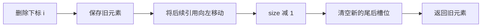

# 3.2.1.1 ArrayList

`java.util.ArrayList` 是 Java 集合框架中最常用的顺序容器之一。它对外实现 `List` 抽象，对内以可增长的对象引用数组保存元素。这个组合决定了它的主要特征：元素有稳定的逻辑顺序，可以重复，也可以是 `null`；按下标访问和顺序遍历成本较低；尾部追加通常便宜；在头部或中间插入、删除则可能移动一段元素；容量不足时还要分配新数组并复制已有引用。

理解 `ArrayList` 不能只停留在“动态数组”四个字，也不应只背诵复杂度表。真正需要建立的是一组彼此关联的判断：`List` 抽象承诺了什么，数组实现额外带来了什么；元素数量与底层容量为什么必须分开；一次操作会不会改变结构；视图、迭代器和数组转换是否复制数据；并发访问需要什么同步条件；某个源码细节究竟是规范保证，还是特定 OpenJDK 版本的实现选择。把这些问题连成完整模型，才能在 API 设计、性能分析和故障排查中正确使用它。

## 从 List 抽象到动态数组实现

`ArrayList<E>` 实现了 `List<E>`、`RandomAccess`、`Cloneable` 和 `Serializable`。其中最重要的是 `List<E>`：列表是一组按位置组织的元素，位置从 `0` 开始，允许同一个值出现多次。`get(i)` 读取第 `i` 个元素，`add(i, e)` 把新元素插入指定位置，原位置及其后的元素顺次后移，`remove(i)` 删除指定位置并让后续元素前移。列表的顺序是语义的一部分，不是偶然的遍历结果。

`RandomAccess` 是一个没有方法的标记接口，用来表示该实现支持快速的随机位置访问。通用算法可以据此选择按下标循环，或者选择迭代器遍历。它不是“任何操作都能常数时间完成”的承诺，更不表示查找某个值是常数时间。`ArrayList` 能在常数时间内根据下标定位数组槽位，但 `contains` 和 `indexOf` 仍要逐个比较元素。

`ArrayList` 允许保存重复元素和 `null`。这来自 `List` 契约与该实现的选择，不代表所有集合实现都允许同样的数据。查找与按对象删除依赖相等性语义：对非空目标通常调用 `equals` 判断，对 `null` 则直接检查槽位是否为空。列表不会复制元素对象，也不会冻结元素状态；它保存的是引用。修改列表中的某个元素对象，与把某个槽位替换成另一个引用，是两种不同的变化。

动态数组实现适合以下访问模式：

- 经常按下标读取或替换元素。
- 经常从头到尾顺序遍历。
- 主要在尾部追加，或者可以成批构造。
- 元素数量可估计，能够提前设置容量。
- 需要紧凑地保存一组对象引用，不希望为每个元素分配额外节点。

它并不天然适合所有“列表”问题。若主要需求是根据键定位，应考虑映射结构；若主要需求是去重，应考虑集合结构；若大量操作发生在队首，队列或双端队列通常更直接；若多个线程需要并发修改，必须选择同步策略或专用并发容器。容器选择首先由语义决定，其次才是复杂度和常数成本。

## 数组存储模型与核心不变量

从概念上看，`ArrayList` 的核心状态可以简化为一个 `Object[]` 和一个整数 `size`。数组用于保存元素引用，`size` 表示当前逻辑元素数量。底层数组长度是容量，容量表示在不更换数组的情况下最多能够容纳多少个元素。

假设某个列表的 `size` 为 `4`，底层数组长度为 `7`，那么逻辑结构可以表示为：

```text
下标:       0      1      2      3      4      5      6
elementData [ A ][ B ][null][ D ][null][null][null]
逻辑范围:   <--------- [0, size) -------->
备用范围:                              [size, capacity)
```

第三个逻辑元素可以合法地是 `null`，所以不能通过“遇到空槽位”判断列表结束。遍历边界只能由 `size` 决定。数组中 `[0, size)` 是逻辑元素区间，`[size, capacity)` 是未使用容量。后者不属于列表内容，不参与 `size()`、遍历、相等性比较和下标访问。

这个模型依赖几个基本不变量：

1. `0 <= size <= elementData.length`。
2. 所有逻辑元素都位于半开区间 `[0, size)`。
3. 对已有元素的访问要求 `0 <= index < size`。
4. 插入位置允许 `0 <= index <= size`，因为在 `size` 位置插入等价于尾部追加。
5. 删除元素后，已经离开逻辑范围的旧引用应被清除，避免列表继续保持对对象的可达引用。

第五点很容易被忽略。删除下标 `i` 的元素时，实现会把 `[i + 1, size)` 向左移动，然后把原来的最后一个有效槽位置为 `null`，最后缩小 `size`。如果只缩小 `size` 而不清理末尾引用，调用方虽然再也访问不到该槽位，垃圾收集器仍会沿底层数组找到对象，从而延长对象生命周期。



图中的步骤表达的是语义主线，不要求每个 JDK 版本源码都采用完全相同的语句顺序。编译器优化、辅助方法拆分和数组复制入口可以变化，但“移动有效区间、缩小逻辑长度、释放多余引用”是数组列表删除必须维护的结果。

## 容量不是元素数量

`size()` 返回逻辑元素数量，而容量没有对应的公共查询方法。容量属于实现资源，不属于 `List` 抽象。调用 `new ArrayList<>(100)` 只是准备一个最多可在不扩容情况下容纳一百个元素的列表，列表仍然为空，`size()` 仍为 `0`，此时调用 `get(0)` 会抛出 `IndexOutOfBoundsException`。

同样，`ensureCapacity(100)` 的含义是请求列表至少具备容纳一百个元素的内部能力，而不是创建一百个值为 `null` 的逻辑元素。若确实需要一个包含一百个 `null` 的列表，必须执行一百次添加，或通过其他明确产生元素的操作完成。容量操作不应改变可观察的列表内容。

容量和数量分离带来两个好处。第一，调用方可以为未来增长预留空间，减少重新分配和复制；第二，列表不需要在每次添加时都分配恰好大小的新数组。但它也带来空间与时间的权衡：预留过少会增加扩容次数，预留过多会让一个较大的引用数组长期驻留。

`trimToSize()` 尝试把容量收缩到当前 `size`。它适合“构建阶段已经结束，后续长期只读或很少增长，并且空闲容量显著”的情况。它不是应当无条件调用的优化：收缩本身可能分配并复制数组，之后再次追加又会触发扩容。对短命列表、小列表或即将继续增长的列表，压缩容量往往只增加工作。

容量还受到 Java 数组下标和虚拟机实际可分配内存的限制。即使理论上的整数范围允许某个长度，实际分配仍可能因为堆空间、对象布局、虚拟机限制或连续内存需求而失败并抛出 `OutOfMemoryError`。因此“最大容量”不是应用层可以安全依赖的固定常数。处理超大数据时，应从数据分片、流式处理或外部存储角度设计，而不是把接近上限的单个 `ArrayList` 当作常规方案。

## 构造方式与惰性分配

`ArrayList` 常用的构造方式有三种：

```java
List<String> empty = new ArrayList<>();
List<String> reserved = new ArrayList<>(1_000);
List<String> copied = new ArrayList<>(List.of("A", "B", "C"));
```

无参构造表示创建空列表。指定初始容量的构造器用于已知或可估计规模的场景，负容量会抛出 `IllegalArgumentException`。集合构造器把来源集合当时的元素复制到新的列表中，结果与来源集合是两个独立的容器；之后在一方执行结构修改，不会直接改变另一方的结构。不过，两者保存的仍可能是同一批元素引用，所以修改元素对象本身可能同时被两边观察到。

惰性分配是源码阅读时必须标明版本前提的细节。以 OpenJDK 8、17 和 21 的 `ArrayList` 实现为例，无参构造器会先使用共享的空数组标记，不会立即为默认容量分配一个十元素数组；第一次添加元素时才按默认容量路径建立实际存储。这样可以降低“创建后从未使用”的空列表成本。

显式调用 `new ArrayList<>(0)` 与无参构造在逻辑上都产生空列表，但在这些 OpenJDK 实现中使用了不同的空数组标记。差异会影响首次增长策略：无参构造的列表第一次添加时通常获得默认容量 `10`，显式零容量列表第一次添加时只需满足实际最小需求。这个行为是上述 OpenJDK 版本的实现策略，不是 Java `List` 接口对容量的保证。应用代码不应依赖反射观察底层数组长度，更不应把默认容量当作跨实现契约。

集合构造器的容量通常与来源元素数量相匹配，但具体内部复制方式同样可能随 JDK 版本优化。可依赖的语义是结果包含来源集合迭代得到的元素，顺序一致，并且新列表结构独立；不可依赖的是内部是否复用某个临时数组、是否立即精确压缩以及采用哪个辅助方法。

当预期元素数量比较可靠时，初始容量能够避免若干次扩容。例如要从输入中筛选出大约十万个元素，可以按合理上界或历史比例预估，而不是盲目使用默认构造。预估也不应追求虚假的精确：容量明显高于实际数量会增加内存占用，尤其是在同时存在许多列表时。一个好的估计是在可接受空间预算内减少主要扩容，而不是保证永不扩容。

## 扩容机制与版本边界

当添加后的最小所需容量大于当前数组长度时，`ArrayList` 必须增长。扩容至少包含三个动作：计算新容量、分配新数组、把旧数组中的有效引用复制过去。扩容不会复制元素对象本身，只复制引用，因此列表中的对象身份保持不变。

在 OpenJDK 8 的典型实现中，普通增长候选值为：

```text
newCapacity = oldCapacity + (oldCapacity >> 1)
```

也就是旧容量加上约一半，常被概括为“按 1.5 倍扩容”。如果这个候选值仍小于本次操作要求的最小容量，就直接采用最小容量；接近数组长度上限时还要进入大容量处理分支。OpenJDK 17 和 21 的实现把长度计算逐步集中到内部数组支持工具中，仍以“旧长度加约一半”作为首选增长量，并同时满足最小增长需求和数组长度限制。

“每次严格变成原来的 1.5 倍”并不准确。旧容量为奇数时，右移会向下取整；批量添加可能要求一次跨过普通候选值；空数组的首次增长有特殊路径；接近上限时还要处理溢出与实现限制。因此，1.5 倍应理解为这些 OpenJDK 版本中的常规增长偏好，而不是所有情况的精确公式，也不是所有 Java 运行时永久不变的规范。

几何增长解释了尾部追加的均摊复杂度。假设每次容量不足都只增加一个槽位，那么从空列表追加到 `n` 个元素会反复复制越来越长的数组，总复制量达到平方量级。采用按比例增长后，扩容发生在容量跨越若干几何级数时，虽然某一次扩容可能复制大量引用，但多次追加的总复制成本与最终规模保持同一数量级。因此，单次 `add` 最坏可能是 O(n)，连续尾部追加的均摊成本则是 O(1)。

均摊 O(1) 不是延迟保证。假设列表当前容量已满，下一次添加可能同时承担大数组分配和复制，耗时明显高于普通写入。在关注尾延迟的路径中，应尽可能提前估计容量，或把批量构造安排在可控阶段。即便提前预留，内存分配、元素生产和垃圾收集仍可能影响延迟，所以容量优化只是其中一部分。

`ensureCapacity` 适合在列表已经创建、但稍后才知道规模时使用。它不会保证 JVM 立即以某种可观察形式提交物理内存，也不改变列表元素；它只要求实现准备不小于给定最小容量的内部存储能力。是否真正需要调用，应根据后续增长规模判断。为几个元素调用巨大容量预留，通常比偶尔扩容更浪费。

## 按下标读取与替换

`get(index)` 的主要工作是检查 `index` 是否位于 `[0, size)`，然后读取对应数组槽位。数组地址计算不依赖元素数量，所以时间复杂度为 O(1)。若下标非法，会抛出 `IndexOutOfBoundsException`。异常检查不能省略，因为容量区间中可能存在备用槽位，而公共 API 只允许访问逻辑元素。

`set(index, element)` 同样要求下标指向已有元素。它把指定槽位替换为新引用，并返回旧元素。`set` 不改变 `size`，通常也不被视为结构性修改，因为列表长度以及已有元素位置没有变化。它与“在该位置插入”完全不同：

```java
List<String> values = new ArrayList<>(List.of("A", "C"));

String old = values.set(1, "B"); // old 为 "C"，结果为 [A, B]
values.add(1, "X");              // 结果为 [A, X, B]
```

`set` 虽然通常不会使迭代器因结构变化而失败，但迭代期间从外部修改元素仍可能使程序语义难以推理。一个迭代器是否看到替换后的引用，取决于调用顺序和具体访问时点；这不是并发可见性保证。单线程中也应明确区分“修改当前元素内容”“替换元素引用”和“改变列表结构”。

按下标遍历 `ArrayList` 可以保持 O(n)，但循环条件应避免反复执行无关的昂贵逻辑。对普通 `size()` 调用而言成本是 O(1)，通常无需为了性能强行缓存。相比之下，把 `get(i)` 用在不支持快速随机访问的通用 `List` 上可能产生完全不同的复杂度，因此接收 `List` 接口的方法不应未经判断就假设所有实现都与 `ArrayList` 相同。

## 添加：尾部追加与中间插入

`add(element)` 把元素追加到逻辑尾部。若容量足够，只需写入 `elementData[size]` 并增加 `size`；若容量不足，先扩容再写入。因为大部分追加不扩容，所以它是 `ArrayList` 最有优势的修改操作之一。

`add(index, element)` 允许的下标范围是 `[0, size]`。当 `index == size` 时，它等价于尾部插入；当 `index < size` 时，需要把 `[index, size)` 整段向右移动一个槽位，再把新引用写入空出的位置。移动元素数量为 `size - index`，因此越靠近列表头部，成本越高。

```java
List<Integer> numbers = new ArrayList<>(List.of(10, 20, 30));
numbers.add(1, 15);
// [10, 15, 20, 30]
```

这里必须移动 `20` 和 `30`。数组移动通常由高度优化的底层复制操作完成，常数成本可能优于逐节点操作，但复杂度仍是 O(n)。不能因为复制很快就忽略数据规模，也不能只看链表插入本身是 O(1) 就断言链表一定更好：如果必须先从头遍历到第 `i` 个节点，定位成本仍是 O(n)，并且链式结构还存在额外节点分配和引用追踪。

`addAll(collection)` 在尾部批量添加，`addAll(index, collection)` 在指定位置批量插入。批量方法通常能够先获得来源元素数量，一次保障容量，并以数组复制方式写入多个引用；它往往比调用方手写循环更直接。中间批量插入仍需整体移动后缀，复杂度取决于原列表后缀长度和新增元素数量。

当来源集合就是当前列表，或者来源与当前列表共享视图关系时，批量操作的行为需要特别谨慎。标准实现通常先取得来源元素快照或采用能够处理重叠的复制步骤，以满足文档规定的自添加行为；但对于在操作期间被其他线程并发修改的来源集合，结果不受普通列表契约保护。调用方不应把批量 API 当作跨集合事务。

## 删除：按位置、按对象与批量筛除

`remove(int index)` 按位置删除，返回被删除的元素。它需要移动后缀并清空末尾槽位，时间复杂度为 O(n - index)。删除最后一个元素时不需要移动后缀，主要只剩边界检查、读取旧值、清空引用和更新状态，因此接近 O(1)。

`remove(Object value)` 删除第一个与目标相等的元素，并返回是否找到。它首先从头线性搜索，找到后再执行位置删除。即使目标位于末尾、无需移动大量后缀，查找也已经花费 O(n)；如果目标不存在，同样需要扫描完整列表。

整数列表中存在一个经典的重载陷阱：

```java
List<Integer> numbers = new ArrayList<>(List.of(10, 20, 30));

numbers.remove(1);                  // 调用 remove(int)，删除下标 1 的 20
numbers.remove(Integer.valueOf(30)); // 调用 remove(Object)，删除值 30
```

自动装箱不会改变重载选择的基本规则。字面量 `1` 优先匹配 `int` 参数，所以它代表下标。若意图按值删除，应明确传入 `Integer` 对象。

`clear()` 会把所有逻辑槽位置空并把 `size` 设为零，使元素引用可以被回收，但通常保留底层数组供后续复用。也就是说，`clear()` 释放的是列表对元素的引用，不一定释放已分配容量。若一个曾经非常大的列表被清空后长期存活，底层大数组仍可能占用显著内存；此时是复用、调用 `trimToSize()`，还是丢弃整个列表并创建新实例，需要根据后续增长和对象所有权判断。

`removeAll` 删除出现在给定集合中的元素，`retainAll` 只保留出现在给定集合中的元素，`removeIf` 根据谓词筛除元素。这些方法的总体成本不只由 `ArrayList` 决定，还取决于参数集合的 `contains` 成本或谓词执行成本。例如用另一个大型 `ArrayList` 作为 `removeAll` 的参数，成员判断本身可能是线性的；若语义允许，先把待删除值放入哈希集合可能降低查找成本，但会增加构造与内存开销。

批量删除的实现通常会尽量压缩保留元素，并在完成或异常路径中维护列表不变量。调用方不应假设谓词可以任意修改当前列表。`removeIf` 的谓词应专注于判断元素是否删除；在回调中再次结构性修改同一个列表，容易触发并发修改检查或产生难以理解的结果。

## 查找、相等性与排序

`contains(value)` 可以理解为 `indexOf(value) >= 0`。`indexOf` 从前向后返回第一个匹配位置，`lastIndexOf` 从后向前返回最后一个匹配位置；都属于线性扫描。对于重复元素，调用方必须明确需要第一个、最后一个，还是全部位置。

非空元素的匹配依赖 `equals`。若元素类型没有按照业务值语义实现 `equals`，列表查找可能只认对象身份；若 `equals` 实现不满足自反、对称、传递和一致性要求，查找、删除和列表相等性都会变得不可靠。`ArrayList` 不使用元素的 `hashCode` 完成线性查找，但元素相等性仍应遵守通用约定，以便对象在其他集合中保持一致语义。

两个列表的相等性由顺序和逐元素相等共同决定。即使包含同一批元素，只要顺序不同，列表就不相等。`ArrayList` 与另一个正确实现 `List` 契约的类型也可以相等，比较关注的是列表内容而不是具体实现类。因此，把字段声明为 `List` 往往能更准确表达边界。

`sort(comparator)` 在当前列表上重排元素。排序会改变元素位置，迭代器与视图使用时需要把它视为影响观察顺序的重要操作。排序复杂度通常为 O(n log n)，但比较器成本、元素分布和实现优化会影响常数。比较器必须满足一致的比较关系；若比较结果依赖随时变化的外部状态，排序结果可能不稳定或触发实现检测到的契约异常。

## 批量操作不是单元素操作的简单重复

集合框架提供批量 API，不只是为了少写循环。实现可以提前知道新增数量、合并容量检查、使用连续数组复制，或采用更适合数组布局的压缩算法。常见批量操作包括构造器复制、`addAll`、`removeAll`、`retainAll`、`removeIf`、`replaceAll` 和 `sort`。

`replaceAll(operator)` 会把每个元素替换为一元操作结果，列表长度不变。操作函数可以返回 `null`，因为 `ArrayList` 允许空元素。若函数在处理中抛出异常，列表可能已经有一部分元素被替换，所以它不提供通用事务语义。需要“要么全部成功，要么保持原状”时，应先在独立结果列表中计算完成，再替换引用或明确提交。

同理，批量添加也不是跨对象事务。若来源集合在复制过程中违反自己的迭代约定，或回调代码产生异常，不能凭方法名推断所有相关状态都会回滚。集合 API 的异常安全范围应以具体方法文档为准。对于涉及多个集合的不变量，仍需要调用方在更高层建立同步、校验或提交策略。

批量操作还可能放大别名问题。所谓别名，是多个变量、集合或视图间接指向同一个可变对象或同一段列表结构。把一个列表复制到另一个列表，只复制元素引用；对元素本身执行修改，两边仍可能同时看到。若需要深层独立结构，必须由元素类型定义复制方式，`ArrayList` 本身无法猜测怎样深复制任意对象图。

### 异常发生时应如何理解列表状态

单元素基础操作的异常边界通常比较直观。`get`、`set`、`add(index, element)` 和 `remove(index)` 会先检查下标，非法下标不会完成目标修改。指定负初始容量的构造器也会在创建阶段直接拒绝参数。与这些操作相比，接受回调或外部集合的批量方法具有更多可执行代码，不能一概假设出现异常时列表保持原样。

例如，`replaceAll` 的操作函数可能在处理前几个元素后抛出异常，此时前缀已经被替换；`sort` 的比较器可能违反比较契约或在比较中抛出异常，列表顺序可能已经发生部分变化；`removeIf` 的具体实现会努力在筛选和提交之间维护结构一致性，但应用仍不应把任意回调异常解释成业务事务回滚。这里需要区分两层保证：集合实现必须维持自身可继续使用的结构不变量，但不必替调用方恢复调用前的每个元素和顺序。

如果业务要求全有或全无，可以把计算与提交分开。先基于原列表构造候选结果，在候选列表中执行可能失败的转换和校验；全部成功后，再由拥有者一次性替换对结果列表的引用，或者在受控锁内更新目标。这样建立的是业务层事务边界，而不是寄希望于某个批量方法隐含提供事务语义。

回调还可能产生重入：操作函数、谓词或比较器再次调用同一个列表。只读查询有时能够运行，但结构修改往往会与当前算法维护的下标、临时状态和修改计数冲突。即使某次执行没有立即抛异常，也很难形成可移植的语义。回调应尽量是无副作用的纯判断或纯转换；必须访问外部状态时，也要避免反向修改正在处理的列表。

## 迭代器、结构性修改与 fail-fast

增强 `for` 遍历 `ArrayList` 时，通常使用它的迭代器。迭代器维护当前位置，并记录创建时观察到的结构修改状态。在 OpenJDK 的实现中，这个机制围绕继承自 `AbstractList` 的 `modCount` 展开：迭代器保存 `expectedModCount`，在若干关键操作处比较两者，如果发现列表通过迭代器之外的路径发生了不兼容的结构变化，就抛出 `ConcurrentModificationException`。

```java
List<String> names = new ArrayList<>(List.of("A", "B", "C"));

for (String name : names) {
    if (name.equals("B")) {
        names.remove(name); // 错误用法：直接结构性修改正在迭代的列表
    }
}
```

正确的单线程遍历删除可以使用迭代器自己的 `remove`：

```java
Iterator<String> iterator = names.iterator();
while (iterator.hasNext()) {
    String name = iterator.next();
    if (name.equals("B")) {
        iterator.remove();
    }
}
```

也可以在适合表达筛选语义时使用 `removeIf`。迭代器的 `remove` 会同步更新自身预期状态，并限制调用时机：通常必须先成功调用一次 `next`，且同一元素不能连续删除两次。`ListIterator` 还支持双向移动、在迭代位置添加以及替换最近返回的元素，但同样必须遵守状态机约束。

结构性修改通常指改变列表大小，或者以其他方式扰乱正在进行的迭代。普通 `set` 不改变长度，通常不计入结构性修改；`add`、`remove`、`clear` 等则会改变结构。具体哪些内部路径增加 `modCount` 可能随 JDK 实现调整，应用代码应依赖公共语义，而不是精确计算计数值。

fail-fast 是尽力而为的错误检测，不是并发控制协议。`ConcurrentModificationException` 既可能在单线程错误修改中出现，也可能由多线程竞态触发；没有抛出异常也不表示访问线程安全。JDK 文档明确不允许程序依赖该异常来保证正确性。正确做法是建立所有访问者都遵守的同步规则，或者根本不在迭代期间发生不受支持的结构修改。

迭代器还可能在某些修改后继续运行若干步才检测到变化，因为检查发生在特定操作点。不同实现、不同方法和不同执行时序下，异常出现位置可能不同。因此，不要编写“期待遍历到某个元素时一定抛异常”的业务逻辑。fail-fast 的价值是尽早暴露错误，而不是提供稳定的控制流。

### ListIterator 的游标不是元素下标

`ListIterator` 的位置模型比普通 `Iterator` 更丰富。它的游标位于元素之间：长度为 `n` 的列表存在 `n + 1` 个游标位置。初始游标可以在第一个元素之前，也可以通过 `listIterator(index)` 放在下标 `index` 对应元素之前。`nextIndex()` 返回下一次 `next()` 将访问的位置，`previousIndex()` 返回下一次 `previous()` 将访问的位置。

调用 `next()` 后，最近返回元素位于游标左侧；调用 `previous()` 后，最近返回元素位于游标右侧。`remove()` 删除最近一次由 `next` 或 `previous` 返回的元素，`set(e)` 替换该元素，`add(e)` 则在游标位置插入新元素。插入后游标位于新元素之后，因此立即调用 `previous()` 可以返回刚插入的元素，而立即调用 `next()` 会越过它继续访问原后缀。

这些规则解释了为什么迭代器修改方法有严格调用顺序。若尚未取得元素，`remove` 和 `set` 不知道应作用于谁；调用 `add` 或 `remove` 后，最近返回元素状态会被清除，再次直接 `remove` 或 `set` 会抛出 `IllegalStateException`。把游标理解成“元素之间的位置”，比记忆每个异常分支更可靠。

从列表中间开始迭代并不会复制后缀，创建迭代器通常是常数成本。向前或向后移动一步也能直接按数组下标访问。但通过 `ListIterator.add` 或 `remove` 修改结构时，底层仍需移动数组后缀；迭代器只解决修改合法性和位置协调，不会改变动态数组的结构成本。

## Spliterator 与流式遍历边界

`ArrayList` 还提供 `Spliterator`，供流和并行遍历框架使用。它能够按连续下标范围拆分任务，数组布局让分割相对直接。对有序列表，遍历顺序属于重要特征；并行流即使并行计算，也需要在要求有序的终端操作中维护遇见顺序，这可能限制并行收益。

并行流不会让 `ArrayList` 变成线程安全容器。在流处理期间结构性修改来源列表，仍然违反非干扰要求，可能抛出异常或得到不可依赖的结果。流操作中的函数也应避免修改共享可变状态，否则即使列表本身只读，也可能在并行执行时产生数据竞争。

是否使用并行流不能仅由“底层是数组，容易切分”决定。任务规模、单元素计算成本、线程调度、合并成本、顺序要求以及运行环境共同决定收益。对于小列表或轻量操作，普通循环和顺序流通常更可预测。

## subList 是视图，不是独立副本

`subList(fromIndex, toIndex)` 返回区间 `[fromIndex, toIndex)` 的列表视图。半开区间使长度等于 `toIndex - fromIndex`，也便于表达空区间。视图把自己的下标映射到父列表的某段位置，因此创建视图通常不需要复制全部元素。

```java
List<String> source =
        new ArrayList<>(List.of("A", "B", "C", "D", "E"));
List<String> middle = source.subList(1, 4);

middle.set(1, "X");
// source: [A, B, X, D, E]
// middle: [B, X, D]

middle.clear();
// source: [A, E]
// middle: []
```

视图修改会反映到父列表。这个特性很适合删除连续区间，例如 `list.subList(from, to).clear()`；也意味着不能把它误认为廉价复制。若需要独立列表，应显式构造：

```java
List<String> copy = new ArrayList<>(source.subList(from, to));
```

父列表若通过视图之外的路径发生结构性修改，已有视图的后续语义通常会失效，常见结果是抛出 `ConcurrentModificationException`。原因是视图保存了偏移、长度和预期修改状态，父结构变化可能让这些信息不再对应原区间。不要尝试根据“修改发生在视图区间之前还是之后”猜测某次操作是否碰巧可用；应让结构修改统一通过当前视图进行，或在修改前创建独立副本。

视图还可能延长父列表及其底层数组的生命周期。即使调用方只保留一个很小的 `subList`，视图仍需要关联父结构。在长期保存小切片、而原列表非常大的场景中，复制切片可以解除这种所有权关系。这里的判断不是“视图一定内存泄漏”，而是视图的生命周期和父列表生命周期耦合，可能不符合原本的资源预期。

嵌套 `subList` 会继续形成区间映射和修改状态关系。虽然标准实现支持这种用法，但层层视图会增加所有权和失效规则的理解成本。公开 API 返回切片时，除非明确希望调用方修改原列表，否则返回独立列表或不可变结果通常更清晰。

## toArray 与运行时数组类型

`toArray()` 返回一个新的 `Object[]`，数组长度等于列表当前元素数量。返回数组与列表的结构独立：替换数组槽位不会改变列表，之后向列表添加元素也不会改变已返回数组。但数组和列表中的元素引用仍指向同一批对象，修改元素对象依然可能被双方观察。

`toArray(T[] a)` 用调用方提供数组的运行时组件类型决定结果数组类型：

- 如果传入数组足够大，元素会写入该数组。
- 如果数组太小，实现会创建一个相同运行时组件类型的新数组。
- 如果传入数组比列表更大，列表元素之后的第一个槽位会被置为 `null`，其余尾部内容不应被当作列表结果。
- 如果列表元素不能赋值给数组组件类型，会抛出 `ArrayStoreException`。

```java
List<String> words = new ArrayList<>(List.of("alpha", "beta"));

String[] exact = words.toArray(new String[0]);
String[] generated = words.toArray(String[]::new);
Object[] objects = words.toArray();
```

Java 11 起，`Collection` 提供接受数组生成函数的 `toArray(IntFunction<T[]>)` 形式，`String[]::new` 能明确表达目标数组类型。对于需要兼容更早 Java 版本的代码，应使用 `toArray(new String[0])` 或按项目约定传入预分配数组。现代 JDK 能够优化零长度数组形式，不应沿用“必须传入 `new String[list.size()]` 才高效”的绝对结论；具体性能仍应在目标 JDK 和实际场景中测量。

当列表包含 `null` 时，传入过大的数组会产生一个额外的终止 `null`，但调用方不能据此寻找有效长度，因为列表本身也可能合法包含 `null`。可靠长度来自原列表的 `size`，或返回数组自身在精确分配情况下的长度。

数组是协变的，例如 `String[]` 可以赋给 `Object[]`，但运行时仍会检查写入类型；泛型则通常是不变且通过擦除实现。`toArray(T[])` 正处在这两套类型系统的交界处，所以必须关注运行时组件类型与 `ArrayStoreException`，不能只看编译期泛型参数。

## clone、复制构造与序列化的边界

`ArrayList` 实现了 `Cloneable`，其 `clone()` 结果是一个新的列表对象，并拥有独立的底层数组结构。对克隆结果执行添加、删除或槽位替换，不会直接改变原列表的结构。然而，这仍然是浅复制：数组中的元素引用被复制，元素对象本身不会克隆。若原列表和克隆列表都包含同一个可变对象，从任一列表取得对象并修改其字段，另一列表仍可观察到。

在普通应用代码中，复制构造器 `new ArrayList<>(source)` 往往比直接调用 `clone()` 更清晰。它接受 `Collection` 接口，能表达“根据当前元素创建一个新可变列表”，也不要求调用方依赖具体类型的克隆协议。`clone()` 更适合必须保持具体实现、并且调用边界已经明确浅复制语义的场景。无论采用哪种方式，都应在接口文档中说明元素是否共享。

`ArrayList` 还实现了 `Serializable`，但“类可序列化”不等于任意列表实例都能成功序列化。列表中的每个非空元素也必须能够被所用序列化机制处理，否则写出过程中会失败。Java 原生序列化还涉及版本兼容、安全边界和长期数据格式稳定性，不能只因为容器实现了标记接口就把它作为持久化协议。

从实现目的看，序列化应保存逻辑元素，而不是把空闲容量当作业务数据。反序列化后可以依赖元素顺序和数量恢复，却不应依赖底层数组容量与原对象完全相同。容量是运行时实现资源，序列化语义关注的是列表内容。类似地，克隆、复制构造和 `toArray` 都会创建新的结构载体，但它们在返回类型、可变能力、容量策略和运行时数组类型上各有不同，不能统称为完全等价的“复制”。

## 为什么内部使用 Object[]：泛型数组问题

Java 不允许直接创建 `new E[capacity]`，因为泛型类型参数在运行时通常被擦除，而数组必须知道并维护自己的运行时组件类型。若允许任意创建泛型数组，就可能绕过数组存储检查，破坏类型安全。因此，类似 `ArrayList<E>` 的通用容器通常以 `Object[]` 保存引用，在从槽位读取时转回 `E`。

这种内部转换之所以可控，是因为公开写入路径只接受 `E`，实现维护“有效槽位中的引用满足列表元素类型约束”的不变量。原始类型和未经检查的强制转换会削弱这层保证：

```java
List<String> strings = new ArrayList<>();
List raw = strings;       // 原始类型，编译器给出警告
raw.add(42);              // 污染了本应只含 String 的列表

String value = strings.get(0); // 运行时抛出 ClassCastException
```

这称为堆污染：参数化类型变量引用了不符合其声明类型的数据。错误可能不会在污染发生处立即暴露，而是在稍后读取并插入编译器生成的类型转换时出现。不要为了消除警告而随意使用 `@SuppressWarnings`；应把不可避免的未检查转换限制在能够证明不变量的最小实现边界内。

`ArrayList<String>` 也不会在运行时自动拥有“字符串数组”作为底层存储。泛型参数保证主要来自编译期检查，底层仍可使用 `Object[]`。这解释了为什么无参 `toArray()` 只能返回 `Object[]`：实现无法仅凭被擦除的 `E` 创建正确运行时组件类型的数组。带数组参数或数组生成器的重载正是让调用方提供这部分运行时类型信息。

## 内存占用、引用局部性与真实成本

`ArrayList` 的主要内存由列表对象本身、底层数组对象和元素对象组成。列表对象持有数组引用、`size` 以及继承来的修改状态；底层数组为每个容量槽位保存一个对象引用；元素对象通常单独分配，不会内嵌在 `Object[]` 中。具体对象头大小、引用宽度和对齐方式取决于 JVM、压缩指针配置和运行参数，不能用一个固定字节数概括所有环境。

与每元素一个节点的链式结构相比，`ArrayList` 不需要为每个位置额外保存前后指针和节点对象，通常具有更低的结构开销。顺序遍历时，数组中的引用槽位连续，处理器更容易预取这些槽位，数组复制也能利用高度优化的连续内存操作。这就是常说的局部性优势。

但必须准确描述局部性边界：连续的是“元素引用”，不一定是元素对象本身。通过引用访问元素字段时，元素对象仍可能散布在堆中，产生额外指针追踪和缓存未命中。若保存的是装箱数值，如 `Integer`、`Long`，还会有对象或缓存引用等额外成本；`ArrayList<Integer>` 并不是紧凑的原始 `int` 数组。

空闲容量会占用引用槽位。单个列表多预留几十个槽位通常无关紧要，但大量列表同时过度预留会形成显著总量。反过来，容量过紧又会产生更多临时数组：每次扩容后旧数组在不再可达时等待回收，短时间内可能同时存在新旧两个大数组，形成内存峰值。容量规划应同时考虑稳态占用和扩容峰值。

删除元素后清空槽位只解除列表持有的那条引用，不保证对象立即回收。对象可能仍被其他变量、集合、线程栈或静态字段引用，垃圾收集时机也由 JVM 决定。分析内存问题时，应区分“列表是否仍然可达”“底层数组是否仍然可达”“元素是否还有其他引用”三个层次。

### 从容量估算到内存峰值

预估容量时，不能只计算最终列表稳态大小。若列表从旧数组扩容到新数组，复制期间新旧数组可能短暂同时存活；如果元素生产过程还保留输入缓冲、中间集合或数组快照，峰值会进一步上升。对于大列表，最终能够放入堆并不意味着构造过程一定能够完成。

例如，一个处理流程先把输入收集到列表，再调用 `toArray`，随后又根据数组创建另一个列表，可能在短时间内同时保留多份引用序列。元素对象没有被深复制，但数百万个引用槽位本身也会形成可观开销。优化时应画出对象所有权和生命周期，找出哪些结构能流式消费、哪些临时结果可以尽早解除引用，而不是只盯着单个 `ArrayList` 的容量。

初始容量也不宜直接使用未经校验的外部数量。一个异常大的声明值可能导致提前分配巨大数组，即使真实数据很少也会造成资源压力。容量估计应受业务上限和内存预算约束；输入规模不可信时，渐进增长虽然有复制成本，却可以避免一开始就按恶意或错误值分配。

对于性能敏感代码，应使用目标 JDK、目标堆配置和具有代表性的数据做基准。微基准需要避免把列表构造结果完全优化掉，区分预热与稳定阶段，并把元素创建成本与容器操作成本分开。生产诊断则应结合分配率、垃圾收集、峰值驻留和延迟分布。仅凭一次墙钟计时或某个源码常数，无法可靠判断容量调整是否有效。

## 并发边界与安全发布

`ArrayList` 不是线程安全容器。它的添加、删除和扩容通常涉及数组内容、`size`、底层数组引用以及修改计数等多个状态变化，没有为并发写提供整体同步。多个线程无协调地修改同一列表，可能出现丢失更新、越界、读取旧值、观察到不一致状态或其他竞态结果。

即使一个线程只读、另一个线程写，也不能因为“读取只是数组访问”就认为安全。Java 内存模型要求建立适当的 happens-before 关系，才能保证写入对其他线程可见并按所需顺序被观察。fail-fast 计数不是 `volatile` 同步协议，不能承担可见性和原子性保证。

一种可靠模式是：单线程完成构造，通过安全发布方式交给其他线程，发布后不再修改。安全发布可以借助正确初始化的 `final` 字段、锁、`volatile` 引用、并发容器或其他建立 happens-before 的机制。只读并不自动等于安全发布；如果引用以数据竞争方式泄露，其他线程仍可能观察不到完整构造结果。

若必须共享可变列表，可以考虑以下方案：

1. 使用同一把锁保护所有读写以及复合操作。
2. 使用 `Collections.synchronizedList` 包装，并遵守其迭代时显式同步要求。
3. 在读多写极少、列表规模和写入成本可接受时使用 `CopyOnWriteArrayList`。
4. 在模块边界发布不可修改副本或不可变结果，减少共享可变状态。

`Collections.synchronizedList` 为单个方法调用提供同步包装，但“先检查再添加”之类复合动作仍需在同一锁内完成。遍历也必须按包装器文档对返回列表进行同步，否则迭代过程与其他操作之间仍可能竞态。不能一部分调用走包装器，另一部分保留原始 `ArrayList` 引用绕过锁。

`CopyOnWriteArrayList` 的写操作会复制底层数组，迭代器观察稳定快照，不会像普通 `ArrayList` 迭代器那样因后续写入触发同类 fail-fast 行为。代价是写入成本和短期内存占用较高，所以它不是“线程安全版 ArrayList”的无条件替代品。高频写、大列表或需要写后立即被当前迭代器观察的场景通常不合适。

线程安全容器也只保护容器文档承诺的结构行为，不自动保护元素对象内部状态。多个线程从安全容器取得同一个可变元素后并发修改，仍需要元素自身的同步或不可变设计。

## 复杂度必须带上成立条件

下表给出 `ArrayList` 常见操作的典型复杂度。这里的 `n` 表示当前元素数量，`k` 表示批量操作涉及的元素数量；比较器、`equals`、谓词和来源集合操作默认按常数成本估算。若这些回调本身昂贵，总成本必须额外计算。

| 操作 | 典型时间复杂度 | 条件与说明 |
| --- | --- | --- |
| `size()`、`isEmpty()` | O(1) | 直接读取逻辑长度 |
| `get(i)`、`set(i, e)` | O(1) | 包含边界检查；不含元素对象内部操作 |
| 尾部 `add(e)` | 均摊 O(1)，单次最坏 O(n) | 扩容时复制已有引用 |
| `add(i, e)` | O(n - i) | 需要移动后缀，尾部插入是特殊快路径 |
| `remove(i)` | O(n - i) | 需要移动后缀并清空末尾引用 |
| `remove(value)` | O(n) | 先线性查找，再可能移动后缀 |
| `contains`、`indexOf` | O(n) | 成本还取决于 `equals` |
| 顺序遍历 | O(n) | 不包含每个元素处理函数自身成本 |
| `clear()` | O(n) | 通常逐槽清除引用，但保留容量 |
| 尾部 `addAll` | O(n + k) 最坏，常见新增部分为 O(k) | 可能扩容并复制旧数组与来源元素 |
| 中间 `addAll` | O(n + k) | 移动后缀并写入新增元素 |
| `sort` | 通常 O(n log n) | 还受比较器成本与实现算法影响 |

大 O 只描述规模增长趋势，不描述真实延迟。数组移动虽然是 O(n)，但连续复制常数可能很低；链表插入虽然在已知节点时是 O(1)，但标准 `List` 下标定位可能先花 O(n)。元素很少时，对象分配、虚方法调用和分支成本可能比渐进复杂度更重要；元素很多时，内存带宽和垃圾收集也会进入主导因素。

性能判断应基于真实操作分布：列表平均和峰值多大，追加与中间插入各占多少，查找是否频繁，是否重复扫描，元素对象多大，延迟还是吞吐更重要。没有这些前提，只比较“O(1) 与 O(n)”容易得出错误结论。

## API 边界中的所有权与可变性

方法参数和返回值是否使用具体类型，应由能力需求决定。若实现只需要列表语义，通常声明为 `List<E>`；若只需要遍历，可以接受更宽的 `Iterable<E>` 或 `Collection<E>`。直接要求 `ArrayList<E>` 会把调用方绑定到具体实现，却未必获得必要收益。

返回内部可变列表会泄露所有权：

```java
final class Registry {
    private final List<String> names = new ArrayList<>();

    List<String> unsafeNames() {
        return names;
    }
}
```

调用方可以绕过 `Registry` 的校验任意修改 `names`。更合适的选择取决于契约：返回快照副本，返回不可修改视图，或提供受控查询和修改方法。副本隔离后续结构修改但有复制成本；不可修改视图禁止通过该引用修改，却可能继续反映内部列表变化；不可变副本同时固定内容，但元素对象自身仍未必不可变。

输入参数也存在所有权问题。保存调用方传入的列表引用意味着调用方后续修改会影响当前对象；通过 `new ArrayList<>(input)` 做浅复制可以隔离列表结构。文档应明确是否允许 `null`、是否保留重复和顺序、返回结果是否可修改、是否与原列表共享结构、能否跨线程使用。清晰的集合契约比暴露具体实现类更重要。

## 常见误区及其根因

### 把容量当作已经存在的元素

初始容量和 `ensureCapacity` 只管理内部空间。没有执行添加，就没有可访问元素。根因是混淆了 `[0, size)` 与 `[size, capacity)`。

### 认为随机访问快等于查找值快

`get(i)` 已知位置，可以直接访问；`contains(value)` 不知道位置，必须线性比较。若频繁根据键查找，问题需要的可能是映射，而不是列表。

### 认为尾部添加永远是 O(1)

普通追加很便宜，扩容追加要复制数组。准确说法是均摊 O(1)，单次最坏 O(n)。延迟敏感场景需要容量规划。

### 在增强 for 中直接调用列表删除

增强 `for` 通常使用迭代器，外部结构修改使迭代器状态失效。应使用迭代器 `remove`、`removeIf`，或者先收集待删除项再统一处理。

### 把 ConcurrentModificationException 当作线程安全检测

fail-fast 只是尽力发现不兼容修改，既可能漏检，也不提供内存可见性。并发正确性必须由同步协议或并发容器保证。

### 把 subList 当作副本

`subList` 是父列表区间视图。修改互相影响，父列表外部结构变化会让视图失效，长期持有视图还可能延长父结构生命周期。需要独立结果时应复制。

### 认为 clear 会释放底层数组

`clear` 通常只清除元素引用并把 `size` 归零，容量保留以便复用。是否收缩或丢弃列表应根据后续用途决定。

### 误用 remove 的整数重载

`remove(1)` 对 `List<Integer>` 表示删除下标，不是删除值 `1`。按值删除要显式传入 `Integer.valueOf(1)`。

### 以为复制列表就复制了元素

构造器、`addAll` 和 `toArray` 通常只复制引用。元素若可变，多个容器仍可观察同一对象变化。深复制必须由领域对象定义。

### 无条件用 LinkedList 优化中间删除

若删除前仍需按下标线性定位，链表并未消除 O(n)；节点开销和局部性还可能更差。只有访问模式、定位方式和规模共同支持时，替换才可能有收益。

### 无条件调用 trimToSize

收缩会复制数组，后续增长又要扩容。只有空闲容量值得回收且列表进入稳定阶段时，它才可能合适。

## 与相近方案的权衡

`ArrayList` 与普通数组相比，优势是长度可增长、实现完整 `List` API、支持迭代器和批量操作；代价是额外对象、容量管理以及泛型只能直接保存引用类型。若长度固定、需要原始类型紧凑布局或必须与数组 API 交互，数组可能更合适。

与 `LinkedList` 相比，`ArrayList` 通常在随机访问、顺序遍历、内存占用和大多数实际列表工作负载中更有优势。`LinkedList` 在已经持有正确迭代位置时，可以不移动整段元素完成局部插入删除，但它需要节点对象和更多引用跳转。不能仅凭“中间插入删除”四个字选择链表，必须计算定位成本和真实操作比例。

与 `ArrayDeque` 相比，`ArrayList` 提供任意下标访问和完整列表语义；`ArrayDeque` 更适合高频队首、队尾入队出队。用 `ArrayList.remove(0)` 模拟队列会反复移动全部后缀，在规模增长后成本明显。

与 `CopyOnWriteArrayList` 相比，普通 `ArrayList` 的写入成本低得多，但不提供并发访问保障；后者适合读远多于写、需要快照式迭代且能够承担每次写复制的场景。若写入频繁，外部锁、其他并发结构或重新设计共享方式通常更合理。

与不可变列表相比，`ArrayList` 适合构建和修改；不可变结果更适合跨模块发布、共享和长期持有。常见模式是在局部用 `ArrayList` 高效构建，完成后生成不可修改或不可变结果。需要注意 `Collections.unmodifiableList` 通常是包装视图，原列表变化仍会反映；`List.copyOf` 生成独立的不可修改结果，并且不接受 `null` 元素。二者语义不同，不能只按“都不能 add”来理解。

## 一条可复用的分析路径

面对是否使用 `ArrayList` 的问题，可以依次回答以下问题：

1. 数据是否需要位置顺序、重复元素和按下标访问？
2. 主要修改发生在尾部，还是频繁发生在头部和中间？
3. 是否频繁按值查找，是否实际上需要键到值的映射？
4. 规模能否估计，扩容时的内存峰值和尾延迟是否可接受？
5. 列表、视图、数组和元素对象之间由谁拥有，是否需要复制？
6. 发布后是否继续修改，是否会被多个线程访问？
7. API 应暴露可变列表、不可修改视图，还是独立不可变结果？

若答案是“需要稳定顺序和快速下标访问，主要尾部追加，单线程构建后安全发布”，`ArrayList` 往往是合适的默认选择。若答案是“高频队首删除”“按键查询占主导”“多个线程持续写入”，则应重新选择结构，而不是依靠微调初始容量掩盖模型不匹配。

## 总结

`ArrayList` 的核心不是一组孤立 API，而是一个由 `List` 语义、连续引用数组和动态容量策略组成的整体。`size` 划定逻辑元素区间，容量为未来增长预留空间；读取和替换可以直接定位槽位，插入和删除需要维护连续布局；几何增长把连续尾部追加摊薄为均摊常数成本，却不能消除单次扩容延迟；迭代器用 fail-fast 尽力暴露结构修改错误，但不承担线程安全；`subList` 提供共享结构的区间视图，`toArray` 则创建结构独立的数组快照；泛型的擦除与数组的运行时类型要求共同解释了内部 `Object[]` 和多个数组转换重载。

正确使用它的关键，是始终区分规范与实现、数量与容量、结构与元素、视图与副本、均摊成本与单次成本、错误检测与并发保证。只要访问模式与这些边界一致，`ArrayList` 通常能以简单、紧凑且高效的方式完成工作；一旦主要需求越过这些边界，就应选择更符合问题结构的容器或所有权模型。
