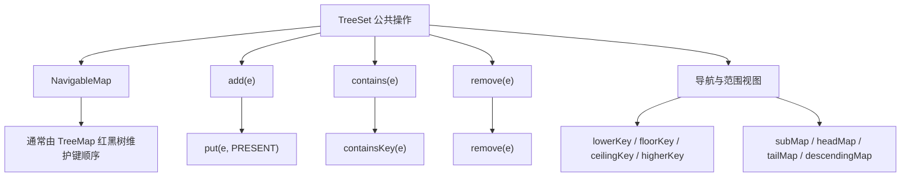

# 3.2.1.10 TreeSet

`TreeSet<E>` 是 Java 集合框架中的有序集合实现。它同时具备两组语义：一方面，它是 `Set`，不保存比较意义上的重复元素；另一方面，它是 `NavigableSet`，始终按照自然顺序或构造时提供的 `Comparator` 维护元素，并提供最值、邻近元素、范围集合和降序视图等导航能力。

这两组语义不能分开理解。`TreeSet` 不是“先把元素放进普通集合，再在遍历时排序”，而是在每次插入、查找和删除时都使用同一套比较规则沿有序树定位。比较结果既决定元素位于树的哪一侧，也决定某个候选元素是否已经存在。因此，排序规则同时承担“建立顺序”和“判定集合重复”两项职责，这是理解 `TreeSet` 行为、边界与风险的核心。

## 从 Set 到 NavigableSet 的契约

`TreeSet` 的类型层次可以简化为：

```text
Iterable
  └─ Collection
      └─ Set
          └─ SortedSet
              └─ NavigableSet
                  └─ TreeSet
```

`Set` 契约要求集合不包含重复元素，但“重复”的判断方式会受到具体实现的数据结构影响。`HashSet` 通常依赖 `hashCode` 与 `equals`；`TreeSet` 则依赖排序比较，当两个元素的比较结果为 `0` 时，它们占据同一个集合位置。只要理解这一点，`add` 返回 `false`、`contains` 命中某个不满足 `equals` 的对象、范围视图边界判断等行为就能够统一解释。

`SortedSet` 在 `Set` 基础上增加了全序语义。所谓全序，不只是迭代结果“看起来排过序”，还意味着集合中的任意两个元素都应当能够按照同一规则比较，比较结果必须足以决定先后或等价关系。`SortedSet` 提供 `first`、`last`、`headSet`、`tailSet`、`subSet` 和 `comparator` 等能力，但早期范围方法固定采用半开区间语义，边界表达能力有限。

`NavigableSet` 进一步增加了双向导航和显式边界控制：

- `lower(e)`：返回严格小于 `e` 的最大元素。
- `floor(e)`：返回小于或等于 `e` 的最大元素。
- `ceiling(e)`：返回大于或等于 `e` 的最小元素。
- `higher(e)`：返回严格大于 `e` 的最小元素。
- `pollFirst()`、`pollLast()`：查询并移除当前最小或最大元素，空集合返回 `null`。
- `descendingSet()`、`descendingIterator()`：按照反向顺序观察或遍历同一组元素。
- 带布尔参数的 `subSet`、`headSet`、`tailSet`：明确控制端点是否包含。

这些导航操作描述的是“按照集合比较规则定义的相对位置”，而不是对象创建时间、插入时间或 `equals` 意义上的邻近。假设集合按字符串长度排序，那么 `floor("abc")` 寻找的是长度不大于 3 的最大比较位置；如果比较器没有提供长度相同时的次级排序，不同但等长的字符串还可能被视为同一个元素。

`TreeSet` 还继承了普通集合的基本契约，例如 `add`、`remove`、`contains`、`iterator`、`size` 和批量操作。不同之处在于，这些方法都受到排序规则约束。对 `TreeSet` 而言，比较器不是一个只影响输出格式的附加配置，而是集合身份语义的一部分。

## 常见实现：以 TreeMap 的键承载元素

在常见的 OpenJDK 实现中，`TreeSet` 不单独实现一棵树，而是把存储工作委托给一个 `NavigableMap<E, Object>`。普通构造得到的集合通常由 `TreeMap` 支撑，集合元素作为映射的键，所有键共享同一个无业务含义的占位值。可以用下面的概念代码理解：

```java
public class TreeSet<E> extends AbstractSet<E>
        implements NavigableSet<E>, Cloneable, java.io.Serializable {

    private transient NavigableMap<E, Object> map;
    private static final Object PRESENT = new Object();

    public boolean add(E element) {
        return map.put(element, PRESENT) == null;
    }

    public boolean remove(Object target) {
        return map.remove(target) == PRESENT;
    }

    public boolean contains(Object target) {
        return map.containsKey(target);
    }
}
```

这段代码只用于展示委托关系，不应视为某个 JDK 版本的完整源码。真实实现还涉及构造器、克隆、序列化、批量添加优化、视图包装等细节。不过，“元素作为 `TreeMap` 的键”足以解释主要行为：

1. `TreeSet` 不需要为每个元素同时保存一份独立的集合节点和映射节点，树节点就是底层映射的键节点。
2. 元素的顺序、唯一性、查找路径和删除路径都由 `TreeMap` 的键比较规则决定。
3. `TreeMap` 的键视图本身具备 `NavigableSet` 能力，范围集合和降序集合可以继续由对应映射视图支撑。
4. 占位值只是为了复用映射结构，不参与集合的相等判断、排序或对外返回。

从抽象上看，集合可以被理解为“只关心键的映射”。`TreeMap<E, Object>` 已经解决了有序键的定位、平衡维护、边界搜索与迭代问题，`TreeSet` 复用这些能力可以避免维护两套几乎相同的树结构。

下面的关系图展示了集合方法如何落到底层映射：



这里应区分接口承诺与常见实现。`TreeSet` 的公开语义来自 Java API 契约；“由 `TreeMap` 和红黑树实现”属于常见 JDK 实现细节。分析复杂度、节点平衡和源码调用路径时可以依据具体实现，但面向公共 API 编程时不应依赖未被规范承诺的内部字段形态。

## 自然顺序与 Comparator

`TreeSet` 必须拥有一套能够比较元素的规则。规则来自两个来源：元素的自然顺序，或者构造集合时显式传入的 `Comparator`。

### 自然顺序

无参构造器创建的 `TreeSet` 使用元素的自然顺序。通常这意味着元素实现 `Comparable`，并由 `compareTo` 定义先后关系：

```java
record Version(int major, int minor) implements Comparable<Version> {
    @Override
    public int compareTo(Version other) {
        int byMajor = Integer.compare(major, other.major);
        return byMajor != 0
                ? byMajor
                : Integer.compare(minor, other.minor);
    }
}

TreeSet<Version> versions = new TreeSet<>();
versions.add(new Version(2, 1));
versions.add(new Version(1, 9));
versions.add(new Version(2, 0));

System.out.println(versions);
// [Version[major=1, minor=9], Version[major=2, minor=0], Version[major=2, minor=1]]
```

自然顺序适合表达类型本身稳定、普遍且不依赖使用场景的默认顺序。例如数字按数值、日期按时间先后、版本对象按主版本和次版本排序。若一个类型在不同业务中存在多种同样合理的顺序，把其中一种强行定义成自然顺序可能降低可读性，此时显式比较器更合适。

没有比较器时，并非只要泛型参数写成任意类型就可以安全插入。泛型声明不会自动赋予运行时可比较能力。若元素不能按照自然顺序互相比较，插入过程会在真正执行比较时抛出 `ClassCastException`。错误可能出现在第一次插入，也可能在后续插入异构或不兼容元素时出现，具体取决于实现触发比较的路径。不要把延迟出现的异常误解为前一个元素“已经被集合接受，所以类型一定正确”。

### 显式 Comparator

构造器 `TreeSet(Comparator<? super E> comparator)` 允许调用方定义集合自己的顺序：

```java
Comparator<String> byLengthThenText =
        Comparator.comparingInt(String::length)
                  .thenComparing(Comparator.naturalOrder());

NavigableSet<String> words = new TreeSet<>(byLengthThenText);
words.add("pear");
words.add("fig");
words.add("apple");
words.add("plum");

System.out.println(words);
// [fig, pear, plum, apple]
```

比较器对象会成为集合长期状态的一部分。后续新增、查找、删除、范围判断和迭代都使用同一个比较器。`comparator()` 返回当前比较器；如果集合使用自然顺序，该方法返回 `null`，这里的 `null` 表示“采用自然顺序”，并不表示集合没有排序规则。

可靠的比较器至少需要满足以下性质：

- 反对称的符号关系：`compare(a, b)` 与 `compare(b, a)` 的符号应相反。
- 传递性：若 `a > b` 且 `b > c`，则应有 `a > c`。
- 等价传播：若 `compare(a, b) == 0`，那么对于任意 `c`，`a` 与 `c`、`b` 与 `c` 的比较符号应一致。
- 稳定性：同一组对象在未发生契约允许的状态变化时，比较结果不应随机改变。
- 对可接受输入有定义：比较器必须明确是否支持 `null`、子类型及可能出现的边界值。

违反这些性质时，红黑树自身仍可能保持某种指针和平衡结构，但“沿比较结果能够找到原元素”这一关键前提被破坏，`contains`、`remove`、范围视图和迭代顺序都可能产生反直觉结果。集合无法检测所有不合法比较器，也不会自动修复比较关系。

比较整数时应优先使用 `Integer.compare`、`Long.compare` 或 `Comparator.comparingInt` 等方法，不要直接返回减法结果：

```java
// 风险写法：极值相减可能溢出，符号错误会破坏顺序。
Comparator<Integer> bad = (left, right) -> left - right;

// 正确表达数值顺序。
Comparator<Integer> good = Integer::compare;
```

比较器链应覆盖集合所需的完整身份维度。如果主字段相同的对象仍应同时存在，就必须使用 `thenComparing` 增加足以区分它们的次级字段；如果主字段相同就代表业务上的重复，则不应为了“让对象都塞进去”而随意追加对象标识，因为那会改变集合原本要表达的唯一性规则。

## 比较相等不等于 equals 相等

`TreeSet` 判断元素是否占据同一个集合位置，依据的是：

```text
compare(a, b) == 0
```

而普通对象相等通常写成：

```text
a.equals(b)
```

理想情况下，这两种相等关系保持一致，即比较结果为 `0` 当且仅当 `equals` 返回 `true`。Java 文档通常将这种性质描述为“顺序与 `equals` 一致”。一致时，`TreeSet` 的行为符合一般 `Set` 使用者对对象相等的直觉；不一致时，树仍可以按比较规则运行，但从 `Set` 的一般相等语义看会出现明显差异。

一个典型例子是按字符串长度比较：

```java
TreeSet<String> values =
        new TreeSet<>(Comparator.comparingInt(String::length));

System.out.println(values.add("cat")); // true
System.out.println(values.add("dog")); // false
System.out.println(values.size());      // 1
System.out.println(values.contains("pig")); // true
```

`"cat"`、`"dog"` 和 `"pig"` 彼此并不满足 `equals`，但比较器只观察长度，所以它们的比较结果都为 `0`。集合保留第一次成功插入的代表元素 `"cat"`；后续 `add("dog")` 不会用新对象替换旧对象，只会报告比较意义上的位置已经存在。`contains("pig")` 也会沿长度比较路径命中该位置。

这类行为不一定是错误。若集合的设计目标就是“每种长度只保留一个代表值”，那么比较器准确表达了业务唯一性。风险在于调用方把比较器当成纯排序工具，却仍期待 `equals` 决定去重。使用 `TreeSet` 前必须回答：当比较器返回 `0` 时，这两个对象是否真的应该被视为同一个集合成员？

反方向的不一致也值得注意：两个对象可能满足 `equals`，但比较器返回非零。此时 `TreeSet` 可能同时保存它们，进而违背一般 `Set` 契约对重复元素的常规理解。尤其不要让 `equals` 只比较业务主键，而比较器再用可变展示字段区分同一主键对象，除非调用方明确接受这种集合语义。

`BigDecimal` 是标准库中经常用于说明差异的类型。某些数值表示在 `compareTo` 看来数值相等，但 `equals` 还会考虑标度：

```java
TreeSet<java.math.BigDecimal> numbers = new TreeSet<>();
numbers.add(new java.math.BigDecimal("1.0"));
numbers.add(new java.math.BigDecimal("1.00"));

System.out.println(numbers.size()); // 1
```

这里不是 `TreeSet` 丢失了元素，而是它按照 `BigDecimal` 的自然顺序把两个值放在同一个比较位置。若应用需要区分表示形式，就需要重新审视容器与比较规则，而不能只在插入失败后补救。

比较相等还会影响 `remove`。传入的对象不必与树中保存的对象满足 `equals`；只要它能够参与比较并定位到结果为 `0` 的节点，删除就可能成功。因此，`TreeSet` 的 `contains` 和 `remove` 更准确的解释是“是否存在与目标比较等价的元素”，而不是“是否存在一个与目标 `equals` 的元素”。

## null 的边界

`TreeSet` 是否能够处理 `null`，不能仅凭“集合一般允许空元素”推断。关键在于当前比较规则能否比较 `null`。

在自然顺序下，`null` 没有可调用的 `compareTo`，现代 JDK 的常见行为是插入或查询涉及 `null` 时抛出 `NullPointerException`。不要依赖某些旧实现、特殊插入顺序或空树路径曾经表现出的偶然差异；自然顺序集合应被视为不接受 `null`。

显式比较器可以定义 `null` 的位置，例如：

```java
Comparator<String> nullableOrder =
        Comparator.nullsFirst(Comparator.naturalOrder());

NavigableSet<String> names = new TreeSet<>(nullableOrder);
names.add("Bob");
names.add(null);
names.add("Alice");

System.out.println(names); // [null, Alice, Bob]
```

此时 `null` 是一个正常的、至多出现一次的集合元素，参与最值、迭代和范围计算。如果使用 `nullsLast`，它会成为排序上的最大元素。是否应该这样做仍是 API 设计问题：虽然技术上可行，但 `pollFirst()`、`pollLast()` 在空集合时也以 `null` 表示“没有结果”，允许 `null` 元素会让返回值含义难以区分。调用方可能需要先检查 `isEmpty()`，或者选择禁止空元素以保持接口清晰。

查询方法也受比较器约束。即使集合当前为空，也不应假定 `contains(null)`、`remove(null)` 或导航查询一定安全；方法是否需要执行类型检查和空值检查取决于契约与实现路径。稳妥做法是让传入值始终符合比较器声明的输入域，而不是利用某个 JDK 版本对空集合的短路行为。

## add、contains 与 remove 的树上路径

理解三个基本操作时，可以先忽略红黑树的着色细节，只观察二叉搜索树定位过程。设当前节点元素为 `p`，目标元素为 `x`：

1. 使用比较器或自然顺序计算 `compare(x, p)`。
2. 结果小于 `0`，进入左子树。
3. 结果大于 `0`，进入右子树。
4. 结果等于 `0`，说明命中同一个比较位置。

### add

`add(x)` 沿比较路径向下：

- 若途中遇到比较结果为 `0` 的节点，不新增元素，返回 `false`。
- 若最终到达空子节点，则在那里创建新节点，写入元素键和占位值。
- 新节点加入后，底层树通过重新着色和必要的旋转恢复红黑树约束，返回 `true`。

插入成功的含义是“此前不存在比较等价的键”，不是“此前不存在同一对象引用”，也不严格等价于“此前不存在 `equals` 相等对象”。插入过程中比较器可能被调用多次，所以昂贵的字符串转换、外部查询或易变状态读取不适合放在比较逻辑中。

### contains

`contains(x)` 复用键查找路径：

- 它不会线性扫描所有元素，也不会先调用每个元素的 `equals`。
- 每一层比较结果决定下一步方向。
- 命中比较结果为 `0` 的节点返回 `true`，走到空链接返回 `false`。

这意味着目标对象必须能够与树中元素按照当前规则比较。由于 `contains` 的参数类型继承自集合接口而是 `Object`，编译器不会保证任意传入对象都可比较。传入类型不兼容的对象可能抛出 `ClassCastException`，传入不受支持的 `null` 可能抛出 `NullPointerException`。不能把所有不兼容查询都假定为简单返回 `false`。

### remove

`remove(x)` 先按相同方式定位比较等价节点。未命中时返回 `false`；命中时删除节点并返回 `true`。删除二叉搜索树节点通常涉及三种结构情况：

- 没有子节点：直接断开该叶子节点。
- 只有一个子节点：由子节点接替当前位置。
- 同时有两个子节点：通常选择后继节点或等价策略，把删除问题转换为移除一个至多只有一个子节点的位置。

对于红黑树，物理删除后还可能破坏黑高或颜色约束，因此需要额外的旋转和重新着色。实现代码看起来会比查找复杂，但对外复杂度仍保持对数级别。

三个操作共享比较路径，因而也共享同一组失败根源：比较器不传递、元素排序字段在入树后改变、目标类型不兼容、空值不受支持，都会让定位结果失去可靠性。

## 红黑树平衡与复杂度

常见 `TreeMap` 使用红黑树保存键。红黑树是一种自平衡二叉搜索树，通过节点颜色、根与叶边界约束、红节点相邻限制和各路径黑高一致等性质，将树高控制在对数范围。它不会保证整棵树绝对高度最小，但能避免按已排序输入连续插入时退化成近似链表。

对包含 `n` 个元素的集合，典型复杂度如下：

| 操作 | 常见时间复杂度 | 说明 |
| --- | --- | --- |
| `add` | `O(log n)` | 定位插入点并进行有限次数的平衡修复 |
| `contains` | `O(log n)` | 沿树高进行比较查找 |
| `remove` | `O(log n)` | 定位、删除并恢复平衡 |
| `first`、`last` | `O(log n)` | 沿最左或最右路径寻找极值 |
| `lower`、`floor`、`ceiling`、`higher` | `O(log n)` | 查找目标附近的候选节点 |
| 完整迭代 | `O(n)` | 每个元素按顺序访问一次，单步均摊为常数级 |
| `size` | 通常 `O(1)` | 底层结构维护元素计数 |

复杂度只计算比较与结构步数，真实成本还取决于比较器。若一次比较需要扫描长字符串、解析文本或读取深层对象图，那么 `O(log n)` 次比较的常数可能很大。比较器应尽量是无副作用、可重复、成本可预期的纯计算。

红黑树节点通常保存键、占位值、左右子节点、父节点和颜色等信息。与基于数组桶的哈希集合相比，它包含较多引用，节点访问也缺少连续内存的局部性。因此，当需求只是成员判断且不需要顺序、范围或邻近查询时，`HashSet` 往往有更低的平均查找常数。`TreeSet` 的价值不在于单项操作绝对最快，而在于它持续维护有序索引，使多种顺序操作都能直接完成。

“完整迭代是 `O(n)`”也不意味着迭代前发生额外排序。顺序已经在每次修改时维护，迭代器只需要按中序顺序访问树节点。与“先放入 `HashSet`，需要时复制到列表并排序”相比，两者把成本放在不同阶段：

- `TreeSet`：每次插入承担 `O(log n)`，之后可以直接有序遍历和导航。
- 哈希集合加临时排序：平时插入平均接近 `O(1)`，需要有序结果时再承担复制和 `O(n log n)` 排序。

若排序查询频繁或需要动态范围视图，前者通常更自然；若大部分时间只做无序成员判断，排序只是偶发输出需求，后者可能更经济。

## 邻近元素导航

`NavigableSet` 最有代表性的能力是围绕某个目标寻找邻近元素。四个方法的差异只在于方向与是否允许相等：

| 方法 | 查找条件 | 无候选时 |
| --- | --- | --- |
| `lower(e)` | 最大的 `x`，满足 `x < e` | 返回 `null` |
| `floor(e)` | 最大的 `x`，满足 `x <= e` | 返回 `null` |
| `ceiling(e)` | 最小的 `x`，满足 `x >= e` | 返回 `null` |
| `higher(e)` | 最小的 `x`，满足 `x > e` | 返回 `null` |

这里的 `<`、`<=`、`>=`、`>` 都由集合比较器解释。例如：

```java
NavigableSet<Integer> points =
        new TreeSet<>(java.util.List.of(10, 20, 30, 40));

System.out.println(points.lower(20));   // 10
System.out.println(points.floor(20));   // 20
System.out.println(points.ceiling(25)); // 30
System.out.println(points.higher(30));  // 40
System.out.println(points.higher(40));  // null
```

这些方法适合处理已排序离散值中的前驱、后继、阈值匹配和区间落点。与先遍历再筛选相比，树可以在 `O(log n)` 时间内沿路径保留最佳候选。例如查找 `floor` 时，若当前节点大于目标就进入左子树；若当前节点小于目标，则当前节点暂时是候选，再进入右子树尝试寻找更接近目标的值。

导航方法返回的是集合中实际保存的元素引用，而不是传入目标或新建副本。当比较器与 `equals` 不一致时，`floor(target)` 可能返回一个与 `target` 比较相等但不满足 `equals` 的代表元素。这与 `contains` 的比较等价语义一致。

`first()` 和 `last()` 在空集合上抛出 `NoSuchElementException`，而 `pollFirst()`、`pollLast()` 在空集合上返回 `null`。后两者还会修改集合，是“取出并删除”操作。选择哪组方法取决于空集合是否属于正常分支，以及是否要消费边界元素。

## 范围视图与边界语义

`TreeSet` 的范围方法返回的是视图，而不是独立副本。视图保存对原集合及边界规则的关联，读取和修改会作用于同一棵底层树。

现代 `NavigableSet` 范围方法包括：

```java
NavigableSet<E> subSet(
        E fromElement, boolean fromInclusive,
        E toElement, boolean toInclusive);

NavigableSet<E> headSet(E toElement, boolean inclusive);

NavigableSet<E> tailSet(E fromElement, boolean inclusive);
```

例如：

```java
TreeSet<Integer> all =
        new TreeSet<>(java.util.List.of(10, 20, 30, 40, 50));

NavigableSet<Integer> middle = all.subSet(20, true, 40, false);
System.out.println(middle); // [20, 30]

middle.remove(20);
System.out.println(all);    // [10, 30, 40, 50]

all.add(35);
System.out.println(middle); // [30, 35]
```

`middle` 没有复制 `20` 和 `30`。它只是限制了允许观察的键区间，所以通过视图删除 `20` 会同步影响原集合，向原集合加入区间内的 `35` 也会立即出现在视图中。

通过范围视图新增元素时，元素必须位于视图允许的边界内；越界通常抛出 `IllegalArgumentException`，而不是悄悄加入原集合后在视图中隐藏。视图上的 `contains`、`remove` 对越界目标的具体处理还会受实现和参数可比较性影响，但调用方不应把视图当成可以接受任意值的过滤器。它表达的是一个受边界约束的可修改集合接口。

端点先后同样由集合比较器决定。正序视图中，`fromElement` 不能在比较顺序上大于 `toElement`。如果使用降序集合，调用范围方法时需要按照该视图自己的顺序理解“from 到 to”，不能继续套用原集合的数值升序直觉。

继承自 `SortedSet` 的旧式重载具有固定边界：

- `subSet(from, to)` 等价于左闭右开区间 `[from, to)`。
- `headSet(to)` 等价于严格小于 `to`。
- `tailSet(from)` 等价于大于或等于 `from`。

显式布尔边界的方法更适合可读性要求较高的代码，尤其是在闭区间、开区间和混合区间并存时。不要依赖读者记忆旧式重载的默认端点。

视图可以继续派生视图。例如先取得一个范围，再从中取得尾集合。后续视图的有效边界必须收缩在父视图范围内，不能借助二次切片突破原边界。多层视图能够表达精确窗口，但也会增加所有权和修改传播的理解成本。公开 API 若不希望调用方修改内部集合，应返回副本或不可修改包装，而不是直接暴露可写范围视图。

## 降序视图及其联动

`descendingSet()` 返回同一元素集合的反向顺序视图：

```java
TreeSet<Integer> ascending =
        new TreeSet<>(java.util.List.of(1, 2, 3, 4));
NavigableSet<Integer> descending = ascending.descendingSet();

System.out.println(ascending);  // [1, 2, 3, 4]
System.out.println(descending); // [4, 3, 2, 1]

descending.remove(4);
ascending.add(5);

System.out.println(ascending);  // [1, 2, 3, 5]
System.out.println(descending); // [5, 3, 2, 1]
```

降序集合不是反向复制。两个对象共享底层数据，任何一方的结构性修改都会被另一方观察到。对降序视图再次调用 `descendingSet()`，语义上得到与原顺序等价的视图，但调用方不应依赖对象引用一定与最初集合相同。

降序视图中的导航方向按照视图顺序解释。假设原集合为 `[10, 20, 30]`，降序视图为 `[30, 20, 10]`。在降序比较器看来，`30` 小于 `20`，因为它在视图中排在前面。因此 `lower`、`higher`、`headSet`、`tailSet` 等方法的结果必须以视图比较器为准。若代码同时持有正序和降序引用，建议在变量名中明确方向，避免把数值大小和集合顺序混为一谈。

只需要一次反向遍历时，`descendingIterator()` 比长期保存降序视图更直接。它按从最大到最小的顺序返回元素，同样通常具备 fail-fast 行为，也允许通过迭代器自身的 `remove` 删除最近一次返回的元素。

范围视图与降序视图可以组合。组合后的所有对象仍然指向同一底层集合，并共同受到边界与比较方向约束。此时应把它们视为多个受限入口，而不是多个独立容器：

```text
原 TreeSet
  ├─ subSet(...)：限制可见区间
  ├─ descendingSet()：反转观察顺序
  └─ subSet(...).descendingSet()：限制区间后反向观察
```

视图联动使局部操作非常高效，因为不需要复制元素；代价是别名增多。一个方法接收到范围视图后修改它，可能在远处改变原集合。API 边界应明确视图是否可写、由谁持有、修改是否预期传播。

## 迭代顺序与 fail-fast

`TreeSet` 的普通迭代器按照升序返回元素，具体升序由自然顺序或比较器定义；降序迭代器按照相反顺序返回。顺序来自树结构本身，不受元素插入顺序影响。

常见实现中的迭代器采用 fail-fast 策略。创建迭代器时，它会记录底层集合的结构修改计数；后续遍历若发现实际修改计数与预期不一致，通常抛出 `ConcurrentModificationException`。结构性修改一般指元素数量或树结构发生变化，例如成功新增或删除元素。把一个比较等价元素再次 `add`，由于集合没有实际变化，通常不构成结构性修改。

```java
TreeSet<Integer> set =
        new TreeSet<>(java.util.List.of(1, 2, 3));

for (Integer value : set) {
    if (value == 2) {
        set.remove(value); // 后续迭代通常抛出 ConcurrentModificationException
    }
}
```

遍历期间需要删除当前元素时，应使用迭代器自己的 `remove`：

```java
java.util.Iterator<Integer> iterator = set.iterator();
while (iterator.hasNext()) {
    Integer value = iterator.next();
    if (value % 2 == 0) {
        iterator.remove();
    }
}
```

迭代器能够在删除后同步自己的预期修改计数，并继续沿合法后继路径遍历。它通常不提供 `add`，因为在树中新增元素可能落在任意位置，难以定义当前遍历游标是否应该再次遇到新元素。

fail-fast 有三个必须说明的边界。

第一，它是错误检测机制，不是线程安全机制。没有同步时，并发线程之间还涉及 Java 内存模型的可见性与竞态，不能依赖迭代器必然及时抛出异常。

第二，它通常采用“尽力而为”策略，不构成绝对保证。程序正确性不能建立在 `ConcurrentModificationException` 一定发生之上。

第三，视图与原集合共享底层修改计数。通过原集合、范围视图或降序视图中的任意入口进行结构性修改，都可能使另一个入口上已经创建的迭代器失效。视图不是隔离快照。

若需要遍历稳定快照，可以在适当同步边界内复制集合；若需要并发有序集合及弱一致迭代，可考虑 `ConcurrentSkipListSet`。两种方案的语义不同：快照不会反映复制后的修改，而并发集合迭代器可能观察到部分并发更新，但不会以普通 fail-fast 方式工作。

## Spliterator、流与批量操作

除传统迭代器外，`TreeSet` 还可以通过 `spliterator()` 被流框架消费。常见实现返回的 `Spliterator` 会表达几个与集合语义一致的特征：元素互不重复、遍历结果有序，并且集合大小通常可以估计。最重要的两个特征是 `DISTINCT` 与 `SORTED`，前者对应集合去重，后者对应比较器顺序。由于显式比较器可能允许 `null`，通用代码不能仅凭容器类型假定 `NONNULL` 特征。

`Spliterator.getComparator()` 的行为也受排序来源影响。若遍历采用元素自然顺序，通常返回 `null`；若集合使用显式比较器，则返回相应比较器。这里与 `TreeSet.comparator()` 一样，返回 `null` 表示自然顺序，而不是无序。依赖排序特征的通用算法应同时检查 `SORTED` 特征和比较器，不要只看到 `null` 就推断没有排序。

```java
TreeSet<String> names =
        new TreeSet<>(Comparator.comparingInt(String::length)
                                .thenComparing(Comparator.naturalOrder()));
names.addAll(java.util.List.of("amy", "zoe", "robert", "li"));

names.stream()
     .filter(name -> name.length() >= 3)
     .forEachOrdered(System.out::println);
```

`forEachOrdered` 保留流的遭遇顺序，所以结果继续遵循长度及文本的组合比较器。普通顺序流上的 `forEach` 在实践中也按遭遇顺序推进，但其接口重点不是强制顺序消费；并行流若要求确定输出次序，应明确使用 `forEachOrdered`。即便如此，输出动作本身的线程、安全发布和副作用仍需单独设计。

树结构可以拆分为并行任务，并不代表 `parallelStream()` 一定更快。`TreeSet` 节点通过引用连接，拆分与遍历的局部性通常不如紧凑数组；数据规模较小、比较或流水线操作较轻时，并行调度成本可能超过收益。应以真实数据和完整流水线做基准，而不是根据集合“可拆分”就默认并行。

流不会改变集合的比较等价规则。`stream().distinct()` 看到上游已经具有 `DISTINCT` 特征时可能省略额外去重工作，但这只说明集合中不存在比较意义上的重复位置，并不把元素重新按 `equals` 审查一遍。若 `TreeSet` 的比较器与 `equals` 不一致，流中仍只有集合实际保留的代表元素，不能借助 `distinct` 恢复此前被 `add` 拒绝的对象。

批量方法也要结合底层查找语义理解。`addAll` 会让每个候选元素接受目标集合的比较规则；源集合认为不同的两个对象，进入目标 `TreeSet` 后可能合并为一个比较位置。`containsAll` 判断目标集合是否覆盖给定元素，但每次成员查询仍按照接收方的规则执行。`removeAll`、`retainAll` 等方法还可能根据两个集合的大小和实现选择不同遍历方向，因此当两个集合对“相等成员”的定义不一致时，结果会比单次 `remove` 更难凭直觉推导。

例如，一个按字符串长度去重的 `TreeSet` 与一个按 `equals` 去重的 `HashSet` 进行批量操作时，同样长度的不同字符串在两侧拥有不同身份。此类组合即使在特定数据上得到预期结果，也容易受到实现优化、调用方向和数据规模变化影响。更可靠的做法是先统一等价关系：将对象投影为明确键，或者让参与集合运算的各集合使用一致的 `equals` 与比较规则。

集合自身的 `equals` 继承自 `Set` 语义，通常依据大小和成员包含关系判断，而不是要求实现类型或比较器相同。两个采用不同比较器的有序集合可能迭代顺序不同，却仍被判断为集合相等；反过来，比较器与 `equals` 不一致时，成员包含判断可能呈现不对称或反直觉现象。若比较器定义的是特殊业务等价类，不要把普通 `Set.equals` 当作验证“排序规则完全相同”的工具。需要验证顺序与规则时，应另外比较迭代序列、比较器配置或规范化后的键。

从并发角度看，流仍然受原集合的修改约束。创建流并不生成快照，终止操作执行时才真正遍历。流建立后、消费前或消费过程中发生结构性修改，可能触发 fail-fast，也可能造成未定义于业务契约的观察结果。若需要稳定流输入，应先在同步边界内复制集合，再对副本建立流。

## 可变元素破坏定位

`TreeSet` 保存的是对象引用，不会冻结元素，也不会在元素字段变化后自动重新排序。如果参与比较的字段在入集合后发生改变，节点仍停留在原来的树位置，但后续比较会根据新字段计算方向，二叉搜索树的逻辑顺序因此被破坏。

```java
final class Task {
    private final String id;
    private int priority;

    Task(String id, int priority) {
        this.id = id;
        this.priority = priority;
    }

    String id() {
        return id;
    }

    int priority() {
        return priority;
    }

    void setPriority(int priority) {
        this.priority = priority;
    }

    @Override
    public String toString() {
        return id + ":" + priority;
    }
}

Comparator<Task> byPriorityThenId =
        Comparator.comparingInt(Task::priority)
                  .thenComparing(Task::id);

TreeSet<Task> tasks = new TreeSet<>(byPriorityThenId);
Task task = new Task("T-1", 10);
tasks.add(task);

task.setPriority(100);

System.out.println(tasks.contains(task)); // 结果不再值得依赖
System.out.println(tasks.remove(task));   // 可能无法沿新比较路径找到旧节点
```

即使迭代仍能看到对象，也不代表集合有效。问题不是引用消失，而是对象当前比较值与节点所在位置不一致。进一步插入新元素时，集合还可能接受一个与变更后对象比较为 `0` 的元素，因为正常搜索路径没有遇到那个错位节点，从而破坏唯一性直觉。

可靠策略包括：

- 将参与比较的字段设计为不可变字段。
- 使用不可变值对象作为集合元素。
- 必须改变排序键时，先用旧状态成功 `remove`，修改后再 `add`。
- 若对象更新流程复杂，保存不可变排序键或索引条目，而不是直接保存整个可变实体。

“先删除、后修改、再加入”要求删除发生在字段改变之前。如果先修改，删除路径已经可能失败。多线程下这三步还需要由同一同步策略保护，否则其他线程会看到元素暂时缺失或状态与索引不一致。

即使比较字段不变，比较器引用的外部状态变化也会产生同类问题。例如比较器根据一个可变优先级表、当前地区设置或动态配置计算顺序。当外部状态变化时，树中所有既有节点都不会自动重建。比较器最好只依赖元素内部稳定字段和构造后不变的配置。

## 比较器一致性的工程风险

比较器问题往往比普通类型错误更隐蔽，因为代码能够编译，少量数据也可能表现正常。常见风险可以分为以下几类。

### 只比较部分字段

若只比较姓氏，所有同姓对象都会被视为同一成员；若只比较时间戳，同一时刻的多个事件可能相互覆盖集合位置。应根据“比较结果为 `0` 是否代表业务重复”决定是否添加次级字段。

### 使用不稳定字段

把状态、计数、更新时间或可编辑名称作为排序键，会使对象修改后错位。若这些字段必须参与排序，集合应在状态改变时显式重建索引，或者改用不可变快照。

### 依赖对象身份兜底

使用 `System.identityHashCode` 或随机值作为最终比较项虽然可能降低 `0` 的概率，却通常使顺序无法稳定复现，也不等于可靠的全序。身份哈希仍可能冲突，序列化或跨进程后也没有业务意义。真正需要区分对象时，应使用稳定且唯一的业务标识。

### 比较过程中读取外部系统

比较器被调用的次数和顺序属于实现细节。若比较函数访问数据库、网络、时钟或会变化的缓存，性能和一致性都无法保证。比较器应尽量无副作用，也不应抛出与比较无关的偶发异常。

### 忽略 equals 与集合接口的关系

顺序与 `equals` 不一致并不总会立即让树算法失效，但会使集合在跨实现比较、批量操作和调用方理解上产生摩擦。例如一个 `TreeSet` 按部分字段去重，而另一个 `HashSet` 按完整 `equals` 去重，两者进行 `containsAll`、`removeAll` 或集合相等判断时，结果可能受到各自查找语义和规模优化路径影响。工程上应避免让同一批对象在不同集合中拥有互相矛盾的“成员身份”。

### 反向比较器并非简单取负

手写 `-compare(a, b)` 可能在原比较结果为整数最小值时溢出。应使用 `comparator.reversed()` 或 `Comparator.reverseOrder()`。标准组合方法不仅更安全，也更清楚地表达意图。

比较器应当被当成数据结构协议进行单元测试，而不是只测几个排序样例。测试可覆盖反向符号、传递性、相等传播、极值、重复字段、`null` 策略和元素状态稳定性。对关键领域类型，明确记录比较等价与 `equals` 是否一致。

## 并发访问与安全发布

`TreeSet` 不是线程安全集合。多个线程在没有外部同步的情况下并发修改，或者一个线程修改而另一个线程遍历，都会形成数据竞争。风险不只是抛出 `ConcurrentModificationException`，还包括读取到旧状态、组合操作失去原子性以及底层结构在竞态下处于不可可靠观察的状态。

只读访问能否安全，取决于集合如何构造和发布。一个集合在单线程中构造完成，之后不再修改，并通过 `final` 字段、锁、静态初始化或其他安全发布方式交给线程读取，通常可以作为不可变状态的一部分使用。仅仅“大家约定不修改”还不够；引用发布本身也需要符合 Java 内存模型。

对共享可变 `TreeSet`，可以使用 `Collections.synchronizedSortedSet` 创建同步包装：

```java
java.util.SortedSet<Integer> synchronizedSet =
        java.util.Collections.synchronizedSortedSet(new TreeSet<>());
```

该包装对单个方法进行同步，但复合操作仍需在同一锁范围内完成。例如“若不存在则加入”、先查最小值再删除、遍历整个集合等都不是由多个独立同步方法自动组成的原子事务。遍历时应按包装类文档要求在返回集合对象上手动同步：

```java
synchronized (synchronizedSet) {
    for (Integer value : synchronizedSet) {
        // 在持锁期间遍历
    }
}
```

还要注意，`synchronizedSortedSet` 暴露的是 `SortedSet` 接口，不提供完整 `NavigableSet` API。若业务高度依赖并发导航与范围操作，普通集合外部加锁虽然可以实现正确性，但锁粒度、视图传播和复合操作需要统一设计。

`ConcurrentSkipListSet` 是常见的并发有序集合选择。它同样按照自然顺序或比较器排序，提供 `NavigableSet` 能力，基本操作通常具有期望的对数复杂度，并提供弱一致迭代器。它不允许 `null`，比较相等仍决定集合重复。它解决的是并发结构访问，不会解决可变排序字段、不合法比较器或元素内部线程安全问题。

若写入很少、读取很多，另一种方案是在锁内替换不可变快照。写线程复制并构建新的有序集合，再通过安全发布替换引用；读线程只读取稳定快照。这会增加写入和内存成本，但可提供清晰的无锁读语义。应根据数据规模、写入频率、是否需要最新状态和延迟目标进行权衡。

无论采用哪种方案，都应避免一部分代码通过锁访问，另一部分代码持有原始 `TreeSet` 引用直接访问。同步包装只有在所有访问都经过同一包装和同一锁协议时才有效。返回范围视图或降序视图时，也必须把它们纳入同一并发约束。

## 批量构造与复制语义

`TreeSet` 可以从集合或排序集合构造：

```java
TreeSet<String> fromCollection =
        new TreeSet<>(java.util.List.of("b", "a", "c"));

java.util.SortedSet<String> source =
        new TreeSet<>(Comparator.reverseOrder());
source.addAll(java.util.List.of("a", "b", "c"));

TreeSet<String> copied = new TreeSet<>(source);
```

从普通 `Collection` 构造时，集合使用自然顺序并逐步加入元素；如果元素不可比较或包含不受支持的 `null`，构造过程会失败。从 `SortedSet` 构造时，新集合通常沿用源集合的比较器。这样复制才能保持源集合定义的排序与重复语义。

构造和 `addAll` 的具体优化属于实现细节。某些实现可以在已知输入有序且比较器兼容时采用线性构建路径，避免逐个执行常规树查找；调用方不应为了猜测优化而牺牲正确性。更重要的是保证源顺序与目标比较规则兼容，不把不稳定元素带入新集合。

`clone()` 或构造复制通常复制集合结构，但不会深复制元素。原集合和副本持有相同元素对象引用。若元素本身可变，修改对象会同时影响两个集合看到的内容，而且可能同时破坏两棵树的排序不变量。需要隔离时，应使用不可变元素或显式进行符合领域语义的深复制。

序列化同样不会把比较器风险消除。可序列化的 `TreeSet` 需要其元素以及相关比较器满足序列化要求；反序列化后仍依赖同一比较规则。把临时环境状态捕获在匿名比较器或 lambda 中，会让持久化边界变得脆弱。若集合需要长期存储，应使用稳定、可版本化的元素表示和比较策略。

## 与其他 Set 实现的权衡

选择集合时，先确定需要保持的语义，再比较复杂度。`TreeSet`、`HashSet`、`LinkedHashSet` 和 `EnumSet` 都实现集合去重，但它们对“如何定位、如何排序、允许哪些元素、内存如何组织”的答案不同。

| 实现 | 主要顺序语义 | 基本操作典型成本 | `null` | 适用重点 |
| --- | --- | --- | --- | --- |
| `TreeSet` | 自然顺序或比较器顺序 | `O(log n)` | 取决于比较器，通常不建议 | 持续有序、范围、邻近元素、最值 |
| `HashSet` | 不承诺迭代顺序 | 平均 `O(1)` | 通常允许一个 | 快速成员判断与去重 |
| `LinkedHashSet` | 通常保持插入顺序 | 平均 `O(1)` | 通常允许一个 | 去重并稳定复现插入顺序 |
| `EnumSet` | 枚举声明顺序 | 通常接近位运算成本 | 不允许 | 单一枚举类型的高效集合 |

### TreeSet 与 HashSet

若主要操作是 `add`、`contains`、`remove`，不关心排序和范围，`HashSet` 通常更直接。它依据 `hashCode` 选择桶，再用 `equals` 确认元素身份，平均情况下基本操作接近常数时间。

选择 `TreeSet` 的理由应来自它额外提供的能力：

- 每次遍历都需要排序结果。
- 经常查询最小值、最大值、前驱或后继。
- 经常取得动态范围视图。
- 需要用比较等价定义集合成员。
- 希望基本操作在平衡树上维持稳定的对数级路径，而不是依赖良好哈希分布。

两者对可变元素的风险不同。`HashSet` 要求参与 `equals` 和 `hashCode` 的字段稳定；`TreeSet` 要求参与比较的字段稳定。无论哪一种，修改定位字段都会让元素“仍在容器里，却按新状态找不到”。

### TreeSet 与 LinkedHashSet

`LinkedHashSet` 的“有序”通常指插入顺序，不是数值或比较器顺序。它适合在去重后保持首次出现次序，例如读取配置、合并用户输入或生成可复现输出。它不支持 `lower`、`floor`、范围视图等排序导航。

若需求是“按照加入先后遍历”，使用 `TreeSet` 会错误地重排元素；若需求是“无论何时加入都按比较规则遍历”，`LinkedHashSet` 也无法替代 `TreeSet`。两种顺序语义必须在接口设计中明确。

### TreeSet 与 EnumSet

元素类型是单一枚举时，`EnumSet` 通常应优先考虑。它利用枚举序号以紧凑位集合表示成员，内存和操作成本都很低，迭代顺序是枚举常量声明顺序。它不允许 `null`，也不能混合不同枚举类型。

只有当枚举声明顺序不满足需求，并且确实需要自定义比较与导航能力时，才有理由使用 `TreeSet<EnumType>`。若只是想按另一种顺序输出，保留 `EnumSet` 存储并在输出阶段排序可能更合适。

### TreeSet 与“列表排序”

虽然列表不是 `Set`，但“先收集到 `ArrayList`，再排序并去重”经常是候选方案。若数据只构建一次、之后只读和顺序扫描，紧凑数组可能具有更好的缓存局部性，也避免每个元素对应树节点。若数据持续变化，并且更新后立即需要成员判断、导航和范围查询，`TreeSet` 的动态索引更有优势。

因此，不应只比较某一个 API 的复杂度，而应比较完整生命周期：构建次数、修改频率、查询类型、是否需要重复、输出次数、内存预算和并发模型。

## 典型设计案例

假设系统维护一组不可重叠的版本切换点，需要查找“不晚于目标版本的最近规则”。可以使用按版本号排序的 `TreeSet`，通过 `floor` 定位：

```java
record RulePoint(int version, String ruleId) {}

Comparator<RulePoint> order =
        Comparator.comparingInt(RulePoint::version)
                  .thenComparing(RulePoint::ruleId);

NavigableSet<RulePoint> rules = new TreeSet<>(order);
rules.add(new RulePoint(100, "legacy"));
rules.add(new RulePoint(200, "standard"));
rules.add(new RulePoint(300, "strict"));

RulePoint probe = new RulePoint(250, Character.MAX_VALUE + "");
RulePoint matched = rules.floor(probe);
```

这个写法暴露了一个设计问题：比较器加入了 `ruleId` 次级字段后，同一版本可以存在多条规则，单纯构造探针就必须知道如何把次级字段推到边界。如果业务其实规定每个版本只能有一条规则，更准确的比较器应该只比较版本号，让比较结果为 `0` 直接表达版本唯一性：

```java
Comparator<RulePoint> uniqueByVersion =
        Comparator.comparingInt(RulePoint::version);

NavigableSet<RulePoint> rulesByVersion =
        new TreeSet<>(uniqueByVersion);

RulePoint matched =
        rulesByVersion.floor(new RulePoint(250, ""));
```

此时新增同版本不同 `ruleId` 的规则会返回 `false`。调用方必须决定这是需要拒绝并报错，还是保留旧值。如果需求是按版本键替换规则，`TreeMap<Integer, Rule>` 往往比 `TreeSet<RulePoint>` 更合适，因为映射的 `put` 明确表达按键覆盖值，而 `TreeSet.add` 只会保留既有代表元素。

这个案例说明，`TreeSet` 最适合“元素本身就是有序键”的模型。如果对象包含明确的键和值，并且需要按键更新值，`TreeMap` 的语义通常更直接。不能因为 `TreeSet` 内部基于 `TreeMap`，就认为两者在 API 建模上没有差别。

## 常见误区与排查路径

### 误以为 TreeSet 使用 equals 去重

症状通常是第二个对象 `add` 返回 `false`，但两个对象明明不满足 `equals`。首先检查比较器或 `compareTo` 是否只比较了部分字段。打印比较结果比反复检查 `hashCode` 更有效，因为 `TreeSet` 的基本定位不依赖元素哈希值。

### 误以为 add 会替换旧元素

当比较结果为 `0` 时，`add` 返回 `false` 并保留树中已有元素。若需要替换，应先删除比较等价元素再新增，或者使用以排序键为键的 `TreeMap` 执行 `put`。

### 误以为有序就是插入顺序

迭代顺序由比较规则决定。需要插入顺序应考虑 `LinkedHashSet`，需要访问顺序则还要选择其他更匹配的数据结构。

### 误以为视图是副本

通过 `subSet` 或 `descendingSet` 删除元素会改变原集合；原集合新增区间内元素也会出现在视图。若修改传播不符合预期，应在边界处创建副本，例如 `new TreeSet<>(view)`，并明确副本是否沿用正确比较器。

### 误以为 contains 只会返回 false

目标对象若不可比较、类型不兼容或为不受支持的 `null`，查询可能抛出异常。集合接口把参数声明为 `Object` 是历史泛型兼容设计，不代表所有对象都是合法查询键。

### 误以为 fail-fast 可以保证并发正确

`ConcurrentModificationException` 只是尽力检测错误使用。并发读写必须通过外部同步、并发集合或不可变快照设计解决。

### 误以为重新设置对象字段会自动重排

树不会监听对象属性。发现迭代顺序异常、`contains` 失效或集合出现比较重复时，应检查元素入树后是否修改了排序字段，或者比较器依赖的外部状态是否变化。

### 误以为范围查询会复制大量数据

标准范围方法返回视图，创建成本通常较低，后续操作仍在底层树上按边界执行。真正的风险不是复制成本，而是共享修改和生命周期。长期持有一个很小的范围视图也可能继续持有整个底层集合引用。

排查 `TreeSet` 问题时，可以按以下顺序缩小范围：

1. 确认实际比较器，可通过 `comparator()` 判断是显式规则还是自然顺序。
2. 对问题元素成对打印比较结果和 `equals` 结果，检查两种等价关系。
3. 检查元素入集合后是否修改了比较字段。
4. 检查比较器是否依赖可变外部状态、时钟或随机值。
5. 检查操作对象是原集合、范围视图还是降序视图，确认边界与方向。
6. 检查遍历期间是否从其他入口发生结构性修改。
7. 检查多线程访问是否遵循统一同步协议。

## API 设计建议

在方法签名中，应根据调用方真正需要的能力暴露接口。只需要无重复遍历时返回 `Set`；需要排序但不需要导航时可以返回 `SortedSet`；需要邻近元素和显式范围边界时返回 `NavigableSet`。直接返回 `TreeSet` 会让调用方依赖具体实现，通常没有必要。

返回接口不等于自动只读。若直接返回内部 `TreeSet` 或其视图，调用方仍可修改。可以根据所有权选择：

- 返回新副本，让调用方拥有独立结构。
- 返回不可修改包装，保留动态视图但阻止经该引用修改。
- 返回不可变快照，使内容和结构都与后续内部更新隔离。
- 只暴露查询方法，不直接泄露集合引用。

比较器也应成为 API 契约的一部分。若方法接收外部 `NavigableSet`，不能只假设它“已经排序”，还要考虑其排序规则是否与当前算法需要的一致。两个集合看起来包含相同类型，不代表可以直接合并范围或复用边界对象。必要时显式接收比较器，或者复制到由模块控制规则的新集合。

若集合用比较结果为 `0` 表达业务唯一性，新增失败不应被静默忽略。可以检查 `add` 返回值并抛出领域异常，或者预先用 `floor`、`ceiling` 找到冲突代表。这样能够让“排序键重复”成为清晰的业务结果，而不是后续数据缺失。

元素类型设计上，优先使用不可变对象，并让自然顺序与 `equals` 一致。若一个类型不存在普遍认可的自然顺序，不必勉强实现 `Comparable`；在具体集合创建处使用命名清晰的比较器，更容易审查集合的身份语义。

## 选择 TreeSet 的判断框架

`TreeSet` 适合以下条件同时成立的场景：

- 元素存在稳定、可传递、可重复的全序。
- 比较结果为 `0` 可以合理代表集合中的同一成员。
- 集合在生命周期中持续发生增删查，而不只是一次构建后顺序扫描。
- 需要有序迭代、最值、前驱后继或动态范围中的至少一种能力。
- 可以接受基本操作的对数成本和树节点内存开销。
- 并发访问能够通过明确策略解决。

出现以下信号时，应重新评估：

- 只需要最快的普通成员判断，不关心顺序。
- 需要的是插入顺序而不是比较顺序。
- 元素是枚举并且只需成员集合。
- 排序字段经常变化，且无法可靠执行删除后重插。
- 业务本质是“有序键映射到可替换值”，更适合 `TreeMap`。
- 数据一次构建后长期只读，排序数组可能更紧凑。
- 多线程高频更新，需要并发有序集合而非外部大锁。

最终选择不应基于“树结构听起来更高级”或“有序集合更方便”。正确问题是：应用是否愿意在每次写入时维护排序索引，以换取后续导航与范围操作的直接性。

## 总结

`TreeSet` 是一个以比较规则为核心的 `NavigableSet` 实现。常见 JDK 实现通过 `TreeMap` 承载元素，把集合元素作为有序映射的键，并用统一占位值复用映射结构。底层红黑树使 `add`、`contains`、`remove` 和邻近元素查询保持对数级路径，有序迭代则按树中序访问完成。

理解它时需要抓住四个不变量：

1. 比较规则同时决定顺序、定位和重复，`compare(a, b) == 0` 比 `equals` 更直接地决定集合成员身份。
2. 比较器必须构成稳定、自洽的全序；参与比较的元素字段和外部状态在入树后不能随意变化。
3. 范围集合和降序集合是联动视图，不是副本；修改、边界、迭代失效和并发约束都由同一底层结构传播。
4. `TreeSet` 本身不提供线程安全，fail-fast 也不能替代同步或并发容器。

当需求确实包含持续有序、范围查询、最值或前驱后继时，`TreeSet` 能把这些能力统一在一个清晰的数据结构中。当需求只包含普通去重、插入顺序或枚举成员时，`HashSet`、`LinkedHashSet`、`EnumSet` 往往更贴合。容器选择的关键不是背诵复杂度，而是让集合的身份规则、顺序规则、可变性和并发边界与实际模型保持一致。
