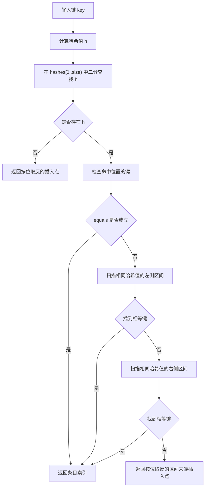
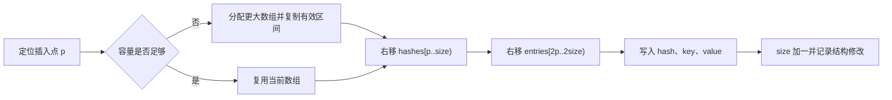

# 3.2.1.12 ArrayMap

## 从“小规模映射”这个问题开始

映射解决的是“根据键找到值”的问题。最常见的实现会把哈希值转换为桶下标，再通过桶内链表、树或开放寻址处理冲突。这类结构擅长让查找、插入和删除在平均情况下接近常数时间，但这种能力并不是免费的：实现通常需要预留桶位、维护装载状态，或者为每个条目分配额外节点。元素数量很少时，辅助结构的成本可能与真正保存的键值一样显眼。

ArrayMap 在本文中是“数组化小规模映射”的数据结构名称，不是 Java 标准库中的具体类型。它针对的核心问题是：当映射通常只有几个到几十个条目，读取较多、结构修改相对少，并且希望减少每个条目的结构性对象时，能否用紧凑数组换取更低的空间开销和较好的遍历局部性。

一种典型答案是维护两个逻辑区域：

1. 一个按哈希值非递减排序的整数数组，记录每个键的哈希值。
2. 一个与哈希数组位置严格对应的键值存储区，可以是交错对象数组，也可以是键数组和值数组。

若采用交错数组，第 `i` 个条目的键位于 `entries[2 * i]`，值位于 `entries[2 * i + 1]`。若采用平行数组，第 `i` 个条目的键和值分别位于 `keys[i]`、`values[i]`。两种表示的算法主线相同：先在有序哈希数组中二分定位，再在哈希值相同的连续区间内用 `equals` 确认键。

这种设计并没有消除成本，而是重新分配了成本：

- 查找不再直接计算桶位置，而是二分查找哈希值，并在碰撞区间扫描键。
- 插入需要为新条目腾出连续位置，可能移动后半段数组。
- 删除需要填补空洞，也可能移动后半段数组。
- 遍历可以顺序扫描紧凑存储，不必追踪离散节点。
- 每个条目不需要单独的节点对象，也不要求维护大量空桶。

因此，ArrayMap 不是“更省内存的 HashMap”这么简单。它是一组明确假设下的替代方案：规模小、结构紧凑的收益重要、顺序移动的代价可以接受、调用方不依赖插入顺序或键的自然顺序。只要其中某个假设不成立，选择就需要重新评估。

## 数据表示与核心不变量

以下讨论以“哈希数组加交错键值数组”为主。设当前元素数量为 `size`，容量为 `capacity`，内部字段可以抽象为：

```text
hashes  = [h0, h1, h2, ..., h(capacity-1)]
entries = [k0, v0, k1, v1, ..., k(capacity-1), v(capacity-1)]
```

其中只有前 `size` 个哈希槽和前 `2 * size` 个对象槽属于有效数据。其余位置是预留容量，不得被公开操作当作有效条目。

这个表示必须始终满足几条不变量。

第一，`0 <= size <= hashes.length`，并且 `entries.length == 2 * hashes.length`。容量变化时两个数组必须同步变化，否则位置对应关系会被破坏。

第二，有效哈希区间按非递减顺序排列：

```text
hashes[0] <= hashes[1] <= ... <= hashes[size - 1]
```

哈希值允许重复，因为不同键可以具有相同哈希值。排序对象是哈希值，不是键本身。

第三，对于每个有效索引 `i`，`hashes[i]`、`entries[2 * i]` 和 `entries[2 * i + 1]` 共同描述一个条目。任何移动、复制和删除都必须让三者保持同步。

第四，无效对象槽应当为 `null`。这不是查找正确性的必要条件，却关系到对象生命周期。删除条目后若仍保留键和值的引用，即使逻辑上已经不可访问，它们仍可能因为数组持有而无法被回收。

第五，同一个逻辑键最多出现一次。这里的“同一个”由 `equals` 定义，并且符合相等契约的键必须具有相同 `hashCode`。更新已有键时只替换值，不新增第二个条目。

第六，键用于定位期间，其 `hashCode` 和 `equals` 结果必须保持稳定。若键进入映射后改变了参与这两个方法的字段，内部保存的哈希值不会自动更新，查找会从新的哈希区间开始，因而可能找不到仍然存在于数组中的旧条目。

这些不变量比某个具体方法更重要。查找、插入和删除的所有步骤，本质上都在读取或恢复这些条件。

## 为什么要对哈希值排序

如果只把键值顺序放进数组，查找必须从头到尾调用 `equals`，时间复杂度为 O(n)。对于非常小的集合，这种线性表映射可能已经足够，而且实现更简单。ArrayMap 额外维护有序哈希数组，是为了用二分查找缩小候选范围。

给定键 `key`，先计算哈希值 `h`。在 `hashes[0..size)` 中二分查找 `h`：

- 如果不存在 `h`，那么 `key` 一定不存在，因为相等的键必须拥有相同哈希值。
- 如果找到 `h`，只能说明存在一个或多个候选条目，不能说明键已经相等。
- 接下来需要扫描所有哈希值为 `h` 的条目，并逐个调用 `equals`。

排序因此建立了一个两级定位过程：哈希值负责快速筛选，`equals` 负责最终确认。哈希数组类似一个紧凑索引，但它不是完美索引，因为哈希函数允许碰撞。

这种排序与按键排序有本质区别。哈希值的数值大小通常没有业务含义，也不满足键的自然顺序。遍历 ArrayMap 时看到的是内部哈希顺序，以及同一哈希区间内由插入和移动形成的局部顺序。调用方不应把它解释为插入顺序、字典序或任何稳定的业务顺序。

按哈希值排序还带来一个重要结果：插入点由哈希值决定。若新哈希值不存在，二分查找会得到保持排序所需的插入位置；若哈希值已经存在，新键可以放在该碰撞区间的末尾，从而不必打乱区间结构。无论采用哪种局部策略，只要相同哈希值保持连续，后续扫描就能正确工作。

## 二分定位与碰撞区间扫描

一次查找可以拆成三步：

1. 规范化键的哈希值。本文教学实现约定 `null` 键的哈希值为 `0`，其他键使用 `key.hashCode()`。
2. 在有序哈希数组中二分查找该哈希值。
3. 若命中某个位置，向左右扫描整个等值区间，用 `equals` 判断真实键。



二分查找常用一个整数同时表达“找到的位置”和“未找到时的插入点”。约定如下：

- 返回值 `>= 0`：表示键位于该索引。
- 返回值 `< 0`：表示键不存在，插入点为 `~result`，即对返回值按位取反。

采用按位取反而不是简单返回负索引，是因为插入点可能为 `0`。若直接返回 `-insertionPoint`，插入点 `0` 会与成功索引 `0` 混淆。`~0` 等于 `-1`，所有未命中结果都能稳定地保持为负数。

假设哈希数组的有效部分为：

```text
[2, 5, 5, 5, 9, 12]
```

查找哈希值 `7` 时，二分查找未命中，插入点是索引 `4`。查找哈希值 `5` 时，二分查找可能返回索引 `1`、`2` 或 `3` 中任意一个，取决于实现细节。算法不能假设二分查找一定返回碰撞区间的首项，而应从命中点向两侧检查。

碰撞区间扫描的最坏成本与区间长度有关。设映射共有 `n` 个条目，目标哈希值对应 `c` 个候选键，则定位成本为 O(log n + c)。哈希分布良好时，`c` 通常很小；若大量不同键故意或偶然返回同一哈希值，`c` 可以增长到 `n`，查找退化为 O(n)。

这也说明“二分查找是 O(log n)”并不能直接推出整个 `get` 是 O(log n)。二分只定位哈希值，键相等确认仍受碰撞影响。此外，`hashCode` 和 `equals` 是用户代码，它们本身的计算成本也必须计入真实开销。

## 插入：定位、扩容与连续移动

插入 `put(key, value)` 首先执行与查找相同的定位过程。

若找到相等键，映射的大小不变，只替换对应值并返回旧值。哈希数组和键位置不发生变化，因为逻辑键没有改变。

若键不存在，定位结果给出插入点。接下来依次完成：

1. 确保容量至少能容纳 `size + 1` 个条目。
2. 将插入点及其后的哈希值整体右移一格。
3. 将插入点及其后的交错键值整体右移两个对象槽。
4. 在空出的位置写入新哈希值、键和值。
5. 增加 `size` 和结构修改计数。



例如有效哈希数组为 `[2, 5, 9, 12]`，要在索引 `2` 插入哈希值 `7`。原来的 `9` 和 `12` 右移，结果变为 `[2, 5, 7, 9, 12]`。交错数组中原索引 `2`、`3` 对应的两对键值也必须整体右移。若只移动哈希数组或移动长度计算错误，哈希与键值就会错位，查找结果可能返回另一个条目的值。

数组移动通常由 `System.arraycopy` 完成。它能正确处理源区间和目标区间重叠的情况，适合这种同一数组内的右移。不要用从前向后的手写循环覆盖源数据；若必须手写，右移应从末尾向插入点倒序复制。

插入成本取决于位置。插在末尾时不需要移动已有条目，除扩容外接近 O(1)；插在开头时需要移动全部条目，为 O(n)。由于插入点由哈希顺序决定，业务代码通常无法控制它。因此 ArrayMap 的一般插入上界是 O(n)，而不是 O(log n)。O(log n) 只描述定位阶段。

### 碰撞区间中的插入位置

当哈希值已经存在但没有相等键时，可以把新条目插在碰撞区间的任意位置，只要相同哈希值仍然连续。教学实现选择区间末端，原因有三点：

- 定位扫描自然能得到区间末端，不需要再次寻找。
- 已有碰撞键的相对位置不会因为同哈希新键而变化。
- 规则明确，便于测试和推理。

这仍然不构成面向调用方的顺序承诺。容量变化、删除和不同哈希值的插入都会影响索引，内部位置只是一种实现状态。

## 删除：填补空洞与释放引用

按键删除先定位条目。未找到时结构不变；找到索引 `i` 后，需要保存旧值，然后将后面的有效区间左移：

- `hashes[i + 1 .. size)` 左移到 `hashes[i .. size - 1)`。
- `entries[2 * (i + 1) .. 2 * size)` 左移到 `entries[2 * i .. 2 * (size - 1))`。

移动完成后，原来最后一个条目的两个对象槽已经落在有效区间之外，但其中仍可能保留引用，因此必须显式设置为 `null`。最后减少 `size` 并记录结构修改。

删除同样具有位置相关成本。删除末尾条目只需清理引用；删除开头条目需要移动几乎全部有效数据，时间复杂度为 O(n)。如果一个工作负载持续在大映射中随机删除，数组移动会成为明显成本。

### 是否在删除后立即缩容

每次删除都把数组缩到刚好等于 `size` 看似最节省空间，实际会造成两个问题：

1. 连续增删会反复分配和复制数组。
2. 刚刚释放的容量很可能马上又需要，导致分配抖动。

更稳妥的策略是把逻辑删除和物理缩容分开。删除总是压紧有效条目，避免内部空洞；只有当容量明显大于规模时才收缩底层数组。例如可在容量较大且 `size < capacity / 3` 时缩到一个仍保留余量的目标容量。

这里的“压紧”与“缩容”不是同一件事：

- 压紧指删除后移动有效条目，让索引区间继续保持 `[0, size)` 连续。
- 缩容指分配更短的新数组，降低保留容量。

压紧是维护当前表示不变量所必需的；缩容是空间与复制成本之间的策略选择。教学实现提供显式 `trimToSize()`，而不在每次删除后自动缩容，让调用方在确认映射进入稳定只读阶段时主动释放冗余容量。

## 容量增长不是复杂度分析的附注

ArrayMap 的容量表示可以存储多少条目，而不是对象数组的槽数。容量为 `8` 时，哈希数组长度为 `8`，交错对象数组长度为 `16`。

当 `size == capacity` 且要插入新键时，需要分配更大的数组并复制有效内容。增长策略需要同时考虑：

- 增长太小会导致频繁分配和复制。
- 增长太大会保留较多未使用槽位，削弱紧凑结构的意义。
- 小容量阶段若直接按倍数增长，绝对浪费不大，但频繁从零开始构造仍可能产生多个短命数组。
- 极大容量需要防止整数溢出，尤其是交错数组长度要计算为 `capacity * 2`。

常见策略是在很小的容量阶段使用固定台阶，之后按约 1.5 倍或 2 倍增长。本文教学实现采用“至少增加一半，并确保达到所需最小容量”的方式。它不是唯一正确答案，关键是增长必须具有几何性质，否则连续插入 `n` 个条目时，反复复制可能累积为 O(n²)。

即使使用几何增长，ArrayMap 的插入仍不能像动态数组尾插那样简单地宣称摊销 O(1)，因为保持哈希有序通常还要移动后缀。扩容复制可以摊销，但排序位置引起的移动仍是 O(n)。更准确的表述是：

- 扩容分配的累计复制成本可以通过几何增长摊薄。
- 单次插入的定位为 O(log n + c)。
- 插入点后的条目移动为 O(n) 上界。
- 所以一般插入仍为 O(n)，只是小规模下连续内存复制的常数可能可接受。

如果调用方预先知道大致规模，可以通过构造容量或 `ensureCapacity` 减少扩容次数。这只能消除部分重新分配，不能消除中间插入造成的移动。

## 交错数组与平行数组如何选择

交错数组表示为：

```text
[key0, value0, key1, value1, key2, value2, ...]
```

平行数组表示为：

```text
keys   = [key0, key1, key2, ...]
values = [value0, value1, value2, ...]
```

两者都避免每条记录独立分配节点，主要差异在访问和维护方式。

交错数组只需要一个对象数组字段，复制一个条目时键值天然相邻，按条目遍历时访问位置规律简单。缺点是索引换算容易出错，移动长度必须乘二，单独遍历所有键或所有值时会跨过另一类槽位。

平行数组让键和值拥有相同的条目索引，表达更直观，单独处理键或值更方便。缺点是扩容、移动和异常处理必须同时维护两个数组，任何一步遗漏都会让键值错位。

从渐进复杂度看，两者没有区别。实际选择应以实现清晰度、访问模式和测量结果为依据。本文使用交错数组，是为了展示如何用最少的数组对象表示键值条目，并不意味着交错布局在所有运行时和所有工作负载中必然更快。

无论选择哪一种，哈希数组仍应单独保存基本类型 `int`。若把哈希值装箱进 `Object[]`，会引入包装对象或缓存边界等额外问题，失去一部分紧凑表示的意义。

## 索引访问：能力、成本与风险

由于条目存放在连续数组中，ArrayMap 可以自然提供 `keyAt(index)`、`valueAt(index)` 和 `setValueAt(index, value)`。这些操作经过边界检查后直接读取数组，时间复杂度为 O(1)。

索引访问适合以下内部用途：

- 顺序遍历所有有效条目。
- 已经通过一次定位得到索引后，连续读取键和值。
- 在不改变键的前提下按位置替换值。
- 实现键视图、值视图或条目迭代器。

但索引不是稳定标识。任何结构性修改都可能改变条目位置：

- 插入更小哈希值的键会让后续索引右移。
- 删除前面的条目会让后续索引左移。
- 删除当前条目后，原来的下一个条目会占据当前索引。

因此，不应把索引长期保存到映射之外，也不应把它当成键的替代物。`indexOfKey` 返回的索引只对当前结构状态有效。

`setValueAt` 不改变键、哈希排序或元素数量，所以通常不算结构性修改。已经创建的迭代器可以继续遍历，并可能读到新值。相反，增加新键或删除键会改变条目集合和索引布局，应当增加结构修改计数，使快速失败迭代器能够检测到变化。

按索引删除时还需注意循环写法。下面的代码会漏检元素，因为删除后后续条目左移，而循环变量又自增：

```java
for (int i = 0; i < map.size(); i++) {
    if (shouldRemove(map.keyAt(i))) {
        map.removeAt(i);
    }
}
```

若必须按索引原地删除，可以倒序遍历，或者在删除后不增加当前索引。使用迭代器时，则应遵循迭代器是否支持 `remove` 的明确契约。

## `null`、`equals` 与 `hashCode` 的完整语义

教学实现允许一个 `null` 键和任意数量的 `null` 值。`null` 键的哈希值规定为 `0`，键比较使用 `Objects.equals(a, b)`。这意味着：

- `null` 与 `null` 相等。
- `null` 与任何非空键不相等。
- 非空键通过其 `equals` 方法判断。

允许 `null` 值会产生一个经典歧义：`get(key)` 返回 `null`，既可能表示键不存在，也可能表示键存在且值为 `null`。因此需要 `containsKey(key)` 或 `indexOfKey(key) >= 0` 来区分。

键的相等与哈希必须遵循 Java 的基本契约：

1. 若 `a.equals(b)` 为 `true`，则 `a.hashCode() == b.hashCode()` 必须成立。
2. 在对象没有发生影响相等性的修改时，多次调用结果应保持一致。
3. `equals` 应满足自反、对称、传递和一致性，并对 `null` 返回 `false`。

若两个相等对象返回不同哈希值，ArrayMap 会先在不同哈希区间查找，根本没有机会调用 `equals`，于是可能把逻辑上相等的键保存两次。这不是碰撞处理能够修复的问题，而是键类型违反了契约。

反方向则允许：不同键可以有相同哈希值。它们会进入同一个碰撞区间，再通过 `equals` 区分。正确性不受影响，但查找成本会增加。

### 可变键为什么危险

考虑一个键类型把可变字段 `code` 同时用于 `equals` 和 `hashCode`。插入时 `code` 为 `"A"`，ArrayMap 保存对应哈希值。之后把同一对象的 `code` 改为 `"B"`，再调用 `get(key)` 时会计算新哈希值并搜索另一个区间。旧条目仍在数组中，但正常查找路径无法定位它。

即使某次碰巧新旧哈希值相同，`equals` 语义的变化也可能造成重复键、删除失败或错误覆盖。因此，作为映射键的对象最好不可变；至少参与相等和哈希计算的字段在条目存续期间不能变化。

值没有相同限制，因为值不参与定位。替换或修改值是否安全，取决于调用方自己的可变性和并发契约。

## 一份纯 Java 教学实现

下面的实现只依赖 Java 标准语言与 `java.util` 中的基础接口，目标是把本文算法落到可运行代码中。它优先展示不变量和边界，不追求覆盖 `Map` 接口的全部默认方法，也不包含面向特定运行时的缓存或微优化。

```java
import java.util.ConcurrentModificationException;
import java.util.Iterator;
import java.util.Map;
import java.util.NoSuchElementException;
import java.util.Objects;

public final class ArrayMap<K, V> implements Iterable<Map.Entry<K, V>> {
    private static final int[] EMPTY_HASHES = new int[0];
    private static final Object[] EMPTY_ENTRIES = new Object[0];

    private int[] hashes;
    private Object[] entries;
    private int size;
    private int modCount;

    public ArrayMap() {
        this(0);
    }

    public ArrayMap(int initialCapacity) {
        if (initialCapacity < 0) {
            throw new IllegalArgumentException("initialCapacity < 0");
        }
        if (initialCapacity == 0) {
            hashes = EMPTY_HASHES;
            entries = EMPTY_ENTRIES;
        } else {
            hashes = new int[initialCapacity];
            entries = new Object[checkedEntryArrayLength(initialCapacity)];
        }
    }

    public int size() {
        return size;
    }

    public boolean isEmpty() {
        return size == 0;
    }

    public boolean containsKey(Object key) {
        return indexOfKey(key) >= 0;
    }

    public int indexOfKey(Object key) {
        return findKeyIndex(key, hashOf(key));
    }

    public V get(Object key) {
        int index = indexOfKey(key);
        return index >= 0 ? valueAt(index) : null;
    }

    public V getOrDefault(Object key, V defaultValue) {
        int index = indexOfKey(key);
        return index >= 0 ? valueAt(index) : defaultValue;
    }

    public V put(K key, V value) {
        int hash = hashOf(key);
        int index = findKeyIndex(key, hash);
        if (index >= 0) {
            return setValueAt(index, value);
        }

        int insertionPoint = ~index;
        ensureCapacityInternal(size + 1);

        if (insertionPoint < size) {
            System.arraycopy(
                    hashes,
                    insertionPoint,
                    hashes,
                    insertionPoint + 1,
                    size - insertionPoint);
            System.arraycopy(
                    entries,
                    entryOffset(insertionPoint),
                    entries,
                    entryOffset(insertionPoint + 1),
                    entryOffset(size - insertionPoint));
        }

        hashes[insertionPoint] = hash;
        entries[entryOffset(insertionPoint)] = key;
        entries[entryOffset(insertionPoint) + 1] = value;
        size++;
        modCount++;
        return null;
    }

    public V remove(Object key) {
        int index = indexOfKey(key);
        return index >= 0 ? removeAt(index) : null;
    }

    public V removeAt(int index) {
        checkElementIndex(index);
        V oldValue = valueAt(index);
        int moved = size - index - 1;

        if (moved > 0) {
            System.arraycopy(
                    hashes,
                    index + 1,
                    hashes,
                    index,
                    moved);
            System.arraycopy(
                    entries,
                    entryOffset(index + 1),
                    entries,
                    entryOffset(index),
                    entryOffset(moved));
        }

        int oldLastOffset = entryOffset(size - 1);
        entries[oldLastOffset] = null;
        entries[oldLastOffset + 1] = null;
        size--;
        modCount++;
        return oldValue;
    }

    public void clear() {
        if (size == 0) {
            return;
        }
        for (int i = 0; i < entryOffset(size); i++) {
            entries[i] = null;
        }
        size = 0;
        modCount++;
    }

    public void ensureCapacity(int minimumCapacity) {
        if (minimumCapacity < 0) {
            throw new IllegalArgumentException("minimumCapacity < 0");
        }
        ensureCapacityInternal(minimumCapacity);
    }

    public void trimToSize() {
        if (size == hashes.length) {
            return;
        }
        if (size == 0) {
            hashes = EMPTY_HASHES;
            entries = EMPTY_ENTRIES;
            return;
        }

        int[] newHashes = new int[size];
        Object[] newEntries = new Object[checkedEntryArrayLength(size)];
        System.arraycopy(hashes, 0, newHashes, 0, size);
        System.arraycopy(entries, 0, newEntries, 0, entryOffset(size));
        hashes = newHashes;
        entries = newEntries;
    }

    @SuppressWarnings("unchecked")
    public K keyAt(int index) {
        checkElementIndex(index);
        return (K) entries[entryOffset(index)];
    }

    @SuppressWarnings("unchecked")
    public V valueAt(int index) {
        checkElementIndex(index);
        return (V) entries[entryOffset(index) + 1];
    }

    @SuppressWarnings("unchecked")
    public V setValueAt(int index, V value) {
        checkElementIndex(index);
        int valueOffset = entryOffset(index) + 1;
        V oldValue = (V) entries[valueOffset];
        entries[valueOffset] = value;
        return oldValue;
    }

    @Override
    public Iterator<Map.Entry<K, V>> iterator() {
        return new EntryIterator();
    }

    private int findKeyIndex(Object key, int hash) {
        int hashIndex = binarySearchHashes(hash);
        if (hashIndex < 0) {
            return hashIndex;
        }

        if (Objects.equals(key, keyAt(hashIndex))) {
            return hashIndex;
        }

        int end = hashIndex + 1;
        while (end < size && hashes[end] == hash) {
            if (Objects.equals(key, keyAt(end))) {
                return end;
            }
            end++;
        }

        for (int i = hashIndex - 1; i >= 0 && hashes[i] == hash; i--) {
            if (Objects.equals(key, keyAt(i))) {
                return i;
            }
        }

        return ~end;
    }

    private int binarySearchHashes(int targetHash) {
        int low = 0;
        int high = size - 1;

        while (low <= high) {
            int middle = (low + high) >>> 1;
            int middleHash = hashes[middle];
            if (middleHash < targetHash) {
                low = middle + 1;
            } else if (middleHash > targetHash) {
                high = middle - 1;
            } else {
                return middle;
            }
        }
        return ~low;
    }

    private void ensureCapacityInternal(int minimumCapacity) {
        if (minimumCapacity <= hashes.length) {
            return;
        }

        int oldCapacity = hashes.length;
        int grown = oldCapacity + Math.max(1, oldCapacity >>> 1);
        int newCapacity = Math.max(minimumCapacity, Math.max(4, grown));
        if (newCapacity < 0) {
            throw new OutOfMemoryError("Required capacity is too large");
        }

        int[] newHashes = new int[newCapacity];
        Object[] newEntries =
                new Object[checkedEntryArrayLength(newCapacity)];
        System.arraycopy(hashes, 0, newHashes, 0, size);
        System.arraycopy(entries, 0, newEntries, 0, entryOffset(size));
        hashes = newHashes;
        entries = newEntries;
    }

    private static int hashOf(Object key) {
        return key == null ? 0 : key.hashCode();
    }

    private static int entryOffset(int index) {
        return index << 1;
    }

    private static int checkedEntryArrayLength(int capacity) {
        if (capacity > Integer.MAX_VALUE / 2) {
            throw new OutOfMemoryError("Required capacity is too large");
        }
        return capacity * 2;
    }

    private void checkElementIndex(int index) {
        if (index < 0 || index >= size) {
            throw new IndexOutOfBoundsException(
                    "index=" + index + ", size=" + size);
        }
    }

    private final class EntryIterator
            implements Iterator<Map.Entry<K, V>> {
        private int expectedModCount = modCount;
        private int nextIndex;
        private int lastReturnedIndex = -1;

        @Override
        public boolean hasNext() {
            return nextIndex < size;
        }

        @Override
        public Map.Entry<K, V> next() {
            checkForComodification();
            if (!hasNext()) {
                throw new NoSuchElementException();
            }

            int index = nextIndex++;
            lastReturnedIndex = index;
            return new EntryView(index, expectedModCount);
        }

        @Override
        public void remove() {
            checkForComodification();
            if (lastReturnedIndex < 0) {
                throw new IllegalStateException();
            }

            ArrayMap.this.removeAt(lastReturnedIndex);
            nextIndex = lastReturnedIndex;
            lastReturnedIndex = -1;
            expectedModCount = modCount;
        }

        private void checkForComodification() {
            if (expectedModCount != modCount) {
                throw new ConcurrentModificationException();
            }
        }
    }

    private final class EntryView implements Map.Entry<K, V> {
        private final int index;
        private final int expectedModCount;

        private EntryView(int index, int expectedModCount) {
            this.index = index;
            this.expectedModCount = expectedModCount;
        }

        @Override
        public K getKey() {
            checkValid();
            return keyAt(index);
        }

        @Override
        public V getValue() {
            checkValid();
            return valueAt(index);
        }

        @Override
        public V setValue(V value) {
            checkValid();
            return setValueAt(index, value);
        }

        @Override
        public boolean equals(Object other) {
            if (!(other instanceof Map.Entry<?, ?>)) {
                return false;
            }
            Map.Entry<?, ?> entry = (Map.Entry<?, ?>) other;
            return Objects.equals(getKey(), entry.getKey())
                    && Objects.equals(getValue(), entry.getValue());
        }

        @Override
        public int hashCode() {
            return Objects.hashCode(getKey())
                    ^ Objects.hashCode(getValue());
        }

        private void checkValid() {
            if (expectedModCount != modCount) {
                throw new ConcurrentModificationException();
            }
        }
    }
}
```

这份实现有几个值得单独说明的设计点。

`findKeyIndex` 返回真实键索引或经过按位取反的插入点。二分命中后先检查命中位置，再向右扫描并记录区间末端，最后向左扫描。未发现相等键时返回右边界作为插入点。

`put` 只在新增键时增加 `modCount`。替换已有值不会改变条目数量和索引布局，因而不使迭代器立即失效。`setValueAt` 采用同样规则。

`removeAt` 在左移后清除旧末尾的两个对象引用。哈希数组旧末尾的整数无需为了对象回收而清零，因为 `size` 已经限定了有效区间；调试实现可以清零，但这不是语义要求。

`trimToSize` 改变底层数组对象，却不改变条目数量、索引和顺序，因此这里不增加 `modCount`。迭代器只通过外部方法读取当前数组，仍能继续工作。若实现让迭代器直接缓存数组引用，则缩容也必须被视为会使迭代器失效的变化。

`EntryView` 是与当前索引绑定的临时视图，不是独立快照。只要映射发生结构修改，它就拒绝继续访问，避免索引已经指向另一条目时静默返回错误内容。若调用方需要长期保存条目，应复制成独立的不可变键值对象。

## 如何验证实现不变量

教学实现最好配合针对结构的测试，而不仅是几个 `put`、`get` 示例。测试可分为行为测试和不变量测试。

行为测试至少应覆盖：

- 空映射上的读取、删除和遍历。
- 首次插入、替换已有键以及返回旧值。
- 多个负哈希、零哈希和正哈希键的排序定位。
- 多个不同键拥有同一哈希值的碰撞区间。
- `null` 键、`null` 值及不存在键返回 `null` 的区分。
- 在开头、中间和末尾插入与删除。
- 多次扩容后所有键值仍可查找。
- `trimToSize` 前后行为一致。
- 迭代器删除当前条目后不会跳过下一条目。
- 外部结构修改使既有迭代器和条目视图快速失败。

不变量测试可以在测试代码中通过专用检查方法验证：

```java
private void checkInvariants() {
    if (size < 0 || size > hashes.length) {
        throw new AssertionError("invalid size");
    }
    if (entries.length != hashes.length * 2) {
        throw new AssertionError("array lengths do not match");
    }
    for (int i = 1; i < size; i++) {
        if (hashes[i - 1] > hashes[i]) {
            throw new AssertionError("hashes are not sorted");
        }
    }
    for (int i = size * 2; i < entries.length; i++) {
        if (entries[i] != null) {
            throw new AssertionError("stale reference");
        }
    }
}
```

还可以建立一个标准 `HashMap` 作为行为参照，随机生成插入、替换、删除和查询操作，并在每一步比较两者对键值关系的观察结果。由于两者迭代顺序不同，测试不应直接比较迭代序列，而应比较大小、键是否存在以及每个键对应的值。随机测试特别容易发现移动长度、插入点和碰撞扫描边界上的错误。

## 复杂度必须附带真实条件

设元素数量为 `n`，目标哈希值的碰撞区间长度为 `c`。在 `hashCode`、`equals` 和数组复制的单元素成本可视为常数的前提下，主要操作可以概括为：

| 操作 | 时间复杂度 | 关键条件 |
| --- | --- | --- |
| `size`、`isEmpty` | O(1) | 直接读取字段 |
| `keyAt`、`valueAt` | O(1) | 索引已知且合法 |
| `setValueAt` | O(1) | 不改变键和结构 |
| `indexOfKey`、`get`、`containsKey` | O(log n + c) | 二分哈希后扫描碰撞区间 |
| 替换已有键的值 | O(log n + c) | 定位后原地写值 |
| 插入新键 | O(n) | 定位后可能扩容并移动后缀 |
| 按键删除 | O(n) | 定位加后缀左移 |
| 按索引删除 | O(n) | 省去定位，但仍可能移动后缀 |
| 顺序遍历全部条目 | O(n) | 每个条目访问一次 |
| 清空 | O(n) | 需要释放所有有效对象引用 |
| `trimToSize` | O(n) | 分配并复制有效区间 |

表中的 `c` 不能被忽略。哈希分布理想时，它接近一个很小的常数；所有键哈希相同时，它等于 `n`。因此查找最坏为 O(n)。

`hashCode` 和 `equals` 也未必是 O(1)。例如字符串哈希可能被缓存，也可能在首次计算时与长度有关；深层对象的相等比较可能遍历多个字段或集合。若键比较昂贵，ArrayMap 在碰撞区间中反复调用 `equals` 的成本会被放大。

数组移动的 O(n) 与逐节点执行 n 次用户代码也不是同一种常数。连续引用复制通常能由运行时采用优化路径，且访问地址连续；但这只说明小规模时线性移动可能很快，不会改变规模增长后的渐进趋势。

还应区分延迟和吞吐。一个只有十个条目的映射，最坏移动九对引用通常并不显著；一个包含数万个条目且持续随机写入的映射，即使单次复制很高效，也会积累明显的带宽和暂停成本。数据规模分布比“平均元素数量”更重要，偶发的大实例可能主导尾延迟。

## 内存占用与局部性的来源

ArrayMap 的空间优势主要来自“少对象”和“紧凑有效区间”，而不是某种普遍固定的字节结论。

节点式哈希映射通常包含桶数组，并为条目维护节点对象。每个节点除键和值外，还可能保存哈希值、后继引用以及其他结构字段。对象本身还有对象头、对齐和引用宽度等成本。具体字节数受虚拟机、压缩引用、对象布局和实现版本影响，不能脱离环境给出恒定结论。

ArrayMap 通常只需要映射对象、一个 `int[]` 和一个 `Object[]`，容量内每个条目对应一个整数槽与两个引用槽。未使用容量仍然占空间，但不会为每个条目再创建结构节点。键和值对象本身的内存不因容器而消失，比较的是容器附加开销。

连续数组还改善了遍历局部性。顺序访问哈希、键和值时，处理器更容易预取相邻内存，减少追踪分散节点引用的需要。垃圾回收器扫描的容器对象数量也较少。对于大量“小映射实例”，减少节点对象可能比优化单个大映射更有价值，因为对象数量会影响分配、扫描和回收。

但紧凑并不等于没有浪费：

- 几何扩容会保留未使用槽位。
- 交错数组的键和值都使用引用槽，基本类型值需要包装。
- 删除后若长期不调用缩容，历史峰值容量会继续保留。
- 两个数组本身各有对象头和长度信息。
- 对极小映射，映射对象和两个空数组引用也占据固定成本。

局部性也不能抵消高频移动。读取和遍历受益于连续布局，写入则可能反复复制连续区域。设计判断应基于读写比例，而不是只看内存图。

## 迭代顺序与视图语义

ArrayMap 的自然迭代顺序是内部索引顺序，也就是哈希值非递减顺序。对于哈希值相同的条目，局部顺序由实现的碰撞插入策略决定。

这个顺序只服务内部组织，不应升级为业务契约。原因包括：

- `hashCode` 的数值顺序通常没有领域意义。
- 不同键实现可以改变哈希算法。
- 同哈希区间内的顺序可能因实现策略而变化。
- 删除再插入可能让条目出现在不同位置。

如果调用方需要插入顺序，应选择明确维护插入顺序的结构；需要按键排序，应选择基于比较器或自然顺序的排序映射。依赖 ArrayMap 当前迭代结果“看起来稳定”，会把实现细节变成脆弱契约。

### 快速失败不是并发保证

示例迭代器用 `modCount` 检测结构变化。当其他路径新增或删除键后，迭代器在后续操作中抛出 `ConcurrentModificationException`。这种机制用于尽早暴露错误使用，不提供以下保证：

- 不保证在所有竞态中都能检测到变化。
- 不保证异常发生在结构修改的确切时刻。
- 不把普通映射变成线程安全容器。
- 不替代锁、不可变快照或并发数据结构。

在单线程中，遍历期间直接调用映射的 `put` 或 `remove` 也会触发快速失败。若迭代器提供 `remove`，应通过该方法删除当前条目，因为迭代器可以同步修正自己的索引和预期修改计数。

条目视图也需要明确生命周期。若条目对象只保存内部索引，结构修改后该索引可能指向别的键。可选设计包括：

- 返回键值快照，创建时复制引用，后续不随映射变化。
- 返回活动视图，但每次访问检查结构版本。
- 迭代器自己暴露当前键和值，不允许条目逃逸。

示例选择第二种，以便支持 `setValue`，同时用版本检查防止静默错读。

## 并发边界

本文的 ArrayMap 不是线程安全结构。一次结构修改会更新多个位置：可能分配两个新数组，复制旧数据，移动后缀，写入条目，再更新 `size`。没有同步时，另一个线程可能观察到旧数组、新数组、旧大小、新大小或部分写入的组合，语言内存模型并不承诺这些操作作为一个原子整体出现。

即使只有一个写线程和一个读线程，也不能因为“整数读写是原子的”就认为安全。问题不只是字段是否撕裂，还包括可见性、操作顺序和多个字段之间的一致性。

可行的使用方式包括：

1. 把实例限制在单一线程中。
2. 构造完成后通过安全发布交给其他线程，并且之后只读。
3. 所有访问都遵循同一把外部锁，包括迭代全过程。
4. 修改时创建新实例，再通过具有可见性保证的引用发布不可变快照。
5. 若工作负载本身需要高并发读写，选择专门的并发映射。

只给写方法加锁而让读方法无锁并不充分。读取会同时依赖 `size`、`hashes` 和 `entries` 的一致状态，也需要参与同一同步协议。

此外，容器同步不等于值对象同步。即使通过锁保护 ArrayMap 的结构，取出的可变值被多个线程修改时，仍需值对象自己的并发规则。

## 与 HashMap 的权衡

HashMap 和 ArrayMap 都使用 `hashCode` 与 `equals` 定位键，但组织方式不同。

HashMap 把哈希值映射到桶，理想分布下查找和修改的平均时间接近 O(1)。它适合规模可能增长、写入频繁、随机更新较多的通用映射。代价是桶容量、条目结构和较分散的内存访问。

ArrayMap 把所有哈希值排序到连续数组中。查找为 O(log n + c)，新增和删除一般为 O(n)，但每条记录不需要独立结构节点，遍历连续。它更适合规模有明确小上界、读取与遍历较多、结构修改较少，并且同时存在许多映射实例的场景。

不能仅凭“元素少”得出 ArrayMap 必然更快。若小映射处于极高频写路径，移动成本仍可能重要；若生命周期很短，初始化两个数组与扩容策略也要测量；若键哈希冲突严重，查找会退化。反过来，HashMap 在很小规模下也未必构成实际问题，可读性、接口兼容和团队熟悉度可能比微小空间差异更重要。

选择时应至少记录以下数据：

- 单个实例的典型规模、上界和分位数。
- 实例数量与生命周期。
- 查找、插入、删除、遍历的比例。
- 是否能预估初始容量。
- 键的哈希质量和相等比较成本。
- 是否需要并发修改。
- 是否存在延迟或内存方面的明确目标。

没有这些条件，“ArrayMap 更省”或“HashMap 更快”都只是缺少边界的口号。

## 与排序映射的权衡

排序映射按键的自然顺序或比较器维护顺序，通常能提供最小键、最大键、前驱、后继和范围视图等操作。其排序关系属于公开语义。

ArrayMap 只按哈希值排序。哈希顺序不等于键顺序，不能支持有意义的范围查询。即使两个字符串的哈希值恰好按字典序排列，也只是偶然现象，不能依赖。

若需求是“根据键查值，同时结果必须按键排序”，直接使用排序映射通常更清晰。试图遍历 ArrayMap 后临时按键排序，会增加额外 O(n log n) 成本和临时存储，并且容易让两个顺序概念混在一起。

排序映射的典型查找和修改为 O(log n)，不依赖哈希质量，但依赖比较器正确、稳定且满足全序要求。ArrayMap 的小规模空间形态可能更紧凑，然而它不提供排序映射的语义能力。两者不是只比较谁的常数更小，而是先比较需求是否包含顺序和范围。

## 与线性表映射的权衡

最简单的小型映射可以只保存交错键值数组，不保存哈希数组。每次查找从头扫描键并调用 `equals`。它的查找为 O(n)，插入末尾在容量足够时可以很便宜，删除仍需移动。

与这种线性表映射相比，ArrayMap 增加了一个 `int[]`，换取哈希二分筛选。收益取决于：

- `n` 是否足以让线性扫描明显。
- `equals` 是否昂贵。
- 哈希是否分布良好。
- 插入排序位置导致的移动是否可接受。

当规模极小，例如长期只有一两个条目时，线性扫描的代码更短、元数据更少，可能是更合理的设计。当规模从几个增长到几十个，且读取明显多于写入时，有序哈希索引的价值才更容易体现。

还可以考虑“结构分层”：极小阶段用线性表示，超过阈值后转换为哈希索引或其他结构。但这会增加状态和转换逻辑，只有测量证明单一表示无法满足目标时才值得引入。

## 适用场景的判断方法

ArrayMap 更可能适合以下组合，而不是任何单一条件：

- 映射规模通常较小且上界可控。
- 实例数量很多，容器附加对象值得关注。
- 构建后以读取和遍历为主。
- 不要求插入顺序或键排序。
- 不需要多线程并发修改。
- 键具有稳定且分布尚可的 `hashCode`。
- 可以通过基准和内存分析验证收益。

以下信号提示应谨慎或改用其他结构：

- 元素数量可能持续增长到很大。
- 中间位置插入和删除非常频繁。
- 键存在大面积哈希碰撞。
- 需要稳定插入顺序、访问顺序或范围查询。
- 需要并发更新和弱一致遍历。
- 调用方普遍只认识 `Map` 接口，却被迫依赖索引方法。
- 为节省少量空间引入了难以维护的自定义实现，却没有测量证据。

数据结构选择应从问题模型出发。先确定规模和操作分布，再确定语义需求，最后才比较实现常数。若只是因为名称听起来紧凑就替换成熟映射，往往会把可见的内存成本换成隐藏的维护和写入成本。

## 常见误区

### 误区一：二分查找意味着所有操作都是 O(log n)

二分只定位哈希值。碰撞扫描会增加 O(c)，插入和删除还要移动数组，通常是 O(n)。

### 误区二：哈希数组有序，所以键也有序

排序依据是哈希整数，不是键的比较关系。遍历结果不能用于范围、字典序或业务排序。

### 误区三：连续数组一定比节点结构快

连续布局通常有局部性优势，但频繁移动、扩容复制、昂贵碰撞扫描都可能抵消收益。性能结论必须绑定规模和操作分布。

### 误区四：删除后减少 `size` 就足够

逻辑上可能够用，但旧末尾槽若未清空，会继续持有键和值，形成不必要的对象保留。

### 误区五：快速失败迭代器解决了线程安全

修改计数只是错误检测机制，不建立同步和可见性，也不保证检测所有竞态。

### 误区六：索引可以长期代表某个键

索引会随插入和删除变化。需要稳定身份时应保存键，而不是保存内部位置。

### 误区七：允许 `null` 值后只用 `get` 就能判断存在性

返回 `null` 无法区分缺失键和空值，应配合 `containsKey` 或索引结果。

### 误区八：自定义紧凑映射只需实现主路径

真正容易出错的是碰撞边界、移动长度、溢出、陈旧引用、迭代器删除和结构修改后的条目视图。若没有系统测试，自定义结构的风险可能超过其收益。

## 批量构建时可以重新审视插入算法

逐个调用 `put` 是最直接的构建方式，但它不一定是批量数据的最低成本路径。若有 `n` 个无序条目，每次插入都需要在当前数组中找到位置并移动后缀，最坏累计移动量可以达到 O(n²)。几何扩容只能摊薄重新分配，不能消除为了维持哈希排序而发生的中间移动。

当全部输入能够同时取得时，可以采用批量构建思路：

1. 一次性分配足够容量。
2. 计算每个键的哈希值，并把哈希、键、值视为不可分离的记录。
3. 按哈希值对记录排序。
4. 在相同哈希值的连续区间中检查相等键，按既定策略处理重复。
5. 顺序写入最终数组。

该方法的主要成本是排序 O(n log n) 和一次线性写入。对于较大的批次，它可能明显少于逐项插入的 O(n²) 移动；对于本来就很小的映射，额外记录对象、排序辅助空间和复杂实现可能得不偿失。

批量构建不能只排序哈希数组后再分别处理键和值。哈希、键和值必须作为一条记录共同换位，否则对应关系会丢失。实现可以排序索引数组，也可以建立临时记录数组，还可以使用原地并行交换，但无论采用哪一种，都应把“三者同步”作为首要不变量。

重复键策略也必须明确。普通 `put` 通常让后写入的值覆盖旧值；批量构建若先排序，会改变原始输入位置，因此需要额外保存输入序号，才能稳定地实现“最后一个值获胜”。若直接在排序后任意选择一项，批量路径就会与逐项 `put` 产生不同语义。

还有一种介于两者之间的情况：输入已经按哈希值非递减排列，并且调用方能够保证不存在重复键。此时可以提供受限的尾部追加路径，将构建降为 O(n)。但这种 API 暴露了内部排序规则，容易被误用。除非它只存在于封闭实现内部并有严格断言，否则不宜作为普通公开方法。

若已知输入来自另一个 ArrayMap，并且键的哈希语义没有变化，可以一次复制两个有效数组。复制仍需考虑泛型类型、键值所有权和目标容量，却不必重新定位每个键。若来源只是一般 `Map`，其迭代顺序与哈希排序无关，仍需逐项插入或执行批量排序。

批量操作还涉及失败原子性。若构建过程中某个键的 `hashCode` 抛出异常，或者去重时 `equals` 抛出异常，目标映射是否保留部分结果，应由 API 契约决定。最容易提供强保证的方式是在临时数组中完成所有计算，成功后一次替换目标字段；代价是需要额外空间。直接修改目标数组只能较容易地提供“结构仍合法但可能包含部分输入”的基本保证。

## 用户方法抛出异常时如何保持结构一致

ArrayMap 会调用键的 `hashCode` 和 `equals`。这些方法通常应当是无副作用且可靠的，但语言层面并不禁止它们抛出运行时异常。自定义集合不能假设所有回调永远成功，而应安排修改步骤，使异常发生时结构尽可能保持原状。

`put` 的安全顺序是先完成所有可能调用用户代码的定位工作，再扩容、移动和写入。示例实现先计算哈希并查找键，只有确定新键不存在后才修改数组。若 `hashCode` 或 `equals` 抛出异常，数组尚未变化，调用方可以继续使用原映射。

如果实现先移动数组再调用 `equals` 检查重复，异常可能让数组处于“已有空位但 `size` 未更新”或“部分条目已移动”的中间状态。即使随后把异常传播出去，映射也可能无法继续正确工作。这种问题比单次操作失败严重得多，因为它破坏了容器的基本不变量。

扩容本身也可能因为无法分配数组而失败。示例先分配两个新数组并复制数据，最后才把字段指向新数组。若第一个或第二个数组分配失败，旧字段仍然指向完整结构。只有两次分配和复制都成功后才发布新容量。

不过，复制基本类型和对象引用通常不会调用用户代码，风险主要是资源不足。若实现加入了条目转换、克隆或序列化等逻辑，就要重新分析异常边界，不能再把扩容视为纯结构操作。

删除路径一般不调用用户代码，前提是索引已经确定。按键删除在定位阶段可能触发异常，但此时尚未移动；定位成功后，数组复制和引用清理不会执行键回调。这样的阶段划分让失败行为容易推理。

`Map.Entry.setValue` 只替换值引用，不调用键方法，通常能提供简单的原地更新。如果实现允许回调、校验器或值转换，则需要决定是先验证再写入，还是允许部分更新。紧凑数据结构并不会自动简化所有 API，真正决定异常一致性的是操作顺序。

用户方法还可能具有副作用。例如某个键在 `equals` 中修改同一个映射。这样的重入会让外层定位使用的 `size`、数组和索引失效。通用集合通常不承诺支持这种恶意或高度异常的用法。实现可以通过修改计数检测部分重入，但更根本的要求是键的相等与哈希方法不应修改正在查询的容器。

因此，键方法的推荐约束不仅是满足数学契约，还包括计算稳定、无外部可见副作用、不重入修改容器。文档明确这些前提，比试图防御所有可能回调行为更现实。

## 补全 Map 语义时会遇到什么

教学实现没有直接实现完整 `Map<K, V>`，是因为一个成熟映射不只包含 `get`、`put` 和 `remove`。一旦声明实现 `Map`，就要认真处理键视图、值视图、条目视图、批量操作、相等性、哈希、默认方法以及视图与原映射之间的联动。

`containsValue` 无法利用哈希数组，因为索引针对的是键。它需要顺序扫描所有值并使用 `Objects.equals`，时间复杂度为 O(n)。这也提醒我们：数据结构优化的是按键访问，不会同时让所有维度都变快。

`keySet` 通常应返回受映射支持的活动视图，而不是随手创建一个副本。通过键集合删除键，应同步删除映射条目；映射结构变化也应反映在视图中。键集合不能支持无值语义的 `add`，但可以支持 `remove`、`clear` 和迭代器删除。

`values` 视图允许重复值。调用 `remove(value)` 时，一般只删除遇到的一个匹配条目；`removeAll` 和 `retainAll` 的索引移动尤其容易写错。倒序扫描常常更适合数组结构，因为删除后尚未访问的低索引不受影响。

`entrySet` 的复杂度最高。条目相等性要求同时比较键和值，哈希值按键哈希与值哈希的异或计算。活动条目是否允许 `setValue`、结构修改后条目对象是否失效、迭代器删除如何修正索引，都必须一致。

映射自身的 `equals` 不能比较内部数组顺序，而应比较键值关系。两个包含相同映射关系但内部哈希顺序或碰撞局部顺序不同的映射仍应相等。映射的 `hashCode` 也应为所有条目哈希之和，不能直接对内部数组求哈希，否则会违反 `Map` 契约。

`putAll` 可以逐项调用 `put`，语义简单但批量性能不一定最佳。若要优化，就必须保留逐项覆盖规则、异常行为和自复制边界。特别是 `map.putAll(map)` 应当是可预测的空操作，不能在遍历自身时触发结构修改。

`computeIfAbsent`、`compute`、`merge` 等复合方法会调用用户函数。函数可能返回 `null`、抛出异常或重入修改映射。直接继承接口默认实现可能正确但会重复定位；专门实现可以减少查找次数，却需要更仔细地维护异常和重入语义。小型映射的常数优化不应以偏离接口契约为代价。

是否实现完整 `Map` 因而是一个边界选择。如果结构只用于模块内部，并且调用方确实需要索引访问，可以保留窄而明确的 API。若要在通用 Java 代码中替代其他映射，实现标准接口能提高互操作性，但测试范围和维护责任会显著增加。

窄 API 也不等于可以随意设计。至少应明确：

- `put` 和 `remove` 返回的 `null` 是否存在歧义。
- 是否允许 `null` 键和值。
- 索引顺序是否承诺稳定。
- 返回的条目是快照还是活动视图。
- 哪些操作属于结构修改。
- 并发访问是否允许。
- 参数错误、索引越界和容量溢出抛出什么异常。

接口契约越明确，内部表示越容易在未来替换。若调用方只依赖按键查找和遍历，就不应让它依赖碰撞区间、容量台阶或当前数组长度。

## 极端碰撞不仅影响速度

大量键共享同一哈希值时，所有条目形成一个连续碰撞区间。二分查找会很快命中这个哈希值，但随后需要线性扫描键。此时读取、替换和按键删除的定位都退化为 O(n)。

插入一个同哈希新键时，算法还必须先扫描整个区间确认没有相等键。若选择把新键放在区间末尾，物理移动可能很少，但重复检查仍为 O(n)。连续插入 `n` 个同哈希键，单是去重扫描就会累计到 O(n²)。

碰撞还会增加 `equals` 的调用次数。若相等比较本身昂贵，实际退化会比简单的元素数量增长更明显。键的排列也会影响成功查找成本：常被访问的键若位于碰撞区间末端，每次都要经过更多比较。

可以考虑在碰撞区间内建立第二级结构，但这会增加复杂度和空间。例如按键的其他稳定特征排序、在超长区间转换为另一种索引，或者直接在规模越过阈值时迁移到 HashMap。对定位为“小规模映射”的结构而言，通常更务实的做法是监测异常规模和哈希质量，而不是不断叠加退化保护。

如果键来自不可信输入，恶意碰撞还可能成为资源消耗问题。ArrayMap 没有自动限制最坏碰撞成本。是否接受这种风险取决于使用边界：内部受控键类型与外部可构造键的威胁模型不同。面向不可信大输入时，应优先选择具有明确最坏情况防护的结构和接口限制。

哈希扰动有时用于把原始哈希的高低位混合，以改善桶索引分布。但 ArrayMap 对完整 `int` 哈希值排序，不通过容量掩码截取低位，因而桶表中的那类低位集中问题并不完全相同。随意加入扰动可能改变迭代顺序，却未必改善真正的相等哈希碰撞，因为相同输入哈希经过确定性扰动后仍然相同。

因此，分析碰撞要区分两件事：

- 不同哈希值因桶下标计算而落入同一桶。
- 不同键直接返回相同的完整哈希值。

ArrayMap 没有桶下标冲突，主要面对第二种情况。这个区别解释了为什么保存完整哈希并排序能避免一部分桶碰撞，却无法绕过 `hashCode` 本身的信息损失。

## 容量、峰值与对象生命周期

讨论空间时不能只看稳定状态的 `size`。一个映射曾经增长到较大容量，随后删除大部分条目，如果不收缩，底层数组仍保留峰值容量。对单个长寿命实例，这可能比每条记录的节点差异更重要。

自动缩容阈值应具有滞后性。例如扩容在容量不足时发生，而缩容只在使用量低于容量的三分之一或四分之一时发生。若扩容和缩容都以二分之一为边界，规模在临界值附近波动时会反复复制数组。

显式 `trimToSize` 把决策交给调用方，适合“构建阶段结束，之后长期只读”的生命周期。调用方知道未来增长概率时，比容器根据一次删除做猜测更准确。缺点是容易忘记调用，而且公开 API 多了一项容量管理责任。

容量预估也不应盲目追求精确。初始容量稍大可以减少扩容，稍小可以减少短命小实例的浪费。若大量实例最终为空或只有一项，统一预分配十几个槽位会抵消紧凑优势；若几乎所有实例都稳定在十二项，从零逐级增长又会制造多轮数组。

可以根据历史分布选择初始容量，而不是根据最大值。比如以中位数或高频区间作为默认值，对少数较大实例继续增长。真正的阈值应通过分配分析和实例规模统计决定，不能从数据结构名称推导。

清空操作也有两种策略。保留数组并把有效对象槽清空，下一轮复用时无需重新分配；释放数组并回到共享空数组，能尽快归还大容量。教学实现选择保留容量，因为 `clear` 常被理解为删除条目而非重置容量。若对象在清空后长期闲置，调用方还可以接着执行 `trimToSize`。

共享空数组必须保持只读。多个空实例可以引用同一长度为零的数组，因为任何插入都会先分配新数组；若实现试图写入共享数组，立即会越界。对于非零数组的共享和缓存则复杂得多，需要防止别名修改、并发访问和对象引用残留，教学实现没有采用。

对象生命周期还影响“少对象”的价值。短命映射及其数组可能在年轻代很快回收，节点对象的实际代价取决于分配速率和逃逸情况；长寿命大量小映射则可能让结构对象长期占用堆。空间结论应结合分配剖析，而不是只估算一个实例。

## 怎样做有意义的基准测试

比较 ArrayMap、HashMap 和线性表映射时，最容易犯的错误是只测一个固定规模下的随机 `get`，然后把结果推广到所有场景。有效基准需要覆盖真实操作分布和规模分布。

首先应把构建与稳态访问分开。若实际对象只构建一次、读取数千次，构建成本可以按生命周期摊薄；若映射不断更新，单独展示读取峰值没有代表性。

其次应测试多个规模点，例如空、1、4、8、16、32、64 以及业务上界。数据结构的交叉点通常比某个单点排名更重要。线性映射可能在极小规模领先，ArrayMap 在中间区间具有空间或遍历优势，HashMap 在规模增长后取得稳定吞吐。

再次应控制键特征：

- 哈希分布均匀的简单键。
- 存在少量碰撞的键。
- 全部哈希相同的退化键。
- `equals` 成本较高的复合键。
- 命中与未命中查询的不同比例。

未命中查询可能扫描完整碰撞区间；命中查询的成本还与目标在区间中的位置有关。只测试同一个热门键会得到偏向特定排列的结果。

写入基准应区分：

- 替换已有值。
- 插入最小、中间和最大哈希位置。
- 容量足够与触发扩容。
- 删除开头、中间和末尾。
- 删除后立即再插入。
- 批量构建与逐项构建。

内存评估也不能只读取进程总堆大小。更可靠的方法是统计大量同构实例的保留大小、对象数量和数组容量分布，并保证键值对象在各候选结构间相同。否则键和值的体积会淹没容器差异。

基准还要防止无效工作被优化掉，避免把数据生成、随机数、字符串构造和日志计入目标操作。预热、编译状态、垃圾回收和不同运行参数都会影响结果。使用成熟微基准框架通常比手写 `nanoTime` 循环可靠。

最终报告不应只给“每秒操作数”。至少同时呈现：

- 各规模下的读取、插入、删除和遍历延迟。
- 构建成本。
- 每实例容量与保留对象数量。
- 高分位延迟。
- 哈希碰撞条件。
- 运行时版本和关键参数。

如果测量差异远小于业务噪声，优先使用更标准、更易维护的结构。如果内存或延迟收益明确且场景稳定，再承担自定义 ArrayMap 的测试和维护成本。

## 结构迁移与阈值设计

当映射通常很小但偶尔会变大时，可以设想一种自适应结构：小规模阶段使用数组表示，超过阈值后迁移到 HashMap。这种设计试图兼顾两边优势，但阈值和迁移语义并不简单。

迁移需要 O(n) 地把现有条目写入新结构，并且之后所有视图、迭代器和索引 API 都要面对表示变化。如果公开了 `keyAt`，迁移后要么继续模拟索引顺序，要么改变 API 契约。由此可见，越多内部细节暴露给调用方，越难自由切换表示。

是否支持从大结构迁回数组也要谨慎。双向迁移会在阈值附近产生抖动，需要不同的上升和下降阈值，还会反复改变迭代顺序。许多实现只允许单向升级：一旦规模超过小结构能力，就保持通用结构直到实例结束。

自适应方案真正适合的是规模分布高度偏斜、绝大多数实例很小、少数实例明显很大，并且统一使用任一结构都有可测量损失的情况。若规模基本集中在一个窄区间，直接选择单一结构更简单。

阈值不能只由元素数量决定。键值大小、更新频率、实例寿命、哈希质量和运行时对象布局都会改变交叉点。一个在某组键上合适的阈值，不应作为与环境无关的常数传播。

即使不实现自动迁移，也应为“规模越界”建立观测。可以在调试或监控环境记录容量分布，发现本应小型的映射是否频繁增长。数据结构的前提若已经被业务演化打破，最好的优化往往是替换结构，而不是继续调整数组增长系数。

## 从需求到选择的完整推导

可以用一个具体推导过程收束本文。

假设程序需要保存大量独立对象的少量属性。每个属性通过键查找，单个对象通常有 4 到 12 项，构建完成后读取很多，偶尔替换值，很少增加或删除键。不需要排序，不共享可变实例。此时：

1. 这是映射问题，不只是列表问题，因为调用方按键定位。
2. 规模小且实例多，条目级结构开销可能值得关注。
3. 读取远多于结构修改，数组移动不是主成本。
4. 不需要业务顺序，哈希排序不会破坏需求。
5. 单线程构建后只读，并发边界容易约束。
6. 可以预估容量，减少扩容。

ArrayMap 因而是合理候选，但仍应与 HashMap 和简单线性映射做基准比较。若键的 `equals` 很便宜且规模始终不超过四项，线性映射可能更简单；若规模上界逐渐放宽到数百项并出现频繁更新，HashMap 可能更稳妥。

再假设另一个场景需要维护数千项配置，运行期间不断插入和删除，并要在多个线程中更新。即使也希望节省内存，ArrayMap 的 O(n) 移动和非线程安全边界已经与主要访问模式冲突。此时应优先满足更新复杂度与并发语义，而不是先追求数组紧凑。

这两个例子说明，同一结构没有脱离上下文的优劣。ArrayMap 的价值是把“小规模、紧凑、读多写少”这一组假设编码进表示；它的限制也正来自这些假设。

## 总结

ArrayMap 是一种面向小规模映射的数组化设计。它用按哈希值排序的 `int[]` 建立紧凑索引，用交错键值数组或平行数组保存条目。查找先二分定位哈希值，再扫描碰撞区间并用 `equals` 确认；插入和删除通过连续移动维持排序与紧凑；扩容按几何策略降低反复分配；索引访问提供 O(1) 的内部位置读写，但索引不具备稳定身份。

它的真实复杂度是查找 O(log n + c)、新增和删除通常 O(n)，其中 `c` 是碰撞区间长度。空间收益来自减少结构对象和连续存储，遍历局部性通常较好，但容量冗余、数组复制和基本类型装箱仍然存在。`null`、`equals`、`hashCode`、可变键、陈旧引用和整数溢出都是实现必须明确处理的边界。

在语义上，它既不是按键排序的映射，也不承诺插入顺序；在并发上，它需要线程封闭、安全发布、外部同步或不可变快照；快速失败迭代器只用于检测部分错误修改。与 HashMap、排序映射和线性表映射比较时，应先看规模、读写比例、顺序能力和并发需求，再讨论常数和内存。

最终判断可以压缩成一句话：当映射确实小、实例确实多、读取明显多于结构修改，并且测量表明节点和桶开销值得优化时，ArrayMap 才能把数组紧凑性的优势转化为工程收益。
