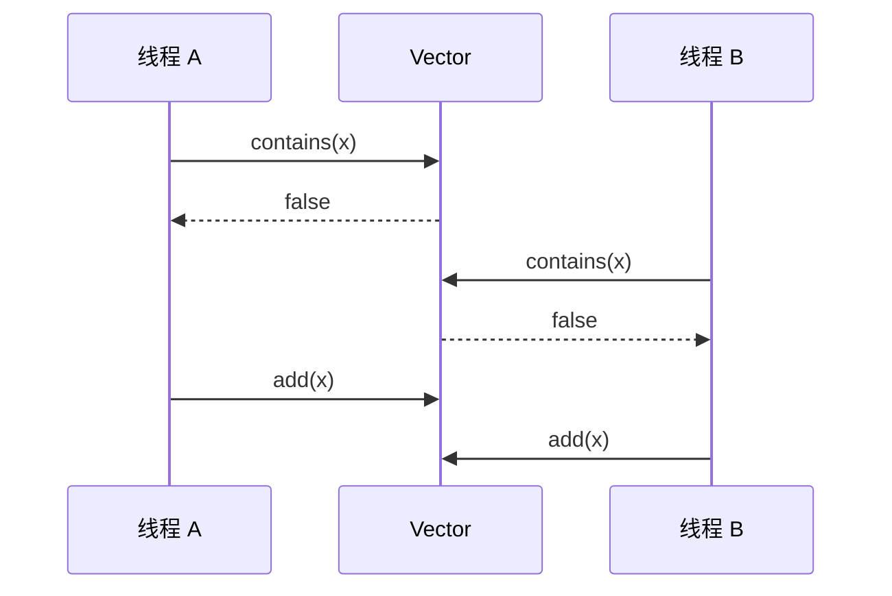

# 3.2.1.2 Vector

`java.util.Vector` 是一个可变长、按插入顺序保存元素、允许重复元素并支持随机访问的 `List` 实现。它最容易被记住的特征是“方法带同步”，但如果只停留在这句话上，就很容易同时误判它的数据结构成本和并发能力。理解 `Vector` 需要把两个层面分开：底层仍然是动态数组，决定了容量、移动、局部性和复杂度；同步主要围绕实例监视器展开，决定了单次调用的互斥与可见性，却不会自动把任意业务流程变成一个原子操作。

本文讨论 Java 标准库中的 `java.util.Vector`，不涉及任何特定平台。API 契约以 Java SE 文档为准；字段、扩容公式、迭代器内部检查等源码细节，主要依据 OpenJDK 8、17、21 中长期稳定的实现思路说明。不同 JDK 版本可能调整辅助方法、边界检查和内部类写法，因此不应把某一版源码的私有实现当成所有 Java 实现都必须遵守的规范。

## 历史定位：集合框架中的遗留同步列表

`Vector` 在 Java 集合框架形成之前就已经存在。后来它被改造为实现 `List`、`RandomAccess`、`Cloneable` 和 `Serializable`，于是一个类中同时保留了两套风格：

- 现代集合接口风格，如 `add`、`get`、`set`、`remove`、`iterator`；
- 早期命名风格，如 `addElement`、`elementAt`、`setElementAt`、`removeElementAt`、`elements`。

这些方法并不意味着存在两种不同的数据结构。它们最终操作的是同一个数组和同一个逻辑长度，只是在命名、异常细节和返回形式上承载了兼容性。`Vector` 仍被保留，主要是为了二进制兼容、源代码兼容、序列化兼容以及旧 API 的类型约束，而不是因为“同步动态数组”仍然是新代码中默认最优的并发列表设计。

历史定位应当帮助解释设计，而不是成为选择理由。一个系统使用时间很长，并不能证明它适合当前访问模式；同样，类比较老也不表示可以不经分析地替换。遗留代码可能依赖以下事实：

1. 方法调用会获取 `Vector` 实例的监视器。
2. 调用方可能显式使用 `synchronized (vector)` 扩大临界区。
3. 某些接口、反射代码或序列化数据要求具体类型是 `Vector`。
4. 旧代码可能通过 `Enumeration` 遍历，并依赖它不同于 `Iterator` 的行为。
5. 容量增长参数 `capacityIncrement` 可能被用于控制扩容节奏。

因此，维护 `Vector` 的正确态度不是“它线程安全，所以保留”，也不是“它过时，所以替换”，而是先识别现有并发协议和兼容契约，再决定是否迁移。

## 动态数组模型与核心不变量

从数据结构看，`Vector` 是典型的顺序表。以 OpenJDK 的经典实现为前提，它维护三个关键状态：

- `elementData`：保存元素引用的对象数组；
- `elementCount`：当前逻辑元素数量，也就是 `size()` 的基础；
- `capacityIncrement`：扩容时使用的固定增量；小于等于零时走倍增路径。

其中 `elementData.length` 是容量，`elementCount` 是大小。两者不能混为一谈。容量表示当前数组最多能容纳多少个元素而不重新分配，大小表示调用方能够通过合法下标观察到多少个元素。

在正常状态下，`Vector` 至少要维持以下不变量：

```text
0 <= elementCount <= elementData.length

合法元素区间：elementData[0 .. elementCount - 1]
空闲容量区间：elementData[elementCount .. elementData.length - 1]
```

对外可见的元素形成连续前缀，不允许在逻辑区间中留下由删除造成的“洞”。在中间位置插入元素时，需要把插入点之后的引用整体向右移动；删除中间元素时，需要把后续引用向左移动。删除完成后，原逻辑末尾位置通常会被置为 `null`，使已经移出的对象不再被内部数组错误地强引用。

这个模型直接解释了主要复杂度：

| 操作 | 不考虑锁竞争的典型复杂度 | 原因 |
| --- | --- | --- |
| `get(index)`、`set(index, value)` | O(1) | 通过数组偏移直接定位 |
| 尾部追加 | 均摊 O(1) | 大多数追加只写一个槽位，偶尔扩容复制 |
| 指定位置插入 | O(n) | 需要移动后缀元素 |
| 指定位置删除 | O(n) | 需要移动后缀元素并清理末尾 |
| `contains`、`indexOf` | O(n) | 通常按顺序调用相等性判断 |
| 遍历全部元素 | O(n) | 依次访问连续数组区域 |
| 扩容 | O(n) | 分配新数组并复制有效引用 |

所谓尾部追加“均摊 O(1)”，并不是每一次追加都为常数时间。它表示在合理的几何增长策略下，把少量 O(n) 扩容成本摊到一系列追加操作后，平均到每次追加的成本为常数量级。若使用很小的固定 `capacityIncrement`，这个结论的前提会被削弱，后文会进一步分析。

数组保存的是元素引用，不是元素对象本身。`Vector` 允许重复引用，也允许 `null`。对一个槽位执行 `set` 只替换引用，不会复制对象；多个槽位指向同一可变对象时，对象状态仍然共享。容器同步也只直接保护容器状态，不能自动保护元素对象中的字段。

## 容量、大小与显式容量管理

`Vector` 提供了比通常使用 `ArrayList` 时更显眼的容量控制接口，包括初始容量、`capacity()`、`ensureCapacity`、`trimToSize` 和 `setSize`。理解这些 API 的关键，是区分“存储空间变化”和“逻辑内容变化”。

### 初始容量

无参构造的 `Vector` 在传统 OpenJDK 实现中使用初始容量 10。也可以显式指定初始容量：

```java
Vector<String> names = new Vector<>(1_000);
```

这时 `names.size()` 仍为 0，而 `names.capacity()` 为 1,000。预分配数组不会创建 1,000 个元素对象，也不会让这些位置成为列表内容，只是提前准备引用槽位。若元素规模可以较准确估算，合理初始容量能够减少扩容次数和数组复制。

初始容量也不宜盲目放大。过大的数组会占用更多堆空间，并可能延长大对象存活时间。容量规划的目标是减少可预见的重复扩容，而不是消灭所有可能的扩容。

### 自动扩容与 `capacityIncrement`

在 OpenJDK 8、17、21 的典型实现思路中，当最小所需容量超过当前容量时，新容量大致按下面的规则计算：

```text
候选新容量 =
    旧容量 + capacityIncrement，若 capacityIncrement > 0
    旧容量 + 旧容量，若 capacityIncrement <= 0
```

随后实现还会检查候选容量是否达到最小需求，以及是否接近数组长度上限。上限处理、异常类型和辅助函数在不同 JDK 版本中可能有调整，因此工程代码只应依赖“容量足够容纳请求元素”的公开结果，不应依赖某个极端容量下的私有计算分支。

构造函数可以指定固定增长量：

```java
Vector<byte[]> blocks = new Vector<>(128, 64);
```

这个对象从容量 128 开始，容量不足时按 64 个槽位递增。固定增量的优点是空闲空间上界比较直观，缺点是规模持续增长时扩容越来越频繁。假设从较小容量增长到 `n`，每次只增加常数 `k`，大约需要 `n / k` 次扩容，而每次扩容又要复制越来越多的已有引用；累计复制量可能达到二次量级。倍增策略会预留更多空槽，但扩容次数是对数级，累计复制量通常保持在线性量级。

因此，`capacityIncrement` 不是一个通用的“节省内存开关”。只有在增长规模有限、步长有明确业务上界、内存峰值比复制成本更敏感，并且经过测量后，固定增量才可能有价值。对持续增长的列表，小增量经常以较差的写入延迟换取并不稳定的空间收益。

### `ensureCapacity` 与 `trimToSize`

`ensureCapacity(minCapacity)` 保证容量至少达到给定值，但不会改变逻辑大小。它适合在批量写入前一次性完成可能的扩容：

```java
Vector<String> values = new Vector<>();
values.ensureCapacity(source.size());
values.addAll(source);
```

这段代码的目的不是改变集合语义，而是避免批量追加过程中多次重新分配。是否值得调用仍取决于是否能够估算规模；如果来源很小或 `Vector` 已有足够容量，收益可能可以忽略。

`trimToSize()` 把容量收缩到接近当前大小。它可能分配更小的新数组并复制元素，因此不是零成本操作。若列表之后很快重新增长，收缩会造成一次复制，随后又触发扩容和再次复制。它更适合“构建完成后长期只读、空闲容量明显且内存值得回收”的阶段，而不适合频繁增删的热点路径。

### `setSize` 不是容量设置

`setSize(newSize)` 修改的是逻辑大小。增大时，新出现的逻辑位置以 `null` 填充；缩小时，被移除区间的引用会被清理。它和 `ensureCapacity` 的语义完全不同：

```java
Vector<String> values = new Vector<>(100);
values.setSize(3);

System.out.println(values.size());     // 3
System.out.println(values.capacity()); // 至少 100
System.out.println(values.get(0));     // null
```

如果只是希望减少后续扩容，不应调用 `setSize`，否则会真实改变列表内容。这个 API 保留了较强的早期容器风格，在现代业务代码中应谨慎使用，因为它可以制造大量合法的 `null` 元素，并让“大小等于已写入元素数”的直觉失效。

## 同步方法究竟保证了什么

`Vector` 的多数公开操作使用实例级同步。以 OpenJDK 实现为前提，常见读写方法通过 `synchronized` 方法或等价的内部同步，以当前 `Vector` 对象作为监视器。单次 `add` 执行时，另一个需要同一监视器的 `get`、`remove`、`size` 等调用不能同时进入临界区。

这一设计首先保护动态数组不变量。一次追加可能包含“检查容量、扩容、写入数组、递增 `elementCount`、更新结构修改计数”等多个步骤；同步确保遵守同一锁协议的其他线程不会观察到这些步骤中间的内部状态。一次删除中的数组移动、末尾清理和大小递减也在同一临界区完成。

同步还建立 Java 内存模型中的监视器关系：线程释放某个监视器之前的操作，先行发生于另一个线程随后成功获取同一监视器之后的操作。若线程 A 在进入并退出 `vector.add(value)` 前完成了对象初始化，线程 B 之后通过需要同一监视器的 `vector.get(index)` 取得该引用，那么这条锁链能够参与建立初始化写入对 B 的可见性。

但必须同时写清楚边界。`Vector` 的方法级同步主要保证：

1. 遵守同一监视器协议时，单个同步方法调用相对于其他同步调用互斥。
2. 单个方法内部维护数组、大小和结构修改计数时，不会被另一个同锁操作穿插破坏。
3. 同一监视器的释放与后续获取建立相应的可见性顺序。
4. 某些批量方法如果整体在一个同步方法中实现，其内部处理可以形成比逐元素外部调用更大的单次临界区；具体仍以 API 和 JDK 实现为准。

它不能自动保证：

1. 多次方法调用组合成原子事务。
2. 遍历期间列表保持固定不变。
3. 元素对象内部的可变字段线程安全。
4. 两个 `Vector` 或容器与其他状态之间的不变量原子更新。
5. 调用方在锁外保存的索引、引用、大小或判断结果持续有效。
6. 使用不同锁的外部代码与 `Vector` 内部同步形成互斥。
7. 所有并发场景都具有良好吞吐量或公平性。

“线程安全”如果不附带操作边界，就几乎没有工程指导价值。对 `Vector` 更准确的描述是：它为大量单方法操作提供内置互斥和可见性，但调用方仍需为复合动作、稳定遍历和跨对象一致性定义同步协议。

## 复合操作：单次安全不等于流程原子

考虑“若不存在则添加”：

```java
if (!vector.contains(value)) {
    vector.add(value);
}
```

`contains` 和 `add` 分别是安全的，不代表这段流程原子。可能发生如下交错：



最终列表中出现两个 `x`，而且这并不违反 `Vector` 允许重复元素的契约。若业务要求检查和插入之间不可穿插，可以显式锁定同一个实例：

```java
synchronized (vector) {
    if (!vector.contains(value)) {
        vector.add(value);
    }
}
```

这里必须锁 `vector` 本身，才能与其同步方法使用同一监视器。锁一个无关对象只能约束同样锁那个对象的代码，无法阻止其他线程直接调用 `vector.add`。

类似问题还包括：

```java
if (!vector.isEmpty()) {
    return vector.remove(vector.size() - 1);
}
```

另一个线程可以在 `isEmpty`、`size` 和 `remove` 之间修改列表，导致删除错误元素或抛出下标异常。正确方式仍是把整个逻辑放在同一临界区：

```java
static <E> E removeLast(Vector<E> vector) {
    synchronized (vector) {
        if (vector.isEmpty()) {
            return null;
        }
        return vector.remove(vector.size() - 1);
    }
}
```

外部加锁虽然能补全原子性，但也扩大了锁的职责。临界区中不应执行不受控回调、阻塞 I/O 或耗时计算，否则所有访问同一 `Vector` 的同步操作都可能被长时间阻塞。较好的模式是在锁内只读取或更新必要状态，在锁外处理昂贵工作：

```java
List<Task> batch;
synchronized (tasks) {
    batch = new ArrayList<>(tasks);
    tasks.clear();
}

process(batch); // 在锁外执行
```

复制是否合适取决于数据量和一致性需求，但这个示例体现了重要原则：监视器保护共享状态转换，不应顺便包住与共享状态无关的长操作。

## 遍历不是一个方法调用

遍历本质上由多个步骤组成：取得遍历器、判断是否还有元素、读取下一个元素、执行循环体。即使每一步中的部分实现带同步，整个遍历也不是自动原子的。

最直观的下标循环同样存在窗口：

```java
for (int i = 0; i < vector.size(); i++) {
    use(vector.get(i));
}
```

`size()` 返回后锁已经释放。另一个线程可以删除元素，使先前合法的 `i` 在 `get(i)` 时越界；也可以插入或移动元素，使循环重复、遗漏或观察到混合时刻的数据。逐次获取锁只能保护每次调用，不能冻结整个序列。

如果需要稳定地遍历某一时刻的内容，通常有两种基本方案。

第一种是遍历期间持有 `Vector` 的监视器：

```java
synchronized (vector) {
    for (String value : vector) {
        use(value);
    }
}
```

这能阻止遵守同一锁协议的结构修改，但循环体也处于锁内。`use` 必须足够短、可控，并且不能形成复杂锁顺序，否则会放大竞争甚至引入死锁风险。

第二种是在短临界区内创建快照，然后在锁外遍历：

```java
List<String> snapshot;
synchronized (vector) {
    snapshot = new ArrayList<>(vector);
}

for (String value : snapshot) {
    use(value);
}
```

快照增加了 O(n) 时间和额外数组空间，但把后续处理从共享锁中移出。它给出的是复制时刻的内容，不反映复制后的修改。若业务真正需要快照语义，这通常比长期持锁更容易推理。

## Enumeration、Iterator 与 ListIterator

`Vector` 同时提供三类遍历接口，它们的能力和并发修改语义不同，不能因为都能“逐个取元素”就互相等同。

### `Enumeration`

`elements()` 返回早期接口 `Enumeration<E>`。它只有 `hasMoreElements` 和 `nextElement`，不提供删除、替换或向前移动能力。按照 `Vector` 的 API 说明，返回的 `Enumeration` 不是 fail-fast。OpenJDK 的典型实现会在读取计数和元素时针对 `Vector` 实例同步，但不会像现代迭代器那样比较预期修改计数。

这意味着并发结构修改时，它不一定抛出 `ConcurrentModificationException`。但“不抛异常”绝不等于“得到稳定快照”或“并发遍历安全”。它可能看到部分后续变化，可能因为删除和移动而跳过或重复某些逻辑位置，也可能在竞争条件下结束于不同边界。公开契约没有承诺一个固定的并发观察模型，调用方不应利用偶然结果构造正确性。

```java
Enumeration<String> enumeration = vector.elements();
while (enumeration.hasMoreElements()) {
    use(enumeration.nextElement());
}
```

若旧接口必须接收 `Enumeration`，可以继续使用；若需要稳定遍历，仍应外部锁定或先复制快照，而不是把“不会 fail-fast”误认为更强的并发保证。

### `Iterator`

`iterator()` 返回单向迭代器。它支持 `hasNext`、`next`，并允许通过迭代器自身的 `remove` 删除最近返回的元素。`Vector` 的迭代器属于 fail-fast 迭代器：创建时记录结构修改计数的期望值，在后续关键操作中发现计数不一致时，尽力快速抛出 `ConcurrentModificationException`。

正确的单线程删除方式是：

```java
Iterator<String> iterator = vector.iterator();
while (iterator.hasNext()) {
    String value = iterator.next();
    if (value.isBlank()) {
        iterator.remove();
    }
}
```

若改为在循环中调用 `vector.remove(value)`，就绕过了迭代器对自身预期状态的更新，后续操作通常会检测到结构修改并抛异常。

### `ListIterator`

`listIterator()` 或 `listIterator(index)` 返回双向迭代器。除向前遍历外，它可以向后遍历，报告前后索引，并通过迭代器执行 `add`、`set`、`remove`。这些修改方法会按迭代器协议更新游标和预期修改计数，因此适合在单线程或受正确外部同步保护的遍历中进行局部编辑。

```java
ListIterator<String> iterator = vector.listIterator();
while (iterator.hasNext()) {
    String value = iterator.next();
    if (value == null) {
        iterator.set("<missing>");
    } else if (value.isEmpty()) {
        iterator.remove();
    }
}
```

`set` 通常不是结构性修改，因为列表大小不变；`add` 和 `remove` 会改变结构。是否触发 fail-fast 的关键是实现维护的结构修改定义，而不是“任何值发生变化”。

### 三者的选择边界

| 遍历方式 | 方向 | 通过遍历器修改 | fail-fast | 适合场景 |
| --- | --- | --- | --- | --- |
| `Enumeration` | 向前 | 不支持 | 否 | 兼容旧 API |
| `Iterator` | 向前 | `remove` | 是，尽力检测 | 常规单向遍历 |
| `ListIterator` | 双向 | `add`、`set`、`remove` | 是，尽力检测 | 需要游标和局部编辑 |

如果并发写入是正常工作模式，这三种遍历接口都不应被想象成专用并发迭代器。稳定快照、弱一致观察和锁内遍历是三种不同语义，需要通过适合的容器或同步方案明确选择。

## fail-fast 是错误探测，不是并发控制

fail-fast 的目标是尽早暴露“迭代期间发生了未通过该迭代器协调的结构修改”。OpenJDK 中通常通过继承自抽象集合层次的 `modCount` 与迭代器保存的 `expectedModCount` 比较实现。新增、删除等结构性操作会推进修改计数；迭代器在 `next`、`remove` 等路径检查两者是否一致。

这个机制有三个重要边界。

第一，它是尽力而为的错误检测。Java 集合文档通常明确指出，不能以是否抛出 `ConcurrentModificationException` 作为程序正确性的基础。并发执行的精确时序、检查位置和内存可见性都可能影响异常是否出现。

第二，它不是锁。即使某次并发修改被检测并抛出异常，结构修改本身也可能已经合法完成。异常提醒调用方遍历假设失效，并不会回滚修改，也不会给循环提供事务语义。

第三，它主要针对结构性修改。替换某个位置的元素但不改变大小，可能不增加结构修改计数；不同 JDK 实现和具体方法仍应以契约与源码为准。因此，fail-fast 不能用于检测所有内容变化。

下面的代码是错误的，即使在测试中偶尔没有异常：

```java
for (String value : vector) {
    if (shouldDelete(value)) {
        vector.remove(value);
    }
}
```

正确选择取决于目的：单线程遍历删除时使用 `Iterator.remove`；需要并发稳定内容时加外部锁或复制快照；需要遍历和写入长期并行时重新评估容器，而不是捕获并忽略 `ConcurrentModificationException`。

## `subList`：视图、共享存储与同步边界

`subList(fromIndex, toIndex)` 返回的是区间视图，不是独立副本。视图与原列表共享底层数据，范围采用左闭右开形式。通过视图修改元素会反映到原 `Vector`，通过原列表在对应位置修改也会被视图观察到：

```java
Vector<String> vector = new Vector<>(List.of("A", "B", "C", "D"));
List<String> middle = vector.subList(1, 3);

middle.set(0, "X");
System.out.println(vector); // [A, X, C, D]
```

视图通常保存父列表、范围和结构修改预期，而不是复制 `"B"`、`"C"` 到新数组。因此它具有几个容易忽略的后果。

首先，小视图可能让整个大列表继续存活。只要视图仍然引用父结构，父 `Vector` 及其底层数组就可能无法回收。若只需要长期保留少量数据，应显式复制：

```java
List<String> detached = new ArrayList<>(vector.subList(1, 3));
```

其次，在创建视图后，如果父列表通过视图之外的路径发生结构性修改，视图的后续行为通常会失效，并可能抛出 `ConcurrentModificationException`。API 对某些越过视图进行的结构修改不提供可继续使用的保证。不能把视图当成会自动追踪任意父列表变化的“动态窗口”。

再次，同步问题不会因为返回类型是 `List` 而消失。OpenJDK 的 `Vector.subList` 典型实现会返回一个同步包装的子列表，并让它与父 `Vector` 使用同一互斥对象，从而使单方法调用继续参与相同锁协议。这是重要的实现安排，但稳定遍历仍然是复合操作。对于明确来自 `Vector.subList` 的视图，若需要把父列表和子列表操作组成原子动作，外部应锁定父 `Vector`：

```java
synchronized (vector) {
    List<String> view =
            vector.subList(0, Math.min(10, vector.size()));
    for (String value : view) {
        use(value);
    }
}
```

不要随意分别锁 `vector` 和 `view` 来维护同一数据的不变量。即使某个 OpenJDK 包装实现内部共享互斥对象，调用方也不应从接口类型猜测不可见的锁；明确持有父 `Vector` 的代码更能表达共享存储和同步边界。

最后，`subList(...).clear()` 是一个常用的范围删除技巧：

```java
synchronized (vector) {
    vector.subList(fromIndex, toIndex).clear();
}
```

对数组结构而言，范围删除仍需要移动后缀，但可以一次完成连续区间处理。显式同步使索引检查、创建视图和清理区间处于同一个临界区，避免范围在中途被其他线程改变。

## 可见性、发布与元素状态

`Vector` 的同步能力不仅是“同一时刻只有一个线程执行方法”，还涉及内存可见性。若所有共享访问都通过同一个 `Vector` 监视器协调，那么前一个临界区中的写入会对随后获得该监视器的线程可见。

例如：

```java
final class Record {
    int value;
}

Vector<Record> records = new Vector<>();

// 线程 A
Record record = new Record();
record.value = 42;
records.add(record);

// 线程 B：在 add 完成后，通过同步的 Vector 操作取得元素
Record observed = records.get(0);
System.out.println(observed.value);
```

在具备正确时序的前提下，A 在释放 `Vector` 监视器前的初始化写入，与 B 随后获取同一监视器后的读取之间可以形成先行发生关系。这里不能忽略“add 已完成且 get 随后获取同一监视器”这一条件。

但是，一旦引用离开容器锁，`Vector` 不再自动管理对象后续变化：

```java
Record observed = records.get(0);
observed.value++; // 这次修改没有因为对象来自 Vector 就自动同步
```

如果多个线程在锁外修改 `Record.value`，仍然需要不可变对象、`final` 字段、`volatile`、原子变量或额外锁等适当机制。容器线程安全与元素线程安全是两个独立问题。

同样，保存一个下标也不受保护：

```java
int index = vector.indexOf(target);
// 这里锁已释放，列表可能变化
if (index >= 0) {
    vector.set(index, replacement);
}
```

即使每个调用都同步，`index` 只是过去某一时刻的结果。另一个线程可能在前面插入或删除元素，使该下标指向不同对象。若“查找并替换目标”必须原子，应把两步放在同一 `synchronized (vector)` 中。

安全发布 `Vector` 本身也不能被忽略。把它写入共享普通字段后让其他线程无同步读取该字段，可能连容器引用的可见性都没有正确保证。可以通过 `final` 字段构造发布、`volatile` 引用、静态初始化、线程安全队列或锁来发布。对象内部方法带同步，不代表对象引用可以通过任意数据竞争方式安全传递。

## 性能：数组成本之外还有共享锁

在单线程下，`Vector` 与 `ArrayList` 都以数组为核心，缓存局部性、随机访问、中间移动等特征相近。差别主要来自同步路径、历史 API 和部分容量策略。简单地说“`Vector` 一定慢”不够准确：现代 JVM 对无竞争监视器有持续优化，小规模、低频调用中的差异可能不重要；但同步语义客观存在，不能假设运行时会把所有锁消除。

真正的问题通常出现在共享热点实例上。同一个 `Vector` 的大量同步方法竞争同一监视器，会产生以下影响：

- 并行调用被串行化，可扩展性受单锁限制；
- 线程可能阻塞、唤醒或发生调度切换；
- 高频短操作也会在竞争下形成锁队列；
- 外部长临界区会阻塞所有遵守同一锁协议的访问；
- 批量操作、相等性比较或回调若在锁内执行，锁持有时间会被元素逻辑放大。

需要特别关注元素方法。`contains`、`indexOf`、`remove(Object)` 等操作可能调用元素的 `equals`；排序可能调用比较器；某些批量操作可能执行调用方提供的函数。具体方法是否以及如何在锁内调用外部代码，要依据目标 JDK 的 API 与实现检查。只要外部逻辑在持锁期间执行，就可能带来耗时不可控、重入或锁顺序问题。

动态数组本身的移动并不一定低效。连续引用复制通常能够使用高度优化的数组复制路径，CPU 缓存局部性也优于分散节点结构。不能因为中间删除是 O(n)，就直接认为链表更快；如果定位删除位置本身需要 O(n)，加上节点分配和缓存不命中，实际结果可能相反。应根据数据规模、读写比例、插入位置和线程竞争测量，而不是只比较大 O。

容量策略也会影响尾延迟。一次扩容需要分配新数组并复制引用，可能产生明显的单次停顿；固定小增量会让这种停顿更频繁。已知规模时预设容量，往往比事后依赖频繁扩容更有效。另一方面，过大的长期容量会提高内存占用，并增加垃圾回收扫描和保留压力。性能判断必须同时考虑时间和空间。

## 遗留代码中的兼容性审查

替换 `Vector` 前，应把“类型兼容”“行为兼容”“并发兼容”分开审查。

类型兼容关注接口和二进制边界。公开方法是否声明返回 `Vector`，反射是否查找具体构造器，第三方库是否只接受 `Vector`，序列化数据是否记录了该类描述，这些都可能使直接替换变成不兼容变更。即使源码能够重新编译，跨版本数据和未重新编译的调用方也可能受到影响。

行为兼容关注顺序、重复、`null`、异常和遍历。`Vector` 保持索引顺序、允许重复和 `null`；旧方法与 `List` 方法在异常类型等细节上可能存在差异。旧代码使用 `Enumeration` 时，替换为普通迭代器可能新增 fail-fast 行为。调用方若使用 `capacity()` 或固定 `capacityIncrement`，替代类型可能没有等价 API。

并发兼容最容易被低估。需要搜索的不只是 `vector.add`，还包括：

```java
synchronized (vector) {
    // 多步不变量
}
```

如果改成 `Collections.synchronizedList(new ArrayList<>())`，外部同步必须锁包装后的列表对象，而不是底层 `ArrayList`。如果改成 `CopyOnWriteArrayList`，原有 `synchronized (vector)` 协议不会自然迁移，而且迭代器语义从 fail-fast 变为快照。若直接改成 `ArrayList`，原先依赖单方法互斥的并发调用会失去保护。

迁移时至少应执行以下步骤：

1. 查找具体类型出现在字段、参数、返回值、反射和序列化中的位置。
2. 查找所有 `synchronized` 块，确认锁对象和受保护不变量。
3. 查找 `elements()`、`capacity()`、`setSize()` 等专有 API。
4. 识别遍历期间修改、检查后执行和跨容器事务。
5. 明确替代方案的迭代一致性、空值、顺序和异常语义。
6. 用并发测试和真实负载验证，不以“替换后能编译”作为完成标准。

## 与相近方案的选择

### `ArrayList`

`ArrayList` 同样是动态数组，但不提供 `Vector` 的内置方法级同步。以下情况通常优先选择它：

- 集合只在线程内使用；
- 集合构建完成后通过安全方式发布并保持只读；
- 外层组件已经用锁保护一组更大的状态，容器无需重复承担独立锁协议；
- 需要最普通、最易理解的 `List` 实现。

若所有访问本来就必须处于某个业务锁内，使用 `ArrayList` 往往比让 `Vector` 再引入一个可被误解的内部锁更清晰。但不能只把类型名替换掉而保留无锁并发访问。

### `Collections.synchronizedList`

`Collections.synchronizedList(new ArrayList<>())` 提供与 `Vector` 类似的同步包装思路：常见单方法调用通过包装对象的互斥锁协调。它更适合需要以现代接口和装饰器方式表达“这个列表需要同步”的代码。

```java
List<String> list =
        Collections.synchronizedList(new ArrayList<>());
```

它仍然不能自动解决复合操作和遍历。稳定遍历时，必须锁包装后的 `list`：

```java
synchronized (list) {
    for (String value : list) {
        use(value);
    }
}
```

不要锁创建时传入的底层 `ArrayList`。外部通常也不应保留并绕过包装器访问底层列表，否则同步协议会被破坏。

同步包装与 `Vector` 都采用粗粒度互斥，扩展性特征相近。选择同步包装的主要理由是类型设计更现代、底层实现可组合，而不是它能神奇地消除锁竞争。

### `CopyOnWriteArrayList`

`CopyOnWriteArrayList` 适合读远多于写、列表规模可控、遍历稳定性重要的场景。每次结构修改通常复制底层数组，写入成本和瞬时内存成本较高；读取和遍历则不需要像 `Vector` 那样围绕同一监视器串行化。它的迭代器基于创建时的数组快照，不会看到之后的修改，也不会以同样方式 fail-fast。

它不是“更快的 Vector”。若写入频繁、列表很大或元素更新对实时可见性要求高，复制成本可能无法接受。快照迭代器也不支持通过迭代器删除。只有访问模式匹配时，它才是合适选择。

### 其他并发集合

Java 并没有一个能在所有场景直接替代同步 `List` 的通用结构。需求往往可以进一步拆解：

- 需要并发队列语义时，考虑 `ConcurrentLinkedQueue`、阻塞队列等；
- 需要按键并发访问时，考虑 `ConcurrentHashMap`；
- 需要有序集合但写入受控时，考虑不可变快照；
- 需要原子地维护多个字段或多个容器时，使用显式锁封装整个状态；
- 需要高并发随机索引读写时，先确认“列表”是否真是合适抽象。

并发容器的关键不是名字中有 `Concurrent`，而是它承诺的原子操作、迭代一致性和进度特征是否与业务匹配。

## 决策矩阵

| 需求 | 通常更合适的起点 | 需要特别确认 |
| --- | --- | --- |
| 单线程或外部已统一加锁 | `ArrayList` | 所有访问是否确实受同一外部协议保护 |
| 需要简单方法级互斥 | `Collections.synchronizedList` | 复合操作和遍历仍需外部同步 |
| 遗留 API 明确要求 `Vector` | `Vector` | 具体类型、序列化、旧方法和外部锁依赖 |
| 读极多、写极少、需要快照遍历 | `CopyOnWriteArrayList` | 写复制成本、列表规模、快照延迟 |
| 生产者消费者或等待/唤醒 | 并发队列或阻塞队列 | 容量、背压、中断和超时语义 |
| 多结构共同保持不变量 | 显式锁封装状态 | 锁顺序、临界区大小、异常路径 |

这个表不是按类的新旧程度排序，而是按语义匹配。若需求只是“多个线程可能碰到它”，信息仍然不足；还要回答读写比例、操作组合、遍历一致性、元素规模、延迟目标和兼容边界。

## 常见误区

### “Vector 的每个方法都同步，所以任何用法都线程安全”

错误。方法级同步不覆盖调用之间的窗口。检查后执行、读取大小后按下标操作、遍历和跨容器更新都可能需要更大的临界区。

### “Enumeration 不抛并发修改异常，所以比 Iterator 更适合并发”

错误。它只是不提供同样的 fail-fast 检测，不承诺稳定快照或弱一致语义。异常更少不表示保证更强。

### “捕获 ConcurrentModificationException 后重试即可”

错误。fail-fast 不是并发协调机制。盲目重试可能持续竞争、重复副作用或隐藏错误的共享协议。应明确选择锁、快照或并发容器。

### “从 Vector 取出的对象也是线程安全的”

错误。同步保护的是容器操作。元素对象的可变状态需要自己的线程安全设计。

### “capacity 越接近 size 越省内存，因此应经常 trimToSize”

错误。频繁收缩和重新扩容会反复分配与复制。容量应根据生命周期和增长模式管理。

### “固定 capacityIncrement 能避免浪费，所以性能更好”

不一定。小固定增量可能显著增加扩容次数和累计复制量。它只在明确约束下有意义。

### “把 Vector 换成同步包装不会改变行为”

不完整。常用列表语义可能相近，但具体类型、旧 API、序列化、锁对象和外部同步代码都可能变化。

### “把 Vector 换成 ArrayList，再给写方法加锁就够了”

错误。读取、遍历、检查后执行和安全发布都属于并发协议。只保护部分写入会留下数据竞争或时序漏洞。

## 一套可执行的分析方法

阅读或设计涉及 `Vector` 的代码时，可以按以下顺序判断。

先确认所有权。列表属于单线程、单组件，还是跨线程共享？调用方是否持有引用并能直接修改？返回的是副本、只读视图还是活动视图？所有权不清时，任何线程安全结论都不稳固。

再列出操作单位。业务需要的原子动作是单次 `add`，还是“若不存在则添加”“取出并删除”“更新列表同时更新计数器”？如果原子动作跨越多个方法，内置同步只能作为构建块，不能直接给出最终保证。

然后确定遍历语义。允许看到混合时刻的数据，要求创建时快照，还是要求遍历期间完全禁止写入？这三个目标分别导向不同方案，不能只靠选择一种循环语法解决。

接着量化访问模式。列表规模多大，读写比例如何，插入删除集中在哪里，线程数多少，锁内是否调用外部逻辑？没有这些数据时，“性能更好”的结论通常只是猜测。

最后审查兼容边界。若是遗留系统，具体类型、序列化、`Enumeration`、容量 API 和外部锁都可能是隐藏契约。先测试行为，再迁移实现。

## 总结

`Vector` 的本质是带实例级同步协议的动态数组。动态数组决定了它以连续引用区间保存元素，随机访问为常数时间，中间插入删除需要移动，扩容需要重新分配和复制；`capacityIncrement` 决定使用固定增量还是近似倍增，也决定持续增长时的扩容频率与空间余量。

它的同步方法能够保护单次操作中的内部不变量，并通过同一监视器建立互斥和可见性关系。但同步不会跨越方法调用自动延续：复合操作、稳定遍历、子列表协作、元素状态以及跨容器不变量，都需要调用方定义更完整的协议。`Enumeration` 不 fail-fast，`Iterator` 和 `ListIterator` 通常尽力检测结构修改；fail-fast 只是错误探测，不能代替锁或并发容器。`subList` 是共享父列表存储的视图，不是副本，也会把结构修改和生命周期耦合到父列表。

在新代码中，单线程或已有外部锁时通常从 `ArrayList` 开始；需要简单同步包装时考虑 `Collections.synchronizedList`；读多写少且需要快照遍历时评估 `CopyOnWriteArrayList`；需求实际是队列、映射或多状态事务时选择相应并发结构或显式锁。`Vector` 最合理的保留场景通常是明确的遗留兼容和已被充分理解的同步协议。选择的依据不应是“旧”或“线程安全”这样的标签，而应是数据结构不变量、原子操作边界、迭代语义、内存可见性和真实访问模式。
