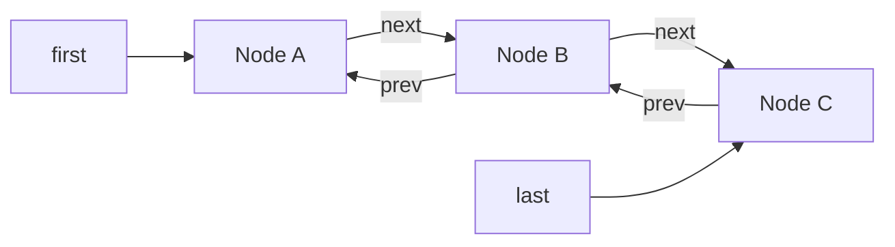

# 3.2.1.4 LinkedList

`java.util.LinkedList` 是 Java 集合框架中一个容易被“数据结构口诀”误导的类。它确实以双向链表保存元素，也确实能在已经找到节点时用常数次引用修改完成插入和删除；但调用者通常拿不到内部节点，只能通过下标、值、迭代器或队列端点操作它。因此，判断 `LinkedList` 是否合适，不能只看“链表插入删除是 O(1)”，而要把定位成本、节点分配、遍历局部性、接口语义和并发边界一起计算。

从类型体系看，`LinkedList<E>` 继承 `AbstractSequentialList<E>`，实现 `List<E>`、`Deque<E>`、`Cloneable` 和 `Serializable`。这使同一个对象同时具有两套主要语义：作为 `List`，它是有顺序、允许重复、允许按位置操作的线性表；作为 `Deque`，它是可以从两端加入、查看和移除元素的双端队列。两套接口共享同一条链，但推荐的访问方式和性能预期并不相同。很多误用正是因为代码声明成 `List`，随后把动态数组式的下标访问习惯原样套到了链表上。

本文讨论通用 Java 场景，不涉及任何特定平台实现。涉及源码字段和辅助方法时，以 OpenJDK 21 的 `java.util.LinkedList` 为主要观察对象；文中所述 `first`、`last`、`size`、`Node`、`modCount`、双向遍历定位以及 `ListItr` 等结构，也适用于 OpenJDK 8、11、17 的常见实现。除非特别说明，这些源码细节属于指定 OpenJDK 版本的实现事实，不是 `List` 或 `Deque` 接口要求所有实现必须采用的内部布局。API 的可见行为仍应以所使用 JDK 版本的 Java SE 文档为准。

## 一条双向链及其不变量

OpenJDK 21 的实现没有哨兵节点，而是直接维护首节点引用 `first`、尾节点引用 `last` 和元素数量 `size`。每个内部节点 `Node<E>` 保存三个引用：元素 `item`、前驱 `prev` 和后继 `next`。空链表不含节点；非空链表的首尾节点也是真实元素节点。

```java
// 根据 OpenJDK 21 LinkedList 的结构简化，仅用于解释关系。
private static class Node<E> {
    E item;
    Node<E> next;
    Node<E> prev;
}

transient int size;
transient Node<E> first;
transient Node<E> last;
```

这三个顶层字段与节点链接必须共同满足一组不变量。理解这些不变量，比逐个记忆公开方法更能解释实现：

1. 当 `size == 0` 时，`first == null` 且 `last == null`。
2. 当 `size > 0` 时，`first != null` 且 `last != null`。
3. 首节点没有前驱，即 `first.prev == null`；尾节点没有后继，即 `last.next == null`。
4. 对链中任意相邻节点 `x` 和 `y`，如果 `x.next == y`，那么 `y.prev == x`；反向关系同理。
5. 从 `first` 连续跟随 `next` 最终能够到达 `last`，从 `last` 连续跟随 `prev` 最终能够到达 `first`。
6. 从任一方向可达的节点数量都应等于 `size`，且链中不应出现环。



图中的 `first` 和 `last` 是容器字段，节点之间才由 `next` 与 `prev` 双向连接。实际实现中，`last` 直接引用尾节点，而不是尾节点再指向一个名为 `last` 的对象；图中从 `last` 指向 `Node C` 的箭头表达尾字段的定位关系。首节点的 `prev` 与尾节点的 `next` 都为 `null`。

一次插入或删除往往要修改多个引用。以在两个节点之间插入新节点为例，需要让新节点记录原前驱与原后继，再让原前驱的 `next` 和原后继的 `prev` 改指向新节点；若插入发生在边界，还要更新 `first` 或 `last`。这些写入在单线程顺序执行时能够恢复全部不变量，但它们不是一个不可分割的原子动作。另一个没有同步的线程可能观察到修改中间状态，这也是 `LinkedList` 不能靠“单个引用写入具有原子性”获得线程安全的根本原因。

`size` 是单独维护的计数，不需要每次遍历链表，因此 `size()` 是 O(1)。不过，常数时间知道长度并不等于常数时间定位第 `i` 个节点。长度只回答“有多少个元素”，并没有建立从整数下标到节点地址的直接映射。

## `List` 与 `Deque` 的双重语义

作为 `List`，`LinkedList` 保留插入顺序，允许重复元素，也允许 `null`。它支持 `get(index)`、`set(index, element)`、`add(index, element)`、`remove(index)`、`indexOf` 和 `listIterator` 等位置化操作。这里的“支持”是语义上的：调用结果符合列表契约；它不代表这些操作具有数组列表那样的随机访问成本。`LinkedList` 没有实现标记接口 `RandomAccess`，泛型算法可以据此识别它更适合顺序访问。

作为 `Deque`，同一个对象暴露两端操作。常用方法可以分成三组：

| 目的 | 抛异常的方法 | 返回特殊值的方法 |
| --- | --- | --- |
| 队首插入 | `addFirst(e)` | `offerFirst(e)` |
| 队尾插入 | `addLast(e)` | `offerLast(e)` |
| 队首读取 | `getFirst()` / `element()` | `peekFirst()` / `peek()` |
| 队尾读取 | `getLast()` | `peekLast()` |
| 队首移除 | `removeFirst()` / `remove()` | `pollFirst()` / `poll()` |
| 队尾移除 | `removeLast()` | `pollLast()` |

`LinkedList` 没有容量上限，所以在正常内存条件下，`offerFirst` 和 `offerLast` 不会因为队列已满而返回 `false`，通常都会完成插入并返回 `true`。但是，`Deque` 的这组方法仍保留了有界队列通用的接口形态。调用方若只依赖 `Deque`，以后可以替换为容量策略不同的实现，而不必把具体类传播到业务边界。

栈语义也建立在队首：`push(e)` 等价于 `addFirst(e)`，`pop()` 等价于 `removeFirst()`，`peek()` 查看队首。若使用 `LinkedList` 模拟栈，栈顶位于链表头部；若使用它模拟先进先出队列，通常从尾部 `offer`、从头部 `poll`。这些别名方法不会创建第二套存储，最终都落到首尾链接路径。

`null` 是双重语义中的一个重要冲突点。`LinkedList` 作为 `List` 明确允许存储 `null`，作为 `Deque` 实现也没有禁止它。但是 `peek`、`peekFirst`、`peekLast`、`poll` 等方法用 `null` 表示“队列为空”。一旦队列中真的存入 `null`，调用方仅看返回值就无法区分“成功取到一个空元素”和“容器原本为空”。因此，虽然具体类允许，使用队列语义时仍应避免 `null`，并让空值约束在 API 契约中明确下来。`ArrayDeque` 直接禁止 `null`，恰好消除了这种歧义。

声明变量时应让类型表达真正需要的能力。如果只需要双端队列，应声明为 `Deque<E>`；如果需要列表位置语义，则声明为 `List<E>`。直接把字段或参数声明为 `LinkedList<E>`，等于同时向调用方暴露下标、队列、栈和具体实现替换成本，往往扩大了不必要的耦合。

```java
Deque<String> tasks = new LinkedList<>();
tasks.offerLast("compile");
tasks.offerLast("test");

String next = tasks.pollFirst(); // "compile"
```

这段代码表达的是先进先出队列，而不是“恰好有一个链表”。不过，仅从实现选择看，若不需要保存 `null`、列表下标或迭代器中间插入能力，普通单线程队列通常更应先评估 `ArrayDeque`。

## 首尾链接：真正的常数时间路径

OpenJDK 21 把核心修改集中在少数私有辅助路径中：链接到首部、链接到尾部、链接到指定后继节点之前，以及解除首节点、尾节点或任意节点的链接。公开 API 的大量别名最终只是选择这些基础操作。

尾插可以抽象为以下步骤：

1. 保存旧尾节点。
2. 创建新节点，其 `prev` 指向旧尾，`next` 为 `null`。
3. 把 `last` 更新为新节点。
4. 如果旧尾为空，说明此前是空表，同时令 `first` 指向新节点；否则令旧尾的 `next` 指向新节点。
5. 增加 `size` 和结构修改计数。

头插是镜像过程。它们只检查和改写固定数量的字段，不随已有元素个数增长，因此 `addFirst`、`addLast`、`offerFirst`、`offerLast` 以及无下标的 `add(e)` 都是 O(1)。无下标 `add(e)` 在列表语义中追加到末尾，最终走尾插路径。

移除首节点时，先保存其元素和后继节点，再把 `first` 改为后继。如果后继为空，移除的是唯一节点，需要同时把 `last` 设为 `null`；否则把新首节点的 `prev` 设为 `null`。实现还会把被移除节点的 `item`、`next` 等引用清空。移除尾节点执行对称步骤。

清空已删除节点中的引用不是列表可见语义的必要条件，却有明确的内存管理价值：只要外部没有其他引用，节点与原元素就可以更早失去从容器出发的可达路径。垃圾回收器负责最终回收对象，`LinkedList` 并不是手工释放内存；实现所做的是停止继续持有不需要的引用。

任意节点删除在“节点已经定位”的前提下同样只需固定数量的引用更新：

1. 记录待删除节点的前驱和后继。
2. 若前驱为空，更新 `first`；否则令前驱的 `next` 跳过待删除节点。
3. 若后继为空，更新 `last`；否则令后继的 `prev` 跳过待删除节点。
4. 清空待删除节点中的元素、前驱和后继引用。
5. 减少 `size` 并记录结构修改。

这里必须保留前提“节点已经定位”。标准 `LinkedList` 不向调用者暴露 `Node`，因此 `remove(index)` 要先按下标定位，`remove(object)` 要先按值扫描。公开方法的总成本是定位成本加解除链接成本，而不能只拿最后几次指针改写来宣传 O(1)。

## 中间插入与删除的完整成本

`add(index, element)` 允许 `index == size`，此时相当于尾插；其他合法位置要先找到原来位于该下标的节点，再把新节点链接到它之前。`remove(index)` 先找到下标对应节点，再解除链接。`set(index, element)` 虽不改变节点数量，也必须先找到节点，然后替换其 `item`。

因此，靠近中间的位置操作通常是 O(n)。更精确地说，双向链表会从更近的一端开始，定位最多走大约半条链；这降低了遍历步数的常数，但没有改变线性复杂度。对长度为 `n` 的列表，在中点附近插入一次，新建和链接节点是 O(1)，寻找插入点仍是 O(n)。

按对象删除也不能跳过查找。`remove(Object)` 从头向后寻找第一个相等元素并删除它。由于列表允许 `null`，实现通常区分目标是否为 `null`：目标为 `null` 时比较节点元素是否也为 `null`；否则调用目标的 `equals` 进行比较。`contains`、`indexOf` 和 `lastIndexOf` 也依赖线性扫描，后者从尾部反向扫描。

“链表适合频繁中间删除”只有在位置获取方式同时成立时才准确。例如，遍历过程中已经由 `ListIterator` 持有当前位置，随后删除刚返回的元素，不需要从链表端点重新查找，这时删除链接本身是 O(1)。相反，以下循环每次都从端点重新定位下标，不能体现链表优势：

```java
for (int i = 0; i < list.size(); i++) {
    process(list.get(i));
}
```

若列表有 `n` 个元素，第 `i` 次 `get(i)` 的定位成本随位置变化。把所有定位相加，整体是 O(n²)，即使每次 `get` 都选择较近端点也不改变二次量级。正确的顺序遍历应使用增强 `for`、`Iterator`、`ListIterator`、`forEach` 或显式沿队列端点消费。

```java
for (String value : list) {
    process(value);
}
```

增强 `for` 背后的迭代器保留下一节点引用，每前进一步只需沿一个 `next` 链接移动，因此完整遍历是 O(n)。如果处理逻辑必须同时知道下标，可以维护一个独立计数器，而不是为了获得下标重新调用 `get(i)`。

## 索引定位为何只能减半而不能变成随机访问

OpenJDK 21 的节点定位逻辑先判断 `index < (size >> 1)`。若目标位于前半区，就从 `first` 沿 `next` 前进；否则从 `last` 沿 `prev` 后退。目标下标为 `0` 或 `size - 1` 时只需极少步骤，靠近中点时最远需要走约 `n / 2` 个节点。

这带来一个容易被粗略复杂度表掩盖的事实：`get(index)` 的实际成本与位置相关。严格使用渐进记号时，最坏情况仍为 O(n)，但首尾附近访问比中部访问便宜。若应用反复访问固定头尾位置，应直接使用 `getFirst`、`getLast`、`peekFirst` 或 `peekLast`，既表达意图，也避免下标边界语义的混淆。

双向遍历也有代价。每个节点必须额外保存 `prev`，每次插入删除要维护两侧关系。它用空间和写入复杂度换取了从尾部向前定位、常数时间尾端操作以及双向迭代能力。若只需要单向前进的内部算法，单链表可能更节省字段；但 `java.util.LinkedList` 的目标是同时满足完整 `List` 和 `Deque` 能力，因此选择双向结构是接口能力与实现成本之间的折中。

`RandomAccess` 标记接口进一步把这种差异暴露给通用算法。它没有方法，只表示列表实现支持快速、通常为常数时间的随机访问。`ArrayList` 实现了它，`LinkedList` 没有。库算法可以根据这个标记选择下标循环还是迭代器路径。应用代码也应从这一点得到提示：只要算法天然依赖大量随机索引，`LinkedList` 通常不是合适输入。

排序并不会因为底层是链表就自然获得“无移动”优势。现代 JDK 的 `List.sort` 语义与具体实现路径应按版本核对；从使用者角度，更重要的是排序需要比较全部元素并重排列表，且 `LinkedList` 的节点布局不会自动让通用排序比数组排序更快。若主要工作是批量排序、二分查找和按下标读取，数组化列表通常更匹配。

## `ListIterator`：链表中间操作的正确入口

`LinkedList` 继承 `AbstractSequentialList`，后者把许多位置化操作建立在 `listIterator(index)` 之上。OpenJDK 21 的内部 `ListItr` 维护三个关键状态：下一次 `next()` 要返回的节点、上一次返回的节点，以及下一节点的逻辑下标。它还保存创建或最近一次迭代器自身结构修改之后的期望修改计数。

`ListIterator` 比普通 `Iterator` 多出反向移动、查询前后下标、在当前位置插入和替换等能力：

```java
ListIterator<String> iterator = list.listIterator();
while (iterator.hasNext()) {
    String value = iterator.next();
    if (value.isBlank()) {
        iterator.remove();
    } else if (value.startsWith("#")) {
        iterator.set(value.substring(1));
        iterator.add("<marker>");
    }
}
```

`remove()` 删除的是最近一次由 `next()` 或 `previous()` 返回的元素；在一次合法返回之后只能删除一次，除非再次移动。`set(e)` 替换最近返回节点的元素，不改变节点数量。`add(e)` 在迭代器游标位置插入元素，并重置“最近返回节点”状态。具体状态规则由 `ListIterator` 契约约束，不遵守时会抛出 `IllegalStateException`。

迭代器中间插入和删除之所以适合链表，是因为迭代器已经持有相邻节点，无需再次从首尾定位。一次 `iterator.remove()` 的解除链接部分是 O(1)，一次 `iterator.add(e)` 的链接部分也是 O(1)。完整扫描并按条件删除若干元素通常仍是 O(n)，而不是 O(n²)。

这并不意味着所有“使用迭代器的中间操作”都零成本。首先，每个新元素仍需分配节点。其次，条件判断和元素处理仍会执行。再次，调用 `listIterator(index)` 本身要定位起始位置，成本为 O(min(index, size - index))。优势来自在一次定位之后连续移动和修改，而不是每次操作都重新创建指定下标的迭代器。

反向迭代同样利用 `prev`。`descendingIterator()` 按从尾到头的顺序遍历，适用于双端队列的逆序观察。它与正向迭代器一样是 fail-fast 风格，而不是并发快照。

## 结构性修改与 fail-fast

`LinkedList` 从 `AbstractList` 继承 `modCount`。在 OpenJDK 21 实现中，增加或删除节点会改变 `modCount`；仅用 `set` 替换现有节点中的元素，不改变列表结构，通常不会增加它。迭代器保存 `expectedModCount`，在若干关键操作前比较两者，不一致时抛出 `ConcurrentModificationException`。

“结构性修改”主要指改变元素数量，或者以可能干扰正在进行的迭代的方式改变列表结构。对 `LinkedList` 来说，头尾插入、任意位置插入、删除和清空都属于结构性修改。通过当前迭代器自己的 `remove` 或 `add` 修改后，迭代器会同步更新期望计数，因此这是遍历期间受支持的修改路径。

下面的代码则混用了两个修改通道：

```java
for (String value : list) {
    if (value.isBlank()) {
        list.remove(value);
    }
}
```

增强 `for` 使用一个内部迭代器，而 `list.remove(value)` 直接修改列表并改变 `modCount`。迭代器随后检查到计数不一致，通常会抛出 `ConcurrentModificationException`。应改为显式迭代器的 `remove`，或在适合时使用 `removeIf`。

这里必须准确理解“fail-fast”。Java SE 文档明确把这类行为定位为尽力检测错误，而不是绝对保证。`modCount` 不是并发同步机制，检查也不是每条机器指令都发生；在无同步并发修改下，Java 内存模型不保证一个线程及时看见另一个线程的计数变化。因此，不能编写依赖 `ConcurrentModificationException` 才能保证正确性的逻辑，也不能以“测试中总能抛异常”证明容器线程安全。

fail-fast 主要帮助发现单线程中的错误修改路径，以及部分容易暴露的并发误用。它的价值是尽早失败，避免算法悄悄基于已经变化的结构继续运行；它不提供互斥、可见性、原子性或一致快照。

`Spliterator` 和流遍历也不能被理解为并发写安全方案。`LinkedList` 的拆分器需要沿节点遍历并把一批元素转移到数组以便拆分，链式存储本身不像连续数组那样容易按下标切成独立区间。即使并行流能够工作，也不表示它在链表上必然高效，更不允许源集合在没有相应并发语义时被任意修改。

## 复杂度表之外的真实边界

常见复杂度可以先概括如下，但每一项都必须结合定位前提理解：

| 操作 | 渐进成本 | 关键前提或说明 |
| --- | --- | --- |
| `size()` | O(1) | 直接读取计数 |
| `addFirst` / `addLast` | O(1) | 固定次链接并分配一个节点 |
| `removeFirst` / `removeLast` | O(1) | 空表时按 API 选择抛异常或返回 `null` |
| `getFirst` / `getLast` | O(1) | 直接读取首尾节点 |
| `get(index)` / `set(index,e)` | O(n) 最坏 | 从较近端点定位 |
| `add(index,e)` / `remove(index)` | O(n) 最坏 | 定位 O(n)，链接或解链 O(1) |
| `contains` / `indexOf` | O(n) | 按值顺序比较 |
| `remove(object)` | O(n) | 扫描到第一个相等元素，再 O(1) 解链 |
| 完整迭代 | O(n) | 每个节点访问一次 |
| 已定位迭代器的 `add` / `remove` | O(1) | 不含此前定位和业务处理成本 |
| `clear()` | O(n) | 遍历并断开节点引用 |

第一条真实边界是“最坏 O(n)”并不等于每个下标都走完整条链。双向定位将步数限制在到最近端点的距离，但中部访问仍线性增长。

第二条边界是“头尾 O(1)”不等于固定延迟。插入要分配节点，可能触发线程本地分配缓冲区更新、垃圾回收压力，极端情况下还可能因内存不足失败。渐进复杂度忽略了运行时和内存系统的常数成本。

第三条边界是“数组中间删除 O(n)”不必然比“链表删除 O(1)”慢。若链表要先扫描 O(n) 才找到元素，总成本同样线性；数组移动的是连续引用，虚拟机可以使用高度优化的批量复制，而链表扫描包含数据相关的指针跳转。实际性能必须看数据规模、命中位置、操作比例和硬件，而不能只比较一个被截断前提的大 O。

第四条边界是批量操作可能有专门实现。不能机械地把每个方法都展开成最朴素的单元素调用次数。例如 `toArray` 顺序遍历节点写入连续数组，整体为 O(n)；克隆会创建新的链表节点但只是浅复制元素引用。涉及具体批量方法的常数和临时分配，应以目标 JDK 源码和基准测试为准。

第五条边界是元素方法本身也计入成本。`contains` 或 `remove(object)` 的 O(n) 假设一次 `equals` 比较可以视为常数；若元素的 `equals` 很昂贵，整体时间还要乘上比较成本。集合复杂度描述的是结构操作，不会替元素类型承担语义成本。

## 内存开销、缓存局部性与垃圾回收

链表常被描述为“按需分配，没有空闲容量，所以节省空间”。这只比较了未使用槽位，却忽略了每个节点的固定开销。`LinkedList` 中每个元素至少对应一个独立节点对象，节点包含对象头、元素引用、前驱引用和后继引用，并受到对象对齐影响。准确字节数取决于虚拟机、指针压缩、对象对齐和运行参数，不能脱离测量给出通用常数。

相比之下，`ArrayList` 主要持有一个连续引用数组。即使数组预留部分空槽，单个有效元素通常也只占一个引用槽，不需要额外节点对象。对大量小元素引用而言，`LinkedList` 的节点开销往往显著高于 `ArrayList` 的空余容量开销。

节点逐个分配还会增加对象数量。更高的对象数量意味着垃圾回收器需要追踪更多对象和引用关系；频繁入队出队会持续创建短命节点。某些分配可以很快，但“分配快”不等于“没有总成本”，尤其当吞吐量高、堆压力大或延迟对垃圾回收停顿敏感时。

缓存局部性是另一个决定性差异。数组中的引用槽连续排列，CPU 读取一个缓存行时通常能顺带获得附近多个槽位，硬件预取也较容易预测顺序。链表节点在逻辑上相邻，却可能分散在堆的不同位置。遍历必须先读取当前节点，再根据其中的 `next` 地址跳到下一个节点；后续地址依赖前一次读取结果，预取空间更小。

因此，两种同为 O(n) 的遍历可以有明显不同的常数。`ArrayList` 的顺序遍历通常更符合现代内存层次，`LinkedList` 则更容易受缓存未命中和引用追踪影响。元素对象本身也可能分散，但数组至少让“元素引用序列”连续；链表在访问元素之前还多经过一层节点。

删除节点时清空内部引用有助于减少不必要的保留，但它不能解决外部引用导致的生命周期延长。如果某个迭代器、业务对象或缓存仍持有元素，元素不会因为从链表移除就立刻回收。反过来，迭代器通常持有当前或下一节点，长时间保留一个不再使用的迭代器可能延长相关链路的可达时间，具体范围取决于其状态和实现。

内存结论应通过目标运行环境测量。可以使用 Java Object Layout 等工具观察对象布局，用 Java Flight Recorder、分配剖析器或堆分析工具观察节点数量和分配速率。不能把某个启用压缩指针的 64 位 HotSpot 测量结果，直接当作所有 JVM 的固定尺寸。

## 并发限制与安全发布

`LinkedList` 不是线程安全集合。它没有为公开操作建立内部互斥，也没有用并发算法协调节点修改。多个线程无同步地并发写入时，可能发生更新丢失、`size` 与可达节点数量不一致、首尾字段与链接不一致等问题。一个线程写、另一个线程读也存在可见性和一致性风险。

只读共享需要同时满足两个条件：列表已经通过安全方式发布，并且发布后不再被任何线程修改。安全发布可以通过不可变对象的最终字段、类初始化、锁、并发容器、`volatile` 引用等建立必要的 happens-before 关系，具体方式取决于对象所有权设计。仅仅“先构造，过一会儿另一个线程自然会看到”不是可依赖的同步协议。

若必须共享可变列表，可以用同一把锁保护全部访问，或使用 `Collections.synchronizedList` 包装：

```java
List<String> list =
        Collections.synchronizedList(new LinkedList<>());

synchronized (list) {
    for (String value : list) {
        process(value);
    }
}
```

同步包装器能让单次方法调用在同一监视器下执行，但复合操作仍需调用方持锁。例如“先判断非空再移除首元素”包含两个方法，若中间允许其他线程修改，判断结果可能过期。遍历同步包装集合时也必须按其文档要求显式在包装对象上同步，否则迭代期间仍可能被其他调用改变。

如果需求本质上是生产者与消费者队列，应优先选择 `java.util.concurrent` 中与等待、容量和并发吞吐契约匹配的队列，例如有界或无界阻塞队列、并发链式队列，而不是给 `LinkedList` 临时加若干零散锁。并发队列不仅保护内部结构，还定义了原子操作、可见性、阻塞或非阻塞行为。

如果需求是读多写少的列表快照，可评估 `CopyOnWriteArrayList`；如果只是构造后只读，可在发布前复制为不可修改列表。选择取决于需要的是索引列表、双端队列、阻塞队列还是快照遍历，不能只因为它们都能“放多个元素”就互换。

元素对象的线程安全与容器线程安全也是两回事。即使所有链表操作都在锁内，取出的可变元素若在锁外被多个线程修改，仍可能有数据竞争。容器同步最多保护容器结构和受同一协议约束的操作，不自动冻结元素内部状态。

## 与 `ArrayList` 的权衡

`ArrayList` 和 `LinkedList` 都实现 `List`，但性能模型几乎相反。选择时应先看真实操作分布，而不是用“插入多”或“查询多”这种过于粗糙的标签。

`ArrayList` 的优势包括：

- 按下标读取和替换是 O(1)，适合随机访问。
- 引用连续存储，顺序遍历通常具有更好的缓存局部性。
- 每个元素不需要独立节点，通常更节省内存。
- 尾部追加具有均摊 O(1) 成本，普通列表构造非常高效。
- 数组区间移动虽是 O(n)，但常数可能很低。

`LinkedList` 的优势包括：

- 头尾插入和删除不需要移动现有元素，也没有数组扩容复制。
- 在 `ListIterator` 已经定位的位置插入和删除，只需局部链接。
- 天然支持从尾向前移动的双向迭代。
- 同时提供完整 `Deque` 语义，并允许 `null`。

如果工作负载是“持续追加、遍历、偶尔删除”，`ArrayList` 往往更合适，因为尾部追加已经很便宜，遍历和内存布局又占优势。如果工作负载是“通过下标在中间反复插入”，两者都要支付 O(n)：`ArrayList` 支付移动成本，`LinkedList` 支付定位成本，实际胜负应基准测试，而不能预设链表获胜。

只有当调用路径天然保留迭代器位置，并在当前位置进行大量局部插入删除，`LinkedList` 才真正绕过定位成本。例如一个编辑算法长时间沿列表单向扫描，并通过同一个 `ListIterator` 修改附近元素；即使如此，也应评估节点分配和遍历局部性是否抵消了链接优势。

需要二分查找、排序后按下标访问、批量复制、随机抽样或与数组 API 交互时，`ArrayList` 通常更符合算法结构。`LinkedList` 虽能满足 `List` 的功能契约，但“可以调用”不等于“适合频繁调用”。

## 与 `ArrayDeque` 的权衡

若主要需求是栈、队列或双端队列，真正的对比对象通常不是 `ArrayList`，而是 `ArrayDeque`。两者都能在两端完成高效操作，但内部布局不同。

`ArrayDeque` 使用可循环利用的数组区域，元素引用集中，通常具有更好的局部性和更低的单元素内存开销。它不会为每次入队单独创建节点，常见单线程队列或栈场景通常应优先考虑它。数组偶尔需要扩容和搬迁，但几何扩容会把成本摊薄。

`LinkedList` 不需要整体扩容复制，单次首尾操作只链接一个新节点；它还能在迭代器位置插入删除，并实现完整 `List`。如果业务确实同时需要列表位置语义和双端操作，或者明确需要容器允许 `null`，这些是它与 `ArrayDeque` 的语义差异。但队列中使用 `null` 会与特殊返回值冲突，通常不是值得追求的优势。

`ArrayDeque` 不支持按下标访问，也不提供 `ListIterator`。这不是缺陷，而是它把接口限制在双端队列语义，减少调用者误用随机索引的机会。如果上层代码只需 `Deque`，用 `ArrayDeque` 可以更直接地表达能力边界。

对于极端大队列、延迟敏感工作负载或固定容量需求，应使用基准测试和内存分析比较。数组扩容的偶发峰值与节点持续分配的稳定成本是两种不同曲线；哪个更重要取决于容量变化、生命周期、垃圾回收器和延迟目标。默认经验是优先 `ArrayDeque`，但最终结论仍应由实际约束验证。

## 正确使用场景

`LinkedList` 不是“永远不该使用”，而是适用范围比数据结构教材中的口号更窄。以下场景较可能匹配它的结构：

第一，代码需要完整 `Deque` 能力，同时又确实需要 `ListIterator` 在中间位置进行连续局部修改。单纯需要队列通常不足以选择它，因为 `ArrayDeque` 更紧凑。

第二，算法从某个已定位位置开始，长时间沿相邻节点顺序前进，并频繁插入或删除当前位置附近元素。关键条件是位置保存在同一个迭代器中，而不是每次重新按下标查找。

第三，首尾操作很多、集合规模大，并且可以证明数组扩容峰值比节点分配和局部性成本更难接受。这类判断应有目标环境下的测量，而不是只靠理论推断。

第四，API 需要一个允许重复、保序、可双向遍历的列表，并且随机访问极少。即便满足，也应与 `ArrayList` 做基准和内存对比，因为顺序遍历通常是数组的强项。

使用时还应遵循几条具体原则：

- 只需要队列能力时把变量声明为 `Deque<E>`，不要向调用者暴露具体类。
- 遍历使用迭代器或增强 `for`，避免 `get(i)` 循环。
- 遍历期间修改结构时使用当前迭代器支持的 `remove` 或 `add`。
- 队列语义中避免保存 `null`，防止与 `peek`、`poll` 的空队列结果混淆。
- 跨线程共享时建立完整同步协议，或改用契约匹配的并发集合。
- 性能敏感时同时测量时间、分配速率、峰值内存和延迟分布。

## 常见误区及其纠正

### “频繁插入删除就选 LinkedList”

缺失的条件是“插入删除位置已经被定位”。按下标或按值寻找位置通常是 O(n)。标准 API 又不暴露节点句柄，所以很多业务删除都无法直接享受 O(1)。正确问题应是：位置从哪里来，能否在迭代器中复用，操作发生在端点还是中间。

### “LinkedList 不扩容，所以一定更省内存”

它没有预留数组容量，但每个元素都有节点对象和两个方向引用。元素多时，节点开销和对象数量通常很可观。内存结论必须比较目标规模下的真实对象布局与容量利用率。

### “链表遍历和数组遍历都是 O(n)，所以一样快”

大 O 忽略缓存局部性、对象数量和指针依赖。数组遍历通常能更充分利用缓存行和预取；链表逐节点跳转的常数更高。两者量级相同不代表耗时相同。

### “从中间删除只改两个指针”

双向链表删除可能涉及前驱的 `next`、后继的 `prev`、首尾字段、节点内部引用、`size` 和 `modCount`，并非字面上的两个写入。更重要的是，公开操作还可能包含线性定位。这个说法只能作为抽象数据结构的简化描述。

### “fail-fast 可以防止并发修改”

它只能尽力检测部分结构变化并抛异常，不提供锁和内存可见性。没有抛异常不代表没有竞态，抛异常也不能修复已经错误的并发设计。

### “`Collections.synchronizedList` 后所有代码自动安全”

包装器同步单次方法，不会自动把多个调用组合成原子事务。迭代必须显式同步，检查再执行也需在同一锁内完成。若需求本质是并发队列，应使用相应并发容器。

### “LinkedList 最适合实现栈和队列”

它可以正确实现，但普通单线程栈和双端队列通常优先使用 `ArrayDeque`。`LinkedList` 的列表能力和允许 `null` 并不一定是队列所需，反而带来额外节点和语义歧义。

### “`get(0)` 和 `get(size - 1)` 也是 O(n)，所以不能用”

渐进复杂度描述最坏增长。OpenJDK 的双向定位会从最近端点开始，边界位置成本很低。但首尾访问仍应使用专门方法，因为意图更清楚，空表异常或特殊值语义也更明确。

### “删除元素后节点会立刻释放”

实现会断开引用，使节点和元素在无其他引用时具备回收条件；真正回收由垃圾回收器决定，没有“立刻释放”的时间保证。元素还被其他对象引用时，也不会因移出列表而回收。

### “允许 `null` 就应放心用于队列”

允许只是具体类的能力，不代表契约清晰。`poll` 和 `peek` 用 `null` 表示空队列，保存 `null` 会让结果含义模糊。队列接口中最好禁止空元素。

## 版本、序列化与实现依赖

本文源码描述以 OpenJDK 21 为主要前提，并参考 OpenJDK 8、11、17 中长期稳定的基本结构。未来 JDK 或其他 Java 实现可以在保持公开契约的前提下改变私有字段、辅助方法、批量操作和拆分策略。业务代码不应通过反射依赖 `Node`、`first`、`last` 等私有实现细节。

`LinkedList` 实现 `Serializable`，但 Java 原生序列化会把具体类选择和元素可序列化要求带入持久化格式。`serialVersionUID` 能处理的是特定兼容机制，不意味着任意实现变化、任意元素类型或长期跨系统存储都自然安全。对长期数据协议，更适合定义独立的数据格式，而不是把集合内部实现当作协议。

`clone()` 创建一个新的 `LinkedList` 结构，并重新建立节点，但元素引用是浅复制：原列表与克隆列表仍指向同一批元素对象。修改某个列表的节点结构不会直接改变另一个列表，修改共享可变元素的内部状态则可能同时被两边观察到。

`toArray()` 或复制到其他集合会创建新的容器结构，但通常仍复制元素引用，而不是深复制元素。讨论“副本是否独立”时，应分别说明容器结构、元素引用和元素内部状态三个层次。

JDK 21 为列表体系引入了与 `SequencedCollection` 相关的统一首尾访问能力，具体可见接口关系和默认方法应以目标 JDK 文档为准。本文聚焦 `LinkedList` 长期存在的 `List`/`Deque` 双重语义，不把某一版本新接口中的默认方法分派细节当作所有 JDK 的共同事实。编写兼容多个 Java 版本的库时，应按最低支持版本编译和测试。

## 选择检查表

在决定使用 `LinkedList` 前，可以逐项回答：

1. 主要抽象究竟是 `List` 还是 `Deque`？
2. 是否存在大量按下标随机访问？如果有，通常应转向 `ArrayList`。
3. 中间插入删除的位置是否已经由长期存活的 `ListIterator` 定位？
4. 若只是首尾队列操作，为什么不使用通常更紧凑的 `ArrayDeque`？
5. 是否真的需要允许 `null`，以及如何消除队列特殊返回值的歧义？
6. 数据规模下，节点对象、引用字段和垃圾回收成本是否可接受？
7. 是否存在跨线程读写？若存在，哪一种同步或并发容器契约负责它？
8. 性能判断是否来自目标环境的基准、分配和内存数据？
9. 公共 API 是否只暴露调用方所需的最小接口？
10. 代码是否避免了 `get(i)` 式链表遍历和错误的遍历中修改？

如果这些问题没有明确答案，默认使用 `ArrayList` 表示普通列表、使用 `ArrayDeque` 表示普通双端队列，通常比默认使用 `LinkedList` 更稳妥。`LinkedList` 的真正价值不在“链表”这个标签，而在于它把双向顺序移动、两端常数时间操作以及已定位位置的局部修改组合在同一个实现中。只有访问模式确实利用这组能力，并能接受节点布局、随机访问和并发方面的代价时，它才是与问题匹配的选择。

## 小结

`LinkedList` 的内部是一条由 `first`、`last` 和 `size` 管理的双向链。首尾操作以及已定位节点的链接、解链只需固定数量的字段修改；按下标、按值寻找位置仍要线性遍历。作为 `List`，它提供位置和双向迭代语义，但不具备随机访问优势；作为 `Deque`，它提供完整首尾操作，但多数普通队列场景还应优先比较 `ArrayDeque`。

理解它时最重要的边界有三条。第一，O(1) 插入删除必须带上“位置已知”的前提。第二，同为 O(n) 的数组遍历和链表遍历会因内存局部性、对象数量和指针跳转产生显著常数差异。第三，fail-fast 只是错误检测机制，不能替代同步或并发容器。

因此，正确选择不是背诵“查询用数组，增删用链表”，而是描述完整操作路径：位置如何获得、操作集中在哪一端、是否顺序遍历、是否跨线程、能否接受节点分配，以及公共 API 真正需要哪一层能力。只有把这些条件说清楚，`LinkedList` 的结构优势才不会被定位成本和现代硬件特征抵消。
