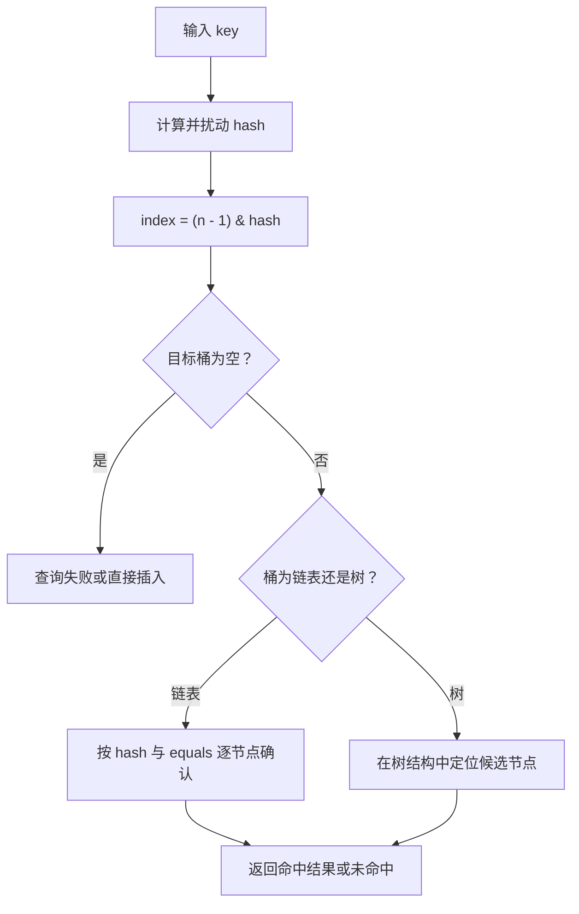

# 3.2.1.5 HashMap

`HashMap<K, V>` 是 Java 集合框架中最常用的映射实现之一。它用键定位值，允许调用方在不关心元素物理位置的情况下完成关联、替换和删除。它的典型优势是：当键的哈希分布合理、映射规模没有逼近实现上限且不存在不受控并发修改时，`get`、`put` 等基本操作通常具有接近常数时间的平均成本。

“平均接近 O(1)”并不是无条件保证。HashMap 的行为由两层规则共同决定：

- `Map` 接口规定键值映射的公开契约，例如键唯一、替换旧值、集合视图和复合更新方法的语义。
- 具体 JDK 实现决定如何组织桶、何时扩容、怎样处理碰撞以及是否把长链表转换成树。

区分这两层非常重要。业务代码可以依赖 `Map` 和 `HashMap` 文档承诺的行为，却不应把某个 OpenJDK 版本的字段、常量或桶内顺序当成稳定 API。本文先说明公开语义，再以 JDK 8 及后续 OpenJDK 的典型实现解释原理。树化阈值、节点形态和扩容细节属于实现知识，适合分析性能和阅读源码，不适合成为跨实现兼容性前提。

## 从 Map 契约理解 HashMap

Map 表示从键集合到值集合的映射关系。一个 Map 中不能存在两个“相等的键”分别对应两个值。再次放入相等键时，发生的是值替换，而不是新增第二个键。

```java
Map<String, Integer> scores = new HashMap<>();

scores.put("alice", 80);
Integer previous = scores.put(new String("alice"), 95);

System.out.println(previous);      // 80
System.out.println(scores.size()); // 1
System.out.println(scores.get("alice")); // 95
```

两个字符串不是同一个对象，但它们按 `String.equals` 相等，HashMap 因而把它们视为同一个键。这里同时揭示了 Map 的几个基本约束。

第一，键的唯一性按键相等语义判断，不按引用身份判断。对非 `null` 键，HashMap 在定位到候选节点后使用 `equals` 确认是否为同一逻辑键。实现通常会先检查引用是否相同，再检查 `equals`，但公开语义仍是键相等。

第二，值不要求唯一。不同键可以映射到相同值，`values()` 因此返回 `Collection<V>` 而不是 `Set<V>`。

第三，`put` 的返回值是该键之前关联的值。如果此前没有映射，通常返回 `null`；如果此前明确映射到 `null`，也返回 `null`。因此只看返回值无法区分“原来不存在”和“原来的值就是 null”。

第四，Map 的映射关系由 `Map.Entry<K, V>` 表示。Map 自身的 `equals` 关注映射集合是否相等，而不要求双方具体实现相同。只要两个 Map 包含相同的键值映射，它们就可以相等；HashMap、TreeMap 或其他 Map 实现之间也可以按这个契约比较。

HashMap 不承诺迭代顺序。当前一次运行中观察到的顺序，可能恰好受到容量、键哈希、插入过程和扩容次数影响，但这不等于插入顺序、排序顺序或稳定顺序。代码若需要插入顺序或访问顺序，应明确选择 `LinkedHashMap`；若需要按键排序、范围查询和相邻键操作，应考虑 `TreeMap` 或其他有序映射。

## 哈希表如何把键映射到桶

HashMap 的核心结构是桶数组。数组的每个槽位称为一个桶，桶中保存零个或多个键值节点。一次查询不会从头扫描全部映射，而是先依据键的哈希值选择一个桶，再在桶内确认目标键。

JDK 8 及后续 OpenJDK 的典型定位过程可概括为：

1. 取得键的 `hashCode`；`null` 键使用约定的零哈希。
2. 对原始哈希做一次扰动，让高位信息参与低位。
3. 使用数组长度减一与扰动后的哈希做按位与，得到桶下标。
4. 在该桶的链表或树中比较保存的哈希和键相等性。

设数组长度为 `n`，当 `n` 是 2 的幂时，桶下标可以写成：

```text
index = (n - 1) & hash
```

例如容量为 16 时，`n - 1` 的低四位为 1，按位与相当于保留哈希的低四位，下标范围自然落在 0 到 15。相比一般意义上的取模，这种计算便宜，并且为后续扩容迁移提供了一个关键性质。

只使用低位会带来一个问题：某些类型的 `hashCode` 主要差异可能集中在高位，而容量较小时只有少量低位参与下标计算。OpenJDK 的 HashMap 因此把原哈希的高半部分异或到低半部分，典型形式可抽象为：

```java
static int spread(Object key) {
    int h;
    return key == null ? 0 : (h = key.hashCode()) ^ (h >>> 16);
}
```

这不是密码学散列，也无法修复一个极差的 `hashCode`。它只是一次成本较低的混合，让原始高位也有机会影响桶位置。若大量不同键本来就返回同一个哈希值，扰动后仍然相同，所有这些键仍会竞争同一个桶。

定位流程可以用下图概括：



哈希值只负责缩小候选范围，不能单独决定键是否相等。不同键可以有相同哈希，这称为哈希碰撞；相同哈希只说明它们会进入同一候选区域，不说明它们是同一个键。最终仍需遵循 `equals`。

## 容量、负载因子与阈值

理解 HashMap 的空间与扩容行为，需要区分三个概念。

**容量**是桶数组的长度，不是当前映射数量，也不是最多还能插入多少元素。默认构造器创建的 HashMap 在尚未插入元素时通常延迟分配桶数组；第一次需要存储映射时，典型 OpenJDK 实现才建立默认长度为 16 的表。

**负载因子**描述扩容前允许表达到的填充程度。默认负载因子是 0.75，它在桶数组空间、碰撞概率和扩容频率之间提供了适合大多数普通用途的折中。

**阈值**通常依据“容量乘以负载因子”计算。插入新映射后，如果映射数量超过阈值，就会触发扩容。默认容量 16、默认负载因子 0.75 时，典型阈值是 12。这里判断的是映射数量，而不是非空桶数量。

负载因子越低，表会更稀疏，平均碰撞机会通常下降，但空桶更多，内存占用和遍历空槽的成本上升。负载因子越高，空间利用率提高，但更多键可能聚集到同一桶，查询时需要更多桶内比较。除非有测量结果和明确的数据分布，一般不应随意改变默认值。

构造器参数 `initialCapacity` 容易被误解。`new HashMap<>(1000)` 并不等价于“恰好容纳 1000 个映射且绝不扩容”。传统构造器参数表达期望的初始桶容量，具体实现还会把容量调整到合适的 2 的幂，并受负载因子约束。若希望在默认负载因子下容纳约 1000 个映射而不扩容，需要为负载预留空间，概念上至少要满足：

```text
capacity >= expectedMappings / loadFactor
```

当预期映射数是 1000、负载因子是 0.75 时，结果约为 1334；典型实现再选择不小于它的 2 的幂容量，即 2048。直接把 1000 作为传统构造器参数，实际表容量通常会调整为 1024，阈值约为 768，插入到目标规模前仍会扩容。

较新的 Java 版本提供了 `HashMap.newHashMap(int numMappings)` 工厂方法，用“预期映射数量”而不是“桶容量”表达意图，并由实现完成容量换算。面向多个 Java 版本编写库时，需要根据最低支持版本决定是否使用该方法。

容量规划也不能走向另一个极端。HashMap 的视图迭代成本与容量加映射数量相关。一个只存少量元素却拥有巨大桶数组的 Map，在遍历时会扫描大量空桶。过度预分配既占内存，也可能损害迭代性能。合理目标通常是：在可预估且数量较大时减少不必要扩容，同时避免远高于实际规模的容量。

## 节点、链表与红黑树

桶数组中的元素不是裸键或裸值，而是节点。一个普通节点至少需要保存扰动后的哈希、键、值和桶内后继引用。发生碰撞时，多个节点共享同一桶，JDK 8+ 的普通形态是单向链表。

链表解决了“不同键落入同一桶”的存储问题，但桶越长，查询时逐节点比较的成本越高。在极端情况下，若所有键进入同一桶，链表查询会从平均接近 O(1) 退化为 O(n)。JDK 8 引入桶内树结构，在满足条件时把长链表转换为红黑树，目的是限制严重碰撞下的桶内查找成本。

以主流 JDK 8+ OpenJDK 实现为例，相关条件不是简单的“桶里有 8 个节点就一定树化”：

- `TREEIFY_THRESHOLD` 的典型值是 8。插入使桶内节点数达到树化检查条件时，才会考虑转换。
- `MIN_TREEIFY_CAPACITY` 的典型值是 64。若当前表容量小于 64，实现优先扩容，而不是立即树化。
- `UNTREEIFY_THRESHOLD` 的典型值是 6。扩容拆分或删除导致树节点数量足够少时，桶可能退化回链表。

阈值 8 和 6 之间留出间隔，可以避免节点数量在边界附近变化时频繁树化和退化。容量不足时优先扩容，是因为小表中的碰撞可能只是桶数量太少；扩容后原桶节点可能自然分散，无需承担树节点的额外空间和维护成本。

因此，树化需要同时考虑桶内长度和表容量。即使某个桶已经很长，只要总容量仍小，典型实现也可能先扩容。反过来，达到树化条件也不代表整个 HashMap 变成一棵树；只有特定桶的节点形态发生变化，其他桶仍可以为空、为单节点或为链表。

红黑树是一种近似平衡的二叉搜索树，桶内查找在树形稳定时可达到 O(log m)，其中 `m` 是该桶的节点数。但 HashMap 的树节点比较不能简单假设所有键都实现同一种自然顺序。实现首先利用哈希区分方向；哈希相同且键不相等时，若键类型和 `Comparable` 条件适用，可以利用比较结果；仍不能确定时，还需要稳定的决胜规则以及必要的子树搜索来保证能找到按 `equals` 相等的键。

树化改善的是严重碰撞下的最坏桶内路径，不会把糟糕键设计变成高质量键设计。树节点比普通链表节点保存更多引用，旋转、着色和比较也有额外成本。正常分布下绝大多数桶很短，链表甚至单节点形态更简单、更节省空间。

还应注意：树化规则属于具体实现细节。Java API 只承诺基本操作在哈希分布合理时的预期性能，并没有要求所有兼容实现必须使用红黑树或相同阈值。

## put：新增与替换如何完成

`put(key, value)` 同时承担新增映射和替换旧值两种职责。典型 OpenJDK 主流程如下：

1. 计算键的扰动哈希。
2. 若桶数组尚未建立或长度为零，先初始化或扩容得到表。
3. 计算桶下标。
4. 若桶为空，创建普通节点放入该槽位。
5. 若桶非空，检查桶首节点是否就是相等键。
6. 桶为树时，进入树节点插入或查找逻辑。
7. 桶为链表时，沿后继引用查找相等键；未找到则追加新节点，并在长度达到条件时尝试树化。
8. 若找到已有键，按调用语义替换值并返回旧值，不增加 `size`。
9. 若确实新增节点，更新结构修改计数和 `size`；超过阈值时扩容。

“相等键”的判断通常先要求保存哈希相等，再判断引用相同或 `equals` 相等。先比较整数哈希可以快速排除大量不可能的节点，但相同哈希不能跳过 `equals`。

替换值和新增映射在结构语义上不同。对已有键执行普通 `put`，只改变节点中的值，通常不增加映射数量，也不属于 HashMap 文档所说的结构性修改。插入新键会改变映射集合，是结构性修改。这个区别会影响迭代器的 fail-fast 检测。

`putIfAbsent` 又增加了一层 `null` 语义：如果键不存在，或键当前映射到 `null`，它会尝试写入给定值；若已有非 `null` 值，则保留旧值。这与“只在 `containsKey` 为 false 时写入”并不完全相同。

```java
Map<String, String> map = new HashMap<>();
map.put("configured", null);

map.putIfAbsent("configured", "default");

System.out.println(map.get("configured")); // default
```

如果业务把“键存在但值为空”和“键不存在”视为两种状态，就不能把所有便利方法都按直觉解释，必须逐个核对它们对 `null` 的定义。

## get 与 containsKey：查询为什么需要两阶段判断

`get(key)` 与插入使用同样的哈希和桶定位规则。桶为空时直接返回 `null`；桶非空时先检查首节点，再按链表或树结构查找。

这说明 HashMap 查询包含两个层级：

- 数组定位把全表问题缩小到单个桶。
- 桶内比较确认逻辑键是否存在。

在哈希分布良好、容量适当的情况下，桶通常很短，因此基本查询平均接近常数时间。若哈希集中，成本转移到桶内；链表长度或树深度决定额外比较次数。

`containsKey(key)` 与 `get(key)` 在定位层面相似，但返回的是是否存在节点。由于 HashMap 允许 `null` 值，只有 `containsKey` 能区分以下两种状态：

```java
Map<String, String> map = new HashMap<>();
map.put("known", null);

System.out.println(map.get("known"));          // null
System.out.println(map.get("unknown"));        // null
System.out.println(map.containsKey("known"));  // true
System.out.println(map.containsKey("unknown"));// false
```

`containsValue` 则没有可用于直接定位的值哈希索引。它需要扫描桶数组和节点，时间成本是 O(n + capacity) 量级，不能因为方法名带有 `contains` 就把它与 `containsKey` 视为同等成本。若程序频繁按值反查键，应考虑额外维护反向索引，并明确处理一个值对应多个键以及双向更新的一致性。

## remove：删除不仅是找到节点

`remove(key)` 先执行与查询相同的定位，再从桶结构中摘除目标节点。链表桶需要修正桶首或前驱节点的 `next`；树桶需要执行树节点删除并恢复红黑树约束，节点减少到实现阈值以下时还可能退化为普通链表。

成功删除映射会减少 `size` 并记录结构性修改。删除不存在的键不改变结构。`remove(key)` 的返回值同样不能区分“没有映射”和“原值为 null”，需要时应结合 `containsKey`，或者使用条件删除方法。

`remove(key, value)` 只有在当前映射同时匹配给定键和值时才删除，适合表达“仍然保持这个值时才移除”的意图。不过在普通 HashMap 中，它仍不是跨线程竞态的解决方案；HashMap 本身没有并发原子性保证。

删除映射不会自动缩小桶数组。一个曾经容纳大量元素、后来删除到很小的 HashMap，通常仍保留已扩大的容量。这样避免了反复增删引起的扩缩容震荡，但也意味着内存和迭代空槽成本不会随 `size` 自动回落。若确实需要释放过大的内部表，可以在合适时机把有效映射复制到新建且容量适当的 Map；是否值得这样做应由生命周期和实际内存压力决定。

`clear()` 会移除所有映射，但常见 OpenJDK 实现也不会因此把容量恢复到默认值。清空后复用适合预期很快再次增长到相似规模的场景；若大表已经结束生命周期，让整个 Map 不再被引用通常更直接。

## 扩容为什么不需要重新做完整取模

当新增映射使 `size` 超过阈值时，典型 OpenJDK 实现把桶数组容量扩大为原来的两倍，直到达到实现允许的最大范围。扩容需要创建新数组并迁移已有节点，因此单次操作成本是 O(n) 量级。HashMap 依靠“扩容不频繁”把这项成本摊销到多次插入上。

容量保持为 2 的幂，使二倍扩容具有一个很有价值的规律。旧容量为 `oldCap`，新容量为 `2 * oldCap` 时，一个节点在新表中的位置只有两种可能：

- 原下标不变。
- 原下标加上 `oldCap`。

判断依据是该节点哈希中与 `oldCap` 对应的那一位。若这一位为 0，节点留在原位置；若为 1，移动到“原位置 + oldCap”。例如容量从 16 扩到 32，原来只使用低 4 位定位，现在新增第 5 位：该位为 0 的节点仍在下标 `i`，为 1 的节点移动到 `i + 16`。

```text
old index = hash & (oldCap - 1)
new index = hash & (2 * oldCap - 1)
```

这种拆分方式不必为每个节点重新执行一般取模，也可以把一个旧链表稳定拆成低位链表和高位链表。节点相对次序在各自拆分结果中通常得以保持，但这仍不构成 HashMap 对外的迭代顺序承诺。

扩容期间需要迁移全部非空桶。即使均摊复杂度良好，某一次触发扩容的 `put` 仍可能出现明显延迟。对延迟敏感且规模可预估的代码，合理初始容量能减少这种尖峰；对规模不可控的数据，则需要同时考虑总内存上限，而不是只追求不扩容。

达到最大容量附近后，HashMap 不可能无限扩大桶数组。具体 OpenJDK 实现会把阈值调整到特殊上限，后续映射继续增长时只能增加桶内负担，最终还受 Java 数组、对象数量和可用堆内存限制。任何来自外部且无界增长的键集合都需要业务层容量控制。

## null 键与 null 值的完整语义

HashMap 允许一个 `null` 键和任意多个 `null` 值。“一个 null 键”不是特殊限制，而是键唯一性的自然结果：所有 `null` 都代表同一个键。典型实现把 `null` 键的哈希视为 0，因此它会进入下标 0 对应的桶，但仍可能与其他哈希映射到该桶的非 null 键共存。

允许 null 提供了表达能力，也制造了状态歧义。对于 `get`、`put`、`remove` 等返回旧值或当前值的方法，`null` 可能表示缺失，也可能表示明确存储的 null。需要区分时，应使用 `containsKey`，或在数据模型中避免把 null 同时当作合法值和缺失标记。

复合 API 对 null 的处理并不完全一致：

| 方法 | 键缺失时 | 键映射到 null 时 | 回调结果为 null 时 |
| --- | --- | --- | --- |
| `getOrDefault` | 返回默认值 | 返回已存储的 null | 不适用 |
| `putIfAbsent` | 写入给定值 | 也尝试写入给定值 | 不适用 |
| `computeIfAbsent` | 调用函数 | 也调用函数 | 不建立映射 |
| `computeIfPresent` | 不调用函数 | 不调用函数 | 删除现有映射 |
| `compute` | 以旧值 null 调用 | 也以旧值 null 调用 | 删除或保持缺失 |
| `merge` | 直接关联给定非 null 值 | 直接关联给定值 | 删除现有映射 |

`getOrDefault` 尤其容易被误读。它只在键没有映射时返回默认值；若键明确映射到 null，返回的仍是 null。

```java
Map<String, String> map = new HashMap<>();
map.put("present", null);

System.out.println(map.getOrDefault("present", "fallback")); // null
System.out.println(map.getOrDefault("absent", "fallback"));  // fallback
```

若一个 API 不希望出现三态语义，应在边界处拒绝 null、使用不可为空的值模型或用显式状态类型表达缺失，而不是让每个调用方猜测 null 的含义。

## equals 与 hashCode 是键的定位协议

HashMap 正确工作的核心前提是键遵守 `equals` 与 `hashCode` 契约：

- 对象在一次执行期间未发生影响相等性的修改时，多次调用 `hashCode` 应返回一致结果。
- 若 `a.equals(b)` 为 true，则 `a.hashCode()` 必须等于 `b.hashCode()`。
- 哈希相同不要求对象相等，碰撞是允许的。
- `equals` 还应满足自反、对称、传递、一致，并对 null 返回 false。

若相等对象返回不同哈希，HashMap 可能先把它们定位到不同桶，根本没有机会调用 `equals`，从而保存两个按业务语义本应相同的键。若大量不相等对象返回同一哈希，功能可能仍然正确，但性能会因严重碰撞而下降。

键类应选择真正构成逻辑身份的字段参与 `equals` 和 `hashCode`，并保证两者使用一致字段。典型不可变键可以写成：

```java
import java.util.Objects;

final class Coordinate {
    private final int x;
    private final int y;

    Coordinate(int x, int y) {
        this.x = x;
        this.y = y;
    }

    @Override
    public boolean equals(Object other) {
        if (this == other) {
            return true;
        }
        if (!(other instanceof Coordinate)) {
            return false;
        }
        Coordinate that = (Coordinate) other;
        return x == that.x && y == that.y;
    }

    @Override
    public int hashCode() {
        return Objects.hash(x, y);
    }
}
```

这里使用不可变字段，不只是为了线程安全，更是为了保证键入表后的定位信息稳定。记录类也适合表达按全部组件比较的不可变值键，但仍应确认自动生成的相等性是否与业务身份一致。

数组作为键时要格外谨慎。Java 数组没有按元素重写 `Object.equals` 和 `Object.hashCode`，两个内容相同但引用不同的数组默认不是相等键。若需要按内容作为键，可以封装数组并使用 `Arrays.equals`、`Arrays.hashCode`，同时防止外部修改数组内容，或者改用本身具有值语义的不可变类型。

浮点数、大小写不敏感字符串、规范化路径、代理对象和继承层次中的相等性都可能带来额外边界。原则不是“让 hashCode 尽量复杂”，而是先定义稳定、对称、可推理的逻辑相等，再生成与之严格一致的哈希。

## 可变键为什么会“丢失”

把可变对象作为键并非语法错误，但如果对象入表后修改了参与 `equals` 或 `hashCode` 的字段，HashMap 不会自动搬迁节点。节点仍留在按旧哈希选择的桶中，而新的查询会按新哈希前往另一个桶，于是出现“迭代能看到，get 和 remove 却找不到”的现象。

```java
final class MutableKey {
    String id;

    MutableKey(String id) {
        this.id = id;
    }

    @Override
    public boolean equals(Object other) {
        if (!(other instanceof MutableKey)) {
            return false;
        }
        MutableKey that = (MutableKey) other;
        return id.equals(that.id);
    }

    @Override
    public int hashCode() {
        return id.hashCode();
    }
}

MutableKey key = new MutableKey("A");
Map<MutableKey, String> map = new HashMap<>();
map.put(key, "value");

key.id = "B";

System.out.println(map.get(key));    // 通常为 null
System.out.println(map.containsKey(key)); // 通常为 false
```

此时映射并没有从内部数组消失，它只是无法按照键的当前状态重新定位。甚至再执行一次 `put(key, ...)` 还可能增加一个新节点，使同一个对象引用以不同保存哈希出现在表中，进一步破坏直觉。

稳妥做法是优先使用不可变键。若对象状态必须变化，可选方案包括：

- 使用稳定且不可变的标识作为键，把可变对象放在值中。
- 修改前先按旧键删除，修改后再重新插入，并保证整个过程满足业务原子性。
- 构造专门的不可变键快照，而不是直接暴露可变领域对象。

“修改后再改回来”也不是可靠策略，因为期间任何查询、删除或重复插入都可能产生错误结果。HashMap 不负责追踪键对象内部状态变化。

## 迭代、顺序与 fail-fast

HashMap 提供三类集合视图：`keySet()`、`values()` 和 `entrySet()`。它们的迭代通常扫描桶数组，再遍历每个非空桶中的节点。因此总遍历成本不仅与 `size` 有关，也与容量有关。

HashMap 不保证迭代顺序。以下做法都不可靠：

- 根据当前输出推断它按插入顺序遍历。
- 认为整数键看起来有序，所以以后始终有序。
- 认为只要数据不变，不同 JDK 或不同构造过程就一定给出相同顺序。
- 把 HashMap 的 `toString()` 顺序用于稳定序列化、签名或快照比较。

若输出需要确定性，应在数据结构层选择有顺序承诺的 Map，或在输出阶段显式排序。

迭代器通常保存创建时观察到的结构修改计数。每次推进或删除时，它会比较 Map 当前计数；若发现有迭代器之外的结构性修改，便尽早抛出 `ConcurrentModificationException`。这就是 fail-fast。

```java
Map<String, Integer> map = new HashMap<>();
map.put("a", 1);
map.put("b", 2);

for (String key : map.keySet()) {
    if (key.equals("a")) {
        map.remove(key); // 通常触发 ConcurrentModificationException
    }
}
```

遍历时需要删除当前元素，应使用迭代器自己的 `remove`：

```java
Iterator<Map.Entry<String, Integer>> iterator =
        map.entrySet().iterator();

while (iterator.hasNext()) {
    Map.Entry<String, Integer> entry = iterator.next();
    if (entry.getValue() < 0) {
        iterator.remove();
    }
}
```

也可以使用 `removeIf` 等由集合视图提供的操作，让实现按合法遍历方式删除。

fail-fast 不是线程安全机制，也不是严格保证。未同步并发修改下，迭代器可能抛异常，也可能因时序和可见性没有及时检测到。程序不能依赖“只要没抛异常就没有并发问题”，更不能用捕获 `ConcurrentModificationException` 作为正常控制流程。

结构性修改通常指新增或删除映射。仅替换已有键的值通常不改变 `modCount`，但在遍历回调中随意修改 Map 仍应谨慎。`Map.Entry.setValue` 是 `entrySet` 遍历中用于更新当前映射的明确途径；其有效期和行为应遵守视图文档，不应长期保存条目对象并假设它是独立快照。

## 集合视图是联动窗口，不是副本

`keySet()`、`values()` 和 `entrySet()` 返回的是由原 Map 支撑的视图。原 Map 改变，视图会反映改变；通过视图执行受支持的删除，原 Map 也会改变。

```java
Map<String, Integer> map = new HashMap<>();
map.put("a", 1);
map.put("b", 2);

Set<String> keys = map.keySet();
keys.remove("a");

System.out.println(map.containsKey("a")); // false
```

三个视图的能力不同：

- `keySet()` 是键集合。可以删除键，从而删除对应映射；不能凭空 `add` 一个键，因为没有值可与之关联。
- `values()` 是值集合。值可以重复，因此不是 Set。删除某个值时，只删除某个匹配映射，具体是哪一个不能依赖无序 HashMap 的遍历次序。
- `entrySet()` 是映射条目集合，适合同时读取键和值，也通常是遍历 Map 最直接的方式。迭代得到的条目可通过 `setValue` 更新对应值。

调用 `new HashSet<>(map.keySet())`、`new ArrayList<>(map.values())` 或 `new HashMap<>(map)` 才是在当时创建浅副本。浅副本只复制集合结构，不克隆键和值对象；后续修改共享的可变对象仍可能互相可见。

视图还会延长原 Map 的可达生命周期。即使外部不再保存 Map 变量，只要仍保存其 `keySet` 等视图，底层 Map 和映射仍可能无法被垃圾回收。对大型临时 Map，若只需保留键快照，应明确复制而不是长期持有视图。

## compute、merge 与其他复合 API

Map 在 Java 8 以后提供了多种复合方法，用于表达“读取后根据当前状态更新”的常见模式。它们减少样板代码，但在 HashMap 上不自动获得线程安全性。

### computeIfAbsent

当键没有非 null 值时调用映射函数；函数返回非 null 值才建立映射。适合延迟创建值或构建一对多结构：

```java
Map<String, List<String>> groups = new HashMap<>();
groups.computeIfAbsent("admin", key -> new ArrayList<>())
      .add("alice");
```

需要注意三点：已映射到 null 也会触发计算；返回 null 不写入；函数抛出未检查异常时不建立新映射。映射函数不应在计算期间修改同一个 Map，HashMap 会尽力检测这种结构变化并抛出 `ConcurrentModificationException`，但回调自修改本身就违反方法约束。

`computeIfAbsent` 也不是通用缓存方案。普通 HashMap 上两个线程可以重复计算、覆盖结果或破坏结构；值集合本身也可能被并发修改。并发缓存需要明确选择并发结构、失效策略、异常策略和容量控制。

### computeIfPresent 与 compute

`computeIfPresent` 只在当前值非 null 时调用函数。函数返回 null 会删除映射。若键映射到 null，它被视为“不存在可计算的当前值”。

`compute` 无论键是否存在都会调用函数。不存在和映射到 null 都以旧值 null 传入，因此回调如果需要区分这两种状态，单靠参数做不到。返回 null 表示删除现有映射或保持缺失。

```java
map.compute("attempts", (key, oldValue) ->
        oldValue == null ? 1 : oldValue + 1);
```

这段代码适合单线程或已由外部同步完整保护的 HashMap。它把判断和更新写在一个调用中，改善表达性，但 HashMap 并未因此成为并发原子计数器。

### merge

`merge` 适合累计、拼接或归并。键缺失或当前值为 null 时，直接写入给定的非 null 值；已有非 null 值时，调用合并函数；合并函数返回 null 则删除映射。

```java
Map<String, Integer> counts = new HashMap<>();

for (String word : words) {
    counts.merge(word, 1, Integer::sum);
}
```

它比“先 get，再判断，再 put”更清晰地表达计数意图。仍需考虑整数溢出、回调异常和线程安全边界。

### replace、replaceAll 与 forEach

`replace` 只更新已有映射；条件版本要求旧值匹配。`replaceAll` 对每个映射应用函数并替换值。`forEach` 遍历键值对。传给这些方法的回调不应对同一个 HashMap 做不受支持的结构修改，否则可能触发 fail-fast 或产生难以推理的遍历结果。

复合 API 的价值主要是把状态转换集中表达，而不是改变 HashMap 的并发模型。若多个操作需要共同维护跨键、跨 Map 或 Map 与其他对象之间的不变量，仍需在更高层建立同步和事务边界。

## 非线程安全的准确边界

HashMap 没有内部同步。多个线程并发访问时，只要至少一个线程可能结构性修改 Map，就必须使用外部同步或改用适合的并发映射。并发风险不只表现为“少一条数据”，还包括：

- 检查后执行产生竞态，例如两个线程都看到键不存在后分别写入。
- 复合更新丢失，例如两个线程同时读取旧计数并写回同一个新计数。
- 读线程缺少 happens-before 关系，可能看不到最新结构或最新值。
- 迭代与修改互相干扰，fail-fast 只能尽力报告，不能提供一致快照。
- Map 结构之外的业务不变量被不同线程交错破坏。

历史上某些旧 JDK HashMap 扩容算法在并发写下可能形成异常链路，但不能把风险缩减为某个特定版本的“环形链表问题”。即使现代实现改变了迁移算法，HashMap 仍然不支持无同步并发写。依赖“当前实现看起来不再出现某种故障”不构成正确性依据。

常见可行策略有三类。

第一，在单线程中构造完成，通过安全发布交给其他线程，并在发布后保持结构和键值状态只读。这里不仅 Map 不再修改，若值对象本身可变，其并发访问仍需满足自己的线程安全要求。

第二，用一个共同的锁保护所有访问，包括读取、写入、迭代和复合操作。`Collections.synchronizedMap` 可以提供方法级同步包装，但迭代视图时仍需按其文档在包装对象上手动同步。多个方法组成的不变量也必须放在同一个同步区间。

```java
Map<String, Integer> map =
        Collections.synchronizedMap(new HashMap<>());

synchronized (map) {
    for (Map.Entry<String, Integer> entry : map.entrySet()) {
        consume(entry);
    }
}
```

第三，使用 `ConcurrentHashMap` 等并发结构，并按照其独立契约理解原子复合方法、null 限制和弱一致迭代。替换不是只改类名：ConcurrentHashMap 不允许 null 键和值，迭代语义也不同，跨多个键的整体原子性仍需额外设计。

将 Map 声明为 `final` 只保证变量不重新指向另一个对象，不会让 HashMap 内容不可变或线程安全。用 `Collections.unmodifiableMap` 包装也只是阻止通过包装引用修改；若原始 Map 仍可变，包装视图会反映变化。真正的不可变快照应在边界处复制并限制键值对象的可变性。

## 容量规划与性能诊断

HashMap 性能问题通常不是“哈希表天然慢”，而是容量、键质量、访问模式或生命周期与结构假设不匹配。

### 估算初始规模

当最终映射数量大致可知且一次性批量装载时，预分配可以减少扩容和数组迁移。传统构造器下，可按预期元素数除以负载因子估算最低桶容量，再考虑实现的 2 的幂调整。不要直接套用固定公式而忽略：

- 预期数量是否只是上界，实际通常远小于它。
- Map 是否频繁遍历，过大容量会扫描更多空桶。
- 对象生命周期是否很短，预分配的大数组是否造成额外分配压力。
- 运行版本是否提供按映射数量创建的工厂方法。
- 极大数量换算时是否发生整数溢出或逼近实现上限。

小 Map 通常没有必要手工调参。优化应优先针对已确认的大规模或热点实例。

### 检查键的哈希质量

若 CPU 时间集中在 `equals`、树节点查找或 HashMap 桶内循环，应检查键分布。可以用基准数据统计不同键哈希、桶占用近似分布和最大碰撞规模。不要仅用少量随机数据证明哈希良好；真实键可能包含规律性强的编号、掩码或组合字段。

自定义 `hashCode` 应同时兼顾契约和分布。常见字段组合方法通常足够，没必要在普通应用中引入昂贵加密哈希。若键来自不可信输入且碰撞可被主动构造，还需要从整个系统的资源限制、输入规模和数据结构选择评估拒绝服务风险，不能只依赖树化阈值。

### 区分查询、遍历和分配成本

`get` 慢可能是哈希或 `equals` 本身昂贵；遍历慢可能是容量远大于 `size`；批量插入抖动可能是扩容；内存高可能来自桶数组、节点、键值对象以及它们引用的对象图。只看 Map 的元素数量无法解释全部成本。

使用微基准时应采用可靠基准工具并避免死代码消除、预热不足和不真实数据分布。更重要的是先分析生产访问模式：读取与写入比例、Map 大小分布、键类型、生命周期、并发度以及延迟分位数。

### 识别错误的数据结构

以下需求可能说明 HashMap 不是最佳选择：

- 需要稳定插入顺序或最近访问顺序：考虑 `LinkedHashMap`。
- 需要按键排序、范围查询、最小键或相邻键：考虑 `TreeMap`、`NavigableMap`。
- 需要按引用身份而不是 `equals` 比较键：考虑 `IdentityHashMap`，并明确其特殊语义。
- 键是枚举且键域固定：考虑 `EnumMap`，通常更紧凑且顺序明确。
- 需要高并发读写和并发复合操作：考虑 `ConcurrentHashMap`。
- 只读且映射很小：不可变 Map 工厂或紧凑表示可能更合适。

选择替代结构时要比较完整契约，包括 null、顺序、相等性、并发、迭代一致性和内存，不应只比较单次 `get` 的大 O。

## 常见误区的因果分析

### “HashMap 的操作永远是 O(1)”

更准确的说法是：在哈希分布合理等前提下，基本操作具有常数时间的预期性能。哈希计算、`equals` 成本、碰撞、树深度、扩容和内存层次都会影响真实成本。单次触发扩容的 `put` 是线性迁移，严重碰撞下桶内也不是常数步。

### “容量等于最多能放的元素数”

容量是桶数组长度。映射数量超过阈值时通常扩容，而阈值由容量和负载因子共同决定。Map 也可以存储超过当前容量数量的映射，只是碰撞和扩容策略会介入。

### “达到 8 个节点必定树化”

在典型 JDK 8+ OpenJDK 中，还要考虑表容量是否至少达到最小树化容量，以及插入路径中的具体计数条件。容量较小时实现优先扩容。阈值本身也属于实现细节，不是 Map 契约。

### “只要重写 hashCode 就够了”

HashMap 最终用 `equals` 判断逻辑键。只重写其中一个会破坏一致性：只重写 `equals` 可能让相等对象落入不同桶；只重写 `hashCode` 则没有定义业务相等。两个方法必须基于同一身份字段协同设计。

### “HashMap 可以读写并发，只是结果偶尔旧”

没有同步的数据竞争不只意味着读到旧值。结构修改、可见性和复合操作都没有所需保证。即使某次测试没有失败，也不能推导出线程安全。

### “ConcurrentModificationException 能检测所有并发修改”

fail-fast 是尽力检测程序错误，不是完整检测协议。它也可能在单线程遍历时因非法结构修改而触发，与多线程并没有必然关系。

### “视图就是快照”

三个集合视图都由原 Map 支撑，双方修改互相可见。需要快照时要显式复制，并继续考虑键和值对象是否可变。

### “null 只代表不存在”

HashMap 允许显式 null 值，因此 `get`、`put` 和 `remove` 的 null 返回值可能有两种含义。复合 API 又分别定义了映射到 null 时的行为，必须按方法契约处理。

## 设计 HashMap 使用边界

HashMap 常被用作索引、分组表、计数表、去重辅助结构和对象注册表。要让这些用途长期可靠，代码边界应明确以下问题：

- 键的逻辑身份是什么，入表后是否保持稳定。
- null 键或 null 值是否具有业务含义，还是应在入口拒绝。
- 调用方能否修改 Map，返回的是视图、副本还是只读包装。
- 是否需要稳定顺序，以及这个顺序是否属于外部协议。
- Map 会增长到多大，是否需要容量上限、淘汰或生命周期清理。
- 是否跨线程共享，所有访问是否遵循同一同步策略。
- 复合更新是否只涉及单键，还是需要维护跨键不变量。

公开 API 通常优先使用 `Map<K, V>` 声明参数和返回类型，以表达所需抽象；只有调用方确实需要 HashMap 特有语义时才暴露具体类型。不过接口类型不会消除语义责任，文档仍应说明顺序、可变性、null、所有权和线程安全。

返回内部可变 HashMap 会把模块状态直接暴露给调用方。可根据需求选择防御性复制、不可修改视图或专用查询接口。防御性复制隔离结构变化但有 O(n) 成本；不可修改视图成本低却仍跟随后端变化；不可变快照最容易推理，但需要在创建时复制并约束元素对象。

## 总结

HashMap 的主路径可以归纳为“哈希缩小范围，桶内相等性确认目标”。容量为 2 的幂让桶定位和二倍扩容拆分更高效；负载因子与阈值决定空间利用和扩容时机；链表处理普通碰撞，JDK 8+ OpenJDK 在容量和节点数满足条件时使用红黑树限制严重碰撞的桶内退化。

公开使用时，比源码常量更重要的是 Map 契约：键唯一、值可重复、HashMap 允许 null、不保证顺序、视图与原表联动、迭代器只提供尽力而为的 fail-fast。`compute`、`merge` 等方法改善单次状态转换的表达，却不会让普通 HashMap 获得并发原子性。

一个可靠的 HashMap 使用方案应同时满足四个前提：键的 `equals` 与 `hashCode` 一致且定位字段稳定；容量与真实规模大致匹配；代码不依赖未承诺的顺序和实现细节；共享访问具有明确的同步或不可变边界。只要其中任一前提不成立，平均 O(1) 这个标签就不足以保证正确性或性能。

## 参考资料

- [Java SE `Map` API](https://docs.oracle.com/en/java/javase/25/docs/api/java.base/java/util/Map.html)
- [Java SE `HashMap` API](https://docs.oracle.com/en/java/javase/25/docs/api/java.base/java/util/HashMap.html)
- [OpenJDK `HashMap` 源码](https://github.com/openjdk/jdk/blob/master/src/java.base/share/classes/java/util/HashMap.java)
