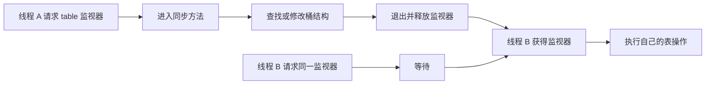

# 3.2.1.6 Hashtable

`java.util.Hashtable` 是 Java 类库中历史最久的通用键值容器之一。它实现了 `Map`，以哈希表组织键值对，并在公开操作上提供内置同步。仅从这句话看，它似乎只是“线程安全的 HashMap”；但这种概括会掩盖几个决定工程行为的关键事实：它先于集合框架出现，后来才被纳入 `Map` 体系；它禁止 `null` 键与 `null` 值；传统实现以整张表的实例锁串行化操作；它同时保留了 `Enumeration` 风格 API 和集合框架的迭代视图；它能保证单个同步方法的互斥，却不能自动保证任意业务操作组合的原子性。

因此，理解 `Hashtable` 的重点不是背诵方法，而是准确划定它的契约和同步边界。它在遗留接口、序列化数据或既有锁协议中仍可能是必须维护的类型，但新代码通常有更清晰的选择。本文围绕 `java.util.Hashtable` 本身展开：先解释它在集合框架中的定位，再从哈希结构、同步粒度、空值契约、扩容、遍历、相等性、序列化和迁移等方面建立完整的判断路径。

## 从 Dictionary 遗产到 Map 实现

`Hashtable` 的设计早于 Java Collections Framework。早期 Java 使用抽象类 `Dictionary` 表示键值字典，`Hashtable` 是其具体实现；集合框架建立后，`Hashtable` 又实现了 `Map` 接口，同时继续继承 `Dictionary`。这段历史直接留在今天的 API 表面：除了 `Map` 约定的 `keySet()`、`values()`、`entrySet()` 等视图，它还提供 `keys()`、`elements()` 等返回 `Enumeration` 的旧式遍历方法。

这使 `Hashtable` 同时承载两套时代不同的抽象。`Dictionary` 体系强调通过专有方法读写字典，`Map` 体系则强调统一接口、集合视图、迭代器和默认方法。对维护者而言，这不是单纯的命名冗余：不同遍历入口具有不同的并发修改检测语义，旧代码也可能把具体类型、同步监视器或序列化形式当成兼容契约。看到一个 `Hashtable` 字段时，不能只问能否替换成另一个 `Map`，还要确认调用方是否使用了这些历史特征。

作为 `Map`，`Hashtable` 表示从键到值的映射。一个键至多对应一个值；再次放入与已有键相等的键，会替换对应值并返回旧值。它不承诺迭代顺序，桶数组的长度、键的哈希值、插入与删除过程、扩容时机都可能影响观察到的顺序。任何依赖当前遍历顺序的代码都在依赖实现偶然性，而不是 `Hashtable` 契约。

`Hashtable` 还实现了 `Cloneable` 和 `Serializable`。浅克隆会复制表结构，但不会深拷贝键和值；序列化则让其类名、字段语义和键值对象的可序列化能力进入长期兼容问题。正是这些附加契约，使“它已经过时，所以直接全局替换”成为风险很高的迁移方式。

从现代类型设计看，公开 API 通常应依赖 `Map<K, V>`，而不是暴露 `Hashtable<K, V>`。只有调用方确实需要 `Hashtable` 的具体能力，例如与旧接口对接、使用其对象监视器形成既有同步协议，或者读取必须保持兼容的历史序列化数据时，具体类型才有充分理由出现在边界上。即便内部暂时不能迁移，也可以优先缩小具体类型的传播范围。

## 映射契约：键唯一、值可重复、顺序未定义

`Hashtable<K, V>` 的泛型参数分别约束键和值的静态类型。泛型只提供编译期类型检查，不改变运行时的哈希定位过程。容器判断两个键是否代表同一个映射位置，仍依赖键对象的 `hashCode()` 和 `equals()`；值是否重复不影响映射结构，多个不同键可以关联同一个值对象，也可以关联彼此相等的不同值对象。

`put(k, v)` 的语义可以拆成两种情况：

1. 表中不存在与 `k` 相等的键，新增一个映射，`size` 增加。
2. 表中已经存在与 `k` 相等的键，只替换该映射的值，`size` 不变，并返回旧值。

“相等的键”不要求是同一对象。只要哈希值满足相等性契约，并且 `equals()` 判定相等，容器就把它们视为同一个逻辑键。反过来，两个 `equals()` 不相等的键即使哈希值相同，也只是发生哈希碰撞，仍然能够同时存在。

读取时，`get(key)` 返回关联值；不存在映射时返回 `null`。因为 `Hashtable` 禁止存储 `null` 值，所以这里的 `null` 可以无歧义地表示“不存在”。这与允许 `null` 值的 `HashMap` 不同：在后者中，仅凭 `get` 的返回值无法区分“键不存在”和“键存在但映射到 null”，通常还要结合 `containsKey`。这种差异是迁移时必须明确处理的契约变化。

`containsKey` 检查键，`containsValue` 检查值。历史方法 `contains(Object value)` 与 `containsValue` 含义相同，检查的是值而不是键。这个命名很容易误导读者，因此新代码不应继续使用 `contains`。值查找通常需要扫描表中的条目，时间成本与元素数量相关，不具备按键哈希定位的平均常数时间特征。

删除操作 `remove(key)` 按键定位并移除映射，返回旧值；没有对应键时返回 `null`。由于值不允许为 `null`，返回值同样能区分是否真正移除了映射。集合视图还提供按条目、键或值删除的入口，但它们最终都改变同一张底层表，必须按视图契约理解，而不能把视图当作独立副本。

## null 禁止不是实现偶然

`Hashtable` 明确禁止 `null` 键和 `null` 值。调用 `put(null, value)` 或 `put(key, null)` 会抛出 `NullPointerException`。很多查询方法对 `null` 键也会在计算哈希或执行查找时抛出 `NullPointerException`；值查询传入 `null` 同样不被接受。具体方法的异常路径应以目标 JDK 的 API 契约和测试为准，但工程上最可靠的规则是：不要把任何 `null` 作为 `Hashtable` 的键、值或查询候选。

禁止 `null` 带来一个重要性质：`get(key) == null` 能直接表示缺少映射。这使早期字典 API 不必再通过额外状态区分“没有值”和“值就是 null”。同样，`putIfAbsent` 一类语义不需要处理已有 `null` 值是否等同于缺失的问题。代价是调用方必须在边界处明确表达缺失，不能把 `null` 当作普通占位值。

当业务确实存在“已记录但没有有效值”这一状态时，通常有三种更清晰的表达方式：

- 使用专门的值对象表示状态，例如 `LookupResult`、枚举或带状态字段的记录类型。
- 在 API 层使用 `Optional<V>` 表达一次查询结果，但谨慎评估是否真的需要把 `Optional` 存进容器。
- 选择允许 `null` 的映射实现，并明确所有查询都如何区分缺失与空值。

不能为了“兼容 Hashtable”随意拿一个魔法字符串或共享哨兵对象代替 `null`，除非这个哨兵是类型契约的一部分。否则，编码、比较、序列化和跨模块传递都会产生新的隐含规则。

迁移到 `HashMap` 时，目标容器虽然允许 `null`，但原有代码未必应该立即放宽契约。如果调用方依赖 `NullPointerException` 尽早暴露非法输入，替换后静默接受 `null` 可能把错误推迟到更远的位置。迁移方案应决定是继续通过 `Objects.requireNonNull` 保持禁空语义，还是有意识地修改 API，并补充针对空值的新测试。

迁移到 `ConcurrentHashMap` 时，禁空语义更接近：它同样不接受 `null` 键和值。这减少了一类行为差异，但不意味着二者可以机械替换，因为锁、复合操作、遍历和外部同步协议仍然不同。

## 常见实现前提：桶数组与冲突链

理解 `Hashtable` 的性能和扩容，需要区分“公开契约”与“常见 JDK 实现”。公开契约要求它是哈希表、同步并实现相应接口，却不保证私有字段名称、数组扩容公式或碰撞节点的具体布局永远不变。讨论源码时必须标明：桶数组、链式冲突和特定 rehash 规则是长期常见的 OpenJDK 实现思路，不应被业务代码当作可依赖的 API。

传统实现以一个条目数组作为桶表。每个桶保存零个或多个条目；条目记录键、值、缓存的哈希值以及指向同桶下一个条目的引用。查找键时，大体经过三步：

1. 调用键的 `hashCode()` 得到哈希值。
2. 根据当前桶数组长度计算桶下标。
3. 沿桶内冲突链比较缓存哈希和 `equals()`，确认真正相等的键。

哈希值只负责缩小候选范围，不负责最终确认相等。不同键产生相同哈希值是合法情况，因此必须在桶内继续使用 `equals()`。如果实现只比较哈希值，碰撞键就会被错误地覆盖；如果忽略哈希值直接扫描全部键，虽然可能保持正确，却失去哈希结构的主要价值。

传统 `Hashtable` 的桶内结构通常是链表，而不是现代 `HashMap` 在高碰撞条件下可能使用的树化桶。由此可以得到一个有条件的复杂度结论：哈希分布良好且负载受控时，`get`、`put`、`remove` 的平均定位成本接近常数；若大量键集中到同一桶，桶内扫描会增长，最坏情况可退化为与元素数量线性相关。不能把“哈希表查找 O(1)”理解成无条件保证。

哈希质量来自键类型。理想的 `hashCode()` 应让常见键尽量均匀分布，同时计算成本可接受；相等对象必须返回相同哈希值，不相等对象可以返回相同哈希值。`Hashtable` 无法修复一个把所有实例都映射到同一哈希值的键类型。即使结果仍正确，冲突链会拉长，而同步又会让每次长链扫描都占用整表锁更久，进一步放大并发延迟。

键的 `hashCode()` 和 `equals()` 还可能执行用户代码。若实现方法计算昂贵、获取其他锁、访问可变状态或抛出异常，容器操作的成本和风险都会随之增加。尤其在 `Hashtable` 的同步方法中，键方法通常是在持有表锁的路径上调用的；如果键对象的相等性逻辑再进入其他锁，就可能形成复杂的锁顺序。键类型应优先使用纯计算、稳定且快速的相等性实现。

下面的示例展示碰撞并不等于相等。两个键故意返回相同哈希值，但以 `id` 区分相等性，因此可以同时存在：

```java
import java.util.Hashtable;
import java.util.Objects;

final class CollisionKey {
    private final int id;

    CollisionKey(int id) {
        this.id = id;
    }

    @Override
    public int hashCode() {
        return 1;
    }

    @Override
    public boolean equals(Object other) {
        return other instanceof CollisionKey
                && id == ((CollisionKey) other).id;
    }
}

class CollisionDemo {
    public static void main(String[] args) {
        Hashtable<CollisionKey, String> table = new Hashtable<>();
        table.put(new CollisionKey(1), "one");
        table.put(new CollisionKey(2), "two");

        System.out.println(table.get(new CollisionKey(1))); // one
        System.out.println(table.get(new CollisionKey(2))); // two
    }
}
```

这个例子用于说明正确性边界，不是推荐的哈希实现。真实键类型若长期返回常量哈希值，会把哈希表退化成链式查找结构。

## 容量、负载因子与 rehash

哈希表不能无限向固定数量的桶中追加条目。随着元素增多，平均桶长度上升，碰撞概率和扫描成本都会增加。`Hashtable` 使用容量、负载因子和阈值控制扩容：

- 容量通常指桶数组长度，而不是当前元素个数。
- 元素个数由 `size()` 表示。
- 负载因子描述允许表达到多“拥挤”后再扩容。
- 阈值通常由容量与负载因子共同计算，新增元素使规模达到或越过阈值时触发 rehash。

构造器允许指定初始容量和负载因子，也提供只指定容量或使用默认参数的形式。初始容量必须满足实现要求，负载因子必须为正且有效；非法参数会导致 `IllegalArgumentException`。默认值属于 JDK API 文档可查的行为，但精确扩容过程属于实现细节。编写容量敏感代码时，应针对实际部署的 JDK 版本验证，而不是从某一份源码推断永久规律。

传统 OpenJDK 实现中的 rehash 会创建更大的桶数组，再把旧条目按照新数组长度重新分配到各个桶。不能直接把旧桶数组复制到新数组，因为桶下标依赖数组长度；长度变化后，同一个哈希值可能落入不同位置。这个过程需要遍历已有条目，时间和额外内存开销都与当前表规模相关。

扩容不是渐进完成的普通查找成本，而是某次写入路径上集中发生的重建成本。对延迟敏感的程序，即使长期平均吞吐尚可，也可能观察到扩容引起的单次停顿。`Hashtable` 的 rehash 在同步保护下进行，其他访问同一实例的线程在此期间不能进入相应同步操作，因此容量估计不只影响内存和平均碰撞，也影响锁等待尖峰。

初始容量过小会导致多次扩容；过大则会预留许多空桶，增加数组内存，并可能让遍历扫描更多空位置。负载因子过低会更早扩容，以空间换取较短的冲突链；过高会节省桶数组空间，却增加碰撞和查找成本。不存在脱离数据规模与访问模式的“最佳数值”。多数普通场景使用默认值更稳妥；只有能够估计条目数量、操作比例和延迟目标时，才值得显式调参。

如果已知预计要放入 `n` 个映射，初始容量不能简单等于 `n`，因为阈值还受负载因子影响。实际估算要留出负载余量，并考虑实现对容量上限、取整和阈值计算的处理。与其依赖精确私有公式，更可靠的方法是在目标 JDK 上用真实规模做基准和分配观测，并给增长留出合理余量。

rehash 还会改变迭代顺序。`Hashtable` 从未承诺顺序，所以这不构成契约违背，却会暴露错误依赖：测试若把当前输出顺序写成固定字符串，可能在数据增长、JDK 更新或键哈希变化后失败。需要稳定顺序时应选择明确承诺顺序的实现，或者在输出边界显式排序。

## 内置同步保护了什么

`Hashtable` 最显眼的特征是同步。传统实现中，大量公开方法使用实例监视器，也就是等价于在 `this` 上执行互斥。一个线程进入某个同步实例方法后，其他线程不能同时进入同一对象上同样需要该监视器的代码，直到锁被释放。不同 `Hashtable` 实例拥有不同监视器，彼此不直接阻塞。

这种同步首先保护容器内部结构：写入、删除、扩容和读取不会在缺少协调的情况下同时操作同一组桶与计数字段。它还建立 Java 内存模型中的监视器 happens-before 关系：线程释放某个监视器之前的写入，对随后成功获取同一监视器的线程可见。但这个可见性结论必须建立在访问确实经过同一同步协议的前提上。

可以把典型访问画成如下过程：



整表实例锁的优点是模型直接：单个同步方法在执行期间不会与同表的另一个同步操作交错，内部不变量容易维护。缺点是并发粒度粗。即使两个线程访问不同键、不同桶，仍会竞争同一个监视器；读取之间通常也不能并行推进。随着线程数和访问频率增加，吞吐可能受锁串行化限制，尾延迟则受锁等待、长冲突链、扩容和回调执行时间共同影响。

“线程安全”也不表示值对象自动安全。表锁保护的是映射结构和经其同步协议完成的访问，不会把放入表中的可变对象变成不可变对象。线程从表中取得某个可变值后，在锁外修改其字段，仍需由值类型自身的同步、不可变设计或其他并发协议负责。

同样，`Hashtable` 不能自动维护跨多个容器的不变量。假设一个操作要同时从表 A 删除并向表 B 插入，分别调用两个线程安全方法只能保证每次容器操作本身安全，不能保证其他线程永远看不到中间状态。需要跨对象原子性时，必须设计统一的外部锁、事务边界或更高层状态对象，并明确锁顺序以避免死锁。

还有一个容易忽略的风险：同步方法中可能执行用户提供的代码。键的 `hashCode()`、`equals()`，值的 `equals()`，以及部分默认方法接收的函数对象，都可能在容器锁持有期间运行。用户代码如果耗时、阻塞、再次调用表、获取其他锁或抛出异常，会直接影响锁持有时间和控制流。评估锁竞争时，不能只数桶操作，还要检查回调与键值方法。

## 单操作原子性不等于复合操作原子性

对 `Hashtable` 的常见误解是：既然每个方法都同步，那么任意由这些方法组成的代码也是线程安全的。实际上，锁会在每次方法返回时释放。另一个线程可以在两个调用之间修改表，使前一个调用得到的条件失效。这类问题通常称为检查后执行竞态。

下面的代码试图“如果没有键就创建值”：

```java
import java.util.Hashtable;

class BrokenCheckThenAct {
    private final Hashtable<String, String> table = new Hashtable<>();

    String getOrCreate(String key) {
        if (!table.containsKey(key)) {
            table.put(key, createValue(key));
        }
        return table.get(key);
    }

    private String createValue(String key) {
        return "value-for-" + key;
    }
}
```

`containsKey`、`put` 和 `get` 各自受同步保护，但它们不是一个整体。两个线程可能都观察到键不存在，然后各自创建并写入；创建动作可能重复执行，后写入的值还可能覆盖先写入的值。如果创建过程有外部副作用，问题比单纯浪费计算更严重。

一种修复方式是让复合过程在同一个 `Hashtable` 监视器下执行：

```java
String getOrCreate(Hashtable<String, String> table, String key) {
    synchronized (table) {
        String value = table.get(key);
        if (value == null) {
            value = "value-for-" + key;
            table.put(key, value);
        }
        return value;
    }
}
```

因为 `Hashtable` 禁止 `null` 值，这里可以用 `get` 返回 `null` 表示缺失。关键不在于多写一个 `synchronized`，而在于所有参与者必须遵守同一监视器协议。如果其他代码用不同锁保护同一复合不变量，竞态仍然存在。

现代 `Map` 接口提供 `putIfAbsent`、`computeIfAbsent`、`compute`、`merge`、条件删除和条件替换等复合方法。`Hashtable` 对这些方法的具体同步和回调语义取决于当前 JDK 的实现与 API 说明，使用前应核对目标版本；不能只因为它实现了 `Map`，就假设所有默认方法都具有与 `ConcurrentMap` 完全相同的并发契约。特别是映射函数是否可能被调用多次、是否在锁内执行、递归修改会发生什么，都需要结合文档和测试判断。

对于计数递增，`get` 后 `put` 同样不是原子的：

```java
Integer current = table.get(key);
table.put(key, current == null ? 1 : current + 1);
```

两个线程可能读取同一旧值并覆盖彼此结果。可以用同一外部锁包围读改写，也可以迁移到更适合的并发结构，并使用其原子复合操作。若值本身是可变计数器，还要进一步区分“映射安装的原子性”和“计数器更新的原子性”。

复合操作也包括遍历期间保持整体一致、先比较后删除、读取多个键形成快照、同时更新两个映射以及“读取后根据值修改外部状态”。每个基础方法线程安全，只能作为这些高层协议的构件，不能替代协议本身。

## Enumeration、Iterator 与集合视图

`Hashtable` 的遍历 API 体现了它的双重历史。`keys()` 返回键的 `Enumeration`，`elements()` 返回值的 `Enumeration`；集合框架又通过 `keySet()`、`values()` 和 `entrySet()` 暴露视图，这些视图可以创建 `Iterator`。

`Enumeration` 是较早的遍历接口，核心方法是 `hasMoreElements()` 和 `nextElement()`。它没有标准的元素删除操作。`Iterator` 使用 `hasNext()`、`next()`，并可在具体实现支持时通过 `remove()` 删除最近返回的元素。两者不只是方法名不同，在 `Hashtable` 的传统实现中，并发修改检测也有显著差异。

`keySet()`、`values()` 和 `entrySet()` 返回的是底层表的动态视图，而不是快照：

- 从表中新增或删除映射，视图会反映变化。
- 通过支持的视图操作删除元素，会修改底层表。
- 视图通常不支持新增，因为单独的键或值不足以构造完整映射。
- `Map.Entry` 表示条目视图，是否允许 `setValue` 以及并发修改时条目的有效性应以 API 契约为准。

视图本身的获取不等于遍历期间持续持锁。下面的代码即使使用线程安全表，也不能保证整个循环是一个不可分割的快照：

```java
for (String key : table.keySet()) {
    use(key, table.get(key));
}
```

从创建迭代器到循环结束，中间有许多独立步骤。其他线程可能修改表；当前线程也可能通过表的结构修改方法改变它。若业务要求“遍历期间表完全不变”，应在整个遍历区间持有与表一致的外部锁：

```java
synchronized (table) {
    for (String key : table.keySet()) {
        use(key, table.get(key));
    }
}
```

这种做法能提供稳定的锁定区间，但会长时间阻塞其他访问。循环体不得包含不可控的慢操作、阻塞 I/O 或复杂外部调用，否则整表锁的竞争会被显著放大。另一种方案是在短锁区间内复制所需数据，再在锁外处理快照；代价是额外内存和复制成本。

使用 `Enumeration` 也不能得到自动快照。它在传统实现中通常不是 fail-fast 的，遍历过程中发生结构变化时，可能观察到部分旧状态或部分新状态，也可能跳过或重复某些观察路径；不能把“通常不抛 `ConcurrentModificationException`”误解成强一致或并发安全保证。

选择遍历方式应由一致性需求决定：只需兼容旧接口时使用 `Enumeration`；希望遵循集合框架并在明显误用时尽早失败时使用迭代视图；需要固定快照时显式复制；需要并发环境中的弱一致扫描时考虑具有明确弱一致迭代契约的并发容器。

## fail-fast 的能力与边界

`Hashtable` 集合视图产生的迭代器通常采用 fail-fast 策略。实现会记录结构性修改计数，迭代器创建时保存期望值；之后调用迭代器方法时，如果发现计数不匹配，便抛出 `ConcurrentModificationException`。它的目的主要是尽早暴露错误的修改方式，而不是提供并发控制。

“结构性修改”通常指改变映射数量或桶组织的操作，例如新增或删除映射。仅替换已有键的值是否改变修改计数，要看实现对该操作的定义。业务代码不应通过猜测计数细节来规避异常，而应遵循正式规则：遍历时需要删除当前元素，优先使用迭代器自己的删除能力；其他结构修改应在明确同步或遍历结束后进行。

fail-fast 是尽力检测，不是严格保证。并发修改与检查之间没有适当同步时，不能以“必然抛异常”作为程序正确性条件。某次运行没有抛出异常，也不代表遍历结果一致；异常抛出的时机也不应作为业务流程的一部分。`ConcurrentModificationException` 更像诊断信号，而不是锁。

同一线程也能触发 fail-fast：

```java
for (String key : table.keySet()) {
    if (key.startsWith("tmp-")) {
        table.remove(key);
    }
}
```

增强 `for` 背后使用迭代器，而循环体通过表本身删除映射，迭代器可能检测到修改并抛出异常。应改用显式迭代器删除：

```java
import java.util.Iterator;

Iterator<String> iterator = table.keySet().iterator();
while (iterator.hasNext()) {
    String key = iterator.next();
    if (key.startsWith("tmp-")) {
        iterator.remove();
    }
}
```

在多线程环境中，即使删除方式对单线程迭代合法，若要让整个扫描具有稳定视图，仍需要额外同步。`iterator.remove()` 解决的是迭代器与自身修改计数的协调，不自动定义其他线程如何参与。

与此相对，传统 `Enumeration` 往往不进行相同的 fail-fast 检查。这种差别解释了遗留代码中“换一种遍历 API 后异常消失”的现象，但消失的只是检测，不一定是竞态。正确修复应先明确需要锁定快照、复制快照还是弱一致遍历，再选择相应工具。

## equals、hashCode 与可变键

哈希表的正确性建立在键的相等性契约上。对于任意非空对象：

- 如果 `a.equals(b)` 为 `true`，则 `a.hashCode()` 必须等于 `b.hashCode()`。
- 如果两个对象哈希值相等，不要求它们 `equals()` 相等。
- 在参与比较的信息未变化期间，多次调用应保持一致。
- `equals()` 应满足自反、对称、传递和一致性，并对 `null` 返回 `false`。

`Hashtable` 放入键时，根据当时的哈希值选择桶。之后查找逻辑也会根据查询键当前的哈希值选择桶。如果键对象在入表后修改了参与 `hashCode()` 或 `equals()` 的字段，它可能逻辑上“搬到了另一个桶”，但表中的节点不会自动移动。结果是迭代仍能看见对象，使用同一引用执行 `get` 或 `remove` 却可能失败。

下面的代码演示了这种破坏：

```java
import java.util.Hashtable;
import java.util.Objects;

final class MutableKey {
    private String code;

    MutableKey(String code) {
        this.code = code;
    }

    void setCode(String code) {
        this.code = code;
    }

    @Override
    public boolean equals(Object other) {
        return other instanceof MutableKey
                && Objects.equals(code, ((MutableKey) other).code);
    }

    @Override
    public int hashCode() {
        return Objects.hashCode(code);
    }
}

class MutableKeyDemo {
    public static void main(String[] args) {
        Hashtable<MutableKey, String> table = new Hashtable<>();
        MutableKey key = new MutableKey("A");
        table.put(key, "value");

        key.setCode("B");
        System.out.println(table.get(key)); // 结果不可再按原定位假设推导
    }
}
```

问题不在 `Hashtable` 是否同步，而在键破坏了定位协议。同步只能防止表结构并发损坏，不能让容器追踪键内部字段的语义变化。最稳妥的键是不可变对象，或者至少保证对象作为键存活期间，所有参与 `equals()` 和 `hashCode()` 的字段不变。

还要注意继承层次中的相等性。若父类与子类对 `equals()` 的定义不对称，或不同类型之间使用不兼容规则，表的查找与替换行为就会难以推理。键类型最好拥有清晰封闭的值语义，避免在相等性中混入易变环境状态、时间、随机数或外部资源。

值对象的 `equals()` 主要影响 `containsValue`、条目比较、条件替换以及映射自身的相等性。糟糕的值比较不会改变按键所在桶，却可能让线性值查找变慢，或者在持锁期间执行不可控逻辑。

`Hashtable` 自身作为 `Map` 也遵循映射相等性：两个映射拥有相同的键值映射关系时应相等，而不要求具体实现类型相同，也不要求容量、负载因子或桶布局相同。其 `hashCode()` 由条目集合语义决定，不应把内部桶顺序当作结果依据。把可变映射本身用作另一个哈希容器的键同样危险，因为内容变化会改变映射的哈希值。

## 序列化与克隆的兼容含义

`Hashtable` 实现 `Serializable`，这让对象可以通过 Java 对象序列化机制写出和读回。序列化能力并不意味着“可以无条件长期保存”。一个表能否成功序列化，取决于其中所有可达键和值是否可序列化；任一对象不满足要求，都可能在写出时失败。

序列化兼容还涉及类演进。键和值类型的类名、`serialVersionUID`、字段结构、自定义序列化逻辑和安全校验都可能影响旧数据能否读取。即便 `Hashtable` 自身保持兼容，业务对象变化仍会破坏数据。长期持久化格式更适合使用有明确模式、版本和迁移机制的表示，而不是把 Java 对象图直接当作稳定存储协议。

历史系统可能已经把 `Hashtable` 写入文件、缓存、消息或远程调用。此时替换字段声明或实际对象类型，可能改变序列化流中的类描述。即使新实现同样实现 `Map`，也不代表旧消费者能读取。迁移前应盘点：

- 是否存在历史序列化数据。
- 是否有跨进程或跨版本消费者。
- 是否依赖具体类名或固定 `serialVersionUID`。
- 是否能一次性转换旧数据，还是必须双读一段时间。
- 反序列化输入是否可信，是否需要过滤和类型白名单。

Java 原生反序列化具有安全风险，尤其不能直接接受不可信输入。`Hashtable` 不是风险来源的特例；风险来自反序列化可以构造复杂对象图并触发类的读取逻辑。对于外部输入，应优先采用受约束的数据格式和显式解析；必须处理旧序列化数据时，应在隔离、过滤和版本控制下进行。

`clone()` 的语义与序列化不同。`Hashtable` 的克隆通常复制容器结构，使原表和克隆表可以独立增删映射，但键和值引用仍指向相同对象。修改某个共享可变值的内部状态，会被两个表观察到；从一个表删除映射则不会自动从另一个表删除。这是结构浅拷贝，不是对象图深拷贝。

如果需要真正的快照，必须先定义“快照”包含什么：只固定键值引用集合，还是连值对象状态也必须冻结。前者可以在同步区间内复制到另一个映射；后者要求值不可变、提供深复制能力或转换成专用不可变数据。不能把 `clone()` 当作通用深拷贝工具。

## 锁竞争与性能判断

`Hashtable` 的平均哈希复杂度不能单独代表并发性能。一次操作的总延迟可能包括等待实例锁、计算键哈希、扫描冲突链、调用 `equals()`、分配节点、触发扩容、执行回调以及释放锁后的调度。线程越多、临界区越长、访问越频繁，锁等待占比越可能超过真正的数据结构操作。

典型竞争来源包括：

- 多个线程高频读取同一表。整表锁使读取也相互串行。
- 写入触发 rehash。重建桶数组延长单次持锁时间。
- 键分布差。长冲突链增加每次锁内扫描。
- `containsValue` 等线性操作。遍历整个表时持续占用锁。
- 在同步复合操作中执行慢 I/O、日志、回调或外部服务调用。
- 使用 `compute`、`merge` 一类方法时，映射函数本身耗时或重入。
- 为获得稳定遍历而长时间 `synchronized (table)`。

性能问题不能仅凭“`Hashtable` 老”来判定，也不能仅凭一次微基准得出结论。小规模、低并发、冷路径中的表可能完全不是瓶颈；真正需要迁移的场景应通过采样剖析、锁竞争事件、线程转储、延迟分位数和真实负载基准确认。测试数据必须具有接近生产的键分布和读写比例，否则无法暴露冲突链与热点。

基准测试还要避免把对象构造、随机数、日志或结果未消费造成的优化偏差混入容器成本。Java 微基准通常应使用 JMH 等成熟工具，经过预热并报告吞吐与延迟分布。比较 `Hashtable`、同步包装和 `ConcurrentHashMap` 时，必须保证测试的语义相同，例如是否要求跨多步快照、是否允许弱一致遍历、是否执行相同的映射函数。

减少竞争的第一步常常不是更换类，而是缩短临界区和消除不必要共享。如果数据构造后只读，可以安全发布不可变映射；如果每个任务都能拥有独立表，就不必共享；如果需要按键独立更新，可考虑并发映射的原子方法；如果真正的不变量覆盖多个键，则仍需更高层协调，单纯替换容器不会自动解决。

## 与 HashMap 的选择

`HashMap` 是现代单线程或外部受控场景中更常见的通用哈希映射。它不为普通操作提供内置同步，允许一个 `null` 键和多个 `null` 值，并具有不同的内部冲突处理与容量策略。选择它意味着调用方负责线程约束，也意味着 API 的空值语义可能不同。

适合选择 `HashMap` 的常见条件是：

- 映射只在单线程内使用。
- 映射构造完成后以不可变方式安全发布。
- 所有访问已经受一个更高层锁保护。
- 需要允许 `null`，并且调用方能正确区分缺失与空值。
- 不需要兼容 `Hashtable` 的具体类型、监视器或序列化形式。

从 `Hashtable` 迁移到 `HashMap` 时，不能只改构造表达式。需要检查共享访问是否因此失去同步，检查原来依赖 `get == null` 表示缺失的代码是否仍成立，检查外部是否使用 `synchronized (table)`，检查 `keys()`、`elements()` 等具体 API，以及检查序列化和反射依赖。

若原表事实上从不跨线程共享，迁移通常可以简化代码并去除无意义锁开销；但这个“事实上”应由所有权分析和测试证明。仅在局部搜索中没看到多线程调用，不足以证明字段没有经公开方法、回调或容器引用逃逸。

## 与 Collections.synchronizedMap 的选择

`Collections.synchronizedMap(new HashMap<>())` 为普通映射提供同步包装。其基本思路与 `Hashtable` 一样，使用一个互斥锁串行化包装后的访问，但它把“数据结构实现”和“同步策略包装”分开，并返回 `Map` 类型。它通常也要求在遍历集合视图时手动同步包装对象。

同步包装的优势是可以围绕不同底层 `Map` 建立统一包装方式，也更符合面向接口编程。它并不天然提供比 `Hashtable` 更高的并发度：普通包装仍是粗粒度互斥，读与读之间也会竞争。若瓶颈来自整表串行，换成同步包装通常不会从根本上改善吞吐。

它与 `Hashtable` 也并非完全等价。底层 `HashMap` 允许 `null`，包装不会自动禁止；历史 API、继承关系、序列化形态和具体实现行为不同。外部锁对象也必须选对：遍历时应锁住返回的同步包装映射，而不是锁住某个集合视图或原始底层映射。若原始映射引用仍被其他代码直接访问，包装的同步协议就会被绕过。

同步包装适合“仍需要单一互斥锁语义，但希望使用现代 `Map` 接口并控制底层实现”的场景。迁移时应先决定是否保留禁空契约，再封装所有访问，避免底层实例泄露。

## 与 ConcurrentHashMap 的选择

`ConcurrentHashMap` 面向多线程并发访问。现代实现不依赖一个覆盖所有普通操作的整表实例监视器，读取和更新具有更高并发度，并提供 `ConcurrentMap` 定义的条件写入、替换和删除能力。它禁止 `null` 键和值，这一点与 `Hashtable` 接近，但其他并发语义不能因此被视为相同。

适合选择 `ConcurrentHashMap` 的典型场景包括：

- 多线程频繁读取并伴随独立键更新。
- 需要 `putIfAbsent`、条件替换、条件删除、`compute`、`merge` 等按键复合操作。
- 能接受弱一致迭代，而不要求遍历期间锁住整张表。
- 不依赖 `Hashtable` 对象监视器形成的外部临界区。
- 不需要保持其具体序列化或旧式 `Enumeration` API。

弱一致迭代意味着遍历可以与并发更新共同进行，迭代器通常不会因为并发结构修改而抛 `ConcurrentModificationException`；它会反映遍历过程中的某种有效状态，但不承诺固定时刻的完整快照。若原代码通过 `synchronized (table)` 保证遍历和多步更新原子，迁移后仅把类型改成 `ConcurrentHashMap` 会丢失这个高层保证。

另一个迁移陷阱是监视器替换。原代码可能在多个位置执行：

```java
synchronized (table) {
    // 多个 Hashtable 操作组成一个不变量
}
```

`Hashtable` 的同步方法和外部代码竞争同一个 `table` 监视器，因此可以共同形成临界区。`ConcurrentHashMap` 的内部并发控制并不以该对象监视器作为普通操作的统一锁；外部 `synchronized (map)` 不会自动阻止其他线程调用 `put` 或 `get`。必须把复合不变量迁移到显式私有锁、不可变状态替换或合适的原子 API，不能保留表面相同的同步块并假设语义不变。

`ConcurrentHashMap` 也不是无锁万能方案。热点键上的计算仍可能竞争，昂贵映射函数仍会拖慢相关更新，跨多个键的整体原子性仍需额外设计。它解决的是容器层面的高并发访问，不自动解决业务事务。

## 迁移时应保留哪些语义

迁移 `Hashtable` 的正确顺序是先列契约，再选择实现。至少应逐项检查以下内容：

| 语义维度 | 需要确认的问题 |
| --- | --- |
| 类型边界 | 公共方法、字段、反射或框架是否要求具体 `Hashtable` 类型 |
| 空值 | 是否依赖键和值非空，以及非法空值何时抛异常 |
| 同步 | 是否只依赖单方法互斥，还是依赖 `synchronized (table)` 的复合临界区 |
| 遍历 | 使用 `Enumeration`、fail-fast 迭代器、锁定遍历还是快照 |
| 顺序 | 是否错误依赖当前桶顺序，目标是否需要稳定顺序 |
| 原子操作 | 是否存在检查后写入、读改写、条件删除或跨键不变量 |
| 序列化 | 是否有历史对象流、远程消费者或固定类描述 |
| 克隆与共享 | 是否依赖浅克隆和键值对象共享 |
| 性能 | 真实瓶颈是锁、碰撞、扩容、值计算还是外部操作 |

一个稳妥的迁移过程通常包含以下阶段：

1. 把对具体类型的依赖集中到少量适配边界，内部优先以 `Map` 或 `ConcurrentMap` 表达能力。
2. 为现有行为补测试，尤其覆盖 `null`、重复键、遍历修改、复合操作、序列化和并发竞态。
3. 识别所有外部同步块和锁顺序，写出它们保护的不变量。
4. 根据实际需求选择 `HashMap`、同步包装或 `ConcurrentHashMap`，而不是统一替换。
5. 显式保留或有意识修改禁空、异常和遍历语义。
6. 对历史序列化数据设计转换、双读或版本化方案。
7. 在目标 JDK 与真实负载下验证正确性、锁竞争和性能。

如果迁移只是为了消除“遗留类”告警，而没有澄清锁协议，风险往往大于收益。反过来，如果表完全局部、没有序列化且不使用具体 API，替换可能很简单。迁移复杂度由实际耦合决定，不由类名决定。

## 使用与维护中的常见误区

### 误区一：Hashtable 的每段使用代码都自动线程安全

单个同步方法不会自动覆盖多个调用之间的间隙。检查后写入、遍历后删除、读取两个键后计算结果，都需要额外的原子性设计。

### 误区二：没有 ConcurrentModificationException 就说明遍历安全

`Enumeration` 可能不进行 fail-fast 检测；fail-fast 本身也只是尽力发现修改。是否抛异常与是否得到一致视图是两个问题。

### 误区三：把 Hashtable 换成 ConcurrentHashMap 后保留原同步块即可

两者普通操作使用的协调机制不同。锁住 `ConcurrentHashMap` 对象监视器不会让其他未遵守该外部锁的调用停止，必须重新设计复合协议。

### 误区四：哈希碰撞意味着键重复

碰撞只表示哈希值或桶位置相同。真正的键唯一性还要由 `equals()` 判定。相等键必须同哈希，不相等键允许同哈希。

### 误区五：同步容器可以安全存放任意可变键

键字段变化会破坏哈希定位，与线程同步无关。键应具有稳定的相等性和哈希值。

### 误区六：初始容量越大越快

过大容量浪费内存并可能增加稀疏桶扫描；过小才会频繁扩容。容量应根据预期规模和负载评估。

### 误区七：Hashtable 的遍历顺序可以用于稳定输出

它不承诺顺序。扩容、键哈希变化、JDK 实现差异都可能改变结果。稳定输出必须显式排序或使用承诺顺序的映射。

### 误区八：序列化成功就代表可长期兼容

键值类的演进、类加载环境和安全策略都会影响读取。Java 对象序列化不应被默认当作长期数据协议。

## 设计和审查清单

维护现有 `Hashtable` 时，可以用以下问题快速审查风险：

- 该实例由谁创建、谁持有，引用是否逃逸到多个线程？
- 是否使用具体类型 API，还是只需要 `Map` 能力？
- 是否有任何 `null` 输入路径，异常语义是否被调用方依赖？
- 键是否不可变，`equals()` 与 `hashCode()` 是否一致且成本可控？
- 是否存在 `containsKey` 后 `put`、`get` 后 `put` 等复合竞态？
- 是否通过 `synchronized (table)` 维护多步或跨对象不变量？
- 遍历需要固定快照、锁定视图、fail-fast 诊断还是弱一致结果？
- 循环或映射函数是否在持锁期间执行慢操作或外部回调？
- 数据规模是否会触发频繁 rehash，键分布是否造成长冲突链？
- 是否存在历史序列化数据、克隆依赖或反射式具体类型检查？
- 迁移候选是否保持必要语义，而不只是具有相似方法名？

对新代码而言，选择通常更直接：单线程或外部锁保护下使用 `HashMap`；需要粗粒度同步包装且能严格控制所有访问时使用 `Collections.synchronizedMap`；多线程独立键访问和原子按键操作优先考虑 `ConcurrentHashMap`。`Hashtable` 更适合被视为需要理解和维护的兼容类型，而不是默认起点。

## 总结

`Hashtable` 是一个禁止 `null`、以哈希桶组织映射并提供内置同步的遗留 `Map` 实现。它的桶与冲突链解释了平均查找成本和碰撞退化，容量、负载因子与 rehash 解释了空间取舍和写入尖峰；实例级同步保护单次操作与内部结构，却不能自动保护复合业务不变量。`Enumeration`、集合视图和 fail-fast 迭代器体现了历史 API 与集合框架 API 的并存，也要求调用方区分“不抛异常”“尽力检测”和“稳定快照”。

正确使用它依赖稳定的 `equals()`、`hashCode()` 和不可变键，依赖对 `null` 禁止与无序性的明确认识，也依赖对序列化、浅克隆和外部监视器协议的审查。性能判断不能只看平均 O(1)，还要把整表锁、冲突链、扩容、线性值查找和锁内用户代码纳入分析。

在方案选择上，`HashMap`、同步包装和 `ConcurrentHashMap` 分别对应不同的所有权、互斥和并发需求。迁移的核心不是替换类名，而是保留或重新定义空值、原子性、遍历、锁和序列化契约。只有这些边界被逐项验证，`Hashtable` 才能被安全地继续维护，或者被更合适的现代实现取代。
