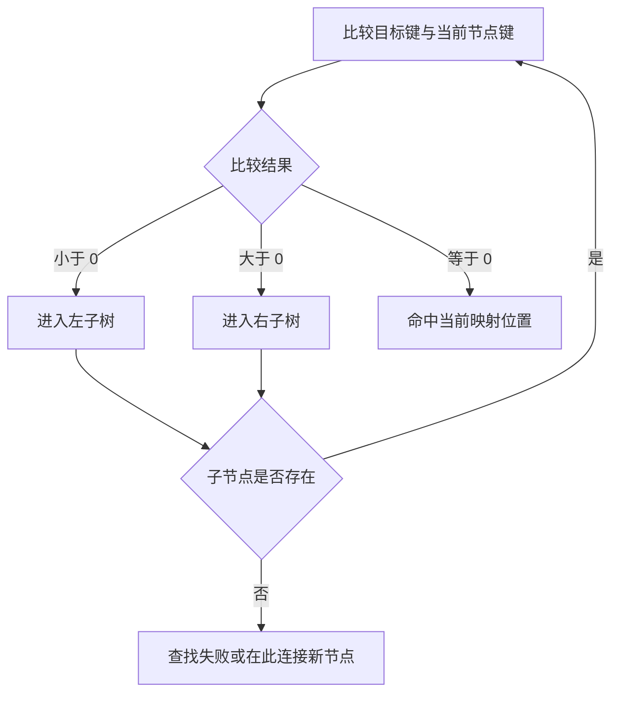
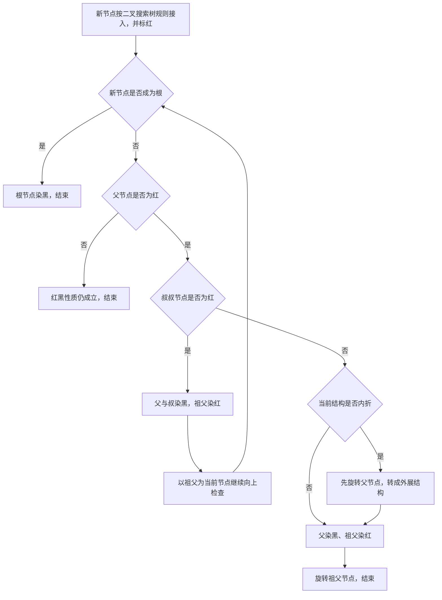

# 3.2.1.7 TreeMap

`TreeMap<K, V>` 是 Java 集合框架中的有序映射实现。它一方面实现 `Map` 的键值关联语义，另一方面通过 `SortedMap` 和 `NavigableMap` 暴露排序、邻近查找与范围视图能力。与先把数据放入普通映射、需要时再排序不同，`TreeMap` 把“所有键始终处于同一全序关系中”作为容器不变量：每次插入、查找、删除和遍历都围绕同一套比较规则进行。

这种设计最适合长期需要有序访问的数据，例如按时间点查找前一条记录、按版本号取得某个区间、维护可动态更新的索引。它并不是“会自动排序的 `HashMap`”。二者对键身份的判断依据、操作复杂度、内存访问方式、空键边界和并发行为都有本质区别。理解 `TreeMap` 的关键，是同时把握三层内容：

1. 接口契约规定调用方可以依赖什么，包括排序、导航、视图联动和异常边界。
2. 红黑树解释这些能力为何能以对数级路径完成，以及插入、删除为何需要旋转和着色。
3. 比较规则定义容器眼中的键身份，规则一旦不稳定，整棵树的可查找性都会受到破坏。

本文保持通用 Java 视角。除非明确标注为 OpenJDK 实现观察，其余结论以 Java 集合接口和 `TreeMap` 的公开契约为边界。源码字段、节点组织、平衡辅助方法及 `modCount` 行为，以 OpenJDK 11 的 `java.util.TreeMap` 实现为主要观察前提；其他兼容 JDK 可以采用不同内部代码，只要保持公开语义。

## 从 Map 到 NavigableMap：能力是逐层增加的

`TreeMap` 的类型关系可以简化为：

```text
Map
 └─ SortedMap
     └─ NavigableMap
         └─ TreeMap
```

`Map` 只要求键到值的关联，不要求任何迭代顺序。`SortedMap` 在此基础上增加按键排序的契约，提供 `comparator()`、`firstKey()`、`lastKey()` 以及 `subMap`、`headMap`、`tailMap`。`NavigableMap` 进一步把“排序”扩展为“可导航”，允许围绕一个查询键寻找严格更小、不大于、不小于、严格更大的最近条目，还提供降序视图和端点是否包含的范围重载。

因此，用接口类型表达需求时应尽量准确：

- 只需要按键取值，参数类型通常写成 `Map<K, V>`。
- 调用方需要稳定升序和基本范围能力，可以使用 `SortedMap<K, V>`。
- 调用方需要 `floorEntry`、`ceilingEntry`、可配置开闭区间或降序操作，应使用 `NavigableMap<K, V>`。
- 只有必须依赖具体构造方式或实现特征时，才需要在 API 边界暴露 `TreeMap<K, V>`。

`SortedMap` 所说的“顺序”是键的全序，而不是插入顺序，也不是值的顺序。覆盖已有键的值不会改变键的位置，因为位置只由键和比较规则决定。调用 `entrySet()`、`keySet()`、`values()` 迭代时，三个视图都沿键的升序出现；`values()` 虽然只返回值，其迭代顺序仍由对应键决定，值本身不参与排序。

```java
NavigableMap<Integer, String> map = new TreeMap<>();
map.put(30, "C");
map.put(10, "A");
map.put(20, "B");

System.out.println(map.keySet());  // [10, 20, 30]
System.out.println(map.values());  // [A, B, C]

map.put(20, "B2");
System.out.println(map);           // {10=A, 20=B2, 30=C}
```

这里第二次 `put(20, ...)` 是值替换，不是新增节点。`TreeMap` 的键唯一性由比较结果为零来判断，后文会看到，这与 `equals` 相等并不必然等价。

## 排序规则同时也是键的身份规则

每个 `TreeMap` 在生命周期内使用一套固定比较规则。构造时传入 `Comparator<? super K>`，映射使用该比较器；没有传入比较器，则采用键的自然顺序，即把键视为实现了 `Comparable` 并调用其比较逻辑。`comparator()` 在自然顺序模式下返回 `null`，这个 `null` 表示“没有显式比较器”，不表示映射没有顺序。

比较器不能只做到“多数时候看起来能排序”。要让树搜索可靠，比较关系应当具备稳定的全序性质：

- 反对称方向：若 `a` 小于 `b`，则 `b` 应大于 `a`。
- 传递性：若 `a < b` 且 `b < c`，则应有 `a < c`。
- 零比较的一致性：若 `compare(a, b) == 0`，那么 `a` 与 `b` 相对任意第三个键的比较符号应一致。
- 可重复性：只要参与比较的状态没有变化，同一对键的结果不应随时间、线程、随机数或外部环境改变。

如果这些性质被破坏，问题不只是迭代顺序“不太准确”。树在查找时只会根据每次比较选择左子树或右子树；矛盾的比较结果可能让查找进入与插入不同的路径，出现键明明在迭代结果中，却无法用预期键查到或删除的现象。`TreeMap` 不会遍历整棵树来补救一个不合法的比较器。

### 比较相等不等于 equals 相等

`Map` 的通常表述以 `equals` 判断键是否相等，但有序映射的定位依赖排序关系。对 `TreeMap` 而言，只要 `compare(k1, k2) == 0`，两个键就占据同一个映射位置。后续 `put` 会替换该位置的值，映射大小不会增加，即便 `k1.equals(k2)` 为 `false`。

```java
final class UserKey {
    private final long id;
    private final String label;

    UserKey(long id, String label) {
        this.id = id;
        this.label = label;
    }

    long id() {
        return id;
    }

    @Override
    public String toString() {
        return "UserKey[id=" + id + ", label=" + label + "]";
    }
}

Comparator<UserKey> byId =
        Comparator.comparingLong(UserKey::id);

TreeMap<UserKey, String> map = new TreeMap<>(byId);
UserKey first = new UserKey(7, "old");
UserKey second = new UserKey(7, "new");

map.put(first, "value-1");
map.put(second, "value-2");

System.out.println(first.equals(second)); // false
System.out.println(map.size());           // 1
System.out.println(map.get(first));       // value-2
System.out.println(map.firstKey());       // UserKey[id=7, label=old]
```

这个示例还揭示了一个容易忽略的细节：替换值通常不意味着把树中保存的键对象替换成新参数。以 OpenJDK 11 的实现为例，查找命中比较结果为零的节点后，只更新该节点的 value，原 key 引用仍在节点中。因此“使用等价新键执行 `put`”不能被当成更新键对象展示字段的方法。

Java 文档通常把“比较规则与 `equals` 一致”表述为有序映射完整遵守 `Map` 一般契约的重要条件。所谓一致，是指对任意相关键，`compare(a, b) == 0` 与 `a.equals(b)` 具有相同真假。规则不一致并不必然让 `TreeMap` 立即抛异常；它仍会按照比较规则运转，但调用方必须接受容器的“同一个键”与其他基于 `equals` 的集合不同。

这会影响集合之间的交互。例如，把同一批对象分别放入 `HashMap` 和使用自定义比较器的 `TreeMap`，两个映射的大小可能不同。再如，`containsKey`、`get` 和 `remove` 都沿比较路径工作，不会在比较为零后再调用 `equals` 做二次确认。工程上应明确决定：比较器是在定义真正的业务身份，还是只想调整展示顺序。如果只是展示排序，而业务身份仍需完整 `equals`，直接把该比较器用于 `TreeMap` 可能会错误合并键。

### 自然顺序的类型边界

未提供比较器时，键必须能按自然顺序相互比较。实践中通常意味着所有非空键属于兼容的 `Comparable` 类型。泛型声明 `TreeMap<K, V>` 并没有在编译期强制 `K extends Comparable<K>`，因为 `TreeMap` 还要支持构造时传入外部比较器；于是自然顺序模式下的不兼容可能延迟到运行期，以 `ClassCastException` 暴露。

```java
Map<Object, String> map = new TreeMap<>();
map.put("text", "A");
map.put(42, "B"); // 运行期无法建立 String 与 Integer 的自然顺序
```

即使映射为空，OpenJDK 11 的自然顺序插入路径也会对首个键执行类型和空值检查，从而尽早拒绝不能比较的首键。不要依赖“第一项不需要和其他节点比较，所以任何对象都能先放进去”这种推测；公开层面应把键可比较视为前置条件。

## null：值可以为空，键取决于比较规则

`TreeMap` 允许 `null` value。`get(key)` 返回 `null` 时，既可能表示键不存在，也可能表示键存在且映射到 `null`，必须用 `containsKey` 区分。这一点与普通 `Map` 语义一致。

```java
TreeMap<Integer, String> map = new TreeMap<>();
map.put(1, null);

System.out.println(map.get(1));         // null
System.out.println(map.containsKey(1)); // true
System.out.println(map.get(2));         // null
System.out.println(map.containsKey(2)); // false
```

`null` key 的边界更严格。采用自然顺序时，`null` 无法执行自然比较，`put(null, value)`、与 `null` 相关的定位操作会抛出 `NullPointerException`。使用显式比较器时，只有比较器本身明确支持 `null`，映射才可能接纳空键，例如 `Comparator.nullsFirst(...)` 或 `Comparator.nullsLast(...)`。

```java
Comparator<String> order =
        Comparator.nullsFirst(Comparator.naturalOrder());

NavigableMap<String, Integer> map = new TreeMap<>(order);
map.put(null, 0);
map.put("b", 2);
map.put("a", 1);

System.out.println(map); // {null=0, a=1, b=2}
```

不能把“`TreeMap` 支持空键”或“`TreeMap` 禁止空键”脱离比较器笼统记忆。准确结论是：自然顺序模式不接受空键；显式比较器模式是否接受，取决于比较器是否为 `null` 定义了与其他键一致且稳定的顺序。即使某个自定义比较器碰巧没有立即抛异常，也应通过明确的比较器组合和测试表达空键策略，而不是依赖偶然实现。

范围 API 对 `null` 的处理同样受比较规则约束。端点需要参与比较，因此一个不支持空值的比较器会拒绝 `subMap(null, ...)`、`headMap(null, ...)` 等调用。value 不参与树排序，所以空 value 不会影响导航和平衡。

## 红黑树为什么适合作为有序映射骨架

二叉搜索树要求：对任意节点，左子树键都小于该节点键，右子树键都大于该节点键，比较为零的键落在当前节点。若只维护这个顺序条件，按递增键连续插入时，树可能退化为单链，查找路径从 `O(log n)` 退化到 `O(n)`。

红黑树在二叉搜索树之上增加颜色约束，用有限旋转和重新着色控制树高。常用不变量可表述为：

1. 每个节点具有红或黑两种颜色。
2. 根节点为黑色。
3. 所有空叶子位置按黑色哨兵理解。
4. 红色节点的子节点不能是红色，即不存在连续红节点。
5. 从任一节点到其所有后代空叶子的路径包含相同数量的黑节点。

`TreeMap` 的具体源码可以用 `null` 子引用代表空叶子，而不必真的为每个空位分配哨兵对象；红黑树证明中的黑色空叶子仍是理解不变量的一部分。颜色不表达键的业务属性，只服务于平衡。

由这些约束可以推导树高不会无限偏斜。最短根叶路径主要由黑节点组成，最长路径最多在黑节点之间插入红节点，因此最长路径不会超过最短路径的两倍。含 `n` 个内部节点的红黑树高度上界为 `2 * log2(n + 1)`。所以，只要每次比较本身可视为有界成本，沿树高完成的查找、插入定位和删除定位具有 `O(log n)` 上界。



红黑树并不追求每个节点左右子树高度完全相同。AVL 树等结构有更严格的高度平衡，而红黑树选择较宽松约束，以较少的结构调整换取足够稳定的查找高度。这种取舍适合既有查询又有动态插入、删除的通用映射。

## OpenJDK 实现中的节点与查找路径

在 OpenJDK 11 的实现中，每个条目节点保存 key、value、left、right、parent 和 color。映射对象还维护 root、size、comparator、modCount，以及若干延迟创建的视图引用。这里没有哈希桶，也没有容量、负载因子和扩容过程。每新增一个不同键，通常分配一个树节点并连接父子引用；节点式结构会带来多次引用跳转和一定对象开销。

查找主路径可以概括为：

1. 从根节点开始。
2. 使用显式 `Comparator`，或键的自然顺序，与当前节点键比较。
3. 小于零进入左孩子，大于零进入右孩子，等于零则命中。
4. 遇到空子引用时查找失败。

OpenJDK 为有比较器和自然顺序分别保留了路径，避免在循环每一层重复判断比较器是否存在。自然顺序路径会把查询键转换为 `Comparable` 后比较。这个组织属于实现优化，不是调用方可以依赖的 API 细节。

`containsValue` 不享受按键排序带来的加速。值没有建立额外索引，也不参与树结构，因此需要按条目遍历，时间复杂度为 `O(n)`。同理，`values().contains(value)` 也是线性搜索。选择 `TreeMap` 时不能把“树结构”误解为对键和值都能对数查找。

## 插入：先按搜索树定位，再修复红黑性质

插入一个新键时，首先执行普通二叉搜索树查找。如果比较为零，只替换已有节点的 value，树结构、`size` 和结构修改计数不因这次替换而增加。如果一直走到空子位置，则创建节点，连接到最后访问节点的左侧或右侧，增加大小，然后执行插入平衡。

新节点通常先标记为红色。原因是插入红节点不会改变从祖先到空叶子的黑节点数量，因此天然保留“各路径黑高相同”；它可能造成的主要冲突是父节点也为红色。若直接插入黑节点，则该路径黑高立即增加，修复范围往往更大。

插入修复围绕父节点、祖父节点和叔叔节点展开：

- 新节点成为根时，把根染黑即可。
- 父节点为黑时，没有连续红节点，无需继续调整。
- 父节点为红且叔叔为红时，把父、叔染黑，祖父染红，再把祖父作为新的检查点向上处理。
- 父节点为红且叔叔为黑时，需要根据新节点、父节点和祖父节点形成“内折”还是“外展”形状执行一次或两次旋转，并配合父、祖父重新着色。



左旋和右旋不会改变键的中序顺序。以左旋为例，某节点的右孩子上升，该右孩子的左子树移交为原节点的右子树，原节点下降为其左孩子；相关 parent 引用必须同步更新。旋转改变局部树形和路径长度，但保持“左键小、右键大”的搜索树不变量。

插入平衡的循环次数受树高约束，旋转次数为常数级，重新着色可能沿祖先向上推进，因此插入总复杂度为 `O(log n)`。这里的 `n` 是映射中的不同排序键数量，而不是调用 `put` 的总次数。

## 删除：结构替换与黑高修复

删除比插入复杂，因为移除黑节点可能减少某些路径的黑节点数。流程可以拆成“找到目标”“把问题化简为至多一个孩子的节点”“断开节点”“必要时修复平衡”。

若目标节点有两个孩子，不能简单用其中一个孩子整体顶替而保持所有顺序关系。常见做法是找到其中序后继，即右子树中的最小节点。后继不可能有左孩子。OpenJDK 11 的 `TreeMap` 删除实现会把后继的 key 和 value 复制到目标节点，再把实际待删除节点转为该后继节点。这样最终物理断开的节点至多只有一个非空孩子。

这个实现细节对条目引用有微妙影响：如果外部暂时持有由某些内部迭代路径暴露的条目对象，删除双子节点时，节点内容可能因后继复制而变化。公开编程中不应把可变内部条目身份当作稳定节点标识；应依赖键值语义和视图契约，而不是推测树节点对象生命周期。

待删除节点为红色时，直接移除通常不改变黑高，也不会产生连续红冲突。待删除节点为黑色时，需要把“少一个黑节点”的失衡向兄弟节点一侧修复。修复过程根据兄弟颜色及兄弟孩子颜色选择：

- 兄弟为红：通过旋转父节点并交换父、兄弟颜色，把问题转换成兄弟为黑的情形。
- 兄弟为黑，且兄弟两个孩子都为黑：把兄弟染红，将额外的黑色问题上移到父节点。
- 兄弟为黑，远侧孩子为黑、近侧孩子为红：先旋转兄弟，转换为远侧孩子为红的情形。
- 兄弟为黑且远侧孩子为红：让兄弟取得父节点颜色，父和远侧孩子染黑，再旋转父节点，局部黑高恢复，修复结束。

左右两侧是镜像关系。“近侧”指靠近待修复节点的一侧，“远侧”指远离它的一侧。死记某个左、右分支容易混乱，真正目标始终是恢复所有根叶路径相同黑高，同时避免红色父子连续。

当被删除黑节点拥有一个红孩子时，可以用该孩子替代节点，再把孩子染黑，原路径黑高即可恢复。空树、删除根、只有一个节点等边界也都能归入这些规则。删除定位需要 `O(log n)`，平衡修复最多沿树高上移，所以删除保持 `O(log n)` 上界。

## 导航操作：围绕查询键找最近边界

`NavigableMap` 最有价值的能力不是单纯取首尾键，而是回答“离这个键最近且满足方向条件的是谁”。四组核心操作如下：

| 操作 | 条件 | 含义 |
| --- | --- | --- |
| `lowerEntry(k)` | key `< k` | 严格小于 `k` 的最大键 |
| `floorEntry(k)` | key `<= k` | 小于等于 `k` 的最大键 |
| `ceilingEntry(k)` | key `>= k` | 大于等于 `k` 的最小键 |
| `higherEntry(k)` | key `> k` | 严格大于 `k` 的最小键 |

对应的 `lowerKey`、`floorKey`、`ceilingKey`、`higherKey` 只返回键。没有满足条件的条目时返回 `null`。若映射本身允许 `null` 键，返回 `null` 可能与真实空键产生表达歧义，此时优先使用返回 `Map.Entry` 的版本，并以条目是否为 `null` 判断是否命中。

```java
NavigableMap<Integer, String> map = new TreeMap<>();
map.put(10, "A");
map.put(20, "B");
map.put(40, "C");

System.out.println(map.lowerKey(20));   // 10
System.out.println(map.floorKey(20));   // 20
System.out.println(map.ceilingKey(21)); // 40
System.out.println(map.higherKey(40));  // null
```

这些操作不需要先得到完整排序列表再二分。沿树下降时，算法会保存当前最合适的候选节点。例如寻找 `floor(k)`：若比较相等立即返回；若查询键小于当前键，只能去左子树；若查询键大于当前键，当前节点已是一个合法候选，但右子树可能存在更接近的合法键，于是先向右搜索，找不到再回到候选。父引用也可以帮助从某个节点向祖先寻找前驱或后继。

`firstEntry()` 和 `lastEntry()` 分别取得最小、最大键条目，空映射返回 `null`；`firstKey()` 和 `lastKey()` 在空映射上抛出 `NoSuchElementException`。`pollFirstEntry()`、`pollLastEntry()` 不仅返回端点，还会从映射删除它，适合把 `TreeMap` 当作按优先级弹出条目的结构。不过它没有同键多元素语义，也不是线程安全优先队列；若一个优先级下需要多个任务，应把 value 设计为集合或选择更匹配的数据结构。

公开方法返回的某些导航条目是键值映射的快照式条目，不能假设都支持 `setValue`。若需要更新映射，应使用已知键调用 `put`、`replace` 或对明确支持写回的 `entrySet` 迭代条目按契约操作，不要把任意 `firstEntry()`、`floorEntry()` 的返回值当成可写节点句柄。

## 范围视图：不是副本，而是受边界约束的窗口

`subMap`、`headMap` 和 `tailMap` 返回的是背靠原映射的视图。视图不会复制范围内所有节点，而是保存端点、开闭属性和方向信息，在每次操作时检查键是否位于允许范围。创建视图通常是轻量操作，遍历成本与实际访问的范围元素数量相关。

`NavigableMap` 重载可以精确表达开闭区间：

```java
NavigableMap<Integer, String> map = new TreeMap<>();
for (int i = 1; i <= 6; i++) {
    map.put(i, "v" + i);
}

NavigableMap<Integer, String> window =
        map.subMap(2, true, 5, false); // [2, 5)

System.out.println(window); // {2=v2, 3=v3, 4=v4}
```

`SortedMap` 旧式 `subMap(fromKey, toKey)` 是左闭右开 `[fromKey, toKey)`；`headMap(toKey)` 默认不含上界；`tailMap(fromKey)` 默认包含下界。使用布尔参数的 `NavigableMap` 重载能避免调用方靠记忆推断边界，复杂业务代码中更清晰。

范围视图与原映射双向联动：

```java
window.remove(3);
System.out.println(map.containsKey(3)); // false

map.put(4, "changed");
System.out.println(window.get(4));      // changed

map.put(6, "outside");
System.out.println(window.containsKey(6)); // false
```

通过视图写入一个超出边界的键会抛出 `IllegalArgumentException`，而不是悄悄写入原映射后在视图中隐藏。对范围外键执行只读查询通常表现为不命中，但具体方法还要遵守键类型、空值和比较器异常契约。调用 `window.clear()` 只删除范围内条目，却直接改变原映射；这是一种高效的区间删除方式，也是一种常见误用风险。

视图还可以继续派生视图。新的边界必须位于父视图允许的范围内，不能借子视图越过父边界。边界判断始终使用映射自身比较规则，不使用 `equals`，也不使用键的另一套临时排序。

### 降序视图中的方向反转

`descendingMap()` 返回键顺序反转的联动视图，`navigableKeySet()` 与 `descendingKeySet()` 则给出可导航键集合。降序视图不是把元素复制到另一棵反向树中，而是用相反方向解释首尾、迭代和导航。

```java
NavigableMap<Integer, String> forward = new TreeMap<>();
forward.put(1, "A");
forward.put(2, "B");
forward.put(3, "C");

NavigableMap<Integer, String> reverse = forward.descendingMap();
System.out.println(reverse.keySet()); // [3, 2, 1]

reverse.remove(3);
System.out.println(forward);          // {1=A, 2=B}
```

在降序映射中，“更低”和“更高”的语义按该视图的比较顺序解释，阅读组合调用时容易混淆。范围端点也必须按当前视图顺序提供：升序映射的 `subMap(2, true, 5, false)` 与降序映射上的对应范围参数方向不同。工程中若只想倒序展示，直接迭代 `descendingMap()` 很清楚；若还要叠加多层导航和范围，最好封装具有业务含义的方法并为边界写测试。

### 视图会延长原映射的可达性

范围视图和键、条目、值视图都持有对原映射或相关视图对象的引用。只要一个小范围视图仍被长期保存，整个底层映射通常仍然可达，不能因为视图只暴露少量元素就认为其余节点可被回收。如果需要从大型映射中截取一小段后长期独立持有，应显式复制：

```java
NavigableMap<Integer, String> detached =
        new TreeMap<>(map.subMap(100, true, 200, false));
```

复制后的映射与原映射不再联动。构造时还应注意比较器是否被保留：从 `SortedMap` 构造 `TreeMap` 会采用源映射的排序规则；若只是把条目逐个放入一个使用不同比较器的新映射，键合并和顺序可能发生变化。

## 迭代顺序、中序后继与修改规则

升序迭代本质上是红黑树的中序遍历：先访问最左节点，然后不断寻找当前节点的中序后继。若当前节点存在右子树，后继是右子树最左节点；否则沿 parent 向上，直到第一次从某个父节点的左侧上来，该父节点就是后继。利用 parent 引用，迭代器不必为整棵树维护显式递归栈。

遍历所有元素的总时间是 `O(n)`，不是 `O(n log n)`。虽然某次寻找后继可能向上经过多层，但整个中序遍历中每条树边只会被有限次数经过，摊销后每个元素为常数级推进。降序迭代使用镜像的前驱逻辑。

`keySet()`、`entrySet()`、`values()` 返回的都是联动视图。通过这些视图的迭代器调用 `remove()` 会删除底层映射当前条目，这是遍历期间安全删除的标准方式：

```java
TreeMap<Integer, String> map = new TreeMap<>();
map.put(1, "keep");
map.put(2, "drop");
map.put(3, "keep");

Iterator<Map.Entry<Integer, String>> iterator =
        map.entrySet().iterator();

while (iterator.hasNext()) {
    Map.Entry<Integer, String> entry = iterator.next();
    if ("drop".equals(entry.getValue())) {
        iterator.remove();
    }
}
```

在迭代期间直接调用 `map.remove(...)` 或插入新排序键，会形成迭代器之外的结构性修改。普通 `TreeMap` 迭代器采用 fail-fast 策略，通常会在后续操作检测到修改计数不一致并抛出 `ConcurrentModificationException`。

### fail-fast 是错误探测，不是并发保证

以 OpenJDK 11 为例，`TreeMap` 使用 `modCount` 记录结构性修改，迭代器创建时保存期望值，`next`、`remove` 等路径比较两者。新增不同键、删除键、清空非空映射属于结构性修改；仅替换已有键的 value 不改变树节点数量和拓扑，通常不增加 `modCount`。

这带来两个结论：

1. 遍历期间覆盖已有键的 value 不一定触发 `ConcurrentModificationException`，但这不代表任意并发更新都是安全的。
2. fail-fast 是尽力而为的诊断机制，不承诺在所有竞态下立即或必然抛异常，不能用来证明没有数据竞争。

单线程中，除了使用迭代器自身 `remove`，还可以先收集待删除键，遍历结束后统一修改。多线程中则必须使用同步协议或并发容器。捕获 `ConcurrentModificationException` 后重试通常只是掩盖错误，因为原始操作可能已经执行了一部分，且异常不提供事务回滚。

迭代器没有承诺固定快照。即使外部同步阻止结构变化，value 指向的可变对象仍可能自行变化；映射只组织引用，不会冻结对象内部状态。

## 复杂度成立需要哪些前提

常用复杂度可以总结为：

| 操作 | 典型上界或成本 |
| --- | --- |
| `get`、`containsKey` | `O(log n)` |
| 插入不同键、删除键 | `O(log n)` |
| `firstKey`、`lastKey` | `O(log n)` 的树端路径 |
| `lower`、`floor`、`ceiling`、`higher` | `O(log n)` |
| `containsValue` | `O(n)` |
| 完整有序遍历 | `O(n)` |
| 创建范围或降序视图 | 通常为轻量视图创建 |
| 遍历范围视图 | 与范围定位及实际遍历元素数量相关 |

这些表达隐含若干前提。

首先，`n` 指不同排序键的数量。其次，比较器的一次调用通常被视为 `O(1)`。如果比较器要扫描长字符串、解析文本、访问磁盘、加锁或执行远程操作，那么真实成本应写成 `O(Ccompare * log n)`，其中 `Ccompare` 可能远大于树操作本身。比较器应当纯粹、快速且无副作用。

再次，红黑树高度保证只在比较关系稳定时有意义。若比较器随外部状态变化，已有节点并不会自动重排，后续搜索不再遵守当初建立的左右关系。结构在指针层面可能仍是一棵红黑树，却不再是当前比较规则下合法的二叉搜索树。

最后，大 O 不代表 `TreeMap` 一定比其他容器快或慢。节点对象、父子引用和随机内存跳转会影响缓存局部性；`HashMap` 在哈希分布良好时通常提供更低的平均查找成本；小数据量下，比较器调用和对象分配等常数项可能主导结果。性能敏感场景应基于真实键类型、数据规模和操作比例进行基准测试。

## 可变键会让树的索引与对象当前状态脱节

如果键的参与比较字段在插入后发生变化，节点不会自动移动到新位置。树仍保留插入时形成的链接，而新的查询比较使用变化后的字段，于是同一个对象可能沿错误路径搜索。

```java
final class MutableKey {
    int priority;

    MutableKey(int priority) {
        this.priority = priority;
    }
}

Comparator<MutableKey> byPriority =
        Comparator.comparingInt(key -> key.priority);

TreeMap<MutableKey, String> map = new TreeMap<>(byPriority);
MutableKey key = new MutableKey(10);
map.put(key, "task");

key.priority = 100; // 破坏了插入时的排序依据
```

只有一个节点时，某些查询可能碰巧仍能命中；加入更多节点后，表现会依赖树形，不能据此认为修改安全。可能出现：

- `get` 或 `remove` 无法按预期找到键。
- 迭代顺序与键当前字段不一致。
- 新键被放到基于当前比较结果选择的位置，使全局中序顺序进一步失真。
- 范围视图错误地包含或排除该键。

稳妥做法是使用不可变键，或确保参与 `compareTo` / `Comparator` 的字段在键留在映射期间不变。确实需要改变排序字段时，应先按旧状态删除，再修改，再重新插入。删除动作必须在修改前完成，否则旧搜索路径可能已经丢失。

value 可以自由变化而不影响树定位，只要比较器不通过 value 或其他可变外部表间接决定键顺序。比较器捕获一个可变优先级表与直接修改键字段具有同类风险。

## 比较器设计中的一致性和溢出问题

手写整数比较时，不应使用 `return a.id - b.id`。减法可能溢出，使正负号错误并破坏传递性。应使用 `Integer.compare`、`Long.compare` 或 `Comparator.comparingInt` / `comparingLong`。

```java
final class Job {
    private final int priority;
    private final long sequence;

    Job(int priority, long sequence) {
        this.priority = priority;
        this.sequence = sequence;
    }

    int priority() {
        return priority;
    }

    long sequence() {
        return sequence;
    }
}

Comparator<Job> order = Comparator
        .comparingInt(Job::priority)
        .thenComparingLong(Job::sequence);
```

是否添加 `thenComparing` 取决于身份语义。如果相同 priority 的任务应在映射中共存，就必须增加能区分它们的稳定字段；若相同 priority 本就代表同一个映射槽位，则不应为了“避免覆盖”随意加入对象地址、随机数或变化字段。

字符串比较也要明确语义。`String.CASE_INSENSITIVE_ORDER` 可能把大小写不同的键比较为零；这适合真正大小写不敏感的索引，却不适合需要同时保存原始拼写不同键的场景。区域相关排序更复杂：用于用户展示的 `Collator` 规则未必适合作为持久业务身份，且区域配置变化会带来顺序稳定性问题。

比较器还应处理全部合法键，而不是只覆盖样例数据。若规则按多个字段拼接，要明确空字段、极值、负数、特殊浮点值等边界。`Double.compare`、`Float.compare` 对 NaN、正负零有定义，自己用 `<`、`>` 拼装比较器容易遗漏这些情况。

测试比较器时，除了验证排序结果，还应构造多组键检查：

- `compare(a, a) == 0`。
- `sign(compare(a, b)) == -sign(compare(b, a))`。
- 若 `a < b` 且 `b < c`，则 `a < c`。
- 若 `a` 与 `b` 比较为零，它们对 `c` 的方向一致。
- 若声称与 `equals` 一致，则零比较和 `equals` 结果一致。

这些测试不能数学上证明所有输入都正确，但能覆盖溢出、遗漏字段和可变状态等常见错误。

## 非线程安全边界

`TreeMap` 不提供内部并发同步。多个线程只读访问一个已经安全发布、之后不再修改的映射，可以作为不可变使用约定；一旦存在并发写入，所有访问都应遵循同一同步策略。未同步的读写不仅可能得到旧值，还可能观察到结构调整过程中的不一致状态，Java 内存模型也不保证所需可见性。

可以使用 `Collections.synchronizedSortedMap` 包装有序映射，但包装器只为经包装器执行的单次方法提供互斥。复合操作仍需在同一把锁下完成：

```java
SortedMap<Integer, String> map =
        Collections.synchronizedSortedMap(new TreeMap<>());

synchronized (map) {
    if (!map.containsKey(1)) {
        map.put(1, "value");
    }
}
```

遍历同步包装视图时也需要按包装器文档使用正确锁对象，不能仅锁住临时取得的视图就假设底层映射受保护。更重要的是，不得保留原始 `TreeMap` 引用并绕过包装器访问，否则同步协议被破坏。

若需要高并发有序映射，`ConcurrentSkipListMap` 通常是直接候选。它提供线程安全的 `ConcurrentNavigableMap` 语义和弱一致迭代器，不采用 fail-fast；迭代可与更新并发，但不代表得到某一时刻的原子快照。它不允许 `null` key 或 `null` value，以避免并发查询中 `null` 的歧义。多步业务不变量仍需使用更高层协调，不能因为容器线程安全就把“先检查再更新”的任意组合视为原子事务。

把 `TreeMap` 声明为 `volatile` 只能保证引用的可见性，不能让其内部多步修改原子化。把映射包在不可变对象中安全发布后只读是一种方案；写时复制并用新不可变快照替换引用也是一种方案，但复制成本为 `O(n)`，适用于读多写极少且需要快照语义的场景。

## 与 HashMap、LinkedHashMap、ConcurrentSkipListMap 的权衡

容器选择应先看语义，再看平均复杂度。

| 实现 | 主要顺序语义 | 典型查找 | 范围/邻近查询 | 并发写 | null 典型边界 |
| --- | --- | --- | --- | --- | --- |
| `TreeMap` | 按键比较顺序 | `O(log n)` | 原生支持 | 不安全 | value 可空；key 取决于比较器 |
| `HashMap` | 不承诺迭代顺序 | 平均 `O(1)` | 不支持 | 不安全 | 一个空 key，value 可空 |
| `LinkedHashMap` | 插入顺序或访问顺序 | 平均 `O(1)` | 不支持 | 不安全 | 与 `HashMap` 类似 |
| `ConcurrentSkipListMap` | 按键比较顺序 | 期望 `O(log n)` | 原生支持 | 支持并发 | key、value 均不允许空 |

主要操作只是精确键查找，而且不需要有序迭代、范围和邻近键时，`HashMap` 通常更直接。需要复现插入顺序、实现访问顺序缓存或稳定遍历，但不需要按键大小查询时，`LinkedHashMap` 更贴合语义。不要为了得到一次排序输出，就长期承担树结构成本；可以在输出点复制键并排序，前提是排序不是高频核心操作。

反过来，如果数据持续变化且频繁执行“找不超过目标的最大键”“删除某个键区间”“从某个端点开始遍历”，`TreeMap` 比 `HashMap + 每次排序` 更自然。后者若每次查询都重新排序，成本和代码复杂度都会增加；若额外维护排序索引，又回到了维护第二种数据结构及一致性的问题。

需要并发、排序和导航时，优先评估 `ConcurrentSkipListMap`，而不是默认给 `TreeMap` 所有方法外加一把粗锁。粗锁方案可能适合数据小、竞争低且需要强互斥复合操作的场景；跳表方案通常提供更好的并发推进能力，但单线程常数、内存占用和弱一致迭代语义不同。应根据吞吐、延迟、快照要求和复合原子性选择。

`PriorityQueue` 也常被误认为替代品。它只保证队首是最小或最大优先级元素，不保证完整迭代有序，也不提供按任意键的映射查找和范围视图。若只需反复取最小任务，优先队列可能更合适；若还要按唯一键更新、查前驱后继或遍历区间，`TreeMap` 的映射能力更完整。

## 构造、复制与批量建立时的语义

空 `TreeMap` 可以使用自然顺序或显式比较器构造。用普通 `Map` 构造时，目标映射采用自然顺序，然后逐项加入；源键若不可自然比较，会在构建过程中失败。用 `SortedMap` 构造时，可以继承源映射的比较器和排序关系。

```java
SortedMap<String, Integer> source =
        new TreeMap<>(String.CASE_INSENSITIVE_ORDER);
source.put("a", 1);

TreeMap<String, Integer> copy = new TreeMap<>(source);
System.out.println(copy.comparator()
        == String.CASE_INSENSITIVE_ORDER); // true
```

OpenJDK 可以对已按同一规则排序的数据采用专门的线性建树路径，例如从 `SortedMap` 构造或某些反序列化场景，不必对每个元素执行普通 `O(log n)` 插入。该优化属于实现细节，不能据此假设任意 `putAll` 都是线性，也不能依赖具体树形。公开层面只应依赖复制后的键值、顺序和比较器语义。

`clone()` 产生结构独立的浅拷贝：树节点会重新建立，但 key 和 value 对象本身仍共享引用。修改一个映射的结构不影响另一个映射，修改共享可变 value 的内部状态则可能同时被两边观察。若 key 可变，共享键还会让两个映射同时面临排序失效风险。

序列化兼容也不应与树形绑定。即使某实现序列化条目后重建平衡树，调用方应关注键值和比较器是否可序列化、反序列化后的公开语义，而不是期待节点颜色、根节点或形状保持一致。自定义比较器若不是可序列化对象，序列化整个映射可能失败。

## 常见误区与排查路径

### “TreeMap 使用 equals 去重”

错误。它按比较结果为零识别同一映射位置。排查大小异常或值被覆盖时，首先检查比较器是否遗漏了区分字段，以及是否有大小写折叠、取整、溢出等情况。

### “只要迭代有序，键就一定能查到”

错误。可变键或变化的比较器会让节点仍可被中序遍历看到，却无法沿当前比较路径定位。检查键插入后是否修改、比较器是否依赖外部状态。

### “subMap 返回一份切片副本”

错误。它是联动视图。排查原映射条目被意外删除时，检查是否对范围视图执行了 `clear`、`remove` 或通过迭代器删除。需要隔离时显式创建新映射。

### “捕获 ConcurrentModificationException 就解决了并发”

错误。fail-fast 不是锁，也不是稳定并发检测。异常只提示迭代期间可能发生了不允许的结构修改。修复应统一修改路径、使用迭代器删除、外部同步，或更换并发容器。

### “O(log n) 与键内容无关”

不完整。树层数是对数级，但每层都调用比较逻辑。长字符串比较可能检查多个字符，复杂比较器可能创建临时对象。优化前应分析比较器和数据分布，并用基准验证。

### “用 value 是否为 null 判断键存在”

错误，因为 `TreeMap` 允许空 value。使用 `containsKey`，或在业务层禁止空 value，从类型和文档上消除歧义。

### “相同优先级只能覆盖，所以 TreeMap 不适合”

是否覆盖取决于键和比较器。可以把优先级与稳定序号组合成复合键，或让每个优先级映射到一个队列。不要用不稳定随机数强行区分，也不要在比较器中遇到不同对象就返回非零而忽略传递性。

## 使用 TreeMap 的设计检查

决定采用 `TreeMap` 前，可以依次确认：

1. 核心需求是否确实包含长期有序、范围查询、前驱后继或动态最值。
2. 键的比较规则能否形成稳定全序，是否需要与 `equals` 一致。
3. 比较为零究竟表示同一个业务键，还是只表示展示顺序相同。
4. 键及比较器依赖状态在映射生命周期内是否不可变。
5. 是否允许空键、空值，并且调用方能否明确区分缺失与空值。
6. 返回范围时需要联动视图还是独立副本，所有权和生命周期是否清晰。
7. 是否存在并发写；若存在，需要外部同步、快照方案还是 `ConcurrentSkipListMap`。
8. 比较器成本和节点对象开销在目标数据规模下是否可接受。
9. API 是否应暴露 `NavigableMap`，而不是把具体 `TreeMap` 固定为公共契约。

测试不能只覆盖顺序插入和 `get`。至少应包含逆序、随机序、重复比较键、删除根和双子节点、空映射导航、四种邻近查询、开闭区间、降序范围、视图联动、越界写入、迭代器删除、外部结构修改，以及比较器极值和传递性样例。对可空策略和并发包装，也应分别验证异常及同步边界。

## 总结

`TreeMap` 的核心不是“把 Map 排个序”，而是用一套固定比较关系同时定义键的次序和映射身份，并以红黑树持续维护这个关系。红黑不变量限制树高，使精确查找、插入、删除、邻近键和端点定位保持对数级路径；中序遍历提供按键有序的线性扫描。

它的强项是动态有序索引：`NavigableMap` 的前驱、后继、开闭范围和降序视图可以直接表达许多边界查询。相应代价是每次定位都要比较，多节点引用带来常数和空间成本，并且比较器与键状态必须长期稳定。范围、键集和降序结果多为联动视图，这能避免复制，也要求调用方明确所有权和修改影响。

选择 `TreeMap` 时，应把比较为零的含义、空值策略、视图语义和并发协议视为 API 设计的一部分。只需要平均快速精确查找时优先考虑 `HashMap`；需要插入或访问顺序时考虑 `LinkedHashMap`；需要并发有序导航时评估 `ConcurrentSkipListMap`。当访问模式真正依赖排序关系本身，`TreeMap` 才不仅是一个实现选择，更是对数据语义的准确表达。
