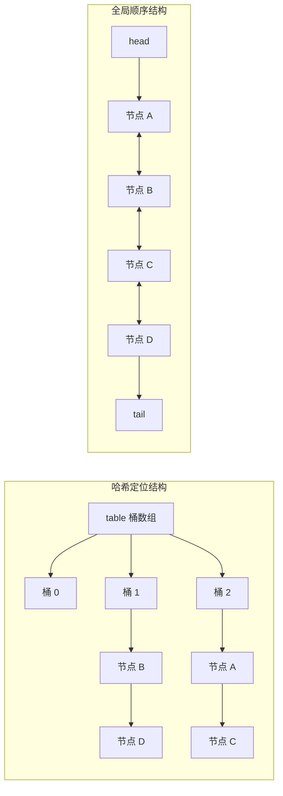
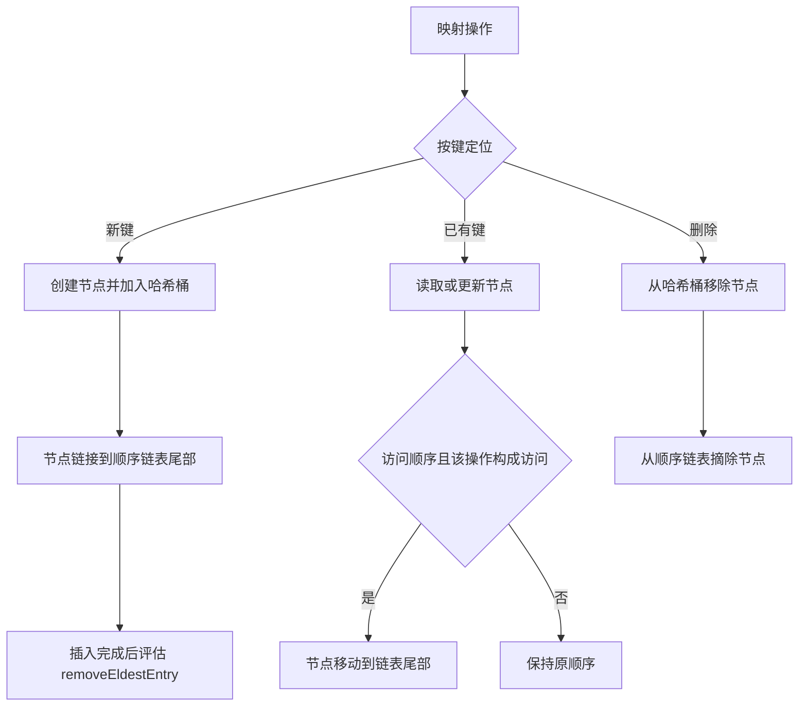
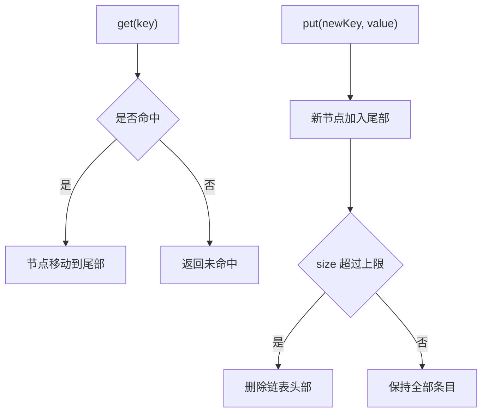

# 3.2.1.8 LinkedHashMap

`LinkedHashMap` 是一种具有明确迭代顺序的哈希映射。它继承 `HashMap` 的按键定位能力，又用一条贯穿全部节点的双向链表记录节点之间的先后关系。因此，它解决的不是“如何把键值对排序”，而是“如何在保持哈希查找效率的同时，稳定地记住插入或访问次序”。

这个定义包含三个容易混淆的边界。第一，`LinkedHashMap` 的顺序不是键的自然顺序，也不依赖 `Comparable` 或 `Comparator`；需要按键大小排序时，应考虑 `TreeMap`。第二，顺序链表只决定遍历先后，不参与根据键查找节点；查找仍由哈希表完成。第三，访问顺序模式虽然可以构造简单的 LRU 容器，但 `LinkedHashMap` 本身并不是完整的缓存框架，它只提供顺序维护和插入后的淘汰钩子。

本文以 Java SE 的公开契约为判断 API 行为的依据。涉及字段、节点类型和钩子方法的源码分析，主要以 OpenJDK 8、11、17 和 21 中共同的实现思路为前提；这些细节有助于理解机制，但不应被当成所有 Java 实现都必须逐字段复制的规范。Java 21 开始 `LinkedHashMap` 还实现了 `SequencedMap`，增加了首尾定位和反向视图等能力，本文会在相关位置说明其影响，不用新 API 反推早期版本的能力。

## 两套结构共同组成一个映射

理解 `LinkedHashMap` 的关键，是把“按键定位”和“按顺序遍历”拆成两条彼此独立、又指向同一批节点的路径。

按键定位沿用 `HashMap` 的基本机制：对键计算哈希，根据表容量定位桶，再在桶内通过哈希值和 `equals` 判断是否为目标键。在 OpenJDK 8 及之后的常见实现中，冲突较少时桶内是链表，满足容量和节点数条件后可能树化为红黑树。因而 `LinkedHashMap` 对键的要求与 `HashMap` 相同：相等的键必须具有相同的 `hashCode`，并且键放入映射后，不应再改变参与 `equals` 或 `hashCode` 的状态。

顺序遍历则不扫描桶数组，而是沿全局双向链表前进。每个普通节点除 `HashMap` 节点已有的哈希值、键、值和桶内后继引用外，还具有指向顺序前驱和顺序后继的引用。映射另外保存顺序链表的首节点和尾节点。节点首次加入映射时通常接到尾部；节点删除时从链表摘除；访问顺序模式下，命中的节点还可能从原位置移动到尾部。



图中同名节点代表同一个对象，而不是复制出来的两份数据。它既属于某个哈希桶，又处在全局顺序链表的某个位置。正是这种“一组节点、两套链接关系”的设计，使查找不必沿顺序链表线性扫描，遍历也不必逐个检查哈希表中的空桶。

这个结构还解释了一个重要性能差异。普通 `HashMap` 的迭代成本与“容量加元素数量”相关，因为迭代器需要扫描桶数组；`LinkedHashMap` 沿有效节点组成的顺序链表迭代，成本主要与元素数量相关。将初始容量设置得很大仍会浪费桶数组内存，也会影响扩容阈值，但对 `LinkedHashMap` 的完整遍历惩罚通常没有对 `HashMap` 那么直接。

## 插入顺序不是排序

通过无 `accessOrder` 参数的构造方法创建时，`LinkedHashMap` 使用插入顺序。所谓插入顺序，是每个键第一次成功建立映射关系的先后顺序。更新已经存在的键，只替换值，不会把该节点视为“重新插入”，所以不会改变它在顺序链表中的位置。

```java
import java.util.LinkedHashMap;
import java.util.Map;

public class InsertionOrderExample {
    public static void main(String[] args) {
        Map<String, Integer> scores = new LinkedHashMap<>();
        scores.put("alice", 80);
        scores.put("bob", 90);
        scores.put("carol", 85);
        scores.put("alice", 95);

        System.out.println(scores);
        // {alice=95, bob=90, carol=85}
    }
}
```

最后一次 `put("alice", 95)` 改变的是值，不是 `alice` 首次进入映射的时间。因此顺序仍是 `alice`、`bob`、`carol`。如果先删除 `alice`，再重新 `put`，原节点已经离开映射，新建映射会接到尾部，此时顺序才会变成 `bob`、`carol`、`alice`。

插入顺序适合表达数据到达顺序、配置声明顺序、去重后的首次出现顺序，以及需要可重复输出的键值集合。例如，从一个可能含重复键的输入序列构建映射时，它既保留每个键最后一次写入的值，又保留该键第一次出现的位置。是否需要这种“首次位置、末次值”的组合，应由业务契约明确，而不能只因希望输出看起来稳定就随意依赖。

插入顺序不等于不可变顺序。删除会缩短链表，新键会追加到尾部，迭代器自身的 `remove` 也会改变映射。Java 21 的 `SequencedMap` API 还允许通过 `putFirst`、`putLast` 等操作显式调整首尾位置；因此，在使用这些新方法的代码中，“默认插入顺序”不再意味着所有节点只能按首次插入自然形成位置。讨论具体程序行为时必须同时说明 Java 版本和调用了哪些顺序操作。

## 访问顺序与“最近使用”

四参数构造方法可以选择访问顺序：

```java
LinkedHashMap<K, V> map =
        new LinkedHashMap<>(initialCapacity, loadFactor, true);
```

第三个参数为 `true` 时，顺序链表从“最久未访问”排列到“最近访问”。一次被契约认定为访问的操作命中节点后，该节点会移动到尾部；已经位于尾部时不必移动。链表头因而是当前最久未访问的节点，这为 LRU 淘汰提供了结构基础。

```java
import java.util.LinkedHashMap;
import java.util.Map;

public class AccessOrderExample {
    public static void main(String[] args) {
        Map<String, Integer> map =
                new LinkedHashMap<>(16, 0.75f, true);

        map.put("A", 1);
        map.put("B", 2);
        map.put("C", 3);
        map.get("A");

        System.out.println(map.keySet());
        // [B, C, A]
    }
}
```

`get("A")` 命中后，`A` 从链表头移动到尾部。这个移动并没有改变 `A` 所在的哈希桶、键、值或映射大小，却改变了迭代顺序。在访问顺序映射中，这种顺序变化被视为结构性修改；这对迭代器的 fail-fast 行为和并发同步都有直接影响。

“访问顺序”也不完全等同于业务意义上的“使用过”。容器只能根据公开方法的契约判断访问，无法知道调用者取得 value 后是否真正使用，也无法感知 value 对象内部字段被读取或修改。例如，先通过 `entrySet()` 迭代得到一个 `Map.Entry`，再调用 `entry.getValue()`，不会因为业务代码读了值就自动把该节点移到尾部。要准确推断 LRU 顺序，必须看调用的是哪一个映射方法，而不是泛化为“只要读过就算访问”。

## 哪些操作构成访问

Java SE 文档对访问顺序映射给出了专门约定。在 Java 8 至 Java 21 的常用 API 范围内，下列方法在相应映射最终存在时会形成访问：

| 操作 | 何时影响访问顺序 |
| --- | --- |
| `get`、`getOrDefault` | 找到键对应的现有映射时 |
| `put` | 插入新映射，或命中并更新现有映射时 |
| `putIfAbsent` | 调用完成后该键存在映射时 |
| `compute` | 调用完成后该键仍存在映射时 |
| `computeIfAbsent` | 调用完成后该键存在映射时 |
| `computeIfPresent` | 调用完成后该键仍存在映射时 |
| `merge` | 调用完成后该键仍存在映射时 |
| `replace(K,V)`、`replace(K,oldV,newV)` | 确实替换了该键的值时 |
| `putAll` | 按传入映射 `entrySet()` 的迭代顺序，对每个映射产生一次相应访问 |

表格应按“方法完成后发生了什么”理解，而不是只按方法名判断。`compute`、`computeIfPresent` 或 `merge` 的重映射函数可能返回 `null`，从而删除原映射；删除后的节点不存在，自然不会留在链表尾部。`replace` 如果因为键不存在或旧值不匹配而没有替换，就不构成访问。`get` 未命中也不会产生一个可移动的节点。

集合视图上的操作不会因为观察或操作视图而自动形成访问。`keySet()`、`values()`、`entrySet()` 以及这些视图的迭代器，按顺序链表展示元素，但通过它们执行 `contains`、遍历或读取 entry，不等同于对映射调用 `get`。视图删除节点会正常删除映射，却不是“先访问再删除”。这个区别很重要，否则仅仅打印、统计或遍历一个 LRU 映射就可能意外刷新所有条目的最近使用时间，而公开契约并没有这样规定。

在 Java 21 的 `SequencedMap` 语境下，还要区分普通访问方法与显式定位方法。`putFirst`、`putLast` 的核心语义是把映射放到指定端点，不能简单套用“普通访问后移到尾部”的规则；反向视图中的首尾方向也与原映射相反。使用这些 API 时，应直接依据对应 Java 版本的 Javadoc，而不是只依赖早期版本总结出的访问列表。

下面的例子把几个容易混淆的操作放在一起：

```java
import java.util.LinkedHashMap;

public class AccessClassificationExample {
    public static void main(String[] args) {
        LinkedHashMap<String, Integer> map =
                new LinkedHashMap<>(16, 0.75f, true);
        map.put("A", 1);
        map.put("B", 2);
        map.put("C", 3);

        map.keySet().contains("A");   // 不构成访问
        System.out.println(map.keySet()); // [A, B, C]

        map.replace("A", 1);          // 成功替换，构成访问
        System.out.println(map.keySet()); // [B, C, A]

        map.getOrDefault("B", -1);    // 命中，构成访问
        System.out.println(map.keySet()); // [C, A, B]

        map.getOrDefault("X", -1);    // 未命中，不改变顺序
        System.out.println(map.keySet()); // [C, A, B]
    }
}
```

对于访问顺序容器，API 设计应避免把底层映射随意暴露出去。调用者可能在看似只读的路径中调用 `get`，实际却修改顺序；也可能通过视图读取而不刷新条目，使缓存策略与预期不一致。若“读取是否刷新热度”是业务规则的一部分，最好由封装层提供语义明确的方法。

## 节点生命周期与顺序维护钩子

从 OpenJDK 8 至 21 的共同实现思路看，`HashMap` 在新增、访问和删除节点的关键位置留出回调，`LinkedHashMap` 通过覆盖这些内部钩子维护顺序链表。具体私有字段名和方法实现属于实现细节，但三类时机很稳定：

1. 新节点建立后，把它链接到顺序链表尾部，并在插入完成后判断是否淘汰最老节点。
2. 节点被访问后，若处于访问顺序模式且不是尾节点，将它从原位置摘下并接到尾部。
3. 节点被删除后，把它从顺序链表中摘除，修复前驱、后继以及首尾引用。



哈希桶内的链接和顺序链表的链接不能混为一谈。两个相邻插入的节点可能位于完全不同的桶；同一个桶内相邻的冲突节点也可能在全局顺序链表中相距很远。树化、取消树化或扩容主要改变哈希定位结构，顺序链表则必须继续表达同一套逻辑顺序。

当普通节点与树节点互相转换时，OpenJDK 的 `LinkedHashMap` 实现会转移顺序前驱和后继关系，使替换后的节点占据旧节点在全局链表中的位置。这说明“保序”不是偶然依赖桶内链表顺序，而是实现必须显式维护的不变量。

## 迭代器、Spliterator 与集合视图

`keySet()`、`values()` 和 `entrySet()` 都是映射的动态视图，不是创建时的快照。它们按照映射当前的顺序迭代：插入顺序映射按插入顺序，访问顺序映射按从最久未访问到最近访问的顺序。通过视图删除元素会删除底层映射，通过映射修改也会反映到视图中。

动态视图带来两个所有权问题。第一，返回 `map.keySet()` 并没有把键复制出去，调用者可能通过 `remove`、`clear` 或迭代器的 `remove` 改变原映射。第二，即使把视图声明成 `Collection` 或 `Set`，也没有改变其背后仍由原映射支撑的事实。需要稳定结果时，应显式创建副本；需要阻止修改时，可以使用不可修改包装或不可变副本，但仍要区分“包装现有对象”和“复制当前内容”。

迭代器支持通过自身的 `remove()` 删除刚返回的元素。这是遍历期间删除当前元素的标准方式，因为迭代器能够同步更新自身记录的预期修改状态。若直接调用映射的 `remove`、`put` 或其他结构性修改方法，迭代器通常会在后续操作中抛出 `ConcurrentModificationException`。

```java
import java.util.Iterator;
import java.util.LinkedHashMap;
import java.util.Map;

public class IteratorRemovalExample {
    public static void main(String[] args) {
        Map<String, Integer> map = new LinkedHashMap<>();
        map.put("A", 1);
        map.put("B", 2);
        map.put("C", 3);

        Iterator<Map.Entry<String, Integer>> iterator =
                map.entrySet().iterator();
        while (iterator.hasNext()) {
            if (iterator.next().getValue() % 2 == 0) {
                iterator.remove();
            }
        }

        System.out.println(map); // {A=1, C=3}
    }
}
```

`Spliterator` 同样报告有顺序的 encounter order，并继承普通集合的 late-binding、fail-fast 等典型特征。这里的 `ORDERED` 表示遍历存在定义好的先后关系，不表示键已经按大小排序。流操作在保持 encounter order 的条件下会观察到该顺序；并行处理是否值得，则取决于数据规模、拆分效率和任务成本，不能只凭容器支持 `spliterator()` 就推断并行收益。

`Map.Entry` 视图也有生命周期边界。迭代期间获得的 entry 主要用于观察当前映射和通过 `setValue` 更新值，不适合长期保存后再假定它仍代表映射中的当前节点。映射发生删除、清空或其他结构变化后，旧 entry 引用的语义不应超出 API 契约使用。

## fail-fast 的特殊之处

`LinkedHashMap` 的迭代器是 fail-fast 的：创建迭代器后，如果映射发生迭代器自身 `remove` 之外的结构性修改，后续迭代操作可能抛出 `ConcurrentModificationException`。这里的“可能”很重要。fail-fast 是尽力尽早发现错误的诊断机制，不是线程安全保证，也不能用于证明没有并发修改。

插入顺序模式下，仅替换已有键的值通常不改变节点数量或顺序，因此不属于该模式下的结构性修改。访问顺序模式则不同：只要一次访问导致节点在链表中移动，就改变了迭代顺序，属于结构性修改。于是，一个表面上只读取值的 `get` 也可能使已经存在的迭代器失效。

```java
import java.util.Iterator;
import java.util.LinkedHashMap;

public class FailFastAccessExample {
    public static void main(String[] args) {
        LinkedHashMap<String, Integer> map =
                new LinkedHashMap<>(16, 0.75f, true);
        map.put("A", 1);
        map.put("B", 2);
        map.put("C", 3);

        Iterator<String> iterator = map.keySet().iterator();
        System.out.println(iterator.next()); // A

        map.get("B"); // B 从中间移动到尾部，发生结构性修改
        System.out.println(iterator.next()); // 通常抛出 ConcurrentModificationException
    }
}
```

如果访问的是本来就在尾部的节点，具体实现可能无需改变链接，也可能不增加修改计数；不能据此设计依赖“某次 `get` 恰好不会让迭代器失败”的程序。可靠规则是：迭代访问顺序映射期间，不要绕过迭代器调用可能改变顺序的方法。

并发环境中更不能捕获 `ConcurrentModificationException` 后继续把结果当作正确快照。异常可能没有及时出现，出现时数据也可能已经观察了一部分。正确做法是建立同步边界、在锁内复制快照，或者选择满足一致性需求的并发数据结构。

## `removeEldestEntry` 的准确调用时机

`removeEldestEntry(Map.Entry<K,V> eldest)` 是 `LinkedHashMap` 留给子类的受保护钩子，用于决定是否自动删除最老条目。这里的“最老”取决于顺序模式：插入顺序下是最早仍留在映射中的条目，访问顺序下是最久未访问的条目。

最重要的时机规则是：该方法在一个新映射被插入后接受评估，而不是在任意操作后持续检查。更新已有键、普通访问、显式删除和单纯迭代不会因为映射超限而主动调用它。典型实现会在新节点已加入映射和顺序链表之后调用钩子，所以回调观察到的是包含新条目的状态，`size()` 也已经增加。

```java
import java.util.LinkedHashMap;
import java.util.Map;

public final class SizeBoundedMap<K, V> extends LinkedHashMap<K, V> {
    private static final long serialVersionUID = 1L;

    private final int maximumSize;

    public SizeBoundedMap(int maximumSize) {
        super(capacityFor(requireNonNegative(maximumSize)), 0.75f, true);
        this.maximumSize = maximumSize;
    }

    @Override
    protected boolean removeEldestEntry(Map.Entry<K, V> eldest) {
        return size() > maximumSize;
    }

    private static int capacityFor(int maximumSize) {
        if (maximumSize < 3) {
            return maximumSize + 1;
        }
        return (int) Math.ceil(maximumSize / 0.75d) + 1;
    }

    private static int requireNonNegative(int maximumSize) {
        if (maximumSize < 0) {
            throw new IllegalArgumentException("maximumSize must be >= 0");
        }
        return maximumSize;
    }
}
```

当 `maximumSize` 为 3，插入第四个新键后，`size()` 暂时成为 4，回调返回 `true`，映射随后删除链表头节点，最终恢复到 3。条件必须写成 `size() > maximumSize`，若写成 `>=`，插入第三个条目时就会删到只剩两个。

容量为 0 也是合法且有意义的边界。每次新插入后回调都返回 `true`，条目随即被删除，最终映射保持为空。构造函数中的参数校验不应错误地把 0 当成非法值，除非业务明确禁止零容量。

回调只针对一次新插入做一次首节点判断，不是通用的“循环清理直到满足任意约束”机制。如果策略可能一次需要删除多个节点，例如总权重突然超出很多、按时间批量过期，单纯返回 `true` 只能删除当前 eldest 一个条目，不能完整表达策略。

Javadoc 还限定了回调修改映射的方式：实现可以直接修改映射并返回 `false`，也可以不自行修改而返回 `true` 让映射删除 eldest；如果既在回调中修改映射又返回 `true`，行为没有明确保证。实践中应保持回调简单、无阻塞，并优先采用纯判断形式。不要在里面执行远程调用、复杂回调或可能再次写入同一映射的逻辑。

## `removeEldestEntry` 与真正 LRU 的边界

把访问顺序和 `removeEldestEntry` 组合起来，可以得到“按条目数量限制、访问时刷新顺序、插入时淘汰一个最久未访问条目”的简单容器。这符合 LRU 的核心顺序定义，但与生产级缓存仍有明显距离。

首先，它只知道条目数量，不知道对象重量。一个 value 可能只有几个字节，也可能持有庞大对象图；相同 `size()` 并不代表相同内存占用。若容量约束本质上是字节数、连接数或其他资源权重，需要额外维护权重，并处理替换、删除、异常和并发下的精确记账。

其次，它没有时间语义。LRU 回答的是“谁最久没有通过规定方法访问”，不是“谁已经存活太久”或“谁多久没有写入”。TTL、写后过期、访问后过期都需要时钟、时间戳和清理策略。只在下一次插入时检查 eldest，也无法保证到期条目及时释放。

再次，它不处理缓存加载。常见缓存需要在未命中时调用加载器，并防止多个线程同时为同一键重复加载；还要定义加载失败、空结果、刷新和取消语义。`computeIfAbsent` 在普通 `LinkedHashMap` 上既不提供并发 single-flight，也不能独自解决加载函数重入和异常策略。

最后，它没有命中率统计、异步清理、淘汰通知、引用强度、持久化或分布式一致性。把它称为缓存时，应明确这是一个受限的本地映射封装，而不是假定“LRU”三个字已经覆盖完整缓存需求。



该流程只表达按数量限制的基本 LRU。若需求包含并发加载、过期时间、权重或统计，应优先评估专业缓存库，而不是不断在 `LinkedHashMap` 子类上叠加职责。

## 扩容为何不破坏顺序

`LinkedHashMap` 的容量、负载因子和扩容阈值沿用 `HashMap` 的基本策略。当元素数量超过阈值时，底层桶数组扩容，节点会依据新容量重新分配到桶中。扩容改变的是“通过哈希到哪个桶找到节点”，不应改变“沿顺序链表先看到哪个节点”。

在 OpenJDK 8 至 21 的实现思路中，扩容会重建桶内组织关系，但节点的全局前驱和后继关系继续保留。即使节点因树化、取消树化而需要换成另一种节点对象，`LinkedHashMap` 也会把旧节点的顺序链接转移到替代节点。因此，扩容前后迭代顺序保持不变，这是公开顺序契约要求实现维护的结果。

```java
import java.util.LinkedHashMap;
import java.util.Map;

public class ResizeOrderExample {
    public static void main(String[] args) {
        Map<Integer, String> map = new LinkedHashMap<>(2, 0.75f);
        for (int i = 0; i < 100; i++) {
            map.put(i, "v" + i);
        }

        int expected = 0;
        for (Integer key : map.keySet()) {
            if (key != expected++) {
                throw new AssertionError("order changed");
            }
        }
    }
}
```

这个结论不意味着初始容量无关紧要。频繁扩容仍会带来桶数组分配、节点重新分桶和暂时性 CPU 成本。已知大致条目数时，可以合理估算初始容量，减少扩容；但不应为了避免一次扩容而设置远超实际需要的容量，因为桶数组本身也占内存。

需要注意，顺序保持不等于迭代器跨扩容继续有效。扩容由结构性插入触发，已有迭代器仍可能 fail-fast。契约保证的是扩容完成后映射的 encounter order，而不是让修改前创建的迭代器成为稳定快照。

## `null` 键与 `null` 值

与 `HashMap` 一样，`LinkedHashMap` 允许一个 `null` 键和多个 `null` 值。`null` 键仍是普通映射条目，会出现在顺序链表中的相应位置；在访问顺序模式下，`get(null)` 命中也会刷新它的位置。

允许 `null` 值会使“键不存在”和“键存在但映射到 `null`”不能仅靠 `get` 的返回值区分：

```java
if (map.get(key) == null) {
    // 可能不存在，也可能存在且值为 null
}
```

需要区分时必须结合 `containsKey`。同样，`putIfAbsent`、`computeIfAbsent`、`computeIfPresent`、`merge` 等默认方法对 `null` 有各自语义。例如，某些方法会把“当前值为 `null`”视为缺少可用映射，重映射函数返回 `null` 又可能表示不建立映射或删除映射。访问顺序是否变化应基于方法契约和最终映射状态判断，不能简单认为“键在调用前存在，所以一定刷新”。

如果 `null` 在业务中没有清晰含义，最好在封装边界拒绝它，或者用显式状态对象表达“缺失”“加载失败”“有效空结果”等情况。容器允许 `null` 只说明技术上可以存放，不说明它一定是良好的领域建模。

## 性能与内存成本

在哈希分布合理、没有恶意冲突且实现正常工作的前提下，`get`、`put`、`remove` 等按键操作的平均时间复杂度通常为 O(1)。维护顺序链表只增加常数级的摘链和接链操作。完整迭代为 O(n)，并且不需要扫描所有空桶。

常数成本不能忽略。每个普通条目相较 `HashMap` 节点多维护两个引用，用于顺序前驱和后继；映射对象还需要首尾引用和顺序模式标记。具体字节数取决于 JVM 位宽、压缩普通对象指针、对象对齐、节点类型以及运行时实现，不能用一个固定数字概括所有环境。可以确定的是，在条目很多时，额外引用会形成可观的堆占用。

访问顺序还增加写入性质的成本。一次命中的 `get` 可能修改多个链接、更新首尾引用和修改计数。与普通 `HashMap` 的读取相比，这不只是额外几次指针操作，还会影响并发锁竞争、CPU 缓存行写入以及迭代器稳定性。热点条目频繁在尾部附近移动时，真实吞吐应通过基准测试判断。

哈希质量仍然决定查找成本。全局双向链表不会缓解大量键落入同一桶的问题。OpenJDK 8 及以后常见实现会在满足条件时把长冲突链树化，以限制极端桶内查找成本，但树化阈值、最小容量、键是否可比较等实现细节不应替代良好的 `hashCode` 设计。

负载因子通常保留默认值 `0.75` 即可。降低负载因子会增加桶数组空间以减少冲突，提高负载因子会节省桶数组但增加冲突概率。`LinkedHashMap` 已经为每个节点支付链表引用成本，不能由此推出应机械地调高或调低负载因子；应以实际数据规模、键分布和读写比例为依据。

## 非线程安全与同步方式

`LinkedHashMap` 不是线程安全容器。如果至少一个线程进行结构性修改，多个线程访问同一实例时必须建立外部同步。对访问顺序映射而言，命中的 `get` 也可能是结构性修改，所以“一个写线程、多个只调用 `get` 的读线程”仍不是无锁安全的读多写少场景。

可以使用 `Collections.synchronizedMap` 创建同步包装：

```java
import java.util.Collections;
import java.util.LinkedHashMap;
import java.util.Map;

Map<String, Integer> map = Collections.synchronizedMap(
        new LinkedHashMap<>(16, 0.75f, true));
```

包装器让单次方法调用在同一个互斥锁下执行，但复合操作仍需显式同步。尤其是遍历集合视图时，必须在包装映射本身上加锁，并在整个迭代期间持有锁：

```java
synchronized (map) {
    for (Map.Entry<String, Integer> entry : map.entrySet()) {
        System.out.println(entry);
    }
}
```

下面这种检查再执行也不能依赖两个同步方法自动组成原子操作：

```java
if (!map.containsKey(key)) {
    map.put(key, createValue());
}
```

另一个线程可能在两次调用之间插入同一键。若必须使用该包装器，应把完整复合逻辑放进同一个 `synchronized (map)` 临界区。还要避免在持锁期间执行未知用户代码、慢 I/O 或可能回调映射的操作，否则容易放大延迟或产生死锁风险。

若需求是高并发按键访问，`ConcurrentHashMap` 通常比给 `LinkedHashMap` 加一把全局锁更合适，但它不提供同样的全局插入顺序或精确 LRU 顺序。不能一边要求所有访问严格串行更新一个全局最近使用链表，一边期待完全可扩展的无争用并发；这两个目标天然存在张力。专业缓存通常通过分段、近似顺序、缓冲访问记录或异步维护等策略折中。

只读共享是另一种情况。若映射在单线程中构造完成，通过可靠的安全发布方式交给其他线程，并且发布后不再执行任何会改变内容或顺序的操作，那么多个线程读取不可变状态可以避免结构竞争。但访问顺序映射的 `get` 会改变顺序，所以它不符合“发布后只读”的前提；插入顺序映射也应通过只读接口暴露，防止调用方修改。

## 复制、序列化与顺序所有权

从另一个映射构造 `LinkedHashMap`，常用于把当时观察到的迭代顺序固定为新的插入顺序。新映射会按源映射 `entrySet()` 的遍历次序加入条目，因此结果是否有意义取决于源映射是否提供可靠顺序。若源是无顺序保证的普通哈希映射，复制动作只能保存该次遍历碰巧产生的顺序，不能为这段顺序补上业务含义。

复制是浅复制：键和值对象本身不会被递归复制。修改新映射的结构不影响旧映射的结构，但两个映射仍可能引用同一个可变 value。若目标是发布不可变快照，还需要决定元素对象是否不可变、是否需要深复制，以及返回的是独立副本还是只读包装。

顺序也会进入序列化和外部表示的契约。按迭代顺序把条目写入文本、二进制协议或其他持久形式时，`LinkedHashMap` 可以提供稳定 encounter order；反序列化后是否继续具备相同顺序，则取决于读取端是否按记录顺序重建有序映射。不能只在写入端选择 `LinkedHashMap`，却在读取端使用无顺序保证的实现，然后仍期待往返顺序不变。

对于访问顺序映射，序列化前的观察操作也值得审查。直接沿 `entrySet` 遍历不会刷新热度，但为了组装输出而逐键调用 `get` 可能改变顺序，最终写出的次序也随之改变。若持久化的是缓存内容而不是缓存策略，通常更清晰的做法是在同步边界内复制条目，再对快照执行输出，避免输出过程反过来改变被输出对象。

## 用作缓存时还需处理的工程问题

一个可维护的简单 LRU 封装至少应明确以下契约：最大条目数是否允许为零；`null` 键和值是否允许；读取是否刷新顺序；写入已有键是否刷新；淘汰是否需要通知；返回的 value 能否被调用者修改；实例由哪个线程或哪把锁拥有。缺少这些定义，即使数据结构本身没有错误，调用方也可能形成互相冲突的假设。

还应测试边界而不只是正常路径：

- 插入到上限时不应提前淘汰，超过上限时只淘汰预期节点。
- 更新已有键不应增加 `size()`，但访问顺序下应刷新位置。
- 读取不存在的键不应改变顺序。
- 读取 `null` 键、保存 `null` 值时，命中判断应符合既定契约。
- 删除后重新插入应作为新条目进入尾部。
- 迭代期间的访问和修改应按设计加锁或明确禁止。
- 最大容量为 0、1 以及很大值时都应有确定行为。
- 加载函数抛异常、返回 `null` 或重入缓存时，应有明确处理策略。

不要让缓存 value 的可变性破坏容量和一致性判断。如果 value 被外部持有并持续增大，按条目数量限制的映射无法感知真实资源增长。若 value 内部也被多线程修改，容器同步只保护键到 value 引用的映射关系，不保护 value 自身状态。

同样不要在 `removeEldestEntry` 中关闭资源后就认为资源生命周期已经完全受控。调用者可能仍持有被淘汰 value 的引用；关闭操作可能阻塞或抛异常；回调发生在映射更新路径上，失败处理不当会让写操作语义复杂化。资源型缓存通常需要更明确的所有权协议和异步清理机制。

## 与 `HashMap` 的选择

`HashMap` 和 `LinkedHashMap` 的按键语义接近，都允许一个 `null` 键和多个 `null` 值，也都不是线程安全容器。主要差异在于顺序承诺和为此支付的成本。

| 维度 | `HashMap` | `LinkedHashMap` |
| --- | --- | --- |
| 迭代顺序 | 不提供稳定顺序契约 | 提供插入顺序或访问顺序 |
| 节点额外链接 | 无全局顺序前后引用 | 每个节点维护全局双向链关系 |
| 完整遍历成本 | 通常与容量加元素数相关 | 主要与元素数相关 |
| 普通读取 | 通常不改变结构 | 访问顺序模式下命中可能改变结构 |
| 简单 LRU | 不直接支持 | 可结合访问顺序和淘汰钩子实现 |
| 内存占用 | 相对较低 | 因额外引用通常更高 |

如果调用方不需要顺序，也不需要简单的 eldest 淘汰，优先选择 `HashMap`，它表达的意图更准确且结构更轻。如果需要稳定重现输入顺序、可预测地序列化或输出、按首次出现去重，`LinkedHashMap` 的顺序契约可以减少额外列表和人工同步维护。

不能因为某次运行中 `HashMap` 恰好按某种顺序输出，就把这种现象当成契约。容量、键哈希、插入过程、JDK 实现变化都可能改变观察结果。真正依赖顺序时，应在类型或 API 契约中明确选择有顺序保证的实现。

反过来，也不要为了“调试输出好看”而在所有地方默认使用 `LinkedHashMap`。额外内存和链接维护会随条目数累积，访问顺序还改变读取性质。容器选择应服务真实语义，而不是掩盖调用方本来不该依赖的顺序。

## 与排序映射和专业缓存的选择

`LinkedHashMap` 与 `TreeMap` 都能提供确定迭代顺序，但顺序来源不同。`LinkedHashMap` 记录历史：谁先插入或最近访问；`TreeMap` 维护键之间的比较关系。需要最小键、最大键、范围查询、前驱后继或按键排序时，`TreeMap` 更匹配。需要保留数据到达顺序或访问热度时，`LinkedHashMap` 更匹配。

如果只是偶尔按键排序输出，可以先用哈希映射存储，再对键或 entry 做一次排序；是否优于长期维护 `TreeMap`，取决于写入频率和排序频率。`LinkedHashMap` 不会因为迭代稳定就自动具备范围查询能力。

当需求升级到以下任一组合时，应认真评估专业缓存方案：

- 多线程高吞吐读写；
- 按权重而非条目数限制容量；
- 写后过期、访问后过期或定时刷新；
- 同一键并发加载合并；
- 淘汰通知、统计和监控；
- 异步加载或异步清理；
- 对命中率和延迟有明确服务目标。

专业缓存通常不会简单地在所有线程之间维护一条每次访问都立即精确更新的全局链表，因为那会形成同步热点。它们可能采用近似 LRU、分段队列、访问缓冲、频率估计或异步维护。算法名字与严格程度不同，但工程目标是用可控成本获得更好的命中率和并发伸缩性。

因此，选择可以概括为：只需平均 O(1) 按键访问时用 `HashMap`；还需历史顺序时用 `LinkedHashMap`；需按键比较顺序和范围操作时用 `TreeMap`；需完整缓存语义时使用专门缓存实现。若使用 `LinkedHashMap` 自建小缓存，应把它限制在单线程、外部严格同步或低并发且需求简单的范围内。

## 常见误区

### 误区一：链表用于解决哈希冲突

`LinkedHashMap` 名称中的 “Linked” 主要指贯穿全部节点的顺序双向链表。哈希桶内部仍可能有冲突链或树，它们与全局顺序链表是不同维度。把两者混为一谈，会误判查找和遍历复杂度。

### 误区二：重复 `put` 会更新插入位置

插入顺序模式下，已有键的值被替换不会改变原位置。只有删除后重新插入，或 Java 21 顺序映射 API 的显式重定位，才会改变这种位置关系。

### 误区三：访问顺序只受 `get` 影响

`put`、`putIfAbsent`、`getOrDefault`、`compute`、`merge` 和成功的 `replace` 等都可能构成访问。判断淘汰顺序时应检查完整调用路径。

### 误区四：访问顺序映射中的读取天然线程安全

命中的读取可能移动节点并更新结构状态。即使所有线程表面上只调用 `get`，也必须按可变共享数据处理。

### 误区五：fail-fast 可以检测所有并发问题

`ConcurrentModificationException` 只是尽力诊断错误，既不保证一定抛出，也不提供内存可见性和原子性。不能把“不抛异常”解释为并发访问正确。

### 误区六：`removeEldestEntry` 会随时维持约束

它主要在插入新映射后被评估。若外部状态改变导致容量策略失效，或者时间到期但没有新插入，映射不会自动触发检查。复杂约束需要主动维护机制。

### 误区七：设置很大初始容量没有代价

`LinkedHashMap` 遍历不必扫描全部空桶，但桶数组依然占内存。大容量也不能消除节点对象和双向链引用的成本。容量应根据预计规模合理设置。

## 设计和排错清单

设计阶段可以依次回答以下问题：

1. 需要的是插入历史、访问历史，还是键的排序关系？
2. 已有键更新值时，是否应该改变顺序？
3. 哪些业务操作应刷新“最近使用”，视图读取是否应该刷新？
4. 是否允许 `null` 键和值，如何区分缺失与有效空值？
5. 容量按条目数、权重还是时间限制？
6. 是否存在并发访问，复合操作由哪把锁或哪个组件保证原子性？
7. 返回的是动态视图、只读包装还是独立快照？
8. 淘汰后的对象是否还有外部引用或资源清理责任？
9. Java 版本是否包含 `SequencedMap` API，调用者能否主动重定位条目？
10. 是否已经超出简单映射的能力，应改用专业缓存？

排错时则先观察顺序链表受哪些方法影响。若淘汰了“看起来刚用过”的条目，检查业务是否通过 `entrySet` 或外部 value 引用读取，因而没有形成映射访问；若某条目一直不被淘汰，检查是否有统计、日志或检查代码反复调用 `get` 刷新顺序；若遍历偶发失败，检查访问顺序映射上是否存在并发 `get`；若容量边界少一个条目，检查 `removeEldestEntry` 是否误写成 `size() >= maximumSize`。

对于“键明明存在却查不到”，问题通常不在顺序链表，而在键的 `equals`、`hashCode` 或可变性。对于“遍历顺序在扩容后变化”，应先确认是否真的使用同一个 `LinkedHashMap` 实例，是否存在删除重插、访问顺序调用或 Java 21 的重定位操作；正常扩容本身不应破坏顺序契约。

## 总结

`LinkedHashMap` 的核心不是简单地把 `HashMap` 和链表拼在一起，而是让同一批节点同时遵守两套不变量：哈希结构负责按键定位，全局双向链表负责 encounter order。插入、访问、删除、树化和扩容都必须同时维护这两套关系。

插入顺序记录键第一次建立映射的历史，更新已有键不会自然重排；访问顺序把契约认定的访问节点移到尾部，且这种“读取导致结构变化”的性质会影响迭代器和线程安全。`removeEldestEntry` 在新映射插入后提供一次 eldest 淘汰判断，适合实现按条目数限制的简单 LRU，但不能替代权重、过期、并发加载和监控等完整缓存能力。

选择 `LinkedHashMap` 时，真正需要确认的是顺序语义是否属于程序契约，以及是否愿意承担每个节点额外引用、访问重排和同步复杂度。顺序无关时用 `HashMap` 更直接；需要键排序时用 `TreeMap`；缓存需求一旦包含并发、时间或权重，应转向专业方案。只有把这些边界写进 API 和测试，`LinkedHashMap` 才会从“输出顺序稳定的 HashMap”变成一个被准确使用的数据结构。
