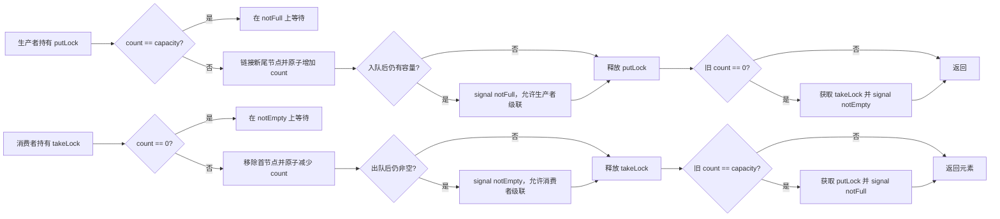

# 3.2.2.3 LinkedBlockingQueue

`LinkedBlockingQueue<E>` 是一个基于链式节点、按先进先出顺序传递元素的阻塞队列。它实现 `BlockingQueue<E>`，既能让生产者和消费者在容量边界上等待，也能通过立即返回和限时等待方法把拒绝、超时与中断交给上层协议处理。它最常见的用途是连接速率不同的生产阶段与消费阶段，但“能暂存任务”不等于“适合无限积压”：容量选择、关闭方式、超时策略和元素所有权共同决定系统是否真正可靠。

理解这个类需要同时分清两层内容：

- Java API 契约规定了 FIFO 顺序、容量约束、阻塞与中断语义、禁止 `null`、弱一致遍历以及内存一致性效果。这些是应用可以依赖的行为。
- 常见 OpenJDK 实现使用链式节点、头尾哨兵、两把锁、两个条件队列和原子计数器来提高生产与消费并行度。这些细节有助于解释性能和边界，但字段名称、辅助方法和具体唤醒代码不是所有 JDK 实现必须保持的规范。

本文只讨论通用 Java 语境。涉及 `putLock`、`takeLock`、`AtomicInteger`、节点自链接和级联唤醒的描述，以常见 OpenJDK 实现为分析对象；部署到不同 JDK 发行版或版本时，应以目标运行时源码和实测结果为准。

## 队列契约先于内部实现

`LinkedBlockingQueue` 首先是一个 `BlockingQueue`。所谓阻塞队列，不只是“线程安全的 `Queue`”，而是把容量条件也纳入并发协调：队列满时，生产者可以等待空间；队列空时，消费者可以等待元素。调用方不必自己编写“检查状态、进入等待、收到通知、再次检查”的条件循环。

它保留队列的 FIFO 语义。正常入队的元素追加到尾部，正常出队从头部取得等待时间最长的元素。这里的 FIFO 描述的是队列中元素的顺序，不是线程调度公平性：多个生产者同时竞争时，哪一个先获得锁、哪一个元素先真正链接到尾部，受调度和锁竞争影响；多个消费者同理。`LinkedBlockingQueue` 的公开构造器也没有类似 `ArrayBlockingQueue` 的公平参数，因此不能据此承诺等待线程严格先来先服务。

队列禁止插入 `null`。原因不只是实现偏好，而是 API 需要用 `null` 表示“没有取得元素”：`poll()` 在队列为空时返回 `null`，限时 `poll` 在超时后也返回 `null`。若队列允许保存 `null`，调用方就无法区分失败和成功取得空值。元素可以重复，队列不会依据 `equals` 去重。

`BlockingQueue` 为同一个逻辑动作提供四种失败处理方式：

| 语义 | 插入 | 移除 | 失败表达 |
| --- | --- | --- | --- |
| 抛异常 | `add(e)` | `remove()` | 满或空时抛异常 |
| 立即返回 | `offer(e)` | `poll()` | 返回 `false` 或 `null` |
| 一直等待 | `put(e)` | `take()` | 条件满足前阻塞，可中断 |
| 限时等待 | `offer(e, timeout, unit)` | `poll(timeout, unit)` | 预算内等待，超时后返回失败 |

选择哪一组方法，本质上是在选择系统过载或暂时空闲时的协议。把它们看成可以随意替换的同义方法，会掩盖数据丢失、永久阻塞和超时重试等关键行为。

## 容量是系统设计参数

`LinkedBlockingQueue` 有两类构造方式：

```java
BlockingQueue<Job> bounded = new LinkedBlockingQueue<>(2_000);
BlockingQueue<Job> almostUnbounded = new LinkedBlockingQueue<>();
```

显式容量必须大于零。无参构造器并非创建一个数学意义上真正无界的队列，而是把容量设为 `Integer.MAX_VALUE`。从 API 类型上看它仍然有上限，但这个上限通常远大于进程可以承受的节点和元素数量，因此工程上应把它视为“近似无界”。

近似无界不会消除过载，只会把过载表现从“生产者被阻塞或提交被拒绝”推迟成“队列持续增长”。每个排队元素至少需要一个链表节点、一个元素引用，并使元素本身及其可达对象继续存活。积压还会增加垃圾回收压力、缓存不命中和端到端等待时间。当生产速率长期高于消费速率时，队列没有任何算法可以恢复平衡；它只能保存差额，直到负载下降、外部限流、生效扩容，或者资源耗尽。

有界队列则能形成背压。达到容量后，`put` 会让生产线程等待，`offer` 会立即失败，限时 `offer` 会在预算内等待。压力因此回传到上游，使系统在明确位置减速或拒绝，而不是无限吸收。背压并不自动等于良好设计：若生产线程持有数据库事务、外部锁、连接或其他稀缺资源时进入 `put`，阻塞可能把资源耗尽问题扩散到整个调用链。正确做法是先确定生产动作是否允许等待，再选择阻塞、限时、拒绝或降级。

容量规划不能只看平均吞吐。一个实用的起点是把容量理解为“允许吸收的突发量”：

> 所需容量约等于突发期间的生产量减去同一期间的可消费量，再加上为调度抖动和估算误差预留的余量。

例如生产峰值为每秒 5 000 个任务，消费者在峰值期间只能处理每秒 3 500 个，并希望最多吸收 4 秒突发，则差额约为 6 000。这个数字只是初始估算，还必须受单任务内存、可接受排队时延、故障恢复速度和下游容量限制。若任务平均处理耗时为 20 毫秒，队列里积压 20 000 个任务，即使内存足够，也可能让新任务等待到失去业务价值。

`remainingCapacity()` 返回调用瞬间观察到的剩余容量，但它不是预留凭证。多个线程可以在它返回后立即入队，消费者也可能同时腾出空间。下面这种检查再执行不能保证成功：

```java
if (queue.remainingCapacity() > 0) {
    queue.add(job); // 仍可能抛出 IllegalStateException
}
```

需要立即尝试时直接调用 `offer`，需要等待时调用 `put` 或限时 `offer`。让原子队列操作决定结果，避免用状态查询拼接竞态。

## 链式节点与哨兵不变量

从抽象结构看，队列维护一条单向链表。每个节点保存一个元素引用和指向后继的引用。常见 OpenJDK 实现还维护 `head` 与 `last`：

- `head` 指向哨兵节点。哨兵本身不代表可供消费者取得的元素。
- 真正的队首元素位于 `head.next`。
- `last` 指向尾节点，新元素在其后链接。
- 空队列中 `head` 与 `last` 指向同一个哨兵节点。
- 非空队列中，从 `head.next` 沿后继引用可以到达按 FIFO 排列的有效节点，最终到达 `last`。

入队时创建新节点，把旧尾节点的 `next` 指向新节点，再推进 `last`。出队时读取 `head.next` 作为第一个有效节点，清空其中的元素引用，并把它提升为新的头哨兵。常见实现还会让旧头节点的 `next` 指向自己。这种自链接有助于并发遍历代码识别已经脱离主链的旧节点，也避免旧头继续把整条后续链作为一条普通路径持有。它是实现上的垃圾回收与遍历协作技巧，不是公开 API 可以观察或依赖的结构。

哨兵设计使入队和出队都不必在每次操作中大量区分“首节点是否保存数据”。但链式存储有明确成本：每次入队通常分配一个节点；节点分散在堆上，遍历时引用跳转的局部性弱于连续数组；大量短生命周期节点会增加分配和回收工作。因此，“链表入队出队是 O(1)”只说明随队列长度增长的渐进复杂度，不代表常数成本一定低。

出队后清空节点的 `item` 很重要。若已经消费的节点仍保留元素引用，即使节点暂时被迭代器或内部逻辑触达，元素及其对象图也可能不必要地存活。链表链接和元素所有权是两件事：节点为了并发遍历暂时存在，不应继续意味着已消费元素仍属于队列。

## 两把锁为何能够并行

如果所有操作都由一把锁保护，实现会比较直接，但生产者链接尾节点和消费者移除头节点也会互斥。常见 OpenJDK `LinkedBlockingQueue` 将正常入队路径和正常出队路径拆开：

- `putLock` 保护尾部链接和“队列未满”条件；
- `takeLock` 保护头部移除和“队列非空”条件；
- `notFull` 是生产者等待的条件队列；
- `notEmpty` 是消费者等待的条件队列；
- `AtomicInteger count` 保存当前元素数量，连接两端对队列状态的判断。

生产者通常只持有 `putLock`，消费者通常只持有 `takeLock`。只要队列既非空又未满，生产者可以在尾部追加节点，消费者可以同时在头部移除节点，两者不必为同一把全局锁串行等待。`count` 的原子更新使两条路径能够协调容量变化。

这并不意味着任意两个方法都可完全并行。`remove(Object)`、`contains`、`clear`、`toArray` 等需要稳定遍历或修改链中间位置的操作，常见实现会同时获取两把锁，通常按固定顺序先获取 `putLock`、再获取 `takeLock`，释放时反向进行。固定锁顺序避免内部形成锁顺序反转。调用方不应反射取得内部锁，也不应把这个顺序当成可参与的外部同步协议。

### 计数器不只是为了实现 `size`

`count` 的作用远大于统计。它表示有效元素数量，并把三个状态区间联系起来：

- `count == 0`：消费者不能立即取得元素；
- `0 < count < capacity`：生产和消费通常都可推进；
- `count == capacity`：生产者不能立即插入。

入队和出队分别在不同锁下修改链表，因此需要一个双方都能以规定方式观察的共享状态。原子计数避免每次读取容量都同时锁住两端，也为跨锁唤醒提供状态转换依据。`size()` 通常直接读取该计数，结果在返回时可能已经变化；它适合监控和启发式判断，不适合维护业务级精确不变量。

### 从边界离开时才需要跨端唤醒

考虑队列原来为空。第一个生产者完成入队后，可能有消费者正在 `notEmpty` 上等待。生产者必须让消费端知道“空变非空”。反过来，队列原来已满，第一个消费者完成出队后，可能有生产者正在 `notFull` 上等待，消费者必须通知生产端“满变未满”。

常见 OpenJDK 实现利用原子加减返回的旧计数识别这些边界：

- 入队前旧计数为 `0`，说明此次操作完成了从空到非空的转换，需要在合适时机通知一个等待消费者；
- 出队前旧计数为 `capacity`，说明此次操作完成了从满到未满的转换，需要通知一个等待生产者。

通知另一端时需要获取另一端对应的锁，因为 `Condition.signal()` 必须在持有关联锁时调用。正常链表修改仍在各自端点锁下完成，跨端锁只在关键边界转换时短暂参与。

### 级联唤醒为什么有前提

仅在空变非空时由生产端通知一个消费者，并不表示一次通知只能消费一个已有元素。假设多个生产者快速放入多个元素，而多个消费者都在等待。如果只唤醒一个消费者，其他消费者可能继续睡眠，即使队列已经有更多元素。

常见实现会在同一端形成级联：

- 一个 `put` 完成后，如果入队前队列不是只差一个位置就满，也就是入队后仍有容量，它可以在 `notFull` 上再唤醒一个生产者；
- 一个 `take` 完成后，如果出队前不止一个元素，也就是出队后仍非空，它可以在 `notEmpty` 上再唤醒一个消费者。

被唤醒线程获得锁并成功执行后，又可能唤醒下一个等待者。这种链式传播减少每次状态变化都广播所有线程的惊群成本。

级联唤醒成立有两个重要前提。第一，条件必须在 `while` 循环中重新检查，不能把“被唤醒”理解成“条件必然满足”；在线程真正重新获得锁之前，其他线程可能已经消耗元素或占用空间，也允许出现无原因唤醒。第二，级联只是一种实现协调策略，不承诺等待线程的严格公平顺序，也不能保证某个特定线程在固定时间内被调度。

下面的流程图描述的是常见实现思想，不是规范要求的逐行源码：



图中把等待和重新竞争简化成一个节点。真实实现必须处理中断、超时、锁获取失败以及线程在条件队列和同步队列之间的转移。

## 四组核心方法的精确语义

### `put`：容量必须最终腾出

`put(e)` 用于“不能悄悄丢弃”的生产协议。如果队列未满，它链接元素后返回；如果队列已满，它在 `notFull` 条件上等待，直到出现空间或线程被中断。

正常返回只表示元素已被队列接收，不表示某个消费者已经开始处理，更不表示处理成功。若生产者需要处理结果，应使用 `Future`、回调、完成队列或其他确认机制。把入队成功当作业务完成，是使用消息缓冲时常见的语义错误。

`put` 没有超时上界。若消费者停止、吞吐永久下降或关闭协议遗漏，生产线程可以无限等待。因此它适合明确允许背压并且拥有可靠取消路径的内部管道，不适合未经分析地放在请求线程、锁内或资源持有区间。

### `take`：必须最终取得一个元素

`take()` 在非空时移除并返回队首元素；为空时在 `notEmpty` 上等待。它同样没有超时上界，通常用于长期运行的消费者循环。

消费者拿到元素后，元素已不再属于队列。若处理失败，队列不会自动回滚或重新入队。是否重试、重试几次、是否保持原顺序、如何避免重复副作用，都属于更高层协议。直接在异常处理中无条件重新 `put` 可能造成永久毒性任务循环，也可能因为队列已满而让消费者自己阻塞。

### 无参 `offer` 与 `poll`：只观察当前能否完成

`offer(e)` 在当前有容量时插入并返回 `true`，满时立即返回 `false`。`poll()` 在当前非空时移除并返回元素，空时立即返回 `null`。它们不会为了未来状态变化而等待。

立即返回方法适合事件循环、可降级任务、外部已有重试策略或不能阻塞的线程。其返回值必须处理。忽略 `offer` 的 `false` 等同于在过载时静默丢任务；反复无间隔重试则可能变成忙等，把容量不足进一步放大为 CPU 压力。

`poll()` 返回 `null` 只代表这一次操作没有取得元素，不证明系统已经完成所有工作。生产者可能正在计算尚未入队的元素，也可能在下一时刻入队。不能仅凭一次空结果关闭消费者。

### 限时 `offer` 与 `poll`：把等待纳入预算

`offer(e, timeout, unit)` 在容量可用时立即插入，否则最多等待指定时间；成功返回 `true`，超时返回 `false`，中断则抛出 `InterruptedException`。`poll(timeout, unit)` 对空队列采用对称语义：在预算内等元素，成功返回元素，超时返回 `null`。

限时操作常比无限等待更适合服务边界，因为它让调用方能够维持总延迟预算。但“每层都等待完整超时时间”会使端到端延迟叠加。更稳妥的方式是传递截止时间，调用前计算剩余预算，并为超时后的拒绝、回滚或降级定义唯一责任方。

超时附近存在正常竞态。实现会原子决定该次操作究竟成功还是取消，调用方只应信任返回值或异常：

- 限时 `offer` 返回 `true`，元素已经入队，不能因为“看起来接近超时”再提交一次；
- 返回 `false`，该次调用没有入队，可以按业务幂等规则决定是否重试；
- 限时 `poll` 返回元素，调用方获得所有权；
- 返回 `null`，该次调用没有取得元素，但不代表未来也没有。

### 异常式方法仍有明确用途

`add(e)` 在有容量时等价于成功的立即插入，队列满时抛出 `IllegalStateException`。`remove()` 在空队列上抛出 `NoSuchElementException`，`element()` 在空队列上也抛出异常；`peek()` 则只查看队首，不移除，空时返回 `null`。

这些方法适合“满或空代表程序不变量被破坏”的场景。对于正常过载控制，`offer` 的显式布尔结果通常更清晰；对于正常等待，使用阻塞或限时方法更符合意图。不要用捕获异常代替常规流量控制。

## 中断不是可以吞掉的偶发异常

`put`、`take` 和两个限时方法都是可中断阻塞操作。线程在获取可中断锁或条件等待期间收到中断时，会抛出 `InterruptedException`。这为任务取消和服务停止提供了关键出口。

中断策略应由线程职责决定。底层方法通常有两种合理选择：

1. 继续向上声明 `InterruptedException`，让拥有生命周期决策权的上层处理。
2. 若接口不能抛出受检异常，完成必要清理后调用 `Thread.currentThread().interrupt()` 恢复中断状态，再返回或抛出领域异常。

只记录日志然后继续循环，会清除这次中断并可能让线程无法停止：

```java
try {
    Job job = queue.take();
    process(job);
} catch (InterruptedException e) {
    Thread.currentThread().interrupt();
    return;
}
```

中断发生时，不应仅凭代码位置猜测元素是否已经转移。公开方法的结果边界更重要：如果 `put` 因 `InterruptedException` 退出，则该调用不应被当作成功入队；如果 `take` 正常返回元素，消费者就已获得它。业务侧还要区分队列转移和后续处理：处理阶段被中断并不会自动把元素送回队列。

线程池使用阻塞队列时，中断还可能来自取消任务或执行器关闭。任务代码若无视中断，队列本身再正确也无法保证及时停机。

## 删除、清空和批量转移不是端点 O(1) 操作

正常 `put` 与 `take` 只操作链表两端，但 `LinkedBlockingQueue` 还实现了集合接口中的搜索和批量方法。它们的锁范围、复杂度和业务语义不同，不能从端点性能直接外推。

### `remove(Object)` 与 `contains`

`remove(Object)` 要从头遍历链表，找到第一个 `equals` 匹配的元素并解除链接，因此时间复杂度是 O(n)。常见 OpenJDK 实现会同时锁住生产端和消费端，避免遍历过程中链结构被两端并发修改。`contains` 同样需要线性扫描并通常采用完整锁定。

频繁按值删除说明数据结构可能与需求不匹配。队列擅长按到达顺序转移，不擅长按标识随机定位。若业务需要高频取消指定任务，可以另建按标识索引并设计一致性协议，或选择支持任务取消的更高层执行模型；不能假定并发队列加一个 `remove` 就获得廉价、原子的“查找并取消”。

`remove(Object)` 的匹配依赖元素 `equals`。若元素放入后改变参与相等判断的字段，结果会变得难以理解。即便找到并移除了队列中的对象，也无法取消已经被消费者取走并开始执行的同一任务。

### `clear`

`clear()` 移除调用期间队列中可见的所有元素。常见实现完整锁定两端，遍历节点并清空元素引用，重置头尾和计数；如果清空前队列处于满状态，还需要让等待生产者有机会继续。

`clear` 不是系统级“取消全部”。已经被消费者取出的元素不在队列内，可能仍在执行；与 `clear` 并发到达的生产动作究竟发生在清空前还是清空后，由锁竞争的线性化顺序决定。若要求停止接收新任务、取消未开始任务并等待在途任务结束，需要额外状态机，而不是只调用 `clear()`。

### `drainTo`

`drainTo(Collection)` 和 `drainTo(Collection, maxElements)` 按队列顺序把多个元素移到目标集合，并从队列删除。它适合消费者批量拉取：减少重复获取锁的成本，也让后续处理可以按批次提交。

需要准确理解其边界：

- 目标集合不能是队列自身，否则会抛出 `IllegalArgumentException`；
- 目标集合为 `null` 会抛出 `NullPointerException`；
- 转移数量不超过调用时可取得的元素数和 `maxElements`；
- 它不等待未来元素到达，空队列时立即转移零个；
- 若目标集合的 `add` 在中途抛出异常，可能只有部分元素完成转移，调用方不能假设全有或全无；
- 批量取出后，队列容量已经释放，即使业务批处理尚未成功。

常见 OpenJDK 实现可在持有消费端锁时逐个向目标集合添加，并在结束时统一更新头节点和计数。若转移前队列为满，释放空间后需通知等待生产者。由于目标集合代码会参与这段操作，目标集合的 `add` 不应执行不可控的长时间阻塞，也不应以复杂方式回调同一队列。

批量消费会改变公平感受。一个消费者一次取走很大的批次，其他消费者可能长时间拿不到任务；批次在队列外处理期间也不再受到队列容量约束。批大小应结合单批处理时长、失败恢复、消费者数量和延迟目标设定。

## 弱一致迭代不是快照

`LinkedBlockingQueue` 的迭代器是弱一致的。它不会像普通非并发集合的 fail-fast 迭代器那样，因为并发结构修改就必然抛出 `ConcurrentModificationException`；它可以与入队、出队和删除并发进行，并保证迭代器自身不会因正常并发修改而破坏内部结构。

弱一致不等于固定快照，也不等于实时视图。按照 `java.util.concurrent` 对弱一致遍历的通用约定，迭代器会把构造时已经存在的元素各遍历一次；对于构造后发生的入队、出队和删除，它可能反映其中一部分，也可能不反映。于是一次遍历可能看到后来才入队的某些元素，也可能仍返回已经取得引用、随后才被队列移除的元素。调用方只能按这一契约解释并发边界，不能把结果当作某个可指定瞬间的完整队列状态。

它适合日志、诊断、尽力清理和近似监控，不适合结算、精确审计、稳定导出或“遍历到的就是当前全部待处理任务”这类强假设。需要快照时，可以调用 `toArray` 或在适当同步边界内复制到独立集合；但复制只是取得复制时刻附近的队列内容，无法冻结生产者、消费者和已在途任务的整个系统状态。

迭代顺序仍按 FIFO 链路前进，但这不意味着并发修改下得到一个可线性化的全局队列历史。迭代器的 `remove` 也只针对最近返回的元素尝试删除；若它已经被其他线程移除，操作结果不能被用作业务所有权确认。

## 内存一致性与元素线程安全

`BlockingQueue` 的内存一致性保证可以概括为：线程在把元素放入队列之前执行的操作，先行发生于另一个线程从队列取得或移除该元素之后的操作。也就是说，队列不仅转移引用，还建立了发布边界。

```java
final class Job {
    int value;
}

Job job = new Job();
job.value = 42;
queue.put(job);

// 另一线程成功 take 后，可以看到入队前写入的 value == 42。
Job received = queue.take();
```

这个保证解决的是入队前状态向成功接收者的可见性，不会让元素永久线程安全。以下情况仍需额外设计：

- 生产者在入队后继续修改同一对象，而消费者同时读取；
- 多个消费者通过其他共享引用访问同一可变对象；
- 元素内部含有普通集合、缓存或复合不变量，需要并发更新；
- 对象从队列取出后又被发布到多个线程。

最简单的所有权模型是：生产者构造并完善对象，入队后不再修改；消费者取出后获得独占修改权。若无法独占，应使用不可变对象、原子变量、锁或其他明确同步机制。

队列容器的线程安全也不覆盖跨操作业务不变量。下面的组合不是一个原子动作：

```java
if (!queue.contains(job)) {
    queue.put(job);
}
```

两个生产者都可能在 `contains` 时看不到元素，随后分别插入。需要去重时，应在更高层使用原子集合、状态表或唯一任务协议。类似地，“从队列取出后更新状态表”会暴露一个在途区间；若进程失败，需要明确任务是否丢失、重试或重复。

## 生产消费模型中的背压

阻塞队列经常被描述为生产者与消费者的天然桥梁，但一个可靠管道至少包含四个问题：容量、等待、失败和关闭。

### 生产端必须知道提交结果

若使用 `put`，生产者接受可能无限等待，并应可被中断。若使用 `offer`，必须处理 `false`。若使用限时 `offer`，必须定义超时后的唯一策略。常见策略包括：

- 把失败返回上游，由上游限速；
- 在调用线程执行，但要评估是否破坏线程隔离；
- 丢弃可重建、低价值或已过期任务，并记录指标；
- 写入另一个持久化通道；
- 有界重试，并使用退避和幂等标识。

没有一种策略适用于所有任务。关键是让过载可见，并避免“无限排队看起来没有拒绝”的假稳定。

### 消费端吞吐由最慢阶段决定

增加消费者只有在下游资源允许时才提高吞吐。若所有消费者竞争同一个数据库连接池、串行锁或远程限额，增加线程只会增加等待与上下文切换。队列长度上涨时，应先区分生产突发、消费退化、下游故障和任务变重，而不是立即扩大容量。

队列监控至少应同时观察当前长度、容量占用率、入队失败或等待时间、任务排队时长、消费处理时长、消费者活跃度和拒绝数量。单独看 `size()` 既无法解释原因，也可能因为并发变化而误导。

### 阻塞位置决定故障传播方式

有界队列满后，`put` 把压力传给生产线程。若生产线程就是上游请求线程，延迟会回传给调用者；若生产线程是单独采集线程，采集会暂停；若它持有外部锁，下游变慢可能阻塞无关业务。背压不是越早或越晚越好，而是应该发生在能够承担等待、取消和错误报告的位置。

## 在线程池中的队列行为

`ThreadPoolExecutor` 接收任务时，不是简单地“先入队，满了再建线程”。其主要决策顺序是：

1. 当前工作线程数小于 `corePoolSize` 时，优先尝试创建核心工作线程执行任务。
2. 核心线程数已达到目标后，尝试把任务放入工作队列。
3. 队列拒绝任务后，若工作线程数小于 `maximumPoolSize`，再尝试创建非核心工作线程。
4. 无法入队且也不能创建更多线程时，执行拒绝策略。

因此，近似无界 `LinkedBlockingQueue` 通常会让第二步长期成功。线程池达到核心线程数后，新任务持续排队，`maximumPoolSize` 在常规负载下几乎不起扩容作用。结果是线程数稳定，但队列可能无限增长，任务等待时间不断上升。把 `maximumPoolSize` 配得很大并不能弥补无界工作队列。

有界 `LinkedBlockingQueue` 会在队列满时迫使执行器进入第三步，从而允许线程数在核心值之上增长，最终才触发拒绝。容量、最大线程数和拒绝策略必须一起设计：

- 容量过大时，线程池倾向于排队，扩容较晚，尾延迟可能很高；
- 容量过小时，短突发就会频繁创建线程或拒绝；
- 最大线程数过大时，下游可能被并发压垮；
- `CallerRunsPolicy` 能把压力传回提交线程，但若提交线程不能执行任务或持有关键锁，会产生新的风险；
- 丢弃策略只有在任务确实允许丢失并且有监控时才合理。

`Executors.newFixedThreadPool` 典型实现使用无参 `LinkedBlockingQueue`。它方便，但在生产速度可能持续超过固定线程消费速度时，没有天然的队列内存边界。需要可控过载时，通常应直接构造 `ThreadPoolExecutor`，显式给出有界容量、线程数、线程工厂和拒绝策略。

队列长度也不能代表所有未完成工作。任务可能正在工作线程中执行，已经从队列移除；取消和关闭也会改变队列内容。若要等待一批任务完成，应使用 `Future`、`invokeAll`、`CompletionService`、`CountDownLatch` 或结构化的生命周期协议，而不是轮询 `queue.isEmpty()`。

## 关闭协议：队列本身没有 close

`LinkedBlockingQueue` 没有 `close()`。空队列只表示当前没有元素，不表示未来不会再有生产者。一个消费者若在 `poll()` 返回 `null` 后退出，可能错过稍后到达的任务；若永远阻塞在 `take()`，生产结束后又可能无法退出。

关闭必须由应用建立协议。常见方案有三类。

### 中断消费者

管理者先阻止新的生产，再中断消费者线程。消费者捕获 `InterruptedException` 后退出或进入收尾流程。这种方式适合消费者线程完全受管理者所有的场景，也能打断空队列上的 `take`。

关键是顺序和中断语义：若先中断消费者但生产者仍可提交，后续任务可能无人处理；若消费者把中断吞掉，关闭会失效。若要求处理完已入队任务再停机，可以先停止接收、等待队列排空及在途任务完成，最后中断仍在等待的消费者。

### 外部关闭状态加限时轮询

消费者使用限时 `poll`，周期性检查一个线程安全的关闭状态。当状态为“停止接收”且队列为空、在途任务也已归零时退出。这种方式能表达更丰富的状态机，但需要避免用 `queue.isEmpty()` 单独判断完成，因为检查后仍可能有已获准的生产者入队。

常见状态包括运行中、停止接收、排空中和已终止。生产者在提交前后如何与状态切换同步，决定是否会出现“关闭检查通过后又入队”的竞态。

### 毒丸

毒丸是一个特殊元素，消费者取到后退出。它能复用队列的 FIFO 顺序：若确认不再有生产者，并在所有普通任务之后插入毒丸，消费者会先处理此前排队的任务。

毒丸有严格边界：

- 多个消费者通常需要足够数量的毒丸，或由消费者可靠地转发；一个毒丸不会广播；
- 有界队列满时，放入毒丸本身可能阻塞，关闭线程必须有策略；
- 必须先禁止后续生产，否则普通任务可能排在毒丸之后而无人处理；
- 业务元素域必须能安全区分毒丸，不能与真实任务混淆；
- 消费者异常退出可能导致计划中的毒丸数量与存活消费者不匹配；
- 毒丸只通知消费循环退出，不能自动取消已经取出并正在处理的任务。

一种明确的写法是使用密封的消息类型，而不是拿 `null` 或某个普通值冒充结束标记：

```java
interface Message {}

final class Work implements Message {
    final String payload;

    Work(String payload) {
        this.payload = payload;
    }
}

enum Stop implements Message {
    INSTANCE
}
```

对于线程池，优先使用 `ExecutorService.shutdown()`、`shutdownNow()` 和 `awaitTermination()` 所定义的生命周期，而不是直接向其内部工作队列塞毒丸。执行器已经拥有停止接收、处理中任务和中断工作线程的协议，绕过它会破坏封装。

## 公平、饥饿与延迟尾部

`LinkedBlockingQueue` 维护元素 FIFO，但默认内部锁通常不是公平锁，公开 API 也不承诺等待生产者或消费者严格按到达顺序恢复。高竞争下，一个线程可能多次输掉锁竞争；操作系统调度、线程优先级、暂停和消费者批量 `drainTo` 也会放大等待差异。

因此要区分三种顺序：

- 元素顺序：已成功入队的元素按 FIFO 被正常移除；
- 等待线程顺序：没有严格公平保证；
- 任务完成顺序：取决于消费者处理时间，通常不保持 FIFO。

如果业务要求严格按提交顺序完成，仅使用 FIFO 队列不够。多个消费者可以按 FIFO 取到 A、B，但 B 先处理完。可能需要单消费者、序列号重排、按键分区或更高层协调。

饥饿风险不能只靠选择更大容量缓解。容量只改变生产者何时等待，不保证某个等待者被公平唤醒。需要关注最长排队时间、最长提交阻塞时间和各消费者处理分布，而不是只看平均值。若公平是核心业务要求，应评估具有公平构造选项的方案或在上层建立调度规则，并用目标 JDK 和真实负载验证代价。

## 元素所有权与可变性

队列保存的是引用，不会复制元素。入队后修改元素，会让消费者看到哪个状态取决于额外同步和执行时序。即便队列建立了入队前写入的可见性，入队后的并发写也可能形成数据竞争。

较容易推理的三种策略是：

- 元素不可变，生产者构造后直接发布；
- 元素所有权转移，生产者成功入队后不再访问，消费者取出后独占；
- 元素本身有独立线程安全协议，所有访问都遵守该协议。

不要把“容器是线程安全的”扩展成“容器里的对象是线程安全的”。例如把普通 `ArrayList` 放入队列后，多个线程仍不能无同步地共同修改该列表。队列也不会保护元素指向的文件、连接、缓存或状态机。

大对象还会放大容量估算误差。若队列元素只是一个轻量任务描述，容量 10 000 也许可接受；若每个元素持有数兆字节缓冲区，同样容量会迅速耗尽内存。容量应按完整对象图和峰值分布估算，而不是只按节点数量。

## 与相近队列的权衡

选择并发队列时，先明确是否需要缓冲、是否要求有界、是否允许生产者等待、是否重视内存局部性，以及线程池希望“排队”还是“直接扩容”。

### `ArrayBlockingQueue`

`ArrayBlockingQueue` 是固定容量的数组阻塞队列。容量在构造时确定，不能近似无界。它通常只需一个数组对象来保存元素引用，不为每次入队分配链表节点，内存布局更紧凑、容量成本更容易预测。它使用一把锁协调生产和消费，并提供可选公平模式。

与之相比，`LinkedBlockingQueue` 的两锁设计允许正常生产和消费在两端并行，但每个元素有节点分配和指针跳转成本。哪一个吞吐更高取决于 JDK、硬件、元素大小、生产消费比例和竞争模型，不能仅凭“两把锁”得出固定结论。需要严格内存上界、稳定分配特征或公平等待时，`ArrayBlockingQueue` 常更值得优先评估；需要链式容量和两端并行特征时，可以评估 `LinkedBlockingQueue`。

### `SynchronousQueue`

`SynchronousQueue` 没有内部缓冲容量。一次成功插入必须与一次成功移除直接配对。它把压力立即传给对端，适合直接移交，也会使线程池在没有空闲消费者时更倾向于创建新线程，直到最大线程数或拒绝边界。

`LinkedBlockingQueue` 能吸收突发并解耦生产与消费时刻，代价是排队内存和延迟。若任务不能排队、希望优先扩展工作线程或必须让生产者等待消费者接手，`SynchronousQueue` 更贴近语义；若需要有限缓冲，应使用明确有界队列。

### 非阻塞无界队列

`ConcurrentLinkedQueue` 是非阻塞、近似无界的并发队列，不提供等待元素或等待空间的阻塞契约。消费者空轮询时需要自行决定休眠、信号或事件循环，生产者也得不到容量背压。它适合已有外部调度机制且要求非阻塞入队出队的场景，不是 `LinkedBlockingQueue` 的无条件性能替代品。

其他无界阻塞队列也可能按优先级或延迟排序，例如 `PriorityBlockingQueue`、`DelayQueue`。它们改变的是取出顺序和可用条件，不会自动解决容量失控。只要结构近似无界，长期生产过剩就仍需外部流量控制。

| 结构 | 缓冲 | 容量边界 | 主要顺序 | 典型取舍 |
| --- | --- | --- | --- | --- |
| `LinkedBlockingQueue` | 链式节点 | 可显式有界，默认近似无界 | FIFO | 两端可并行，节点分配，需警惕默认容量 |
| `ArrayBlockingQueue` | 固定数组 | 必须有界 | FIFO | 内存紧凑，可选公平，生产消费共享一把锁 |
| `SynchronousQueue` | 无存储槽 | 零容量 | 直接配对 | 不吸收突发，压力立即传递 |
| `ConcurrentLinkedQueue` | 链式节点 | 近似无界 | FIFO | 非阻塞，不提供等待和容量背压 |

## 诊断与测试应覆盖的边界

只测试“放入一个元素再取出”不能验证真实并发协议。针对 `LinkedBlockingQueue` 的使用代码，至少应覆盖：

- 容量为一和容量边界，确认满时各类插入方法的差异；
- 空队列边界，确认各类移除方法的差异；
- 阻塞生产者在消费者腾出空间后恢复；
- 阻塞消费者在生产者入队后恢复；
- 等待期间中断，确认线程能按协议退出且中断状态处理正确；
- 限时操作成功、超时以及接近截止时间的竞态；
- `offer` 失败后的拒绝、回滚或重试路径；
- 消费处理异常，确认任务不会无意丢失或无限重试；
- 多消费者关闭，确认不会遗留永久等待线程；
- `drainTo` 的部分失败和批量公平影响；
- 并发迭代，确认调用方没有依赖快照；
- 队列长时间满载和长时间空闲时的监控指标；
- 元素入队后的所有权，确认没有未同步修改。

压力测试应使用目标 JDK、接近真实的元素大小和处理时长。微基准只测 `put/take` 吞吐，容易忽略对象分配、垃圾回收、上下文切换和下游等待。容量测试也要观察端到端排队时间，而不只是是否发生内存溢出。

排障时可以按现象反推：

- 内存持续上涨：先检查是否用了默认近似无界容量、生产是否长期快于消费、元素对象图是否过大；
- 线程大量停在 `put`：队列已满或消费端停滞，检查下游和阻塞时持有的资源；
- 线程大量停在 `take`：当前无任务，不一定是故障；结合生产者状态和关闭协议判断；
- 线程池只有核心线程忙而队列很长：检查是否使用近似无界工作队列，使最大线程数失效；
- 停机无法完成：检查阻塞调用是否可中断、消费者是否吞掉中断、毒丸数量和生产停止顺序；
- 偶发重复：检查超时后重试是否缺少幂等、提交成功边界是否判断错误；
- 偶发丢失：检查是否忽略 `offer` 返回值、消费异常后是否缺少恢复、是否把 `clear` 当成无害操作。

## 使用原则

`LinkedBlockingQueue` 的价值不只是提供一个加锁链表，而是把 FIFO 转移、容量条件、等待、中断和可见性组合成明确契约。正确使用它，需要把以下结论落实到接口和运行策略中：

1. 默认构造器应按近似无界看待。除非已经证明积压有其他硬上界，否则优先显式设置容量。
2. `put/take`、立即 `offer/poll`、限时方法代表不同过载协议，返回值、超时和中断都不能忽略。
3. 常见 OpenJDK 的双锁和原子计数提高两端并行度，但批量、遍历、按值删除等操作仍可能完整锁定并线性扫描。
4. 弱一致遍历适合观察，不提供稳定快照；`size`、`isEmpty` 和 `remainingCapacity` 都只是并发瞬间的状态。
5. 队列安全发布元素引用，不会自动保护元素入队后的可变状态，也不会维护跨多个操作的业务不变量。
6. 有界容量只提供背压机制，真正的稳定性还依赖生产者如何响应等待或拒绝、消费者如何处理失败，以及系统如何关闭。
7. 在线程池中，近似无界队列会偏向排队并弱化 `maximumPoolSize`；队列、线程数和拒绝策略必须共同设计。
8. 毒丸只是可选关闭协议，受消费者数量、容量、生产停止顺序和任务类型约束；执行器应优先使用自身生命周期 API。

当这些边界都能被明确回答时，`LinkedBlockingQueue` 才是一个可解释的并发组件，而不是把暂时处理不了的工作藏进内存的容器。
