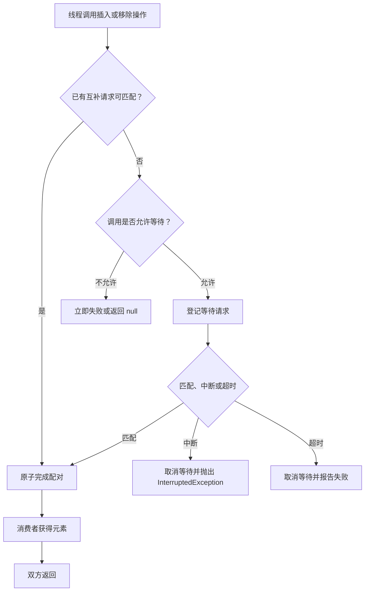

# 3.2.2.4 SynchronousQueue

`SynchronousQueue<E>` 是一种用于线程间直接交接元素的阻塞队列。它实现了 `BlockingQueue<E>`，但与通常意义上的队列有一个根本区别：它没有保存元素的内部容量。一次成功的插入必须与另一个线程的一次成功移除相遇，元素从生产者直接交给消费者；如果暂时没有互补操作，调用方只能等待、超时或立即失败。

这种“零容量”并不是把容量配置成了零的普通缓冲队列，而是一套不同的并发协议。普通队列把生产和消费在时间上解耦：生产者先把元素存入容器，消费者稍后再取。`SynchronousQueue` 则要求双方在一次交接上同步，它不吸收速率差，也不为突发流量提供积压空间。理解这一点，才能正确解释它的 API、线程池行为、内存语义以及停机风险。

本文只讨论通用 Java 语境下的 `SynchronousQueue`。公开 API 语义以 Java 平台文档为准；涉及内部节点、栈式或队列式匹配、CAS 和清理策略的内容，描述的是常见 OpenJDK 实现，不能当作所有 JDK 发行版和未来版本都必须保持的规范。

## 零容量不是“永远为空”这么简单

从集合观察接口看，`SynchronousQueue` 总是表现为空：

- `size()` 始终返回 `0`；
- `isEmpty()` 始终返回 `true`；
- `remainingCapacity()` 始终返回 `0`；
- `peek()` 始终返回 `null`；
- `contains`、`remove(Object)` 等面向已存储元素的操作不会找到元素；
- 普通迭代器没有可遍历的元素；
- `drainTo` 只可能接走当时已经在等待交付、并能与移除操作配对的生产请求，不能把它理解为清空内部缓冲区。

这些结果不表示“此刻没有线程带着元素等待”。生产线程可能已经执行到 `put(x)` 并被挂起，但元素 `x` 仍不是队列中可独立观察和遍历的库存。等待中的生产请求是交接协议的一部分，而不是普通集合意义上的已入队元素。因此，不能用 `size()`、`isEmpty()` 或监控到的队列长度判断是否存在阻塞生产者，也不能通过遍历实现管理、取消或统计。

零容量模型可以抽象成两类请求：

1. 数据请求：生产者携带元素，希望把它交给某个消费者。
2. 请求请求：消费者不携带元素，希望从某个生产者获得元素。

同类请求不能彼此完成。两个生产者相遇不能交接，两个消费者相遇也不能交接；只有一条数据请求和一条请求请求配对时，双方才完成同一次传递。交接成功后，消费者得到的就是生产者提供的那个非 `null` 引用。



图中的“登记等待请求”是概念描述。具体 JDK 可以使用不同节点结构、字段和清理算法，但必须维持公开契约：一次成功插入对应一次成功移除，失败或取消的调用不能凭空产生一次已完成交接。

## 四组核心操作的配对语义

`BlockingQueue` 为插入和移除分别提供了等待、限时等待和立即尝试的变体。对有容量的队列，这些方法通常围绕“满”与“空”工作；对 `SynchronousQueue`，判断条件变成了“现在是否存在互补操作”。

| 操作 | 无互补线程时 | 有互补线程时 | 结果含义 |
| --- | --- | --- | --- |
| `put(e)` | 等待，可被中断 | 完成交接 | 正常返回表示某个消费者已接收 |
| `take()` | 等待，可被中断 | 完成交接 | 返回生产者交付的元素 |
| `offer(e)` | 立即返回 `false` | 尝试完成交接并返回 `true` | `true` 表示交接已完成 |
| `poll()` | 立即返回 `null` | 尝试完成交接并返回元素 | 非 `null` 表示交接已完成 |
| `offer(e, timeout, unit)` | 最多等待给定时间 | 完成交接并返回 `true` | 超时前未匹配则返回 `false` |
| `poll(timeout, unit)` | 最多等待给定时间 | 完成交接并返回元素 | 超时前未匹配则返回 `null` |

`SynchronousQueue` 不允许插入 `null`。这是阻塞队列体系的重要约定，因为 `poll()` 用 `null` 表示未获得元素，若允许 `null` 元素，就无法区分“成功取得空值”和“没有匹配成功”。向队列插入 `null` 会抛出 `NullPointerException`。

### `put` 与 `take`：无限期等待一场交接

`put(e)` 在没有消费者可配对时会等待，直到出现消费者或当前线程被中断。它正常返回的语义比“元素已经进入队列”更强：某个移除操作已经与它配对。对应地，`take()` 在没有生产者时等待，正常返回意味着它已经接到了一个具体元素。

```java
import java.util.concurrent.SynchronousQueue;

public final class DirectHandoff {
    public static void main(String[] args) throws InterruptedException {
        SynchronousQueue<String> handoff = new SynchronousQueue<>();

        Thread consumer = new Thread(() -> {
            try {
                String message = handoff.take();
                System.out.println("received: " + message);
            } catch (InterruptedException e) {
                Thread.currentThread().interrupt();
            }
        });

        consumer.start();
        handoff.put("work");
        consumer.join();
    }
}
```

这里 `put("work")` 返回时，不能据此断言消费者已经处理完 `"work"`。它只说明消费者的移除操作已经接收该引用。消费者后续执行的业务处理可能仍未开始或尚未完成。如果生产者需要等待处理结果，应使用 `Future`、`CompletableFuture`、回调或另一个明确的确认协议，而不是把“接收完成”误认为“处理完成”。

反过来，先启动谁并不影响最终语义。消费者可以先在 `take()` 等待，生产者也可以先在 `put()` 等待。`SynchronousQueue` 负责让相反方向的请求会合，不要求固定的启动顺序；但如果另一方永远不会出现，无限等待方法就可能永久阻塞。

### `offer` 与 `poll`：只接受当下已经能够完成的交接

无参数 `offer(e)` 和 `poll()` 是立即尝试。它们不会为了等待未来的线程而挂起：

- `offer(e)` 只有在调用期间能够与等待中的或并发到达的消费者完成配对时才返回 `true`，否则返回 `false`；
- `poll()` 只有在调用期间能够与等待中的或并发到达的生产者完成配对时才返回元素，否则返回 `null`。

因此，下面这段单线程代码中的 `offer` 必然失败：

```java
SynchronousQueue<String> queue = new SynchronousQueue<>();
boolean accepted = queue.offer("task");
System.out.println(accepted); // false
```

失败不是队列满，也不是容量不足，而是没有消费者在这次调用中接手。把 `offer` 的返回值忽略掉，会造成业务层面的任务丢失：调用方以为自己“提交”了任务，实际上交接从未发生。立即尝试适合允许拒绝、降级、重试或转移到其他通道的场景，不适合要求无条件接收的提交接口。

同样，`poll()` 返回 `null` 只表示此次尝试没有匹配成功，不证明系统中没有生产线程，也不证明下一纳秒不会有生产者到达。它是并发时刻附近的一次结果，不是稳定的全局状态。

### 限时 `offer` 与 `poll`：为等待设置上界

限时操作位于无限等待和立即失败之间。它们允许双方在一个有限窗口内会合：

```java
import java.time.Duration;
import java.util.concurrent.SynchronousQueue;
import java.util.concurrent.TimeUnit;

public final class TimedHandoff {
    private final SynchronousQueue<String> handoff = new SynchronousQueue<>();

    public boolean submit(String value, Duration timeout)
            throws InterruptedException {
        return handoff.offer(
                value,
                timeout.toNanos(),
                TimeUnit.NANOSECONDS);
    }

    public String receive(Duration timeout)
            throws InterruptedException {
        return handoff.poll(
                timeout.toNanos(),
                TimeUnit.NANOSECONDS);
    }
}
```

生产方得到 `false`，表示超时前没有完成交接；消费方得到 `null`，含义相同。调用方必须把超时作为协议的一部分处理，例如记录拒绝、回滚业务状态、返回上游、重试到有界次数或切换备用执行器。超时不等于异常，也不等于对方一定故障，它只说明双方没有在预算内配对。

超时边界附近存在正常竞态：匹配和取消可能几乎同时发生。实现必须原子决定最终结果，调用方则只应依赖方法返回值或异常。如果 `offer` 返回 `false`，调用方可以按照“该次交接未成功”处理；如果返回 `true`，就不能再次发送同一逻辑任务，除非业务协议允许重复。不要通过观察线程状态、日志先后或队列 `size()` 推测胜负。

## 配对语义的几个精确边界

### 成功是一对一，而不是广播

一个成功的 `put` 只匹配一个成功的 `take`。即使有多个消费者等待，一个元素也不会广播给所有消费者。需要发布订阅或多播时，应使用为该语义设计的机制，并明确每个订阅者的缓冲、背压和失败处理。

### 队列没有元素所有权阶段

普通缓冲队列中，元素经历“生产者拥有、队列保存、消费者取走”三个阶段。`SynchronousQueue` 把中间阶段压缩为一次配对动作。等待生产者仍持有对元素的引用，内部等待节点也可能暂时引用它，但这不形成可供第三方查询和管理的队列库存。

这一点会影响诊断。监控普通线程池时，队列长度可以近似反映积压；使用 `SynchronousQueue` 时，队列长度始终为零，压力通常体现为活跃线程数增加、任务被拒绝、提交线程阻塞或等待交接的线程增多。监控体系必须观察正确指标。

### `add`、`remove` 与 `element` 仍服从零容量语义

`SynchronousQueue` 继承了 `Queue` 的异常式方法。`add(e)` 本质上是一次不能等待的插入尝试：没有消费者可立即接手时会抛出 `IllegalStateException`，而不是把元素保存起来。`remove()` 和 `element()` 面向队头元素，但该队列没有可独立观察的队头，通常会抛出 `NoSuchElementException`。

这些方法在直接交接代码中往往不如 `put`、`take`、`offer`、`poll` 清晰。选择 API 时，应让方法名和失败方式直接表达协议，避免用异常式集合操作掩盖“必须与另一线程配对”的事实。

### 批量集合操作没有普通队列的直觉

`SynchronousQueue` 实现 `Collection` 和 `BlockingQueue` 接口，是为了能进入统一的并发队列抽象，并不意味着每个集合操作都有丰富含义。`clear()` 没有可清除的缓冲元素，`containsAll` 和迭代也不提供等待请求的快照。不要把它作为一般集合传给会执行遍历、复制、统计或批量删除的通用算法；类型兼容不代表语义合适。

## 公平模式与非公平模式

构造器 `new SynchronousQueue<>()` 默认使用非公平模式；`new SynchronousQueue<>(true)` 请求公平模式。这里的公平主要描述等待线程的匹配顺序，而不是对操作完成时间的绝对保证。

### 公平模式

公平模式倾向于按照等待先后顺序匹配，长期等待的生产者或消费者通常更早获得互补线程。常见 OpenJDK 实现使用先进先出的双重队列组织等待请求，因此更接近“先等待者先服务”。

公平模式适合以下目标：

- 希望降低后来线程反复抢先导致的饥饿风险；
- 任务或请求之间有明显的等待时间公平要求；
- 延迟尾部比峰值吞吐更重要；
- 需要更容易解释的等待顺序。

但公平不等于严格实时排序。线程何时真正登记为等待者、何时被操作系统调度、取消请求何时清理，都可能影响可观察顺序。公平策略也不保证完成业务处理的顺序，因为线程拿到元素后仍由调度器决定谁先运行。

### 非公平模式

非公平模式允许新到达的互补请求优先与最近的等待者匹配。常见 OpenJDK 实现使用后进先出的双重栈。局部性更好的线程可能快速完成交接，减少对较早等待线程的唤醒和上下文切换，在某些高竞争负载下有更好的吞吐或更低的平均开销。

代价是等待顺序更难预测。持续竞争时，较早的请求可能被后来请求多次越过，理论上存在更长等待甚至饥饿的风险。是否真的发生以及影响多大，取决于线程数、到达模式、调度器和运行时实现，不能仅凭“非公平”三个字推导出固定性能结论。

### 公平性选择不能靠经验口号

“非公平一定更快”与“公平一定更安全”都过于绝对。公平策略可能增加共享节点竞争和唤醒成本，也可能在特定负载下改善尾延迟；非公平策略可能提高局部吞吐，也可能让部分请求等待过久。正确做法是先确定业务指标，再用目标 JDK、目标硬件和真实并发模型压测。

此外，公平标志只约束 `SynchronousQueue` 内部的等待匹配，不会使外部锁、线程池调度、任务处理或上游提交自动公平。一个公平队列放在线程优先级悬殊或任务耗时差异巨大的系统中，整体仍可能表现出严重不公平。

## 常见 OpenJDK 实现机制及版本前提

`SynchronousQueue` 的 API 自 Java 5 起存在，零容量、一对一交接、公平构造参数以及阻塞队列的内存一致性效果属于公开契约。至于如何完成匹配，属于 JDK 内部实现。

在常见 OpenJDK 8、11、17 等版本的源码中，可以看到两种 `Transferer` 路径：

- 非公平模式使用 `TransferStack`，以栈式结构组织等待节点；
- 公平模式使用 `TransferQueue`，以队列式结构组织等待节点。

内部实现通常把“携带数据的节点”和“请求数据的节点”放入同一类匹配结构，因此常被称为双重数据结构。线程到达时大致有三种情况：

1. 当前结构为空，或顶部、队尾是同类请求：当前线程登记节点并等待互补请求。
2. 当前存在互补请求：线程尝试通过 CAS 完成匹配，并唤醒等待者。
3. 当前看到已匹配、已取消或需要协助清理的节点：线程帮助推进结构，再重试。

等待并不等于从头到尾都让线程持续占用 CPU。常见实现会根据超时、CPU 数量、节点位置等因素进行短暂自旋，随后借助 `LockSupport.park` 挂起，并在匹配、中断或取消时被唤醒。自旋阈值、节点字段、清理细节和是否使用某些运行时能力都可能随 JDK 版本变化。

因此，阅读源码时要分两层得出结论：

- 可以依赖的结论：成功插入与成功移除一一配对；等待操作可中断；限时操作在预算内成功或取消；公平构造参数影响等待顺序策略；正确交接具有规定的内存一致性效果。
- 不应固化的结论：内部类名称永远不变；某个字段必然存在；固定自旋次数适用于所有平台；非公平永远由某一段完全相同的栈算法实现；取消节点会在某个确定时刻立即物理删除。

较新的 OpenJDK 版本可能重构内部代码以配合虚拟线程、平台能力或并发基础设施演进。即使还能观察到栈式与队列式思想，也应以目标运行时的源码和测试结果为准。应用代码不得反射依赖这些内部类，也不应根据内部等待节点数量建立业务判断。

### 为什么需要复杂的取消清理

在无竞争成功路径上，两个线程直接匹配似乎很简单；真正困难的是线程登记之后发生中断、超时，或者多个线程同时尝试匹配同一节点。实现必须保证：

- 一个请求至多成功一次；
- 被确认取消的请求不会随后又成功交接；
- 成功匹配的元素不会丢失或交给两个消费者；
- 取消节点不会永久阻断后续请求；
- 并发线程能够协助清理，避免结构因遗留节点无限增长；
- 唤醒与状态检查能够处理虚假唤醒和竞争，而不是把一次 `unpark` 简化成“必然成功”。

这也是为什么不能用“一个锁加两个条件变量”去猜测所有实现行为。公开语义简单，非阻塞匹配与取消路径却需要严谨的状态机。

## 中断、超时与取消

### 中断是控制协议，不是普通失败

`put`、`take` 和两个限时方法都声明 `InterruptedException`。线程在等待配对时被中断，方法会尝试取消自己的等待请求并抛出异常。调用方必须决定中断意味着什么：终止工作、退出服务、回滚当前操作，还是把取消信号继续传播给上层。

在不能处理中断语义的底层方法中，常见做法是向上抛出；在 `Runnable.run` 这类不能声明受检异常的边界，如果选择结束当前任务，应恢复中断标记：

```java
try {
    queue.put(task);
} catch (InterruptedException e) {
    Thread.currentThread().interrupt();
    return;
}
```

恢复中断状态不是机械规则。若当前方法已经把 `InterruptedException` 继续抛出，上层自然能观察到中断，不需要先恢复；若当前层把异常转换成领域取消异常，也要保证整体协议不会悄悄吞掉取消请求。最危险的写法是捕获后什么也不做，再次进入无限等待，使线程无法按预期停机。

### 中断与匹配同时发生时看最终结果

中断可能与互补线程到达同时发生。实现要原子裁决该请求最终是“成功匹配”还是“取消”。应用不应假定只要调用过 `interrupt()`，交接就一定失败；中断发出前后，操作可能已经完成。应以方法是否正常返回、是否抛出 `InterruptedException` 以及业务层确认状态为准。

这对任务提交尤其重要。若调用者需要“取消后绝不能执行”的强保证，仅靠中断一个正在 `put` 的线程可能不够，因为交接可能已经成功。需要为任务本身增加可取消状态、幂等键或执行前检查，让交接取消和业务取消形成完整协议。

### 超时是一种本地取消

限时方法到期后会取消等待节点并返回失败结果。超时只约束等待交接的时间，不约束消费者处理元素的时间。生产者 `offer(task, 100, MILLISECONDS)` 返回 `true`，表示 100 毫秒内有人接走任务，不表示任务在 100 毫秒内执行完。

超时预算也不是精确计时器。线程调度、计时精度、暂停和实现开销都会影响实际返回时刻，通常只能保证不会主动无限等待。对严格时限系统，应把端到端截止时间向下传递，而不是每一层重新给一个完整超时，避免多层等待累加超过总预算。

### 关闭不能依靠 `close`

`SynchronousQueue` 没有关闭方法。它不知道生产者和消费者的生命周期，也无法自动唤醒所有等待线程并告诉它们“通道已结束”。使用者必须自行设计停机协议，常见选择包括：

- 中断负责等待的线程；
- 使用外部原子状态，在每次限时等待后检查是否停止；
- 通过执行器的关闭协议管理线程；
- 在生产者和消费者数量固定且协议允许时使用特殊终止消息。

终止消息在零容量队列上尤其需要谨慎。每个终止消息也必须由一个消费者接收；多个消费者通常需要多个终止信号，而且生产终止信号的线程自身可能因消费者已经退出而永久阻塞。若元素类型允许普通业务值伪装成终止标记，还会引入额外歧义。很多情况下，中断加外部生命周期状态更容易控制。

## 内存一致性与对象状态

`BlockingQueue` 的并发契约规定：线程在把对象放入队列之前发生的动作，先行发生于另一个线程从队列中访问或移除该对象之后的动作。对 `SynchronousQueue` 来说，这条 happens-before 关系跨越成功的直接交接。

```java
final class Message {
    int value;
}

Message message = new Message();
message.value = 42;
queue.put(message);
```

如果另一个线程成功 `take()` 得到该 `message`，它能够看到交接前写入的 `value = 42`，不需要仅为这次发布再把 `value` 声明为 `volatile`。队列操作不仅协调“谁拿到对象”，也建立了发布边界。

但是，这项保证有三个重要限制。

第一，关系建立在成功交接上。失败的 `offer` 没有把对象发布给消费者；返回 `null` 的 `poll` 也没有获得对象。不能把一次失败尝试当成内存栅栏协议。

第二，保证覆盖生产者在交接前的动作，不会让交接后的并发修改自动安全。消费者拿到一个可变对象后，如果生产者继续无同步地修改它，双方仍然存在数据竞争。更稳妥的所有权模型是：生产者完成构造后交出对象，成功交接后不再修改；或者让共享对象自身使用不可变设计、锁、原子变量等同步手段。

第三，交接只发布元素及此前相关状态，不会原子维护多个外部资源的业务不变量。例如先更新数据库再 `put`，消费者能在 Java 内存模型层面看到相应内存写入，但这不等于数据库事务与队列交接组成了原子事务。进程崩溃、超时或重试仍需幂等与补偿设计。

## 在线程池中的行为

`SynchronousQueue` 最著名的用途之一是作为 `ThreadPoolExecutor` 的工作队列。理解线程池的 `execute` 流程很重要：提交任务时，线程池通常先尝试在工作线程少于 `corePoolSize` 时创建核心线程；达到核心线程数后再尝试 `workQueue.offer(command)`；如果入队失败且线程数小于 `maximumPoolSize`，则尝试创建非核心线程；如果仍不能接收，就执行拒绝策略。

当工作队列是 `SynchronousQueue` 时，`offer(command)` 只有在某个空闲工作线程正等待获取任务并能立即接手时才成功。没有空闲线程时，它不会积压任务，而会推动线程池尝试创建新线程，直到达到 `maximumPoolSize` 或创建失败。

```java
import java.util.concurrent.SynchronousQueue;
import java.util.concurrent.ThreadPoolExecutor;
import java.util.concurrent.TimeUnit;

ThreadPoolExecutor executor = new ThreadPoolExecutor(
        0,
        32,
        60L,
        TimeUnit.SECONDS,
        new SynchronousQueue<>(),
        new ThreadPoolExecutor.AbortPolicy());
```

这个配置表达的是“优先直接交给可用工作线程，否则在上限内扩线程，不保存积压任务”。它适合任务相互独立、任务到达需要迅速交给线程、线程创建策略经过评估，并且系统有明确最大并发和拒绝处理的场景。

### 它不是无限吞吐的技巧

经典的缓存线程池使用 `SynchronousQueue` 并允许非常高的最大线程数，这不表示任务吞吐没有上限。生产速度持续高于处理能力时，压力不会进入队列，而会转化为更多线程。线程会占用栈、调度时间、任务上下文和下游连接；大量阻塞任务可能迅速耗尽文件描述符、数据库连接、远程服务配额或内存。

因此，生产系统不应仅凭“队列不积压”判断安全。必须同时限制最大线程数、外部资源并发、提交速率，并配置可观测的拒绝策略。无界扩线程只是把“队列积压”换成“线程和资源积压”，后者往往更难恢复。

### `maximumPoolSize` 在这里真正生效

使用无界 `LinkedBlockingQueue` 时，任务通常能持续入队，线程数达到核心线程数后便很少增长到 `maximumPoolSize`。使用 `SynchronousQueue` 时，没有空闲工作线程就会导致 `offer` 失败，线程池因而更积极地增长到最大线程数。两种队列仅替换一行配置，就会改变扩容、排队、延迟和拒绝行为。

这也是线程池配置必须整体分析的原因。`corePoolSize`、`maximumPoolSize`、存活时间、是否允许核心线程超时、队列类型、线程工厂和拒绝策略共同构成背压协议，不能只讨论队列。

### 拒绝策略决定过载后果

达到最大线程数且没有线程能直接接手时，任务会被拒绝。不同拒绝策略会产生完全不同的系统行为：

- `AbortPolicy` 抛出 `RejectedExecutionException`，要求提交方显式处理；
- `CallerRunsPolicy` 让提交线程执行任务，可能形成一种反馈式降速，但执行器已关闭时任务会被丢弃；
- `DiscardPolicy` 静默丢弃，除非业务明确容许，否则风险很高；
- `DiscardOldestPolicy` 试图丢弃队列头后重试，但 `SynchronousQueue` 没有可丢弃的缓冲任务，这种策略与零容量队列通常不匹配。

自定义拒绝策略应避免再次无界阻塞提交线程，除非这正是设计好的背压方式。在线程池内部或持锁路径上阻塞提交，还可能形成线程饥饿死锁。

### 直接交接仍可能发生排队

`SynchronousQueue` 没有元素队列，不代表系统没有等待。等待可以出现在：

- 提交线程阻塞于显式 `put`；
- 工作线程阻塞于 `take` 等任务；
- 任务在上游请求队列中等待；
- 线程等待 CPU 调度；
- 任务等待数据库连接、锁或远程响应；
- 达到线程上限后，任务在拒绝处理逻辑中等待或重试。

“零队列长度”只是把等待位置移出了元素缓冲区。容量规划必须观察整个调用链。

## 直接交接场景中的设计

脱离线程池，`SynchronousQueue` 可以构造一个很清晰的 rendezvous，也就是会合点。生产者必须等到消费者接手，消费者必须等到生产者提供。它适合要求双方节奏紧密耦合的流水线边界，例如一个线程生成一次性工作项，另一个线程必须立即取得所有权，且系统明确不允许在两者之间积压。

设计这种通道时，应至少回答以下问题：

- 哪一方负责启动，另一方未启动时是否允许无限等待；
- 生产和消费线程数量是多少，是否会动态变化；
- 停机时谁中断谁，如何等待线程退出；
- 超时后任务由谁持有，能否重试，是否需要幂等；
- 消费者接手后失败，生产者是否需要知道；
- 公平性关注平均吞吐还是最长等待；
- 监控如何发现等待生产者，而不是只看 `size()`。

如果这些问题没有答案，直接交接会把简单的数据流变成隐蔽的生命周期耦合。

## 死锁与线程饥饿风险

`SynchronousQueue` 自身不会因为内部锁顺序随意“制造”业务死锁，但它的阻塞语义非常容易参与等待环。最基本的风险是只有一方：

```java
SynchronousQueue<String> queue = new SynchronousQueue<>();
queue.put("never received"); // 当前线程可能永久等待
```

在单线程中先 `put` 再 `take` 不可能工作，因为执行流永远到不了 `take`。这与有容量队列截然不同。

### 持锁交接

更隐蔽的风险是在持有业务锁时调用阻塞方法：

```java
synchronized (stateLock) {
    queue.put(task);
}
```

如果消费者在执行 `take` 前必须获得同一个 `stateLock`，生产者等待消费者，消费者等待锁，形成循环等待。即使消费者先 `take`，若它必须在接手前调用另一个持锁协议，也可能出现类似问题。

原则上，不要在持有外部锁、事务资源、信号量许可或不可重入回调上下文时执行无限期 `put`/`take`。无法避免时，需要明确全局锁顺序，并优先使用限时操作让系统具备失败出口。

### 固定线程池内的自我依赖

假设固定线程池的所有工作线程都执行生产任务，并在 `put` 上等待，而消费任务也提交到同一个已被占满的线程池。消费任务没有线程可运行，生产任务又不会释放线程，最终形成线程饥饿死锁。类似问题也会发生在父任务等待子任务、所有子任务却排在同一受限执行器中。

解决方法不是简单增加线程数，而是消除循环依赖：让生产和消费使用独立资源，避免工作线程同步等待同池任务，或者采用有界缓冲和明确背压。增加线程数只能推迟触发点。

### 双向确认形成闭环

直接交接经常被误用成双向 RPC：生产者 `put(request)` 后等待另一个 `SynchronousQueue` 的响应，消费者取得请求后又尝试把中间消息交回生产者。如果协议顺序设计错误，双方可能同时在发送、无人接收。双向通信应画出完整状态机，规定每一步谁发送、谁接收、谁能超时和谁负责取消。

### 停机时遗留等待者

服务关闭时，如果只设置一个 `running = false`，已经阻塞在 `put` 或 `take` 的线程不会自动读取这个标志。若没有中断、限时轮询或其他唤醒协议，进程可能无法结束。停机测试必须覆盖“线程正处于交接等待”这一状态，而不只是空闲状态。

## 常见误区

### 误区一：它是容量为零但仍能暂存一个元素的队列

错误。成功插入必须与移除配对，没有“先存进去等以后取”的阶段。等待生产者携带元素不等于队列保存了元素。

### 误区二：`put` 返回代表任务执行完成

错误。它只代表元素被某个移除操作接收。执行完成需要额外结果协议。

### 误区三：`offer` 可以用来测试消费者是否存在

不可靠。`offer` 返回值只说明此次调用有没有完成交接。消费者可能尚未进入等待、正在处理别的任务，或者在调用返回后立即到达。它不是稳定的在线探测 API。

### 误区四：`isEmpty()` 为 `true` 表示系统没有压力

错误。该方法始终为 `true`。生产者可能大量阻塞，线程池可能已扩到上限并拒绝任务。应观察活跃线程、拒绝次数、提交延迟、阻塞栈和下游资源。

### 误区五：公平模式保证任务按提交顺序执行

错误。公平模式主要约束等待请求的匹配倾向。线程登记顺序不一定等于业务提交顺序，接手顺序也不等于处理完成顺序。

### 误区六：非公平模式必然导致饥饿

不一定。它允许越过较早等待者，存在饥饿风险，但实际结果取决于竞争和调度。是否可接受应由延迟分布和业务目标决定。

### 误区七：零容量天然提供安全背压

只说对了一半。直接交接会把生产速度限制到接手能力，但线程池可能通过创建更多线程绕开提交阻塞；上游也可能在别处积压或重试风暴。背压必须覆盖整个系统，而不是只选择一种队列。

### 误区八：中断后任务肯定没有交出去

错误。中断可能与成功匹配竞争。应以调用结果为准，并为需要强取消保证的业务增加任务状态或幂等机制。

### 误区九：可以通过队列迭代器管理等待任务

错误。迭代器没有普通元素可遍历，等待节点也不是公开任务列表。需要可见、可取消的积压任务时，应选择有缓冲且提供相应管理语义的设计。

### 误区十：它比有界队列更高性能

没有普遍结论。直接匹配省去了缓冲管理，却可能增加线程会合、唤醒、扩线程和调度成本。吞吐与延迟必须按目标负载测量。

## 与有界阻塞队列的权衡

`ArrayBlockingQueue`、指定容量的 `LinkedBlockingQueue` 等有界队列允许生产者提前放入有限数量的元素。它们与 `SynchronousQueue` 的核心差异不是“容量大小”，而是是否允许生产和消费暂时解耦。

| 维度 | `SynchronousQueue` | 有界阻塞队列 |
| --- | --- | --- |
| 缓冲 | 无 | 有固定上限 |
| 成功插入 | 必须有消费者配对 | 有剩余容量即可 |
| 突发吸收 | 几乎不吸收 | 可在容量范围内吸收 |
| 压力表现 | 阻塞、扩线程或拒绝更直接 | 先积压，满后阻塞或拒绝 |
| 排队延迟 | 无队列库存延迟，但可能等交接 | 可观察到队列等待 |
| 内存上界 | 不积压元素，但等待线程仍有成本 | 元素积压受容量限制 |
| 监控 | `size()` 无法反映等待交接 | 队列长度可作为压力信号之一 |
| 适合目标 | 强耦合直接交接 | 平滑生产消费速率差和短时突发 |

如果任务到达存在短暂尖峰，而消费者稍后可以追上，有界队列通常能减少线程抖动和拒绝。如果每个任务必须立即绑定到执行资源，不希望请求在内存中排队等待，`SynchronousQueue` 更能表达意图。

有界队列的容量也不是越大越好。容量过大会把过载隐藏成很长的排队延迟，任务开始执行时可能已经失去价值；容量过小则更早触发背压或拒绝。选择时应根据允许的等待时间、平均处理速率、突发规模和失败策略计算，而不是使用随意常数。

## 与 TransferQueue 的权衡

`TransferQueue<E>` 是另一种支持生产者与消费者协调的接口，常见实现是 `LinkedTransferQueue<E>`。它同时具备队列缓冲和直接传输能力，比 `SynchronousQueue` 提供了更宽的语义范围。

`TransferQueue.transfer(e)` 会等待消费者接收元素，这一点与 `SynchronousQueue.put(e)` 的直接交接结果相似；`tryTransfer` 提供立即或限时传输。但 `TransferQueue` 还可以使用普通 `put`、`offer` 把元素放入队列缓冲，元素可以在没有消费者时保留。`hasWaitingConsumer()` 和 `getWaitingConsumerCount()` 提供的是瞬时监控信息，也不能作为复合控制逻辑的原子判断。

选择时可以抓住协议差异：

- 若任何成功插入都必须代表消费者已经接手，且不允许缓冲，`SynchronousQueue` 的类型语义更窄、更不容易误用。
- 若某些消息允许排队，某些消息又要求等待消费者接手，`TransferQueue` 更灵活。
- 若需要有界缓冲，常见 `LinkedTransferQueue` 是无界结构，不能直接替代有界阻塞队列；应另行设计容量控制。
- 若接口暴露了普通 `offer`，调用者可能绕过 `transfer` 所表达的同步要求。需要在封装层限制可用操作。

不能因为 `TransferQueue` 名字中也有 “Transfer” 就认为它与 `SynchronousQueue` 完全等价。前者可以同时扮演消息队列和传输通道，后者始终是零容量会合点。

## 与 Exchanger 的边界

`Exchanger<V>` 也用于两个线程在会合点交换数据，但它是双向交换：两个线程各自提供一个值，并各自获得对方的值。`SynchronousQueue` 是单向元素交接，一个生产操作与一个消费操作配对。若协议天然是两个固定角色交换各自状态，`Exchanger` 更直接；若有多个生产者和消费者共享一个单向工作通道，`SynchronousQueue` 更符合队列抽象。

二者都可能无限等待，也都有中断和限时变体。选择时应先确定数据流方向，而不是只看“线程会合”这一共同点。

## 测试与排障方法

并发交接测试不能只验证一次正常 `put/take`。至少应覆盖：

- 生产者先到与消费者先到；
- 无参数 `offer/poll` 在有、无等待者时的结果；
- 限时操作成功和超时；
- 等待线程被中断后能退出；
- 多生产者、多消费者下元素不重复、不丢失；
- 公平模式下长期等待者的统计表现；
- 停机时阻塞线程被正确取消；
- 线程池达到最大线程数后的拒绝路径；
- 消费者接手后业务失败时的补偿；
- 超时与匹配竞争时不发生重复提交。

测试不能用 `Thread.sleep` 猜测线程“应该已经等待”。更可靠的方式是使用 `CountDownLatch`、屏障、受控执行器或线程状态观测建立阶段边界。不过，即使线程状态显示 `WAITING`，也不要把某个内部实现细节写成跨 JDK 的断言。测试应验证公开结果，例如调用最终返回、抛出中断异常、元素只被接收一次。

排障时，线程转储比队列长度更有价值。若看到大量线程停在 `SynchronousQueue` 的传输、等待或 `LockSupport.park` 相关栈帧，需要结合角色判断：

- 大量生产者等待，通常表示消费者不足、未启动、已退出或持有其所需资源；
- 大量消费者等待，可能只是系统空闲，也可能是生产链路中断；
- 线程池频繁创建和销毁，说明到达模式与直接交接策略可能不匹配；
- 提交端出现拒绝，说明执行线程上限或资源上限已经触发；
- 停机卡住，检查是否仅修改标志而没有中断等待者。

性能评估应记录吞吐、平均延迟、分位延迟、上下文切换、线程数量、拒绝率和下游资源占用。只比较单次交接的纳秒数，无法判断系统在突发、过载和停机阶段是否正确。

## 设计检查清单

决定使用 `SynchronousQueue` 前，可以逐项确认：

1. 是否真的要求零缓冲，而不是仅仅希望队列较短。
2. 生产者没有消费者时，应等待、超时、拒绝还是降级。
3. 消费者没有生产者时，如何退出和关闭。
4. 成功交接是否足以作为业务确认；若不足，结果协议是什么。
5. 是否存在持锁调用、同一固定线程池内相互等待或双向发送闭环。
6. 公平性的目标是等待顺序、尾延迟还是吞吐，是否已经压测。
7. 中断和超时后，任务所有权、重试与幂等如何处理。
8. 在线程池中，最大线程数、拒绝策略和下游资源上限是否一致。
9. 监控是否观察等待线程、活跃线程和拒绝，而不是依赖 `size()`。
10. 目标 JDK 版本是否经过验证，是否避免依赖内部实现细节。

## 小结

`SynchronousQueue` 的本质是一个零容量、一对一的线程会合点。`put` 与 `take` 可以无限等待互补操作，立即 `offer` 与 `poll` 只接受当下可完成的配对，限时版本则把等待限制在预算内。成功交接建立了明确的内存发布关系，但只表示元素被接收，不表示后续处理完成。

公平模式倾向于按等待顺序匹配，非公平模式倾向于利用局部性提高吞吐；常见 OpenJDK 分别采用队列式和栈式双重结构，但这些源码形态有版本前提，不属于应用可依赖的永久 API。真正需要谨慎设计的是取消、中断、超时、关闭和业务所有权，因为它们决定了边界竞争时任务会不会重复、丢失或永久等待。

在线程池中，`SynchronousQueue` 会把“排队”转换为直接交接、扩线程或拒绝；在普通流水线中，它会把生产者和消费者的生命周期紧密绑定。它既不是通用高性能队列，也不是自动背压方案。只有当系统明确需要无缓冲交接，并且已经设计好线程上限、失败出口、停机协议和监控方式时，它才是准确而有力的选择。
