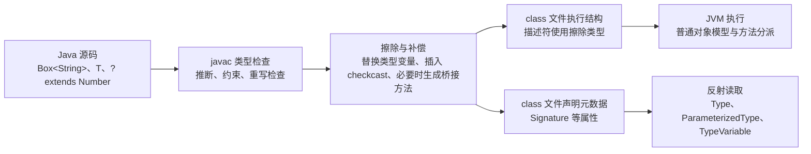

# 3.2.3.1 类型擦除

## 从“泛型存在于哪里”开始

Java 泛型首先是一套源代码类型系统。开发者写下 `List<String>`、`Map<K, V>` 或 `<T extends Comparable<T>> T max(...)` 时，编译器会利用类型实参、类型变量、通配符和边界检查赋值、调用、重写与类型推断是否合法。通过检查后，编译器再把这些声明翻译成 JVM 能执行的 class 文件。

类型擦除（type erasure）描述的正是这次翻译中的核心规则：大部分参数化类型不会成为彼此独立的运行时类，类型变量会被替换为它的擦除类型，参数化类型会按原始类型参与方法描述符和字段描述符的生成。为了保持源码已经承诺的类型安全与多态语义，编译器还会插入强制转换，必要时生成合成方法，并把一部分泛型声明写入额外元数据。

因此，“Java 泛型在运行时存在”与“Java 泛型在运行时不存在”都过于笼统。更准确的判断必须区分三个层次：

1. 源码类型系统拥有完整的类型变量、类型实参和通配符关系，负责静态检查与类型推断。
2. JVM 执行所依赖的字段描述符、方法描述符和对象布局通常使用擦除后的类型，不为 `List<String>` 与 `List<Integer>` 创建两套类。
3. class 文件可以通过 `Signature` 等属性保存声明层泛型结构，反射能够读取其中一部分，但这些元数据不参与普通字节码指令的类型判定，也不意味着每个对象携带自己的类型实参。

下图概括了同一段泛型代码在不同阶段的形态：



类型擦除不是简单地“删掉尖括号”。如果只删除泛型文本而不做补偿，读取值时无法恢复源码期望的类型，某些重写关系也会在描述符变化后断裂。理解擦除，必须同时理解擦除规则与编译器为它补上的结构。

## 源代码阶段：类型安全先于擦除发生

考虑一个最小容器：

```java
final class Box<T> {
    private T value;

    void set(T value) {
        this.value = value;
    }

    T get() {
        return value;
    }
}

class UseBox {
    static int length(Box<String> box) {
        String value = box.get();
        return value.length();
    }
}
```

编译器看到的不是一个模糊的 `Box`。对 `Box<String>` 而言，`set` 的有效参数类型是 `String`，`get` 的有效返回类型也是 `String`。所以 `box.set(1)` 会在编译期失败，`String value = box.get()` 则不需要开发者手写转换。类型变量 `T` 还把同一个类中字段、参数与返回值之间的关系连接起来，这种关系是单纯使用 `Object` 无法表达的。

静态检查完成后，`T` 才按规则擦除。上例中的 `T` 没有显式上界，擦除为 `Object`，于是字段描述符近似为 `Ljava/lang/Object;`，`set` 的方法描述符为 `(Ljava/lang/Object;)V`，`get` 的方法描述符为 `()Ljava/lang/Object;`。调用方的源码仍然要求 `String`，编译器便在 `box.get()` 的结果处插入到 `String` 的转换。其效果可用下面的概念性代码表示：

```java
final class BoxAfterErasure {
    private Object value;

    void set(Object value) {
        this.value = value;
    }

    Object get() {
        return value;
    }
}

class UseBoxAfterErasure {
    static int length(BoxAfterErasure box) {
        String value = (String) box.get();
        return value.length();
    }
}
```

这只是帮助理解的等价展开，不是 `javac` 重新生成的 Java 源文件。实际产物是 class 文件，转换表现为字节码中的 `checkcast` 指令。重要的是因果顺序：泛型先在源码阶段约束写入和读取，擦除再把可执行签名降到 JVM 已有的引用类型模型，最后由转换维护调用点所需的具体类型。

由于检查发生在编译期，正常参数化调用通常能阻止错误对象进入容器。类型擦除并不等于“集合内部什么都能放”。只有当代码使用原始类型、未经证明的强制转换、反射、可变参数数组或其他绕过静态检查的路径时，运行时存储的对象才可能违背泛型声明。

## 擦除规则：类型变量最终替换成什么

### 无界类型变量擦除为 `Object`

未声明上界的类型变量隐含上界 `Object`：

```java
class Holder<T> {
    T value;

    T identity(T input) {
        return input;
    }
}
```

`T` 的擦除是 `Object`。字段 `value` 的描述符使用 `Object`，方法 `identity` 的描述符使用 `(Object)Object`。源码中的 `Holder<String>` 与 `Holder<Long>` 都复用同一个 `Holder.class`，不会因为类型实参不同生成 `Holder$String`、`Holder$Long` 之类的运行时类。

### 有界类型变量擦除为最左上界

显式上界改变擦除结果：

```java
class NumberBox<T extends Number> {
    private T value;

    T get() {
        return value;
    }
}
```

这里 `T` 擦除为 `Number`，所以字段描述符是 `Ljava/lang/Number;`，`get` 的描述符是 `()Ljava/lang/Number;`。擦除选择上界而不是一律选择 `Object`，使生成代码可以直接使用上界保证的方法，也减少无意义的宽化。

多重上界必须把类上界放在第一位，后面才能是接口，例如：

```java
class Registry<T extends Number & Comparable<T> & java.io.Serializable> {
    T value;
}
```

`T` 的擦除是最左边的 `Number`。如果没有类上界而只有接口，例如 `<T extends Comparable<T> & Serializable>`，擦除就是最左边的接口 `Comparable`。上界顺序因而可能影响擦除后的二进制签名；它不只是书写风格。公开 API 已发布后随意调换多个接口上界，可能改变方法或字段描述符，应当按二进制兼容问题审视。

### 参数化类型擦除为原始类型

`List<String>`、`List<? extends Number>` 与 `List<T>` 的擦除都是 `List`。嵌套参数同样不会进入普通描述符，例如 `Map<String, List<Integer>>` 的字段描述符只表达 `Map`。具体类型参数可以保存在字段的 `Signature` 属性中，但 JVM 访问该字段时仍按 `Map` 引用处理。

数组的擦除按组件类型递归进行。`T[]` 擦除为 `Object[]`，但若 `T extends Number`，则 `T[]` 擦除为 `Number[]`。`List<String>[]` 若只讨论类型表达式的擦除会得到 `List[]`，但 Java 禁止直接创建这种具体参数化组件类型的数组，原因在后文讨论。

### 方法与构造器按擦除后的签名检查冲突

方法的类型参数也按同样规则擦除：

```java
static <T> T first(java.util.List<T> values) {
    return values.get(0);
}
```

方法描述符中的参数是 `List`，返回类型是 `Object`。泛型方法不是在每次调用时根据 `T` 生成一个新方法；`first(strings)` 与 `first(numbers)` 调用同一份擦除后代码，调用点根据目标类型插入必要转换。

擦除还参与“名称冲突”判断。下面两个方法不能同时声明：

```java
// 编译错误：两个方法擦除后都接收 List
void process(java.util.List<String> values) {}
void process(java.util.List<Integer> values) {}
```

两者在源码中看似参数不同，但擦除后的描述符都是 `(Ljava/util/List;)V`，class 文件无法用同一个名称和同一个描述符容纳它们。类似地，泛型父类与子类中两个方法若擦除后具有相同签名，却又不构成合法重写，可能产生 name clash。设计重载 API 时不能把类型实参当作可区分重载的运行时参数。

## 编译器补偿之一：读取位置的强制转换

擦除让 `Box<T>.get()` 的可执行返回类型变宽，但调用方已经通过源码类型检查获得了更窄的静态类型。编译器需要把两层连接起来。以下完整示例便于观察：

```java
public class ErasureDemo {
    static final class Box<T> {
        private T value;

        Box(T value) {
            this.value = value;
        }

        T get() {
            return value;
        }

        void set(T value) {
            this.value = value;
        }
    }

    static int length(Box<String> box) {
        return box.get().length();
    }

    public static void main(String[] args) {
        System.out.println(length(new Box<>("java")));
    }
}
```

用 JDK 11 的 `javac ErasureDemo.java` 编译，再执行 `javap -c -s -p ErasureDemo`，`length` 的关键输出可归纳为：

```text
static int length(ErasureDemo$Box<java.lang.String>);
  descriptor: (LErasureDemo$Box;)I
  Code:
     0: aload_0
     1: invokevirtual ErasureDemo$Box.get:()Ljava/lang/Object;
     4: checkcast     java/lang/String
     7: invokevirtual java/lang/String.length:()I
    10: ireturn
```

源码展示行可以显示 `Box<String>`，这是 `javap` 解读泛型签名后的结果；紧随其后的 descriptor 只包含擦除后的 `Box`。调用 `get` 得到 `Object` 后，偏移量 4 的 `checkcast String` 恢复源码期望的类型，随后才允许调用 `String.length()`。

并非每个泛型读取都一定产生可见的 `checkcast`。若结果只赋给 `Object`、直接丢弃，或后续操作只要求擦除上界，编译器可能不需要转换；优化阶段也可能改变最终机器码。应该记住的是语义要求：当擦除后的值不足以满足调用点静态类型时，生成代码必须完成相应类型适配，而不是机械地认为“每次 `get` 后都有一条固定指令”。

转换失败通常说明静态类型系统此前被绕过。正常的 `Box<String>` 只允许通过类型安全路径写入字符串；如果内部真的保存了整数，问题来自某个 unchecked 边界。异常往往在读取点才暴露，是因为写入点只面对擦除后的引用存储，而读取点第一次需要把对象恢复为具体类型。

## 编译器补偿之二：桥接方法只解决描述符适配

类型变量擦除后，父类方法与子类具体实现的方法描述符可能不再一致。编译器会在需要时生成带 `ACC_BRIDGE`、通常也带 `ACC_SYNTHETIC` 标志的转发方法，以维持源码层面的重写和动态分派。

桥接方法是类型擦除的重要后果，但它有独立的触发条件、字节码形态和反射表现。本文只需要建立关联：擦除改变描述符，桥接方法在必要时把擦除签名适配到具体实现。完整机制与 `javap` 分析见[3.2.3.3 桥接方法](3.2.3.3.桥接方法.md)，这里不重复展开。

还要避免把两种转换混为一谈。普通泛型读取的 `checkcast` 常位于调用方，用于把擦除返回值恢复为调用点所需类型；参数收窄产生的桥接方法可能在被调用类内部执行 `checkcast`，再转发到具体实现。二者都与擦除有关，但位置和职责不同。

## `Signature`：被擦除的执行类型之外仍有声明信息

class 文件中的字段描述符和方法描述符必须能直接服务于 JVM 链接与执行，因此使用擦除类型。为了让编译器、反射、文档工具和其他语言工具继续理解泛型声明，Java 编译器可以为类、字段、方法或构造器写入 `Signature` 属性。

下面的类同时包含类类型参数、参数化字段和泛型方法：

```java
import java.util.List;

public class SignatureDemo<T extends Number & Comparable<T>> {
    private List<String> names;

    public T choose(T left, T right) {
        return left.compareTo(right) >= 0 ? left : right;
    }
}
```

使用 `javap -v -p SignatureDemo` 可以同时看到两类信息。字段 `names` 的 descriptor 是 `Ljava/util/List;`，而它的 Signature 表达 `Ljava/util/List<Ljava/lang/String;>;`。方法 `choose` 的 descriptor 以 `Number` 为参数和返回值，因为 `T` 的最左上界是 `Number`；方法 Signature 则继续记录参数与返回值均为同一个类型变量 `T`。类级 Signature 记录 `T` 的多个上界。

这说明“擦除”针对的主要是执行类型与运行时表示，不等于 class 文件删除所有泛型痕迹。可是 `Signature` 也不能被夸大：

- 它是声明元数据，不改变对象布局，不让 JVM 的 `instanceof` 自动检查类型实参。
- 它描述声明位置写下的泛型结构，不记录每一次局部变量赋值对应的完整实参。
- 局部变量的泛型调试信息取决于编译选项和调试属性，不能当作稳定运行时契约。
- class 文件可能由其他工具生成，也可能被混淆、转换或裁剪；反射代码应处理签名缺失或形态与预期不同的情况。
- JVM 验证与方法分派主要依赖描述符及类层次，不依赖 `Signature` 来重新执行 Java 泛型类型检查。

除 `Signature` 外，类型注解还可能记录在 `RuntimeVisibleTypeAnnotations` 或 `RuntimeInvisibleTypeAnnotations` 等属性中；运行时可见性由注解保留策略决定。这些信息属于注解与 class 文件元数据体系，不能理解为“泛型被具体化”。

## 运行时能获取什么，不能获取什么

### 普通对象通常不能报告自己的类型实参

```java
java.util.List<String> strings = new java.util.ArrayList<>();
java.util.List<Integer> integers = new java.util.ArrayList<>();

System.out.println(strings.getClass() == integers.getClass()); // true
```

两个对象都是 `ArrayList` 的实例，类型实参只约束各自引用的静态使用方式。`strings.getClass()` 返回 `Class<? extends List>` 意义上的运行时类对象，不会返回某种 `Class<ArrayList<String>>`。`Class` 对应已加载的运行时类，而 `ArrayList<String>` 没有独立 class。

因此不能写 `obj instanceof List<String>`，也不能写 `List<String>.class`。合法形式是 `obj instanceof List<?>` 与 `List.class`：前者只判断对象是否为某种 `List`，不承诺元素类型；后者表示原始运行时类。

### 反射能读取声明位置保存的泛型类型

假设某个类声明字段：

```java
class Repository {
    java.util.List<String> names;
}
```

反射调用 `Repository.class.getDeclaredField("names").getGenericType()`，通常会得到实现 `ParameterizedType` 的对象。它能够报告原始类型 `List` 和实际类型参数 `String`。调用 `getType()` 则只得到运行时字段类型 `List.class`。

Java 反射用 `java.lang.reflect.Type` 体系表示声明类型：

- `Class<?>` 表示普通类、接口、基本类型或数组类。
- `ParameterizedType` 表示 `List<String>`、`Map<K, V>` 这类参数化声明。
- `TypeVariable<?>` 表示 `T`，并可查询其声明者与上界。
- `WildcardType` 表示 `?`、`? extends Number` 或 `? super String`。
- `GenericArrayType` 表示组件类型本身不是普通 `Class` 的数组声明，例如 `T[]`。

反射读到的是“这个字段被声明为 `List<String>`”，不是“这个字段当前指向的对象已经验证只含字符串”。原始类型或 unchecked 操作仍可能把整数放进该列表。反射元数据描述契约，不审计容器内容。

### 通过子类声明可以捕获部分实参

若一个具体子类把父类类型参数写进自己的父类声明，反射可以读取这条声明：

```java
abstract class TypeRef<T> {}

final class StringListRef
        extends TypeRef<java.util.List<String>> {}
```

`StringListRef.class.getGenericSuperclass()` 可以返回表示 `TypeRef<List<String>>` 的 `ParameterizedType`。常见“类型令牌”方案便利用匿名子类或显式子类，把实参固化在子类的 generic superclass 声明中。

这不是从任意 `new TypeRef<List<String>>()` 对象内部逆推出 `T`，而是主动创建了一条可反射的子类声明。若调用链中留下的仍是类型变量，例如 `class Mid<X> extends TypeRef<X>`，读取者还需要结合继承关系解析变量替换，不能直接假定已经得到具体类。

### 运行时值不能反推出可靠的声明实参

检查列表当前元素只能得到当前值的运行时类，无法证明列表声明为哪种类型。空列表没有样本；包含子类对象的 `List<Number>` 可能看起来像整数列表；`null` 没有可用运行时类；堆污染还可能让内容违反声明。元素扫描不能替代泛型元数据。

需要在运行时可靠区分类型时，应显式传入 `Class<T>`、解析器、工厂或更完整的 `Type` 令牌。例如创建 `T` 的实例通常需要 `Supplier<? extends T>` 或构造器对象，而不是试图执行 `new T()`。这是把被擦除的信息变成真实运行时数据，而不是绕过擦除。

## 堆污染：声明类型与实际对象失去一致

堆污染（heap pollution）是指一个参数化类型变量引用了不符合其参数化类型约束的对象。它不一定立即抛异常，危险恰恰在于错误可能跨越多个调用层，直到某个读取点执行编译器插入的转换才暴露。

最直接的来源是原始类型：

```java
import java.util.ArrayList;
import java.util.List;

public class PollutionDemo {
    @SuppressWarnings({"rawtypes", "unchecked"})
    public static void main(String[] args) {
        List<String> names = new ArrayList<>();
        names.add("Java");

        List raw = names;
        raw.add(42);

        String second = names.get(1); // 这里抛出 ClassCastException
        System.out.println(second);
    }
}
```

`raw.add(42)` 调用擦除后的 `add(Object)`，运行时列表本身没有 `String` 组件类型可以即时检查。`names.get(1)` 的可执行返回类型是 `Object`，调用方随后执行到 `String` 的 `checkcast`，异常才出现。错误根源在 unchecked 写入边界，异常位置只是第一次要求恢复类型契约的地方。

未经检查的强制转换也可能制造污染：

```java
@SuppressWarnings("unchecked")
static <T> java.util.List<T> pretend(java.util.List<?> input) {
    return (java.util.List<T>) input;
}
```

这个方法无法仅凭 `List<?>` 证明元素都属于 `T`。`@SuppressWarnings` 只隐藏编译器警告，不增加任何运行时验证。只有调用方或实现确实掌握额外不变量，并且该不变量在边界处被检查或由封装保证时，这种转换才可能合理。

工程上处理 unchecked 边界应遵循三个原则。第一，把转换收敛在最小作用域，不在整个类上笼统压制警告。第二，在转换前尽可能校验可验证的事实，例如逐个使用 `Class.cast` 检查外部集合。第三，通过私有封装保证污染值不会从未验证路径进入，并写清楚为何转换安全。unchecked 警告表示编译器无法证明安全，它不是普通样式提示。

## 泛型数组：擦除与数组具体化语义的冲突

数组和泛型的差异不能只记成“数组协变，泛型不变”。更根本的区别是：Java 数组是具体化的（reified），数组对象在运行时知道自己的组件类型，并在写入时执行检查；多数泛型类型实参被擦除，普通参数化对象不知道自己的实参。

```java
Number[] numbers = new Integer[1];
numbers[0] = 1.5; // 运行时抛出 ArrayStoreException
```

赋值之所以能在写入点失败，是因为实际数组对象知道组件类型是 `Integer`。数组协变允许 `Integer[]` 赋给 `Number[]`，运行时检查用于弥补这种静态宽化带来的风险。

如果允许直接创建 `new List<String>[10]`，数组运行时只能知道组件类是 `List`，无法判断写入的对象究竟是 `List<String>` 还是 `List<Integer>`。数组存储检查不能兑现“组件为 `List<String>`”这一具体化承诺，所以 Java 禁止创建具体参数化类型数组：

```java
// 编译错误：generic array creation
java.util.List<String>[] values = new java.util.List<String>[10];
```

可以创建 `List<?>[]`，因为 `List<?>` 不承诺具体元素类型，数组只需检查写入对象是某种 `List`：

```java
java.util.List<?>[] groups = new java.util.List<?>[2];
groups[0] = java.util.List.of("a");
groups[1] = java.util.List.of(1);
```

也可以通过原始数组再做 unchecked 转换得到 `List<String>[]`，但这只是在类型系统外建立承诺，并没有让数组获得字符串实参检查能力：

```java
@SuppressWarnings("unchecked")
java.util.List<String>[] unsafe =
        (java.util.List<String>[]) new java.util.List<?>[1];

Object[] objects = unsafe;
objects[0] = java.util.List.of(42); // 数组只看到这是 List，写入成功
String value = unsafe[0].get(0);    // 读取转换时失败
```

泛型可变参数也建立在数组上。方法 `<T> void accept(T... values)` 的参数在实现层面是数组；如果 `T` 是不可具体化类型，调用点可能创建擦除组件类型的数组并产生 unchecked 警告。方法若保存该数组、向外暴露它，或通过 `Object[]` 写入不兼容值，就可能导致堆污染。

`@SafeVarargs` 表示方法实现不会对泛型可变参数执行潜在不安全操作，它是开发者对实现的承诺，不会改变数组表示。该注解只能用于语言允许的不可重写方法场景，例如 `static`、`final`、`private` 方法以及构造器，具体可用范围取决于 Java 语言版本。使用前应审查方法体，而不是为了消除警告机械添加。

如果需要存放一组泛型值，通常优先使用 `List<T>`。若必须创建 `T[]`，可以让调用方提供数组构造函数，例如 `IntFunction<T[]>`，或提供具体组件 `Class<?>` 后用反射数组 API 创建，再把不可避免的转换封装在经过验证的边界。`new T()` 与 `new T[]` 失败的共同原因，是类型变量没有足够的运行时构造信息。

## 反射调用仍然受擦除后的入口约束

反射可以读取泛型声明，也可以绕过普通源码调用形式直接调用方法，但它不会自动恢复完整泛型检查。以 `List<String>.add` 为例，反射看到 `List.add` 的普通参数类型是 `Object`；泛型接口声明中的类型变量可以通过 generic parameter types 读取，但实际调用时 `Method.invoke` 不会根据某个接收引用原先被声明为 `List<String>` 而拒绝整数。

同理，字段 `List<String> names` 的 `Field.getGenericType()` 能报告字符串实参，`Field.set` 对字段本身只检查被赋值对象是否兼容擦除后的 `List` 类型，不会逐个检查列表元素。运行时框架若要兑现泛型契约，必须主动解析 `Type` 并执行递归校验或转换。

反射查询方法时也要使用擦除后的参数类。若源码声明 `<T extends Number> void consume(T value)`，调用 `getDeclaredMethod("consume", Number.class)` 才符合其方法描述符；使用 `Integer.class` 查询不会因为某次调用把 `T` 推断成 `Integer` 就匹配成功。类型推断是编译器在调用点完成的，不会生成一个参数为 `Integer` 的额外反射入口。

桥接方法可能出现在 `getDeclaredMethods()` 结果中，反射 API 可通过 `Method.isBridge()` 与 `Method.isSynthetic()` 识别。框架扫描方法时需要决定是否排除、合并或特殊处理这些编译器产物，否则可能把桥接入口与真实实现重复注册。具体桥接规则仍应参见独立文章。

## 重载、重写与异常边界

### 不能只按类型实参重载

如前所述，`handle(List<String>)` 与 `handle(List<Integer>)` 擦除后冲突。解决方式不是强转，而是改变方法名、引入能在运行时区分的额外参数，或重新设计抽象。例如传入 `Class<T>` 可以为运行时分派提供真实标记，但只有当方法确实需要运行时类型时才应增加它。

泛型方法和非泛型方法也可能因擦除冲突：

```java
// 两者不能共存，T 擦除为 Object
<T> void save(T value) {}
void save(Object value) {}
```

`<T extends Number> void save(T)` 则擦除为 `save(Number)`。判断冲突时应先求类型变量擦除，再比较名称和描述符，而不是只看源码是否写了不同字母。

### 重写必须同时满足源码规则与擦除约束

源码类型系统会判断参数替换后的方法是否构成重写；class 文件执行又要求擦除后的描述符能够参与正常分派。编译器在合法且需要适配时生成桥接方法，在无法同时容纳两个成员时报告 name clash。不能用“泛型最后都变成 Object”代替精确分析，因为有界变量可能擦除为 `Number` 或接口，方法还可能受继承层次、返回类型和可访问性影响。

### 不能声明泛型 `Throwable` 子类

Java 禁止泛型类直接或间接继承 `Throwable`：

```java
// 编译错误
class Problem<T> extends Exception {}
```

异常匹配依赖运行时类，`catch` 参数也不能使用类型变量。若允许 `Problem<String>` 与 `Problem<Integer>`，擦除后它们仍是同一个异常类，捕获机制无法按类型实参区分。泛型方法可以声明抛出类型变量，例如 `<E extends Exception> void run() throws E`，这用于编译期表达异常关系；它不会创造按 `E` 实参区分的异常运行时类。

### 静态上下文不能使用类的类型变量

类的类型参数属于实例化该泛型类型时的静态视图，不属于类唯一的静态成员。`static T value` 无法回答它是 `Box<String>` 的字符串还是 `Box<Integer>` 的整数，因为运行时只有一份静态字段。静态方法若需要泛型，应声明自己的类型参数，例如 `static <T> T identity(T value)`。

## 兼容性动机：为什么 Java 选择擦除

Java 泛型加入语言时，已经存在大量不带类型参数的类库、应用与二进制文件。集合 API 原本返回 `Object` 并接收 `Object`。采用擦除后，`List<E>.add(E)` 的方法描述符仍可落到 `add(Object)`，旧代码、新编译器生成的代码以及既有 JVM 对象模型可以在很大程度上共存。

这种迁移策略带来几个关键收益：

- 许多旧 class 文件无需理解新的参数化运行时类型，也能与泛型化后的库链接。
- 泛型库通常不必为每个引用类型实参复制字节码，避免代码数量随组合膨胀。
- `List` 与 `List<String>` 可以通过原始类型机制渐进互操作，旧 API 能逐步补充泛型签名。
- JVM 的类身份、对象布局和普通方法分派不必为每个类型实参建立一套新模型。

“为了向后兼容”不是说任何改动都自动二进制兼容，也不是说擦除后签名永远不变。改变类型变量的最左上界、改变会影响擦除的方法参数、删除编译器原先生成桥接所依赖的重写关系，都可能改变描述符或链接行为。评估库演进时，应以编译前后 class 文件的二进制签名为准，而不能只比较源码外观。

原始类型是迁移兼容的一部分，但不应成为新代码的默认选择。它允许旧调用方继续使用泛型化 API，同时牺牲部分静态检查并产生 unchecked 警告。`List`、`List<Object>` 与 `List<?>` 含义不同：

- `List` 是原始类型，许多泛型检查被关闭，主要用于遗留兼容。
- `List<Object>` 是元素静态类型明确为 `Object` 的列表，可以按 API 规则写入任意对象，但不能接收 `List<String>` 赋值。
- `List<?>` 是元素类型未知的某种列表，能够安全读取为 `Object`，通常不能写入除 `null` 外的具体值。

这些差异发生在源码类型系统。擦除后它们都使用 `List` 运行时类，不代表源码层可以互相替换。

## 擦除方案的边界与代价

擦除让迁移与复用变得可行，同时留下明确限制。

第一，不能直接实例化类型变量。`new T()` 不成立，因为擦除后编译器不知道应调用哪个具体构造器，也不知道该构造器是否存在。解决方案是显式传入 `Supplier<T>`、工厂、构造器引用或 `Class<T>`，让构造能力成为真实参数。

第二，不能对具体参数化类型做运行时判定。`value instanceof List<String>` 不成立，因为运行时只有 `List` 类可检查；`List<?>` 是合法判定上界。若业务必须区分元素类型，应携带类型标记并校验内容。

第三，不能直接创建具体参数化类型数组。数组需要可执行的组件类型检查，而被擦除的实参无法提供该能力。

第四，不能按类型实参区分重载、静态字段或异常类。它们都依赖运行时唯一成员或唯一类身份，擦除后的实参不足以成为区分依据。

第五，基本类型不能直接作为类型实参。`List<int>` 不合法，只能使用 `List<Integer>`，因此会涉及装箱、拆箱与对象表示成本。这个限制与 Java 泛型面向引用类型、采用统一擦除模型有关。不能据此假定所有使用点都会发生同样的性能开销；应结合具体代码、编译器优化与运行时分析。

第六，运行时框架面对 `Type` 体系时需要处理比 `Class<?>` 更复杂的结构。`List<? extends Number>`、`T[]`、嵌套参数化类型和继承链中的类型变量替换都不能只用一次强转解决。序列化、依赖注入或数据绑定框架通常要求用户提供完整类型令牌，原因正是普通 `Class` 无法表达这些结构。

这些代价不是泛型“失效”，而是 Java 选择把主要类型安全放在编译期、把运行时表示维持在既有类模型上的结果。只要 API 不要求在运行时按实参创建不同布局、执行不同分派或做具体实参判定，擦除通常不会妨碍日常类型安全。

## 用 `javac` 与 `javap` 建立可验证的分析路径

遇到泛型擦除问题时，可靠方法不是凭印象猜测，而是按以下顺序验证：

1. 在源码层标出每个类型变量的声明者、上界和调用点推断结果。
2. 对类型变量求擦除：无界取 `Object`，有界取最左上界，参数化类型取原始类型，数组递归处理组件。
3. 推导字段与方法描述符，判断重载是否冲突、重写后描述符是否仍对齐。
4. 用 `javac -Xlint:all` 编译，正视 raw、unchecked、varargs 等警告。
5. 用 `javap -c -s -p` 查看指令与描述符，定位调用方 `checkcast`。
6. 用 `javap -v -p` 查看 `Signature`、方法标志和常量池，区分执行签名与声明元数据。
7. 若涉及反射，分别打印 `getType()` 与 `getGenericType()`，不要把 `Class` 和 `Type` 混为一谈。

下面这个命令组合适合验证本文的 `ErasureDemo`：

```text
javac -Xlint:all ErasureDemo.java
javap -c -s -p ErasureDemo
javap -c -s -p 'ErasureDemo$Box'
```

预期结论是：`Box.get` 的 descriptor 返回 `Object`；`length` 的 descriptor 只包含擦除后的 `Box`；`length` 调用 `get` 后出现到 `String` 的 `checkcast`。不同 JDK 版本可能改变常量池编号、输出排版、局部变量表或某些非语义性指令细节，因此验证应关注描述符、关键调用和转换，不应把整段反汇编文本当作跨版本固定快照。

检查 `SignatureDemo` 时，`javap -v -p` 应同时显示 descriptor 与 Signature。前者回答“JVM 用什么类型链接和执行”，后者回答“源码声明的泛型结构被记录成什么”。如果只看 `javap` 默认展示的美化方法声明，很容易误以为方法描述符也保留了完整泛型；如果只看 descriptor，又会误以为反射完全读不到声明实参。

## 常见误区的精确修正

### “泛型只是语法糖”

泛型确实主要通过编译器实现，但“语法糖”容易掩盖它对类型检查、重载判定、重写关系、类型推断、class 元数据和二进制兼容的系统影响。它不是简单文本替换。更准确的说法是：Java 泛型采用以编译期静态类型检查为核心、以擦除后运行时表示为基础的实现策略。

### “所有类型变量都擦除成 `Object`”

只有无界或最左上界为 `Object` 的类型变量如此。有界变量擦除为最左上界。分析描述符、反射查询和二进制兼容时，这个差异很关键。

### “运行时完全没有泛型信息”

普通对象通常不携带自己的类型实参，但类、字段、方法和父类型声明可以通过 `Signature` 保留泛型结构，反射能读取。应区分对象实例信息、可执行描述符和声明元数据。

### “反射拿到 `List<String>` 就能保证列表里都是字符串”

反射拿到的是声明契约。原始类型、unchecked 操作或外部字节码仍可能造成堆污染。若数据来自不可信边界，框架必须验证实际元素。

### “强制转换是开发者省略了，编译器随处补上”

转换只在擦除后的值不足以满足静态类型时需要，位置也可能不同。普通读取转换常在调用方；桥接适配的转换可能在合成方法内部；完全不使用具体类型的结果可能无需转换。

### “`List<Object>` 是 `List<String>` 擦除后的源码写法”

擦除后的运行时原始类都是 `List`，不等于源码类型关系变成 `List<Object>`。Java 泛型默认不变，`List<String>` 不是 `List<Object>` 的子类型。否则通过 `List<Object>` 写入整数会破坏原字符串列表。

### “只要加了 `@SuppressWarnings` 就安全”

该注解只控制警告报告，不插入检查，也不改变运行时表示。安全性必须来自可证明的不变量、边界校验和封装。

## API 设计中的实践原则

设计泛型 API 时，类型参数应表达真实关系。例如 `<T> T copy(T value)` 把输入与输出联系起来，`Class<T>` 与返回 `T` 可以把运行时标记和静态结果联系起来。若类型参数只出现一次，且不约束其他位置，它可能没有提供有价值的关系，应考虑直接使用通配符或普通上界。

需要运行时类型时应显式建模。反序列化方法只接收 `Class<T>`，能表达 `User`，却不能完整表达 `List<User>`；若要支持嵌套泛型，应接收能够保留 `Type` 的类型令牌。创建对象时优先接收工厂或构造函数式接口，因为“如何创建”比一个可能没有无参构造器的 `Class<T>` 更准确。

与遗留 API 交互时，把 raw 与 unchecked 限制在适配层。适配层负责验证外部数据并返回参数化结果，业务代码不应持续传播原始类型。一个局部且有证明的 unchecked 转换，比在调用链各处反复强转更容易审查。

公开方法不要依赖只按实参区分的重载，也不要假定调用方能通过运行时对象恢复实参。若两个操作语义不同，使用不同名称通常更清晰；若语义相同而数据类型不同，泛型方法或策略对象往往更合适。

最后，库演进需要同时检查源码兼容和二进制兼容。修改上界、返回类型或继承关系后，应比较 `javap -s -v` 输出并运行旧客户端二进制测试。源码重新编译成功不代表旧 class 文件一定能链接，反过来也可能存在二进制仍可运行但源码重新编译出现歧义或警告的情况。

## 小结

Java 类型擦除可以概括为一组相互配合的机制，而不是一句“泛型运行时不存在”：

- 源码阶段保留完整泛型关系，完成类型检查、推断、重载与重写判定。
- 类型变量按 `Object` 或最左上界擦除，参数化类型按原始类型生成执行描述符。
- 编译器在需要恢复具体静态类型的地方插入转换，并在描述符适配需要时生成桥接方法。
- class 文件可用 `Signature` 等属性保存声明层泛型结构，但普通对象通常不携带自己的类型实参。
- 反射能够读取声明元数据，不能凭空恢复任意对象的实参，也不会自动验证容器元素。
- 原始类型、unchecked 转换和泛型可变参数可能造成堆污染，异常常在后续读取转换处才暴露。
- 数组具有运行时组件类型，而泛型实参通常被擦除，这一差异解释了泛型数组创建限制。
- 擦除支持既有类库、二进制与对象模型的渐进兼容，同时带来实例化、运行时判定、重载和基本类型等边界。

分析具体问题时，应始终把“源码静态类型”“JVM 描述符”“声明元数据”分开。先求擦除，再查看编译器补偿，最后判断运行时究竟拥有哪一类信息，绝大多数泛型限制、反射现象与 `ClassCastException` 都能沿这条路径得到一致解释。
