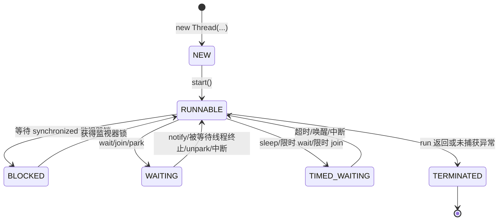

# 3.3.1.2 启动线程

## 启动线程到底在解决什么问题

在 Java 中，创建 `Thread` 对象和启动线程不是同一件事。`new Thread(...)` 只是在当前线程里创建了一个普通 Java 对象，这个对象保存了线程名、任务、优先级、守护线程标记、未捕获异常处理器等元数据，也可能已经关联了一个 `Runnable` 任务；但只要没有调用 `start()`，这个对象就仍然处在 `NEW` 状态，它并没有成为一条可被运行时调度的执行流。启动线程真正解决的问题，是把一个描述任务的对象交给 Java 运行时，让运行时创建或关联底层执行资源，并使该线程进入可调度状态。

理解“启动线程”时，最容易被忽略的是它同时包含三层含义。第一层是生命周期含义：一个 `Thread` 对象只能从 `NEW` 启动一次，启动之后会经历可运行、阻塞、等待、定时等待和终止等状态。第二层是执行含义：`start()` 返回后，调用方线程继续向下执行，新线程会在未来某个调度时刻执行 `run()` 中的代码，两条执行流之间没有默认的先后完成关系。第三层是内存语义：调用 `start()` 之前已经发生的写入，对被启动线程中的动作具有 happens-before 保证；这不是经验规律，而是 Java 内存模型提供的正式同步关系。

本文只讨论通用 Java 语境下的线程启动。它不把启动线程理解成“多写一个 `new Thread().start()`”，而是围绕几个必须讲清的问题展开：`start()` 和 `run()` 的区别是什么，线程启动前后状态怎样变化，启动动作提供哪些可见性保证，任务抛出的异常落在哪里，为什么不能重复启动同一个线程对象，线程命名和线程工厂如何帮助管理线程，直接启动线程的成本与边界在哪里，以及哪些看似可行的写法其实依赖了不可靠的调度时机。

一个最小的启动线程示例如下：

```java
Thread worker = new Thread(() -> {
    System.out.println(Thread.currentThread().getName() + " is running");
}, "worker-1");

worker.start();
System.out.println(Thread.currentThread().getName() + " continues");
```

这段代码的关键不在输出内容，而在两个事实。`worker.start()` 由当前线程调用，但 `Runnable` 的主体不在当前线程中直接执行，而是在名为 `worker-1` 的新线程中执行；同时，`start()` 不等于“立刻执行完”，它只让新线程具备被调度执行的资格。至于新线程先打印，还是当前线程先打印，取决于调度，程序不能把其中某一种输出顺序当作正确性前提。

## Thread.start 与 run 的根本区别

`Thread` 类同时有 `start()` 和 `run()`，这是启动线程主题中最基础也最容易误用的一组方法。`start()` 是启动方法，它改变线程对象的生命周期状态，并请求 Java 运行时安排一个新的执行流；`run()` 是任务入口方法，它只是一个普通实例方法。直接调用 `run()` 不会创建新线程，不会让 `Thread` 对象从 `NEW` 进入可调度状态，也不会产生线程启动对应的内存同步效果。

可以用下面的代码观察二者区别：

```java
public class StartAndRunDemo {
    public static void main(String[] args) {
        Runnable task = () -> System.out.println("task thread = "
                + Thread.currentThread().getName());

        Thread t1 = new Thread(task, "worker-start");
        Thread t2 = new Thread(task, "worker-run");

        t1.start();
        t2.run();

        System.out.println("main thread = "
                + Thread.currentThread().getName());
    }
}
```

`t1.start()` 会使 `task` 在 `worker-start` 线程中执行；`t2.run()` 则只是由当前调用它的线程执行这段方法体。如果 `main` 线程调用 `t2.run()`，打印出的当前线程仍然是 `main`。也就是说，`run()` 的调用语义与普通方法没有差别，它会占用当前调用栈，调用者必须等 `run()` 返回后才能继续执行后面的语句。`start()` 则不同，它通常很快返回，任务主体在另一个线程的调用栈中运行。

这一区别会带来几个直接后果。第一，直接调用 `run()` 不会并发执行任务。如果代码中写了多个 `thread.run()`，它们仍然按普通方法调用顺序串行执行。第二，直接调用 `run()` 时，任务抛出的异常会沿着当前调用栈向上传播；通过 `start()` 启动后，任务抛出的未捕获异常会终止新线程，并交给该线程的未捕获异常处理机制处理，不会自动抛回启动它的线程。第三，直接调用 `run()` 不会消耗新线程创建和调度成本，但这不是一种“轻量启动线程”的技巧，因为它根本没有启动线程。

有时会看到继承 `Thread` 并覆盖 `run()` 的写法：

```java
class ReportThread extends Thread {
    ReportThread() {
        super("report-worker");
    }

    @Override
    public void run() {
        generateReport();
    }

    private void generateReport() {
        // 执行任务
    }
}

Thread t = new ReportThread();
t.start();
```

这种写法在语义上仍然是 `start()` 启动线程、`run()` 作为新线程入口。区别只在任务是通过继承覆盖表达，还是通过 `Runnable` 组合表达。实际代码中通常更推荐把任务写成 `Runnable` 或 `Callable`，把线程本身当作执行载体，因为任务和线程生命周期不是同一个概念：同一个任务逻辑可以被普通线程执行，也可以被线程池执行，还可以在测试中直接同步执行。把任务与线程对象强绑定，会降低复用和管理能力。

## 启动前后的状态变化

Java 用 `Thread.State` 描述线程状态，常见值包括 `NEW`、`RUNNABLE`、`BLOCKED`、`WAITING`、`TIMED_WAITING` 和 `TERMINATED`。这些状态不是操作系统线程状态的一比一映射，而是 Java 层面对线程生命周期和等待原因的抽象。讨论启动线程时，最重要的是看清 `NEW`、`RUNNABLE` 和 `TERMINATED` 三个阶段，以及启动后为什么还可能进入阻塞或等待状态。

线程对象刚创建时处于 `NEW`。此时它只是一个尚未启动的对象，可以设置部分属性，例如线程名、守护线程标记、优先级和未捕获异常处理器。注意，这些配置有时间边界：守护线程标记必须在启动前设置；线程名虽然启动后仍可修改，但为了诊断一致性，通常也应在创建时确定；任务引用和构造参数应在启动前准备完成，避免把半初始化状态暴露给新线程。

调用 `start()` 后，线程不再是 `NEW`。从 Java 状态看，它通常进入 `RUNNABLE`，表示它可以运行，或者正在运行，具体是否已经获得 CPU 不由 Java 代码直接决定。`RUNNABLE` 这个名字容易造成误解，它不保证线程正在执行，只表示它没有因为 Java 监视器锁、`wait()`、`join()`、`sleep()` 等原因进入其他等待状态。一个已经 `start()` 的线程，可能长时间处于可调度但未真正运行的状态，这取决于运行时、操作系统调度和机器负载。

当新线程开始执行后，它会调用该 `Thread` 对象的 `run()` 方法。如果构造线程时传入了 `Runnable`，默认 `Thread.run()` 会调用这个 `Runnable` 的 `run()`；如果子类覆盖了 `run()`，则执行覆盖后的逻辑。任务执行期间，线程可能因等待锁进入 `BLOCKED`，因 `Object.wait()`、无超时 `join()`、`LockSupport.park()` 等进入 `WAITING`，也可能因 `Thread.sleep()`、带超时等待、带超时 `join()` 等进入 `TIMED_WAITING`。这些状态都发生在启动之后，它们描述的是已启动线程在运行过程中的等待原因。

当 `run()` 正常返回，或者抛出未被捕获的异常，线程进入 `TERMINATED`。终止后的线程不能再次启动，不能回到 `NEW`，也不会重新执行 `run()`。此时 `Thread` 对象本身仍可能被其他对象引用，调用 `getState()` 可能看到 `TERMINATED`，调用 `isAlive()` 返回 `false`，调用 `join()` 通常会很快返回；但它代表的那次执行已经结束。

可以用一个状态流转图描述启动前后的主要路径：



这个图只表达 Java 层面的典型状态关系，不应被理解成精确调度顺序。比如从 `RUNNABLE` 到真正占用处理器之间，可能还有操作系统就绪队列和运行时调度细节；从等待状态回到 `RUNNABLE`，也不意味着立刻继续执行，只表示等待条件已经解除或等待被打断，线程重新具备竞争执行机会。

## start 的内存可见性语义

启动线程不仅是生命周期动作，也是 Java 内存模型中的同步动作。规则可以概括为：对一个线程对象调用 `start()` 之前，在调用线程中已经发生的动作，happens-before 被启动线程中的任何动作。换句话说，只要对象和数据在调用 `start()` 之前已经正确初始化，新线程从 `run()` 中读取这些数据时，能够看到启动前的初始化结果。

例如：

```java
class Config {
    int port;
    String host;
}

Config config = new Config();
config.port = 8080;
config.host = "localhost";

Thread worker = new Thread(() -> {
    System.out.println(config.host + ":" + config.port);
});

worker.start();
```

这里的 `host` 和 `port` 不是 `final`，也没有用 `volatile` 修饰，示例也没有显式加锁。只从启动语义看，调用 `start()` 之前对 `config` 字段的写入，对新线程中读取这些字段的动作可见。这个保证非常重要，因为实际代码经常会在启动线程前构造任务参数、填充配置、建立依赖对象，然后在新线程中使用它们。`start()` 提供了从启动者到被启动线程的安全发布边界。

但是，这个保证有明确范围。它保证的是 `start()` 之前已经发生的动作对新线程可见，不保证 `start()` 之后调用线程继续写入的数据会自动被新线程看见。下面的写法就不能只依赖启动语义：

```java
class Holder {
    boolean stop;
}

Holder holder = new Holder();

Thread worker = new Thread(() -> {
    while (!holder.stop) {
        // 持续工作
    }
});

worker.start();
holder.stop = true;
```

`holder.stop = true` 发生在 `start()` 之后。工作线程循环读取 `holder.stop`，但这个字段不是 `volatile`，也没有被同一把锁保护，因此工作线程没有可靠保证一定能及时看到主线程后续写入的 `true`。程序可能在某些运行中很快结束，也可能在优化和缓存影响下长时间不结束。正确做法是使用 `volatile`、锁、原子变量、并发工具或中断机制来表达启动后的跨线程通信。

`start()` 的可见性还容易与 `join()` 的可见性混淆。`start()` 建立的是启动者到新线程的可见性：启动前的写入对新线程可见。`join()` 建立的是被等待线程到等待者的可见性：一个线程中的所有动作，在另一个线程从该线程的 `join()` 成功返回之后，对等待者可见。二者方向不同，配合起来才能表达完整的“传入参数、启动计算、等待结果”过程。

```java
int[] result = new int[1];

Thread worker = new Thread(() -> {
    result[0] = 42;
});

worker.start();
worker.join();
System.out.println(result[0]);
```

在这个例子中，工作线程对 `result[0]` 的写入，在 `join()` 返回后对调用 `join()` 的线程可见。若去掉 `join()`，当前线程立即读取 `result[0]`，既可能读到 `42`，也可能读到初始值，甚至读取发生时工作线程还没有开始执行。这里的问题不是数组本身特殊，而是缺少等待完成和结果发布的同步关系。

还要注意，内存可见性不等于业务正确性。`start()` 能让新线程看到启动前准备好的数据，但不能让多个线程对同一可变对象的后续复合操作自动变成原子操作；`join()` 能让等待者看到工作线程完成前的写入，但不能代替失败处理、超时处理和取消策略。启动语义提供的是一个必要的内存边界，不是整个并发设计。

## 不能重复启动同一个 Thread

一个 `Thread` 对象只能调用一次 `start()`。如果对同一个对象重复调用 `start()`，第二次调用会抛出 `IllegalThreadStateException`。这个限制来自线程生命周期本身：一个 `Thread` 对象代表一次特定的线程执行，启动后它不再处于 `NEW` 状态；执行结束后它进入 `TERMINATED`，也不能重新回到未启动状态。

```java
Thread worker = new Thread(() -> System.out.println("run"), "once-worker");

worker.start();
worker.start(); // 抛出 IllegalThreadStateException
```

有些初学写法会把 `Thread` 对象误认为可以复用的任务容器，认为第一次执行完后可以再 `start()` 一次。这种理解不正确。可以复用的是任务逻辑，而不是同一个线程对象。如果确实要执行相同逻辑两次，应创建两个不同的 `Thread` 对象，或者把任务提交给能管理多个任务执行的执行器。

```java
Runnable task = () -> System.out.println(Thread.currentThread().getName());

new Thread(task, "worker-1").start();
new Thread(task, "worker-2").start();
```

重复启动限制还会影响一些封装类的设计。假设一个类内部保存了 `private final Thread worker;`，并暴露 `start()` 方法，那么这个封装对象本身也往往只能启动一次。若业务需要“启动、停止、再启动”，通常不应试图复活同一个 `Thread`，而应把生命周期建模为“每次启动创建新的工作线程”，或者使用执行器管理任务提交和关闭。否则封装类第一次停止后再次启动就会触发非法线程状态异常。

需要区分“重复调用同一个 `Thread.start()`”和“多个线程几乎同时尝试启动同一个 `Thread`”。后者也不被允许。`Thread.start()` 内部会检查线程状态，只有尚未启动的线程对象才能启动成功。如果两个调用方并发启动同一个 `Thread` 对象，最多只有一个成功，另一个会失败。一个线程的启动权应当有明确所有者，避免把同一个未启动线程对象发布给多个调用方竞争启动。

## 异常处理：异常不会自动回到启动者

通过 `start()` 启动线程后，新线程中的异常不会像普通方法调用那样沿着启动者的调用栈抛回去。启动者调用 `start()` 时，只是在当前线程中请求启动；一旦 `start()` 返回，启动者和工作线程已经是不同执行流。工作线程中的 `RuntimeException` 或 `Error` 如果没有被任务内部捕获，会导致该工作线程终止，并交给未捕获异常处理器处理。

下面的 `try-catch` 捕获不到工作线程中抛出的异常：

```java
try {
    Thread worker = new Thread(() -> {
        throw new IllegalStateException("boom");
    }, "fail-worker");
    worker.start();
} catch (IllegalStateException ex) {
    // 这里不会捕获 fail-worker 中抛出的异常
}
```

原因很直接：`try-catch` 包围的是当前线程调用 `start()` 的过程，而异常发生在另一个线程执行 `run()` 的过程。若要处理工作线程中的异常，有三种常见方式。第一，在任务内部捕获并记录或转换异常；第二，设置线程级或全局的 `UncaughtExceptionHandler`；第三，使用 `Future`、`CompletableFuture` 或执行器等更高层工具，把异常作为任务结果的一部分传回等待者。

线程级未捕获异常处理器示例如下：

```java
Thread worker = new Thread(() -> {
    throw new IllegalStateException("boom");
}, "fail-worker");

worker.setUncaughtExceptionHandler((thread, error) -> {
    System.err.println(thread.getName() + " failed: " + error.getMessage());
});

worker.start();
```

未捕获异常处理器适合做兜底记录、告警或清理，但不应被误用为普通控制流。它拿到异常时，线程已经因为未捕获异常走向终止；如果调用者需要知道任务是否成功完成，仍然需要设计明确的结果传递机制。只靠后台线程打印异常，调用方可能完全不知道任务失败，后续逻辑还会按照“任务已启动所以最终会完成”的假设继续运行。

使用 `FutureTask` 可以把异常传回等待者：

```java
FutureTask<Integer> task = new FutureTask<>(() -> {
    throw new IllegalStateException("boom");
});

Thread worker = new Thread(task, "future-worker");
worker.start();

try {
    task.get();
} catch (ExecutionException ex) {
    Throwable cause = ex.getCause();
    System.err.println("task failed: " + cause);
}
```

这里异常不会直接从 `worker.start()` 抛出，而是在等待者调用 `task.get()` 时以 `ExecutionException` 的形式暴露出来。这个模式说明一个重要原则：线程启动只负责让任务开始执行，不负责自动建立结果通道。只要任务结果或失败原因对启动者有意义，就应显式设计等待、超时、异常传递和取消策略。

## 线程命名、诊断与可观测性

线程名不是语义正确性的必要条件，但它是并发程序可诊断性的基础。默认线程名通常类似 `Thread-0`、`Thread-1`，在小示例中足够，但在真实程序中很快失去定位价值。一个好的线程名应能说明线程用途、所属模块或任务类别，必要时包含序号。这样在线程 dump、日志、监控和异常输出中，开发者才能快速判断某个线程在做什么。

```java
Thread worker = new Thread(task, "file-import-worker-1");
worker.start();
```

线程命名应尽量在创建时完成。虽然 `Thread.setName()` 可以在启动后修改名称，但启动后修改会让日志前后不一致，也可能让诊断信息在短时间内出现两个不同名称。对于长期运行的工作线程，名称通常描述职责；对于短期任务线程，名称可以描述任务类别和编号。不要把大量易变业务数据塞进线程名，否则会造成噪声，也可能泄露不应出现在日志中的信息。

除了名字，还应关注未捕获异常处理器。没有处理器时，默认行为通常是把异常信息输出到标准错误流；在复杂程序中，这往往不够。可以为单个线程设置处理器，也可以为所有线程设置默认处理器：

```java
Thread.setDefaultUncaughtExceptionHandler((thread, error) -> {
    System.err.println("uncaught in " + thread.getName() + ": " + error);
});
```

默认处理器要谨慎使用。它影响当前 Java 进程中没有单独设置处理器的线程，适合做统一兜底记录，但不应替代局部任务的业务恢复逻辑。线程级处理器更精确，可以针对某类线程记录更具体的上下文。无论采用哪种方式，原则都是让后台线程失败变得可见，而不是让异常静默结束在另一个执行流里。

线程名和异常处理器还应与日志上下文配合。启动线程后，代码跨越了调用栈边界；调用者线程中的局部变量、调用链和上下文不会自动变成工作线程中的诊断信息。如果任务需要某些上下文，应在启动前作为明确参数传入，或者通过受控的上下文传播机制设置和清理。依赖隐式全局状态会让并发诊断变得困难。

## ThreadFactory：把线程创建规则集中起来

当程序中需要创建多个职责相同的线程时，不应把线程名、守护线程标记、优先级和异常处理器散落在各个 `new Thread(...)` 调用旁边。`ThreadFactory` 用来集中表达“怎样创建线程”。它本身不执行任务，也不负责调度，只负责把一个 `Runnable` 包装成配置好的 `Thread` 对象。

```java
import java.util.concurrent.ThreadFactory;
import java.util.concurrent.atomic.AtomicInteger;

class NamedThreadFactory implements ThreadFactory {
    private final AtomicInteger sequence = new AtomicInteger(1);
    private final String prefix;

    NamedThreadFactory(String prefix) {
        this.prefix = prefix;
    }

    @Override
    public Thread newThread(Runnable task) {
        Thread thread = new Thread(task, prefix + "-" + sequence.getAndIncrement());
        thread.setUncaughtExceptionHandler((t, error) -> {
            System.err.println(t.getName() + " failed: " + error);
        });
        return thread;
    }
}
```

使用线程工厂的好处有三点。第一，命名规则统一，线程 dump 中可以按前缀快速定位一类线程。第二，异常处理策略统一，不会出现有的线程记录异常、有的线程静默失败。第三，创建策略可测试、可替换，调用方只关心提交什么任务，而不必在每个位置重复线程配置。

`ThreadFactory` 最常见于执行器，但直接创建线程时也可以使用它：

```java
ThreadFactory factory = new NamedThreadFactory("report-worker");
Thread worker = factory.newThread(() -> {
    // 执行任务
});
worker.start();
```

需要注意，线程工厂创建出来的线程仍然遵守普通 `Thread` 的生命周期规则。工厂不会让同一个线程对象可以重复启动，也不会让任务异常自动回到启动者，更不会降低线程创建成本。它解决的是创建规则分散的问题，不是线程生命周期管理的全部问题。若任务数量较多，通常还应考虑使用执行器来复用工作线程、限制并发度和处理拒绝策略。

守护线程标记也常在工厂中设置。守护线程不会阻止 Java 进程退出，当所有非守护线程都结束时，进程可以结束，守护线程可能来不及完成清理。因此，是否设置 `setDaemon(true)` 必须基于任务性质，而不能为了“程序容易退出”随意设置。负责持久化、释放外部资源或保证数据完整性的任务，一般不应依赖守护线程在进程退出阶段完成工作。

## 启动成本与为什么不能滥用裸线程

直接 `new Thread(...).start()` 的表达力很强，但成本也真实存在。启动一个平台线程通常需要分配线程对象、创建或关联底层线程资源、准备线程栈、通知运行时和操作系统调度、参与上下文切换。线程执行期间还会占用栈内存和调度资源。单次启动的成本在很多场景中可以接受，但如果在高频路径上为每个小任务都创建新线程，成本会迅速超过任务本身。

线程成本可以从几个角度理解。第一是内存成本。每个线程都有栈和相关运行时结构，线程数量过多会显著增加内存压力。第二是调度成本。可运行线程数量远大于处理器核心数时，操作系统需要频繁切换线程，上下文切换会消耗 CPU，并破坏缓存局部性。第三是管理成本。线程越多，命名、异常、关闭、等待和诊断越困难。第四是容量成本。无限制创建线程会把上游流量直接转化为线程数量，过载时可能导致系统整体失去响应。

因此，直接启动线程适合边界清楚、数量有限、生命周期明确的场景。例如程序启动时创建少量后台工作线程，或者为一个明确的一次性任务启动独立线程并等待其结束。若任务数量不确定、提交频率较高、需要返回结果、需要限制并发度、需要排队和拒绝策略，就应考虑使用 `ExecutorService`、`CompletableFuture` 或其他更高层并发工具。它们不是因为语法更短才有价值，而是把线程复用、任务排队、异常传递、取消和关闭这些生命周期问题集中管理起来。

直接启动线程还容易造成“启动即遗忘”的问题。代码调用 `start()` 后不保存引用，不命名线程，不处理异常，不设计停止条件，也不等待完成。这样的线程一旦阻塞、死循环或失败，调用方很难知道发生了什么。即使任务只是临时性的，也应考虑它如何结束、失败如何记录、进程关闭时是否需要等待它、外部资源由谁释放。

另外，线程优先级不能作为调度正确性的工具。`Thread.setPriority()` 只是给调度器的提示，不同运行环境可能有不同处理方式。即使优先级生效，也不能保证某个线程一定先执行、一定不饥饿、一定在某个时间内完成。程序正确性必须依赖明确同步，而不是优先级、睡眠时间或经验顺序。

## 启动后的协作：等待、停止与中断

启动线程只是生命周期的开始。只要启动者关心工作线程何时完成，就需要等待机制。最直接的等待方式是 `join()`：调用某个线程对象的 `join()`，表示当前线程等待目标线程终止。`join()` 会抛出 `InterruptedException`，说明等待者在等待过程中被中断；这时当前层代码必须决定是停止等待、恢复中断标志，还是把异常继续向上传播。

```java
Thread worker = new Thread(task, "worker");
worker.start();

try {
    worker.join(5_000);
    if (worker.isAlive()) {
        System.err.println("worker did not finish in time");
    }
} catch (InterruptedException ex) {
    Thread.currentThread().interrupt();
}
```

带超时的 `join(long)` 可以避免无限等待，但它并不会自动停止目标线程。超时返回后，目标线程可能仍然在运行。若需要取消工作线程，应设计取消协议。Java 不推荐使用强制停止线程的旧式方法，因为强行终止可能破坏共享状态和资源一致性。更常见的做法是使用中断、`volatile` 标志、并发工具的取消机制，或者让任务定期检查停止条件并自行退出。

中断是一种协作式取消信号。调用 `worker.interrupt()` 不等于立即杀死线程，它只是设置目标线程的中断状态；如果目标线程正阻塞在支持中断的等待方法上，这些方法通常会抛出 `InterruptedException` 并清除中断状态；如果目标线程正在普通计算中运行，它需要主动检查 `Thread.currentThread().isInterrupted()` 才能响应。

```java
Thread worker = new Thread(() -> {
    while (!Thread.currentThread().isInterrupted()) {
        doOneStep();
    }
}, "interruptible-worker");

worker.start();
worker.interrupt();
```

处理中断时，不能随意吞掉 `InterruptedException`。如果当前方法无法完成取消处理，通常应调用 `Thread.currentThread().interrupt()` 恢复中断状态，然后返回或把控制权交给上层。吞掉中断会让外层关闭逻辑误以为线程没有收到取消信号，最终表现为关闭卡住或等待超时。

启动线程、等待线程和中断线程构成了一个基本生命周期闭环：`start()` 让任务开始，`join()` 或其他等待机制让调用方知道任务结束，`interrupt()` 或共享取消标志让调用方能请求任务停止。只启动不等待、不取消、不处理异常的线程，往往会在边界条件下变成难以排查的后台执行流。

## 构造、发布与 this 逃逸

启动线程常见的危险写法之一，是在构造方法中启动线程，尤其是让新线程访问当前对象的字段或可覆盖方法。构造方法尚未返回时，对象可能还没有完成初始化；如果此时 `this` 被新线程捕获并使用，就发生了 this 逃逸。即使字段赋值在代码文本上看起来已经写在 `start()` 前后，也可能因为对象初始化边界不清而给维护者留下隐患。

```java
class UnsafeStarter {
    private int value;

    UnsafeStarter() {
        Thread t = new Thread(() -> System.out.println(value));
        t.start();
        value = 42;
    }
}
```

在这个例子中，新线程可能在 `value = 42` 之前运行，打印出默认值。即使把赋值移动到 `start()` 之前，在构造方法中启动线程仍然容易让 `this` 过早暴露：子类构造尚未完成、可覆盖方法可能看到不完整状态、外部线程可能在构造返回前观察当前对象。更稳妥的做法是把构造和启动分开，先完成对象初始化，再由明确的生命周期方法启动线程。

```java
class SafeStarter {
    private final int value;
    private final Thread worker;

    SafeStarter(int value) {
        this.value = value;
        this.worker = new Thread(this::run, "safe-worker");
    }

    void start() {
        worker.start();
    }

    private void run() {
        System.out.println(value);
    }
}
```

这里仍需注意，`SafeStarter` 的同一个实例只能调用一次 `start()`，因为内部保存的是同一个 `Thread` 对象。如果要支持多次启动和停止，就不能把 `Thread` 设计成一次性 `final` 字段，而应在每次启动时创建新的线程，或者把任务交给执行器。生命周期能力必须和字段设计一致。

发布任务参数时，也应避免启动后继续修改同一个可变对象。`start()` 能保证启动前写入对新线程可见，但如果启动后调用者继续改动任务参数，而工作线程同时读取，就进入普通共享可变状态问题。更稳妥的方式是传入不可变对象、复制必要参数，或用明确同步机制保护后续修改。

## 常见误区与边界

第一个误区是“调用 `start()` 后线程已经执行完”。`start()` 只是让线程进入可调度状态，不保证它马上开始，更不保证它在下一行代码之前结束。若启动者需要结果，必须使用 `join()`、`Future.get()`、同步器或其他完成信号。用 `Thread.sleep()` 等一段时间再读取结果，只是用时间猜测调度，不能构成正确同步。

第二个误区是“直接调用 `run()` 也差不多”。直接调用 `run()` 只是普通方法调用，没有新执行流，没有启动状态变化，也没有线程启动的 happens-before 关系。它可以用于测试某段任务逻辑的同步执行效果，但不能冒充线程启动。判断代码是否真的并发执行，最简单的方法是看任务主体中的 `Thread.currentThread().getName()`，但最终仍应从调用语义上理解，而不是只看输出。

第三个误区是“线程对象执行完可以再启动”。`Thread` 是一次性执行对象，不是可重置任务容器。执行相同逻辑多次，应复用 `Runnable` 或 `Callable`，而不是复用同一个 `Thread`。如果封装类需要多次启动能力，应在设计上明确每次启动创建新的执行实例。

第四个误区是“后台线程异常会被启动者捕获”。不同线程有不同调用栈。启动者的 `try-catch` 只能捕获当前线程中 `start()` 调用本身抛出的异常，例如重复启动导致的 `IllegalThreadStateException`；捕获不到新线程运行过程中的业务异常。任务失败必须通过任务内部处理、未捕获异常处理器或结果通道传递。

第五个误区是“启动前准备好了对象，以后读写也都安全”。`start()` 只提供启动前到新线程的可见性。启动后的共享读写仍然需要同步。尤其是停止标志、进度字段、结果集合、计数器和状态机，不应因为“对象是在线程启动前传进去的”就忽略后续并发访问保护。

第六个误区是“线程越多越快”。线程数量超过可有效并行的范围后，更多线程通常只会增加上下文切换、内存占用和调度复杂度。并发能力来自合理拆分任务、限制并发度、减少共享竞争和明确等待条件，而不是无节制地创建线程。

第七个误区是“守护线程更省事”。守护线程不会阻止进程退出，这意味着它可能在没有完成清理的情况下被结束。它适合做辅助性、可丢弃的后台工作，不适合承载必须完成的持久化、提交、释放或一致性维护任务。是否使用守护线程，是生命周期承诺问题，不是语法便利问题。

## 实践建议

启动线程前，先确认任务边界。任务需要哪些输入，是否都已经初始化完成；任务是否访问共享可变状态，如果访问，用什么同步机制保护；任务是否可能长时间阻塞，阻塞时如何取消；任务失败是否需要通知启动者；任务完成后是否需要释放资源或发布结果。只有这些问题有答案，`start()` 才是一个清晰生命周期动作。

创建线程时，给它一个稳定、有含义的名字。名字不应只服务于当前代码阅读，还要服务于未来的线程 dump、日志和故障定位。若同类线程会创建多个，使用统一前缀和递增序号。若创建规则重复出现，抽取 `ThreadFactory`，把命名、异常处理、守护标记等策略集中起来。

启动线程后，不要用睡眠时间表达完成条件。要等待结束就用 `join()` 或任务结果工具；要等待某个阶段就用同步器或条件队列；要读取工作结果就确保完成动作与读取动作之间有 happens-before 关系。时间可以作为超时边界，用来避免无限等待和触发诊断，但不能作为同步本身。

处理异常时，让失败路径可见。任务内部能恢复的异常就在内部处理；不能恢复的异常至少要记录上下文；调用方需要感知失败时，应使用可以传递异常的任务抽象。不要让后台线程静默失败，也不要误以为启动成功等于任务成功。

管理关闭时，使用协作式取消。中断、`volatile` 停止标志、并发队列的终止标记、执行器的关闭协议都可以成为取消机制，但必须让工作线程定期响应。启动一个永远不检查取消信号的线程，相当于放弃了对它的生命周期管理。

控制线程数量时，优先考虑执行器。裸线程适合少量、明确、独立的执行流；大量短任务、周期性任务、需要返回值的任务、需要并发限制的任务，更适合由执行器管理。即使在学习线程基础时，也应清楚直接 `Thread.start()` 是底层能力，不是所有并发任务的默认最佳形式。

最后，写启动线程相关代码时，要把“谁负责”写清楚：谁创建线程，谁启动线程，谁等待完成，谁请求停止，谁处理异常，谁释放资源。并发代码的许多问题不是 API 不会用，而是职责边界没有被设计出来。`Thread.start()` 很短，但它打开的是一条新的执行流；只要执行流分叉，生命周期、可见性和失败路径就都必须被纳入设计。

## 小结

启动线程的核心是 `Thread.start()`，而不是 `Thread.run()`。`start()` 让一个处于 `NEW` 状态的线程对象进入可调度生命周期，并建立“启动前动作 happens-before 新线程动作”的内存语义；`run()` 只是任务入口方法，直接调用时仍在当前线程同步执行。启动后，新线程什么时候真正运行、何时结束、是否阻塞、是否抛异常，都不能靠代码书写顺序猜测，而要通过明确的同步、等待、异常处理和取消机制管理。

一个 `Thread` 对象只能启动一次。启动前应完成任务参数准备、线程命名和必要配置；启动后若需要结果，应使用 `join()` 或更高层结果通道；若需要停止，应使用协作式取消；若任务可能失败，应设计异常可见性。直接创建线程有成本，也有管理责任。理解这些边界，才能把“启动线程”从一个 API 调用，提升为可解释、可诊断、可维护的并发生命周期设计。
