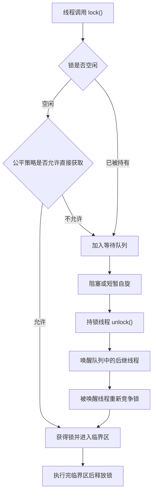

# 3.3.2.3 公平锁和非公平锁

## 定位

公平锁和非公平锁讨论的不是“锁是否安全”，而是多个线程竞争同一把锁时，锁的授予顺序是否尽量尊重等待顺序。它属于线程安全主题中的互斥策略问题：同样都能保护临界区，同样都能建立锁释放与后续获取之间的可见性关系，但它们在竞争路径、唤醒方式、插队机会、吞吐表现和等待时间分布上存在明显差异。

理解这个主题时，首先要把两个概念分开。第一，互斥是指同一时刻只有一个线程能执行受保护的临界区；第二，公平是指多个线程都想进入临界区时，先等待的线程是否更有机会先获得锁。一个锁可以互斥但不公平，也可以在互斥基础上尽量公平。公平性不是线程安全的必要条件，非公平锁并不等于错误锁；它只是选择了更激进的竞争策略，以换取更高的局部效率和更少的调度成本。

Java 标准库中最直接暴露公平参数的是 `ReentrantLock`。`new ReentrantLock(true)` 创建公平锁，`new ReentrantLock(false)` 或无参构造创建非公平锁。`synchronized` 也能表达互斥，但它没有提供公平开关，不能把它当作严格先来先服务的同步机制。理解这些工具时，需要同时看语言语义、类库同步器和运行时调度三层：语言层保证同步关系，类库层决定入队和唤醒策略，操作系统调度器决定被唤醒线程何时真正运行。

本文保持通用 Java 技术视角，围绕公平性的含义、等待队列、插队行为、吞吐和延迟权衡、`ReentrantLock` 的公平参数、`synchronized` 的非严格公平、饥饿风险、调度器影响、适用场景和常见误区展开。

## 公平性的真实含义

公平锁里的“公平”通常指近似的先来先服务：当锁已经被占用，多个线程在同步队列中等待时，锁释放后应优先让等待时间更久的线程获得锁。这个描述听起来简单，但必须注意几个限定。

第一，公平性通常只约束锁内部的竞争策略，不等于业务请求顺序。一个请求先到达业务入口，不代表它一定先执行到加锁语句；一个线程先被唤醒，也不代表它一定立刻获得 CPU；一个线程先获得锁，也不代表它的业务结果一定先对外可见。公平锁只能在“已经进入同一把锁的竞争范围”之后，尽量让等待顺序影响获取顺序。

第二，公平性不等于绝对顺序。Java 线程运行依赖操作系统调度，被唤醒的等待线程可能还没有来得及恢复运行，新到达的线程可能已经在当前 CPU 上继续执行。公平锁的实现会在关键竞争点检查队列中是否已有前驱节点，从而抑制新线程插队，但这个检查发生在锁实现能控制的位置。锁外部的调度、线程优先级、CPU 时间片、垃圾回收暂停和系统负载，都可能改变真实执行时间线。

第三，公平性不等于性能更好。公平锁减少了长期等待和极端插队的概率，使等待时间更容易解释，但它常常降低吞吐。原因在于公平锁更依赖队列头部线程的唤醒和恢复运行；如果锁释放后必须等被唤醒的老线程重新调度，临界区可能短暂空闲。而非公平锁允许正在运行的新线程在锁刚释放时直接抢到锁，避免部分上下文切换和唤醒延迟，因此在短临界区、高竞争场景下经常表现出更高吞吐。

第四，公平性不等于没有饥饿。公平锁显著降低同一批等待线程被不断插队的概率，但它仍然不能保证所有线程在任意现实条件下都能及时运行。例如某个线程长期得不到 CPU、优先级过低、被外部阻塞、频繁中断或执行环境过载，即使锁队列本身是公平的，也可能出现长时间无进展。公平锁解决的是锁内部排队纪律问题，不是整个系统的调度公平问题。

因此，公平锁的准确理解应是：在锁实现可控制的竞争点上，尽量按照等待队列顺序授予锁，以降低插队和饥饿风险；它不是全局时间顺序、业务顺序或调度顺序的承诺。

## 等待队列与竞争路径

锁竞争可以粗略分成三段：尝试获取、失败入队、释放后唤醒。公平锁和非公平锁的差异主要发生在“尝试获取”以及“释放后重新竞争”这两个位置。

当线程第一次进入加锁语句时，如果锁空闲，非公平锁通常会直接尝试用原子操作把锁状态从未持有改成已持有。只要这一步成功，它就获得锁，不关心队列中是否已经有等待者。这个动作通常被称为插队或 barging。插队不一定发生在恶意场景中，它只是利用了“当前线程已经在运行”的机会：既然锁刚好空闲，让当前线程直接进入临界区可能比唤醒一个阻塞线程再等待它运行更便宜。

公平锁在同样位置会更加克制。它不仅要看锁状态是否空闲，还要看等待队列里是否存在排在自己前面的线程。如果已经有线程排队，公平锁通常不会让新来的线程直接获得锁，而是让它加入队列，等待前驱线程先获得机会。这样做能让等待顺序更稳定，但也增加了检查队列和依赖唤醒的成本。

等待队列可以理解为锁竞争者的候车区。线程获取锁失败后，不应一直占用 CPU 反复尝试，否则大量竞争线程会浪费处理器资源。成熟的锁实现会把失败线程组织到队列中，在合适时机阻塞它，等持锁线程释放锁后再唤醒队列中的一个或多个等待者。Java 并发包中的许多同步器基于 `AbstractQueuedSynchronizer` 构建，它维护同步状态和一个先进先出的等待队列，`ReentrantLock` 的公平与非公平策略也建立在这个框架之上。

需要注意，入队不是获得锁，唤醒也不是获得锁。线程入队后只是获得了等待资格；线程被唤醒后还要重新竞争同步状态。这个重新竞争过程非常关键：锁释放的一瞬间，队列头部线程可能刚被唤醒但还没运行，而另一个新到达线程正在 CPU 上执行。非公平锁可能允许新线程抢先完成状态修改；公平锁则会检查是否有排队前驱，尽量把机会留给队列头部附近的线程。

下面的流程图展示了一个简化竞争路径：



这个图省略了重入、取消、中断、超时、条件队列和异常路径，但它足以说明公平锁与非公平锁的本质差异：公平锁更看重队列顺序，非公平锁更看重当前竞争机会。

## 插队的收益与代价

非公平锁最容易被误解的地方是“插队”。插队听起来像破坏秩序，但在并发运行时中，它常常是一种吞吐优化。

假设临界区很短，线程 A 释放锁时线程 B 正在队列中等待。释放动作会唤醒 B，但 B 从阻塞状态恢复到可运行状态，再到真正获得 CPU，需要调度器参与。此时线程 C 正好在某个 CPU 上运行，并且刚执行到同一把锁的加锁语句。如果锁是非公平的，C 可能直接获取刚释放的锁，快速执行一个很短的临界区后释放。等 B 真正恢复运行时，锁可能又空闲了，B 仍然可以继续获取。站在整体吞吐角度看，这避免了锁空闲等待被唤醒线程运行的间隙。

这种策略的收益来自两个方面。第一，减少阻塞线程恢复运行带来的等待空窗，让已经在 CPU 上的线程继续推进。第二，提高缓存局部性。刚运行过的线程，其栈、对象引用和部分共享数据可能仍在缓存中；让它快速完成短临界区，可能比频繁切换到另一个线程更便宜。对于大量短小、独立、竞争频繁的临界区，这种差异会体现在吞吐量上。

代价也很明确。插队会拉大等待时间分布。多数线程可能很快完成，但少数线程可能因为不断被新到达线程抢先而等待很久。系统平均吞吐看起来很好，尾部延迟却可能变差。对于需要控制最长等待时间、需要解释请求先后、或需要避免某些线程长期得不到服务的场景，非公平锁的这种不确定性会成为风险。

因此，公平锁与非公平锁不是“正确与错误”的选择，而是“等待纪律与吞吐机会”的选择。公平锁让队列顺序更可预测，通常牺牲一部分吞吐；非公平锁让运行中的线程更容易抓住锁空闲窗口，通常提升吞吐，但等待顺序更不可预测。

## ReentrantLock 的公平参数

`ReentrantLock` 是学习公平锁和非公平锁最合适的入口，因为它把公平策略显式放在构造参数中：

```java
Lock fairLock = new ReentrantLock(true);
Lock nonfairLock = new ReentrantLock(false);
Lock defaultLock = new ReentrantLock(); // 默认是非公平锁
```

`ReentrantLock` 的公平参数只影响锁的竞争策略，不改变它作为可重入互斥锁的基本语义。无论公平还是非公平，同一个线程已经持有锁时，再次调用 `lock()` 都可以重入；释放时需要调用相同次数的 `unlock()` 才能真正释放。无论公平还是非公平，正确的使用方式都应把解锁放在 `finally` 中：

```java
Lock lock = new ReentrantLock(true);

lock.lock();
try {
    // 访问受 lock 保护的共享状态
} finally {
    lock.unlock();
}
```

公平锁和非公平锁的差异主要体现在锁未被当前线程持有、且存在竞争时。公平模式下，线程在获取锁前会考虑队列中是否已有等待更久的线程；非公平模式下，新线程更可能直接尝试抢占同步状态。

还要注意 `tryLock()` 的特殊性。无参 `tryLock()` 表示“如果此刻能立即获得锁就获得，否则立刻返回失败”。在 `ReentrantLock` 中，即使锁是公平锁，无参 `tryLock()` 也可能在锁空闲时直接成功，而不严格遵守公平排队。原因在于这个方法表达的是一次立即尝试，不表达愿意排队等待的意图。如果希望在公平锁上保留等待语义，应使用 `lock()` 或带超时的 `tryLock(long, TimeUnit)`，并认真处理中断和超时。

```java
ReentrantLock lock = new ReentrantLock(true);

if (lock.tryLock()) {
    try {
        // 立即尝试成功，不代表它遵循了严格排队等待
    } finally {
        lock.unlock();
    }
}
```

`ReentrantLock` 还提供 `lockInterruptibly()`、`newCondition()`、`getQueueLength()`、`hasQueuedThreads()` 等能力。公平参数不会让这些能力自动变成业务层面的顺序保证。比如 `getQueueLength()` 只能作为估计值，不应作为正确性判断；`Condition` 有自己的条件等待队列，线程从条件队列转回同步队列后，仍要重新竞争锁；中断和超时可能让等待线程提前离开队列，队列顺序也会随之变化。

选择 `ReentrantLock(true)` 时，真正购买的是“在普通锁竞争中尽量尊重同步队列顺序”。它不保证线程调度公平，不保证业务任务按提交顺序完成，也不保证所有 API 都严格排队。

## synchronized 的非严格公平

`synchronized` 是 Java 语言内建的互斥机制。进入同步代码块或同步方法时，线程需要获取对应对象监视器；退出同步块时释放监视器，并与后续获取同一监视器的线程建立可见性关系。它的优势是语法简洁、异常安全释放由语言保证、与对象监视器和 `wait/notify` 协作自然。

但 `synchronized` 没有公平性参数。开发者不能要求某个 `synchronized` 块严格按照等待先后授予监视器。多个线程阻塞在同一个监视器入口时，哪个线程在释放后先进入，受 JVM 实现、锁状态、竞争时机和操作系统调度共同影响。它可能在某些运行中表现得相对有序，也可能在竞争激烈时表现出明显的不确定性。不能把观察到的某次进入顺序当成规范承诺。

`wait/notify` 也不能提供严格公平。调用 `wait()` 的线程会释放监视器并进入等待集合；调用 `notify()` 时，只会从等待集合中选择一个线程唤醒，但规范不承诺选择等待最久的线程。被唤醒线程也不是立刻继续执行，它必须重新竞争同一监视器。`notifyAll()` 会唤醒所有等待线程，但它们仍然要竞争监视器，最终顺序依旧不等于等待顺序。

```java
synchronized (monitor) {
    while (!condition) {
        monitor.wait();
    }
    // 条件满足后执行
}
```

这段代码中 `while` 循环用于防止虚假唤醒和条件被其他线程先消费。它能保证条件检查正确，却不保证哪个等待线程先执行。若程序需要更明确的排队策略，通常应考虑 `ReentrantLock(true)`、`Condition`、`Semaphore` 的公平模式，或更高层的队列和任务调度结构，而不是依赖 `synchronized` 的偶然唤醒顺序。

这并不是说 `synchronized` 不适合并发程序。它在大量普通互斥场景中仍然直接可靠，尤其适合临界区短、竞争不复杂、不需要可中断获取、超时获取、公平开关和多个条件队列的场景。只是它不应该被描述为公平锁。

## 吞吐、平均延迟和尾部延迟

评价公平锁和非公平锁时，不能只看一个指标。吞吐、平均延迟、尾部延迟和等待可解释性经常互相拉扯。

吞吐关注单位时间内完成多少次临界区操作。非公平锁通常更有优势，因为它允许当前运行线程在锁空闲时直接进入，减少调度交接成本。临界区越短、竞争越频繁、线程切换成本越明显，非公平策略越可能胜出。

平均延迟关注单次操作从请求锁到释放锁的平均耗时。在很多基准测试中，非公平锁也可能让平均延迟更低，因为大量操作快速完成，拉低了平均值。但平均值会掩盖分布问题：如果一部分线程等待非常久，平均值仍然可能看起来不错。

尾部延迟关注最慢的一小部分请求，例如 95 分位、99 分位或更高分位。公平锁的价值常体现在这里。它让等待队列中的老线程更难被新线程持续插队，从而降低极端等待的概率。对于交互式服务、资源租约、限流器、连接分配或其他需要控制等待上界的结构，尾部延迟往往比平均吞吐更重要。

等待可解释性关注问题发生后是否能说清楚。当用户、调用方或上层模块关心“为什么我比后来的请求等得久”时，公平锁更容易解释：锁内部尽力按照排队顺序处理。非公平锁虽然可能总体更快，但等待顺序更难从日志和时间线中推断。

下面的对比表可以作为选择时的第一层判断：

| 维度 | 公平锁 | 非公平锁 |
| --- | --- | --- |
| 锁授予倾向 | 倾向等待队列中等待更久的线程 | 允许新到达或刚运行的线程抢占机会 |
| 吞吐 | 通常较低，尤其在短临界区高竞争下 | 通常较高，能减少部分调度交接成本 |
| 平均等待 | 更稳定，但不一定更低 | 可能更低，也可能随竞争波动 |
| 尾部等待 | 更容易控制极端等待 | 更容易出现少数线程等待很久 |
| 饥饿风险 | 较低，但不为零 | 较高，尤其竞争持续不断时 |
| 适用倾向 | 等待顺序、等待上界、资源分配纪律重要 | 临界区短、竞争高、吞吐优先 |

真正的工程判断不能只看表格。锁保护的数据结构、临界区耗时、线程数、任务来源、调用方超时、错误恢复方式和运行环境都会影响结果。公平锁不是性能开关，非公平锁也不是低质量实现。

## 饥饿问题

饥饿是指某个线程长期无法获得继续执行所需的资源，即使系统整体仍在运行。锁竞争中的饥饿通常表现为：线程已经多次尝试获取某把锁，但总有其他线程先获得锁，导致它长时间无法进入临界区。

非公平锁更容易产生饥饿风险。假设系统持续有新线程到达，且锁释放后新线程总能在队列头部线程恢复运行前抢到锁，那么队列中的某些老线程可能等待很久。实际运行中不一定会无限饥饿，因为调度、时间片和竞争间隙会不断变化，但风险确实存在。

公平锁通过排队纪律降低这种风险。新线程看到队列中已有等待者时，会加入队列而不是直接获取锁。这样，等待足够久的线程会逐步移动到队列头部，获得锁的机会更稳定。对于长期运行的服务，这种稳定性比单次压测中的峰值吞吐更有价值。

不过，饥饿不只来自锁。线程优先级设置不当、固定大小线程池被长任务占满、任务之间相互等待、资源池容量过小、外部 I/O 长时间阻塞、条件通知遗漏、过度重试导致队列被淹没，都可能造成某些任务长期无进展。公平锁只能解决“同一把锁内部的持续插队”这一类问题，不能替代容量设计、超时控制和任务隔离。

排查饥饿时，应先定位线程到底卡在哪里。它是阻塞在锁入口，等待条件，等待 I/O，等待线程池任务，还是处于可运行但长期得不到 CPU？只有确认等待点，才能判断公平锁是否相关。如果线程 dump 显示大量线程卡在同一把 `ReentrantLock` 或同一个监视器上，再结合日志看到少数线程频繁进入临界区，才有理由重点分析锁公平性。

## 调度器对公平性的影响

公平锁容易让人误以为“先排队就一定先执行”。这个误解忽略了调度器。Java 线程最终映射到操作系统线程或由运行时调度到可执行实体上，能否立刻运行取决于 CPU 核数、线程优先级、时间片、系统负载、阻塞恢复、抢占时机等因素。

锁实现能控制的是同步状态和等待队列。它可以决定新线程是否允许绕过队列，可以决定释放时唤醒哪个节点，可以决定被取消节点如何清理。但它不能强迫操作系统马上运行某个刚被唤醒的线程。被唤醒线程从阻塞状态变成可运行状态后，仍然要等待调度。此时其他正在运行的线程可能继续执行一段时间。

这也是公平锁性能下降的重要原因之一。为了尊重队列顺序，公平锁倾向于等待队列头部线程恢复运行；如果这个线程恢复慢，锁交接就慢。非公平锁则可能让已经在运行的线程直接占用短暂空闲的锁，减少交接等待。

线程优先级也不能被当作公平锁的补充保证。Java 暴露了线程优先级 API，但不同平台对优先级的解释和执行效果并不一致。用优先级推导锁获取顺序是不可靠的。公平锁和调度优先级属于不同层次：前者是同步器内部队列策略，后者是运行环境对线程运行机会的安排。

因此，设计中若需要“请求按严格业务顺序处理”，不要试图只靠公平锁和线程优先级实现。更可靠的方式是把顺序显式建模，例如使用单线程执行器、按序队列、序号校验、日志追加器或状态机。锁公平性只能让竞争同一临界区的线程更有排队纪律，不能替代业务层顺序协议。

## 条件队列与公平锁的关系

`ReentrantLock` 可以创建 `Condition`。条件队列用于表达“线程已经持有锁，但发现业务条件不满足，于是释放锁并等待某个条件变化”。这和普通锁入口处的同步队列不是同一件事。

调用 `await()` 时，线程会释放当前锁，进入条件队列等待信号。其他线程在持有同一把锁时改变条件，并调用 `signal()` 或 `signalAll()`。被 signal 的线程会从条件队列转移到同步队列，之后还要重新竞争锁。也就是说，条件等待有两个阶段：先等条件信号，再等重新获得锁。

公平锁影响的是重新竞争锁时的同步队列策略，而不是把条件队列变成严格业务队列。`signal()` 唤醒哪个等待者、等待者被转移后何时获得锁、条件是否仍然成立，都需要按条件变量的规则处理。因此，使用 `Condition` 时仍然必须用循环检查条件：

```java
Lock lock = new ReentrantLock(true);
Condition notEmpty = lock.newCondition();
Queue<String> queue = new ArrayDeque<>();

String take() throws InterruptedException {
    lock.lockInterruptibly();
    try {
        while (queue.isEmpty()) {
            notEmpty.await();
        }
        return queue.remove();
    } finally {
        lock.unlock();
    }
}
```

这里的公平锁可以降低重新竞争锁时的插队风险，但不能让 `queue` 中元素处理自动符合某种外部请求顺序。队列元素的顺序由 `Queue` 数据结构和生产逻辑决定；线程被唤醒的顺序由条件队列和同步队列共同影响；业务完成顺序还会受线程执行时间影响。把这些顺序混成一个“公平保证”，会导致错误设计。

## 适用场景

公平锁适合等待顺序本身有价值的场景。比如一组线程竞争有限资源，资源分配希望更接近先来先服务；某些后台任务不能因为高频短任务持续到来而长期无法推进；系统更关注尾部等待和可解释性，而不是单纯追求最高吞吐。这些场景下，公平锁能减少“新来的总是抢到，老的总是在等”的现象。

公平锁也适合诊断和验证阶段。如果一个并发结构在非公平策略下偶发长等待，切换到公平锁有时能帮助判断问题是否与插队有关。注意这只是分析手段，不应把“换成公平锁后现象消失”直接当成根因已解决。真正根因可能是临界区太长、线程数过多、锁粒度过粗或任务来源没有限流。

非公平锁适合短临界区、高频访问、吞吐优先的通用互斥场景。许多共享计数、缓存元数据更新、短小状态变更，只需要保护数据一致性，不需要调用方按等待顺序进入。此时非公平锁的插队能力能降低调度成本，整体表现通常更好。`ReentrantLock` 默认使用非公平策略，正是因为它在多数普通竞争场景中是更务实的默认值。

如果需求是严格顺序处理，公平锁往往还不够。比如必须按提交顺序修改状态，必须按序写出事件，必须保持协议帧顺序，或必须让同一键的任务串行执行。此时应使用队列、单线程执行器、分片串行执行器、状态机或其他显式顺序结构。锁只能保护临界区，不是任务调度器。

如果临界区很长，公平锁也不一定是正确解法。长临界区会让所有等待者都被拖慢，公平只是在慢速通道里排队。更好的方向通常是缩小锁范围、拆分锁、使用不可变快照、读写锁、无锁算法、消息传递或把慢 I/O 移出临界区。公平性不能弥补锁粒度设计不当。

## 与其他同步工具的关系

公平锁只是同步工具谱系中的一个选择。它和信号量、读写锁、阻塞队列、线程池队列、原子变量解决的问题相邻但不相同。把这些工具的边界区分清楚，能避免把“公平参数”用到并不适合的位置。

`Semaphore` 也可以选择公平或非公平模式，但它控制的是许可数量，不一定是互斥。一个许可的信号量可以近似互斥锁，但语义上仍然不同：信号量没有所有权概念，一个线程获取许可后可以由另一个线程释放许可；锁则强调持有者释放。需要表达资源配额时，信号量比锁自然；需要保护对象内部不变式时，锁更直接。公平信号量能让许可分配更接近等待顺序，但同样不保证业务完成顺序。

`ReentrantReadWriteLock` 关注读写访问模式。读多写少时，它允许多个读线程并发进入，写线程独占进入。它也提供公平参数，但公平读写锁的权衡比普通互斥锁更复杂：如果过分偏向读，写线程可能长期等待；如果严格照顾写，读吞吐可能明显下降。这里的公平性不只是线程排队，还涉及读批量放行、写者等待和读写转换边界。不能因为读写锁有公平模式，就默认它比普通锁更适合所有共享状态。

阻塞队列的公平性又是另一层含义。队列本身保存数据元素，生产者和消费者围绕“队列非满”“队列非空”等条件等待。某些阻塞队列内部可能使用锁和条件队列，但使用者真正关心的往往是元素顺序、容量边界和生产消费速率，而不是某个内部锁是否公平。如果需求是按任务提交顺序消费，优先应检查队列类型和消费者数量，而不是先调整锁公平性。多个消费者并发处理时，即使队列按 FIFO 取出元素，任务完成顺序也可能不同。

原子变量则通常不讨论公平。CAS 循环通过乐观方式尝试更新单个位置，失败后重试。它可能在低冲突下非常高效，也可能在高冲突下让部分线程多次失败。原子变量适合简单状态更新，不适合表达复杂等待纪律。如果需求已经涉及等待队列、饥饿风险和尾部延迟，单纯把锁替换成原子变量往往只是把阻塞等待变成忙碌重试，未必改善系统行为。

线程池队列也不等于公平锁。线程池可以按队列顺序分发任务，但工作线程执行任务的耗时不同，最终完成顺序仍然可能变化。线程池中的任务如果再竞争同一把锁，还会叠加任务队列顺序和锁队列顺序两套机制。排查这类问题时，应分清任务是否已经开始执行、是否在工作线程中等待锁、是否因为线程池容量不足而尚未被调度。把所有等待都归因于锁公平性，会漏掉更上游的容量问题。

## 边界与误区

第一个误区是“公平锁一定更安全”。锁的安全性来自互斥和内存可见性，不来自公平性。公平锁和非公平锁都能保护同一把锁下的共享状态；只要所有读写都遵守同一锁协议，二者都能建立正确的线程安全边界。公平锁只是改变竞争顺序，不会自动修复遗漏加锁、锁对象不一致、发布不安全、复合操作不原子等问题。

第二个误区是“非公平锁一定会饥饿”。非公平锁提高了饥饿风险，但不代表每个非公平锁都会产生饥饿。很多应用中竞争并不持续，临界区很短，调度间隙足够，线程最终都能获得锁。把所有非公平锁都视为危险，会导致不必要的性能损失和复杂化。

第三个误区是“公平锁保证业务请求顺序”。公平锁只看到线程竞争锁的顺序，看不到业务请求进入系统的顺序。请求 A 先到达，不代表处理 A 的线程先调用 `lock()`；请求 B 后到达，但它可能更早执行到加锁点。即使 A 先排队，锁释放后 A 的线程也可能因为调度原因晚运行。需要业务顺序时，应显式记录序号并按序处理。

第四个误区是“公平锁能替代超时”。公平锁降低极端等待概率，但等待仍可能因为持锁线程阻塞、死锁、外部资源卡住、线程池耗尽或系统过载而无限延长。凡是跨线程等待或请求外部资源，都应考虑超时、取消和诊断，而不是依赖公平策略保证最终及时返回。

第五个误区是“看到日志顺序就等于锁获取顺序”。日志写入本身可能有缓冲、异步追加和不同线程时钟差异。加锁前打印、加锁后打印、释放后打印代表的阶段也不同。分析公平性时，应明确日志点位，必要时记录线程名、尝试获取时间、实际获取时间、释放时间和等待时长，而不是只看几行输出先后。

第六个误区是“把锁公平性当作容量控制”。锁只能让同一时刻进入临界区的线程数量受限，不能控制系统总流量。大量线程堆在公平锁前排队，仍然会占用内存、线程栈和调度资源。需要容量控制时，应使用有界队列、信号量、限流器、线程池拒绝策略或背压机制。

## 实践建议

选择锁策略前，先回答三个问题：临界区是否短小，等待顺序是否有业务价值，尾部延迟是否比吞吐更重要。如果临界区短、状态更新简单、调用方不关心先后，默认非公平锁通常更合适。如果等待顺序可解释性很重要，或者历史上已经观察到少数线程长期等待，再考虑公平锁。

使用 `ReentrantLock` 时，锁对象应作为受保护状态的组成部分，避免随意暴露。不要让外部代码在未知上下文中持有你的内部锁；不要在持锁时调用不可控回调；不要把锁保护范围写得过大；不要在持锁时执行慢 I/O、长时间计算或可能反向调用当前对象的方法。公平锁会让等待更有秩序，但不会消除长临界区的伤害。

所有显式锁都必须成对释放。最常见模式仍然是 `lock()` 后立即进入 `try/finally`。如果使用 `lockInterruptibly()` 或带超时的 `tryLock()`，应明确当前方法如何处理中断和失败。吞掉中断会让上层取消协议失效；忽略超时会让调用方误以为操作成功；忘记释放锁会让所有后续线程阻塞。

不要只凭直觉决定公平策略。若这个锁位于高频路径，应在接近真实负载的条件下测量吞吐、平均等待、分位等待、CPU 使用率和上下文切换。微基准可以帮助理解机制，但不能替代业务压力测试。尤其要避免只看总吞吐而忽略最慢请求，也要避免只看最慢请求而忽略整体资源成本。

当发现锁竞争严重时，优先审视锁设计，而不是先切公平参数。可以检查是否存在以下问题：锁保护了过多字段，读操作和写操作都串在同一把锁上，临界区内调用外部服务，持锁期间执行日志或回调，多个无关资源共用一把锁，线程数远大于可并行资源，任务提交速度没有上限。公平参数只能改变排队纪律，不能让过粗的锁变细。

如果使用 `synchronized` 已经满足需求，就不必为了“看起来更高级”换成 `ReentrantLock`。只有需要可中断获取、超时获取、公平参数、多个条件队列、非块结构释放或更丰富的诊断方法时，显式锁才体现优势。工具选择越复杂，越需要清晰的释放路径和异常路径。

## 排查思路

排查公平锁和非公平锁相关问题时，可以按时间线重建一次竞争过程。记录线程何时尝试获取锁、何时真正获得锁、持锁多久、释放后谁获得锁、等待期间是否被中断或超时。只记录“进入方法”和“退出方法”通常不够，因为方法内部可能在加锁前排队，也可能在持锁后又等待其他资源。

线程 dump 是重要证据。对于 `synchronized`，阻塞线程通常表现为等待进入某个监视器；对于 `ReentrantLock`，线程可能停在 AQS 的 park 相关栈帧中。通过栈帧可以判断线程是在等待锁、等待条件、等待队列元素，还是等待外部 I/O。不要看到 WAITING 就立即归因于公平性，条件等待、线程池等待和锁等待在语义上完全不同。

如果怀疑非公平锁导致尾部等待，可以收集等待时长分布，而不是只看平均值。一个线程等待 10 秒、其他一千个线程等待 1 毫秒，平均值可能仍然不明显。分位数、最大等待、连续失败次数、队列长度估计和持锁时间分布更能说明问题。

如果切换到公平锁后吞吐明显下降，应检查临界区是否过短且竞争过高。公平锁在这种场景下会频繁进行队列交接，调度成本占比上升。此时可以考虑减少竞争源、分段锁、使用并发容器、把共享状态拆分到多个独立对象，或改成批量处理。直接在公平和非公平之间反复切换，往往只是移动问题。

如果公平锁仍然出现长等待，应检查锁外因素。持锁线程是否被外部调用卡住，是否在临界区内等待另一个锁，是否有死锁风险，是否线程池已耗尽，是否系统 CPU 饱和，是否发生频繁长时间暂停，是否有高优先级线程持续抢占 CPU。公平锁不是全局调度器，不能解释所有等待。

## 小结

公平锁和非公平锁的核心差异是竞争策略：公平锁尽量尊重等待队列，降低插队和饥饿风险；非公平锁允许线程抓住锁空闲窗口，通常提升吞吐但扩大等待不确定性。

`ReentrantLock` 通过构造参数提供公平选择，默认是非公平；公平参数影响普通竞争路径，但不等于严格业务顺序，也不覆盖所有方法语义。`synchronized` 提供简洁可靠的互斥和可见性，但没有严格公平保证，`wait/notify` 的唤醒顺序也不能当作先来先服务。

选择时应把指标说清楚：如果更关心吞吐、临界区短、顺序无业务意义，非公平锁通常更合适；如果更关心等待上界、饥饿风险和可解释性，公平锁更有价值。无论选择哪一种，都不能忽略锁粒度、异常释放、中断超时、条件检查、容量控制和调度器影响。公平性是一种排队纪律，不是线程安全、性能优化和业务顺序的万能替代品。
