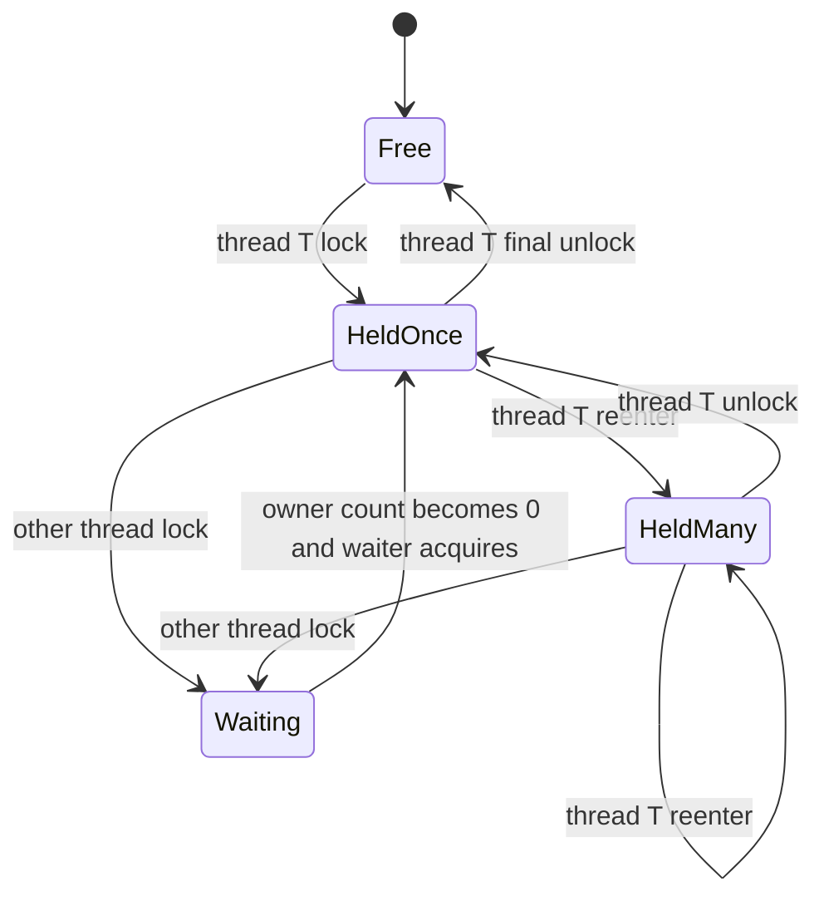

# 3.3.2.4 可重入锁

## 定位

可重入锁是 Java 线程安全体系中的一个基础概念。它讨论的不是“怎样创建线程”，也不是“怎样让任务并行执行”，而是当多个线程围绕同一份共享状态竞争时，锁是否允许已经持有它的线程再次进入受保护代码。更直接地说：如果线程 A 已经获得了某把锁，线程 A 在没有释放这把锁之前又执行到另一个需要同一把锁的代码位置，程序应该允许它继续进入，还是把它阻塞在自己已经持有的锁上？允许继续进入，就是可重入；不允许继续进入，就会在很多正常的封装和调用场景中制造自我死锁。

理解可重入锁，不能只停在“同一个线程可以重复加锁”这一句话上。真正需要掌握的是它背后的三个要素：锁的持有者是谁，当前持有者重复进入了多少次，以及什么时候才算真正释放。持有者用来区分“同一个线程”和“其他线程”；持有计数用来记录同一个线程重复进入的层数；释放规则要求每一次成功获取都必须有一次匹配释放，只有计数归零后，锁才会从已占有状态变为未占有状态，其他线程才有机会获得它。

在 Java 中，最常见的可重入锁有两类。第一类是语言层面的 `synchronized`，它既可以修饰实例方法、静态方法，也可以保护一段同步代码块。第二类是类库层面的 `java.util.concurrent.locks.ReentrantLock`，它提供显式的 `lock()`、`unlock()`、`tryLock()`、`lockInterruptibly()`、`newCondition()` 等能力。两者都具备可重入特性，都能提供互斥和内存可见性保证，但表达方式、可中断能力、超时尝试、公平性配置、条件队列数量和诊断方式存在明显差异。

本文保持通用 Java 技术视角，只围绕 Java 语言和标准库中的锁语义展开。可重入锁并不是一个孤立 API，而是封装、递归、嵌套调用、条件等待、异常释放和并发不变式共同作用的结果。学习它的目标不是把所有共享变量都包上一层锁，而是能够判断：什么时候可重入是必要的，什么时候重入会掩盖设计问题，什么时候应使用内置锁，什么时候应使用 `ReentrantLock`，以及怎样证明锁保护的状态真的满足线程安全要求。

## 可重入的含义

“可重入”这个词在锁语境下有一个精确含义：如果某个线程已经成功获得一把锁，那么这个线程在持有期间再次请求同一把锁时，请求可以立即成功，不会因为锁已经被占用而阻塞自己。这里的关键是“同一线程”和“同一把锁”。如果是另一个线程请求这把锁，它仍然要等待；如果同一线程请求的是另一把锁，能否进入取决于另一把锁的状态；如果代码表面看起来相似但锁对象不同，也不能把它理解成重入。

一个简单例子是实例同步方法之间的调用。实例同步方法使用当前实例对象作为锁。如果线程调用 `outer()` 后已经获得当前对象的监视器，`outer()` 内部再调用同一个对象上的 `inner()`，而 `inner()` 也是同步方法，那么线程再次请求的是同一个对象监视器。由于 Java 的内置锁是可重入的，`inner()` 可以直接执行。如果内置锁不可重入，这段很普通的封装就会卡住：线程在 `outer()` 中持有锁，却在进入 `inner()` 时等待自己释放锁，而释放动作又必须等 `inner()` 返回之后才可能发生。

```java
class Counter {
    private int value;

    public synchronized void outer() {
        inner();
    }

    public synchronized void inner() {
        value++;
    }
}
```

可重入解决的是“同一线程沿调用栈重复进入同一把锁”的问题。它允许程序把共享状态的校验、修改、查询、复用逻辑拆成多个受保护方法，而不必要求调用者精确避开所有已加锁方法。没有可重入语义时，类的内部封装会变得很脆弱：外层方法已经持锁，内层方法为了保护同一份状态也要持锁，二者天然冲突。可重入让每个方法都能声明自己的同步边界，同时允许这些方法在同一线程内组合。

不过，可重入并不意味着锁可以随意进入，也不意味着锁的安全边界会自动扩大。它只是对当前持有线程开了一个“重复进入”的例外。其他线程仍然不能进入临界区，临界区内的共享状态仍然需要遵守同一把锁保护，锁的释放仍然必须严格配对。很多误解来自把“可重入”理解成“不会死锁”或“使用起来更宽松”。实际上，可重入只能避免一种特殊的自我阻塞，不能避免多把锁顺序相反造成的死锁，也不能避免持锁调用外部代码造成的长期等待。

## 持有者与持有计数

可重入锁内部必须记录两个核心状态：当前持有者和持有计数。当前持有者通常可以理解为拥有这把锁的线程引用；持有计数是该线程成功获取这把锁的次数。未被任何线程持有时，持有者为空，计数为零。某线程第一次获取成功后，持有者变为该线程，计数从零变为一。同一线程再次获取时，不需要进入竞争队列，计数递增。每次释放时，计数递减。只有递减到零，持有者才被清空，锁才真正对其他线程开放。

这个计数不是一个可有可无的实现细节，而是可重入语义成立的基础。如果只记录“锁是否被占用”，那么同一线程第二次进入时系统无法区分“自己已经持有”和“别人正在持有”，只能阻塞或错误放行。如果只记录持有者而不记录次数，释放时又无法知道内层调用退出后外层调用是否仍然处于临界区。持有计数把调用栈层次映射成锁状态，确保内层释放不会提前暴露外层还在维护的不变式。

可以把状态变化抽象成下面的流程：



这张图强调了两个事实。第一，其他线程看到的是“锁仍被占有”，它们并不因为持有者重入而获得额外机会。第二，最后一次释放才是对外部可见的真正释放，内层释放只是在减少当前线程的持有层数。只要外层代码还没有退出，其他线程就不能看到中间状态。这个规则让临界区能够跨多个内部方法保持一致，也让异常路径中的释放变得格外重要。

`ReentrantLock` 把持有计数暴露为可观察能力，例如 `getHoldCount()` 可以返回当前线程持有这把锁的次数，`isHeldByCurrentThread()` 可以判断当前线程是否是持有者。日常业务代码通常不应该依赖这些方法做核心控制，因为它们容易把锁状态和业务逻辑耦合得过紧；但在断言、调试、框架代码或复杂同步器封装中，它们可以帮助确认调用边界是否符合预期。相比之下，`synchronized` 的监视器计数由虚拟机维护，普通代码不能直接读取持有计数，只能通过结构化进入和退出保证配对。

## `synchronized` 的可重入性

`synchronized` 是 Java 内置的互斥机制。它的可重入性体现在三种常见写法中：实例同步方法使用当前实例作为锁，静态同步方法使用对应的 `Class` 对象作为锁，同步代码块使用括号中的对象作为锁。只要同一线程重复进入的是同一个监视器，就属于重入。实例方法之间可以重入，同一个同步代码块嵌套同一个锁对象可以重入，实例同步方法调用 `synchronized (this)` 保护的代码也可以重入，因为它们使用的是同一个锁对象。

```java
class Registry {
    private final Object monitor = new Object();
    private int version;

    public synchronized void updateByInstanceLock() {
        readByInstanceLock();
    }

    public synchronized int readByInstanceLock() {
        return version;
    }

    public void updateByBlockLock() {
        synchronized (monitor) {
            readByBlockLock();
            version++;
        }
    }

    public int readByBlockLock() {
        synchronized (monitor) {
            return version;
        }
    }
}
```

这段代码中，`updateByInstanceLock()` 和 `readByInstanceLock()` 使用的是 `this` 监视器；`updateByBlockLock()` 和 `readByBlockLock()` 使用的是 `monitor` 监视器。两组内部都可以重入，但两组之间不是同一把锁。如果某个共享字段有时由 `this` 保护，有时由 `monitor` 保护，那么线程安全边界就会变得混乱。可重入依赖“同一把锁”，而不是依赖“同一个类”或“同一个字段”。

内置锁的一个重要优点是结构化。进入同步块时自动获取，离开同步块时自动释放；无论正常返回还是抛出异常，只要控制流离开同步区域，监视器都会释放。这降低了释放遗漏的风险。对于简单临界区、状态封装明确且不需要超时获取或可中断获取的场景，`synchronized` 往往足够清晰。它的语法也把锁范围直接体现在代码结构中，读者很容易看到临界区从哪里开始、到哪里结束。

内置锁的限制也来自这种结构化。线程等待进入 `synchronized` 时，不能像 `lockInterruptibly()` 那样响应中断退出竞争，也不能像 `tryLock(timeout, unit)` 那样在等待一段时间后放弃。一个内置监视器只有一个与 `wait()`/`notify()`/`notifyAll()` 配套的等待集合，无法像 `ReentrantLock` 那样为不同条件创建多个 `Condition` 队列。内置锁也不能在构造时配置公平策略。是否选择它，应看需求是否需要这些额外能力，而不是把显式锁天然视为更高级。

## `ReentrantLock` 的基本语义

`ReentrantLock` 是标准并发库提供的显式可重入互斥锁。它与 `synchronized` 一样，允许同一线程重复获得同一把锁，也在解锁和后续加锁之间建立内存可见性关系。不同之处在于，`ReentrantLock` 的获取和释放由普通方法表达：调用 `lock()` 或相关方法获取，调用 `unlock()` 释放。正因为释放不是语言结构自动完成，使用它时必须把 `unlock()` 放进 `finally`，并确保只有成功获得锁的线程才释放锁。

```java
class AccountBook {
    private final ReentrantLock lock = new ReentrantLock();
    private long balance;

    public void deposit(long amount) {
        lock.lock();
        try {
            add(amount);
        } finally {
            lock.unlock();
        }
    }

    private void add(long amount) {
        lock.lock();
        try {
            balance += amount;
        } finally {
            lock.unlock();
        }
    }
}
```

在这段代码中，`deposit()` 获取锁后调用 `add()`，`add()` 再次获取同一把锁。由于锁可重入，调用可以继续执行。执行过程中的持有计数是：`deposit()` 获取后为一，`add()` 获取后为二，`add()` 的 `finally` 执行后降为一，`deposit()` 的 `finally` 执行后降为零。只有最后一步完成，其他线程才可能进入这把锁保护的临界区。

`ReentrantLock` 的常用获取方式有几种。`lock()` 会一直等待直到获取成功，等待期间不能通过中断取消获取动作；如果线程在等待时被中断，中断标志会被记录，但获取动作仍会继续。`lockInterruptibly()` 在等待锁时可以响应中断，适合需要取消协议的场景。`tryLock()` 会立即尝试，成功返回 `true`，失败返回 `false`，不会阻塞。`tryLock(long, TimeUnit)` 则允许等待一段时间，期间可响应中断，超时后返回失败。这些能力是 `ReentrantLock` 相比内置锁的重要价值。

需要注意的是，显式锁把责任交给了调用者。只要有一条路径成功 `lock()` 后没有执行 `unlock()`，这把锁就可能永久被当前线程持有，其他线程随之阻塞。如果一个线程没有持有锁却调用 `unlock()`，`ReentrantLock` 会抛出 `IllegalMonitorStateException`。因此，获取成功和释放动作必须在代码结构上紧密绑定。能不用成员变量记录“我是不是锁住了”，就不要用；对于 `tryLock()` 这类可能失败的调用，要用布尔值只在成功时释放。

```java
boolean locked = lock.tryLock();
if (!locked) {
    return;
}
try {
    updateState();
} finally {
    lock.unlock();
}
```

这类写法看似啰嗦，却是显式锁的基本卫生要求。可重入并不会替你修复释放遗漏，也不会替你判断释放次数是否多了一次。可重入只说明同一线程重复获取可以成功；至于成功之后怎样配对释放，完全取决于代码结构。

## 递归与嵌套调用

递归是最容易展示可重入价值的场景之一。递归方法每深入一层，都会重新进入同一个方法。如果这个方法需要保护共享状态，并且使用的是同一把锁，那么每一层递归都会形成一次重入。只要递归深度有限，获取和释放配对，锁语义就是正确的。没有可重入能力时，递归方法第一次进入后就会持有锁，第二层递归再次获取同一把锁时会阻塞自己。

```java
class TreeIndex {
    private final ReentrantLock lock = new ReentrantLock();
    private int nodes;

    public void visit(Node node) {
        lock.lock();
        try {
            if (node == null) {
                return;
            }
            nodes++;
            visit(node.left());
            visit(node.right());
        } finally {
            lock.unlock();
        }
    }
}
```

这段代码只是说明重入行为，并不代表递归遍历一定应该在整个过程中持锁。真实设计要进一步判断临界区是否过大、遍历期间树结构是否允许变化、是否可以先复制快照再无锁遍历、是否会因为递归过深造成栈溢出。可重入让递归加锁成为可能，但不自动证明这种设计是最好的。并发设计始终要同时考虑正确性、锁粒度和等待成本。

嵌套调用比递归更常见。一个公开方法为了维护不变式需要加锁，内部又调用另一个同样需要保护共享状态的辅助方法。如果辅助方法也可能被其他公开方法复用，它往往也需要声明自己的锁边界。可重入允许这种“每个方法都自洽”的写法存在，但也带来一个设计选择：内部辅助方法究竟应该自己加锁，还是假设调用方已经持锁？

两种方式都可以成立，但边界必须清楚。自加锁方法更容易独立复用，调用者不必记住前置条件；缺点是重入层次可能变深，代码中获取释放动作更多。要求调用者已持锁的方法通常命名或注释会体现这一点，例如 `doUpdateLocked()`、`checkStateUnderLock()`，它们减少重复获取，但不能被任意路径直接调用。如果一个方法既有时要求外部持锁，有时又自己加锁，读者就很难判断线程安全边界。

```java
class Inventory {
    private final ReentrantLock lock = new ReentrantLock();
    private int available;

    public void increase(int delta) {
        lock.lock();
        try {
            changeLocked(delta);
        } finally {
            lock.unlock();
        }
    }

    public boolean decreaseIfEnough(int delta) {
        lock.lock();
        try {
            if (available < delta) {
                return false;
            }
            changeLocked(-delta);
            return true;
        } finally {
            lock.unlock();
        }
    }

    private void changeLocked(int delta) {
        available += delta;
    }
}
```

这里的 `changeLocked()` 没有自己加锁，而是通过命名表达“调用者必须已经持锁”。这种方式避免了无意义的重入计数变化，也让真正的临界区集中在公开方法。相反，如果 `changeLocked()` 需要作为独立线程安全方法暴露，那它就应该自己加锁。可重入锁给了两种设计都能运行的基础，但不会替设计者决定封装边界。

## 释放对称性

可重入锁最容易出错的地方不是获取，而是释放。每一次成功获取都必须有一次释放，而且释放必须由持有该锁的线程执行。持有计数使同一线程可以多次进入，但也要求它按次数退出。少释放一次，锁仍然被当前线程持有，其他线程可能永久等待；多释放一次，显式锁会抛出异常，内置锁则由语言结构阻止这种情况；释放位置不在 `finally` 中，异常路径就可能跳过释放。

下面的写法是错误的，因为 `step()` 抛出异常时 `unlock()` 不会执行：

```java
lock.lock();
step();
lock.unlock();
```

正确写法是把受保护代码放在 `try` 中，把释放放在 `finally` 中：

```java
lock.lock();
try {
    step();
} finally {
    lock.unlock();
}
```

如果使用 `tryLock()`，还要注意只有获取成功才释放：

```java
if (lock.tryLock()) {
    try {
        step();
    } finally {
        lock.unlock();
    }
}
```

释放对称性不仅是语法习惯，更是并发不变式的一部分。假设外层方法持锁后把对象状态从“稳定状态”切换到“更新中”，内层方法又进入同一把锁做若干修改。内层方法退出时如果把锁真正释放给其他线程，其他线程就可能看到“更新中”的中间状态。持有计数避免了这种提前释放：内层释放只是把计数从二降到一，外层仍然持有锁，直到它恢复对象不变式并释放最后一层。

对 `synchronized` 来说，结构化语法天然保证进入和退出对称。只要代码离开同步块，监视器释放动作就会发生。因此，内置锁很适合临界区简单、生命周期清晰的场景。对 `ReentrantLock` 来说，释放对称性需要开发者自己维护，这也是它功能更强但更容易误用的原因。显式锁的强大能力应该和严格的代码模板一起出现：先获取，立即进入 `try`，最后释放，中间不插入可能抛异常而绕过 `try` 的逻辑。

还有一种隐蔽错误是把锁传出当前封装边界，让外部代码替内部释放，或者让外部在未知状态下重复获取。这样会破坏类自身对持有计数和不变式的控制。锁对象通常应该是 `private final` 字段；如果必须暴露同步能力，也应通过受控方法表达，而不是把内部锁直接返回。可重入锁保护的是对象内部状态，不应该成为任意调用方都能操作的共享开关。

## 条件队列与 `Condition`

互斥只解决“同一时刻谁能进入临界区”，但很多并发协作还需要解决“条件不满足时怎样等待，条件满足后怎样唤醒”。例如队列为空时消费者等待，队列满时生产者等待，状态未完成时读取者等待。`synchronized` 使用 `wait()`、`notify()`、`notifyAll()` 表达条件等待；`ReentrantLock` 使用 `Condition` 表达条件等待。二者都要求等待和通知发生在持有对应锁的前提下。

`Condition` 的一个重要能力是为同一把锁创建多个条件队列。一个有界缓冲区可以把“非空”和“非满”拆成两个条件：消费者在非空条件上等待，生产者在非满条件上等待。这样唤醒时可以更精确地通知相关等待者。相比之下，一个内置监视器只有一个等待集合，通常需要 `notifyAll()` 让所有等待者醒来再重新检查条件，表达能力更粗。

```java
class BoundedBox<T> {
    private final ReentrantLock lock = new ReentrantLock();
    private final Condition notEmpty = lock.newCondition();
    private final Condition notFull = lock.newCondition();
    private final Object[] items = new Object[16];
    private int head;
    private int tail;
    private int size;

    public void put(T item) throws InterruptedException {
        lock.lockInterruptibly();
        try {
            while (size == items.length) {
                notFull.await();
            }
            items[tail] = item;
            tail = (tail + 1) % items.length;
            size++;
            notEmpty.signal();
        } finally {
            lock.unlock();
        }
    }

    @SuppressWarnings("unchecked")
    public T take() throws InterruptedException {
        lock.lockInterruptibly();
        try {
            while (size == 0) {
                notEmpty.await();
            }
            Object item = items[head];
            items[head] = null;
            head = (head + 1) % items.length;
            size--;
            notFull.signal();
            return (T) item;
        } finally {
            lock.unlock();
        }
    }
}
```

这段代码展示了条件队列的几个关键规则。第一，调用 `await()`、`signal()` 或 `signalAll()` 时必须持有与该 `Condition` 关联的锁，否则会抛出 `IllegalMonitorStateException`。第二，等待条件必须放在循环中检查，而不是使用 `if`。线程从 `await()` 返回并不等于业务条件一定成立，可能存在虚假唤醒，也可能是多个等待者被唤醒后由其他线程先一步改变了状态。第三，`await()` 在等待时会释放锁，返回前会重新获取锁，所以条件检查和状态修改仍然位于同一把锁保护下。

条件队列和可重入的关系在于：等待线程必须先持有锁，调用 `await()` 后锁的持有状态会暂时释放，线程进入条件队列；被唤醒后，它不是直接继续执行，而是要重新竞争并获得锁，然后从 `await()` 返回。对于重入持有的情况，`Condition` 的实现需要正确处理持有计数：等待时完全释放当前线程对锁的持有，恢复时再回到等待前的持有层数。普通使用者不需要手工恢复计数，但必须避免在错误的锁或错误的条件上等待。

使用条件队列时，`signal()` 和 `signalAll()` 的选择也要谨慎。`signal()` 唤醒一个等待者，效率较高，但前提是被唤醒的等待者类型确实可能推进条件；`signalAll()` 唤醒全部等待者，成本较高，但在条件复杂、多个谓词交织或很难确定唤醒对象时更稳妥。无论选择哪一个，都不能用通知替代条件本身。通知只是让等待者有机会重新检查条件，真正决定能否继续执行的仍然是受锁保护的状态。

## 公平性与等待队列

`ReentrantLock` 可以在构造时选择公平或非公平策略：`new ReentrantLock(true)` 创建公平锁，默认构造或传入 `false` 创建非公平锁。公平锁倾向于让等待时间最长的线程优先获得锁，降低长期饥饿的概率；非公平锁允许新来的线程在某些时机直接竞争锁，即使等待队列中已经有线程。非公平策略通常吞吐更好，因为它减少了严格排队带来的调度开销，也可能利用刚运行线程的缓存局部性。

公平性并不等于业务顺序。公平锁管理的是锁获取顺序，不是任务提交顺序、请求创建顺序或日志打印顺序。线程能否先进入等待队列，本身就受调度影响；一个线程还没有来得及请求锁，另一个线程已经请求并排队，公平锁不会替它还原“业务上更早”的顺序。公平锁也不保证等待时间绝对有界，因为持锁线程的执行时间、操作系统调度、优先级和外部阻塞都会影响实际等待。

还要注意 `tryLock()` 与公平性的细节。即使是公平锁，无参 `tryLock()` 也可能在锁空闲时立即成功，而不严格遵守等待队列；带超时的 `tryLock(long, TimeUnit)` 更符合公平锁语义。实际选择时，不应把公平性当成默认优化。只有当系统确实关注等待方长期得不到执行、延迟分布极端不稳定，或者同步协议需要更接近先来先服务时，公平锁才值得考虑。多数普通临界区使用非公平锁即可，因为吞吐和平均等待时间往往更重要。

公平性还会影响对性能现象的解释。非公平锁下，一个线程释放锁后，刚到达的线程可能迅速获得锁，队列中的老线程继续等待；这不是锁坏了，而是策略允许。公平锁下，吞吐下降也不一定表示实现低效，而可能是严格唤醒队首线程导致更多上下文切换。评估公平与非公平时，应观察等待时间分布、吞吐、临界区耗时和线程数量，而不是只看单次运行的输出顺序。

## 内存可见性与 happens-before

锁不仅提供互斥，也提供内存可见性。对 `synchronized` 来说，一个线程退出同步块时的监视器释放，与另一个线程随后进入同一监视器的获取之间存在 happens-before 关系。对 `ReentrantLock` 来说，成功的 `unlock()` 与随后成功的 `lock()` 之间也有类似的内存同步效果。简单说，如果线程 A 在持锁期间修改了受保护状态并释放锁，线程 B 随后获得同一把锁，就能看到 A 在释放前对这些状态所做的写入。

这个保证依赖“同一把锁”。如果写线程用锁 L1 保护状态，读线程却用锁 L2 或完全不加锁读取，那么就没有形成对应的可见性关系。程序可能在测试中看起来正常，但规范层面没有保证读线程一定能看到最新值。线程安全边界必须同时覆盖写和读，不能只在修改方法上加锁而让查询方法裸读。可重入锁的正确性往往不是看某个方法是否加锁，而是看所有访问共享状态的位置是否遵守同一协议。

```java
class SafeValue {
    private final ReentrantLock lock = new ReentrantLock();
    private int value;

    public void set(int value) {
        lock.lock();
        try {
            this.value = value;
        } finally {
            lock.unlock();
        }
    }

    public int get() {
        lock.lock();
        try {
            return value;
        } finally {
            lock.unlock();
        }
    }
}
```

这段代码中，`set()` 和 `get()` 使用同一把锁，所以互斥和可见性都是清楚的。如果 `get()` 不加锁，虽然读取一个 `int` 本身是原子的，但它不再与 `set()` 的释放建立同步关系，也无法与其他多字段不变式保持一致。可见性、原子性和不变式是三个不同层面：锁可以同时处理它们，但前提是所有相关访问都被锁覆盖。

可重入本身不会额外增加新的可见性边界。线程在重入期间仍然是同一个持有者，内层释放没有把锁真正交给其他线程，所以其他线程不能因为内层方法退出就看到中间写入。真正的发布点是持有计数归零的那次释放。理解这一点有助于解释为什么内层方法可以放心维护临时状态：只要外层还持锁，对外部线程来说临界区尚未结束。

## 与不可重入锁的对比

Java 标准的内置锁和 `ReentrantLock` 都是可重入的，但理解不可重入锁仍有价值。不可重入锁通常只记录“是否被占用”，或者即使记录持有者，也不允许持有者重复进入。这样的锁在某些底层场景中可以实现得更简单，也能暴露递归加锁这种设计味道；但在面向对象封装和普通业务代码中，不可重入会让方法组合非常困难。

假设一个类有 `transfer()`、`withdraw()`、`deposit()` 三个方法，三者都要保护同一份余额状态。`transfer()` 内部自然会调用 `withdraw()` 和 `deposit()`。如果锁不可重入，`transfer()` 持锁后调用 `withdraw()` 就会阻塞自己。开发者只能让内部方法不加锁，或者拆出要求外部持锁的版本。后一种设计在可重入锁下也常见，但它是为了减少重复加锁和明确边界，而不是被锁能力强迫。

可重入锁的代价是它可能让过深、过乱的调用关系看起来仍然能运行。一个线程可以在复杂调用链中多次获得同一把锁，程序不会立即暴露结构问题。随着代码演进，临界区可能越来越大，持锁时间越来越长，甚至在持锁期间调用外部回调、执行慢操作或尝试获取其他锁。不可重入锁会更早阻止某些嵌套，但这种“阻止”并不等于更安全；它只是把封装压力转移给调用者。Java 选择可重入，是为了让常见的对象封装模式自然成立。

因此，比较二者时不要简单得出“可重入一定更好”或“不可重入一定更严格”的结论。可重入适合高层封装，减少自我死锁；不可重入适合某些需要强约束的底层协议。对于 Java 应用代码，重点不是自己实现不可重入锁，而是使用可重入锁时仍然保持临界区清晰、释放对称、调用边界可读。

## 锁粒度与封装边界

可重入锁经常和锁粒度问题交织在一起。锁粒度指一把锁保护的状态范围和临界区大小。粒度太细，多个状态之间的不变式难以一起维护，调用者可能需要同时获取多把锁，死锁风险上升。粒度太粗，互斥范围扩大，线程等待时间增加，吞吐下降。可重入让同一线程可以在粗粒度锁下拆分方法，但不能替代对粒度的判断。

一个对象如果只有少量紧密相关字段，使用一把私有锁保护所有字段通常更清楚。字段之间存在不变式，例如 `size` 必须等于数组中有效元素数量，`head` 和 `tail` 必须与队列状态一致，那么同一把锁能保证读写看到一致快照。若为了提高并发把每个字段都配一把锁，反而需要更复杂的锁顺序和组合协议。可重入在这里帮助内部方法复用同一把锁，而不是鼓励随意拆锁。

如果对象包含多组相互独立的状态，可以考虑多把锁降低竞争。例如统计信息和主要数据结构之间没有不变式关系，就可以分别保护。但一旦出现需要同时读取或修改两组状态的方法，就必须定义固定的获取顺序，避免线程 A 先拿锁 L1 再等 L2，线程 B 先拿 L2 再等 L1。可重入无法解决不同锁之间的顺序问题，因为重入只针对同一线程请求同一把锁。

封装边界上，锁对象最好保持私有且不可变引用。`private final Object monitor = new Object()` 或 `private final ReentrantLock lock = new ReentrantLock()` 都是常见写法。不要使用可能被外部代码拿到的字符串常量、公开对象或可替换字段作为锁。锁一旦泄漏，外部代码就可以在不受控制的地方持有它，内部方法的等待时间和死锁风险都会变得不可预测。对于 `synchronized` 实例方法，锁对象是 `this`，这意味着外部只要持有实例引用，理论上也可以 `synchronized (instance)`。在需要更强封装时，私有锁对象比直接锁 `this` 更稳妥。

## 持锁调用外部代码

持锁调用外部代码是可重入锁使用中的高风险行为。外部代码包括回调、监听器、可被子类覆写的方法、函数式接口、日志扩展点、用户传入的策略对象，以及任何当前类无法控制执行时间和加锁行为的方法。风险不在于它一定错误，而在于当前类无法知道外部代码会不会再次调用回来、会不会获取其他锁、会不会阻塞、会不会抛异常、会不会启动新的线程等待当前锁。

可重入会让一部分回调重入看起来正常。例如对象持锁后调用监听器，监听器又调用对象的查询方法，因为是同一线程，查询方法可以重入成功。但这并不代表设计安全。监听器可能调用修改方法，破坏当前方法尚未恢复的不变式；监听器可能把引用交给其他线程，其他线程会阻塞在同一把锁上；监听器可能执行耗时操作，导致所有等待锁的线程延迟放大。可重入避免了自我阻塞，却可能隐藏回调造成的再入副作用。

更稳妥的方式通常是缩短持锁范围：在锁内复制需要发布的数据，恢复对象不变式，然后释放锁，在锁外调用外部代码。这样外部代码即使耗时或再次调用当前对象，也不会发生在对象内部半更新状态下。当然，这要求复制的数据本身足够安全，不能把内部可变结构直接泄漏出去。若必须在持锁期间调用外部代码，应明确记录协议，并尽量限制外部代码能做的事情。

```java
List<Listener> snapshot;
lock.lock();
try {
    updateState();
    snapshot = List.copyOf(listeners);
} finally {
    lock.unlock();
}

for (Listener listener : snapshot) {
    listener.onChanged();
}
```

这个例子展示了常见模式：锁内完成状态修改和监听器快照复制，锁外执行通知。它避免了持锁调用未知代码，也减少了监听器执行时间对锁竞争的影响。可重入锁允许在回调中再次进入，但工程上往往应该避免依赖这种能力作为主要协作方式。

## 死锁、活锁与饥饿

可重入锁只能避免同一线程重复请求同一把锁造成的自我死锁，不能消除并发程序中的所有死锁。经典死锁通常涉及多把锁和相反获取顺序。线程 A 持有 L1 等待 L2，线程 B 持有 L2 等待 L1，二者都无法继续。即使 L1 和 L2 都是可重入锁，也不会改变这个事实，因为每个线程等待的都是另一个线程持有的锁。

```java
void leftThenRight() {
    left.lock();
    try {
        right.lock();
        try {
            work();
        } finally {
            right.unlock();
        }
    } finally {
        left.unlock();
    }
}

void rightThenLeft() {
    right.lock();
    try {
        left.lock();
        try {
            work();
        } finally {
            left.unlock();
        }
    } finally {
        right.unlock();
    }
}
```

解决这类问题的基本方法是建立全局锁顺序，所有路径都按相同顺序获取多把锁；或者使用 `tryLock()` 在获取失败时释放已持有锁并稍后重试；或者重新设计数据结构，避免需要同时持有多把锁。可重入不是锁顺序策略。看到“代码用了可重入锁”时，仍然要检查它是否可能同时获取其他锁，以及所有路径的顺序是否一致。

活锁是另一类问题：线程没有被阻塞，却不断响应对方变化，始终无法推进。比如两个线程都使用 `tryLock()`，拿不到第二把锁就立即释放第一把锁并同时重试，可能长期互相让步。饥饿则是某些线程长期得不到锁，系统整体仍然有进展。非公平锁在极端竞争下更可能出现饥饿风险，公平锁可以降低这种概率，但不能解决持锁时间过长或线程调度不均带来的所有问题。

排查这些问题时，线程 dump 很有价值。`synchronized` 竞争通常会显示线程阻塞在监视器进入位置；`ReentrantLock` 的等待通常会出现在 `AbstractQueuedSynchronizer` 相关栈上。还可以通过日志记录长时间持锁、等待超时后输出状态、减少临界区内的慢操作来定位问题。重要的是，不要把“锁可重入”当成死锁免疫。可重入解决的是单锁、同线程、重复进入；死锁分析关注的是多线程之间的资源等待图。

## `synchronized` 与 `ReentrantLock` 的选择

选择 `synchronized` 还是 `ReentrantLock`，应从需求出发。若只是保护一个短小临界区，不需要中断等待、超时尝试、公平策略、多个条件队列或额外诊断，`synchronized` 通常更简洁。它由语言保证释放，代码结构清楚，异常路径不容易遗漏。现代 Java 对内置锁也做了许多优化，不能简单用早期经验断言它性能差。

若需要更丰富的控制能力，`ReentrantLock` 更合适。需要在等待锁时响应取消，可以使用 `lockInterruptibly()`；需要避免无限等待，可以使用带超时的 `tryLock()`；需要区分多个条件等待队列，可以使用多个 `Condition`；需要公平策略，可以构造公平锁；需要在调试或监控中观察等待队列长度、持有者状态或持有计数，也可以使用它提供的部分查询方法。显式锁的代价是代码更长，释放责任更重。

可以用下面的表格概括二者差异：

| 维度 | `synchronized` | `ReentrantLock` |
| --- | --- | --- |
| 可重入 | 支持 | 支持 |
| 释放方式 | 离开同步块自动释放 | 必须显式 `unlock()`，通常放在 `finally` |
| 等待锁时响应中断 | 不支持中断退出进入等待 | `lockInterruptibly()` 支持 |
| 超时获取 | 不支持 | `tryLock(timeout, unit)` 支持 |
| 条件队列 | 每个监视器一个等待集合 | 一把锁可创建多个 `Condition` |
| 公平性 | 不能配置 | 构造函数可配置公平锁 |
| 代码结构 | 临界区由语法块表达 | 临界区由方法调用和 `try/finally` 表达 |

这张表不意味着 `ReentrantLock` 是 `synchronized` 的替代升级。更准确地说，它们服务于不同复杂度的同步需求。简单场景使用简单工具，复杂场景才引入复杂工具。并发代码的可维护性很大程度来自读者能快速看出同步协议。如果为了一个普通字段读写引入显式锁、条件队列和复杂状态机，代码反而更难证明正确。

## 边界和误区

第一个误区是“可重入锁能避免死锁”。它只能避免同一线程对同一把锁重复获取时的自我死锁。多把锁顺序不一致、持锁等待外部任务、持锁调用未知代码、线程池任务相互等待等问题都可能造成死锁或长期阻塞。判断死锁要画出线程和资源之间的等待关系，而不是只看锁类型。

第二个误区是“重入次数不用关心”。普通代码不需要手工维护计数，但必须维护获取和释放配对。每一次成功获取都会增加持有层数，每一次释放只减少一层。尤其在 `tryLock()`、多返回路径、异常路径中，释放对称性必须由代码结构保证。若把 `unlock()` 写在条件分支之外，或者在获取失败后仍然释放，就会引入新的错误。

第三个误区是“只给写方法加锁就够了”。如果读方法不加锁，就可能没有可见性保证，也可能读到多字段不变式的中间状态。线程安全保护的是共享状态的所有访问，而不是只保护修改语句。除非读路径通过 `volatile`、不可变快照、并发容器或其他同步协议明确建立安全性，否则读写两端应使用同一把锁。

第四个误区是“可重入说明设计良好”。重入只是允许调用链运行，不说明临界区粒度合适。过深的重入层次可能暗示方法职责交织、封装边界不清或持锁范围过大。遇到需要频繁查看 `getHoldCount()` 才能理解的代码，应考虑重构同步边界，而不是继续依赖计数判断业务流程。

第五个误区是“条件等待被唤醒后就能继续”。无论使用 `wait()` 还是 `Condition.await()`，等待都应放在循环中检查条件。唤醒只是提示状态可能变化，线程返回前还要重新获得锁，返回后也可能发现条件已被其他线程消费。用 `if` 检查条件是并发代码中的常见错误。

第六个误区是“公平锁一定更好”。公平锁降低插队和长期饥饿概率，但通常会牺牲吞吐，并且不能保证业务顺序。是否公平应由延迟目标和竞争模式决定。若临界区短、线程数量可控、没有明显饥饿问题，默认非公平锁往往更合适。

第七个误区是“锁对象无所谓”。锁对象就是同步协议本身。写路径和读路径使用不同锁，等于没有共同协议；使用可被外部持有的对象作为锁，会让外部代码影响内部同步；使用可变字段作为锁，可能导致不同时间使用不同锁保护同一状态。锁对象应稳定、私有、语义清楚。

## 排查与实践清单

排查可重入锁相关问题时，可以先从线程状态入手。线程是阻塞在进入锁的位置，等待在条件队列上，还是运行中但进展缓慢？如果是 `synchronized`，关注监视器竞争和持有者栈；如果是 `ReentrantLock`，关注是否等待在同步队列或条件队列。然后检查锁对象是否一致，所有访问共享状态的位置是否使用同一协议，是否存在未释放路径，是否在持锁期间执行慢操作或外部调用。

第二步检查释放对称性。所有 `lock()` 后是否立即进入 `try`？所有 `unlock()` 是否在 `finally`？`tryLock()` 失败时是否避免释放？递归或嵌套调用中，内层释放是否可能被外层误判为整体释放？异常路径是否跳过了状态恢复？如果锁长期无法获得，优先怀疑某条路径少释放，或者持锁期间发生了阻塞。

第三步检查条件等待。等待是否在循环中检查谓词？谓词是否由同一把锁保护？修改谓词后是否进行了对应通知？通知是否可能唤醒错误类型的等待者？使用多个 `Condition` 时，等待和通知是否配对到正确条件队列？如果线程被唤醒后又继续等待，不一定是错误，可能只是条件被其他线程先消费；但如果永远没有通知，就要回到状态变化路径检查。

第四步检查锁顺序。只要一个方法可能同时持有多把锁，就要列出获取顺序。所有路径是否一致？回调中是否会反向获取？条件等待时是否释放了当前锁但仍持有其他锁？`tryLock()` 重试是否可能形成活锁？这些问题都超出“可重入”本身，需要通过固定顺序、缩小临界区或重构协作模型解决。

第五步检查可见性。写入是否在释放锁前完成？读取是否在获取同一锁后发生？有没有裸读、缓存字段、返回内部可变对象或在锁外修改受保护集合？如果数据看起来“偶尔旧”，不要先怀疑打印顺序，而要确认读写之间有没有 happens-before 关系。

实践中可以保留几个习惯。锁字段声明为 `private final`。临界区尽量短，但不能短到破坏不变式。显式锁使用标准 `try/finally` 模板。条件等待永远用 `while`。不要持锁调用未知外部代码。多个锁必须有固定顺序。读写共享状态使用同一协议。需要取消和超时时，优先考虑 `lockInterruptibly()` 或 `tryLock(timeout, unit)`。这些规则并不复杂，但能避免大多数可重入锁误用。

## 小结

可重入锁的核心是：同一线程已经持有某把锁时，可以再次获得这把锁；锁内部通过持有者和持有计数区分重入层次；每一次成功获取都必须有一次匹配释放；只有持有计数归零，锁才真正释放给其他线程。这个机制让递归、嵌套同步方法和内部封装可以自然工作，是 Java 线程安全编程中非常重要的基础语义。

`synchronized` 和 `ReentrantLock` 都支持可重入。前者结构化、简洁、自动释放，适合多数简单临界区；后者显式、灵活，支持可中断获取、超时尝试、公平性和多个条件队列，适合需要更强控制的同步协议。选择哪一个，不应由“新旧”或“高级”决定，而应由等待、取消、条件协作、公平性和诊断需求决定。

可重入不是万能安全保证。它不解决多把锁顺序错误，不替代释放对称性，不保证业务顺序，不允许读写使用不同同步协议，也不能让持锁外部调用变得无害。真正可靠的可重入锁使用方式，是把锁保护的共享状态、调用边界、条件谓词、释放路径和可见性关系全部写清楚。只要这些边界清晰，可重入锁就能在保持封装的同时提供稳定的互斥语义；如果这些边界含糊，锁再可重入也只会让并发问题更晚暴露、更难定位。
