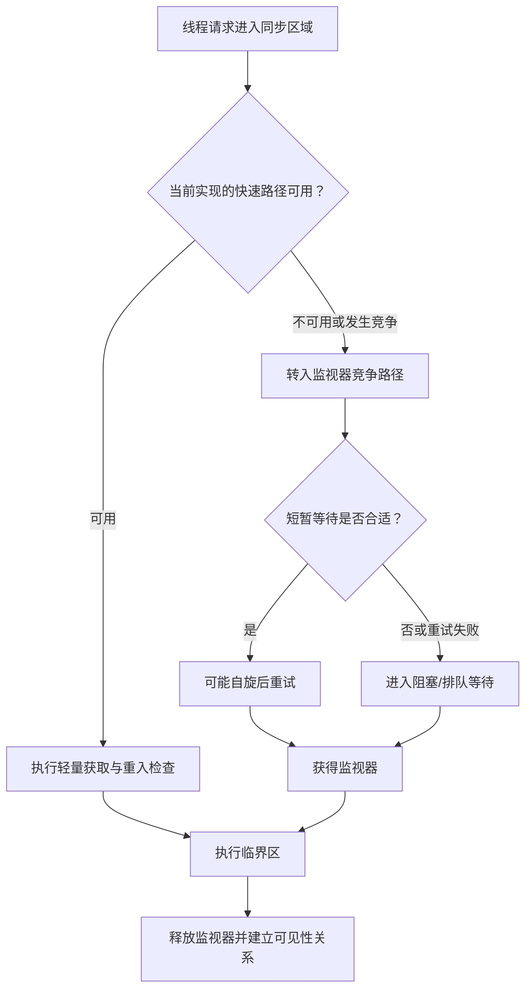

# 3.3.2.6 synchronized优化

`synchronized` 是 Java 语言提供的内置同步机制。它首先是一项正确性工具：用对象监视器建立互斥边界，并通过 Java 内存模型规定的同步关系发布临界区内的写入；其次才是一个可能需要优化的运行时操作。讨论 `synchronized` 优化时，必须把这两个层次分开。程序依赖的是语言和虚拟机规范给出的监视器语义，偏向锁、轻量级锁、对象头布局、自旋策略、锁消除等则属于具体 JVM 的实现选择。

因此，优化 `synchronized` 不是简单地“把重量级锁变轻”，也不是看到关键字就替换成原子类或 `ReentrantLock`。真正的问题是：保护的不变式是否准确，锁对象是否稳定，临界区是否包含不必要工作，竞争来自哪里，运行时能否证明某些加锁没有必要，以及换一种同步工具是否真的改变了瓶颈。只有先保证同步协议正确，再通过测量识别成本，优化才不会把性能问题变成数据竞争。

## 优化对象不是关键字，而是同步协议

一个同步协议至少包含三部分：受保护的共享状态、访问这些状态时必须持有的锁，以及跨多个字段或操作需要保持的不变式。例如，账户对象同时保存余额和版本号，若业务要求二者必须成对更新，那么锁保护的不是某一行赋值，而是“余额与版本号始终对应”这一关系。把两个写操作拆到两个同步块中，即使每个字段的单次读写都受到保护，也可能向其他线程暴露中间状态。

`synchronized` 的优化目标可以分为四类：

1. **避免不必要的同步**：对象不会逃逸到其他线程时，运行时可能消除锁；设计层面也可以通过不可变对象、线程封闭或减少共享来取消同步需求。
2. **降低无竞争路径成本**：具体 JVM 可使用快速路径，让未发生竞争的进入和退出尽量只执行少量原子操作与检查。
3. **降低竞争造成的等待**：缩短临界区、拆分彼此独立的状态、降低热点对象访问频率，减少线程在同一监视器前排队。
4. **避免等待期间占用稀缺资源**：不要持锁执行不可控的阻塞操作；在虚拟线程场景中，还要结合 JDK 版本判断监视器阻塞是否会影响载体线程利用率。

这四类目标不能互相替代。快速的无竞争加锁无法解决几十个线程争夺同一热点锁；把一个锁拆成多个锁也无法修复锁消除失败；换成显式锁并不会自动缩短临界区。优化前应先判断成本属于“每次进入都贵”，还是“竞争后等待很久”，抑或真正耗时来自锁内业务。

## synchronized 不应被优化掉的语义

### 互斥与可重入

每个 Java 对象都关联一个监视器。线程进入以该对象为锁的同步区域前，需要先获得监视器；同一时刻最多只有一个线程持有它。`synchronized` 是可重入的：已经持有某对象监视器的线程，可以再次进入由同一对象保护的同步方法或同步块，运行时维护重入层数，最外层退出后才真正释放监视器。

实例同步方法锁定当前实例，静态同步方法锁定声明该方法的 `Class` 对象，同步语句则锁定括号内表达式求值所得的对象。它们只有在锁对象相同时才互斥。两个方法都写了 `synchronized`，但一个锁实例、一个锁类对象，不能共同保护同一份共享状态。

编译到字节码后，同步语句通常体现为 `monitorenter` 与 `monitorexit`；同步方法则通过方法访问标志表达同步属性，由虚拟机在调用边界执行对应监视器操作。异常离开同步区域时也必须释放监视器，编译器会生成相应的异常控制流。这个自动释放只针对监视器，不代表锁内打开的文件、网络连接或其他资源也会自动关闭。

### 可见性与 happens-before

Java 内存模型规定：对某个监视器的解锁，happens-before 后续对同一监视器的加锁。由此，线程 A 在释放锁之前完成的写入，在线程 B 随后成功获得同一把锁后必须可见。这个关系要求读写双方遵守同一同步协议；如果写操作持锁而读操作完全不持锁，就不能借助该锁推导读线程一定看到新值。

互斥与可见性共同构成 `synchronized` 的正确性价值。仅把共享字段改成 `volatile`，通常只能补足单个变量的可见性与特定有序性，不能让“检查后更新”、多字段一致性或集合复合操作自动具备原子性。相反，只在写端加锁、读端依靠“机器缓存最终会刷新”，也不是合法的可见性保证。

### wait、notify 与监视器

`Object.wait`、`notify`、`notifyAll` 与对象监视器绑定。调用线程必须持有目标对象的监视器；`wait` 会原子地进入等待并释放该监视器，线程被唤醒后还要重新竞争监视器，成功获得后才能继续执行。`notify` 只选择一个等待者进入可竞争状态，并不立即把锁交给它；`notifyAll` 也不表示所有等待者会同时通过条件。

条件等待应始终在循环中检查条件，因为线程可能经历虚假唤醒，或者从被通知到重新获得锁之间，条件又被其他线程改变。若代码依赖 `wait`/`notify`，监视器可能需要运行时的完整支持，这会影响某些轻量路径是否继续适用。因此，优化不能只计算同步块中的业务指令，还要考虑是否使用监视器条件队列。

```java
public final class Gate {
    private boolean open;

    public synchronized void awaitOpen() throws InterruptedException {
        while (!open) {
            wait();
        }
    }

    public synchronized void open() {
        open = true;
        notifyAll();
    }
}
```

## “锁状态”必须放在具体 JDK 与 JVM 中讨论

很多资料把 `synchronized` 概括成“无锁、偏向锁、轻量级锁、重量级锁四种状态，并且只能逐级升级、不能降级”。这套说法可以帮助理解一部分旧版 HotSpot 实现，却不是 Java 语言规范中的永久状态机，也不适合作为跨版本结论。其他 JVM 可以采用不同表示；HotSpot 自身也持续修改对象头和锁协议。

更稳妥的表述是：HotSpot 会为常见的无竞争路径建立快速实现，在竞争、调用监视器等待操作、JNI 锁定或其他快速路径无法处理的情况下，转入具备完整排队和阻塞能力的监视器实现。对象在某一时刻采用什么内部表示，是运行时实现细节；应用程序不能读取这些状态来决定正确性，也不应依赖状态转换方向设计协议。

### JDK 15 之前常见的偏向锁

偏向锁曾是 HotSpot 针对“同一对象长期只被同一线程反复加锁”设计的优化。基本思想是让对象偏向某个线程，后续由该线程再次进入时尽量避免执行原子比较交换。它适合大量无竞争、线程归属稳定的旧式工作负载，但一旦对象由其他线程竞争，就需要撤销或重新偏向；撤销流程本身会带来复杂度和成本。

这里的“偏向”不是线程永久拥有对象，也不是另一线程一定无法接管。它只是旧版 HotSpot 的快速路径假设。对象的身份哈希、批量撤销、线程生命周期和安全点等因素都可能影响实现行为。把对象头位模式背成程序规则，既容易遗漏前提，也会在升级 JDK 后失效。

JEP 374 在 JDK 15 中默认禁用了偏向锁，并弃用了相关命令行选项。该提案明确指出，偏向锁过去针对的某些负载已不再常见，现代原子指令成本和线程池式工作负载也改变了收益关系，而撤销和维护复杂性仍然存在。因此，在 JDK 15 及以后讨论 `synchronized` 性能时，不应默认把偏向锁作为正常起点；在更早的 HotSpot 或特定厂商回移实现上，则要以实际启动参数和版本为准。

### 旧式栈锁与现代轻量级锁

传统 HotSpot 轻量路径常被描述为“在线程栈中创建锁记录，把对象头的 Mark Word 复制到锁记录，再用 CAS 将对象头替换为指向锁记录的指针”。这种解释对应旧式栈锁机制，能说明为什么对象头、重入和膨胀经常一起出现，但它不是所有现代 HotSpot 配置下的唯一实现。

随着 HotSpot 锁子系统演进，现代轻量级锁可以通过对象头标记位和线程本地的锁栈等结构处理无竞争锁定，不必沿用“对象头始终指向栈上锁记录”的描述。JDK 24 引入的紧凑对象头实验实现明确要求锁操作不能覆盖包含类型信息的完整对象头，并说明轻量级锁在无竞争、未调用 `wait`/`notify`、未使用 JNI 锁定等条件下工作；不满足条件时使用监视器锁。JDK 25 的 JEP 519 将紧凑对象头从实验特性提升为产品特性，但没有把它设为默认布局。

这说明“轻量级锁”更适合被理解为一类无竞争快速路径，而不是永远固定的数据结构。分析某次运行时，应记录 JDK 发行版、具体 JVM、架构、启动参数以及紧凑对象头等特性是否启用。仅凭源码中的 `synchronized` 关键字，无法推断对象头的确切位布局。

### 监视器锁、竞争与阻塞

当轻量路径无法满足需求时，HotSpot 可以把锁交给监视器结构处理。监视器需要记录持有者、重入情况以及竞争或等待线程，并与线程阻塞、唤醒机制协作。资料常把它称为“重量级锁”，强调它可能涉及调度和上下文切换；但“重量级”不是说每次竞争都会立即发生固定次数的系统调用，也不是说一旦出现监视器结构，之后每次操作成本就恒定不变。

运行时可能先短暂自旋，观察持有者是否即将释放锁；也可能根据历史竞争、处理器数量和当前策略调整自旋。自旋避免了很短等待中的挂起与恢复，但会消耗 CPU。若持锁时间长、可运行线程很多或处理器已经饱和，继续自旋可能适得其反。应用层通常不应根据旧版本经验手工调一组锁参数，而应优先减少竞争，并用目标 JDK 上的测量验证效果。



上图只表达优化层次，不代表某个 JDK 的精确内部状态机。快速路径条件、自旋、队列结构和对象头表示都可能随版本、平台和配置变化。

## JIT 优化：让不存在的共享不再付锁成本

运行时锁实现优化的是“必须执行的同步”；JIT 编译器还能进一步证明某些同步根本不影响跨线程行为，从而消除或合并操作。此类优化依赖程序形态、逃逸分析、编译层级和实际内联结果，不是源码写法必然对应的承诺。

### 逃逸分析与锁消除

若 JIT 能证明一个对象只在当前线程或当前编译范围内使用，没有发布给其他线程，那么对该对象加锁不会与其他线程形成互斥。编译器可以消除相关监视器操作，这就是锁消除。这里消除的是运行时动作，不是改变 Java 源码语义；若分析无法证明对象不逃逸，就必须保守地保留同步。

```java
public String buildLabel(int id) {
    StringBuffer buffer = new StringBuffer();
    buffer.append("task-");
    buffer.append(id);
    return buffer.toString();
}
```

`StringBuffer` 的方法带有同步，但示例中的 `buffer` 是方法内新建对象，没有直接发布。经过内联与逃逸分析后，JIT 可能判断它不会被其他线程访问，进而消除内部锁，甚至进一步做标量替换。结论中的“可能”非常重要：不同 JDK、不同编译器、不同调用形态和是否成功内联，都会影响最终机器码。不能据此声称局部对象上的锁一定没有成本。

阻碍锁消除的常见因素包括：把对象写入共享字段或集合、返回对象本身、传给无法内联且行为未知的方法、通过反射或本地代码产生复杂逃逸、编译尚未达到足够优化层级。微基准若没有预热，测到的可能是解释执行或低层编译结果；若结果未被消费，又可能被死代码消除。验证锁消除应观察编译与汇编信息，或用可靠基准框架比较，而不是用一次 `System.nanoTime` 差值下结论。

设计层面的启示不是“多创建对象让 JVM 消锁”，而是让对象所有权清晰。不可变值、局部构建器和线程封闭状态更容易分析，也减少了程序真正需要同步的部分。即使某次 JIT 没有完成锁消除，这种结构通常仍比模糊共享更容易维护。

### 锁粗化

锁粗化是把相邻、反复作用于同一对象的同步区域合并为一个较大的同步区域，从而减少重复进入和退出的固定成本。例如，一个循环中每次迭代都对同一对象加锁，而循环期间没有必要允许其他线程穿插访问，JIT 可能把锁移动到循环外。

```java
public void appendAll(StringBuffer target, List<String> values) {
    for (String value : values) {
        target.append(value);
    }
}
```

若 `append` 的同步实现被内联，编译器可能识别连续锁操作并进行粗化。但锁粗化不是“同步块越大越快”。合并后虽然进入次数减少，锁的持有时间却可能变长，其他线程的等待也可能上升。编译器只有在证明语义等价并认为收益合理时才会做这件事；开发者手工粗化则必须基于不变式和竞争情况判断。

手工粗化适合“多个操作必须作为整体原子执行”的场景。比如先检查容器状态、再更新多个条目、最后更新统计信息，本来就要求其他线程不能在中间观察。此时一个覆盖完整事务的同步块既正确，也避免重复加锁。若多个操作彼此独立，或者中间包含耗时计算、日志、回调和 I/O，盲目合并会扩大竞争窗口。

### 锁消除与粗化并不矛盾

锁消除回答“这把锁是否根本不参与线程间同步”，锁粗化回答“必须保留的多次锁操作能否合并”。编译器可能先内联方法，再基于逃逸信息消除某些对象上的锁；对于不能消除的同一监视器操作，又可能在合适范围内粗化。两者都建立在语义等价基础上，不会把一个真实参与共享保护的锁随意删除。

## 临界区设计决定竞争成本

### 先确定不变式，再缩小范围

“同步块越小越好”只对性能方向提供启发，不是正确性规则。最小临界区应当是维护不变式所需的最小完整范围，而不是最少代码行。若一个操作必须读取旧状态、校验条件、更新多个字段并发布新版本，那么这些步骤通常必须在同一锁下完成。把校验移出锁外可能产生检查时与使用时之间的竞态。

可以移出锁外的通常是与共享状态无关、结果可在持锁前独立计算的工作。例如对不可变输入做解析、构造候选值、准备局部缓冲区；进入锁后只校验当前版本是否仍适用并提交结果。若锁外计算依赖共享状态快照，就要考虑快照是否一致，以及提交时是否需要再次验证。

```java
public final class Registry {
    private final Object lock = new Object();
    private final Map<String, Entry> entries = new HashMap<>();

    public void replace(String key, Source source) {
        Entry candidate = parse(source);
        synchronized (lock) {
            entries.put(key, candidate);
        }
    }
}
```

该例把耗时解析放在锁外，是因为 `parse` 只依赖参数，提交动作才访问共享映射。如果解析需要读取映射中的旧条目并基于它生成结果，就不能直接照搬此结构；可以在锁内完成，或者引入版本检查与重试协议。

### 不要持锁调用不可控代码

临界区中最危险的内容通常不是几次内存写入，而是耗时和重入行为不可预测的调用：

- 网络、文件、数据库或进程间通信可能长期阻塞；
- 用户提供的回调可能再次进入当前对象、获取其他锁或抛出异常；
- 日志框架、事件总线和监听器可能隐藏额外同步；
- `Future.get`、线程 `join` 或等待另一个任务可能形成依赖环；
- 大对象序列化、复杂正则和无界集合遍历可能让持锁时间随输入膨胀。

常用结构是在锁内生成不可变快照或记录需要执行的动作，释放锁后再调用外部代码。如果回调结果还要更新共享状态，则再次加锁并验证前提没有变化。这样会增加协议复杂度，却把不可控等待移出热点锁。是否采用这种两阶段结构，取决于业务能否接受状态在两次加锁之间变化。

### 锁对象必须稳定且封装

使用 `private final Object lock = new Object()` 可以避免外部代码意外参与同一监视器。锁定公开暴露的可变对象、字符串字面量、装箱缓存对象或可被替换的字段，都会扩大冲突范围或破坏协议。尤其不能在锁字段可变的情况下，一部分线程锁旧对象，另一部分线程锁新对象。

锁定 `this` 简洁且适合同步整个实例协议，但实例一旦泄露给外部，外部代码也能在该对象上同步，可能造成意外阻塞和锁顺序问题。锁定 `Class` 对象影响同一类加载器下该类的所有实例，并可能与外部静态同步代码互相干扰。选择锁对象时，应明确它保护的状态范围，并尽可能限制可见性。

### 锁拆分要按状态独立性，而不是按方法数量

如果两个高频操作访问完全独立的状态，可以使用不同锁降低无关竞争。例如统计信息和配置缓存没有共同不变式，可分别保护。若操作经常需要同时访问两组状态，拆锁会引入固定的获取顺序、死锁风险和跨锁一致性问题，可能比单锁更差。

锁拆分后的核心问题是组合操作。单独读取 A、单独读取 B 都线程安全，不代表读取到的 `(A, B)` 是同一逻辑时刻的一致快照。需要跨分区原子性时，可以固定顺序同时获得多把锁、使用不可变快照整体替换，或重新设计状态所有权。为了追求并行度而破坏不变式，属于错误而非优化。

### 热点锁常常暴露所有权问题

大量线程争夺同一把锁，可能说明数据天然需要串行化，也可能说明共享边界过大。可考虑的方向包括：

- 将只读配置构造成不可变对象，通过安全发布整体替换；
- 按键、分片或独立实体划分状态，使无关操作不再共享监视器；
- 使用线程本地累积后批量合并，降低更新频率；
- 把所有权交给单一执行者，通过队列传递命令；
- 对只要求近似统计的数据使用适合高竞争更新的累加器；
- 用并发容器的原子复合 API 替代“外部锁 + 多步容器操作”。

这些方案改变的是数据组织和一致性模型，不能机械替换。分片会增加全局汇总成本，批量合并会引入延迟，单一执行者受单线程吞吐上限约束，近似统计可能不满足精确结算。优化必须明确允许牺牲什么，不能只报告吞吐提高。

## 竞争、持锁时间与吞吐的关系

锁的表面成本是获取与释放，真正决定尾延迟的通常是竞争概率和持锁时间。假设临界区平均耗时很短，但所有请求都经过同一把锁，当并发量持续上升时，等待队列仍会增长；反过来，一个较长同步块若调用频率极低且从不竞争，对整体性能可能没有明显影响。

评估锁时应至少观察：

- 锁请求频率；
- 无竞争获取比例；
- 竞争次数和阻塞次数；
- 平均、分位数和最大持锁时间；
- 等待时间及其高分位；
- 持锁线程是否被 I/O、调度暂停或其他锁阻塞；
- 同一把锁保护的状态是否过多；
- 竞争发生时系统是否已处于 CPU、内存或下游资源瓶颈。

吞吐下降不一定由监视器内部开销直接造成。线程争抢还会增加调度、缓存失效和共享数据迁移；持锁线程被抢占后，其他线程即使占有 CPU 也无法推进；大量短任务在热点锁前排队，可能让线程池扩容或请求堆积进一步放大延迟。优化应关注整个队列链路，而不是只测 `monitorenter` 的纳秒数。

### 自旋不是免费等待

在多核机器上，若持锁者正在运行且很快释放，自旋线程可能比挂起后再唤醒更早获得锁。但如果持锁者没有获得 CPU、临界区包含阻塞操作，或者竞争线程远多于核心数，自旋只会消耗本可用于持锁者或其他请求的计算资源。

HotSpot 的具体自旋策略属于实现细节，并可能随版本调整。应用层不应把“轻量级锁会自旋若干次”当作固定承诺，更不能用空循环自行包围 `synchronized` 模拟优化。需要可控的非阻塞重试时，应选择明确提供尝试语义的并发工具，并处理退避、失败和取消；需要普通互斥时，首先让临界区短且无阻塞。

### 公平性与饥饿

`synchronized` 不提供可配置的公平获取契约。等待时间受到调度、监视器策略、持锁时间和竞争到达顺序共同影响，不能假定先等待的线程一定先获得锁。多数吞吐型场景不需要严格公平，但若业务要求可中断获取、超时获取、多个条件队列或显式公平策略，`ReentrantLock` 等工具可能更符合需求。

替换的理由应当是语义能力，而不是“显式锁一定更快”。现代 JVM 对内置锁和显式锁都会持续优化，实际结果依赖工作负载。公平锁通常还会付出吞吐代价；若根因是锁内慢操作，换锁类型不会消除等待。

## 与虚拟线程相关的版本边界

虚拟线程在 JDK 21 正式提供后，`synchronized` 曾经出现一个新的工程关注点：虚拟线程在同步区域内执行阻塞操作时，可能无法从载体线程卸载，从而同时阻塞虚拟线程和承载它的平台线程。这种现象称为固定或 pinning，会限制虚拟线程调度器复用载体线程的能力。

JEP 491 在 JDK 24 中改进了监视器实现，使虚拟线程因进入 `synchronized` 方法或语句而阻塞时，能够释放底层载体线程，并消除了几乎所有由 `synchronized` 导致的固定场景。因此，下面两种结论都需要版本前提：

- 对 JDK 21 至 JDK 23，虚拟线程代码若在同步区域内执行可能阻塞的操作，应特别诊断载体线程固定，并考虑缩小同步区或改用适合的显式锁结构；
- 对 JDK 24 及以后，不能再笼统宣称“虚拟线程中必须把所有 `synchronized` 替换为 `ReentrantLock`”。JEP 491 已改变这一实现限制，是否替换应回到临界区设计、所需 API 和实际测量。

即使在 JDK 24 以后，持锁做慢 I/O 仍然可能让其他等待同一监视器的虚拟线程无法推进。载体线程能被复用，只是降低调度资源占用，不会让业务互斥消失，也不会缩短锁的持有时间。虚拟线程数量很大时，一个热点监视器仍可能形成长队列，所以“不会固定载体线程”与“没有锁竞争问题”是两个不同结论。

## 诊断：先证明锁是瓶颈

### 线程转储提供等待现场

线程转储可以显示线程状态和阻塞栈。`BLOCKED` 通常表示线程正在等待进入监视器；`WAITING` 或 `TIMED_WAITING` 可能来自 `Object.wait`、`join`、停车或其他等待机制。一次转储只能反映瞬时现场，最好在问题窗口连续采集多份，观察同一锁、同一持有者和同一调用栈是否反复出现。

诊断时不要只统计有多少个 `BLOCKED`。如果持锁线程正在执行一个本应很快结束的方法，问题可能只是瞬时尖峰；如果持锁线程长时间停在网络读取、回调、日志或另一把锁上，才说明临界区包含不受控工作。还要检查锁标识是否一致，避免把多个不同实例上的同名同步方法误判为同一热点。

`jcmd <pid> Thread.print -l` 或 `jstack -l <pid>` 可用于获取包含锁信息的线程现场，具体可用命令取决于 JDK 发行版、权限和部署方式。生产环境执行诊断命令应评估开销，并遵守进程权限与数据安全要求。

### JFR 观察竞争事件与时间分布

Java Flight Recorder 可以低开销记录一段时间内的运行时事件。与锁相关的事件可用于定位监视器进入阻塞、等待和持锁关联栈，事件名称和默认阈值会随 JDK 版本与配置变化。分析时应记录所用 JDK、录制模板、事件是否启用以及阈值，不能把“录制中没有事件”直接解释为“没有竞争”。

JFR 的价值在于把线程转储的静态现场扩展为时间分布：哪些调用点最常竞争，累计等待多久，尖峰发生在哪个阶段，是否与 GC、CPU 饱和或下游延迟同时出现。优化后应使用相同负载和尽量一致的录制设置复测，比较等待分位数和业务指标，而不只是事件数量。

### JMH 测微观成本，但不能替代系统压测

微基准可用于比较两个狭窄实现，但并发锁基准很容易失真。常见错误包括没有足够预热、共享状态范围配置错误、结果未消费、线程数不符合生产比例、临界区为空、基准外的对象分配被优化掉，以及在一台空闲机器上推断线上竞争。

可靠基准应明确：

- 哪些状态由全部线程共享，哪些状态属于单线程；
- 线程组中读写比例和总线程数；
- 临界区内的真实计算量；
- 是否需要防止常量折叠和死代码消除；
- JDK、JVM 参数、硬件核心数和频率管理策略；
- 测量的是吞吐、平均延迟还是尾延迟；
- 是否分别覆盖无竞争、低竞争和高竞争场景。

即使微基准显示替换后每次操作快若干纳秒，也要回到端到端压测确认。若该路径只占请求耗时的极小比例，优化可能没有可见收益；若新实现改变了公平性、内存占用或失败行为，局部吞吐提高也未必值得。

### 观察编译优化需要更直接的证据

判断锁消除或粗化是否发生，最好结合 JIT 编译日志、诊断选项、JITWatch 等分析工具，必要时检查生成代码。诊断选项的名称、是否属于产品参数、是否需要调试版 JVM，都会随 JDK 变化，不能在文档中把某个内部参数当作永久接口。

一个实用判断顺序是：先用业务指标确认锁相关等待占比，再用 JFR 或线程转储定位热点监视器，然后用基准或编译分析验证候选修改。直接从对象头打印结果推断所有线上行为，容易受到压缩指针、身份哈希、GC、锁实现和工具版本影响，只适合作为特定环境下的学习实验。

## 常见优化方案及其边界

### 方案一：减少共享和安全发布不可变快照

配置、路由表、规则集合等读多写少状态，可以在更新线程中构造完整不可变对象，再通过 `volatile` 引用、锁或其他安全发布方式整体替换。读线程读取一次引用后在快照上操作，无需每次进入公共监视器。

代价是更新需要复制或重建数据，旧快照在读者结束前仍占内存，跨多个独立引用的替换也不自动成为一个原子事务。只有当全部相关状态封装在同一快照中，整体替换才能提供一致视图。

### 方案二：缩小锁内工作

把纯计算、参数校验、序列化准备和外部调用移出锁，只在锁内读取或提交共享状态。这通常直接降低持锁时间，是风险相对可控的优化。但移出前必须证明操作不依赖会变化的共享状态；否则需要版本号、条件重检或补偿逻辑。

### 方案三：拆分锁或分片

按照独立实体、键空间或状态子系统建立多把锁，可以让无关请求并行。分片数量不是越多越好：锁对象本身、路由计算、热点倾斜、全局操作和死锁管理都会增加复杂度。若某个键承载绝大多数流量，均匀分片也无法消除该热点。

### 方案四：降低同步频率

将每次更新改为线程本地累计、分段计数或批量提交，可以显著减少热点锁访问。适用于统计、缓冲和允许短暂延迟的合并任务，不适用于每次更新都必须立即对所有线程可见的强一致业务状态。批量大小还会影响延迟、内存和故障时的数据损失范围。

### 方案五：选择语义更合适的并发组件

若需求是键级原子更新，可优先使用并发映射提供的原子方法；若是生产者消费者，可使用阻塞队列；若需要读写分离，可评估读写锁或乐观读取；若只是高竞争统计，可评估累加器；若需要超时、可中断和多个条件队列，可使用显式锁。

高层组件减少手写同步协议，但不保证业务复合操作自动正确。例如 `ConcurrentHashMap` 保证单个 API 的并发语义，却不能让任意多次调用组成原子事务。传给 `compute` 一类方法的函数也不应执行长时间阻塞或递归修改，具体限制要遵守 API 契约。

### 方案六：串行化所有权

将某份可变状态限定为单一线程所有，其他线程通过消息提交操作，可以彻底取消该状态上的共享锁。它把锁等待转换为队列等待，优点是状态变更顺序清晰，缺点是所有操作受单个消费者吞吐限制，并需要处理队列容量、背压、任务失败和关闭。

这个方案不是“无锁所以一定快”。如果命令粒度太细，排队和调度成本可能高于短同步块；如果队列无界，过载会转化为内存和延迟问题。它适合所有权模型自然、操作可异步或可批处理的场景。

## 容易误导优化的典型误区

### “synchronized 一定很慢”

在无竞争、临界区短且 JIT 优化充分的场景中，`synchronized` 的成本可能很低。程序真正的瓶颈可能是分配、缓存未命中、下游 I/O 或算法复杂度。没有分析就替换，会增加代码复杂度，却不改变业务指标。

### “偏向锁是 synchronized 的第一阶段”

这只适用于曾启用偏向锁的特定 HotSpot 版本和配置。JDK 15 已默认禁用偏向锁，后续实现继续演进。现代文章若仍把偏向锁作为所有 JDK 的固定起点，会错误解释对象头和性能现象。

### “锁只能升级，永远不能恢复”

这是对某些旧实现路径的简化描述，不是 Java 规范保证。监视器结构可能被回收，对象头和锁子系统也会随版本变化。应用程序只应依赖进入、退出、互斥、可见性和等待通知语义，不应依赖内部状态转换是否可逆。

### “把同步块缩成一行就更快”

如果检查和更新必须原子完成，拆分同步块会制造竞态。优化临界区的原则是移走不参与不变式的工作，而不是追求最少行数。短但错误的同步区域没有性能价值。

### “用 volatile 或 AtomicInteger 就能替代锁”

单变量原子读写不能自动维护多变量或多步骤不变式。原子类适合能表达为单位置更新或明确 CAS 循环的问题；当操作包含复杂条件、多个对象和失败回滚时，锁可能更清晰。CAS 在高竞争下也会反复失败并消耗 CPU。

### “ReentrantLock 一定比 synchronized 快”

两者实现都经过长期优化，性能没有脱离版本和负载的固定排名。显式锁的主要优势是可中断获取、超时尝试、公平选项和多个条件队列等能力；代价是必须在 `finally` 中释放，协议更容易被错误路径破坏。只为了逃避一个未经证明的 `synchronized` 开销而替换，通常缺少依据。

### “identityHashCode 会让程序永久进入重量级锁”

对象身份哈希需要与对象头表示协作，可能影响特定 HotSpot 版本中的锁路径，但精确行为取决于对象头布局和实现。不能把某个实验观察推广为所有 JDK 的永久结论。除非性能分析明确指向这一交互，否则不应为了猜测对象头状态而修改业务语义。

### “锁对象越细越好”

锁粒度变细提高潜在并行度，也增加锁数量、顺序约束和一致性组合难度。如果多数操作都要同时获得多把锁，拆分会增加开销和死锁风险。锁粒度应该对应可独立维护的不变式边界。

### “没有 BLOCKED 线程就没有锁问题”

短时间高频竞争可能主要表现为 CPU 消耗和吞吐下降，采样瞬间未必抓到大量阻塞；锁消除失败也可能增加每次操作固定成本但不产生显著等待。反过来，少量 `BLOCKED` 线程也未必是瓶颈。需要结合持续事件、等待时间和业务指标判断。

### “优化后压测吞吐高，就没有副作用”

更高吞吐可能以更差公平性、更高 CPU、更大内存、更长极端尾延迟或更弱一致性为代价。优化报告应同时列出吞吐、延迟分布、资源占用、错误率和语义变化。若方案引入分片、批处理或近似统计，还必须说明一致性边界。

## 一套可执行的优化流程

第一步是写清同步协议。列出共享字段、保护它们的锁、必须原子保持的不变式、允许在锁外执行的工作，以及是否调用 `wait`/`notify`。如果协议本身说不清，先不要做性能修改。

第二步是建立基线。记录目标 JDK 与 JVM、启动参数、硬件、线程模型、请求量、读写比例、吞吐和延迟分位数。涉及虚拟线程时，明确是 JDK 21 至 23，还是已经包含 JEP 491 的 JDK 24 及以后。

第三步是定位等待。通过线程转储、JFR、应用指标或剖析器确认热点锁、竞争调用点、持锁者在做什么。检查问题是单次持锁过长、调用频率过高、热点倾斜，还是系统过载后锁竞争被放大。

第四步是选择最小修改。优先移出锁内不可控工作、减少共享、修正锁对象或使用已有原子复合 API。只有独立状态确实存在时才拆锁；只有语义需要时才换显式锁；只有允许改变一致性时才引入批处理或近似方案。

第五步是验证正确性。并发测试应覆盖多线程交错、异常路径、中断、超时和关闭，检查不变式而不是依赖日志顺序。对于复杂同步算法，可使用专门的并发压力测试工具扩大竞态窗口。普通单元测试通过不能证明不存在数据竞争。

第六步是在同一条件下复测。比较业务吞吐、平均与尾延迟、CPU、分配、上下文切换和锁等待。优化若只在不现实的空临界区微基准中有效，不应直接进入生产代码。

第七步是记录适用范围。说明优化针对的 JDK、负载和数据规模，保留为什么选择当前方案的依据。未来升级 JDK、启用紧凑对象头、切换线程模型或改变读写比例时，应重新验证，而不是假定旧结论永久成立。

## 版本事实速查

| 范围 | 可以采用的结论 | 不应泛化的结论 |
| --- | --- | --- |
| Java 语言与 JVM 规范层面 | `synchronized` 提供对象监视器互斥、可重入以及同一监视器解锁到后续加锁的 happens-before 关系 | 对象头具体位数、锁记录位置、自旋次数和内部队列结构 |
| JDK 15 / HotSpot | JEP 374 默认禁用偏向锁，并弃用相关选项 | 所有 Java 虚拟机都在 JDK 15 同步采用同一内部实现 |
| JDK 24 / HotSpot | 紧凑对象头作为实验特性引入；JEP 491 改进虚拟线程在 `synchronized` 中阻塞时的卸载能力 | 紧凑对象头默认启用；所有阻塞场景都不再可能固定虚拟线程 |
| JDK 25 / HotSpot | 紧凑对象头成为产品特性，可不再解锁实验选项后启用 | 紧凑对象头已经成为默认对象头布局 |
| 任意具体运行环境 | 性能结论应由该 JVM、参数、硬件和负载下的测量支持 | 从旧版对象头图或单次微基准推导永久性能排名 |

## 总结

`synchronized` 优化的第一原则是保持语义：同一把锁保护哪些状态，哪些步骤必须原子完成，读写双方如何建立可见性，都不能为了缩短代码而破坏。第二原则是区分规范与实现：偏向锁、栈锁、现代轻量级锁、监视器结构和对象头布局属于特定 JVM、JDK 与配置，不能写成 Java 永久不变的四阶段模型。

在实现层面，JVM 会尽量让无竞争路径便宜，并通过逃逸分析、锁消除和锁粗化减少无意义的监视器操作；在程序设计层面，开发者更应关注共享边界、临界区持有时间和竞争热点。减少共享、把纯计算移出锁、避免持锁调用不可控代码、按独立不变式拆分状态，通常比猜测对象头状态更可靠。

最终，优化是否成立要由证据回答：线程转储和 JFR 说明线程在哪里等待，基准和压测说明修改是否改善业务指标，并发测试说明不变式是否仍然成立。没有版本前提、没有竞争数据、没有正确性验证的“锁优化”，通常只是把一个可理解的同步协议换成更难诊断的代码。

## 参考资料

- [JEP 374: Deprecate and Disable Biased Locking](https://openjdk.org/jeps/374)
- [JEP 450: Compact Object Headers (Experimental)](https://openjdk.org/jeps/450)
- [JEP 491: Synchronize Virtual Threads without Pinning](https://openjdk.org/jeps/491)
- [JEP 519: Compact Object Headers](https://openjdk.org/jeps/519)
- [Java Language Specification: Threads and Locks](https://docs.oracle.com/javase/specs/jls/se25/html/jls-17.html)
- [Java Virtual Machine Specification: Instruction Set](https://docs.oracle.com/javase/specs/jvms/se25/html/jvms-6.html)
