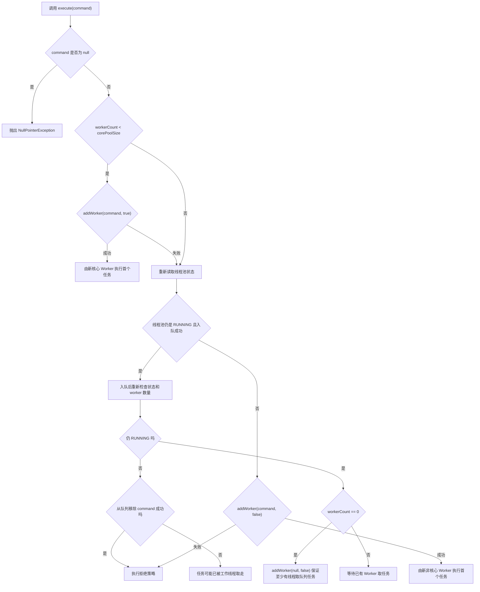

# 3.3.3.4 执行任务流程

## 定位

线程池的“执行任务流程”，讨论的是一个任务从调用方交给 `ThreadPoolExecutor` 开始，到它被工作线程取走、运行、完成、失败、被取消或被拒绝为止，线程池内部究竟做了哪些判断。这个主题表面上像是一条简单规则：先创建核心线程，再放入队列，再创建非核心线程，最后执行拒绝策略。真正写并发程序时，仅记住这句话远远不够，因为每一步都夹杂着线程池状态、工作线程数量、阻塞队列行为、关闭时机、任务异常和并发竞争。

`ThreadPoolExecutor` 的设计目标不是让每个任务都立刻获得一个新线程，而是在“线程复用、任务排队、容量限制、生命周期控制”之间做折中。直接创建线程的模型中，任务和线程几乎一一对应；线程池模型中，任务只是一个可执行单元，线程是可以反复执行多个任务的资源，队列是任务等待执行的缓冲区，拒绝策略是容量或生命周期边界被触碰后的处理方式。理解执行任务流程，就是理解这几类对象如何协作，以及线程池为什么会在某个时刻选择执行、排队、扩容或拒绝。

本文保持通用 Java 技术视角，围绕标准库中的 `ThreadPoolExecutor` 展开。重点不是背诵某个源码分支，而是建立可推导的执行模型：调用 `execute` 时线程池如何判断当前状态，为什么核心线程优先，任务入队后为什么还要二次检查，什么时候最大线程数才会生效，`Worker` 为什么既是工作线程的封装也是运行任务的控制单元，任务异常会怎样影响工作线程，队列类型又如何改变整个线程池的运行形态。掌握这些内容后，才能解释“为什么任务没有执行”“为什么队列堆积但线程数没有增加”“为什么线程池关闭后还出现拒绝”“为什么 `submit` 后异常没有直接打印”等常见现象。

## 执行流程要解决的问题

线程池执行任务首先要解决的是接收边界。调用方把一个 `Runnable` 交给线程池时，线程池需要判断自己是否仍处于可接收新任务的状态。如果线程池已经进入关闭过程，就不能再像运行中那样无条件接收任务；如果线程池仍在运行，也不能无限制地创建线程或无限制地堆积任务。接收边界把任务提交和线程池生命周期连接起来，避免关闭后的资源继续扩张。

第二个问题是容量分配。线程池中至少有三类容量：当前工作线程数量、阻塞队列容量、最大线程数量。`corePoolSize` 表示线程池倾向于长期保留的基础工作线程规模，`workQueue` 表示任务等待区，`maximumPoolSize` 表示在队列不能继续接收任务时允许扩张到的上限。执行流程的核心就是在这三类容量之间做决策，而不是简单地“来了任务就开线程”。

第三个问题是执行归属。任务由调用方线程提交，但最终通常由池中的某个工作线程执行。提交线程不应该承担任务正文的执行成本，除非拒绝策略明确选择了调用方运行；工作线程也不是执行一个任务就结束，而是进入循环，不断从队列取任务。执行归属的转移意味着异常、线程上下文、中断状态、线程局部变量和资源清理都必须被清楚处理。

第四个问题是失败路径。任务可能在提交时被拒绝，可能入队后遇到关闭，可能在运行中抛出异常，可能被 `Future` 取消，工作线程也可能因为异常退出。线程池执行流程不是只描述成功路径，它还必须描述这些失败路径如何释放资源、减少工作线程计数、补充工作线程、通知调用方或保留异常信息。

## 从整体规则看 execute

`ThreadPoolExecutor` 的任务入口是 `execute(Runnable command)`。`submit`、`invokeAll`、`invokeAny` 等更高层方法最终也会把任务包装后交给执行机制，因此理解 `execute` 是理解线程池执行流程的核心。`execute` 的经典决策顺序可以概括为三段：如果当前工作线程数小于核心线程数，优先尝试创建核心工作线程执行新任务；否则尝试把任务放入工作队列；如果入队失败，再尝试创建非核心工作线程；如果仍然失败，则执行拒绝策略。

这条规则有两个容易被忽略的限定。第一，它说的是“尝试”，不是“必然”。创建线程可能因为线程池状态变化、线程工厂失败、工作线程数量竞争或容量限制而失败；入队也可能因为队列满、线程池关闭或队列实现语义而失败。第二，队列不是简单的中间步骤，它会深刻改变线程池是否扩容。对于有界队列，队列满之前通常不会触发非核心线程扩张；对于无界队列，非核心线程几乎没有发挥空间；对于不存储元素的直接移交队列，任务无法排队，因此更容易触发线程扩张。

下面的流程图描述了 `execute` 的核心判断路径：



这张图中最关键的是“入队后重新检查”。很多人把线程池流程理解成单线程顺序逻辑：判断运行中、入队、等待执行。但 `execute` 可能和 `shutdown`、工作线程退出、其他任务提交同时发生。任务成功放入队列时，线程池状态可能马上变成非运行状态；也可能线程池还在运行，但所有工作线程已经因为超时或异常退出。如果不做二次检查，队列中的任务可能在关闭后被错误保留，或者在没有工作线程时永久停留在队列中。

## ctl：把运行状态和工作线程数放在一起

`ThreadPoolExecutor` 内部用一个原子整数 `ctl` 同时表达两个信息：线程池运行状态和工作线程数量。高位保存运行状态，低位保存 worker 数量。这样设计的直接好处是，很多判断可以在一次原子读取中同时得到“线程池还能否接收任务”和“当前有多少工作线程”，并且可以通过 CAS 在并发提交、关闭和线程退出之间保持一致性。

运行状态通常包括 `RUNNING`、`SHUTDOWN`、`STOP`、`TIDYING`、`TERMINATED`。`RUNNING` 表示可以接收新任务，也可以处理队列中的任务；`SHUTDOWN` 表示不再接收新任务，但仍会处理已经进入队列的任务；`STOP` 表示不接收新任务，也不处理队列中的任务，并会尝试中断正在执行的工作线程；`TIDYING` 表示任务和工作线程已经清理到可以执行终止钩子的阶段；`TERMINATED` 表示终止过程结束。

工作线程数量不是线程池中线程对象列表长度的简单展示，而是执行流程中用于容量决策的核心计数。创建 worker 前需要先增加 workerCount，worker 退出后需要减少 workerCount。这样做是为了避免多个提交线程同时看到“线程数还不够”而越界创建线程，也避免关闭流程判断不出是否还有工作线程需要等待。只要任务提交、线程创建、线程退出和关闭可以并发发生，线程池就必须用原子状态把这些动作纳入统一协议。

理解 `ctl` 有助于解释一个重要现象：线程池的很多源码分支并不是在处理“正常情况”，而是在处理状态和数量同时变化的竞态。例如提交线程刚判断池仍在运行，另一个线程马上调用 `shutdown`；提交线程刚把任务放入队列，最后一个工作线程因为超时退出；某个线程正在创建 worker，线程工厂却返回 `null` 或抛出运行时异常。执行任务流程必须允许这些事情发生，并在失败后回滚计数、移除任务或触发拒绝。

## 第一步：接收任务与空任务检查

`execute` 的第一个明确动作是检查任务引用是否为 `null`。`ThreadPoolExecutor` 不允许提交 `null` 任务，因为队列、worker 首任务和执行循环都依赖 `Runnable` 表示一个明确的执行单元。若允许 `null`，就无法区分“没有首任务，需要从队列取任务”和“首任务本身为空”，会破坏内部协议。因此空任务会直接触发 `NullPointerException`。

通过空任务检查后，任务仍然只是“被提交”，还没有被接收成功。真正的接收成功要看后续三个动作之一是否完成：被新建 worker 作为首任务持有，成功进入队列并通过二次检查，或者在拒绝策略中由调用者自行处理。很多调用方把 `execute` 方法返回理解为“任务一定已经开始执行”，这是错误的。`execute` 返回只代表线程池没有在提交路径上抛出拒绝异常或其他运行时异常；任务可能已经执行，可能在队列里等待，也可能刚被某个工作线程取到但还没运行。

这也说明提交动作和执行动作之间没有固定时间关系。任务很短、线程空闲时，可能在 `execute` 返回前已经执行完成；队列较长、工作线程繁忙时，任务可能在很久之后才执行；拒绝策略如果是 `CallerRunsPolicy`，任务甚至会在提交线程中同步运行。写调用方代码时，不能根据 `execute` 返回时间推断任务状态。如果需要结果、完成通知或异常传递，应使用 `Future`、`CompletionService`、同步器或业务层回调，而不是依赖提交方法的返回时机。

## 第二步：优先创建核心工作线程

当当前工作线程数小于 `corePoolSize` 时，`execute` 会优先调用 `addWorker(command, true)`，尝试创建一个核心工作线程，并把当前提交的任务作为这个 worker 的首个任务。这里的 `true` 表示使用核心线程上限作为容量边界，也就是只要工作线程数还没有达到 `corePoolSize`，就允许为新任务直接创建 worker。

核心线程优先的意义在于降低冷启动任务的排队时间。线程池既然配置了核心线程数，就表示调用方希望在常规负载下保留一定执行能力。如果池中工作线程还没有达到这个规模，先创建线程比先排队更符合线程池的设计意图。否则一个刚启动的线程池可能把任务全放进队列，却没有足够工作线程及时消费，造成不必要的等待。

不过，创建核心线程不是无条件成功。`addWorker` 会再次检查线程池状态和 worker 数量，因为从 `execute` 读取状态到调用 `addWorker` 之间，其他线程可能已经提交了任务、创建了 worker，或者关闭了线程池。如果 CAS 增加 workerCount 失败，说明状态或数量被其他线程改变，需要重新读取后再判断。如果线程池已经不再处于允许接收新任务的状态，带首任务的 worker 也不能被创建。

核心线程创建成功后，新 worker 会持有首任务，启动底层线程，并在 `runWorker` 中先执行这个首任务。这个设计避免了“先创建线程再把任务放队列再让线程取”的额外周转，也减少了任务在队列中的竞争。首任务执行完成后，worker 不会马上退出，而是进入循环，从队列中继续获取后续任务。也就是说，核心线程的创建只是 worker 生命周期的开始，不代表它只服务当前这一项任务。

## addWorker 的两层校验

`addWorker` 是执行流程中最容易被低估的方法。它不是简单地 `new Thread(task).start()`，而是分成两层控制：先用 CAS 修改 workerCount，再在主锁保护下把 `Worker` 加入集合并启动线程。第一层解决并发容量问题，第二层解决 worker 集合和生命周期一致性问题。

第一层循环主要检查运行状态与数量上限。对于带首任务的 worker，通常要求线程池处于 `RUNNING`，因为首任务来自新的提交。对于不带首任务、只用于消费队列的 worker，在 `SHUTDOWN` 状态下仍可能被允许创建，因为 `SHUTDOWN` 不再接收新任务，但仍要处理队列中已有任务。这个差异解释了为什么关闭后的线程池有时还会出现工作线程活动：它不是在接收新任务，而是在清理已经接收的任务。

数量上限由 `core` 参数决定。`core` 为 `true` 时，workerCount 不能达到或超过 `corePoolSize`；`core` 为 `false` 时，workerCount 不能达到或超过 `maximumPoolSize`。同时还要受内部最大容量限制。CAS 增加 workerCount 成功后，线程池才算预留了一个 worker 名额。若后续创建线程失败，必须把这个名额回滚，否则线程池会误以为存在一个工作线程。

第二层在全局主锁下创建并登记 `Worker`。线程池需要维护一个 worker 集合，用于关闭时中断线程、统计最大池大小、等待终止等操作。把 worker 加入集合和启动线程之间也有失败风险：线程工厂可能返回 `null`，`Thread.start` 可能因为资源限制抛出错误。`addWorker` 必须在这些失败路径中移除 worker、减少计数并尝试推进终止状态。由此可见，线程池的执行流程不是只在运行任务时复杂，在线程创建阶段就已经包含完整的回滚协议。

## 第三步：核心线程已满后尝试入队

如果当前工作线程数已经达到核心线程数，或者核心 worker 创建失败，`execute` 会尝试把任务放入 `workQueue`。入队的前提是线程池仍处于 `RUNNING`。这里通常使用队列的非阻塞 `offer`，而不是会一直等待的 `put`。原因很直接：任务提交路径不能因为队列满而无限阻塞，否则调用方线程可能被不可控地挂住，线程池也失去了通过最大线程数和拒绝策略表达过载边界的能力。

任务成功入队后，并不表示流程结束。`execute` 会重新读取线程池状态。如果发现线程池已经不再是 `RUNNING`，就尝试从队列中移除刚才入队的任务；移除成功说明任务尚未被 worker 取走，此时应执行拒绝策略。移除失败说明任务可能已经被工作线程取走或正在执行，不能再把它当作未接收任务处理。这就是入队后二次检查的第一层意义：处理提交与关闭并发发生时的边界。

二次检查还有第二层意义：如果线程池仍然运行，但 `workerCount` 为 0，需要创建一个不带首任务的 worker 去消费队列。这个分支看似少见，却很关键。允许核心线程超时、线程创建失败、任务异常导致 worker 退出、池中线程全部回收等情况，都可能让队列中有任务但没有工作线程。如果不补一个 worker，任务就会永久留在队列里。`addWorker(null, false)` 中的 `null` 表示新 worker 没有首任务，启动后会直接进入取队列任务的循环。

这一步也说明，队列不是被动容器。线程池对队列的选择会反过来改变执行流程。队列 `offer` 成功，线程池倾向于等待现有 worker 消费；队列 `offer` 失败，线程池才会考虑用 `maximumPoolSize` 扩张。理解这一点后，就能解释为什么配置了很大的 `maximumPoolSize` 却看不到线程数上涨：如果队列始终能接收任务，执行流程不会走到非核心线程创建分支。

## 第四步：队列入队失败后创建非核心线程

当任务无法入队时，`execute` 会尝试 `addWorker(command, false)`。这里的 `false` 表示使用 `maximumPoolSize` 作为上限。这个分支通常对应队列已满、队列不存储任务，或者线程池状态变化导致不能入队。非核心线程的目的不是替代队列，而是在队列不能继续吸收任务时临时增加执行能力。

非核心线程是否能创建成功，取决于当前 workerCount 是否小于 `maximumPoolSize`，线程池状态是否允许，以及线程工厂是否成功创建并启动线程。如果创建成功，当前任务会成为新 worker 的首任务，避免再次入队。如果创建失败，说明线程池已经没有可用容量或生命周期已经不允许接收任务，于是进入拒绝策略。

这一分支经常被误解。`maximumPoolSize` 不是线程池在高负载下马上追求的目标，而是队列无法继续接收任务后才使用的上限。对于无界 `LinkedBlockingQueue`，队列 `offer` 几乎总是成功，除非内存压力或特殊失败，因此线程数通常不会超过 `corePoolSize`。对于容量较小的有界队列，队列满得更早，线程池更容易创建非核心线程。对于 `SynchronousQueue`，任务不能被存储，必须直接移交给某个等待的 worker，否则 `offer` 失败，于是线程池更倾向于扩张到 `maximumPoolSize`。

非核心线程的存在还和回收策略有关。默认情况下，超过核心线程数的 worker 在空闲超过 `keepAliveTime` 后可以退出。若开启 `allowCoreThreadTimeOut`，核心线程也可以按同样规则超时退出，但前提通常是 `keepAliveTime` 大于零。回收策略影响的是任务执行完成后的 worker 生命周期，不改变 `execute` 的容量判断顺序。也就是说，线程池可能在高峰期扩张，在低谷期回落，下一次提交任务时再按同样流程重新判断。

## 第五步：拒绝任务

拒绝是执行流程的一等公民，不是异常情况的附属说明。线程池拒绝任务通常有两类原因：线程池生命周期不允许接收新任务，或者容量已经达到边界。前者包括 `shutdown` 后继续提交新任务，后者包括队列满且 workerCount 已达到 `maximumPoolSize`。如果 `addWorker(command, false)` 失败，`execute` 会调用 `RejectedExecutionHandler`。

标准库提供了几种常见拒绝策略。`AbortPolicy` 抛出 `RejectedExecutionException`，这是默认策略，适合让调用方明确感知提交失败。`CallerRunsPolicy` 在调用 `execute` 的线程中运行任务，前提是线程池尚未停止；它可以形成一种简单的反压，因为提交线程被迫承担执行成本，提交速度会下降。`DiscardPolicy` 静默丢弃任务，适合对丢失不敏感且另有监控的场景。`DiscardOldestPolicy` 丢弃队列头部任务，然后重试提交当前任务，适合更关注新任务但必须小心破坏任务顺序的场景。

拒绝策略的选择必须和任务语义匹配。不能丢的任务不应使用静默丢弃；必须保持顺序的任务不应轻易丢弃队列头；不能在调用方线程执行的任务不应使用 `CallerRunsPolicy`，因为它会改变执行归属，使提交线程承担任务耗时、锁获取、异常风险和上下文副作用。自定义拒绝策略也不应在持有复杂业务锁时做长时间阻塞，否则提交路径会变成新的拥塞点。

还要注意，拒绝不一定意味着任务“没有任何处理”。如果拒绝策略选择调用方运行，任务可能已经执行完成；如果策略记录日志并保存到其他队列，任务可能转交给了别的系统；如果策略抛出异常，调用方可以捕获并降级。线程池只负责在自身容量和生命周期范围内决定是否接收，拒绝后的业务含义由策略决定。

## Worker：线程池复用线程的基本单元

`Worker` 是 `ThreadPoolExecutor` 内部对工作线程的封装。它持有底层 `Thread`、可选的首任务 `firstTask`，并继承了同步控制能力，用于标记当前 worker 是否正在执行任务。理解 worker 能解释为什么线程池可以复用线程、为什么关闭时可以中断空闲线程、为什么任务异常后通常会替换 worker。

worker 启动后，底层线程会执行 worker 的 `run` 方法，而该方法会进入 `runWorker`。`runWorker` 先取出 `firstTask`，如果首任务不为空就先执行它；首任务执行完后，继续调用 `getTask` 从队列取任务。只要 `getTask` 能返回新的 `Runnable`，worker 就继续执行。直到线程池状态、队列状态、超时策略或中断条件导致 `getTask` 返回 `null`，worker 才退出执行循环。

worker 还有一个重要职责：区分空闲和运行中。关闭线程池时，`shutdown` 通常只中断空闲 worker，让正在执行任务的 worker 自然完成；`shutdownNow` 则会尝试中断所有 worker。为了做到这一点，线程池需要知道 worker 当前是否持有自己的运行锁。空闲 worker 在等待队列任务时可以被中断；正在执行任务的 worker 不应被普通 `shutdown` 粗暴打断。这个设计使线程池的关闭行为既能尽快唤醒空闲线程，又尽量不破坏已经开始执行的任务。

`Worker` 不是对外公开的概念，但它影响了很多外部现象。例如任务抛出未捕获的运行时异常时，当前 worker 线程会异常终止，线程池随后在 `processWorkerExit` 中减少计数，并根据状态和队列情况决定是否补充新的 worker。调用方看到的是线程池还在工作，内部实际可能已经更换了底层线程。

## runWorker 的执行循环

`runWorker` 是任务真正运行的位置。它的核心结构可以概括为：当前线程拿到 worker，先执行首任务；如果首任务为空或首任务执行完，就不断调用 `getTask` 获取队列任务；每次执行任务前调用 `beforeExecute`，执行任务本身，捕获异常并调用 `afterExecute`，最后更新已完成任务数量并释放 worker 运行锁。循环结束后，调用 `processWorkerExit` 做退出清理。

这个循环有几个关键细节。第一，任务执行前会处理线程中断状态。线程池在停止状态下需要确保工作线程被中断；在线程池仍运行或只处于 `SHUTDOWN` 时，不应因为无关中断就错误地停止所有任务。中断在 Java 中是协作式信号，线程池只能设置或清理中断标志，任务是否及时响应还取决于任务代码是否检查中断、调用可中断阻塞方法或在捕获 `InterruptedException` 后正确处理。

第二，`beforeExecute` 和 `afterExecute` 是扩展点，不是业务逻辑主路径。子类可以通过它们记录耗时、清理上下文、采集指标或统一处理异常信息。但扩展点本身如果抛出异常，也会影响当前 worker 的生命周期。尤其是 `beforeExecute` 抛出异常时，任务可能没有真正运行，worker 却会按异常退出处理。因此在扩展线程池时，扩展点必须足够稳健。

第三，任务异常不会被线程池简单吞掉。对于通过 `execute` 提交的普通 `Runnable`，如果任务抛出未捕获的 `RuntimeException` 或 `Error`，异常会从任务运行处向外冒泡，当前 worker 线程通常会终止，线程的未捕获异常处理器可能看到它。线程池会在 finally 路径中执行 worker 退出处理，必要时补充 worker。对于通过 `submit` 提交的任务，任务会被包装成 `FutureTask`，异常被捕获并保存到 `Future` 中，调用 `get` 时以 `ExecutionException` 的形式重新暴露。两者执行流程都经过线程池，但异常传播方式不同。

下面的示意代码表达的是执行循环结构，不是完整源码：

```java
Runnable task = worker.firstTask;
worker.firstTask = null;
while (task != null || (task = getTask()) != null) {
    worker.lock();
    try {
        beforeExecute(thread, task);
        Throwable thrown = null;
        try {
            task.run();
        } catch (RuntimeException | Error ex) {
            thrown = ex;
            throw ex;
        } finally {
            afterExecute(task, thrown);
        }
    } finally {
        task = null;
        worker.completedTasks++;
        worker.unlock();
    }
}
processWorkerExit(worker);
```

这段结构揭示了线程池复用线程的核心：线程不是绑定某一个任务，而是绑定一个循环。任务只是循环中的当前元素。只要队列还能提供任务，worker 就继续工作；当队列没有任务且超时策略允许退出，或线程池状态要求停止，循环才结束。

## getTask：从队列取任务与决定退出

`getTask` 决定 worker 是继续等待任务还是退出。它会结合线程池状态、队列是否为空、当前 worker 数量、核心线程是否允许超时、`keepAliveTime` 和队列取任务的结果做判断。这个方法解释了许多“线程为什么消失”“线程为什么不退出”“关闭为什么还在执行队列任务”的现象。

在线程池处于 `RUNNING` 时，worker 可以从队列取任务。若当前 worker 数大于核心线程数，或者允许核心线程超时，worker 通常会使用带超时的 `poll`；如果在 `keepAliveTime` 内没有取到任务，就可能退出。若当前 worker 数不大于核心线程数且核心线程不允许超时，worker 通常会使用阻塞的 `take`，一直等到有任务或被中断。这个差异就是核心线程“常驻”和非核心线程“空闲回收”的主要来源。

在线程池进入 `SHUTDOWN` 后，worker 不再接收新任务，但仍可能继续从队列取已有任务。只有当状态至少为 `STOP`，或者状态为 `SHUTDOWN` 且队列已经为空时，`getTask` 才会减少 workerCount 并返回 `null`，让 worker 退出。这样设计保证了 `shutdown` 的语义：有序关闭，不接收新任务，但尽量完成已经接收的任务。

`getTask` 还要处理队列等待中的中断。关闭流程可能中断空闲 worker，使它们从 `take` 或 `poll` 中醒来，重新检查线程池状态。中断不一定意味着立即退出，关键仍是醒来后看到的状态和队列条件。如果线程池还在运行，worker 可能清理中断状态后继续取任务；如果线程池已经停止或队列已空，则退出。

从执行流程角度看，`getTask` 是线程池的“呼吸口”。提交路径决定任务如何进入线程池，`getTask` 决定 worker 如何消化队列、如何空闲等待、如何响应关闭、如何回收。只看 `execute` 而不看 `getTask`，就只能理解任务进入，不能理解线程池如何稳定运行和结束。

## 线程池状态转换与任务处理语义

线程池状态不是装饰性字段，而是执行流程的总开关。`RUNNING`、`SHUTDOWN`、`STOP`、`TIDYING`、`TERMINATED` 分别约束新任务接收、队列任务处理、工作线程中断和终止通知。任务在不同状态下的命运不同，调用方必须区分。

`RUNNING` 状态最宽松：可以接收新任务，也可以处理队列任务。绝大多数 `execute` 流程都发生在这个状态下。只要容量允许，任务会被核心 worker 执行、入队等待、触发非核心 worker，或者在容量耗尽时被拒绝。

`SHUTDOWN` 状态来自 `shutdown`。这个状态不再接收新提交的任务，因此新的 `execute` 调用会走向拒绝。但是已经在队列中的任务仍应被处理，正在运行的任务也允许自然完成。为了消费已有队列任务，线程池在某些情况下可以创建不带首任务的 worker。这个状态经常被误解为“立刻停止”，实际上它表达的是“有序停止”。

`STOP` 状态通常来自 `shutdownNow`。它既不接收新任务，也不继续处理队列任务，并会尝试中断正在执行的 worker。`shutdownNow` 会尝试把队列中尚未执行的任务取出并返回给调用方，但已经被 worker 取走的任务是否停止，取决于任务是否响应中断。Java 线程没有安全的强制停止机制，线程池也不能保证正在执行的任意任务立即终止。

`TIDYING` 和 `TERMINATED` 是终止收尾阶段。当队列为空、workerCount 为 0，并且状态已经不再接收任务时，线程池会进入 `TIDYING`，执行 `terminated` 钩子，然后进入 `TERMINATED` 并唤醒等待 `awaitTermination` 的线程。理解这两个状态有助于区分“已经调用关闭”和“真正终止完成”。前者只是发起生命周期变化，后者才表示线程池内部没有工作线程和待处理任务。

| 状态 | 是否接收新任务 | 是否处理队列任务 | 对正在执行任务的态度 |
| --- | --- | --- | --- |
| RUNNING | 是 | 是 | 正常执行 |
| SHUTDOWN | 否 | 是 | 允许已开始任务完成 |
| STOP | 否 | 否 | 尝试中断 |
| TIDYING | 否 | 否 | 工作线程已清理到终止前阶段 |
| TERMINATED | 否 | 否 | 终止完成 |

## execute 与 submit 的异常差异

`execute` 和 `submit` 经常被当成只是“有没有返回值”的区别，但在执行任务流程中，它们最重要的差异之一是异常传播方式。`execute` 接收一个 `Runnable`，任务在 worker 中直接运行。若任务抛出未捕获异常，异常会导致当前 worker 的运行循环异常结束，线程池在退出处理中更新计数并可能补充 worker。异常可能被线程的未捕获异常处理器记录，也可能出现在标准错误输出中，具体取决于线程和运行环境的配置。

`submit` 属于 `ExecutorService`，会把 `Runnable` 或 `Callable` 包装成 `RunnableFuture`，常见实现是 `FutureTask`。`FutureTask.run` 内部会捕获任务抛出的异常，并把异常保存为 Future 的完成状态。因此 worker 看到的是包装任务正常完成，`afterExecute` 的 `Throwable` 参数也可能是 `null`。调用方只有在调用 `Future.get` 时，才会看到封装在 `ExecutionException` 中的原始异常。

这个差异会影响监控和排查。如果使用 `submit` 后从不调用 `get`，任务异常可能只是被保存在 Future 中，没有任何外部表现。线程池本身仍继续运行，worker 也未必因为任务异常退出。若希望统一记录 `submit` 任务的异常，需要在业务层消费 Future，或重写 `afterExecute` 并识别 `Future` 的完成状态。不能因为没有看到后台线程打印异常，就认为任务一定成功。

取消语义也不同。`execute` 提交的任务没有直接返回句柄，调用方无法通过标准返回值取消某个具体任务；`submit` 返回 `Future`，调用方可以调用 `cancel`。如果任务尚在队列中，取消可能让它在运行前变成已取消状态；如果任务已经运行，`cancel(true)` 只能尝试中断运行线程，任务是否停止仍取决于任务代码是否响应中断。取消不是强杀，而是任务、Future 和工作线程之间的协作协议。

## 队列类型如何改变执行流程

阻塞队列是线程池执行流程中最能改变行为的组件。相同的 `corePoolSize` 和 `maximumPoolSize`，换一个队列，扩容、排队、延迟和拒绝表现都可能完全不同。理解线程池不能只看线程数配置，必须同时看队列的容量和语义。

`LinkedBlockingQueue` 如果不指定容量，默认容量非常大。它的 `offer` 很容易成功，所以线程池达到核心线程数后，后续任务通常进入队列等待，而不是创建非核心线程。这种组合适合希望限制线程数量、接受排队的场景，但风险是队列堆积会转化为内存占用和延迟增长。若上游提交速度持续超过处理速度，线程池不会通过扩张到 `maximumPoolSize` 来快速缓解，因为执行流程停在了入队成功分支。

`ArrayBlockingQueue` 是有界数组队列。容量满之前任务入队，容量满之后才触发非核心线程创建。它让线程数、队列长度和拒绝策略共同构成明确的背压边界。容量越小，线程池越早扩张；容量越大，线程池越倾向于排队。选择容量时要考虑任务平均耗时、峰值提交速率、可接受延迟和内存上限，而不是凭感觉写一个很大的数字。

`SynchronousQueue` 不存储任务，每次 `offer` 都需要有工作线程正在等待接收，否则失败。使用它时，核心线程满后任务通常无法排队，于是线程池会更积极地创建非核心线程，直到达到最大线程数，然后拒绝。它适合任务之间不希望排队、希望直接移交执行资源的场景，但也更依赖合理的 `maximumPoolSize` 和拒绝策略，否则突发流量会快速制造大量线程或大量拒绝。

`PriorityBlockingQueue` 按优先级取任务，通常是无界队列。它会改变任务执行顺序，并且因为 `offer` 通常成功，也会弱化 `maximumPoolSize` 的作用。使用优先级队列时必须保证任务可比较规则稳定，并接受低优先级任务可能长期等待的事实。若业务要求严格公平或提交顺序，优先级队列可能反而破坏预期。

队列还影响关闭行为。`shutdown` 后，队列中已有任务是否继续执行、执行顺序如何、取消任务如何被跳过，都与队列中的元素状态有关。对线程池而言，队列只是保存 `Runnable`；对业务而言，每个 `Runnable` 可能代表一次请求、一次计算或一次资源操作。队列越长，关闭时需要消化或清理的历史任务越多，延迟也越不可控。

## 核心线程、非核心线程和预启动

线程池中的“核心”和“非核心”更多是容量和回收策略概念，不是线程对象上永久不变的身份标签。`ThreadPoolExecutor` 主要根据当前 workerCount 与 corePoolSize 的关系决定是否使用核心上限或最大上限，空闲回收时也根据当前数量和超时设置判断哪些 worker 可以退出。一个 worker 并不会因为最初作为核心 worker 创建，就永远拥有不可回收的特权；当允许核心线程超时后，核心规模内的空闲 worker 也可能退出。

默认情况下，核心线程不是在线程池构造时立刻创建，而是在任务提交时按需创建。第一次提交任务时，如果 workerCount 小于 corePoolSize，会创建一个 worker 执行它；后续提交继续补齐核心规模。若希望线程池在任务到来之前就创建核心线程，可以调用 `prestartCoreThread` 或 `prestartAllCoreThreads`。预启动适合任务到达后不希望承担线程创建延迟，或者队列已经预先放入任务需要 worker 消费的情况。

预启动不会改变执行流程的基本规则，它只是提前让 worker 存在。若核心线程已经预启动并阻塞在队列上，后续任务入队后可以更快被取走。若没有预启动，任务提交路径会负责创建 worker。理解这一点可以避免把“核心线程数配置为 N”误解成“构造线程池后马上有 N 个线程”。在默认行为下，没有任务就可能没有任何底层线程。

线程工厂也会影响执行流程。`ThreadFactory` 负责创建底层线程，线程名、是否守护线程、优先级、未捕获异常处理器都可以在这里配置。如果线程工厂返回 `null` 或创建线程失败，`addWorker` 会失败，任务可能继续尝试其他路径或最终被拒绝。生产代码中给线程池配置可识别的线程名非常重要，因为线程 dump、日志和异常定位都依赖线程名理解执行归属。

## 任务异常、Worker 退出与补充

任务运行中抛出异常，是线程池执行流程必须承认的正常可能。对于 `execute` 直接提交的任务，未捕获的运行时异常或错误通常会导致当前 worker 线程退出。`runWorker` 会在 finally 中调用 `processWorkerExit`，记录完成任务数、从 worker 集合移除当前 worker、减少 workerCount，并尝试根据线程池状态决定是否补充 worker。

补充 worker 的逻辑并不是“异常退出就一定补一个”。线程池会看当前状态、队列是否还有任务、当前 worker 数量是否低于需要维持的最小值。如果线程池仍在运行，或者处于 `SHUTDOWN` 但队列还有任务，并且 worker 数量不足，就可能创建一个不带首任务的新 worker 继续消费队列。这样做保证单个任务异常不会让线程池整体失去处理能力。

但任务异常仍然有代价。首先，底层线程被销毁并重新创建，带来资源成本。其次，线程局部上下文、未清理资源和部分完成的业务状态可能留下问题。再次，如果异常发生在持有锁、占用许可或操作外部资源期间，只有任务代码自己的 finally 能保证释放。线程池能清理 worker 生命周期，却不能替任务修复业务不变式。

对于 `submit` 包装的任务，异常通常不会让 worker 退出，因为 `FutureTask` 捕获了异常并把它保存到结果中。这个行为对线程池稳定性有利，但对问题暴露不一定有利。若调用方丢弃 Future，异常就可能长期无人观察。因此，选择 `execute` 还是 `submit` 时，要同时考虑是否需要结果、是否需要取消句柄、异常应由谁记录，以及监控体系能否发现失败。

## 关闭过程中的任务执行边界

线程池关闭和任务提交可能同时发生，因此执行流程必须定义清楚边界。调用 `shutdown` 后，线程池进入 `SHUTDOWN`，新的任务提交会被拒绝；队列中已有任务继续执行；空闲 worker 会被中断以便从等待中醒来并重新检查状态；正在执行任务的 worker 通常不被主动中断。调用方可以继续调用 `awaitTermination` 等待最终进入 `TERMINATED`。

调用 `shutdownNow` 后，线程池进入更强的停止语义。它会尝试中断所有 worker，并把队列中尚未执行的任务排出后返回给调用方。注意这里仍然是“尝试”。已经开始执行的任务如果不检查中断、不调用可中断阻塞方法，或者捕获中断后继续运行，线程池无法保证它立刻结束。Java 并发库强调协作式取消，线程池关闭也遵循这个原则。

入队后二次检查在关闭过程中尤其重要。考虑一个任务刚通过 `isRunning` 判断并成功 `offer` 到队列，另一个线程马上调用 `shutdown`。如果 `execute` 不重新检查状态，这个任务可能在关闭后被错误地留在队列中等待执行，违反“不接收关闭后新任务”的语义。实际流程会尝试移除这个任务，移除成功则拒绝；移除失败说明任务已经被取走，只能按已接收任务处理。

关闭还涉及终止条件。线程池只有在不再接收任务、队列为空、workerCount 为零时，才会进入终止收尾。一个长时间运行且不响应中断的任务，会让 `awaitTermination` 一直等不到成功。一个不断递交新任务的外部组件，如果没有在关闭前停止提交，也会持续收到拒绝。线程池关闭不是单个方法调用，而是调用方、任务代码和线程池状态共同完成的生命周期协议。

## 容量、反压与任务堆积

线程池执行流程本质上是一套容量控制机制。`corePoolSize` 控制基础并发度，`maximumPoolSize` 控制扩张上限，`workQueue` 控制等待容量，拒绝策略控制越界行为。任何一个参数孤立看都容易误判。一个大队列加小核心线程数会让任务大量排队；一个小队列加大最大线程数会让线程快速扩张；一个无界队列会把过载隐藏成延迟和内存压力；一个过激的拒绝策略会把瞬时波动直接暴露给调用方。

反压的目标不是让任务永远不被拒绝，而是让过载被及时、可控地反馈。`CallerRunsPolicy` 是一种简单反压：提交线程被迫执行任务，提交速度自然下降。有界队列加默认拒绝策略也是一种明确边界：容量耗尽时快速失败，让上游降级、重试或限流。无界队列表面上减少拒绝，实际上可能把失败延后到内存耗尽或超时扩散，诊断成本更高。

任务耗时分布也会改变执行流程效果。短任务更能体现线程复用优势，长时间阻塞任务会占住 worker，使队列增长并触发扩容或拒绝。若任务内部还等待同一个线程池中的其他任务，就可能形成线程饥饿：所有 worker 都在等待队列中尚未执行的子任务，而子任务没有可用 worker 执行。解决这类问题通常要拆分线程池、避免在工作线程中同步等待同池任务，或重新设计任务依赖关系。

容量设计还要考虑公平性和延迟。队列越长，平均吞吐可能稳定，但尾部延迟上升；线程越多，短期吞吐可能上升，但上下文切换、锁竞争和资源占用也会上升。线程池执行流程只提供机制，不替业务决定目标。配置线程池前应先明确任务类型、可接受等待时间、资源上限和失败策略。

## 常见边界与误区

第一个误区是只看 `maximumPoolSize` 判断最大并发。实际流程中，只有当核心线程已满且队列 `offer` 失败后，`maximumPoolSize` 才参与创建非核心线程。若使用无界队列，即使 `maximumPoolSize` 配得很大，线程数也通常停留在核心线程数附近。判断线程池并发能力必须同时看队列类型和容量。

第二个误区是认为任务入队就一定会执行。入队后仍可能遇到线程池关闭和二次移除；队列中的 `FutureTask` 也可能被取消；优先级队列中的低优先级任务可能长期排在后面；线程池如果没有存活 worker，还需要补充 worker 才能消费。入队只是被线程池接收的一种形式，不等于已经开始运行。

第三个误区是认为 `shutdownNow` 可以强制停止任务。它只能中断 worker，并返回队列中尚未执行的任务。正在执行的任务必须自己响应中断，才能尽快退出。吞掉 `InterruptedException`、在无限循环中不检查中断、在不可中断阻塞中长期等待，都会让停止流程失效。

第四个误区是忽略 `submit` 的异常保存行为。使用 `submit` 后，如果不调用 `Future.get`，任务抛出的异常可能不会直接暴露。很多“后台任务没报错但结果不对”的问题，根因就是 Future 被丢弃。需要结果或异常时，应保存 Future 并消费；不需要结果但需要异常可见时，可以使用 `execute` 或统一封装任务记录异常。

第五个误区是在线程池任务中无边界地提交更多任务并同步等待。若父任务占着 worker 等待子任务，而子任务排在同一个线程池队列中，线程数和队列容量配置不当时就会发生饥饿甚至死锁。线程池不是自动解决依赖调度的系统；任务之间存在等待关系时，需要明确执行资源是否足够、是否允许异步组合、是否需要不同线程池隔离。

第六个误区是把拒绝当作“不应该发生”。只要线程池有容量边界，拒绝就是设计的一部分。正确做法是为拒绝定义业务语义：快速失败、调用方执行、丢弃、降级、记录、转移或限流。没有拒绝策略的容量设计是不完整的，因为过载迟早会落到某个边界上。

## 实践检查清单

设计或排查线程池执行流程时，可以从任务入口开始检查。调用方使用的是 `execute` 还是 `submit`，是否需要结果，是否需要取消，异常由谁观察，提交失败由谁处理。如果任务不能丢，拒绝策略必须显式反馈；如果任务可以降级，降级路径要能记录足够上下文；如果任务很耗时，调用方不能假设提交后很快完成。

然后检查容量组合。核心线程数是否匹配稳定负载，最大线程数是否匹配资源上限，队列是否有界，队列容量是否和延迟目标一致，拒绝策略是否会破坏调用方线程。不要把大队列当成通用安全垫，也不要把大最大线程数当成通用吞吐保证。线程池的每个容量参数都在表达取舍。

再检查任务正文。任务是否会长期阻塞，是否会等待同一线程池中的其他任务，是否正确处理中断，是否在 finally 中释放锁、连接、许可和临时上下文，是否清理 `ThreadLocal`。线程池可以管理线程生命周期，但任务内部的资源和共享状态仍由任务自己负责。

最后检查关闭路径。谁调用 `shutdown`，何时停止提交，是否等待终止，超时后是否升级为 `shutdownNow`，未执行任务如何处理，正在执行任务是否响应中断。很多线程池问题不是运行阶段暴露，而是程序停止、重载、测试收尾或异常降级时暴露。关闭流程如果不清楚，线程池就可能泄漏线程、丢失任务或让调用方永久等待。

## 排查执行流程问题的方法

当任务没有按预期执行时，先判断它处于哪一段流程：提交时被拒绝、作为首任务被 worker 持有、已经进入队列、正在运行、运行中阻塞、执行失败、被取消，还是因为关闭被移除。不同阶段需要不同证据。拒绝可以通过异常、拒绝计数或日志确认；队列堆积可以通过队列长度和任务年龄确认；运行阻塞需要线程 dump；异常保存需要检查 Future。

线程 dump 是分析 worker 状态的重要工具。若大量线程停在队列的 `take` 或 `poll`，说明 worker 空闲或等待任务；若大量线程停在业务锁、I/O 或外部调用，说明任务正文占用 worker；若提交线程停在拒绝策略或调用方执行任务，说明反压已经影响上游；若没有足够线程但队列很长，需要检查队列是否无界、核心线程是否过小、worker 是否异常退出或线程工厂是否失败。

指标上至少应关注当前线程数、活动线程数、队列长度、已完成任务数、拒绝次数、任务执行耗时和等待耗时。只看线程数不够，因为队列可能已经堆积；只看队列长度也不够，因为任务可能都在运行但耗时变长；只看拒绝次数也不够，因为无界队列可能从不拒绝却不断拉高延迟。执行流程是动态链路，指标也要覆盖提交、排队、执行和拒绝。

排查时还要还原时间线。线程池何时创建，核心线程是否预启动，峰值流量何时到来，队列何时开始增长，拒绝何时出现，是否同时发生关闭或配置变更，任务异常是否先于 worker 减少。并发问题经常不是单点错误，而是多个时机重叠后的结果。时间线能帮助判断是容量不足、关闭竞态、异常退出、任务阻塞还是调用方误用。

## 小结

`ThreadPoolExecutor` 的执行任务流程可以用一句话概括：提交任务后，先在运行状态下尝试用核心 worker 执行；核心容量不足时尝试入队；入队后重新检查状态并保证有 worker 消费；入队失败时尝试创建非核心 worker；再失败就交给拒绝策略。围绕这句话，还必须同时理解 `ctl` 状态、`addWorker` 的并发校验、`Worker` 的执行循环、`getTask` 的取队列与退出规则、关闭状态下的任务边界、异常传播差异以及队列类型对扩容的影响。

真正掌握执行流程，不是能背出分支顺序，而是能解释运行时现象。为什么最大线程数没有生效，通常要看队列是否一直能入队；为什么 `shutdown` 后还有任务运行，要看它是否已经被接收；为什么 `submit` 的异常没有打印，要看 Future 是否被消费；为什么队列有任务却没有线程，要看 worker 是否需要补充；为什么拒绝发生，要看生命周期和容量是否到达边界。线程池不是一个黑盒任务容器，而是一套清晰的并发执行协议。只有把提交、排队、执行、异常、关闭和拒绝连成完整链路，才能写出可解释、可排查、可收尾的 Java 并发代码。
