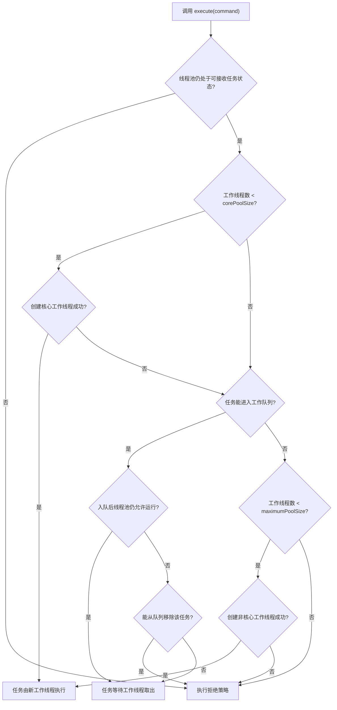

# 3.3.3.5 拒绝策略

拒绝策略是 Java 线程池容量管理中最容易被轻视、也最容易在故障时放大影响的一环。很多人第一次接触 `ThreadPoolExecutor` 时，会把注意力放在线程数、队列类型、线程工厂和任务提交方式上，认为拒绝策略只是线程池“满了以后抛个异常”的补充配置。这个理解太窄。拒绝策略真正回答的是：当执行资源已经无法继续承接新任务，或者线程池生命周期已经不允许接收新任务时，调用方、线程池和业务语义之间应当如何分担损失。

线程池不是无限执行器。它把任务提交、排队、工作线程复用、关闭流程和异常处理封装起来，但它无法让有限 CPU、内存、队列空间、外部连接和下游处理能力变成无限资源。只要任务生产速度可能超过任务消费速度，系统就必须在某个位置承认过载。拒绝策略就是这个承认动作的程序化表达：是立刻失败，还是让调用线程帮忙执行；是丢弃新任务，还是丢弃旧任务；是记录日志、统计指标、触发降级，还是把压力向上游反馈。

本文只讨论通用 Java 技术视角下的线程池拒绝策略，核心对象是 `java.util.concurrent.ThreadPoolExecutor` 及其 `RejectedExecutionHandler`。拒绝策略不应被当作孤立 API 记忆，而要放在线程池完整执行模型中理解：任务什么时候被接收，什么时候进入队列，什么时候创建新工作线程，什么时候被判定为无法接收，拒绝动作在哪个线程中执行，拒绝后调用方能否知道，拒绝任务是否还有机会被补偿。只有把这些问题连起来，才能在真实并发压力下设计出可解释的线程池边界。

## 拒绝策略解决什么问题

线程池最直接的目标是复用线程，避免为每个任务临时创建和销毁线程。但在线程复用之外，线程池还承担容量控制职责。一个典型线程池至少有三个容量维度：当前运行的工作线程数量、等待队列中积压的任务数量、线程池自身是否仍处于可接收任务的运行状态。拒绝策略处理的就是这些容量维度已经不能继续接纳新任务时的结果。

如果没有拒绝策略，线程池过载时通常只剩两种隐式结果。第一种是无限排队：提交方持续把任务放入无界队列，短期看没有失败，长期看延迟越来越高，内存占用越来越大，任务执行时间和任务提交时间的距离越来越远，最终可能出现内存耗尽或大量过期任务。第二种是无限创建线程：提交方持续制造并发执行单元，短期看吞吐似乎提升，长期看线程上下文切换、栈内存、锁竞争和调度开销急剧增加，最终系统整体变慢甚至失去响应。拒绝策略的价值在于把这种隐式失控变成显式决策。

拒绝策略还解决语义一致性问题。不同任务的可丢弃性不同：有的任务表示一次用户请求，失败后调用方必须立刻知道；有的任务只是刷新缓存，丢一次可以接受；有的任务是日志异步落盘，丢弃会影响审计或排障；有的任务是定时采样，旧采样可能不如新采样重要。线程池本身无法理解这些业务差异，所以它只提供几种基础策略和一个扩展接口。真正的设计责任在调用方：必须把任务语义、容量上限和拒绝后果匹配起来。

拒绝策略同时是背压机制的一部分。背压不是某个特定类或方法，而是一种系统设计思想：当下游处理能力不足时，压力不能无限向下游堆积，而要以某种形式反馈给上游，让上游减速、失败、降级、排队到别处或主动丢弃。线程池的拒绝策略是进程内背压边界。它不一定能完成全部限流和保护职责，但它是提交任务这一刻最靠近执行资源的最后一道防线。

## 线程池为什么会拒绝任务

`ThreadPoolExecutor` 拒绝任务不是随机行为，而是由运行状态和容量状态共同决定。理解拒绝策略之前，必须先理解线程池接收任务的大致过程。调用 `execute` 提交任务时，线程池会根据当前工作线程数量、队列状态、最大线程数和运行状态做一系列判断。正常情况下，任务要么被新的工作线程直接执行，要么进入工作队列等待，要么在队列已满且仍可扩容时触发创建非核心工作线程。只有这些路径都无法成立，或者线程池已经不处于可接收新任务的状态，任务才会进入拒绝处理。

第一类拒绝原因是线程池已经关闭或正在关闭。调用 `shutdown` 后，线程池不再接受新任务，但会继续处理已经提交的任务；调用 `shutdownNow` 后，线程池会尝试停止正在执行的任务，并返回尚未开始执行的任务。无论队列是否有空位，只要线程池状态不允许接收新任务，新提交任务都可能被拒绝。这个场景经常出现在生命周期管理混乱的代码中：某个模块提前关闭了共享线程池，另一个模块仍在提交任务；或者服务停止流程已经开始，但后台组件还在产生异步工作。

第二类拒绝原因是运行中的线程池达到容量上限。对有界队列来说，当核心线程已满、队列也满、工作线程数量已经达到 `maximumPoolSize` 时，线程池没有新的承接位置，只能拒绝任务。这里的“满”不是单一指标，而是线程数量和队列容量组合后的结果。一个线程池即使还没有达到最大线程数，也可能因为队列策略不同而表现出完全不同的扩容路径。例如无界队列通常会让任务优先排队，使 `maximumPoolSize` 很难发挥作用；`SynchronousQueue` 不存储任务，提交任务必须直接交给工作线程，否则就会尝试创建新线程或拒绝。

第三类拒绝原因是提交过程中发生了状态竞争。线程池是并发对象，提交线程、工作线程和关闭线程可能同时操作状态。一个任务刚被放入队列后，线程池可能被另一个线程关闭；线程池需要再次检查状态，如果发现不再允许运行，就可能把任务从队列中移除并执行拒绝处理。这就是为什么拒绝不是简单的“队列满才发生”。关闭状态和容量状态都能触发拒绝，而且它们可能在提交过程中的不同阶段变化。

第四类拒绝原因来自队列自身的容量语义。`ThreadPoolExecutor` 使用 `BlockingQueue<Runnable>` 保存等待任务，但 `execute` 提交通常不会无界阻塞等待队列空间，而是调用队列的非阻塞入队操作。对有界队列来说，如果入队失败，线程池会尝试根据最大线程数创建新工作线程；如果创建也失败，才拒绝任务。这种设计使线程池提交路径不会因为队列满而默认挂住调用线程，避免把“排队等待”强行变成提交方阻塞。不过这也意味着，是否阻塞、阻塞多久、是否重试，都不是默认拒绝策略自动完成的事情，需要由调用方或自定义策略明确设计。

下面这个流程图概括了 `execute` 提交任务时和拒绝相关的关键判断。它不是源码逐行翻译，而是帮助理解拒绝触发位置的逻辑模型：



这个流程说明了一个重要事实：拒绝策略不是异常处理的附属品，而是线程池执行算法的正常分支。只要线程池被设计为有边界，就必须承认拒绝可能发生。把拒绝当作“理论上不会发生”的异常，往往会导致更严重的问题：任务无声丢失、调用方等待永远不会完成、监控没有记录、重试形成更大流量、关闭阶段出现难以解释的失败。

## RejectedExecutionHandler 的执行语义

Java 线程池通过 `RejectedExecutionHandler` 表达拒绝处理器。它只有一个方法：

```java
public interface RejectedExecutionHandler {
    void rejectedExecution(Runnable r, ThreadPoolExecutor executor);
}
```

这个接口很小，但语义并不简单。首先，`rejectedExecution` 通常在调用 `execute` 的提交线程中同步执行，而不是在线程池工作线程中异步执行。也就是说，拒绝策略的耗时会直接影响提交方。如果自定义策略里写了慢日志、远程调用、阻塞等待、复杂序列化或同步重试，调用 `execute` 的线程就会被拖住。某些情况下这正是想要的背压效果；另一些情况下则可能让关键调用链被意外阻塞。

其次，拒绝处理器收到的是原始 `Runnable` 和当前 `ThreadPoolExecutor`。处理器可以选择抛异常、执行任务、丢弃任务、重新入队、记录指标、转移到其他执行器或做任何自定义动作。但“可以做”不等于“应该做”。拒绝处理器运行在线程池处于过载或关闭的敏感时刻，它的逻辑越复杂，越容易引入二次故障。例如在拒绝处理器中无条件再次调用同一个线程池的 `execute`，可能立即再次触发拒绝，形成递归或忙等；在关闭状态下尝试重新提交任务，可能违背生命周期边界；在持有业务锁的提交线程中执行任务，可能改变原本的锁顺序。

再次，拒绝策略只处理通过 `execute` 最终进入拒绝分支的任务。`submit` 方法内部也会调用执行机制，但它会把 `Callable` 或 `Runnable` 包装成 `FutureTask`。如果拒绝策略抛出 `RejectedExecutionException`，这个异常会从 `submit` 调用处抛出，而不是被封装进返回的 `Future`，因为拒绝发生在任务被成功提交之前。调用方不能假设“用了 `submit` 就一定拿到一个可观察结果的 `Future`”。提交失败和任务执行失败是两个不同阶段，前者没有进入线程池执行生命周期，后者才会通过 `Future.get` 等方式传播。

最后，拒绝处理器本身必须是线程安全的。多个提交线程可能同时触发拒绝，并并发调用同一个处理器实例。JDK 提供的几个内置策略基本都是无状态对象，因此天然适合共享。自定义策略如果维护计数、最近拒绝时间、熔断状态、备用队列或采样日志状态，就必须使用线程安全结构，或者把状态限制在局部变量中。否则过载时本该保护系统的拒绝策略，反而会成为新的数据竞争点。

## 触发条件与线程池参数的关系

拒绝策略能否触发、何时触发、以什么频率触发，和线程池参数强相关。只讨论拒绝策略类名而不讨论参数组合，是不完整的。

`corePoolSize` 决定线程池倾向于保留的基础工作线程数量。当运行线程数小于核心线程数时，新任务通常会优先触发创建工作线程，而不是排队。这意味着在核心线程未满之前，拒绝一般不会因为队列容量发生。核心线程数设置过小，任务更早进入队列，可能增加排队延迟；设置过大，则可能增加常驻线程成本和资源竞争。拒绝策略看到的是容量已耗尽的结果，但容量耗尽速度由这些参数决定。

`maximumPoolSize` 决定线程池在队列无法接收任务时还能扩展到多少工作线程。它不是总能生效，尤其当使用无界队列时，任务几乎总能入队，线程池通常不会继续扩展到最大线程数。很多配置误区来自同时设置了很大的 `maximumPoolSize` 和无界队列，却以为线程池会自动在高峰期扩容。事实上，在这种组合下，更常见的过载表现不是拒绝，而是无界排队和延迟膨胀。

`workQueue` 是影响拒绝行为的关键。`ArrayBlockingQueue` 有固定容量，边界清晰，满了就会推动扩容或拒绝；`LinkedBlockingQueue` 如果不显式传入容量，默认容量非常大，实践上容易形成近似无界队列；`SynchronousQueue` 不保存任务，每次提交都需要直接移交给工作线程，因此更容易触发线程扩展或拒绝；`PriorityBlockingQueue` 允许按优先级取任务，但通常也是无界队列，可能导致低优先级任务长期等待。队列选择本质上是在吞吐、延迟、内存、任务新鲜度和公平性之间做取舍。

`keepAliveTime` 和是否允许核心线程超时，影响非核心线程回收，也间接影响下一次高峰时的承接能力。如果非核心线程回收很快，突发流量到来时可能需要重新创建线程；如果保留太久，资源占用更高。拒绝策略不直接管理线程回收，但它的触发频率会受到线程池当前工作线程数量影响。

线程池状态则是另一条独立轴。只要线程池进入不接收新任务的状态，即使队列没满、线程数没满，新任务也应该被拒绝。容量参数解决“能不能处理这么多任务”，生命周期状态解决“现在还应不应该接收任务”。这两类拒绝要分开诊断。过载拒绝通常需要调容量、限流或降级；关闭拒绝通常需要检查生命周期、组件依赖和停止顺序。

## 内置策略总览

`ThreadPoolExecutor` 提供四种常见内置拒绝策略：`AbortPolicy`、`CallerRunsPolicy`、`DiscardPolicy` 和 `DiscardOldestPolicy`。它们不是优劣排名，而是四种不同损失模型。

| 策略 | 拒绝后的行为 | 调用方是否知道 | 是否执行任务 | 典型适用倾向 | 主要风险 |
| --- | --- | --- | --- | --- | --- |
| `AbortPolicy` | 抛出 `RejectedExecutionException` | 知道 | 不执行 | 不允许静默丢任务、需要快速失败 | 调用方未捕获时可能中断当前流程 |
| `CallerRunsPolicy` | 由提交任务的线程直接运行任务 | 通常知道提交变慢，但不一定有异常 | 执行，除非线程池已关闭 | 希望形成同步背压、任务可在调用线程运行 | 改变执行线程和延迟模型，可能阻塞关键路径 |
| `DiscardPolicy` | 静默丢弃新任务 | 不知道，除非外部另有记录 | 不执行 | 可丢弃的低价值任务 | 无声数据损失，排障困难 |
| `DiscardOldestPolicy` | 丢弃队列头部旧任务，再重试提交新任务 | 通常不知道旧任务被丢 | 新任务可能执行，旧任务不执行 | 新任务比旧任务更有价值的场景 | 与优先队列、关闭状态或不可丢任务组合风险高 |

这四种策略的区别可以用一个问题来理解：过载时谁承担损失？`AbortPolicy` 让提交方承担显式失败，迫使调用方处理；`CallerRunsPolicy` 让提交方承担执行成本，降低继续提交速度；`DiscardPolicy` 让被拒绝的新任务承担损失；`DiscardOldestPolicy` 让队列中最旧的等待任务承担损失。线程池无法替你判断谁更应该承担损失，这个判断必须来自任务语义。

## AbortPolicy：快速失败

`AbortPolicy` 是 `ThreadPoolExecutor` 的默认拒绝策略。它在拒绝任务时抛出 `RejectedExecutionException`。这个策略的最大优点是明确：任务没有被线程池接收，调用方立刻知道，后续可以记录日志、返回失败、触发降级、停止继续提交或执行补偿逻辑。

快速失败适合那些不能静默丢失的任务。只要任务代表一次必须有结果的操作，或者提交方需要保证“提交成功才算进入异步处理”，`AbortPolicy` 通常是最容易保持语义清晰的选择。它不会伪装成功，也不会改变任务执行线程。失败发生在提交边界，调用栈仍在，调用方可以拿到明确异常。这对排障很重要，因为过载问题如果被吞掉，最后表现出来的可能只是数据缺失、状态不一致或长时间无响应。

但是 `AbortPolicy` 也要求调用方真正处理异常。如果调用方没有捕获 `RejectedExecutionException`，快速失败可能沿调用栈向外传播，打断当前请求或当前调度流程。对库代码而言，直接暴露这个运行时异常是否合适，要看 API 契约。如果上层调用者不知道底层使用线程池，突然收到线程池拒绝异常可能会破坏封装。更稳妥的做法是在线程池边界把异常转换成领域内可理解的失败结果，或者在文档中明确提交可能失败。

还要注意 `AbortPolicy` 不等于系统保护已经完成。抛异常只是让提交方知道失败，后续是否减速、是否降级、是否停止重试，取决于调用方。如果调用方捕获异常后立即无间隔重试，拒绝会变成高频异常风暴，日志和 CPU 都可能被异常构造与堆栈填充消耗。快速失败需要配合限流、退避、熔断或上游返回失败，才能真正降低压力。

示例代码如下：

```java
ThreadPoolExecutor executor = new ThreadPoolExecutor(
        4,
        8,
        60L,
        TimeUnit.SECONDS,
        new ArrayBlockingQueue<>(100),
        Executors.defaultThreadFactory(),
        new ThreadPoolExecutor.AbortPolicy()
);

try {
    executor.execute(task);
} catch (RejectedExecutionException ex) {
    // 提交失败：记录、降级、返回失败或触发补偿，而不是假装任务已经提交。
    recordRejectedTask(task, ex);
    throw ex;
}
```

使用 `AbortPolicy` 时，一个实用原则是：凡是捕获拒绝异常的地方，都要明确回答“这个任务没有执行，系统状态是否仍然一致”。如果任务只是异步优化，失败可以忽略但应有指标；如果任务承担必要状态变更，就必须有同步兜底、补偿队列、事务回滚或可重试记录。拒绝异常本身不会自动维护业务一致性。

## CallerRunsPolicy：让提交方执行

`CallerRunsPolicy` 在任务被拒绝时，不抛异常，也不丢弃任务，而是让调用 `execute` 的线程直接执行该 `Runnable`。如果线程池已经关闭，它会丢弃任务；如果只是容量满了，它会在提交线程中同步运行任务。这个策略的核心价值是背压：线程池越忙，提交方越可能被迫自己执行任务，继续提交新任务的速度自然下降。

这个策略看起来温和，实际影响很深。原本异步提交后立即返回的调用路径，可能突然变成同步执行任务。提交线程的响应时间会增加，线程上下文会改变，任务内部依赖的 `ThreadLocal`、锁、事务边界、超时预算和异常传播路径都可能不同。任务如果假设自己总在线程池工作线程中运行，使用 `CallerRunsPolicy` 就可能暴露隐藏问题。

`CallerRunsPolicy` 适合任务短小、可在提交线程执行、并且调用方可以通过变慢来承受背压的场景。例如生产者线程不断生成可独立处理的小任务，下游线程池满时，让生产者自己处理一部分任务，可以降低生产速度，并避免无声丢弃。它不适合提交线程是延迟敏感线程、持有关键锁的线程或负责调度大量其他任务的线程。否则一次拒绝可能把关键路径拖入长时间执行，导致更大范围阻塞。

还要警惕锁顺序和重入问题。假设提交方在持有某个业务锁时调用 `execute`，原本任务异步执行，不会在当前锁持有期间运行；使用 `CallerRunsPolicy` 后，任务可能在同一线程、同一锁持有期间直接执行。如果任务内部又尝试获取其他锁、等待其他任务、访问本不应在锁内访问的资源，就可能出现死锁、长临界区或顺序变化。拒绝策略改变的不只是任务位置，还改变了并发关系。

示例：

```java
ThreadPoolExecutor executor = new ThreadPoolExecutor(
        4,
        4,
        0L,
        TimeUnit.MILLISECONDS,
        new ArrayBlockingQueue<>(50),
        Executors.defaultThreadFactory(),
        new ThreadPoolExecutor.CallerRunsPolicy()
);

executor.execute(() -> {
    // 过载时，这段代码可能由提交线程直接执行。
    processSmallTask();
});
```

使用这个策略时，任务设计要满足几个条件。第一，任务不应依赖工作线程名称、线程组或线程局部上下文来判断正确性。第二，任务耗时应可控，否则提交方会被长时间阻塞。第三，调用方必须接受 `execute` 调用本身可能包含完整任务执行时间。第四，任务异常会在提交线程中抛出，不再只是工作线程内部问题。只有这些条件成立，`CallerRunsPolicy` 才能成为有效背压，而不是隐藏的延迟炸点。

## DiscardPolicy：静默丢弃新任务

`DiscardPolicy` 在任务被拒绝时什么也不做。新提交的任务不会执行，调用方也不会收到异常。它是四种内置策略中最安静、也最危险的一种。安静并不意味着安全，恰恰相反，静默丢弃会抹掉过载信号，让调用方误以为提交成功。

这个策略只适合明确可丢弃的任务，而且最好还有外部可观测手段。例如某些周期性状态刷新、重复采样、非关键缓存预热、可被下一次任务覆盖的临时计算，在过载时丢弃一次可能比拖垮系统更合理。但即使任务可丢，也不代表应该完全无记录。至少应通过包装策略或外部计数记录丢弃次数，否则当系统长期处于过载状态时，维护者很难知道任务根本没有执行。

`DiscardPolicy` 不适合承载必要状态变更的任务。凡是任务涉及持久化、结算、通知、资源释放、状态推进或任何必须至少执行一次的动作，都不应该静默丢弃。因为静默丢弃没有返回值、没有异常、没有默认日志，调用方可能继续按照“任务已提交”推进流程，最终形成不可恢复的不一致。

示例：

```java
ThreadPoolExecutor executor = new ThreadPoolExecutor(
        2,
        2,
        0L,
        TimeUnit.MILLISECONDS,
        new ArrayBlockingQueue<>(10),
        Executors.defaultThreadFactory(),
        new ThreadPoolExecutor.DiscardPolicy()
);
```

如果确实需要丢弃策略，更常见的改进是自定义一个“可观测丢弃”策略：仍然丢弃任务，但增加计数、采样日志或告警触发。这样可以保留丢弃的低成本，同时不牺牲诊断能力。内置 `DiscardPolicy` 更适合作为语义说明，而不是在重要系统中裸用。

## DiscardOldestPolicy：丢弃最旧等待任务

`DiscardOldestPolicy` 的行为是：当新任务被拒绝时，先从工作队列头部移除一个最旧的等待任务，然后再次尝试提交当前新任务。如果线程池没有关闭，新任务可能因此进入队列或被执行；被移除的旧任务则不会执行。这个策略表达的是“新任务比旧任务更重要”或“旧任务等待太久已经失去价值”的取舍。

它常被误解为一种温和的队列更新策略，但实际使用要非常谨慎。首先，队列头部不一定代表业务意义上的“最应该丢弃”。对普通 FIFO 队列来说，头部是等待时间最长的任务；但对优先级队列来说，头部可能是优先级最高的任务。把 `DiscardOldestPolicy` 和 `PriorityBlockingQueue` 组合，可能会丢掉最重要的任务，和策略名称给人的直觉相反。

其次，旧任务被丢弃时没有默认通知。提交新任务的调用方通常只关心当前任务是否提交成功，却不知道队列中另一个任务已经被牺牲。如果旧任务代表某个独立调用者的必要工作，这就是严重语义破坏。这个策略只有在队列中的任务天然可被更新任务覆盖时才比较合理，例如只关心最新状态、不关心中间状态的刷新类任务。但即便如此，也应尽量让任务合并或去重逻辑显式化，而不是依赖队列头部丢弃的副作用。

再次，`DiscardOldestPolicy` 会再次调用 `execute`。如果线程池仍然无法接收任务，可能继续触发拒绝逻辑。JDK 内置实现会在未关闭时移除队列头任务再重试；如果容量压力持续存在，行为可能比简单丢弃更难推断。自定义类似策略时尤其要避免无界递归、忙等重试和关闭状态下反复提交。

示例：

```java
ThreadPoolExecutor executor = new ThreadPoolExecutor(
        2,
        4,
        30L,
        TimeUnit.SECONDS,
        new ArrayBlockingQueue<>(100),
        Executors.defaultThreadFactory(),
        new ThreadPoolExecutor.DiscardOldestPolicy()
);
```

判断是否能使用这个策略，可以问三个问题：队列头任务被丢弃是否可接受；当前新任务是否确实比旧任务更有价值；旧任务的提交方是否需要知道它未执行。如果任何一个问题答不清楚，就不应使用该策略。很多情况下，更好的设计是使用有界去重队列、按 key 合并任务、只保留最新任务的原子引用，或者在提交前就完成覆盖逻辑。

## 自定义拒绝策略

内置策略覆盖的是基础取舍，真实系统常常需要自定义 `RejectedExecutionHandler`。自定义策略的目标不应是“把拒绝藏起来”，而应是把拒绝转化为符合系统语义的动作。常见需求包括记录指标、采样日志、把任务转交备用执行器、把任务写入持久化补偿队列、按任务类型决定丢弃或失败、触发熔断、阻塞等待有限时间、向调用方返回领域错误等。

最简单的自定义策略是计数加抛异常：

```java
public final class CountingAbortPolicy implements RejectedExecutionHandler {
    private final LongAdder rejectedCount = new LongAdder();

    @Override
    public void rejectedExecution(Runnable task, ThreadPoolExecutor executor) {
        rejectedCount.increment();
        throw new RejectedExecutionException(
                "Task rejected. poolSize=" + executor.getPoolSize()
                        + ", active=" + executor.getActiveCount()
                        + ", queued=" + executor.getQueue().size()
                        + ", completed=" + executor.getCompletedTaskCount());
    }

    public long rejectedCount() {
        return rejectedCount.sum();
    }
}
```

这个策略没有改变失败语义，但增强了可观测性。注意这里使用 `LongAdder` 而不是普通 `long`，因为拒绝可能被多个提交线程并发触发。异常消息中读取的线程池指标只是瞬时快照，不应被当作强一致事实，但足以用于排障定位。

另一种常见需求是有限阻塞提交：线程池满时，让提交线程等待一小段时间尝试把任务放入队列。如果等待成功，任务稍后执行；如果等待超时，再抛异常或降级。

```java
public final class TimedOfferPolicy implements RejectedExecutionHandler {
    private final long timeout;
    private final TimeUnit unit;

    public TimedOfferPolicy(long timeout, TimeUnit unit) {
        this.timeout = timeout;
        this.unit = Objects.requireNonNull(unit);
    }

    @Override
    public void rejectedExecution(Runnable task, ThreadPoolExecutor executor) {
        if (executor.isShutdown()) {
            throw new RejectedExecutionException("Executor has been shut down");
        }
        try {
            if (executor.getQueue().offer(task, timeout, unit)) {
                return;
            }
            throw new RejectedExecutionException("Timed out while offering task to queue");
        } catch (InterruptedException ex) {
            Thread.currentThread().interrupt();
            throw new RejectedExecutionException("Interrupted while offering task to queue", ex);
        }
    }
}
```

这种策略能提供更强背压，但也有明显边界。它绕过了 `ThreadPoolExecutor.execute` 内部的一部分扩容判断，直接操作队列，可能改变原本的线程创建节奏；如果等待时间过长，提交线程会堆积；如果在线程池关闭竞争中成功入队，还需要确认是否有工作线程会继续处理。因此，有限阻塞策略必须谨慎使用，并经过压力测试和关闭流程测试。很多情况下，在调用 `execute` 之前用单独的限流器或信号量控制提交速度，会比在拒绝处理器中阻塞更清晰。

自定义策略还可以按任务类型区分处理。为此通常需要让任务实现某个自定义接口，暴露任务名称、优先级、是否可丢弃、降级方法等元数据。但这种做法会让线程池从通用执行器变成带业务语义的执行边界，应控制复杂度。拒绝处理器不宜包含大量业务分支，否则会变成难以测试和维护的隐藏调度中心。

设计自定义拒绝策略时，应遵守几个原则。第一，策略逻辑要短，避免长时间占用提交线程。第二，策略自身必须线程安全。第三，必须正确处理中断，不能吞掉 `InterruptedException`。第四，不要无条件向同一个线程池递归提交。第五，关闭状态下应尊重生命周期，不要强行接收新任务。第六，拒绝后的语义要让调用方可感知，至少通过异常、返回结果、指标或日志之一体现出来。

## 背压、限流与降级

拒绝策略经常和背压、限流、降级一起出现，但它们不是同一件事。限流通常发生在任务进入系统或进入某个模块之前，目标是控制请求速率或并发数量；背压强调下游压力向上游反馈，目标是让生产速度匹配消费能力；降级是在资源不足或依赖异常时放弃部分功能，保留核心路径；拒绝策略则是线程池提交边界上的最后处理动作。

一个健康的设计通常不会只依赖拒绝策略。因为等到线程池拒绝任务时，说明容量边界已经被触碰，许多任务可能已经在队列中等待。更早的限流可以减少进入线程池的流量；合理的超时可以避免任务长时间占用工作线程；降级可以减少任务生成；监控可以在拒绝频率升高时提前告警。拒绝策略是必要防线，但不是唯一防线。

`CallerRunsPolicy` 是最接近背压语义的内置策略。它让提交方执行任务，从而降低提交速度。但这种背压是粗粒度的：它不区分任务类型，不知道调用方是否能承受阻塞，也不会根据队列长度逐步调节速度。更精细的背压可以使用有界队列、信号量、令牌桶、异步框架中的需求协议、批处理合并或上游动态减速等方式实现。线程池拒绝策略只负责在“已经无法正常接收”时作出最后决策。

降级设计要和任务语义绑定。对查询类任务，降级可能是返回缓存或默认值；对刷新类任务，降级可能是跳过本轮刷新；对异步通知类任务，降级可能是写入补偿存储；对统计类任务，降级可能是采样丢弃。线程池的拒绝策略最多能调用这些降级入口，不能凭空知道降级是否正确。因此，把任务包装成带有 `onRejected` 行为的对象，有时会比在线程池级别写一堆 `instanceof` 更清晰。

重试也要谨慎。拒绝后立即重试通常只会增加压力。合理重试应包含退避、次数上限、超时预算和幂等保证。对于不可幂等任务，盲目重试可能造成重复执行；对于可幂等但高频任务，集中重试可能形成流量尖峰；对于线程池关闭导致的拒绝，重试通常没有意义，应该走生命周期处理。拒绝策略告诉你“现在没有接收成功”，不代表“马上再试一定更好”。

## 监控与可观测性

拒绝策略如果不可观测，就很难运维。线程池过载往往不是从第一次拒绝才开始，而是从队列变长、任务等待时间增加、活跃线程长期接近上限、任务执行耗时变慢开始。拒绝次数是重要指标，但它通常是较晚出现的信号。

基础指标应包括核心线程数、最大线程数、当前线程数、活跃线程数、队列长度、队列剩余容量、已完成任务数、累计提交数、累计拒绝数、任务执行耗时、任务排队耗时和线程池关闭状态。JDK 的 `ThreadPoolExecutor` 提供了一部分瞬时指标，例如 `getPoolSize`、`getActiveCount`、`getQueue().size`、`getCompletedTaskCount`。这些指标不是强一致快照，但足以作为趋势观察。拒绝次数需要通过自定义策略或外层包装记录。

仅有线程池指标还不够。任务级别也应有分类信息。不同任务共用一个线程池时，如果只知道“线程池拒绝了 1000 个任务”，还不够定位问题。更有价值的是知道哪些任务类型被拒绝、拒绝发生在哪些调用路径、拒绝时队列长度和活跃线程数如何、拒绝后的处理结果是什么。任务包装器可以记录提交时间、任务名称和调用来源，在执行前计算排队耗时，在拒绝时输出摘要。

日志要避免两个极端。完全不记录会让拒绝不可见；每次拒绝都打印完整堆栈又可能在高峰期制造日志风暴。实践中常用采样日志、周期聚合、限速日志和指标告警结合的方式：拒绝发生时增加计数，高频拒绝时按时间窗口输出摘要，必要时保留少量样本堆栈。指标用于发现趋势，日志用于定位样本，线程 dump 用于确认工作线程卡在哪里。

监控还应覆盖关闭阶段。很多拒绝并不是容量不足，而是线程池已经关闭。关闭拒绝如果被误判为过载，可能会导致错误扩容；过载拒绝如果被误判为关闭问题，又可能忽略真实容量瓶颈。因此拒绝记录中最好包含 `executor.isShutdown()`、`executor.isTerminating()` 或类似状态信息，以及调用发生的组件生命周期阶段。

## 队列选择对拒绝策略的影响

拒绝策略是最后动作，队列选择则决定任务在到达最后动作前经历什么。队列越大，拒绝越晚发生，但延迟和内存风险越高；队列越小，拒绝越早发生，背压更及时，但高峰缓冲能力更弱。没有一种队列适合所有场景。

有界 FIFO 队列是最常见、也最容易推理的选择。它提供明确上限，能让拒绝策略在容量耗尽时及时触发。队列容量的设置应来自任务耗时、可接受排队延迟和峰值流量估算，而不是随意写一个很大的数。假设任务平均耗时 100 毫秒，4 个工作线程理想情况下每秒处理约 40 个任务；如果队列容量是 400，满队列任务的等待时间可能接近 10 秒。这个延迟是否可接受，比“队列有没有满”更重要。

无界队列会推迟拒绝，但不会消除过载。它把拒绝风险转化为等待时间和内存占用风险。对于生产速度可能持续超过消费速度的场景，无界队列非常危险，因为系统看起来一直在接收任务，直到延迟失控或内存耗尽。无界队列适合任务量有天然上限、提交方数量受控、任务对象很小、延迟不敏感的场景，但即使如此，也应有外部监控。

`SynchronousQueue` 强调直接移交，没有内部缓冲。它适合任务不应排队、希望通过扩展线程数承接突发、或者希望尽早拒绝的场景。使用它时，`maximumPoolSize` 和拒绝策略非常关键，因为队列不给任务提供等待空间。若最大线程数很大，系统可能用大量线程承接压力；若最大线程数较小，拒绝会更早出现。这种组合适合对排队延迟敏感、希望快速反馈容量不足的设计。

优先级队列要特别小心。它改变了任务执行顺序，却通常没有天然容量上限。如果使用无界优先级队列，拒绝策略很难因队列满触发；如果自定义有界优先级队列，又要明确拒绝和淘汰的是低优先级任务还是新任务。内置 `DiscardOldestPolicy` 和优先级队列的组合尤其危险，因为队列头可能是最高优先级任务。

## 与 submit、Future 和异常传播的关系

线程池提交任务有 `execute` 和 `submit` 两类常见入口。`execute` 接收 `Runnable`，没有返回结果；任务内部抛出的运行时异常通常由工作线程的异常处理机制处理，并可能导致工作线程结束后被替换。`submit` 返回 `Future`，任务执行阶段的异常会被封装，调用 `Future.get` 时再抛出 `ExecutionException`。拒绝发生在提交阶段，所以它和任务执行异常不是一回事。

当 `submit` 遇到拒绝时，调用方可能根本拿不到 `Future`。因为任务还没有成功进入线程池，包装出来的 `FutureTask` 也没有执行生命周期可言。此时如果拒绝策略抛异常，异常会直接从 `submit` 抛出。调用方不能只在 `future.get()` 处处理异常，还要在 `submit` 调用处处理提交失败。否则代码会错误地认为所有失败都会通过 `Future` 返回。

`CallerRunsPolicy` 和 `submit` 的组合也值得注意。`submit` 包装任务后调用执行器，如果被拒绝但策略让调用线程执行包装后的 `FutureTask`，那么任务可能在 `submit` 返回前已经执行完成。调用方随后拿到的 `Future` 可能已经是完成状态。这不违反语义，但会改变延迟模型：一个看似异步的 `submit` 调用可能同步耗时很久。

使用 `CompletableFuture` 或其他异步组合工具时，也存在类似边界。只要底层执行器拒绝任务，异步阶段就可能无法调度。不同 API 对拒绝异常的封装方式不同，但根本问题相同：任务未能进入执行器与任务执行失败是两个阶段，错误处理必须覆盖两者。

## 关闭流程中的拒绝

关闭流程是拒绝策略最常见的非过载触发场景之一。`shutdown` 表示有序关闭：不再接收新任务，继续执行已提交任务。`shutdownNow` 表示尝试立即关闭：尝试中断正在执行的工作线程，并返回队列中尚未执行的任务。无论哪种关闭，一旦线程池不再接收新任务，后续提交都应被拒绝。

这带来一个设计要求：线程池的所有权必须清晰。谁创建线程池，谁可以关闭线程池，哪些组件可以提交任务，关闭前是否要先停止任务生产者，这些都要明确。如果多个模块共享一个线程池，却没有统一生命周期管理，就容易出现某个模块关闭线程池后其他模块继续提交任务的情况。此时拒绝策略表现出来的是症状，真正问题是所有权混乱。

关闭阶段还要处理已经被拒绝或尚未执行的任务。对 `shutdownNow` 返回的队列任务，调用方要决定是否记录、补偿、迁移或丢弃。对关闭后新提交的任务，拒绝策略最好能区分“关闭拒绝”和“过载拒绝”。前者通常不应触发扩容或重试，而应修正提交时机；后者才需要容量和背压分析。

任务本身也要遵守取消和中断协议。拒绝策略只能阻止新任务进入线程池，不能让已经运行的任务自动停止。若运行任务长时间不响应中断，线程池关闭就可能拖延。很多系统在关闭时看到拒绝异常，误以为问题在拒绝策略，实际上是生产者未停、消费者未响应中断、关闭顺序不完整共同导致的。

## 常见误区

第一个误区是把拒绝视为“不应该发生”。只要线程池有边界，拒绝就是正常分支。一个从不拒绝的线程池不一定健康，可能只是使用了无界队列，把问题推迟到了延迟和内存层面。正确态度不是消灭拒绝，而是让拒绝可预期、可观测、可处理。

第二个误区是认为调大队列就能解决拒绝。调大队列只能增加缓冲，不能增加处理能力。如果任务消费速度长期低于生产速度，再大的队列都会被填满；即使短期不满，排队时间也可能超过业务可接受范围。容量设计应同时看吞吐、延迟和内存，而不是只看拒绝次数。

第三个误区是盲目使用 `CallerRunsPolicy`。它确实能产生背压，但代价是把任务执行转移到提交线程。提交线程可能是响应关键路径、调度线程、持锁线程或单线程事件循环。让这些线程执行耗时任务，可能比拒绝更糟。使用前必须确认任务可以在调用线程运行，并且调用方能承受同步耗时。

第四个误区是静默丢弃不可丢任务。`DiscardPolicy` 和 `DiscardOldestPolicy` 都可能让任务不执行且调用方不知道。它们只适合明确可丢或可覆盖的任务。对于必要任务，静默丢弃不是降级，而是破坏语义。

第五个误区是在拒绝策略中做复杂阻塞操作。拒绝策略运行在提交线程中，且触发时系统已经处于压力或关闭状态。此时再做远程调用、长时间等待、无界重试或大量日志输出，很容易放大故障。拒绝处理应尽量短小，复杂补偿应交给独立、受控的机制。

第六个误区是忽略 `submit` 的提交失败。很多代码只处理 `Future.get` 的异常，却没有处理 `submit` 本身抛出的 `RejectedExecutionException`。这会漏掉任务根本没有进入执行器的情况。

第七个误区是所有任务共用一个线程池却使用同一种拒绝语义。高价值任务、低价值任务、长任务、短任务、可丢任务、不可丢任务混在一起，会让拒绝策略难以正确选择。必要时应拆分线程池，或者在提交前按任务类型做限流和降级。

## 实践建议

设计线程池拒绝策略时，可以先从任务语义反推，而不是从类名开始选。第一步问任务是否可以丢弃。如果不能丢，优先考虑 `AbortPolicy` 或带补偿记录的自定义策略；如果可以丢，再问是否需要记录丢弃指标。第二步问任务是否可以在提交线程执行。如果可以，且调用方能承受变慢，可以考虑 `CallerRunsPolicy`；如果不可以，就不要为了“避免异常”使用它。第三步问旧任务和新任务谁更重要。如果新任务能覆盖旧任务，才考虑类似 `DiscardOldestPolicy` 的语义，否则不要牺牲队列中其他调用者的任务。

线程池容量应使用有界思维。线程数有上限，队列有上限，等待时间有上限，重试次数有上限，日志输出也应有上限。无界设计会让压力在系统中寻找其他出口，最终通常变成更难控制的问题。拒绝策略不是容量规划的替代品，而是容量规划的一部分。

拒绝处理要和调用方契约一致。如果方法名和文档暗示“提交成功后一定异步处理”，那么拒绝时必须让调用方知道失败。如果方法只是“尽力触发一次刷新”，那么丢弃可以接受，但应有指标。如果方法返回成功给外部调用者，却把必要工作异步提交到可能拒绝的线程池，那么提交失败就必须影响返回结果或产生可靠补偿，否则成功语义就是假的。

建议为重要线程池建立统一包装。包装可以负责线程命名、任务命名、提交计数、拒绝计数、排队耗时、执行耗时、异常记录和关闭管理。这样拒绝策略不需要承担所有观测职责，业务代码也不必在每个提交点重复处理细节。统一包装还能避免线程池被随意关闭或随意共享。

测试也要覆盖拒绝路径。很多项目只测试任务正常执行，却不测试队列满、最大线程满、线程池关闭后提交、拒绝策略并发触发、`CallerRunsPolicy` 同步执行、`submit` 提交失败等场景。拒绝路径不测，等于最关键的容量边界没有验证。可以使用很小的线程数和队列容量构造可重复测试，让任务通过 `CountDownLatch` 暂停，从而稳定触发拒绝。

下面是一个用于测试拒绝的思路示例：

```java
ThreadPoolExecutor executor = new ThreadPoolExecutor(
        1,
        1,
        0L,
        TimeUnit.MILLISECONDS,
        new ArrayBlockingQueue<>(1),
        Executors.defaultThreadFactory(),
        new ThreadPoolExecutor.AbortPolicy()
);

CountDownLatch block = new CountDownLatch(1);
executor.execute(() -> await(block)); // 占住唯一工作线程
executor.execute(() -> doSomething()); // 填满队列

try {
    executor.execute(() -> doSomethingElse()); // 稳定触发拒绝
    throw new AssertionError("Expected rejection");
} catch (RejectedExecutionException expected) {
    // 验证拒绝后的处理逻辑
} finally {
    block.countDown();
    executor.shutdownNow();
}
```

这个测试的重点不是写复杂断言，而是让拒绝成为可重复事件。只有可重复，才能验证调用方是否正确处理提交失败。

## 边界与取舍

拒绝策略无法修复慢任务。如果工作线程被长时间阻塞在 I/O、锁等待或外部依赖上，拒绝策略只能在队列和线程耗尽后处理新任务，不能让已有任务变快。此时更根本的措施是设置超时、拆分线程池、隔离慢依赖、减少锁竞争或优化任务本身。

拒绝策略无法保证任务最终执行。除了 `CallerRunsPolicy` 在未关闭且调用线程执行成功的情况下能让当前任务执行，其他策略都可能让任务不执行。即使自定义策略把任务写入备用队列，也只是转移了承诺，后续仍要有消费、重试、幂等和补偿机制。不要把“拒绝时保存起来”误认为“已经可靠完成”。

拒绝策略也无法自动维护公平性。线程池队列的排队顺序、提交线程竞争、任务耗时差异和策略行为都会影响谁先执行、谁被拒绝、谁被丢弃。如果系统要求强公平或按租户隔离，单个共享线程池加一个全局拒绝策略通常不够，需要分区队列、独立线程池、配额或调度层。

拒绝策略还会影响延迟分布。`AbortPolicy` 让失败延迟很短，但成功任务可能仍在队列中等待；`CallerRunsPolicy` 降低丢弃概率，却把部分请求延迟拉长；`DiscardPolicy` 保持提交很快，但牺牲任务完整性；`DiscardOldestPolicy` 尝试保留新鲜任务，却破坏旧任务承诺。选择策略时不能只看平均吞吐，要看尾延迟、失败率、任务价值和恢复成本。

## 小结

拒绝策略是线程池容量边界和生命周期边界的显式表达。线程池会在关闭后提交、核心线程和队列无法承接、最大线程数也无法继续扩展、或者提交过程与关闭过程竞争时拒绝任务。拒绝不是偶然异常，而是有界并发系统必须面对的正常分支。

`AbortPolicy` 适合需要明确失败的任务，优点是语义清楚，风险是调用方必须处理异常；`CallerRunsPolicy` 适合可由提交线程执行的短任务，优点是形成背压，风险是改变延迟和执行上下文；`DiscardPolicy` 适合明确可丢任务，优点是成本低，风险是无声损失；`DiscardOldestPolicy` 适合新任务能覆盖旧任务的场景，风险是丢弃对象未必符合业务预期。自定义策略可以补充指标、日志、降级和补偿，但必须保持线程安全、尊重中断和生命周期，避免复杂阻塞与无界重试。

设计拒绝策略时，最重要的不是背下四个类名，而是回答清楚几个问题：任务能不能丢，调用方要不要知道，能不能在提交线程执行，旧任务和新任务谁更重要，过载时如何背压，拒绝后如何观测，关闭时谁负责停止生产者。只要这些问题有明确答案，拒绝策略就不再是线程池配置表里的一个参数，而是并发系统可靠性设计的一部分。
