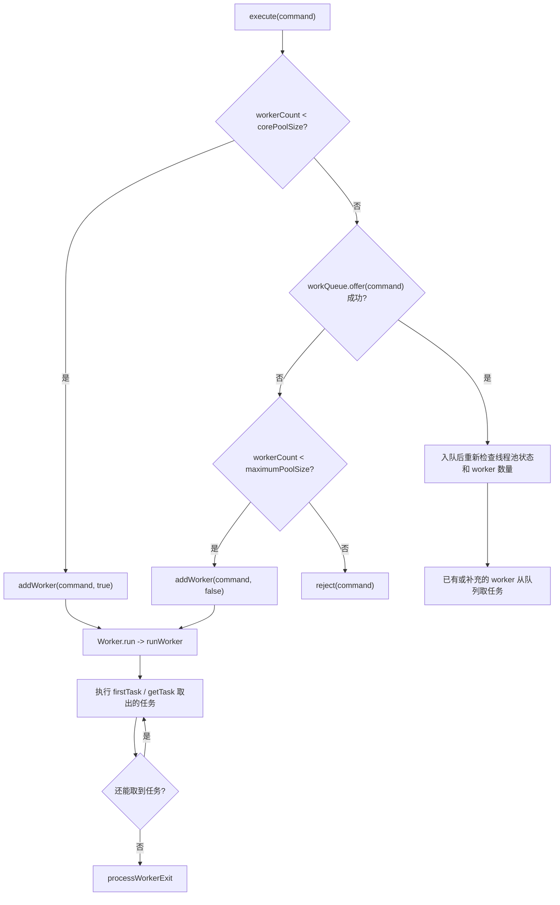

# 3.3.3.7 线程池复用原理

## 文章范围

线程池复用原理讨论的是 Java 线程池如何让一组已经创建并启动的工作线程连续执行多个任务，而不是为每个任务都新建一个线程。这里的“复用”不是复用已经结束的 `Thread` 对象，也不是把某个任务永久绑定到某个固定线程，而是让仍然存活的 worker 线程在一次 `run` 调用中反复从任务队列取出 `Runnable` 并执行。只要工作线程没有退出，它就可以先执行提交时携带的首个任务，再执行后续从队列中取出的任务；当线程池关闭、队列耗尽、空闲超时、线程数需要收缩或任务异常导致工作线程提前死亡时，这个循环才会结束。

本文以 Java 标准库中的 `ThreadPoolExecutor` 为核心对象，围绕 `Worker`、`firstTask`、`runWorker`、`getTask`、`keepAliveTime`、核心线程、非核心线程、阻塞队列和线程回收解释复用链路。不同 Java 版本的源码细节可能有小幅调整，但整体思想长期稳定：线程池通过控制运行状态和工作线程数量，决定任务是直接交给新 worker、放入队列等待、创建非核心 worker 消化队列，还是触发拒绝策略；每个 worker 内部则通过循环取任务来完成复用。

理解线程池复用原理的重点不是背诵某个方法名，而是看清三个问题。第一，任务提交后为什么不一定立刻创建线程，线程池如何在核心线程、队列和最大线程数之间做选择。第二，一个 worker 线程如何在执行完当前任务后继续等待下一个任务，并在等待超时或线程池状态变化时退出。第三，任务异常、关闭线程池、队列阻塞、线程本地状态和容量配置如何影响复用效果。把这三条线连起来，才能解释“为什么线程没有退出”“为什么线程数没有涨到最大值”“为什么任务异常后线程池还能继续工作”“为什么复用线程会带来上下文污染”等常见现象。

## 为什么需要复用线程

直接为每个任务创建一个 `Thread` 的模型很直观：来一个任务，构造线程，启动线程，任务执行完线程结束。这种模型在任务数量很少时可以工作，但在高频任务场景中成本很高。创建线程需要分配线程对象、创建本地线程资源、准备线程栈、通知运行时和操作系统调度；销毁线程也需要回收这些资源。更重要的是，线程数量不受控制时，任务高峰会把压力转移为大量线程竞争 CPU、内存和锁，最终表现为上下文切换增多、响应时间抖动、内存占用上涨甚至资源耗尽。

线程池把问题拆成两部分：线程的生命周期由池统一管理，任务的生命周期由队列和 worker 执行循环管理。线程池先保留一批可工作的线程，让它们在空闲时阻塞等待任务；任务到来后，不再必然创建新线程，而是优先交给已有 worker 或放入队列。这样一来，线程创建成本被摊薄到多个任务上，任务提交方也不需要知道底层到底由哪个线程执行。对调用者来说，提交的是一段待执行逻辑；对线程池来说，真正要维护的是“当前有多少 worker”“哪些 worker 正在运行”“队列里还有多少任务”“空闲 worker 是否应该保留”。

复用线程带来的收益主要有四类。第一是降低线程创建和销毁的频率，尤其适合短任务或中等粒度任务。第二是限制并发度，避免每个任务都变成独立线程后把系统推入过载。第三是通过队列吸收短时间流量波动，让任务按一定策略等待。第四是集中管理关闭、中断、异常、命名、统计和拒绝策略。线程池不是为了让任务“更神奇地并行”，而是为了用可控数量的执行资源处理可能更多的任务。

复用也有边界。线程池只能复用线程，不能自动消除任务内部的阻塞、死锁或共享状态竞争；线程数配置不合理时，复用反而会让任务在队列中等待更久；任务执行后留下的 `ThreadLocal`、线程上下文类加载器、线程名临时修改、未关闭资源等状态，可能污染同一 worker 后续执行的任务。因此，理解复用原理必须同时理解收益和代价：复用减少了线程生命周期成本，却要求任务明确清理自己附着在线程上的上下文。

## ThreadPoolExecutor 的关键结构

`ThreadPoolExecutor` 的复用逻辑建立在几个核心结构之上。第一个是线程池状态和工作线程数量。典型实现把运行状态和 worker 数量合并进一个原子整数 `ctl` 中，高位表示线程池运行状态，低位表示当前 worker 数量。这样做的目的不是为了炫技，而是让“状态是否允许接收任务”和“worker 数量是否还能增加”这两个判断可以在并发提交时保持一致。线程池状态大致包括运行中、关闭中、停止中、整理中和终止。运行中可以接收新任务；关闭后不再接收新任务，但通常会处理队列中已有任务；停止阶段会尽量中断正在执行的 worker 并丢弃队列任务。

第二个是任务队列 `workQueue`。它通常是一个 `BlockingQueue<Runnable>`，负责保存尚未被 worker 执行的任务。队列的选择会直接改变复用行为：无界队列倾向于让任务排队，线程数通常不会超过核心线程数；有界队列在满时迫使线程池考虑创建非核心 worker 或拒绝任务；直接移交队列没有实际容量，提交任务必须与 worker 获取任务配对；优先级队列会改变任务执行顺序。线程池复用不是只由线程数决定，队列策略同样是核心变量。

第三个是 `Worker`。在典型源码中，`Worker` 既实现 `Runnable`，又持有真正的 `Thread` 引用和首个任务 `firstTask`。提交任务时，如果线程池决定新增 worker，会把任务作为 `firstTask` 放进 worker，然后通过 `ThreadFactory` 创建一个以 worker 为执行体的线程。线程启动后，调用的是 worker 的 `run`，再进入线程池的 `runWorker` 方法。换句话说，用户提交的任务不是直接成为线程的最外层 `run`，真正在线程上运行的外层循环是 worker；用户任务只是这个循环里的一次执行单元。

第四个是 `mainLock` 和 `workers` 集合。线程池需要维护当前有哪些 worker、最大线程数曾经达到多少、关闭时要中断哪些线程等信息。这些结构通常由锁保护，因为它们不是单个原子计数能够完整表达的状态。`ctl` 负责高频的状态和数量判断，锁负责保护 worker 集合这类复合结构。理解这一点可以避免一个误区：线程池内部既使用 CAS，也使用锁，并不是所有并发控制都靠一个原子变量完成。

可以把这些结构的关系概括为：提交方调用 `execute`，线程池根据 `ctl`、核心线程数、队列状态和最大线程数决定任务去向；worker 线程启动后进入 `runWorker`；`runWorker` 先执行首任务，然后反复调用 `getTask` 从 `workQueue` 取任务；`getTask` 根据线程池状态、队列是否为空、是否允许超时和当前 worker 数量决定继续等待、返回任务或返回 `null`；当 `runWorker` 拿到 `null` 时循环结束，worker 退出并进入清理流程。



这张流程图只表达主干，实际源码还会处理并发关闭、入队后复查、启动失败回滚、异常退出补充 worker 等细节。主干已经足够说明复用的关键：任务提交阶段不等于任务执行阶段，worker 的生命周期也不等于单个任务的生命周期。

## execute 如何把任务送入复用链路

`execute` 是理解线程池复用的入口。它不是简单地“把任务放进队列”，而是分三步处理。第一步，如果当前 worker 数量小于 `corePoolSize`，线程池会尝试创建核心 worker，并把当前任务作为这个 worker 的 `firstTask`。这时任务不需要先进入队列，worker 启动后会立即执行它。第二步，如果核心 worker 数量已经达到目标，并且线程池仍处于运行状态，线程池会尝试把任务放入队列。入队成功后还要重新检查线程池状态，因为入队和关闭可能并发发生；如果入队后发现线程池已经不再接收任务，就需要把任务移出队列并拒绝，或者在没有 worker 时补充一个 worker 去清空队列。第三步，如果入队失败，说明队列无法接收当前任务，线程池才尝试创建非核心 worker；如果 worker 数量已经达到 `maximumPoolSize`，就执行拒绝策略。

这三步解释了一个很常见的问题：为什么设置了很大的 `maximumPoolSize`，线程数却一直停在核心线程数附近。原因通常是队列没有满。对于无界队列，只要入队总能成功，线程池就没有机会走到创建非核心 worker 的分支；最大线程数在这种配置下几乎不会发挥作用。反过来，如果使用容量很小的有界队列，任务高峰时入队很快失败，线程池就会更早创建非核心 worker，直到最大线程数或拒绝策略生效。

`firstTask` 的存在也很重要。新增 worker 时，如果总是先把任务放入队列，再启动 worker 去队列取，会多一次队列操作，并且在并发关闭和竞争下更难表达“这个 worker 就是为当前任务创建的”。`firstTask` 让新 worker 可以直接执行触发它创建的任务，然后再进入队列循环。这仍然是复用的一部分，因为 `firstTask` 只是该 worker 执行的第一个任务；执行完之后，worker 并不会结束，而是继续调用 `getTask` 寻找后续任务。

简化后的提交逻辑可以写成下面这种形态：

```java
void execute(Runnable command) {
    if (workerCount() < corePoolSize && addWorker(command, true)) {
        return;
    }

    if (isRunning() && workQueue.offer(command)) {
        recheckAfterEnqueue(command);
        return;
    }

    if (!addWorker(command, false)) {
        reject(command);
    }
}
```

这段伪代码省略了大量并发细节，但保留了决策顺序。线程池复用的第一层含义正在这里体现：线程池优先让核心 worker 存活并持续消费队列，而不是每次提交都创建线程；只有队列压力和配置共同要求时，才扩展到非核心 worker。

## Worker 不是用户任务本身

很多线程池误解来自把 worker 和用户任务混为一谈。用户提交的是 `Runnable` 或 `Callable`，它描述一次业务计算；worker 是线程池内部的工作单元，它描述一个可复用执行循环。一个 worker 持有一个 `Thread`，这个线程的最外层任务是 worker 自己。用户任务只是在 worker 循环中被调用的对象。只要这一层关系没有看清，就容易误以为“任务执行完线程就应该结束”，或者误以为“同一个线程执行多个任务是因为 Thread 对象被重新 start 了”。

Java 线程对象不能被重复启动。一个 `Thread` 的 `start` 只能调用一次，线程终止后不能重新进入可运行状态。线程池复用不是重启已经结束的线程，而是让线程不结束。worker 线程启动后进入一个循环，在循环内部执行多个任务；当任务执行完，调用栈从用户任务返回到 `runWorker`，而不是返回到线程终止点。只有 `runWorker` 的循环结束，worker 的 `run` 方法才返回，底层线程才真正走向终止。

这也是为什么任务之间会共享同一个线程上的本地状态。线程对象、线程名、优先级、守护状态、上下文类加载器、`ThreadLocal` 存储等都属于线程维度，不属于单个任务维度。线程池不会在每个任务开始前自动重建线程，也不会在每个任务结束后自动清空所有线程本地变量。线程池最多提供 `beforeExecute`、`afterExecute`、包装任务、定制 `ThreadFactory` 等扩展点，真正的上下文清理仍然需要任务框架或业务代码明确完成。

`Worker` 自身通常还承担一个轻量同步角色。典型实现中，`Worker` 继承自 `AbstractQueuedSynchronizer`，用来表示当前 worker 是否正在执行任务。线程池关闭或中断空闲线程时，需要区分“正在执行任务的 worker”和“空闲等待任务的 worker”。如果 worker 正在运行用户任务，线程池不能随意把内部状态当作空闲状态处理；如果 worker 空闲阻塞在队列获取上，中断它可以让它从阻塞中醒来并检查线程池状态。这种设计说明 worker 不只是一个简单的 `Runnable` 包装器，它也是线程池生命周期管理的一部分。

## runWorker 的循环结构

`runWorker` 是线程复用最核心的方法。它运行在 worker 持有的线程中，逻辑可以概括为：取出 `firstTask`，清空 worker 的首任务字段，允许当前 worker 被中断控制；然后进入循环，只要当前已有任务不为空，或者能通过 `getTask` 取到下一个任务，就执行任务；每次执行前后调用扩展钩子，捕获异常并维护统计；循环结束后进入 worker 退出处理。

简化后的形态如下：

```java
final void runWorker(Worker w) {
    Thread wt = Thread.currentThread();
    Runnable task = w.firstTask;
    w.firstTask = null;
    boolean completedAbruptly = true;
    try {
        while (task != null || (task = getTask()) != null) {
            w.lock();
            try {
                beforeExecute(wt, task);
                task.run();
                afterExecute(task, null);
            } finally {
                task = null;
                w.completedTasks++;
                w.unlock();
            }
        }
        completedAbruptly = false;
    } finally {
        processWorkerExit(w, completedAbruptly);
    }
}
```

真实源码对异常处理更细，因为 `task.run()` 可能抛出 `RuntimeException`、`Error` 或其他非受检异常，`beforeExecute` 和 `afterExecute` 也可能抛异常。这里的重点是 `while (task != null || (task = getTask()) != null)`。第一次循环通常执行 `firstTask`；后续循环中，`task` 已经被置空，worker 就调用 `getTask`。如果 `getTask` 返回一个任务，循环继续；如果返回 `null`，说明线程池认为该 worker 应该退出。

这行循环体现了复用的真实边界。worker 不关心下一个任务来自哪个提交方，也不关心它和上一个任务是否属于同一业务请求；它只负责从线程池队列取出一个 `Runnable` 并调用 `run`。任务之间没有自动隔离层，除了线程池在执行前后提供的钩子和 Java 语言本身的调用栈清理。局部变量会随一次 `run` 返回而释放，但线程级状态不会自动重置；捕获在任务对象中的引用也会按普通对象生命周期处理。

`runWorker` 还有一个容易被忽略的细节：任务异常通常会导致当前 worker 结束，而不是在同一个 worker 中继续执行下一个任务。典型实现中，如果 `task.run()` 抛出未捕获异常，异常会穿过循环，使 `completedAbruptly` 保持为 `true`，随后进入 `processWorkerExit`。这个 worker 线程会终止，线程池再根据状态和队列情况决定是否补充新的 worker。这样做的好处是避免一个已经被严重异常打断的执行路径继续复用同一线程；代价是异常任务会消耗一个 worker 生命周期。因此，后台任务不应该让重要异常静默丢失，也不应该依赖“线程池会吞掉所有异常后原线程继续工作”。

`beforeExecute` 和 `afterExecute` 则是观察和清理的关键扩展点。它们可以用于记录耗时、统计任务类型、清理线程上下文或统一处理异常信息。但钩子本身也运行在 worker 线程中，不能写成长期阻塞逻辑，否则会占用 worker 并影响后续任务。`afterExecute` 对通过 `submit` 包装成 `FutureTask` 的任务还有一个常见细节：任务内部异常可能被保存到 `Future` 中，而不是直接作为 `Throwable` 参数传入 `afterExecute`。诊断线程池任务异常时，需要区分 `execute` 直接提交的 `Runnable` 和 `submit` 包装后的任务。

## getTask 如何决定等待还是退出

如果说 `runWorker` 负责“循环执行”，那么 `getTask` 负责“循环是否还能继续”。它的职责不是简单地调用 `workQueue.take()`，而是根据线程池状态、worker 数量、队列状态、是否允许核心线程超时、当前获取是否已经超时等条件，决定返回任务、继续等待或返回 `null` 让 worker 退出。

`getTask` 最核心的分支可以概括为几类。第一，如果线程池已经进入停止类状态，或者线程池已经关闭且队列为空，那么当前 worker 不应该继续执行任务，`getTask` 会减少 worker 计数并返回 `null`。第二，如果当前 worker 数量超过最大线程数，或者当前 worker 可以超时并且已经等待超时，同时队列为空或还有其他 worker 可以处理，那么 `getTask` 会尝试减少 worker 计数并返回 `null`。第三，如果 worker 仍应该保留，就根据是否需要计时等待选择 `poll(keepAliveTime)` 或 `take()`。`poll` 会在超时后返回 `null`，从而给线程池一个回收空闲 worker 的机会；`take` 会一直阻塞，直到队列中出现任务或线程被中断。

简化伪代码如下：

```java
Runnable getTask() {
    boolean timedOut = false;
    for (;;) {
        int c = ctl.get();
        int rs = runStateOf(c);

        if (shouldStopTakingTasks(rs) || shouldExitWhenShutdownAndQueueEmpty(rs)) {
            decrementWorkerCount();
            return null;
        }

        int wc = workerCountOf(c);
        boolean timed = allowCoreThreadTimeOut || wc > corePoolSize;

        if (shouldShrink(wc, timed, timedOut) && compareAndDecrementWorkerCount(c)) {
            return null;
        }

        try {
            Runnable r = timed
                    ? workQueue.poll(keepAliveTime, TimeUnit.NANOSECONDS)
                    : workQueue.take();
            if (r != null) {
                return r;
            }
            timedOut = true;
        } catch (InterruptedException e) {
            timedOut = false;
        }
    }
}
```

这段伪代码说明了几个关键事实。第一，核心线程默认通常不会因为空闲而退出，因为当 `wc <= corePoolSize` 且没有开启核心线程超时时，`timed` 为假，worker 会调用 `take()` 无限期等待队列任务。第二，非核心线程通常会因为空闲超过 `keepAliveTime` 而退出，因为当 `wc > corePoolSize` 时，`timed` 为真，worker 调用 `poll` 限时等待。第三，`allowCoreThreadTimeOut(true)` 会改变核心线程行为，让核心线程也使用限时等待，空闲过久后可以回收。第四，`getTask` 返回 `null` 是 worker 正常退出的信号，不一定代表异常，也不一定代表线程池完全终止。

`getTask` 中的中断处理也很有意义。阻塞在 `take` 或 `poll` 上的 worker 可能因为线程池状态变化而被中断。捕获 `InterruptedException` 后，典型逻辑不会立刻把 worker 结束，而是清除本次超时标记，重新检查线程池状态。这样可以避免把普通中断和真正的退出条件混为一谈。中断在这里更像是一个唤醒手段：让正在阻塞等待队列的 worker 回到循环顶部，重新读取线程池状态并决定下一步。

## 核心线程、非核心线程与 keepAliveTime

线程池中的核心线程和非核心线程不是两种不同的 Java 线程类型，而是线程池根据数量阈值赋予 worker 的管理意义。当前 worker 数量小于等于 `corePoolSize` 的部分通常被视为核心容量，超过 `corePoolSize` 的部分通常被视为非核心容量。核心线程默认更稳定，空闲时阻塞等待任务；非核心线程更像应对突发压力的临时扩容，空闲超过 `keepAliveTime` 后会被回收。

`keepAliveTime` 控制的是空闲 worker 等待新任务的最长时间，而不是任务最大执行时间。一个任务运行很久，不会因为超过 `keepAliveTime` 被线程池自动停止；`keepAliveTime` 只在 worker 没有当前任务、正在队列上等待下一个任务时发挥作用。这个边界非常重要。很多人看到“存活时间”会误以为它限制任务执行时长，实际它限制的是空闲等待时长。任务执行超时需要由任务自身、`Future.get(timeout)`、取消协议、外部超时控制或其他调度机制处理。

默认情况下，核心 worker 空闲后调用 `workQueue.take()`，会一直等待，直到队列出现任务或线程被中断。因此，一个配置了 `corePoolSize = 10` 的线程池，即使长时间没有任务，也可能保留十个工作线程。这是为了让后续任务到来时不必重新创建核心线程。如果调用 `allowCoreThreadTimeOut(true)`，核心 worker 也会使用 `poll(keepAliveTime)`，空闲超时后退出。这样可以降低长期空闲时的资源占用，但下一波任务到来时需要重新创建 worker，响应和抖动可能发生变化。

非核心 worker 的回收依赖两个条件：它处于空闲取任务阶段，并且限时等待没有拿到任务。只要队列中持续有任务，非核心 worker 就会不断取任务执行，不会因为自己是“非核心”而执行一段时间后自动退出。换句话说，非核心线程不是临时执行一个任务的线程，而是在线程池压力高于核心容量时增加的 worker；只要任务流不断，它同样可以复用执行多个任务。它和核心 worker 的主要区别体现在空闲等待策略上。

还要注意 `corePoolSize` 和 `maximumPoolSize` 不是实时强制分组。线程池不会给某个具体 worker 贴上永久的“核心”标签，然后保证它永不退出。`getTask` 判断的是当前 worker 总数和配置阈值。当线程数超过核心数时，任何处于空闲等待的 worker 都可能因为超时和 CAS 竞争成功而退出；退出后剩余数量回落到核心附近。由此可见，核心和非核心更像容量区间，而不是 worker 身份。

下面的表格可以帮助区分几个常见配置的复用表现：

| 配置组合 | 空闲等待方式 | 复用表现 | 常见风险 |
| --- | --- | --- | --- |
| 固定核心数、无界队列 | 核心 worker 长期 `take` 等待 | 线程数稳定，任务主要排队复用核心 worker | 队列可能堆积，最大线程数难以生效 |
| 小队列、较大最大线程数 | 核心满后队列先缓冲，队列满后扩容 | 高峰时创建非核心 worker，空闲后回收 | 参数过激会造成频繁扩缩容或拒绝 |
| 允许核心线程超时 | 核心 worker 也使用限时 `poll` | 空闲期线程数可降到更低 | 冷启动任务可能重新建线程 |
| 直接移交队列 | 提交通常需要 worker 立即接手 | 适合任务不应堆积、需要直接交付的场景 | 最大线程数和拒绝策略压力更明显 |

## 队列阻塞如何支撑复用

复用能够成立，是因为 worker 在没有任务时不会忙等，而是阻塞在队列上。`BlockingQueue` 提供了阻塞获取能力：`take()` 在队列为空时挂起当前线程，直到有任务入队；带超时的 `poll` 在队列为空时最多等待指定时间，超时后返回 `null`。这让空闲 worker 可以低成本等待任务，而不是用循环反复检查队列消耗 CPU。

当提交方把任务放入队列时，队列内部会唤醒等待中的消费者 worker。被唤醒的 worker 不等于立刻获得 CPU，它只是从等待队列转为有机会继续运行；真正何时执行还取决于调度。对线程池来说，这已经足够，因为同步语义由阻塞队列保证：入队前对任务对象的安全发布、队列内部锁或原子操作、出队后的可见性，都由并发队列实现承担。调用者不需要额外用 `volatile` 标记“队列里有任务”，worker 也不需要自己写等待通知逻辑。

不同队列会改变等待和唤醒的形态。`LinkedBlockingQueue` 可以配置容量，默认构造时容量很大，容易形成长队列；`ArrayBlockingQueue` 容量固定，适合更明确地限制积压；`SynchronousQueue` 不保存任务，提交和获取必须配对，线程池在核心线程忙碌后更倾向于扩容；`PriorityBlockingQueue` 根据优先级排序，但如果不限制容量，也可能让最大线程数不容易触发。队列不是线程池的附属细节，而是复用策略的一半。

队列阻塞还解释了线程 dump 中常见的状态。空闲 worker 可能处于 `WAITING` 或 `TIMED_WAITING`，调用栈停在队列的 `take` 或 `poll` 上。这通常不是死锁，而是线程池正常等待任务。判断是否异常，要结合线程池状态、队列长度、活跃线程数和业务预期。如果队列很长而 worker 仍然大量空闲，才需要怀疑任务是否没有正确入队、队列类型是否不符合预期、线程池是否已经关闭、worker 是否被异常打断或拒绝策略是否在生效。

## 线程回收的完整路径

worker 退出通常有三类路径：正常空闲回收、线程池关闭回收、异常突然退出。正常空闲回收由 `getTask` 返回 `null` 触发，常见于非核心 worker 空闲超过 `keepAliveTime`，或者允许核心线程超时后核心 worker 也空闲过久。线程池关闭回收则由运行状态变化触发：`shutdown` 后不再接收新任务，但会尽量执行队列中已有任务；当队列清空后，worker 再调用 `getTask` 会得到退出信号。`shutdownNow` 更激进，会尝试中断正在执行或等待的 worker，并返回尚未执行的队列任务。

异常突然退出发生在用户任务或钩子抛出未捕获异常时。此时 worker 循环没有走到 `getTask` 返回 `null` 的正常路径，而是带着 `completedAbruptly = true` 进入 `processWorkerExit`。线程池会从 worker 集合中移除当前 worker，累计完成任务数，减少 worker 计数，并根据状态决定是否尝试补充 worker。这个清理流程保证了线程池内部统计不会因为一个 worker 异常死亡而永久错误，也保证了在仍需要处理队列任务时有机会创建替代 worker。

`processWorkerExit` 的补充逻辑很关键。假设线程池仍在运行，队列里还有任务，某个 worker 因任务异常终止。如果线程池什么都不做，队列中的任务可能无人处理，尤其在 worker 数量本来就很少时更明显。因此线程池会根据当前状态、核心线程超时配置、队列是否为空和最小需要的 worker 数量，判断是否调用 `addWorker(null, false)` 补充一个没有 `firstTask` 的 worker。这个新 worker 启动后会直接进入 `getTask`，从队列中取任务继续执行。

补充 worker 并不表示异常任务会被自动重试。异常任务本身已经失败，如果它是通过 `execute` 提交，异常通常会到达线程的未捕获异常处理链路；如果它是通过 `submit` 提交，异常通常记录在 `Future` 中，调用 `get` 时再以 `ExecutionException` 暴露。线程池补充的是执行能力，不是业务补偿。是否重试、是否幂等、是否记录失败、是否告警，仍然是任务层或调用层的责任。

线程回收还会受关闭流程影响。`shutdown` 不是立即杀死 worker，而是让线程池进入不再接收新任务的状态，并中断空闲 worker 以便它们醒来检查状态。正在运行任务的 worker 通常不会被强制停止，除非任务自己响应中断或后续使用更激进的关闭方式。`shutdownNow` 会尝试中断所有 worker，但中断不是强制终止；如果任务忽略中断、卡在不可中断 I/O 或持有锁长期不释放，线程仍可能无法及时退出。线程池复用原理能解释线程为什么应当退出，但不能保证用户任务一定配合退出。

## 异常后为什么还能继续处理任务

线程池能够在任务异常后继续处理后续任务，靠的不是“同一个线程吞掉异常后继续循环”，而是 worker 退出清理和必要时补充 worker。这个区别很重要。对于直接通过 `execute` 提交的 `Runnable`，如果 `run` 抛出未捕获的运行时异常，当前 worker 通常会终止。线程池观察到这是突然退出，并在需要时补充新 worker。后续任务由其他仍存活的 worker 或新补充的 worker 执行。

对于通过 `submit` 提交的任务，情况看起来不同。`submit` 会把 `Runnable` 或 `Callable` 包装成 `FutureTask`，`FutureTask.run` 会捕获任务抛出的异常并保存到内部状态，然后把任务标记为完成。对 worker 来说，外层的 `FutureTask.run` 通常没有继续向外抛异常，因此 worker 可以继续执行下一轮循环。调用者在 `Future.get` 时才看到异常。这就是为什么有时任务异常不会让线程池线程退出，有时会看到 worker 线程结束：关键不在于线程池是否“稳定”，而在于异常是否逃出了 worker 正在执行的外层 `Runnable.run`。

这一区别影响诊断方式。如果使用 `execute`，可以通过线程的未捕获异常处理器、日志和 `afterExecute` 观察异常；如果使用 `submit`，只看工作线程日志可能看不到异常，必须检查返回的 `Future`，或者在 `afterExecute` 中识别 `Future` 并调用相应方法提取异常。很多“线程池吞异常”的说法都源自没有区分这两种提交方式。线程池没有让异常消失，只是异常传播路径不同。

异常还会影响复用质量。频繁抛出未捕获异常会导致 worker 反复退出和补充，增加线程创建销毁成本，并让线程名、统计和监控表现为波动。更严重的是，如果异常发生在持有业务锁、占用许可、设置 `ThreadLocal` 或修改共享状态之后，而任务没有在 `finally` 中清理，就会把破坏性影响留给其他线程或后续任务。因此，线程池任务内部仍然应该用普通并发代码的纪律处理异常：该释放的资源放在 `finally`，该恢复的中断语义要恢复，该记录的根因要记录，该传递给调用者的失败要通过明确渠道传递。

## 复用带来的上下文问题

线程池复用最容易被低估的副作用是线程本地上下文会跨任务存在。`ThreadLocal` 的生命周期和线程绑定，不和任务绑定。任务 A 在线程 T 中设置了某个 `ThreadLocal`，如果没有调用 `remove`，线程 T 后续执行任务 B 时仍可能读到任务 A 留下的值。这个问题在单次测试中不一定出现，因为任务 B 未必刚好复用同一个线程；但在线程池长期运行后，它会变成典型的偶发污染。

除了 `ThreadLocal`，还有其他线程级状态需要谨慎处理。任务临时修改线程名后没有恢复，会让后续日志误判执行来源；修改线程上下文类加载器后没有恢复，可能影响后续反射或资源加载；使用可继承线程本地变量时，线程池线程创建时继承的值可能长期保留，不会随着提交方变化自动更新；任务持有的本地缓冲区、缓存对象或外部连接如果挂在线程维度，也可能跨任务泄漏。复用让线程变成长期容器，任何放进线程容器的状态都必须有清理策略。

清理上下文有几种常见做法。最直接的是任务自己在 `try/finally` 中清理：设置上下文后，无论成功还是失败都恢复旧值或删除。更集中的做法是对提交的任务进行包装，在包装层统一设置和清理上下文。再进一步，可以继承 `ThreadPoolExecutor` 并重写 `beforeExecute`、`afterExecute`，但这种方式要注意异常路径和 `submit` 包装差异。无论采用哪种方式，原则都是一致的：任务开始前建立它需要的上下文，任务结束后恢复 worker 到可复用的干净状态。

资源清理同样重要。线程池复用不意味着每个任务可以把资源交给线程池自动释放。文件句柄、网络连接、数据库连接、锁、信号量许可、临时文件、缓冲区引用等都应由任务或资源管理层明确关闭或归还。如果资源被保存在 `ThreadLocal` 中，还要考虑线程长期不退出导致资源长期占用；如果允许核心线程超时，线程退出时资源又可能以另一种方式暴露生命周期问题。复用线程提高效率，但它不会替代资源所有权设计。

## 复用的收益与边界

线程池复用的收益建立在任务相对独立、执行时间可控、阻塞比例可估计、队列容量有边界、任务能正确处理异常和清理上下文这些前提上。当任务足够短且数量较多时，复用可以显著降低线程生命周期开销；当任务有一定阻塞但阻塞时间可控时，线程池可以通过配置适当并发度提高资源利用率；当任务来源有短暂峰值时，队列可以平滑压力，worker 持续消费任务。

但复用不是越多越好。线程数过少会让任务长期排队，尤其是任务内部还会等待同一线程池中其他任务完成时，可能造成线程饥饿死锁。线程数过多会增加上下文切换和资源竞争，降低吞吐并扩大延迟。队列过长会把过载隐藏起来，让提交方很快返回，但真实处理时间不断变差；队列过短又可能在短峰值下频繁扩容或拒绝。`keepAliveTime` 过短可能导致非核心 worker 频繁创建和销毁；过长则可能让高峰后的临时线程占用资源太久。

复用也不能突破任务本身的依赖关系。如果所有任务都竞争同一把锁，增加 worker 只能让更多线程阻塞在锁上；如果任务主要等待外部系统，线程池只能调节等待并发，不能让外部系统更快；如果任务需要严格顺序执行，多线程复用反而可能破坏顺序；如果任务不是线程安全的，把它们放进线程池只会更快暴露数据竞争。线程池解决的是执行资源复用和调度问题，不自动解决业务状态一致性问题。

还有一个边界是可取消性。线程池可以中断 worker，但不能强制一个普通 Java 任务在任意位置安全停止。任务要想可取消，必须定期检查中断标志或共享取消状态，在阻塞调用中使用支持中断或超时的 API，并在退出时释放资源。否则，即使线程池已经进入关闭流程，worker 仍可能因为任务不响应取消而长期占用。复用线程越长期运行，越需要任务遵守取消和清理协议。

## 常见误区

第一个误区是认为线程池复用了 `Thread.start`。实际上 `Thread.start` 不能重复调用，线程池复用的是尚未结束的工作线程。worker 的外层 `run` 没有返回，所以底层线程仍然活着；用户任务只是这个外层循环的一次调用。任务完成不等于线程完成，只有 worker 循环结束才意味着线程将终止。

第二个误区是认为 `maximumPoolSize` 总会限制或提升并发。`maximumPoolSize` 只有在核心 worker 已满、队列无法接收任务时才会成为扩容上限。如果使用无界队列，任务会持续入队，线程数通常不会增长到最大值。想让最大线程数发挥作用，需要同时考虑队列容量和提交压力，而不是只调整一个参数。

第三个误区是把 `keepAliveTime` 当成任务超时时间。它只控制空闲 worker 等待下一个任务的时间，不控制任务执行时长。任务运行中即使持续几个小时，只要没有返回到 `getTask`，`keepAliveTime` 就不会让它退出。任务级超时必须由任务逻辑、`Future`、取消协议或外部调度实现。

第四个误区是认为核心线程永不退出。默认情况下核心 worker 空闲会长期等待，但如果开启了核心线程超时，它们也可以被回收。即使没有开启核心线程超时，线程池关闭、任务异常、线程工厂创建异常、运行时错误等也可能改变 worker 生命周期。核心线程是容量策略，不是绝对生存承诺。

第五个误区是认为线程池会自动清理任务上下文。线程池会把 worker 留下来复用，这恰恰意味着线程本地状态可能留下。`ThreadLocal`、线程名、上下文类加载器、可继承线程本地变量和挂在线程上的缓存都需要明确清理。复用线程的效率收益和上下文污染风险是一体两面。

第六个误区是认为任务异常会让整个线程池停止。通常情况下，一个任务异常最多导致当前 worker 结束，线程池会移除它，并在需要时补充新的 worker。线程池是否继续处理任务，取决于池状态、队列、worker 数量和异常传播方式。真正危险的不是“线程池马上停止”，而是异常没有被观察、资源没有释放、worker 频繁死亡或队列中任务长期无人处理。

第七个误区是认为线程池提供任务之间的内存隔离。线程池保证任务由某个线程执行，队列和同步结构保证提交与获取之间的必要可见性，但任务内部访问的共享对象仍然要自己保证线程安全。多个任务同时修改同一个非线程安全对象，仍然会产生数据竞争；一个任务发布可变对象给另一个任务，也仍然需要正确的同步或安全发布。

## 诊断线程池复用问题

诊断线程池问题时，第一步是分清 worker 在做什么。可以通过线程 dump 看 worker 是在执行用户代码、阻塞在业务锁、等待外部调用、等待 `Future.get`，还是停在队列的 `take` 或 `poll`。如果线程停在队列获取上，通常说明它是空闲 worker；如果线程停在用户代码或外部阻塞上，说明 worker 被任务占用；如果大量线程停在同一把锁上，说明瓶颈在共享状态而不是线程池调度。

第二步是观察四个数量：当前池大小、活跃线程数、队列长度和已完成任务数。当前池大小说明 worker 数量，活跃线程数说明有多少 worker 正在执行任务，队列长度说明积压程度，已完成任务数说明消费是否持续推进。队列增长而已完成任务数不动，通常意味着 worker 被阻塞、线程池关闭、任务卡死或异常导致执行能力不足。队列为空但响应慢，可能是任务本身执行慢、提交方等待结果、下游资源慢或监控点选错。

第三步是核对配置和队列类型。看到线程数没有超过核心线程数时，不要只问最大线程数为什么没生效，要先看队列是否无界或容量过大。看到线程频繁创建销毁时，要看 `keepAliveTime` 是否过短、任务是否频繁异常、是否允许核心线程超时。看到拒绝策略触发时，要看核心数、最大数、队列容量和提交速率之间是否匹配。线程池参数必须组合分析，单个参数几乎无法解释完整行为。

第四步是检查异常传播。对 `execute` 提交的任务，查看 worker 线程是否因为未捕获异常退出；对 `submit` 提交的任务，检查 `Future.get` 或统一的结果收集逻辑，否则异常可能只保存在 `Future` 内部。重写 `afterExecute` 时，也要识别任务是否是 `Future`，必要时读取其中的异常状态。没有异常日志不代表任务成功，可能只是异常传播路径被包装改变。

第五步是检查上下文清理。偶发串数据、日志身份错乱、权限信息残留、缓存内容不符合当前任务，都应怀疑线程复用导致的线程本地污染。排查时可以记录线程名、任务标识、上下文设置和清理位置，确认每个设置点都有对应的恢复点。对于 `ThreadLocal`，尤其要确认是否调用了 `remove`，而不是只把值设为另一个对象。

第六步是检查关闭流程。调用 `shutdown` 后，线程池不再接收新任务，但队列中已有任务可能继续执行；调用 `shutdownNow` 后，只是尝试中断，不保证任务立即停止。如果程序无法退出，要看是否还有非守护 worker 存活、任务是否响应中断、是否卡在不可中断阻塞、是否还有代码继续提交任务。线程池复用让线程长期存在，因此关闭责任必须明确，否则进程尾声最容易暴露生命周期问题。

## 一个从提交到回收的完整推导

假设有一个线程池，核心线程数为 2，最大线程数为 4，队列容量为 2，非核心 worker 空闲 30 秒后回收。第一次提交任务 A 时，worker 数量为 0，小于核心线程数，线程池创建 worker-1，并把 A 作为 `firstTask`。worker-1 启动后进入 `runWorker`，先执行 A。第二次提交任务 B 时，worker 数量为 1，仍小于核心线程数，于是创建 worker-2 执行 B。此时两个核心 worker 都在运行。

第三、第四次提交任务 C、D 时，worker 数量已经达到核心线程数，线程池尝试入队。队列容量为 2，因此 C、D 入队成功。worker-1 执行完 A 后回到 `runWorker` 循环，调用 `getTask`，从队列中取出 C 并执行；worker-2 执行完 B 后取出 D 并执行。这里没有创建新线程，但任务仍然被继续处理，这就是核心 worker 复用队列任务。

如果在 C、D 尚未被取走时又提交任务 E，队列已满，线程池会尝试创建非核心 worker。只要当前 worker 数量小于最大线程数，worker-3 会被创建，E 作为它的 `firstTask` 执行。继续提交 F 时，如果队列仍满，可能创建 worker-4。再提交 G 时，如果 worker 数量已经达到最大线程数且队列仍满，就触发拒绝策略。此时线程池不是无限扩容，而是在核心数、队列容量和最大数共同定义的边界内运行。

当任务高峰过去后，worker-3 和 worker-4 执行完自己的任务，也会进入 `getTask`。因为当前 worker 数量超过核心线程数，它们会使用带超时的 `poll` 等待新任务。如果 30 秒内没有任务到来，`poll` 返回 `null`，`getTask` 通过 CAS 减少 worker 数量并返回 `null`，`runWorker` 循环结束，worker 进入 `processWorkerExit` 并最终终止。worker-1 和 worker-2 因为属于核心容量，默认继续阻塞在 `take` 上等待下一波任务。

如果 C 执行时抛出未捕获异常，worker-1 可能突然退出。`processWorkerExit` 会移除 worker-1 并更新统计。如果线程池仍处于运行状态，并且队列中还有 D 或其他任务，而当前 worker 数量不足以维持需要的消费能力，线程池会尝试补充一个新 worker。新 worker 没有 `firstTask`，启动后直接调用 `getTask` 从队列取任务。这样，异常影响的是当前 worker 和当前任务，不会自动摧毁整个线程池。

如果此时调用 `shutdown`，线程池状态变为不再接收新任务。新的提交会被拒绝或按拒绝策略处理，但队列中已有任务仍可能继续被 worker 取出执行。空闲 worker 会被中断唤醒，重新检查状态；当队列清空后，`getTask` 会返回 `null`，worker 陆续退出。只有所有 worker 都退出后，线程池才能进入终止状态。这个过程说明线程池关闭不是一个瞬时动作，而是和 worker 复用循环、队列消费和任务响应中断共同完成的生命周期收束。

## 实践建议

设计线程池时，先判断任务类型，再决定复用策略。CPU 密集型任务通常不宜配置过多线程，因为过多 worker 会增加调度竞争；阻塞型任务可以适当增加线程数，但要结合外部资源容量，否则只是把等待扩散到更多线程；短任务更能受益于复用，长任务则要特别关注队列等待和关闭响应。线程池参数不是固定公式，而是任务特征、资源容量和延迟目标之间的折中。

队列容量要有意识地选择。无界队列让提交更容易成功，但会把压力积累成内存占用和排队延迟；过小队列让压力更早暴露，但可能在短峰值下频繁拒绝。工程上通常需要让队列长度、拒绝次数、任务耗时和线程数都可观测。不可观测的队列会让线程池看起来“没有报错”，实际上请求已经在内部等待很久。

任务内部要保持清晰的边界。不要在任务中无限等待同一线程池提交的另一个任务，除非能够证明线程数量和依赖关系不会造成饥饿；不要在持有全局锁时执行长期阻塞操作；不要吞掉中断后继续长时间运行；不要把任务失败只写到局部日志而不通知调用方。线程池让任务异步化后，失败传播路径更容易被忽略，因此更需要明确结果收集和异常处理。

上下文和资源清理要放在 `finally`。凡是设置了线程级上下文、获取了许可、打开了资源、改变了线程名或绑定了临时状态，都要在任务结束时恢复。对线程池来说，执行完一个任务后 worker 会继续服务其他任务；对任务来说，自己留下的任何线程级状态都可能变成下一个任务的输入。复用效率越高，污染传播越隐蔽。

关闭线程池时要使用成对流程：先停止接收新任务，再等待已有任务完成，超时后再考虑更激进的取消，并在捕获 `InterruptedException` 时恢复中断标志。只调用 `shutdown` 不等待，可能让调用方误以为任务已经结束；只调用 `shutdownNow` 又可能丢弃队列任务并依赖任务响应中断。关闭流程本质上是和 worker 循环协商退出，不能把它当作普通对象置空。

监控和诊断要围绕复用链路布点。至少应能看到线程池大小、活跃线程数、队列长度、完成任务数、拒绝次数、任务执行耗时、任务等待耗时和异常数量。线程名应能反映线程池用途，拒绝策略应保留任务类型和关键上下文，长时间执行的任务应能被定位。线程池问题往往不是单个异常，而是提交速率、队列积压、worker 阻塞和关闭状态共同作用的结果。

## 小结

线程池复用原理可以浓缩为一句话：`ThreadPoolExecutor` 不是让已经结束的线程重新启动，而是让存活的 worker 线程在 `runWorker` 循环中执行 `firstTask`，再不断通过 `getTask` 从阻塞队列获取后续任务；当线程池状态、空闲超时、容量收缩、关闭流程或任务异常要求退出时，worker 才结束自己的线程生命周期。

围绕这句话展开，可以得到完整判断框架。`execute` 决定任务是创建核心 worker、进入队列、创建非核心 worker 还是被拒绝；`Worker` 把真实线程、首任务、执行状态和统计连接起来；`runWorker` 让一个线程连续执行多个任务；`getTask` 决定空闲 worker 是阻塞等待、限时等待还是退出；`keepAliveTime` 只约束空闲等待，不约束任务运行；核心线程和非核心线程是容量策略，不是两种线程类型；任务异常可能终止当前 worker，但线程池会在需要时补充执行能力；线程复用带来性能收益，也带来线程本地状态污染、关闭不彻底和排查复杂度。

真正掌握线程池复用，不是能说出“线程池减少创建线程开销”这个结论，而是能沿着任务从提交、入队、取出、执行、异常、等待、回收、补充和关闭的路径解释每一个状态变化。只要能判断 worker 为什么还活着、为什么退出、为什么没有扩容、为什么队列在增长、为什么异常后任务还在继续、为什么后续任务读到了前一个任务的上下文，就已经抓住了线程池复用原理的核心。
