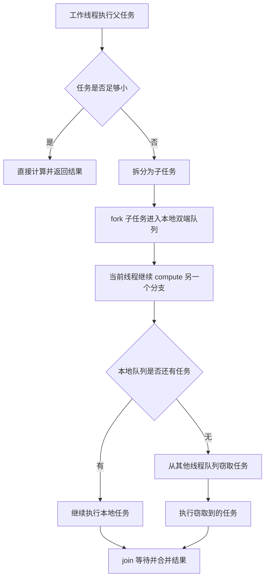

# 3.3.4.2 ForkJoin

ForkJoin 是 Java 并发库中面向“可递归拆分任务”的并行执行框架。它不只是一个线程池变体，也不是把任务提交到后台线程这么简单。它的核心思想是：如果一个大任务可以拆成若干相互独立的小任务，就让不同工作线程并行处理这些小任务；如果某个线程先做完自己的任务，就从其他线程的任务队列中“窃取”尚未执行的任务继续执行，从而减少线程空闲时间，提高 CPU 密集型计算的利用率。

理解 ForkJoin，要把三个问题连在一起看。第一，大任务是否真的能被分治拆解；第二，拆出的子任务如何进入 ForkJoinPool 的工作队列；第三，线程等待子任务结果时，框架怎样避免普通线程池中常见的“提交后等待、线程被耗尽”的问题。只记住 `fork()`、`join()`、`RecursiveTask` 这些 API 名称并不够，因为 ForkJoin 的优势和风险都来自它的执行模型。任务拆得合理时，它能在多核机器上获得很好的吞吐；任务拆得过细、长期阻塞或共享状态过多时，它也可能比普通顺序代码更慢、更难排查。

本文只讨论通用 Java 技术视角下的 ForkJoin：分治任务、ForkJoinPool、工作窃取、`RecursiveTask`、`RecursiveAction`、`fork`、`join`、`invoke`、任务粒度、阻塞风险、`commonPool`、与普通线程池的区别、适用边界和常见误区。

## ForkJoin 解决什么问题

许多计算任务天然可以拆分。比如对一个大数组求和，可以拆成左半段求和和右半段求和；对一个目录树统计文件大小，可以拆成每个子目录的统计；对一组独立数据做转换，可以按区间拆成多个批次。只要每个子任务之间没有强依赖，最后又能把子结果合并，就可以用分治思路表达。

分治本身并不等于并行。单线程递归也可以把大问题拆成小问题，只是所有子问题仍然按顺序执行。ForkJoin 的价值在于把这种递归拆分交给一组工作线程执行，并通过任务队列和工作窃取机制做负载均衡。它希望解决的是这样一类问题：任务数量在运行时递归产生，每个子任务耗时不完全相同，静态地给每个线程分配固定范围容易造成有些线程忙、有些线程闲。

普通固定线程池也能执行很多小任务，但在递归分治场景中会遇到两个麻烦。第一，父任务提交子任务后通常需要等待子任务结果，如果父任务占着工作线程阻塞等待，而子任务也需要同一个线程池中的线程，就可能出现线程利用率低甚至饥饿。第二，普通线程池通常使用共享队列，多个线程同时从同一个队列取任务，竞争和调度开销较集中。ForkJoinPool 针对分治场景做了更细的设计：每个工作线程都有自己的双端队列，本线程优先处理自己产生的任务，空闲线程再从其他线程队列末端窃取任务。

因此，ForkJoin 主要解决的是“递归产生的大量小型、独立、可合并、CPU 密集型任务”的并行执行问题。它不是通用异步框架，也不是 I/O 任务的默认选择，更不是自动让任何代码变快的工具。判断是否适合 ForkJoin，要先看任务结构，而不是先看 API。

## 分治任务的基本形态

ForkJoin 中的任务通常符合“判断是否足够小，足够小就直接计算，否则拆分、执行子任务、合并结果”的结构。这个结构和算法中的 divide and conquer 很接近，只是拆分后的子任务可以被不同线程并行执行。

一个典型分治任务包含四个要素。第一是输入范围，例如数组的起止下标、集合的一段区间、树中的某个节点。第二是阈值，也就是小到什么程度以后不再继续拆分。第三是直接计算逻辑，处理叶子任务。第四是结果合并逻辑，把子任务结果合成父任务结果。

以数组求和为例，顺序版本通常是一个循环。ForkJoin 版本会把数组区间视为任务范围：如果区间长度小于阈值，就直接循环求和；否则把区间一分为二，左半段和右半段分别形成子任务，最后把两个结果相加。这里的核心不是“把循环改成递归”，而是用任务对象把递归分支交给 ForkJoinPool 调度。

```java
import java.util.concurrent.RecursiveTask;

class SumTask extends RecursiveTask<Long> {
    private static final int THRESHOLD = 10_000;

    private final long[] values;
    private final int start;
    private final int end;

    SumTask(long[] values, int start, int end) {
        this.values = values;
        this.start = start;
        this.end = end;
    }

    @Override
    protected Long compute() {
        int length = end - start;
        if (length <= THRESHOLD) {
            long sum = 0L;
            for (int i = start; i < end; i++) {
                sum += values[i];
            }
            return sum;
        }

        int mid = start + length / 2;
        SumTask left = new SumTask(values, start, mid);
        SumTask right = new SumTask(values, mid, end);

        left.fork();
        long rightResult = right.compute();
        long leftResult = left.join();
        return leftResult + rightResult;
    }
}
```

这个例子体现了 ForkJoin 任务的常见写法：只 `fork` 一个分支，当前线程继续 `compute` 另一个分支，最后 `join` 被 fork 的分支。这样写不是偶然的。若把左右两个任务都 `fork` 出去，然后当前线程只等待结果，当前线程可能过早变成等待者，少做了一份本可以立即执行的工作。让当前线程直接计算一个分支，可以减少额外入队和调度成本，也更符合 ForkJoin 的工作窃取模型。

分治任务还要求子任务之间尽量独立。每个子任务处理自己的输入范围，返回自己的结果，父任务只在 `join` 之后合并结果，这是最清晰的模式。如果多个子任务同时修改同一个可变对象，就需要额外同步，ForkJoin 的并行收益会被锁竞争、内存可见性和结果合并复杂度抵消。很多 ForkJoin 性能问题不是框架造成的，而是任务本身并不适合拆分。

## ForkJoinPool 的角色

`ForkJoinPool` 是执行 ForkJoinTask 的线程池。它负责创建和管理工作线程、维护任务队列、调度任务、处理工作窃取、记录任务完成状态，并在任务等待时尽量让线程继续参与其他任务执行。它和 `ThreadPoolExecutor` 一样属于执行器，但内部结构和典型使用场景不同。

普通线程池常见模型是：调用方把任务提交到共享队列，工作线程从队列取任务执行。ForkJoinPool 的模型更贴近“每个工作线程都有本地双端队列”。当某个 ForkJoin 工作线程在执行任务时又创建了子任务，子任务通常会进入当前工作线程的本地队列。当前线程按栈式倾向处理自己最近创建的任务，而其他空闲线程会从别的线程队列另一端窃取较早产生的任务。这种设计兼顾了局部性和负载均衡。

局部性意味着当前线程更可能继续处理与自己刚刚执行的数据范围相关的任务，缓存命中可能更好。负载均衡意味着某个线程任务少时，不必等待全局队列分配，而是主动从任务多的线程那里取工作。对递归分治任务来说，不同分支大小和耗时常常不可完全预测，工作窃取能降低“某个线程处理大分支，其他线程提前闲置”的概率。

创建 ForkJoinPool 时可以指定并行度。并行度不是任务数量，也不等于系统中一定存在的线程数量，而是池希望用于并行执行的工作线程目标规模。对 CPU 密集型任务，并行度通常接近可用处理器数量比较合理。并行度过低会限制并行能力；并行度过高可能导致上下文切换、缓存抖动和竞争增加。

```java
import java.util.concurrent.ForkJoinPool;

ForkJoinPool pool = new ForkJoinPool(Runtime.getRuntime().availableProcessors());
long result = pool.invoke(new SumTask(values, 0, values.length));
pool.shutdown();
```

使用自建 ForkJoinPool 时，调用方应明确生命周期：谁创建，谁提交任务，谁关闭，关闭后是否还允许复用。和其他线程池一样，局部方法里随手创建线程池却不关闭，会留下线程资源；把共享线程池在局部代码中关闭，又会影响其他调用方。ForkJoinPool 的生命周期边界必须和业务所有权一致。

## 工作窃取机制

工作窃取是 ForkJoinPool 最重要的机制之一。它的基本思路可以用一句话概括：工作线程优先执行自己队列里的任务，自己没任务时再从其他工作线程那里拿任务执行。被拿走的任务通常来自其他线程队列的相对“老”端，避免和队列所有者在同一端激烈竞争。

下面的 Mermaid 图只描述概念流程，不代表具体实现中的所有状态和优化：



工作窃取解决的是动态负载均衡问题。假设一个任务树被拆成许多分支，有的分支很快完成，有的分支很慢。如果采用静态分配，线程之间可能不均衡；如果所有任务都放在一个共享队列，竞争又可能集中。ForkJoinPool 通过本地队列降低常规入队出队竞争，通过窃取让空闲线程参与其他分支。

这个机制也解释了为什么 ForkJoin 对任务形态有要求。任务要足够多，才能让空闲线程有工作可偷；任务要足够大，才能抵消拆分、排队、窃取和合并的开销；任务之间要尽量独立，窃取后才能在别的线程上执行；任务不能长期阻塞，否则工作线程会被外部等待占住，无法持续参与计算。

工作窃取不是“偷得越多越好”。窃取本身也有成本，包括访问其他线程队列、同步控制和缓存局部性下降。理想状态是大多数任务由创建它们的线程高效处理，只有在负载不均时才发生适度窃取。过细的任务会制造大量队列操作和窃取行为，最终可能让调度成本超过计算收益。

## RecursiveTask、RecursiveAction 与 ForkJoinTask

ForkJoin 框架的任务基类是 `ForkJoinTask<V>`。它表示可以被 ForkJoinPool 执行、可以完成、可以返回结果或异常状态的任务。实际编写代码时，最常用的是它的两个抽象子类：`RecursiveTask<V>` 和 `RecursiveAction`。

`RecursiveTask<V>` 用于有返回值的分治任务。数组求和、最大值查找、统计数量、计算某个结果对象，都适合用它表达。开发者实现 `compute()` 方法，在其中决定直接计算还是继续拆分，并通过返回值把结果传给父任务。

`RecursiveAction` 用于没有返回值的分治任务。它适合对一批数据做原地处理、批量初始化、并行填充、并行转换但结果写入已有结构的场景。因为没有返回值，所以更要注意共享状态边界。如果每个任务写入的数组区间互不重叠，通常比较清晰；如果多个任务写同一个集合或同一个计数器，就要额外考虑线程安全。

```java
import java.util.concurrent.RecursiveAction;

class NormalizeTask extends RecursiveAction {
    private static final int THRESHOLD = 5_000;

    private final double[] values;
    private final int start;
    private final int end;

    NormalizeTask(double[] values, int start, int end) {
        this.values = values;
        this.start = start;
        this.end = end;
    }

    @Override
    protected void compute() {
        if (end - start <= THRESHOLD) {
            for (int i = start; i < end; i++) {
                values[i] = Math.sqrt(values[i]);
            }
            return;
        }

        int mid = start + (end - start) / 2;
        invokeAll(
                new NormalizeTask(values, start, mid),
                new NormalizeTask(values, mid, end)
        );
    }
}
```

`RecursiveTask` 和 `RecursiveAction` 的共同点是都把核心逻辑放在 `compute()` 中。`compute()` 不应被理解为普通回调方法，而是任务执行体。它可能在 ForkJoinPool 的工作线程中执行，也可能在调用 `invoke()` 的线程参与执行时运行。代码不应依赖具体线程名称或具体执行顺序，而应依赖任务之间的 `fork`、`join`、返回值和同步关系。

`ForkJoinTask` 还有一些状态相关能力，例如取消、异常完成、检查完成状态等。但在常规分治代码中，重点不是频繁操作这些低层状态，而是让任务结构保持简单：输入范围不可变，叶子计算清楚，拆分规则稳定，结果合并无共享竞争。任务对象最好是一次性使用的，不要把同一个 ForkJoinTask 实例重复提交或在多处复用。

## fork、join、invoke 与 invokeAll

`fork()` 的含义是安排当前任务异步执行。若在 ForkJoin 工作线程中调用，它通常会把任务放入当前线程的本地队列；若在外部线程中调用，行为会通过池的提交路径进入执行。`fork()` 不会立即返回任务结果，也不表示任务已经完成。它只是把任务推进调度体系。

`join()` 的含义是等待任务完成并取得结果。对于 `RecursiveTask`，`join()` 返回计算结果；对于 `RecursiveAction`，`join()` 只等待完成。若任务中抛出未检查异常，`join()` 会把异常传播给等待方。`join()` 与 `Thread.join()` 名字相似，但等待对象不同：这里等待的是 ForkJoinTask 的完成，而不是某个具体线程的终止。

`invoke()` 通常用于提交一个任务并等待其完成。对 ForkJoinPool 来说，`pool.invoke(task)` 是外部调用方启动根任务的常见方式。对 ForkJoinTask 自身来说，也存在 `invoke()` 方法，可以直接执行并等待任务完成。实际代码中要区分“把根任务交给池执行”和“在任务内部拆分子任务”这两个层次。

`invokeAll()` 是便捷方法，用于 fork 多个任务并等待它们完成。它适合表达“这些子任务都需要完成，但不关心中间单个调度细节”的场景。对于两个分支的经典写法，`left.fork(); right.compute(); left.join();` 通常更能控制当前线程继续做一份工作；而 `invokeAll(left, right)` 更简洁，适合没有明显偏向且任务逻辑清楚的情况。

下面这个顺序很常见：

```java
left.fork();
R rightValue = right.compute();
R leftValue = left.join();
return combine(leftValue, rightValue);
```

它背后的原则是“不要让当前工作线程过早空等”。如果当前任务已经拆出了两个子任务，当前线程完全可以先执行其中一个分支。这样即使没有其他线程来窃取另一个分支，当前线程也没有闲着；如果有其他线程窃取了 `left`，则两个分支可以并行；如果没有被窃取，`join()` 时当前线程或池也能继续推进任务完成。

使用 `join()` 时还要注意异常语义。`join()` 不声明受检异常，任务内部抛出的运行时异常会在 join 方重新抛出。相比 `Future.get()` 会用 `ExecutionException` 包装异常，`join()` 的风格更贴近 ForkJoinTask 自己的异常传播方式。编写任务时不应吞掉异常后返回伪结果，否则父任务会误以为子任务成功完成。

## 任务粒度与阈值选择

任务粒度是 ForkJoin 是否有效的关键。粒度太大，任务数量少，无法充分利用多核；粒度太小，拆分、创建任务对象、入队、窃取、合并的成本会超过实际计算。阈值选择没有一条放之四海而皆准的公式，需要结合数据规模、单个元素计算成本、硬件核心数、内存访问模式和运行时指标判断。

判断粒度时可以先区分两类成本。第一类是计算成本，也就是叶子任务真正做的工作，例如数值计算、比较、转换、解析。第二类是调度成本，包括任务对象创建、递归调用、队列操作、工作窃取、`join` 等。ForkJoin 要求计算成本足够覆盖调度成本。若每个叶子任务只处理几个简单加法，调度开销很可能占主导；若每个叶子任务处理较长区间或较重计算，并行才更可能有收益。

阈值通常应通过基准测试或压力测试校准，而不是凭感觉写一个很小的数字。可以从顺序实现开始，测量不同数据规模下的耗时；再引入 ForkJoin，分别尝试不同阈值，观察吞吐、CPU 利用率、任务数量和垃圾回收压力。若数据规模较小，顺序实现可能更快；若数据规模很大但内存带宽成为瓶颈，增加线程也未必线性提速。

阈值还要考虑拆分是否均衡。数组按中点拆分通常比较均衡，树形结构、图结构或不规则数据则不一定。某个分支可能包含大量复杂节点，另一个分支很轻。工作窃取能缓解不均衡，但不能完全弥补糟糕的拆分策略。如果拆分规则总是产生一个巨大任务和一个极小任务，递归深度、任务数量和负载均衡都会变差。

还有一种常见误区是只看线程数，不看任务数。并行度为 8 不代表只需要拆出 8 个任务。为了让工作窃取有效，任务数量通常要多于工作线程数量，这样线程完成一个叶子任务后仍有后续任务可取。但任务数量也不能无限膨胀。合理状态是任务足够多以平衡负载，又足够粗以让每个任务做有意义的计算。

实践中可以把阈值设计成与输入规模和计算复杂度相关的常量或参数，并在注释中说明依据。不要让阈值藏在魔法数字里，也不要让调用方随意传入极端值。ForkJoin 的性能高度依赖粒度，阈值本身就是算法设计的一部分。

## 阻塞风险与 ManagedBlocker

ForkJoinPool 最适合 CPU 密集型任务，因为工作线程被设计为持续执行计算和窃取任务。如果任务内部长期阻塞，例如等待网络、等待文件、等待数据库、等待外部锁、等待另一个线程池中的任务结果，ForkJoinPool 的优势会明显下降。阻塞会占住工作线程，使它无法执行本地任务，也无法帮助窃取其他任务。

普通线程池中阻塞也有问题，但 ForkJoin 中尤其敏感。ForkJoin 的并行度通常接近 CPU 核数，线程数量不会像某些 I/O 线程池那样配置得很大。一个并行度为 8 的 ForkJoinPool，如果 8 个工作线程都在等待外部资源，那么池内仍有大量可运行的 ForkJoinTask 也无法推进。任务树越依赖内部任务完成，阻塞风险越明显。

最危险的模式之一是在 ForkJoin 任务中等待同一个池中未来才会执行的其他任务，同时又没有使用 ForkJoin 的 `join` 协作语义。例如任务里调用某个会阻塞的 `Future.get()`，而这个 Future 的任务也需要同一批工作线程执行，就可能造成线程饥饿。即使没有永久死锁，也会让吞吐和延迟变得不可预测。

Java 提供了 `ForkJoinPool.ManagedBlocker`，用于在 ForkJoin 任务中确实需要阻塞时通知池：当前线程可能要阻塞，池可以在必要时补偿性地增加或激活工作线程。它不是鼓励在 ForkJoin 中做阻塞操作，而是为无法避免的阻塞提供一个协作机制。

```java
import java.util.concurrent.ForkJoinPool;

class ValueBlocker<T> implements ForkJoinPool.ManagedBlocker {
    private final java.util.concurrent.BlockingQueue<T> queue;
    private T value;

    ValueBlocker(java.util.concurrent.BlockingQueue<T> queue) {
        this.queue = queue;
    }

    @Override
    public boolean block() throws InterruptedException {
        if (value == null) {
            value = queue.take();
        }
        return true;
    }

    @Override
    public boolean isReleasable() {
        return value != null || (value = queue.poll()) != null;
    }

    T getValue() {
        return value;
    }
}
```

即便有 ManagedBlocker，也应优先重新审视设计：这个任务是否真的属于 ForkJoin；阻塞部分能否移到专门的 I/O 执行器；能否先收集数据再做 CPU 分治；能否使用异步边界而不是在 ForkJoin 工作线程中等待。ManagedBlocker 适合少量、明确、可解释的阻塞点，不适合把大量外部等待塞进 ForkJoinPool。

## commonPool 的使用边界

`ForkJoinPool.commonPool()` 是 JVM 进程级共享的通用 ForkJoinPool。它被一些标准库功能使用，例如并行流和某些基于 `CompletableFuture` 的默认异步执行。使用 commonPool 的好处是方便，不需要显式创建和管理线程池；风险是共享，调用方很容易影响同一进程内其他依赖 commonPool 的代码。

commonPool 适合短小、CPU 密集、不会长期阻塞、不会依赖特殊线程上下文的任务。如果任务耗时长、阻塞多、需要隔离、需要自定义线程工厂、需要独立监控或需要明确关闭边界，就不应随意使用 commonPool。共享池中一个模块提交了大量重任务，可能让其他模块的默认异步任务延迟升高；一个模块在任务里长期阻塞，也可能拖慢不相关逻辑。

使用 commonPool 时还要注意“默认”并不等于“无成本”。例如 `CompletableFuture.supplyAsync(supplier)` 在未指定执行器时通常使用 commonPool；并行流也会使用公共 ForkJoinPool。代码中看似没有线程池对象，实际仍在消耗共享并行资源。对库代码尤其要谨慎，因为库无法假设调用方愿意把进程级共享池交给它使用。

如果任务是某个模块的核心并行计算，通常更推荐显式创建或注入专用 ForkJoinPool。这样可以控制并行度、线程命名、异常处理、监控和生命周期，也可以避免与其他 commonPool 使用者相互干扰。专用池不是为了形式上“更专业”，而是为了资源所有权清晰。

还要避免在 commonPool 中执行不可控的阻塞 I/O。因为 commonPool 可能同时服务多个框架和调用路径，一旦被阻塞任务占满，症状会扩散到表面上无关的地方。排查这种问题时，线程 dump 往往会看到 commonPool 工作线程停在外部等待上，而上层只感知到异步任务迟迟不完成。

## 与普通线程池的区别

ForkJoinPool 和普通 `ThreadPoolExecutor` 都能执行任务，但它们的设计目标不同。`ThreadPoolExecutor` 更通用，适合以外部提交为主的任务流，可以配置核心线程数、最大线程数、阻塞队列、拒绝策略和线程工厂。ForkJoinPool 更专注于内部递归拆分、工作窃取和任务协作等待。

普通线程池通常强调“外部生产任务，线程池消费任务”。任务之间多数是平级关系。即使任务内部再提交子任务，也不是线程池模型的核心假设。ForkJoin 则强调“任务执行过程中继续产生子任务，父任务等待子任务，任务树整体完成”。它的 `fork/join` 语义就是围绕这种任务树设计的。

队列结构也不同。普通线程池常用一个共享阻塞队列。所有工作线程从这个队列取任务，队列容量和拒绝策略是重要参数。ForkJoinPool 使用工作队列和工作窃取，工作线程之间的任务迁移是常态。它不只是换了一个队列实现，而是改变了任务调度假设。

等待方式也不同。在普通线程池中，工作线程如果调用 `Future.get()` 等待另一个任务，通常就是阻塞在那里。若线程池线程都被父任务占住等待子任务，而子任务排在队列里无法执行，就会发生线程饥饿。ForkJoinTask 的 `join()` 与 ForkJoinPool 协作，等待线程可能帮助执行其他任务，从而降低这类风险。但这只适用于 ForkJoin 任务和 ForkJoinPool 的协作语义，不代表在 ForkJoin 中等待任何 Future 都安全。

适用任务也不同。普通线程池可以根据配置服务 CPU 任务、I/O 任务、定时任务或后台任务，只要容量和拒绝策略设计合理。ForkJoinPool 更适合 CPU 密集型、可拆分、结果可合并的任务。把阻塞 I/O 批量塞进 ForkJoinPool，通常是在违背它的设计前提。

下面的对比可以帮助快速定位选择边界：

| 维度 | ForkJoinPool | ThreadPoolExecutor |
|---|---|---|
| 核心目标 | 递归分治任务并行执行 | 通用任务执行与资源控制 |
| 任务关系 | 父子任务树常见 | 平级任务常见 |
| 队列模型 | 工作队列与工作窃取 | 通常是共享阻塞队列 |
| 等待方式 | `join` 与池协作 | `Future.get` 常规阻塞 |
| 典型任务 | CPU 密集、可拆分、可合并 | CPU、I/O、后台任务均可按配置承载 |
| 关键参数 | 并行度、拆分阈值、阻塞控制 | 线程数、队列容量、拒绝策略 |
| 主要风险 | 任务过细、阻塞、共享状态竞争 | 队列堆积、拒绝、线程饥饿、生命周期混乱 |

这并不是说 ForkJoinPool 比普通线程池高级，或者普通线程池比 ForkJoinPool 稳妥。它们解决的问题不同。选择工具时应先描述任务形态：任务从哪里来，是否递归产生，是否需要等待子结果，是否阻塞，是否共享状态，是否需要隔离资源。任务形态清楚后，选择通常自然出现。

## 内存可见性与结果发布

ForkJoin 不会让共享可变状态自动变安全。它保证的是任务执行、完成状态和 `join` 结果之间的必要同步语义，而不是保证任务内部访问的所有对象都天然线程安全。若多个子任务只读同一个不可变输入，并通过返回值合并结果，线程安全边界比较清楚；若多个子任务写共享对象，就必须额外设计同步规则。

在 `RecursiveTask` 中，最推荐的结果传递方式是返回值。每个子任务计算自己的局部结果，父任务通过 `join()` 获取结果后合并。这样共享写入最少，结果发布由 ForkJoinTask 的完成语义承载。数组求和、计数、查找、归约都可以采用这种方式。

在 `RecursiveAction` 中，因为没有返回值，任务往往会修改外部结构。此时要确保不同任务写入范围不重叠，或者共享写入受并发工具保护。例如并行填充数组时，每个任务只写自己的 `[start, end)` 区间，父任务等待所有子任务完成后再读取整体结果，这种边界是清楚的。若多个任务向同一个 `ArrayList` 添加元素，结构安全就没有保证，必须改用线程安全容器、分段收集后合并，或使用其他同步手段。

可见性还涉及输入对象的发布。任务对象创建后提交给 ForkJoinPool，任务字段通常应设计为 `final`，输入引用在构造完成后不再被调用方并发修改。若调用方一边提交任务，一边修改任务读取的数组或对象字段，结果就取决于数据竞争，而不是 ForkJoin 语义。ForkJoin 负责调度任务，不负责阻止调用方破坏输入不变式。

`join()` 之后读取子任务计算出的结果是合理的同步边界；绕过 `join()` 去读取子任务内部未受保护的可变字段则不是良好设计。父任务应该通过返回值、明确的线程安全容器或不重叠写入区域获取结果，而不是依赖“子任务大概已经写完”的时间判断。

## 异常、取消与中断

ForkJoin 任务中的异常会影响任务完成状态。若 `compute()` 抛出运行时异常或错误，任务会异常完成，调用 `join()` 的线程会观察到异常。父任务在合并结果时如果没有处理异常，异常会继续向上传播，最终让根任务失败。这个机制比后台线程悄悄打印异常更可控，但前提是调用方确实等待了根任务结果。

不要在子任务里随意捕获所有异常后返回默认值。这样会把失败伪装成成功，使父任务继续合并错误结果。只有当默认值有明确业务含义，并且调用方能够区分降级结果和真实结果时，才应该这样处理。更常见的做法是让异常传播到根任务，由根调用方统一记录、取消或降级。

ForkJoinTask 支持取消，但取消不是强制杀死正在执行的线程。`cancel()` 主要改变任务状态，对已经运行的计算任务并不自动中断执行体。CPU 密集型任务如果需要可取消，应在递归或叶子计算中周期性检查取消状态、外部标志或线程中断状态，并在合适位置退出。否则取消只会影响尚未执行或等待方观察到的状态，无法让长时间计算立即停止。

中断语义也要谨慎。ForkJoin 任务通常不应依赖受检中断异常作为主要控制流，因为 `compute()` 不能声明抛出 `InterruptedException`。如果任务中调用了会抛出 `InterruptedException` 的阻塞方法，就必须决定如何处理：恢复中断标志、包装异常抛出、或转化为任务取消。静默吞掉中断会让上层关闭或取消协议失效。

异常和取消还会影响合并逻辑。假设父任务 fork 了左分支，然后当前线程计算右分支时抛出异常，左分支可能已经在运行或等待运行。是否需要取消左分支，取决于任务语义和资源成本。对于纯计算任务，直接让异常传播可能已经足够；对于消耗大量资源或有副作用的任务，可能需要在异常路径中显式处理其他子任务的状态。

## Parallel Stream 与 CompletableFuture 的关系

ForkJoinPool 不只通过显式的 `RecursiveTask` 出现。Java 标准库中的并行流通常基于 ForkJoinPool 执行；`CompletableFuture` 的某些异步方法在没有指定 Executor 时也会使用 commonPool。这意味着开发者即使没有直接写 `new ForkJoinPool()`，也可能已经在使用 ForkJoin 资源。

并行流适合对数据源做无共享副作用的并行处理，例如过滤、映射、归约。它隐藏了任务拆分和调度细节，使用起来比手写 RecursiveTask 简洁。但隐藏细节也意味着控制力下降。若流操作中存在阻塞、共享可变状态、顺序依赖或外部副作用，并行流可能产生性能问题或正确性问题。并行流不是“把 stream 改成 parallelStream 就会更快”的开关。

`CompletableFuture` 更偏向异步任务编排，而不是分治算法。它可以把多个异步阶段串联、组合、竞争或异常处理。默认异步执行器如果落到 commonPool，就会与其他 commonPool 使用者共享资源。对于耗时、阻塞或需要隔离的异步阶段，应显式传入合适的 Executor，而不是依赖默认池。

这两类 API 和手写 ForkJoin 的关系可以这样理解：手写 RecursiveTask 适合你明确拥有一个分治任务树，并希望控制拆分阈值、合并逻辑和池；并行流适合数据并行处理且操作纯净；CompletableFuture 适合异步阶段编排。它们可能共享底层执行资源，但抽象目标不同，不能互相替代。

## 适用边界

ForkJoin 最适合以下场景：任务可以递归拆分；子任务之间基本独立；结果可以通过返回值或清晰的合并规则聚合；主要耗时来自 CPU 计算；数据规模足够大；任务粒度可以调校；执行过程中很少阻塞；共享可变状态少。这些条件满足得越多，ForkJoin 的收益越稳定。

典型例子包括大数组统计、批量数值计算、树形数据遍历、搜索空间拆分、可并行归约、独立数据块转换。即使是这些场景，也仍要验证。比如大数组求和可能受内存带宽限制，线程数增加后收益有限；树形遍历如果节点分布极不均衡，拆分策略需要调整；搜索任务如果找到一个结果后其他分支应停止，就要设计取消和短路。

不适合 ForkJoin 的场景同样明确。大量阻塞 I/O 不适合；任务之间有强顺序依赖不适合；每个任务都要争用同一把锁不适合；数据量小且计算轻不适合；需要严格限流、排队、拒绝策略的后台任务流不一定适合；任务执行时间由外部系统决定时通常应选择专门的 I/O 执行器或异步模型。

还有一些“看似可拆分但收益不稳定”的场景。比如每个子任务都会访问同一个大型共享缓存，锁竞争和缓存失效可能抵消并行收益；每个子任务都会分配大量临时对象，垃圾回收压力可能成为瓶颈；每个子任务计算很轻但数量巨大，任务调度成本可能成为主导。ForkJoin 的适用性必须通过任务结构和实际指标共同判断。

## 实践建议

第一，从顺序版本开始。顺序代码更容易验证正确性，也能提供性能基线。没有基线就无法判断 ForkJoin 是否真的带来收益。先写清楚单线程算法，再把可拆分部分抽象成任务范围、阈值和合并逻辑。

第二，让任务对象尽量不可变。输入引用、起止位置、配置参数应在构造后固定，字段优先使用 `final`。任务执行过程中不要修改任务范围，不要让外部线程同时修改任务读取的数据。不可变任务对象可以降低发布和推理成本。

第三，优先使用局部结果再合并。能用 `RecursiveTask` 返回局部结果，就不要让所有子任务写同一个共享结果对象。局部结果合并不仅更安全，也通常更利于性能分析。共享写入应作为确有必要的选择，而不是默认写法。

第四，控制拆分阈值。阈值应该来自测量和任务复杂度，而不是机械地按核心数或固定小数字设置。对简单循环，阈值通常应较大；对单元素计算很重的任务，阈值可以较小。阈值变化会影响任务数量、内存分配、窃取频率和缓存局部性。

第五，避免在 ForkJoin 任务中进行不受控阻塞。必要阻塞应使用 ManagedBlocker 或重新拆分执行模型。外部 I/O、锁等待、睡眠、同步调用其他执行器都要谨慎。阻塞点越多，ForkJoin 的行为越偏离 CPU 分治框架。

第六，明确使用 commonPool 还是专用池。应用内部短小计算可以考虑 commonPool，但库代码、重任务、长任务、阻塞任务和需要隔离的任务应显式传入执行器或使用专用池。资源所有权不清是并发问题的重要来源。

第七，保留诊断能力。专用池可以配置有意义的线程名，关键任务可以记录输入规模、阈值和耗时，异常路径应记录根因。ForkJoin 问题常表现为“变慢”“卡住”“CPU 打满但吞吐不升”，没有指标很难定位。

## 常见误区

第一个误区是认为 ForkJoin 会自动让递归算法变快。ForkJoin 只提供并行执行框架，真正决定收益的是任务拆分、计算成本、数据访问和合并方式。若任务本身很轻，拆分成本会超过收益；若任务共享状态很多，锁竞争会吞掉并行度；若数据规模太小，顺序代码往往更快。

第二个误区是把任务拆得越细越好。细粒度可以增加并行机会，但也增加任务对象、队列操作和窃取成本。ForkJoin 的目标不是制造最多任务，而是制造足够多且足够重的任务。过细拆分会让程序看起来很“并行”，实际 CPU 时间花在调度而不是计算上。

第三个误区是在 ForkJoin 中随意阻塞。`Thread.sleep()`、外部锁、阻塞队列、同步 I/O、等待普通 Future，都可能占住工作线程。ForkJoinPool 不是为大量等待设计的。阻塞任务应隔离到更合适的执行器，或通过 ManagedBlocker 明确告知池。

第四个误区是滥用 commonPool。因为 commonPool 方便，很多代码会无意识地把任务丢进去。问题是 commonPool 是共享资源，某个调用点的重任务可能影响另一个调用点的异步阶段。尤其是公共库，不应轻易假设自己可以占用进程级共享池。

第五个误区是忽略异常传播。子任务异常不会神秘消失，但如果根任务没人 `join` 或 `invoke`，调用方就可能没有观察到失败。另一方面，如果任务内部捕获异常后返回默认值，也会让错误结果继续参与合并。ForkJoin 任务应有明确的失败策略。

第六个误区是把 ForkJoin 当成线程安全工具。ForkJoin 负责并行执行任务，不负责保护任务访问的数据结构。多个任务同时写普通集合、同时更新普通字段、同时修改共享对象，仍然是数据竞争。线程安全必须由任务设计、不可变数据、返回值合并、并发容器或同步机制保证。

第七个误区是只在本机简单测试一次就判断性能。ForkJoin 性能与核心数、数据规模、JIT 状态、内存带宽、垃圾回收、输入分布和系统负载有关。一次运行结果可能受预热、缓存和其他进程影响。要判断收益，应使用稳定的基准方法和多组输入规模。

## 排查 ForkJoin 问题的思路

排查 ForkJoin 问题时，先确认任务是否真的在合适的池中执行。查看线程名可以判断是否使用 commonPool 或专用 ForkJoinPool。若不小心通过并行流或 CompletableFuture 默认方法进入 commonPool，就要把共享池因素纳入分析。

第二步看线程状态。线程 dump 中如果大量 ForkJoin 工作线程停在外部 I/O、锁等待、`Future.get()` 或睡眠上，说明任务阻塞风险很高。如果工作线程大多忙于计算但吞吐不升，可能是任务过细、共享数据竞争、内存带宽瓶颈或垃圾回收压力。如果工作线程很少忙，可能是任务数量不足、拆分不均或根任务没有正确提交。

第三步看任务粒度。可以记录输入规模、阈值、拆分次数、叶子任务数量和每个叶子任务平均耗时。若叶子任务平均耗时极短，调度成本很可能过高。若叶子任务数量少于工作线程数量，可能无法充分并行。若某些叶子任务耗时远高于其他任务，说明拆分策略不均衡。

第四步看共享状态。检查子任务是否写同一个集合、计数器、缓存或输出对象。若存在共享写入，再确认使用的同步工具是否保护了完整不变式。并发容器只能保护容器结构，不会自动保证多步业务逻辑原子；原子变量只能保护单个变量，不会自动保护多个字段之间的关系。

第五步看异常和取消。确认根调用方是否使用 `invoke` 或 `join` 观察结果；确认子任务异常是否被吞掉；确认取消后长时间计算是否检查取消状态；确认异常路径是否还会等待其他子任务。很多“卡住”并不是 ForkJoinPool 自身停了，而是某个异常路径让父任务等待一个永远不会正确完成的条件。

第六步做对照实验。用顺序实现、普通线程池实现和 ForkJoin 实现对同一组输入做比较。改变阈值、并行度和数据规模，观察曲线变化。若 ForkJoin 只在很窄的数据规模下有优势，就应把这个边界写进设计；若始终没有优势，说明任务可能不适合 ForkJoin，或实现方式有问题。

## 小结

ForkJoin 的本质是面向分治任务的并行执行框架。它通过 ForkJoinPool 管理工作线程，通过工作窃取平衡递归任务树中的负载，通过 `RecursiveTask` 和 `RecursiveAction` 表达有返回值和无返回值的任务，通过 `fork`、`join`、`invoke` 和 `invokeAll` 组织子任务执行与结果合并。

用好 ForkJoin 的关键不在于写出递归代码，而在于判断任务是否适合分治、阈值是否合理、子任务是否独立、结果是否清晰合并、是否避免阻塞、是否谨慎使用 commonPool。它适合 CPU 密集、可拆分、少共享、少阻塞的计算任务；不适合大量 I/O 等待、强顺序依赖、小规模轻计算或共享状态复杂的任务。

最终应形成的判断标准是：如果一个任务可以被拆成许多独立子任务，每个子任务有足够计算量，结果能通过局部返回值或明确规则合并，并且执行过程中很少阻塞，那么 ForkJoin 值得考虑；如果只是想把普通任务放到后台执行，或者任务主要耗时来自外部等待，普通线程池、异步编排或专门的 I/O 执行模型往往更合适。ForkJoin 是强工具，但它只在自己的问题域内强。
