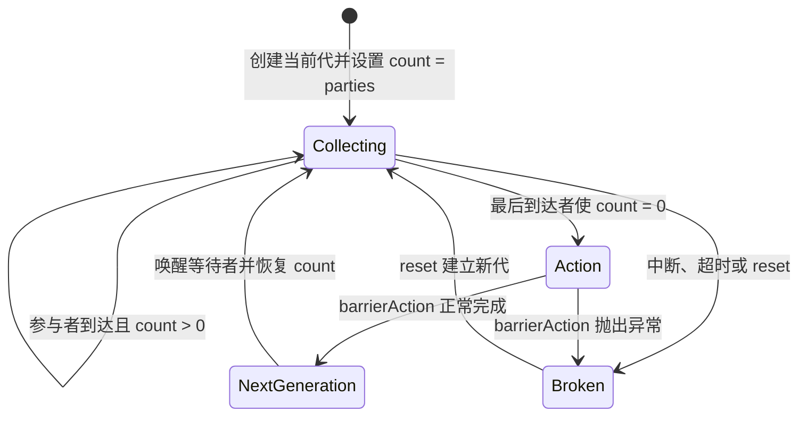

# 3.3.4.4 CyclicBarrier

`CyclicBarrier` 是 Java 标准并发库提供的阶段同步器。它让一组数量固定的线程在某个阶段末尾相互等待：每个线程完成本阶段工作后调用 `await()`，先到达的线程暂停，最后一个参与者到达时屏障开放，全部参与者继续执行下一阶段。屏障开放后会自动建立新一轮计数，因此同一个对象可以被重复使用，这也是名称中 “Cyclic” 的含义。

它解决的不是“主线程等待若干任务结束”，而是“若干地位对等的参与者必须一起越过阶段边界”。这个区别决定了它的使用方式和失败语义：任何一个参与者中断、超时或无法到达，都可能使同一轮中的其他参与者失去继续等待的意义，于是 `CyclicBarrier` 会把当前这一代整体标记为破损并唤醒所有等待者。理解这种“整组成功、整组失败”的模型，比记住 `await()` 的调用形式更重要。

本文保持通用 Java 视角，围绕 `java.util.concurrent.CyclicBarrier` 讲清它的概念、设计动机、实现机制、内存语义、使用方法、破损与重置规则、工程边界以及与其他并发方案的取舍。

## 从阶段协作问题理解屏障

设想有三个长期运行的工作线程，它们反复执行以下流程：

1. 各自读取一部分输入并计算局部结果。
2. 等待另外两个线程也完成本轮计算。
3. 在所有局部结果齐备后统一汇总。
4. 基于汇总结果开始下一轮计算。

如果没有屏障，线程必须自行维护“本轮已有多少人完成”“谁负责汇总”“下一轮能否开始”等共享状态。仅用一个原子计数器也不够，因为计数归零后还要安全唤醒等待者、隔离相邻轮次，并处理某个线程中断或超时的情况。手写 `wait/notify` 又容易出现条件检查不完整、通知遗漏、轮次串扰和异常路径未唤醒等问题。

`CyclicBarrier` 把这种协议封装成一个明确的阶段边界：

- 构造时确定参与者数量 `parties`。
- 每个参与者在阶段末尾调用 `await()` 报到。
- 前 `parties - 1` 个到达者进入等待。
- 最后到达者可先执行一次屏障动作，再释放本轮全部等待者。
- 释放完成后，内部计数恢复，形成下一代屏障。

这里的“到达”只是调用 `await()`，不是线程创建、启动或任务提交。`CyclicBarrier` 不知道业务任务是否真正完成，也不会替调用方管理线程生命周期。调用者必须保证：只有在本阶段对其他参与者可见的工作已经完成后，线程才执行 `await()`。

### 屏障与普通等待的本质差异

普通等待常是一对一或单向关系，例如调用 `Thread.join()` 的线程等待目标线程终止，调用 `Future.get()` 的线程等待异步结果完成。屏障则是多方会合关系：每个参与者既是等待者，也是被别人等待的对象。任何一方不到达，其他方就不能正常越过当前阶段。

这种对称关系带来两个直接后果。

第一，参与者数量必须与实际执行能力匹配。如果屏障要求四个参与者，但线程池最多只能同时运行三个长期任务，而这三个任务都阻塞在屏障处，第四个任务就永远没有机会执行。问题不在 `CyclicBarrier`，而在调度资源与同步协议不匹配。

第二，单个线程的失败会影响整组。屏障不能简单地把失败线程从当前轮删除，因为构造时约定的是固定数量参与者，其他线程等待的条件已经无法满足。它选择让本代破损，使所有参与者尽快看到协作失败，而不是继续无期限等待。

## 核心概念与 API

### parties：固定参与者数量

构造器 `CyclicBarrier(int parties)` 创建一个没有屏障动作的同步器；`CyclicBarrier(int parties, Runnable barrierAction)` 还会注册一个在每轮开放屏障前执行的动作。`parties` 必须大于零，否则构造器抛出 `IllegalArgumentException`。

参与者不是预先注册的线程身份。任何线程都可以调用 `await()`，同一个线程甚至可以在不同轮次参与，但一轮内必须恰好形成 `parties` 次有效到达。类本身不会校验“这一轮是否由不同线程调用”，也不会阻止某个业务线程因代码错误重复参与相邻轮次。线程身份和阶段协议仍由业务设计保证。

### await：到达并等待

无参数 `await()` 会一直等待，直到发生以下情况之一：

- 本轮最后一个参与者到达，屏障正常开放；
- 当前线程在等待前或等待期间被中断；
- 其他参与者被中断；
- 其他参与者使用带超时的 `await` 并发生超时；
- 屏障动作抛出异常；
- 其他线程调用 `reset()`；
- 当前屏障在调用时已经破损。

带超时版本 `await(long timeout, TimeUnit unit)` 增加了调用线程等待超时这一分支。超时不是只让当前线程离开：它会破坏当前代，其他等待者随后收到 `BrokenBarrierException`。因此超时时间代表整组阶段的失败边界，而不是一个与其他参与者无关的本地选择。

两个 `await` 方法都可能抛出 `InterruptedException` 和 `BrokenBarrierException`；带超时版本还可能抛出 `TimeoutException`。这些受检异常迫使调用者明确处理协作失败，而不是把异常悄悄留在后台线程。

### arrival index：到达索引

`await()` 正常返回一个整数，范围从 `0` 到 `parties - 1`。该值表示本轮到达次序的倒序索引：

- 最后到达者获得 `0`；
- 倒数第二个到达者获得 `1`；
- 最先到达者获得 `parties - 1`。

返回值可用于选出一个参与者执行额外工作，例如 `if (barrier.await() == 0) { ... }`。不过，如果额外工作必须在其他线程越过屏障之前完成，更适合使用构造器中的 `barrierAction`。`await()` 返回后的代码已经处于屏障开放之后，多个线程可能并发执行；索引为零的线程并不拥有一个额外的互斥阶段。

### barrierAction：开放前的屏障动作

可选的 `barrierAction` 由本轮最后到达的线程执行。它发生在屏障开放之前，其他参与者此时仍未从 `await()` 返回。动作正常结束后，屏障才进入下一代并唤醒等待者。

屏障动作适合执行短小、确定、无需阻塞的阶段收尾，例如汇总各线程已发布的局部统计、交换双缓冲引用、记录阶段完成信息。它不是独立线程，也不会被提交到线程池。最后到达者必须承担它的执行时间，所以动作越慢，整组等待越久。

若 `barrierAction.run()` 抛出未检查异常，该异常直接从最后到达者的 `await()` 调用中抛出；当前代被标记为破损，其他等待者收到 `BrokenBarrierException`。因此动作中的异常不能被当作普通后台异常忽略。若业务希望在动作失败后保留根因，应在动作内部记录或存储原始异常，并由外层协作协议传播。

### 状态查询方法

`getParties()` 返回构造时确定的参与者数量，不随轮次变化。`getNumberWaiting()` 返回当前时刻正在屏障中等待的参与者数量，主要用于监控和调试。它只是瞬时快照，读取后状态可能立即改变，不能作为正确性判断，例如不能依据“当前有两个人等待”决定第三个任务是否提交。

`isBroken()` 表示当前代是否处于破损状态。它同样适合诊断，不适合“先检查后执行”的复合控制，因为检查与随后的 `await()` 之间可能发生状态变化。正确代码应直接调用 `await()` 并处理其结果和异常。

`reset()` 会让当前代破损、唤醒正在等待的线程，然后建立一个新的正常代。它不是撤销某个参与者，也不是让当前等待者无感重试。关于它的严格边界将在后文单独讨论。

## 一代屏障如何流转

`CyclicBarrier` 内部使用“代”来隔离每一轮。可以把每代看成一个独立会合：



正常路径中，计数从 `parties` 开始。每次有效到达使计数减一。最后到达者把计数减到零，执行屏障动作，然后触发换代：唤醒所有等待者、把计数恢复为 `parties`，并创建新的代标识。已被唤醒的线程即使晚一些才重新获得 CPU，也能根据自己保存的旧代标识判断上一代已经正常结束，而不会误入新一代的等待条件。

失败路径中，内部会执行“破坏屏障”：把当前代标记为破损，把计数恢复到初始值并唤醒全部等待者。恢复计数并不等于自动可用，因为代对象仍带有破损标志。后续调用 `await()` 的线程会立即得到 `BrokenBarrierException`，直到显式调用 `reset()` 建立新代。

“计数”和“代”必须同时存在。若只有一个可循环计数，上一轮被唤醒但尚未运行的线程可能看到下一轮计数，从而无法判断自己等待的那一轮究竟是正常结束、失败还是已被重置。代对象给每批等待者提供了稳定的上下文。

## 实现机制：锁、条件队列与代际状态

从 OpenJDK 的经典实现结构看，`CyclicBarrier` 的核心状态由一把 `ReentrantLock` 保护，并使用该锁创建的 `Condition` 保存等待者。不同 JDK 版本可能调整内部细节，但公开语义不依赖具体字段名称。理解其算法可以帮助解释异常传播和内存可见性，却不应让业务代码依赖内部实现。

内部概念上包含以下状态：

- 不可变的 `parties`：每代需要的到达次数；
- 可选的 `barrierCommand`：屏障动作；
- 当前剩余计数 `count`；
- 当前代 `generation`，其中至少包含是否破损的标志；
- 一把互斥锁和一个条件队列。

一次 `await()` 的主要过程可以概括为：

1. 可中断地获取内部锁。
2. 读取当前代。
3. 如果当前代已破损，立即抛出 `BrokenBarrierException`。
4. 如果线程已被中断，破坏当前代并抛出 `InterruptedException`。
5. 将 `count` 减一。
6. 若结果为零，当前线程是最后到达者；执行屏障动作并换代。
7. 若结果非零，在线程条件队列上等待。
8. 被唤醒后重新持有锁，检查原代是否破损、是否已经换代、是否超时或被中断。

条件等待必须在循环中检查状态，因为唤醒并不等于“本轮必然成功”。线程可能因正常换代、屏障破损、重置、超时、中断甚至底层条件等待允许的虚假唤醒而恢复。真正决定返回还是抛异常的是受锁保护的代际状态。

### 为什么最后到达者执行屏障动作

最后到达者天然知道条件已经满足，不需要额外选举或再唤醒一个协调线程。让它直接执行动作可以把“全部到达”和“阶段收尾”放在同一个临界协议中，保证其他参与者在动作完成前不会越过屏障。

代价是屏障动作在内部锁保护的状态转换期间执行。调用方应把它视为同步路径的一部分，避免慢 I/O、长时间计算、再次等待同一个屏障或获取顺序不确定的外部锁。否则不仅会延长所有等待者的停顿，还可能形成锁依赖环。

### 为什么不基于 AbstractQueuedSynchronizer

很多 Java 同步器构建在 `AbstractQueuedSynchronizer` 之上，但 `CyclicBarrier` 的经典实现直接组合 `ReentrantLock` 与 `Condition`。它需要表达的不只是一个单调状态或简单许可，而是可循环计数、每代破损标志、条件等待和屏障动作之间的完整状态机。使用显式锁与条件队列能较直接地组织这套协议。

这不意味着它比基于 AQS 的同步器更“重”，也不能据此做性能结论。实际成本取决于参与者数量、阶段频率、任务粒度、调度竞争和屏障动作。选择工具首先应匹配语义，而不是根据内部是否使用 AQS 做猜测。

## 内存一致性：屏障前后的可见性

`CyclicBarrier` 不只是让线程在时间上等待，它还提供规定的内存一致性效果。Java API 约定：线程调用 `await()` 之前发生的操作，happens-before 屏障动作中的操作；屏障动作中的操作又 happens-before 其他线程从对应 `await()` 成功返回之后的操作。

因此，一个典型阶段可以安全地这样理解：

1. 每个工作线程写入自己负责的局部结果槽位。
2. 每个线程调用 `await()`。
3. 屏障动作读取全部局部结果并生成汇总状态。
4. 所有线程从 `await()` 返回后读取该汇总状态。

只要访问严格跨越同一次正常完成的屏障，上述发布链条能够提供可见性。但这项保证有明确边界。

首先，它不自动保证共享数据结构的复合更新是原子的。若多个线程在屏障前并发修改同一个非线程安全集合，数据竞争早已发生；屏障不能修复之前的并发写冲突。更稳妥的设计是让每个线程写入独占槽位，或使用适合并发更新的数据结构，再由屏障动作汇总。

其次，保证针对成功的屏障协议。若本代因中断、超时或异常而破损，调用方不应把部分结果当成完整阶段结果。即使某些写入在底层同步上可能已经可见，业务不变式也没有成立。

再次，屏障只建立阶段边界，不保护 `await()` 返回后的并发访问。多个线程越过屏障后同时修改共享对象，仍需要锁、原子变量、并发容器、不可变对象或职责分区等其他线程安全策略。

最后，不要用 `getNumberWaiting()` 或日志顺序推导 happens-before。只有规范定义的同步动作及其程序次序能建立可靠关系，观察到“另一个线程似乎先打印”不是内存模型保证。

## 基本使用：固定工作线程的多轮计算

下面的示例把一组整数分区交给固定数量线程。每轮中，各线程计算一个局部和；最后到达者通过屏障动作汇总本轮结果。所有线程越过屏障后再进入下一轮。示例重点在同步协议，局部计算本身刻意保持简单。

```java
import java.util.ArrayList;
import java.util.List;
import java.util.concurrent.BrokenBarrierException;
import java.util.concurrent.CyclicBarrier;
import java.util.concurrent.ExecutorService;
import java.util.concurrent.Executors;
import java.util.concurrent.TimeUnit;
import java.util.concurrent.atomic.AtomicInteger;

public final class BarrierAggregation {
    private static final int WORKERS = 3;
    private static final int ROUNDS = 4;

    private final int[] partialSums = new int[WORKERS];
    private final AtomicInteger publishedTotal = new AtomicInteger();
    private final CyclicBarrier barrier = new CyclicBarrier(WORKERS, () -> {
        int total = 0;
        for (int value : partialSums) {
            total += value;
        }
        publishedTotal.set(total);
    });

    public List<Integer> execute() throws InterruptedException {
        ExecutorService pool = Executors.newFixedThreadPool(WORKERS);
        List<Integer> observedTotals =
                java.util.Collections.synchronizedList(new ArrayList<>());

        try {
            for (int workerId = 0; workerId < WORKERS; workerId++) {
                int id = workerId;
                pool.submit(() -> runWorker(id, observedTotals));
            }
        } finally {
            pool.shutdown();
        }

        if (!pool.awaitTermination(10, TimeUnit.SECONDS)) {
            pool.shutdownNow();
            if (!pool.awaitTermination(2, TimeUnit.SECONDS)) {
                throw new IllegalStateException("workers did not stop");
            }
        }
        return new ArrayList<>(observedTotals);
    }

    private void runWorker(int workerId, List<Integer> observedTotals) {
        try {
            for (int round = 0; round < ROUNDS; round++) {
                partialSums[workerId] = computePartial(workerId, round);
                barrier.await();

                if (workerId == 0) {
                    observedTotals.add(publishedTotal.get());
                }

                // 防止 worker 0 记录总和时，其他线程提前覆盖下一轮槽位。
                barrier.await();
            }
        } catch (InterruptedException e) {
            Thread.currentThread().interrupt();
        } catch (BrokenBarrierException e) {
            // 同组其他参与者失败，本线程结束阶段循环。
        }
    }

    private int computePartial(int workerId, int round) {
        return (round + 1) * 100 + workerId;
    }
}
```

示例每轮使用了两次屏障。第一次表示“所有局部结果已写完，可以汇总”；屏障动作汇总后，线程零记录总和。第二次表示“本轮汇总结果已经被消费，允许覆盖局部槽位开始下一轮”。如果省略第二次屏障，运行较快的线程可能先写下一轮的 `partialSums`，而线程零尚未完成当前轮消费，阶段边界就会混在一起。

这说明一次业务迭代不一定只对应一次 `await()`。应先识别共享数据的生产、汇总和消费边界，再决定需要几个同步点。屏障保证的是调用位置上的会合，不会自动理解“本轮数据何时不再被使用”。

线程池大小被明确设置为 `WORKERS`，且只提交 `WORKERS` 个长期任务。若池大小小于参与者数，已运行任务可能全部阻塞在第一次屏障，排队任务无法启动，形成线程饥饿死锁。若线程池还承担其他任务，也必须确保屏障参与者能够同时获得执行机会。

示例中的 `AtomicInteger` 不是屏障可见性所必需的；第一次屏障本身已提供屏障动作到成功返回线程的 happens-before 关系。使用它是为了让“发布的汇总值”在类型上表达独立状态，并避免未来修改代码时误把它当作普通无保护共享字段。若汇总状态包含多个字段，更适合在屏障动作中构造不可变快照并一次替换引用。

## 正确处理超时、中断与任务失败

生产代码通常不应让屏障无限等待。只要参与者会执行外部调用、复杂计算或可能提前退出的逻辑，就要定义最大阶段时长以及失败后整组如何停止。关键不是给每个 `await()` 随意加一个超时，而是把超时、中断、任务异常和线程池取消组合成一个完整协议。

下面展示一个单轮并行校验。任一任务失败会记录首个根因；等待超时或中断会使屏障破损；协调方最终取消尚未结束的任务，并把根因返回给调用方。

```java
import java.time.Duration;
import java.util.ArrayList;
import java.util.List;
import java.util.Objects;
import java.util.concurrent.BrokenBarrierException;
import java.util.concurrent.CyclicBarrier;
import java.util.concurrent.ExecutionException;
import java.util.concurrent.ExecutorService;
import java.util.concurrent.Executors;
import java.util.concurrent.Future;
import java.util.concurrent.TimeUnit;
import java.util.concurrent.TimeoutException;
import java.util.concurrent.atomic.AtomicReference;

public final class ParallelValidator {
    public void validate(
            List<Runnable> checks,
            Duration phaseTimeout
    ) throws InterruptedException {
        Objects.requireNonNull(checks);
        Objects.requireNonNull(phaseTimeout);
        if (checks.isEmpty()) {
            return;
        }

        AtomicReference<Throwable> firstFailure = new AtomicReference<>();
        CyclicBarrier barrier = new CyclicBarrier(checks.size());
        ExecutorService pool = Executors.newFixedThreadPool(checks.size());
        List<Future<?>> futures = new ArrayList<>();

        try {
            for (Runnable check : checks) {
                futures.add(pool.submit(() -> {
                    try {
                        check.run();
                        barrier.await(
                                phaseTimeout.toNanos(),
                                TimeUnit.NANOSECONDS
                        );
                    } catch (InterruptedException e) {
                        firstFailure.compareAndSet(null, e);
                        Thread.currentThread().interrupt();
                    } catch (BrokenBarrierException | TimeoutException e) {
                        firstFailure.compareAndSet(null, e);
                    } catch (Throwable t) {
                        firstFailure.compareAndSet(null, t);
                        barrier.reset();
                    }
                }));
            }

            for (Future<?> future : futures) {
                try {
                    future.get(
                            phaseTimeout.toNanos(),
                            TimeUnit.NANOSECONDS
                    );
                } catch (ExecutionException e) {
                    firstFailure.compareAndSet(null, e.getCause());
                } catch (TimeoutException e) {
                    firstFailure.compareAndSet(null, e);
                    break;
                }
            }
        } finally {
            for (Future<?> future : futures) {
                future.cancel(true);
            }
            pool.shutdownNow();
        }

        Throwable failure = firstFailure.get();
        if (failure != null) {
            throw new IllegalStateException("validation phase failed", failure);
        }
    }
}
```

这个示例强调几项容易被忽略的事实。

第一，业务异常发生在 `await()` 之前时，线程不会自动通知屏障。若任务直接退出，其他线程可能一直等待。示例在捕获业务异常后调用 `reset()`，目的是主动破坏当前代并唤醒等待者。由于该对象只执行一轮，重置后不会再复用；这里使用 `reset()` 的实际效果是广播失败，而不是恢复后继续。

第二，捕获 `InterruptedException` 后恢复中断标志。调用 `await()` 抛出该异常时会清除线程中断状态，当前层若决定结束任务，应通过 `Thread.currentThread().interrupt()` 把取消信号保留下来。与此同时，`CyclicBarrier` 已破坏当前代，其他线程会收到 `BrokenBarrierException`。

第三，`BrokenBarrierException` 常是连带症状，不一定是根因。根因可能是另一线程超时、被中断、业务异常后执行了重置，或屏障动作失败。诊断系统应保存最早的业务异常、超时或中断信息，而不是只记录每个等待者最终看到的 `BrokenBarrierException`。

第四，超时从每个线程开始调用 `await()` 时分别计时，并不是从本轮第一个任务开始执行时统一计时。若需要严格的整阶段截止时间，应在阶段开始时计算统一 deadline，各线程到达屏障时传入剩余时间；剩余时间非正则直接触发失败。上例使用相同时长，适合表达“每个到达者最多等待这么久”，不等于全局截止时间。

第五，示例把参与者任务和外层协调职责分开。参与者负责记录失败并结束，外层负责等待任务、取消残留工作、关闭线程池和向调用方抛出带根因的异常。`CyclicBarrier` 本身不携带业务结果，也不提供结构化取消，这些都必须由周边协议补齐。

## 破损语义：为什么是整代失败

屏障处于正常状态时，所有参与者都相信“凑齐固定人数后一起继续”。一旦有线程不再履行承诺，继续等待就没有合理结束条件。`CyclicBarrier` 因而采用 all-or-none breakage model，可概括为当前代要么所有参与者正常越过，要么所有参与者都观察到失败。

### 当前线程在进入 await 前已经中断

如果线程进入 `await()` 时已经设置中断标志，调用会破坏当前代并抛出 `InterruptedException`。中断状态按 `InterruptedException` 的通常约定被清除。其他正在等待或随后尝试进入当前代的线程会得到 `BrokenBarrierException`。

这意味着不能用“预先中断某个参与者，但让其他人照常继续”的方式减少本轮人数。固定参与者协议一旦变化，应终止本轮或改用支持动态注册与注销的同步器。

### 等待期间被中断

线程在条件队列上等待时被中断，通常会破坏它所等待的那一代并抛出 `InterruptedException`。实现还需处理一个竞态：若中断发生时原代已经正常完成，线程可能已经属于下一执行阶段，此时不能反过来破坏已完成的旧代。具体表现由规范与实现对中断竞态的处理共同决定，调用方不应依赖极细的调度顺序，只应把中断视为取消信号并正确传播。

### 等待超时

带超时的等待耗尽时间后，超时线程收到 `TimeoutException`，当前代被破坏；同代其他等待者收到 `BrokenBarrierException`。此设计避免出现“一个线程已经认定本轮失败，其他线程却在人数不可能凑齐的屏障上继续等待”。

不同参与者可能设置不同超时，但通常不值得这样做。最短超时者会决定整代生存时间，较长超时不会带来更多成功机会，只会让协议难以理解。更清晰的做法是给整个阶段设统一截止策略。

### 屏障动作抛出异常

最后到达者执行 `barrierAction` 时若抛出运行时异常或错误，动作没有正常完成，本代会被破坏。最后到达者直接看到原始异常，其他参与者通常只看到 `BrokenBarrierException`。这也是为什么动作应短小且自行保留诊断信息。

不要在屏障动作中捕获所有异常后假装成功，除非业务确实允许降级并能产出满足不变式的结果。吞掉异常会让所有线程正常越过屏障，随后读取一个不完整或无效的阶段状态，问题比明确失败更难定位。

### reset 导致破损

当有线程正在等待时调用 `reset()`，旧代会被破坏，等待者被唤醒并收到 `BrokenBarrierException`。随后同步器进入一个新的正常代。旧参与者不会自动加入新代，也不会自动重试 `await()`；是否重试必须由外部协议决定。

### 破损状态会持续

一代破损后，`isBroken()` 返回 `true`，新的 `await()` 不会重新开始计数，而是立即抛出 `BrokenBarrierException`。只有 `reset()` 能建立新代。这样的“失败粘滞”很重要：如果同步器在失败后自动恢复，晚到的旧任务可能与下一轮任务混合，形成更隐蔽的跨代错误。

## reset 的严格边界

`reset()` 名字容易让人误以为它是常规恢复按钮。实际上，它只重置同步器内部代际状态，不能恢复业务数据、重新启动失败线程、撤销已经执行的副作用，也不能保证旧任务不会再次调用 `await()`。

安全使用 `reset()` 至少需要满足以下外部前提：

- 已明确当前代失败，旧结果不会再被当作有效结果；
- 能识别并停止所有旧参与者，或能证明它们不会再触碰该屏障；
- 与旧代关联的共享数据已清理、丢弃或切换到新的独立缓冲区；
- 新一代参与者数量仍与 `parties` 一致；
- 所有参与者对“何时开始新代”有共同协议，而不是各自看到异常后盲目重试。

若多个线程在捕获 `BrokenBarrierException` 后都执行 `reset()` 并立即重试，可能出现连续重置：线程甲刚进入新代等待，线程乙又执行重置，甲再次收到异常。没有额外协调时，这种恢复循环既不保证进展，也可能造成高频唤醒。

更稳妥的恢复方式通常是让一个明确的协调者完成以下流程：宣布当前作业失败，取消并等待旧任务退出，丢弃旧屏障及旧阶段数据，然后创建新的工作会话和新的 `CyclicBarrier`。重新创建对象比在并发运行中重置更容易证明正确。`reset()` 更适合受控测试、确认无旧参与者存活后的复用，或已有严格外部状态机的场景。

如果只是希望“某个参与者退出后其余线程继续”，`reset()` 不是答案。`CyclicBarrier` 的参与者数量不可调整，应考虑 `Phaser` 的动态注册与注销，或者重新设计任务分组。

## 使用边界与工程约束

### 固定参与者必须真正固定

适合 `CyclicBarrier` 的任务通常由一组长期、对等、每轮都参与的工作线程构成。如果某轮允许跳过某些任务、动态加入新任务，或参与者完成后永久离开，固定 `parties` 会变成负担。用占位调用伪造到达会掩盖协议问题，也可能让屏障在业务数据尚未齐备时开放。

固定不只指数量，还包括生命周期。若参与者在第三轮提前 `return`，其他线程会在第三轮或第四轮永久等待，除非有超时、重置或中断打破屏障。每个退出路径都必须显式通知整组失败。

### 线程池容量不能小于同时等待的参与者

把屏障任务提交到有界线程池时，要分析“已运行任务是否会阻塞并等待尚未调度的任务”。例如屏障参与者为八，固定线程池只有四个线程，前四个任务执行到 `await()` 后占住全部工作线程，后四个任务留在队列中，系统不会自行解开。

即使池大小等于参与者数，共用线程池也可能因其他长任务占用线程而发生同类问题。对长期多轮屏障，使用专用固定线程池或直接管理固定工作线程更容易建立容量保证。虚拟线程能够降低平台线程阻塞成本，但不会改变“逻辑参与者必须最终到达”的条件；资源锁、连接池和业务依赖仍可能让某方缺席。

### 不要在持有外部锁时等待

参与者调用 `await()` 前若仍持有其他线程需要的锁，其他参与者可能无法完成本阶段并到达屏障。例如线程甲持有锁 L 后等待屏障，线程乙必须获取 L 才能完成计算，双方形成死锁。屏障内部释放的是它自己的锁，不会释放调用方持有的 `synchronized` 监视器或其他 `Lock`。

通常应在进入屏障前结束外部临界区，把阶段结果写入独占槽位或线程安全容器。如果确实需要跨屏障持锁，必须证明所有参与者的锁顺序和工作依赖不会形成环，这类设计维护成本很高。

### barrierAction 必须保持短小

屏障动作延迟会直接叠加到所有参与者的阶段延迟中。它适合 O(parties) 规模的小型汇总，但不适合不可控 I/O、阻塞队列获取、远程调用或大规模串行计算。若汇总本身很重，可让屏障只发布不可变快照，越过屏障后由独立任务处理；但此时要重新定义下一阶段是否依赖汇总结果。

动作也不应再次调用同一个屏障的 `await()`。最后到达者正在执行开放当前代的动作，再次等待需要新一代的完整参与者，而其他线程仍被当前动作挡住，结果是自我依赖。

### 屏障不是结果容器

`CyclicBarrier` 只表达阶段到达和开放，不保存每个任务的返回值，也不会把某个线程的业务异常自动传播给协调者。结果可放在按线程分区的数组、不可变快照、并发集合或 `Future` 中；异常应通过共享失败引用、任务结果、结构化任务管理或统一协调器传播。

如果主要需求是“启动若干一次性任务，等待全部结果并组合”，`CompletableFuture.allOf`、`invokeAll` 或收集多个 `Future` 往往更直接。只有任务之间确实存在反复会合的阶段关系时，循环屏障才体现优势。

### 屏障不保证公平执行

等待者被全部唤醒后，谁先获得 CPU、谁先执行下一阶段没有顺序保证。`await()` 的到达索引也不等于后续执行顺序。依赖“最后到达者下一阶段仍最先运行”或“最先等待者最先返回”都不正确。

若下一阶段需要确定顺序，应另用队列、锁、单线程执行器或明确的任务依赖表达。不要把调度观察结果当作接口契约。

### 频繁屏障会限制并行收益

每一轮屏障都会让快线程等待最慢线程，阶段吞吐由尾部延迟决定。任务粒度太小，锁竞争、条件等待、上下文切换和缓存同步成本可能超过并行计算收益；任务负载不均衡，则大部分线程反复空等。

优化方向通常不是“让屏障更快”，而是减少会合频率、平衡分区、合并小阶段、降低共享写入、避免屏障动作成为串行瓶颈。评估时应观察每轮计算时间分布、等待时间和最慢参与者，而不只是总 CPU 使用率。

## 常见误区

### 把 CyclicBarrier 当成可重置的 CountDownLatch

两者都能让线程等待计数条件，但协作方向不同。`CountDownLatch` 的计数线程和等待线程可以完全不同，调用 `countDown()` 的线程不会等待，而且计数归零后不能复位。`CyclicBarrier` 的每个参与者通过 `await()` 同时完成到达和等待，且固定参与者反复进入下一代。

若需求是主线程等待若干任务一次性结束，使用 `CountDownLatch` 更贴切。为了“可复用”而强行选择 `CyclicBarrier`，会引入不必要的整组破损语义和线程互等。

### 认为 await 返回就代表业务一定成功

`await()` 正常返回只表示本代屏障动作正常完成并已换代。它不检查每个任务写入的数据是否正确，也不知道参与者是否在到达前吞掉了业务异常。若代码捕获业务异常后仍调用 `await()`，屏障可能正常开放，但结果已不满足业务不变式。

正确做法是把业务成功条件纳入阶段协议：失败线程记录根因并破坏本代，屏障动作在汇总前验证状态，或使用能携带结果与异常的任务抽象。

### 捕获 BrokenBarrierException 后直接继续下一轮

该异常意味着当前协作组已经失去一致阶段。某些线程可能因超时退出，某些线程仍在清理，屏障也可能保持破损。单个线程自行 `continue` 会让轮次进一步错位。异常处理通常应结束当前作业、传播失败并由协调者决定是否整体重建。

### 所有参与者各自使用不一致的超时

最短超时会破坏整代，其他更长超时实际不起作用。不同值还会让故障诊断变得困难。应从业务阶段的服务目标推导统一截止时间，并明确超时后的整组取消策略。

### 用 getNumberWaiting 驱动业务

`getNumberWaiting()` 是瞬时观测值，不能与后续动作构成原子判断。依据它提交“最后一个任务”、释放资源或判断阶段完成，都存在检查后状态变化的问题。业务正确性应建立在 `await()` 的返回和异常上。

### 认为 reset 能修复共享状态

`reset()` 只建立新代。旧线程已经写入一半的数组、发出的外部请求、持有的资源和记录的失败都不会被撤销。若业务状态没有代际隔离，重置后的新任务可能读到旧轮次残留。

### 在 finally 中无条件 await

对 `CountDownLatch`，常见做法是把 `countDown()` 放进 `finally`，确保完成信号一定发出；对屏障不能机械套用。线程若在本阶段业务失败后仍在 `finally` 中调用 `await()`，可能让其他线程误以为它已成功完成。失败时应破坏或取消整组，而不是伪造正常到达。

### 忽略最后到达者承担 barrierAction

屏障动作不是后台回调。若动作依赖某种线程上下文、线程本地变量或线程名称，它获得的是最后到达者的上下文，而最后到达者每轮可能不同。需要稳定执行环境时，应把工作交给明确的执行器，并重新设计阶段依赖。

## 与其他协作工具的方案权衡

### CyclicBarrier 与 CountDownLatch

选择依据是协作形态，而不是是否都带“计数”。

`CountDownLatch` 适合一次性完成通知：若干工作线程递减计数，一个或多个观察者等待归零。工作线程不必互相等待，等待者也不计入计数。它适合启动门、完成门和一次性初始化。

`CyclicBarrier` 适合固定工作线程的对等会合：每个参与者完成本阶段后等待其他人，然后整组进入下一阶段。它可重复换代，并把任一参与者的中断或超时传播为整代破损。

如果只需要一轮，二者有时都能实现表面效果，但表达最贴合的工具更容易处理失败。主线程等待任务应优先 `CountDownLatch` 或 `Future`；任务彼此等待应优先考虑屏障。

### CyclicBarrier 与 Phaser

`Phaser` 同样支持多阶段同步，但参与者可动态注册、到达后注销，还支持分层结构和更灵活的阶段推进钩子。它适合参与者数量在运行期变化、部分任务中途离开、阶段数较多或需要自定义终止条件的场景。

`CyclicBarrier` 的优势是模型简单：固定数量、到达并等待、可选屏障动作、清晰的整代破损。固定工作组无需动态成员管理时，它通常更易读。

两者失败语义也不同。`CyclicBarrier` 直接围绕中断、超时构建破损状态；`Phaser` 的等待方法和强制终止机制更灵活，但调用者要承担更多协议设计。不能只因为 `Phaser` 功能更多就默认替代屏障。

### CyclicBarrier 与 CompletableFuture

`CompletableFuture` 擅长表达有向无环的异步依赖和结果组合，例如多个任务完成后触发汇总，再触发后续任务。它天然携带正常结果和异常，适合一次性流水线。

`CyclicBarrier` 擅长固定线程反复执行同构阶段，工作线程本身长期存在。若用大量 `CompletableFuture` 表示每一轮，可能产生较多任务对象和编排代码；若用屏障表示复杂、动态、带结果的异步图，又会把结果传播和取消手工化。选择时应判断问题更像“长期工作组的循环”还是“任务结果的依赖图”。

### CyclicBarrier 与 ForkJoin

Fork/Join 框架适合递归拆分、工作窃取和结果合并。任务通常通过 `fork`、`join` 或框架调度建立依赖，不要求一组固定工作线程在每轮同时到达。把阻塞式屏障直接放进普通 `ForkJoinPool` 任务可能降低并行度，甚至让工作线程被阻塞等待尚未调度的参与者。

若算法天然是分治，应优先使用 Fork/Join 的任务模型；若算法是固定分区上的迭代计算，并且每轮需要全局会合，屏障更符合结构。即使使用 Fork/Join，也要审慎处理不可避免的阻塞。

### CyclicBarrier 与手写 Condition

`Condition` 能表达任意受锁保护的等待条件，因此也能手写循环屏障。但调用者必须自行维护计数、代际、破损状态、超时、中断竞态和全体唤醒。除非需要标准屏障无法表达的特殊协议，否则直接使用 `CyclicBarrier` 更可靠。

当需求已经复杂到要动态成员、不同子组、可跳过阶段或部分失败继续时，通常应先考虑 `Phaser`、任务编排或消息传递，而不是立刻复制一个自定义屏障。

## 设计与排查清单

在引入 `CyclicBarrier` 前，可以用以下问题检验模型是否成立：

1. 参与者数量是否在整个协作生命周期内固定？
2. 所有参与者是否在每一轮、每一个屏障点都必然到达？
3. 线程池是否保证这些参与者能同时获得执行机会？
4. 一个业务迭代包含几个真正的数据阶段边界？
5. 屏障前的共享写入是否本身线程安全，是否采用独占槽位？
6. 屏障动作是否短小、无阻塞，并能保存失败根因？
7. 阶段是否需要统一超时或截止时间？
8. 任一线程在到达前失败时，谁负责破坏屏障和取消同组任务？
9. 捕获中断后是否恢复中断标志并退出当前协作？
10. 是否真的需要 `reset()`，还是整体丢弃旧对象并重建更清楚？

排查“线程都卡住了”时，先获取线程 dump，确认参与者是否停在 `CyclicBarrier.await`、外部锁、I/O 还是线程池队列。若干线程在屏障等待而参与者没有到齐时，继续检查：

- 屏障的 `parties` 是否与提交任务数一致；
- 是否有任务在调用 `await()` 前抛异常或提前返回；
- 是否存在某轮多调用或少调用一次 `await()`；
- 是否有线程持有其他参与者需要的锁；
- 线程池容量是否不足，剩余参与者是否尚未调度；
- 屏障动作是否阻塞或死锁；
- 是否吞掉了中断、超时和业务异常；
- 是否有人在运行中调用 `reset()` 造成轮次错位。

若日志只看到大量 `BrokenBarrierException`，应沿时间线寻找第一个异常。最先出现的 `TimeoutException`、`InterruptedException`、屏障动作异常或业务异常通常更接近根因。后续 `BrokenBarrierException` 只是同步器把失败广播给整组的结果。

测试时不要只验证正常输出。至少应覆盖：所有参与者正常完成多轮；某参与者在到达前失败；等待线程被中断；一个参与者超时；屏障动作抛异常；等待期间调用 `reset()`；线程池容量不足时测试能通过超时退出而非永久挂住。并发测试还应设置总超时，避免错误实现让测试进程无限等待。

## 一个可靠的思考框架

使用 `CyclicBarrier` 时，可以把每轮协作拆成四个问题。

第一是到达条件。线程在完成哪些工作后才算到达？若这些工作失败，是继续以降级结果到达，还是破坏整代？这个决定必须由业务不变式给出。

第二是发布内容。每个参与者向其他线程发布什么数据？是独占数组槽位、不可变对象引用，还是并发容器中的记录？屏障提供跨阶段可见性，但发布前的并发写仍要正确。

第三是开放动作。所有人到达后是否需要一次串行汇总？若需要，它能否在最后到达者线程中快速完成？若不需要，就不要为了形式添加空泛的屏障动作。

第四是失败收束。中断、超时、业务异常或关闭发生时，如何让所有参与者离开，如何保留首个根因，如何清理本轮数据，是否允许启动新一轮？如果这部分没有明确答案，正常路径写得再简洁也不算完整设计。

屏障最有价值的地方，是把“阶段一致性”变成可执行协议。它也最容易出问题的地方，是参与者之间形成了强耦合：最快线程必须等待最慢线程，一个线程的缺席会影响整组。只有当业务本身确实需要这种强一致阶段边界时，这种耦合才值得承担。

## 小结

`CyclicBarrier` 适用于固定数量、地位对等的线程进行多轮阶段会合。每个参与者通过 `await()` 表示到达；最后到达者可执行 `barrierAction`，随后开放屏障并建立新一代。正常完成的屏障还提供从各参与者屏障前操作，经屏障动作，到其他参与者屏障后操作的 happens-before 关系。

它采用整代破损语义：中断、超时、屏障动作异常和重置都会使当前协作失败并唤醒等待者。`BrokenBarrierException` 多数时候是失败传播结果，真正根因应从最早的中断、超时或业务异常中寻找。`reset()` 只重置同步器，不修复业务状态，也不自动组织旧参与者重试。

正确使用它的关键不在调用一行 `await()`，而在保证固定参与者能够被调度、每轮到达次数一致、共享数据按阶段隔离、屏障动作短小、等待有失败边界，并让任一参与者的退出都能收束整组。若参与者动态变化，应考虑 `Phaser`；若只是一次性等待完成，应考虑 `CountDownLatch` 或 `Future`；若核心是结果依赖图，应考虑 `CompletableFuture` 等任务编排工具。
