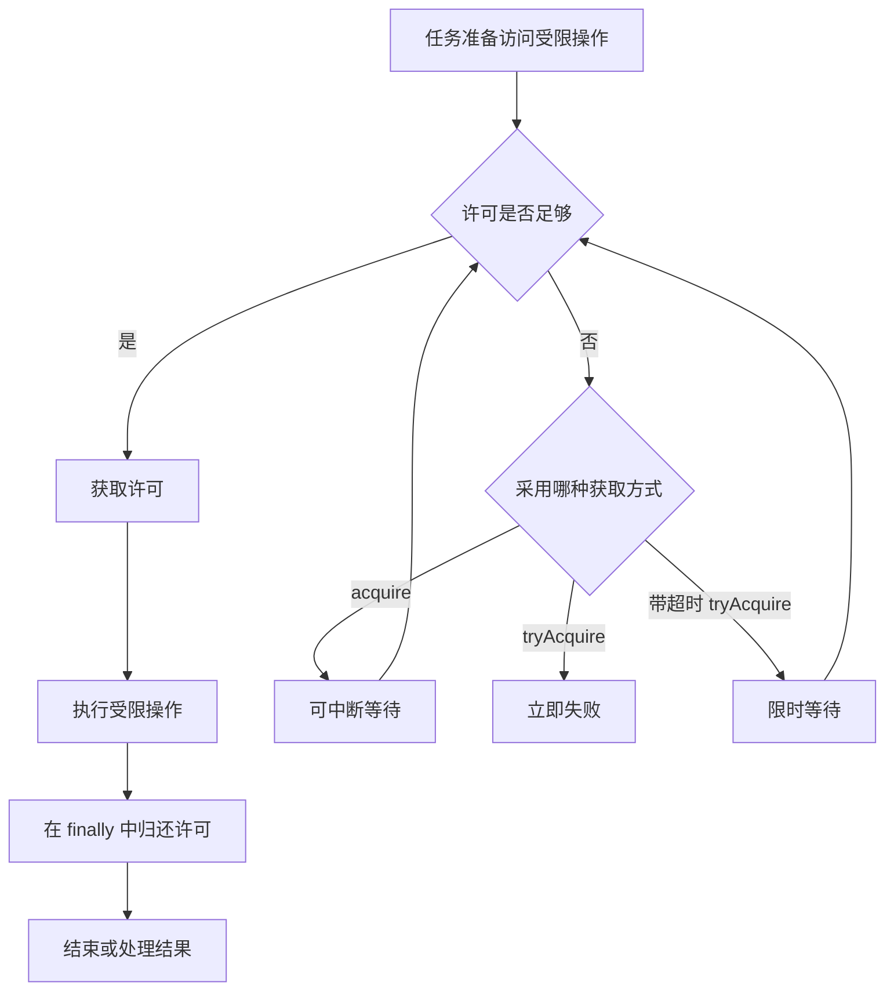

# 3.3.4.5 Semaphore

`Semaphore` 是 Java 并发包提供的计数信号量。它维护一组抽象的“许可”（permit）：线程在进入受限区域前获取许可，离开时归还许可；当没有足够许可时，新的获取者需要等待、超时返回或立即失败。许可不对应某个具体对象，也不记录当前持有者，因此 `Semaphore` 的核心能力不是保护某个临界区，而是限制同时进入某类操作的线程数量。

这种区别决定了它最适合处理容量问题。例如，一个外部服务最多允许 20 个并发请求，一个计算模块同时只能运行 4 个高内存任务，一组可复用资源只有 8 份，或者某段并非线程安全的代码暂时只能串行执行，都可以把容量映射成许可数。许可数量表达的是“最多允许多少个参与者同时占用”，而不是“哪个线程拥有哪把锁”。

本文讨论 `java.util.concurrent.Semaphore` 的语义、典型实现机制、使用边界和工程权衡。内容保持通用 Java 视角，不依赖特定应用平台。

## 从资源容量推导许可模型

假设某个资源一次最多安全地服务 `N` 个任务。没有容量控制时，任务可能同时涌入：前几个任务正常执行，后续任务继续占用线程、连接、内存或文件句柄，直到资源响应时间急剧上升，甚至形成级联故障。仅仅增加线程通常不能提高这种受限资源的实际吞吐，反而会扩大排队和竞争成本。

`Semaphore(N)` 把这条物理或逻辑约束显式放进程序：

1. 每个任务使用资源前调用 `acquire()` 消耗一个许可。
2. 当前可用许可至少为 1 时，获取成功，任务进入受限区域。
3. 当前没有许可时，任务在信号量内部等待。
4. 已进入的任务完成后调用 `release()` 增加一个许可，使等待者有机会继续。

许可不是必须与某种真实资源一一对应。它只是一个并发协议中的计数单位。只要所有参与者遵守“成功获取后才能进入，退出时只归还自己成功获取的数量”，信号量就能把并发度维持在约定范围内。



图中的关键不是 API 名称，而是进入和退出必须形成一条完整路径。获取许可之前抛出的异常不应触发释放；获取成功之后，无论业务操作正常返回还是抛出异常，都必须释放。这个边界是正确使用 `Semaphore` 的第一原则。

## Semaphore 不等于锁

当许可数为 1 时，`Semaphore(1)` 能让同一时刻最多一个线程进入受限区域，表面上与互斥锁相似，但二者语义并不相同。

锁通常具有所有权。线程成功获取 `ReentrantLock` 后成为持有者，只有持有者才能合法解锁；内置监视器也要求线程持有监视器才能退出同步区域或调用相关条件操作。`Semaphore` 不记录哪个线程取得了许可，任何线程都可以调用 `release()`。这种无所有权特性有时有用，例如一个线程提交任务，另一个线程在任务完成时释放配额；但它也意味着类库不会替使用者检查“是否多释放”。

锁保护的是临界区及其共享不变式。某段代码必须互斥执行时，锁的所有权、可重入性和条件队列通常更符合问题模型。信号量控制的是并发数量。它允许许可数大于 1，多个线程可以同时进入，因此不会自动保证被访问对象的线程安全。

还要注意可重入差异。`ReentrantLock` 允许同一线程重复获取，并记录持有次数；`Semaphore` 只计算许可。假设一个方法已经获取了唯一许可，又在同一调用链中再次执行 `acquire()`，它会像其他线程一样等待，而当前线程只有退出内层调用后才可能执行外层 `release()`，最终形成自我阻塞。信号量没有“当前线程已经持有许可”的概念。

因此，`Semaphore(1)` 可以实现某些二元信号量协议，却不应被默认当作 `Lock` 的替代品。需要所有权检查、可重入、多个条件队列或围绕共享不变式建立严格互斥时，优先使用锁；需要表达容量、配额或允许跨线程移交时，信号量更自然。

## API 语义与选择

`Semaphore` 的 API 可以按“是否等待”“是否响应中断”“一次获取多少许可”三个维度理解。

### acquire：可中断等待

`acquire()` 获取一个许可。如果没有可用许可，当前线程进入等待；等待期间被中断时抛出 `InterruptedException`。如果方法正常返回，就表示许可已经成功取得。

最常见的使用模式如下：

```java
public final class ConcurrentGate {
    private final Semaphore permits;

    public ConcurrentGate(int maxConcurrency) {
        if (maxConcurrency <= 0) {
            throw new IllegalArgumentException("maxConcurrency must be positive");
        }
        this.permits = new Semaphore(maxConcurrency);
    }

    public <T> T execute(Callable<T> action) throws Exception {
        permits.acquire();
        try {
            return action.call();
        } finally {
            permits.release();
        }
    }
}
```

这里不需要额外的“是否获取成功”标志，因为 `try` 位于 `acquire()` 之后：`acquire()` 抛出中断异常时，控制流不会进入 `try`，自然也不会执行 `finally` 中的 `release()`；只有正常返回后才存在需要归还的许可。

如果方法在调用 `acquire()` 前后还有其他可能抛异常的步骤，必须继续保持这条边界。最危险的写法是把获取动作和 `try` 的位置安排错：

```java
try {
    permits.acquire();
    callRemoteService();
} finally {
    permits.release();
}
```

如果线程在等待许可时被中断，`acquire()` 没有成功，但 `finally` 仍会执行，凭空增加一个许可。这样的错误不会立即报错，却会逐步突破原定并发上限。修复方式是把 `acquire()` 放到 `try` 之前，或者用布尔变量精确记录是否已经获取。

### acquireUninterruptibly：忽略等待期间的中断

`acquireUninterruptibly()` 也会等待许可，但等待过程不会因中断而提前抛出。线程在等待期间收到的中断不会凭空消失：方法取得许可并返回后，中断状态仍会保留。不过，任务无法借助中断及时停止，因此它只适合确实不能取消的协议。

“处理 `InterruptedException` 麻烦”不是使用不可中断获取的理由。在线程池关闭、任务取消和超时传播中，中断是重要协作信号。普通业务边界应优先选择 `acquire()` 或带超时的 `tryAcquire()`，并由当前层明确决定是继续抛出、转换为领域结果，还是恢复中断标志后退出。

### tryAcquire：不等待的背压

`tryAcquire()` 立即尝试获取一个许可。成功返回 `true`，失败返回 `false`，不会进入等待队列。这适合调用方能够快速拒绝、降级、使用缓存结果或改走其他路径的场景。

```java
public Optional<Result> tryExecute(Request request) {
    if (!permits.tryAcquire()) {
        return Optional.empty();
    }

    try {
        return Optional.of(process(request));
    } finally {
        permits.release();
    }
}
```

立即失败可以阻止等待任务无限堆积，但它并不等同于完整的过载保护。上游如果收到失败后立即高频重试，仍可能制造更大压力。拒绝策略需要与重试退避、调用超时、队列上限和监控共同设计。

### 带超时的 tryAcquire：有限等待

`tryAcquire(long timeout, TimeUnit unit)` 最多等待给定时间，并响应中断。返回 `true` 才表示获得许可；超时返回 `false` 时不得释放。

```java
public Result executeWithin(Request request, Duration maxWait)
        throws InterruptedException, TimeoutException {
    boolean acquired = permits.tryAcquire(
            maxWait.toNanos(),
            TimeUnit.NANOSECONDS
    );
    if (!acquired) {
        throw new TimeoutException("Timed out waiting for concurrency permit");
    }

    try {
        return process(request);
    } finally {
        permits.release();
    }
}
```

这个超时只限制“等待许可”的时间，不限制 `process` 的执行时间。如果整个调用有统一截止时间，应在等待许可后计算剩余预算，并把剩余时间继续传给下游。否则，调用可能先等待完整的许可超时，再执行一个同样漫长的操作，整体耗时超过调用方预期。

### 多许可操作

`acquire(int permits)`、`tryAcquire(int permits)` 和 `release(int permits)` 支持一次操作多个许可。它们适合任务成本不是固定 1 单位的情况，例如小任务占 1 个配额，大任务按估算内存占 4 个配额。

多许可操作是整体性的。一个请求获取 3 个许可时，不会先占有 1 个、再等待剩余 2 个；只有当前状态允许一次减去 3 时才成功。这避免了请求持有部分许可后相互等待，但大请求可能比小请求更难获得执行机会，尤其在非公平模式下更明显。

传入负数会触发 `IllegalArgumentException`。传入 0 通常没有实际容量控制意义，也可能让调用方误判自己已经获得资源，应在业务封装层拒绝这种配置。释放数量必须与此前成功获取的数量一致：

```java
public void runWeighted(Task task) throws InterruptedException {
    int weight = task.requiredPermits();
    if (weight <= 0) {
        throw new IllegalArgumentException("weight must be positive");
    }

    permits.acquire(weight);
    try {
        task.run();
    } finally {
        permits.release(weight);
    }
}
```

如果单个任务请求的许可数永久大于信号量可达到的容量，它将永远无法通过普通释放纪律获得满足。`Semaphore` 本身不知道设计容量是多少，因为许可可以动态增加；这种输入约束必须由封装类维护。

## 公平与非公平模式

构造方法 `new Semaphore(permits)` 创建非公平信号量，`new Semaphore(permits, true)` 创建公平信号量。公平性描述的是等待获取许可的线程之间如何选择，不是业务请求从开始到结束的全局顺序。

在公平模式下，对需要阻塞的获取操作，信号量会尽量按照线程到达内部排队点的顺序授予许可。这里必须注意“内部排队点”这一限定：线程调用方法的时间、日志记录时间和真正进入同步队列的时间不完全相同，因此不能据此推导严格的外部先来先服务。

非公平模式允许刚到达的线程在某些时刻直接抢到刚释放的许可，即使队列中已有等待者。这种插队可能减少线程切换和调度成本，提高总体吞吐，却会使单个等待者的延迟更不稳定。在持续竞争下，理论上存在长期得不到许可的风险。

公平模式也不是所有 API 的统一承诺。无参数 `tryAcquire()` 会立即检查当前是否有许可，即使信号量以公平模式构造，它也可以绕过排队线程。带超时的 `tryAcquire(timeout, unit)` 在需要等待时遵守公平设置。需要“只有轮到自己才尝试”的协议时，不能把公平构造和无参数 `tryAcquire()` 混为一谈。

选择时应从目标出发：

| 目标 | 更常见的选择 | 主要代价 |
| --- | --- | --- |
| 最大化总体吞吐，临界操作较短 | 非公平模式 | 个别线程等待时间波动更大 |
| 降低饥饿概率，等待顺序很重要 | 公平模式 | 可能增加唤醒、切换和队列维护成本 |
| 调用方不能等待 | `tryAcquire()` | 需要设计拒绝或降级路径 |
| 调用方可以短暂等待 | 带超时 `tryAcquire()` | 需要管理时间预算和超时结果 |

公平信号量只能约束许可分配，不能保证完成顺序。先取得许可的任务可能执行得更久，后取得许可的任务可能先完成；线程被操作系统暂停后也可能延迟实际执行。如果系统要求严格的请求顺序，应使用显式队列和单独的调度策略，而不是只依赖公平信号量。

## 典型实现机制：AQS 的共享模式

从公开语义看，使用者只需要依赖 `Semaphore` API；理解典型 OpenJDK 实现则有助于解释排队、公平性和批量许可。具体内部类名和代码细节属于实现而非 Java API 契约，未来版本可以改变，不能在业务代码中通过反射依赖。

`Semaphore` 通常基于 `AbstractQueuedSynchronizer`（AQS）的共享获取模式实现。AQS 中的整数同步状态保存当前可用许可数。获取一个许可相当于尝试把状态从 `available` 原子更新为 `available - 1`；释放相当于把状态原子增加相应数量。

获取过程可以概括为：

1. 读取当前可用许可数。
2. 计算减去请求数量后的剩余值。
3. 如果剩余值小于 0，当前尝试失败，阻塞式 API 会进入 AQS 同步队列。
4. 如果剩余值不小于 0，通过 CAS 尝试提交新状态。
5. CAS 因并发修改失败时，重新读取并重试。

共享模式意味着一次释放可能让多个等待者具备继续竞争的条件，这与独占锁一次只允许一个持有者的模型不同。不过，“被唤醒”不等于“已经拿到许可”。线程恢复运行后仍要检查状态、遵守公平规则并完成原子更新，竞争失败时可能继续等待。

公平实现会在尝试扣减许可前检查同步队列中是否存在排在当前线程之前的等待者；存在时放弃直接获取，转而排队。非公平实现通常先尝试扣减，只在许可不足时进入队列。这正是新线程可能抢在旧等待者之前取得许可的原因。

释放过程不是把许可“交给某个指定线程”，而是先增加共享状态，再根据队列状态传播唤醒。哪个线程最终成功扣减许可取决于公平模式、请求数量和实际调度。把 `release()` 理解成“归还计数并促使等待者重新检查条件”比理解成“定向唤醒下一线程”更准确。

### 许可数为什么可能超过初始值

初始许可数不是硬编码上限。`release()` 不检查当前线程是否获取过许可，也不检查增加后是否超过构造参数。下面的代码会把可用许可从 2 增加到 3：

```java
Semaphore semaphore = new Semaphore(2);
semaphore.release();
System.out.println(semaphore.availablePermits()); // 3
```

这不是实现漏洞，而是无所有权信号量的语义结果。它允许某些协议从 0 个许可开始，由其他事件逐步释放信号；也允许跨线程归还。但在容量限制场景中，多释放会破坏上限，所以应把原始信号量封装在职责清晰的组件中，避免任意调用方直接操作。

许可计数也受整数范围约束。持续错误释放最终可能溢出并触发异常；持续大量扣减相关的管理操作也有边界。正常程序不应把 `Semaphore` 当作无限计数器，而应维护稳定且可证明的获取与释放守恒关系。

## 内存一致性语义

`Semaphore` 不只提供计数和阻塞，也建立跨线程的内存可见性关系。按照并发包的内存一致性约定，一个线程在调用 `release()` 之前完成的操作，happens-before 另一个线程随后成功执行 `acquire()` 之后的操作。

这使信号量可以安全地参与线程间移交。例如生产线程写好某个共享槽位后释放许可，消费线程取得对应许可后读取槽位，可以通过信号量的同步动作观察到此前写入。但成立条件是协议确实把写入放在 `release()` 之前，并把读取放在成功获取之后。

需要准确把握这条保证的边界：

- 它不意味着任意两个使用同一信号量的任务自动按业务顺序关联。多个许可、多个生产者和多个消费者并存时，还需要数据结构定义“哪个结果属于哪个请求”。
- 它不让受限区域中的普通复合操作自动具备互斥性。许可数大于 1 时，多个线程仍能同时修改共享对象。
- 它不替代对象安全发布、容器线程安全和业务不变式保护。信号量只为与成功获取和释放相连的操作建立同步关系。
- 无参数 `tryAcquire()` 只有在返回 `true`、确实取得许可后才能作为成功获取理解；返回 `false` 不构成进入受限区域的依据。

因此，把 `Semaphore` 用作并发限制时，仍要单独审查受限操作访问的数据。如果多个获准线程会修改同一个非线程安全集合，应使用合适的锁、并发容器、不可变数据或线程封闭，而不能认为“已经有信号量，所以共享状态安全”。

## 设计许可数量

许可数不应来自“看起来差不多”的常量，而应来自被保护对象的真实容量和服务目标。设计时至少要区分以下几类约束。

### 固定资源数量

如果确实只有 `N` 个可独占资源，例如预先创建的工作槽位，那么许可数通常就是 `N`。此时还需要让“拿到许可”和“拿到具体资源”保持一致。单独使用信号量只限制并发数，不负责保存资源对象；实践中常与阻塞队列组合，队列持有资源，信号量表达额外的并发协议。但如果队列本身已经准确表示资源可用性，再增加一个信号量可能造成双重计数和状态不一致。

### 外部依赖的并发能力

外部服务或存储系统可能有明确的并发上限，也可能只在压测中表现出最佳区间。许可数过大时，下游排队和超时增加；许可数过小时，本地吞吐受限。应结合延迟分位数、错误率、下游限额和本地等待时间调整，而不是只观察平均吞吐。

信号量限制的是某个进程内、某个对象实例看到的并发数。如果程序启动了多个进程或多台机器，每个实例各自拥有 `N` 个许可，系统总并发上限可能接近实例数乘以 `N`。需要全局配额时，单机 `Semaphore` 不能独立完成任务，应由集中式协调、分片配额或下游自身限流承担。

### 高成本本地任务

对高内存、文件句柄密集或会产生大量临时对象的任务，可以用许可数限制同时执行量。但如果任务主要消耗 CPU，线程池大小本身往往已经表达并行度；再叠加一个许可数更小的信号量，会让工作线程阻塞在池内，降低线程池利用率。此时应考虑直接调整执行器并行度或在提交前获取许可。

### 许可数不是速率

并发度限制和速率限制是不同问题。`Semaphore(10)` 表示最多 10 个任务同时处于受限区域，不表示每秒最多执行 10 次。若每个任务耗时 10 毫秒，吞吐可能接近每秒上千次；若每个任务耗时 10 秒，吞吐可能低于每秒一次。

需要“每秒多少次”“固定时间窗口多少请求”或平滑发放令牌时，应使用令牌桶、漏桶或其他速率限制器。信号量可以与速率限制同时存在：前者保护同时占用量，后者约束单位时间进入量，但二者不能互相替代。

## 与线程池、队列的组合

线程池、任务队列和信号量都能影响系统中同时存在的工作量，但作用位置不同。

线程池大小限制同时执行任务的工作线程数量；有界队列限制尚未开始执行的任务数量；信号量限制某一段操作的并发进入量。一个线程池任务可能只有中间一小段需要访问受限资源，因此线程池大小不一定等于该资源的合理并发数。反过来，如果所有任务从头到尾都受同一容量约束，直接使用合适大小的执行器可能比“较大线程池加较小信号量”更简单。

获取许可的位置会显著改变系统行为。

### 在工作线程中获取

任务先提交到线程池，开始执行后再 `acquire()`。优点是提交方不会因等待许可而阻塞，封装也直观；缺点是大量工作线程可能全部阻塞在信号量上，使线程池无法执行其他不需要该许可的任务。如果这些任务的完成动作又负责释放许可，还可能出现线程饥饿式停滞。

### 在提交前获取

提交方先获得许可，再把任务交给线程池；任务结束时释放。这样可以在任务进入执行器前形成背压，避免队列和工作线程被占满。但必须处理提交失败：若执行器拒绝任务，提交方已经取得的许可需要立即归还。

```java
public void submitBounded(Executor executor, Runnable task)
        throws InterruptedException {
    permits.acquire();
    boolean submitted = false;
    try {
        executor.execute(() -> {
            try {
                task.run();
            } finally {
                permits.release();
            }
        });
        submitted = true;
    } finally {
        if (!submitted) {
            permits.release();
        }
    }
}
```

`submitted` 只负责“提交失败时由谁释放”。成功提交后，许可的释放责任转移给任务包装器；若 `executor.execute` 抛出拒绝异常或其他运行时异常，外层 `finally` 归还许可。该例也说明跨线程释放是信号量允许且有价值的能力。

不过，提交前获取会让调用 `submitBounded` 的线程等待。如果它恰好是同一个受限执行器中的工作线程，而且它等待的新任务必须由该执行器运行并释放许可，就需要检查是否存在依赖环。任何阻塞式容量控制都必须与执行资源拓扑一起分析。

## 案例：限制外部调用并发并支持超时

下面的封装将许可等待时间与实际调用分开记录，并确保只有成功获取后才释放。它没有假设具体网络库，可以用于任何可能阻塞的 Java 调用。

```java
public final class LimitedClient {
    private final Semaphore permits;
    private final RemoteClient delegate;

    public LimitedClient(int maxConcurrentCalls, RemoteClient delegate) {
        if (maxConcurrentCalls <= 0) {
            throw new IllegalArgumentException(
                    "maxConcurrentCalls must be positive"
            );
        }
        this.permits = new Semaphore(maxConcurrentCalls);
        this.delegate = Objects.requireNonNull(delegate);
    }

    public Response call(Request request, Duration queueTimeout)
            throws InterruptedException, TimeoutException {
        long startNanos = System.nanoTime();
        boolean acquired = permits.tryAcquire(
                queueTimeout.toNanos(),
                TimeUnit.NANOSECONDS
        );
        long waitNanos = System.nanoTime() - startNanos;

        if (!acquired) {
            recordRejected(waitNanos);
            throw new TimeoutException("Concurrency limit wait timed out");
        }

        recordAccepted(waitNanos);
        try {
            return delegate.call(request);
        } finally {
            permits.release();
        }
    }

    private void recordAccepted(long waitNanos) {
        // Record metrics in the surrounding application.
    }

    private void recordRejected(long waitNanos) {
        // Record metrics in the surrounding application.
    }
}
```

这个设计有几个明确边界：

第一，`queueTimeout` 只表示本地等待许可的上限。`delegate.call` 自身仍需配置执行超时，否则取得许可后可能永久占用。

第二，中断直接向上抛出。调用方取消任务时，等待许可的线程能及时退出，也不会误释放许可。

第三，记录等待时间而不只记录当前 `availablePermits()`。可用许可瞬时值很容易变化，等待时长和超时次数更能反映容量是否不足。

第四，许可覆盖的是完整的下游调用。如果真实瓶颈只存在于调用的一部分，应缩小受限范围；如果响应对象在返回后仍占用受限资源，则不能在 `delegate.call` 返回时过早释放，而应把释放动作绑定到资源真正关闭的时刻。

## 案例：资源池与信号量的职责分离

考虑一组不可并发复用的资源。最直接的数据结构是 `BlockingQueue<Resource>`：借用者 `take()` 一个资源，归还者 `put()` 回去。队列为空自然表示没有资源，已经具备容量等待功能。此时再增加同样数量的 `Semaphore` 往往是重复设计，因为必须同时维护“许可数”和“队列元素数”两个状态。

只有当信号量表达不同约束时，组合才有意义。例如资源池有 20 个连接，但出于下游保护只允许同时执行 8 个高成本操作，可以先从池中借连接，再获取 8 个操作许可；更合理的顺序取决于哪种资源更稀缺、等待时是否会无效占用另一种资源。

若先借连接再等操作许可，等待期间会闲置占用连接；若先拿操作许可再等连接，等待期间会占用操作配额。解决这类问题不能只靠交换两行代码，而要建立统一的获取顺序、超时和失败回滚，并尽量避免同时持有一种稀缺资源再等待另一种。多个信号量或资源池交叉获取时，也应固定全局顺序以降低死锁风险。

## 动态调整与管理方法

`availablePermits()` 返回调用瞬间估计的可用许可数。它适合监控和诊断，不适合“先检查再获取”的控制逻辑：

```java
if (permits.availablePermits() > 0) {
    permits.acquire();
}
```

检查与获取之间，其他线程可能先拿走许可，所以 `acquire()` 仍可能阻塞。需要原子地表达“有就拿，没有就返回”时，应直接使用 `tryAcquire()`。

`getQueueLength()` 返回正在等待获取许可的线程数量估计值，`hasQueuedThreads()` 判断是否可能存在等待者。它们不提供瞬时精确快照，也不能作为正确性条件；在返回之后，线程可能立即入队或离队。它们适合做趋势监控、告警和排障信息。

`drainPermits()` 原子地取走当前所有可用许可并返回取走数量。它不会撤销已经被其他线程获取的许可，也不会等待这些许可归还，因此不能单独实现“暂停并等到所有进行中任务结束”。如果调用方随后需要恢复容量，必须准确保存并释放取走的数量，同时考虑执行中任务的后续释放。

`reducePermits(int reduction)` 是 `protected` 方法，供子类减少可用许可。减少后内部状态可以变为负数，表示后续需要有足够释放才能重新出现可用许可。它不是通用的动态配置接口，直接子类化还会把应用设计绑定到较少使用的管理语义。

动态缩容尤其需要谨慎。假设上限从 10 调整为 5，而当前已有 8 个任务持有许可，不可能强行让其中 3 个任务瞬间停止。合理语义通常是禁止新的任务进入，直到进行中数量降到新上限以内。与其直接暴露原始 `Semaphore`，更稳妥的做法是由专门的容量控制组件维护目标上限、当前占用、配置变更和监控。

## 中断、取消与关闭

阻塞在 `acquire()` 或带超时 `tryAcquire()` 的线程可以通过中断取消。捕获 `InterruptedException` 后如何处理取决于方法契约：

- 当前方法声明允许中断时，继续向上抛出最清晰。
- 当前层必须转换成其他结果时，应保留取消含义，不要把它伪装成普通业务失败。
- 若不能继续抛出且需要退出，通常应调用 `Thread.currentThread().interrupt()` 恢复中断状态，让上层仍能观察到。

不能在捕获中断后无条件释放，因为等待者可能根本没有取得许可。同样，不能吞掉中断后无限重试，否则执行器关闭或调用方取消都无法使任务退出。

`Semaphore` 本身没有 `close()`。关闭语义属于使用它的组件。一个完整关闭协议通常要回答：

1. 何时拒绝新的获取请求。
2. 正在等待许可的线程如何被唤醒或取消。
3. 已经进入的任务是否允许自然完成。
4. 如何等待所有占用者退出。
5. 关闭后是否允许重新打开。

仅调用 `drainPermits()` 不能完整解决这些问题，因为未来的 `release()` 仍会增加许可，已经等待的线程也可能随后继续。常见做法是在封装层增加关闭状态，获取前后都检查状态，并通过中断、任务取消或专用条件机制协调等待者。若需求实质是生命周期管理，可能需要 `ExecutorService`、`Phaser`、锁与条件等工具共同表达，而不是强迫单个信号量承担全部职责。

## 多个信号量与死锁

单个信号量主要造成容量等待；当任务需要依次获取多个信号量或其他锁时，同样可能形成死锁。线程 A 先取得数据库许可再等待文件许可，线程 B 先取得文件许可再等待数据库许可，如果两者都占用了最后一个可用单位，就可能永久等待。

降低风险的基本方法包括：

- 规定所有代码按同一全局顺序获取多个资源。
- 获取后续资源失败时，及时释放已经取得的资源并退避。
- 使用带超时的获取，使系统能够记录和恢复，而不是无限等待。
- 避免在持有许可时调用无法控制、可能回调当前组件的外部代码。
- 若多个资源本质上必须原子分配，考虑由一个集中分配器统一管理，而不是组合多个独立信号量。

多许可获取可以解决同一个信号量上的“部分取得”问题，但不能让多个不同同步器的获取自动成为原子事务。

## 常见误区

### 误区一：在 finally 中无条件 release

只有成功取得的许可才能释放。把 `acquire()` 包在会无条件执行释放的 `try-finally` 内，会在中断或获取失败时增加虚假许可。应把 `try` 放在成功获取之后，或者用状态变量记录责任。

### 误区二：认为 release 必须由获取线程执行

信号量不记录所有者，跨线程释放在语义上允许，提交前限流就是典型用途。真正要求是释放责任必须唯一且清晰：获取线程、异步任务、完成回调只能有一方负责，不能遗漏，也不能重复。

### 误区三：认为许可数不会超过初始值

初始值不是自动上限。任何多余的 `release()` 都会增加可用许可。容量控制必须依赖调用协议和封装，而不是依赖类库替使用者校验。

### 误区四：认为公平模式保证严格 FIFO

公平模式降低插队和饥饿概率，但只约束特定阻塞获取的内部排队顺序。它不保证调用发生顺序、线程开始执行顺序、任务完成顺序，也不约束无参数 `tryAcquire()`。

### 误区五：把并发限制当速率限制

许可控制同时占用量，不控制时间窗口内调用次数。短任务在同一许可上可以快速周转，形成很高请求速率。需要速率上限时应采用相应算法。

### 误区六：用 availablePermits 做先检查后执行

它只是瞬时观测，不能与后续动作组成原子操作。正确选择是 `tryAcquire()`、阻塞获取或带超时获取。

### 误区七：认为使用 Semaphore 后共享对象就线程安全

许可数大于 1 时仍有并发访问；即使许可数为 1，无所有权和不可重入语义也可能不符合共享不变式的保护需求。数据安全和容量控制必须分别证明。

### 误区八：在大线程池中阻塞大量工作线程

如果很多任务启动后首先等待同一个小信号量，线程池可能只剩下等待者，其他任务得不到执行机会。应评估把获取移动到提交端、拆分执行器或直接调整池大小。

### 误区九：用信号量等待一组任务完成

可以通过预先拿走许可、再等待全部归还等技巧模拟完成等待，但协议晦涩且容易受到额外释放影响。等待固定任务完成应优先考虑 `CountDownLatch`，循环阶段协作考虑 `CyclicBarrier` 或 `Phaser`，等待异步结果考虑 `Future`。

## 与相近工具的边界

| 工具 | 核心问题 | 与 Semaphore 的主要区别 |
| --- | --- | --- |
| `ReentrantLock` | 一个线程独占临界区并维护共享不变式 | 有所有权、可重入，可创建 `Condition` |
| `CountDownLatch` | 等待一组事件完成 | 计数只递减到零，不能通过获取和归还循环复用 |
| `CyclicBarrier` | 固定参与者在阶段点相互等待 | 关注参与者会合，不表达资源容量 |
| `Phaser` | 动态参与者的多阶段协作 | 关注注册、到达和阶段推进 |
| `BlockingQueue` | 有界缓冲与生产消费 | 同时保存元素，并通过队列容量形成背压 |
| 有界 `ExecutorService` | 限制任务执行和排队 | 管理线程、任务生命周期及拒绝策略 |
| 速率限制器 | 限制单位时间内的进入频率 | 关注时间维度，不只关注同时占用量 |

选择工具时，应先用一句话描述不变量。如果不变量是“同时调用下游的任务不超过 8 个”，信号量合适；如果是“集合更新期间不能有其他线程观察中间状态”，应使用锁；如果是“主线程等待 8 个任务各完成一次”，应使用门闩；如果是“缓冲区最多保存 100 个待处理元素”，有界阻塞队列更直接。

## 测试与排障

信号量错误通常表现为两类：许可泄漏导致系统越来越难获得许可，或者多释放导致实际并发突破上限。测试不能只验证最终返回值，还应验证协议不变量。

可以用原子计数器记录当前进入受限区域的任务数，并记录观察到的最大值。大量并发任务执行后，最大值不应超过许可上限，当前值应回到 0。测试还应主动覆盖业务异常、获取期间中断、提交拒绝、超时和取消路径，因为正常路径往往不是许可失衡的来源。

不要把 `Thread.sleep` 当作唯一同步手段。测试可使用 `CountDownLatch` 让一批线程同时开始，用另一个门闩控制受限操作何时退出，再通过 `Future.get` 等待结果。这样能稳定制造竞争，而不是依赖机器速度。

运行中建议观察：

- 获取许可的等待时长分布，而不只是平均值。
- 超时、立即拒绝和中断退出次数。
- 当前占用量与可用许可的变化趋势。
- 估计等待线程数及其持续时间。
- 受限操作自身的执行耗时、错误率和取消率。

线程转储中，等待 `Semaphore` 的线程通常会出现在 AQS 相关的停放调用栈上。排查时要继续寻找谁持有逻辑许可、对应任务卡在哪里、异常路径是否执行了释放。由于信号量没有所有者信息，无法像独占锁那样直接从同步器得到持有线程；这也是封装层记录任务标识、获取时间和释放结果的重要原因。

如果 `availablePermits()` 长期为 0，需要区分两种情况：容量确实持续饱和，还是许可已经泄漏。前者通常伴随稳定的完成和释放，只是新任务持续到来；后者表现为进行中任务数下降后许可仍不恢复。若可用许可逐渐超过配置值，则几乎可以确定存在重复释放或未成功获取却释放的路径。

## 使用决策清单

在引入 `Semaphore` 前，可以依次回答以下问题：

1. 要限制的是同时占用量，还是单位时间速率、任务队列长度或线程数量？
2. 许可数对应哪种真实容量，为什么是这个数？
3. 所有进入路径是否都先成功获取，所有退出路径是否都恰好释放一次？
4. 获取应立即失败、限时等待，还是允许无限等待？
5. 等待期间是否必须响应中断和取消？
6. 公平性目标是总体吞吐还是降低个别请求饥饿？
7. 受限区域中的共享对象是否另外满足线程安全要求？
8. 获取动作放在提交前还是工作线程内，会不会占满执行器？
9. 多实例部署后，本地许可上限是否仍符合系统级容量？
10. 如何观测等待、超时、当前占用和许可失衡？
11. 关闭时如何拒绝新任务、取消等待者并处理进行中任务？
12. 是否存在更直接表达问题的锁、阻塞队列、门闩或有界执行器？

这些问题如果没有明确答案，先增加信号量通常只会把无界压力改造成难以诊断的阻塞。容量控制需要与超时、取消、执行器、下游能力和监控共同形成闭环。

## 小结

`Semaphore` 用可增减的许可计数表达并发容量。获取许可使任务进入受限区域，释放许可让后续任务继续；阻塞、立即失败和限时等待分别对应不同的背压策略。典型实现借助 AQS 共享模式完成原子扣减、排队和传播唤醒，公平模式降低插队，非公平模式通常更偏向吞吐。

正确使用它的关键不是记住 `acquire()` 与 `release()`，而是维持许可守恒：只有成功获取后才能释放，每次释放数量与获取数量一致，释放责任在异常、取消、拒绝和跨线程移交中始终唯一。还要牢记，信号量没有所有权、不是可重入锁、不会自动保护共享对象，也不能替代速率限制或全局分布式配额。

当问题确实是“最多允许多少个任务同时占用某种能力”时，`Semaphore` 能以很小的 API 提供清晰模型；当问题实质是互斥、阶段会合、结果等待、队列背压或生命周期管理时，应选择与不变量更匹配的并发工具。
