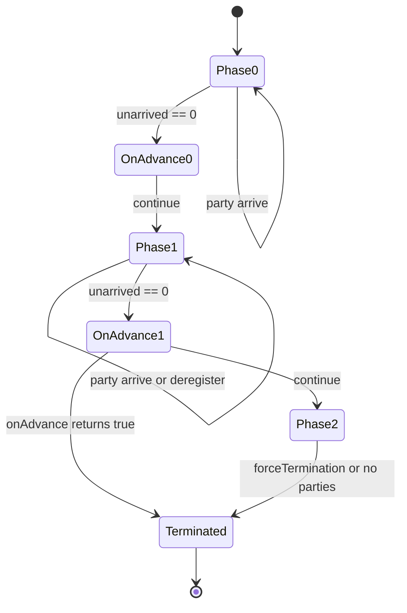

# 3.3.4.7 Phaser

Phaser 是 `java.util.concurrent` 包中用于“多阶段协作”的同步器。它解决的不是单次等待，而是一组参与者在若干阶段中反复汇合、推进、退出的问题。理解 Phaser 时，关键不在于把 `arriveAndAwaitAdvance()` 当作“更强的 barrier”，而在于理解它把阶段编号、参与者数量、到达数量、等待推进、动态注册、动态注销和终止条件组合成了一套可演化的协作协议。

在并发程序中，很多工作不是“一批线程都结束后主线程继续”这么简单。更常见的情况是：一批任务先完成准备阶段，全部准备好之后进入计算阶段；计算阶段中有的任务会拆出子任务，子任务也需要加入后续阶段；某些任务完成自己的职责后不再参与下一阶段；每个阶段结束时还需要做一次统一判断，决定是否继续下一轮。`CountDownLatch` 可以表达一次性倒计时，`CyclicBarrier` 可以表达固定参与者的循环屏障，但二者都不适合表达“参与者数量会变化、阶段会持续推进、阶段推进时有自定义终止逻辑”的流程。Phaser 正是为这类问题准备的。

本文只从通用 Java 并发视角讨论 Phaser。它不负责保护任意共享数据的业务一致性，也不会替代线程池、锁、原子类、并发集合或任务编排框架。Phaser 的职责是建立阶段边界：哪些参与者属于当前阶段，谁已经到达，谁还没有到达，等待者什么时候可以继续，下一阶段是否还应存在。只有把这个边界理解清楚，才能写出可解释、可诊断、可关闭的阶段式并发代码。

## Phaser 要解决的核心问题

阶段式协作的难点在于“同一组逻辑任务需要多次同步”。如果只有一次同步，可以让每个工作线程完成后调用 `countDown()`，主线程 `await()`；如果参与者数量固定，可以让每个线程在每一轮调用 `await()`，凑齐固定数量后一起进入下一轮。但当工作流程满足下面任意一个条件时，简单同步器就会变得别扭：

1. 阶段不止一个，任务需要在每个阶段末尾汇合。
2. 参与者数量不是固定值，某些任务会在运行中加入。
3. 某些参与者完成一部分阶段后要退出，不再阻塞后续阶段。
4. 阶段推进时需要执行统一判断，例如达到最大轮数、没有剩余参与者、发现全局失败标志后终止。
5. 调用方希望区分“到达但不等待”和“到达并等待”，以便更灵活地组织控制流。

Phaser 把这些需求拆成几个概念：`phase` 表示当前阶段编号，`party` 表示注册参与者，`arrive` 表示某个参与者声明自己已经完成当前阶段，`awaitAdvance` 表示等待阶段编号发生推进，`register` 表示新增参与者，`deregister` 表示参与者退出后续阶段，`onAdvance` 表示阶段推进时的钩子和终止判断。它不是只提供一个阻塞方法，而是允许调用者在阶段协议中选择自己的位置。

一个典型的 Phaser 场景可以想象成多轮数据处理。第一轮所有工作单元读取输入并完成校验；第二轮根据校验结果做转换；第三轮合并中间结果；如果某个工作单元在第一轮发现自己没有后续数据，可以到达并注销；如果某个工作单元在转换阶段拆出了更多工作，可以注册新参与者；每一轮结束时，Phaser 根据当前注册参与者和到达情况推进到下一轮。这里最重要的不是线程数量，而是参与者数量。一个线程可以代表一个参与者，也可以在不同时间代表多个参与者；反过来，一个参与者也可能只是一段任务逻辑，而不是一个长期存在的线程对象。

## phase：阶段编号不是业务步骤名称

Phaser 内部维护一个整数阶段编号，初始通常为 `0`。当当前阶段的所有未注销参与者都到达后，阶段编号推进到下一个值。调用 `getPhase()` 可以读取当前阶段；`arrive()`、`arriveAndAwaitAdvance()`、`arriveAndDeregister()` 等方法也会返回一个阶段编号，通常表示调用发生时所在的阶段。阶段编号是 Phaser 判断等待是否完成的核心依据。

阶段编号有几个容易误解的地方。第一，`phase` 是同步器的状态，不是业务步骤的枚举名。业务上可以把 phase 0 解释为“准备”，phase 1 解释为“执行”，phase 2 解释为“收尾”，但 Phaser 本身只知道整数推进。业务含义必须由调用方维护。第二，阶段推进只表示所有已注册且未注销的参与者完成了上一阶段的到达，不表示它们在下一阶段已经开始工作。第三，阶段编号可能因为终止而变成负值。Phaser 终止后，等待方法会尽快返回，后续注册和到达不再具有正常推进语义。

阶段推进的本质是“当前阶段的未到达数量归零”。Phaser 中的参与者有两个相关数量：已注册参与者数和未到达参与者数。每一阶段开始时，未到达数量通常等于已注册参与者数；每个参与者调用到达方法后，未到达数量减少；当未到达数量变为零，Phaser 触发 `onAdvance`，如果未终止，则进入下一阶段，并把下一阶段的未到达数量重置为新的已注册参与者数。这个过程让 Phaser 能够循环使用，而不是像 CountDownLatch 那样归零后就永久打开。

下面的 Mermaid 图展示了一个简化的阶段流转：



图中最值得注意的是 `onAdvance` 的位置。它不是每个参与者到达时都执行，而是在某个阶段最后一个未到达参与者到达、阶段即将推进时执行。它的返回值决定 Phaser 是否终止。默认实现会在注册参与者数量为零时终止，因此如果所有参与者都注销，Phaser 会自然结束。

## party：参与者不是线程的同义词

`party` 是 Phaser 中非常关键的概念。它表示注册到 Phaser 的参与者数量，而不是线程数量。多数示例中一个工作线程注册一次并代表一个 party，但这只是常见写法，不是规范要求。一个线程可以先代表主流程注册，然后为多个任务分别注册；一个线程池中的工作线程也可以执行许多短任务，每个短任务在运行前注册、结束后注销；甚至某个参与者可以只由主线程代表，用来让主线程也参与阶段推进。

Phaser 提供多种构造和注册方式。`new Phaser()` 创建一个没有参与者的 Phaser；`new Phaser(parties)` 创建时就注册指定数量的参与者；`register()` 动态新增一个参与者；`bulkRegister(int parties)` 一次性新增多个参与者。注册会影响当前阶段或后续阶段的推进条件，因此注册时机必须非常谨慎。如果某个任务已经提交但还没有真正运行，调用方可以先注册，再把任务提交到线程池；任务运行结束后无论成功失败都注销。这样即使任务在执行前被调度延迟，Phaser 也知道有一个参与者尚未到达。

常见错误是让任务自己在 `run()` 方法开头调用 `register()`，主线程随后立即等待阶段推进。这个写法有竞态风险：如果主线程先看到当前没有参与者或参与者已全部到达，阶段可能提前推进；等任务真正开始时再注册，它加入的就可能已经不是调用方以为的那个阶段。比较稳妥的做法是由提交任务的一方在提交前注册，或者使用构造函数一次性注册已知参与者。

```java
Phaser phaser = new Phaser(1); // 主线程作为一个参与者，避免任务尚未注册时阶段提前结束

for (Runnable job : jobs) {
    phaser.register();
    executor.execute(() -> {
        try {
            job.run();
        } finally {
            phaser.arriveAndDeregister();
        }
    });
}

phaser.arriveAndDeregister(); // 主线程不再参与后续阶段
```

这里主线程先注册为一个参与者，是为了在任务注册过程中控制生命周期。每个任务提交前注册，任务结束后在 `finally` 中注销，避免异常导致参与者泄漏。最后主线程注销自己，让阶段推进只受实际工作任务影响。这个例子不是说所有场景都要让主线程注册，而是说明 party 的所有权必须清晰：谁注册，谁保证最终到达或注销。

`getRegisteredParties()`、`getArrivedParties()`、`getUnarrivedParties()` 可以读取当前参与者状态。这些方法适合诊断和监控，不适合作为复杂并发决策的唯一依据，因为读取结果只是某一时刻的快照，读完之后状态可能已经变化。Phaser 的正确性应依赖到达、等待和终止协议，而不是依赖反复读取这些计数再手工判断。

## arrive：到达只声明完成当前阶段

`arrive()` 的语义是当前参与者已经完成当前阶段，但调用线程不等待阶段推进。它会减少当前阶段的未到达数量，并返回到达时的阶段编号。如果这是最后一个未到达参与者，调用 `arrive()` 的线程会触发阶段推进逻辑。与 `arriveAndAwaitAdvance()` 相比，`arrive()` 更像是一次非阻塞信号：我已经完成这一阶段，是否等待别人是另一件事。

这种拆分在控制流复杂时很有用。例如一个参与者完成阶段性工作后，还要去做与下一阶段无关的清理；或者一个协调线程只负责通知 Phaser 自己已经完成当前职责，不需要停在屏障处；又或者调用方希望先到达，再用带超时或可中断的方法等待阶段推进。Phaser 把“到达”和“等待”分开，正是为了支持这些组合。

不过，`arrive()` 有一个严格前提：调用者必须是已注册且尚未在当前阶段到达的参与者。重复到达、未注册到达或终止后继续按照正常流程到达，都会破坏协议。Phaser 对非法状态会抛出 `IllegalStateException` 或返回终止相关结果，但业务代码不应依赖异常来纠正协议错误。到达是参与者的承诺：当前阶段的责任已经完成，后续不应再修改需要由阶段边界发布的本阶段结果。

如果一个参与者调用 `arrive()` 后又继续读写本阶段共享数据，而其他参与者已经通过等待进入下一阶段，就会制造语义混乱。Phaser 只能保证阶段推进发生在所有参与者到达之后；它不能理解业务上的“到达之后是否还在改上一阶段数据”。因此，到达点应放在阶段工作的真正末尾。对复杂任务来说，可以把每个阶段的写入收束在局部变量或线程私有结构中，等阶段完成后再进行受控合并。

## awaitAdvance：等待阶段编号变化

`awaitAdvance(int phase)` 的语义是：如果 Phaser 当前阶段仍然等于参数 `phase`，则等待它推进；如果当前阶段已经不是参数值，立即返回当前阶段；如果 Phaser 已终止，返回负数。这个方法本身不表示调用者到达。它只是等待阶段变化。正因为如此，`awaitAdvance` 常常与 `arrive()` 搭配使用：先到达当前阶段，再等待当前阶段推进。

```java
int phase = phaser.arrive();
phaser.awaitAdvance(phase);
```

这两行与 `arriveAndAwaitAdvance()` 很接近，但可读性上更明确地暴露了两个动作。更重要的是，拆开以后可以换成 `awaitAdvanceInterruptibly(phase)` 或 `awaitAdvanceInterruptibly(phase, timeout, unit)`，让等待响应中断或超时。`arriveAndAwaitAdvance()` 不抛出 `InterruptedException`，等待过程中如果线程被中断，它不会以异常形式中止等待；对于需要严格取消语义的上层流程，拆分到达和等待通常更容易表达边界。

`awaitAdvance` 的参数必须是调用方观察到的阶段编号，而不是随手传入 `getPhase()` 的当前值后再做复杂判断。典型流程是先保存一个 phase，再等待这个 phase 被推进。如果直接在循环中反复读取 `getPhase()` 并等待，容易写出竞态条件：读取与等待之间阶段已经变化，调用方以为自己等待了某一轮，实际却等待了下一轮或根本没有等待。阶段编号是等待条件，等待条件应当被保存并传递。

需要注意，`awaitAdvance` 等待的是 Phaser 状态推进，不等待某个具体线程执行到某行代码。阶段推进后，所有等待者会被释放，但它们重新获得 CPU 的顺序由调度决定。某个线程从等待中返回，并不意味着其他线程已经完成下一阶段的任何动作。Phaser 建立的是阶段边界，不是下一阶段内部执行顺序。

## arriveAndAwaitAdvance：最常用也最容易滥用的方法

`arriveAndAwaitAdvance()` 是 Phaser 最常见的调用方式。它表示当前参与者到达当前阶段，并等待所有参与者到达后再继续。对于固定的多轮协作，它很直观：

```java
for (int i = 0; i < rounds; i++) {
    prepareRound(i);
    phaser.arriveAndAwaitAdvance();

    computeRound(i);
    phaser.arriveAndAwaitAdvance();
}
```

这段代码表达了两个阶段边界：所有参与者都准备完，才开始计算；所有参与者都计算完，才进入下一轮。它的优点是简洁，缺点是取消、超时和失败处理不明显。只要某个参与者在 `prepareRound` 中抛出异常而没有到达或注销，其他参与者就可能永久等待。只要某个参与者因为外部阻塞迟迟不到达，所有调用 `arriveAndAwaitAdvance()` 的参与者都会停住。并发程序里，越简洁的同步点越要把异常路径写清楚。

在真实代码中，`arriveAndAwaitAdvance()` 通常要和 `try/finally`、全局失败标志、`forceTermination()` 或外部取消机制配合。一个参与者如果不能完成后续阶段，应该注销，而不是让自己永远挂在已注册参与者列表里。一个参与者如果发现不可恢复错误，也应该有办法通知其他等待者停止等待。Phaser 不会自动捕获任务异常，更不会自动把一个线程的失败传播给其他线程；这些都必须由调用方设计。

还要注意 `arriveAndAwaitAdvance()` 不等于“所有线程完全同步到同一行”。它只保证所有参与者都到达了当前阶段的同步点，然后阶段推进。等待释放后，各线程继续执行的先后仍然不确定。不要在屏障之后立即假设某个特定线程已经更新了下一阶段的状态；如果下一阶段内还需要互斥或顺序，应使用锁、队列、原子变量或其他协议补充。

## register 与 bulkRegister：动态加入必须有所有权

动态注册是 Phaser 区别于 CyclicBarrier 的核心能力之一。`register()` 新增一个参与者，返回注册发生后的当前阶段编号；`bulkRegister(int parties)` 一次新增多个参与者，适合提前知道一批子任务数量的场景。动态注册使得 Phaser 可以表达任务树、分批加载、递归拆分、阶段中产生新参与者等流程，但也引入了生命周期风险。

最重要的规则是：注册和注销必须配对。一个参与者被注册以后，要么在每个参与阶段调用到达，要么在不再参与时调用注销。遗漏注销会让后续阶段永远等一个不会再到达的参与者；过早注销会让阶段提前推进；重复注销会让参与者数量错误。注册方必须能回答“这个 party 由谁负责结束”。如果答案是“任务自己应该会处理”，代码就必须用 `finally` 保证它真的处理。

动态注册还有阶段归属问题。假设某个参与者在阶段 2 中注册了一个新 party，新 party 是否应该参与阶段 2 的剩余等待，取决于注册发生时 Phaser 的状态。Phaser 的实现允许在运行中注册，但这不代表任何时机都符合业务语义。为了避免理解成本过高，实践中常把注册集中在阶段开始之前，或者在父任务明确知道子任务应参与后续阶段时一次性 `bulkRegister`。如果确实要在阶段中注册，应把“新参与者从哪个阶段开始承担责任”写成明确协议。

```java
void forkChildren(List<Runnable> children, Phaser phaser, Executor executor) {
    phaser.bulkRegister(children.size());
    for (Runnable child : children) {
        executor.execute(() -> {
            try {
                child.run();
            } finally {
                phaser.arriveAndDeregister();
            }
        });
    }
}
```

这个示例展示的是先批量注册，再提交任务。好处是 Phaser 在任何子任务真正开始之前已经知道有多少参与者会到达。坏处是如果任务提交失败，已经注册的 party 必须被注销，否则会泄漏。因此真实代码要么使用不会部分失败的提交边界，要么在捕获 `RejectedExecutionException` 时补偿注销。Phaser 只维护计数，不知道任务是否真的进入了执行器队列。

## arriveAndDeregister：退出后续阶段

`arriveAndDeregister()` 表示当前参与者到达当前阶段，并从 Phaser 中注销，不再参与后续阶段。它同时完成两个动作：先声明当前阶段完成，再减少注册参与者数量。对于只参与前几轮的任务、提前完成的分支、失败后退出的工作单元，这是最重要的收尾方法。

注销的语义比单纯到达更强。调用 `arrive()` 后，参与者仍然属于下一阶段；调用 `arriveAndDeregister()` 后，下一阶段的注册参与者数会减少。如果所有参与者都注销，默认 `onAdvance` 会让 Phaser 终止。这个默认行为使得“所有工作都完成后自然结束”很容易表达，但也意味着误注销会让 Phaser 过早终止。

注销必须放在责任真正结束的位置。如果一个参与者注销后仍然继续执行会影响后续阶段的共享写入，其他参与者已经不再等待它，阶段边界就失去了意义。相反，如果一个参与者已经不再可能到达，却没有注销，其他参与者会被永久拖住。并发代码中最危险的 Phaser 问题通常不是 API 用错名字，而是异常路径没有调用注销。

```java
phaser.register();
executor.execute(() -> {
    boolean active = true;
    try {
        while (active && !phaser.isTerminated()) {
            active = doOnePhase();
            if (active) {
                phaser.arriveAndAwaitAdvance();
            }
        }
    } finally {
        phaser.arriveAndDeregister();
    }
});
```

这段代码展示了一个常见陷阱：如果循环中每轮已经调用 `arriveAndAwaitAdvance()`，最终 `finally` 中再调用 `arriveAndDeregister()` 是否正确，取决于退出时参与者是否已经在当前阶段到达。实际代码必须避免同一阶段重复到达。更稳妥的写法通常是把每轮阶段边界收束在一个清晰分支中：继续参与就到达并等待，不继续参与就到达并注销，然后退出。`finally` 只处理异常路径，并且需要知道当前阶段是否尚未到达。由此可见，Phaser 的难点不只是调用方法，而是维护参与者在每个阶段的状态。

## onAdvance：阶段推进时的统一决策点

`onAdvance(int phase, int registeredParties)` 是 Phaser 的保护方法，可以通过继承 Phaser 重写。它在阶段即将推进时由触发推进的线程调用。参数 `phase` 是刚刚完成的阶段，`registeredParties` 是推进时仍注册的参与者数量。返回 `true` 表示 Phaser 终止；返回 `false` 表示继续进入下一阶段。默认实现是在 `registeredParties == 0` 时终止。

`onAdvance` 的价值在于把阶段终止条件放在同步器内部，避免每个参与者在屏障前后重复判断。例如只运行固定轮数：

```java
Phaser phaser = new Phaser(parties) {
    @Override
    protected boolean onAdvance(int phase, int registeredParties) {
        return phase + 1 >= maxPhases || registeredParties == 0;
    }
};
```

这段代码表示：完成 `maxPhases` 个阶段后终止，或者没有参与者时终止。注意 `phase` 从 0 开始，所以判断固定轮数时通常要使用 `phase + 1`。如果把 `phase >= maxPhases` 写错，就会多执行或少执行一轮。阶段编号只是整数，业务轮数要由调用方自己映射。

重写 `onAdvance` 时要避免执行耗时、阻塞或容易抛异常的逻辑。它处在阶段推进路径上，所有等待者都在等待它完成；如果它访问慢速外部资源、获取可能竞争的锁、提交任务后等待结果，就会把一个轻量同步点变成全局瓶颈。`onAdvance` 更适合做快速、确定、无阻塞的判断，例如检查轮数、参与者数量、一个已经安全发布的停止标志，或者更新少量受控状态。

还要注意 `onAdvance` 由最后一个到达的线程执行，不是由某个专门的协调线程执行。不要在里面依赖线程身份，也不要假设它运行在主线程。若需要由特定线程执行阶段后处理，Phaser 可以负责释放阶段边界，但后处理本身应通过队列、执行器或显式所有权来安排。

## 终止条件：自然终止与强制终止

Phaser 有终止状态。终止后，`isTerminated()` 返回 `true`，`getPhase()` 通常返回负值，等待方法会返回而不是继续阻塞。终止可以来自两类路径：一类是 `onAdvance` 返回 `true` 的自然终止，另一类是调用 `forceTermination()` 的强制终止。

自然终止适合正常生命周期。例如所有参与者都注销，默认实现终止；固定轮数完成后，自定义 `onAdvance` 返回 `true`；全局完成条件满足后，下一次阶段推进时终止。自然终止的特点是仍然依赖阶段推进，需要有参与者到达，使未到达数量归零，才能触发 `onAdvance`。如果某个参与者卡住不到达，自然终止不会凭空发生。

强制终止适合失败、取消或关闭流程。`forceTermination()` 会把 Phaser 放入终止状态，并释放等待者。它不会停止线程本身，也不会自动回滚业务状态，只是让等待在 Phaser 上的线程不要永久停住。工作线程仍然需要检查 `isTerminated()`、中断标志或外部取消标志，主动结束自己的循环。把 `forceTermination()` 当作“杀死所有参与者”的方法是错误的。

```java
try {
    doPhaseWork();
    int phase = phaser.arrive();
    phaser.awaitAdvanceInterruptibly(phase, 5, TimeUnit.SECONDS);
} catch (InterruptedException e) {
    Thread.currentThread().interrupt();
    phaser.forceTermination();
} catch (TimeoutException e) {
    phaser.forceTermination();
}
```

这里等待使用了可中断、可超时版本。一旦上层取消或等待超时，调用方强制终止 Phaser，使其他等待者尽快返回。真实代码还需要记录原因、通知任务停止、关闭执行器或清理资源。Phaser 只负责阶段等待的释放，不负责整个系统的失败恢复。

判断终止时要理解返回值。很多 Phaser 方法在终止后返回负数阶段编号。调用方不应继续把负数当正常阶段使用；循环中应检查 `isTerminated()` 或返回值是否小于零。否则代码可能在终止后继续执行下一阶段业务，造成“同步器已经结束，任务还在跑”的分裂状态。

## Phaser 与 CountDownLatch 的区别

`CountDownLatch` 是一次性倒计时门闩。它有一个初始计数，每次 `countDown()` 递减，计数到零后所有 `await()` 返回，之后门闩永久打开，不能重置。它适合表达“一组事情都完成后继续”或“等待启动信号”这类单次关系。它不关心参与者是谁，也不要求调用 `countDown()` 的线程提前注册。

Phaser 则是可多阶段推进的参与者同步器。它不仅有计数，还有注册参与者和阶段编号。阶段推进后可以进入下一阶段，参与者可以增加或减少，阶段推进时可以自定义终止条件。它适合表达“同一批或动态变化的一批参与者，在多个阶段上反复汇合”。

二者的差异可以从以下几个维度看：

| 维度 | CountDownLatch | Phaser |
| --- | --- | --- |
| 使用次数 | 一次性，归零后不能重置 | 多阶段，可反复推进 |
| 参与者模型 | 只有计数，没有注册参与者概念 | 有注册 party，参与者可动态变化 |
| 等待对象 | 等待计数归零 | 等待阶段编号推进 |
| 动态调整 | 不支持增加计数 | 支持 register、bulkRegister、deregister |
| 终止逻辑 | 计数归零即打开 | onAdvance 或 forceTermination 控制 |
| 典型用途 | 等一批任务完成、启动门闩 | 多轮协作、任务树、阶段式算法 |

如果需求只是“主线程等待 N 个任务结束”，Phaser 不是首选。`CountDownLatch` 更简单，语义更直接，错误空间更小。使用 Phaser 的理由应当是确实需要阶段、动态参与者或自定义终止，而不是因为它功能更多。并发工具越灵活，协议维护成本越高。

## Phaser 与 CyclicBarrier 的区别

`CyclicBarrier` 表达固定参与者的循环屏障。创建时指定 parties，每个参与者调用 `await()`，凑齐固定数量后屏障打开，所有参与者继续执行，随后屏障自动重置，可用于下一轮。它还支持一个 barrier action，在屏障打开时执行。对于固定线程数、固定轮次、所有参与者每轮都必须到达的计算，CyclicBarrier 非常清晰。

Phaser 与 CyclicBarrier 的相似点是都能表达多轮屏障；不同点是 Phaser 更灵活。Phaser 支持动态注册和注销，允许到达但不等待，允许等待某个阶段推进，允许继承 `onAdvance` 控制终止，也支持层级 Phaser 以降低大量参与者同步时的竞争。CyclicBarrier 的参与者数量固定，某个参与者异常或中断时可能导致 barrier broken；Phaser 没有完全相同的 broken barrier 模型，失败传播更多依赖调用方主动终止。

可以把 CyclicBarrier 看作“固定团队每轮集合”，把 Phaser 看作“团队成员可增减的多轮阶段协议”。如果所有参与者从头到尾固定，且每轮都在同一位置等待，CyclicBarrier 更容易读。如果参与者会提前退出、运行中加入、某些线程只负责到达不等待、阶段结束条件需要根据参与者数量和轮数判断，Phaser 更合适。

两者的 barrier action 与 `onAdvance` 也容易混淆。CyclicBarrier 的 barrier action 是屏障打开前执行的一段动作，若执行失败会影响屏障状态。Phaser 的 `onAdvance` 是阶段推进时的终止判断钩子，返回值决定是否终止。虽然它也可以做少量阶段收尾，但不应把复杂业务都塞进去。它们都运行在参与者线程中，都不适合做长时间阻塞操作。

## 多阶段协作的设计方式

使用 Phaser 设计多阶段协作时，第一步不是写 API，而是定义阶段协议。每一阶段要回答四个问题：本阶段每个参与者必须完成什么，完成后调用哪种到达方法，本阶段是否允许新参与者加入，本阶段结束后哪些数据可以被下一阶段读取。没有这些协议，代码会退化成“大家在某处等一下”，而不清楚等待保护了什么。

一个简单的三阶段流程可以这样表达：阶段 0 收集输入，阶段 1 并行处理，阶段 2 汇总结果。每个参与者在收集完成后调用 `arriveAndAwaitAdvance()`，保证所有输入都准备好；处理完成后再调用一次，保证所有中间结果都稳定；汇总阶段结束后调用 `arriveAndDeregister()`，从 Phaser 退出。阶段之间的数据传递可以使用线程安全集合、不可变对象或受控的结果数组。Phaser 只保证阶段边界，具体数据结构仍要自己保证线程安全。

```java
class Worker implements Runnable {
    private final Phaser phaser;

    Worker(Phaser phaser) {
        this.phaser = phaser;
        this.phaser.register();
    }

    @Override
    public void run() {
        try {
            loadInput();
            phaser.arriveAndAwaitAdvance();

            processInput();
            phaser.arriveAndAwaitAdvance();

            publishResult();
            phaser.arriveAndDeregister();
        } catch (RuntimeException e) {
            phaser.forceTermination();
            throw e;
        }
    }
}
```

这段示例强调的是阶段边界，而不是完整异常处理。`loadInput()` 的结果如果要被其他线程在 `processInput()` 中读取，就必须通过安全的数据结构或安全发布方式保存；`processInput()` 的结果如果要被 `publishResult()` 汇总，也需要明确所有权。Phaser 的等待有助于建立阶段前后的时序关系，但它不是通用的数据容器，也不会让非线程安全集合在并发写入时变安全。

多阶段协作还要避免阶段漂移。阶段漂移指不同参与者对“现在处于第几阶段”的理解不一致。例如有的参与者在某一轮多调用了一次 `arriveAndAwaitAdvance()`，有的参与者因为分支少调用了一次，结果整个同步协议错位。为了避免这种问题，每个参与者的阶段调用应尽量结构一致；如果确实存在分支，分支处必须明确注销或终止，而不是悄悄跳过同步点。

## 任务树与层级 Phaser

Phaser 支持父子层级结构。构造 Phaser 时可以传入父 Phaser：`new Phaser(parent, parties)`。子 Phaser 有参与者时会向父 Phaser 注册；子 Phaser 的阶段推进会影响父 Phaser 的到达。这个设计用于大量参与者时减少单个 Phaser 上的竞争，把参与者分组后再汇总到父级。

层级 Phaser 适合复杂并行算法或任务树，但普通业务代码未必需要。它增加了状态推理难度：一个参与者到底注册在哪个 Phaser，子 Phaser 何时向父 Phaser 到达，父 Phaser 的阶段与子 Phaser 的阶段如何对应，都需要清楚说明。如果只是几十个任务的多轮同步，单个 Phaser 往往更容易维护。

任务树场景中，父任务可以在拆分子任务前 `bulkRegister`，子任务完成后 `arriveAndDeregister`。如果子任务数量很大，可以按组创建子 Phaser，组内同步后再影响父 Phaser。设计时要保证每个层级的注册和注销闭合，否则问题会变得更难排查。层级结构的价值是降低竞争和组织结构，不是让同步语义自动变简单。

## 内存可见性与 Phaser 的同步含义

Phaser 作为并发同步器，内部通过原子状态和等待唤醒机制协调线程。对调用方来说，阶段边界通常被用来发布上一阶段的结果，让下一阶段读取。理解这一点时要保持精确：Phaser 能帮助建立到达前动作与阶段推进后动作之间的同步关系，但它不能修复阶段内部的数据竞争。

如果多个参与者在同一阶段同时写入同一个普通 `ArrayList`，即使阶段末尾使用 Phaser 等待，也不能保证列表结构没有在并发写入中被破坏。同步点发生在阶段末尾，而破坏可能已经发生在阶段内部。正确做法是每个参与者写自己的局部结果，阶段推进后由一个受控线程合并；或者使用线程安全集合；或者用锁保护共享结构。

另一个常见误区是认为 `arrive()` 之后等待者立刻能看到所有业务状态。Phaser 的到达和等待应当作为同步协议的一部分使用：参与者在到达前完成本阶段写入，等待者在阶段推进后读取。若某个参与者到达后继续修改上一阶段数据，或者读取方在未等待推进前就读取，协议就被破坏了。内存可见性不是“用了 Phaser 就自动正确”，而是“所有参与者都按照同一个阶段协议读写”时才有意义。

因此，在文档或代码注释中应明确写出每个阶段的数据所有权。例如：“阶段 0 中每个参与者只写自己的槽位；阶段 0 推进后，所有参与者可以读取所有槽位；阶段 1 中只有协调者写汇总对象”。这种描述比“这里用 Phaser 同步一下”更有价值。

## 中断、超时与失败传播

Phaser 的方法在中断语义上有明显差异。`arriveAndAwaitAdvance()` 不抛出 `InterruptedException`；`awaitAdvance(int phase)` 也不抛出中断异常。需要响应中断时，应使用 `awaitAdvanceInterruptibly(int phase)` 或带超时的重载。这个差异很重要，因为并发系统的关闭通常依赖中断或取消信号。如果所有参与者都使用不可中断等待，关闭流程就可能只能依赖强制终止或外部状态检查。

带超时的等待不是为了“等一会儿碰碰运气”，而是为了给系统一个可诊断的失败边界。超时后应记录阶段编号、注册参与者、未到达参与者、当前任务标识等信息，然后决定是重试、注销、强制终止还是向上抛出异常。只捕获 `TimeoutException` 后继续下一阶段，通常会破坏阶段协议，因为其他参与者可能仍在上一阶段。

失败传播需要单独设计。Phaser 不会因为某个参与者抛出异常就自动减少 party，也不会自动唤醒所有等待者并携带异常原因。常见做法是使用 `AtomicReference<Throwable>` 保存首个失败原因，失败线程调用 `forceTermination()`，其他线程从等待中返回后检查失败原因并停止。注销仍然要谨慎：如果 Phaser 已强制终止，后续到达和注销的语义会改变，代码应避免把终止后的返回值当正常阶段。

```java
AtomicReference<Throwable> failure = new AtomicReference<>();

try {
    doWorkForCurrentPhase();
    int phase = phaser.arrive();
    phaser.awaitAdvanceInterruptibly(phase, 10, TimeUnit.SECONDS);
    Throwable cause = failure.get();
    if (cause != null) {
        throw new IllegalStateException("phase failed", cause);
    }
} catch (Throwable t) {
    failure.compareAndSet(null, t);
    phaser.forceTermination();
    throw t;
}
```

示例中的 `Throwable` 捕获范围是为了说明失败传播思路，实际代码通常需要区分业务异常、取消、中断和严重错误。尤其是捕获 `InterruptedException` 时，应恢复中断标志：`Thread.currentThread().interrupt()`。吞掉中断会让上层关闭逻辑失去信号。

## 适用边界

Phaser 适合多阶段、动态参与者、阶段结束需要统一判断的并发流程。它在以下场景中尤其有价值：一批任务要反复执行准备、计算、合并等阶段；任务运行中会拆分出子任务并加入后续阶段；参与者会根据数据情况提前退出；阶段数量由运行结果决定；需要把到达和等待拆开，以便支持超时、中断或异步控制。

Phaser 不适合所有等待问题。如果只是等待一批任务全部结束，用 `CountDownLatch` 或 `ExecutorService.invokeAll()` 更直观；如果只是固定线程数的循环屏障，用 `CyclicBarrier` 更清晰；如果只是限制并发数量，用 `Semaphore`；如果只是等待某个条件变量变化，用 `Condition` 或更高层的阻塞队列；如果需要组合异步结果，用 `CompletableFuture` 可能更合适。选择 Phaser 的理由应是它的阶段协议，而不是“它看起来更高级”。

Phaser 也不适合参与者协议难以统一的场景。如果每个任务都有完全不同的生命周期，阶段边界无法定义清楚，强行使用 Phaser 会让代码充满分支和补偿注销。此时更好的方式可能是消息队列、任务图、流式处理或显式状态机。同步器应服务于清晰的协作模型，而不是替代模型本身。

性能上，Phaser 不是免费的。大量线程在同一阶段频繁汇合，会产生竞争、阻塞和唤醒成本。阶段粒度太细时，同步开销可能超过并行收益；阶段粒度太粗时，慢参与者会拖住全部参与者。使用 Phaser 前应估算阶段工作量、参与者数量和等待比例。并行设计不只是“拆成多线程”，还要让每一阶段有足够工作量摊薄同步成本。

## 常见误区

第一个误区是把 party 当作线程。party 是注册参与者，不是 `Thread` 对象。一个线程可以注册多个 party，也可以没有注册却调用等待；线程池中的线程会复用，不能把工作线程身份当成参与者生命周期。设计时应围绕任务或逻辑参与者建模，而不是围绕当前执行它的线程建模。

第二个误区是注册后忘记注销或到达。只要注册参与者没有在当前阶段到达，阶段就无法推进。异常路径、提交失败、提前返回、取消分支都可能导致遗漏。凡是动态注册，都应该在同一段代码附近能看到对应的到达或注销，必要时用 `try/finally` 保护。

第三个误区是用 `arriveAndAwaitAdvance()` 掩盖所有等待需求。这个方法简单，但不支持中断异常和超时控制。需要可取消等待时，应拆成 `arrive()` 加 `awaitAdvanceInterruptibly()`。需要只发信号不等待时，使用 `arrive()`。需要退出后续阶段时，使用 `arriveAndDeregister()`。不同方法表达不同协议，不能只靠一个方法解决全部问题。

第四个误区是在 `onAdvance` 中做复杂业务。`onAdvance` 是阶段推进的关键路径，由最后一个到达的线程执行。它适合快速判断是否终止，不适合执行慢 I/O、等待其他任务、获取高竞争锁或抛出业务异常。复杂阶段后处理应放在明确的参与者逻辑中，而不是塞进同步器钩子。

第五个误区是认为 Phaser 会自动保证共享对象线程安全。Phaser 只能建立阶段边界，不能保护阶段内部并发写入。共享集合、复合状态、多字段不变式仍需要锁、并发容器、原子类或不可变设计来保护。同步点不能倒流修复已经发生的数据竞争。

第六个误区是忽略终止后的返回值。Phaser 终止后，很多方法会返回负数阶段。循环如果只写 `while (phase < max)` 而不检查终止，可能在终止状态下继续执行业务。终止应是生命周期事件，调用方要显式退出或传播失败，而不是把它当成普通阶段推进。

第七个误区是阶段协议不对称。某些参与者因为条件分支少等待一次，另一些参与者多等待一次，程序就会出现难以定位的卡死。多阶段代码最好让每个参与者的阶段调用结构尽量一致；如果参与者从某个阶段开始不再参与，使用注销明确表达退出。

## 排查 Phaser 问题的思路

Phaser 相关故障通常表现为线程长时间等待、阶段提前推进、阶段永远不推进、终止后仍有任务执行、结果偶发不一致。排查时可以先打印或观察四个状态：`getPhase()`、`getRegisteredParties()`、`getArrivedParties()`、`getUnarrivedParties()`。这些值不能证明程序正确，但能帮助定位是参与者泄漏、阶段错位还是终止缺失。

如果阶段永远不推进，优先查未到达参与者。常见原因包括任务异常后没有 `arriveAndDeregister()`，某个分支提前返回，任务提交失败但 party 已注册，某个工作线程阻塞在同步点之前，或者参与者数量计算错误。线程 dump 可以看到等待者停在 Phaser 的等待方法中，也可以看到未到达线程是否阻塞在 I/O、锁竞争或其他等待上。

如果阶段提前推进，优先查注册时机和过早注销。任务在运行时才注册，而主线程已经开始等待；某个参与者还没完成阶段工作就调用到达；某个分支错误调用注销；`onAdvance` 过早返回 `true`；这些都会让调用方以为“所有人都完成了”，实际只是 Phaser 看到的注册参与者都到达了。Phaser 只相信自己的注册计数，不知道业务上还有多少任务“应该”参与。

如果结果偶发不一致，优先查阶段内部的数据竞争。所有参与者都在屏障处等待，不代表屏障前的共享写入是安全的。并发写普通集合、复合检查再更新、未安全发布对象、到达后继续修改上一阶段数据，都可能让结果不稳定。此时不要只盯着 Phaser 方法，要回到共享状态的保护方式。

如果关闭流程卡住，检查等待是否可中断、是否有超时、是否调用了 `forceTermination()`、任务是否检查终止状态。Phaser 不会替代线程中断，也不会主动停止执行器中的任务。关闭协议通常需要三层配合：上层设置取消或失败原因，中层终止 Phaser 释放等待者，工作任务检查信号并尽快退出。

## 实践建议

使用 Phaser 前先写出阶段表。表中至少包含阶段编号、业务含义、参与者集合、阶段内写入的数据、阶段后可读取的数据、退出条件。这个表不一定出现在代码中，但开发者必须能说清楚。阶段越多、参与者越动态，越需要这张表来防止协议漂移。

注册尽量靠近任务所有权。谁创建任务，谁最好负责注册；谁决定任务不再参与，谁负责注销。不要让注册散落在多个深层方法中，否则很难证明所有路径都闭合。动态注册后，如果后续步骤可能失败，要立即考虑补偿注销。

阶段等待要有失败边界。演示代码可以使用 `arriveAndAwaitAdvance()`，生产级流程更常需要 `arrive()` 加可中断、可超时的等待。等待超时后不要直接继续执行下一阶段，而要把它当成协议破坏或系统过载处理。

阶段内部减少共享可变状态。每个参与者尽量写自己的局部结果，阶段推进后再合并。必须共享时，使用线程安全容器、锁或原子类，并明确复合操作的一致性边界。Phaser 与这些工具不是互斥关系，而是分别解决“何时进入下一阶段”和“如何安全读写数据”。

`onAdvance` 保持轻量。让它做终止判断和极少量状态更新即可。复杂收尾、日志聚合、资源关闭、下一批任务提交，都应放在明确的协调逻辑中，并考虑异常和阻塞。阶段推进路径越短，整个 Phaser 协作越稳定。

监控和日志要包含阶段上下文。等待超时时记录 phase、registered、arrived、unarrived；任务异常时记录当前阶段和参与者标识；强制终止时记录首个失败原因。Phaser 问题往往不是一行异常能解释的，足够的阶段状态能显著缩短排查时间。

## 小结

Phaser 的核心是动态参与者的多阶段同步。`phase` 描述阶段编号，`party` 描述注册参与者；`arrive()` 表示到达但不等待，`awaitAdvance()` 表示等待阶段变化，`arriveAndAwaitAdvance()` 表示到达并等待，`register()` 和 `bulkRegister()` 让参与者动态加入，`arriveAndDeregister()` 让参与者完成当前阶段后退出，`onAdvance()` 则提供阶段推进时的统一终止判断。

与 CountDownLatch 相比，Phaser 不是一次性门闩，而是可反复推进的阶段协议；与 CyclicBarrier 相比，Phaser 的参与者可以动态变化，到达和等待可以拆分，终止条件也更灵活。正因为灵活，它要求调用方更认真地维护注册、到达、注销和终止的配对关系。

判断是否使用 Phaser，可以问三个问题：是否确实存在多个阶段，参与者是否会动态变化，阶段推进时是否需要统一决策。三个问题至少命中一个或多个，Phaser 才有明显价值。否则，选择更简单的同步器通常更稳妥。掌握 Phaser 的关键不是记住更多方法，而是能为每个参与者在每个阶段说明：何时加入，何时到达，是否等待，何时退出，失败时如何释放其他等待者。
