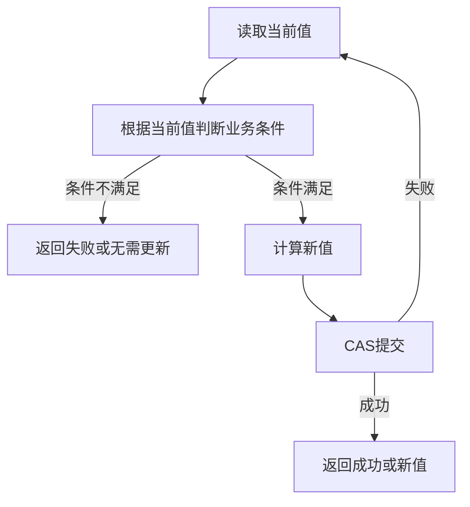

# 3.3.5.2 CAS原理

CAS 是 Compare-And-Swap 的缩写，通常译为“比较并交换”或“比较并设置”。它描述的是一种原子更新方式：先读取某个内存位置的当前值，将它与调用方期望的旧值比较；如果二者相等，就把该位置更新为新值；如果二者不相等，就说明期间已经有其他线程修改过这个位置，本次更新失败，调用方需要重新读取、重新计算，或者放弃更新。这个动作的关键不在于“比较”和“写入”两个步骤本身，而在于这两个步骤必须作为一个不可分割的整体发生。只要比较和写入之间允许被其他线程插入，就会重新退化为普通的读改写竞态。

在 Java 并发编程中，CAS 是原子变量、许多无锁数据结构和部分同步器内部实现的重要基础。`AtomicInteger`、`AtomicLong`、`AtomicReference`、`AtomicBoolean`、`AtomicStampedReference`、`AtomicMarkableReference`、`LongAdder` 以及 JDK 内部很多状态更新逻辑，都直接或间接依赖“读取旧状态、尝试提交新状态、失败后重试”的思想。CAS 并不神秘，它本质上是把“我只在没有人动过这个值时才提交修改”这条并发规则交给底层原子指令去保证。

理解 CAS 时要特别避免两个极端。一个极端是把它当成万能的“无锁神器”，认为用了原子类就天然高性能、天然线程安全；另一个极端是只记住“CAS 会自旋、ABA 有问题”，于是忽略它在短小状态更新场景中的实际价值。CAS 解决的是一类很具体的问题：多个线程竞争同一个或少量内存位置时，如何在不进入传统互斥锁临界区的情况下完成条件更新。它适合的范围、失败成本、内存语义和不变式边界都很清晰，只有把这些边界讲清楚，才能在真实代码中正确使用它。

本文保持通用 Java 技术视角，只讨论 Java 语言、Java 内存模型和标准并发库中的 CAS 机制，不引入特定平台场景。后文会围绕 Compare-And-Swap 的基本流程、原子变量、失败重试、ABA、内存语义、自旋成本、适用场景、与锁的比较、边界和常见误区展开。

## CAS 要解决的并发问题

先看一个最朴素的计数器。单线程中，`count++` 看起来就是一次递增；但在多线程中，它至少包含读取当前值、计算新值、写回新值三个逻辑步骤。如果两个线程几乎同时读取到 `count == 0`，它们都会计算出 `1`，然后分别写回 `1`，最终结果仍然是 `1`，其中一次递增被覆盖了。这类问题称为丢失更新。它不是 Java 语法层面的异常，而是并发读改写缺少原子性导致的结果。

传统解决方式是加锁。线程进入临界区之前先获取锁，只有持有锁的线程可以读取、计算和写回，其他线程必须等待。锁把多个步骤包成一个互斥区域，从而保证复合操作不会被交错执行。这个模型直观、表达能力强，也能覆盖多变量不变式，但它的成本是线程可能阻塞、唤醒需要调度参与、临界区过大时容易造成等待扩散。

CAS 提供了另一种思路。它不先阻止其他线程进入，而是允许多个线程同时读取和计算，但在提交时检查“我基于的旧值是否仍然有效”。如果旧值没有变化，就提交；如果旧值已经变化，就说明自己的计算依据过期，本次提交失败。失败并不表示程序错误，只表示竞争中输了，需要根据业务重新决定下一步。这个模型通常被称为乐观并发：它假设冲突不是总会发生，因此先执行，提交时再验证。

用伪代码表达，CAS 更新一个整数大致如下：

```java
int oldValue;
int newValue;
do {
    oldValue = value.get();
    newValue = oldValue + 1;
} while (!value.compareAndSet(oldValue, newValue));
```

这段代码的含义是：每一轮都基于最新观察到的值计算新值，并用 `compareAndSet` 尝试提交。如果另一个线程已经抢先把值改掉，`compareAndSet` 返回 `false`，循环重新读取。只要竞争不是无限持续，并且计算逻辑没有副作用，循环最终通常会有某个线程成功。

CAS 解决的核心不是“让多个线程完全不冲突”，而是“在冲突发生时检测出来，并阻止过期写入覆盖新结果”。这一点非常重要。CAS 不会让所有线程都成功，也不会保证每个线程第一次尝试就成功，更不会自动把一段复杂业务逻辑变成原子事务。它只对某个内存位置上的一次条件更新负责。

## Compare-And-Swap 的三个参数

CAS 通常可以抽象成三个参数：内存位置、期望值、新值。内存位置表示要更新的变量或字段；期望值表示调用方认为这个位置当前应该是什么；新值表示在期望成立时要写入什么。只有内存位置当前值与期望值相等，更新才会发生。

在 Java 原子类中，这个操作通常体现为 `compareAndSet(expectedValue, newValue)`。调用方不直接传入内存地址，因为 Java 语言隐藏了对象布局和具体地址，类库会通过内部机制定位到对应字段或数组槽位。对使用者来说，需要理解的是“expected 是我这轮计算所依据的旧值，new 是我想提交的结果”。

以 `AtomicReference` 为例，CAS 比较的是引用值本身，也就是这个引用当前是否仍然指向期望对象。它不会自动比较对象内部字段是否相等，也不会根据 `equals` 判断逻辑相等。两个内容相同但不是同一个对象的引用，在引用 CAS 中并不相等；同一个对象内部字段被修改，引用本身没有变化，引用 CAS 也看不出来。这一点常被忽略。

以 `AtomicInteger` 为例，CAS 比较的是整数值。调用方常见写法是先读取旧值，再计算新值，再尝试提交：

```java
AtomicInteger stock = new AtomicInteger(10);

boolean decreaseOne() {
    while (true) {
        int current = stock.get();
        if (current <= 0) {
            return false;
        }
        int next = current - 1;
        if (stock.compareAndSet(current, next)) {
            return true;
        }
    }
}
```

这个例子中，检查库存是否大于零和扣减库存看起来是两个步骤，但通过 CAS 循环，它们围绕同一个整数位置形成了“基于当前值的条件更新”。如果期间库存被其他线程扣减，提交失败，循环重新检查最新库存。这样可以避免把库存扣成负数。

需要注意，这个例子只保证单个整数状态的更新正确。如果扣减库存之后还要写订单、记流水、更新多个字段，CAS 不能自动保证这些动作整体原子。CAS 的参数模型决定了它擅长的是“一个位置从旧状态变成新状态”，而不是“一组对象在多个约束下共同变化”。

## CAS 的原子性来自哪里

Java 代码中的 `compareAndSet` 最终需要由运行时和处理器提供原子更新能力。不同平台的具体指令、内存屏障和实现细节可能不同，但从 Java 使用者视角看，可以把它理解为一个由底层保证不可分割的条件写。也就是说，多个处理器核心同时竞争同一位置时，底层会保证只有一个 CAS 能在某个旧值上成功，其他基于同一旧值的 CAS 会失败。

这里的“不可分割”指的是比较和写入之间不会被另一个成功更新穿插。假设变量当前是 `5`，两个线程都想把它从 `5` 改成 `6`。两个线程都可以读取到 `5`，也都可以计算出 `6`，但它们提交时不会都成功。第一个成功的 CAS 会把值改为 `6`；第二个 CAS 再比较时发现当前位置已经不是期望的 `5`，于是失败。失败线程如果继续执行，必须重新读取当前值，也许下一轮会尝试从 `6` 改到 `7`。

CAS 不是普通的“先 if 再赋值”。下面这种代码即使看起来语义相似，也不是线程安全的：

```java
if (value == expected) {
    value = next;
}
```

原因是普通读取、比较和写入之间没有原子边界。线程 A 判断 `value == expected` 之后，线程 B 可以立即修改 `value`，线程 A 再写入 `next` 时就会覆盖 B 的结果。CAS 的价值正是把这个判断与写入合并成底层的一次原子条件更新。

从实现层面看，CAS 往往依赖处理器的原子读改写指令，并配合缓存一致性协议和内存屏障完成跨核心协调。开发者不需要在业务代码中手写这些细节，但需要知道 CAS 成功并不是“没有竞争”，而是“竞争被底层序列化为某个成功者和若干失败者”。在高竞争下，这种序列化仍然存在，只是等待形式从阻塞排队变成了反复失败和重试。

## Java 原子变量的角色

Java 标准库把 CAS 封装在 `java.util.concurrent.atomic` 包中，最常用的是原子变量类。原子变量的意义不是让一个普通变量突然拥有魔法，而是把对这个变量的常见原子读改写模式封装成可复用 API，并提供明确的内存语义。

`AtomicInteger` 和 `AtomicLong` 适合计数、序号、状态位等数值更新；`AtomicBoolean` 适合一次性开关或状态标志；`AtomicReference` 适合引用替换；`AtomicStampedReference` 和 `AtomicMarkableReference` 用于在引用之外附带版本或标记，常用于处理 ABA 相关问题；数组形式的原子类可以对数组元素做原子更新；字段更新器可以在不把字段本身声明为原子类对象的情况下，对指定 `volatile` 字段进行原子更新。

原子变量通常提供两类方法。一类是直接读写或条件更新，例如 `get`、`set`、`compareAndSet`。另一类是复合更新的便捷封装，例如 `incrementAndGet`、`getAndIncrement`、`updateAndGet`、`accumulateAndGet`。这些便捷方法内部仍然可以理解为 CAS 循环，只是把“读取、计算、失败重试”的模板封装起来。

例如 `updateAndGet` 可以把自定义函数放入更新流程：

```java
AtomicInteger score = new AtomicInteger(0);

int updated = score.updateAndGet(current -> Math.min(current + 10, 100));
```

这段代码表示基于当前值计算新值，并最终返回更新后的结果。调用方不需要手写循环，但必须理解传入的函数可能在竞争下被调用多次。因为第一次计算出来的结果可能提交失败，原子类需要重新读取最新值并再次计算。因此，传给 `updateAndGet`、`getAndUpdate`、`accumulateAndGet` 的函数必须是无副作用、可重复执行的。不能在函数里发送消息、写文件、扣外部资源、修改非线程安全集合，除非这些副作用可以被多次执行且仍然正确。

原子变量的另一个价值是表达意图。看到 `AtomicInteger`，读者可以知道这个位置存在跨线程原子更新需求；看到 `compareAndSet` 循环，读者可以知道代码允许竞争失败并重试。相比散落的 `volatile` 字段和手写同步，原子变量让单变量乐观更新的边界更清楚。

## 失败重试与自旋循环

CAS 失败后最常见的处理方式是重试。因为失败意味着“我依据的旧值已经过期”，重新读取最新值之后，原来的业务条件可能仍然成立，也可能已经不成立。重试循环负责把这两种情况区分开。

一个严谨的 CAS 循环通常包含三部分：读取当前状态、根据当前状态判断是否还需要更新、尝试提交新状态。不要把业务条件只放在循环外，因为循环外读到的状态在提交时可能已经失效。也不要在提交失败后盲目继续使用旧的计算结果，因为旧结果是基于过期状态得到的。

以下是一个只允许从 `INIT` 转到 `RUNNING` 的状态转换：

```java
final class TaskState {
    static final int INIT = 0;
    static final int RUNNING = 1;
    static final int DONE = 2;

    private final AtomicInteger state = new AtomicInteger(INIT);

    boolean start() {
        return state.compareAndSet(INIT, RUNNING);
    }
}
```

这个例子不需要循环，因为它不是“基于当前值计算下一个值”，而是一次性争抢状态转换权。只有看到 `INIT` 的线程可以成功把状态改成 `RUNNING`，其他线程失败后直接返回即可。CAS 失败不一定总要重试，是否重试取决于业务语义。

再看一个需要循环的例子：

```java
AtomicInteger balance = new AtomicInteger(100);

boolean withdraw(int amount) {
    while (true) {
        int current = balance.get();
        if (current < amount) {
            return false;
        }
        int next = current - amount;
        if (balance.compareAndSet(current, next)) {
            return true;
        }
    }
}
```

这里必须重试，因为其他线程修改余额后，当前线程需要基于新余额重新判断是否还能扣减。如果直接返回失败，可能会让本来可以成功的扣减失败；如果不重新判断就继续写旧结果，可能破坏余额不为负的约束。

自旋是 CAS 重试的典型表现。线程没有阻塞挂起，而是在用户态或运行时层面反复尝试。这可以避免阻塞和唤醒的调度成本，尤其适合临界区极短、冲突持续时间很短的场景。但自旋不是免费的。失败线程仍然占用 CPU，仍然制造缓存一致性流量，仍然可能影响同一机器上其他任务的运行。竞争越激烈，失败重试越多，CAS 的优势越容易被吞掉。

因此，CAS 循环应当尽量短小。循环内部不要做慢操作，不要做阻塞调用，不要做不可重复副作用，不要分配大量对象，不要持有其他锁。必要时可以在多次失败后退避，例如让出执行机会、短暂暂停、转入锁保护路径，或者把热点变量拆分为多个分段计数。Java 标准库中的一些高吞吐计数器正是通过降低单点竞争来缓解 CAS 热点，而不是让所有线程永远争抢同一个位置。

## ABA 问题

CAS 只检查“当前位置是否等于期望值”。如果一个位置从 A 变成 B，又变回 A，那么一个只关心当前值的 CAS 会认为它没有变化。这个现象称为 ABA 问题。ABA 的危险不在于值最终又等于 A，而在于中间发生过变化，而调用方的正确性依赖“它没有被动过”这一更强假设。

一个简单的引用场景可以说明 ABA。线程 T1 读取到栈顶节点是 A，准备把栈顶从 A 改成 A.next。在线程 T1 提交之前，线程 T2 弹出 A，又弹出其他节点，然后把 A 重新压回栈顶。此时栈顶引用又是 A。线程 T1 的 CAS 看到栈顶仍然等于 A，于是成功提交，但它基于的是早已过期的 A.next，可能把 T2 期间的结构变化覆盖掉。这里的问题不是引用 A 的内容是否相同，而是“栈顶经历过变化”这一事实被单纯引用比较隐藏了。

不是所有 CAS 场景都有 ABA 风险。对单调递增计数器来说，值从 1 到 2 再回到 1 通常不会发生；即使发生，也未必破坏业务语义。对状态机来说，如果状态允许从 A 到 B 再回到 A，就要判断调用方是否只关心当前状态，还是还关心中间是否发生过转换。对无锁链表、无锁栈、对象池、资源复用等结构来说，ABA 更需要谨慎，因为引用相等往往不足以证明结构没有变化。

常见处理方式是引入版本号。每次修改时不仅更新值，还更新版本。即使值从 A 变回 A，版本也已经不同，CAS 可以发现中间发生过变化。Java 提供的 `AtomicStampedReference` 就是把引用和整数 stamp 绑定在一起比较更新：

```java
AtomicStampedReference<Node> top =
        new AtomicStampedReference<>(initialNode, 0);

int[] stampHolder = new int[1];
Node observed = top.get(stampHolder);
int observedStamp = stampHolder[0];
Node next = observed.next;

boolean success = top.compareAndSet(
        observed,
        next,
        observedStamp,
        observedStamp + 1
);
```

这里的 CAS 不只要求引用仍然是 observed，还要求 stamp 仍然是 observedStamp。只要期间有线程修改过栈顶并递增 stamp，即使引用又变回 observed，本次 CAS 也会失败。

另一种方式是使用标记位，`AtomicMarkableReference` 把引用和布尔标记绑定，适合表达“逻辑删除”之类只有两态标记的场景。还有一些场景可以通过避免对象复用、使用不可变节点、引入更高层锁、改变数据结构设计来规避 ABA。选择哪种方式取决于不变式需要多强的“未变化”证明。

需要强调的是，ABA 不是一句“CAS 有 ABA 问题”就能概括的缺陷。它只在“当前值相等不足以证明状态仍然有效”时才构成问题。如果业务语义只要求当前值满足条件，并不关心中间变化，那么 ABA 可能不是问题。相反，如果中间变化会破坏结构关系、生命周期关系或资源所有权，那么必须显式处理。

## CAS 与 Java 内存语义

并发正确性不仅需要原子性，还需要可见性和有序性。一个线程成功 CAS 之后，其他线程什么时候能看到这个更新？CAS 前后的普通读写是否可以被随意重排序？原子变量方法在 Java 内存模型中承担什么同步作用？这些问题决定了 CAS 能否用于发布状态和协调线程。

在常用原子类中，`get`、`set`、`compareAndSet` 等方法具有明确的内存效果。简单理解，原子变量的读取和写入具有类似 `volatile` 的可见性语义，成功的 CAS 既读取旧值又写入新值，它不只是原子修改，也会参与建立跨线程的可见性关系。一个线程在 CAS 成功前写入的普通数据，如果随后通过原子变量发布状态，另一个线程通过对应的原子读取观察到这个状态后，通常可以看到发布前的写入。实际推理时应以 Java 内存模型和具体方法文档为准，不能把所有弱形式访问都混为一谈。

以发布结果为例：

```java
final class ResultHolder {
    private Object result;
    private final AtomicBoolean ready = new AtomicBoolean(false);

    void publish(Object value) {
        result = value;
        ready.set(true);
    }

    Object readIfReady() {
        return ready.get() ? result : null;
    }
}
```

这里 `ready` 的原子写和原子读承担发布信号的作用。读线程只有在看到 `ready` 为 `true` 后才读取 `result`，因此可以借助 `ready` 建立可见性边界。若把 `ready` 换成普通布尔字段，就可能出现读线程长期看不到状态变化，或者看到状态变化却没有可靠看到结果引用写入的情况。

CAS 循环中的可见性也很关键。失败的 CAS 至少说明线程重新观察到了与期望不一致的状态；下一轮读取会基于新的内存状态继续计算。成功的 CAS 则把新状态发布给其他使用同一原子变量同步的线程。只要所有访问者都围绕同一个原子变量或同一套同步机制读写，状态传播就是可推理的。

不过，CAS 的内存语义不能自动覆盖所有对象。原子引用可以安全发布“引用变更”这一事实，但引用指向对象内部是否线程安全，还取决于对象本身的构造、发布和后续修改方式。如果把一个可变对象放进 `AtomicReference`，然后多个线程直接修改对象内部字段，`AtomicReference` 只能保护引用替换，不能保护对象内部的不变式。想要通过原子引用维护不可变快照，通常应让引用指向不可变对象，每次更新都创建新快照并 CAS 替换。

还要区分不同访问模式。现代 Java 中除了传统 `compareAndSet`，还存在更细粒度的访问语义，例如 plain、opaque、acquire、release、volatile 等 VarHandle 访问模式。它们在有序性和可见性强度上不同，适合底层库精细优化。普通业务代码使用原子类时，多数情况下应选择语义清晰的常规方法，而不是为了微小性能差异使用更弱语义，除非能够完整证明 happens-before 关系仍然成立。

## 自旋成本与竞争热点

CAS 经常被称为无锁，但无锁不等于无成本。锁的竞争成本通常表现为阻塞、唤醒、上下文切换、锁队列管理；CAS 的竞争成本则表现为失败重试、CPU 忙等、缓存行争用和内存总线压力。两者只是把成本放在了不同位置。

在低竞争下，CAS 的优势很明显。一个线程读取、计算、提交，通常一次成功，不需要进入阻塞队列，也不需要内核调度参与。对于计数器、开关、简单状态转换等短操作，这种路径非常轻。即使偶尔失败，重试一次的成本也可能低于挂起和唤醒线程。

在高竞争下，情况会变化。假设几十个线程同时递增同一个 `AtomicLong`，每次只有一个线程能成功，其他线程都会失败并重试。失败线程的工作不是完全无害的：它们读取同一个缓存行，提交时又让缓存行在核心之间来回转移，造成缓存一致性流量。线程越多，热点越集中，失败越频繁，实际吞吐可能下降，尾延迟也会变差。

这就是为什么高并发计数不一定总该用单个 `AtomicLong`。如果业务只需要最终汇总值，而不要求每次更新都立刻形成全局线性化顺序，可以使用分段思想，把竞争分散到多个单元，读取时再汇总。`LongAdder` 的设计方向就是降低热点竞争：在竞争低时使用基础值，竞争高时让不同线程更新不同槽位，求和时把多个槽位合并。代价是某些读取场景下结果不是单次原子快照，但吞吐更好。

自旋还可能造成公平性问题。阻塞锁可以维护等待队列，至少有机会按某种策略唤醒等待者；CAS 循环通常是谁抢到谁成功。某个线程可能因为调度时机不好连续失败，虽然系统整体有进展，但单个线程没有明确的等待上限。这类问题在实时性、延迟敏感或需要严格顺序的场景中必须考虑。

因此，评估 CAS 性能时不能只看“无锁”两个字。应该问几个更具体的问题：竞争线程有多少？每次更新是否集中在同一变量？失败后循环体有多重？是否存在不可重复计算？是否需要公平性？是否有退避策略？读多写少还是写多读少？结果是否要求强一致快照？这些问题比单纯讨论 CAS 或锁更接近真实性能边界。

## 适用场景

CAS 最适合短小、单点、可重试、无副作用的状态更新。典型场景包括计数器递增递减、一次性状态开关、懒初始化争抢、引用快照替换、简单状态机转换、无锁队列或栈中的指针推进等。这些场景的共同点是：更新目标少，计算新值快，失败后可以重新计算，且失败不会造成外部副作用。

一次性状态转换是非常适合 CAS 的例子。例如某个组件只允许从未启动变成已启动，多个线程可能同时调用 `start`，但只有一个线程应该真正执行启动逻辑。可以先用 CAS 抢占状态转换权，成功者继续执行，失败者直接返回或等待结果。这比给整个方法加锁更直接，也能清晰表达“只有一个线程能赢得启动权”。

```java
final class Starter {
    private static final int NEW = 0;
    private static final int STARTING = 1;
    private static final int STARTED = 2;

    private final AtomicInteger state = new AtomicInteger(NEW);

    boolean tryStart() {
        if (!state.compareAndSet(NEW, STARTING)) {
            return false;
        }
        try {
            doStart();
            state.set(STARTED);
            return true;
        } catch (RuntimeException ex) {
            state.set(NEW);
            throw ex;
        }
    }

    private void doStart() {
        // 初始化资源
    }
}
```

这个例子同时展示了 CAS 成功后的失败路径。线程抢到 `STARTING` 后，如果启动过程失败，要把状态恢复或转入失败状态，否则其他线程会永久看到一个半完成状态。CAS 只负责抢占状态位，不负责后续资源初始化的原子性，异常路径仍然需要设计。

不可变快照替换也是常见场景。把一组配置放在不可变对象中，读线程只读取当前引用；写线程基于旧配置创建新配置，然后用 CAS 替换引用。如果替换失败，说明其他写线程已经发布了更新，当前写线程可以重新基于新快照计算。这种方式避免读线程加锁，适合读多写少且更新粒度可以整体替换的场景。

```java
record Config(int timeoutMillis, int maxRetries) {}

final class ConfigStore {
    private final AtomicReference<Config> ref =
            new AtomicReference<>(new Config(1000, 3));

    Config current() {
        return ref.get();
    }

    void updateTimeout(int timeoutMillis) {
        while (true) {
            Config oldConfig = ref.get();
            Config newConfig = new Config(timeoutMillis, oldConfig.maxRetries());
            if (ref.compareAndSet(oldConfig, newConfig)) {
                return;
            }
        }
    }
}
```

这里的关键是 `Config` 不可变。读线程拿到旧快照也没关系，因为旧快照内部不会被修改；写线程通过替换引用发布新快照。若 `Config` 是可变对象，并且线程拿到引用后继续修改字段，原子引用就无法保证整体一致性。

CAS 也适合实现某些无锁结构，但这类代码难度明显更高。无锁队列、栈、链表不仅要处理头尾指针 CAS，还要处理节点可见性、ABA、内存回收、逻辑删除、帮助推进等问题。普通业务代码不应轻易手写复杂无锁结构，优先使用 JDK 已经提供的并发容器和同步器。理解 CAS 原理有助于读懂这些工具的边界，但不意味着每个集合都应该自己实现无锁版本。

## 不适合 CAS 的场景

CAS 不适合长临界区。只要更新过程包含慢 I/O、网络调用、磁盘访问、复杂计算或可能阻塞的操作，就不应该把这些操作放进 CAS 重试循环。因为失败会导致重复执行，成功前也无法对外保证只有一次。正确做法通常是把 CAS 用于短小状态抢占，抢占成功后再执行慢操作；或者使用锁、队列、事务等更合适的协调方式。

CAS 不适合不可重复副作用。发送邮件、写数据库、扣减外部账户、打印一次性凭证、修改非线程安全集合等动作都不能因为 CAS 失败而悄悄执行多次。如果确实需要在 CAS 成功后执行副作用，应先通过 CAS 确认自己获得执行权，再执行副作用；不要在计算新值的函数中夹带副作用。

CAS 不适合天然需要多变量一致性的场景。比如两个账户之间转账，需要保证一个账户减少、另一个账户增加，并且流水记录与余额一致。用两个 `AtomicInteger` 分别更新并不能自动得到事务语义。如果第一个 CAS 成功、第二个失败，中间状态怎么恢复？如果恢复也失败怎么办？这类问题通常需要锁、数据库事务、消息事务或专门的一致性协议，而不是把多个 CAS 拼在一起就结束。

CAS 不适合强公平需求。多个线程自旋竞争同一个位置时，成功顺序通常由调度、缓存状态和时机决定，而不是由到达顺序决定。如果业务要求严格先来先服务、等待时间有明确上界，或者需要可诊断的排队行为，锁和队列往往更合适。

CAS 不适合掩盖建模不清的问题。有些代码使用原子变量只是为了避免思考对象所有权，但真正的问题是多个模块都在修改同一份可变状态，且没有明确协议。把字段换成 `AtomicReference` 并不会自动澄清谁可以修改对象、什么时候可以发布、失败后如何恢复。并发设计首先是边界设计，CAS 只是边界内的一种更新工具。

## CAS 与锁的比较

CAS 和锁不是简单的替代关系。它们都是协调并发访问的工具，但表达的并发模型不同。锁采用悲观策略：进入临界区前先独占，其他线程等待；CAS 采用乐观策略：先并发尝试，提交时验证旧值。哪一个更好，取决于临界区大小、竞争强度、不变式复杂度、公平性要求和失败成本。

| 维度 | CAS | 锁 |
| --- | --- | --- |
| 基本策略 | 乐观更新，失败重试 | 悲观互斥，进入前等待 |
| 适合粒度 | 单变量或少量状态的短更新 | 多步骤、多变量、复杂不变式 |
| 等待形态 | 自旋、重试、退避 | 阻塞、排队、唤醒，也可能短暂自旋 |
| 失败成本 | 重新读取和重新计算，可能消耗 CPU | 获取不到锁时等待，可能上下文切换 |
| 公平性 | 通常不保证单个线程公平成功 | 可通过特定锁策略提供更明确的排队 |
| 副作用处理 | 循环内必须避免不可重复副作用 | 临界区内通常只执行一次，但要控制持锁时间 |
| 可读性 | 简单状态更新很清楚，复杂结构难读 | 复杂不变式更容易表达，但锁范围要清晰 |

锁的优势在于表达能力。只要多个变量之间存在不变式，锁可以把检查、修改和发布包在同一个临界区内。锁释放和后续获取之间还建立 happens-before 关系，使临界区内写入对下一个持锁线程可见。对于复杂对象，锁常常比一组原子变量更容易证明正确。

CAS 的优势在于短路径轻量。简单状态更新不需要线程挂起，不需要维护显式等待队列，成功路径通常很短。对于高频小操作，CAS 可以减少传统锁带来的调度成本。但这个优势依赖低到中等竞争、循环体短、失败可接受。一旦竞争过高，CAS 可能把等待成本转化为 CPU 消耗。

还有一种常见误解是“CAS 是无锁，所以一定不会阻塞”。CAS 操作本身不会像互斥锁那样把线程挂起等待锁释放，但 CAS 循环可能让线程长时间占用 CPU 而没有进展。对调用方来说，这同样是一种等待，只是表现为忙等。无锁算法通常强调系统整体进展，而不一定保证每个线程有限步成功。业务代码评估时不能只看“线程没有 BLOCKED”，还要看 CPU、失败次数和尾延迟。

现代锁实现本身也不是单一成本模型。很多锁在轻度竞争时会使用偏向、轻量级、短暂自旋或其他优化策略，在竞争激烈时才进入重量级阻塞。不同 Java 版本中具体优化会变化，不能用过时印象简单判断“锁一定慢”。实际选择应基于语义优先、性能验证其次：先选能正确表达不变式的工具，再用基准和监控验证热点路径。

## 线性化与正确性推理

CAS 相关代码常需要考虑线性化点。线性化点指一个并发操作在逻辑上生效的那个瞬间。对 `compareAndSet` 来说，成功 CAS 的那一刻通常就是状态更新的线性化点；失败 CAS 则表示该操作没有按这次期望生效。明确线性化点能帮助判断多个线程交错执行时，外部观察到的顺序是否仍然等价于某种串行顺序。

例如 `AtomicInteger.incrementAndGet` 的线性化点是某次成功 CAS。多个线程同时递增时，虽然它们读取和计算的过程交错，但每次成功提交都能排成一个全局顺序：从 0 到 1，从 1 到 2，从 2 到 3。最终每次递增都没有丢失，返回值也可以对应到某个成功顺序。

自己编写 CAS 循环时，也要能指出操作何时生效。如果方法在 CAS 成功前就对外产生副作用，那么线性化点可能被破坏；如果 CAS 成功后还有必须一起完成的状态修改，那么 CAS 成功也许还不足以代表整个操作完成。很多“看起来无锁”的代码难以验证，就是因为它没有清楚定义线性化点。

以无锁栈的 `push` 为例，创建新节点、设置 `newNode.next = oldTop` 都只是准备阶段；真正让新节点对其他线程可见的是把栈顶从 `oldTop` CAS 成 `newNode` 的成功瞬间。失败时，新节点还没有进入栈，必须基于最新栈顶重新设置 next。若忽略这一点，节点之间的链接就可能指向过期结构。

正确性推理还要区分安全性和活性。安全性关注“不发生错误结果”，例如不会丢失更新、不会破坏链表结构、不会把余额扣成负数。活性关注“最终能否继续前进”，例如是否可能无限自旋、是否可能某个线程长期失败、是否有退避或降级。CAS 常能很好地表达安全性，但活性需要结合竞争、调度和退避策略分析。

## 原子变量与复合不变式

原子变量最容易被误用的地方，是把“单次操作原子”误解为“整个对象线程安全”。一个类有多个字段时，即使每个字段都是原子变量，也不代表这些字段之间的不变式自动成立。因为每个原子变量只保护自己的内存位置，多个位置之间没有天然的共同线性化点。

假设有一个范围对象，要求 `lower <= upper`。如果用两个 `AtomicInteger` 分别保存 lower 和 upper，那么单独更新 lower 或 upper 都是原子的，但“检查另一个字段再更新当前字段”不是整体原子的。线程 A 检查 upper 后准备提高 lower，线程 B 检查 lower 后准备降低 upper，它们分别成功后可能让范围交叉。要保证这种不变式，通常需要同一把锁保护两个字段，或者把两个值封装进一个不可变对象，用 `AtomicReference` 一次性替换整个快照。

不可变快照方案的思路是把多个字段合成一个状态对象，让 CAS 的“单个位置”变成“整个状态引用”。这样 CAS 比较的是旧快照引用，提交的是新快照引用。只要快照不可变，读线程看到任意一个版本都是自洽的，写线程失败后重新基于最新快照计算即可。

```java
record Range(int lower, int upper) {
    Range {
        if (lower > upper) {
            throw new IllegalArgumentException("lower > upper");
        }
    }
}

final class RangeHolder {
    private final AtomicReference<Range> range =
            new AtomicReference<>(new Range(0, 100));

    void setLower(int lower) {
        while (true) {
            Range current = range.get();
            Range next = new Range(lower, current.upper());
            if (range.compareAndSet(current, next)) {
                return;
            }
        }
    }
}
```

这个设计把不变式检查放进 `Range` 构造过程，并通过引用 CAS 一次性发布整个新状态。它仍然不是万能的：如果状态对象很大、更新频繁，复制成本可能较高；如果更新需要外部副作用，仍然要额外协调。但它展示了一个重要原则：CAS 的边界应与不变式边界一致。如果不变式跨多个字段，就不要让 CAS 只覆盖其中一个字段。

有时也可以用锁表达同样的不变式，而且更简单。不要为了使用 CAS 而强行把清晰的锁代码改成复杂的无锁代码。并发代码的第一目标是正确和可维护，只有在性能瓶颈明确、语义适合、测试充分时，才值得引入更复杂的 CAS 结构。

## CAS 循环中的副作用

CAS 循环最危险的写法之一，是在循环内部执行不可重复副作用。原因很直接：循环体可能执行多次，而方法在语义上可能只应该产生一次效果。竞争越高，重复执行概率越大；测试环境竞争较低时，问题反而不容易暴露。

下面的写法就有风险：

```java
counter.updateAndGet(current -> {
    auditLog.add("increase from " + current);
    return current + 1;
});
```

如果 `updateAndGet` 内部第一次计算后 CAS 失败，函数会再次执行，日志可能记录多条并不代表成功更新的记录。更糟的是，如果副作用是扣减外部资源，重复执行就可能造成真实损失。正确做法是让更新函数只计算新值，把副作用放在 CAS 成功之后，并确保成功之后的副作用失败也有处理策略。

```java
while (true) {
    int current = counter.get();
    int next = current + 1;
    if (counter.compareAndSet(current, next)) {
        auditLog.add("increase from " + current + " to " + next);
        break;
    }
}
```

即使副作用放在 CAS 成功之后，也要继续思考一致性。日志写入失败怎么办？CAS 已经成功，是否需要补偿？是否允许状态更新成功但审计失败？如果不允许，就说明这个需求已经超出单个 CAS 的能力，需要更强的事务或锁保护。CAS 能解决竞争提交，但不能自动解决提交之后的外部一致性。

循环中的对象分配也要谨慎。创建不可变快照时，失败重试会丢弃本轮新对象。在低竞争下这没有问题，在高竞争下可能带来明显分配压力。可以通过降低竞争、批量更新、分段、退避或换用锁来优化。不要只关注 CAS 指令本身的成本，循环体内的计算和分配同样重要。

## CAS 与 volatile 的关系

`volatile` 和 CAS 经常一起出现，但它们解决的问题不同。`volatile` 主要提供可见性和有序性，保证对 volatile 变量的写入能被后续读取看见，并建立相应的 happens-before 关系。CAS 在此基础上提供条件原子更新。可以把 CAS 理解为“带比较条件的原子 volatile 更新”，但这个说法只是帮助理解，不能替代具体 API 文档。

单独使用 `volatile int count` 不能让 `count++` 线程安全。因为 `count++` 仍然是读、加、写三个步骤，多个线程可能都读到同一个旧值。`AtomicInteger.incrementAndGet` 则通过 CAS 循环保证每次递增都基于某个成功提交的最新值。

另一方面，如果只需要发布一个停止标志，`volatile boolean stopped` 可能比 `AtomicBoolean` 更简单。写线程设置 `stopped = true`，读线程定期检查即可。只有当需要“从 false 到 true 只有一个线程成功”这样的条件转换时，`AtomicBoolean.compareAndSet(false, true)` 才更合适。

因此，选择 `volatile` 还是原子类，应先看操作形态。如果是单纯写入和读取状态，volatile 可能足够；如果是基于旧值计算新值，或者需要条件争抢转换，原子类更合适；如果是多个字段共同变化，锁或不可变快照可能更合适。不要把 `volatile`、CAS、锁看成性能等级，而应看成语义工具。

## 常见 API 细节

`compareAndSet` 通常表示强 CAS：在当前值等于期望值时更新，并返回是否成功。它可能因为值不等而失败。还有一些 API 提供 `weakCompareAndSet` 或带有更具体内存语义的方法。弱 CAS 可能允许所谓“虚假失败”，也就是即使当前值等于期望值也返回失败。它常用于底层循环优化，普通代码如果使用弱 CAS，必须放在能够容忍失败并重试的循环中。

`getAndSet` 是无条件原子替换，返回旧值。它不检查期望值，适合交换引用、获取并清空状态等场景。`getAndIncrement` 返回递增前的旧值，`incrementAndGet` 返回递增后的新值。返回旧值还是新值不是细节问题，调用方如果把返回值作为序号或状态判断依据，必须选对方法。

`lazySet` 这类释放语义写入适合某些只需要最终发布、对立即可见性要求较弱的场景。它可能比普通 volatile 写有更弱的时序承诺。普通业务代码在没有明确证明前，不应为了猜测性能使用更弱方法。并发代码里语义不清的优化往往比少量开销更危险。

字段更新器如 `AtomicIntegerFieldUpdater` 可以对对象中的某个 `volatile int` 字段做原子更新。它适合大量对象都需要一个可原子更新字段，但不想每个对象额外持有一个 `AtomicInteger` 实例的场景。使用字段更新器时，字段必须满足可访问性、类型和 volatile 要求，代码可读性也会下降。除非有明确内存占用或框架设计需求，普通代码直接使用原子类通常更清晰。

`LongAdder` 和 `LongAccumulator` 常被拿来与 `AtomicLong` 比较。它们不是简单替代品。`AtomicLong` 的每次更新都有单一线性化位置，适合需要精确即时值和条件更新的场景；`LongAdder` 更适合高并发统计，写入吞吐高，但 `sum` 获取的是汇总结果，不适合依赖单次读取参与严格条件判断。比如限流、库存扣减、余额判断这类需要“检查并更新”原子语义的场景，不能随意用 `LongAdder` 替代 `AtomicLong`。

## 典型执行流程

CAS 循环可以用一个状态流程概括。流程中最重要的是失败之后回到读取状态，而不是继续使用过期数据。



这个流程还隐含了几个约束。第一，业务条件必须基于本轮读取的当前值判断。第二，新值必须由本轮当前值推导。第三，失败后要重新读取，因为当前值已经不是本轮期望值。第四，循环体最好是纯计算，不要包含不可重复副作用。第五，必须有退出路径；如果业务条件已经不满足，应返回失败，而不是为了成功 CAS 无限重试。

实际代码中，还可以加入失败计数、退避和监控。比如在高竞争路径记录 CAS 失败次数，可以帮助判断热点是否需要改造。若失败次数长期很高，说明代码虽然功能正确，但性能模型可能已经不适合当前流量。此时优化方向未必是继续微调 CAS，而可能是减少共享、分片、批量、改用队列或锁。

## 边界和误区

第一个误区是“用了 Atomic 就线程安全”。原子类只保证它自身方法定义的原子性和内存语义，不保证围绕它的一整段业务逻辑都线程安全。`if (atomic.get() > 0) atomic.decrementAndGet()` 不是安全扣减，因为检查和递减之间可能被其他线程插入。要么使用 CAS 循环把检查和递减合成条件更新，要么使用锁保护整段逻辑。

第二个误区是“CAS 一定比锁快”。低竞争短操作下 CAS 往往很快；高竞争、长循环、复杂计算、强公平需求下，锁可能更稳定、更省 CPU、更容易诊断。性能不是由工具名决定，而是由竞争形态和代码结构决定。

第三个误区是“CAS 失败就是异常”。CAS 失败是乐观并发模型的正常分支，表示期望值过期。代码应当明确处理失败：重试、返回、退避或转入其他路径。把 CAS 失败当作罕见错误，或者在失败时抛出无意义异常，通常说明并发语义没有建模清楚。

第四个误区是“ABA 总是必须处理”。ABA 是否有害取决于业务是否依赖“中间没有变化”。如果只关心当前值，并且中间变化不破坏不变式，ABA 可能无关紧要。若中间变化会破坏结构、版本、所有权或生命周期判断，就必须用版本、标记、不可变快照或其他设计处理。

第五个误区是“原子引用能保护对象内部”。`AtomicReference` 保护的是引用本身的替换，不保护引用对象内部字段。如果多个线程拿到同一个可变对象并修改它，仍然需要对象自身同步。想用原子引用实现无锁读，通常应让引用指向不可变对象。

第六个误区是“自旋没有等待成本”。自旋只是没有挂起线程，不代表没有消耗。它会占用 CPU、增加缓存一致性压力，还可能让其他线程更难获得执行机会。长时间自旋是性能问题，也是可用性问题。

第七个误区是“把多个 CAS 连起来就是事务”。多个 CAS 分别成功或失败，中间状态对其他线程可能可见。除非设计了完整的状态机、补偿、帮助机制或描述符协议，否则多个 CAS 不能自然表达原子事务。业务上需要事务语义时，应使用更适合的同步或事务机制。

## 实践检查清单

使用 CAS 前，可以先检查更新目标是否足够小。目标最好是单个数值、单个引用、单个状态位，或者封装成一个不可变快照的整体引用。如果不变式跨多个可变对象，优先考虑锁或重新建模。

检查失败是否可重试。CAS 失败后，代码是否能安全重新读取和重新计算？循环内部是否只有纯计算？传给 `updateAndGet` 的函数是否无副作用？如果失败后无法重试，说明 CAS 可能不是合适工具，或者需要把 CAS 只用于抢占执行权。

检查竞争是否可接受。变量是否是高频热点？线程数量是否可能远大于处理器核心数？失败次数是否可观测？是否需要退避、分片或换用 `LongAdder`？在性能敏感路径，不要只写出功能正确的 CAS 循环，还要能观察失败重试成本。

检查内存语义是否闭合。写端用哪个原子变量发布状态？读端是否通过同一个原子变量观察状态？引用指向的对象是否不可变或已安全发布？有没有普通字段绕过同步协议？只要存在一条访问路径不遵守同一协议，就可能破坏推理。

检查 ABA 是否相关。当前值相等是否足以证明状态有效？中间变化是否会破坏结构或所有权？对象是否会复用？如果答案不确定，优先引入版本号、不可变对象或更简单的锁方案。

检查退出路径。循环在业务条件不满足时是否返回？在系统关闭或线程中断时是否需要停止？是否可能因为持续竞争无限重试？是否有失败统计或诊断信息？并发代码不能只考虑“最终会成功”的理想路径。

## 小结

CAS 的本质是对单个内存位置进行原子条件更新：当前值等于期望值时写入新值，否则失败。它把并发冲突从“进入前阻塞”转换为“提交时验证”，因此非常适合短小、单点、可重试的乐观更新。Java 原子变量把这种能力封装成清晰 API，并提供必要的内存语义，使计数器、状态位、引用快照和简单状态机可以在不显式加锁的情况下正确工作。

CAS 的边界同样清楚。它不能自动维护多变量不变式，不能消除副作用一致性问题，不能保证强公平，不能让高竞争热点没有成本，也不能靠引用相等自动识别 ABA。失败重试是正常路径，自旋有真实成本，内存语义需要读写双方使用同一套同步协议。

在工程实践中，选择 CAS 还是锁，不应从“哪个更高级”出发，而应从语义出发。单变量短更新、失败可重试、竞争适中，CAS 往往简洁高效；临界区复杂、跨多个字段、需要公平排队或副作用不可重复，锁和更高层并发工具通常更稳妥。真正理解 CAS，不是会写一个 `compareAndSet` 循环，而是能说明它的线性化点在哪里、失败后为什么可以重试、内存可见性由谁建立、ABA 是否会破坏不变式，以及自旋成本在当前场景下是否可接受。
