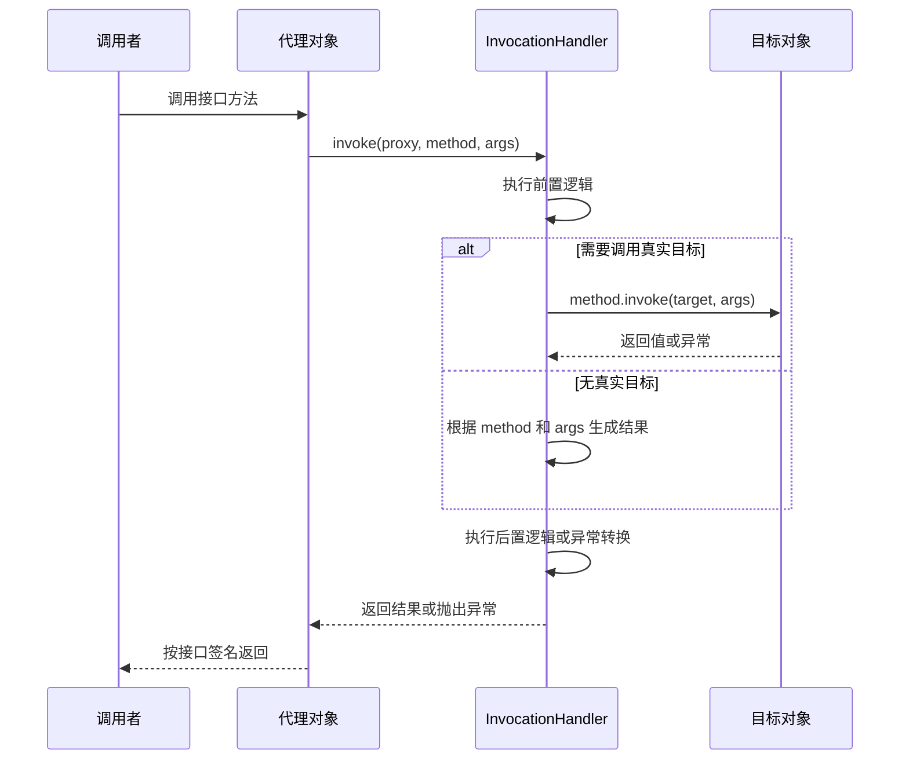

# 3.5.3 动态代理

## 定位

动态代理是在运行期生成代理对象，并把对代理对象的方法调用转交给统一处理逻辑的机制。它解决的问题是：当多个对象需要共享一类横切行为，例如日志、权限、缓存、重试、事务、监控、远程调用适配，而又不希望在每个业务类中重复手写这些代码时，可以让调用者面对一个看起来实现了目标接口的对象，实际执行路径先进入代理，再由代理决定是否、何时以及如何调用真实目标。

Java 标准库提供的动态代理位于 `java.lang.reflect.Proxy` 和 `InvocationHandler`。它的核心限制是只能为接口创建代理。代理类在运行时生成，实现指定的一组接口，并把接口方法调用统一派发给 `InvocationHandler.invoke`。这个机制常被称为 JDK 动态代理，用来区别于基于子类生成或字节码增强的其他代理方式。

动态代理不是反射的简单包装。反射侧重于运行时观察和调用已有类型；动态代理侧重于运行时创建一个新类型，这个类型实现某些接口，并在方法入口处插入统一分发逻辑。它通常会使用反射中的 `Method` 对象描述被调用的方法，但代理本身的价值在于改变调用路径。

与静态代理相比，动态代理减少了为每个接口手写代理类的工作。静态代理需要开发者为 `UserService` 写 `UserServiceProxy`，为 `OrderService` 写 `OrderServiceProxy`；动态代理可以用一个 `InvocationHandler` 处理多个接口实例。代价是调用关系更隐式，错误更多发生在运行期，并且只能覆盖经由代理对象发起的接口方法调用。

## JDK Proxy 的核心 API

创建代理对象通常使用 `Proxy.newProxyInstance`。它需要三个参数：定义代理类的类加载器、代理对象要实现的接口数组、处理所有方法调用的 `InvocationHandler`。

```java
interface GreetingService {
    String hello(String name);
}

final class SimpleGreetingService implements GreetingService {
    public String hello(String name) {
        return "Hello, " + name;
    }
}

GreetingService target = new SimpleGreetingService();

GreetingService proxy = (GreetingService) Proxy.newProxyInstance(
        GreetingService.class.getClassLoader(),
        new Class<?>[] { GreetingService.class },
        (Object self, Method method, Object[] args) -> {
            long start = System.nanoTime();
            try {
                return method.invoke(target, args);
            } finally {
                long cost = System.nanoTime() - start;
                System.out.println(method.getName() + " cost " + cost);
            }
        });

String result = proxy.hello("Java");
```

调用 `proxy.hello("Java")` 时，调用者以为自己在调用 `GreetingService` 的实现。实际上代理类的方法体会把代理对象、代表 `hello` 的 `Method` 对象和参数数组传给 `InvocationHandler.invoke`。处理器可以在调用真实目标前后加入逻辑，也可以不调用目标而直接返回，也可以根据方法、参数或上下文选择不同目标。

`InvocationHandler.invoke` 的第一个参数是代理对象本身，不是目标对象。这个参数很容易被误用。如果在 `invoke` 内部对 `proxy` 再调用接口方法，会再次进入同一个处理器，可能导致无限递归。要调用真实逻辑，应该持有目标对象并对目标对象调用，或者使用其他明确的分发策略。

`Proxy.isProxyClass` 可以判断某个类是否是 JDK 代理类，`Proxy.getInvocationHandler` 可以获取代理对象背后的处理器。后者要求传入的对象确实是代理实例，否则会抛出异常。框架通常不会把这些 API 暴露给业务使用者，但调试和测试代理行为时很有用。

## 代理类生成与调用流程

JDK 动态代理创建的不是目标类的子类，而是一个新的类。这个新类继承 `Proxy`，实现传入的所有接口，并持有父类中的 `InvocationHandler h` 字段。每个接口方法在代理类中都有对应实现，方法体大致是把静态缓存的 `Method` 对象和实参数组传给 `h.invoke(this, method, args)`，再把返回值转换成接口方法要求的类型。

代理类生成需要类加载器。传给 `newProxyInstance` 的类加载器必须能够看见所有代理接口，否则生成的代理类无法正确定义。接口数组也有要求：元素必须都是接口，不能重复，非 public 接口还必须满足包可见性限制。代理类实现接口的顺序会影响生成类身份，因此框架构建接口数组时最好保持稳定顺序。

一次方法调用可以拆成几个阶段。第一，调用者通过接口引用调用方法，JVM 按普通接口调用规则分派到代理对象的实现。第二，代理方法把调用封装为 `Method` 和 `Object[]`。第三，`InvocationHandler` 执行横切逻辑，并决定是否调用目标。第四，如果调用目标，通常通过反射 `method.invoke(target, args)` 或方法句柄完成。第五，返回值从处理器返回给代理方法，再返回给调用者。



这条链路中最容易混淆的是“代理对象”和“目标对象”的位置。代理对象是调用者实际持有的对象，它负责把入口统一交给处理器；目标对象是处理器选择调用的真实实现，它可以存在，也可以不存在。JDK 动态代理并不要求处理器一定转发给某个目标对象。只要处理器能够按照接口方法的语义返回结果，它就可以把方法调用翻译成网络请求、配置查询、表达式计算、缓存命中或任何受控的执行计划。因此，动态代理的本质不是“自动调用另一个对象”，而是“在接口方法入口处获得一次统一解释调用的机会”。

从运行时类型看，代理实例的 `getClass()` 不是目标类，而是 JDK 生成的代理类。调用者通过接口与它交互，通常不应该依赖代理类名称、包名或生成细节。不同 JDK 版本对代理类内部命名和生成方式可能存在差异，应用代码应把这些细节视为实现细节。真正稳定的契约是：代理类实现了指定接口，继承自 `Proxy`，并把接口方法调用派发给创建时传入的 `InvocationHandler`。

如果同一个代理对象实现多个接口，处理器收到的 `Method` 可能来自不同接口。方法名相同并不代表语义相同，参数列表相同也不一定代表可以共享同一个处理逻辑。严谨的代理工厂应以 `Method` 或经过规范化的方法描述作为键，而不是只用方法名作为键。对于重载方法，单纯依赖名称会把 `find(String)` 与 `find(long)` 混在一起；对于多个接口中的同签名方法，还需要明确它们在代理语义上是否应视为同一个入口。

异常传播也有规则。`InvocationHandler.invoke` 可以抛出 `Throwable`。如果抛出的异常类型与接口方法声明的 checked exception 兼容，代理会原样传播；如果是运行时异常或错误，也会原样传播；如果是不在方法声明中的 checked exception，代理会包装成 `UndeclaredThrowableException`。因此处理器调用目标方法时应拆开 `InvocationTargetException`，把目标方法真正抛出的异常按语义重新抛出。

```java
class TimingHandler implements InvocationHandler {
    private final Object target;

    TimingHandler(Object target) {
        this.target = target;
    }

    public Object invoke(Object proxy, Method method, Object[] args) throws Throwable {
        long start = System.nanoTime();
        try {
            return method.invoke(target, args);
        } catch (InvocationTargetException e) {
            throw e.getCause();
        } finally {
            System.out.println(method + " cost " + (System.nanoTime() - start));
        }
    }
}
```

如果处理器没有解包 `InvocationTargetException`，调用者看到的异常层级就会变得不自然：业务方法原本抛出的异常被包在反射调用异常里，外层代理又可能继续包装未声明异常。这样的异常栈不仅难读，还会破坏调用方基于异常类型编写的分支逻辑。一个成熟的处理器通常会把目标异常、代理自身异常、参数校验异常和框架内部异常区分开：目标异常按接口契约传播，代理自身异常用清晰的运行时异常表达，框架内部错误保留足够上下文，避免把所有失败都吞成一个含糊的包装异常。

## 从静态代理到动态代理

理解动态代理时，可以先把静态代理当作参照。静态代理的代理类在源码中显式存在，它实现同一个接口，内部持有目标对象，并在每个方法中手写前置逻辑、目标调用和后置逻辑。它的优点是直观、类型明确、调试简单；缺点是接口方法越多、需要代理的接口越多，重复代码就越多。如果横切逻辑只出现在一两个类上，静态代理往往足够；如果同一类逻辑要包裹几十个接口方法，手写代理类就会迅速变成维护负担。

动态代理把“为每个方法写一段代理方法”的工作交给运行时生成的代理类，把“每个方法中共同的控制逻辑”收敛到 `InvocationHandler`。从结果看，调用者仍然通过接口调用方法；从实现看，代理方法不再由开发者逐个书写，而是由 JDK 根据接口列表生成。开发者需要关注的是处理器如何识别方法、如何处理参数、如何调用目标、如何转换返回值和异常。

静态代理与动态代理并不是绝对替代关系。静态代理适合代理逻辑强依赖具体方法、方法数量少、希望编译期暴露全部调用关系的场景。动态代理适合代理逻辑具有统一模型、接口边界清楚、希望在运行期组合行为的场景。若代理逻辑对每个方法都完全不同，动态代理仍然可以实现，但处理器内部会出现大量 `if`、`switch` 或映射表，此时应重新判断它到底是在减少复杂度，还是只是把多个静态代理类的复杂度塞进了一个巨大处理器。

| 维度 | 静态代理 | JDK 动态代理 |
| --- | --- | --- |
| 代理类来源 | 开发者手写源码 | 运行期根据接口生成 |
| 代理对象形态 | 明确的普通类 | 继承 `Proxy` 的生成类 |
| 适用目标 | 接口或开发者自行设计的抽象 | 接口 |
| 编译期可见性 | 代理方法实现可直接阅读 | 代理方法由运行时生成 |
| 重复代码 | 接口和方法多时较高 | 统一收敛到处理器 |
| 调试重点 | 代理类源码 | `InvocationHandler` 和生成代理的配置 |

这张对比表的关键不在于判断哪一种“更高级”，而在于识别成本转移。动态代理减少了手写代理类的数量，但增加了运行期配置、方法元数据识别和异常边界处理的复杂度。只要这些复杂度被集中封装在清晰的代理工厂和处理器模型中，它就是收益；如果每个调用点都临时拼装接口数组、类加载器和处理器，动态代理反而会让代码更难理解。

## Object 方法的处理

代理对象也有 `equals`、`hashCode`、`toString`。这些方法虽然来自 `Object`，但在代理类中同样会转发给 `InvocationHandler`。如果处理器不专门处理它们，而是直接用 `method.invoke(target, args)`，通常可以工作，但语义未必符合代理对象的身份要求。

`equals` 尤其需要谨慎。代理对象代表的是处理器、目标对象、接口视图，还是某个远程资源？不同场景答案不同。如果把代理的 `equals` 直接转发给目标，目标对象可能无法识别代理；如果用代理对象引用相等，又可能让两个包装同一目标的代理不相等。公共框架应明确代理相等性的定义，避免集合键、缓存和断言中出现意外行为。

`hashCode` 应与 `equals` 保持一致。`toString` 应避免触发昂贵的目标调用或泄露敏感信息。很多代理框架会在处理器开头识别 `Object` 方法并单独处理，这样可以避免横切逻辑把 `toString` 也当成业务方法记录、计费或事务包裹。

```java
if (method.getDeclaringClass() == Object.class) {
    return switch (method.getName()) {
        case "toString" -> "Proxy(" + target + ")";
        case "hashCode" -> System.identityHashCode(proxy);
        case "equals" -> proxy == args[0];
        default -> method.invoke(target, args);
    };
}
```

这段示例只说明处理位置，不代表所有代理都应该采用身份相等。实际项目要根据代理语义选择策略。

## 接口、默认方法与泛型

JDK 动态代理以接口为中心。目标对象可以实现接口，也可以不存在真实目标，由处理器完全模拟接口行为。远程调用客户端、配置映射对象、延迟加载对象都可能采用后一种方式：接口方法不是转发到本地对象，而是被转换成请求、查询或配置读取。

接口默认方法曾经是动态代理中的复杂点。默认方法有方法体，但代理类仍然把调用交给 `InvocationHandler`。如果希望在处理器中调用接口默认实现，需要使用 `MethodHandles` 等机制进行特殊调用，而不是简单 `method.invoke(proxy, args)`，否则可能递归回处理器或因访问规则失败。很多框架会明确规定默认方法是否被支持，以及默认方法在代理链中的优先级。

泛型接口在运行时经过类型擦除。代理类实现的是原始接口方法签名，`Method` 上可以读取泛型返回类型和参数类型，但实际调用时仍按擦除后的类型执行。处理器返回值必须能转换成接口方法的运行时返回类型，否则代理方法返回时会抛出 `ClassCastException`。对泛型代理工厂而言，不能只依靠 `Class<T>` 表达完整泛型信息，必要时要让调用者传入 `Type`。

桥接方法也可能出现在代理接口或目标类中。编译器为了保持泛型擦除后的多态，会生成 bridge 方法。扫描接口方法时若不处理桥接方法，可能重复拦截或拿到不符合预期的签名。框架通常需要根据 `Method.isBridge()` 和 `Method.isSynthetic()` 过滤或合并方法。

参数数组也有一些细节。无参数方法传入处理器时，`args` 可能是 `null`，而不是长度为零的数组。健壮的处理器不应直接遍历 `args`，应先做空值处理。基本类型参数会被装箱成对应包装类型，返回基本类型的方法则要求处理器返回非空且类型兼容的包装值；如果处理器给 `int` 返回 `null`，代理方法在拆箱时会抛出异常。可变参数方法在运行时仍然表现为最后一个参数是数组，处理器若要修改参数，应理解修改的是传入数组引用还是数组内部元素。

返回值转换同样不能随意。接口方法返回 `void` 时，处理器返回的对象会被忽略，但最好显式返回 `null`，避免误导读者。接口方法返回引用类型时，处理器返回值必须能被代理方法转换成声明的返回类型。接口方法返回基本类型时，处理器返回值必须能拆箱成对应基本类型。动态代理不会替处理器做业务层面的类型修正，例如把字符串 `"1"` 自动变成整数，也不会把集合元素逐个校验成泛型声明中的类型；这些都属于处理器或上层框架自己的职责。

类加载器是另一个容易被低估的边界。代理类必须被定义在某个类加载器中，这个类加载器需要能解析代理接口。简单应用中直接使用接口类的类加载器通常没有问题；在插件化、模块化、容器化或复杂构建环境中，不同接口可能来自不同类加载器，随意选择线程上下文类加载器或目标类加载器都可能导致 `ClassCastException`、接口不可见或代理类无法定义。判断类加载器是否正确，不能只看 `newProxyInstance` 是否成功，还要看返回的代理对象能否在调用方所在的类型空间中被转换成期望接口。

当接口不是 public，JDK 对代理类包位置和接口组合有更严格的要求。多个非 public 接口如果来自不同包，就不能简单组合到同一个代理类中。这个限制来自 Java 访问控制模型：生成的代理类必须能够实现这些接口，而包私有接口只允许同包类型访问。公共框架在接收用户传入接口列表时，应尽早校验可见性和包约束，给出面向用户的错误信息，而不是让底层 `IllegalArgumentException` 暴露到很深的创建流程之后。

## 典型使用场景

第一类场景是横切逻辑。计时、日志、指标、权限、重试、缓存等逻辑与具体业务方法正交，却需要围绕方法调用执行。动态代理可以在处理器中统一实现这些逻辑，让业务对象只关注自身职责。

第二类场景是远程或延迟调用。接口方法可以被解释成对远程服务、消息通道、数据库查询或配置中心的访问。调用者只依赖接口，代理负责把方法名、参数、注解和返回类型转换成底层协议。此时目标对象可能并不存在，处理器就是实际执行者。

第三类场景是装饰和适配。代理可以在不修改目标类的情况下改变行为，例如为返回值做包装，为异常做转换，为参数做校验。相比继承，接口代理对目标类侵入更小；相比手写装饰器，动态代理减少重复代码。

第四类场景是测试和替身对象。简单的 mock 或 stub 可以用动态代理实现：根据方法名和参数返回预设值，记录调用次数，或模拟异常。标准库代理适合接口替身；若要替身具体类，则需要其他机制。

还有一类常见场景是声明式 API。调用者定义一个接口，接口方法上可以带注解，也可以通过方法名、参数名、返回类型表达意图；代理工厂在创建代理时读取这些元数据，生成每个方法对应的执行计划。调用发生时，处理器不再临时理解方法，而是直接执行预先构建好的计划。这种方式把“声明”和“执行”分离开，接口成为面向调用者的稳定契约，处理器成为把契约翻译到底层能力的适配层。

动态代理也适合实现轻量级拦截器链。一个处理器可以只做总调度，把一次方法调用包装成上下文对象，然后依次交给多个拦截器。每个拦截器决定是否继续调用下一个节点，以及在调用前后添加什么行为。相比把所有逻辑写在一个 `invoke` 方法里，调用链模型更容易测试、复用和调整顺序。


使用调用链时，最重要的是顺序语义。缓存应该发生在权限之前还是之后，重试应该包住目标调用还是连同参数转换一起重试，异常转换应该在计时之外还是之内，这些问题没有唯一答案，但必须稳定。代理机制只提供入口，真正决定系统行为的是拦截器顺序、短路规则和异常传播规则。

## 性能与缓存

JDK 动态代理的调用成本通常高于直接接口调用。它需要进入代理方法、创建或处理参数数组、调用 `InvocationHandler`，处理器中若再使用反射调用目标，还会增加反射成本。对于多数以 I/O 或业务计算为主的应用，这个开销可接受；对于极高频、极低延迟的本地方法调用，需要谨慎评估。

性能优化首先是避免重复生成代理类和重复解析元数据。JDK 内部会按类加载器和接口列表缓存代理类，但框架自己的方法元数据、注解解析、调用计划仍应缓存。处理器中不要每次调用都扫描注解、解析泛型或查找目标方法。把这些工作放到代理创建阶段，可以显著减少运行期成本。

其次是减少反射转发。如果目标方法固定，可以使用 `MethodHandle`、LambdaMetafactory 或生成专用适配器来优化调用路径。但这些手段会增加实现复杂度，只有在性能数据证明处理器转发是瓶颈时才值得引入。不要在没有度量的情况下把简单代理改造成难以调试的字节码系统。

还要注意代理对象数量。为每次请求创建新代理通常没有必要，代理应按目标对象或接口配置复用。若处理器持有上下文状态，要区分代理级状态和调用级状态；调用级状态应放在方法栈、上下文对象或受控作用域中，不应随意存在处理器字段里导致并发问题。

性能分析时应把成本拆开看。生成代理类是创建阶段成本，通常发生次数较少，并且 JDK 会缓存相同类加载器和接口组合下的代理类。创建代理实例是对象分配成本，取决于应用是否频繁创建代理。调用代理方法是每次调用都要付出的成本，包括进入处理器、处理参数数组、查找执行计划、执行拦截器和转发目标。若只观察一次端到端耗时，很容易把创建成本和调用成本混在一起，得出错误结论。

`Method` 作为键时也要注意缓存粒度。一个代理可能实现多个接口，同一个处理器可能服务多个代理实例。缓存如果放在静态全局结构里，要避免类加载器泄漏；缓存如果放在处理器实例里，要明确处理器是否会被多个代理共享。对长期运行的库而言，类加载器泄漏比单次调用慢一些更危险，因为它会让本应卸载的类型、配置和对象图长期存活。使用弱引用缓存、按代理工厂生命周期管理缓存，或把缓存绑定到明确可释放的上下文，都是需要根据应用形态权衡的设计点。

并发性能与线程安全也不能忽略。`InvocationHandler` 本身没有线程隔离保证，同一个代理对象可以被多个线程同时调用，同一个处理器也可能被多个代理共享。如果处理器内部维护可变字段，例如最近一次调用参数、当前用户、临时返回值、重试次数，就可能发生数据竞争。通用原则是：方法调用期间的临时状态放在局部变量或调用上下文中；跨调用共享的状态使用不可变对象、并发容器或明确同步；不要为了少传一个参数把调用级状态塞进处理器字段。

## 安全与可维护性边界

动态代理会隐藏真实调用路径。调用者看到的是接口方法，实际执行可能包括权限判断、事务控制、远程请求、重试和异常转换。框架设计应让这些行为可观察、可配置、可测试，而不是让代理成为黑盒。日志、调试开关、清晰异常和文档化的拦截顺序都很重要。

代理也可能扩大攻击面。如果接口方法的调用被转换成反射调用、脚本执行或远程请求，就必须校验方法是否允许被代理、参数是否可信、异常是否会泄露敏感信息。不能让外部输入任意选择代理接口和方法后直接执行。

自调用是代理设计中最常见的边界。一个对象内部通过 `this.otherMethod()` 调用自身方法，不会经过外部代理对象，因此代理逻辑不会生效。JDK 动态代理只拦截调用者对代理对象发起的接口调用，不能拦截目标对象内部的普通方法调用。依赖代理实现横切逻辑时，必须把这个边界写入设计。

接口代理还要求调用者依赖接口。如果代码到处直接依赖具体类，JDK 动态代理就无法插入。使用代理并不意味着所有类型都要接口化，但需要代理的服务边界应提前设计为接口或其他可代理抽象。

可维护性还取决于代理是否透明到“恰当程度”。完全透明并不总是好事：如果调用一个普通接口方法可能触发远程访问、重试、缓存写入或权限判定，调用者至少应能从接口所属模块、命名、文档或异常类型中看出它不是普通本地计算。相反，代理也不应该把底层细节泄露给每个调用者，例如要求调用者知道处理器内部缓存键、反射调用方式或代理类名称。好的代理抽象应隐藏机械细节，但暴露语义成本和失败模式。

调试代理问题时，可以从四个问题入手：调用者拿到的对象是不是代理对象；代理对象是否实现了调用者期望的接口；方法调用是否真的经过 `InvocationHandler`；处理器是否按预期调用了目标或执行计划。前两个问题定位创建阶段，后两个问题定位调用阶段。把这四层拆开，比直接在复杂业务栈里寻找“代理为什么没生效”更可靠。

## 与其他代理方式的比较

静态代理最简单、最透明，代理类由开发者手写，编译期可检查，调试方便。缺点是样板代码多，接口多时维护成本高。动态代理用统一处理器替代大量手写代理类，适合横切逻辑一致的接口集合。

基于子类的代理可以代理普通类，而不要求接口。它通常通过运行时生成目标类子类并覆盖可覆盖方法实现拦截。限制是 final 类和 final 方法不可覆盖，构造方法、私有方法和静态方法也不能像普通实例方法一样被拦截。它与类继承结构绑定更强。

字节码织入或编译期增强可以在更底层改变类结构，拦截范围更大，也能减少部分运行时分发成本。但它引入构建复杂度、调试成本和工具链兼容问题。JDK 动态代理胜在标准、简单、无需额外依赖，适合接口边界清晰的场景。

选择代理方式时，不要只看“能不能拦截”。要看目标抽象是接口还是类，是否需要拦截自调用，是否能接受运行时生成类型，是否要求编译期可见，性能是否敏感，调试和错误定位是否可控。很多系统中，JDK 动态代理已经足够；只有当接口限制成为实际问题时，才需要更重的机制。

## 常见误区

第一个误区是认为动态代理能代理任何类。JDK 动态代理只能代理接口。如果传入具体类，`newProxyInstance` 会失败。要代理类，需要选择子类代理、字节码生成或其他机制。

第二个误区是把代理对象传给 `method.invoke`。在处理器中执行 `method.invoke(proxy, args)` 通常会再次进入处理器，造成递归。应调用真实目标对象，或者明确实现无目标的分发逻辑。

第三个误区是忽略异常包装。目标方法通过反射抛出的异常会被包装在 `InvocationTargetException` 中，处理器应解包；处理器抛出接口未声明的 checked exception 会被代理包装成 `UndeclaredThrowableException`。异常处理不清晰会让调用者难以理解失败原因。

第四个误区是期待代理拦截目标内部调用。只有通过代理引用发起的方法调用才会被拦截，目标对象内部的 `this` 调用不会经过代理。这会影响事务、缓存、权限等横切逻辑的设计。

第五个误区是每次调用都解析注解和配置。代理的优势在于统一入口，但如果入口中做大量重复元数据工作，就会把启动阶段可以完成的成本转移到每次调用。代理创建时应尽量构建好调用计划。

## 实践建议

使用 JDK 动态代理前，先确认边界接口稳定、调用方依赖接口、横切逻辑适合围绕方法调用表达。代理工厂应校验接口数组、类加载器和目标对象类型，创建失败时给出明确错误。处理器应单独处理 `Object` 方法，解包目标异常，并避免在 `invoke` 中递归调用代理。

对复杂框架，建议把处理器拆成调用链模型。每个拦截器只负责一个职责，例如参数校验、权限、计时、目标调用、异常转换。调用链比一个巨大 `invoke` 方法更容易测试和组合。拦截顺序必须稳定，并在文档中说明。

对性能敏感路径，缓存方法元数据和注解解析结果，避免在每次调用时做反射扫描。用基准测试或生产观测确认瓶颈后，再考虑方法句柄或代码生成。代理对象应复用，处理器状态应线程安全。

最后，代理行为要可测试。至少覆盖正常返回、目标异常、未声明异常、`equals`、`hashCode`、`toString`、默认方法策略、空参数数组和重载方法。动态代理把错误推迟到运行时，测试就是补回确定性的主要手段。

## 小结

JDK 动态代理通过运行期生成实现接口的代理类，把接口方法统一转发给 `InvocationHandler`。它适合在接口边界上插入横切逻辑、远程适配、装饰行为和测试替身。它的边界同样明确：只能代理接口，只拦截经由代理对象的调用，异常和 `Object` 方法需要专门处理，高频路径要缓存元数据。把代理作为清晰的边界工具，而不是隐藏业务逻辑的魔法层，才能获得动态性的同时保持可维护性。
