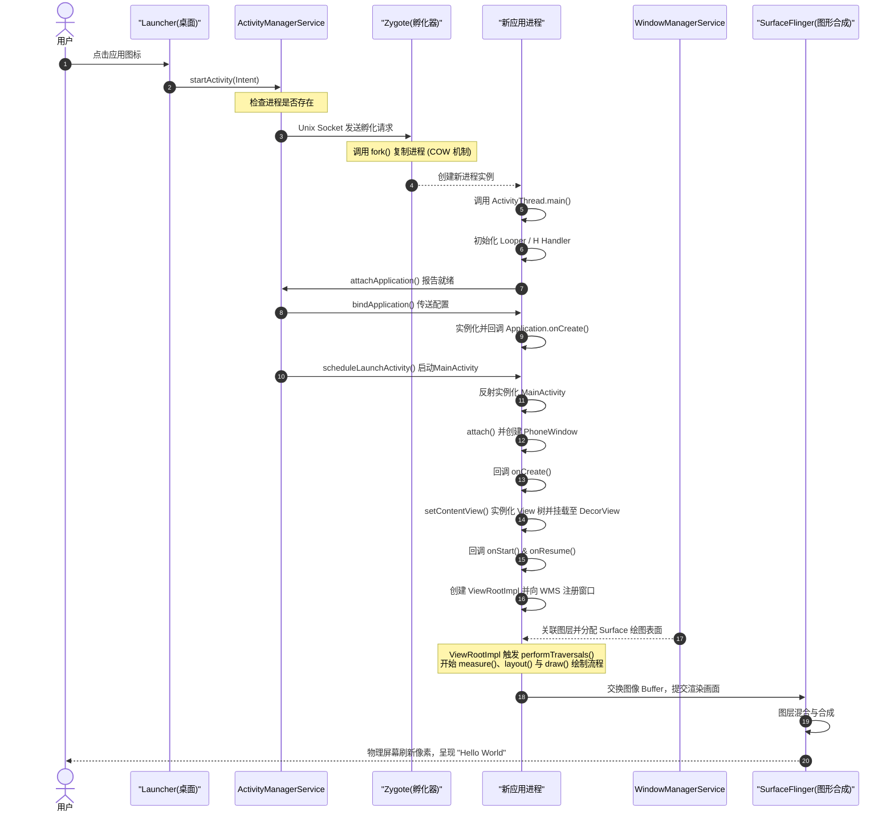

# 5.1.1.1 第一行代码

在任何一门编程语言或开发平台的学习旅程中，"Hello, World!" 都是那盏照亮起步之路的指路明灯。在 Android 开发世界中，这一行简单的输出不仅代表了环境配置的成功，更是开发者直面 Android 这一庞大分布式操作系统、图形渲染引擎和运行时虚拟机的起点。

本章将以 Android 的“第一行代码”为切入点，从历史演进、工程骨架、系统级运行机制以及初学者常见的底层误区等维度，对这行代码背后的知识体系进行一次全方位的深度剖析。

---

## 1. 背景与“第一行代码”的历史：从 Hello World 开始

### 1.1 编程世界的光芒起点
"Hello, World!" 的历史可以追溯到 1974 年，由贝尔实验室的计算机科学家布莱恩·柯林汉（Brian Kernighan）在其撰写的 C 语言教程中首次引入。它以最简练的形式向开发者宣告：这台由数亿晶体管组成的庞大机器已准备就绪，可以正确执行你的指令。对于软件工程而言，它不仅是一个语法的起点，更是验证编译器、链接器、运行时环境以及底层操作系统协同工作是否正常的基准测试。

### 1.2 移动开发历史的开端
在移动互联网的大幕拉开之际，2008 年 10 月，世界上第一款搭载 Android 1.0 (API Level 1) 系统的商用手机 HTC Dream（在部分市场被称为 T-Mobile G1）正式发布。在那个拥有侧滑物理键盘和轨迹球的设备上，当开发者使用早期基于 Eclipse + ADT（Android Development Tools）的开发环境编译并运行起首个 Activity 时，屏幕上亮起的 "Hello, World!" 宣告了移动开发新纪元的开启。

在 [Android Version Change Log](../../../../AndroidVersionChangeLog.md#android-10api-1) 中可以看到，Android 1.0 奠定了四大组件（Activity、Service、BroadcastReceiver、ContentProvider）的基石。这种基于组件化、声明式配置的应用程序架构，在当时相比于 Symbian、J2ME 等旧时代的移动操作系统，带来了开发效率上的革命性提升。

### 1.3 开发范式的三代演进
随着 Android SDK 版本的迭代与设计哲学的变化，展示这“第一行代码”的开发范式经历了三次重大的演进：

1. **第一代：Java + XML（2008 年 - 2017 年）**
   这一时期的核心思想是“控制与布局强制解耦”。开发者使用 Java 编写业务逻辑，在 `res/layout/` 目录下使用 XML 声明视图结构。在 Activity 中，通过命令式的 `findViewById(R.id.text_view)` 获取控件实例，再调用 `setText("Hello World")` 改变内容。这种方式结构清晰，但在业务复杂时会产生海量的样板代码（Boilerplate Code），且容易因为类型转换错误或 Null 指针导致应用崩溃。
2. **第二代：Kotlin + XML（2017 年 - 2021 年）**
   2017 年 Google 宣布 Kotlin 成为 Android 的官方一级开发语言。Kotlin 带来了空安全（Null Safety）、简炼的语法糖以及协程（Coroutines）支持。虽然 UI 依然通过 XML 布局定义，但借助 Kotlin Synthetic（现已被淘汰）或 Jetpack ViewBinding，开发者可以以类型安全的方式直接访问 XML 控件，摆脱了繁琐的 `findViewById`，代码的可读性和健壮性得到了极大增强。
3. **第三代：Jetpack Compose 声明式 UI（2021 年至今）**
   伴随着 Jetpack Compose 的正式发布，Android 开发全面拥抱了声明式 UI 编程范式。UI 不再是通过命令式地修改控件属性来更新，而是成为了“状态的函数”（UI = f(State)）。实现第一行代码变得前所未有的纯粹：
   ```kotlin
   @Composable
   fun HelloWorldScreen() {
       Text(text = "Hello World")
   }
   ```
   没有了 XML，没有了视图层级的膨胀，界面直接由 Kotlin 函数在逻辑上“声明”出来，由 Compose 运行时（Compiler & Runtime）自动追踪状态变化并进行高效的局部重绘（Recomposition）。

### 1.4 象征与探索意义
对于任何一位 Android 开发者而言，“第一行代码”的象征意义远大于其逻辑本身。看似简单的输出，在按下运行键的那一刻，底层却牵动了 Gradle 复杂的依赖拓扑编译、APK 包的多重签名、Zygote 进程的写时复制（Copy-on-Write）克隆、ActivityThread 主线程消息循环的启动、Context 体系的注入、PhoneWindow 窗口的创建、WMS（WindowManagerService）的图层注册，以及 View 树的 measure、layout、draw 三部曲绘制，最终与 SurfaceFlinger 进行硬件合成，并在物理显示器上亮起像素。

因此，打通“第一行代码”背后的微观世界，是建立 Android 全栈知识体系的必经之路。

---

## 2. 第一个 Android 程序的骨架分析

为了更深入地理解 Android 的运行本源，我们以经典 View 体系下的 Hello World 项目结构为例进行剖析。因为经典的 View 树和 Activity 生命周期是 Android 系统架构的底座，即使在 Compose 时代，其底层的组件模型与渲染管线依然保持着高度的一致性。

一个经典的 Hello World 应用，其核心骨架由以下三个文件支撑：`AndroidManifest.xml`、`MainActivity.kt`、`activity_main.xml`。

### 2.1 AndroidManifest.xml：全局配置清单
`AndroidManifest.xml` 是整个 Android 应用的“全局配置清单”或“户口薄”。在应用被安装到系统时，系统包管理器（PackageManagerService, PMS）会首先解析此文件，提取出其中的应用配置、组件声明以及所需权限，以便为该应用划分沙盒边界。

```xml
<?xml version="1.0" encoding="utf-8"?>
<manifest xmlns:android="http://schemas.android.com/apk/res/android"
    package="com.example.helloworld">

    <application
        android:allowBackup="true"
        android:icon="@mipmap/ic_launcher"
        android:label="@string/app_name"
        android:theme="@style/Theme.HelloWorld">
        
        <activity
            android:name=".MainActivity"
            android:exported="true">
            <intent-filter>
                <action android:name="android.intent.action.MAIN" />
                <category android:name="android.intent.category.LAUNCHER" />
            </intent-filter>
        </activity>
        
    </application>
</manifest>
```

#### 核心属性与安全设计剖析：
* **`android:name=".MainActivity"`**：指定实现该 Activity 的类路径。`.MainActivity` 是简写，系统会自动拼接最外层 `<manifest>` 节点中声明的 `package` 属性值（即 `com.example.helloworld.MainActivity`）。
* **`android:exported="true"`**：
  * **定义与作用**：该属性指示当前组件是否允许被外部应用或系统组件启动。如果为 `true`，意味着外部应用可以通过 Intent 直接唤起它；如果为 `false`，则只有该应用自身、拥有相同 UserID 的应用或系统核心组件才能启动它。
  * **安全约束演进**：在 Android 12 (API 31) 之前，如果开发者不显式声明此属性，系统会根据组件内是否包含 `<intent-filter>` 来默认推导其值（有则默认为 `true`，无则默认为 `false`）。这常常导致开发者在无意识中暴露了敏感的内部 Activity，为 Intent 劫持和越权漏洞埋下隐患。
  * **适配规则**：自 Android 12 (API 31) 起（参考 [Android Version Change Log](../../../../AndroidVersionChangeLog.md#android-12api-31)），如果应用内的 Activity、Service 或 BroadcastReceiver 包含了 `<intent-filter>`，则**必须显式声明** `android:exported` 属性。否则，在安装或编译打包时会直接报错。对于“第一行代码”的入口 Activity，由于必须允许 Launcher 桌面程序启动它，因此该属性必须被显式且正确地设置为 `true`。
* **`<intent-filter>` 中的动作与类别**：
  * `<action android:name="android.intent.action.MAIN" />`：表明该 Activity 是此应用程序的主入口点，启动该应用时不需要传入任何外部数据。
  * `<category android:name="android.intent.category.LAUNCHER" />`：指示 Launcher 桌面程序在系统的应用列表（App Drawer）中为该 Activity 创建一个快捷启动图标。只有当这两者同时在同一个 `<intent-filter>` 内被声明时，应用图标才能在桌面上正确显示。

### 2.2 MainActivity.kt：生命周期入口
`MainActivity.kt` 是逻辑代码的载体，继承自 `AppCompatActivity`（Jetpack 架构中的向后兼容 Activity 实现）。

```kotlin
package com.example.helloworld

import android.os.Bundle
import androidx.appcompat.app.AppCompatActivity

class MainActivity : AppCompatActivity() {
    override fun onCreate(savedInstanceState: Bundle?) {
        super.onCreate(savedInstanceState)
        setContentView(R.layout.activity_main)
    }
}
```

#### 关键调用链解析：
* **`onCreate(savedInstanceState: Bundle?)`**：这是 Activity 生命周期的起点。当系统创建 Activity 实例后，主线程会立即回调该方法。参数 `savedInstanceState` 是一个 Bundle 类型对象，用于在 Activity 因系统内存不足被意外回收并重建时恢复之前的状态数据。
* **`super.onCreate(savedInstanceState)`**：该调用必须位于方法的第一行。它的作用是将状态恢复数据传递给父类 `Activity` / `FragmentActivity` / `ComponentActivity`，触发框架底层的初始化逻辑（如关联 Window、恢复 Fragment 状态、注入必要的上下文及配置发生变化时的状态迁移等）。如果不调用此方法，程序运行至此会直接抛出 `SuperNotCalledException` 异常。
* **`setContentView(R.layout.activity_main)`**：
  * **实现本质**：此方法负责将 XML 布局资源与当前 Activity 的窗口（Window）进行绑定。`R.layout.activity_main` 是由 AAPT2 编译器生成的整型资源 ID。
  * **执行原理**：方法内部会获取当前窗口的具体实现类 `PhoneWindow`，并触发 `LayoutInflater` 的膨胀（Inflate）过程。`LayoutInflater` 遍历指定的 XML 文件，使用反射机制将 XML 标签映射实例化为内存中的 View 对象（如 `ConstraintLayout`、`TextView`），并根据嵌套结构建立起一棵双向的 View 树，最终挂载到窗口的根布局 `DecorView` 下的 `content` 容器中。

### 2.3 res/layout/activity_main.xml：UI 定义
`activity_main.xml` 是布局的声明文件，体现了 Android 的 UI 设计哲学。

```xml
<?xml version="1.0" encoding="utf-8"?>
<androidx.constraintlayout.widget.ConstraintLayout 
    xmlns:android="http://schemas.android.com/apk/res/android"
    xmlns:app="http://schemas.android.com/apk/res-auto"
    android:layout_width="match_parent"
    android:layout_height="match_parent">

    <TextView
        android:id="@+id/text_hello"
        android:layout_width="wrap_content"
        android:layout_height="wrap_content"
        android:text="@string/hello_world"
        app:layout_constraintBottom_toBottomOf="parent"
        app:layout_constraintEnd_toEndOf="parent"
        app:layout_constraintStart_toStartOf="parent"
        app:layout_constraintTop_toTopOf="parent" />

</androidx.constraintlayout.widget.ConstraintLayout>
```

#### UI 哲学与属性设计：
* **关注点分离（Separation of Concerns）**：将静态的视觉布局置于 XML 中，将动态的交互行为置于 Kotlin 中。这种分离使得界面设计师与开发人员能够独立协同，同时也为 Android 提供了在无需修改代码的情况下，仅通过变换资源目录（例如利用限定符机制提供横屏 `layout-land` 或不同语言 `values-en`）即可适配各种硬件设备和本地化环境的能力。
* **常用属性解析**：
  * `android:layout_width`/`android:layout_height`：指定控件的尺寸策略。`wrap_content` 意为控件大小自适应其包裹的内容；`match_parent` 意为控件尺寸直接填充父容器的剩余可用空间。
  * `android:text="@string/hello_world"`：定义文本框显示的内容。
* **最佳实践约束**：**切忌在 XML 的 `android:text` 属性中硬编码（Hardcode）文本字符串**（如直接写 `android:text="Hello World!"`）。正确的工程规范是将其写入 `res/values/strings.xml` 中，再在此处通过 `@string/hello_world` 引用。这不仅有利于多语言的国际化适配，还能在打包阶段将字符串编译进统一的二进制索引表，提高运行时的内存加载效率。

---

## 3. 运行背后的流程：从点击 Run 到屏幕显示 Hello World

当你在 Android Studio 中点击绿色的 “Run” 按钮，直到手机屏幕上渲染出 "Hello World" 这一行字，背后经历了一次纵跨开发机编译期、Android 系统运行期、虚拟机和硬件渲染管线的史诗级调用链路。我们将该过程拆解为以下五个宏观阶段：

### 3.1 编译与打包阶段（Gradle 编译链）
开发机上的 Android Studio 通过 Gradle 构建工具链，将纯文本代码和资源文件转化为系统可执行的应用程序包（APK）。

```
源码 (.kt / .java) ──> kotlinc / javac ──> 字节码 (.class) ──> D8/R8 ──> 字节码 (.dex) 
                                                                           │
资源 (xml / png)   ──> AAPT2 ──> 编译资源 (resources.arsc) ───────────────┼──> ApkBuilder ──> 签名对齐 ──> APK
```

1. **字节码编译**：Kotlin 编译器（`kotlinc`）和 Java 编译器（`javac`）将项目中的 `MainActivity.kt` 转换成符合 JVM 规范的 `.class` 字节码文件。
2. **Dex 化（D8/R8 转换）**：
  * Android 设备并不直接运行传统的 JVM `.class` 字节码。为了适应早期移动设备的低内存与有限的 CPU 性能，Google 设计了专有的 Dalvik 虚拟机/ART 运行时。
  * 编译器使用 D8 编译工具（如果开启了混淆和代码压缩，则使用合并了 D8 能力的 R8 编译器），将所有的 `.class` 文件重新编排，转换为 Dalvik Executable（即 `.dex`）文件。
  * 在这个转换过程中，D8 会执行常量池合并、冗余指令消除、寄存器映射优化等底层调整，将多个 `.class` 文件整合到单个或少数几个 `.dex` 文件中，大幅压缩包体积并优化类加载速度。
3. **资源处理（AAPT2）**：AAPT2（Android Asset Packaging Tool 2）对布局 XML、图片等资源进行编译。它将 XML 布局文件转换为经过压缩的二进制 XML（以便运行时快速解析），生成资源索引表 `resources.arsc` 和关联的 `R.java`（里面包含各种十六进制的资源 ID，如 `0x7f0c0001`）。
4. **打包与签名（ApkBuilder & apksigner）**：
  * 打包工具将编译好的 `.dex` 文件、二进制资源文件、`resources.arsc` 等文件合并成一个未签名的 `.apk` 文件。
  * 使用 `zipalign` 字节对齐工具，对未签名的 APK 进行 4 字节边界对齐，确保应用运行时可以直接通过 `mmap`（内存映射）高效读取资源，无需解压。
  * 最后，使用 `apksigner` 工具使用开发者的私钥进行签名（通常采用 Android 7.0 引入的 V2 签名或后续演进的 V3 签名，详见 [Android Version Change Log](../../../../AndroidVersionChangeLog.md#android-70--71api-24--25)）。签名机制为 APK 包加上防篡改校验和证书，生成最终可在物理机上安装的正式 APK。

### 3.2 系统进程孵化阶段（Launcher 与 Zygote）
安装完成后，当用户点击手机桌面上的 Hello World 图标时，Android 系统的进程管理体系开始运转：

```
Launcher ──(Binder: startActivity)──> AMS ──(Socket: fork)──> Zygote ──(fork system call)──> 新应用进程
```

1. **点击事件发起**：Launcher 桌面程序截获点击手势，解析应用图标绑定的 Intent（包含 `action.MAIN` 和 `category.LAUNCHER`）。它通过 Binder IPC 机制，调用系统核心服务进程（`system_server`）中的 `ActivityManagerService`（AMS，在较高版本系统上与 `ActivityTaskManagerService` ATMS 协同工作）的 `startActivity` 接口。
2. **进程检查与请求**：AMS 接收到启动请求后，会解析目标 Activity（`com.example.helloworld.MainActivity`），并检查该应用对应的进程（`com.example.helloworld`）是否已经存在。发现进程未运行后，AMS 向 Zygote 进程发起“孵化新进程”的请求。
3. **Zygote 的 fork 响应**：
  * `Zygote` 是 Android 的“进程孵化器”。在 Android 系统开机引导时，Zygote 会由 init 进程创建，并预先加载系统最基础 of Java 核心类库（如 `java.lang.*`、`android.view.*` 等）以及系统主题资源到自身的内存中。
  * AMS 与 Zygote 之间通过本地 Unix Domain Socket 进行通信。Zygote 收到 AMS 的 Socket 请求后，调用 Linux底层的 `fork()` 系统调用克隆自身，生成新应用进程。
  * **写时复制（Copy-on-Write, COW）**：这是 Android 进程创建极速的核心所在。`fork()` 出来的子进程共享 Zygote 父进程的物理内存页（其中包含了预加载的数千个系统类和资源）。只有当新进程试图修改某块内存时，系统才为其分配新的物理内存页。这保证了新应用的创建时间被缩短到数毫秒级别，且极大地节省了系统整体的物理内存。

### 3.3 应用环境初始化阶段（ActivityThread 的启动）
新创建的子进程拥有一个独立的 Linux 进程空间和一个 ART（Android Runtime）虚拟机实例。

1. **入口方法调用**：新进程拉起后，虚拟机开始执行其主类入口方法 —— `ActivityThread.main()`。
2. **主线程初始化**：
  * `ActivityThread` 并不是一个普通的线程类（不继承自 `Thread`），它是应用进程的“总指挥官”，代表了应用的主线程（UI 线程）。
  * 在 `main()` 方法中，首先调用 `Looper.prepareMainLooper()`，为主线程创建消息循环机制中的 `Looper`、`MessageQueue` 以及 `Handler`（即内置的 `H` 类）。
3. **绑定系统服务**：`ActivityThread` 调用 `attach()` 方法，通过 Binder IPC 向系统进程中的 AMS 发送 `attachApplication` 消息，报告自己已经成功拉起并处于就绪状态。
4. **Application 实例化与上下文绑定**：
  * AMS 收到就绪通知后，将应用的配置信息（ApplicationInfo、配置参数等）打包，通过 Binder 回调应用进程。
  * `ActivityThread` 的主 Handler `H` 接收到消息后，执行进程内的反射实例化。它会先通过类加载器创建 `Application` 的实例，并创建 `ContextImpl` 对象（Context 的核心实现类）。
  * 调用 `Application.attachBaseContext(context)`，将 Context 注入 Application 实例中。
  * 回调 `Application.onCreate()`。此时，应用的运行上下文环境彻底准备就绪。
  * `ActivityThread` 紧接着调用 `Looper.loop()`，使主线程进入无限消息循环，等待处理后续的生命周期和用户输入消息。

### 3.4 组件激活与窗口建立阶段（Activity 激活与 View 树构建）
进程与运行环境准备好后，系统开始调度创建 Activity：

1. **Activity 反射创建**：AMS 通过 Binder 通知进程启动指定的 Activity。进程的主 Handler `H` 接收到启动指令后，通过 `ClassLoader` 反射实例化 `MainActivity` 对象。
2. **Context 与 Window 绑定**：
  * 实例化后，系统会为 `MainActivity` 调用 `attach()` 方法。在这个方法中，系统会为 Activity 创建一个唯一的窗口载体 —— `PhoneWindow`（Window 的具体实现类），并将其与 WMS（WindowManagerService）建立逻辑关联。
  * Activity 同时会绑定自己的 Context，成为一个具备完整系统资源访问能力的上下文对象。
3. **setContentView 的深层运作**：
  * Activity 框架回调 `MainActivity.onCreate()`，进而执行 `setContentView(R.layout.activity_main)`。
  * `PhoneWindow` 接收到调用后，首先实例化其根视图 `DecorView`（它是一个继承自 `FrameLayout` 的容器，也是 Activity 视图层级的最高节点，包含了应用内容区和系统状态栏/导航栏的占位区域）。
  * `DecorView` 内部会生成一个标识为 `android.R.id.content` 的布局容器。
  * 紧接着，`LayoutInflater` 开始解析 XML 布局文件，利用反射机制创建布局中的具体 View 节点（如 `ConstraintLayout`、`TextView`），并将这一整棵自定义的 View 树挂载到刚才创建的 `content` 容器之下。至此，内存中的 View 树结构构建完成，但还没有进行任何大小计算或画面渲染。

### 3.5 视觉呈现与绘制阶段（WMS 与 View 绘制三部曲）
当 Activity 经历 `onStart()` 生命周期方法，正要过渡到 `onResume()` 时，系统开始将内存中的 View 树转化为屏幕上的像素：

1. **DecorView 挂载与 ViewRootImpl 创建**：
  * 在进入 `onResume()` 阶段，系统会将当前 Activity 的 `DecorView` 注册到系统的 `WindowManagerImpl` 中。
  * `WindowManagerImpl` 委托其核心组件 `WindowManagerGlobal`，为该窗口创建 `ViewRootImpl` 实例，并通过 Binder 机制将 DecorView 添加到系统的 `WindowManagerService` (WMS) 服务中。WMS 会在系统图形管线中为该应用申请一个图层（Surface）。
  * `ViewRootImpl` 接收到系统关联后，会触发 `requestLayout()` 请求，从而开始执行著名的 `performTraversals()` 方法，这是整个 View 树开始量化、排列和渲染的源头。它包含以下三大经典绘制步骤：
    1. **测量（Measure）**：从根 View 开始递归调用 `measure()` 方法。View 树中的每一个节点会根据父容器传下来的 `MeasureSpec`（测量规格）和自身的 LayoutParams 尺寸参数，计算出自己的“期望尺寸”（`MeasuredWidth` 与 `MeasuredHeight`）。
    2. **布局（Layout）**：测量完毕后，递归调用 `layout()` 方法。根容器会根据子 View 的测量尺寸，确定子 View 在屏幕坐标系中的实际物理位置（左、上、右、下四个边界点）。
    3. **绘制（Draw）**：布局确定后，递归调用 `draw()` 方法。系统会使用 Canvas 对象，向底层的图形缓冲区（Gralloc 缓冲）中输出绘制指令，比如绘制文本 "Hello World" 的字体矢量数据和颜色属性。
  * **VSync 与物理呈像**：这些绘制操作（无论是使用软件渲染还是硬件加速渲染）生成的渲染数据（图像缓冲）会被保存在 Surface 的 Back Buffer 中。当系统发出 VSync（垂直同步信号）时，应用的图形管线会将 Back Buffer 交换为 Front Buffer，并通过 SurfaceFlinger 服务收集系统中所有的图层窗口，将其进行混合与合成。最终，GPU 将混合后的画面输出给屏幕控制器，以每秒 60 次（或更高，如 90Hz/120Hz 刷新率）的频率将像素刷新到显示屏上，我们便看到了屏幕上的 "Hello World"。

---

### 3.6 宏观调用流转图
下图使用 Mermaid 时序图展示了上述流程中关键系统服务与应用进程的交互逻辑：



---

## 4. 调试与起步建议

完成第一个 "Hello World" 的运行是激动人心的，但在后续的 Android 进阶中，掌握科学的调试手段以及防范初学期的经典“大坑”是决定开发上限的关键。

### 4.1 认识 Android 的日志系统 Logcat
在 Java 桌面端开发中，初学者习惯使用 `System.out.println` 输出调试信息。但在 Android 开发中，**必须彻底摒弃这种做法，改用 Android 官方提供的 `android.util.Log`（即 Logcat 系统）**。

#### Logcat 的五大日志级别：
* **`Log.v(String tag, String msg)` (Verbose)**：冗余级别。用于输出那些即使在开发调试时也显得极为琐碎的临时跟踪信息。打包发布版应用时，通常会被混淆器完全移除。
* **`Log.d(String tag, String msg)` (Debug)**：调试级别。用于输出对开发人员有价值的业务逻辑进度、变量状态等，发布版默认不会将其输出到终端。
* **`Log.i(String tag, String msg)` (Info)**：常规信息。用于记录应用运行的关键步骤或状态转换（如网络连接成功、数据库初始化完成等）。
* **`Log.w(String tag, String msg)` (Warning)**：警告级别。用于指示代码运行到了非预期分支，或者检测到了潜在隐患（如使用了废弃 API、低内存预警），但程序目前仍可安全运行。
* **`Log.e(String tag, String msg)` (Error)**：错误级别。最严重的情况，指示程序发生了致命异常（通常伴随 try-catch 块中的 Exception 堆栈输出），可能直接导致应用崩溃。

#### 为什么禁止在 Android 中直接使用 `System.out`？
1. **缺乏分类过滤能力**：Logcat 的核心优势在于 `tag` 机制。每个日志方法都要求传入一个标识该模块的 Tag。Android Studio 的 Logcat 调试窗口允许根据 Tag、日志级别、进程名进行复杂的正则过滤。而 `System.out.println` 默认被系统重定向为 Info 级别，且 Tag 统一为 `System.out`，在浩如烟海的系统日志中根本无法进行定向筛选。
2. **性能开销巨大**：`System.out.println` 在底层会调用 `PrintStream.println`，它在写入字符时存在同步锁（`synchronized`），会直接阻塞当前调用线程。如果在主线程中高频、长循环地调用，会导致显著的掉帧，甚至触发 ANR 卡死。
3. **安全风险**：生产环境中遗留的 `System.out` 日志极易暴露应用的敏感业务流和数据结构，增加了被逆向工程分析的风险。

### 4.2 初学者常见三大误区

#### 误区一：混淆组件上下文（Context），导致 NullPointerException
* **本质剖析**：`Context` 是 Android 中的核心抽象，它是访问应用程序资源（assets、res）、获取系统服务（ActivityManager、WindowManager）以及启动其他组件的“万能钥匙”。
* **错误写法**：初学者常常在 Activity 的构造函数中，或者在声明成员变量时，直接调用需要 Context 支持的方法。例如：
  ```kotlin
  class MainActivity : AppCompatActivity() {
      // 错误！此时 Activity 实例刚被反射创建，Context 尚未初始化（attach 还没被系统调用）
      private val appName = resources.getString(R.string.app_name) 
      
      override fun onCreate(savedInstanceState: Bundle?) {
          super.onCreate(savedInstanceState)
          setContentView(R.layout.activity_main)
      }
  }
  ```
  运行该代码会直接触发 `NullPointerException` 或 `IllegalStateException` 崩溃，因为在 Activity 的构造期，其基类的内部 Context 引用依然是 `null`。
* **避坑法则**：所有依赖 Context 才能完成的操作（如获取资源、获取系统服务、动态创建 View、启动 Service 等），必须在生命周期的 `onCreate()` 回调阶段（在调用了 `super.onCreate` 之后）或之后再进行。

#### 误区二：在主线程进行长时耗时操作，导致 ANR 崩溃
* **本质剖析**：如运行流程所述，Android 的主线程（又称 UI 线程）是一个依靠 Looper 不断循环来处理事件的消息队列。主线程不仅要响应用户的各种触摸手势，还必须在每次垂直同步信号（VSync）到来时，执行 ViewRootImpl 发起的 measure、layout、draw 渲染帧。
* **ANR 的成因**：如果在主线程中执行长耗时操作（例如执行大型文件的复制 I/O、同步的网络 API 请求、复杂的 SQLite 数据库大事务查询或高耗 CPU 的算法），主线程就会卡死在当前执行逻辑中，无法回到 `Looper.loop()` 去提取队列里的绘制消息和用户输入消息。
* **判定标准**：当用户的输入事件（如点击屏幕、按物理键）在 **5 秒内** 没有得到主线程的响应时，Android 系统就会判定该应用已失去响应能力，强制弹窗提示 **ANR (Application Not Responding)**，并允许用户直接强杀此应用。
* **避坑法则**：
  * **主线程绝不阻塞**。网络、文件 I/O、数据库操作必须放入后台线程处理。
  * 在现代 Kotlin 开发中，应广泛采用**协程（Coroutines）**机制，将耗时任务派发到 `Dispatchers.IO`（后台 IO 线程池），并在完成处理后自动挂起并安全地恢复到主线程更新 UI：
    ```kotlin
    lifecycleScope.launch(Dispatchers.Main) {
        // 主线程
        showLoading()
        val data = withContext(Dispatchers.IO) {
            // 切入后台 IO 线程进行耗时读取，主线程在此时处于“挂起”非阻塞状态
            readDataFromDatabase() 
        }
        // 自动回到主线程更新 UI
        textView.text = data
        hideLoading()
    }
    ```

#### 误区三：无视 Activity 生命周期的对象驻留，导致内存泄漏
* **本质剖析**：Activity 是一个重度绑定系统底层资源的组件，它持有整个 View 树、Window 实例、渲染图层及大量的 context 上下文缓存，内存开销极大。
* **内存泄漏的成因**：当用户点击返回键或者调用 `finish()` 销毁当前 Activity 时，Activity 已经走完了其 `onDestroy()` 生命周期，理应被 JVM 的垃圾回收器（GC）进行内存回收。然而，如果此时有某个生命周期更长的全局变量（例如单例模式的对象、静态变量、被发送到后台的异步 Thread 或尚未执行完毕的 Handler 延迟消息）依然持有该 Activity 的强引用，GC 就无法将其回收。
* **严重后果**：这便造成了 **内存泄漏 (Memory Leak)**。随着用户反复进入退出该页面，泄漏的 Activity 实例会不断在堆内存中堆积，最终导致可用内存耗尽，触发 `OutOfMemoryError` (OOM) 异常，导致应用崩溃退出。
* **避坑法则**：
  * **切忌在全局单例或静态变量中直接持有 Activity 的强引用**。如果必须持有，可使用弱引用 `WeakReference<Context>` 并在使用前进行空判断。
  * **在 `onDestroy()` 中做好清理工作**。注册了的广播接收器、EventBus 订阅、自定义监听器，必须在 Activity 销毁前全部反注册（Unregister）。
  * **合理使用生命周期感知组件**。在使用协程时，不要直接使用全局的 `GlobalScope` 启动长任务，而要使用与 Activity 生命周期绑定的 `lifecycleScope`。这样在 Activity 销毁时，所有正在运行 of 协程任务都会被系统自动撤销，从根本上杜绝了因异步任务未完成而导致的内存泄漏。
