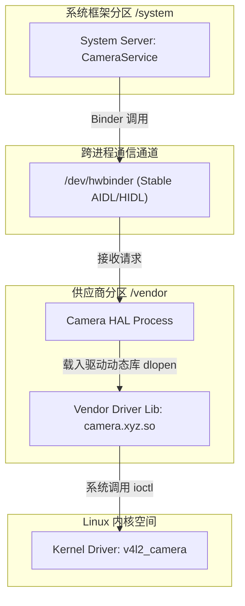
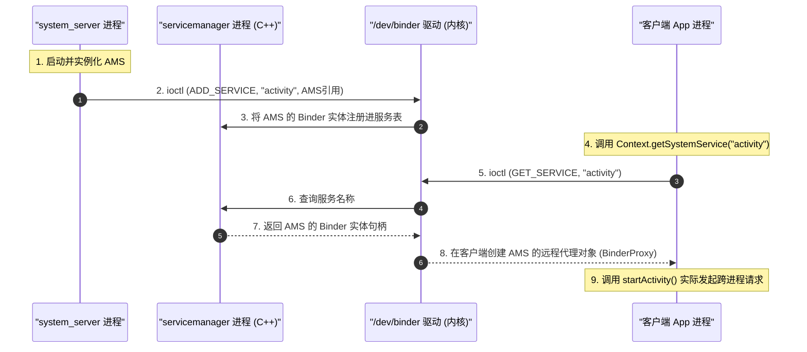
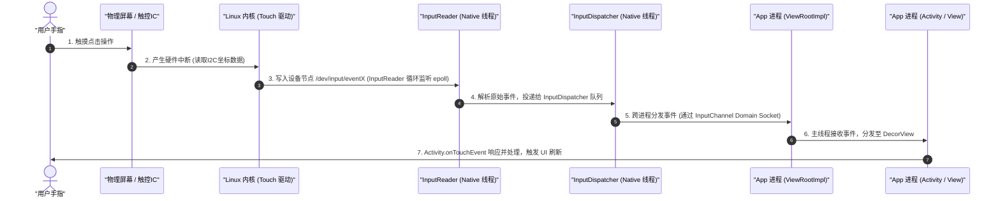

# 5.1.1.2 Android系统架构

Android 系统架构是移动操作系统设计的集大成者。它在设计之初就面临着严苛的硬件环境约束（如早期移动设备微小的物理内存、有限的 CPU 算力和对电池续航的极致要求），同时必须应对硬件产业链的高度碎片化与商业利益博弈。为此，Google 并没有直接套用传统的桌面 GNU/Linux 架构，而是设计了一套独特的、高度解耦的多层分层架构。

本篇文章将由浅入深地剖析 Android 系统经典的五层（或六层）架构设计，从最底层的 Linux 内核，到硬件抽象层（HAL）、系统运行库与运行时（ART）、应用框架层（Application Framework），直至最上层的应用层。同时，我们将深入探讨其跨层通信机制（如 Binder 跨进程通信、JNI 跨语言调用），解析其在 Project Treble 与 Project Mainline 演进中的历史变革，并通过典型交互案例（如屏幕点击、网络数据到达）展示数据流在整套架构中的完整调用链。

---

## 一、 架构设计初衷与核心哲学

在深入具体代码 and 模块细节之前，首先需要明确：**Android 为什么要采用多层分层架构？** 这种架构背后蕴含着怎样的商业、安全与工程考量？

```mermaid
graph TD
    subgraph APP [应用层 (Applications)]
        A1["System UI"]
        A2["Launcher"]
        A3["Settings"]
        A4["第三方应用"]
    end

    subgraph FRAMEWORK [应用框架层 (Application Framework)]
        F1["Activity Manager Service"]
        F2["Window Manager Service"]
        F3["Package Manager Service"]
        F4["Display Manager Service"]
        F5["Telephony Manager"]
    end

    subgraph RUNTIME [系统运行库与运行时 (Libraries & Android Runtime)]
        subgraph LIBRARIES [C/C++ 核心库]
            L1["Media Framework"]
            L2["OpenGL ES / Vulkan"]
            L3["SQLite"]
            L4["WebKit / Blink"]
            L5["Bionic libc"]
        end
        subgraph ART [Android Runtime]
            R1["DEX 解释器"]
            R2["JIT 编译器"]
            R3["AOT 编译器"]
            R4["垃圾回收 GC"]
        end
    end

    subgraph HAL [硬件抽象层 (Hardware Abstraction Layer)]
        H1["Stable AIDL / HIDL 接口"]
        H2["Camera HAL"]
        H3["Audio HAL"]
        H4["Gralloc HAL"]
        H5["Sensors HAL"]
    end

    subgraph KERNEL [Linux 内核层 (Linux Kernel)]
        K1["Binder 驱动"]
        K2["Ashmem 匿名共享内存"]
        K3["低内存杀死器 LMK / lmkd"]
        K4["电源管理 Wake Locks"]
        K5["物理设备驱动 GPU/Display/Input"]
    end

    subgraph HARDWARE [物理硬件层]
        HW1["CPU / GPU"]
        HW2["触摸屏 / 屏幕"]
        HW3["摄像头 / 传感器"]
        HW4["Wi-Fi / 调制解调器"]
    end

    APP -->|组件生命周期/IPC| FRAMEWORK
    FRAMEWORK -->|JNI / Binder IPC| RUNTIME
    FRAMEWORK -->|Stable AIDL / HIDL| HAL
    RUNTIME -->|系统调用 syscall| KERNEL
    HAL -->|内核空间驱动接口| KERNEL
    KERNEL -->|硬件控制总线/中断| HARDWARE
```

### 1. 商业授权与 GPL 规避（The GPL Dilemma）
Linux 内核采用 GPL v2 许可证（GNU General Public License, Version 2）。根据 GPL 的“传染性”条款，任何对内核的修改或与内核静态/动态链接的代码，在分发时都必须开放源代码。
然而，智能手机硬件厂商（如高通、联发科、三星等）在芯片设计、摄像头对焦算法、图形加速渲染等方面拥有核心商业机密。如果将这些驱动算法直接写进 Linux 内核，厂商就不得不公开其硬件驱动源码，这会极大地削弱其技术壁垒。

**Android 的破局方案：硬件抽象层（HAL）运行在用户空间。**
Android 在设计上做了一次精妙的剥离：将传统的 Linux 硬件驱动一分为二：
*   **内核空间（Kernel Space）**：只保留最基础的、用于总线控制和读写寄存器的 GPL 驱动代码，这部分代码遵循 GPL 开源，但不包含核心算法。
*   **用户空间（User Space）**：创建 **HAL（Hardware Abstraction Layer）** 库。HAL 以用户空间动态链接库（`.so`）或独立进程的形式运行，它直接封装了底层的硬件核心算法。由于用户空间代码不属于 Linux 内核的衍生作品，因此可以采用 Apache 2.0 许可证。Apache 2.0 允许厂商闭源分发，从而完美解决了芯片商的合规隐忧，吸引了庞大的硬件生态圈。

### 2. 安全沙箱与进程隔离（Security Sandbox）
在传统的桌面操作系统中，普通用户的应用通常运行在相同的 UID（User ID）下，一个应用的漏洞或恶意代码极易扩散至全局。
Android 在 Linux 内核多用户机制的基础上，设计了**应用沙箱（Application Sandbox）**：
*   每个 Android 应用在安装时，系统都会为其分配一个独一无二的 Linux UID（例如 `u0_a123`）。
*   该应用的所有组件、虚拟机实例及执行代码，都运行在以该 UID 身份启动的独立 Linux 进程中。
*   应用在 `/data/data/<package_name>` 下的私有数据目录，其文件系统权限也被限制为仅该 UID 可读写。
*   如果应用想要访问系统硬件（如相机、麦克风）或其他应用的数据，必须明确声明权限，且必须通过系统框架进程（以高权限 UID 如 `system` 运行）的 Binder IPC 进行中介校验。
这种底层沙箱机制构成了 Android 系统的第一道安全防线。

### 3. 解耦与可移植性（Decoupling and Portability）
Android 运行在各种不同架构的 CPU（ARM、x86 等）和硬件平台上。为了保证上层应用开发者能够“一次编写，到处运行”，Android 必须在架构上实现多层解耦：
*   **应用与系统服务的解耦**：应用开发者不需要关心系统服务的具体实现，只需调用高层 Java API。
*   **系统服务与底层硬件的解耦**：系统服务（如 `CameraService`）不需要直接控制物理摄像头，它只需调用标准化的 HAL 接口。这使得系统框架的升级和硬件驱动的替换可以独立进行。

---

## 二、 Android 系统架构逐层剖析

本节将自底向上、详细剖析 Android 系统架构的五层核心结构，厘清每一层的技术栈、代表性模块及其在系统运行中的协作关系。

### 1. Linux 内核层 (Linux Kernel)
Linux 内核是整个系统的物理基石。它提供了内存管理、进程调度、网络协议栈、驱动模型等标准的内核功能。然而，Android 使用的内核（Android Common Kernels）并非标准的 GNU/Linux 内核，而是针对移动端进行了大量的剪裁与深度改造。

#### A. EAS (Energy Aware Scheduling) 能量感知调度器
在通用的 Linux 桌面或服务器内核中，默认的 CPU 调度器是 **CFS (Completely Fair Scheduler，完全公平调度器)**。CFS 调度器基于红黑树，旨在公平地分配 CPU 时间片，但在移动端，它存在明显的局限性：
*   CFS 假设所有的 CPU 核心都是对称同构的（SMP 架构），且不考虑系统整体功耗。
*   现代智能手机普遍采用 ARM 的 **big.LITTLE 异构多核架构**（例如 1个超大核 + 3个大核 + 4个小核）。超大核算力高但能耗呈指数级增长；小核算力低但能耗极其优异。

为了实现系统流畅度与电池续航的终极折中，Android 联合上游社区引入了 **EAS 调度器**。EAS 基于**能量模型 (Energy Model, EM)**，能够在调度线程时感知处理器的拓扑结构。当有一个新任务需要执行时，EAS 会模拟并计算：**如果将这个任务放到大核、中核还是小核运行，系统整体所增加的功耗最小？** 
通过这种实时的能效推导，EAS 能够精确地将低优先级的后台同步任务限制在低功耗小核中，而将前台 UI 渲染和触控交互线程瞬间调度到大核或超大核运行，从而极大地提升了系统的流畅度并延长了续航。

#### B. Binder 驱动
Binder 是 Android 系统跨进程通信（IPC）的底层核心。在标准 Linux 内核中，常见的 IPC 方式包括管道、信号量、共享内存、Socket 等。Android 团队之所以没有采用这些成熟机制，而是设计了 Binder，是因为 Binder 在**性能**和**安全性**上达到了最完美的平衡。
在内核层，Binder 被实现为一个字符设备驱动（`/dev/binder`），它负责跨进程的数据传递、物理内存页的映射管理、线程池管理、死亡通知以及调用端 UID/PID 的安全标记。

#### C. 匿名共享内存 (Ashmem)
Ashmem（Anonymous Shared Memory）是 Android 专有的内存共享机制。相比于标准 Linux 的 System V / POSIX 共享内存，Ashmem 具有以下独特优势：
*   **支持回收机制（Pin/Unpin）**：当系统内存紧张时，内核可以自动回收处于 "unpinned" 状态的共享内存块；当应用再次需要使用时，只需重新 "pin" 即可，如果在此期间内存已被系统回收，则会返回空数据。这极大地适应了移动端内存受限的环境。
*   **与 Binder 完美协同**：Ashmem 物理内存块可以通过 Binder 驱动传递其文件描述符（File Descriptor, fd），使得接收端进程能够直接将该 fd 映射到自身的虚拟地址空间，实现超大数据的高效共享。

#### D. 低内存杀死器 (Low Memory Killer / lmkd)
传统的 Linux 系统在内存不足时，会触发 OOM（Out Of Memory）机制，通过计算进程的坏度值（badness）随机杀掉进程。这在移动端会导致严重的体验灾难（如前台正在播放音乐的应用突然被杀）。
Android 引入了 **Low Memory Killer (LMK)** 机制。系统根据应用当前的运行状态，通过 AMS 动态计算并为进程分配动态的优先级数值——**`oom_score_adj`**。

| 进程优先级类别 | 对应常量 (ProcessList) | oom_score_adj 典型值 | 内存吃紧时的回收顺序 |
| :--- | :--- | :--- | :--- |
| **系统核心进程** | SYSTEM_ADJ | -900 | 最不易被杀 (内核常驻) |
| **前台交互应用** | FOREGROUND_APP_ADJ | 0 | 极难被杀 (用户正在交互) |
| **可见非前台** | VISIBLE_APP_ADJ | 100 | 仅在前台崩溃或极度缺内存时杀 |
| **感知性后台 (如音乐)** | PERCEPTIBLE_APP_ADJ | 200 | 较难被杀 |
| **后台 Service 进程** | SERVICE_ADJ | 500 | 内存紧张时优先回收 |
| **已缓存的后台空应用** | CACHED_APP_MAX_ADJ | 950 ~ 999 | 最先被杀以释放物理内存 |

在早期版本中，LMK 作为一个内核模块存在；在现代 Android 版本中，为了解耦内核，它已被迁移至用户空间的守护进程 **`lmkd`**。
*   **工作流**：当应用的生命周期发生变化（如 Activity 退入后台），AMS 会计算出新的 `oom_score_adj`，并通过 LocalSocket 管道发送给守护进程 `lmkd`。
*   **写入内核**：`lmkd` 将该值写入 `/proc/<pid>/oom_score_adj`。
*   **阈值监听**：`lmkd` 通过系统的 `cgroups`（控制组）或 Linux 的 `PSI (Pressure Stall Information)` 文件描述符实时监听 CPU/IO/Memory 的整体压力。当内存压力越过设定的水位线时，`lmkd` 就会向对应 `oom_score_adj` 最高的进程发送 `SIGKILL` 信号，从而精准释放物理内存。关于最新内存限制变化可参考 [AndroidVersionChangeLog.md](../../../../AndroidVersionChangeLog.md#android-17-betaapi-37)。

#### E. 电源管理 (Wake Locks)
移动设备的电量极度珍贵。标准 Linux 内核在无任务时，倾向于让 CPU 进入休眠状态。为了防止 CPU 在系统需要执行后台任务（如后台下载、音乐播放）时意外挂起，Android 引入了 **Wake Locks（唤醒锁）** 机制。
应用或系统服务可以持有唤醒锁以阻止 CPU 休眠。当所有的唤醒锁都被释放后，系统才会允许 CPU 进入深度睡眠状态以节省电量。

---

### 2. 硬件抽象层 (Hardware Abstraction Layer - HAL)
HAL 位于 Linux 内核之上、应用框架层之下，其核心价值是定义一套标准化的 C/C++ 接口，使应用框架层能够无需关心底层硬件的具体驱动细节和物理连线，即可访问底层硬件（如相机、传感器、蓝牙、音频等）。



#### A. 传统 HAL 架构 (Legacy HAL)
在 Android 8.0 之前，HAL 是以动态链接库（`.so` 文件）的形式存在的。应用框架层的 Java 服务通过 JNI 技术，调用 Native C++ 层封装的硬件接口。
C++ 代码在运行时，通过调用系统核心库中的 `hw_get_module` 函数，传入模块 ID（如 `CAMERA_HARDWARE_MODULE_ID`）。该函数会根据预定的路径规则（如 `/vendor/lib/hw/`），动态寻找对应的供应商 `.so` 库（如 `camera.goldfish.so`），并通过 `dlopen` 将其加载进当前的 `system_server` 进程中。
*   **弊端**：硬件驱动的 `.so` 库与 `system_server` 进程运行在同一个内存空间内。一旦驱动代码发生崩溃（如空指针、野指针），整个 `system_server` 会瞬间崩溃，导致整台手机死机重启。此外，由于框架与 HAL 直接链接，只要系统框架有任何 API 变动，底层的 `.so` 必须随之重新编译，导致系统版本升级极其困难。

#### B. 现代 HAL 架构 (Project Treble HAL)
为了彻底解耦系统框架与硬件实现，Google 在 Android 8.0 引入了 **Project Treble**（详见后文演进章节，可查阅 [AndroidVersionChangeLog.md](../../../../AndroidVersionChangeLog.md#android-80--81-api-26--27)）。
在现代架构下，HAL 库不再被 `system_server` 进程加载，而是运行在独立的、低权限的供应商空间进程中。框架与 HAL 进程之间通过 Binder 机制进行通信。
*   **Binderized HAL（绑定式 HAL）**：最主要的模式。供应商将 HAL 实现为一个独立的进程，使用 HIDL 或 Stable AIDL 定义接口，向系统注册服务，框架通过 `/dev/hwbinder` 跨进程调用。
*   **Passthrough HAL（直通式 HAL）**：为了向后兼容，允许旧的 Legacy HAL 以直通模式运行。它会将 Legacy HAL 包装成一个接口，在框架进程内通过直通方式直接调用，但在概念上被抽象为 Binder 服务。

#### C. Stable AIDL HAL 的崛起
早期 Treble 架构采用 **HIDL（Hardware Interface Definition Language）** 定义 HAL 接口。从 Android 11 开始，Google 逐步弃用 HIDL，全面推行 **Stable AIDL（稳定版 AIDL）**。
Stable AIDL 的优势在于：
1.  **接口统一**：废除了 HIDL 复杂的类型映射，开发者可以使用与应用层完全相同的 AIDL 语法编写硬件抽象接口。
2.  **版本向前/向后兼容性（Backward Compatibility）**：Stable AIDL 编译时会生成版本号和接口哈希值，确保客户端和服务器端即使版本不一致，也能通过安全降级或升级进行通信。

---

### 3. 系统运行库与运行时 (Libraries & Android Runtime)
这一层由两大部分组成：底层的 C/C++ 核心库，以及运行 Java/Kotlin 代码的 Android 运行时（Android Runtime, ART）。

#### A. Bionic libc 内存分配器的安全性演进
Bionic libc 是整个用户空间的基础库，除了许可证规避与轻量化考量外，其底层的内存分配器（malloc/free 接口实现）历经了多次重大重构，以应对日益复杂的性能与安全挑战：
1.  **dlmalloc（早期）**：早期的 Android 使用 Doug Lea 的 dlmalloc。由于其设计没有针对多核处理器进行并发优化，多线程申请内存时会产生剧烈的全局锁竞争，导致多核性能衰减明显。
2.  **jemalloc（Android 5.0 引入）**：为了解决锁竞争，系统引入了 jemalloc。它基于 **Thread Cache (tcache)** 设计，每个线程在申请小内存时直接从无锁的本地缓存中分配，只有当本地缓存耗尽时才会向全局 Arena 申请，这极大地解放了多核处理器的内存分配吞吐。
3.  **Scudo 硬化分配器（Android 11 引入）**：随着对系统安全性要求的提升，现代 Android 系统在底层及部分系统服务中引入了 Scudo 内存分配器。Scudo 专为防御内存堆漏洞设计：
    *   **保护页（Guard Pages）**：在分配的内存块前后插入受保护的、不可读写的虚拟内存页，一旦发生堆溢出（Heap Buffer Overflow）尝试越界写入，会立刻触发硬件异常中断，从而终止进程，防止漏洞被恶意利用。
    *   **随机化布局**：内存块的分配地址具有强随机性，增加了攻击者进行堆喷射（Heap Spraying）定位的难度。
    *   **元数据校验**：每次释放内存（free）时，Scudo 会对内存块的 Header 校验和进行严格核对，从物理层阻断了双重释放（Double Free）和释放后使用（Use-After-Free）等常见利用手段。

#### B. Media Framework 与 SurfaceFlinger
*   **Media Framework**：基于 Stagefright 开源多媒体框架，支持主流的音频、视频格式的硬件/软件编解码与播放。
*   **SurfaceFlinger**：Android 图形合成器。它接收来自 WMS 的 Surface 信息，并将它们合成、写入帧缓冲区（Frame Buffer），最终输出到屏幕。
*   **OpenGL ES & Vulkan**：底层的 2D/3D 图形渲染引擎接口，直接与 GPU 交互。

#### C. Android Runtime (ART) 的技术演进
所有的 Android 应用程序及大部分系统服务都运行在 ART 虚拟机实例中。
在 Android 5.0 之前，系统使用 **Dalvik 虚拟机**。Dalvik 是基于寄存器架构的虚拟机，专门针对低内存和低 CPU 算力设备设计，依靠即时编译（JIT, Just-In-Time）运行。
从 Android 5.0 开始，ART 成为默认的运行时环境（参见 [AndroidVersionChangeLog.md](../../../../AndroidVersionChangeLog.md#android-50--51-api-21--22) ）。以下是 ART 的核心机制演进：

| 运行时特性 | Dalvik (Android 4.4 及以前) | ART 早期 (Android 5.0 - 6.0) | 现代 ART (Android 7.0 及以后) |
| :--- | :--- | :--- | :--- |
| **编译机制** | **JIT（即时编译） + 解释器**<br>运行时动态将热点字节码编译为机器码，每次运行都要重新编译。 | **全量 AOT（ Ahead-of-Time，预前编译）**<br>安装应用时，通过 `dex2oat` 工具将 DEX 字节码一次性全部编译为本地 ELF 机器码。 | **混合编译（JIT + AOT + 解释器）**<br>安装时快速解释运行；运行中利用 JIT 收集热点代码；空闲充电时利用 Profile 信息进行后台 AOT 编译。 |
| **安装速度** | 快 | 极慢（需要全量编译所有字节码） | 极快（接近 Dalvik） |
| **存储空间占用** | Small | 极大（生成的 ELF 文件体积大幅增加） | 适中（只对热点代码编译） |
| **垃圾回收 (GC)** | **Stop-The-World (STW)**<br>GC 时必须暂停所有应用线程，容易产生卡顿。 | **并发 Mark-Sweep**<br>减少了暂停次数，但内存碎片化严重，不支持堆整理。 | **Concurrent Copying (CC) 并发拷贝 GC**<br>在应用线程运行的同时移动对象以整理碎片，STW 暂停时间降低至微秒级。 |

**DEX 文件结构与类加载优化**：
传统的 Java 编译产生大量的单个 `.class` 文件。因为每个 class 文件都有自己独立的常量池，包含了大量重复的类名、方法名和字符串，这在移动端极其浪费 ROM。
AOSP 设计了 **DEX (Dalvik Executable)** 格式。它将应用所有的 `.class` 文件合并，并将常量池进行全局去重，归拢到单一的 `Header`、`StringIds`、`TypeIds`、`ProtoIds`、`FieldIds`、`MethodIds` 区域中，所有的方法字节码则全部存放在最后的 `Data` 区域中。
这一设计使 DEX 文件体积相比传统的 Jar 包压缩减少了近 50%。

#### D. 现代 ART 垃圾回收与 MTE 机制 (Android 14+ 演进)
随着软硬件架构的高速协同，现代 ART Runtime 在垃圾回收和硬件安全结合上更进一步：
*   **Generational CC (分代并发拷贝回收器)**：在 Android 14+ 中，ART 默认强化了分代 CC 收集器。它将内存堆划分为新生代（Young Generation）和老年代（Old Generation）。根据“大部分对象生命周期极短”的经验，GC 线程主要且高频地只扫描和拷贝新生代对象。这大幅降低了堆遍历对 CPU 时间的占用，从物理层面上抑制了主线程在 GC 过程中的微小抖动，使得界面发热和掉帧大幅降低。
*   **ARM MTE (Memory Tagging Extension) 硬件安全机制**：现代 Android 系统对支持 ARMv9 架构的处理器深度启用了 MTE 支持。MTE 在内存指针的最高位字节注入 4 位的“颜色标记”（Tag），并在分配的物理内存颗粒中绑定对应的内存 Tag。当 CPU 指令试图通过指针读写内存时，硬件会自动校验指针 Tag 与内存 Tag 是否匹配。一旦不匹配（如野指针访问、越界读取），硬件会在 CPU 周期级报错并安全终止进程。ART 虚拟机在 Native 堆分配以及底层 C++ 库中大量采用 MTE，使得以往隐藏极深的 Native 内存漏洞在开发与 Beta 阶段即可暴露无遗。

---

### 5. 应用框架层 (Application Framework)
应用框架层是用 Java/Kotlin 编写的一套完整的面向对象的服务 and 管理体系。它构成了上层应用开发所必需的 SDK。它包括系统服务的双重角色：Java 层的 Manager（例如 `ActivityManager` 只是一个简易代理）与系统服务进程 `system_server` 中的真正实现类（例如 `ActivityManagerService`）。

#### Zygote 进程与 SystemServer 的诞生及服务分类
整个应用框架层的运行，依赖于两个核心进程的建立：**Zygote（孵化器进程）** 与 **SystemServer（系统服务进程）**。其启动与服务拉起时序如下：
1.  **Zygote 诞生**：系统启动时，内核拉起用户空间 1 号进程 `init`。`init` 解析 `init.rc` 配置文件，以 Native 方式启动 `zygote` 进程（程序入口为 `/system/bin/app_process`）。
2.  **VM 创建与预加载 (Preload)**：Zygote 启动后首先创建并初始化 ART 虚拟机。接着，它进入 `ZygoteInit.main()`，执行核心的**预加载**操作：加载系统常用的数千个 Java 类（如 `android.view.View` 等）和通用 Drawable / Color 系统资源。这一“预加载”设计配合 Linux 的 **写时复制 (Copy-on-Write, COW)** 机制，使得后续 fork 出来的应用进程能够完全共享这些预加载内存。只有在应用尝试修改这些只读数据时，内核才会开辟独立内存，从而实现了毫秒级的应用启动速度和极佳 of 的系统内存共享率。
3.  **SystemServer 进程创建**：Zygote 紧接着通过 `Zygote.forkSystemServer()` 创建 `system_server` 进程。
4.  **服务拉起三部曲**：`system_server` 进程在 Java 环境中启动，由 `SystemServiceManager` 分批拉起系统服务：
    *   **引导服务 (Bootstrap Services)**：AMS (ActivityManagerService)、PMS (PackageManagerService)、PowerManagerService 等。这些服务是系统运行的根本，且彼此间有强耦合，必须首先并行建立。PMS 在此时会扫描系统分区和数据分区的 APK，解析 Manifest 文件并构建起全局的应用和权限数据库。
    *   **核心服务 (Core Services)**：BatteryService、UsageStatsService (收集应用使用频次，用以评估后台休眠限制) 等。
    *   **其他服务 (Other Services)**：WMS (WindowManagerService)、IMS (InputManagerService) 等。所有服务注册完毕并打通 Binder 后，AMS 会拉起桌面 Launcher，系统就绪。

---

### 6. 应用层 (Applications)
位于架构最顶层，直接面向用户。包括系统预装的核心应用（Launcher、SystemUI、Dialer、Settings 等）以及用户从应用商店下载的第三方应用。
*   **人人平等原则**：在 Android 系统中，系统预装应用和第三方应用没有本质的技术壁垒。它们运行在相同的 ART 虚拟机上，享有相同的 Application Framework API。
*   **运行约束**：所有的应用都在严格受限的沙箱内运行，无法直接执行高特权的硬件操作或修改内核，必须通过高层框架的授权验证进行。

---

## 三、 跨层通信与核心流转机制

在 Android 庞大的分层体系中，数据和指令如何安全、高效地实现跨层和跨进程的流转？这主要依赖于两大基石：**JNI 跨语言调用** 与 **Binder 跨进程通信**。

### 1. JNI 跨语言调用桥梁
JNI（Java Native Interface）是 Java 虚拟机规范定义的调用机制，用于实现 Java 代码与 Native C/C++ 代码的互操作。在 Android 中，它是 Application Framework（Java）与底层 System Libraries / HAL（C/C++）之间的唯一纽带。

```C++
// JNI 动态注册示例代码 (Native 实现)
#include <jni.h>
#include <android/log.h>

jstring native_hello(JNIEnv* env, jobject thiz) {
    return env->NewStringUTF("Hello from Native C++!");
}

// 方法映射映射表
static JNINativeMethod gMethods[] = {
    {"getNativeString", "()Ljava/lang/String;", (void*)native_hello}
};

JNIEXPORT jint JNI_OnLoad(JavaVM* vm, void* reserved) {
    JNIEnv* env;
    if (vm->GetEnv((void**)&env, JNI_VERSION_1_6) != JNI_OK) {
        return JNI_ERR;
    }
    // 动态注册 JNI 方法
    jclass clazz = env->FindClass("com/example/arch/NativeBridge");
    if (clazz == nullptr) return JNI_ERR;
    
    if (env->RegisterNatives(clazz, gMethods, sizeof(gMethods)/sizeof(gMethods[0])) < 0) {
        return JNI_ERR;
    }
    return JNI_VERSION_1_6;
}
```

#### A. 静态注册与动态注册
*   **静态注册**：
    *   **原理**：根据特定的函数命名规范（如 `Java_com_example_arch_MainActivity_stringFromJNI`）由 JNI 引擎在加载的 `.so` 符号表中进行全局搜索匹配。
    *   **劣势**：方法名极长、且运行时匹配效率低下，不支持隐藏 Native 符号。
*   **动态注册**（如上述代码）：
    *   **原理**：当 Native 库通过 `System.loadLibrary()` 被加载时，虚拟机会首先执行其中的 `JNI_OnLoad()` 函数。在 `JNI_OnLoad` 中，显式调用 `RegisterNatives` 将 Java 中的 Native 方法与 C/C++ 的函数指针进行绑定。
    *   **优势**：匹配效率高、方法名可任意命名、且能在编译期剔除敏感符号，安全性更好。

#### B. 垃圾回收与 JNI 引用生命周期陷阱
JNI 的设计直接跨越了 Java 虚拟机的 GC 边界，因此在内存管理上极易发生崩溃和内存泄漏。
*   **局部引用 (LocalReference)**：JNIEnv 内部的大多数返回值都是局部引用（如 `NewStringUTF`）。它们在 Native 函数返回后由虚拟机自动回收。但如果 Native 函数中存在大规模循环，必须手动调用 `DeleteLocalRef`。否则，如果局部引用表超过默认限制（**AOSP 默认限制为 512 个**），应用会瞬间遭遇崩溃。
*   **全局引用 (GlobalReference)**：跨越多个 JNI 函数生命周期存活的对象，必须调用 `NewGlobalRef` 显式创建，且在使用完毕后必须调用 `DeleteGlobalRef` 释放。**未手动释放的全局引用将导致 Java 对象永久泄漏**，即使 Java 层已无任何强引用指向它。
*   **弱全局引用 (WeakGlobalReference)**：不阻止 Java 对象被 GC 回收。在使用前必须调用 `IsSameObject` 与 `nullptr` 进行空值校验，以防止访问已被垃圾回收的脏对象。

---

### 2. Binder IPC 机制的枢纽作用
Binder 不仅是数据传输的通道，更是控制整个系统服务拓扑结构的神经元。

#### A. Binder 为什么采用“一次拷贝”？
通用 Linux IPC（以管道 Pipe 为例）在数据传输时需要经历**两次拷贝**：
1.  **发送端**通过系统调用，将数据从其用户空间的缓冲区拷贝到**内核空间**的内核缓冲区中（第一次拷贝）。
2.  **接收端**通过系统调用，将数据从**内核缓冲区**拷贝到其接收端的用户空间缓冲区中（第二次拷贝）。

```mermaid
graph TD
    subgraph Client [Client 进程 (用户空间)]
        C_Buf[1. 准备要发送的数据]
    end

    subgraph Kernel_Space [Linux 内核空间]
        K_Buf[2. 物理内存页 (Physical Pages)]
    end

    subgraph Server [Server 进程 (用户空间)]
        S_Buf[3. 虚拟地址映射区域]
    end

    C_Buf -->|copy_from_user 拷贝| K_Buf
    K_Buf -.->|mmap 虚拟内存建立映射| S_Buf

    style K_Buf fill:#f9f,stroke:#333,stroke-width:2px
    style S_Buf fill:#bbf,stroke:#333,stroke-width:2px
```

而 Binder 基于 **`mmap`（内存映射）**，仅需**一次拷贝**：
1.  **Server 端映射创建**：当 Server 进程初始化时，会向 Binder 驱动发送 `mmap` 请求。驱动在内核虚拟地址空间中分配一块区域，并分配一组物理内存页（Physical Pages），将它们**同时**映射 to Server 进程的用户空间虚拟地址和内核空间的虚拟地址。
2.  **数据写入即到达**：当 Client 进程向 Server 发送数据时，驱动只需调用 `copy_from_user` 将数据从 Client 的用户空间拷贝到这块内核虚拟地址（对应的物理内存页）中。由于 Server 的用户空间也映射了这一块物理页，Server 就可以直接在内存中读取数据。
3.  **安全性保障**：因为拷贝操作在内核态完成，Binder 驱动会自动在数据包上盖上发送端进程的 `UID` 和 `PID` 戳记。接收端（如 PMS）直接读取此戳记即可判定发送端是否拥有某项系统权限，这从根本上杜绝了在用户空间伪造身份的可能。

#### B. Binder 线程池并发机制与线程耗尽防范
在 Framework 架构中，系统服务和客户端进程通过 Binder 驱动建立多线程并发响应。
*   **默认并发上限**：AOSP 进程在通过 `ProcessState::self()->startThreadPool()` 启动 Binder 线程池时，驱动默认最大支持 **15 个** 并发工作的 Binder 线程。
*   **线程耗尽危机**：如果客户端频繁地向服务端发起同步 Binder 调用，且服务端的处理逻辑涉及耗时 I/O 或数据库锁等待，服务端的 15 个 Binder 线程会在极短时间内全部被占满。此时，后续的跨进程请求将在内核驱动的队列中排队，导致客户端进程卡死，甚至触发系统框架的 ANR（Application Not Responding）崩溃。
*   **工程防范手段**：
    1.  **合理设定执行线程**：在服务端（如 SystemServer 内部服务中），凡是涉及长耗时操作的 Binder 回调，必须使用 `Handler` 投递到工作线程异步执行，迅速释放 Binder 调用线程。
    2.  **避免在主线程发起阻塞式调用**：客户端（App 进程）禁止在 UI 主线程调用同步的 Binder 接口，应使用协程或线程池进行异步包装。
    3.  **优先级提级**：对于必须迅速执行的 Binder 服务，底层通过 `setThreadPriority()` 将 Binder 线程优先级提至前台级别，以获取更多的 CPU 调度额度。

#### C. Binder 死亡通知机制 (DeathRecipient) 的设计与生命周期
分布式系统架构中，跨进程调用的生命周期往往是不对称的。如果服务端进程（如一个由应用绑定的远程 Service）因为 OOM 崩溃或被 LMK 杀掉，客户端持有的 BinderProxy 就会成为“僵尸引用”。如果应用继续对其发起调用，系统会直接抛出 `DeadObjectException` 崩溃。

为了提高系统架构的容错和自愈能力，Android 引入了 **Binder 死亡通知机制 (DeathRecipient)**：
1.  **注册死亡监听**：客户端通过 `IBinder.linkToDeath(DeathRecipient recipient, int flags)` 将自定义的监听对象绑定到 BinderProxy 上。
2.  **驱动级的红黑树监听**：内核 Binder 驱动在其维护的 Binder 实体节点中，为该客户端进程记录一个 `Binder_Ref_Death` 结构体，并将其挂载到红黑树的监听队列中。
3.  **死亡事件触发与回调**：当服务端进程异常退出时，内核会检测到该进程对应的所有 Binder 实体被销毁。驱动随即检索其死亡队列，向仍存活的客户端进程的 Binder 线程池发送一个特定的 `BC_DEAD_BINDER` 死亡通知事件。
4.  **Java 层分发与自愈**：客户端进程的 Binder 线程接收到事件，通过 JNI 向上层分发，回调 `DeathRecipient` 接口的 `binderDied()` 方法。客户端在此处可以执行资源清理、置空失效代理，或发起 `bindService()` 进行连接重建（自愈流程），从而保证了整体系统的高度稳定性。

---

### 3. 系统服务注册与获取的宏观流程
我们通过 `ActivityManagerService`（AMS）的初始化与被获取过程，展示系统服务注册与调用的完整路径：



1.  **SystemServer 初始化**：系统启动时，`system_server` 进程被拉起，其实例化了 `ActivityManagerService`（运行在 system_server 的 Binder 线程池中）。
2.  **服务注册**：AMS 通过本地的 Binder 对象，调用 `ServiceManager.addService("activity", amsBinder)`。ServiceManager 作为一个拥有固定 Binder 句柄（Handle 为 0）的守护进程，会在其内部的内存哈希表中记录 `("activity", amsBinder)` 的键值对。
3.  **客户端获取**：当 App 需要调用 AMS 时（例如启动 Activity），在 Java 层执行 `context.getSystemService(Context.ACTIVITY_SERVICE)`。
4.  **远程代理生成**：上层调用最终通过 ServiceManager 在 Java 层的代理 `IServiceManager`，向底层 `/dev/binder` 发送查询请求。ServiceManager 查询到 "activity" 对应的 AMS 实体，Binder 驱动会在客户端进程的 Binder 句柄表中创建一个红黑树节点，指向 AMS，并返回一个特殊的 C++ 对象 `BpBinder`。Java 层将其包装成 `BinderProxy`，最后通过 `IActivityManager.Stub.asInterface(binderProxy)` 转换为可调用的接口代理对象。
5.  **透明方法调用**：此后，应用只需调用代理对象的 `startActivity()`，该调用会被自动序列化（Parcel 化）并写入 `/dev/binder`，通过驱动分发到 AMS 的 Binder 线程中去执行。

---

## 四、 架构演进与历史变革

Android 系统架构并非一成不变，而是伴随着 Google 对生态治理的加强以及硬件技术的迭代，经历了数次里程碑式的重构。

### 1. Project Treble（Android 8.0 引入）
*   **痛点**：在 Android 8.0 之前，系统升级要求芯片厂商首先升级其 HAL 驱动代码。由于驱动与系统框架强耦合，芯片厂商为旧设备升级驱动的成本极高，导致 Android 长期处于极其严重的碎片化状态。
*   **重构设计**：引入 **供应商接口 (Vendor Interface)**，将 `/system` 分区（由 Google/OEM 提供更新）与 `/vendor` 分区（芯片商提供的硬件驱动）彻底分离。
*   **Binder 域的物理划分**：为防止框架进程和供应商进程混用 Binder 节点导致安全边界模糊，Treble 将底层的 Binder 划分为了三个物理节点：
    *   `/dev/binder`：系统框架层与应用层之间的标准 IPC 节点。
    *   `/dev/hwbinder`：硬件 Binder。系统服务与独立运行的 HAL 进程之间必须使用该节点通信。
    *   `/dev/vndbinder`：供应商 Binder。仅允许供应商进程内部或供应商进程之间使用，框架进程无权读取。

### 2. Project Mainline（Android 10 引入）
*   **痛点**：系统安全漏洞修补（如 Stagefright 媒体库漏洞）仍需要 OEM 厂商推送 OTA，安全补丁分发滞后严重。
*   **重构设计**：引入 **APEX (Android Pony EXpress)** 模块化文件格式。APEX 与 APK 类似，但它是一个包含独立文件系统的映像文件，在系统 boot 早期通过 `apex_manager` 挂载到 `/apex/` 目录下。
*   **运行中的组件模块化**：
    AOSP 通过 APEX 将系统划分为数十个独立的 Mainline 模块。例如：
    *   **Conscrypt**：安全加密套件模块。
    *   **Tethering**：网络热点与网络协议栈模块。
    *   **ART 模块**：Android 运行时模块。
*   **运作机制**：Google 可以绕过任何手机厂商，直接通过 Google Play 商店，以热更新的方式向全球设备推送最新的 APEX 安全组件。这赋予了 AOSP 极强的安全性防御实时响应力。

### 3. 16 KB 页大小（Page Size）支持（Android 15 / 16 演进）
*   **背景**：自 Android 诞生起，底层 Linux 内核一直采用经典的 **4 KB 物理页大小**。然而，随着现代手机 RAM 容量攀升至 12GB/16GB，CPU 缓存与物理内存的吞吐带宽面临瓶颈。
*   **技术红利**：支持 16 KB 页大小的内核可以显著减少主存与 CPU 缓存之间的传输频率。测试数据表明，16 KB 页对齐的设备在系统冷启动速度上可提升 5%~10%，且高负载下的缺页中断次数大幅降低。
*   **挑战与兼容性**：这对底层架构产生了两大深远影响：
    1.  所有的 C/C++ 动态链接库（`.so` 文件，包括 NDK 开发的应用库和供应商 HAL 库）在编译链接时，必须采用 16 KB 页面对齐（通过 `-z max-page-size=16384` 参数编译）。
    2.  未进行 16 KB 对齐的旧 `.so` 库，在 16 KB 内核的 Android 系统上运行时，会因为内存对齐错误而导致进程被内核直接杀死。在 Android 16（API 36）中，这一对齐兼容已被收紧为更严格的要求。有关此机制的适配细节可跳转至 [AndroidVersionChangeLog.md](../../../../AndroidVersionChangeLog.md#android-16api-36) 查看。

---

## 五、 典型交互案例分析（全链条跨层流转）

我们将通过两个最为典型的交互案例，把 Android 架构的五层结构融会贯通，追踪数据在各层之间的完整生命轨迹。

### 1. 案例一：点击屏幕 (Touch Event) 的跨层全链条流转
当用户的手指点击手机屏幕上的一个 Button 时，事件是如何跨越硬件、内核、系统库、应用框架，最终回调到 Activity 的？



*   **物理层**：用户手指触摸屏幕，屏幕上的电容传感器发生电荷突变。触控 IC 模组捕获电信号，将其转化为原始的触摸坐标与动作类型。
*   **Linux 内核层**：触控 IC 产生一个硬件中断（Hardware Interrupt）。内核中的 Touchscreen 驱动响应中断，通过 I2C 或 SPI 总线读取触控 IC 中的数据，并将其封装为符合 Linux 标准的输入事件，写入到设备节点 `/dev/input/eventX` 中。
*   **系统库与运行时层 (Native 层)**：系统框架进程中的 `InputManagerService` 在启动时，会拉起两个底层的 Native 线程：
    1.  **`InputReader` 线程**：它利用 Linux 的 `epoll` 机制，循环监听 `/dev/input/` 目录下的所有设备节点。一旦检测到 `/dev/input/eventX` 有新数据写入，它立即将其唤醒，读取数据并进行坐标系校准，生成 `MotionEvent` 数据。
    2.  **`InputDispatcher` 线程**：`InputReader` 将事件移交给 `InputDispatcher`。该线程负责寻找最合适的接收窗口。它向 WMS 查询当前焦点的窗口位置，确定目标应用进程。
*   **跨层通信机制 (InputChannel)**：`InputDispatcher`（属于 `system_server` 进程）与目标应用的 `ViewRootImpl`（属于应用进程）之间并不通过普通的 Binder 传输大容量的触摸事件（为了规避 Binder 的延迟）。它们在 WMS 建立窗口时，就已经通过一对 **Unix Domain Socket** 建立了专属通信管道——**`InputChannel`**。`InputDispatcher` 直接向该 Socket 写入事件。
*   **应用框架层 (Java)**：应用主线程中监听该 Socket 描述符的 `WindowInputEventReceiver` 被唤醒，读取事件。它将事件打包投递到应用主线程的 `MessageQueue` 中。
*   **应用层**：应用主线程的 `Looper` 轮询到此消息，交由 `ViewRootImpl` 开始沿着 View 树分发：
    `DecorView -> ViewGroup -> View` 的 `dispatchTouchEvent()` -> `onInterceptTouchEvent()` -> `onTouchEvent()`。
    最终，如果 Button 被按下，则触发 `OnClickListener.onClick()` 业务代码，全链路流转完成。

---

### 2. 案例二：网络数据包接收的全链条流转
当手机接收到服务器发来的一个 TCP 数据包，数据是如何呈递给上层 OkHttp 库的？

*   **物理硬件层**：手机的 Wi-Fi 芯片或蜂窝基带芯片（Modem）天线接收到高频电磁波，将其降频、解调并进行差错校验，转化为标准的数字帧（以太网帧），存入芯片内部的 DMA（Direct Memory Access）接收缓冲区。
*   **Linux 内核层**：
    1.  芯片触发硬件中断，CPU 暂停当前任务，执行网卡驱动的中断服务程序（ISR）。
    2.  ISR 将数据包拷贝到内核空间的 `sk_buff`（套接字缓冲区）结构体中，并通过 Linux 标准的 NAPI 机制唤醒内核的软中断（Software Interrupt）线程 `ksoftirqd`。
    3.  软中断线程在后台异步执行，数据包开始流经 Linux 内核的 TCP/IP 协议栈（数据链路层解析 MAC 首部 -> 网络层解析 IP 首部 -> 传输层解析 TCP 首部）。
    4.  内核根据端口号，将解包后的网络数据载荷（Payload）追加到对应 Socket 描述符的接收缓冲区中，并唤醒在此 Socket 上阻塞等待的读取线程。
*   **系统运行库层 (Bionic libc)**：在上层应用中，底层的读操作最终会触发系统调用。在 Native 层，Bionic libc 提供的 `recv` / `read` 函数会执行 `SYS_read` 系统调用汇编指令。CPU 切换到内核态，将内核 Socket 接收缓冲区中的数据拷贝到应用进程在用户空间的缓冲区中。
*   **应用框架与运行时层**：Java 层的 `SocketInputStream.read()` 是一个 Native 方法，其底层正是调用了上述 Bionic libc 的接口。Java 虚拟机将拷贝上来的 C++ byte 数组转换为 Java 的字节数组。
*   **应用层**：OkHttp 或其它网络库对 Java 层的 Socket 流对象进行高层协议解析（如 HTTP/1.1、HTTP/2、TLS 握手解密）。解压并解析出 JSON 文本后，通过 Handler 将数据回传给主线程，驱动应用层界面的展示。

---

## 六、 架构设计权衡与常见问题解答

理解系统架构，不仅要知其然，更要知其所以然。以下针对架构设计中经常被质疑或误解的权衡点进行解答。

### 1. 为什么 Android 进程内部大量使用多线程，而不像通用 Linux 那样广泛使用多进程？
*   **RAM 资源的极度制约**：在 Android 系统中，每一个独立的 Linux 进程如果想要运行 Java 代码，都必须拥有自己独立的 ART 虚拟机实例，并加载基础的系统 Framework 类。在移动端，这意味着一个极其简易的空进程也至少需要占用 15MB 甚至 30MB 的物理内存（取决于具体 Android 版本和架构）。如果应用稍微将一些模块（如网络、推送、统计）拆分为独立的进程，系统内存将迅速耗尽。
*   **线程级开销对比**：多线程在同一个进程内共享虚拟内存地址空间。线程的切换只涉及寄存器状态和 CPU 上下文的保存，开销极低；而多进程切换涉及到页表的切换（TLB 刷新）和 Binder IPC 开销。因此，Android 推荐在单进程中通过 `Handler` / `Executor` / `Coroutines`（协程）等轻量级多线程模型来响应高并发，只在涉及需要强力物理隔离的特殊场景（如极易崩溃的多媒体编解码、独立的常驻推送 Service）才考虑配置 `android:process`。

### 2. 应用冷启动与热启动在系统架构层面有何不同？
*   **冷启动（Cold Start）**：
    1.  **进程不存在**：应用在内存中没有任何缓存。
    2.  **AMS 与 Zygote 的 IPC**：AMS 接收到启动 Activity 请求，发现对应进程未启动，于是向 Zygote 发送 fork 命令。
    3.  **Zygote fork 进程**：Zygote fork 出子进程，利用 **Copy-on-Write** 映射物理内存页。
    4.  **初始化与类加载**：子进程初始化 Native 运行环境，创建主线程 `ActivityThread`，调用 `Looper.prepareMainLooper()` 建立消息队列。
    5.  **Application 实例化**：通过 Binder 向 AMS 报告启动，AMS 返回 ApplicationInfo，应用反射创建 `Application` 并回调 `onCreate()`，最后加载 Activity。由于全链条涉及进程创建、动态类加载、资源解析与渲染，耗时最长。
*   **热启动（Warm Start）**：
    1.  **进程依旧存活**：用户点击返回键退出应用，此时 Activity 栈已被销毁，但 Linux 应用进程仍旧作为“已缓存进程”保留在 lmkd 的后台缓存队列中。
    2.  **AMS 直接唤醒**：当用户再次启动应用时，AMS 发现其对应的进程仍然存活，便直接复用该进程。
    3.  **直接拉起 Activity**：AMS 绕过了 Zygote 的 fork 阶段和 Application 的初始化，直接通过 Binder 指挥应用进程的主线程拉起目标 Activity 实例。此时，由于省去了类加载和进程创建开销，用户体感上几乎瞬间打开，性能损耗最小。

### 3. Android 的插件化/热修复是如何在 ClassLoader 层面打破常规双亲委派机制的？
在标准的 Android 架构中，系统通过 `PathClassLoader` 加载已安装应用的代码。如果应用想要在运行时动态加载一段未安装的代码（如从服务器下载的修复包），会受到双亲委派机制的天然隔离。
*   **打破常规的类加载策略**：热修复框架（如 Tinker 等）通常会打破常规：
    1.  **反射干预 DexPathList**：在 Java 层，`BaseDexClassLoader` 内部持有一个 `DexPathList` 类型的 `pathList` 对象，该对象内部又维护着一个名为 `dexElements` 的数组（实质是包含所有已加载 `.dex` 文件的 Element 数组）。
    2.  **前置插入补丁包**：热修复框架将下载好的补丁 DEX 文件包装为 Element 对象，通过 Java 反射，将这个补丁 Element 插入到系统的 `dexElements` 数组的**最前面**。
    3.  **阻断原始类查找**：当应用在运行中调用某一个出 Bug 的类时，ClassLoader 会根据双亲委派模型在 `findClass()` 中遍历 `dexElements` 数组。由于补丁 Element 被插在了最前面，ClassLoader 首先就会找到并加载已经修复好的类。一旦找到并加载成功，便会立即返回，从而阻断了对数组后面那个原本带有 Bug 类的加载，精妙地实现了热修复。

### 4. 为什么不让 Framework 直接与 Linux 内核驱动交互，而要多写一层 HAL？
*   **接口稳定性与标准化**：Linux 内核的内部驱动接口（如 V4L2 摄像头接口）随着内核版本的升级经常发生剧烈变动（Linux 内核开发哲学是“内核内部 API 不保证稳定”）。如果 Framework 直接依赖内核接口，意味着每一次 Linux 内核小版本升级，Framework 的 Java 逻辑甚至都需要跟着改动。HAL 的引入建立了一层“防洪堤”，它对内核的变动进行屏蔽，对外提供永恒不变的标准化硬件接口。

### 5. Binder 传输大小受限，大图或大文件传输的架构级解法是什么？
*   **mmap 共享内存解法**：在进程间传输超大数据时，发送端通过系统 API `MemoryFile` 或 `SharedMemory`，在内核的 Ashmem 模块中分配一块不受 Binder 1MB 限制 of 的物理内存。将大图或文件数据直接写入该共享内存块。然后，发送端将该共享内存对应的 `FileDescriptor` 包装成 `ParcelFileDescriptor`，通过 Binder IPC 将这个描述符传递给接收端。当 Binder 驱动在内核检测到传递的数据中包含文件描述符时，它会在接收端进程的文件描述符表中自动“复制”一个指向该共享内存节点的 fd。接收端进程在拿到该 fd 后，通过 `mmap` 将其映射到自身的进程虚拟地址空间，直接读取数据。整个过程中，真正的数据内容没有发生过任何 Binder 拷贝，只在最后进行了共享读取，其运行性能达到了物理极限。
