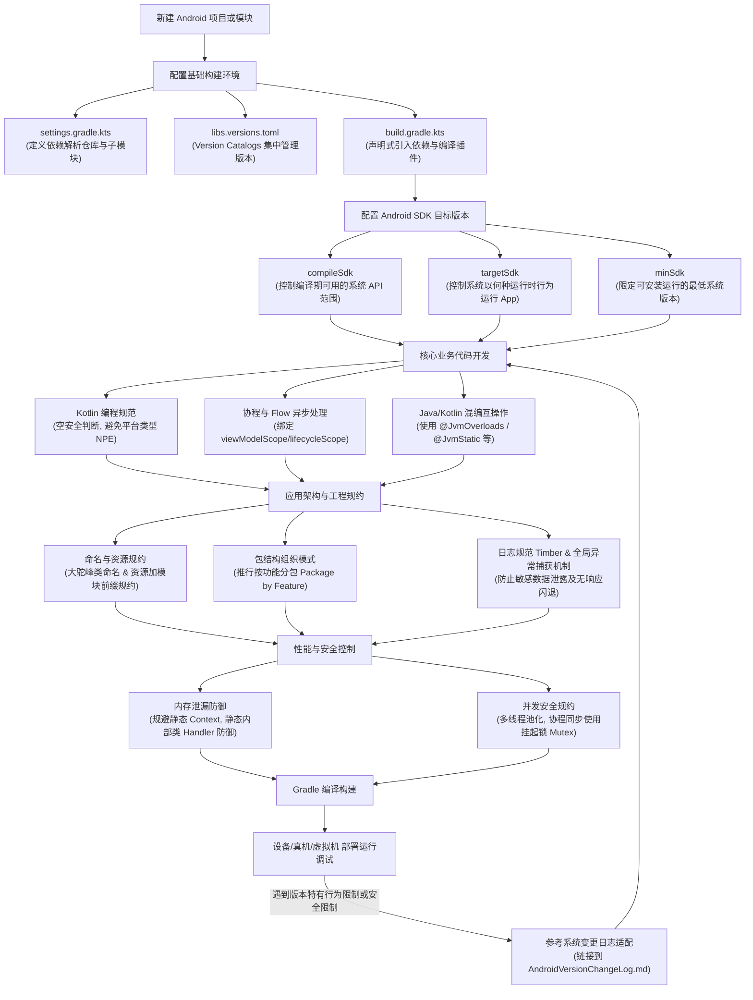

# 5.1.1.3 Android编程指南

## 1. 导言：现代 Android 开发（MAD）的浪潮与规范指引

在过去的十余年中，Android 开发技术经历了一场深度的技术范式转移。从早期的 Eclipse 时代配合 Java 6/7 语法，到如今以 Android Studio 为核心，Kotlin 为首选编程语言，Jetpack 组件库为骨架，Gradle 声明式构建为主流的“现代 Android 开发”（Modern Android Development，简称 MAD）体系，开发者所面临的基础设施和编程理念已经发生了颠覆性的变化。

MAD 理念的提出，其核心在于解决传统 Android 开发中饱受诟病的痛点：繁琐的样板代码、脆弱的生命周期管理、多线程并发时的线程安全隐患、以及构建系统的低效与配置混乱。在现代 Android 开发的浪潮中，编写高质量代码不再仅依赖于开发者的个人技术水平，而更依赖于一整套工程化、规范化的编程指南。

制定统一的 Android 编程指南，其意义不仅在于规范代码的可读性，更在于为团队协作提供一个公认的技术标尺。在一个中大型团队中，没有规约的代码库往往会迅速退化为“焦油坑”：有人在使用原始的 Java 线程进行异步调用，有人在用 RxJava，而另一些人则在尝试 Kotlin 协程；有人使用传统的 Gradle 属性机制定义依赖，而另一些人则直接在 build 脚本中硬编码库版本。这种多样性不仅增加了项目的维护成本，还容易引入难以复现的内存泄漏、多线程死锁及编译期冲突。

本指南旨在从开发基础设施配置、编程语言规范、工程架构设计、安全性与性能调优等多个维度，为开发者提供一套切实可行的 Android 编程规范和最佳实践指南。通过对技术底层机制的深度刨析，帮助开发者理解“为什么要这样写”以及“怎样写才是最高效、最安全”的，从而共同打造健壮、优雅且易于维护的 Android 应用。

---

## 2. 开发环境与基础设施配置最佳实践

工欲善其事，必先利其器。Android 开发环境（Android Studio）与基础设施构建系统（Gradle）的合理配置，直接关系到开发者的日常编译效率与项目的稳定性。本章重点阐述开发环境的调优参数、SDK 的管理策略以及现代 Gradle 依赖管理的演进规范。

### 2.1 Android Studio 与 JVM 运行环境调优

Android Studio 基于 IntelliJ IDEA 平台开发，由于 Android 项目的构建过程极其消耗 CPU 和内存，默认的 JVM 堆内存大小往往无法满足中大型项目的编译需求。如果配置不当，开发者在日常编码中会频繁遭遇 IDE 卡顿、Gradle 编译停顿甚至 OOM（内存溢出）等问题。

为保证流畅的开发体验，推荐对 Android Studio 及其背后的 Gradle 守护进程（Daemon）进行如下 JVM 参数优化：

1. **调整 IDE 运行内存**：通过 `Help -> Change Memory Settings` 将 IDE 的最大堆内存（`-Xmx`）调整为至少 **4GB**（建议配置为 4096MB 或以上，根据物理内存大小灵活决定）。这可以显著减少 IDE 内部进行垃圾回收（GC）的频率，避免在代码高亮、布局预览和索引构建时产生卡顿。
2. **调优 Gradle Daemon 堆大小**：在项目根目录的 `gradle.properties` 文件中，显式指定 Gradle 编译进程的 JVM 参数。推荐配置如下：
   ```properties
   org.gradle.jvmargs=-Xmx4096m -XX:+UseG1GC -XX:MaxMetaspaceSize=1024m
   ```
   *原理分析*：`-Xmx4096m` 确保了 Gradle 在编译、混淆（R8）、打包时有足够的堆内存空间；`-XX:+UseG1GC` 引入了 G1 垃圾收集器，相比传统的 Parallel GC，它能够提供更低且更可控的停顿时间，适合大内存的编译场景；`-XX:MaxMetaspaceSize=1024m` 限制了元空间大小，防止因类加载过多导致非堆内存溢出。
3. **开启并行构建与构建缓存**：在 `gradle.properties` 中启用并行编译和构建缓存，能大幅缩短增量编译时间：
   ```properties
   org.gradle.parallel=true
   org.gradle.caching=true
   ```
   *注意条件*：并行编译（`parallel`）在项目被合理拆分为多个子模块（Multi-module）时效果最佳；构建缓存（`caching`）则会把编译过的任务结果缓存在本地，切换分支时能直接复用。

### 2.2 Android SDK 管理与版本适配策略

在 SDK Manager 中，开发者需要管理多个版本的编译工具和平台 SDK。在配置项目时，必须深刻理解以下三个 SDK 版本参数的深层含义与适配原则：

*   **compileSdk (编译 SDK)**：
    *   *定义*：指定编译器在编译应用时使用哪个 Android 版本的 API。
    *   *原则*：**应始终将其设置为最新的稳定版 API Level**。这使得开发者可以使用最新的 Java/Kotlin 语法特性和最新的 Android 系统 API，且不会影响应用的运行时行为。
*   **targetSdk (目标 SDK)**：
    *   *定义*：告知系统该应用已针对此 Android 版本进行了测试与适配。系统在运行该应用时，将启用该版本及以前的所有系统新特性与运行时安全限制。
    *   *原则*：**随着 Google Play 或国内主流应用市场的要求，应定期将其提升至较新的版本**。如果不更新 `targetSdk`，系统为了向下兼容，会为该应用启用旧版的运行时行为（例如放宽后台限制或存储空间限制），但这会失去新系统所带来的安全和性能优化。有关历代 Android 系统 API 变更和安全沙盒的变化细节，请务必参考根目录的 [AndroidVersionChangeLog.md](../../../../AndroidVersionChangeLog.md)。
*   **minSdk (最小 SDK)**：
    *   *定义*：限制应用可以安装的最低 Android 设备版本。
    *   *原则*：根据产品用户的设备分布数据决定，通常选择能覆盖 95% 以上活跃用户的 API 版本（如目前主流选择 API 21 或 API 23）。在代码中如果调用了高于 `minSdk` 但低于设备当前运行系统版本的 API，必须使用 `Build.VERSION.SDK_INT` 进行运行时版本检查，否则会导致运行时崩溃。

### 2.3 现代 Gradle 依赖管理：Version Catalogs 的演进

传统的依赖管理通常采用在根目录 `build.gradle` 中定义 `ext` 闭包，或者使用 `buildSrc` 模块来集中管理版本号。然而，这两种方式在实践中各自存在明显的短板：

*   **传统 `ext` 闭包**：不支持代码补全，在模块中声明依赖时容易因为拼写错误导致编译失败；且在大型多模块项目中，难以直观地感知哪些模块使用了特定的第三方库。
*   **`buildSrc` 静态模块**：虽然支持 Kotlin DSL 的类型安全和代码自动补全，但由于 `buildSrc` 是一个完整的 Kotlin 模块，一旦修改了其中的任何一个版本号，都会导致 Gradle 将其视为 classpath 发生变更，进而强制触发**整个项目所有模块的全量重新构建**。这对于大中型项目而言，会极大地损害日常编译效率。

为了解决这些痛点，Android 官方及 Gradle 社区在现代构建系统中强推 **Version Catalogs**（通常对应 `libs.versions.toml` 文件）。其具备以下显著优势：
1. **类型安全与自动补全**：在 `build.gradle.kts` 中可以通过 `libs.androidx.core` 这种类型安全的方法引用依赖，获得 IDE 的实时代码补全。
2. **优秀的增量编译性能**：作为声明式的 TOML 配置文件，修改 `libs.versions.toml` 中的版本号，不会导致整个构建系统的 classpath 被全局刷脏，只有真正使用该依赖的模块会参与重新编译，极大地保护了增量编译速度。

在现代工程中，推荐在根目录的 `gradle/libs.versions.toml` 中配置依赖。一个典型的 Version Catalogs 结构示例如下：

```toml
[versions]
ktx = "1.12.0"
appcompat = "1.6.1"
coroutines = "1.7.3"

[libraries]
androidx-core-ktx = { group = "androidx.core", name = "core-ktx", version.ref = "ktx" }
androidx-appcompat = { group = "androidx.appcompat", name = "appcompat", version.ref = "appcompat" }
kotlinx-coroutines-android = { group = "org.jetbrains.kotlinx", name = "kotlinx-coroutines-android", version.ref = "coroutines" }

[plugins]
android-application = { id = "com.android.application", version = "8.1.1" }
kotlin-android = { id = "org.jetbrains.kotlin.android", version = "1.9.0" }
```

在模块的 `build.gradle.kts` 中，可以如下干净、类型安全地引入依赖：

```kotlin
dependencies {
    implementation(libs.androidx.core.ktx)
    implementation(libs.androidx.appcompat)
    implementation(libs.kotlinx.coroutines.android)
}
```

---

## 3. Android 核心编程语言规范

在 2019 年的 Google I/O 大会上，官方宣布了 **Kotlin-First** 政策，Kotlin 正式成为 Android 开发的首选语言。如今，几乎所有新增的 Jetpack 组件和官方示例均优先使用 Kotlin 编写。但在实际开发中，由于历史遗留的 Java 代码仓库以及混编场景的存在，掌握 Kotlin 的高级语言特性、空安全范式、协程并发以及 Java 互操作规约，是现代 Android 研发人员的必修课。

### 3.1 Kotlin 实战中的空安全（Null Safety）范式

Kotlin 最具革命性的特性之一便是将其空指针异常（`NullPointerException`，简称 NPE）的防御提升到了编译期。然而，在 Android 实际开发中，空安全并不能自动消除所有 NPE，开发者必须警惕以下几种典型场景并遵循相关编码规约。

#### 3.1.1 警惕 Platform Types（平台类型）引起的崩溃
当 Kotlin 代码调用未加可空注解的 Java 代码时，编译器无法确定该返回值是否可能为 null，此时该变量的类型在 Kotlin 中会被标记为 **Platform Type**（在 IDE 中显示为带有感叹号的类型，如 `String!`）。
*   *隐患*：Kotlin 编译器不会对 Platform Types 强制进行空安全检查。如果 Java 方法返回了 null，而 Kotlin 侧直接将其赋值给了一个非空类型（如 `val s: String = JavaClass.getName()`），在运行时会立即抛出 NPE。
*   *规约*：**对于所有 Java 互操作的接口，Java 侧代码必须显式声明 `@Nullable` 或 `@NonNull` 注解**。如果无法修改 Java 源码，Kotlin 侧在接收返回值时，应主动将其显式声明为可空类型（如 `val s: String? = JavaClass.getName()`），并通过安全调用符 `?.` 或猫头鹰运算符 `?:` 进行兜底处理。

#### 3.1.2 作用域函数的合理选型
Kotlin 提供了 `let`, `also`, `run`, `apply`, `with` 等作用域函数，极大地丰富了空安全链式调用的写法。然而，滥用这些函数会使代码的可读性急剧下降。团队内必须确立清晰的选型规约：
*   **`let`**：主要用于配合安全调用符 `?.` 执行非空判断，并在 Lambda 内部使用 `it` 引用对象。通常用于在对象非空时执行一段特定逻辑。例如：
    ```kotlin
    intent?.extras?.let { bundle ->
        // 仅在 intent 和 extras 都不为空时执行
        processBundle(bundle)
    }
    ```
*   **`apply`**：在 Lambda 内部使用 `this` 引用对象，并**返回该对象本身**。非常适用于对象的初始化和链式配置。例如配置一个 `Intent` 或 `Notification`：
    ```kotlin
    val intent = Intent(context, DetailActivity::class.java).apply {
        putExtra("id", userId)
        flags = Intent.FLAG_ACTIVITY_NEW_TASK
    }
    ```
*   **`also`**：在 Lambda 内部使用 `it` 引用对象，并返回对象本身。适用于在不改变对象状态的情况下执行附加的副作用逻辑（如打印日志、埋点）。
*   **`run`**：在 Lambda 内部使用 `this` 引用对象，但返回的是 Lambda 表达式的最后一行结果。适用于执行一段包含临时变量计算且需要返回值的逻辑。

### 3.2 结构化并发与协程（Coroutines）/ Flow 最佳实践

在现代 Android 开发中，Kotlin 协程是推荐的异步编程解决方案。相比于传统的 Handler、AsyncTask 或复杂的 RxJava，协程以其“用同步方式书写异步代码”的优势，降低了并发编程的门槛。但为了防止协程泄漏和资源浪费，必须严格遵守**结构化并发（Structured Concurrency）**原则。

#### 3.2.1 严禁滥用 GlobalScope
`GlobalScope` 启动的协程生命周期是与整个 Application 绑定的。如果在一个 Activity 中使用 `GlobalScope.launch` 发起网络请求，当用户退出该 Activity 时，该协程仍然会在后台持续运行，这不仅会导致 Activity 无法被 GC 回收从而引起严重的**内存泄漏**，还会白白消耗手机的 CPU 和电量，甚至在协程执行完毕尝试刷新已被销毁的 UI 组件时引发 Crash。
*   *规约*：**禁止在任何业务代码中使用 `GlobalScope`**。在 ViewModel 中，必须使用官方提供的 `viewModelScope`；在 Activity 或 Fragment 中，必须使用 `lifecycleScope`。这两个作用域会自动绑定相关组件的生命周期，当组件被销毁（如 ViewModel 执行了 `onCleared()`，Activity 触发了 `onDestroy()`）时，作用域内所有正在挂起和运行的协程都会被自动取消，从而保证了内存安全。

#### 3.2.2 线程调度器（Dispatchers）的正确划分
在启动协程或使用 `withContext` 切换线程时，必须根据任务性质选择合适的调度器：
1. **`Dispatchers.Main`**：绑定 Android 主线程。仅用于快速的 UI 更新、简单的属性设置、以及与生命周期感知组件的交互。**绝不能在此调度器下执行任何阻塞性 I/O 或耗时计算**。
2. **`Dispatchers.IO`**：底层基于弹性线程池。**专门用于阻塞式的 I/O 操作**，如数据库读写（Room）、网络请求（Retrofit）、本地文件读写、SharedPreference 提交等。
3. **`Dispatchers.Default`**：底层基于固定大小线程池（通常与 CPU 核心数一致）。**专门用于 CPU 密集型的高性能计算**，如大列表数据排序、JSON 解析、图片算法处理等。

#### 3.2.3 生命周期安全的 Flow 收集（repeatOnLifecycle）
对于冷数据流（Flow）或热数据流（SharedFlow/StateFlow）的收集，在 Activity/Fragment 中如果直接使用 `lifecycleScope.launch { flow.collect { ... } }`，会存在一个隐性的性能隐患：当应用被切到后台（处于 `STOPPED` 状态，如用户按了 Home 键），UI 元素已经不可见，但该协程依然会活跃地接收并处理数据流（例如传感器数据、位置更新、甚至后台轮询任务）。这不仅在浪费计算资源，还可能导致不可预期的后台状态冲突。
*   *规约*：**推荐使用 `repeatOnLifecycle` 或 `flowWithLifecycle` API** 来收集数据流。
    ```kotlin
    lifecycleScope.launch {
        // 当生命周期处于 STARTED 状态时开始收集，一旦降至 STOPPED 状态则自动取消收集
        // 当生命周期重新回到 STARTED 状态时，又会自动启动新的协程进行收集
        viewLifecycleOwner.repeatOnLifecycle(Lifecycle.State.STARTED) {
            viewModel.uiState.collect { state ->
                updateUI(state)
            }
        }
    }
    ```

### 3.3 Java-Kotlin 混编时的最佳兼容规约

对于存量 Java 代码较多的项目，在逐步迁移到 Kotlin 的过程中，需要编写专门的注解以确保 Java 调用 Kotlin 时的平滑度与性能：

*   **`@JvmStatic`**：在 Kotlin 的 `companion object` 或 `object` 单例中，方法默认需要通过 `Companion` 内部类间接调用。加上此注解后，Kotlin 编译器会在字节码中直接生成真正的静态方法，方便 Java 侧直接通过类名调用。
*   **`@JvmOverloads`**：Kotlin 支持方法参数默认值，但 Java 不支持。在 Kotlin 方法上添加该注解后，编译器会自动生成多个重载的 Java 方法，避免 Java 侧调用时必须传递所有默认参数的麻烦。
*   **`@JvmField`**：Kotlin 默认会将类属性编译为带有私有成员变量和公开 Getter/Setter 的结构。如果希望在 Java 中直接以成员变量的形式访问（如 `user.name`），可加上此注解，消除方法调用的性能开销。

---

## 4. Android 架构与代码设计规约

糟糕的代码架构和无序的包结构，会随着项目的迭代迅速使代码变得脆弱。遵循一套统一的命名规约、模块化的包结构设计以及规范的日志与异常处理，是保障大型项目长期健康演进的关键。

### 4.1 命名规约与资源管理

在 Android 开发中，由于历史原因，除了代码类的命名，还涉及到大量的 XML 布局、图片、动画以及字符串等资源文件的命名。

#### 4.1.1 代码命名
*   **类与接口**：采用大驼峰命名（PascalCase），如 `UserDetailActivity`。
*   **变量与方法**：采用小驼峰命名（camelCase），如 `getUserInfo()`。**坚决废弃匈牙利命名法中以 `m` 开头标记成员变量的做法**（如 `mTextView` 应直接写为 `textView`），这在现代 IDE 具备高亮和悬浮提示的背景下早已失去意义，且有违 Kotlin 的表达风格。
*   **常量**：全部大写并用下划线连接，如 `const val MAX_RETRY_COUNT = 3`。

#### 4.1.2 资源文件与 XML 命名
资源命名最核心的作用是**防止资源冲突**。在大型多模块项目中，如果两个模块拥有同名的 `activity_main.xml`，Gradle 在打包合并资源（Resource Merging）时会发生无预警覆盖，导致运行时展示错误的界面。
*   *规约*：资源命名应遵循 `[模块名前缀或业务前缀]_[类型/用途]_[名称]` 的下划线命名法。
    *   **布局文件（Layout）**：`activity_xxx.xml`、`fragment_xxx.xml`、`item_xxx`（用于 RecyclerView 的子项）。
    *   **图片资源（Drawable/Mipmap）**：`ic_xxx.xml`（矢量图标）、`bg_xxx.png`（背景图）。
    *   **控件 ID 命名**：应在 XML 中采用小驼峰命名，且后缀体现控件类型，如 `btnSubmit`（Button）、`tvTitle`（TextView）。这在使用 ViewBinding 时可以直接生成符合 Kotlin 命名的驼峰属性。

### 4.2 包结构组织：Package by Feature vs. Package by Layer

在组织代码结构时，有两种主要的包划分思路：

1.  **按层分包（Package by Layer）**：将代码分为 `ui`、`model`、`adapter`、`network` 等包。这在极小的单模块项目里较为直观，但在中大型项目中，每当开发者要增加一个“商品详情”功能时，必须跨越 `ui`、`model` 和 `adapter` 等多个包去新建文件，高频的代码穿梭会导致包结构混乱，且使得“商品详情”相关的代码无法实现内部封装，阻碍了未来往多模块化架构的拆分。
2.  **按功能分包（Package by Feature）**：将代码以具体的业务领域或功能模块（如 `login`、`profile`、`search`）进行高层级的划分，在每个功能包的内部再组织其特有的 View、ViewModel 和 Repository。

*   *架构规约*：**中大型 Android 工程必须严格推行 Package by Feature 架构**。这有助于实现高内聚、低耦合，方便控制代码的可见性（例如将某些特定组件声明为 `internal`，防止被其他业务功能误调用），并极大地方便了后续向独立 Gradle 业务模块的物理拆分。

### 4.3 异常处理规范

错误的异常捕获方式往往会成为掩盖系统 Bug 的温床。
*   **禁止空捕获（Swallowing Exceptions）**：
    ```kotlin
    // 坏味道：吃掉异常
    try {
        parseJson(data)
    } catch (e: Exception) {
        // 什么都不做，导致排查 Bug 极其困难
    }
    ```
    *规约*：如果预估可能发生异常，必须在 catch 块中进行妥善处理：要么记录日志并上报 APM 平台，要么向用户展示友好的错误提示，或者将其转换为领域模型中的错误状态向上传递。
*   **全局未捕获异常处理器（UncaughtExceptionHandler）**：
    在 App 初始化时（如在自定义 `Application` 的 `onCreate()` 中），应通过 `Thread.setDefaultUncaughtExceptionHandler()` 注册全局崩溃捕获器。当主线程或子线程发生未捕获的致命异常时，在此处理器中收集设备硬件信息、系统 API 版本、堆栈信息，并异步写入本地日志或直接上传至 Bugly/Firebase Crashlytics 等崩溃收集平台，随后安全退出所有 Activity 并关闭进程。**绝不允许让应用陷入无响应（ANR）状态或弹出系统自带的崩溃弹窗，影响用户体验。**

### 4.4 日志（Log）安全与脱敏规约

原生的 `android.util.Log` 会将日志直接输出到系统日志缓冲区中。具有读取日志权限的恶意软件可以通过 `logcat` 监听这些日志。
*   *安全隐患*：如果在日志中直接打印用户的 Token、身份证号、密码、网络请求的 Query 参数等，将构成严重的合规与安全漏洞。
*   *规约*：**禁止在 Release 正式版构建中打印任何调试类日志，且必须对敏感信息进行脱敏处理**。
*   *最佳实践*：推荐在项目中集成官方推荐的日志门面框架 **Timber**。它允许我们在初始化时根据 Debug/Release 构建类型差异化地配置日志输出：
    ```kotlin
    class MyApplication : Application() {
        override fun onCreate() {
            super.onCreate()
            if (BuildConfig.DEBUG) {
                // Debug 模式下输出完整日志，且 Timber 会自动将当前类名作为 TAG，无需手动传入
                Timber.plant(Timber.DebugTree())
            } else {
                // Release 模式下注册自定义 Tree，过滤掉 Verbose/Debug/Info 日志，
                // 仅在发生 Warn/Error 时，将脱敏后的错误堆栈上传到线上崩溃分析平台
                Timber.plant(CrashReportingTree())
            }
        }
    }
    ```

---

## 5. 安全与性能的初步编程指引

Android 设备硬件配置千差万别，尤其是中低端机型内存资源非常紧张。在日常编写代码时，开发者必须具备高度的性能防线意识，尤其是规避内存泄漏和处理并发安全。

### 5.1 内存泄漏（Memory Leak）的防御编码

内存泄漏的本质是：**一个本该被销毁并回收的生命周期较短的对象，因为一条垃圾回收根节点（GC Root）可达的强引用链条，导致垃圾收集器（GC）无法将其回收。** 在 Android 中，GC Root 通常包括活跃的线程（如正在运行的后台 Thread）、主线程 Looper 中的 MessageQueue、静态变量、JNI 全局引用等。

#### 5.1.1 规避 Activity/Context 泄漏的核心场景

Activity 承载了大量的 UI 资源，一旦发生泄漏，通常会占用几兆到几十兆的内存，极易诱发频繁的 GC 甚至 OOM。

1.  **静态变量持有 Activity/Context**：
    如果将一个 Activity 实例或其 View 实例赋值给一个静态变量，由于静态变量与应用的 ClassLoader 生命周期相同（即与进程同寿命），这个 Activity 将永远无法被释放。
    *   *规约*：如果必须使用全局 Context，**应始终将其转换为 `context.applicationContext`**，Application Context 的生命周期与进程一致，不会因为被静态持有而引发内存泄漏。
2.  **Handler 引起的内存泄漏（非静态内部类）**：
    这是最经典的 Android 内存泄漏场景。在 Kotlin/Java 中，**非静态内部类（包括匿名内部类）会隐式持有其外部类（Activity）的强引用**。
    *   *泄漏链条分析*：当开发者在 Activity 中编写一个 `Handler` 用于发送延迟消息（如 `handler.postDelayed({ ... }, 10000)`）时，该消息 `Message` 会被放入主线程的 `MessageQueue` 中，且 `Message.target` 指向该 Handler 实例，而该 Handler 又隐式持有 Activity 引用。在 10 秒内，如果用户退出了 Activity，Activity 的 `onDestroy()` 虽然被调用，但因为 `GC Root (主线程 MessageQueue) -> Message -> Handler -> Activity` 的强引用链依然存在，导致 Activity 无法被回收。
    *   *规约*：**必须将 Handler 声明为静态内部类（在 Kotlin 中则是独立 class 或伴生对象 `companion object`），并使用 `WeakReference` 弱引用持有 Activity。**
    ```kotlin
    class MyActivity : AppCompatActivity() {
        // 使用静态内部类或外部类定义 Handler
        private class MyHandler(activity: MyActivity) : Handler(Looper.getMainLooper()) {
            private val activityRef = WeakReference(activity)

            override fun handleMessage(msg: Message) {
                val activity = activityRef.get() ?: return
                // 在此安全地执行 UI 更新逻辑，即使 Activity 销毁了，弱引用也会返回 null
                activity.updateUI()
            }
        }
    }
    ```
3.  **未及时注销的监听器与观察者**：
    注册了系统服务（如 `LocationManager`、`SensorManager`）的监听器，或者订阅了第三方库的事件总线（如 EventBus）而未在生命周期结束（`onStop()` 或 `onDestroy()`）时调用 unregister，会导致被系统服务静态引用的监听器一直持有该 Activity。

### 5.2 多线程与并发安全编程建议

1.  **线程池化原则**：
    **禁止在业务逻辑中直接调用 `Thread().start()`**。频繁创建和销毁线程会带来高昂的 CPU 内核上下文切换开销。必须统一使用配置良好的线程池，或者通过 Kotlin 协程的 `Dispatchers` 将任务分流到预设的共享线程池中，以实现线程的复用和总量的控制。
2.  **协程并发控制：用 Mutex 代替 Synchronized**：
    在 Java 中，当我们需要保护共享资源防止多线程并发冲突时，习惯于使用 `synchronized` 关键字或 `ReentrantLock`。然而，如果我们在协程中使用这些锁，**会导致当前底层的物理线程被阻塞挂起**。如果这是在主线程（`Dispatchers.Main`）上执行，或者是在共享的后台线程池上执行，阻塞物理线程会导致其他协程无法在该线程上得到调度，极大地损害了系统的响应性能。
    *   *规约*：在协程并发场景下，如果需要互斥锁，**应当使用 Kotlin 协程专用的 `kotlinx.coroutines.sync.Mutex` 及其扩展函数 `withLock`**。`Mutex` 在等待锁时是**挂起（Suspend）**当前协程，而不会阻塞底层线程，从而允许其他协程在底层线程上继续高效运行。
    ```kotlin
    private val mutex = Mutex()
    private var counter = 0

    suspend fun safeIncrement() {
        // 挂起式等待锁，不会阻塞当前的物理线程
        mutex.withLock {
            counter++
        }
    }
    ```

---

## 6. 版本兼容性与系统适配意识

与 iOS 开发不同，Android 开发者必须面对极度碎片化的系统版本与设备厂商定制化 ROM。在编写代码时，必须时刻保持版本兼容的防线意识。

### 6.1 SDK 版本行为差异与适配检查

在引入新系统特性时，通常需要在代码中采用多分支结构，对运行设备的 API Level 进行显式判断。如果使用了只有高版本系统才支持的 API（例如 API 29 引入的分区存储适配、API 33 引入的细粒度媒体权限等），且设备运行在低版本系统上，直接调用会导致运行时崩溃。

```kotlin
fun requestNotificationPermission() {
    if (Build.VERSION.SDK_INT >= Build.VERSION_CODES.TIRAMISU) {
        // Android 13 (API 33) 引入了专有的通知运行时权限，需要动态申请
        requestPermission(Manifest.permission.POST_NOTIFICATIONS)
    } else {
        // 低版本系统默认开启通知，无需动态申请，直接执行业务逻辑
        showNotification()
    }
}
```

### 6.2 链接系统变更日志

由于 Google 在历代 Android 系统升级中不断收紧运行时权限限制、强化后台功耗管理、优化分区存储（Scoped Storage）以及加强隐私保护，不同 API Level 下的行为可能有巨大差异。为了系统性地跟踪和适配这些版本变更带来的限制与影响，当涉及到特定的系统特性适配时，开发者应当主动参考并在代码注释中链接到项目根目录的 [AndroidVersionChangeLog.md](../../../../AndroidVersionChangeLog.md)。

---

## 7. 现代 Android 构建与开发生命周期流转

下图以 Mermaid 流程图的形式，直观地展示了一个典型的 Android 项目从新建项目、基础设施配置、语言开发、架构规约应用到编译构建、运行调试以及版本兼容性适配的完整开发生命周期和相互依赖关系：



通过将上述生命周期的各个阶段标准化、规范化，团队能够在保障开发效率的同时，维持大型代码仓库的高内聚度与编译稳定性，最终向用户交付兼具性能与安全保障的现代 Android 应用程序。
