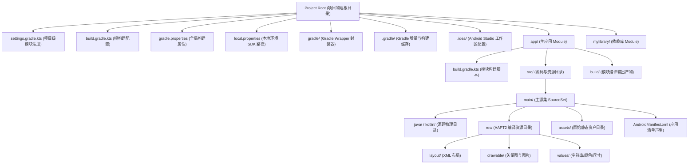

# 5.1.1.4 工程结构

在现代 Android 软件工程的开发体系中，合理的项目工程结构是进行大型项目开发 and 维护的基石。Android 项目并非一个孤立的、平面化的文件夹，而是一个由 **Gradle 构建系统驱动的、物理目录与逻辑配置深度融合的拓扑结构**。掌握 Android 工程的物理物理布局与配置逻辑，不仅能够让开发者更好地理解项目的模块依赖关系，更是进行多渠道打包、构建速度优化、组件化架构改造等高级开发技能的必经之路。

本文将从 Android 项目的物理与逻辑拓扑结构出发，深度剖析根目录配置、App 模块内部构造、核心资源目录 res 与 assets 的底层差异，以及构建缓存与隐藏目录的管理逻辑，帮助开发者建立起系统性的 Android 工程物理与逻辑认知。

---

## 1. Android 项目物理与逻辑拓扑结构

在 Android Studio 中，开发者通常会注意到 Project 窗口左上角有一个视图切换下拉菜单，主要包含 **Project 视图** 和 **Android 视图**。这两种视图对应了 Android 项目的两种不同认知维度：
- **Project 视图（物理视图）**：真实反映了项目在物理硬盘上的文件与文件夹树状结构。它展示了所有的 Gradle 配置文件、隐藏的缓存文件夹以及各模块内完整的物理路径。
- **Android 视图（逻辑视图）**：是 Android Studio 基于 Gradle 编译脚本（如 `settings.gradle.kts` 和各个子模块的 `build.gradle.kts`）进行逻辑重组后的虚拟视图。它过滤掉了许多 Gradle 的中间配置文件，将不同物理路径下的资源（例如主源集、风味源集中的资源）合并展示在逻辑文件夹中，并把所有的 Gradle 脚本统一归纳到 "Gradle Scripts" 分组中，方便日常开发工作。

从物理文件层级来看，一个典型的多模块 Android 项目遵循如下树状结构拓扑。



---

## 2. 项目根目录级配置详解

项目根目录是整个 Android 工程的构建决策中枢。在这里，Gradle 确立了整个项目的模块拓扑结构、构建脚本所依赖的插件、全局的依赖解析策略以及编译器运行时的物理环境变量。

### 2.1 settings.gradle(.kts) — 模块注册与构建初始化
`settings.gradle.kts` 是 Gradle 构建生命周期中 **初始化阶段（Initialization Phase）** 的核心配置文件。在 Gradle 启动时，它首先寻找并解析该文件。
- **模块注册（Project Inclusion）**：
  通过 `include(":app", ":mylibrary")` 命令，开发者向构建系统显式注册了子模块。每一个被 `include` 的目录，在 Gradle 内部都会被实例化为一个 `Project` 对象，并构成一个以根 Project 为顶点的树状逻辑拓扑。如果一个目录没有在此处注册，Gradle 在后续的配置阶段将完全忽略它，其内部的 `build.gradle.kts` 也不会被执行。
- **插件管理（pluginManagement）**：
  在现代 Gradle 推荐的工程结构中，`pluginManagement` 闭包被放置在 `settings.gradle.kts` 的最顶部。它规定了构建脚本中所使用到的 Gradle 插件（如 Android Gradle Plugin、Kotlin Gradle Plugin 等）的解析源仓库与版本。这一设计的物理意义在于，在解析任何项目构建脚本之前，Gradle 必须首先明确“如何去寻找并下载这些构建插件自身”。
- **依赖解析管理（dependencyResolutionManagement）**：
  这是 Gradle 7.x 之后引入的重大演进。过去，子模块的依赖仓库地址（如 Google Maven, Maven Central）需要在根 `build.gradle.kts` 的 `allprojects` 闭包中配置，或者在每个子模块中单独配置。而现代构建规范提倡在 `settings.gradle.kts` 中通过 `dependencyResolutionManagement` 统一声明整个工程的依赖仓库源。
  更重要的是，通过设置 `repositoriesMode.set(RepositoriesMode.FAIL_ON_PROJECT_REPOS)`，Gradle 会强制规范整个项目的所有子模块不能在其自身的 `build.gradle.kts` 中私自声明 `repositories`。这种设计在物理上隔绝了不安全的私有仓库源，不仅能防止恶意依赖注入，保障了企业开发的软件供应链安全，还能避免因为各个模块声明不同的仓库导致 Gradle 重复检索，从而大幅缩短配置与解析依赖的时间。

### 2.2 根 build.gradle(.kts) — 插件版本声明与全局配置演进
根目录下的 `build.gradle.kts` 是配置阶段（Configuration Phase）的起点。在过去，根构建脚本通常包含大量的逻辑代码，如 `buildscript` 闭包（配置构建工具自身的依赖）以及 `allprojects`/`subprojects` 闭包（向所有子项目注入公共配置和仓库地址）。
然而，这种传统配置模式存在严重的性能隐患。在 `allprojects` 中进行跨项目配置注入，破坏了 Gradle 的 **“按需配置（Configure on demand）”** 和 **“项目隔离（Project Isolation）”** 原则。这导致在多模块大项目中，即使开发者只想编译其中一个模块，Gradle 也不得不评估和配置所有子项目，严重拖慢了构建速度，且无法实现完全的配置并行化。
在现代配置规范中，根 `build.gradle.kts` 的主要职责被精简为 **声明插件版本（Plugin Declarations）**：
```kotlin
plugins {
    alias(libs.plugins.android.application) apply false
    alias(libs.plugins.android.library) apply false
    alias(libs.plugins.kotlin.android) apply false
}
```
此处使用 `apply false` 的物理意义是：**只在根项目定义插件的版本信息，而不将其实际应用（加载）到根项目中**。具体的子模块在需要使用这些插件时，只需声明插件 of ID（如 `id("com.android.application")`），而无需再指定版本号，版本号由根项目或 Version Catalog（版本目录，如 `libs.versions.toml`）统一管控。这种演进在物理上解耦了“版本定义”与“插件应用”，是多模块项目保持版本一致性的关键设计。

### 2.3 gradle.properties — JVM 参数与编译器行为调优
`gradle.properties` 是一个简单的键值对配置文件，用于在物理上控制 Gradle 守护进程（Gradle Daemon）的 JVM 启动参数以及编译器的底层行为。它对中大型 Android 项目的构建速度和稳定性起着决定性的作用。
- **JVM 内存配置（`org.gradle.jvmargs`）**：
  默认情况下，Gradle 守护进程的堆内存较小，对于大型 Android 项目（通常涉及数万个类、复杂的资源处理以及 D8/R8 混淆优化），极易触发频繁的垃圾回收（GC），甚至直接抛出 `OutOfMemoryError`。通过配置如 `org.gradle.jvmargs=-Xmx4g -XX:MaxMetaspaceSize=1g -XX:+UseG1GC`，可以为 JVM 分配充足的物理内存，并启用现代垃圾回收器 G1，显著减少 GC 暂停时间，从而加速代码编译。
- **并行构建（`org.gradle.parallel`）**：
  设置为 `true` 时，Gradle 会在物理上同时编译没有依赖关联的多个子模块，充分释放现代多核 CPU 的并行计算物理效能。
- **构建缓存（`org.gradle.caching`）**：
  设置为 `true` 后，Gradle 将缓存先前构建任务的物理输出产物。当再次执行相同的任务且输入没有变化时，Gradle 不会重新执行该任务，而是直接从本地或远程缓存目录中物理复制输出产物（状态为 `FROM-CACHE`）。
- **Kotlin 增量编译（`kotlin.incremental`）**：
  设置为 `true` 时，Kotlin 编译器（kotlinc）在代码发生微小修改时，将只重新编译受影响的 Kotlin 源文件，而不需要物理重新编译整个模块，大幅缩减日常开发调试的等待时长。

### 2.4 local.properties — 本地物理环境的差异化管理
`local.properties` 存放于项目根目录下，主要包含了当前开发机器上 Android SDK 与 NDK 的绝对物理路径，例如：
```properties
sdk.dir=/Users/username/Library/Android/sdk
ndk.dir=/Users/username/Library/Android/sdk/ndk/25.1.8937393
```
- **核心逻辑与安全隔离**：
  **该文件绝对不能被提交到 Git 等版本控制系统中**。因为每个开发者的电脑操作系统（Mac, Windows, Linux）不同，用户名不同，Android SDK 的物理安装路径也截然不同。如果将此文件提交，会导致团队中其他成员在拉取代码后，因为本地找不到该绝对路径而导致构建彻底瘫痪。
- **CI/CD 的无文件处理**：
  在持续集成（CI/CD）服务器或自动化构建脚本中，通常不需要物理生成 `local.properties` 文件。Gradle 构建系统具备环境变量探测能力，如果项目根目录下没有该文件，它会自动尝试从系统的环境变量 `ANDROID_HOME` 或 `ANDROID_SDK_ROOT` 中读取 SDK 的物理路径。这保证了构建脚本在不同环境下的移植性与物理隔离度。

---

## 3. App 模块目录结构剖析

在 Android 项目中，**“模块（Module）”** 是可以独立进行编译、测试和打包的基本物理单元。在逻辑上，它分为 Application 模块（输出 APK/AAB）、Library 模块（输出 AAR）和 Java/Kotlin 库模块（输出 JAR）。

### 3.1 src/main 目录各组件职责
`src/main` 是模块中最重要的物理目录，承载了应用的主体逻辑与资源。它在物理上主要划分为以下四大核心组件：

#### 3.1.1 java / kotlin 源码目录
- **物理包名映射**：
  源码目录下存放了 Java 或 Kotlin 源文件。这些源文件必须按照包名（Package Name）建立层层嵌套的文件夹物理结构。例如，若包名为 `com.example.myapp`，则源文件在硬盘上的物理路径必须是 `src/main/java/com/example/myapp/MainActivity.kt`。
- **编译流转**：
  在构建过程中，Java 编译器（javac）与 Kotlin 编译器（kotlinc）将这些源码物理编译成 JVM 字节码（`.class`），之后由 Android 构建工具链中的 D8 编译器（或用于代码混淆优化的 R8 编译器）将所有 `.class` 字节码文件物理转换并合并为 Dalvik 字节码文件（即 `.dex` 文件），最终打包进 APK。

#### 3.1.2 AndroidManifest.xml 清单文件
- **物理定位与职责**：
  这是每个 Android 模块的“身份证”，向 Android 系统声明了应用的基本配置。它物理记录了四大组件（Activity, Service, BroadcastReceiver, ContentProvider）、应用所需的物理硬件特性（如相机、蓝牙）、所需的系统权限以及包可见性等声明。
- **清单合并机制（Manifest Merger）**：
  在物理构建打包阶段，主工程（App 模块） and 它所依赖的所有库模块（AAR）、第三方 SDK 中都各自包含 `AndroidManifest.xml`。Gradle 的 `ManifestMerger` 工具会按照特定的物理优先级（App 模块优先级最高，库模块次之，并按依赖深度排序）将这些清单文件融合成一个唯一的最终清单文件。
  如果遇到属性冲突（例如 App 和某个依赖库都声明了同一个 `<application>` 属性但值不同），合并器会报错。开发者必须在 XML 中使用特定的合并规则标记（如 `tools:node="merge"` 或 `tools:replace="android:theme"`）来物理干预合并行为，确保最终打包出的清单文件逻辑正确。

#### 3.1.3 res 资源目录
`res/` 目录下物理存放了应用所需的所有非代码资源，包括布局文件、图片、字符串、动画等。该目录下的资源在编译期会被 Android 资源打包工具 AAPT2 处理，生成全局的整型 ID，并在运行时提供强大的动态设备适配支持。

#### 3.1.4 assets 原始资产目录
与 `res/` 不同，`assets/` 目录用于物理存放未经 AAPT2 编译的、需要保持原始文件格式和目录结构的数据，如机器学习模型文件（`.tflite`）、游戏 3D 纹理、字体文件（`.ttf`）或大视频文件。关于它与 `res/` 的深层差异，我们将在后文进行专题对比。

### 3.2 模块级 build.gradle(.kts) 核心配置项剖析
模块级的 `build.gradle.kts` 是定义该模块具体构建行为和依赖项的脚本。其内部的核心配置主要封装在两个顶级闭包中：`android` 闭包与 `dependencies` 闭包。

#### 3.2.1 android 闭包
该闭包是 Android Gradle 插件（AGP）提供的核心扩展配置，用于物理控制编译参数、SDK 版本契约以及构建变体。
- **三个关键 SDK 版本的物理与运行时逻辑**：
  1. **`compileSdk`**：指定编译器在编译该模块源码时，所使用的 Android 平台 SDK 版本。这完全是一个 **编译期行为**。例如，将其设为 34（Android 14），意味着你的代码可以调用 Android 14 引入的所有新 API。然而，这仅仅是允许编译通过，并不代表这些 API 能在所有老旧手机上运行。
  2. **`minSdk`**：定义了该应用能够安装并运行的最低 Android 操作系统版本。如果用户手机的系统 API 等级低于 `minSdk`，系统包管理器（PackageManager）在物理安装该 APK 时会直接予以拒绝。如果在代码中调用了高于 `minSdk` 且低于 `compileSdk` 的 API，Lint 工具会在编译期发出严重警告或报错。开发者必须通过运行时条件判断进行分支防护：
     ```kotlin
     if (Build.VERSION.SDK_INT >= Build.VERSION_CODES.O) {
         // 调用 API 26 (Android 8.0) 及以上的新接口
     } else {
         // 兼容低版本的物理替代方案
     }
     ```
  3. **`targetSdk`**：这是 Android 平台实现 **“向前兼容（Forward Compatibility）”** 的核心控制标尺。它负责向 Android 系统宣告：“我已经在该 API 版本的系统上完成了充分的测试，请对我启用该版本及以前的所有平台行为优化”。如果手机系统升级到了比应用的 `targetSdk` 更高的版本，系统会通过启用兼容模式（Compatibility Mode）来运行该 App，以防止新的平台限制或行为变更导致老应用崩溃。
     然而，一旦开发者升级了 `targetSdk`（例如从 33 升级到 34），系统就会对该应用物理实施 Android 14 带来的所有行为限制（如更严格的广播接收器注册限制、前台服务类型强制声明等）。具体不同 target 版本的详细行为改变与迁移清单，请参阅根目录下的 [AndroidVersionChangeLog.md](../../../../../AndroidVersionChangeLog.md)。
- **构建变体生成原理（Build Variants = BuildTypes × ProductFlavors）**：
  - `buildTypes` 控制构建属性。例如 `debug`（开启断点调试、保留符号表、关闭代码混淆、附加 `applicationIdSuffix ".debug"`）与 `release`（启用 R8 物理混淆压缩、移除调试信息、注入正式签名）。
  - `productFlavors` 决定产品属性。允许同一套代码物理输出不同的版本（如 `free` 免费版与 `paid` 付费版，或者 `huawei`、`xiaomi` 渠道包）。
  - 每一个 Build Type 与 Product Flavor 的组合物理生成一个 Build Variant（构建变体）。Gradle 会为每个变体自动生成对应的源文件集（SourceSets），允许开发者物理创建如 `src/free/java/` 或 `src/paid/res/` 等目录。在编译特定变体时，构建系统会将主源集 `src/main/` 与该风味源集进行物理合并，实现物理级别的文件隔离与个性化打包。

#### 3.2.2 dependencies 闭包
该闭包声明了模块在编译和运行期所需的外部依赖库。AGP 提供了多种依赖配置指令，它们在物理上控制了依赖项在 **编译期可见性** 以及 **打包进 APK 的物理行为**：
- **`implementation`**：
  实现级依赖。此库仅对当前模块编译期可见，不会将其编译依赖向上传递给依赖此模块的其他模块。例如，模块 B 使用 `implementation` 依赖了三方库 C，当模块 A 依赖模块 B 时，模块 A 无法在编译期直接调用库 C 的任何类。
  这种“可见性隔离”具有重要的物理意义：**它极大地保护了 Gradle 的增量编译机制**。一旦库 C 的源码发生修改，Gradle 只需要重新编译模块 B，而无需重新编译模块 A。这在多模块的工程中能避免级联式的重新编译，显著提升团队本地构建速度。
- **`api`**：
  接口级依赖。具有传递性。若模块 B 使用 `api` 依赖库 C，模块 A 在编译期可以直接引用库 C 的成员。代价是库 C 的任何改动都会强行触发模块 A 的重新编译，容易导致“牵一发而动全身”的编译链失效。
- **`compileOnly`**：
  仅编译期可见。该依赖项只参与编译，其字节码在物理打包时 **不会被放入最终的 APK 或 AAR 中**（类似于 Java 中的 `provided`）。常用于插件化开发中，避免子插件重复打包宿主已有的公共库，或用于引用那些在 Android 系统中已由平台固化提供的共享库（如 `org.apache.http.legacy`）。
- **`runtimeOnly`**：
  仅运行期可见。该依赖在编译期对开发者的代码不可见（若直接调用其中的类会发生编译报错），但其字节码 **在打包时会被放入 APK 中**。这多用于基于接口与实现解耦的架构设计，如通过 Java 的 SPI（Service Provider Interface）或反射动态加载实现类的场景，确保编译期无法静态耦合具体实现。

---

## 4. res/ 与 assets 目录全方位解析

在 Android 工程结构中，`res/` 和 `assets/` 都是用于存放静态资源物理文件的目录。但它们在底层编译流程、寻址方式、系统适配以及文件大小支持等方面存在本质的物理差异。

### 4.1 res/ 目录的分类与自适应分辨率机制
`res/` 下的文件夹命名有着极其严格的物理规范，AAPT2 只允许存在特定命名的子目录：
- `layout/`：存放 XML 布局文件。
- `drawable/`：存放静态位图（PNG, JPEG, WebP）、9-patch 图以及 VectorDrawable（矢量 XML 文件）。
- `values/`：存放定义基本值的 XML，如字符串（strings.xml）、尺寸（dimens.xml）、颜色（colors.xml）、样式风格（themes.xml/styles.xml）。
- `mipmap/`：专用于存放应用启动图标（Launcher Icons）。Android 系统在此处做了物理优化：在不同屏幕密度的设备上，即使系统全局缩放了 DPI，Launcher 也会尝试从 `mipmap` 中读取最高分辨率的图标进行无损绘制，避免从普通的 `drawable` 读取发生缩放模糊。
- `raw/`：存放原始多媒体文件（如音频、视频）。

#### 限定符路由机制（Configuration Qualifiers）
Android 强大的多设备适配能力主要依赖于 **限定符（Qualifiers）**。开发者可以通过在目录名称后添加特定后缀（如 `values-zh-rCN/` 简体中文、`layout-land/` 横屏、`drawable-xxhdpi/` 超高屏幕密度、`layout-v21/` API 21及以上系统）来提供不同的物理资源。
在应用运行时，系统底层的 `AssetManager` 和 `Resources` 会时刻监听设备物理状态的改变（如旋转屏幕、切换系统语言、跨屏幕密度显示），并在接收到资源请求（如 `R.layout.activity_main`）时，自动根据当前的物理配置路由到最佳匹配的文件夹去加载对应的资源。

### 4.2 assets 目录的底层存储原理
`assets/` 目录是一个完全自由的物理文件存储空间。它不仅支持开发者创建任意深度的嵌套子目录结构（如 `assets/models/face/detection.tflite`），而且在构建打包时，**其目录结构和文件内容都会以最原始的二进制形式原封不动地被归档到 APK 包中**。AAPT2 不会对其进行任何解析、优化或编译。

#### 底层读取与内存映射（mmap）
由于 `assets` 目录下的文件没有分配编译期 ID，应用在运行时必须使用 `AssetManager` 提供的 API，传入完整的字符串路径来进行访问。其底层原理是通过 C++ 层的 `AssetManager2` 物理打开 APK 压缩包（APK 本质是 ZIP 物理格式的压缩文件），直接定位到 `assets/` 对应的物理段进行流式读取：
1. **流式读取（`AssetManager.open(String fileName)`）**：
   返回一个 `InputStream`。该方式会将数据读入 Java 堆内存，适用于读取较小的静态配置文件、字体或纹理。
2. **文件描述符与内存映射（`AssetManager.openFd(String fileName)`）**：
   此方法会返回一个 `AssetFileDescriptor`。通过它，开发者可以获取该文件在物理 APK 包中的 **起始物理偏移量（Start Offset）** 和 **物理文件长度（Length）**。这具有极其重要的工程意义。
   对于一些体积巨大（几十 MB 到上百 MB）的机器学习模型（如 TensorFLow Lite 的 `.tflite` 文件）或大型音频、视频文件，我们可以直接将 `AssetFileDescriptor` 提供的文件描述符（FD）和物理偏移量传递给 C++/NDK 层，利用底层系统调用 `mmap` 直接将 APK 包中该段物理数据映射到进程的虚拟地址空间中。这样，Native 库可以直接在物理内存中按需读取，**彻底规避了将大文件从 APK 拷贝到设备沙盒临时目录的物理磁盘开销，也避免了将其全量读入 Java 堆内存导致的频繁 OOM**。
   
   > [!IMPORTANT]
   > 只有在 APK 打包时 **没有对该文件进行 ZIP 压缩**，`openFd()` 才能成功执行。默认情况下，打包系统会对大部分非媒体格式（如自定义的 `.tflite`）进行 ZIP 压缩，导致其物理上不再是连续的无损数据块。因此，开发者必须在模块级 `build.gradle.kts` 中通过 `aaptOptions` 配置，强制声明对该后缀不进行压缩：
   > ```kotlin
   > android {
   >     androidResources {
   >         noCompress.add("tflite")
   >     }
   > }
   > ```

### 4.3 res/ 与 assets 的深度对比
为了让开发者能够更加直观地选择合适的物理存储方式，下表从多个维度对二者进行了系统性对比：

| 对比维度 | res/ 目录（如 res/layout, res/raw） | assets/ 目录 |
| :--- | :--- | :--- |
| **AAPT2 编译行为** | **参与编译**。XML 会被编译成二进制 XML 以提升解析性能，图片可能会被无损压缩。 | **不参与编译**。原封不动地保留原始物理字节，直接打包归档进 APK。 |
| **检索方式** | **编译期生成 ID**。在 `R.java` 中注册 32 位唯一整型 ID，Java/Kotlin 代码中直接通过 `R.xxx.xxx` 引用。 | **运行时路径检索**。通过 `AssetManager` 传入完整的字符串相对路径（如 `"dir/file.txt"`）动态读取。 |
| **编译期校验** | **强校验**。如果引用了不存在的资源 ID，或者资源 XML 存在语法错误，编译期将直接报错，避免运行时崩溃。 | **无校验**。构建系统无法感知其路径是否拼写正确，若路径错误只能在运行时通过 Exception 捕获，容易埋下隐患。 |
| **系统自适应适配** | **自动支持**。利用限定符（如 `-land`, `-xxhdpi`）由 Android 框架在运行时自动根据当前设备配置选择最匹配的资源。 | **无支持**。无法利用系统限定符机制，必须在 Java/Kotlin 代码中手动获取屏幕 and 语言状态，自行编写路由逻辑。 |
| **目录结构灵活性** | **极低**。必须严格遵循一级子目录命名规范（如 layout, raw），不支持在子目录下创建任何多层嵌套文件夹（如 `res/layout/sub/` 会报错）。 | **极高**。支持创建任意深度的树状物理文件夹结构，便于管理成百上千个原始文件。 |
| **读取开销与大文件支持** | **中等**。对于 `res/raw`，可以通过 ID 物理加载流，但对超大文件（如 200MB 的模型）缺乏灵活的内存映射管理。 | **优秀**。专为大文件物理存取设计，支持获取 `AssetFileDescriptor` 并进行 Native 层的 `mmap` 零拷贝读取。 |

---

## 5. 隐藏目录与编译产物管理

在 Android 项目根目录及模块目录下，存在一些以点（`.`）开头的隐藏文件夹以及编译输出文件夹。理解这些目录的物理作用，是分析编译瓶颈、清理构建故障的必备技能。

### 5.1 .gradle/ 目录 — 构建状态的“物理脑图”
`.gradle/` 是 Gradle 自动生成的本地工作与缓存目录。它主要承担了以下三项重任：
1. **任务输入与输出快照数据库（Up-to-date Checker）**：
   Gradle 的核心优势之一是支持 **增量构建**。在执行任何 Task 前，Gradle 都会对该 Task 的所有 Input（如源码文件、配置值）生成 MD5/SHA-1 物理快照，并与保存在 `.gradle/` 目录下的上一次执行快照进行对比。如果两者完全相同，Gradle 会判定当前 Task 为 `UP-TO-DATE` 并直接跳过执行，避免重复编译。
2. **本地 Build Cache**：
   存放了编译过程中产生的可复用的 Task 输出缓存（如 Kotlin 编译中间产物、D8 转换后的 Dex 缓存段），用于在相同输入下加速二次构建。
3. **缓存损坏与异常定位**：
   在频繁切换 Git 分支、非正常关机、或者在编译中途强行终止 Gradle 进程时，`.gradle/` 内的快照数据库文件可能会发生物理损坏或状态不一致。这会导致 Gradle 误判任务的增量状态，进而引发诸如 `NoSuchMethodError`、类冲突、找不到特定 R 资源等莫名其妙的编译错误。

### 5.2 .idea/ 目录 — Android Studio 的工作区记忆
`.idea/` 是 IntelliJ IDEA (Android Studio) 的项目配置与工作区记忆目录。它在物理上包含了：
- 开发者个人在 IDE 中的运行配置（Run Configurations）。
- 代码风格（Code Style）、文件编码、VCS（Git）关联配置。
- 窗口布局状态、当前打开的临时文件记录等。
它完全是 IDE 层面的辅助工具文件夹，与 Gradle 的构建编译无任何物理关联。

### 5.3 build/ 目录 — 模块与项目的编译产物集散地
每一个被 include 的模块下，在构建时都会物理生成一个 `build/` 目录。这是编译产物的输出阵地，主要分为：
- **`build/intermediates/`（中间产物）**：
  这里是编译流转的“半成品车间”。包含了由 AAPT2 编译产生的临时 flat 资源、合并后的 `AndroidManifest.xml`、自动生成的 `BuildConfig.java`、由编译器生成的 `.class` 字节码文件，以及混淆前的原始 DEX。
- **`build/outputs/`（最终产物）**：
  这里是构建的终点站。编译通过后，最终输出的 `.apk` 安装包、依赖库的 `.aar` 归档文件，以及用于排错和上报 Crash 堆栈混淆还原的 `mapping.txt` 物理映射文件都会被存放在此目录下。

### 5.4 为什么必须在 .gitignore 中忽略它们？
在 Android 项目的物理根目录下，`.gitignore` 必须严防死守，彻底忽略 `.gradle/`、`.idea/` 以及所有的 `build/` 目录。其深层逻辑如下：
1. **开发机物理环境差异**：
   `.idea/` 存放了个人开发机的绝对路径、窗口状态，若提交 Git 会覆盖队友的 IDE 窗口和配置，造成开发冲突。`local.properties` 存放个人 SDK 绝对物理路径，提交后会导致他人构建失败。
2. **Git 仓库体积灾难**：
   `build/` 和 `.gradle/` 目录中包含大量的临时 `.class`、`.flat`、DEX 以及高达数百 MB 甚至数 GB 的构建缓存。若将这些频繁变动的二进制大文件提交至版本控制，将导致 Git 历史记录迅速膨胀，克隆和推送操作会变得极度缓慢。
3. **本地编译状态错乱**：
   拉取他人提交的 `build/` 编译中间产物，会导致本地 Gradle 校验增量快照时发生严重错乱，产生编译器找不到类、符号冲突等协同灾难。
   
   > [!TIP]
   > Android Studio 中的 **"Clean Project"** 操作，在物理上对应了执行 Gradle 的 `clean` Task。其底层物理本质极其简单且彻底——**递归删除各模块下的 `build/` 文件夹**。由于删除了所有的编译中间产物，增量状态被清空，下一次构建（Build）被迫成为一次全量重新编译。当项目由于缓存错乱发生顽固编译报错时，Clean Project 是最直接高效的排障手段。

---

## 6. 总结

Android 项目工程结构是物理文件布局与逻辑配置脚本的有机统一体。它的设计深刻体现了现代软件工程在构建效率、供应链安全与跨设备适配等维度的考量。
- 项目根目录级配置文件通过生命周期的初始化与配置阶段，建立起模块树拓扑，保障了构建安全和多核并行性能。
- 模块内部通过 `src/main` 的精细分工、模块级构建脚本的 SDK 版本契约以及构建变体机制，实现了代码与资源的高度内聚与物理隔离。
- `res/` 与 `assets/` 采用差异化的编译策略与寻址方式，分别满足了动态设备适配与大文件 Native 内存映射（mmap）的高性能读取需求。
- `.gradle/` 与 `build/` 作为核心缓存与输出载体，在享受增量编译与缓存带来的构建提速的同时，也需要通过合理的 `.gitignore` 进行物理隔离，并熟练运用 Clean 操作来排障。

掌握了这一整套物理与逻辑拓扑结构，开发者便能更加游刃有余地管理大型 Android 工程，为深入探索后续的组件化开发和编译优化奠定坚实的基础。
