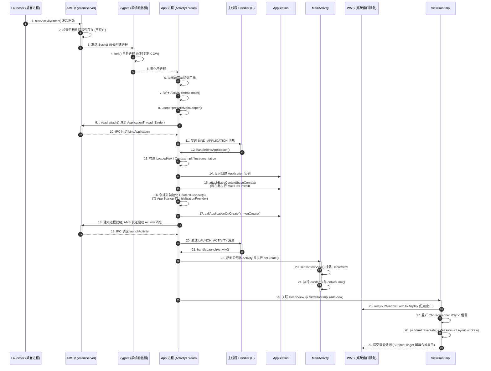

# 5.1.1.5 应用启动入口

### 导言
在 Android 开发与性能优化的领域中，应用启动入口是连接系统进程调度与用户交互视觉体验的“生死线”。应用启动不仅承载着物理进程的创建，还关乎着框架运行上下文的装载、组件生命周期的分发以及最终 UI 渲染树的物理绘制。一个典型的应用启动过程可以划分为冷启动（Cold Start）、温启动（Warm Start）与热启动（Hot Start）。其中，**冷启动**指的是当应用进程在系统中尚不存在时，系统必须从零开始孵化进程并逐步执行完整的初始化流程。冷启动的耗时最长、涉及的系统调用最为复杂，是评估应用性能 QoE（Quality of Experience）的黄金指标。

本文将从底层的物理进程孵化开始，深入剖析 Android 冷启动的三个核心入口点：物理进程入口（ActivityThread.main）、运行上下文入口（Application.attachBaseContext / onCreate）以及首个界面载体入口（MainActivity.onCreate / onStart / onResume），并详细介绍现代 Jetpack App Startup 库的引入背景与其核心优化原理。

---

### 一、物理进程入口：ActivityThread.main()

#### 1. Zygote 进程的孵化与写时复制机制
在 Android 操作系统中，所有的应用进程都不是孤立通过常规的 `execve` 系统调用从磁盘冷启动的，而是由系统核心进程 **Zygote（孵化器进程）** 复制（fork）而来的。Zygote 在系统启动时由 init 进程创建，它在启动之初就预加载了通用的 Android Framework 类库（如系统的 jar 包、基础资源文件等）以及 ART（Android Runtime）运行环境。

当用户在 Launcher（桌面应用）点击应用图标，或者系统服务由于接收到某些跨进程意图（Intent）需要拉起某个应用组件时，Launcher 会通过 Binder 跨进程通信向系统的核心调度中枢 **ActivityManagerService（简称 AMS，运行在 system_server 进程中）** 发送启动请求。AMS 经过状态校验，若发现该应用对应的物理进程尚不存在，就会通过 `LocalSocket` 向 Zygote 进程发送创建新进程的参数指令。

Zygote 进程在接收到命令后，会调用底层的 C++ `fork()` 系统调用。此时，Linux 内核的**写时复制（Copy-on-Write, COW）**机制开始发挥关键作用：
* **定义**：写时复制是一种计算机程序设计领域的内存管理优化策略。新创建的子进程在初始状态下，其虚拟地址空间完全指向物理内存空间中的父进程（Zygote）的物理内存页。只有当子进程或父进程试图修改某个内存页面的内容时，操作系统内核才会为该页面分配新的物理内存并复制其数据。
* **成立条件**：该机制的成立极大地依赖于 Android 将系统核心库和共享资源集中预加载于 Zygote 中。
* **物理效果**：新生的应用进程无需重新在内存中加载大量的 Framework 基础类和动态链接库，直接继承了 Zygote 的内存状态，将进程创建的时间缩短至毫秒级，同时大幅降低了系统的总体物理内存开销。

#### 2. 反射清除调用栈与 MethodAndArgsCaller 机制
当 Zygote 成功 fork 出子进程后，子进程会执行 `RuntimeInit.findStaticMain()`。为了在 Java 层以最干净的执行栈（Call Stack）运行应用的代码，Zygote 采用了一种非常巧妙的“异常抛出”设计。

在子进程初始化完毕后，底层会抛出一个特殊的自定义异常 `ZygoteInit.MethodAndArgsCaller`，该异常携带着目标入口类 `android.app.ActivityThread` 的 `main` 方法以及启动参数。在 Zygote 进程的最外层 `main` 循环中，会捕获这个异常。由于异常的抛出和捕获会直接展开（Unwind）当前的 C/C++ 与 Java 调用栈，所有在 fork 过程中产生的临时方法栈帧都会被一次性清除。在干净的调用栈底，系统再通过反射机制调用目标类的静态方法：
```java
try {
    throw new ZygoteInit.MethodAndArgsCaller(m, argv);
} catch (ZygoteInit.MethodAndArgsCaller caller) {
    caller.run(); // 内部通过反射调用 ActivityThread.main(argv)
}
```
这保证了当应用的主线程真正运行起来时，其堆栈的最底层是唯一的 `ActivityThread.main()`，避免了 Zygote 历史栈帧对应用内存和调试分析的干扰。

#### 3. ActivityThread.main() 的主干逻辑
`ActivityThread` 是 Android 系统中管理应用进程主线程的“总控室”。需要澄清的是，`ActivityThread` 在命名上虽然带有 `Thread`，但它在类继承关系上并不是 `java.lang.Thread` 的子类，而是一个普通的 Java 对象。它负责承接系统服务（如 AMS）的指令，并调度主线程的运行。

在 `ActivityThread.main()` 方法中，执行了以下几个至关重要的物理初始化动作：
1. **环境准备与系统调用配置**：调用 `AndroidOs.install()` 建立基本的系统环境。
2. **初始化主线程消息循环**：调用 `Looper.prepareMainLooper()`。此方法会在主线程的 `ThreadLocal` 中绑定一个 `Looper` 实例，并为其初始化一个 `MessageQueue`（消息队列）。
   > [!WARNING]
   > 在 Android 17 (API 37)（链接至 [Android Version Change Log](../../../../../AndroidVersionChangeLog.md#android-17-betaapi-37)）中，系统针对 target 为 37 及以上的应用引入了全新的 lock-free `MessageQueue` 实现。反射访问私有字段（如 `mMessages` 链表）或试图显式获取内部同步锁的行为将面临极高的死锁或崩溃风险，升级适配时需格外注意。
3. **实例化 ActivityThread 与向系统注册**：
   * 创建 `ActivityThread` 实例：`ActivityThread thread = new ActivityThread();`。
   * 建立 IPC 联系：调用 `thread.attach(false, startSeq)`。在其内部，通过 `ActivityManager.getService()` 获取 AMS 的 Binder 代理，并将当前进程的 `ApplicationThread`（一个实现了 IApplicationThread 接口的 Binder 本地对象，作为内部类声明于 ActivityThread 中）注册到 AMS 中。
   * **IPC 绑定的物理意义**：通过这个 attach 动作，AMS 在 system_server 中保存了该应用的 Binder 代理对象，此后 AMS 就可以随时通过这个 Binder 通道向应用进程下发生命周期调度指令（如启动 Activity、绑定 Service）；而应用进程也得以正式向系统宣告“我已启动就绪”。
4. **启动循环**：调用 `Looper.loop()`，主线程开始无限循环地从 `MessageQueue` 中获取消息并分发执行。

#### 4. Looper 循环挂起机制与 epoll 原理
对于主线程而言，虽然 `Looper.loop()` 内部是一个死循环（`for (;;)`），但它并不会导致应用卡死、甚至导致 CPU 占用率达到 100%。

要解释这一点，必须理解 Android 系统的**事件驱动（Event-Driven）**设计本质。在 Android 中，主线程的一切行为（如生命周期回调、按键与触摸事件分发、页面刷新测量与绘制）都是以“消息（Message）”的形式发送到 `MessageQueue` 中，再由主线程顺序取出并执行。

在 C++ 层，`MessageQueue` 的底层实现严重依赖于 Linux 系统的 **`epoll` 多路复用机制**：
* **epoll 机制定义**：`epoll` 是 Linux 内核中的一种 I/O 事件通知机制，是 `select` 和 `poll` 的增强版本。它能够在一个线程中同时监听多个文件描述符（File Descriptor, FD）的 I/O 事件，而不需要像传统方式那样轮询所有的描述符。
* **工作原理**：当主线程通过 `Looper.loop()` 调用 `MessageQueue.next()` 时，如果队列中当前没有消息（或者只有未来的延时消息），主线程会在 Native 层通过系统调用 `epoll_wait()` 阻塞挂起。此时，主线程的物理状态会从运行态转为睡眠态（Sleep），操作系统内核会将该线程移出 CPU 的调度队列。在此状态下，主线程彻底释放 CPU 资源，CPU 占用率为 0%。
* **唤醒条件**：当外部发生事件时，比如：
  1. Binder 线程池接收到系统的 IPC 请求（如 AMS 派发的生命周期任务），向主线程的 `MessageQueue` 写入一条新消息并向事件管道（pipe/eventfd）写入一个数据；
  2. 屏幕产生 VSync 信号，触发渲染消息的入队；
  3. 用户点击屏幕，底层的 InputReader 进程将事件通过 socket 写入应用进程。
  此时，Linux 内核监听到对应的文件描述符上有数据可读，会立刻唤醒处于 sleep 状态的主线程。主线程从 `epoll_wait` 返回，重新进入运行态，取出消息并回调 Handler 的 `handleMessage()`。
因此，`Looper.loop()` 的死循环是非阻塞式能耗控制的精妙体现，是 Android 物理进程持续存活且高效运转的底座。

---

### 二、框架运行上下文入口：Application

物理进程虽然已经创建并在 `Looper.loop()` 中等待，但此时进程内还没有任何关于该应用的特定配置和组件。为了让应用的代码能够运行，系统必须为其注入**框架运行上下文**。这个过程的核心就是 `Application` 的实例化与其生命周期的开启。

#### 1. Application 的实例化时序
当 `ActivityThread` 执行 `thread.attach()` 向 AMS 注册后，AMS 会将新进程与应用清单（AndroidManifest.xml）中的包名进行绑定，并在准备工作完成后，向应用的 `ApplicationThread` 发起 `bindApplication` 的 Binder 调用。

`ApplicationThread` 收到请求后，会向主线程的消息队列发送 `BIND_APPLICATION` 消息。主线程 Handler `H` 接收到消息后，会调用 `ActivityThread.handleBindApplication()`。该方法是应用生命周期的真正幕后起点，其核心执行时序如下：
1. **构建 LoadedApk**：根据 AMS 传递过来的 ApplicationInfo，实例化 `LoadedApk` 对象。该对象是应用在内存中的物理代表，负责管理 APK 的资源路径、ClassLoader（用于加载 Class 文件）以及 Manifest 中的包信息。
2. **创建 Base Context**：调用 `ContextImpl.createAppContext()` 创建一个 `ContextImpl` 实例。它是 `Context` 的标准底层实现，为应用提供了与系统交互的全部 API 接口（如获取系统服务、访问私有目录、管理数据库等）。
3. **反射实例化 Application**：通过 `LoadedApk.makeApplication()` 方法，利用 ClassLoader 反射调用应用自定义的 Application 类的无参构造函数（若无自定义，则使用默认的 `android.app.Application`）。

#### 2. attachBaseContext(Context base) 的注入与 MultiDex 历史演进
在 Application 实例被反射创建出来之后，系统首先会调用其内部的 `attach(Context context)` 方法。在这个阶段，系统会将刚刚创建好的基础上下文 `ContextImpl` 注入到 Application 实例中。这个注入动作在应用层暴露出来的生命周期回调就是 `attachBaseContext(Context base)`：
* **特性**：这是应用整个生命周期中，开发者能够获取到的**第一个拥有有效 Context 的入口**。在此之前，由于 Context 尚未注入，调用任何需要 Context 的 API 都会抛出 `NullPointerException`。
* **MultiDex.install 历史方案的背景与原理**：
  在 Android 的历史发展中，`attachBaseContext` 曾承载着非常关键的兼容性初始化任务。
  * **起因**：在 Android 5.0（API 21）（链接至 [Android Version Change Log](../../../../../AndroidVersionChangeLog.md#android-50--51api-21--22])）之前，Android 运行在 Dalvik 虚拟机上。Dalvik 在设计上使用单个 Dex 文件存储编译后的 Java 字节码，由于 Dex 文件内部指令格式的局限，单个 Dex 文件的方法数（Method Count）限制为 65,536 个（即著名的 64K 限制）。
  * **痛点**：随着应用功能膨胀，方法数轻易突破 64K。官方推出了 MultiDex 分包方案，将编译产物拆分为主 Dex（classes.dex）和次 Dex（classes2.dex, classes3.dex 等）。然而，Dalvik 虚拟机在启动时只默认加载主 Dex。如果在应用启动阶段，类加载器试图加载被分配在次 Dex 中的 Class，就会抛出运行时致命异常 `ClassNotFoundException`。
  * **解决方案**：为了解决此痛点，开发者必须在 `Application.attachBaseContext(base)` 中，显式调用 `MultiDex.install(this)`。
  * **原理**：`MultiDex.install(this)` 在主 dex 加载后同步执行，它会解压 APK，提取出次 Dex 文件，并利用 Java 反射技术，将次 Dex 文件的路径动态注入到当前主线程的类加载器（`PathClassLoader` 内部的 `DexPathList` 中的 `dexElements` 数组）中。
  * **为什么必须在 attachBaseContext 中调用？**：因为根据系统启动时序，在 `attachBaseContext` 之后，系统会立即反射创建并初始化 AndroidManifest 中声明的所有 `ContentProvider`。如果不在 `attachBaseContext` 中提前把次 Dex 文件注入 ClassLoader，那么一旦 ContentProvider 依赖了次 Dex 中的类，就会在实例化阶段因为找不到 Class 而直接导致进程崩溃。
  * **现代演进**：自 Android 5.0（API 21）引入 ART 虚拟机后，ART 默认支持从 APK 中加载多个 dex 文件。在安装期间，系统会通过 `dex2oat` 工具执行预编译（AOT），将多个 dex 文件合并编译为单个本地 `.oat` 文件。因此，在现代 Android 开发中，MultiDex 已不再需要手动在 `attachBaseContext` 中初始化。

#### 3. onCreate() 的定位与 ANR 避坑指南
当 `attachBaseContext` 执行完毕，且所有的 `ContentProvider` 均初始化完成后，系统会调用 `Instrumentation.callApplicationOnCreate(this)`，最终触发 `Application.onCreate()`。
* **定位**：这是全局初始化的核心入口，标志着应用的运行上下文环境已经彻底就绪，资源加载器也已就位。
* **职责**：开发者通常在此处进行全局的第三方 SDK 初始化（如崩溃统计工具、网络框架的全局配置、日志组件等）。
* **ANR 避坑指南**：
  所有的 `Application.onCreate()` 逻辑都是运行在进程的主线程中的。Android 系统为了保证系统流畅度，对应用进程的启动与主线程的响应时间有极其严格的监控：
  * **ANR 成立条件**：如果主线程在接收到启动指令后，由于在 `Application.onCreate()` 中执行了耗时操作，导致后续的首个 Activity 启动消息无法被及时分发，一旦超过系统的限制时长（如在主线程收到输入事件后 5 秒内无响应，或前台服务在 20 秒内未调用 `startForeground` 等，详细后台限制请参考 [Android Version Change Log](../../../../../AndroidVersionChangeLog.md#android-80--81api-26--27] 中 Android 8.0 的变化)），系统就会弹出 ANR（Application Not Responding）对话框。
  * **典型雷区**：
    1. **同步 I/O**：在主线程进行 SharedPreferences 磁盘文件的首次读取、数据库初始化或复杂的配置文件解析；
    2. **过度反射**：某些框架（如过时的依赖注入框架、序列化框架）在初始化时会进行全盘类的反射扫描；
    3. **网络请求**：在主线程中执行同步网络握手或 DNS 解析。
  * **最佳实践**：
    1. **异步分流**：利用线程池或 Kotlin 协程的 `Dispatchers.IO` 将非核心、非阻塞的 SDK 移出主线程进行后台异步初始化；
    2. **懒加载（Lazy Load）**：将部分仅在特定页面使用的 SDK 初始化推迟到对应的 Activity 创建时，或使用 `IdleHandler` 在主线程空闲时段进行安全加载；
    3. **框架管理**：使用下面将要介绍的 Jetpack App Startup 进行合理的依赖拓扑管理。

---

### 三、界面与视觉入口：MainActivity

当进程与 Application 上下文初始化完毕后，用户尚未在屏幕上看到任何应用内容。只有当应用的首个界面载体（通常是 Manifest 中声明的主 Activity）被渲染出来，视觉上的冷启动流程才算告一段落。

#### 1. MAIN 与 LAUNCHER 标志的组合解析
为了让应用具备被桌面 Launcher 发现并拉起的能力，开发者必须在 `AndroidManifest.xml` 中为目标 Activity 配置特定的 Intent Filter。这两个标志的组合声明具有特殊的系统级意义：
```xml
<intent-filter>
    <action android:name="android.intent.action.MAIN" />
    <category android:name="android.intent.category.LAUNCHER" />
</intent-filter>
```
* **`android.intent.action.MAIN`**：
  * **定义**：标志着该 Activity 是当前应用的“主入口点”，指示系统在拉起该 Activity 时不需要携带额外的参数或意图数据。
  * **作用**：告诉系统：“我是本应用的总线起点”。
* **`android.intent.category.LAUNCHER`**：
  * **定义**：标志着该 Activity 应该在系统的应用程序启动器（Launcher/桌面）上以图标的形式进行展示。
  * **作用**：告诉系统：“请在桌面上为我安放一个快捷图标”。
* **二者组合的必要性**：
  * **若只有 MAIN 没有 LAUNCHER**：系统知道该 Activity 是入口，但桌面组件在图标初始化时，由于无法在 PackageManager 中检索到该应用的 LAUNCHER 类别，因此桌面上不会出现该应用的任何图标。这通常用于插件化子模块、或被其他应用静默调起的辅助应用。
  * **若只有 LAUNCHER 没有 MAIN**：Launcher 会在桌面上渲染出应用图标，但是当用户点击图标时，由于没有 MAIN 标志，系统不知道该发送何种默认 Intent 来唤醒 Activity，将导致点击无响应或抛出 intent 解析异常。

#### 2. MainActivity 生命周期入口的角色
当 Launcher 通过 Binder 请求 AMS 启动主 Activity 后，AMS 会向应用的 `ApplicationThread` 下发启动 Activity 的指令。在主线程的 Handler `H` 中，会触发 `ActivityThread.handleLaunchActivity()`，进而依次调用 Activity 的生命周期方法：
1. **`onCreate(Bundle savedInstanceState)`**：
   * **职责**：完成页面的初始化。核心动作是调用 `setContentView(layoutResID)`。
   * **原理**：`setContentView` 内部会反射创建 `PhoneWindow`，并实例化 `DecorView`（Window 的根 View）。通过 `LayoutInflater` 将 XML 布局解析为 View 对象，并将其作为子树挂载到 `DecorView` 的 `content` 容器中。
   * **适配**：在 Android 12 (API 31)（链接至 [Android Version Change Log](../../../../../AndroidVersionChangeLog.md#android-12api-31)）中，系统强制实施了全新的启动闪屏规范 `SplashScreen`。如果应用在此生命周期内耗时较长，旧的自定义闪屏 Activity 可能会引发界面反复闪烁，必须适配新的 SplashScreen API 才能保证流畅过渡。
2. **`onStart()`**：
   * **职责**：标志着 Activity 的 View 树已经构建完成，页面在视觉上已经对用户可见。然而，此时页面尚未获取到窗口焦点，用户还无法与其中的控件进行点击或输入等物理交互。
3. **`onResume()`**：
   * **职责**：Activity 已经获取到了窗口焦点，代表着用户交互的物理起点。

#### 3. 首帧渲染与启动完成的物理标志
必须强调的是，**`onResume()` 的回调并不等于屏幕上已经显示出了页面画面**。
在 `onResume()` 执行完毕后，`ActivityThread` 会调用 `WindowManager.addView()`，将 Activity 的 `DecorView` 注册进系统窗口管理器中。在这个阶段，系统会为该窗口创建 `ViewRootImpl` 实例。

`ViewRootImpl` 是连接窗口服务 WMS 与 View 树的核心桥梁，它通过向底层的 `Choreographer`（编舞者）注册 VSync（垂直同步）信号来触发 UI 的真正绘制流程：
* **Choreographer 接收信号**：当屏幕的显示硬件产生 VSync 信号时，Choreographer 会被唤醒，并将绘制任务投递到主线程消息队列。
* **执行 performTraversals()**：`ViewRootImpl` 在主线程中执行著名的三大测量与绘制流程：
  1. **`performMeasure()`**：深度优先遍历 View 树，确定每一个 View 的测量大小；
  2. **`performLayout()`**：确定每个子 View 在屏幕空间中的精确坐标；
  3. **`performDraw()`**：通过 Canvas 生成绘制指令，并通过 RenderThread 将绘制数据提交给系统的物理合成器 `SurfaceFlinger`。
当 `SurfaceFlinger` 将绘制缓冲区的数据合成并写入屏幕像素点、物理屏幕上真正显示出应用第一帧画面的那一瞬间，冷启动的“视觉起点/终点”才算圆满闭环。

---

### 四、现代启动入口框架：Jetpack App Startup

#### 1. 痛点：ContentProvider 的滥用
随着 Android 生态的成熟，许多开源 SDK 库为了追求“零代码配置（Zero-Code Setup）”的集成体验，开始广泛使用系统的 `ContentProvider` 机制。

* **自动初始化机制的原理**：
  在 Android 的启动时序中，所有的 `ContentProvider` 都会在 `Application.attachBaseContext()` 之后、`Application.onCreate()` 之前被系统自动创建并调用其 `onCreate()` 方法。
  第三方 SDK 作者可以通过在 SDK 内部的 Manifest 中声明一个自定义的 `ContentProvider`。这样，一旦开发者引入该 SDK，系统在应用冷启动时就会自动实例化这个 ContentProvider 并执行初始化，开发者无需在自己的 Application 中写任何初始化代码。
* **冷启动变慢的罪魁祸首**：
  这种“无侵入式集成”带来的是巨大的启动性能牺牲：
  1. **Binder 通信开销**：每个 ContentProvider 的注册和创建，都需要应用进程与系统的 `ActivityManagerService` 进行 IPC Binder 跨进程通信，用来校验 Provider 的权威（Authority）和状态。
  2. **反射与主线程阻塞**：多个 SDK 各自拥有独立的 ContentProvider，系统在冷启动时必须串行地通过反射逐个创建这些 Provider。
  当一个现代化的大型项目集成了几十个第三方 SDK 时，冷启动阶段会瞬间产生几十次 Binder 通信和反射调用。这种高频的系统调用会严重消耗 CPU 资源，使得主线程在 Application 运行前就陷入严重的卡顿，冷启动时间被无情拉长。

#### 2. App Startup 核心工作机制
为了彻底解决 ContentProvider 滥用的性能危机，Google 官方推出了 **Jetpack App Startup** 框架。

App Startup 的核心思想是：**“化零为整，统一调度”**：
* **单一 Provider 机制**： App Startup 在其库中声明了唯一的一个 ContentProvider —— `androidx.startup.InitializationProvider`。
* **Initializer 接口设计**： 各个 SDK 不再使用独立的 ContentProvider，而是改为实现 App Startup 提供的 `Initializer<T>` 接口，在 `create()` 方法中编写原先的初始化逻辑：
  ```java
  public class MySdkInitializer implements Initializer<MySdk> {
      @NonNull
      @Override
      public MySdk create(@NonNull Context context) {
          // 初始化 SDK 的核心逻辑
          return MySdk.getInstance();
      }

      @NonNull
      @Override
      public List<Class<? extends Initializer<?>>> dependencies() {
          // 声明依赖的其他 Initializer，如无则返回空列表
          return Collections.emptyList();
      }
  }
  ```
* **依赖拓扑排序与执行**：
  1. 在冷启动时，系统只会创建 `InitializationProvider` 这一个 ContentProvider。
  2. 在 `InitializationProvider.onCreate()` 中，App Startup 框架会读取 Manifest 中声明在该 Provider 标签下的所有 `<meta-data>`，获取所有要加载的 `Initializer` 类名。
  3. 框架内部使用**有向无环图（DAG）**对这些 Initializer 进行**拓扑排序（Topological Sort）**，梳理出它们的先后依赖关系。
  4. 最终，在主线程（或按需在后台线程）中，以极高的效率、完全无 Binder 通信开销的方式，按依赖顺序一次性同步或异步调用各个 SDK 的初始化。

通过这种方式，App Startup 将几十个 ContentProvider 合并为一个，消除了绝大部分的 Binder 跨进程通信与串行反射的系统开销，极大地加速了冷启动进程，成为了现代 Android 应用启动性能优化的基础底座。

---

### 五、完整冷启动流转时序图

以下是精细刻画从 Launcher 发起启动、Zygote 孵化、ActivityThread 建立主消息循环、反射 Application 直至首个页面渲染出来的关键流转时序图：



---

### 总结

Android 应用的启动入口绝非单一的 `main()` 函数所能概括，它是一个在 Linux 进程级、Android 运行上下文级以及 Window 视觉窗口级相互协作的立体化体系：
1. **ActivityThread.main()** 作为物理进程入口，完成了主消息循环 Looper 的建立与底层的 Binder 挂载。
2. **Application** 的 `attachBaseContext` 与 `onCreate` 作为框架运行上下文入口，注入了系统级 Context 并为全局 SDK 的初始化提供了土壤。
3. **MainActivity** 结合 `MAIN` 与 `LAUNCHER` 标志组合，作为界面的载体，在经历 VSync 信号触发的 Measure、Layout 与 Draw 三大流程后，最终将像素点合成并物理呈现于用户的屏幕之上。

理清这三大维度的启动时序，并配合现代 Jetpack App Startup 规避 ContentProvider 带来的 IPC 开销，是实施应用冷启动优化、实现“秒开”体验的根基所在。

---

### 延伸阅读与参考资料
* Android 官方文档 - [App Startup](https://developer.android.com/topic/libraries/app-startup)
* Linux Manual Page - [epoll(7)](https://man7.org/linux/man-pages/man7/epoll.7.html)
* Android 源码分析 - `ActivityThread.java` & `ZygoteInit.java`
