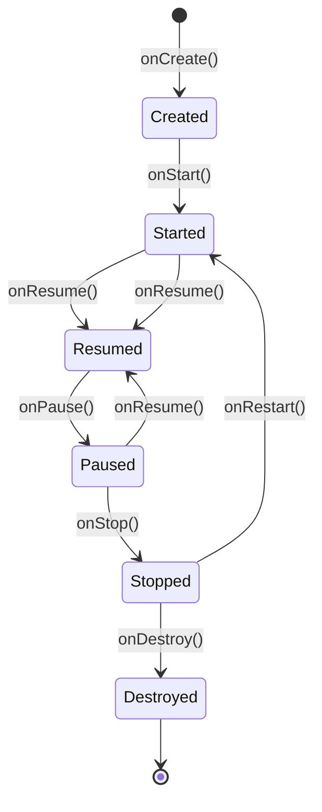
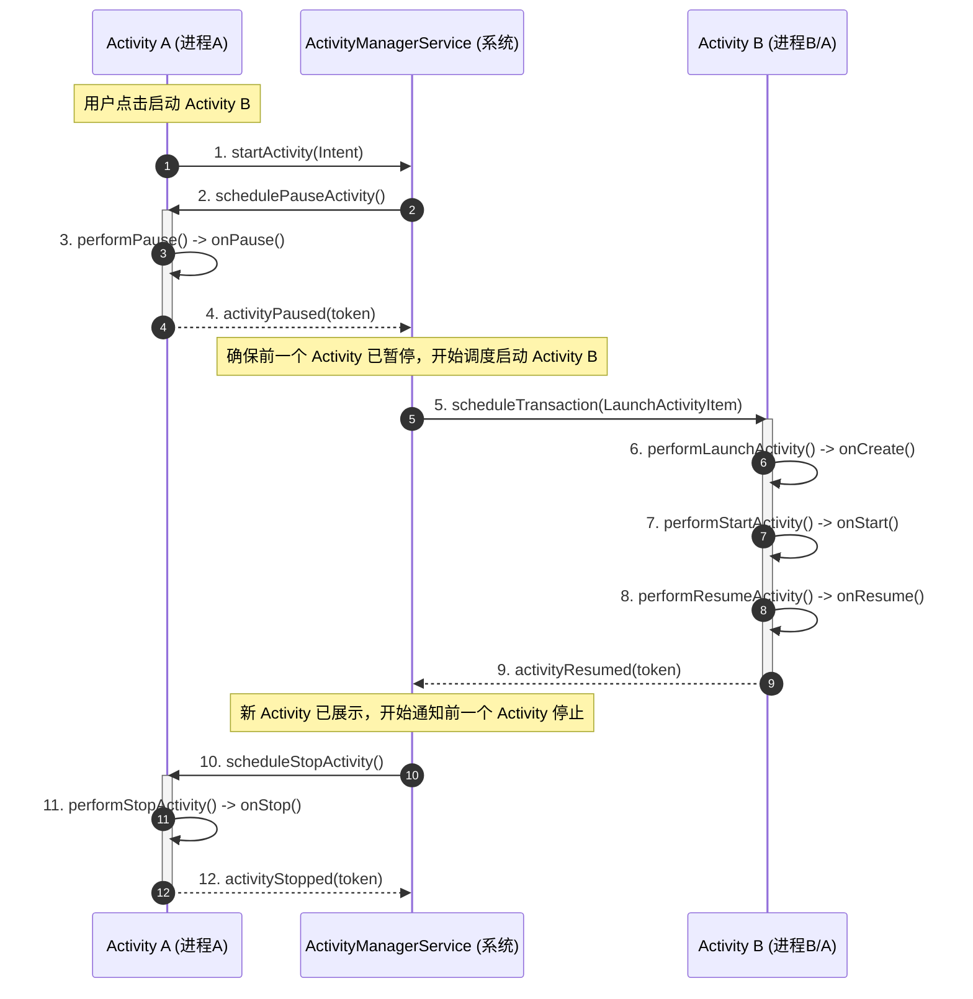

# 5.1.2.1.0 Activity概述

Activity 是 Android 应用程序的四大组件之一，也是与用户进行交互的最直接、最核心的承载实体。本篇将系统阐述 Activity 的核心定位、设计取舍、状态机转换逻辑、启动架构以及开发中的高频误区。

---

## 1. 核心概念与定位

### 1.1 Activity 的定义与职责
在 Android 框架中，Activity 扮演着屏幕界面的承载者与人机交互入口的角色。从面向对象的设计角度看，Activity 是一个将界面逻辑、交互事件与生命周期管理高度聚合的控制单元。应用通过 Activity 展示图形用户界面（GUI），并接收、响应用户的触摸、按键、手势等硬件及软件输入事件。

### 1.2 人机交互的唯一入口
与传统的桌面操作系统（如 Windows 或 Linux）不同，Android 应用并不是通过一个统一的入口函数（如 `main()`）拉起整个应用程序并常驻运行。相反，Android 采用的是**组件化激活**的设计哲学。
- Activity 就是系统提供的负责“界面呈现与人机交互”的唯一组件。
- 这种设计允许系统或其他应用程序直接拉起特定的 Activity，而不需要先进入应用的主页。例如，用户点击一条社交消息通知，系统可以直接调起“聊天详情” Activity，而无需强行经过“应用闪屏页”或“首页”。这种以 Activity 为核心的入口机制，构成了移动端多任务和场景流转的物理基石。

### 1.3 在 Window/View 树中的承载角色
在底层的图形显示架构中，Activity 本身并不直接参与屏幕像素的绘制与渲染，它实际上是一个“窗口的管理者与持有者”。它与底层图形系统的承载关系如下：
1. **持有 Window**：Activity 内部通过持有 `Window` 类型的成员变量（其唯一的具体实现类是 `PhoneWindow`）来管理窗口。
2. **挂载 DecorView**：`PhoneWindow` 内部维护着一个特殊的根视图，名为 `DecorView`。当开发者在 Activity 中调用 `setContentView(layoutResID)` 时，该布局文件被解析为 View 树，并作为子节点挂载到 `DecorView` 下的 `content` 容器中。
3. **建立连接 (ViewRootImpl)**：在 Activity 进入 `onResume()` 阶段后，系统会通过 `WindowManagerImpl` 为当前窗口创建 `ViewRootImpl` 实例。`ViewRootImpl` 是 View 树与系统窗口管理器（`WindowManagerService`，简称 WMS）之间的桥梁，它负责发起 View 树的测量（Measure）、布局（Layout）、绘制（Draw），并通过 `SurfaceFlinger` 最终将像素渲染到屏幕上。
4. **事件流转链路**：当用户触摸屏幕时，硬件驱动将事件上报给 WMS。WMS 找到对应的窗口后，通过 Binder 和 Socket 通信机制将事件传递给该窗口的 `ViewRootImpl`。`ViewRootImpl` 接收到事件后，分发给根视图 `DecorView`。随后，`DecorView` 会回调当前 Activity 的 `dispatchTouchEvent()` 方法。Activity 作为业务逻辑的掌控者，可以选择拦截处理，或者调用 `getWindow().superDispatchTouchEvent()` 将事件再次交还给 `DecorView`，从而开启子 View 树的标准事件分发流程。

---

## 2. 设计取舍与架构哲学

### 2.1 解耦式组件模型的初衷
桌面系统的单进程、单入口模型假定系统资源是充足的，且一个应用一旦启动就会常驻内存，直到用户主动关闭。但在移动端，这种假定面临三大天然硬限制：屏幕空间极其有限、电池电量敏感、硬件资源（特别是物理内存）受限。

针对这些局限性，Android 创造性地引入了基于 Android 四大组件的松耦合模型。每个组件都声明在 `AndroidManifest.xml` 中，由系统进行统一的生命周期托管与调度。

### 2.2 与单入口模型的对比
| 维度 | 传统单入口模型 (桌面端) | Android 组件化模型 (移动端) |
| :--- | :--- | :--- |
| **入口机制** | 单一主入口（`main` 函数），所有页面在此基础上构建。 | 声明式多入口（通过 `<intent-filter>`），系统可直接拉起任意组件。 |
| **生命周期** | 与应用进程强绑定，进程消亡则程序状态彻底丢失。 | 与进程解耦，生命周期由系统（AMS）统一托管，支持销毁重建。 |
| **内存回收** | 除非整个进程退出或被杀，否则常驻内存。 | 进程可随时被系统回收，依靠 `Bundle` 数据存根实现无缝恢复。 |
| **跨进程流转** | 应用间隔离严重，难以实现跨进程的界面嵌套与流转。 | 支持通过返回栈（Back Stack）将不同应用的 Activity 编排进同一个 Task。 |

### 2.3 支持多任务与进程回收机制
Android 引入了“任务栈（Task）”的概念。一个任务栈是一组以栈形式聚集的 Activity 实例集合，它用于记录用户的交互轨迹。这一机制的核心取舍在于**性能开销与用户体验的平衡**：
- **内存回收的动态性**：Android 将进程划分了不同的优先级（前台进程、可见进程、服务进程、后台进程、空进程）。当内存告急时，低优先级的后台进程会被 LMKD（Low Memory Killer Daemon）强杀。而驻留在这些进程中的 Activity 实例会被就地销毁。
- **状态的无缝恢复**：为了在不耗费内存常驻的前提下保证多任务体验，Activity 提供了 `onSaveInstanceState()` 机制。在进程被系统回收前，Activity 负责将其关键 UI 状态写入一个 `Bundle`。该 `Bundle` 会通过 Binder 传递给系统进程（AMS）保存。只要用户不主动清除该历史任务，当他们返回时，AMS 就可以控制新进程重建对应的 Activity，并传入先前暂存的 `Bundle`。
- **跨进程的页面编排**：由于 Activity 是松耦合的，不同应用之间的 Activity 可以无缝组合进同一个 Task 中。例如，在社交应用中点击一个网页链接，可以调起系统浏览器的 Activity，该 Activity 会被推入当前社交应用的 Task 栈顶，用户点击返回时直接退回社交界面。这在单进程单入口的操作系统中是难以想象的。

---

## 3. 实现机制与运行原理

### 3.1 生命周期转换逻辑
Activity 的生命周期是一个典型的由系统进程驱动的状态机。以下是 Activity 在七个经典生命周期方法之间的切换逻辑和触发时机：
1. **`onCreate()`**：当系统首次创建 Activity 时触发。在此方法中，应当进行静态的初始化设置，如加载 XML 布局（`setContentView`）、初始化数据绑定、绑定 View 模型等。该方法接收一个 `savedInstanceState: Bundle?` 参数，若 Activity 是因异常销毁后重建的，该参数会携带之前保存的状态数据。
2. **`onStart()`**：紧随 `onCreate()` 之后，或在 Activity 从不可见状态重新恢复为可见状态时（`onRestart()` 之后）被调用。此时 Activity 的界面已对用户可见，但尚未获取焦点，无法与用户进行交互（例如，它可能在后台被覆盖，或者正处于启动动画的过程中）。
3. **`onResume()`**：当 Activity 准备好与用户进行交互时触发。此时 Activity 处于 Activity 栈的栈顶，获取了屏幕焦点，是用户当前唯一能够操作的物理界面。通常在此处开启独占资源（如相机预览、传感器监听）或开始播放动画。
4. **`onPause()`**：当另一个 Activity 启动并夺走焦点，或者用户进入分屏模式、弹出系统级弹窗等，导致当前 Activity 失去焦点但依然部分可见时触发。在此方法中，必须快速保存关键数据或释放不必要资源（如暂停视频播放器），因为**下一个 Activity 的启动流程必须等待当前 Activity 的 `onPause()` 执行完毕**。此处严禁执行任何长耗时的操作。
5. **`onStop()`**：当 Activity 对用户完全不可见时触发（例如被新页面完全覆盖，或按 Home 键返回桌面）。此时 Activity 依然在内存中存活，保持着状态，但已被移出前台。可以在此执行较重的资源释放操作，如断开数据库连接、注销耗电的定位服务等。
6. **`onRestart()`**：当处于 `onStop()` 状态的 Activity 重新被用户唤醒，准备再次显示前触发。随后系统会依次调用 `onStart()` 和 `onResume()`。
7. **`onDestroy()`**：在 Activity 被彻底销毁前调用。触发原因可能是开发者主动调用了 `finish()`，或是用户点击了返回键，或者是系统由于配置变化（如屏幕旋转）以及内存紧张而强制销毁实例。在此处必须释放所有在 `onCreate()` 中初始化的持久资源，防止内存泄漏。

#### 经典生命周期状态转换 Mermaid 状态图
为了直观展示状态机的流转，以下是 Activity 的生命周期状态转换图：



#### 典型用户场景下的生命周期流转时序图
当用户在 Activity A 中点击按钮启动 Activity B 时，两者的生命周期调用顺序有着非常严谨的先后依附关系。以下是具体的时序流转：



从上述时序图可以看出：**Activity A 的 `onPause()` 必须先执行完并通知 AMS，AMS 才会向 Activity B 发送启动指令并执行其 `onCreate()` / `onStart()` / `onResume()`**。如果在 Activity A 的 `onPause()` 中包含耗时逻辑，会导致 Activity B 的启动出现肉眼可见的延迟卡顿。

### 3.2 启动与调度核心链路概述
Activity 的启动并非简单的类实例化过程，而是一个涉及**客户端应用进程**与**系统 `system_server` 进程**之间高频跨进程通信（IPC）的复杂编排过程。其骨干交互流程可梳理为以下几个核心层级：
1. **API 调用层**：应用代码调用 `startActivity(intent)`。该调用会被委派给 `ContextImpl`，最终调用到 `Instrumentation.execStartActivity()`。`Instrumentation` 负责监控应用与系统的交互，它会通过 Binder 机制调用到系统的 `IActivityTaskManager`（在 Android 10 之前是 `IActivityManager`）接口。
2. **系统控制层（AMS/ATMS）**：`system_server` 进程中的 `ActivityTaskManagerService`（ATMS）接收到请求后，会启动一系列的管理策略。首先通过 `RootWindowContainer` 和 `ActivityStackSupervisor` 来寻找或计算目标 Activity 应当被放置在哪一个 `TaskRecord`（任务栈）中。同时校验目标 Activity 在 `AndroidManifest.xml` 中的声明，确认权限及各种启动模式过滤。
3. **进程孵化层（Zygote）**：ATMS 检查目标 Activity 所指定的运行进程（默认是当前包名进程）是否已经存在。如果该进程尚未启动，ATMS 会通过 Socket 向 `Zygote` 进程发送孵化请求。`Zygote` 收到指令后，通过 `fork()` 系统调用快速克隆出新的子进程。
4. **主线程初始化层（ActivityThread）**：新进程创建后，会进入 `ActivityThread` 的 `main()` 方法（这是 Android 应用进程的事实入口）。在这里会初始化 Android 主线程的 `Looper`（调用 `Looper.prepareMainLooper()` 并开启消息循环 `Looper.loop()`），随后通过 Binder 向 AMS 进行应用注册（`attachApplication()`）。
5. **客户端执行层（ApplicationThread）**：AMS/ATMS 收到注册后，会向客户端的 `ApplicationThread`（`ActivityThread` 的一个内部 Binder 接口）发送创建 Activity 的事务指令（在较新版本中被封装为 `ClientTransaction`）。`ApplicationThread` 收到 Binder 调用后，通过关联的 `Handler`（名为 `H`）向主线程发送消息。主线程在处理该消息时，利用 `ClassLoader` 反射实例化目标 Activity，并调用 `Instrumentation.callActivityOnCreate()`、`callActivityOnStart()` 等，最终回调我们覆写的生命周期方法。

*(注：此处仅对启动流程进行大框架级的梳理，使读者建立跨进程通信的宏观认知，具体 Framework 内部更详尽的类调用链路与代码细节详见后续的专题文档。)*

---

## 4. 边界与开发误区

### 4.1 生命周期的耗时陷阱
很多开发者习惯于在 Activity 的生命周期方法中编写业务初始化或资源释放代码，这极易引发严重的性能问题甚至应用崩溃：
- **阻塞 UI 线程与 ANR 风险**：
  - Activity 的所有生命周期回调都运行在主线程上。这意味着如果在 `onCreate()`、`onStart()` 或 `onResume()` 中执行复杂的计算、大文件读取、网络请求或同步数据库操作，会直接阻塞主线程的 MessageQueue 分发。
  - 一旦主线程被阻塞超过 5 秒，系统就会抛出经典的 **ANR (Application Not Responding)** 错误，直接弹窗警告用户并可能强杀应用。
- **对新页面拉起的延迟影响**：
  - 如前文时序图所示，前一个 Activity 的 `onPause()` 运行时间会被直接累加到新 Activity 的启动耗时中。
  - 即使未达到 ANR 的阈值，如果在 `onPause()` 中执行超过 100ms 的操作，用户就会明显感觉到点击按钮后，新页面的渲染响应慢了半拍。这被称为“转场卡顿”。
- **后台被系统直接强杀导致的数据丢失**：
  - 当 Activity 进入 `onStop()` 状态后，该应用进程处于后台进程状态。一旦系统内存紧张，该进程可能被随时强杀，此时它的 `onDestroy()` 甚至可能根本不会被执行。
  - 因此，如果开发者将关键的数据保存逻辑（如本地文件持久化、大数据库事务）全部寄托在 `onDestroy()` 中，极易发生严重的数据丢失。正确的做法是：对关键的用户数据采用即时持久化策略，或者在 `onPause()` 阶段以异步任务（如 WorkManager 或后台 Coroutine）的形式提交保存。

### 4.2 配置变更（Configuration Change）与状态恢复
移动设备的复杂环境使得 Activity 经常面临“配置变更”，最典型的场景包括屏幕旋转、折叠屏设备折叠与展开、系统语言切换、深色模式与浅色模式切换等。
- **重建机制的本质**：当配置变更发生时，为了能够让应用根据当前最新的设备状态（例如不同的横屏布局文件、不同语言的字符串资源）重新加载资源，Android 的默认做法是**彻底销毁当前 Activity 实例并重新创建**。这意味着当前 Activity 实例的整个内存状态、View 的成员变量值等都会被彻底释放。
- **数据的保存与恢复（onSaveInstanceState 与 ViewModel）**：
  - **`onSaveInstanceState(Bundle)`**：在 Activity 销毁之前（通常在 `onStop()` 之前，但也可能在 `onPause()` 之前），系统会回调此方法。开发者应当在此处将用户输入的临时文本、当前滚动位置等轻量级非持久化数据写入 `Bundle`。当 Activity 重建时，系统会把这个 `Bundle` 传入 `onCreate(Bundle)` 和 `onRestoreInstanceState(Bundle)` 中。
  - *局限性*：`Bundle` 的底层是通过 Binder 传输的，受 Binder 事务缓冲区大小的限制（整个进程的 Binder 缓冲区通常只有约 1MB），如果在此处保存大图或海量列表数据，会导致 `TransactionTooLargeException` 异常并导致崩溃。
  - **`ViewModel` 的生命周期映射**：Jetpack 中的 `ViewModel` 是应对配置重建的现代利器。它的生命周期跨越了 Activity 的配置重建过程。当 Activity 因配置变化销毁时，宿主 `ViewModelStore` 会被保留，并将其中的 `ViewModel` 实例无缝地传递给重建后的新 Activity。开发者应当将纯粹的 UI 状态数据（如加载中的 State、从网络获取的 List 数据）保存在 `ViewModel` 中，而仅在 `onSaveInstanceState` 中保存极其微量、用于断点恢复的 Key 值或 ID。
  
  它们的生命周期对比关系如下：

```
Activity:    [onCreate] -> [onStart] -> [onResume] -> (配置改变旋转屏幕) -> [onPause] -> [onStop] -> [onDestroy] -> [onCreate] -> [onStart] -> [onResume] -> [onPause] -> [onStop] -> [onDestroy]
ViewModel:   [=========================================== 存活于整个配置重建过程 ===========================================] -> [onCleared] (Activity正常退出)
```

- **自定义配置处理（android:configChanges）**：开发者可以在 `AndroidManifest.xml` 中为 Activity 指定 `android:configChanges="orientation|screenSize|keyboardHidden"`。这样设置后，当屏幕旋转时，系统将**不会**销毁并重建该 Activity，而是绕过重建流程，直接回调 Activity 的 `onConfigurationChanged(Configuration)` 方法。
  - *避坑警告*：这是一种“逃避重建”的手段。一旦采用此方式，开发者必须在 `onConfigurationChanged` 中手动去更新所有的局部资源、动态计算布局尺寸，极易遗漏细节，导致界面显示错乱。在大多数情况下，遵循官方推荐的“销毁重建 + ViewModel 状态保存”才是更稳健的开发范式。

### 4.3 常见的 Activity 内存泄漏及防范
由于 Activity 持有着整个页面的 View 树以及与之关联的上下文（Context），一个 Activity 实例往往占据了数兆到数十兆的内存。如果 Activity 已经调用了 `onDestroy()`，但垃圾回收器（GC）却无法将其回收，就会产生内存泄漏，导致应用可用内存越来越小，最终触发 OOM（Out Of Memory）。
1. **非静态内部类与匿名内部类**
   - *原因分析*：在 Java/Kotlin 中，非静态内部类（包括匿名内部类，如匿名的 `Thread`、`AsyncTask`、`Runnable`）会隐式持有其外部类（Activity）的强引用。如果在此类中执行长耗时的后台任务，或者持有生命周期极长的变量，当 Activity 被销毁后，后台线程仍在运行，强引用链就依然存在：`GC Root` -> `Thread` -> `Runnable` -> `Activity`。这使得 Activity 无法被回收。
   - *防范方案*：
     1. 将内部类改写为**静态内部类（Static Inner Class）**或 Kotlin 的普通类（Kotlin 的嵌套类默认就是静态的，不持有外部引用）。
     2. 如果静态内部类内部需要访问 Activity 的成员，应使用 **`WeakReference<Activity>`** 包装 Activity，避免强引用。
     3. 在 Activity 的 `onDestroy()` 中，显式停止后台任务或取消协程作用域（如使用 `lifecycleScope`，它会在 Activity 销毁时自动取消其内的协程任务）。
2. **Handler 引起的内存泄漏**
   - *原因分析*：Handler 是 Android 中高频使用的异步消息处理工具。当我们在 Activity 中声明一个非静态的内部类 Handler 时，它持有了 Activity 的强引用。当我们调用 `handler.sendMessageDelayed(msg, delay)` 时，这个 `Message` 会被推入主线程的 `MessageQueue` 中。而 `Message` 的 `target` 字段强引用了该 Handler。如果 Activity 被销毁了，但延迟消息尚未执行，强引用链就会被锁死：`Looper` -> `MessageQueue` -> `Message` -> `Handler` -> `Activity`。
   - *防范方案*：
     1. 将 Handler 声明为静态内部类，并使用弱引用（`WeakReference`）持有 Activity。
     2. 在 Activity 的 `onDestroy()` 方法中，务必显式调用 `handler.removeCallbacksAndMessages(null)`。该操作会将当前 Handler 在 MessageQueue 中所有未执行的 Message 和 Runnable 彻底清除，斩断引用链。
3. **单例或静态变量持有 Activity 的 Context**
   - *原因分析*：单例模式的生命周期与整个 Application 的生命周期是一致的。如果我们在初始化某个单例（如 `ToastUtils`、`LocationHelper`）时，静态引用了传入的当前 Activity 的 `Context`，并且这个单例内部用静态字段持久保存了该引用，那么这个 Activity 即使销毁了，其内存空间也永远无法被释放。
   - *防范方案*：
     1. 在需要 Context 且生命周期较长的模块中，统一调用 `context.getApplicationContext()` 来获取全局的 Application Context。Application Context 的生命周期与进程相同，不存在泄漏问题。
     2. 如果某些操作（如弹出 Dialog）必须使用 Activity 类型的 Context，在不需要时（如 `onDestroy`）应及时将单例中的引用置为 `null`，或者设计为每次调用时动态传入，而不是持久化存储。
4. **未注销的系统服务监听器、广播接收器与 RxJava 订阅**
   - *原因分析*：当我们在 Activity 中向系统服务注册了回调（如 `LocationManager.requestLocationUpdates()`）、注册了本地广播（`LocalBroadcastManager`）、或者订阅了 `RxJava` 观察者流以及全局 `EventBus`，这些全局服务或第三方框架会以强引用的方式保存我们的回调接口或 Activity 实例。如果 Activity 销毁时没有将其注销，垃圾回收器就无法回收该 Activity。
   - *防范方案*：
     - 坚持**成对注销**原则：在 `onCreate()` 中 `registerReceiver()`，就必须在 `onDestroy()` 中 `unregisterReceiver()`；在 `onStart()` 中开始监听定位，就必须在 `onStop()` 中停止监听。
     - 对 `RxJava` 的订阅，应使用 `CompositeDisposable` 收集所有的 `Disposable`，并在 `onDestroy()` 中调用 `compositeDisposable.clear()` 切断上下游链条。

---

## 5. 版本兼容性与演进

随着 Android 系统的演进，Activity 的部分底层调度机制和 API 行为也发生过重大调整。在日常开发中，需要特别关注以下几个关键节点的行为变更：
- **Android 10 (API 29) 中的 Multi-Resume（多重恢复）**：在 Android 10 之前，处于多窗口（分屏）模式下时，只有获得了当前焦点的 Activity 处于 `Resumed` 状态，另一个完全可见的 Activity 会处于 `Paused` 状态。自 Android 10 开始，系统推行了 Multi-Resume 机制。只要在多窗口模式下对用户可见，所有 Activity 都会同时处于 `Resumed` 状态。只有当用户将焦点移开且 Activity 被完全遮挡时，才会进入 `Paused`。关于多窗口下生命周期的更多兼容逻辑，可参阅 [AndroidVersionChangeLog.md](../../../../../AndroidVersionChangeLog.md#android-10-api-29)。
- **Android 12 (API 31) 后台启动 Activity 限制与全新启动画面（SplashScreen）**：
  - 为了提升系统的安全性和流畅度，Android 12 严格收紧了后台启动 Activity 的权限。除非拥有特定的前台通知等特权，否则应用处于后台时无法直接拉起前台 Activity，详见 [AndroidVersionChangeLog.md](../../../../../AndroidVersionChangeLog.md#android-12-api-31)。
  - Android 12 还引入了系统级的 `SplashScreen` 启动画面 API。当应用冷启动时，系统会自动展示应用图标并平滑过渡到 Activity 的主界面，具体调整说明见 [AndroidVersionChangeLog.md](../../../../../AndroidVersionChangeLog.md#android-12-api-31)。
- **Android 12L (API 32) 的 Activity Embedding（Activity 嵌入）**：针对平板与折叠屏等大屏幕设备，Google 引入了 `Activity Embedding` 大屏分栏技术。该技术允许在同一个任务栈中同时并排显示多个 Activity 页面，极大地重塑了大屏设备的交互模式，具体原理详见 [AndroidVersionChangeLog.md](../../../../../AndroidVersionChangeLog.md#android-12l-api-32)。

---

## References
- [Android Developers - Activities](https://developer.android.com/guide/components/activities)
- [Android Developers - Activity Lifecycle](https://developer.android.com/guide/components/activities/activity-lifecycle)
- [Android Source Code - ActivityThread.java](https://cs.android.com/android/platform/superproject/+/main:frameworks/base/core/java/android/app/ActivityThread.java)
- [Android Source Code - Activity.java](https://cs.android.com/android/platform/superproject/+/main:frameworks/base/core/java/android/app/Activity.java)
