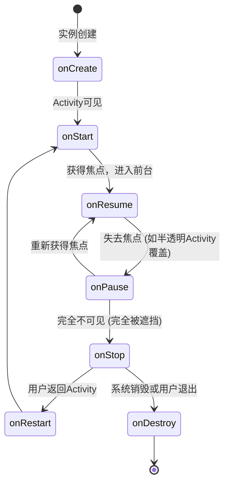
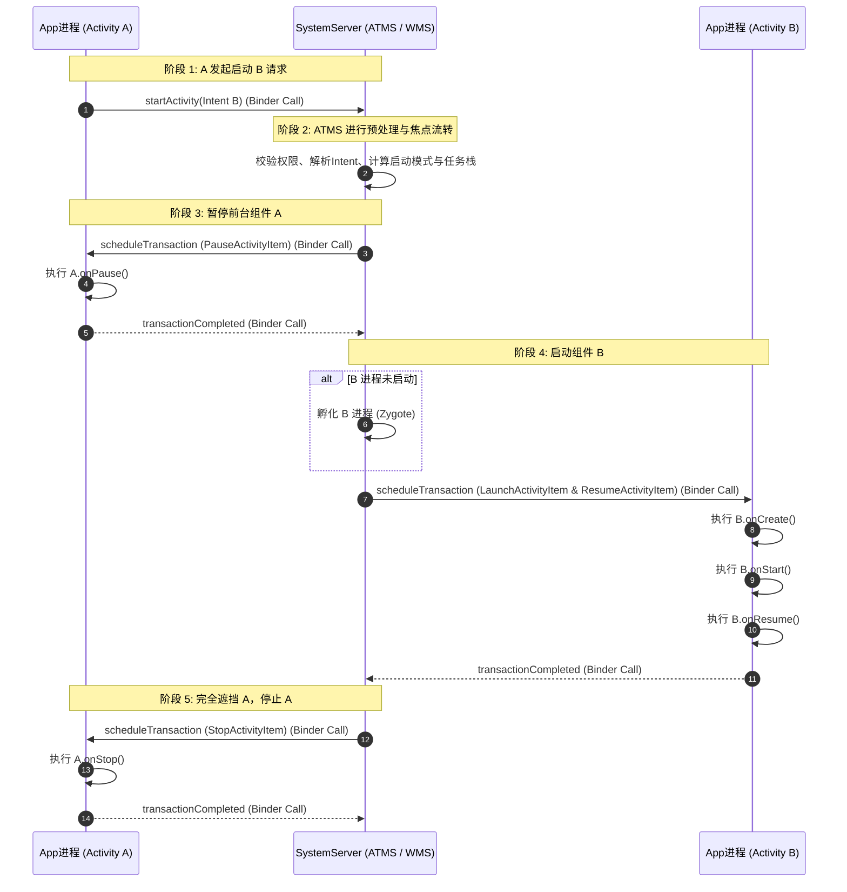
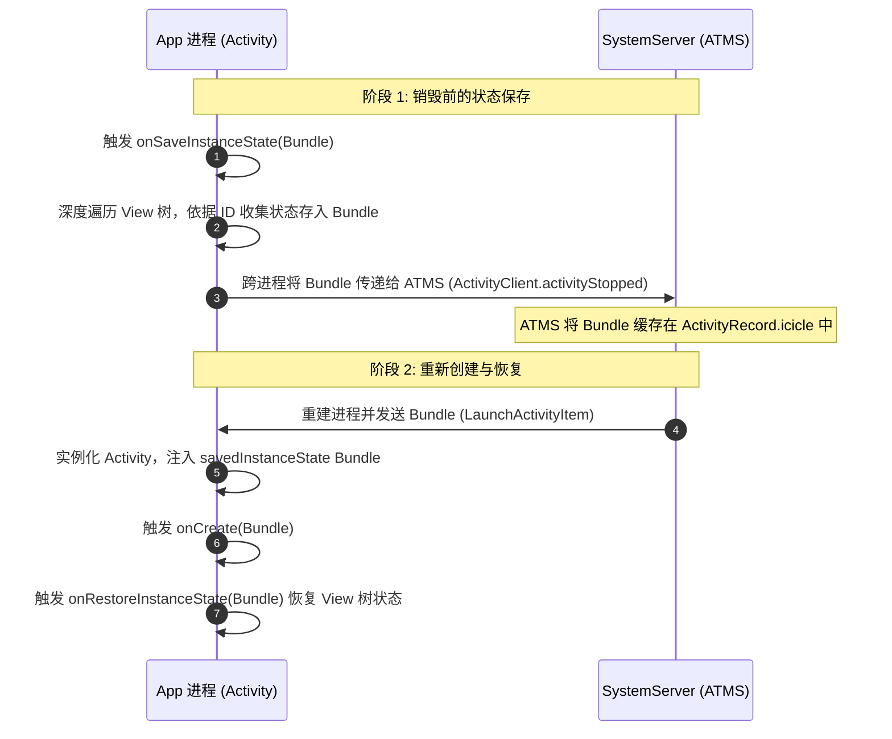
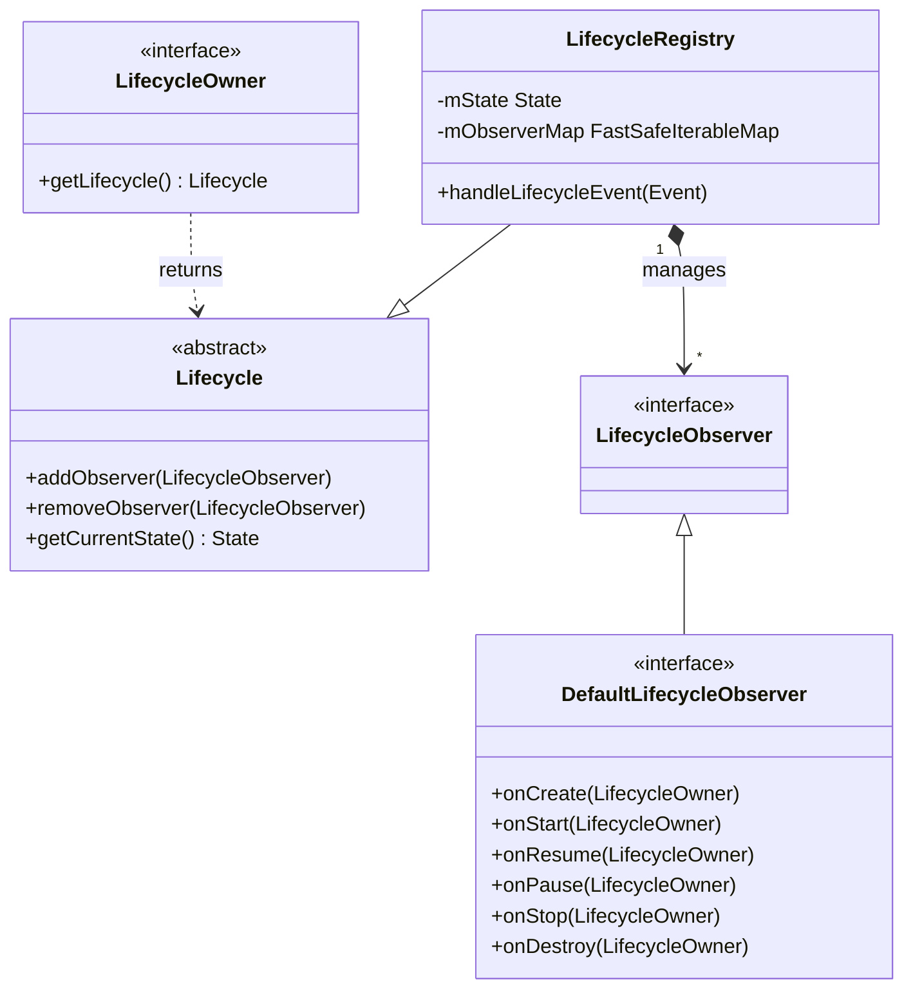
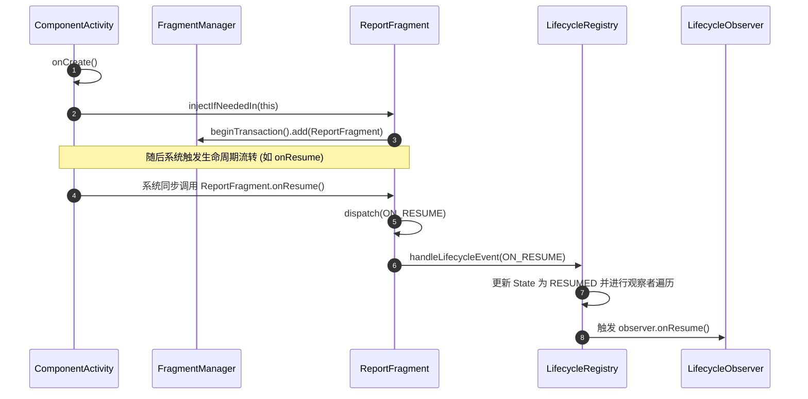

# 5.1.2.1.1 生命周期

Activity 作为 Android 应用中最核心的组件，其生命周期的管理与分发机制是整个 Android 交互系统的基石。生命周期不仅是一组简单的回调方法，更是 Android 操作系统在“多任务并发”、“内存回收与置换机制（LMK/OOM ADJ）”以及“组件化状态维护”等复杂系统特性下的集中体现。

本篇文档将深入解构 Activity 生命周期的底层运行机制，涵盖七大经典生命周期状态机模型、典型物理场景下的生命周期交替执行顺序与跨进程通信（IPC）机制、配置变化及内存不足时的异常生命周期与状态恢复，以及 Jetpack Lifecycle 观察者机制的底层原理解构（ReportFragment 分发）。

---

## 一、 Activity 经典七大生命周期与状态机流转

### 1.1 七大经典状态的回调时机与系统级含义

Android 系统通过 ActivityStack（或现代 Android 中的 Task）来管理 Activity，其生命周期回调直接反映了 Activity 在系统中所处的物理状态与焦点变化。



#### 1.1.1 onCreate()
* **触发时机**：当系统首次创建 Activity 实例时触发，该状态为生命周期的起点，此时 Activity 处于 `Created` 状态。
* **底层机理**：系统在应用进程中实例化 `Activity` 对象，并为其创建 `Window`（`PhoneWindow`）实例，同时关联当前的 `ContextImpl`。在此阶段，系统会开始解析 XML 布局并将其添加到 Window 的 DecorView 中（即 `setContentView()` 执行的过程）。
* **应该做什么**：
  * 执行一次性的初始化操作，例如绑定布局、初始化 ViewModel、设置基础数据源。
  * 恢复在销毁重建时传入的系统暂存状态（`Bundle savedInstanceState`）。
* **禁忌做什么**：
  * **禁止执行阻塞主线程的操作**。任何耗时的磁盘 I/O、数据库同步查询或同步网络请求，都会延长此回调的耗时，从而直接导致应用冷启动时间增加。
  * **禁止在此时获取 View 的宽高**。由于此时 View 树尚未完成首帧的测量（Measure）与布局（Layout），调用 `View.getWidth()` 或 `View.getHeight()` 将始终返回 0。

#### 1.1.2 onStart()
* **触发时机**：当 Activity 离开 `Created` 状态，由不可见变为可见时触发，此时 Activity 进入 `Started` 状态。
* **底层机理**：Activity 的窗口已经完成了与 `WindowManagerService` (WMS) 的关联，虽然已被绘制到屏幕上，但此时它仍处于不可交互（没有焦点）的状态。
* **应该做什么**：
  * 激活那些仅在 Activity 可见时才需要运行的轻量级任务，如开始播放动画、注册仅在可见状态下生效的 BroadcastReceiver。
* **禁忌做什么**：
  * 不要在此处执行复杂的生命周期逻辑或耗时任务，以确保 Activity 能够快速流转到 `Resume` 状态，呈现给用户。

#### 1.1.3 onResume()
* **触发时机**：Activity 已完全可见，并获得了系统焦点，用户可与其进行正常交互。此时 Activity 处于 `Resumed` 状态。
* **底层机理**：Activity 的 Window 已经被提升至前台，并开始接收系统的输入事件（Input Event）。此时，`ViewRootImpl` 已经与 `Choreographer` 建立关联，界面进入高频刷新与事件响应状态。
* **应该做什么**：
  * 恢复并激活与用户交互强相关的重度资源，例如启动相机预览、播放音视频、激活传感器监听（如陀螺仪、GPS）以及开启高频的 UI 定时刷新器。
* **禁忌做什么**：
  * **不要做任何延迟交互的行为**。`onResume()` 的快速返回标志着界面完全响应用户，任何在此处的短暂卡顿都会直接体现为掉帧。

#### 1.1.4 onPause()
* **触发时机**：当有新的 Activity 启动并获取焦点，或者出现一个半透明/透明的 Activity 覆盖在当前 Activity 之上时触发。此时 Activity 进入 `Paused` 状态。
* **底层机理**：Activity 失去了系统焦点，不再接收任何物理或虚拟的按键、触摸事件，但其视图依然有部分或全部可见。
* **应该做什么**：
  * 释放不应在失去焦点时继续运行的独占式资源（如暂停相机预览、停止敏感传感器监听）。
  * 快速暂存那些无需持久化到磁盘的临时 UI 交互数据。
* **核心解析：为什么 onPause() 中不能执行耗时操作？**
  * 当用户启动一个新的 Activity 时，系统进程（`ActivityManagerService` / `ActivityTaskManagerService`）会首先通过 Binder IPC 向当前处于前台的 Activity 发送暂停指令。
  * **只有在前台 Activity 的 `onPause()` 回调执行完毕并向 SystemServer 返回确认（Acknowledgement）后，系统才会继续分发并执行新 Activity 的创建和启动流程。**
  * 如果在 `onPause()` 中执行耗时操作（如写 SharedPreferences 写入、网络上报或大文件读写），会直接阻塞后续页面的展示，导致用户感知到明显的交互迟滞。严重时，如果在 5 秒内无法完成，还会触发系统的 ANR（Application Not Responding）机制。

#### 1.1.5 onStop()
* **触发时机**：当 Activity 已经完全不可见时触发。此时 Activity 进入 `Stopped` 状态。
* **底层机理**：系统将该 Activity 标记为不可见，WMS 也会停止对其窗口的渲染工作，并将该 Activity 的 Window 从可见列表中移除。
* **应该做什么**：
  * 执行重度的资源释放与清理。例如停止网络轮询、关闭本地数据库连接、取消后台待处理的异步任务。
  * 将内存中的临时状态持久化写入磁盘（如调用 Room 或 DataStore 的异步写入）。
* **禁忌做什么**：
  * **避免执行高度依赖时效性的关键数据保存**。当 Activity 进入 `Stopped` 状态后，其所在的进程优先级会大大降低。若系统处于极端低内存环境，该进程可能随时被直接强杀，而不会执行后续的 `onDestroy()`。

#### 1.1.6 onDestroy()
* **触发时机**：当 Activity 被彻底销毁，即将从内存中清除时触发。此时 Activity 处于 `Destroyed` 状态。
* **底层机理**：此阶段 Activity 的 Java 对象即将被垃圾回收器（GC）回收。它所关联的 `Window`、`View` 树将被完全解构，并且系统服务中关于该 Activity 的所有状态记录都将被清理。
* **应该做什么**：
  * 彻底清理可能导致内存泄漏的各种资源。例如注销 EventBus、移除 Handler 的 Pending 消息、断开 Service 连接、解绑非 Lifecycle 感知的协程作用域。
* **特别注意**：
  * `onDestroy()` 的执行是**不可靠**的。如果进程在后台被系统直接强杀（如通过 `kill -9`），系统不会运行该回调。因此，绝对不要将关键数据的持久化工作留到 `onDestroy()` 中执行。

#### 1.1.7 onRestart()
* **触发时机**：Activity 处于 `Stopped` 状态后，重新被用户带回前台时触发，随后紧接着会触发 `onStart()`。
* **应该做什么**：
  * 恢复或重置那些在 `onStop()` 中被释放的局部交互状态，常用于执行轻量级的缓存校验。

---

## 二、 典型交互场景的生命周期时序与原理

### 2.1 A 启动 B 的详细生命周期流转与跨进程交互

当应用进程中的 Activity A 启动同一个应用或不同应用中的 Activity B 时，生命周期的流转顺序严格遵循：
`A.onPause() -> B.onCreate() -> B.onStart() -> B.onResume() -> A.onStop()`。

#### 2.1.1 这一顺序的设计合理性
1. **焦点安全的交互传递**：在新的 Activity B 能够获取焦点并向用户展示之前，必须确保前一个 Activity A 已经停止了对用户输入事件的响应（即完成 `onPause()`）。如果不走这一步，当 B 在初始化并处于半就绪状态时，用户依然可能继续操作 A 的界面，从而触发数据冲突或多次启动等致命逻辑 Bug。
2. **硬件资源的阶段式置换**：A 先进入 `Pause`，释放了如相机、麦克风等系统独占资源，B 在 `Create`/`Resume` 时才能无冲突地获取这些硬件控制权。

#### 2.1.2 跨组件跨进程的底层 IPC 机制（ClientTransaction 事务框架）

在 Android 9.0 (API 28) 之后，Google 重构了生命周期管理体系，引入了 **ClientTransaction（客户端事务）** 框架。其核心目的是将分散的 Binder 请求合并为单次事务分发，以减少进程上下文切换的开销，并提升生命周期的时序严谨性。

下表梳理了该框架的核心通信组件：

| 核心组件 | 所属进程 | 职责 |
| --- | --- | --- |
| **ActivityTaskManagerService (ATMS)** | `SystemServer` 进程 | 统一管理系统中的 Task 栈、Activity 状态，作为生命周期调度的最高决策者。 |
| **IApplicationThread** | 跨进程 Binder 接口 | App 进程提供给 SystemServer 的 Binder 通信通道，用于接收生命周期指令。 |
| **ClientTransaction** | 数据载体 | 封装了一组针对特定 Activity 的生命周期转换项（TransactionItem）的容器。 |
| **TransactionExecutor** | App 进程 | 解析 SystemServer 传递过来的 `ClientTransaction`，计算当前状态到目标状态的最短执行路径并执行。 |



1. **发起启动**：Activity A 调用 `startActivity()`，请求通过 Binder IPC 发送给 SystemServer 进程中的 `ActivityTaskManagerService` (ATMS)。
2. **状态流转与事务装配**：ATMS 评估 A 的当前状态，计算出需要先暂停 A。ATMS 构建一个 `ClientTransaction` 事务，其中装载了 `PauseActivityItem`（指令）。
3. **执行 Pause 事务**：SystemServer 通过 `IApplicationThread` 回调 App A 的进程。在 App 进程中，`ActivityThread` 接收到事务，交由 `TransactionExecutor` 执行，最终调用 `Activity.performPause()` 进而回调 `A.onPause()`。执行完毕后，App A 通过 Binder 告知 ATMS “已完成暂停”。
4. **启动 B 事务**：ATMS 收到确认后，判断 B 所在的进程是否已经启动。如果未启动，则先通过 Zygote 孵化出新进程。随后，ATMS 将装配有 `LaunchActivityItem` 和 `ResumeActivityItem` 的事务发送给 App B 进程。
5. **依次回调**：B 进程的 `TransactionExecutor` 计算得出 B 目前处于未创建状态，必须依次流转：
   * 执行 `LaunchActivityItem` -> 调用 `Activity.performCreate()` -> 触发 `B.onCreate()`。
   * 流转至 Started 状态 -> 触发 `B.onStart()`。
   * 执行 `ResumeActivityItem` -> 调用 `Activity.performResume()` -> 触发 `B.onResume()`。
6. **停止 A 事务**：当 B 成功进入 Resumed 状态并在屏幕上完成首帧布局后，ATMS 检测到 A 的窗口已经完全被 B 遮挡，于是向 App A 进程发送 `StopActivityItem` 事务，触发 `A.onStop()`。

### 2.2 常见弹窗与遮挡场景判定

开发中常有关于“弹窗是否影响生命周期”的疑问，其底层的判定标准在于 **Window 的所有权与 ActivityRecord 的焦点计算**。

#### 2.2.1 普通 Dialog / DialogFragment 弹出
* **现象**：Activity 的生命周期**无任何变化**（不会调用 `onPause()` 或 `onStop()`）。
* **底层原理**：
  * Activity 生命周期由系统服务（ATMS）的 `ActivityRecord` 状态机直接维护。
  * 普通的 `Dialog` 或 `DialogFragment` 的显示，本质上是在宿主 Activity 所在的窗口管理器中，添加了一个新的子窗口（其 Window Type 为 `TYPE_APPLICATION`）。
  * 尽管这个新窗口在屏幕上遮挡了 Activity 的部分内容，但在系统的认知里，前台运行的依然是该 Activity 对应的 `ActivityRecord`。焦点并没有发生 Activity 级别的转移，因此生命周期保持静止。

#### 2.2.2 透明 / 半透明 Activity 覆盖
* **现象**：前一个 Activity A 只会执行 `onPause()`，而**不会执行 `onStop()`**。
* **底层渲染与可见性判定机制**：
  * 在 SystemServer 中，决定是否执行 `onStop()` 的核心逻辑是 **Activity 窗口的物理可见性（Visibility）**。
  * 当启动新 Activity B 时，ATMS 与 WMS 会协同对 B 的 Theme 进行属性解析。如果 B 的属性中包含 `android:windowIsTranslucent=true`（半透明）或 `android:windowIsFloating=true`（浮动对话框样式），WMS 会将 B 的窗口渲染边界之外的区域判定为“透光区”。
  * 此时，系统判定 A 的窗口**部分可见**，因此不会向 A 下发 `StopActivityItem`（不执行 `onStop()`），而只会下发 `PauseActivityItem`（触发 `onPause()`）以让其让出输入焦点。

---

## 三、 异常情况下的生命周期与状态管理

在 Android 的系统模型中，由于系统资源限制或用户环境变化，Activity 随时面临着“非自愿的销毁”，这要求应用必须具备良好的状态恢复能力。

### 3.1 系统配置变化导致的销毁与重建

#### 3.1.1 重建设计的哲学
当屏幕旋转、深浅色模式切换、系统语言变更时，系统默认销毁当前的 Activity 实例并重新创建。这是因为不同的配置对应着不同的资源目录（如 `layout-land` 与 `layout-port`）。重建可以使 Activity 重新加载最匹配当前配置的资源文件，从框架层免除了开发者手动解析、重置所有 UI 属性的繁琐过程。

#### 3.1.2 状态保存与恢复的底层链路

为了保证用户交互的连续性（例如输入的文字不丢失，列表的滚动位置不变），系统提供了基于 Binder 的状态保存恢复机制。



* **状态保存：onSaveInstanceState()**：
  * **调用时机**：在 Activity 即将被销毁且后续可能需要重建时调用。在 Android 9.0 (API 28) 及之后的版本中，该回调被明确规范在 `onStop()` 之后、`onDestroy()` 之前执行。
  * **底层原理**：
    1. 当 Activity 准备进入 Stop 状态时，`ActivityThread` 会调用 `callActivityOnSaveInstanceState()`。
    2. Activity 会持有一个 `Bundle` 对象，并启动 View 树的深度优先遍历。**所有声明了 `android:id` 的 View** 都会触发自身的 `onSaveInstanceState()`，将关键 UI 状态（如滚动偏移、文本）写入该 `Bundle`。
    3. 收集完毕后，App 进程通过 Binder 调用，将该 `Bundle` 跨进程传输至 SystemServer 进程。
    4. SystemServer 将此 `Bundle` 缓存在该 Activity 对应的 `ActivityRecord` 的 `icicle`（冰封状态数据）字段中。只要当前的 Task 栈没有被彻底关闭，这个缓存就会一直保留。
* **状态恢复：onRestoreInstanceState()**：
  * **调用时机**：在重建该 Activity 时，伴随着 `onStart()` 的结束，系统会自动调用 `onRestoreInstanceState(Bundle savedInstanceState)`。
  * **底层原理**：
    1. 进程重建后，ATMS 从 `ActivityRecord.icicle` 中取出 `Bundle`，随 Binder 传递给新 Activity。
    2. 该 `Bundle` 会同时传给 `onCreate(savedInstanceState)` 与 `onRestoreInstanceState(savedInstanceState)`。
    3. `onRestoreInstanceState()` 内部会遍历 View 树，根据 View 的 ID 重新分发并装载之前保存的状态数据。
  * **区别与权衡**：
    * `onCreate()` 中的 `savedInstanceState` 可能为 `null`（如正常冷启动），必须进行非空检查。
    * `onRestoreInstanceState()` 只有在确实存在暂存状态时才会被调用，其入参 `savedInstanceState` 保证非空，因此更适合编写集中的 UI 状态还原代码。

#### 3.1.3 通过 configChanges 规避重建的得与失
* **配置方式**：在 `AndroidManifest.xml` 中，针对对应的 `<activity>` 声明：
  ```xml
  <activity 
      android:name=".MainActivity"
      android:configChanges="orientation|screenSize|uiMode|locale|layoutDirection" />
  ```
* **运行机制**：声明后，当发生对应的物理变化时，系统**不再销毁重建 Activity**。相反，系统只会回调 Activity 的 `onConfigurationChanged(Configuration newConfig)`。
* **利弊分析与方案权衡**：
  * **优势**：规避了 Activity 重建所带来的大对象销毁、GC、布局重新解析与数据重载的开销，界面切换极为平滑。适用于视频播放器（横竖屏切换保持播放状态）、游戏引擎等对帧率波动极度敏感的场景。
  - **弊端**：系统自带的资源限定符（Resource Qualifiers）自动加载机制将失效。开发者必须在 `onConfigurationChanged()` 中编写繁琐的动态适配逻辑（如手动调整 View 尺寸、重新获取 `Resources` 字符串）。这极易导致维护成本增加，以及由于适配遗漏导致的 UI 错乱。
  * **最佳实践**：除上述音视频与游戏等高实时交互场景外，应优先使用系统默认的销毁重建机制，并使用现代架构组件（如 `ViewModel` + `SavedStateHandle`）来保持业务数据，从而保持代码的清洁与解耦。

### 3.2 内存不足被系统强杀时的 Activity 重建

在 Android 系统中，当应用处于后台（如按下 Home 键），其所在的进程优先级会逐步下降。当系统物理内存不足时，内核的 `lmkd`（Low Memory Killer 守护进程）会根据进程的 **OOM ADJ 优先级** 进行资源清理。

#### 3.2.1 OOM ADJ 优先级划分与回收机理
系统进程的回收优先级是通过 `oom_score_adj`（取值范围 -1000 至 1000）来动态量化的，其主要优先级节点如下：

* **前台进程 (FOREGROUND_APP, ADJ = 0)**：当前与用户直接交互 of Activity 所在进程，绝对不会被回收，除非内存彻底耗尽导致系统崩溃。
* **可见进程 (VISIBLE_APP, ADJ = 100)**：Activity 失去了焦点但部分可见（如被透明 Activity 覆盖），或者是绑定了前台 Service 的进程。
* **感知进程 (PERCEPTIBLE_APP, ADJ = 200)**：后台运行着用户可感知的服务（如音乐播放、导航）。
* **缓存进程 (CACHED_APP, ADJ = 900 ~ 950)**：处于后台完全不可见状态的 Activity 进程。当内存不足时，此类进程会被 `lmkd` 优先通过发送 `SIGKILL`（`kill -9`）信号强制终结。

#### 3.2.2 强杀重建与普通销毁重建的深度对比

很多开发者容易混淆“配置变化引起的销毁重建”与“内存不足强杀引起的重建”，下表对两者的底层细节进行了深度对比：

| 维度 | 系统配置变化（普通销毁重建） | 内存不足被系统强杀（强杀重建） |
| --- | --- | --- |
| **触发时机** | 设备状态或环境配置改变（如旋转屏幕）。 | 系统可用内存低于阈值，`lmkd` 执行进程级清理。 |
| **影响范围** | 仅限于当前的 Activity 实例被销毁并重新实例化。 | 整个应用进程（包括 Application、Service 等）被强行终止。 |
| **进程生命周期** | 进程始终保持存活，内存地址空间不改变。 | 进程被杀彻底死亡。重建时，系统必须重新孵化（Zygote Fork）一个全新的进程。 |
| **onDestroy() 回调** | **一定会执行**。 | **绝对不会执行**。进程是在底层被内核信号直接杀死的。 |
| **内存静态变量** | 全局静态变量（Static variables）、单例实例**完整保留**。 | 全局静态变量、单例全部丢失，数据恢复到类加载的**初始状态**。 |
| **UI 状态保存 (`Bundle`)** | 保存在宿主进程与 SystemServer 中。 | 保存在 SystemServer 进程的 `ActivityRecord` 中（不受 App 进程死亡的影响）。 |

#### 3.2.3 强杀重建引发的典型 Bug：NullPointerException 噩梦

当应用在后台被强杀后，用户重新从“最近任务列表”点击该应用时，Android 系统为了让用户感知不到应用曾被关闭，会执行一个“假冷启动”：
1. 系统会重新创建该应用的进程，并初始化 `Application`。
2. **系统不会像正常启动那样从首屏（如 SplashActivity）依次跳转，而是直接重建用户被强杀时所处的那个 Activity**。
3. **Bug 成因**：如果该 Activity 的业务逻辑依赖于全局单例或静态变量（这些变量通常是在首屏或者之前的 Activity 中初始化的），此时由于进程重建，静态变量的值全部变为了 `null`。当 Activity 尝试读取这些变量时，就会立刻抛出 `NullPointerException` 导致崩溃。
4. **测试与排障**：
   * **测试手段**：可以在开发者选项中开启“不保留活动”（Don't keep activities）进行单 Activity 重建测试，或者直接将应用切入后台，通过命令：`adb shell am force-stop <package_name>` 强制杀死进程，再点击最近任务恢复，以此来暴露出隐蔽的空指针问题。
   * **架构防范**：必须坚持“单一数据源”与“无状态”的设计思想。Activity 内部的关键参数应当通过 `Intent` 的 `extras` 传输，或者配合 Jetpack Lifecycle 的 `SavedStateHandle` 写入临时状态。对于全局数据，必须在访问时具备完善的重载或缺省机制。

---

## 四、 现代生命周期架构：Jetpack Lifecycle 机制解构

随着 Android 开发的演进，传统的在 Activity 中手动同步生命周期的方式暴露出诸多弊端。

### 4.1 传统生命周期的历史弊端
在传统的编写模式中，诸如定位监听器、数据加载器或视频播放器等第三方组件，如果需要感知 Activity 的生命周期，就必须在 Activity 的每一个生命周期回调中进行硬编码式的调用（例如在 `onStart()` 中调用 `listener.start()`，在 `onStop()` 中调用 `listener.stop()`）。

这种设计导致两个核心问题：
1. **Activity 类极度臃肿**：大量的初始化、启动和释放逻辑混杂在 Activity 的生命周期方法中，使得 Activity 沦为一个难以维护的“万能类”。
2. **时序与控制漏洞**：如果在 `onStart()` 中的某些异步操作尚未完成时，Activity 就已经执行了 `onStop()`，那么由于缺乏统一的状态机控制，这些组件内部的资源可能会面临初始化未完成就被调用释放的异常情况，从而引发 Crash。

### 4.2 Jetpack Lifecycle 的观察者设计模式

Jetpack Lifecycle 通过引入一种**基于状态机的生命周期分发机制**，使得普通类能够通过声明式编程，自主、无侵入地观察 Activity / Fragment 的生命周期。



* **LifecycleOwner**：生命周期的持有者接口，仅声明了一个方法：`getLifecycle()`。在现代 Android 中，`ComponentActivity` 与 `Fragment` 默认实现了此接口。
* **LifecycleObserver**：生命周期观察者标记接口。推荐实现 `DefaultLifecycleObserver` 接口，以便直接以多态方法接收 `onCreate` / `onStart` / `onResume` 等具体事件。
* **LifecycleRegistry**：`Lifecycle` 的具体实现类，作为整个框架的中央调度器。它内部维护了一个状态机，并管理着一条观察者链表。当 Activity 的状态发生改变时，会调用 `LifecycleRegistry.handleLifecycleEvent(Event)`，它负责计算状态差异（State Sync）并逐一分发通知。

#### 4.2.1 Lifecycle 中的状态（State）与事件（Event）的转换关系

Lifecycle 内部定义了两个核心枚举：
* **Event（事件）**：由系统框架层抛出的生命周期瞬时动作，如 `ON_CREATE`, `ON_START`, `ON_RESUME` 等，对应 Activity 的回调。
* **State（状态）**：Activity 当前所处的静态生命周期段，包括 `INITIALIZED`, `CREATED`, `STARTED`, `RESUMED`, `DESTROYED`。

这两者的关系呈现为一个双向台阶式的状态机：

```
       ON_CREATE            ON_START            ON_RESUME
INITIALIZED -------> CREATED -------> STARTED -------> RESUMED
            <-------         <-------         <-------
       ON_DESTROY           ON_STOP             ON_PAUSE
```

当 `LifecycleRegistry` 触发事件时，它会对比观察者当前的 State 与宿主最新的 State：
* 如果宿主状态向前推进（如从 `CREATED` 变为 `STARTED`），Registry 会向观察者分发 `ON_START` 事件，并将其对应的 State 标记提升为 `STARTED`。
* 如果宿主状态向后回退（如从 `RESUMED` 退回到 `STARTED`），Registry 会向观察者分发 `ON_PAUSE` 事件，并将 State 标记降低为 `STARTED`。
* **状态对齐机制**：新加入的观察者并不会错过之前的生命周期。例如，在 Activity 已经处于 `Resumed` 状态时，向 `LifecycleRegistry` 注册一个新观察者，Registry 会自动计算状态差异，连续向其分发 `ON_CREATE`、`ON_START`、`ON_RESUME` 事件，使得新观察者的状态能与宿主“对齐”。

### 4.3 底层原理：ReportFragment 的无侵入式注入与分发

很多开发者发现，自己编写 Activity 继承自 `ComponentActivity` 时，并没有在生命周期方法中编写任何与 `LifecycleRegistry` 交互的代码，但观察者却能正常收到生命周期通知。这背后的核心功臣是 **ReportFragment**。

#### 4.3.1 ReportFragment 运作流程



1. **自动注入**：当 `ComponentActivity` 被实例化并执行到其 `onCreate()` 时，它会调用 `ReportFragment.injectIfNeededIn(this)`。
2. **挂载无界面 Fragment**：`ReportFragment` 是一个没有 UI 视图（`onCreateView` 返回 `null`）的特殊 Fragment。它通过 `FragmentManager` 被添加到当前 Activity 中。
3. **生命周期代理捕获**：因为 Fragment 的生命周期会由系统（`FragmentManagerImpl`）自动保持与 Activity 同步。当 Activity 的状态发生改变时（例如系统调用了 Activity 的 `onResume`），系统会同步调用挂载在其上的 `ReportFragment` 的 `onResume()`。
4. **事件分发**：在 `ReportFragment` 的各个生命周期方法中，它会执行类似于以下的分发逻辑：
   ```java
   public class ReportFragment extends Fragment {
       static void dispatch(Activity activity, Lifecycle.Event event) {
           if (activity instanceof LifecycleRegistryOwner) {
               ((LifecycleRegistryOwner) activity).getLifecycle().handleLifecycleEvent(event);
           } else if (activity instanceof LifecycleOwner) {
               Lifecycle lifecycle = ((LifecycleOwner) activity).getLifecycle();
               if (lifecycle instanceof LifecycleRegistry) {
                   ((LifecycleRegistry) lifecycle).handleLifecycleEvent(event);
               }
           }
       }

       @Override
       public void onResume() {
           super.onResume();
           dispatch(Lifecycle.Event.ON_RESUME);
       }
   }
   ```
5. **解耦优势**：这种“无界面 Fragment 注入”设计是一种极佳的非侵入式设计。它不需要在 Activity 基类中硬编码任何具体分发，也不会破坏多重继承关系，使得生命周期的捕获对子类 Activity 完全透明。

#### 4.3.2 针对不同 Android 版本的双轨兼容设计

随着 Android 版本的演进，Google 对 `ReportFragment` 的分发逻辑进行了进一步的优化。为了在保持高性能的同时完美向下兼容，系统采用了双轨运行机制：

* **Android 10 (API Level 29) 及以上版本**：
  * Android 10 在 `Activity` 内部引入了 `Activity.registerActivityLifecycleCallbacks(...)` API，这使得 Activity 可以直接通过监听器监听自身的生命周期，而无需挂载 Fragment。
  * 当运行在 API >= 29 的设备上时，`ReportFragment` 会在被注入时立即调用 `Activity.registerActivityLifecycleCallbacks(...)`，注册一个自定义的 `LifecycleCallbacks` 监听器。所有的生命周期事件将直接通过该系统监听器进行分发，效率更高，减少了 Fragment 挂载的回调开销。
* **Android 10 以下版本**：
  * 系统自动回退到传统的 Fragment 代理机制。通过 Fragment 的 `onStart` / `onResume` 等生命周期方法来进行分发，从而保证了框架在旧版 Android 上的完全可用性。
  * 关于此 API Level 变化的底层描述，可结合阅读 [AndroidVersionChangeLog.md](file:///Users/lizhiyang/Desktop/AndroidKnowledge/AndroidVersionChangeLog.md)。

---

## 五、 常见避坑指南与实践误区

### 5.1 异步操作引发的内存泄漏与 NullPointerException

* **误区描述**：在 Activity 中启动了异步任务（如网络请求、数据库查询、RxJava 订阅或非 Lifecycle 感知的协程），如果在异步任务完成之前，Activity 已经执行了 `onDestroy()`，异步回调依然持有着 Activity 的 Context 引用。
* **后果**：
  * **内存泄漏**：Activity 无法被 GC 回收，导致内存占用持续走高。
  * **NullPointerException / IllegalStateException**：在异步回调中执行例如 `textView.setText()` 或 `getSupportFragmentManager().beginTransaction()`。因为此时 View 树已经从 Window 销毁，`Context` 已失效，这会导致直接崩溃。
* **正确做法**：
  * 将异步任务与生命周期绑定，使用 `lifecycleScope.launch` 启动协程。
  * 在 `onStop()` 或 `onDestroy()` 中，显式地取消 RxJava 订阅（`Disposable.dispose()`）或取消协程作用域。

### 5.2 Fragment 状态恢复引发的 IllegalStateException
* **典型错误日志**：`java.lang.IllegalStateException: Can not perform this action after onSaveInstanceState`
* **成因分析**：
  * 当系统配置发生变化或 Activity 准备退到后台时，系统会调用 `onSaveInstanceState()` 将当前的 UI 状态暂存。
  * 在这之后，如果应用尝试通过 `FragmentTransaction.commit()` 提交一个新的 Fragment 事务，系统会拒绝该操作。
  * 因为 `onSaveInstanceState()` 已经执行完毕，此时如果允许修改 Fragment 栈，新添加的 Fragment 状态将无法被 SystemServer 捕获保存。一旦后续进程因内存不足被强杀重建，这个新 Fragment 的状态就会丢失，造成界面状态不一致。
* **解决方案**：
  * 确保所有 Fragment 的事务提交都发生在 Activity 的活跃状态中（即 `onResume` 期间）。
  * 如果必须在异步回调或生命周期不确定的时机提交，应评估业务场景改用 `commitAllowingStateLoss()`。这虽然会允许在状态保存后提交事务（即使重建时可能会丢失该 Fragment 状态），但能规避崩溃。

### 5.3 滥用 ConfigChanges 规避生命周期重建
* **误区描述**：为了防止旋转屏幕或键盘滑出时数据丢失，开发者在 Manifest 中将几乎所有的配置项都写入了 `android:configChanges`。
* **后果**：这导致应用失去了 Android 默认的自动资源适配能力。如果应用有专门针对横屏（`layout-land`）设计的 UI，在旋转屏幕后，由于没有经历 Activity 重建，界面会以竖屏的尺寸强行拉伸显示在横屏设备上，且不会加载横屏下的图片或间距，产生严重的 UI 适配 Bug。
* **正确做法**：
  * 大多数页面应保持默认重建机制，业务数据应当使用 `ViewModel` 来存储（ViewModel 在配置重建时不会被销毁）。
  * 页面 UI 的瞬时交互状态（如输入的草稿、滚动位置）使用 `onSaveInstanceState(Bundle)` 保存与恢复。

### 5.4 在 onPause() 中编写重度数据读写逻辑
* **误区描述**：认为 `onPause()` 代表 Activity 暂停，于是把数据库数据保存、大文件写入或者网络同步日志等逻辑都堆在此处。
* **后果**：由于新 Activity 的启动必须等待前一个 Activity 的 `onPause()` 完成，这会导致整个应用的界面转场变得极其缓慢，甚至直接触发系统的 ANR。
* **正确做法**：
  * `onPause()` 只做轻量级的内存数据暂存或传感器关闭。
  * 任何涉及磁盘 I/O 或网络的持久化操作，都应扔进后台线程池或使用 WorkManager 异步执行。

### 5.5 试图在 onCreate() / onResume() 中直接获取组件的宽高
* **误区描述**：在 `onCreate()` 或者 `onResume()` 中调用 `view.getWidth()` 来获取其尺寸以进行动态布局。
* **后果**：获取的值始终为 0。因为此时主线程刚刚执行完生命周期回调，尚未向 Choreographer 申请并执行实际的 Measure/Layout 绘制流程。
* **正确做法**：
  * 使用 `View.post(Runnable)` 将获取宽高的逻辑邮寄到 MessageQueue 的队尾。这样当 Runnable 被执行时，View 树必定已经完成了至少一次 Measure/Layout 绘制。
  * 或者监听 View 的 `ViewTreeObserver.OnGlobalLayoutListener`，在全局布局完成后获取。
