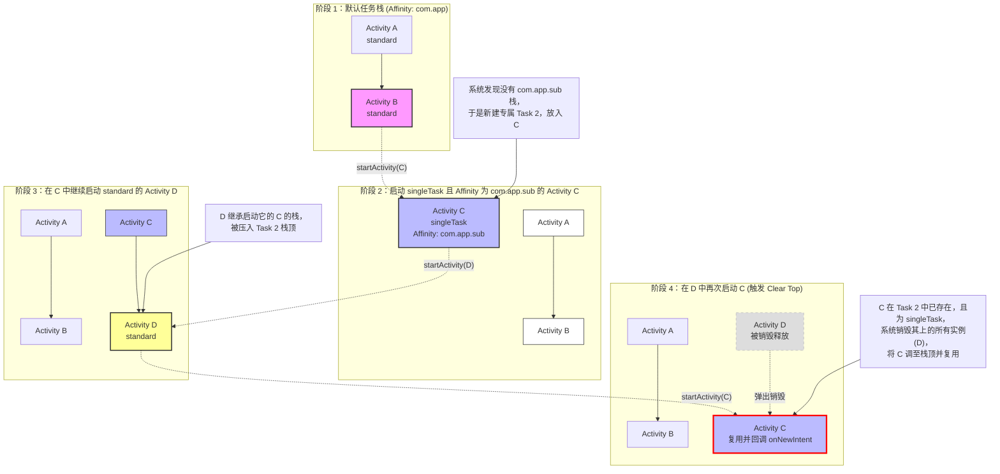
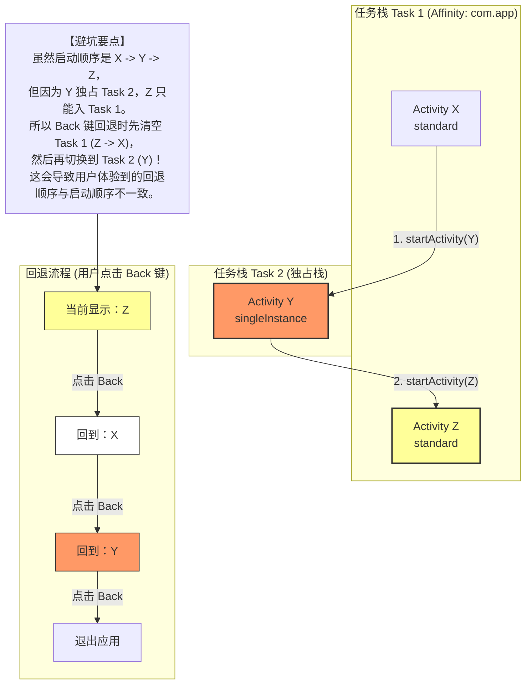

# 5.1.2.1.2 启动模式

在 Android 应用程序的开发与系统架构中，Activity 的启动模式（LaunchMode）与任务栈（Task）调度机制是决定多页面应用交互体验、实例复用以及内存占用的核心基石。Activity 不仅仅是简单的 UI 视图承载者，在系统底层，它们的生命周期和实例管理是由 Android 操作系统中的活动任务管理器服务（ActivityTaskManagerService, 简称 ATMS，在 Android 10 之前为 ActivityManagerService, AMS）进行统一路由与分发的。

理解启动模式的运行原理，需要深入到系统层层面对 `ActivityRecord`、`TaskRecord` 以及 `ActivityDisplayArea` 等概念的逻辑抽象，并结合静态 Manifest 配置与动态 Intent Flags 的冲突与优先级规约进行系统性分析。本文将全方位解密 Android 启动模式的底层运行机制、任务栈亲和性的路由逻辑、动态标志位的运作原理、复用生命周期的协同细节以及实际开发中的经典避坑指南。

---

## 一、 导言：LaunchMode 的核心本质与任务栈调度

在深入讨论具体的启动模式之前，我们必须先厘清 Android 系统是如何组织和管理 Activity 实例的。Android 使用**任务栈（Task）**来管理一组 Activity。一个任务栈是一个“后进先出”（LIFO）的堆栈结构，对应系统底层的 `TaskRecord` 实体。

### 1.1 系统管理的三大核心实体
ATMS 内部通过以下三个核心实体来表达和控制 Activity 实例及其容器：
- **`ActivityRecord`**：对应 Manifest 中声明的每个 `<activity>` 节点在运行时的具体实例元数据。系统每创建一个 Activity 实例，就会在 ATMS 中对应生成一个 `ActivityRecord` 对象。它是系统管理 Activity 生命周期和状态的基本单元。
- **`TaskRecord`**：即任务栈。它是一组按启动顺序排列的 `ActivityRecord` 的集合。每个 `TaskRecord` 在系统多任务管理界面（Recents Screen）中表现为一个独立的卡片。
- **`TaskDisplayArea` / `DisplayContent`**：代表屏幕上的显示区域。一个显示区域可以包含多个 `TaskRecord`。系统通过管理这些 `TaskRecord` 的前后台切换，来实现多任务的调度。

### 1.2 LaunchMode 的核心使命
启动模式的本质是**告诉系统（ATMS）在收到 `startActivity` 请求时，应该将目标 `ActivityRecord` 路由到哪一个 `TaskRecord` 中，以及是创建一个全新的 `ActivityRecord`，还是复用已有的实例**。
通过合理配置启动模式，开发者可以控制：
1. **实例的复用性**：避免因频繁创建相同页面而导致的内存浪费与数据丢失。
2. **任务栈的隔离性**：将某些特定业务（如独立支付、电话呼叫）隔离在独立的 Task 中，提供与其他应用解耦的交互流程。
3. **回退栈的合理性**：保证用户在点击系统 Back 键时，页面能按符合直觉的顺序逐步回退，而不是出现循环跳转或回退紊乱。

---

## 二、 静态启动模式详析（4种传统 + 1种现代）

在 Manifest 文件中，我们可以通过 `<activity>` 标签的 `android:launchMode` 属性静态指定 Activity 的启动模式。Android 支持四种传统启动模式，并在 Android 12（API 31）中引入了第五种现代启动模式 `singleInstancePerTask`。

| 启动模式 | 宿主任务栈关系 | 实例数量限制 | 栈内复用行为 | 典型应用场景 |
| :--- | :--- | :--- | :--- | :--- |
| **`standard`** | 默认压入启动它的 Activity 所在的 Task | 无限制，每次启动都新建 | 不复用，直接新建并压入栈顶 | 绝大多数普通业务页面，如商品详情、新闻正文 |
| **`singleTop`** | 压入启动它的 Activity 所在的 Task | 无限制，但栈顶唯一 | 若已位于栈顶则复用，否则新建 | 消息通知跳转页、推送目标页、搜索结果页 |
| **`singleTask`** | 路由至与其 `taskAffinity` 匹配 of Task | 全局（或指定任务栈内）唯一 | 栈内复用，并清空其上方所有实例（Clear Top） | 应用主界面（MainActivity）、主导航页 |
| **`singleInstance`** | 独占一个全新的 Task，且该 Task 仅能有这一个实例 | 全局唯一 | 独占栈复用，不允许其他 Activity 压入 | 闹钟提醒、来电拨号、系统级悬浮窗、视频通话 |
| **`singleInstancePerTask`** | 在目标 Task 内作为根 Activity 且唯一 | 每个 Task 内唯一，全局可多实例 | Task 级别复用，若匹配的 Task 已存在则将其调至前台 | 大屏分栏主页、多窗口模式下的独立文档编辑页 |

---

### 2.1 standard（标准模式）
* **运行机制**：这是系统默认的启动模式。每次调用 `startActivity`，ATMS 都会无条件地创建一个全新的 `ActivityRecord`，并将其压入当前发起启动请求的 Activity 所在的 `TaskRecord` 栈顶。
* **内存与实例表现**：同一个 Activity 可以被创建无数次，并且可以同时存在于同一个任务栈或不同的任务栈中。
* **边界与局限**：由于 standard 模式依赖于“当前任务栈”，如果我们在非 Activity 上下文（如 `ApplicationContext` 或 `ServiceContext`）中启动一个 standard 属性的 Activity，由于这些上下文并不持有任何 `TaskRecord` 引用，系统在 Android 9（API 28）及以前会直接抛出 `AndroidRuntimeException`，提示需要添加 `FLAG_ACTIVITY_NEW_TASK`。在后续的 Android 版本中，此行为被进一步收紧，强制要求在非 Activity 容器中启动任何页面时必须显式指定新栈标志。

### 2.2 singleTop（栈顶复用模式）
* **运行机制**：当启动目标 Activity 时，ATMS 会先检查目标任务栈的栈顶。如果当前栈顶已经是该 Activity 的 `ActivityRecord` 实例，则系统**不会**创建新实例，而是直接复用栈顶的这个实例。此时，系统会回调该实例的 `onNewIntent(Intent)` 方法，并将新的 Intent 传递进去；如果该 Activity 已经存在于栈中但**不在栈顶**，那么系统依然会像 standard 模式一样，创建一个全新的实例并压入栈顶。
* **生命周期协同**：在复用发生时，Activity 的生命周期不会经历 `onCreate` -> `onStart`，而是直接走：
  `onPause() -> onNewIntent(Intent) -> onResume()`
* **典型场景**：例如即时通讯应用中的聊天界面。当用户已经处于与 A 的聊天页面时，如果点击了 A 发来新消息的系统通知，此时应该复用当前页面更新聊天列表，而不是在栈顶再盖一个一模一样的聊天页面，避免用户按返回键时需要重复点击多次才能退出。

### 2.3 singleTask（栈内单例模式）
* **运行机制**：这是一种“栈内单例”的设计。当启动目标 Activity 时，系统首先根据其 `taskAffinity` 寻找对应的 `TaskRecord`。
  1. 如果不存在对应的任务栈，系统会创建一个全新的 `TaskRecord`，并将目标 Activity 的新实例作为该栈的**根 Activity（Root Activity）**压入。
  2. 如果已存在与其亲和性匹配的任务栈，系统会检查该栈内是否已经存在该 Activity 的实例。
     - 如果**不存在**，则在当前栈顶创建新实例并压入。
     - 如果**已经存在**该实例，系统会把该实例**上方**的所有其他 Activity 实例全部销毁（即默认执行了 `Clear Top` 效果），使该 Activity 实例暴露在栈顶，并复用它，同时回调其 `onNewIntent(Intent)` 方法。
* **图示复用逻辑**：
  假设任务栈内状态为：`A -> B -> C -> D`（D 为栈顶），其中 B 的启动模式为 `singleTask`。此时若再次启动 B：
  系统会定位到 B，并将其上方的 C 和 D 依次出栈并销毁（触发 C 和 D 的 `onPause -> onStop -> onDestroy`），使栈变为 `A -> B`，同时 B 接收到 `onNewIntent` 回调。
* **典型场景**：常用于应用的主界面（MainActivity）。因为主界面是整个应用的流量基座，无论用户从子页面跳转了多深，一旦触发返回主页的操作，都应该清理掉所有中间的子页面，确保内存得到释放，且主页在回退栈的最底部。

### 2.4 singleInstance（单实例模式）
* **运行机制**：这是一种极其严格的全局单例模式。当一个 Activity 声明为 `singleInstance` 时，它具有以下物理特性：
  1. **独占栈性**：系统在启动它时，会专门为其创建一个全新的 `TaskRecord`。
  2. **唯一性**：在这个专属的任务栈中，**只允许存在这一个 Activity 实例**。任何后续由该实例启动的其他 Activity，都会被强制路由到其他任务栈中（如默认的亲和性栈）。
  3. **共享性**：一旦这个 Activity 实例被创建，后续任何应用或组件再次请求启动它，系统都会直接将这个专属的任务栈切换到前台，并复用该实例，回调其 `onNewIntent`。
* **物理隔离效果**：
  如果 A 是 `singleInstance`，当 A 启动 B（standard）时，B 绝对不会压入 A 所在的任务栈，而是会进入一个与其 `taskAffinity` 匹配的普通任务栈中。此时系统会存在两个并行的任务栈。

### 2.5 现代 singleInstancePerTask 模式（Android 12 引入）
* **引入背景**：
  随着 Android 设备形态的多样化（例如折叠屏、平板电脑、多窗口多任务分栏等），传统的四种启动模式在处理“多实例多任务”时显得捉襟见肘。例如，在一个支持多窗口的文档编辑器应用中，用户希望在不同的任务卡片（Task）中各自打开一个独立的文档编辑页，但每个任务卡片内部，文档编辑页必须是唯一的（即不能在同一个卡片内堆叠多个编辑器）。
  如果用 `singleInstance`，全局就只能有一个编辑器实例，无法同时打开两个文档；如果用 `singleTask`，受制于固定的 `taskAffinity`，系统默认也只会把实例放在同一个栈里，限制了多窗口的共存。
  为此，Android 12（API 31）引入了 `singleInstancePerTask` 模式。关于此模式的详细引入背景和平台适配要求，可参考 [AndroidVersionChangeLog.md](../../../../../AndroidVersionChangeLog.md#android-12api-31)。
* **运行机制**：
  - 当以此模式启动 Activity 时，系统会寻找是否存在一个**以该 Activity 为根 Activity（Root Activity）**的任务栈。
  - 如果**已经存在**这样的任务栈，系统会将该任务栈移到前台，并复用该根 Activity 实例，触发其 `onNewIntent` 回调。如果设置了 Clear-Top 相关的 Flags，则会将该栈内其上的 Activity 全部清理。
  - 如果**不存在**，系统会新建一个 `TaskRecord`，并将该 Activity 的实例作为根 Activity 压入其中。
  - **核心差异点**：它不强求“全局唯一”。用户可以通过特定的 Intent 标志（如 `FLAG_ACTIVITY_MULTIPLE_TASK`）显式创建多个不同的 Task，在每个 Task 内部，该 Activity 都是栈底唯一的实例。这完美契合了折叠屏双窗口运行同一应用的不同页面，或者在多任务切换器中呈现多个独立文档卡片的场景。

---

## 三、 任务栈亲和性（taskAffinity）深度解密

任务栈亲和性（`taskAffinity`）是控制 Activity 路由方向的“隐形路标”。它指示了 Activity 倾向于寻找哪一个任务栈作为其宿主。

### 3.1 默认机制与命名规则
在 Manifest 中，每一个 `<activity>` 都可以声明一个 `android:taskAffinity` 属性。
- **默认继承关系**：如果 Activity 没有显式声明该属性，它会默认继承其所在 `<application>` 标签的 `taskAffinity`。
- **默认命名**：如果 `<application>` 也没有显式声明，那么默认的亲和性名称就是当前应用程序的**包名（Package Name）**。
- **命名规范**：亲和性名称必须是唯一的，且必须包含句点（`.`）分隔符，通常采用反向域名格式。

### 3.2 亲和性的生效条件
必须明确的是：**单独设置 `taskAffinity` 对 standard 和 singleTop 模式的 Activity 没有任何路由效果**。它只有在以下两个触发器中才会生效：

#### 触发器一：配合 FLAG_ACTIVITY_NEW_TASK 或 singleTask / singleInstance
当一个 Activity 的启动路径中包含 `FLAG_ACTIVITY_NEW_TASK`，或者它的静态启动模式是 `singleTask` / `singleInstance` 时，系统在决定其宿主栈时，会首先去寻找名字与该 Activity 的 `taskAffinity` 相同的 `TaskRecord`。
- 如果找到同名的任务栈，就在该栈中进行复用或压入操作。
- 如果没有找到，系统就会创建分配一个全新的 `TaskRecord`，并将其 `affinity` 属性标记为该 Activity 的 `taskAffinity`，然后将 Activity 压入。

#### 触发器二：配合 allowTaskReparenting 属性（Activity 重新宿主）
`allowTaskReparenting` 是一个控制 Activity 是否可以“迁移宿主”的布尔属性（默认值为 `false`）。
- **运行原理**：当一个 Activity 声明了 `android:allowTaskReparenting="true"`，且其 `taskAffinity` 与当前所在的任务栈不同时，一旦与其 `taskAffinity` 相同的那个“本命任务栈”被创建并转入前台，该 Activity 就会被系统自动从当前的宿主栈中**剥离**，并重新压入到它的“本命任务栈”的栈顶。
- **典型路由流程解析**：
  1. 应用 A 启动了应用 B 的 Activity C（A 与 B 的包名不同，因此 C 的 `taskAffinity` 与应用 A 任务栈的 `affinity` 不同）。
  2. 此时，Activity C 被压入了应用 A 的任务栈顶。用户看到的是应用 A 的界面里展示着 C。
  3. 用户点击 Home 键回到桌面，然后点击应用 B 的桌面图标启动应用 B。
  4. 系统为应用 B 创建了一个以 B 包名为亲和性的新任务栈。此时，ATMS 检测到正在应用 A 栈中的 Activity C 属于应用 B 的亲和性，于是立即将 C 从应用 A 栈中**平移**到应用 B 的任务栈顶。
  5. 此时用户会发现，点击应用 B 启动后，直接显示的是刚才在应用 A 中看到的 Activity C。而回到应用 A 时，Activity C 已经从其回退栈中消失了。

---

## 四、 任务栈流转可视化（Mermaid 拓扑图）

为了直观展示 `singleTask`（配合特定 `taskAffinity` 触发 Clear Top 效果）以及 `singleInstance`（独占栈隔离及回退流转）的运行逻辑，以下通过 Mermaid 拓扑图展示其实例与任务栈的动态演变。

### 4.1 singleTask (配合 taskAffinity) 与 Clear Top 流转
下面的图展示了：当默认栈（包名栈）中的 Activity 启动一个具有不同 `taskAffinity` 的 `singleTask` Activity，以及在特定情况下再次调用它触发 Clear Top 的全过程。



### 4.2 singleInstance 独占栈与回退路径陷阱
下面的图展示了：当从普通栈启动一个 `singleInstance` 的 Activity Y，并在 Y 中启动一个普通 Activity Z 时，系统任务栈的物理分布，以及用户按返回键时的真实回退流转。



---

## 五、 动态 Intents Flags 与启动标志位

除了在 Manifest 中进行静态配置，开发者还可以在调用 `startActivity(Intent)` 时，通过 `Intent.addFlags(int flags)` 或 `Intent.setFlags(int flags)` 动态地改变 Activity 的启动行为。

### 5.1 核心 Flags 运作原理

- **`FLAG_ACTIVITY_NEW_TASK`**
  * **底层行为**：与静态的 `singleTask` 类似。系统会根据目标 Activity 的 `taskAffinity` 去寻找或创建一个对应的任务栈。
  * **注意事项**：如果匹配的任务栈已经存在，并且目标 Activity 的实例已经在该栈中，仅使用此 Flag **不会**将该 Activity 顶部的其他页面清理，除非搭配了 `FLAG_ACTIVITY_CLEAR_TOP`。
- **`FLAG_ACTIVITY_SINGLE_TOP`**
  * **底层行为**：与静态的 `singleTop` 完全一致。如果目标 Activity 已经位于当前激活的任务栈的栈顶，则直接复用并回调 `onNewIntent`。
- **`FLAG_ACTIVITY_CLEAR_TOP`**
  * **底层行为**：当启动的目标 Activity 已经存在于任务栈中时，系统会将该实例之上的所有 Activity 全部销毁。
  * **特殊复用逻辑**：如果被启动的 Activity 静态配置为 `standard`，且**没有**配合使用 `FLAG_ACTIVITY_SINGLE_TOP`，那么系统会**连同该 Activity 实例自身一起销毁**，然后重新创建一个全新的实例压入栈顶。只有在静态是 `singleTask`、`singleTop`，或者动态配合了 `FLAG_ACTIVITY_SINGLE_TOP` 的情况下，才会保留原实例并触发 `onNewIntent`。
- **`FLAG_ACTIVITY_REORDER_TO_FRONT`**
  * **底层行为**：如果目标 Activity 已经存在于任务栈中，系统会直接将该已有的实例**移动到栈顶**，而**不会**销毁其上方的任何 Activity。
  * **示例**：假设栈为 `A -> B -> C -> D`（D 为栈顶），启动 B 并带上此 Flag，栈结构直接演变为 `A -> C -> D -> B`。此时 B 实例被直接移至最前台，并回调其 `onNewIntent`。

---

### 5.2 静态 LaunchMode 与动态 Flags 的优先级规约

当一个 Activity 自身在 Manifest 中声明了启动模式，而调用方在 `Intent` 中又设置了 Flags 时，系统会遵循一套明确的合并与冲突解决规则：

1. **动态 Flags 优先级高于静态 LaunchMode**：
   在绝大多数复用与栈清理逻辑中，Intent 中的 Flags 会覆盖 Manifest 中的静态设置。例如：
   一个静态声明为 `standard` 的 Activity，如果使用 `FLAG_ACTIVITY_SINGLE_TOP` 启动且它已经在栈顶，它将不会被重新创建，而是像 `singleTop` 一样被复用。
2. **物理宿主限制无法被 Flags 强行打破**：
   如果 Activity 静态声明为 `singleInstance`，由于其物理规则是“独占栈且仅能有一个实例”，你无法通过传入普通的 Flags 强行让另一个 standard Activity 压入它的专属栈中。
3. **常见组合表现**：
   - `FLAG_ACTIVITY_NEW_TASK` + `FLAG_ACTIVITY_CLEAR_TOP`  
     等价于 `singleTask` 模式的栈内复用与清理表现。
   - `FLAG_ACTIVITY_NEW_TASK` + `FLAG_ACTIVITY_CLEAR_TASK`  
     会直接清空目标任务栈中的所有 Activity，然后将目标 Activity 作为全新实例压入作为栈底根节点。这通常用于用户注销登录时，清理所有页面并跳转到登录页。

---

## 六、 复用回调与生命周期协同（onNewIntent）

当 Activity 实例因为启动模式（如 `singleTop`、`singleTask`、`singleInstance`）或 Intent 标志位（如 `FLAG_ACTIVITY_SINGLE_TOP`、`FLAG_ACTIVITY_CLEAR_TOP`）被系统复用时，其生命周期会发生特殊的演变，最核心的机制就是 `onNewIntent(Intent)` 回调。

### 6.1 onNewIntent(intent) 的回调时机
当系统决定复用一个已有的 Activity 实例时，它的生命周期走向取决于它在被复用之前所处的状态：

1. **当 Activity 处于栈顶且在前台（如 `singleTop` 触发复用）**：
   - 流程：`onPause()` -> `onNewIntent(Intent)` -> `onResume()`。
2. **当 Activity 处于后台，不可见（如 `singleTask` 清理上方实例后暴露至栈顶）**：
   - 流程：`onPause()`（当前栈顶 Activity）-> `onStop()`（当前栈顶） -> `onRestart()`（被复用 Activity） -> `onStart()` -> `onNewIntent(Intent)` -> `onResume()`。

可以看出，`onNewIntent` 的执行时机永远在 Activity 重新变为活跃状态（`onResume`）之前。

---

### 6.2 为什么必须在 onNewIntent 中调用 setIntent(intent)？

这是 Android 框架设计中一个非常经典的设计机制，也是开发者极易忽略的 Bug 策源地。

#### 底层逻辑剖析
在 `android.app.Activity` 的源码中，有一个核心成员变量 `mIntent`，它用于保存启动该 Activity 时的 Intent 信息：

```java
public class Activity extends ContextThemeWrapper ... {
    private Intent mIntent;
    
    // 获取启动该 Activity 的 Intent
    public Intent getIntent() {
        return mIntent;
    }

    // 更新当前 Activity 的 Intent
    public void setIntent(Intent newIntent) {
        mIntent = newIntent;
    }
    
    // ...
}
```

- **初次创建时**：当 Activity 经历 `onCreate` 时，系统会自动将传入的原始 Intent 赋值给 `mIntent`。
- **复用发生时**：ATMS 将新的 Intent 包装并回调给 Activity 的 `onNewIntent(Intent intent)` 方法。然而，**系统底层的 ActivityThread 并不会主动调用 `setIntent(intent)` 来更新 `mIntent` 的值**。
- **后果**：如果开发者没有在 `onNewIntent` 中显式调用 `setIntent(intent)`，那么当页面复用之后，我们在页面的其他地方调用 `getIntent()`，拿到的依然是**第一次创建该 Activity 时的那个陈旧的 Intent**。
- **危害**：这会导致后续通过 `getIntent().getStringExtra(...)` 等方法获取的启动参数永远是旧数据，导致页面无法根据最新的参数刷新 UI，引发严重的业务逻辑异常。

#### 正确的适配模板
为了确保复用后 `getIntent()` 始终返回最新数据，必须在 Activity 中覆写并更新 Intent：

```java
@Override
protected void onNewIntent(Intent intent) {
    super.onNewIntent(intent);
    // 关键：必须显式调用 setIntent 覆盖旧的 mIntent
    setIntent(intent);
    
    // 此后调用 getIntent() 才能拿到最新的 intent，进而处理新传递的数据
    handleIntentParameters();
}
```

---

## 七、 经典应用场景及避坑指南

### 7.1 singleTask 的“斩首效应”（Clear Top）与数据丢失风险
* **问题描述**：`singleTask` 模式在复用时，会无情地 finish 掉其上方的所有 Activity。
* **潜在风险**：假设用户在 App 中打开了 `MainActivity (singleTask)` -> `Activity A` -> `Activity B`（B 包含一个复杂的、用户正在输入的表单）。此时如果通过某种途径启动了 `MainActivity`，由于其 `singleTask` 特性，系统会直接销毁 A 和 B。
* **内存与生命周期表现**：这种销毁是**非正常退出**，它不是由于系统内存不足触发的，而是属于主动调用 `finish()`。因此，Activity B **不会**触发 `onSaveInstanceState(Bundle)` 回调。这意味着用户在 B 页面上辛苦输入的表单数据会彻底丢失，无法恢复。
* **规避策略**：对于需要保留用户状态的页面，切忌在上方页面未保存数据时随意通过 `singleTask` 强行回退。应改用观察者模式通知主页刷新，或者在销毁前做好本地持久化。

### 7.2 singleInstance 的返回栈紊乱陷阱
* **问题描述**：如前文 Mermaid 图所示，由于 `singleInstance` 独占任务栈，它破坏了应用内默认的单一回退栈模型。
* **经典陷阱**：在应用默认栈中，`Activity A` 启动了 `singleInstance` 的 `Activity B`，然后 `B` 又启动了普通模式的 `Activity C`。此时系统物理结构是：
  - Task 1（默认栈）：`A` -> `C`
  - Task 2（独占栈）：`B`
* **交互异常**：当用户在 C 页面点击 Back 键时，C 退出，暴露出的是 A，此时用户看到页面直接从 C 变成了 A！只有当 A 也被 Back 键退出了，系统才会切换到前台的 Task 2，展示 B。这种“跳跃式”的回退顺序极大地违背了用户的直觉。
* **避坑建议**：`singleInstance` 应当只用于那些**完全独立、阅后即焚、且不与应用内其他普通页面发生深层堆叠跳转**的特殊场景（例如纯粹的通话呼叫页面、闹钟提醒弹窗）。一旦需要复杂的跳转，应慎重评估。

### 7.3 startActivityForResult 的历史演变与兼容性限制
在 Android 5.0（API 21）之前，启动模式与 `startActivityForResult` 存在严重的物理冲突：
- **旧版限制**：在 Android 5.0 之前，如果你尝试使用 `startActivityForResult(intent, requestCode)` 去启动一个启动模式为 `singleTask` 或 `singleInstance` 的 Activity，系统在调用 `startActivity` 的瞬间，会直接向发起方的 `onActivityResult` 回调中写入 `RESULT_CANCELED`，而根本不会等待目标 Activity 返回。这是因为早期的 ActivityManager 认为不同的 Task 之间无法建立安全可靠的数据回传通道。
- **新版优化**：从 Android 5.0 开始，ATMS 内部重构了跨 Task 数据传输逻辑，即使目标 Activity 是 `singleTask` 或 `singleInstance`，`startActivityForResult` 也能正常工作并在其 finish 时正确回传数据。
- **当前建议**：虽然现代 Android 系统已经消除了这一历史限制，但在开发中仍需注意：如果目标 Activity 在另一个进程运行，或者被频繁复用（多次触发 `onNewIntent`），回传的数据可能会发生丢失或覆盖。因此，跨 Task 通信推荐使用更健壮的全局总线或持久化数据库（如 Jetpack DataStore / Room）进行媒介传输。

### 7.4 动态代码加载与组件导出的安全考量
启动模式的混用往往也伴随着安全漏洞。任何配置了 `singleTask` 或 `singleInstance` 且被标记为 `android:exported="true"` 的 Activity，都容易被第三方恶意应用利用。
- **劫持风险**：恶意应用可以利用 `FLAG_ACTIVITY_NEW_TASK` 发起对该 Activity 的启动，从而将该 Activity 的栈劫持到恶意应用的任务栈中，或者通过 Clear Top 恶意销毁合法应用已有的子页面。
- **防护规范**：自 Android 12 起，所有包含 Intent Filter 的 Activity 必须显式声明 `android:exported`。对于具备特殊启动模式的敏感 Activity，如无跨应用调起需求，请务必将其设为 `false`，并对传入的 Intent 参数进行严格的校验，避免在 `onNewIntent` 中直接信任并解析未经验证的数据。
