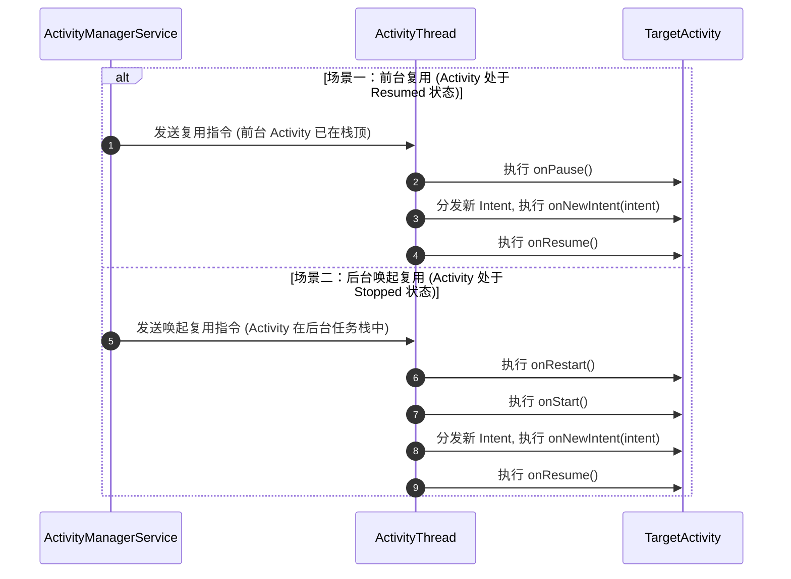

# 5.1.2.1.3 onNewIntent

## 一、 导言：Activity 实例复用与数据分发枢纽

在 Android 系统的应用架构中，Activity 作为最核心的用户交互组件，其生命周期管理和任务栈（Task）调度一直是 Framework 层的设计难点。默认情况下，每次通过调用 `startActivity(Intent)` 启动一个 Activity，系统都会在当前或指定任务栈中创建一个新的实例，并触发其完整的生命周期（从 `onCreate()` 到 `onResume()`）。这种设计适合线性的、无状态复用的导航流程。

然而，在实际的工业级应用开发中，无节制地创建 Activity 实例不仅会造成内存溢出（OOM）、主线程卡顿等性能瓶颈，还会破坏应用的导航逻辑。例如，应用的“首页（MainActivity）”通常需要作为全局唯一的入口，若用户在应用内多次导航回首页时，系统仍在不断往任务栈里堆叠新的 MainActivity 实例，不仅会导致用户按下返回键时需要经历无数次重复的首页才能退出应用，还会使得应用的内存占用呈线性增长。

为了解决这一问题，Android 引入了 **Activity 实例复用机制**。当系统检测到某个 Activity 的启动模式或启动标志位（Flags）符合复用条件，且对应的 Activity 实例已存在于系统任务栈中时，系统便不会创建新的实例，而是直接将该已存在的实例唤起并带到前台。在这项复用技术中，最核心的数据通道便是 `onNewIntent(Intent intent)` 生命周期回调方法。

`onNewIntent(Intent intent)` 是 Android Framework 用于向已被复用的 Activity 传递新 Intent 数据的专用钩子。它是连接“实例复用”与“动态参数传递”的底层纽带。只有深入理解 `onNewIntent(intent)` 的触发时机、生命周期执行顺序、底层状态机交互以及 `setIntent(intent)` 的物理意义，开发者才能在 Notification 消息路由、微信/支付宝支付回调处理等复杂实战场景中，编写出健壮、高级且无内存泄漏或逻辑死循环的代码。

---

## 二、 触发时机与生命周期流转深度拆解

AMS（ActivityManagerService）在处理启动 Activity 的请求时，需要经历复杂的 `ActivityStarter` 决策流程。要让一个已存在的 Activity 实例触发 `onNewIntent()`，必须满足特定的**静态声明（Launch Mode）**或**动态修饰（Flags）**条件。

### 2.1 四大启动模式下的复用触发条件
在 `AndroidManifest.xml` 中，我们可以通过 `android:launchMode` 属性静态声明 Activity 的启动模式。除了 standard 模式外，其余三种模式在特定条件下均会触发 `onNewIntent()`。

1. **standard（标准模式）**：
   这是系统默认的启动模式。通常情况下，每次启动 standard 模式的 Activity 都会直接创建新实例，**不会**触发 `onNewIntent()`。
   * **特例**：若启动该 Activity 的 Intent 携带了 `Intent.FLAG_ACTIVITY_SINGLE_TOP` 标记，且当前该 Activity 实例恰好处在任务栈的栈顶，此时系统会复用该实例，从而触发其 `onNewIntent()`。
2. **singleTop（栈顶复用模式）**：
   * **触发条件**：如果期望启动的目标 Activity 实例已经存在，且**恰好处于其所属任务栈的栈顶位置**。
   * **行为**：系统不会创建新实例，而是复用该栈顶实例，同时触发 `onNewIntent()`。
   * **反例**：如果目标 Activity 已经存在，但不在栈顶（例如栈结构为 A -> B，再次启动 A），系统依然会创建 A 的新实例并压入栈顶，此时**不会**触发旧 A 实例的 `onNewIntent()`。
3. **singleTask（栈内复用模式）**：
   * **触发条件**：只要期望启动的目标 Activity 实例已经在任务栈中存在，无论它当前是否处于栈顶。
   * **行为**：系统会将其所属的任务栈调往屏幕前台。在默认情况下，系统会执行 **Clear Top（清除栈顶）** 行为，即把该 Activity 实例之上的所有其他 Activity 实例全部销毁（依次调用 `onPause() -> onStop() -> onDestroy()`），使目标 Activity 实例重新暴露在栈顶。此时，系统会复用该实例，并触发其 `onNewIntent()`。
4. **singleInstance（全局单例模式）**：
   * **触发条件**：该模式是 singleTask 的加强版。声明为 singleInstance 的 Activity 在首次创建时，系统会为其专门开辟一个独立的任务栈（Task），且该栈内有且仅有这一个 Activity 实例。
   * **行为**：当后续再次启动该 Activity 时，系统检测到其对应的独立任务栈及实例均已存在，就会直接将该任务栈整体切换到前台，复用该实例并触发其 `onNewIntent()`。

### 2.2 动态 Flags 触发复用原理
除了在清单文件中静态声明 `android:launchMode`，开发者还可以在代码中通过 `Intent.addFlags(int flags)` 动态改变 Activity 的复用行为。其中最关键的两个 Flag 是 `FLAG_ACTIVITY_SINGLE_TOP` 和 `FLAG_ACTIVITY_CLEAR_TOP`。

* **`Intent.FLAG_ACTIVITY_SINGLE_TOP`**：
  在代码中动态赋予此 Flag，其效果与在 Manifest 中声明 `android:launchMode="singleTop"` 完全等价。即当目标 Activity 在栈顶时复用并回调 `onNewIntent()`。
* **`Intent.FLAG_ACTIVITY_CLEAR_TOP`**：
  此 Flag 的复用逻辑与 `singleTask` 类似，但有一个极其重要的**默认陷阱**：
  * **陷阱原理**：如果**单独**使用 `FLAG_ACTIVITY_CLEAR_TOP` 启动一个已存在于栈中的 standard 模式 Activity，AMS 在执行清除动作时，会默认将目标 Activity 实例**连同其上的 Activity 一起销毁**，然后再重新创建一个全新的目标 Activity 实例。这意味着它会经历完整的销毁与新建流程（`onDestroy() -> onCreate()`），而**不会**触发 `onNewIntent()`。
  * **解决方案**：为了达到“清除栈顶并复用目标 Activity 实例”的效果，必须将该 Flag 与 `FLAG_ACTIVITY_SINGLE_TOP` 联合使用，即：
    ```java
    intent.addFlags(Intent.FLAG_ACTIVITY_CLEAR_TOP | Intent.FLAG_ACTIVITY_SINGLE_TOP);
    ```
    只有在这种组合下，AMS 才会保留栈内的目标 Activity 实例，将其置于栈顶，并成功回调 `onNewIntent()`。

### 2.3 状态机交互与生命周期时序
当 Activity 被复用时，系统底层的生命周期状态机会根据当前被复用实例所处的状态（前台展示中，还是后台挂起中），走两条截然不同的生命周期流转路径。

#### 路径 A：前台复用时序（Activity 处于 Resumed 状态）
这种情况常见于 Activity 处于栈顶且已在屏幕前台，用户由于某种交互（如点击了应用内某个横幅，或者点击了已处于前台的页面的某个按钮）再次调起自己。
* **生命周期顺序**：
  1. 当前 Activity 实例的 `onPause()` 被调用。
  2. 系统通过 Binder 通信将新 Intent 传递给 App 进程，并在主线程回调 `onNewIntent(Intent)`。
  3. 随后立即调用 `onResume()` 让 Activity 重新获得焦点。
* **时序链条**：`onPause()` ──> `onNewIntent(Intent)` ──> `onResume()`。
* **注意**：由于该实例从未离开过用户的视线（不需要重新测量和绘制整个 Window），因此系统**不会**触发 `onStop()` 和 `onStart()`。

#### 路径 B：后台唤起复用时序（Activity 处于 Stopped 状态）
这种情况常见于 Activity 已经处于后台任务栈（例如用户按 Home 键回到了桌面，或者当前 Activity 栈顶是其他 Activity），系统通过 PendingIntent（如点击 Notification）或者外部 Scheme 唤起将后台的实例重新拉到前台。
* **生命周期顺序**：
  1. 系统首先需要将包含该 Activity 的任务栈切换到前台，触发其从后台唤起流程：`onRestart()` ──> `onStart()`。
  2. 在 Activity 重新可见（Started）但尚未获得用户焦点（Resumed）的间隙，系统注入新 Intent，回调 `onNewIntent(Intent)`。
  3. 最后，调用 `onResume()`，Activity 进入前台可交互状态。
* **时序链条**：`onRestart()` ──> `onStart()` ──> `onNewIntent(Intent)` ──> `onResume()`。

### 2.4 Mermaid 状态机可视化



---

## 三、 Android Framework 层底层分发机制深度剖析

要彻底掌握 `onNewIntent` 的行为，仅仅了解生命周期的表层回调是远远不够的。我们必须深入到 Android 系统源码层级，探究 `AMS` 与应用进程的 `ActivityThread` 是如何协同完成新 Intent 分发与状态流转的。

### 3.1 AMS 端判定与查找复用实例的决策链
当有新 Intent 发起时，AMS 会调用 `ActivityStarter.java` 来启动或唤起 Activity。在其内部的核心决策链中，存在一个关键的查找复用实例的方法：

```java
// ActivityStarter.java 核心决策逻辑伪代码
private ActivityRecord getReusableIntentActivity() {
    // 1. 获取当前待启动 Activity 的 LaunchMode 和 Intent Flags
    int launchMode = mStartActivity.launchMode;
    int launchFlags = mLaunchFlags;
    
    // 2. 遍历任务栈，寻找是否存在 taskAffinity 匹配或 ComponentName 相同的旧实例
    ActivityRecord intentActivity = mRootWindowContainer.findActivity(mIntent, mStartActivity.info, ...);
    
    if (intentActivity != null) {
        // 3. 根据启动模式 and Flags 决定是否复用
        if (launchMode == LAUNCH_SINGLE_INSTANCE || launchMode == LAUNCH_SINGLE_TASK) {
            return intentActivity; // singleTask/singleInstance 必定复用
        } else if ((launchFlags & FLAG_ACTIVITY_SINGLE_TOP) != 0 && 
                   intentActivity == mTargetStack.topActivity()) {
            return intentActivity; // 栈顶且设置了 singleTop Flag，复用
        } else if (launchMode == LAUNCH_SINGLE_TOP && intentActivity == mTargetStack.topActivity()) {
            return intentActivity; // 声明了 singleTop 且在栈顶，复用
        }
    }
    return null; // 否则不复用，创建新实例
}
```

当 `getReusableIntentActivity()` 确定了可复用的 `ActivityRecord` 后，AMS 不会走常规的 `startActivityLocked` 创建进程或新建实例流程，而是调用 `deliverNewIntentLocked` 方法：

```java
// AMS 端将 Intent 投递给 ActivityRecord
private void deliverNewIntentLocked(ActivityRecord r, Intent intent) {
    // 1. 将新 Intent 包装为 ReferrerIntent 并放入 PendingNewIntent 队列
    r.addNewIntentLocked(new ReferrerIntent(intent, r.packageName));
    
    // 2. 如果 Activity 当前是可见的，立刻通过 ClientTransaction 将事件派发至应用端
    mAtmService.getLifecycleManager().scheduleTransaction(r.app.getThread(), 
            r.token, NewIntentItem.obtain(r.addQueueIntent));
}
```

#### AMS 传输 ReferrerIntent 机制与安全验证
值得注意的是，AMS 内部传递的不是普通的 `Intent`，而是 `ReferrerIntent`。
`ReferrerIntent` 对 `Intent` 进行了封装，并显式地持有了启动发起方应用的包名 `mReferrer`。
这在跨应用（Cross-App）调起（例如三方浏览器通过 Scheme 唤起应用）时非常关键。在客户端，我们可以通过 Activity 的 `getReferrer()` 方法获取拉起我们的应用包名：
```java
public Uri getReferrer() {
    // 内部通过 ActivityClient 拿到 AMS 记录的 mReferrer 来源信息
}
```
`getReferrer()` 返回的数据是由 AMS 在事务执行时注入的。如果我们在 `onNewIntent(intent)` 中没有调用 `setIntent(intent)`，在后续流程中（比如 `onResume`）调用 `getReferrer()` 时，在部分 Android 系统版本上，可能会由于未能同步更新内部的 ActivityClient 记录，导致获取到的依然是最初启动者的包名，从而使跨应用来源安全校验失效。因此，显式调用 `setIntent(intent)` 也是保障跨应用来源安全审计的重要基础。

### 3.2 客户端应用进程端执行时序
应用进程收到 AMS 的事务调度后，会在主线程的 `ActivityThread.java` 中处理该事务。其核心执行路径如下：

1. `ActivityThread` 接收到 Binder 调用，将其转交给 `TransactionExecutor` 执行生命周期。
2. 如果目标 Activity 当前处于 `Resumed` 状态，为了安全地执行数据注入和状态切换，`TransactionExecutor` 会先调用 `Animate/Pause` 相关的事务项，使 Activity 临时进入 `Paused` 状态。
3. 接着，执行 `NewIntentItem` 事务项的 `execute()` 方法，最终触发 `ActivityThread.handleNewIntent`：

```java
// ActivityThread.java 核心逻辑
private void handleNewIntent(ActivityClientRecord r, List<ReferrerIntent> intents) {
    // 1. 获取目标 Activity 的实例
    Activity activity = r.activity;
    
    // 2. 遍历接收到的 intent 列表，依次触发客户端 Activity 的 deliverNewIntent
    for (int i = 0; i < intents.size(); i++) {
        ReferrerIntent intent = intents.get(i);
        deliverNewIntent(activity, intent);
    }
}

private void deliverNewIntent(Activity activity, ReferrerIntent intent) {
    // 最终调用到开发者重写的 onNewIntent 方法
    activity.performNewIntent(intent);
}
```

4. 执行完 `performNewIntent()` 后，`TransactionExecutor` 会继续派发 `ResumeActivityItem`，使 Activity 状态重新回切到 `Resumed`。
通过这一精密的设计，AMS 与 ActivityThread 确保了即使在高速多线程的交互中，`onNewIntent` 的执行也严格在主线程中按顺序完成，并且紧密嵌合在 Activity 状态机的流转闭环中。

---

## 四、 核心避坑点：setIntent(intent) 的物理意义与底层原理

在 `onNewIntent(Intent intent)` 中，最容易引发灾难性 Bug 的操作莫过于**遗漏调用 `setIntent(intent)`**。很多初学者甚至是资深 Android 开发者，如果不了解 Framework 底层对 Intent 的管理哲学，就会在这个问题上屡屡翻车。

### 4.1 默认 getIntent() 留存最初 Intent 的设计哲学
在 Activity 的生命周期中，我们经常使用 `getIntent()` 来获取启动该 Activity 时携带的 Extra 参数。那么，这个 `getIntent()` 返回的 Intent 到底是从哪里来的？

在 Activity 的底层实现中，每一个 Activity 实例都持有一个成员变量 `private Intent mIntent`。
* **冷启动时**：当 Activity 首次被创建并执行 `onCreate()` 时，系统会把最初用来启动该 Activity 的 Intent 赋值给这个 `mIntent` 成员变量。
* **复用启动时**：当 Activity 被复用且系统回调 `onNewIntent(Intent newIntent)` 时，传递进来的 `newIntent` 确实包含了最新的启动参数。但是，系统底层的 `mIntent` 成员变量**并不会自动更新**。

许多开发者会产生疑问：系统既然已经触发了 `onNewIntent(newIntent)`，为什么不顺便在底层帮我们自动把 `mIntent` 更新为 `newIntent`？

这实际上体现了 Android Framework 的**回溯设计哲学**：
系统保留原始的启动 Intent 是为了让应用随时能够追溯“该 Activity 是由于什么最初契机被初始化创建的”。最初的 Intent 包含了关键的“诞生元数据”，例如冷启动的入口来源（DeepLink、桌面图标启动、或是特定的外部应用拉起）。如果系统在复用时强行用最新的 Intent 覆盖掉它，开发者就彻底失去了获取原始冷启动上下文的能力。

因此，Android 设计者决定将“是否覆盖原始 Intent”的决策权完全交给开发者。如果你希望此后调用 `getIntent()` 能够获取到最新传入的参数，就必须在 `onNewIntent()` 中显式地调用 `setIntent(newIntent)`。

### 4.2 未调用 setIntent 导致的留存陷阱与典型 Bug
如果在 `onNewIntent()` 中没有显式调用 `setIntent(intent)`，那么在此之后的任何生命周期阶段（例如 `onResume()`）中调用 `getIntent()`，返回的依然是**最初冷启动时的 Intent**。这会带来以下两个致命问题：

1. **新数据丢失与旧数据覆盖 Bug**：
   以推送通知（Notification）传参为例。用户在桌面上冷启动了 App，此时 Activity 执行 `onCreate()`，其 `mIntent` 为空。
   随后，应用在后台收到一条推送通知，携带了 `message_id = "100"`，用户点击通知，MainActivity 触发复用，回调 `onNewIntent(newIntent)`。
   如果在 `onNewIntent` 中没有写 `setIntent(newIntent)`，那么当我们在接下来的 `onResume()` 中尝试通过 `getIntent().getStringExtra("message_id")` 获取参数时，取出的值将为 `null`（因为使用的是 `onCreate` 时的旧 Intent），导致页面无法跳转到指定的推送详情页。
2. **业务逻辑无限循环（数据重复处理）**：
   假设最初启动 Activity 的 Intent 携带了某个指令，例如 `action = "ACTION_SHOW_WELCOME_DIALOG"`。在 `onCreate()` 中，我们读取该 action 并弹出一个欢迎弹窗。
   之后，Activity 被置于后台。过了一段时间，用户通过其他方式（例如点击外部 Scheme）再次唤起 Activity 触发复用。在 `onNewIntent` 中我们未调用 `setIntent`。
   当 Activity 重新回到前台执行 `onResume()` 时，如果我们有在 `onResume()` 中读取 `getIntent().getAction()` 并执行弹窗的逻辑，系统拿到的依然是最初的 `ACTION_SHOW_WELCOME_DIALOG`，导致欢迎弹窗再次弹出。这种旧 Intent 留存陷阱在很多支付完成后的回调逻辑中，会导致界面反复弹出提示，严重破坏用户体验。

### 4.3 源码级解析：setIntent 到底做了什么
让我们看看 `Activity.java` 中的源码实现，它的逻辑出乎意料的简单：

```java
// Activity.java 源码片段
private Intent mIntent;

/**
 * Change the intent returned by {@link #getIntent}.  This holds a 
 * reference to the given intent; it does not copy it.  Often used in 
 * conjunction with {@link #onNewIntent}.
 * 
 * @param newIntent The new Intent to use.
 * 
 * @see #getIntent
 * @see #onNewIntent
 */
public void setIntent(Intent newIntent) {
    mIntent = newIntent;
}

public Intent getIntent() {
    return mIntent;
}
```
从源码中可以看出，`setIntent(Intent newIntent)` 就是将成员变量 `mIntent` 的引用替换为最新的 `newIntent`。它不进行深拷贝，只是简单的指针替换。
因此，如果我们没有在 `onNewIntent(intent)` 中写下：
```java
setIntent(intent);
```
那么调用 `getIntent()` 将永远指向最旧的那个 Intent 引用。

### 4.4 内存泄漏与 GC 视角下的 Intent 生命周期
从垃圾回收（GC）的视角来看，`setIntent` 同样扮演了关键角色。
* **内存持有逻辑**：旧的 Intent 实例作为 Java 对象，其内部持有了大量的额外数据（通过 `Bundle` 持有的自定义 Serializable / Parcelable 对象，甚至是 Bitmap、超大字符串列表）。
* **GC 链条**：当 Activity 始终被保存在后台任务栈（例如 MainActivity 常驻）时，如果系统多次触发复用并传入携带大容量数据的 `newIntent`，而在 `onNewIntent` 中始终不调用 `setIntent` 替换引用，那么这些历史传入的 `newIntent` 虽然在方法执行完后局部变量失效，但由于系统在底层 Binder 层或 Pending 列表中可能还保留有对它们的某些弱持有或残留，这可能不会立即泄漏。
* **关键点**：一旦我们在 `onNewIntent` 中将 `mIntent` 引用替换为 `newIntent`，旧的 `mIntent` 对象便失去了来自 `Activity` 的强引用持有链。在下一次系统执行 GC 时，旧的 Intent 及其内部的 Bundle 资源才能被彻底回收，这避免了冗余的大内存对象在 Java 堆内存中长期滞留，优化了常驻页面的内存抖动。

### 4.5 状态保存与恢复的差异（onSaveInstanceState 的缺失）
一个非常重要的概念差异在于：**Activity 复用触发 onNewIntent**，与 **Activity 因内存不足销毁重建（Recreation）**是完全不同的生命周期逻辑。

| 维度 | Activity 复用（onNewIntent） | 销毁重建（onRestoreInstanceState） |
| --- | --- | --- |
| **实例状态** | 实例始终存在，成员变量和内存状态得以完整保留 | 原实例被销毁，新创建实例，内存状态全部丢失 |
| **onSaveInstanceState** | **不触发**。因为 Activity 没有经历销毁流程 | **触发**。在销毁前系统保存 Activity 状态 Bundle |
| **数据恢复依据** | 依靠最新传入的 `newIntent` 刷新数据 | 依靠 `savedInstanceState` Bundle 恢复原先的状态数据 |
| **onCreate 执行** | **不执行**。仅执行 `onNewIntent` 钩子 | **重新执行**。传入 `savedInstanceState` 非空 |

因此，开发者切忌将 `onNewIntent` 与 `onSaveInstanceState` 混为一谈。如果页面的核心数据需要在复用时重置（例如清空旧的筛选条件、重置列表滑动位置），必须在 `onNewIntent` 中手动编写这些重置代码，而不能指望系统会自动帮我们像重建一样进行清理。

### 4.6 onNewIntent 与配置变更重建的“化学反应”
当 Activity 被复用的同时，如果发生了屏幕旋转、系统语言切换、折叠屏展开等系统配置变更（Configuration Changes），时序将变得极度复杂。
假如 MainActivity 声明为 `singleTask` 模式，且**没有**在 Manifest 中配置 `android:configChanges` 属性：
1. **唤起与数据注入**：用户在后台状态下通过 Notification 点击唤起 MainActivity，此时由于屏幕方向已经改变，系统会执行唤起并触发该实例的 `onNewIntent(newIntent)`。
2. **被迫销毁重建**：在 `onNewIntent` 执行完成后，系统检测到当前物理配置已发生变化，且 Activity 声明自己无法自主处理配置变更。于是，系统会立刻启动配置重建流程，将当前的 MainActivity 实例销毁（`onPause() -> onStop() -> onDestroy()`），并重新创建一个全新的实例（`onCreate()`）。
3. **数据传递陷阱**：在重建新实例时，系统会从旧实例中读取 `mIntent` 字段，并作为新实例的 `getIntent()` 返回源。
   * **正确情况**：如果我们在 `onNewIntent` 中显式调用了 `setIntent(newIntent)`，那么旧实例的 `mIntent` 已经被更新为最新数据。新实例在 `onCreate()` 中通过 `getIntent()` 就能正确拿到最新数据并处理。
   * **Bug 情况**：如果我们漏掉了 `setIntent(newIntent)`，旧实例被销毁前其内部的 `mIntent` 依然是冷启动的数据。重建后的新实例在 `onCreate()` 中拿到的将是旧数据，导致 Notification 传递的最新消息数据在配置重建中彻底丢失。

这是一个极具隐蔽性、只有在“复用 + 配置改变”同时发生时才会触发的黄金 Debug 案例，充分证明了 `setIntent(intent)` 的不可或缺性。

---

## 五、 任务栈与 TaskAffinity 的高级交互边界

Activity 复用的底层判定，除了 LaunchMode 之外，还有一个容易被忽视的隐式力量——`taskAffinity`。

### 5.1 taskAffinity 对 singleTask / singleInstance 的复用判定影响
`taskAffinity`（任务相关性）用于指定 Activity 倾向于加入哪一个任务栈。默认情况下，应用内的所有 Activity 都拥有相同的 taskAffinity（默认为应用的包名）。

当一个 Activity 声明为 `singleTask`，且设置了不同的 `taskAffinity` 时：
1. **寻找匹配栈**：当再次启动此 Activity 时，AMS 不仅会在当前的默认任务栈中寻找实例，而是会首先寻找是否存在一个名字与该 Activity 的 `taskAffinity` 匹配的任务栈。
2. **跨栈复用**：如果该匹配的任务栈存在，且该 Activity 实例恰好在该栈内，AMS 会将整个匹配的任务栈从后台整体带到前台，置于当前栈之上，并回调该实例的 `onNewIntent()`。
3. **陷阱**：如果开发者错误地将多个不同功能的 `singleTask` Activity 绑定了不同的 `taskAffinity`，在多任务切换时，可能会导致 `onNewIntent()` 被触发的时机非常混乱（例如从另一个任务栈强行切回，打乱了用户原本的返回导航链）。因此，除非有明确的多窗口、大屏分栏需求，否则应尽量保持默认的 `taskAffinity`。

### 5.2 跨应用（Cross-App）调起时的 onNewIntent 安全约束
当应用内的组件被外部其他应用（如第三方浏览器、社交应用）调起时，如果该组件配置了 `launchMode="singleTask"`且 `android:exported="true"`，就会面临安全挑战。

根据 [AndroidVersionChangeLog.md](../../../../../AndroidVersionChangeLog.md#android-12api-31) 的规范，自 Android 12（API 31）起，任何包含 `intent-filter` 的组件必须显式声明 `android:exported` 属性。
* **安全风险**：如果外部应用通过恶意伪造的 Intent 调起我们的 `singleTask` 页面，由于它会被复用，恶意数据会直接注入到我们常驻页面的 `onNewIntent(intent)` 中。
* **防御性编程**：在 `onNewIntent` 中解析参数时，必须进行严苛的输入验证。例如校验 `Referrer`（启动来源包名），以及对传入的 URI、Extra 字段进行非空校验和类型安全验证，防止应用因畸形数据发生 Crash 或被注入攻击。

---

## 六、 工业级实战应用场景与架构设计

### 6.1 场景一：Notification 挂载 PendingIntent 触发 MainActivity 复用时的传参处理
在推送通知的开发中，我们通常会在 Notification 中挂载一个 `PendingIntent`，当用户点击通知栏时，由系统代理启动或唤起应用的 `MainActivity`。通常，为了避免首页重复创建，`MainActivity` 在 `AndroidManifest.xml` 中会被配置为 `singleTask` 模式。

#### 1. Android 12 (API 31) 强制可变性适配
自 Android 12 起，为了提升应用的安全性，所有创建的 `PendingIntent` 必须显式声明其可变性标志位：`PendingIntent.FLAG_IMMUTABLE` 或 `PendingIntent.FLAG_MUTABLE`。
* **安全性约束说明**：如果你的 `PendingIntent` 不需要被外部（如系统的 NotificationManager）修改其内部的 Intent 额外参数，你应该一律使用 `FLAG_IMMUTABLE`。对于通知栏拉起 App 来说，数据是在我们 App 内部构建 `PendingIntent` 时就已经确定的，因此应默认声明为 `FLAG_IMMUTABLE`，防止被恶意劫持或篡改。关于 Android 12 版本的完整变更说明，请参见根目录下的 [AndroidVersionChangeLog.md](../../../../../AndroidVersionChangeLog.md#android-12api-31)。

#### 2. 健壮的代码实现

```java
public class NotificationHelper {

    public static void showNotification(Context context, String title, String content, String targetMessageId) {
        NotificationManager manager = (NotificationManager) context.getSystemService(Context.NOTIFICATION_SERVICE);
        String channelId = "message_channel";
        
        // 创建通知渠道 (Android 8.0+ 适配，可参考 AndroidVersionChangeLog.md)
        if (Build.VERSION.SDK_INT >= Build.VERSION_CODES.O) {
            NotificationChannel channel = new NotificationChannel(channelId, "消息通知", NotificationManager.IMPORTANCE_DEFAULT);
            manager.createNotificationChannel(channel);
        }

        // 构建启动 MainActivity 的 Intent
        Intent intent = new Intent(context, MainActivity.class);
        intent.putExtra("message_id", targetMessageId);
        // 使用 FLAG_ACTIVITY_CLEAR_TOP | FLAG_ACTIVITY_SINGLE_TOP 确保复用
        intent.addFlags(Intent.FLAG_ACTIVITY_CLEAR_TOP | Intent.FLAG_ACTIVITY_SINGLE_TOP);

        // 适配 Android 12 强制可变性标志位
        int pendingFlags;
        if (Build.VERSION.SDK_INT >= Build.VERSION_CODES.M) {
            pendingFlags = PendingIntent.FLAG_UPDATE_CURRENT | PendingIntent.FLAG_IMMUTABLE;
        } else {
            pendingFlags = PendingIntent.FLAG_UPDATE_CURRENT;
        }

        PendingIntent pendingIntent = PendingIntent.getActivity(context, 0, intent, pendingFlags);

        NotificationCompat.Builder builder = new NotificationCompat.Builder(context, channelId)
                .setSmallIcon(R.drawable.ic_notification)
                .setContentTitle(title)
                .setContentText(content)
                .setContentIntent(pendingIntent)
                .setAutoCancel(true);

        manager.notify((int) System.currentTimeMillis(), builder.build());
    }
}
```

在 `MainActivity` 中，我们需要做双重解析防御：
```java
public class MainActivity extends AppCompatActivity {

    @Override
    protected void onCreate(Bundle savedInstanceState) {
        super.onCreate(savedInstanceState);
        setContentView(R.layout.activity_main);
        
        // 1. 解析冷启动传入的数据
        parseNotificationData(getIntent());
    }

    @Override
    protected void onNewIntent(Intent intent) {
        super.onNewIntent(intent);
        // 2. 更新 Intent 引用
        setIntent(intent);
        // 3. 解析热唤起传入的数据
        parseNotificationData(intent);
    }

    private void parseNotificationData(Intent intent) {
        if (intent == null) return;
        if (intent.hasExtra("message_id")) {
            String messageId = intent.getStringExtra("message_id");
            // 根据消息 ID 导航至详情页面或弹出弹窗
            navigateToDetail(messageId);
            
            // 重要：处理完毕后清除该 Extra，防止在接下来的 onResume 中因 getIntent() 的留存再次触发本逻辑
            intent.removeExtra("message_id");
        }
    }
    
    private void navigateToDetail(String messageId) {
        // 跳转详情页逻辑
    }
}
```

### 6.2 场景二：三方 SDK 回调路由分发设计（微信/支付宝支付回调）
在集成微信支付、QQ 分享等第三方 SDK 时，SDK 要求我们在特定包名目录下创建对应的回调 Activity，如微信支付的 `WXPayEntryActivity`。

#### 1. 痛点分析与架构考量
微信在支付或分享结束后，会通过外部唤起的方式调起 `WXPayEntryActivity`，并携带回调结果（如成功、失败、用户取消）。
如果将该 Activity 声明为 standard 启动模式，一旦用户多次发起支付并中途退出，会导致应用中堆叠数个透明的回调 Activity，使得 Activity 任务栈杂乱无章，并且在支付完成后返回我们的真正支付发起页面时，用户可能会看到短暂的“白屏”或“闪烁”。

#### 2. 基于 singleTask 且利用 onNewIntent 的透明分发器设计
行业标准的优雅做法是：将 `WXPayEntryActivity` 设计为一个**无界面、透明且单例**的“回调分发器”。它只负责接收微信的回调数据，通过总线（如 LiveDataBus / RxBus）通知发起支付的业务界面更新 UI，然后**立刻 finish 掉自己**。

##### 架构设计原理：
1. 支付页面 A 调起微信客户端。
2. 用户在微信中支付完成。
3. 微信调起 `WXPayEntryActivity` (其 `launchMode` 为 `singleTask`)。
4. `WXPayEntryActivity` 执行 `onCreate()` -> `handleIntent()` 提取结果。
5. 若微信在特殊情况下多次回调，后续请求会进入已存在实例的 `onNewIntent()` -> `handleIntent()`。
6. `WXPayEntryActivity` 将回调结果广播给支付页面 A，并自我销毁 `finish()`。用户在视觉上完全感知不到此 Activity 的存在。

#### 3. 回调分发器核心代码实现

在 `AndroidManifest.xml` 中配置：
```xml
<!-- 必须声明为 singleTask 且 exported 为 true，允许微信外部调起 -->
<activity
    android:name=".wxapi.WXPayEntryActivity"
    android:exported="true"
    android:launchMode="singleTask"
    android:theme="@android:style/Theme.Translucent.NoTitleBar" />
```

in `WXPayEntryActivity.java` 中的实现：
```java
public class WXPayEntryActivity extends AppCompatActivity implements IWXAPIEventHandler {

    private IWXAPI api;

    @Override
    protected void onCreate(Bundle savedInstanceState) {
        super.onCreate(savedInstanceState);
        // 保持透明，无布局展示
        api = WXAPIFactory.createWXAPI(this, Constants.WX_APP_ID);
        api.handleIntent(getIntent(), this);
    }

    @Override
    protected void onNewIntent(Intent intent) {
        super.onNewIntent(intent);
        // 更新并分发新 Intent 数据
        setIntent(intent);
        api.handleIntent(intent, this);
    }

    @Override
    public void onReq(BaseReq req) {
        // 微信请求应用的回调，此处通常可不处理
    }

    @Override
    public void onResp(BaseResp resp) {
        if (resp.getType() == ConstantsAPI.COMMAND_PAY_BY_WX) {
            // 1. 处理支付结果分发
            int errCode = resp.errCode;
            PayResultEvent event = new PayResultEvent(errCode);
            
            // 使用事件总线（此处以 LiveDataBus 为例）向业务支付页面发送结果
            LiveDataBus.get().with("pay_result").postValue(event);
            
            // 2. 核心：处理完回调后必须立刻 finish，绝不在任务栈中残留此透明 Activity
            finish();
        }
    }
}
```

### 6.3 场景三：DeepLink 外部唤起路由的分发与防抖设计
在许多运营场景中，用户点击短信、邮件或 H5 网页中的链接，会通过系统 Scheme 调起我们的应用。我们同样需要将其配置为 `singleTask` 模式以防重复堆叠，并在 `onNewIntent` 中解析 URL 并路由到具体的页面。

#### 1. 多次触发导致的重复路由与防抖方案
由于 H5 页面中可能存在用户多次点击，或系统判定机制的异常，可能导致短时间内 `onNewIntent(intent)` 被连续回调，传入相同的 DeepLink 路由数据，这会在应用内打开多个重复的详情页。
为了防御该问题，我们需要设计一个**基于时间戳和参数对比的去重路由分发器**。

#### 2. 防抖路由器的核心实现

```java
public class SchemeActivity extends AppCompatActivity {

    private static final long ROUTE_DEBOUNCE_TIME = 800; // 防抖时间间隔（毫秒）
    private long lastRouteTime = 0;
    private String lastRouteUrl = "";

    @Override
    protected void onCreate(Bundle savedInstanceState) {
        super.onCreate(savedInstanceState);
        handleDeepLink(getIntent());
    }

    @Override
    protected void onNewIntent(Intent intent) {
        super.onNewIntent(intent);
        setIntent(intent);
        handleDeepLink(intent);
    }

    private void handleDeepLink(Intent intent) {
        if (intent == null) return;
        Uri uri = intent.getData();
        if (uri == null) return;

        String currentUrl = uri.toString();
        long currentTime = System.currentTimeMillis();

        // 执行防抖验证：相同 URL 且两次唤起时间差小于阈值，则判定为重复点击，予以拦截
        if (currentUrl.equals(lastRouteUrl) && (currentTime - lastRouteTime < ROUTE_DEBOUNCE_TIME)) {
            Log.w("SchemeActivity", "Blocked duplicated route: " + currentUrl);
            return;
        }

        // 更新防抖判定状态
        lastRouteTime = currentTime;
        lastRouteUrl = currentUrl;

        // 执行真正的路由分发逻辑
        dispatchRoute(uri);
    }

    private void dispatchRoute(Uri uri) {
        // 根据 Scheme 解析路径并调起具体的子 Activity，最后视需求 finish 自身
        String path = uri.getPath();
        Log.d("SchemeActivity", "Dispatching route to path: " + path);
        // 路由分发器代码...
    }
}
```
通过在 `onNewIntent` 中嵌入防抖拦截器，我们以极低的开发成本，从底层彻底消除了 DeepLink 多次唤起导致的页面堆叠和性能损耗问题。
