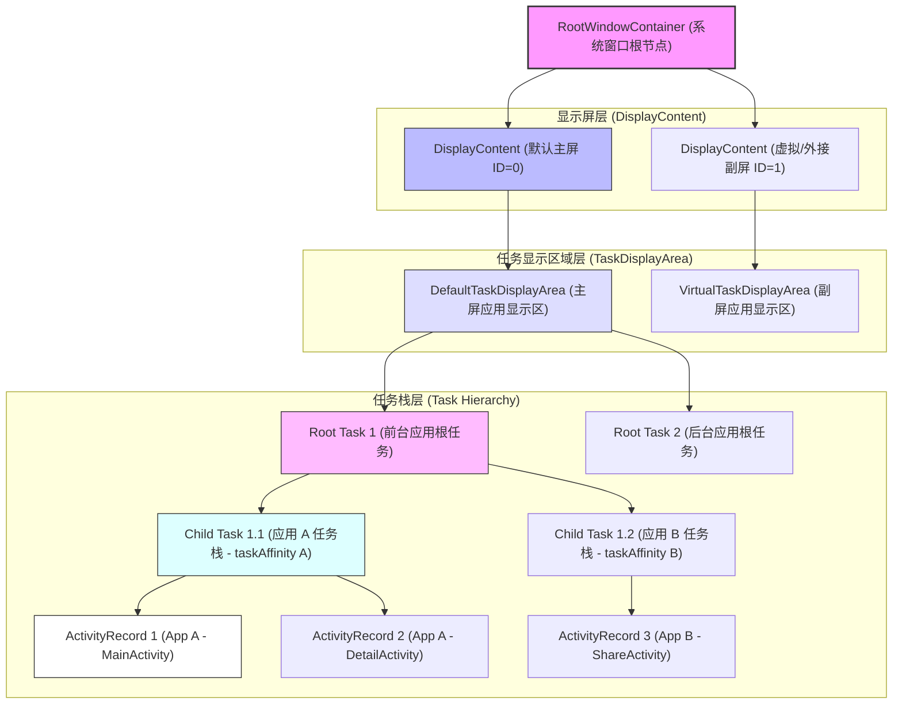
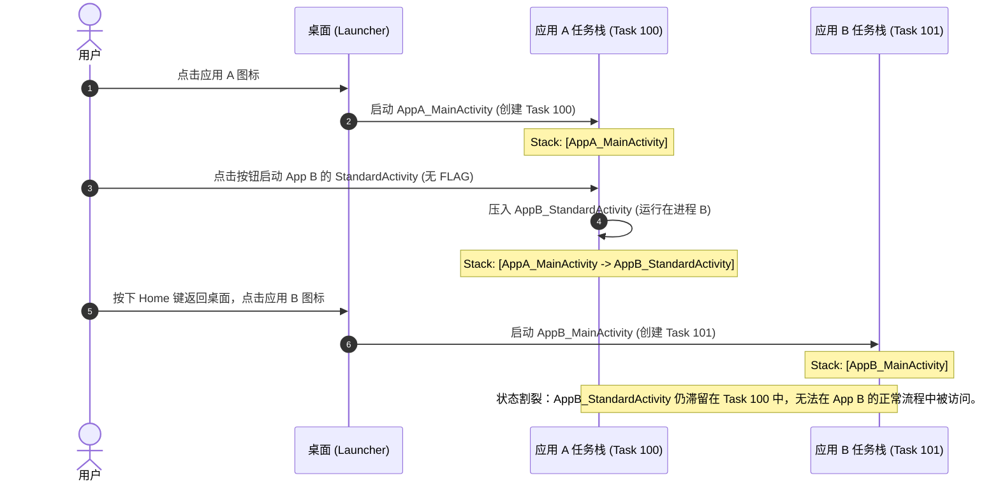

# 5.1.2.1.4 任务栈

在 Android 系统的多任务体系中，**任务栈（Task）** 是实现多任务调度与提供“后退导航”用户体验的核心物理与逻辑容器。对于用户而言，任务栈表现为“最近任务列表”中的一个独立卡片，代表了一项完整的、可供交互的“工作”（如撰写一封邮件、浏览商品或编辑图片）。对于系统底层的 **ActivityTaskManagerService (ATMS)** 而言，任务栈则是一个复杂的层级容器，它不仅承载着 Activity 的运行实例，还决定了窗口的层级关系（Z-Order）、可见性状态以及复杂的跨应用组件流转逻辑。

理解任务栈的内部架构、窗口级调度机制以及多任务调度逻辑，是开发高品质 Android 应用、适配折叠屏与大屏设备、处理跨应用交互安全性的基石。本文将从 ATMS 物理架构、多窗口调度、Recents 列表控制以及跨应用任务栈流转四个维度，系统性地解构 Android 任务栈的工作原理。

---

## 1. ATMS 任务栈体系三层架构

Android 系统经历了长期的架构演进，其窗口与组件管理的底层设计在 **Android 10** 和 **Android 11** 中迎来了重大的重构（版本变更细节请参考 [AndroidVersionChangeLog.md](../../../../../AndroidVersionChangeLog.md)）。在此之前，Activity 的管理与窗口的管理分别由 `ActivityManagerService (AMS)` 和 `WindowManagerService (WMS)` 各自维护一套并行的树状结构，容易导致状态同步延迟与死锁。在重构后，两套结构得到了深度统一，形成了以 `WindowContainer` 为基类的统一层级拓扑树。

### 1.1 核心实体层级拓扑

在 ATMS 的内存模型中，任务栈体系的核心结构由以下三个关键实体构成，它们从上到下构成了清晰的包含关系：

1. **TaskDisplayArea (TDA / 任务显示区域)**
   - **定义**：`TaskDisplayArea` 代表屏幕（Display）上专门用于显示应用任务栈的特定窗口区域。
   - **作用**：一个 `DisplayContent`（代表物理或虚拟显示屏）可以包含多个 `TaskDisplayArea`。系统通过 TDA 将系统级窗口（如状态栏、导航栏、锁屏界面）与普通应用窗口进行物理隔离。它是所有应用 Task 的父容器，决定了应用窗口的显示边界与默认配置信息。
2. **Task (任务 / 对应旧版本的 ActivityStack 与 TaskRecord)**
   - **定义**：在 Android 11 统一架构后，`Task` 兼具了“任务栈容器（Stack）”与“单个任务（TaskRecord）”的双重身份。
   - **作用**：在底层代码中，`Task` 可以嵌套 `Task`。
     - **Root Task（根任务，对应原 ActivityStack）**：直接挂载在 `TaskDisplayArea` 下，代表一个独立的管理栈（如 Home 任务栈、App 任务栈、分屏任务栈）。
     - **Child Task（子任务，对应原 TaskRecord）**：嵌套在 Root Task 内部，对应用户在“最近任务”中看到的一个个独立应用卡片。
     - `Task` 负责维护其内部所有 Activity 的逻辑顺序、配置传递（Configuration）以及边界大小（Bounds）。
3. **ActivityRecord (Activity 实例宿主 / 对应旧版本的 AppWindowToken)**
   - **定义**：`ActivityRecord` 是系统用来追踪单个 Activity 实例状态、生命周期和配置的最小逻辑单元。
   - **作用**：每一个在应用层创建的 `Activity`，在系统服务中都唯一对应一个 `ActivityRecord`。它不仅记录了该 Activity 的启动 Intent、所属进程（`WindowProcessController`）、当前生命周期状态，还通过继承 `WindowContainer`，直接充当了 WMS 中的窗口 Token，管理着与之关联的 `WindowState`（代表具体的窗口界面和渲染图层）。

### 1.2 架构的历史演进与整合

在 **Android 10 之前**，AMS 与 WMS 的双重树状结构使得状态维护极为痛苦。例如，当 AMS 决定销毁一个 Task 时，它必须通过 IPC 异步通知 WMS 移除对应的 `TaskStack` 和 `AppWindowToken`，如果在通信期间发生用户快速点击或配置改变，极易产生状态不同步的 Bug。

- **Android 10 的改进**：将 WMS 的 `AppWindowToken` 合并进 ATMS 的 `ActivityRecord`。AMS 拆分出 ATMS，使得组件生命周期与任务管理独立出来。
- **Android 11 的大一统**：彻底重构了层级树。取消了 `ActivityStack` 和 `TaskRecord` 两个独立类，将其合并为统一的 `Task` 类。原 `ActivityStackSupervisor` 的职责被并入 `RootWindowContainer`。
- **Android 12/12L 引入的 ActivityEmbedding**：支持在同一个 Task 内部，将两个不同的 Activity 并在同一个屏幕上左右排列显示（通常用于折叠屏和大屏设备，版本变更细节请参考 [AndroidVersionChangeLog.md](../../../../../AndroidVersionChangeLog.md)）。

---

## 2. 多任务与多窗口（Multi-Window）机制

随着大屏设备和折叠屏手机的普及，Android 系统早已不再是单任务单窗口的操作系统。分屏模式（Split-Screen）、画中画模式（Picture-in-Picture, PIP）以及自由窗口模式（Freeform）成为了系统的核心功能。

### 2.1 多窗口模式下的 Task 调度

在多窗口模式下，屏幕上会同时存在多个可见的 Task。ATMS 通过动态调整 Task 的层级（Z-Order）和位置（Bounds）来实现这一调度：

1. **分屏模式（Split-Screen）**
   - 系统会在 `TaskDisplayArea` 下动态创建特殊的 Root Task，用于承载分屏的两个部分（例如，主屏部分和副屏部分）。
   - 用户可以通过拖动分屏分隔线来动态改变两个 Root Task 的 `Bounds`。
   - 在分屏状态下，这两个 Root Task 及其内部处于栈顶的 Child Task 均对用户可见。
2. **画中画模式（PIP）**
   - 当一个支持 PIP 的 Activity（通常是视频播放或导航应用）在用户按下 Home 键时，系统会将该 Activity 单独剥离出来，放入一个特殊的 PIP Root Task 中。
   - 该 Task 的 `Bounds` 被限制为一个浮动的小窗口，且其 Z-Order 被强制置于最顶层，从而保证其始终不会被其他 Task 覆盖。
3. **自由窗口模式（Freeform）**
   - 类似于桌面操作系统的窗口管理，每个 Task 都有自己独立的 `Bounds` 和 Z-Order，用户可以自由拖拽、缩放窗口。

### 2.2 可见性计算与生命周期调度

传统的单窗口模式下，只有处于最顶层（Z-Order 最高）的 Task 才是可见的，其余 Task 都会被完全遮挡。可见性计算（Visibility Calculation）由 `RootWindowContainer.ensureActivitiesVisible()` 统一驱动：

- **可见性计算算法核心逻辑**：
  1. 系统从最顶层的 `DisplayContent` 开始，按照从上往下的 Z-Order 顺序遍历所有的 `Task` 及其内部的 `ActivityRecord`。
  2. 遍历过程中，系统会累加当前已绘制的、完全不透明（Opaque）的窗口区域。
  3. 如果某个 `ActivityRecord` 被完全遮挡（即其上层已经存在一个占满屏幕且不透明的 Activity），则其可见性会被设为 `false`。
  4. 一旦 Activity 被设为不可见，系统会触发其 `onStop()` 生命周期的调用，并视内存情况决定是否回收其宿主进程。
- **多窗口模式下的差异**：
  - 在分屏或自由窗口模式下，位于顶层的 Task 并没有占满整个屏幕（其 `Bounds` 小于屏幕大小，或者它是半透明的）。
  - 因此，当遍历算法向下执行时，累加的不透明区域没有达到 100% 满屏。
  - 这使得位于其下方的分屏 Task 依然会被标记为 `visible = true`。
- **Multi-Resume（多重 Resume 机制）**：
  - **Android 9 及以下**：即使两个 Activity 在分屏模式下同时可见，也只有获得用户输入焦点的 Activity 处于 `RESUMED` 状态，另一个可见的 Activity 会处于 `PAUSED` 状态。这导致很多应用在进入分屏后由于触发了 `onPause()` 而停止播放视频或暂停刷新。
  - **Android 10 及以上**：系统支持了 **Multi-Resume** 机制（详细细节见 [AndroidVersionChangeLog.md](../../../../../AndroidVersionChangeLog.md)）。所有在屏幕上可见且位于各自 Task 顶部的 Activity 都将保持在 `RESUMED` 状态。
  - **Top Resumed Activity**：为了区分输入焦点，系统引入了“Top Resumed Activity”的概念。虽然有多个 Activity 同时处于 `RESUMED` 状态，但只有当前承载用户交互输入（如键盘、触摸事件）的那一个才是真正的 Top Resumed Activity。当焦点切换时，前一个 Top Resumed 会收到 `onTopResumedActivityChanged(false)` 回调，而新获取焦点的会收到 `onTopResumedActivityChanged(true)` 回调。

### 2.3 亲和性（taskAffinity）与多栈路由

在 Activity 启动过程中，ATMS 必须决定将其放入哪个 Task。这一过程被称为“路由”。而决定路由方向的最核心属性就是 `android:taskAffinity`。

- **taskAffinity 的定义**：
  - 代表 Activity 倾向于归属的 Task 名称。默认情况下，同一个应用中的所有 Activity 的亲和性都相同，等于该应用的包名（Package Name）。
  - 可以通过在 `AndroidManifest.xml` 中显式指定该属性，将其分配给不同的亲和性组。
- **启动路由的核心算法（以 FLAG_ACTIVITY_NEW_TASK 为核心说明）**：
  - 当启动一个 Activity 时，如果其携带了 `FLAG_ACTIVITY_NEW_TASK` 标志，或者其启动模式为 `singleTask` 或 `singleInstance`：
    1. ATMS 的 `ActivityStarter` 会首先读取目标 Activity 的 `taskAffinity`。
    2. 系统会遍历当前所有已存在的 Task（包括后台 Task），查找是否有任何一个 Task 的 `affinity` 与目标 Activity 的 `taskAffinity` 相匹配。
    3. **物理匹配成功**：如果找到了匹配的 Task，系统会将该 Task 整体移动 to 前台（Bring to Front）。如果目标 Activity 已经存在于该栈中，系统会根据其启动模式（如 `singleTask`）以及是否携带 `FLAG_ACTIVITY_CLEAR_TOP` 等标志，决定是复用它（调用 `onNewIntent` 并销毁其上的 Activity）还是在其上方创建新实例。
    4. **物理匹配失败**：如果没有找到匹配的 Task，系统将新创一个 `Task`，将该 Activity 作为根 Activity 压入其中，并将其 Z-Order 置于最顶层。
  - **关键约束条件**：如果启动 Activity 时**没有**携带 `FLAG_ACTIVITY_NEW_TASK` 标志，且其启动模式是 `standard` 或 `singleTop`，那么该 Activity 会直接压入**发起启动的那个源 Task** 中，哪怕它的 `taskAffinity` 与该 Task 完全不同。也就是说，此时 `taskAffinity` 属性是失效的。

---

## 3. 最近任务（Recents）与系统控制

最近任务列表（Recents List）是 Android 系统提供给用户在多个任务栈之间进行快速切换和管理的全局 UI 界面。应用可以通过清单文件中的各种属性，精细化地控制其任务栈在最近任务列表中的呈现方式以及在后台时的状态保留逻辑。

### 3.1 `android:excludeFromRecents` 物理过滤机制

- **定义与作用**：这是一个布尔属性。当设置为 `true` 时，该 Activity 所在的整个 Task 将被排除在“最近任务列表”之外。
- **生效的物理条件（核心约束）**：
  - 该属性**只有设置在 Task 的根 Activity（Root Activity，即创建该任务栈的第一个 Activity）** 上时才会生效。
  - 如果设置在一个非根 Activity 上，当该 Activity 处于栈顶时，用户按下 Home 键，整个 Task 依然会显示在最近任务列表中。因为最近任务列表的管理是以 **Task** 为基本物理单位的，系统在构建 Recents 列表时，只会读取每个 Task 的 Root Activity 的配置信息。

### 3.2 后台状态保留与清理属性

当一个 Task 进入后台（例如用户按下 Home 键或切换到其他应用），它会长期滞留在内存中。为了平衡系统资源和用户体验，Android 提供了几个关键属性来控制其在重新返回前台时的行为：

#### 3.2.1 `android:alwaysRetainTaskState`

- **默认行为**：在默认情况下，如果一个 Task 长期处于后台，系统为了防止应用状态异常或出于资源优化考虑，在一段时间（通常为 30 分钟）后，会自动清理该任务栈中除了根 Activity 之外的所有其他 Activity。当用户重新从桌面点击图标进入该应用时，他们会发现应用重新回到了主页面（根 Activity），之前的子页面和输入状态全部丢失。
- **生效条件与行为**：如果在 **根 Activity** 上将 `alwaysRetainTaskState` 设置为 `true`，系统将**永远不会**对该任务栈进行自动清理。无论过了多久，只要该 Task 的进程没有被系统因低内存杀掉（LMK），用户重新返回时都会看到完全保留的原样栈结构和页面状态。

#### 3.2.2 `android:clearOnBackground`

- **定义与行为**：与 `alwaysRetainTaskState` 完全相反。当此属性在 **根 Activity** 上设置为 `true` 时，只要该 Task 进入后台（即使只有 1 秒钟），系统就会立即销毁该任务栈中除了根 Activity 之外的所有其他 Activity。
- **使用场景**：适用于对时效性和安全性要求极高的应用。例如金融支付类应用的确认页面，一旦用户切出应用，重新进入时必须强制返回到主页，避免由于后台残留页面导致误操作或敏感信息泄露。

#### 3.2.3 属性行为对比汇总

| 属性名称 | 设置位置 | 触发时机 | 具体清除/保留行为 | 典型应用场景 |
| :--- | :--- | :--- | :--- | :--- |
| `android:alwaysRetainTaskState="true"` | 仅根 Activity 生效 | 任务栈长期处于后台（通常 >30分钟） | 强行阻止系统对栈内子 Activity 的自动清理，完全保留整栈状态。 | 文本编辑器、多步骤表单填写应用。 |
| `android:clearOnBackground="true"` | 仅根 Activity 生效 | 任务栈切入后台的瞬间 | 立即销毁根 Activity 以上的所有子 Activity，只保留根 Activity。 | 银行、支付、安全验证类应用。 |
| `android:finishOnTaskLaunch="true"` | 任意 Activity 均生效 | 用户重新从主屏幕/最近任务启动该 Task 时 | 仅将**被设置了该属性的特定 Activity** 销毁，对栈内其他 Activity 无直接影响。 | 临时的广告展示页、一次性活动弹窗页。 |

---

## 4. 跨应用启动时的任务栈漂移

在 Android 系统的开放式生态中，跨应用（Cross-App）调用是非常高频的场景。例如：在微信（应用 A）中点击一个链接，调用系统浏览器（应用 B）打开；或者在社交应用中调用系统相册选择照片。在这些场景中，Activity 会在物理任务栈之间发生复杂的“漂移”和“流转”。

### 4.1 跨应用启动 Standard Activity 的压栈逻辑

这是一个在开发者面试中极为常见，且在实际开发中极易引发逻辑 Bug 的经典场景：
- **场景描述**：应用 A（进程 A，拥有 Task 100）通过显式或隐式 Intent 启动了应用 B 的 `StandardActivity`。该 `StandardActivity` 在清单文件中的启动模式为默认的 `standard`，且启动时**没有**添加任何 Intent Flag（如 `FLAG_ACTIVITY_NEW_TASK`）。
- **物理压栈结果**：
  - 目标 `StandardActivity` 会被**直接压入应用 A 的 Task 100 栈顶**。
  - 此时，Task 100 的物理结构变为：`[应用 A MainActivity] -> [应用 B StandardActivity]`。
- **进程状态**：
  - 尽管 `StandardActivity` 运行在应用 A 的任务栈中，但由于它属于应用 B，系统会为它创建或复用**应用 B 的进程**来承载其代码的运行与内存分配。
  - 这客观上形成了一个**跨进程的任务栈（Cross-Process Task）**。
- **后退导航流转（Back Navigation）**：
  - 用户在 `StandardActivity` 页面点击物理返回键，系统会弹出该 Activity 并将其销毁，用户将直观地回到应用 A 的 `MainActivity`。这是符合用户直觉的“后退工作流”。
- **Launcher 启动行为的冲突（“漂移”隐患）**：
  - 此时，如果用户按下 Home 键返回桌面，然后点击应用 B 的桌面图标。
  - 系统会为应用 B 创建一个**全新的 Task 101**，并启动应用 B 的入口 Activity。
  - 此时，之前被应用 A 启动的那个 `StandardActivity` **依然留在 Task 100 中**，它与应用 B 新创 '../../../Task 101' 没有任何逻辑和物理关联。这往往不是应用 B 的开发者所期望的物理呈现，容易导致状态割裂。

### 4.2 allowTaskReparenting 任务重亲和性转移机制

为了解决上述跨应用启动导致的组件滞留与状态割裂问题，Android 设计了 **`allowTaskReparenting`（允许任务重定亲）** 机制。

#### 4.2.1 物理流转原理与步骤
- **基本定义**：`android:allowTaskReparenting` 是一个布尔属性（默认值为 `false`）。如果设置为 `true`，当一个与该 Activity 具有相同亲和性（`taskAffinity`）的 Task 被转移到前台时，该 Activity 可以从它启动时被压入的那个 Task，**物理迁移**到这个新进入前台的亲和性 Task 中。
- **详细流转实例**：
  1. **初始状态**：应用 A（Task 100）启动了应用 B 的 `ReparentActivity`（该 Activity 设置了 `allowTaskReparenting="true"`，且其 `taskAffinity` 默认为应用 B 的包名 `com.app.b`）。
  2. **临时压栈**：由于是标准启动，`ReparentActivity` 被压入应用 A 的 Task 100 栈顶。此时 Task 100 的内存结构：`[App A MainActivity] -> [App B ReparentActivity]`。
  3. **用户切出**：用户按下 Home 键，Task 100 进入后台。
  4. **触发重定亲**：用户在桌面上点击应用 B 的图标。
     - 系统为应用 B 创建新任务栈 Task 101（其亲和性为 `com.app.b`）。
     - 在将 Task 101 移动到前台并启动其入口 Activity 的过程中，ATMS 会调用 `RootWindowContainer.findTaskToMoveToFront()` 或相关逻辑，扫描系统中所有后台任务栈。
     - ATMS 发现 Task 100 中包含一个 `ActivityRecord`（即 `ReparentActivity`），其 `allowTaskReparenting` 为 `true`，且其 `taskAffinity`（`com.app.b`）与当前正要移到前台的 Task 101 的亲和性完全一致。
     - **物理迁移执行**：ATMS 内部触发 `Task.reparent()` 逻辑。它将 `ReparentActivity` 从 Task 100 中剥离（Remove），直接压入（Add）到新创的 Task 101 的栈顶。
  5. **最终呈现**：屏幕上最终展现出来的不是应用 B 的主页面，而是直接展现了被重新挂载的 `ReparentActivity`。如果用户此时在页面上点击返回键，由于它已经属于 Task 101，它会弹出销毁，露出 Task 101 下方的应用 B 主页面。而如果用户切换回应用 A，会发现 Task 100 中只剩下了 `App A MainActivity`。
- **迁移优势**：该过程不需要销毁并重新创建 `ReparentActivity` 实例，而是直接在底层通过修改 `WindowContainer` 树状节点的 Parent 指针来完成窗口层级的重新组织。这极大地节省了系统内存开销，并完美保留了用户在 `ReparentActivity` 中已经填写或浏览的状态数据。

#### 4.2.2 跨应用启动与安全限制演进

虽然任务栈的跨应用共享和漂移为多任务协作带来了极大的便利，但它也带来了重大的安全隐患，最著名的便是 **任务劫持漏洞（Task Hijacking / StrandHogg）**。
- **任务劫持原理**：恶意应用可以通过声明与受害应用相同的 `taskAffinity`，并合理设置启动标志，在受害应用启动时将其恶意的 Activity 强行压入受害应用的栈顶，从而欺骗用户输入密码或进行钓鱼攻击。
- **平台安全演进**（详情请对照 [AndroidVersionChangeLog.md](../../../../../AndroidVersionChangeLog.md)）：
  - **Android 10 (API 29)** 及以上，系统对后台启动 Activity（Background Activity Starts）实施了极其严格的限制。即使 `taskAffinity` 匹配，如果发起启动的进程处于后台，且没有获得特殊的 Binder Token（如 `PendingIntent` 授权），系统也会直接拒绝启动。
  - **Android 14 (API 34)** 进一步加强了对 `PendingIntent` 启动安全性的控制。在跨应用发送 Intent 时，必须明确指定 `ActivityOptions.setPendingIntentBackgroundActivityStartMode()`。默认情况下系统会阻止非特权后台应用的 Activity 漂移与注入行为，极大地收紧了跨应用任务流转的安全边界，使得不合规的 `allowTaskReparenting` 和后台跳转在最新系统上将被直接拦截。
