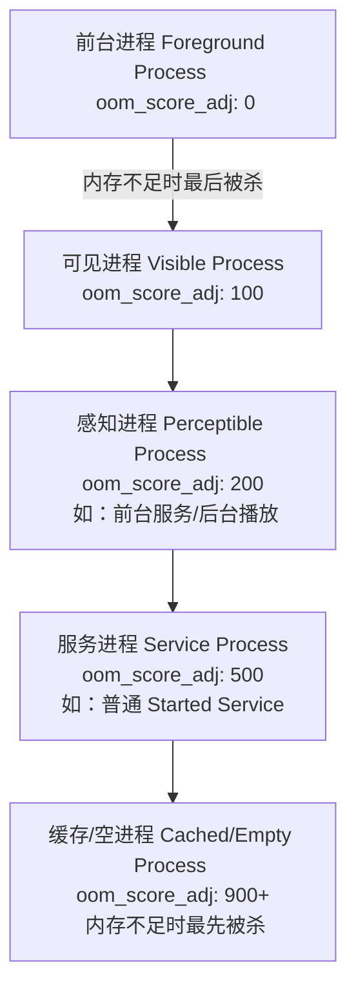
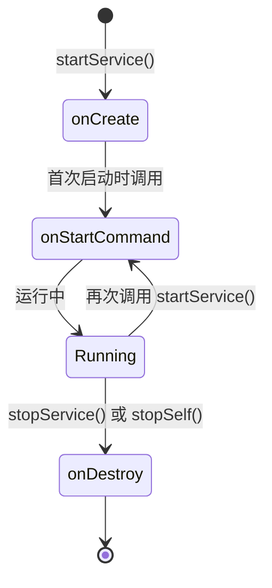
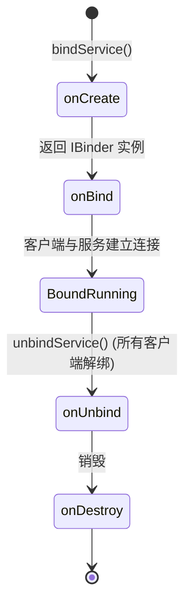
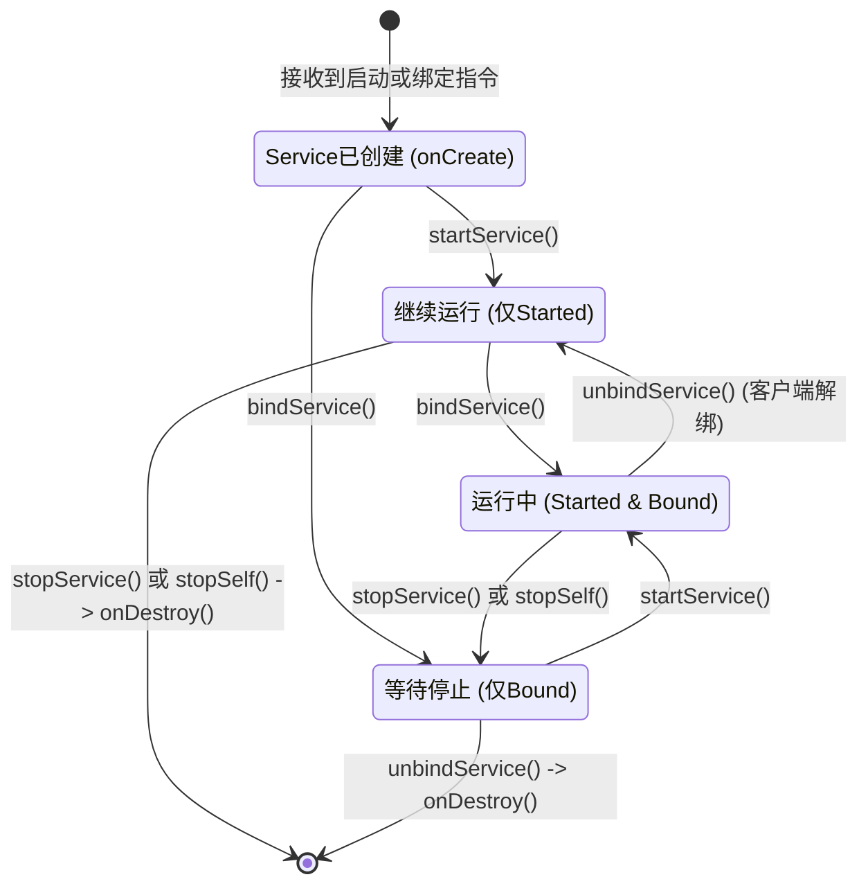

# 5.1.2.2.0 Service概述

在 Android 应用程序的体系结构中，Service（服务）是四大核心组件之一。作为后台逻辑的承载容器，它专为执行那些不需要与用户直接进行交互、且需要长期运行的任务而设计。理解 Service 的底层机理、设计取舍、生命周期管理以及各个 Android 历史版本中的后台限制，是构建健壮、省电且用户体验良好的 Android 应用的基石。

本篇文档将系统性地解构 Android Service，涵盖其核心定义、与普通线程的本质区别、进程优先级管理、两种基本运行模式的底层状态机流转、前后台服务的安全演进（特别是 Android 8.0 至 15.0 的限制），以及开发中常见的避坑指南与最佳实践。

---

## 一、 核心概念（是什么）

### 1.1 什么是 Service？
Service 是 Android 系统中用于在后台执行长期运行任务的组件。它的核心特征是**无界面（UI-less）**和**宿主依赖性**。
* **无界面**：Service 不提供任何用户界面。即使应用退到后台，或者用户切换到了其他应用，Service 依然可以在后台继续运行。
* **长期运行**：它适用于执行一些生命周期长于 Activity 的任务。例如，在后台播放音乐、执行大文件下载、同步本地数据库与云端数据、或者维持与服务器的长连接。

### 1.2 服务的核心设计定位
Service 在 Android Framework 中的设计初衷是**“逻辑的守护者”**，而非“并行的执行者”。它向系统声明：“我的应用正在执行一项重要的后台工作，请系统知晓，并在分配资源或回收内存时予以考虑。” 

需要明确的是，Service 并**没有**为其自动创建独立的线程。默认情况下，Service 及其所有生命周期回调都运行在宿主应用的**主线程（Main Thread/UI Thread）**中。如果服务需要执行阻塞性或计算密集型的任务，必须在服务内部手动创建子线程或使用协程，否则会直接导致主线程卡死，引发 ANR（Application Not Responding）。

---

## 二、 设计取舍（为什么）

在日常开发中，开发者常常会产生一个疑问：既然要在后台执行异步任务，我直接在 Activity 中启动一个 Java 线程（Thread）或者使用 Kotlin 协程（Coroutine），和使用 Service 有什么区别？为什么 Android 系统要专门设计 Service 组件？

这涉及到了 Android 系统对**进程生命周期管理（Process Lifecycle Management）**与**资源调度**的底层设计取舍。

### 2.1 Service 与 普通线程（Thread）的本质区别

| 维度 | 普通工作线程（Worker Thread） | Android Service 组件 |
| :--- | :--- | :--- |
| **系统感知度** | **无系统感知**。操作系统内核只视其为 CPU 调度单元，Android 框架层（AMS）无法感知该线程正在执行什么业务。 | **高系统感知**。ActivityManagerService (AMS) 显式记录了 Service 的生命周期与运行状态，并依此调整进程优先级。 |
| **进程生命周期关联** | 线程宿存于进程中，但线程的运行状态不会改变其所在进程的优先级。 | 服务的启动、绑定和前台化会直接影响其所在进程的 `oom_score_adj` 值。 |
| **生存概率 (抗杀能力)** | 当应用退到后台，进程变为空进程或缓存进程时，即使线程仍在运行，系统也会为了回收内存而直接杀掉该进程，线程随之消亡。 | 即使应用退到后台，只要 Service 处于运行状态，其所在的进程优先级就会维持在较高水平，极大地降低了被系统回收的概率。 |
| **跨组件通信** | 线程通常与启动它的 Activity 强绑定，其他组件（如另一个 Activity 或 BroadcastReceiver）很难安全地获取该线程的控制权。 | 具备标准的 Android 组件特征，支持通过 Intent 启动，也支持通过 Binder/AIDL 进行跨进程/跨组件的 RPC 通信。 |

### 2.2 进程优先级与 LMK（低内存杀手）机制
为了理解 Service 是如何保护后台任务不被杀死的，我们需要深入了解 Android 的进程优先级模型。Android 系统并不会直接杀死一个运行中的线程，而是通过杀死承载该线程的**进程**来释放内存。Linux 内核的 LMK（Low Memory Killer）驱动程序通过 `oom_score_adj`（在旧版本中为 `oom_adj`）来决定在内存不足时优先杀死哪些进程。

`oom_score_adj` 的值越低，进程的优先级越高，越不容易被系统杀死。以下是典型进程状态与其对应的优先级关系：



* **无 Service 的纯线程场景**：当 Activity A 启动了一个子线程去下载文件，随后用户按 Home 键返回桌面，Activity A 进入 `onStop()` 状态。此时，如果该应用内没有运行任何 Service，该进程的优先级会迅速退化为 **Cached Process（缓存进程，ADJ = 900+）**。一旦系统发生内存抖动，该进程会被 LMK 瞬间强杀，下载线程自动中断。
* **有 Service 的场景**：如果 Activity A 启动了一个 Service，并在 Service 中开启子线程下载。当用户返回桌面后，因为有 Service 正在运行，该进程的优先级会被 AMS 维持在 **Service Process（服务进程，ADJ = 500）**。即使系统内存吃紧，也会优先清理 Cached 进程，从而为 Service 争取到了完成后台任务的生存时间。如果该 Service 进一步提升为**前台服务（Foreground Service）**，其进程优先级将被提至 **Perceptible Process（感知进程，ADJ = 200）**，其抗杀能力几乎等同于前台正在交互的 Activity。

#### 2.2.3 动态优先级传播与 Binder Flags
我们在普通应用开发中，最常使用的绑定连接选项是 `BIND_AUTO_CREATE`，即当绑定服务不存在时自动创建并运行服务。然而，在 Android 框架内部，当一个组件（如 Activity A）通过 `bindService()` 绑定一个服务（Service B）时，系统不仅是建立了一个通信通道，更是动态地将客户端的优先级“传播”给了服务。

如果 Activity A 处于前台（`oom_score_adj` 为 0），Service B 被绑定后，AMS 会计算其依赖关系，将 Service B 所在进程的优先级同样提升至前台级别（或略低于客户端的级别，这取决于 Binder 绑定时的 Flag）。这就是**“优先级传递（Priority Inheritance）”**机制。

常见的绑定 Flag 还包括：
* `BIND_ABOVE_CLIENT`：要求服务的进程优先级高于绑定它的客户端。
* `BIND_IMPORTANT`：将服务标记为对客户端极端重要，提升其在 OOM 回收时的安全等级。
* `BIND_ALLOW_OOM_MANAGEMENT`：允许系统像管理普通后台进程一样管理该服务，不进行优先级保护。

---

## 三、 实现机制与使用模式（怎么做）

Android Service 提供了两种核心的使用模式：**启动模式（Started Service）**与**绑定模式（Bound Service）**。这两种模式既可以独立使用，也可以混合使用。它们对应的生命周期与交互机制有着显著的不同。

### 3.1 启动服务模式（Started Service）
当应用组件（如 Activity）通过调用 `startService(Intent)` 启动服务时，服务即进入“启动”模式。

* **生命周期特征**：一旦启动，服务就会在后台无限期运行，即使启动它的组件已被销毁。
* **停止机制**：服务必须通过调用自身的方法 `stopSelf()`，或者由其他组件调用 `stopService(Intent)` 来停止。
* **通信方式**：属于单向通信。调用者只能通过 `Intent` 向服务传递参数（在 `onStartCommand` 中接收），服务无法轻易地将执行结果回调给调用者（通常需要借助广播、EventBus 或 ResultReceiver）。

#### 3.1.1 启动模式生命周期流转


### 3.2 绑定服务模式（Bound Service）
当应用组件通过调用 `bindService(Intent, ServiceConnection, int)` 绑定到服务时，服务即进入“绑定”模式。

* **生命周期特征**：绑定服务提供了一个客户端-服务器（Client-Server）接口。客户端可以通过 Binder 驱动与服务进行双向交互。服务的生命周期与绑定它的客户端强相关。
* **停止机制**：当所有绑定到该服务的客户端都调用了 `unbindService()` 解绑后，系统会自动销毁该服务，无需手动调用停止方法。
* **通信方式**：属于双向通信。客户端通过 `ServiceConnection` 获取服务返回的 `IBinder` 对象，从而可以直接调用服务中的公共方法，实现高频、低延迟的数据交互。

#### 3.2.1 绑定模式生命周期流转


#### 3.2.2 Binder 绑定的底层原理解析
当客户端调用 `bindService()` 时，整个过程是一个跨进程通信（IPC）的典型范式：
1. **发起请求**：客户端调用 `ContextImpl.bindService()`，经过层层传递，最终通过 Binder IPC 调用到 SystemServer 进程中的 `ActivityManagerService` (AMS)。
2. **服务创建与回调**：AMS 检查该 Service 是否已经在运行。如果未运行，AMS 会通知服务所在进程启动该服务，并调用 `onCreate()` 进行初始化。接着，AMS 调用服务的 `onBind(Intent)` 方法。
3. **返回接口**：服务的 `onBind()` 返回一个继承自 `IBinder` 的接口实例。该 Binder 对象通过 Binder 驱动被传递回 AMS。
4. **客户端连接**：AMS 将这个 Binder 对象的代理（Proxy）通过 `IServiceConnection` 回调传递回客户端所在进程。客户端在其实现的 `ServiceConnection.onServiceConnected(ComponentName, IBinder)` 方法中接收到这个 Binder 代理。
5. **方法调用**：客户端拿到代理对象后，即可像调用本地对象方法一样，调用服务端提供的接口。底层通过 Binder 驱动实现参数序列化（Parcel）、跨进程上下文切换以及结果反序列化。

### 3.3 混合服务模式（Started & Bound）
在实际的商业开发中，最常见的设计是混合使用这两种模式。例如：一个后台音乐播放器，需要通过 `startService()` 让音乐在 Activity 销毁后继续播放；同时需要通过 `bindService()` 让 Activity 获取当前播放进度、切歌等状态。

#### 3.3.1 混合模式下的生命周期与状态转换
当一个服务既被启动又被绑定时，其生命周期的销毁逻辑将变得复杂。**只有当服务被主动停止（调用 `stopService()` / `stopSelf()`）且所有绑定客户端均已解绑（调用 `unbindService()`）时，该服务才会被真正销毁（`onDestroy()`）**。单方面满足任何一个条件，服务都会继续在后台常驻。



#### 3.3.2 混合模式中的 `onRebind` 逻辑
在混合模式中，还有一个容易被忽视的生命周期分支：`onUnbind(Intent)` 的返回值。
* 如果 `onUnbind` 返回 `true`，当下次有新的客户端调用 `bindService()` 绑定该服务时，系统将不会再调用 `onBind()`，而是直接触发 `onRebind(Intent)` 回调。
* 这种设计常用于服务内部缓存了 Binder 对象，在重新绑定时需要重置某些内部状态的场景。

---

## 四、 前台服务与后台服务（运行状态的演进）

根据对用户感知度的不同，Service 被细分为**前台服务（Foreground Service）**与**后台服务（Background Service）**。随着 Android 版本的演进，Google 对这两类服务的运行环境进行了彻底的安全性与功耗重构。

### 4.1 核心差异对比

| 维度 | 后台服务（Background Service） | 前台服务（Foreground Service） |
| :--- | :--- | :--- |
| **用户感知** | 完全静默，用户无感知。 | 必须展示一个常驻的系统通知栏（Notification），向用户明确宣告服务的运行。 |
| **内存抗杀** | 优先级较低（`oom_score_adj` ≈ 500）。在内存压力大时易被回收。 | 优先级极高（`oom_score_adj` ≈ 200），几乎等同于前台应用，不易被杀。 |
| **启动限制** | 自 Android 8.0 起，处于后台的应用被禁止直接启动后台服务。 | 被系统视为感知型任务，在满足权限和声明的前提下，允许在后台启动。 |

### 4.2 历代 Android 系统的后台执行限制（Background Execution Limits）

为了提升设备的续航时间、优化内存占用并保障用户隐私，自 Android 8.0 起，系统逐步收紧了后台 Service 的使用权限。了解这些版本变化对于适配高版本系统至关重要。关于更完整的平台更新脉络，请参考 [AndroidVersionChangeLog.md](../../../../../AndroidVersionChangeLog.md)。

#### 4.2.1 Android 8.0（API 26）—— 后台服务“禁令”
* **限制内容**：一旦应用进入后台（没有可见的 Activity，也没有前台服务），该应用就会被系统置于“临时白名单”之外。此时如果试图调用 `startService()`，系统会直接抛出 `IllegalStateException` 异常导致应用崩溃。
* **应对策略**：
  1. 对于立即执行的后台任务，必须使用 `ContextCompat.startForegroundService()` 启动服务，且该服务必须在启动后的 **5秒内** 调用 `startForeground()` 绑定一个有效的 Notification，否则系统将强行终止该服务并抛出 ANR。
  2. 对于非即时的、可延迟的后台任务，Google 推荐使用 **WorkManager** 或 **JobScheduler** 代替 Service。

#### 4.2.2 Android 14.0（API 34）—— 前台服务“类型强制声明”
* **限制内容**：为了防止开发者滥用前台服务（例如将原本普通的后台数据同步伪装成前台服务以逃避系统清理），Android 14 要求应用必须为所有前台服务显式声明**服务类型（Foreground Service Types）**。
* **配置规范**：开发者必须在 `AndroidManifest.xml` 中使用 `android:foregroundServiceType` 属性，并且必须在运行时申请对应的权限（例如 `FOREGROUND_SERVICE_MICROPHONE`）。
* **常用类型举例**：
  * `camera`：使用摄像头（如后台录像）。
  * `microphone`：使用麦克风（如后台录音）。
  * `location`：后台定位或导航。
  * `mediaPlayback`：音频或视频播放。
  * `dataSync`：数据的上传或下载。
  * `specialUse`：无法归类的特殊场景（需向 Google Play 提交审核说明）。
* **后果**：如果服务类型声明与实际调用的 API 不匹配，或者未在 Manifest 中声明该类型就调用了 `startForeground()`，系统会直接抛出 `MissingForegroundServiceTypeException` 导致崩溃。具体适配细节见 [AndroidVersionChangeLog.md](../../../../../AndroidVersionChangeLog.md#android-14api-34)。

#### 4.2.3 Android 15.0（API 35）—— 行为进一步收紧
* **限制内容**：Android 15 对特定的前台服务类型施加了更严格的时间限制和触发条件。例如，`dataSync` 类型的前台服务在后台运行时，系统为其设置了 **6小时** 的单次最长运行限制。超时后，系统会调用服务的停止流程，防止由于代码 Bug 导致后台无限同步电量耗尽。有关此兼容性变化的细节见 [AndroidVersionChangeLog.md](../../../../../AndroidVersionChangeLog.md#android-15api-35)。

#### 4.2.4 前台服务后台启动限制与豁免（FGS Background Start Restrictions）
自 Android 12 起，Google 不仅限制了普通后台服务的启动，还对**前台服务从后台启动**施加了极严格的限制。

即使你使用 `ContextCompat.startForegroundService()`，如果你的应用在调用此 API 时处于后台，且不满足任何系统豁免条件，系统依然会抛出 `ForegroundServiceStartNotAllowedException`（它是 `IllegalStateException` 的子类）并导致应用崩溃。

系统的主要豁免条件包括：
* 应用当前拥有可见的 Activity 或窗口（例如桌面的悬浮窗）。
* 用户刚刚点击了通知栏中的 PendingIntent 进行了主动交互。
* 应用接收到了高优先级的 Firebase 推送通知（FCM）。
* 应用获得了特定豁免权限，例如加入了系统电池优化白名单（Battery Optimization Whitelist）。
* 接收到了特定系统广播，如开机完成（`BOOT_COMPLETED`）或媒体按钮事件（`MEDIA_BUTTON`）。

这一限制迫使开发者进一步反思后台业务的设计，促使越来越多的即时任务转为用户在前台交互时触发，或者交由系统控制的 WorkManager 处理。

---

## 五、 常见误区与最佳实践

### 5.1 误区：Service 默认运行在子线程中
* **事实**：这是最经典的初学者误区。Service 只是一个在后台运行的**组件**，它不等同于线程。它默认运行在应用进程的**主线程**中。
* **危险代码**：
  ```java
  public class BadService extends Service {
      @Override
      public int onStartCommand(Intent intent, int flags, int startId) {
          // 错误！直接在主线程执行耗时网络请求，会导致应用卡死并触发 ANR
          executeNetworkRequestSynchronously(); 
          return START_STICKY;
      }
  }
  ```
* **正确做法**：如果执行耗时操作，必须在 Service 内部手动开辟子线程，或者使用协程：
  ```kotlin
  class GoodService : LifecycleService() { // 使用 LifecycleService 方便管理协程生命周期
      override fun onStartCommand(intent: Intent?, flags: Int, startId: Int): Int {
          super.onStartCommand(intent, flags, startId)
          
          // 使用协程在 IO 线程执行耗时任务
          lifecycleScope.launch(Dispatchers.IO) {
              performHeavyTask()
              withContext(Dispatchers.Main) {
                  // 回到主线程更新 UI 或停止服务
                  stopSelf(startId) 
              }
          }
          return START_NOT_STICKY;
      }
  }
  ```

### 5.2 误区：使用 `START_STICKY` 即可保证服务永远不死
* **事实**：`START_STICKY` 只是一个**异常重启策略**，它不能阻止系统杀死你的进程。
* **机制解密**：
  在 `onStartCommand(Intent intent, int flags, int startId)` 的返回值中，系统定义了三种主要的整型常量：
  1. **`START_STICKY`（粘性）**：如果系统在服务启动后杀死了该服务，系统会尝试重新创建该服务。重新创建后，系统会调用 `onStartCommand`，但传入的 `Intent` 将会是 **null**（除非有挂起的 Intent 需要传送）。这适用于那些不依赖 Intent 参数、只需要持续在后台运行并监听某种状态的服务（如背景音效播放）。
  2. **`START_NOT_STICKY`（非粘性）**：如果服务在启动后被系统杀死，系统**不会**重新创建该服务，除非有新的 `Intent` 再次触发启动。这是最安全、最省电的选项，适合处理一次性、丢了也不影响大局的任务。
  3. **`START_REDELIVER_INTENT`（重发 Intent）**：如果服务被杀死，系统会重新创建该服务，并重新投递**最后一次接收到的 Intent**。这适用于那些必须保证执行成功且依赖 Intent 参数的任务（如大文件断点续传、关键数据上报）。
* **最佳实践**：不要依赖 `START_STICKY` 来做“进程常驻保活”。在现代 Android 系统（Android 10+）中，由于 Doze 模式（低电耗模式）和 App Standby（应用待机模式）的限制，即使服务被 `START_STICKY` 标记重启，也可能因为处于待机群组（App Standby Buckets）而被延缓甚至永久挂起。真正需要可靠后台执行的业务，应直接使用 **WorkManager**。

### 5.3 规避后台启动服务崩溃的最佳方案
当你的应用需要在后台响应某个系统广播（如电量变化、网络切换）并执行一段逻辑时，千万不要直接调用 `startService()`，否则在 Android 8.0+ 设备上会遭遇 Crash。

* **替代方案：WorkManager 实践**
  `WorkManager` 是 Google 官方推荐的后台任务调度器。它会根据系统版本自动选择 `JobScheduler`（在 API 23 及以上设备）或 `AlarmManager` + `BroadcastReceiver`（在低版本设备上），并天然遵守系统的电量优化策略。
  
  ```kotlin
  // 1. 定义一个 Worker
  class UploadWorker(context: Context, params: WorkerParameters) : CoroutineWorker(context, params) {
      override suspend fun doWork(): Result {
          // 在此执行后台耗时操作，WorkManager 会自动将其置于 background 线程
          val success = uploadLogFiles()
          return if (success) Result.success() else Result.retry()
      }
  }

  // 2. 调度执行
  val uploadRequest = OneTimeWorkRequestBuilder<UploadWorker>()
      .setConstraints(
          Constraints.Builder()
              .setRequiredNetworkType(NetworkType.UNMETERED) // 仅在 Wi-Fi 下运行
              .setRequiresCharging(true) // 仅在充电时运行
              .build()
      )
      .build()

  WorkManager.getInstance(context).enqueue(uploadRequest)
  ```

---

## 六、 后台任务实现方案选型指南

为了在实际开发中做出正确的技术选型，我们将 Android 平台中所有常见的后台执行方案进行横向对比：

| 方案 | 运行线程 | 进程抗杀级别 (ADJ) | 适用场景 | 局限性与版本限制 |
| :--- | :--- | :--- | :--- | :--- |
| **工作线程 (Thread/Coroutine)** | 子线程 | 无（随宿主 Activity 降为 900+） | 仅在页面生命周期内进行的轻量级异步操作（如按钮点击后的网络加载）。 | 页面关闭或应用退到后台后随时可能中断，不可用于独立后台任务。 |
| **后台服务 (Background Service)** | 主线程（需手动切线程） | 中等 (ADJ ≈ 500) | 在后台静默执行且生命周期长于 Activity 的短时任务。 | **Android 8.0 起严禁在后台直接启动**，基本被 WorkManager 取代。 |
| **前台服务 (Foreground Service)** | 主线程（需手动切线程） | 极高 (ADJ ≈ 200) | 必须让用户感知且必须连续运行的任务，如音乐播放、运动轨迹记录、后台导航。 | 必须展示通知栏，**Android 14 起必须强制声明服务类型**，可能被用户手动关闭。 |
| **WorkManager** | 子线程（自动管理） | 随系统调度动态调整 | 适用于**可延迟执行**且**必须保证执行成功**的任务，如定期日志上传、数据库维护。 | 不适合即时性要求极高的任务（可能因省电模式延迟执行）。 |

---

## 七、 关联文档与反链

* **生命周期细节**：关于 Service 的具体生命周期回调方法及底层调用链（如 `ActiveServices.java` 的 AMS 内部实现），请参阅 [Service 生命周期](5.1.2.2.1.生命周期.md)。
* **前台服务适配**：关于如何创建前台服务、NotificationChannel 的配置以及 Android 14 前台服务类型的详细声明方式，请参阅 [前台服务](5.1.2.2.2.前台服务.md)。
* **历史废弃组件**：关于曾用于简化后台异步执行但目前已被废弃的组件，请参阅 [IntentService 详解](5.1.2.2.3.IntentService.md)。
* **跨进程通信**：关于如何通过 `bindService()` 与 AIDL 实现多进程客户端-服务端交互，请参阅 [AIDL 服务通信](5.1.2.2.4.AIDL服务.md)。
