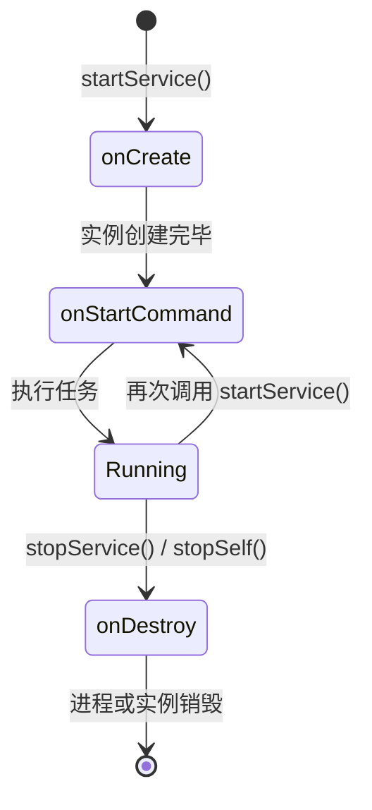
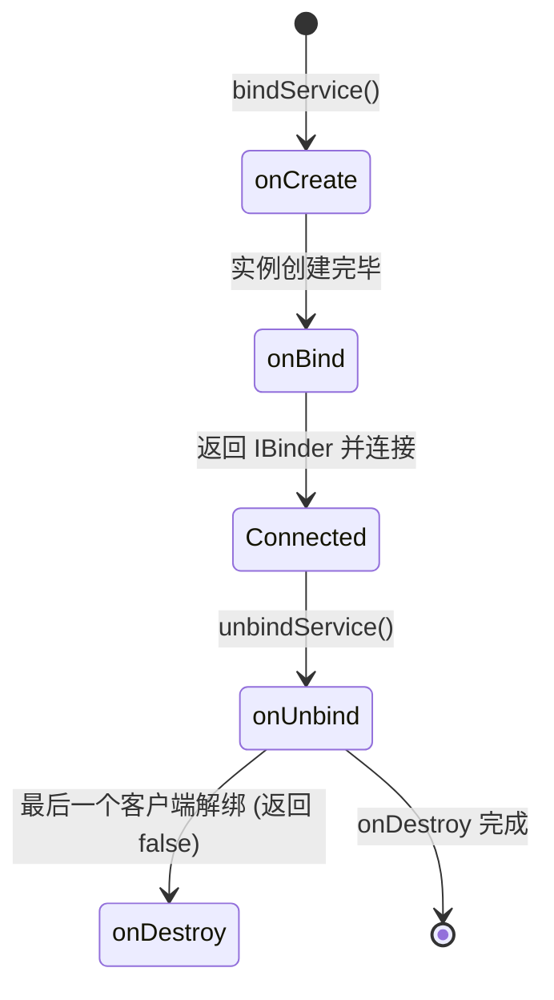
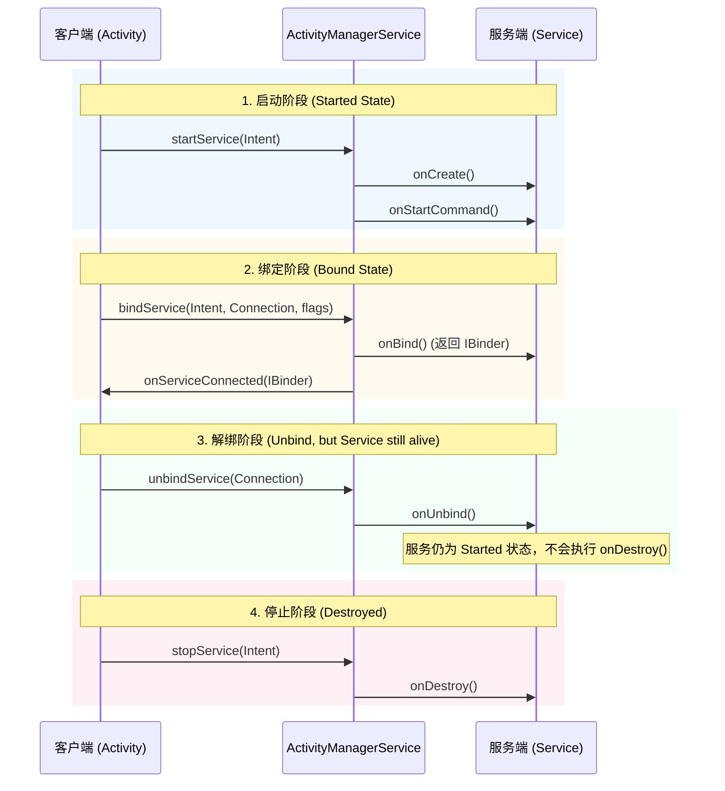
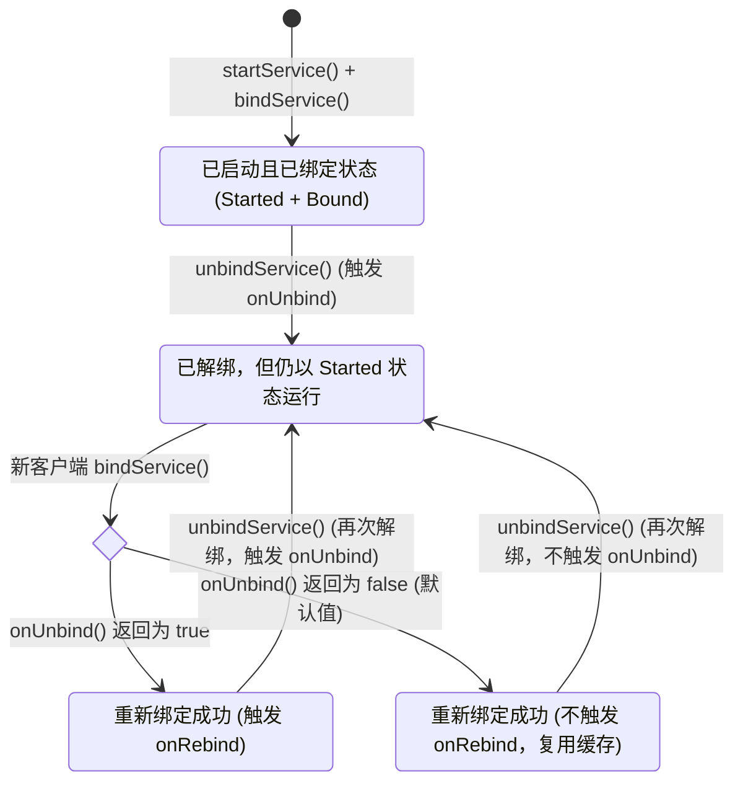

# 5.1.2.2.1 生命周期

Service 是 Android 系统中用于在后台执行长时间运行任务且无用户界面的核心应用组件。理解 Service 的生命周期、运行机制、线程模型以及系统在不同 Android 版本下的后台限制政策，是开发高可用、高性能且功耗友好的 Android 应用的基石。

很多开发者常常将 Service 与“后台线程”混淆。实际上，Service 的生命周期回调与应用的 UI 组件一样，默认都运行在应用的主线程中。Service 的存在更偏向于一种向操作系统（ActivityManagerService，简称 AMS）表达应用“后台工作状态”的契约，系统根据 Service 的运行状态动态调整其宿主进程的优先级，从而在内存紧张时保护进程不被优先回收。

---

## 一、 双重生命周期深度解构

Service 具有两种截然不同的运行模式：**启动模式（Started Service）**与**绑定模式（Bound Service）**。这两种模式各自对应一套独立且完整的生命周期状态机，它们的行为逻辑、资源释放时机以及与调用者的解耦程度完全不同。

### 1. startService 模式生命周期与行为控制

当应用组件（如 Activity）调用 `Context.startService(Intent)` 时，Service 即以“启动模式”运行。此模式下的 Service 与启动它的组件生命周期完全解耦，即使启动它的组件被销毁，Service 依然会在后台持续运行，直到其自身调用 `stopSelf()` 或其他组件调用 `stopService()`。



#### （1）生命周期核心回调分析
* **`onCreate()`**
  * **调用时机**：在 Service 实例首次被系统创建时调用。如果 Service 已经在运行，后续的 `startService()` 调用将不会重复触发 `onCreate()`。
  * **核心职责**：用于执行单次的全局初始化操作，例如初始化线程池、数据库连接、创建通知渠道（Notification Channel）或初始化媒体播放器。
* **`onStartCommand(Intent intent, int flags, int startId)`**
  * **调用时机**：每次客户端通过 `startService(Intent)` 启动该服务时都会调用。这意味着 `onStartCommand()` 可能会被并发或连续调用多次。
  * **关键参数解析**：
    * `intent`：启动时传递的 Intent 对象，包含客户端携带的数据。由于系统回收重建等机制，该参数在某些重启场景下可能为 `null`，编写代码时必须进行空指针校验。
    * `flags`：系统在多次调用或异常恢复时的标志，主要包括 `START_FLAG_REDELIVERY`（代表当前 Intent 是在服务被回收后由系统重新投递的）和 `START_FLAG_RETRY`（代表服务启动失败后的重试尝试）。
    * `startId`：系统为每次启动请求分配的唯一整数标识符（令牌）。由于多次启动会产生多个 `startId`，在任务执行完毕时，推荐使用 `stopSelfResult(startId)` 来优雅地停止服务。只有传入的 `startId` 与最近一次启动请求的 ID 相匹配时，Service 才会真正被销毁。这可以有效避免在处理旧任务时，新到来的任务因服务被误杀而中断。
* **`onDestroy()`**
  * **调用时机**：在 Service 被销毁之前调用，是 Service 生命周期的终点。
  * **核心职责**：释放所有占用的系统资源，例如关闭线程池、注销广播接收器、取消网络监听、释放 WakeLock 等，防止内存泄漏和电量流失。

#### （2）`onStartCommand()` 返回值与异常回收重启机制
在系统因内存不足、低内存杀进程（Low Memory Killer，简称 LMK）等极端情况下，运行中的 Service 可能会被强制终止。`onStartCommand()` 的返回值决定了当系统内存恢复充裕时，如何对该 Service 进行重建 and 状态恢复：

| 返回值常量 | 系统回收后的重启行为 | 适用场景 |
| :--- | :--- | :--- |
| **`START_STICKY`** | 重建 Service，并调用 `onStartCommand()`，但传入的 `intent` 为 `null`。系统会保留之前挂起的启动请求。 | 适用于不需要依赖外部传入数据、需要无限期在后台运行的守护任务，如后台音乐播放、IM 消息长连接拉活等。 |
| **`START_NOT_STICKY`** | 系统不会主动重建该 Service，除非客户端发起新的 `startService()` 请求。 | 适用于临时性的、可中断的后台操作，如单次数据同步、临时日志上报。这是最节省系统资源的策略。 |
| **`START_REDELIVER_INTENT`**| 重建 Service，并调用 `onStartCommand()`，传入最后一次未完成处理的原始 `intent`。 | 适用于必须完整执行、且依赖 Intent 参数的任务，如断点续传下载、本地文件加密处理。 |

---

### 2. bindService 模式生命周期与 IPC 连接管理

当应用组件调用 `Context.bindService(Intent, ServiceConnection, int)` 时，Service 即以“绑定模式”运行。绑定模式本质上是基于 Binder 驱动实现的进程间通信（IPC）客户端-服务端模型。



#### （1）生命周期核心回调分析
* **`onBind(Intent intent)`**
  * **调用时机**：在第一个客户端通过 `bindService()` 连接时调用。
  * **核心职责**：必须返回一个实现了 `IBinder` 接口的对象（通常是自定义的 Binder 实例或 AIDL 生成的 Stub 对象），作为与客户端通信的媒介。如果该方法返回 `null`，系统将不会回调客户端的 `ServiceConnection`，代表拒绝绑定。
* **`onUnbind(Intent intent)`**
  * **调用时机**：当所有绑定的客户端都通过调用 `unbindService()` 与服务断开连接时，系统会自动回调此方法。
  * **返回值设计**：返回 `true` 表示当前 Service 即使在所有客户端解绑后，未来如果有新客户端重新绑定时，希望系统触发 `onRebind()` 回调；返回 `false` 则在重新绑定时直接复用现有的 Binder 对象，不再触发 `onRebind()`。
* **`onRebind(Intent intent)`**
  * **调用时机**：仅在 `onUnbind()` 返回 `true` 的前提下，当已有 Service 实例仍处于活动状态且有新的客户端尝试重新绑定时触发。

#### （2）`ServiceConnection` 跨进程连接回调时序
客户端在调用 `bindService()` 时需要传入 `ServiceConnection` 接口的实现，用于监听与服务端连接状态的变化：

1. **`onServiceConnected(ComponentName name, IBinder service)`**
   * **触发条件**：当客户端与 Service 的 Binder 通道建立成功，且 Binder 驱动将服务端的 Binder 代理对象（如果是跨进程则是 `BinderProxy`）分发到客户端进程的主线程时回调。
   * **处理逻辑**：在此回调中，客户端通常会调用 `IMyServiceInterface.Stub.asInterface(service)`，将通用的 `IBinder` 转换为强类型的 AIDL 接口代理，从而开始发起远程方法调用。
2. **`onServiceDisconnected(ComponentName name)`**
   * **触发条件**：**仅在服务端进程由于内存崩溃（Crash）、被系统强制杀死（Kill）等异常状况导致连接断开时，系统才会回调此方法。**
   * **重要结论**：如果客户端主动调用 `unbindService()` 导致正常断开，系统**不会**触发此回调。因此，不要在该方法中编写常规解绑时的资源释放逻辑，常规清理应在主动解绑的代码块中显式执行。
3. **`onBindingDied(ComponentName name)`**
   * **触发条件**：当系统检测到绑定的服务已死亡，且无法再次通过系统机制重新绑定时，或者绑定的连接已经彻底失效时回调。

---

## 二、 混合生命周期模型

在复杂的工程实践中，同一个 Service 经常需要同时支持启动和绑定两种模式。例如：一个音频播放服务，我们需要通过 `startService()` 让音乐在后台持续播放（即使播放界面被关闭），同时在播放界面（Activity）显示时，通过 `bindService()` 绑定服务，以实时获取当前播放进度、更新 UI 状态并向服务发送切歌等控制指令。

### 1. 混合状态下的生命周期回转与销毁控制

当 Service 既被 start 又被 bind 时，它在系统内部同时被标记为 **Started** 和 **Bound** 状态。这两套状态是并行的，其生命周期流转遵循“**双重释放机制**”。



在混合调用模式下，Service 的销毁需要满足以下两个前提条件，缺一不可：
1. **没有任何活动的 Binder 客户端绑定 to 该 Service**（即所有绑定的客户端都执行了 `unbindService()`，或者其所在的进程已消亡）。
2. **Service 显式接收到了停止指令**（即 Service 自身调用了 `stopSelf()`，或者外部组件调用了 `stopService()`）。

如果先调用了 `stopService()`，但此时仍有客户端处于绑定状态，Service **不会**立即被销毁，而是继续存活以维持 Binder 通信；直到最后一个客户端调用了 `unbindService()`，系统检测到 Service 既无绑定客户端，又收到了停止指令，才会回调 `onDestroy()`。

---

### 2. `onUnbind()` 与 `onRebind()` 的深度机制

在混合调用模式下，解绑与重绑的逻辑回转可以通过 `onUnbind()` 的返回值进行精确控制。



1. **若 `onUnbind()` 返回 `false`（默认行为）**：
   * 当第一个客户端解绑后，Service 处于 Started 状态并继续在后台运行。
   * 随后如果有客户端（不论是原客户端还是新客户端）重新调用 `bindService()`，系统**不会**再次触发 Service 的 `onBind()` 或 `onRebind()`。
   * 系统会直接从 AMS 内部的缓存中取出上一次 `onBind()` 返回的 `IBinder` 代理分发给客户端，以减少进程上下文切换和 Binder 对象的重新构建。
2. **若 `onUnbind()` 返回 `true`**：
   * 当所有客户端解绑后，Service 继续以 Started 状态运行。
   * 随后如果有客户端尝试重新绑定，系统会直接回调 Service 的 `onRebind(Intent)`，而不是 `onBind()`。
   * **价值与意义**：这在很多长连接守护或媒体播放服务中非常有用。通过 `onRebind()`，Service 可以感知到客户端的“重连”事件，从而在 `onRebind()` 中重新激活某些由于失去客户端连接而暂停的刷新逻辑，或者重新分配特定的客户端关联资源。

---

## 三、 物理线程与执行陷阱

在 Android 的架构设计中，**Service 绝对不等于子线程**。这是初学者最容易陷入并导致应用崩溃或性能低下的执行陷阱。

### 1. 默认执行线程机制与 ANR 原理

Service 是运行在应用进程的**主线程（UI 线程）**中的。系统回调 Service 的所有生命周期方法（包括 `onCreate`、`onStartCommand`、`onBind`、`onDestroy` 等），其本质都是由主线程的 `Looper` 从消息队列（`MessageQueue`）中取出对应的 Message，并在主线程中同步执行的。

由于主线程还负责处理所有的用户交互事件（如手势触摸、点击、输入等）以及页面的绘制渲染，如果在 Service 的生命周期回调中直接执行任何耗时操作（如发起网络请求、读写大型数据库、执行高密度循环计算或加载大文件），主线程的 `Looper` 就会被完全阻塞。

* **ANR（Application Not Responding，应用无响应）触发机制**：
  * **主动检测（Timeout Mechanism）**：当系统通过 AMS 调度启动或绑定 Service 时，会在 AMS 内部设置一个定时器。前台 Service 的响应超时时间通常为 **20 秒**，后台 Service 通常为 **200 秒**。如果在超时时间内，Service 对应的生命周期回调（如 `onCreate` / `onStartCommand`）未能执行完毕并向系统确认，AMS 就会立即向该应用进程发送 ANR 信号。
  * **被动引发（Input ANR）**：即使 Service 的回调方法在几秒内执行完毕返回，但如果在 Service 中启动了主线程的同步阻塞逻辑，只要用户在此时点击了屏幕，系统就会因为主线程被该阻塞逻辑占用、无法在 **5 秒**内分发处理该触摸输入事件，从而抛出严重的输入超时 ANR。

---

### 2. 避免阻塞主线程的编程模型

为了保证主线程的绝对流畅，必须将 Service 中的所有耗时业务逻辑全部隔离到异步线程中执行。以下是目前 Android 开发中推荐的两种异步处理模型：

#### （1）基于线程池（ExecutorService）的传统多线程模型
在 Service 内部维护一个静态或局部的线程池，并在 `onStartCommand` 中将具体任务提交给线程池处理。

```java
public class DailySyncService extends Service {
    private ExecutorService mExecutorService;

    @Override
    public void onCreate() {
        super.onCreate();
        // 初始化单线程线程池，确保后台任务按顺序排队执行，避免多线程并发抢占 CPU 资源
        mExecutorService = Executors.newSingleThreadExecutor();
    }

    @Override
    public int onStartCommand(Intent intent, int flags, int startId) {
        // 将具体的耗时操作提交至线程池异步执行，使 onStartCommand 能够立即返回，绝不阻塞主线程
        mExecutorService.execute(() -> {
            try {
                performHeavyNetworkSync(intent);
            } finally {
                // 任务执行结束后，必须携带特定的 startId 尝试停止服务，避免影响可能刚刚到来的新任务
                stopSelfResult(startId);
            }
        });
        return START_NOT_STICKY;
    }

    private void performHeavyNetworkSync(Intent intent) {
        // 执行耗时的网络数据拉取与本地数据库写入操作
    }

    @Override
    public IBinder onBind(Intent intent) {
        return null; // 启动型服务返回 null
    }

    @Override
    public void onDestroy() {
        super.onDestroy();
        // 销毁时必须主动关闭线程池，拒绝接收新任务，并安全释放资源，防止内存泄漏
        if (mExecutorService != null && !mExecutorService.isShutdown()) {
            mExecutorService.shutdown();
        }
    }
}
```

#### （2）基于 Kotlin 协程（Coroutines）的现代并发模型
在 Kotlin 开发中，使用协程可以以非阻塞的同步代码风格管理异步任务，结合 `LifecycleService` 可以更好地与组件生命周期进行绑定。若使用标准 `Service`，必须在生命周期销毁时手动取消协程作用域。

```kotlin
class BackgroundDownloadService : Service() {
    // 声明一个绑定在主线程的协程作用域，同时使用 SupervisorJob 防止单个子协程崩溃导致整个服务崩溃
    private val serviceScope = CoroutineScope(Dispatchers.Main + SupervisorJob())

    override fun onStartCommand(intent: Intent?, flags: Int, startId: Int): Int {
        val downloadUrl = intent?.getStringExtra("DOWNLOAD_URL")
        
        if (downloadUrl != null) {
            // 在主协程作用域中启动一个新协程
            serviceScope.launch {
                try {
                    // 使用 withContext 显式地将执行线程切换至 I/O 线程池
                    val result = withContext(Dispatchers.IO) {
                        downloadLargeFile(downloadUrl)
                    }
                    processDownloadResult(result)
                } catch (e: Exception) {
                    handleDownloadError(e)
                } finally {
                    // 任务执行完毕，通过当前的 startId 尝试安全停止服务
                    stopSelfResult(startId)
                }
            }
        }
        return START_REDELIVER_INTENT
    }

    private suspend fun downloadLargeFile(url: String): File {
        // 挂起函数：执行非阻塞的下载流程
        return File("")
    }

    private fun processDownloadResult(file: File) {
        // 在主线程更新状态或通知用户
    }

    private fun handleDownloadError(e: Exception) {
        // 错误处理逻辑
    }

    override fun onBind(intent: Intent?): IBinder? = null

    override fun onDestroy() {
        super.onDestroy()
        // 核心安全操作：Service 销毁时必须取消协程作用域下的所有子协程，防止后台协程泄漏及对已被销毁的 Context 进行非法访问
        serviceScope.cancel()
    }
}
```

---

## 四、 进程优先级与生命周期管理变化

在 Android 系统中，内存不足时哪个进程会被杀死，取决于进程的优先级。Service 的状态对宿主进程的优先级有着直接的决定性作用。同时，随着 Android 系统的演进，对后台 Service 的限制也越来越严格。

### 1. Service 状态对应用进程 ADJ 优先级的直接影响

Android 系统会根据进程中运行的组件状态，通过 Linux 内核的 OOM Killer 动态调整每个进程的 `oom_score_adj`（通常简称为 **ADJ** 级别）。ADJ 越小，说明进程的优先级越高，越不容易被系统回收：

| 进程状态类型 | 典型 ADJ 级别 | Service 对优先级的贡献机制 |
| :--- | :--- | :--- |
| **前台进程 (Foreground Process)** | **0 / 100** | 进程中包含一个正在运行的**前台服务（Foreground Service）**，或者该 Service 绑定到了一个前台 Activity。此时该进程获得极高的保护，几乎不可能被 LMK 杀死。 |
| **可见进程 (Visible Process)** | **200** | 进程中包含一个可见但非前台的 Activity，或者其绑定的 Service 被一个可见进程所调用。系统会尽量避免杀死此进程。 |
| **服务进程 (Service Process)** | **500 / 800** | 进程中包含通过 `startService()` 启动且正在后台运行的普通后台服务。当内存紧张时，系统会优先回收没有活动组件的进程，随后便会考虑回收此类普通服务进程。 |
| **空进程 (Empty Process)** | **900+** | Service 已经被销毁（或解绑），且进程中没有其他活动的流动组件。进程仅作为缓存保留，一旦系统内存稍微波动，会立即被系统第一个清理。 |

---

### 2. 后台限制与系统生命周期管理演进

为了提升设备续航、优化内存占用并保障用户隐私，Google 自 Android 8.0 起，对后台 Service 的启动和运行机制进行了多轮严苛的策略收紧。以下是各个关键版本的限制变化，具体版本演进细节可查阅 [Android Version Change Log](../../../../../../AndroidVersionChangeLog.md)：

#### （1）Android 8.0（API 26）：后台启动限制与前台转换约束
* **限制背景**：在此版本之前，应用可以在后台任意启动后台 Service，导致大量应用在后台抢占 CPU 资源和内存，严重消耗设备电量。
* **限制规则**：
  * **当应用处于后台状态时（没有可见 Activity 且没有前台组件绑定），系统完全禁止该应用通过 `startService()` 启动普通后台服务**。若强行调用，系统将直接抛出 `IllegalStateException` 崩溃。
  * **前台转换强制时效**：如果应用在后台需要执行紧急任务，必须调用 `ContextCompat.startForegroundService(Context, Intent)`。启动后，该 Service 必须在 **5 秒**之内调用 `startForeground(int id, Notification notification)` 方法，向用户显式展示一个常驻通知（Notification）。
  * **致命后果**：如果超过 5 秒未调用 `startForeground()` 关联前台通知，系统会认为该服务试图在后台“隐蔽”运行，会立即抛出 `Context.startForegroundService() did not then call Service.startForeground()` 异常并强行终止该进程。
* **版本索引**：关于此变化的系统设计背景和行为日志，见 [Android 8.0 后台执行限制](../../../../../../AndroidVersionChangeLog.md#android-80--81api-26--27)。

#### （2）Android 14（API 34）：前台服务类型（FGS Type）的硬性强制
* **限制背景**：许多开发者为了规避 Android 8.0 的后台限制，滥用前台服务（Foreground Service）来执行普通的后台下载或数据同步，且不向系统报告具体用途。
* **限制规则**：
  * **前台服务类型强制声明**：应用必须在 `AndroidManifest.xml` 中为每个前台服务声明至少一个具体的服务类型（FGS Type），例如 `android:foregroundServiceType="camera"` 或 `android:foregroundServiceType="dataSync"` 等。
  * **运行时权限与校验**：在调用 `startForeground()` 启动前台服务时，系统会进行强校验。如果应用在运行时试图调用需要摄像头或位置信息的前台服务，但未在 XML 中声明对应的类型，或者未向用户申请相应的运行时权限，系统会直接抛出 `SecurityException` 崩溃。
* **版本索引**：详细的前台服务类型映射表和 API 迁移指导，见 [Android 14 前台服务类型要求](../../../../../../AndroidVersionChangeLog.md#android-14api-34)。

#### （3）Android 15（API 35）及后续版本：前台服务启动的进一步收紧
* **限制背景**：Android 15 继续加强后台控制，防止应用通过各种广播接收器或挂起的 Intent（PendingIntent）规避前台服务启动限制。
* **限制规则**：
  * **广播接收器启动限制**：进一步限制了应用在后台接收到系统广播（如 `BOOT_COMPLETED` 广播）后，直接拉起某些特定类型前台服务（如 `dataSync`）的行为。系统推荐此类后台重度同步工作改用 `WorkManager` 处理。
* **版本索引**：有关 Android 15 前台服务和后台退出的详细兼容清单，见 [Android 15 行为变化](../../../../../../AndroidVersionChangeLog.md#android-15api-35)。

---

## 五、 总结与最佳实践

在现代 Android 系统环境下，为了保障应用的健壮性，建议在处理 Service 生命周期和后台任务时遵循以下最佳实践：

1. **优先使用 WorkManager**：除非任务极其紧急且需要立即且持续地向用户展示前台通知（如实时导航、音乐播放），否则对于绝大部分后台数据同步、离线处理任务，均应使用 `WorkManager` 代替 Service。`WorkManager` 能自动调度线程、管理电量，并在进程被杀后由系统重新调度唤醒。
2. **遵守 5 秒前台契约**：在调用 `startForegroundService()` 时，一定要将 `startForeground()` 的调用放置在 `onCreate()` 或 `onStartCommand()` 的首行，并准备好可用的 `Notification` 实例，以绝对避免因 5 秒超时导致的系统强杀。
3. **做好空 Intent 兜底**：在以 `START_STICKY` 模式运行的 Service 中，必须在 `onStartCommand()` 中对传入的 `intent` 参数进行非空校验。因为系统在回收重建后投递的 Intent 大概率为 `null`。
4. **手动取消异步任务**：在 Service 销毁时（`onDestroy()`），务必显式注销所有注册的监听器、停止线程池或取消（`cancel`）协程作用域。Service 的销毁不代表子线程或协程会自动停止，若不手动取消，将会导致严重的内存泄漏与 CPU 资源浪费。
