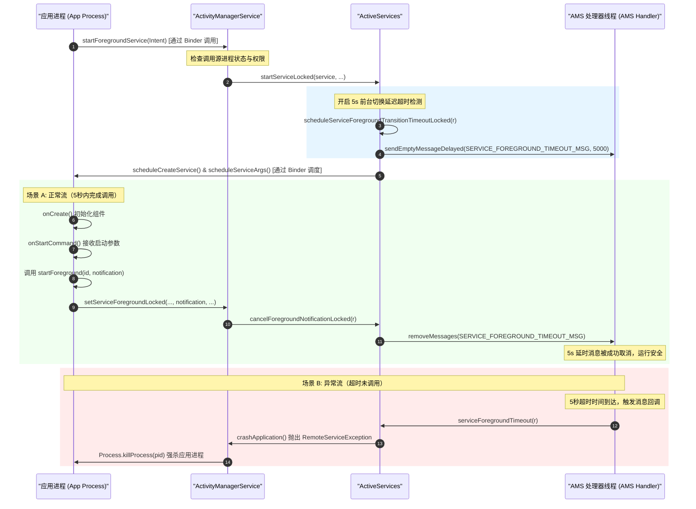

# 5.1.2.2.2 前台服务

前台服务（Foreground Service）是 Android 系统在严苛后台限制政策下，为具备高可见性、强实时性后台任务保留的受控入口。在移动设备资源受限、系统低内存杀进程（OOM Killer / Low Memory Killer）日益频繁的背景下，前台服务凭借其“对用户物理可见”的特权，在系统服务管理器（ActivityManagerService）中获得了极高的进程优先级（ADJ）。

本文将从物理本质、AMS 进程优先级调度算法与 LMKD 交互、5 秒启动超时红线监控源码机制、系统版本演进适配以及生产环境架构避坑指南等维度，对前台服务的底层运行机制进行深度剖析。

---

## 1. 物理本质与进程 ADJ 提升机制

### 1.1 Notification 的物理可见性
前台服务与普通后台服务最大的物理区别在于其**对用户物理可见**。Android 系统强制要求前台服务必须绑定一个持续显示的通知（`Notification`），且该通知在服务运行期间默认无法被用户通过滑动轻易清除。

从系统设计哲学的角度来看，这种物理可见性是**将知情权与控制权交还给用户**。系统通过通知栏时刻提醒用户：“当前有一个应用正在后台持续消耗电池和系统资源。” 这种限制迫使开发者只有在真正需要即时互动的场景下（如音乐播放、导航、运动计步、大文件下载等）才合理使用前台服务，从而避免后台静默流氓行为。这种“以物理可见性换取后台执行特权”的折中设计，构成了现代移动操作系统功耗管理的核心基石。

### 1.2 AMS 进程调度与 ADJ 算法底层原理
Android 系统管理进程的核心依据是 `OOM_ADJ`（Out-Of-Memory Adjuster）。AMS（ActivityManagerService）中的 `OomAdjuster` 模块会根据应用中组件的状态动态计算每个进程的优先级，写入 Linux 内核的 `/proc/[pid]/oom_score_adj` 文件中。Linux 内核的 LMKD（Low Memory Killer Daemon）会根据系统当前剩余内存水位，在内存紧张时，从 ADJ 值最高（最不重要）的进程开始强杀。

下面是典型的 Android 进程优先级模型及 ADJ 分布：

| 进程状态 / 类型 | 典型 ADJ 值 | LMK 强杀优先级 | 说明 |
| :--- | :--- | :--- | :--- |
| **前台进程 (FOREGROUND_APP)** | `0` | 最不易被杀 | 用户正在交互的进程（如当前 Activity 所在进程） |
| **可见进程 (VISIBLE_APP)** | `100` | 极难被杀 | 用户可见但未获得焦点的页面（如被半透明弹窗遮挡的 Activity） |
| **感知进程 (PERCEPTIBLE_APP)** | `200` | 极难被杀 | 包含用户可感知服务的进程（如**前台服务播放音乐**、后台播放视频） |
| **服务进程 (SERVICE_APP)** | `500` | 较易被杀 | 包含普通后台服务的进程（如同步数据、清理缓存等） |
| **后台/缓存进程 (CACHED_APP)** | `900` ~ `1000` | 最易被杀 | 没有任何活跃组件，处于缓存状态的进程 |

当一个进程中启动了普通 Service 时，它的 ADJ 通常被算作 `SERVICE_APP_ADJ`（500）。当设备内存出现压力时，此类进程会被极快地清理掉。

然而，当该 Service 转型为 **Foreground Service** 之后，AMS 在执行 `updateOomAdjLocked` 评估进程优先级时，会检测到该服务对应的 `ServiceRecord.isForeground` 为 `true`。此时，AMS 会将该进程的优先级提升至 `FOREGROUND_APP_ADJ`（通常在系统判定该前台服务属于 PERCEPTIBLE 状态时，其 ADJ 会被控制在 `200` 甚至 `0` 之间）。

#### AMS 内部 Adj 计算机制与 LMKD 交互
在 AMS 源码中，每次组件状态发生改变（例如 Activity 生命周期切换、Service 绑定或解绑、广播发送），都会触发 `OomAdjuster.updateOomAdjLocked()`。在计算包含前台服务的进程（`ProcessRecord`）时，会有类似如下的评级提升逻辑：

```java
// 简化后的 AMS OomAdjuster 计算逻辑伪代码
void computeOomAdjLocked(ProcessRecord app, int cachedAdj, ...) {
    int adj = cachedAdj;
    int procState = PROCESS_STATE_CACHED_EMPTY;
    
    // 遍历进程中所有的 Service
    for (int i = app.services.size() - 1; i >= 0; i--) {
        ServiceRecord s = app.services.valueAt(i);
        if (s.isForeground) {
            // 前台服务提升进程状态为 PROCESS_STATE_FOREGROUND_SERVICE
            if (procState > PROCESS_STATE_FOREGROUND_SERVICE) {
                procState = PROCESS_STATE_FOREGROUND_SERVICE;
            }
            // 提升 ADJ 级别至 PERCEPTIBLE 或 FOREGROUND 级别
            if (adj > ProcessList.PERCEPTIBLE_APP_ADJ) {
                if (s.foregroundNoti != null) {
                    // 如果绑定了合法的 Notification，则 ADJ 降为 PERCEPTIBLE 级别
                    adj = ProcessList.PERCEPTIBLE_APP_ADJ; // 200
                } else {
                    // 即使声明为前台，若没有 Notification (过渡状态)，也保证不被轻易当成 Cached 杀掉
                    adj = ProcessList.VISIBLE_APP_ADJ; // 100
                }
            }
        }
    }
    app.setCurAdj(adj);
    app.setCurProcState(procState);
}
```

当 `OomAdjuster` 计算完毕后，AMS 会通过底层的 `ProcessList.writeLmkdOomAdjLocked` 或者是新版本中的 socket 机制，向系统的 `lmkd` 守护进程写入该进程的最新的 oom_score_adj 值。`lmkd` 进程驻留在用户空间，通过监控内核的压力事件（PSI）来判定是否需要清理进程。由于前台服务将进程的 ADJ 牢牢锁定在 200 左右，即使系统内存极其吃紧，`lmkd` 也绝不会优先考虑强杀该进程，从而在物理上保证了前台服务后台执行的连续性。

---

## 2. 前台服务启动时序与 5s 崩溃红线（AMS 监控内核）

### 2.1 启动 API 与 Binder 协作时序
前台服务的启动需要客户端应用进程与系统服务端进程（AMS）进行复杂的 IPC 协作。从 Android 8.0 开始，应用在后台启动服务时，必须通过 `Context.startForegroundService(Intent)` 启动，并在紧接着的 5 秒钟内，在 `Service` 组件实例的生命周期回调中调用 `Service.startForeground(int id, Notification notification)`。

下面是应用进程与 AMS 服务端在启动前台服务时的多进程协同，以及 5 秒超时监控的完整链路图：



### 2.2 RemoteServiceException 的底层原理
当场景 B 发生时，应用会发生崩溃，并在 Logcat 中看到类似如下的报错堆栈：

```text
android.app.RemoteServiceException$ForegroundServiceDidNotStartInTimeException: 
Context.startForegroundService() did not then call Service.startForeground(): 
ServiceRecord{9d71c89 u0 com.example.app/.MyForegroundService}
```

这一崩溃的物理源头在 AMS 的 `ActiveServices` 机制中。我们通过 AOSP 源码（以 Android 10/11 典型实现为例）来解析这套 5s 超时检测逻辑：

1. **注册超时消息**：
   在 `ActiveServices.startServiceInnerLocked()` 中，如果检测到启动类型要求为前台服务，会调用 `scheduleServiceForegroundTransitionTimeoutLocked`：
   ```java
   void scheduleServiceForegroundTransitionTimeoutLocked(ServiceRecord r) {
       if (r.app != null && r.app.thread != null) {
           Message msg = mAm.mHandler.obtainMessage(
                   ActivityManagerService.SERVICE_FOREGROUND_TIMEOUT_MSG);
           msg.obj = r;
           // 注入 5 秒的延时消息（ActiveServices.SERVICE_START_FOREGROUND_TIMEOUT = 5000）
           mAm.mHandler.sendMessageDelayed(msg, 
                   ActiveServices.SERVICE_START_FOREGROUND_TIMEOUT);
       }
   }
   ```

2. **取消超时消息**：
   当应用进程接收到生命周期调度，在服务内部执行了 `startForeground` 后，会通过 Binder 跨进程调用 `AMS.setServiceForegroundLocked()`。在此方法内部会执行取消逻辑：
   ```java
   public void setServiceForegroundInnerLocked(ServiceRecord r, int id,
           Notification notification, int flags, int foregroundServiceType) {
       ...
       // 将 isForeground 标志位置为 true
       r.isForeground = true;
       r.foregroundId = id;
       r.foregroundNoti = notification;
       ...
       // 移除挂起的 SERVICE_FOREGROUND_TIMEOUT_MSG 消息
       mAm.mHandler.removeMessages(ActivityManagerService.SERVICE_FOREGROUND_TIMEOUT_MSG, r);
       ...
   }
   ```

3. **超时触发崩溃**：
   如果应用在 5 秒内因为主线程卡顿（ANR）、繁重的 `onCreate` 初始化逻辑、或者代码逻辑判断导致未能执行到 `startForeground`，AMS 的 Handler 会触发该消息，并回调 `ActiveServices.serviceForegroundTimeout()`。
   
   值得注意的是，在 Android 12 之后，该异常被细化为 `ForegroundServiceDidNotStartInTimeException`。这一机制的核心诉求是彻底杜绝应用在调用 `startForegroundService` 后“装聋作哑”，绕过通知栏强行保活。
   ```java
   void serviceForegroundTimeout(ServiceRecord r) {
       ...
       // 组装异常文本
       String msg = "Context.startForegroundService() did not then call Service.startForeground()";
       ...
       // 向 App 进程抛出 RemoteServiceException 异常，强制终止进程
       mAm.crashApplication(r.appInfo.uid, r.appInfo.processName, msg, 
               new ForegroundServiceDidNotStartInTimeException(msg));
   }
   ```
   **如果在 5s 超时后，应用才缓缓调用了 `startForeground`，会发生什么？** 此时，由于 Handler 消息早已执行，AMS 已经向下达了强杀指令并抛出 Crash。应用在被杀掉的瞬间可能还在执行 `startForeground`，这不仅无法挽救进程，反而会在异常日志中留下各种诡异的 NullPointerException 或 Binder 死亡通知。因此，必须在 5 秒的物理时间内绝对先发制人。

### 2.3 规避 5 秒红线的物理策略
在实际开发中，由于主线程调度延迟、系统高负载或内存紧张，即使我们在 `onStartCommand` 中写了 `startForeground`，仍然有可能因为排队执行而超时。规避此红线的防障策略包括：

* **防御性首行调用**：
  将 `startForeground` 的调用时机推至 `Service.onCreate()` 的第一行，而不是等待 `onStartCommand()` 的回调。因为 `onCreate()` 的执行顺序永远在 `onStartCommand()` 之前。如果把启动逻辑放在 `onStartCommand()`，当多次 `startService` 时，`onCreate()` 只会执行一次，而后续的 `onStartCommand()` 可能会因为 Intent 排队或并发处理而产生延迟，增大超时崩溃的风险。
  
* **采用空 notification 占位**：
  在 `onCreate` 中，不要在调用 `startForeground` 之前做复杂的 Notification 渠道（Channel）初始化、数据构建或远程大图片加载。应该直接构建一个带必选属性的、极简配置的 Notification 实例作为“占位通知”立即传入，随后在异步线程或数据加载完成后，通过 `NotificationManager.notify(id, newNotification)` 对其进行静默更新。

---

## 3. 系统版本演进与权限限制大盘点

随着 Android 隐私保护与功耗控制策略的逐步收紧，前台服务的准入门槛在历代版本中呈现阶梯式提升。为了防止前台服务被当做“保活神工”，Google 引入了强类型声明、运行时权限与后台启动硬性限制。

下表梳理了各关键版本对前台服务的具体约束（可对照根目录 [AndroidVersionChangeLog.md](../../../../../AndroidVersionChangeLog.md) 了解更完整的平台更新脉络）：

| 平台版本 | API Level | 权限与类型声明变化 | 后台启动限制与行为约束 |
| :--- | :--- | :--- | :--- |
| **Android 8.0** | 26 | 无额外权限，但引入 `startForegroundService` API。 | 后台应用不再允许直接 `startService()`，强行调用会抛出 `IllegalStateException`。 |
| **Android 9.0** | 28 | 引入 `FOREGROUND_SERVICE` 权限（普通权限，只需清单声明）。 | 若未在 Manifest 中声明该权限，调用 `startForeground()` 将直接抛出 `SecurityException`。 |
| **Android 10** | 29 | 引入前台服务类型（Foreground Service Types），首批支持位置、相机、麦克风等。 | 若要访问位置信息，必须在 Manifest 的 `<service>` 中声明 `android:foregroundServiceType="location"`。 |
| **Android 12** | 31 | 引入了后台启动前台服务的初步限制。 | 除了特定的豁免场景，处于后台的应用禁止启动前台服务，强行启动会抛出 `ForegroundServiceStartNotAllowedException`。 |
| **Android 14** | 34 | **强制声明**前台服务类型；针对不同的类型，要求申请专属的运行时权限。 | **进一步收紧后台启动前台服务限制**。无类型前台服务将被彻底废弃，调用未声明类型的前台服务会导致 Runtime Crash。 |
| **Android 15** | 35 | 新增 `mediaProcessing` 类型。 | 限制 `BOOT_COMPLETED` 广播接收器中直接启动部分特定类型前台服务。进一步收紧豁免场景。 |

---

### 3.1 Android 8.0 & 9.0：后台收紧与权限入门
在 Android 8.0（API 26）之前，应用可以通过 `startService()` 在后台任意启动无限生命的后台服务，这导致系统整体电量和内存极易枯竭。Android 8.0 引入了**后台执行限制**，普通后台服务一旦进入后台几分钟就会被自动杀掉且不准启动。如果必须在后台处理任务，必须使用 `startForegroundService()` 配合 `startForeground()` 来开启前台服务。

为了防止滥用，Android 9.0（API 28）正式将前台服务纳入权限管控体系。如果应用 target API 为 28 或更高版本，而没有在 manifest 中申请该权限，在调用 `startForeground` 时，系统将直接抛出 `SecurityException` 崩溃：
```xml
<!-- Android 9.0+ 必须声明，否则 startForeground() 会崩溃 -->
<uses-permission android:name="android.permission.FOREGROUND_SERVICE" />
```

---

### 3.2 Android 14（API 34）：前台服务类型强制化
Android 14（API 34）对前台服务实施了自诞生以来最严厉的改造。应用**不能再使用无类型（None-Type）的前台服务**。

#### 1. 强制声明类型
在清单文件（`AndroidManifest.xml`）中声明 `<service>` 时，必须显式指定 `android:foregroundServiceType`。未指定类型而强行在 API 34+ 设备上启动前台服务，系统将直接抛出崩溃。

```xml
<service
    android:name=".sync.DataSyncService"
    android:exported="false"
    android:foregroundServiceType="dataSync" /> <!-- 必须声明明确的 Type -->
```

Android 14 目前支持的常用类型及对应的运行时权限、使用边界如下：

* **`location`（位置）**：
  * **适用场景**：导航、运动路线追踪、实时的位置共享。
  * **关联权限**：清单中必须声明 `FOREGROUND_SERVICE_LOCATION`。同时，应用必须在运行时获得 `ACCESS_COARSE_LOCATION` 或 `ACCESS_FINE_LOCATION` 运行时权限。
  * **业务痛点**：若应用退到后台，且用户只授予了“仅在使用期间允许”的位置权限，那么前台服务在后台运行期间能否持续拿到定位？**答案是：只要前台服务是在前台时成功拉起的，即便应用退到后台，由于 `location` 前台服务的加持，进程依然被视为具有前台定位访问特权。但如果定位权限被用户彻底关闭，定位仍会失效。**

* **`camera`（相机）**：
  * **适用场景**：后台持续录像、视频会议挂起、画中画直播。
  * **关联权限**：必须在清单声明 `FOREGROUND_SERVICE_CAMERA` 权限，且必须在运行时获得 `CAMERA` 权限。
  * **使用边界**：一旦前台服务启动并访问相机，状态栏会显示绿色圆点（相机使用指示器）以示警告。

* **`microphone`（麦克风）**：
  * **适用场景**：后台持续录音、语音通话挂起。
  * **关联权限**：声明 `FOREGROUND_SERVICE_MICROPHONE`，且运行时需要 `RECORD_AUDIO` 权限。

* **`dataSync`（数据同步）**：
  * **适用场景**：文件上传或下载、数据导入/导出、本地备份恢复。
  * **关联权限**：声明 `FOREGROUND_SERVICE_DATA_SYNC`。
  * **重要警示**：**该类型在 Android 14 中被声明为“受限/不推荐长期占用”类型**。未来版本将进一步对其设置运行时间配额（通常为 6 小时内最多累积使用几十分钟），若超时系统会自动停止服务，开发者应当尽早将此类非实时的高负载任务迁移到 `WorkManager` 中。

* **`specialUse`（特殊用途）**：
  * **适用场景**：前述所有类型都无法覆盖，且必须通过前台服务完成的极端场景。
  * **关联权限**：声明 `FOREGROUND_SERVICE_SPECIAL_USE`。
  * **审核要求**：上架 Google Play 时，开发者必须提交详细的用例说明和视频演示，否则将被直接下架。

#### 2. 后台启动限制（FGS Background Start Restriction）
从 Android 12 开始引入、并在 Android 14 进一步收紧的机制：**处于后台（Background）状态的应用进程，不允许通过 `startForegroundService()` 启动前台服务**。强行启动将直接抛出 `ForegroundServiceStartNotAllowedException`（继承自 `IllegalStateException`）。

* **豁免场景（Exemption）**：
  以下少数场景可以豁免此后台启动限制：
  1. 应用收到了高优先级（High-Priority）的 FCM 推送通知。
  2. 应用接收到了来自系统的特定广播（如 `ACTION_BOOT_COMPLETED`，但 Android 15 针对此广播的启动类型做了新限制，见下文）。
  3. 应用是由 Companion Device Manager 绑定的伴侣设备应用。
  4. 用户显式点击了应用发送的挂起通知（PendingIntent）或小部件（AppWidget）。
  5. 应用拥有 `START_ACTIVITIES_FROM_BACKGROUND` 的系统权限。

---

### 3.3 Android 15（API 35）：滥用防御与限制收紧
在 Android 15（API 35）中，系统对前台服务的限制继续升级，旨在杜绝利用系统广播兜圈保活的顽疾。

#### 1. 新增 `mediaProcessing` 类型
* 针对媒体转码、音视频离线处理、长视频渲染等耗时且耗 CPU 的操作，新增了 `android:foregroundServiceType="mediaProcessing"` 声明。
* 如果在 Android 15 设备上进行上述转码工作而继续强行使用 `dataSync`，将面临被系统直接挂起或杀死的风险。

#### 2. BOOT_COMPLETED 启动限制
在以前的版本中，应用常通过监听手机开机广播 `ACTION_BOOT_COMPLETED` 来在后台隐式拉起前台服务，以达到开机保活的目的。
Android 15 明确规定：**当应用接收到 `BOOT_COMPLETED` 广播时，禁止启动以下类型的前台服务**：
* `dataSync`（数据同步）
* `mediaPlayback`（媒体播放 - 无活跃通知绑定时）
* `phoneCall`（电话）

如果检测到应用在开机广播中尝试调用 `startForegroundService` 启动上述类型的服务，系统会立刻抛出 `ForegroundServiceStartNotAllowedException`。开发者必须转而使用 `JobScheduler` 或 `WorkManager` 来分发处理开机后的同步初始化工作。这代表着 Android 从平台架构上对“流氓开机保活”亮出了真正的红牌。

---

## 4. 停止前台服务与生命周期收尾

当后台任务执行完毕时，开发者应当立即且优雅地销毁前台服务，释放系统资源。前台服务的关闭涉及 `stopForeground(int flags)` 与 `stopSelf()` / `stopService()` 的协同机制。

### 4.1 stopForeground 详解
`stopForeground(int flags)` 的作用是将服务从“前台”降级为普通的“后台服务”。**它并不会直接销毁（Stop）服务本身**，而仅仅是剥离前台身份、解除 Notification 的强制绑定。

Android 提供并推荐了以下 Flags 来控制通知的行为：

* **`STOP_FOREGROUND_REMOVE` (或传 `true`)**：
  * **行为**：解除前台身份，并**立即移除**通知栏上的 Notification。
  * **适用场景**：任务已彻底完成，稍后将立刻调用 `stopSelf()` 销毁服务。

* **`STOP_FOREGROUND_DETACH` (从 Android 13/API 33 引入)**：
  * **行为**：解除前台身份，但**保留**通知栏上的 Notification。此时，该通知退化为普通通知，用户可以手动向左或向右滑动将其清除。
  * **适用场景**：后台下载文件完成，需要将“正在下载（Progress）”的通知转为“下载成功（Success）”的静态提示，通知需要继续留存供用户查看，而后台服务已经可以安全退出。

### 4.2 彻底销毁前台服务的生命周期协同
由于 `stopForeground()` 不会杀死 Service 实例，我们必须将其与生命周期销毁 API 进行配合。常用的协同设计模式如下：

```kotlin
class MyUploadService : Service() {

    private fun handleUploadTaskFinished() {
        // 步骤 1：剥离前台属性，并移除前台通知
        stopForeground(STOP_FOREGROUND_REMOVE)
        
        // 步骤 2：终止服务自身，触发 onDestroy()
        stopSelf()
    }

    override fun onDestroy() {
        super.onDestroy()
        // 步骤 3：在这里清理所有的流媒体句柄、网络请求及协程 Job，防止内存泄漏
        serviceScope.cancel()
    }
}
```

注意：**永远不要颠倒这两个步骤**。如果先调用了 `stopSelf()` 而没有清除前台状态或没有正确剥离 Notification，在部分老旧的 Android 8.0/9.0 深度定制系统上，容易诱发 Service 实例已被注销但通知栏图标残留、“僵尸通知”无法清除的恶性 Bug。这是因为 AMS 端对 ServiceRecord 的销毁时序在某些定制 ROM 中可能被异步化处理，导致通知取消 Binder 命令丢失。

---

## 5. RemoteServiceException 与后台启动限制架构避坑指南

在生产环境中，前台服务相关的崩溃（`RemoteServiceException`、`ForegroundServiceStartNotAllowedException`）高居 Crash 榜单前列。本节提供一整套避坑指南与架构设计策略。

### 5.1 启动防崩溃安全套接字（Safe Launcher）
对于 Android 12 及以上版本，后台启动限制（Exemption）的检测极其严苛。如果我们的代码无法确认当前应用是否百分之百处于前台，就直接调用 `startForegroundService`，必然会引发崩溃。

为了提高架构的健壮性，我们可以设计一个 `SafeFgsLauncher`，通过 `try-catch` 拦截崩溃，并在失败时引入降级机制：

```kotlin
object SafeFgsLauncher {
    private const val TAG = "SafeFgsLauncher"

    fun startService(context: Context, intent: Intent) {
        try {
            if (Build.VERSION.SDK_INT >= Build.VERSION_CODES.O) {
                context.startForegroundService(intent)
            } else {
                context.startService(intent)
            }
        } catch (e: Exception) {
            // 捕获 ForegroundServiceStartNotAllowedException (Android 12+) 
            // 以及由于 5s 延迟在极速状态下触发的 IllegalStateException
            Log.e(TAG, "Failed to start foreground service due to background restriction", e)
            
            // 降级策略：改用后台任务调度器调度该任务
            enqueueFallbackJob(context, intent)
        }
    }

    private fun enqueueFallbackJob(context: Context, intent: Intent) {
        // 降级方案：启动 WorkManager 执行该同步/下载任务
        val syncWorkRequest = OneTimeWorkRequestBuilder<SyncWorker>()
            .setInputData(workDataOf("action" to intent.action))
            .build()
        WorkManager.getInstance(context).enqueue(syncWorkRequest)
    }
}
```

### 5.2 前台服务的兜底机制与空通知防 Crash 策略
当 AMS 调度的 `SERVICE_FOREGROUND_TIMEOUT_MSG` 机制运行在低配置设备上时，即使应用在 `onCreate` 中立即调用了 `startForeground`，由于 CPU 时间片分配问题，Binder 调用传递到 AMS 侧的时间仍可能突破 5 秒极限。

为此，我们可以利用以下结构来提供绝对安全的“首帧渲染”：

```kotlin
class SafeForegroundService : Service() {

    companion object {
        private const val NOTIFICATION_ID = 9999
        private const val CHANNEL_ID = "safe_fgs_channel"
    }

    override fun onCreate() {
        super.onCreate()
        
        // 1. 物理策略：在 onCreate 第一行立即构建一个空占位通知，杜绝 5s 超时
        val initialNotification = createSimpleNotification()
        
        try {
            // 2. 结合 Android 14 要求的具体 Type 进行启动
            if (Build.VERSION.SDK_INT >= Build.VERSION_CODES.UPSIDE_DOWN_CAKE) {
                startForeground(
                    NOTIFICATION_ID, 
                    initialNotification, 
                    ServiceInfo.FOREGROUND_SERVICE_TYPE_DATA_SYNC
                )
            } else {
                startForeground(NOTIFICATION_ID, initialNotification)
            }
        } catch (e: Exception) {
            // 捕获 Android 14 运行时权限缺失或后台非法启动的异常，防止进程直接暴毙
            Log.e("SafeForegroundService", "startForeground failed: ${e.message}")
            stopSelf()
        }
    }

    private fun createSimpleNotification(): Notification {
        // 快速创建一个没有任何资源依赖、不需要网络拉取图片的简单通知
        if (Build.VERSION.SDK_INT >= Build.VERSION_CODES.O) {
            val channel = NotificationChannel(
                CHANNEL_ID, 
                "System Service Status", 
                NotificationManager.IMPORTANCE_MIN // 设置为最小重要度，不打扰用户
            )
            val manager = getSystemService(Context.NOTIFICATION_SERVICE) as NotificationManager
            manager.createNotificationChannel(channel)
        }

        return NotificationCompat.Builder(this, CHANNEL_ID)
            .setSmallIcon(android.R.drawable.stat_notify_sync) // 使用系统内置图标，免去加载本地 drawable 耗时
            .setContentTitle("服务运行中")
            .setContentText("正在准备必要的数据...")
            .setPriority(NotificationCompat.PRIORITY_MIN)
            .build()
    }
    
    override fun onStartCommand(intent: Intent?, flags: Int, startId: Int): Int {
        // 在这里触发真正的后台异步耗时任务
        performAsyncTask()
        return START_NOT_STICKY
    }
    
    private fun performAsyncTask() {
        // 真正的任务开始后，异步更新通知
        // 比如更新下载进度等，最后通过 NotificationManager.notify 更新同一个 NOTIFICATION_ID
    }
}
```

### 5.3 WorkManager / JobScheduler 替代方案的抉择路线图
前台服务并非万能药，随着系统功耗政策收紧，前台服务的维护成本已极其高昂。在大多数架构设计中，前台服务应该是**最后的兜底手段**。

开发者在进行架构选型时，可遵循以下决策逻辑：

1. **是否有物理可见、与用户实时产生交互的场景？**
   * **是**（如音乐播放、导航、VoIP 语音通话）：**必须使用前台服务**。
   * **否**：执行下一步决策。
   
2. **任务是否必须在未来某个极短时间内（如几秒钟、几分钟内）立刻启动，且对时序敏感度极高？**
   * **是**（如即时通讯的消息发送、扫码后的上传）：可评估在应用处于前台时，使用前台服务；或使用加急任务（Expedited Jobs）。
   * **否**（如离线同步、大文件静默下载、系统日志上传）：**严禁使用前台服务**。

3. **替代推荐：WorkManager**
   * 对于数据同步、日志备份、图片上传等任务，应当全面重构成 `WorkManager` 机制。
   * `WorkManager` 底层会自动根据系统版本适配 `JobScheduler` 或 `AlarmManager`。它支持设置约束条件（如**仅在 Wi-Fi 连接时**、**仅在设备充电时**、**设备空闲时**执行），不仅完全豁免了后台启动限制，还不会诱发 `RemoteServiceException`，是更符合 Android 现代绿色生态的后台任务架构方案。
