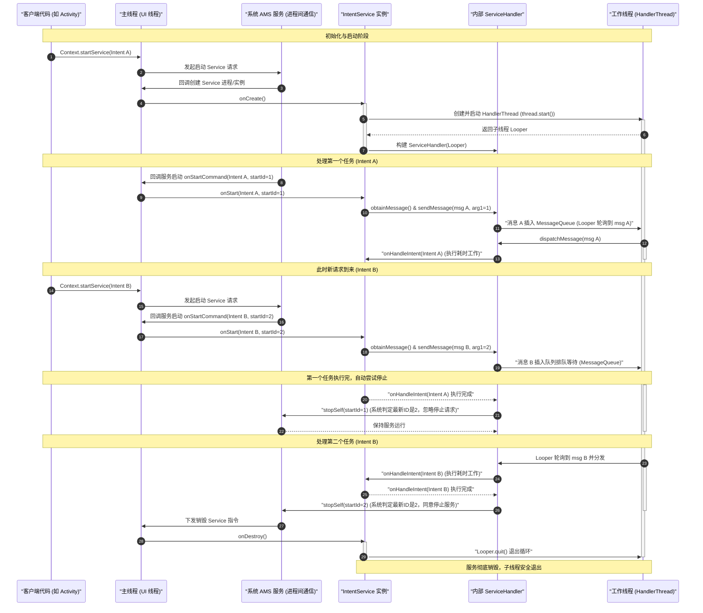

# 5.1.2.2.3 IntentService

在经典的 Android 应用开发中，系统组件 `Service` 默认运行在宿主进程的主线程（UI 线程）中。如果开发者直接在 `Service` 的常规回调（如 `onStartCommand()`）中执行耗时操作（如发起网络请求、读取大文件、进行数据库批量读写等），会导致主线程被长时间阻塞，进而引发 ANR（Application Not Responding，应用无响应）异常。为了简化开发者手动创建后台子线程、在任务结束后自动关闭服务的样板代码，Android 框架在早期版本中引入了 `IntentService`。

`IntentService` 是一种专为执行单线程、串行排队、任务完成后自动停止的异步后台任务而设计的标准模板类。它内部无缝封装了 `HandlerThread` 以及与其绑定的内部 `Handler`（`ServiceHandler`），从而将原本复杂的“多请求并发控制”和“生命周期管理”简化为单一的抽象回调方法 `onHandleIntent(Intent)`。然而，随着 Android 系统对于后台执行限制和功耗控制的不断收紧，这一曾经的明星组件在 [Android 11（API 30）](../../../../../../AndroidVersionChangeLog.md#android-11api-30) 中被正式废弃。

本文将从物理架构、核心源码、时序交互、历史弃用背景以及现代演进替代方案等多个维度，对 `IntentService` 进行深度解构。

---

## 一、 核心物理架构：HandlerThread 与单线程排队机制

要理解 `IntentService` 的工作机制，必须首先理清它底层的物理架构。`IntentService` 能够脱离主线程执行耗时任务，并在任务完成后优雅地自动销毁，这完全依赖于其内部的两个核心构件：`HandlerThread` 与 `ServiceHandler`。

```
+-------------------------------------------------------------+
|                        IntentService                        |
|                                                             |
|   +------------------+             +--------------------+   |
|   |    主线程 (UI)   |             |   HandlerThread    |   |
|   +------------------+             +--------------------+   |
|            |                                 |              |
|   1. startService()                          |              |
|            v                                 v              |
|   +------------------+             +--------------------+   |
|   | onStartCommand() |             |   MessageQueue     |   |
|   +------------------+             +--------------------+   |
|            |                                 |              |
|     2. sendMessage()                         |              |
|            +-------------------------------->| (串行排队)   |
|                                              |              |
|                                              | 3. 取出消息  |
|                                              v              |
|                                    +--------------------+   |
|                                    |   ServiceHandler   |   |
|                                    +--------------------+   |
|                                              |              |
|                                              | 4. 执行      |
|                                              v              |
|                                    +--------------------+   |
|                                    |  onHandleIntent()  |   |
|                                    +--------------------+   |
|                                              |              |
|                                              | 5. 自动尝试  |
|                                              v              |
|                                    +--------------------+   |
|                                    | stopSelf(startId)  |   |
|                                    +--------------------+   |
+-------------------------------------------------------------+
```

### 1. 为什么 IntentService 能够脱离主线程？

普通线程（`Thread`）在执行完 `run()` 方法中的逻辑后，其生命周期便宣告结束，线程实例也会被系统回收。若要在子线程中实现类似主线程的“持续等待消息、按需处理”的循环机制，开发者必须手动调用 `Looper.prepare()` 来初始化消息队列，并在子线程的末尾调用 `Looper.loop()` 开启死循环。

`HandlerThread` 是 Android SDK 提供的一个轻量级工具类，它本质上是一个继承自 `Thread` 的子类，但其内部预先构建了完整的消息循环系统。当 `HandlerThread` 启动（调用 `start()`）后，它会在子线程的 `run()` 方法中通过 `Looper` 机制建立一个与之绑定的 `MessageQueue`（消息队列）。

在 `IntentService` 被系统创建（回调 `onCreate()`）时，它会在内部实例化并启动一个 `HandlerThread`。通过这种设计，`IntentService` 拥有了一个完全独立于主线程的子线程，专门用来消费和处理所有的客户端请求。

### 2. 内部 Handler 的绑定与协作

在 `IntentService` 的内部，定义了一个私有的 Handler 实现类，命名为 `ServiceHandler`：

```java
private final class ServiceHandler extends Handler {
    public ServiceHandler(Looper looper) {
        super(looper);
    }

    @Override
    public void handleMessage(Message msg) {
        onHandleIntent((Intent)msg.obj);
        stopSelf(msg.arg1);
    }
}
```

这里的设计体现了经典的 `Handler-Looper-MessageQueue` 线程通信模式。当 `IntentService` 在主线程实例化 `ServiceHandler` 时，传入的参数并不是主线程的 `Looper`（`Looper.getMainLooper()`），而是上述 `HandlerThread` 在子线程中构建的 `Looper`。

**关键结论**：由于 `ServiceHandler` 绑定了子线程的 `Looper`，因此，所有发送到该 `ServiceHandler` 的 `Message`（消息），其 `handleMessage(Message)` 方法都将在该子线程（即 `HandlerThread`）中被回调执行，而非在主线程中执行。这也是 `IntentService` 能够安全执行阻塞任务的物理根基。

### 3. 单线程串行排队机制分析

`IntentService` 最显著的特征之一是它的“单线程串行排队”。这意味着：若有多个任务请求同时到来，它们无法并发执行，只能被放入队列，按照“先进先出”（FIFO）的顺序一个接一个地被处理。

这一机制的物理前提如下：
* **单一的工作线程**：`IntentService` 内部仅创建了一个 `HandlerThread`，这意味着在物理上只存在一个 CPU 线程在跑任务。
* **单链表消息队列**：子线程的 `Looper` 维护着唯一的一个 `MessageQueue`。每一次调用 `startService()` 发送的 `Intent` 都会被转化为一个 `Message` 插入到这个 `MessageQueue` 的末尾。
* **串行消费逻辑**：子线程中的 `Looper.loop()` 处于一个死循环中。它会不断地从 `MessageQueue` 中取出头部的 `Message`，并分发给 `ServiceHandler` 的 `handleMessage()` 去处理。在前一个 `Message` 的 `handleMessage()`（即 `onHandleIntent()`）没有执行完毕并返回之前，`Looper` 无法继续取出并处理队列中的下一个消息。

**架构权衡分析**：
* **优势**：极大地简化了多线程并发带来的逻辑复杂度。由于任务是串行执行的，开发者无需考虑线程安全、数据竞争、加锁重入等棘手的并发问题。所有的本地变量和任务状态在执行时都是天然线程安全的。
* **缺陷**：效率受限。若前一个任务发生严重的阻塞（例如因为网络延迟或重试导致耗时数分钟），后继的所有任务都将被积压在队列中无法被执行。因此，`IntentService` 绝对不适用于需要即时响应、或者高并发执行的短时任务场景。

---

## 二、 源码级拆解与工作流生命周期流转

为了彻底洞悉 `IntentService` 的工作本质，我们直接深入到 AOSP 源码中，拆解其关键的生命周期回调与内部方法。

### 1. 初始化阶段：`onCreate()`

当客户端首次调用 `Context.startService(Intent)` 时，若该 `IntentService` 实例尚未在内存中创建，系统会先执行其实例的构造并回调 `onCreate()` 方法：

```java
@Override
public void onCreate() {
    super.onCreate();
    // 1. 创建并启动 HandlerThread，传入的线程名称便于调试
    HandlerThread thread = new HandlerThread("IntentService[" + mName + "]");
    thread.start();

    // 2. 获取子线程的 Looper，并构造与其绑定的 ServiceHandler
    mServiceLooper = thread.getLooper();
    mServiceHandler = new ServiceHandler(mServiceLooper);
}
```

#### getLooper() 内部的同步锁精妙设计

这里涉及到一个经典的并发同步设计。主线程在执行 `onCreate()` 时，调用了 `thread.getLooper()`。此时子线程刚刚调用 `thread.start()`，其内部的 `Looper` 创建可能还未完成（即 `mLooper` 依然为 `null`）。为了防止空指针异常或竞态条件，`HandlerThread` 的 `getLooper()` 源码采用了阻塞等待机制：

```java
public Looper getLooper() {
    if (!isAlive()) {
        return null;
    }
    // 使用当前线程对象作为锁
    synchronized (this) {
        while (isAlive() && mLooper == null) {
            try {
                // 如果 Looper 还没创建好，主线程在此释放锁并挂起等待
                wait();
            } catch (InterruptedException e) {
            }
        }
    }
    return mLooper;
}
```

    而与此对应的，是 `HandlerThread` 的 `run()` 方法：

```java
@Override
public void run() {
    mTid = Process.myTid();
    Looper.prepare(); // 初始化当前子线程的 Looper
    synchronized (this) {
        mLooper = Looper.myLooper();
        notifyAll(); // 唤醒所有在 getLooper() 中等待的主线程
    }
    Process.setThreadPriority(mPriority);
    onLooperPrepared();
    Looper.loop(); // 开启子线程死循环，开始消费 MessageQueue
    mTid = -1;
}
```

`HandlerThread` 通过这套 `synchronized + wait() / notifyAll()` 的监视器模式，完美保证了主线程调用 `getLooper()` 时，要么拿到非空的 `Looper`，要么阻塞等待，彻底消除了初始化阶段的多线程时序竞争问题。

### 2. 请求接收与消息分发：`onStartCommand()` 与 `onStart()`

在 `onCreate()` 完成单次初始化后，系统会紧接着回调 `onStartCommand()`。此后，每次客户端重复调用 `startService()`，系统都会直接回调 `onStartCommand()`：

```java
@Override
public int onStartCommand(@Nullable Intent intent, int flags, int startId) {
    onStart(intent, startId);
    return mRedelivery ? START_REDELIVER_INTENT : START_NOT_STICKY;
}
```

在 AOSP 中，`onStartCommand()` 方法内部直接调用了老旧的 `onStart()` 方法：

```java
@Override
public void onStart(@Nullable Intent intent, int startId) {
    Message msg = mServiceHandler.obtainMessage();
    msg.arg1 = startId; // 关键：保存此次启动请求的唯一 startId
    msg.obj = intent;   // 保存客户端传递的 Intent
    mServiceHandler.sendMessage(msg); // 投递到子线程的消息队列中
}
```

#### `mRedelivery` 属性对进程回收重启策略的影响

`onStartCommand()` 的返回值定义了当 Service 进程在后台被系统低内存杀进程（LMK）强制终止后，系统在内存恢复充裕时该如何处理该 Service 的重启行为。

* **`START_NOT_STICKY`（默认行为）**：当 `mRedelivery` 设为 `false` 时返回。系统在重启 Service 后，**不会**主动重新投递之前的 `Intent`，除非客户端发起新的启动请求。这意味着未完成的任务将会丢失，适用于可中断的、临时性的后台工作。
* **`START_REDELIVER_INTENT`**：当 `mRedelivery` 设为 `true`（通过在构造函数中调用 `setIntentRedelivery(true)`）时返回。系统在重启 Service 后，会**重新投递最后一次被中断的任务 Intent**，并传入原始的 `flags` 与 `startId`。这保证了任务的高可靠性，适用于必须保证被成功处理的后台任务。

### 3. 异步任务处理：`handleMessage()` 与抽象回调 `onHandleIntent()`

当 `sendMessage()` 将消息投递到 `MessageQueue` 后，子线程中的 `Looper.loop()` 会取出该消息并分发给绑定的 `ServiceHandler`，进而触发 `handleMessage()`：

```java
private final class ServiceHandler extends Handler {
    public ServiceHandler(Looper looper) {
        super(looper);
    }

    @Override
    public void handleMessage(Message msg) {
        // 1. 调用子类必须实现的抽象方法，此方法运行在子线程
        onHandleIntent((Intent)msg.obj);
        // 2. 尝试停止服务，msg.arg1 中保存着该任务的 startId
        stopSelf(msg.arg1);
    }
}
```

在 `handleMessage()` 内部，首先调用了抽象方法 `onHandleIntent()`。这是开发者继承 `IntentService` 时唯一需要覆盖的方法。由于该方法完全运行在 `HandlerThread` 子线程中，开发者可以直接在这里编写任意的耗时逻辑，而无需担心主线程阻塞。

当 `onHandleIntent()` 执行完毕（无论是正常执行完，还是抛出运行时异常），它都会进入下一步：调用 `stopSelf(msg.arg1)` 尝试自动终止自己。

### 4. 自动停止的核心奥秘：`stopSelf(startId)` 的底层原理

很多开发者不理解为什么 `IntentService` 能够做到“在处理完所有排队的 Intent 请求后才自动退出，而不是处理完第一个就退出了”。这其中的奥秘完全在于系统设计的 `stopSelf(int startId)` 方法。

我们要对比剖析这两个看似相同的方法：
* **`stopSelf()`**：这是一种无条件的、立即停止服务的命令。一旦在服务内调用了 `stopSelf()`，系统（AMS）会无视当前是否有新来的、尚未处理的启动请求，直接强行销毁该 `Service`。如果在 `IntentService` 中使用无参的 `stopSelf()`，那么在处理完第一个 `Intent` 时，服务就会被销毁，导致 MessageQueue 中排队等待的后续 `Intent` 全部丢失。
* **`stopSelf(int startId)`**：这是一种**有条件的、温和的停止命令**。每次通过 `startService()` 启动服务时，AMS 都会为该服务生成一个单调递增的整数令牌——`startId`。当我们在服务内部调用 `stopSelf(startId)` 时，AMS 在系统服务侧（`ActiveServices` 模块）会进行安全校验：它会检查传入的 `startId` 是否是当前该服务接收到的**最新**的那个 `startId`。
  * **如果传入的 `startId` 小于最新的 `startId`**：说明在这个任务执行期间，又有新的 `startService(Intent)` 请求到来，系统为其分配了更大的 `startId`。此时 AMS 会拒绝本次停止请求，服务得以继续运行，后面的任务将继续在队列里被处理。
  * **如果传入的 `startId` 等于最新的 `startId`**：说明这已经是系统分配的最后一个任务，后面没有新的请求积压了。此时，AMS 才会真正批准销毁服务的申请，并启动 `Service` 的销毁流程。

`IntentService` 正是巧妙地利用了 `stopSelf(msg.arg1)`（这里的 `msg.arg1` 承载了任务分配时的 `startId`），才确保了其生命周期管理的绝对精确与安全。

---

## 三、 线程交互与排队执行时序

为了清晰描绘 `IntentService` 内部 `HandlerThread`、`Handler` 与主线程在处理多个 `Intent` 排队时的交互细节，以下时序图刻画了当有两个任务排队且执行完毕时的完整时序逻辑：



---

## 四、 弃用背景与时代落幕：从 Android 8.0 到 Android 11

`IntentService` 在其历史舞台上活跃了近十年，但最终还是难逃被废弃的命运。这并不是因为它的代码实现有缺陷，而是因为 Android 系统的演进方向发生了重大的转向，即**从“允许自由的后台驻留”转向“极致的功耗与资源管理”**。

### 1. Android 8.0 后台执行限制（Background Execution Limits）

在 [Android 8.0（API 26）](../../../../../../AndroidVersionChangeLog.md#android-80--81api-26--27) 中，系统引入了颠覆性的**后台执行限制政策**：
* **启动限制**：当一个应用处于“后台”状态（即不具备前台 Activity，也没有绑定前台服务）时，系统不再允许它通过 `startService()` 启动普通的后台服务。如果强行调用，系统会直接抛出 `IllegalStateException` 崩溃。
* **物理限制的影响**：因为 `IntentService` 本质上仍然是一个普通的后台 `Service`，所以它完全被封锁在这一限制策略之内。当开发者尝试在后台通过 `IntentService` 去执行离线数据上传或定期检查等后台工作时，应用会面临直接崩溃的风险。这逼迫开发者只能改用 `ContextCompat.startForegroundService()` 并强行弹出一条前台通知，这极大损害了用户体验。

### 2. Android 11 (API 30) 的正式废弃与原因剖析

最终，在 [Android 11（API 30）](../../../../../../AndroidVersionChangeLog.md#android-11api-30) 中，`IntentService` 迎来了它的判决：被官方正式标记为 `@Deprecated`（废弃）。

Google 废弃 `IntentService` 的深层技术动因包括以下几点：

#### （1）后台服务拉高进程优先级阻碍内存回收
在 Android 系统的进程调度中，进程的优先级是由其内部运行的组件决定的。一个正在运行 `Service` 的进程，其 OOM ADJ 优先级会显著提升。系统为了保护该服务的正常运行，在内存不足时不会优先回收其进程。
如果开发者大量使用 `IntentService` 执行无关紧要的、非实时的后台同步任务，那么当任务排队执行时，该进程会长时间霸占内存空间，导致系统整体的可用运存（RAM）减少。

#### （2）多任务堆积与 CPU 无法深度休眠
`IntentService` 是一个非常典型的“命令式”后台组件。它无法感知系统的硬件状态，比如手机是处于低电量、无网还是昂贵的蜂窝数据状态。它一旦启动，就会立刻通过 `HandlerThread` 强制驱动 CPU 运行，阻碍 CPU 进入低功耗深度休眠（Deep Doze），进而加剧设备的电量流失与发热。

#### （3）现代 Android 开发范式的转变
现代 Android 系统提倡的是“声明式、条件约束型”的后台任务调度。后台任务不应该由应用进程随意、即时地触发，而应该由操作系统根据全局的资源、电量、网络状况统一调配和分发。

---

## 五、 现代演进与替代方案

既然 `IntentService` 已经被历史淘汰，现代 Android 开发中，我们又该如何优雅地实现类似的单线程串行异步任务呢？Google 官方给出了两个主要的演进方向。

### 1. JobIntentService：过渡期的桥接设计

在 `IntentService` 被废弃之前，针对 Android 8.0 的后台限制，Google 曾推出过一个名为 `JobIntentService` 的支持库组件作为过渡方案。

#### （1）物理架构的双重兼容逻辑
`JobIntentService` 的精妙之处在于它在不同的 API 级别下会自动切换底层的运行物理模型：
* **在 Android 8.0（API 26）以下系统**：由于没有后台限制，它仍然在底层退化为一个普通的后台 `Service`，内部构建 `HandlerThread` 串行执行任务。它的行为与 `IntentService` 几乎一致。
* **在 Android 8.0（API 26）及以上系统**：由于普通 Service 在后台无法启动，它底层会全面切换为系统的 `JobScheduler` 服务。它会通过 `JobService` 接收任务，并将多个 Intent 请求以 `JobWorkItem` 的形式插入到系统任务调度队列中，从而合规、安全地在后台启动并运行，完美绕过了 `IllegalStateException` 的崩溃问题。

#### （2）代码使用示例
使用 `JobIntentService` 时，开发者需要在 `AndroidManifest.xml` 中声明该服务并配置 `android.permission.BIND_JOB_SERVICE` 权限：

```xml
<service
    android:name=".MyJobIntentService"
    android:permission="android.permission.BIND_JOB_SERVICE"
    android:exported="false" />
```

而在编写子类时，继承自 `JobIntentService` 并实现 `onHandleWork(Intent)` 回调：

```java
public class MyJobIntentService extends JobIntentService {
    // 为该 Job 分配一个全局唯一的 JobId
    public static final int JOB_ID = 1001;

    // 静态辅助方法，方便客户端提交任务
    public static void enqueueWork(Context context, Intent work) {
        enqueueWork(context, MyJobIntentService.class, JOB_ID, work);
    }

    @Override
    protected void onHandleWork(@NonNull Intent intent) {
        // 此回调同样运行在子线程中，串行处理入队的工作
        String action = intent.getAction();
        // 执行耗时业务逻辑...
    }
}
```

**过渡性质局限性**：尽管 `JobIntentService` 解决了后台限制崩溃，但它依然是命令式的编程模型，没有提供任务持久化和高级约束条件。因此，在今天的现代化 Android 开发中，它已逐渐被 `WorkManager` 完全取代。

### 2. 现代终极解法：WorkManager 与协程 CoroutineWorker

现代 Android 的终极后台异步任务调度器是 `WorkManager`。它是 Google 官方 Jetpack 架构组件的核心成员。针对旧的 `IntentService`，`WorkManager` 提供了全方位的维度升级。

#### （1）WorkManager 的核心优势
1. **任务持久化（Persistent Work）**：WorkManager 内部集成了 SQLite 数据库（基于 Room）。一旦你提交了一个 Work，这个任务的状态就会被落盘存储。即使在执行过程中应用突然 Crash、用户强杀进程、甚至手机直接重启，系统也会在重启后重新读取并唤醒应用，保证任务一定能够完成。
2. **约束条件（Constraints）**：开发者可以为任务声明执行条件，例如：
   * 仅在连接 Wi-Fi 且免流量时（`NetworkType.UNMETERED`）
   * 仅在手机正在充电时（`setRequiresCharging(true)`）
   * 仅在系统电量充足、设备空闲时（`setRequiresDeviceIdle(true)`）
   这极大优化了系统的整体能效，避免了应用在后台后台高频运行消耗流量和电量。
3. **支持复杂的依赖任务链**：支持将多个 Work 组织成任务图（有向无环图 DAG），例如 Task A 执行完后才能执行 Task B 和 Task C，B 和 C 执行完后合并触发 Task D。
4. **智能选择底层架构**：WorkManager 是一层高层的封装。在后台，它会根据不同版本的系统底座（如 API 23 以上使用 `JobScheduler`，以下系统自动降级使用 `AlarmManager` 和 `BroadcastReceiver` 的组合），自动选择最佳、最高效的底层技术来实现任务的分发和运行。

#### （2）与 Kotlin 协程 `CoroutineWorker` 的结合实践
对于使用 Kotlin 的项目，WorkManager 提供了与协程无缝契合的 `CoroutineWorker`。下面是一个使用 Kotlin `CoroutineWorker` 执行串行异步任务的现代化示例：

##### 第一步：定义你的 Worker

```kotlin
import android.content.Context
import androidx.work.CoroutineWorker
import androidx.work.WorkerParameters
import kotlinx.coroutines.Dispatchers
import kotlinx.coroutines.withContext

class UploadWorker(
    context: Context,
    params: WorkerParameters
) : CoroutineWorker(context, params) {

    override suspend fun doWork(): Result {
        // 从输入参数中获取数据 (类似于 Intent 中携带的 Extras)
        val imageUri = inputData.getString("IMAGE_URI") ?: return Result.failure()

        return withContext(Dispatchers.IO) {
            try {
                // 在协程的 IO 调度器中执行挂起（耗时）任务
                val success = performUpload(imageUri)
                if (success) {
                    Result.success() // 成功返回
                } else {
                    Result.retry()   // 触发退避策略重试
                }
            } catch (e: Exception) {
                Result.failure()     // 发生异常，宣告失败
            }
        }
    }

    private suspend fun performUpload(uri: String): Boolean {
        // 具体的上传逻辑
        return true
    }
}
```

##### 第二步：定义约束并提交串行任务

```kotlin
import android.content.Context
import androidx.work.Constraints
import androidx.work.NetworkType
import androidx.work.OneTimeWorkRequestBuilder
import androidx.work.WorkManager
import androidx.work.workDataOf

class WorkDispatcher(private val context: Context) {

    fun dispatchUploadTask(imageUri: String) {
        // 1. 定义约束条件：必须在网络就绪且正在充电时执行
        val constraints = Constraints.Builder()
            .setRequiredNetworkType(NetworkType.CONNECTED)
            .setRequiresCharging(true)
            .build()

        // 2. 构造一次性任务，并传递参数输入数据
        val uploadWorkRequest = OneTimeWorkRequestBuilder<UploadWorker>()
            .setConstraints(constraints)
            .setInputData(workDataOf("IMAGE_URI" to imageUri))
            .build()

        // 3. 提交任务给 WorkManager
        // 可以使用 beginUniqueWork 配合 ExistingWorkPolicy.APPEND 
        // 从而完美模拟 IntentService 的“串行排队”效果
        WorkManager.getInstance(context)
            .beginUniqueWork(
                "UploadUniqueQueue",
                ExistingWorkPolicy.APPEND, // 新任务追加到队尾排队执行
                uploadWorkRequest
            )
            .enqueue()
    }
}
```

在上面的启动代码中，通过 `beginUniqueWork` 并指定模式为 `ExistingWorkPolicy.APPEND`，如果当前队列中已经有一个任务在执行，新提交的任务将会自动以串行队列的形式追加到队尾。这不仅完美模拟了 `IntentService` 原本的串行工作流，还额外享受了任务持久化、功耗控制和硬件约束等一系列现代化福利。

---

## 六、 IntentService 与 WorkManager 全维度对比

为了帮助开发者在技术选型中做出明智的决策，我们将经典的 `IntentService` 与现代的 `WorkManager` 进行全维度的对比：

| 比较维度 | IntentService (传统方案) | WorkManager (现代方案) |
| :--- | :--- | :--- |
| **组件本质** | 物理上的 Android `Service`（后台进程组件） | 基于底层的任务调度器（`JobScheduler` 等）的封装 |
| **线程模型** | 绑定唯一的 `HandlerThread`，单线程串行执行 | 灵活的线程池调度，在 Kotlin 中可完美与协程结合 |
| **后台运行限制** | 受 Android 8.0（API 26）起后台启动限制约束，易崩溃 | 智能适配系统后台政策，绝不崩溃 |
| **任务持久化** | 无任何持久化，进程因内存不足被杀或关机后任务即丢失 | 使用内置 Room 数据库对任务状态进行持久化存储，保障执行 |
| **触发约束支持** | 不支持。必须在启动时立刻开始运行，缺乏电量和网络感知 | 支持丰富的约束（仅限 Wi-Fi、仅充电、设备空闲等） |
| **生命周期感知** | 无法感知其他组件生命周期，需自行处理进程死亡 | 具备 lifecycle-aware 特性，支持通过 LiveData 监听任务状态 |
| **重试退避机制** | 需开发者手动写逻辑实现 | 默认支持指数或线性退避重试策略 |
| **适用场景** | 已弃用。仅限 API 26 以下的简单串行后台计算 | 现代 Android 开发中所有**不需要即时响应但保证完成**的后台任务 |
