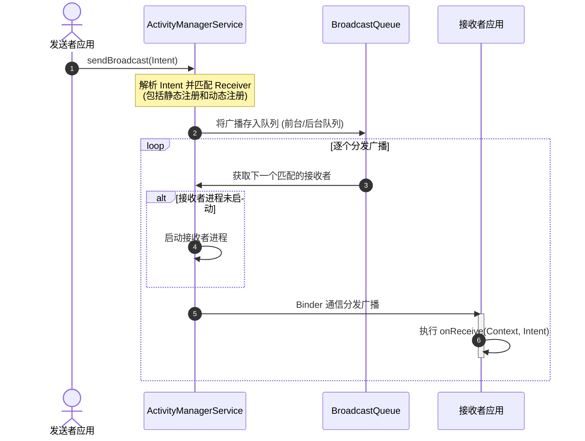

# Android BroadcastReceiver 概述

在 Android 复杂的组件化设计与跨进程通信体系中，**BroadcastReceiver（广播接收器）** 作为四大组件之一，扮演着“系统级大喇叭”与“消息总线”的角色。它是一种应用级和系统级发布-订阅（Publish-Subscribe）模式的事件监听器，专门用于在不同应用之间、同一应用的不同进程之间、以及应用内部的不同组件之间进行异步通信。

---

## 1. 核心概念（是什么）

### 1.1 基本定义与定位
`BroadcastReceiver` 是 Android 内部提供的一种用于接收并处理广播消息（Intent）的组件。它本身不具备用户界面（UI），但其可以通过创建通知（Notification）、启动服务（Service）或拉起特定 Activity 的方式与用户交互。

在 Android 系统中，广播可以源自两个方向：
* **系统广播（System Broadcasts）**：由 Android 系统在特定事件发生时发出。例如：网络状态切换、电量不足、系统开机完成、设备锁屏或解屏、拍照等。
* **自定义广播（Custom Broadcasts）**：由第三方应用或本应用自身发出，用于在特定业务场景下传递自定义的意图与数据。

### 1.2 发布-订阅模式与事件驱动机制
BroadcastReceiver 的架构模式是典型的**发布-订阅模式**。在这种设计中，消息的发送方（Publisher）和接收方（Subscriber）是高度解耦的。
* 发送方无需知道哪些组件或哪些应用订阅了该广播，它只需通过 `Context.sendBroadcast(Intent)` 将事件投递给 Android 系统。
* 接收方则通过声明 `IntentFilter`（意图过滤器）向系统注册其感兴趣的广播动作（Action）。
* 充当中间路由枢纽的是 Android 系统的 **ActivityManagerService (AMS)**。AMS 负责维护一张注册表，当有广播发出时，AMS 会解析该广播的 Action、Category、Data 等信息，匹配出所有符合条件的接收者，并调度它们执行相应的回调。

### 1.3 跨进程与跨组件通信（IPC）机制
在底层实现上，BroadcastReceiver 的核心是基于 **Binder 机制** 的跨进程通信（IPC）。
即使是在同一个进程内发送和动态接收广播，该消息也必须经过 Binder 进程间通信上报给 SystemServer 进程中的 AMS，由 AMS 统一加入广播队列（BroadcastQueue）中进行排序与分发，最后再通过 Binder 回调回当前进程的 `ApplicationThread`，最终分发给具体的 `BroadcastReceiver.onReceive()` 方法。

这种基于系统服务的统一调度机制使得 BroadcastReceiver 具备了天然的跨进程能力，但也因此带来了不可忽视的 IPC 性能开销。



---

## 2. 设计取舍（为什么）

### 2.1 引入广播机制的初衷与解耦价值
在移动操作系统设计中，**功耗控制**与**内存管理**是永恒的难题。如果每个应用为了监听网络切换、电池电量或屏幕状态，都必须常驻后台并启动线程进行高频的死循环轮询，那么设备的电池寿命和内存资源将迅速枯竭。

Android 引入系统广播正是为了解决这一痛点。通过将系统级状态变更统一收拢到操作系统的核心服务中，由系统负责在状态发生改变时“主动唤醒”对应的应用组件。这种**事件驱动**的设计带来了以下核心价值：
1. **极致的架构解耦**：广播发送者不需要持有接收者的引用，也不需要知道接收者是否处于活动状态。它们通过一套统一的协议（Intent 和 Action）完成通信。
2. **多播与一对多通信**：一个事件可以同时被系统内数个甚至数十个应用监听并处理，非常适合处理全局性的通知。
3. **按需唤醒与能效优化**：在 Android 早期设计中，静态注册的 BroadcastReceiver 可以让应用在进程未启动的状态下，仅因为一个特定的系统广播而被拉起执行。这避免了为了等待某个事件而长期保持后台进程存活。

### 2.2 本地总线通信方案对比（Flow, LiveData, EventBus）
虽然广播在跨进程和监听系统状态方面功能强大，但在**应用内部（单进程）**的常规通信中，使用系统广播就显得过于“沉重”和“危险”。因为它涉及 Binder 序列化和 AMS 的全局调度，不仅性能低下，还容易泄露数据或被恶意应用劫持。

因此，在进行应用内通信时，开发者通常会在**本地总线**与**广播**之间进行技术取舍。以下是它们之间的架构对比：

| 维度 | BroadcastReceiver | Kotlin Flow (SharedFlow) | LiveData | EventBus / RxBus |
| :--- | :--- | :--- | :--- | :--- |
| **通信范围** | 支持跨进程、跨应用、应用内 | 仅限单应用（单进程） | 仅限单应用（单进程） | 仅限单应用（单进程） |
| **通信机制** | Binder IPC / 系统服务中转 | 内存中协程通道、响应式流 | 内存中观察者模式 | 内存中事件分发、反射或注解 |
| **性能开销** | 极高（涉及序列化与 Binder 开销） | 极低（纯内存操作） | 极低（纯内存操作） | 较低（涉及少量反射或哈希表查找） |
| **生命周期感知** | 无（onReceive 执行完即销毁） | 可配合 `repeatOnLifecycle` 收集 | 天然支持（仅在活跃状态下分发） | 无（需手动注册与解绑，易内存泄露） |
| **异步/并发支持** | 极弱（受主线程 10s ANR 限制） | 极强（支持协程、挂起、灵活切换调度器） | 较弱（主要用于 UI 线程的数据观察） | 较强（支持多种线程模式调度） |
| **数据流特性** | 单次 Intent 触发 | 支持冷热流、背压处理、丰富的操作符 | 单一最新状态的粘性持有 | 任意事件对象的总线式分发 |

**架构选型结论**：
* 只有在涉及**跨进程通信**、**接收系统级广播**或者**与其他应用协同**时，才应该使用 `BroadcastReceiver`。
* 对于应用内的数据流分发和状态同步，优先使用 Kotlin `SharedFlow` / `StateFlow` 或 `LiveData`。它们拥有更好的性能、类型安全性以及生命周期感知能力。

---

## 3. 实现机制（怎么做）

### 3.1 静态注册与动态注册的深度对比
注册 BroadcastReceiver 有两种基本方式：**静态注册**（在 `AndroidManifest.xml` 中声明）和**动态注册**（在代码中通过 `registerReceiver` 调用）。它们在运行时的生命周期表现、安全特性和适用场景上有着本质的差异。

| 维度 | 静态注册 (Manifest) | 动态注册 (Context-based) |
| :--- | :--- | :--- |
| **定义与配置** | 在 `AndroidManifest.xml` 中使用 `<receiver>` 标签声明。 | 在 Java/Kotlin 代码中实例化并通过 `context.registerReceiver()` 注册。 |
| **注册时机** | 应用安装时，系统 PackageMS 会自动解析并记录该 Receiver。 | 应用运行期间，由特定的组件（如 Activity/Service/Application）主动注册。 |
| **生命周期** | 随系统而常驻。每当有匹配广播到来，系统会实例化该 Receiver，执行 `onReceive`，完毕后立即销毁。 | 绑定于注册它的 Context 生命周期。例如，在 Activity 中注册，必须在 Activity 销毁前解绑，否则会导致内存泄露。 |
| **进程唤醒能力** | **强**。即使应用进程当前未启动，系统也会通过 AMS 主动创建并拉起进程，执行广播接收逻辑（受到系统版本的隐式限制影响）。 | **无**。接收器只能在宿主进程存活且已执行注册代码时才能接收广播，无法自主拉起进程。 |
| **安全性** | 默认情况下（若包含 IntentFilter）是公开的，容易被外部应用恶意唤醒或伪造广播，需要严格配置 `exported` 属性。 | 作用域随生命周期变化而受控。从 Android 13 起，必须在注册时显式声明是否允许外部应用发送广播。 |
| **系统开销** | 较高。每次接收都需要反射创建 Receiver 实例，且可能涉及进程冷启动。 | 较低。接收器实例已在内存中常驻，仅做方法回调。 |
| **典型适用场景** | 监听系统全局性事件（如开机广播 `BOOT_COMPLETED`）。 | 监听与特定界面或业务逻辑强相关的事件（如在主界面监听网络状态切换以更新 UI）。 |

---

## 3.2 五大广播类型详解及废弃特性分析

### 3.2.1 无序广播（Normal Broadcast）
无序广播是使用最广泛的广播类型。通过调用 `context.sendBroadcast(Intent)` 发送。
* **特点**：广播一旦发出，所有匹配该 Intent 的 Receiver 都会以异步方式、几乎在同一时刻接收到该广播。
* **优缺点**：分发效率极高，没有明显的先后顺序。但这也意味着接收者之间无法进行信息交互，且**无法被拦截或终止**。

### 3.2.2 有序广播（Ordered Broadcast）
有序广播是一种同步执行的广播。通过调用 `context.sendOrderedBroadcast(Intent, String)` 发送。
* **特点**：AMS 会根据各个 Receiver 声明的优先级（通过 `android:priority` 属性指定，范围通常为 -1000 到 1000）进行降序排序，然后依次分发广播。同一优先级下，动态注册的接收器优先于静态注册的接收者。
* **交互机制**：
  * 后续的接收者必须等待前一个接收者的 `onReceive()` 执行完毕后才能接收广播。
  * 接收者可以通过 `abortBroadcast()` 方法直接**截断并拦截**广播，使链条后方的所有接收者再也收不到该事件。
  * 接收者可以通过 `setResultExtras(Bundle)` 传递、修改或向广播携带自定义数据，下一个接收者可以通过 `getResultExtras(true)` 获取这些数据。

```kotlin
// 有序广播接收者示例
class PriorityReceiver : BroadcastReceiver() {
    override fun onReceive(context: Context, intent: Intent) {
        // 获取上一个接收者传递的数据
        val bundle = getResultExtras(true)
        val data = bundle.getString("key_data")
        
        // 修改并继续传递
        bundle.putString("key_data", "$data -> ModifiedByPriorityReceiver")
        setResultExtras(bundle)
        
        // 如果满足特定条件，可以拦截广播
        if (shouldAbort) {
            abortBroadcast() // 后续接收者将无法收到此广播
        }
    }
}
```

### 3.2.3 本地广播（Local Broadcast）与废弃替代方案
本地广播 `LocalBroadcastManager` 曾经是 Android Support Library 中非常推荐的工具，用于应用内的高效、安全通信。
* **历史作用**：它的分发机制不走 AMS，不走 Binder，而是纯粹在应用进程内通过 Handler 进行消息分发。它不仅解决了安全泄露问题（外部应用无法监听或伪造），还消除了跨进程性能开销。
* **为什么被官方废弃**：
  谷歌官方已正式废弃 `LocalBroadcastManager`。主要原因在于：
  1. 它本质上只是一个**单例模式下的 Handler 观察者**，但却强行套用了系统广播中冗长而笨重的 `Intent`、`IntentFilter` 和 `BroadcastReceiver` 的 API 设计，设计冗余且不够优雅。
  2. 它不具备任何**生命周期感知能力**，开发者极易因为忘记调用 `unregisterReceiver()` 而引发严重的内存泄露。
  3. 它不符合现代 Android 响应式编程与状态驱动的设计哲学。
* **现代替代方案**：
  在单进程内部，官方极力推荐改用 **Kotlin Coroutines Flow (如 SharedFlow/StateFlow)** 或 **LiveData**。

```kotlin
// 替代方案一：使用 Kotlin SharedFlow 构建全局事件总线
object EventBus {
    private val _events = MutableSharedFlow<AppEvent>(extraBufferCapacity = 64)
    val events = _events.asSharedFlow()

    suspend fun post(event: AppEvent) {
        _events.emit(event)
    }
}

// 订阅事件示例（在 Activity/Fragment 中）
lifecycleScope.launch {
    repeatOnLifecycle(Lifecycle.State.STARTED) {
        EventBus.events.collect { event ->
            // 处理接收到的事件，天然具备生命周期感知，自动在 STOPPED 时暂停收集，避免内存泄露与安全隐患
            when (event) {
                is AppEvent.NetworkChanged -> updateNetworkUI(event.isConnected)
            }
        }
    }
}
```

### 3.2.4 粘性广播（Sticky Broadcast）的废弃剖析
粘性广播（Sticky Broadcast）通过 `context.sendStickyBroadcast(Intent)` 发送。
* **工作机制**：当粘性广播发出后，该广播的 Intent 会被系统永久保存在内存中。即使在广播发送之后才注册的接收器，在注册成功的瞬间也会立刻接收到该广播的最后一次状态。例如系统的 `ACTION_BATTERY_CHANGED` 就是典型的粘性广播。
* **废弃的核心原因**：
  从 Android 5.0（API 21）起，粘性广播已被正式废弃。这主要是基于以下缺陷：
  1. **严重的安全性与隐私漏洞**：任何第三方应用都可以通过构造对应的 Intent 覆盖、篡改系统或其他应用的粘性广播（因为系统并不校验发送者的身份）。这会导致敏感信息被恶意窃取或遭受伪造攻击。
  2. **内存消耗与资源驻留**：粘性广播会常驻系统内存中，如果应用大量发送粘性广播，会导致 SystemServer 进程内存不断膨胀。
  3. **数据一致性问题**：由于粘性广播可以被任意覆盖，且无法保证分发顺序，极易导致并发状态下的数据一致性错误。

### 3.2.5 显式广播与隐式广播
* **显式广播**：在 Intent 中明确指定了目标组件的 PackageName 或 ComponentName（例如 `intent.setComponent(...)`）。这种广播只会被指定的 Receiver 接收，具有极高的安全性和确定性。
* **隐式广播**：在 Intent 中只声明了 Action 等抽象信息。任何注册了对应 IntentFilter 的应用都能接收到该广播。由于隐式广播容易导致后台唤醒泛滥，在 Android 8.0 之后受到了极为严格的限制。

---

## 3.3 广播的生命周期与执行限制

### 3.3.1 `onReceive` 执行线程与 10秒 ANR 边界
BroadcastReceiver 的生命周期从 `onReceive()` 被调用开始，到 `onReceive()` 执行完毕返回结束。这个生命周期是四大组件中最短暂的。

> [!IMPORTANT]
> `BroadcastReceiver.onReceive()` 默认是运行在**主线程（UI 线程）**中的。

这意味着：
1. **严禁在 `onReceive()` 中执行耗时操作**。如文件 I/O、数据库读写、网络请求或复杂的计算。
2. **10秒 ANR 限制**：对于前台广播，如果在主线程执行 `onReceive()` 超过 **10 秒**，系统就会判定发生 ANR（Application Not Responding）。对于后台广播，这个限制虽然放宽到了 **60 秒**，但在后台执行长耗时任务同样会遭到系统优先杀死进程的惩罚。
3. **进程生命周期的脆弱性**：当 `onReceive()` 返回后，系统会认为该 Receiver 已经不再活跃。如果该应用当前没有其他活跃的组件（如正在显示的 Activity 或正在运行的前台 Service），系统的垃圾回收机制会将该进程的优先级定为最低的**空进程（Empty Process）**，在内存不足时进程随时可能被直接杀掉。因此，千万不要在 `onReceive` 中通过启动子线程（如 `Thread { ... }.start()`）去跑异步耗时任务，因为进程可能在你的线程还没跑完时就被系统强制终结了。

---

### 3.3.2 异步任务的底层延续：`PendingResult.goAsync()`
如果确实需要在广播接收器中执行一个**短暂的异步操作**（例如写入一个简单的 KV 缓存或查询轻量级数据库），且预计时间在几秒钟之内，可以使用 `goAsync()` 机制。

* **原理**：调用 `goAsync()` 后，系统会返回一个 `PendingResult` 对象。它会指示 AMS 暂时保留该 BroadcastReceiver 关联的进程活性（提升进程优先级，避免进程在主线程返回后立刻被回收），允许你在子线程中处理完工作后，手动调用 `PendingResult.finish()` 来宣告接收器生命周期的终结。

```kotlin
class QuickAsyncReceiver : BroadcastReceiver() {
    override fun onReceive(context: Context, intent: Intent) {
        // 调用 goAsync 开启异步处理通道，通知系统暂时保留进程
        val pendingResult: PendingResult = goAsync()
        
        // 调度到后台子线程中执行短暂异步任务
        Dispatchers.IO.asExecutor().execute {
            try {
                // 执行短暂的数据库读取或简单的 I/O 操作（时间必须控制在 10 秒内）
                performQuickDiskWrite(intent)
            } finally {
                // 必须在执行完毕后调用 finish()，否则会导致广播队列阻塞并最终触发 ANR
                pendingResult.finish()
            }
        }
    }
}
```
> [!WARNING]
> `goAsync()` 并没有取消 10 秒的超时 ANR 限制，它只是将 ANR 的计时器从主线程转移到了你所开辟的异步线程中。如果在子线程执行任务的时间仍然超过了广播超时阈值，系统依然会弹出 ANR。

---

### 3.3.3 真正耗时任务的正确姿势：WorkManager 协作
对于预计执行时间超过 10 秒、甚至长达数分钟的后台耗时任务（如拉取大文件、同步远程服务器数据、解析大量图片等），**唯一正确的方案**是在 `onReceive()` 中启动 **WorkManager** 的后台任务。

* **优势**：`WorkManager` 会将任务参数持久化到系统的 SQLite 数据库中。即使应用进程在广播返回后被系统强行杀掉，一旦系统资源恢复，或者满足了你设定的约束条件（如连接上 Wi-Fi、插入充电器），系统也会通过底层的 JobScheduler 自动唤醒并拉起你的进程继续执行 Worker。

```kotlin
// 1. 定义具体的后台任务 Worker
class SyncDataWorker(context: Context, params: WorkerParameters) : CoroutineWorker(context, params) {
    override suspend fun doWork(): Result {
        return try {
            // 在此执行真正的长耗时操作，如网络请求、大数据同步等
            val success = makeHeavyNetworkRequest()
            if (success) Result.success() else Result.retry()
        } catch (e: Exception) {
            Result.failure()
        }
    }
}

// 2. 在 BroadcastReceiver 中触发 WorkManager
class HeavyTaskReceiver : BroadcastReceiver() {
    override fun onReceive(context: Context, intent: Intent) {
        // 构建约束条件（非必须，根据业务选填）
        val constraints = Constraints.Builder()
            .setRequiredNetworkType(NetworkType.UNMETERED) // 必须在免流量网络（如 Wi-Fi）下
            .setRequiresCharging(true) // 必须在充电时
            .build()

        // 构造单次任务请求
        val syncRequest = OneTimeWorkRequestBuilder<SyncDataWorker>()
            .setConstraints(constraints)
            .build()

        // 将任务排入队列，这行代码是极速执行且非阻塞的，完美避开 10s ANR 限制
        WorkManager.getInstance(context.applicationContext).enqueue(syncRequest)
    }
}
```

---

## 4. 常见误区与最佳实践

### 4.1 安全性设计与漏洞防范
由于 BroadcastReceiver 支持跨应用通信，这导致它极易面临安全挑战：**拒绝服务攻击（恶意频繁发送广播阻塞应用）**、**数据泄露（隐式广播发送时被恶意应用拦截）** 以及 **越权漏洞（恶意应用发送广播触发本应用的敏感逻辑）**。

为了确保广播的安全性，在日常开发中必须遵循以下最佳实践：

1. **应用内通信绝不使用全局隐式广播**：优先使用动态注册并做好作用域隔离，或彻底用协程 Flow 替换。
2. **显式控制 `android:exported`**：
   在 `AndroidManifest.xml` 中定义 `<receiver>` 时，如果该接收器仅在应用内部使用，必须显式将其 `android:exported` 属性设为 `false`。
   > [!NOTE]
   > 在 Android 12（API 31）及以上版本中，如果组件声明了 `<intent-filter>` 却未显式指定 `android:exported` 的值，应用将在打包或运行时直接编译报错崩溃。
3. **使用自定义权限（Permission）建立双向校验**：
   * **接收权限校验**：只希望特定应用向我的 Receiver 发送广播。可以在 Manifest 的 `<receiver>` 节点配置 `android:permission`。
     ```xml
     <!-- 声明只有持有本权限的应用才能向我发广播 -->
     <receiver android:name=".SecureReceiver"
               android:permission="com.example.permission.SEND_MY_BROADCAST"
               android:exported="true">
         <intent-filter>
             <action android:name="com.example.action.SECURE_EVENT" />
         </intent-filter>
     </receiver>
     ```
   * **发送权限校验**：发送广播时，只希望拥有特定权限的接收者才能收到此广播。可以在发送时传递权限参数。
     ```kotlin
     context.sendBroadcast(intent, "com.example.permission.RECEIVE_MY_BROADCAST")
     ```
4. **指定 Receiver 包名（显式广播）**：
   发送广播时，如果目标是明确的某个应用，直接指定包名可以有效避免广播内容被中途截获窃听。
   ```kotlin
   val intent = Intent("com.example.action.MY_EVENT").apply {
       setPackage("com.example.targetapp") // 仅发送给该包名下的应用，其他应用无法接收
   }
   context.sendBroadcast(intent)
   ```
5. **Android 13+ 动态注册安全 Flags 强制要求**：
   从 Android 13（API 33）起，为了防范动态注册接收器被第三方恶意发送，动态注册时必须指定 `Context.RECEIVER_EXPORTED` 或 `Context.RECEIVER_NOT_EXPORTED` 标志（如果该 Receiver 接收的是系统广播如电源连接，则无需指定）。

```kotlin
// Android 13+ 安全动态注册示例
if (Build.VERSION.SDK_INT >= Build.VERSION_CODES.TIRAMISU) {
    context.registerReceiver(
        myReceiver,
        IntentFilter("com.example.action.INTERNAL_EVENT"),
        Context.RECEIVER_NOT_EXPORTED // 明确限制：外部应用不允许发送此广播给我
    )
} else {
    context.registerReceiver(myReceiver, IntentFilter("com.example.action.INTERNAL_EVENT"))
}
```

---

### 4.2 适配 Android 8.0+ 隐式广播限制
在 Android 8.0（API 26）之前，大量应用静态注册了诸如 `CONNECTIVITY_ACTION`（网络变化）、`ACTION_POWER_CONNECTED`（电源接通）等系统广播。每当事件发生，系统就会在瞬间冷启动拉起这成百上千个应用的进程。这导致系统出现严重的 CPU 争抢、内存剧烈抖动、GC 阻塞以及瞬时的电量骤降。

为了根治后台乱象，**Android 8.0 开始禁止大部分隐式静态广播**。

#### 4.2.1 限制内容
* 静态注册的广播接收器不能再接收隐式广播（即只指定了 Action，没有明确指定具体 Receiver Class 的广播）。
* 如果应用依然在 Manifest 中静态注册这些广播，那么当广播发出时，系统将直接**忽略该注册信息**，你的应用不会收到任何通知。

#### 4.2.2 应对与适配方案
1. **改为动态注册**：在 Activity/Service 处于前台或活跃状态时，在代码中注册接收器，不需要时解绑。这使得系统分发广播时，只有处于运行状态的进程才会接收，极大地节省了系统整体开销。
2. **利用特定豁免列表**：
   虽然隐式静态广播被严格封锁，但谷歌考虑到某些极其基础 of 系统事件在进程被杀时依然需要被感知，因此列出了一张**豁免清单（Implicit Broadcast Exceptions）**。以下广播依然允许在 `AndroidManifest.xml` 中进行静态注册：
   * `ACTION_BOOT_COMPLETED`（系统开机广播）
   * `ACTION_LOCALE_CHANGED`（系统语言设置改变）
   * `ACTION_TIMEZONE_CHANGED`（时区改变）
   * `ACTION_PACKAGE_FULLY_REMOVED`（安装包完全移除）
   * 完整的豁免列表请查阅 [AndroidVersionChangeLog.md](../../../../../AndroidVersionChangeLog.md) 及官方文档。
3. **改用 WorkManager 的约束条件替代系统监听**：
   例如，过去通过静态监听网络变化广播来启动同步任务的做法，现在应改用 `WorkManager` 的 `NetworkType` 约束。当网络变为可用时，WorkManager 会自动开始调度任务。

有关 Android 各历史版本对四大组件及后台机制演进的完整脉络，请参考 [AndroidVersionChangeLog.md](../../../../../AndroidVersionChangeLog.md)。
