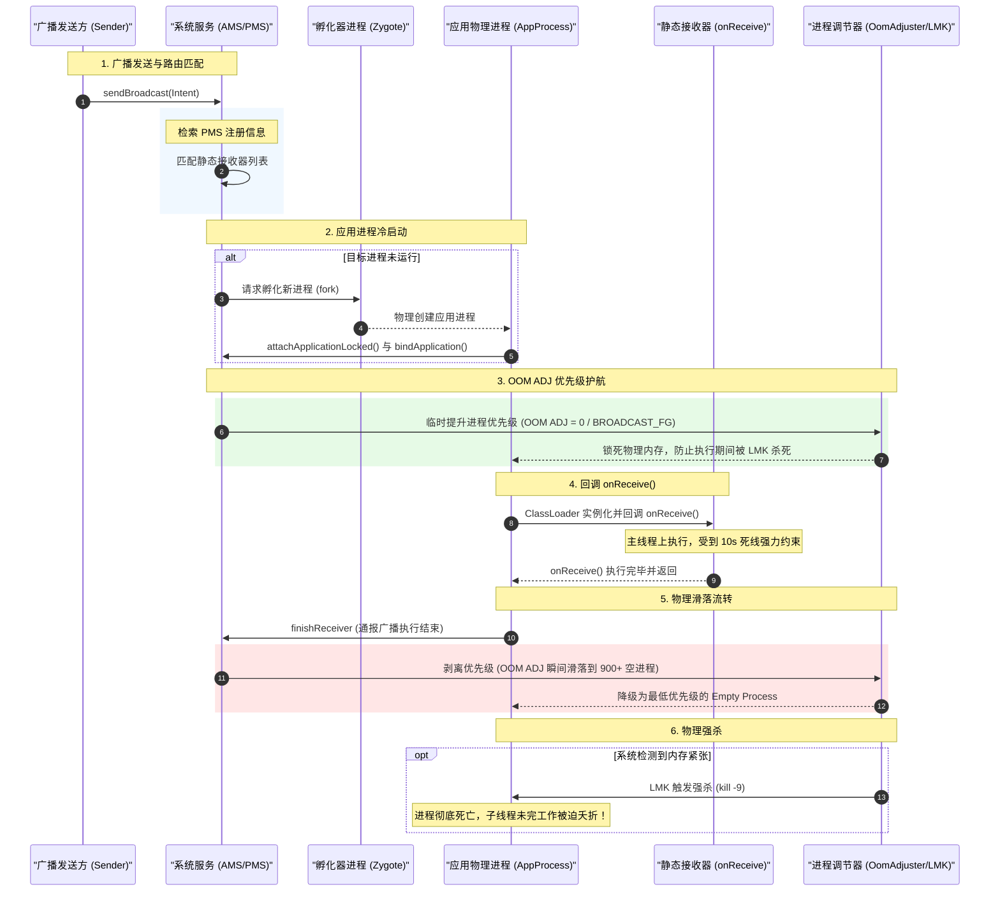

# 5.1.2.3.1 静态广播

静态广播接收器（Manifest-declared BroadcastReceiver）是 Android 系统中历史悠久且极为强大的事件分发与组件唤醒机制。与依赖应用运行期生命周期进行动态绑定的动态广播接收器（Context-registered Receiver）不同，静态广播接收器通过在应用的清单文件（`AndroidManifest.xml`）中声明，使其能够在应用完全未启动（甚至已被系统物理终止）的情况下，被系统强制拉起并执行特定的初始化或响应逻辑。

然而，这种无条件唤醒的能力也为系统带来了极大的功耗与性能压力。随着 Android 系统版本的演进，官方对静态广播的限制一步步收紧。本篇文章将深入静态广播接收器的底层架构，探讨其冷启动拉起逻辑、生命周期与 `OOM ADJ` 优先级在物理上的滑落流转、`onReceive()` 的 10 秒死线、异步方案的避坑策略、Android 8.0 隐式广播大禁令的根本性颠覆，以及多维度的组件安全设计。

---

## 1. 静态广播的注册解析与冷启动拉起机制

要理解静态广播为什么能拉起一个未启动的应用，必须从系统的安装期和广播分发期的底层源码逻辑谈起。

### 1.1 系统安装期的清单解析（PMS 解析）
当用户安装 APK 时，系统会启动 `PackageManagerService`（简称 PMS）。PMS 内部的解析器（早期版本为 `PackageParser`，现代版本演进为 `ParsingPackageImpl` 与 `PackageParser2`）会递归读取并解析 APK 中的 `AndroidManifest.xml` 文件。

当解析器遇到 `<receiver>` 标签时，会为其创建对应的组件元数据，并构建一个指向该接收器的 `ActivityIntentResolver`。PMS 会将这些解析出来的静态接收器信息保存在系统内存的 `mReceivers` 列表中。

> **核心结论**：静态广播接收器的注册是“静态且永久”的。即使应用处于未启动状态（Stopped State 之前），系统组件信息列表中也已经记录了该应用对哪些 Intent Action 感兴趣。这与动态注册广播（其生命周期严格依附于宿主 Activity 或 Service 的内存空间）存在本质的物理区别。

### 1.2 广播分发与应用物理进程冷启动流程
当某个应用或系统服务通过 `Context.sendBroadcast()` 发送广播时，该调用会通过 Binder 跨进程通信（IPC）传递至系统进程中的 `ActivityManagerService`（简称 AMS）。

AMS 在接收到广播后，会开始执行 `broadcastIntentLocked()` 流程：
1. **匹配接收者**：AMS 检索内存中已注册的动态接收器（`RegisteredResolvers`），并向 PMS 的 `mReceivers` 检索匹配该广播 Action 及 Filter 约束的静态接收器（`ResolveInfo` 列表）。
2. **构建广播队列**：AMS 将匹配到的所有接收器按照优先级（Priority）排序，整合成一个待分发的广播记录（`BroadcastRecord`），并加入到前台广播队列（`mFgQueue`）或后台广播队列（`mBgQueue`）中。
3. **分发与状态检测**：当广播队列调用 `processNextBroadcastLocked()` 处理下一个广播时，如果发现目标接收器是静态声明的，AMS 会首先调用 `PackageManagerInternal.getActivityInfo()` 校验目标组件的有效性，并检测目标应用进程是否已经在运行。
4. **触发冷启动**：如果该应用进程当前不存在，AMS 绝不会抛弃此广播，而是启动“冷启动拉起进程”机制：
   - AMS 调用 `ProcessList.startProcessLocked()`，通过 Socket 向进程孵化器 `Zygote` 发送创建进程的请求。
   - `Zygote` 接收到命令后，物理 fork 产生新的应用子进程。
   - 新子进程初始化运行环境，执行 `ActivityThread.main()` 入口函数。
   - 主线程初始化主 Loop 并通过 Binder 调用向 AMS 发送 `attachApplicationLocked()`，告知系统进程当前应用进程已就绪。
   - AMS 收到后，执行 `bindApplication()`，加载应用的类装载器、资源文件，并依次调用 `Application.attachBaseContext()` 以及 `Application.onCreate()`。
5. **分发广播并回调**：在进程的 Application 初始化完成后，AMS 通过 Binder 发送事务分发广播。应用进程的主线程（UI 线程）通过反射实例化对应的 `BroadcastReceiver` 子类，并随即回调其 `onReceive(Context context, Intent intent)` 方法。

---

## 2. 生命周期生命线与 OOM ADJ 物理滑落流转

静态广播接收器的生命周期非常脆弱，其完整的生命长度仅局限于 `onReceive()` 方法的执行期。一旦该方法执行完毕并返回，系统即认为该广播接收器已死，其占用的组件实例也会被立刻标记为垃圾回收对象。

伴随这一生命周期流转的，是系统对于该应用物理进程的 `OOM ADJ`（Out-of-Memory Adjuster，进程优先级调节器）精细的物理控制与滑落过程。

### 2.1 广播接收期间的优先级护航
当 AMS 准备将广播分发给目标进程时，为了防止该应用在回调 `onReceive()` 期间因为系统内存不足被意外杀死，AMS 会通过 `OomAdjuster` 临时且强力地提升该进程的 `OOM ADJ`。
- 此时，该进程会被赋予 `BROADCAST_FG_ADJ`（在很多系统中等同于前台优先级 `FOREGROUND_APP_ADJ = 0`）或者非常高的保活评级。
- 此时的进程几乎可以免疫系统的 `Low Memory Killer`（简称 LMK）的清理机制，这为静态广播的执行提供了稳定且受保护的硬件和内存环境。

### 2.2 广播结束后的 OOM ADJ 物理滑落
一旦应用进程的 `onReceive()` 方法执行完毕并向系统进程发送 `finishReceiver` 的 Binder 确认信号后，AMS 就会立即将该进程从广播队列中移除。
- 此时，如果该应用进程内没有其他活跃的四大组件（即当前没有可见的 Activity，没有正在运行的前台服务，也没有绑定的 Service），该进程对于系统而言就失去了“即时交互价值”。
- `OomAdjuster` 随即会把该进程的 `OOM ADJ` 评分瞬间降至最低的空进程级别（`EMPTY_APP_ADJ`，在 Android 系统中其数值通常为 `900` 甚至更高）。
- **LMK 的物理强杀**：空进程是系统为了下次启动时加速而保留的“外壳”。当系统内存稍有紧张时，LMK 机制在扫描进程列表时会毫不犹豫地向空进程发送 `SIGKILL` 信号。这意味着，一旦 `onReceive()` 执行完毕，该应用进程随时随地都有可能在几毫秒内被系统彻底物理抹除。

### 2.3 物理滑落流转时序图
下图展示了系统接收静态广播后拉起新进程、回调 `onReceive`，以及执行结束后 `OOM ADJ` 物理滑落并最终被 LMK 物理强杀的完整流转过程：



---

## 3. onReceive() 的 10 秒死线与异步处理雷区

因为静态广播的回调方法运行在应用进程的主线程中，主线程的阻塞会导致极其恶劣的用户体验。为此，Android 系统设定了极其严格的执行死线。

### 3.1 10 秒 ANR 时限的底层机制
在系统服务层，广播的分发和确认由 `BroadcastQueue` 统一管理。
- 当 AMS 将一个广播分发给特定应用进程时，会在 `BroadcastQueue` 中设置一个定时炸弹——超时消息（`BROADCAST_TIMEOUT_MSG`）。
- **前台广播**（指定了 `Intent.FLAG_RECEIVER_FOREGROUND`）的超时时限非常短，通常为 **10秒**（对于应用进程而言；系统级广播有时为 120 秒）。
- **后台广播**（默认情况）的超时时限相对较宽，通常为 **60秒**。
- 如果在这个规定的时限内，应用进程的主线程没有处理完该广播（即 `onReceive()` 还没执行完），或者因为其他主线程任务卡顿未能及时返回确认信号，AMS 就会立即认定该应用发生死锁或无响应，随即触发臭名昭著的 **ANR (Application Not Responding)**。

### 3.2 子线程异步处理的物理雷区
很多初学者为了规避 10 秒的限制，自然而然会写出如下代码：

```java
// ❌ 灾难性的异步执行错误示范
@Override
public void onReceive(Context context, Intent intent) {
    new Thread(() -> {
        // 执行一段耗时 15 秒的数据同步任务
        doHeavySyncWork(); 
    }).start();
}
```

**为什么这是一场技术灾难？**
1. **进程降级**：`onReceive()` 在极短时间内执行完毕并返回，主线程把“已完成”的确认信号发送给 AMS。
2. **OOM ADJ 物理滑落**：AMS 收到确认后，认为这个广播的任务已经圆满结束，不再对该应用进程做任何优先级保护。该进程在瞬间滑落为 `OOM ADJ = 900+` 的空进程（Empty Process）。
3. **被瞬间物理扼杀**：虽然你启动了后台线程，但在系统看来，这个进程中已经没有运行中的四大组件。只要设备内存略微紧张，LMK 就会发出 `SIGKILL` 强杀该进程。
4. **后果**：你的后台线程可能刚刚开始执行 `doHeavySyncWork()` 的前 2 秒，进程就被强杀。这会导致数据库写入中断、文件损坏、网络请求中途失败，引发各种诡异且极其难以定位的线上 Bug。

### 3.3 goAsync() 机制的工作原理与适用边界
为了给开发者提供一条合法的“微型异步执行通道”，Android 从 API 11 开始引入了 `BroadcastReceiver.goAsync()` 接口。

#### goAsync() 示例代码：
```java
// 使用 goAsync 允许在子线程执行短时间的异步任务
@Override
public void onReceive(Context context, Intent intent) {
    // 1. 调用 goAsync 获取 PendingResult
    final PendingResult pendingResult = goAsync();
    
    // 2. 扔到应用全局线程池中执行异步操作
    AppExecutor.getInstance().diskIO().execute(() -> {
        try {
            // 3. 执行一次耗时 2~3 秒的轻量数据库存盘操作
            saveToDatabase(intent);
        } finally {
            // 4. 无论成功失败，必须确保显式调用 finish()，通知系统广播结束
            pendingResult.finish();
        }
    });
}
```

#### 底层运行机制：
- 调用 `goAsync()` 时，系统会产生一个 `PendingResult` 结构。此时，尽管 `onReceive()` 方法立即返回并退出，但在 AMS 端，它并没有收到该 Receiver 对应的 `finish` 消息，AMS 会在一定时间内继续保持该进程较高的 `OOM ADJ` 评级（通常为 `BROADCAST_FG_ADJ` 级别），保护其不被 LMK 物理抹除。
- 当子线程中的耗时任务处理完毕并调用 `pendingResult.finish()` 时，这行代码会通过 Binder 跨进程向 AMS 递交确认，此时 AMS 才会真正结束该广播，并准许该进程降级。

#### goAsync() 的致命局限性：
- **依然受到超时队列的死线制约**！`goAsync()` 并没有为应用进程争取到额外的无限制执行时间。你的整个异步任务从 `onReceive()` 启动到 `finish()` 被调用，**必须在同一个广播超时队列的时限内完成**（前台广播必须在 10 秒内，后台广播通常必须在 60 秒内）。
- 如果你试图在 `goAsync()` 中执行一个长达 30 秒的后台下载任务，系统在前台广播队列的 10 秒限制到来时，依然会毫不留情地弹出 ANR。
- **适用边界**：`goAsync()` **只适用于耗时在数秒内的轻量级、短时异步任务**（如需要向 SharedPreferences 写入几条数据，或做一次本地数据库的增删改，执行时间在 1~3 秒内）。

### 3.4 结合 WorkManager 执行长时重度后台任务
对于真正重度的耗时任务（如需要持续数分钟的下载、大规模文件压缩、多图上传、批量同步等），`goAsync()` 完全无法胜任。唯一正确的架构方式是结合系统级任务调度器 `WorkManager`（或早期的 `JobScheduler`）。

有关 `WorkManager` 的系统级实现细节与架构原理，可参考：[WorkManager 专题](../../../../../docs/5.Android/5.5.架构与工程化/5.5.2.Jetpack架构组件/5.5.2.3.WorkManager.md)。

#### 静态广播与 WorkManager 完美配合方案：
```java
public class MyStaticReceiver extends BroadcastReceiver {
    @Override
    public void onReceive(Context context, Intent intent) {
        // 1. 快速抽取广播中携带的参数
        String syncType = intent.getStringExtra("sync_type");

        // 2. 构造数据包传递给 Worker
        Data inputData = new Data.Builder()
                .putString("key_sync_type", syncType)
                .build();

        // 3. 构造一个一次性的 WorkRequest
        OneTimeWorkRequest syncRequest = new OneTimeWorkRequest.Builder(SyncWorker.class)
                .setInputData(inputData)
                .build();

        // 4. 极其快速地将任务 enqueue 提交给系统调度器
        WorkManager.getInstance(context.getApplicationContext()).enqueue(syncRequest);
        
        // 5. 立即结束 onReceive() 返回，完全规避 ANR 并安全退出
    }
}
```

#### 该配合方案的底层物理优势：
- `onReceive()` 在 5 毫秒内即可极速完成并返回，对于系统进程而言，该广播已安全结束，完美避开了 10 秒 ANR 死线。
- 随后，哪怕应用进程的 OOM ADJ 迅速滑落并被系统杀死，`WorkManager` 在系统底层注册的 `JobScheduler` 或者 Alarm 闹钟依然有效。
- 一旦系统检测到设备资源充足、网络就绪（可配置 Worker 的约束条件 Constraints），系统便会调用系统服务重新唤起应用进程，并安全调度 `SyncWorker` 里的 `doWork()` 执行耗时逻辑。

---

## 4. Android 8.0 后台隐式广播大禁令与颠覆

静态广播在其早期设计中被过度滥用，成为了 Android 系统的功耗与卡顿元凶。为此，Android 8.0 (API 26) 引入了根本性的颠覆规则。

有关 Android 系统的全部版本演进脉络，可参见：[AndroidVersionChangeLog.md](../../../../../AndroidVersionChangeLog.md#android-80--81api-26--27)。

### 4.1 惊群效应（Thundering Herd）的功耗灾难
在 Android 7.0 之前，应用可以静态注册绝大多数系统广播。
- 举个例子，假设用户的手机里安装了 200 个 App，这 200 个 App 都在 `AndroidManifest.xml` 中静态注册了对系统网络变化广播 `android.net.conn.CONNECTIVITY_CHANGE` 的监听。
- 当用户从 Wi-Fi 切换为移动数据网络时，系统会向全局广播这个变化。
- 这会导致 AMS 一瞬间在后台并发冷启动拉起这 200 个进程。
- 物理表现就是：手机的 CPU 瞬间飙到 100%，内存发生剧烈的频繁换页（Thrashing），电池电量暴跌，前台当前运行的游戏瞬间卡住，这就是著名的**惊群效应**。

### 4.2 隐式广播与显式广播的分发区别
为了消除惊群效应，系统必须将“隐式群发”和“显式点对点发送”的行为进行剥离。

| 广播类型 | 定义与特征 | 底层分发逻辑 |
| :--- | :--- | :--- |
| **显式广播 (Explicit Broadcast)** | 在发送广播的 Intent 中，显式指定了目标应用组件的包名或类名（如通过 `Intent.setComponent()` 或 `Intent.setClass()` 显式指定接收方）。 | 系统在分发时直接判定其接收者唯一，只会定向唤醒或发送给该特定应用进程。**不受 Android 8.0 静态注册禁令的影响**。 |
| **隐式广播 (Implicit Broadcast)** | 在 Intent 中只指定了一个通用的 Action（如 `"com.example.action.MY_EVENT"`），没有携带明确的接收方包名与类名。 | 系统必须向 PMS 全局匹配所有对该 Action 感兴趣的动态与静态接收器。**被 Android 8.0 彻底禁止在 Manifest 中静态注册**。 |

### 4.3 禁令对静态广播的颠覆性规定
自 [Android 8.0（API 26）](../../../../../AndroidVersionChangeLog.md#android-80--81api-26--27) 开始，如果应用的 `targetSdkVersion` 设置为 **26** 或更高：
- 应用在 `AndroidManifest.xml` 中为**隐式广播**注册的静态接收器将**无法**接收到广播。
- 当你发送一个隐式广播，且系统判定某些 Receiver 是静态注册的，AMS 会直接在 `broadcastIntentLocked()` 方法的匹配过滤环节将这些静态接收器无情剔除，不会触发任何应用进程的拉起。

### 4.4 静态隐式广播的白名单豁免列表
系统针对一些极度重要、触发频率极低且与应用初始化和设备状态强相关的事件进行了特殊豁免。即使 targetSdkVersion >= 26，应用依然可以在 Manifest 中静态监听以下隐式广播（部分常见 Action）：

1. **`ACTION_BOOT_COMPLETED`** (`android.intent.action.BOOT_COMPLETED`)：系统开机广播。为了让应用在开机后能重新设定闹钟、调度任务，该广播被网开一面。
2. **`ACTION_LOCALE_CHANGED`** (`android.intent.action.LOCALE_CHANGED`)：系统语言/区域设置改变。
3. **`ACTION_TIMEZONE_CHANGED`** (`android.intent.action.TIMEZONE_CHANGED`)：系统时区改变。
4. **与硬件挂载相关的广播**：如 `ACTION_MEDIA_MOUNTED`（媒体已挂载）、`ACTION_MEDIA_UNMOUNTED` 等。
5. **部分与外设连接的广播**：如蓝牙、USB 相关的部分连接状态改变广播。
6. **应用自身状态变化的广播**：如 `ACTION_MY_PACKAGE_REPLACED`（应用自身被覆盖安装时）。

> 完整的白名单列表可在 Android 官方开发者文档中的“隐式广播例外情况”（Implicit Broadcast Exceptions）中查阅。

### 4.5 现代开发中的应对与适配之道
在现代 Android 架构中，静态广播已退化为辅助组件，动态注册与任务调度成为了主流替代方案：
- **前台感知**：对大部分仅需在应用处于前台运行时监听的广播（如网络变化、电量变化、息屏事件），应用必须改为**动态注册**。在 Activity 或 Service 的 `onStart()` 中注册，在 `onStop()` 中注销，实现精确的生命周期闭环。
- **后台事件**：对于原先依赖静态广播唤醒执行后台同步的业务，全部重构为使用 **WorkManager**。WorkManager 可以设定约束条件（Constraints），如“仅在 Wi-Fi 连接且充电时运行”，由系统在底层更智能地合并、延迟并调度这些后台执行任务，彻底杜绝瞬间惊醒。

---

## 5. 安全设计：android:exported 约束与权限校验

静态广播接收器是暴露给系统和外部应用的重要 IPC 入口，如果不进行严格的权限控制与加固，极易引发越权唤醒（Wakeup Abuse）与敏感信息泄露的安全灾难。

### 5.1 android:exported 属性对外部唤起的约束
在 `<receiver>` 组件声明中，`android:exported` 属性指定了该广播接收器是否能接收来自应用外部发送的广播。

#### 5.1.1 默认值生成规则：
- 如果该 `<receiver>` **不包含**任何 `<intent-filter>` 标签，其默认值是 `false`。该接收器只能接收本应用自身发送的广播。
- 如果该 `<receiver>` **包含**了至少一个 `<intent-filter>` 标签，其默认值在低于 Android 12 的版本中是 `true`。这意味着任何外部恶意应用都可以通过模仿 Action 直接发送广播唤起你的接收器。

#### 5.1.2 Android 12 的编译期强收紧：
自 [Android 12（API 31）](../../../../../AndroidVersionChangeLog.md#android-12api-31) 开始，如果接收器组件包含了 `<intent-filter>`，开发者**必须显式指定** `android:exported` 的值（`true` 或 `false`）。如果在配置中遗漏了该属性，在构建打包 APK 时会直接报编译错误，阻止危险默认配置上线。

#### 5.1.3 防范越权唤醒攻击：
对于仅在应用内闭环使用的静态广播，应坚极避免暴露，将其 `android:exported` 设定为 `false`。
```xml
<!-- 仅允许应用内广播触发，不接收外界任何广播，杜绝越权攻击 -->
<receiver
    android:name=".MyInternalReceiver"
    android:exported="false">
    <intent-filter>
        <action android:name="com.example.action.INTERNAL_SYNC" />
    </intent-filter>
</receiver>
```

### 5.2 自定义权限（Permission）校验与双向防护
在某些场景下，我们的静态接收器必须对外暴露（如需响应第三方联运应用的某些状态推送），但又不能对全网公开。此时，应采用权限校验进行双向防护。

```
     【发送端应用 (Sender)】                       【接收端应用 (Receiver)】
  
  持有权限: SEND_SECURE_EVENT                    要求权限: SEND_SECURE_EVENT
         │                                              │
         ▼                                              ▼
   [发送显式广播] ───( AMS 权限检验: 签名匹配通过 )───► [回调 onReceive()]
         ▲                                              ▲
         │                                              │
  指定接收者权限:                                导出属性显式开启:
  RECEIVE_SECURE_REPLY                          android:exported="true"
```

#### 5.2.1 接收端校验（加固保护接收器）
为了只允许拥有特定权限的应用发送广播给我们，我们可以在清单文件中定义自定义权限，并设置安全级别：

1. **定义签名级权限**：
```xml
<!-- 仅允许签名一致的应用申请和持有该权限，安全等级最高 -->
<permission
    android:name="com.example.permission.SEND_SECURE_EVENT"
    android:protectionLevel="signature" />
```

2. **在静态接收器中引用该权限**：
```xml
<receiver
    android:name=".SecureReceiver"
    android:exported="true"
    android:permission="com.example.permission.SEND_SECURE_EVENT">
    <intent-filter>
        <action android:name="com.example.action.SECURE_EVENT" />
    </intent-filter>
</receiver>
```
**安全原理**：当外部应用发送 Action 为 `com.example.action.SECURE_EVENT` 的广播时，系统 AMS 会在分发前强行拦截，校验该发送者应用是否持有并申请了 `com.example.permission.SEND_SECURE_EVENT` 权限。由于该权限的 protectionLevel 是 `signature`，非我方签名的第三方应用根本无法获得该权限，系统会直接判定校验不通过并抛出 SecurityException，彻底阻断外界非法唤醒。

#### 5.2.2 发送端校验（加固保护广播携带的数据）
如果我们的应用发送广播，并带有敏感数据（例如 Token、私密广播数据），我们同样需要防止被第三方的恶意静态或动态接收器非法监听。

此时，我们应在发送时指定接收方必须持有的权限：
```java
Intent intent = new Intent("com.example.action.SECURE_REPLY");
intent.putExtra("sensitive_data", "SuperSecretToken");

// 发送广播时，传入接收方必须持有的自定义权限
sendBroadcast(intent, "com.example.permission.RECEIVE_SECURE_REPLY");
```
**安全原理**：AMS 会扫描所有注册该广播的接收者，如果发现某些接收器所属的应用没有在 Manifest 中声明并持有 `"com.example.permission.RECEIVE_SECURE_REPLY"` 权限，系统将直接对其过滤，禁止该应用接收到含有敏感数据的 Intent 实体。

---

## 6. 总结与现代实践准则

在现代 Android 系统的功耗与安全框架下，静态广播的使用需要遵循严苛的架构规则。以下是针对静态广播的实践准则：

1. **能避则避，动态为主**：对于大部分非必须在后台冷启动唤醒的业务逻辑，坚决使用动态注册的 `BroadcastReceiver` 代替静态注册，并在生命周期结束时及时注销，杜绝泄露。
2. **轻量极速，拒绝耗时**：静态广播接收器的 `onReceive()` 是跑在主线程上的，执行死线通常为 10 秒。任何超出毫秒级的数据库、文件写入等 IO 任务，都不应在主线程阻塞执行。
3. **不要依赖 goAsync 执行长任务**：`goAsync()` 只能推迟广播结束的时间以维持进程 ADJ，但它依然受制于 10s 的 ANR 超时线。它绝对不能被用来替代长时任务的调度。
4. **长时耗时首选 WorkManager**：当静态广播被触发且需要执行数秒或数分钟的重量级任务时，唯一正确的选择是在 `onReceive` 内快速将任务包装并提交给 `WorkManager`，然后立即返回退出。
5. **规避 8.0 隐式广播禁令**：除系统豁免白名单（如 `ACTION_BOOT_COMPLETED`）外，所有应用间或应用内的静态广播在发送时必须改用**显式广播**（即显式指定包名或 ComponentName 路由分发），否则在 Android 8.0 及以上设备上会被系统强制静默忽略。
6. **强设 Exported 属性与权限校验**：针对所有的静态广播接收器，必须依据 Android 12 规范显式指出 `android:exported`。如果是应用内广播，设为 `false`；如果是暴露给外部应用的广播，必须结合 `protectionLevel="signature"` 的自定义权限进行双向校验，严防越权唤醒与敏感信息泄露。
