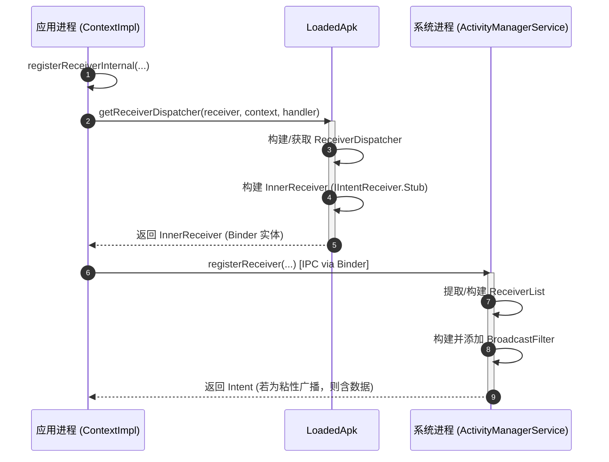
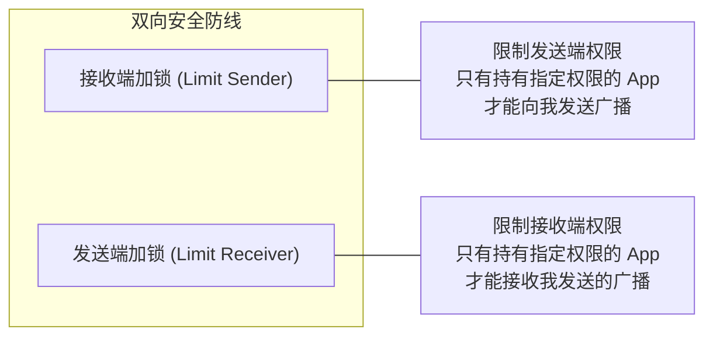

# 5.1.2.3.2 动态广播

在 Android 系统的组件设计中，广播接收器（BroadcastReceiver）作为跨组件和跨进程通信的基石，主要存在**静态注册**（Static Registration，在 `AndroidManifest.xml` 中声明）与**动态注册**（Dynamic Registration，在运行期通过代码注册）两种形态。静态注册由于其组件常驻、即使应用进程被杀也能被系统唤醒的特点，在早期被广泛应用，但也带来了沉重的功耗开销与系统碎片化隐患。

动态广播接收器（Dynamic BroadcastReceiver）则不同，它的生命周期完全由运行时的代码逻辑控制，能够极佳地适配应用的即时订阅需求。然而，动态注册的灵活性也极易成为内存泄漏与安全缺陷的重灾区。如果在不恰当的生命周期中进行注册，或者在宿主销毁时未执行对应的反注册（Unregister），便会在 Android 系统的 Binder 跨进程引用体系中引发不可逆的物理内存泄漏。此外，隐式动态广播在跨进程场景下的“裸奔”，也使得应用容易遭受组件越权与敏感数据泄露的安全攻击。

为了解决这些痛点，Android 在系统演进中逐步收紧了相关机制。从 Android 13 引入安全导出标志推荐，到 Android 14（API 34）强限制导出属性的安全变革，Android 逐步构筑起一道严密的动态广播安全与生命周期防御防线。本文将从底层 Framework 源码级实现、Binder 持有关系拓扑、生命周期对优化、安全导出标志变革以及跨进程权限加锁五个维度，深度解密动态广播接收器的底层机制与开发规范。

---

## 一、 动态注册的物理模型与注册流分析

动态广播的注册并非简单的本地回调绑定，而是一个涉及应用进程与系统服务进程（SystemServer）跨进程交互（IPC）的复杂过程。

### 1.1 动态注册的核心入口与执行流剖析

动态注册的入口通常是 `Context.registerReceiver(BroadcastReceiver receiver, IntentFilter filter)`，而其真正的工作是在应用进程的 `ContextImpl` 中完成的。以下是动态广播注册的完整调用链和底层实体交互关系：



#### 1. 应用进程的预处理与包装
当开发者调用 `registerReceiver()` 时，调用会重定向到 `ContextImpl.registerReceiverInternal()` 方法中。由于系统的广播分发发生在 `system_server` 进程中的 `ActivityManagerService`（简称 AMS），而应用侧传入的 `BroadcastReceiver` 只是一个普通的 Java 实例，并不具备 Binder 跨进程通信的能力。
因此，Android 设计了 `IIntentReceiver` 这一 AIDL 接口作为中介。`ContextImpl` 会调用 `LoadedApk.getReceiverDispatcher()` 方法来获取或创建一个 `LoadedApk.ReceiverDispatcher` 对象。

#### 2. ReceiverDispatcher 的构建与 Binder 实体的产生
`LoadedApk` 是应用进程中用于描述加载的 APK 信息的实体，它内部维护着当前应用的所有运行时组件映射表。在 `LoadedApk` 内部，定义了广播接收器的二级分发结构：
```java
// LoadedApk.java 核心成员变量
private final ArrayMap<Context, ArrayMap<BroadcastReceiver, LoadedApk.ReceiverDispatcher>> mReceivers = new ArrayMap<>();
```
- `ReceiverDispatcher` 持有真实 `BroadcastReceiver` 的引用以及分发广播时所使用的 `Handler`（用于保证 `onReceive` 回调在指定的线程，默认是应用主线程中执行）。
- `ReceiverDispatcher` 内部包含一个内部类 `InnerReceiver`，它继承自 `IIntentReceiver.Stub`。这个 `InnerReceiver` 才是真正暴露给系统进程的 Binder 本地对象（Binder 实体）。

#### 3. 跨进程调用 AMS 注册
拿到 `InnerReceiver` 后，`ContextImpl` 会通过 `ActivityManager.getService().registerReceiver()` 触发 Binder 调用，将该 `InnerReceiver` 代理对象、`IntentFilter` 以及标志位等参数传递给系统进程中的 AMS。

#### 4. AMS 内部的管理与注册
AMS 收到注册请求后，在其所在的 `system_server` 进程中执行以下操作：
- 将传入的 `IIntentReceiver` 代理对象包装为 `ReceiverList`（它是一个 Binder 死亡通知的监听者，也是存储相同接收器注册的不同 IntentFilter 的容器）。
- 将 `ReceiverList` 挂载到 AMS 的全局广播解析器 `mRegisteredReceivers`（类型为 `IntentResolver`）中。
- 当有符合条件的广播发送时，AMS 会通过该 `IIntentReceiver` 的 Binder 代理，反向跨进程回调应用进程中的 `InnerReceiver`。

---

### 1.2 宿主进程的优先级瞬时提权机制

动态广播与静态广播的一大差异在于：动态广播的生命周期与宿主组件（如 Activity、Service）完全绑定，它无法在应用进程不存在时自动唤醒进程。但是，对于处于运行状态的进程，系统在分发广播时会对其进行**瞬时提权**，以确保广播能够被完整执行。

在 Android 系统的进程管理维度，AMS 通过 `OOM Adjuster`（简称 oom_adj）动态计算进程优先级。当一个广播被发送并开始派发给某个处于后台的应用进程中的动态接收器时，系统提权机制会按如下逻辑运行：

- **提权生效期**：从 AMS 开始派发广播给该进程起，至该接收器的 `onReceive()` 执行完毕并向 AMS 发送“分发完成”的确认信号为止。
- **提权幅度**：AMS 会在这段时效内，将该应用进程的 `oom_adj` 瞬时调整为 `FOREGROUND_APP_ADJ`（前台进程级别，通常为 0）。这意味着即使此进程原本处于后台缓存状态（如 `oom_adj` 为 900+），在执行广播的瞬间，它将获得与前台交互应用同等的重要级别，从而极大地降低被系统 Low Memory Killer（LMK）杀死的概率。
- **时效性约束**：前台广播的提权限制为 10 秒，后台广播限制为 60 秒。若 `onReceive()` 在此时限内未执行完，将触发 ANR（Application Not Responding）。
- **提权局限性（常见误区）**：提权仅在 `onReceive()` 的同步执行期间有效。如果开发者在 `onReceive()` 中启动了异步线程或协程处理耗时逻辑，而同步方法立刻返回，AMS 随即认为广播分发已完成，瞬间将其 `oom_adj` 恢复为原后台值。此时，该进程面临随时被 LMK 清理的风险，导致异步任务夭折。

---

## 二、 动态广播内存泄漏的底层原理与拓扑结构

内存泄漏（Memory Leak）是动态广播最常见的开发缺陷，其本质是由 Binder 跨进程对象的生命周期管理失控所引起的。

### 2.1 为什么未反注册会造成内存泄漏？

在普通的 Java 虚拟机中，当一个对象不再被本地强引用持有，它就会在 GC 时被回收。但是在 Android 动态广播的语境下，因为引入了 Binder 跨进程引用，生命周期判定逻辑发生了根本变化。

1. **AMS 与 SystemServer 的强引用控制**：
   当应用注册动态广播且未调用 `unregisterReceiver()` 时，AMS 端的 `mRegisteredReceivers` 强引用持有 `ReceiverList`，而 `ReceiverList` 内部以强引用方式持有 `IIntentReceiver`（即应用侧 `InnerReceiver`）的跨进程代理。
2. **Binder 驱动的垃圾回收保护**：
   在 Binder 通信机制中，只要远程的代理对象（AMS 端的 Proxy）依然存在，Binder 驱动就会在底层的引用计数表中保证本地服务实体对象（应用进程中的 `InnerReceiver` Stub）不被销毁。
3. **应用侧持有链的物理闭环**：
   `InnerReceiver` 是 `ReceiverDispatcher` 的非静态内部类，它天然持有对 `ReceiverDispatcher` 实例的隐式强引用。而 `ReceiverDispatcher` 内部又强引用持有着两样关键对象：
   - 注册广播时传入的宿主 `Context`（例如 Activity 实例）。
   - 我们的 `BroadcastReceiver` 实例。
4. **内存锁死**：
   即使 Activity 执行了 `onDestroy()`，界面已从屏幕消失，但由于 `system_server` 中的 AMS 仍然强引用持有这个 `InnerReceiver` 代理，导致应用进程里的 `InnerReceiver` 无法被 GC，从而连带导致 `ReceiverDispatcher`、`BroadcastReceiver` 以及 **整个 Activity 实例** 永远驻留在物理内存中。这就是未反注册引起内存泄漏的 Framework 底层逻辑。

---

### 2.2 内存泄漏持有拓扑图

以下引用持有拓扑图清晰地刻画了未解注册时，各进程与实体之间的强引用链路：

```mermaid
graph TD
    subgraph System Server Process (system_server)
        AMS["ActivityManagerService (AMS)"]
        mRegisteredReceivers["mRegisteredReceivers (IntentResolver)"]
        ReceiverList["ReceiverList (Active Binder Stub Proxy)"]
        
        AMS --> mRegisteredReceivers
        mRegisteredReceivers --> ReceiverList
    end

    subgraph Binder Driver (Kernel Space)
        BinderProxy["Binder IPC Bridge (References Keep Alive)"]
        ReceiverList -- "Strong Ref to Proxy" --> BinderProxy
    end

    subgraph Application Process (App)
        InnerReceiver["LoadedApk.ReceiverDispatcher.InnerReceiver (IIntentReceiver.Stub)"]
        ReceiverDispatcher["LoadedApk.ReceiverDispatcher"]
        BroadcastReceiver["Your BroadcastReceiver (OnReceive handler)"]
        HostContext["Host Context (Activity/Service Instance)"]
        LoadedApk["LoadedApk (mReceivers map)"]

        BinderProxy -- "Strong IPC Binding" --> InnerReceiver
        InnerReceiver -- "Outer Class Ref (Strong)" --> ReceiverDispatcher
        ReceiverDispatcher -- "mReceiver (Strong Ref)" --> BroadcastReceiver
        ReceiverDispatcher -- "mContext (Strong Ref)" --> HostContext
        LoadedApk -- "Strong Key & Value Ref" --> HostContext
        LoadedApk -- "Holds" --> ReceiverDispatcher
        HostContext -- "View Hierarchy/Bitmaps (Large Memory)" --> UIResources["ViewTree & Bitmap Cache"]
    end

    style HostContext fill:#ff9999,stroke:#333,stroke-width:2px;
    style UIResources fill:#ffcccc,stroke:#333,stroke-width:1px;
    style ReceiverList fill:#ffff99,stroke:#333,stroke-width:1px;
```

从拓扑图可以直观看到，`HostContext`（即 Activity/Service 实例）被两条强引用链牢牢锁死：
1. **本地侧**：`LoadedApk` 的 `mReceivers` 强引用了 `Context` 作为 Key，也强引用了 `ReceiverDispatcher` 作为 Value。
2. **系统侧**：`AMS` -> `ReceiverList` -> `Binder 驱动` -> `InnerReceiver` -> `ReceiverDispatcher` -> `Context`。

这两条链只要有一条不断开，JVM 便绝对无法回收 `HostContext` 及其关联的庞大 UI 资源。

---

## 三、 注册与解注册生命周期对的合理抉择

为了避免内存泄漏，开发者必须在组件的生命周期内，成对地执行注册与反注册逻辑。

### 3.1 经典生命周期对的考量与适用场景

根据业务对广播接收时效性、前台可见性以及系统功耗的差异，推荐在以下三类生命周期对中进行对称性选择：

#### 1. onCreate() / onDestroy() —— 实例级长生命周期
- **注册时机**：在组件（Activity 或 Service）实例化完成的 `onCreate()` 中进行。
- **解注册时机**：在组件彻底销毁的 `onDestroy()` 中进行。
- **适用场景**：适合需要贯穿整个实例存活期的广播，例如监控全局后台长连接状态、接收其他组件发送的局部总线事件。
- **功耗影响**：较高。因为即使 Activity 此时退入后台、不可见，它依然会响应并执行广播里的业务逻辑，可能产生不必要的 CPU 与内存消耗。

#### 2. onStart() / onStop() —— 可见性级生命周期（推荐用于 UI 组件）
- **注册时机**：在组件可见时的 `onStart()` 中进行。
- **解注册时机**：在组件退入后台、不可见时的 `onStop()` 中进行。
- **适用场景**：适合那些仅在界面可见时才需要刷新 UI 的广播。例如：系统电量监测、Wi-Fi 状态图标切换、用户个人信息变动的即时刷新。
- **功耗影响**：中等。当 Activity 处于后台时，广播接收器已解注册，不再响应广播，能极佳地节约后台执行功耗。

#### 3. onResume() / onPause() —— 焦点级短生命周期
- **注册时机**：在组件获取交互焦点时的 `onResume()` 中进行。
- **解注册时机**：在组件失去焦点、即将被遮挡或暂停交互的 `onPause()` 中进行。
- **适用场景**：适合与前台强交互绑定的广播。例如：前台相机拍摄状态监听、独占式传感器数据监听、需要高频响应但绝不能在后台运行的临时状态监听。
- **功耗影响**：最低。但由于这两个回调在页面跳转、权限申请弹窗出现时会频繁触发，如果高频执行注册/解注册，可能会带来额外的 Binder 交互开销。

---

### 3.2 重复解注册导致的异常及安全防御

在复杂的应用架构或组件生命周期错综交织的业务场景中，极易出现对同一个接收器重复调用 `unregisterReceiver()`，或在组件未注册时误调了解注册。此时系统会抛出如下崩溃：
`java.lang.IllegalArgumentException: Receiver not registered: ...`

为保证线上业务的稳定性，建议采取以下两类防御性手段：

#### 方式一：Try-Catch 保护性包裹机制
这是最直接的防御手段，能确保不论何种状态，反注册操作均不会导致应用崩溃。
```java
public void safeUnregister(Context context) {
    if (context == null || myReceiver == null) return;
    try {
        context.unregisterReceiver(myReceiver);
    } catch (IllegalArgumentException e) {
        // 捕获异常，仅输出 Warning 日志，阻止进程崩溃
        Log.w(TAG, "Receiver was not registered or has been already unregistered", e);
    }
}
```

#### 方式二：状态标志位判定防重设计
引入状态标志位可以从逻辑控制上保证注册与反注册的对称性和幂等性，这也是大型工程实践中的标准做法。
```java
public class MyActivity extends AppCompatActivity {
    private MyBroadcastReceiver mReceiver;
    private boolean mIsReceiverRegistered = false;

    @Override
    protected void onStart() {
        super.onStart();
        registerMyReceiver();
    }

    @Override
    protected void onStop() {
        super.onStop();
        unregisterMyReceiver();
    }

    private void registerMyReceiver() {
        if (!mIsReceiverRegistered) {
            IntentFilter filter = new IntentFilter(Intent.ACTION_BATTERY_CHANGED);
            // 注册广播
            registerReceiver(mReceiver, filter);
            mIsReceiverRegistered = true;
        }
    }

    private void unregisterMyReceiver() {
        if (mIsReceiverRegistered) {
            try {
                unregisterReceiver(mReceiver);
            } catch (IllegalArgumentException e) {
                Log.e(TAG, "Failed to unregister receiver", e);
            } finally {
                // 确保在任何情况下标志位都会被置为 false
                mIsReceiverRegistered = false;
            }
        }
    }
}
```

---

## 四、 Android 14 强制限时导出标志大变革

随着 Android 系统对应用隐私和边界安全要求的逐年提高，动态广播的公开性规则在 Android 14 中迎来了一次颠覆性的收紧。相关版本演进的全局设计收紧，可参照根目录的 [AndroidVersionChangeLog.md](../../../../../../AndroidVersionChangeLog.md) 章节。

### 4.1 安全背景与设计初衷

在 Android 13 之前，动态注册的广播接收器在默认情况下是对外暴露（Exported）的。这意味着任何其他应用（甚至是沙盒外的恶意程序）只要知道该广播接收器的隐式 Action，就可以直接向应用发送伪造的广播。这带来了极其危险的安全隐患：
- **恶意指令注入**：攻击者通过发送伪造的“业务状态同步完成”、“用户注销”等广播，诱导宿主应用执行敏感的后台代码逻辑。
- **敏感数据嗅探**：如果应用发送动态广播时未指定权限锁，且接收器暴露，第三方应用即可轻松监听并窃取 Intent 中附带的账户、状态等敏感信息。

---

### 4.2 导出标志的强制适配规范

从 **Android 14（API 34）** 开始，如果应用靶向 `targetSdkVersion >= 34`，在通过代码动态注册广播接收器时，**必须显式声明其导出状态**。

开发者在调用 `registerReceiver()` 时，必须显式传递以下两个标志位之一作为 `flags` 参数：

1. **`Context.RECEIVER_EXPORTED`**：
   允许外部其他应用向该广播接收器发送广播。适用于需要接收系统外其他应用分发的数据或通知的场景。
2. **`Context.RECEIVER_NOT_EXPORTED`**：
   只允许当前应用自身或具有相同签名的应用（家族式应用）发送广播。极大增强了应用内部动态广播的防篡改安全性。

#### 违规崩溃机制
若靶向 API 34 的应用在调用 `registerReceiver()` 时未传入上述标志位之一，且 `IntentFilter` 中声明了非系统的自定义广播 Action，系统会在运行期直接抛出 **`java.lang.SecurityException`** 导致应用直接崩溃：
```
java.lang.SecurityException: com.example.app: One of RECEIVER_EXPORTED or 
RECEIVER_NOT_EXPORTED should be specified when a receiver isn't being 
registered for system broadcasts
```

#### 适配代码示例
```java
// 1. 应用内通信的私有动态广播（安全隔离）
if (Build.VERSION.SDK_INT >= Build.VERSION_CODES.TIRAMISU) { // API 33 开始引入此标志
    context.registerReceiver(myLocalReceiver, filter, Context.RECEIVER_NOT_EXPORTED);
} else {
    // 兼容 API 33 以下版本
    context.registerReceiver(myLocalReceiver, filter);
}

// 2. 跨应用通信的公开动态广播
if (Build.VERSION.SDK_INT >= Build.VERSION_CODES.TIRAMISU) {
    context.registerReceiver(myPublicReceiver, filter, Context.RECEIVER_EXPORTED);
} else {
    context.registerReceiver(myPublicReceiver, filter);
}
```

---

### 4.3 豁免机制与特例

在此项安全变更中，Android 官方定义了一个明确的**豁免规则**：
- **纯系统广播豁免**：
  如果你的动态广播接收器所持有的 `IntentFilter` 中，**仅仅**包含了系统广播 Action（例如 `Intent.ACTION_SCREEN_ON`、`Intent.ACTION_BOOT_COMPLETED` 等由系统 Framework 发出的保护性广播），那么在注册时**不需要**显式传入导出标志，且不会触发 `SecurityException`。
  *原理*：系统广播由于受到底层的强签名与发送方校验保护，普通第三方应用在尝试通过 `sendBroadcast()` 发送此类 Action 时，AMS 会直接予以拦截，因此这类接收器本身不会受到注入攻击的威胁。
- **最佳安全建议**：
  虽然有此豁免，但在开发实践中，依然推荐对**所有**动态广播接收器均显式传递对应的导出标志（对系统广播推荐传入 `RECEIVER_NOT_EXPORTED`），以保持全局代码规范，防止后续追加自定义 Action 时引发意外崩溃。

---

## 五、 跨进程动态广播的权限安全防御

当动态广播接收器因业务需要必须对外公开（声明为 `RECEIVER_EXPORTED`）时，为防止数据外泄与恶意指令注入，必须构建基于**广播权限（Broadcast Permissions）**的双向防线。



### 5.1 接收端加锁：限制发送端权限

如果我们的应用需要注册一个公开的动态广播接收器，但只想接收来自“已授权第三方应用”的广播，应当在注册时为其加锁。

- **核心 API**：
  ```java
  public abstract Intent registerReceiver(
      BroadcastReceiver receiver,
      IntentFilter filter,
      String broadcastPermission, // 限制发送端必须持有的权限
      Handler scheduler,
      int flags
  );
  ```
- **使用示例**：
  ```java
  String permission = "com.example.permission.SEND_SECURE_DATA";
  context.registerReceiver(
      myReceiver, 
      filter, 
      permission, // 发送者必须在 Manifest 中 uses-permission 声明此权限
      null, 
      Context.RECEIVER_EXPORTED
  );
  ```
- **安全校验机制**：
  当第三方应用 B调用 `sendBroadcast(intent)` 时，系统 AMS 会校验应用 B 的安装包是否申请并获得了 `com.example.permission.SEND_SECURE_DATA` 权限。若校验未通过，AMS 会直接将广播丢弃，从而保护接收端不被篡改或污染。

---

### 5.2 发送端加锁：限制接收端权限

当我们的应用需要向外部发送包含敏感数据的广播时，必须对发送端进行加锁，限制只有授权的应用接收器才能接收。

- **核心 API**：
  ```java
  public abstract void sendBroadcast(
      Intent intent,
      String receiverPermission // 限制接收端必须持有的权限
  );
  ```
- **使用示例**：
  ```java
  Intent intent = new Intent("com.example.action.DATA_DISPATCH");
  intent.putExtra("token", sensitiveToken);
  String permission = "com.example.permission.RECEIVE_SECURE_DATA";
  // 发送广播，限制接收方必须声明并持有相应权限
  context.sendBroadcast(intent, permission);
  ```
- **安全校验机制**：
  AMS 在检索与 `"com.example.action.DATA_DISPATCH"` 匹配的广播接收器时，会逐一检验对应的宿主应用是否拥有 `com.example.permission.RECEIVE_SECURE_DATA` 权限。不持有的应用将无法在 `onReceive()` 中捕获此 Intent，彻底切断了中间人嗅探和数据泄露的渠道。

---

### 5.3 广播权限防御的最佳安全实践

1. **将自定义权限保护级别设为 `signature`**：
   在应用的 `AndroidManifest.xml` 中声明自定义权限时，务必将 `protectionLevel` 设为 `signature`（签名验证）：
   ```xml
   <permission 
       android:name="com.example.permission.RECEIVE_SECURE_DATA"
       android:protectionLevel="signature" />
   ```
   如此一来，只有使用了相同数字签名证书（同开发者账号）打包的 App 才能被系统自动授予此权限，构建起牢固的家族式 App 通信隔离壁垒。
2. **拒绝使用隐式广播传输敏感数据**：
   除非有极明确的跨进程多应用共享场景，否则在应用内部进行组件通信时，应首选 **LocalBroadcastManager**（完全在进程内分发，无需 IPC，无越权风险且效率极高。注：其已在 Android Jetpack 中不被推荐，更现代的方案应选择 Kotlin 协程的 `SharedFlow` 或 `StateFlow`），或者使用 **显式 Intent（Explicit Intent）** 发送进程内广播。
3. **AppOps 审计配合**：
   对于跨进程动态通信，系统除了在分发时静态校验 Manifest 声明的权限，在运行态还会依赖 `AppOpsService` 对进程的调用行为进行监控审计，从而形成多维度的安全防御纵深。
